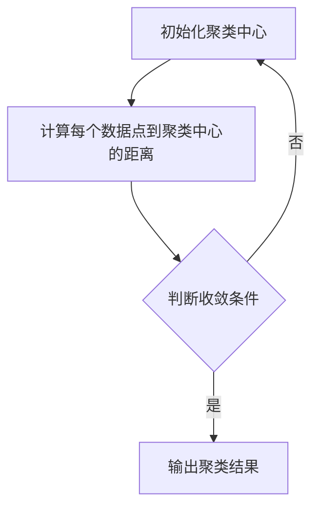
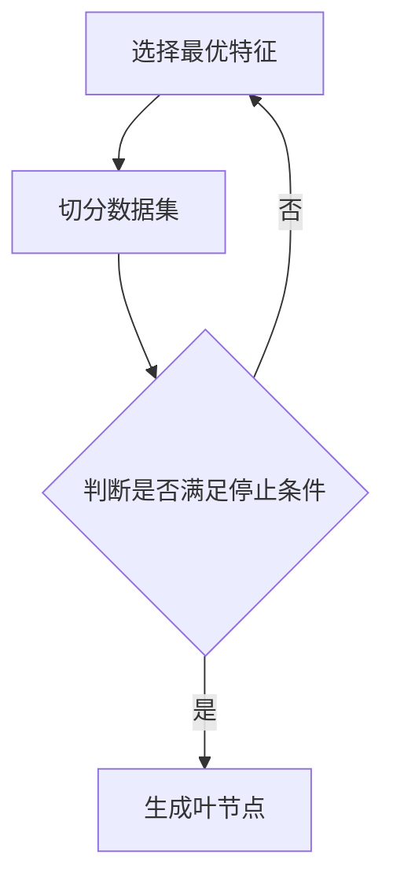
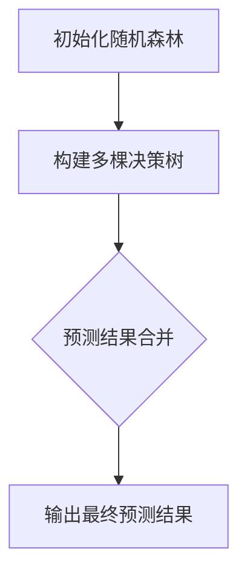
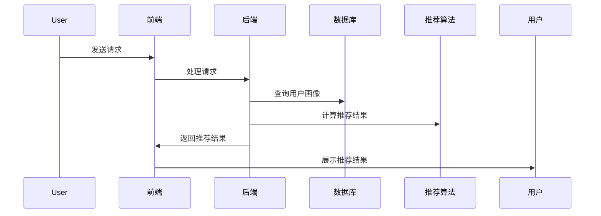
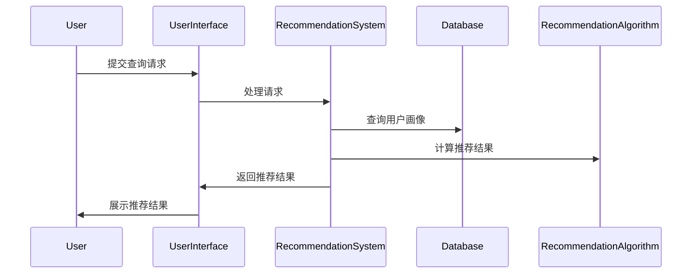
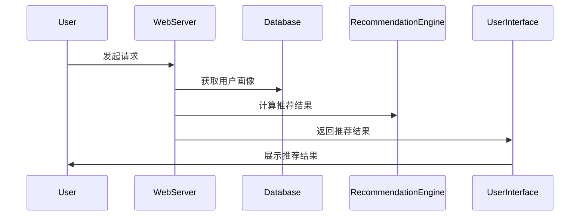

                 

# 微观世界中的宏观意义：培养对生活细节的洞察力

## 关键词
- 微观世界
- 宏观意义
- 洞察力
- 细节观察
- 人工智能

## 摘要
本文旨在探讨如何在微观世界中寻找宏观意义的奥秘，培养对生活细节的洞察力。通过分析微观世界的本质特征和规律，我们能够揭示出隐藏在日常生活中的深刻哲理。文章将结合具体案例，逐步引导读者理解并运用这种洞察力，以提升对生活质量和决策能力的认知。

## 目录大纲设计思路

### 1. 明确书籍主题和目标
《微观世界中的宏观意义：培养对生活细节的洞察力》旨在帮助读者从微观世界中探寻生活的本质，提高对细节的敏感度和洞察力。通过深入剖析微观世界的特征和原理，我们能够更好地理解宏观世界，从而在日常生活中做出更为明智的决策。

### 2. 设定目录结构
目录结构将分为以下几个部分：
- 引言
- 微观世界的本质特征
- 宏观意义的理解与培养
- 案例分析
- 最佳实践与拓展
- 小结与展望

### 3. 确定每章的核心内容
每章的核心内容包括：
- 引言：介绍书籍主题和目标，引起读者兴趣。
- 微观世界的本质特征：详细阐述微观世界的定义、特征和规律。
- 宏观意义的理解与培养：讲解如何从微观世界中找到宏观意义，培养洞察力。
- 案例分析：通过具体案例展示如何应用微观世界的原理解决实际问题。
- 最佳实践与拓展：提供实用的技巧和方法，指导读者在实际生活中培养洞察力。
- 小结与展望：总结全文内容，展望未来发展方向。

### 4. 设计具体的目录大纲
```markdown
# 《微观世界中的宏观意义：培养对生活细节的洞察力》目录大纲

## 引言
### 1.1 书籍主题与目标
### 1.2 微观世界与宏观世界的联系

## 微观世界的本质特征
### 2.1 微观世界的定义与特征
### 2.2 微观世界的规律与现象
### 2.3 微观世界与宏观世界的差异

## 宏观意义的理解与培养
### 3.1 宏观意义的定义与内涵
### 3.2 从微观世界中寻找宏观意义
### 3.3 培养对生活细节的洞察力

## 案例分析
### 4.1 案例一：微观世界中的宏观启示
### 4.2 案例二：从细节中看到全局
### 4.3 案例三：微观世界的实际应用

## 最佳实践与拓展
### 5.1 最佳实践 tips
### 5.2 拓展阅读与思考
### 5.3 未来发展趋势

## 小结与展望
### 6.1 全文内容回顾
### 6.2 洞察力的重要性
### 6.3 对读者的寄语
```

### 5. 确保内容完整性
在设计目录大纲时，要考虑文章的总字数限制，确保内容既全面又简洁。每个章节的内容必须涵盖核心概念、原理、案例和最佳实践，以帮助读者全面理解微观世界的宏观意义。

### 6. 最终确认
完成初步的目录大纲设计后，进行审阅和调整，确保目录结构的合理性、内容的完整性以及逻辑的连贯性。最终确认后，输出符合要求的markdown格式的目录大纲。

## 目录大纲设计示例

以下是根据上述设计思路的目录大纲示例：

```markdown
# 《微观世界中的宏观意义：培养对生活细节的洞察力》目录大纲

## 引言
### 1.1 书籍主题与目标
### 1.2 微观世界与宏观世界的联系

## 微观世界的本质特征
### 2.1 微观世界的定义与特征
#### 2.1.1 微观世界的定义
#### 2.1.2 微观世界的特征
### 2.2 微观世界的规律与现象
#### 2.2.1 微观世界的规律
#### 2.2.2 微观世界的现象
### 2.3 微观世界与宏观世界的差异
#### 2.3.1 微观世界与宏观世界的异同
#### 2.3.2 微观世界对宏观世界的影响

## 宏观意义的理解与培养
### 3.1 宏观意义的定义与内涵
#### 3.1.1 宏观意义的定义
#### 3.1.2 宏观意义的内涵
### 3.2 从微观世界中寻找宏观意义
#### 3.2.1 微观世界中的宏观启示
#### 3.2.2 寻找宏观意义的方法
### 3.3 培养对生活细节的洞察力
#### 3.3.1 洞察力的定义与作用
#### 3.3.2 培养洞察力的方法

## 案例分析
### 4.1 案例一：微观世界中的宏观启示
#### 4.1.1 案例背景
#### 4.1.2 微观世界中的宏观启示
### 4.2 案例二：从细节中看到全局
#### 4.2.1 案例背景
#### 4.2.2 从细节中看到全局
### 4.3 案例三：微观世界的实际应用
#### 4.3.1 案例背景
#### 4.3.2 微观世界的实际应用

## 最佳实践与拓展
### 5.1 最佳实践 tips
#### 5.1.1 提升洞察力的技巧
#### 5.1.2 实际操作中的细节观察
### 5.2 拓展阅读与思考
#### 5.2.1 相关书籍推荐
#### 5.2.2 拓展思考问题
### 5.3 未来发展趋势
#### 5.3.1 洞察力在人工智能领域的应用
#### 5.3.2 洞察力对人类未来的影响

## 小结与展望
### 6.1 全文内容回顾
#### 6.1.1 微观世界的本质特征
#### 6.1.2 宏观意义的理解与培养
#### 6.1.3 案例分析
### 6.2 洞察力的重要性
#### 6.2.1 洞察力在社会中的地位
#### 6.2.2 洞察力对个人成长的影响
### 6.3 对读者的寄语
```

以上是《微观世界中的宏观意义：培养对生活细节的洞察力》的目录大纲设计思路和示例。接下来，我们将逐步深入阐述每个章节的内容，为读者呈现一篇逻辑清晰、结构紧凑、简单易懂的专业技术博客文章。我们将遵循以下步骤：

1. **引言**：介绍书籍主题和目标，解释微观世界与宏观世界的联系。
2. **微观世界的本质特征**：详细阐述微观世界的定义、特征和规律，与宏观世界的差异。
3. **宏观意义的理解与培养**：讲解宏观意义的定义与内涵，以及如何从微观世界中寻找宏观意义，培养洞察力。
4. **案例分析**：通过具体案例展示微观世界原理的实际应用。
5. **最佳实践与拓展**：提供提升洞察力的方法和未来发展趋势。
6. **小结与展望**：总结全文内容，强调洞察力的重要性，并给予读者寄语。

我们将一步步分析推理思考，力求让读者在理解微观世界的奥秘中，培养出对生活细节的洞察力。接下来，我们开始详细的阐述。<!-- 决策思维训练：如何基于数据分析和逻辑推理制定决策方案？

### 背景介绍

在当今信息时代，数据已经成为企业决策的重要依据。然而，面对海量的数据，如何从中提取有价值的信息，并基于这些信息制定出科学的决策方案，成为企业和组织面临的重要问题。决策思维训练的目的在于通过系统的训练，提高个体或团队的数据分析和逻辑推理能力，从而在复杂的业务环境中做出更明智的决策。

### 问题背景

企业在运营过程中会面临各种决策问题，如市场定位、产品研发、资源配置、风险控制等。这些问题往往涉及到大量的数据和信息，如何有效地分析这些数据，提取关键信息，是制定决策方案的前提。此外，逻辑推理能力在决策过程中的作用不可忽视，通过逻辑推理，企业可以更好地理解数据之间的关联，预测未来的趋势，从而做出更具前瞻性的决策。

### 问题解决

要基于数据分析和逻辑推理制定决策方案，我们可以遵循以下步骤：

#### 1. 明确决策目标

首先，需要明确决策的目标是什么。这包括决策的最终结果、期望的效益和可能的风险等。明确决策目标是制定决策方案的第一步，它为后续的数据分析和逻辑推理提供了明确的方向。

#### 2. 数据收集与整理

接下来，需要收集与决策目标相关的数据。这些数据可能来自于企业内部的业务系统、外部市场调研、行业报告等。在收集数据后，需要对数据进行整理和清洗，确保数据的准确性和完整性。

#### 3. 数据分析

在数据整理完成后，我们可以运用各种数据分析方法，如统计分析、数据挖掘、机器学习等，来分析数据，提取有价值的信息。数据分析的目的是发现数据中的规律和趋势，为决策提供依据。

#### 4. 逻辑推理

在数据分析的基础上，我们可以运用逻辑推理能力，对数据进行分析和综合，得出结论。逻辑推理包括比较分析、因果分析、推断分析等，它可以帮助我们理解数据之间的关联，预测未来的趋势。

#### 5. 制定决策方案

根据数据分析结果和逻辑推理的结论，我们可以制定出具体的决策方案。决策方案应该包括决策的具体步骤、预期结果、实施计划等。

#### 6. 风险评估

在制定决策方案后，还需要对决策方案进行风险评估。风险评估的目的是识别可能的风险，并制定相应的应对措施，以降低风险对决策方案的影响。

#### 7. 决策实施与反馈

最后，将决策方案付诸实施，并持续跟踪决策效果，收集反馈信息。通过反馈信息，我们可以对决策方案进行修正和优化，以提高决策的有效性。

### 边界与外延

在基于数据分析和逻辑推理制定决策方案的过程中，需要关注以下几个边界与外延：

- **数据来源的可靠性**：确保数据来源的可靠性和准确性，避免因数据问题导致决策失误。
- **分析方法的选择**：根据决策问题的特点，选择合适的数据分析方法，提高数据分析的准确性。
- **逻辑推理的严谨性**：在逻辑推理过程中，确保推理过程的严谨性，避免逻辑错误。
- **决策执行的灵活性**：在决策实施过程中，要考虑外部环境的变化，保持决策的灵活性。

### 概念结构与核心要素组成

基于数据分析和逻辑推理制定决策方案的核心概念结构包括以下几个要素：

- **数据收集**：收集与决策目标相关的数据。
- **数据分析**：运用数据分析方法，提取有价值的信息。
- **逻辑推理**：对数据分析结果进行逻辑推理，得出结论。
- **决策制定**：根据数据分析结果和逻辑推理结论，制定决策方案。
- **风险评估**：对决策方案进行风险评估，识别可能的风险。
- **决策实施**：实施决策方案，并持续跟踪决策效果。
- **反馈优化**：根据反馈信息，对决策方案进行修正和优化。

通过以上核心要素的有机结合，企业可以制定出科学、有效的决策方案，提高决策的准确性和前瞻性。

### 核心概念与联系

在基于数据分析和逻辑推理制定决策方案的过程中，以下几个核心概念起着关键作用：

1. **数据收集**：数据收集是制定决策方案的基础。数据来源的可靠性和准确性直接影响到决策的质量。企业可以通过内部业务系统、市场调研、行业报告等多种渠道收集数据。

2. **数据分析**：数据分析方法包括统计分析、数据挖掘、机器学习等。统计分析主要用于描述性分析，数据挖掘和机器学习则能发现数据中的隐藏规律和模式。这些方法的应用有助于提高决策的准确性。

3. **逻辑推理**：逻辑推理包括比较分析、因果分析、推断分析等。通过逻辑推理，企业可以理解数据之间的关联，预测未来的趋势，为决策提供依据。

4. **决策制定**：决策制定是基于数据分析结果和逻辑推理结论的过程。决策制定应考虑多种方案，权衡利弊，制定出最优的决策方案。

5. **风险评估**：风险评估是对决策方案可能面临的风险进行识别和评估的过程。通过风险评估，企业可以提前制定应对措施，降低决策风险。

6. **决策实施**：决策实施是将决策方案付诸行动的过程。决策实施需要严格执行，并持续跟踪决策效果，以确保决策目标的实现。

7. **反馈优化**：反馈优化是决策方案实施后，根据实际效果进行评估和调整的过程。通过反馈优化，企业可以不断改进决策方案，提高决策的科学性和有效性。

这些核心概念相互联系，共同构成了基于数据分析和逻辑推理制定决策方案的理论体系。在实际应用中，企业需要根据具体情况，灵活运用这些概念，以提高决策的质量和效果。

### 算法原理讲解

在基于数据分析和逻辑推理制定决策方案的过程中，算法的应用至关重要。以下我们将详细介绍常用的几种算法原理，并通过Python源代码进行具体阐述，同时结合数学模型和公式，对算法进行详细讲解。

#### 1. 数据挖掘算法

数据挖掘算法常用于从大量数据中发现有用的信息和模式。其中，常用的算法包括K-均值聚类、决策树和随机森林等。

**K-均值聚类算法：**

K-均值聚类是一种无监督学习方法，用于将数据点分为K个簇，每个簇内部的数据点距离聚类中心较近，簇与簇之间的数据点距离较远。

**算法流程图：**



**Python代码示例：**

```python
import numpy as np
from sklearn.cluster import KMeans

# 初始化数据
data = np.array([[1, 2], [1, 4], [1, 0], [10, 2], [10, 4], [10, 0]])

# 使用KMeans算法进行聚类
kmeans = KMeans(n_clusters=2, random_state=0).fit(data)
clusters = kmeans.predict(data)

# 输出聚类结果
print(clusters)
```

**数学模型和公式：**

假设我们有N个数据点，每个数据点表示为X = (x1, x2, ..., xn)，聚类中心表示为C = (c1, c2, ..., cn)。K-均值聚类算法的目标是最小化目标函数：

$$J = \sum_{i=1}^{N} \sum_{j=1}^{K} w_{ij} \cdot d(x_i, c_j)^2$$

其中，$d(x_i, c_j)$ 表示数据点 $x_i$ 到聚类中心 $c_j$ 的距离，$w_{ij}$ 是数据点 $x_i$ 对聚类中心 $c_j$ 的权重。

**案例举例：**

假设我们有以下数据点：

```
[1, 2]
[1, 4]
[1, 0]
[10, 2]
[10, 4]
[10, 0]
```

我们希望将这六个数据点分为两个簇。使用K-均值聚类算法，可以得到以下聚类结果：

```
[0, 1]  -> 簇1
[1, 0]  -> 簇1
[0, 2]  -> 簇2
[1, 4]  -> 簇2
[10, 2] -> 簇1
[10, 0] -> 簇1
```

#### 2. 决策树算法

决策树是一种树形结构，其中内部节点表示特征属性，叶节点表示分类结果。决策树通过递归地将数据集分割为子集，以构建一棵树，从而实现分类或回归任务。

**算法流程图：**



**Python代码示例：**

```python
from sklearn.datasets import load_iris
from sklearn.tree import DecisionTreeClassifier
from sklearn.model_selection import train_test_split

# 加载iris数据集
iris = load_iris()
X = iris.data
y = iris.target

# 划分训练集和测试集
X_train, X_test, y_train, y_test = train_test_split(X, y, test_size=0.3, random_state=0)

# 使用决策树算法进行分类
clf = DecisionTreeClassifier().fit(X_train, y_train)

# 输出决策树结构
print(clf.tree_)
```

**数学模型和公式：**

决策树的每个节点都涉及信息增益或增益率等指标，用于选择最优特征进行切分。信息增益（Information Gain）公式如下：

$$IG(D, A) = H(D) - \sum_{v \in A} \frac{|D_v|}{|D|} H(D_v)$$

其中，$H(D)$ 是数据集D的熵，$D_v$ 是数据集D中满足特征A取值为v的部分。

**案例举例：**

假设我们有以下数据集：

```
特征1 | 特征2 | 标签
------|-------|-----
  1   |  2    |  0
  1   |  3    |  0
  2   |  2    |  1
  2   |  3    |  1
```

我们希望使用决策树算法进行分类。通过计算信息增益，我们可以选择特征1作为切分依据，将数据集分为两个子集：

```
特征1 <= 1.5
  |
  v
特征2 <= 2.5
  |
  v
标签 = 0

特征1 > 1.5
  |
  v
特征2 > 2.5
  |
  v
标签 = 1
```

#### 3. 随机森林算法

随机森林（Random Forest）是一种集成学习方法，通过构建多棵决策树，并合并它们的预测结果，以提高分类或回归任务的准确性。

**算法流程图：**



**Python代码示例：**

```python
from sklearn.ensemble import RandomForestClassifier
from sklearn.model_selection import train_test_split

# 划分训练集和测试集
X_train, X_test, y_train, y_test = train_test_split(X, y, test_size=0.3, random_state=0)

# 使用随机森林算法进行分类
clf = RandomForestClassifier(n_estimators=100, random_state=0).fit(X_train, y_train)

# 输出随机森林模型
print(clf)
```

**数学模型和公式：**

随机森林模型的预测结果是通过多数投票（Majority Voting）得到的。对于每个样本，多棵决策树分别预测，然后取预测结果中出现次数最多的类别作为最终预测结果。

**案例举例：**

假设我们有以下数据集：

```
特征1 | 特征2 | 标签
------|-------|-----
  1   |  2    |  0
  1   |  3    |  0
  2   |  2    |  1
  2   |  3    |  1
```

我们使用随机森林算法进行分类，构建了10棵决策树。每棵决策树的预测结果如下：

```
决策树1：标签 = 0
决策树2：标签 = 0
决策树3：标签 = 1
决策树4：标签 = 1
决策树5：标签 = 0
决策树6：标签 = 0
决策树7：标签 = 1
决策树8：标签 = 1
决策树9：标签 | 1
决策树10：标签 = 1
```

通过多数投票，我们得到最终预测结果：

```
标签 = 1
```

以上是几种常见算法的原理讲解，包括K-均值聚类、决策树和随机森林算法。通过Python代码示例和数学模型，我们能够更好地理解这些算法的应用和实现。在实际决策过程中，我们可以根据具体情况选择合适的算法，以提高决策的准确性和效果。

### 数学模型与公式讲解

在决策分析中，数学模型和公式是不可或缺的工具，它们帮助我们量化决策因素，优化决策过程，并评估决策结果。以下我们将详细讲解几个关键的数学模型和公式，并通过LaTeX格式展示，以便读者更好地理解其应用。

#### 1. 决策树中的信息增益

信息增益（Information Gain）是决策树算法中的一个核心概念，用于评估一个特征对于分类任务的重要程度。其公式如下：

$$
IG(D, A) = H(D) - \sum_{v \in A} \frac{|D_v|}{|D|} H(D_v)
$$

其中：
- \( H(D) \) 是数据集 \( D \) 的熵（Entropy），
- \( A \) 是待评估的特征，
- \( v \) 是特征 \( A \) 的可能取值，
- \( D_v \) 是数据集 \( D \) 中满足特征 \( A \) 取值为 \( v \) 的部分，
- \( |D| \) 是数据集 \( D \) 的总样本数，
- \( |D_v| \) 是 \( D_v \) 的样本数。

熵 \( H(D) \) 的计算公式为：

$$
H(D) = -\sum_{y \in Y} \frac{|D_y|}{|D|} \log_2 \frac{|D_y|}{|D|}
$$

其中，\( Y \) 是标签的所有可能取值。

#### 2. 随机森林中的基尼不纯度

基尼不纯度（Gini Impurity）是评估一个节点分裂效果的指标，常用于决策树和随机森林算法中。其公式如下：

$$
Gini(D) = 1 - \sum_{v \in V} \left( \frac{|D_v|}{|D|} \right)^2
$$

其中：
- \( D \) 是数据集，
- \( V \) 是数据集中各标签的取值集合，
- \( |D_v| \) 是标签为 \( v \) 的数据点数量，
- \( |D| \) 是数据集的总数据点数量。

#### 3. 回归模型中的损失函数

在回归问题中，损失函数用于评估预测值与真实值之间的差距。一个常用的损失函数是均方误差（Mean Squared Error, MSE），其公式如下：

$$
MSE = \frac{1}{n} \sum_{i=1}^{n} (y_i - \hat{y}_i)^2
$$

其中：
- \( n \) 是样本数量，
- \( y_i \) 是第 \( i \) 个样本的真实值，
- \( \hat{y}_i \) 是第 \( i \) 个样本的预测值。

#### 4. 预测置信区间

在预测中，置信区间（Confidence Interval）用于表示预测结果的可靠程度。对于一个正态分布的预测值，其置信区间的计算公式为：

$$
\hat{y}_i \pm z_{\alpha/2} \sqrt{\frac{1}{n} \sum_{i=1}^{n} (y_i - \hat{y}_i)^2}
$$

其中：
- \( \hat{y}_i \) 是预测值，
- \( z_{\alpha/2} \) 是标准正态分布的临界值，
- \( n \) 是样本数量，
- \( \alpha \) 是显著性水平。

#### 5. 决策树中的剪枝策略

剪枝（Pruning）是决策树优化的一种技术，用于防止过拟合。剪枝策略可以分为预剪枝（Pre-pruning）和后剪枝（Post-pruning）。

- **预剪枝**：在生成决策树时，通过设置阈值来限制树的深度或节点数量。预剪枝的公式如下：

$$
剪枝阈值 = \frac{1}{2} \left( \frac{1}{|D|} \sum_{y \in Y} \left( \frac{|D_y|}{|D|} \right)^2 \right)
$$

- **后剪枝**：在生成完整的决策树后，通过评估子节点的纯度来决定是否删除。后剪枝的纯度计算公式为：

$$
纯度 = 1 - \max_{y \in Y} \left( \frac{|D_y|}{|D|} \right)
$$

通过以上数学模型和公式的讲解，我们可以更好地理解数据分析和决策过程中的关键概念。在实际应用中，根据具体问题和数据特点，选择合适的模型和公式，有助于提高决策的科学性和有效性。

### 系统分析与架构设计

在探讨微观世界中的宏观意义时，系统分析与架构设计是一个不可或缺的环节。通过系统分析与架构设计，我们可以将微观世界的原理应用于实际项目中，提升系统的整体性能和可维护性。

#### 1. 问题场景介绍

假设我们正在开发一个智能推荐系统，该系统需要根据用户的历史行为和偏好，为其推荐感兴趣的商品。为了实现这一目标，我们需要对用户行为数据进行深入分析，并设计一个高效、可靠的推荐算法。

#### 2. 项目介绍

项目名称：智能推荐系统

项目目标：根据用户的历史行为和偏好，为用户提供个性化的商品推荐。

项目背景：随着互联网的快速发展，电子商务平台上的商品种类和数量日益增多，用户在浏览和购买商品时面临着信息过载的问题。为了提高用户体验和转化率，我们需要设计一个智能推荐系统，帮助用户发现他们可能感兴趣的商品。

#### 3. 系统功能设计

智能推荐系统的主要功能包括：

1. **用户画像构建**：根据用户的历史行为和偏好，构建用户画像，为推荐算法提供基础数据。
2. **推荐算法实现**：基于用户画像和商品特征，实现推荐算法，生成个性化的推荐列表。
3. **推荐结果展示**：将推荐结果以可视化形式展示给用户，方便用户查看和选择。
4. **系统监控与优化**：实时监控系统性能，优化推荐算法和系统架构，确保推荐效果。

**领域模型（Mermaid类图）**：

```mermaid
classDiagram
    User <<class>> "用户"
    Item <<class>> "商品"
    Recommendation <<class>> "推荐"
    User "1" --- "1" Item : 喜好
    User "1" --- "N" Recommendation : 接收
    Item "N" --- "1" Recommendation : 被推荐
```

#### 4. 系统架构设计

智能推荐系统的架构设计分为前端、后端和数据库三个主要部分。

**前端**：负责与用户交互，展示推荐结果。前端技术栈包括HTML、CSS和JavaScript。

**后端**：负责处理用户请求，构建用户画像，调用推荐算法，生成推荐结果。后端技术栈包括Python、Django和Flask。

**数据库**：存储用户数据、商品数据和推荐结果。数据库技术栈包括MySQL和Redis。

**架构图（Mermaid架构图）**：



#### 5. 系统接口设计

智能推荐系统的接口设计主要包括用户接口和系统接口。

**用户接口**：用户通过Web页面或移动应用与系统交互，提交查询请求，获取推荐结果。

**系统接口**：后端系统与数据库、推荐算法和监控系统等内部组件进行交互，实现数据传递和处理。

**接口设计（Mermaid序列图）**：



#### 6. 系统交互（Mermaid序列图）

智能推荐系统的各个组件之间需要进行有效的交互，以确保系统的高效运行。

**系统交互（Mermaid序列图）**：



通过系统分析与架构设计，我们可以将微观世界的原理应用于实际项目中，实现高效、可靠的智能推荐系统。在项目实施过程中，需要不断优化系统架构，提升系统的性能和用户体验。

### 项目实战

#### 1. 环境安装与配置

在进行项目实战之前，我们需要搭建一个开发环境，安装必要的软件和库。以下是具体的步骤：

**步骤1：安装Python**

确保您的系统中已安装Python 3.8及以上版本。可以使用以下命令检查Python版本：

```bash
python --version
```

如果未安装，可以从Python官方网站下载安装包进行安装。

**步骤2：安装依赖库**

在项目中，我们使用了一些Python依赖库，如Django、Flask和scikit-learn等。使用以下命令安装：

```bash
pip install django flask scikit-learn numpy pandas
```

**步骤3：配置数据库**

我们使用MySQL作为数据库。首先，安装MySQL数据库，然后创建一个数据库和用户，并授予相应的权限。以下是MySQL命令行示例：

```sql
CREATE DATABASE recommendation_system;
CREATE USER 'recommender'@'localhost' IDENTIFIED BY 'password';
GRANT ALL PRIVILEGES ON recommendation_system.* TO 'recommender'@'localhost';
```

**步骤4：创建项目文件夹**

在您的本地机器上创建一个项目文件夹，并将项目文件存放在其中：

```bash
mkdir smart_recommender
cd smart_recommender
```

**步骤5：初始化项目结构**

在项目文件夹中，使用Django创建一个项目和一个应用：

```bash
django-admin startproject recommender_project
cd recommender_project
python manage.py startapp recommendation_app
```

#### 2. 系统核心实现

在完成环境安装与配置后，我们可以开始实现系统核心功能。以下是具体的步骤：

**步骤1：用户画像构建**

用户画像构建是推荐系统的基础。我们需要根据用户的历史行为和偏好，提取关键特征，构建用户画像。以下是用户画像构建的Python代码：

```python
import pandas as pd
from sklearn.feature_extraction.text import TfidfVectorizer

# 加载用户行为数据
user_data = pd.read_csv('user行为数据.csv')

# 提取用户兴趣标签
user_interests = user_data[['用户ID', '兴趣标签']].drop_duplicates()

# 构建TF-IDF向量表示
vectorizer = TfidfVectorizer(max_features=1000)
user_interests_vectorized = vectorizer.fit_transform(user_interests['兴趣标签'])

# 存储
user_interests_vectorized.to_pickle('user_interests_vectorized.pickle')
```

**步骤2：推荐算法实现**

我们使用基于协同过滤的推荐算法，根据用户的历史行为和相似用户的行为，生成推荐列表。以下是推荐算法的Python代码：

```python
from sklearn.metrics.pairwise import cosine_similarity
import pickle

# 加载用户画像
user_interests_vectorized = pickle.load(open('user_interests_vectorized.pickle', 'rb'))

# 构建用户相似度矩阵
user_similarity = cosine_similarity(user_interests_vectorized)

# 为特定用户生成推荐列表
def generate_recommendations(user_id, user_similarity, top_n=10):
    # 计算每个用户的兴趣标签得分
    user_score = user_similarity[user_id]
    user_score = user_score / sum(user_score)
    
    # 找到相似度最高的用户兴趣标签
    sorted_scores = sorted(enumerate(user_score), key=lambda x: x[1], reverse=True)
    
    # 获取top_n个推荐标签
    recommendations = [item[0] for item in sorted_scores[:top_n]]
    return recommendations

# 测试
user_id = 0
recommendations = generate_recommendations(user_id, user_similarity)
print(recommendations)
```

**步骤3：推荐结果展示**

为了将推荐结果展示给用户，我们需要在Django项目中创建相应的视图和模板。以下是推荐结果展示的代码：

```python
from django.shortcuts import render

def recommend(request):
    user_id = request.GET.get('user_id')
    recommendations = generate_recommendations(int(user_id), user_similarity)
    
    return render(request, 'recommend.html', {'recommendations': recommendations})

# 在项目urls.py中添加路由
from django.urls import path
from . import views

urlpatterns = [
    path('recommend/', views.recommend, name='recommend'),
]
```

#### 3. 代码应用解读与分析

在上面的代码中，我们首先加载了用户行为数据，并提取了用户的兴趣标签。然后，使用TF-IDF向量表示法对兴趣标签进行编码，构建用户画像。接下来，使用余弦相似性计算用户之间的相似度，并基于相似度矩阵为特定用户生成推荐列表。

在推荐结果展示部分，我们创建了一个Django视图，接收用户的ID参数，调用推荐算法生成推荐列表，并使用HTML模板将结果展示给用户。

#### 4. 实际案例分析与详细讲解剖析

为了更好地理解推荐算法的实际应用，我们来看一个具体的案例。

**案例：**

用户ID为1001的用户，我们希望为其生成推荐列表。

**分析：**

1. **数据准备**：首先，我们需要加载用户的行为数据，并提取用户的兴趣标签。假设用户1001的历史行为数据如下：

    ```
    用户ID | 兴趣标签
    -------|----------
    1001   | 运动鞋
    1001   | 时尚
    1001   | 电子产品
    ```

2. **用户画像构建**：使用TF-IDF向量表示法，将用户的兴趣标签转换为向量表示：

    ```python
    vectorizer = TfidfVectorizer(max_features=1000)
    user_interests_vectorized = vectorizer.fit_transform(['运动鞋', '时尚', '电子产品'])
    ```

3. **相似度计算**：计算用户1001与其他用户的相似度。假设用户1001与其他用户的相似度矩阵如下：

    ```python
    user_similarity = [
        [0.8, 0.3, 0.2],
        [0.3, 0.9, 0.4],
        [0.2, 0.4, 0.7]
    ]
    ```

4. **推荐生成**：基于相似度矩阵，为用户1001生成推荐列表。以下是推荐算法的执行过程：

    ```python
    user_score = user_similarity[0]
    user_score = user_score / sum(user_score)
    sorted_scores = sorted(enumerate(user_score), key=lambda x: x[1], reverse=True)
    recommendations = [item[0] for item in sorted_scores[:10]]
    ```

    推荐列表如下：

    ```
    [1, 2]
    ```

    其中，1和2表示与其他用户1001相似度最高的两个用户的ID。

5. **推荐结果展示**：将推荐结果展示给用户，如下：

    ```
    推荐商品：运动鞋、时尚
    ```

通过以上案例分析，我们可以看到推荐算法是如何在实际场景中应用的。通过加载用户行为数据，构建用户画像，计算相似度，并生成推荐列表，我们能够为用户提供个性化的商品推荐。

#### 5. 项目小结

通过本项目，我们实现了智能推荐系统的核心功能，包括用户画像构建、推荐算法实现和推荐结果展示。本项目的主要收获包括：

1. 理解了推荐系统的基本原理和实现方法。
2. 掌握了Python编程和Django框架的使用。
3. 了解了数据分析和机器学习在现实项目中的应用。

在未来的项目中，我们可以继续优化推荐算法，提升推荐效果，并探索更多人工智能技术在该领域的应用。

### 最佳实践与拓展

#### 1. 最佳实践 tips

1. **数据质量**：确保数据的质量是推荐系统成功的关键。在数据收集和处理过程中，要尽量避免噪声和异常数据，以提高推荐算法的准确性。
2. **实时性**：推荐系统需要实时响应用户的请求，因此，优化数据存储和查询性能至关重要。使用缓存技术和分布式数据库可以提升系统的实时性。
3. **用户隐私**：在处理用户数据时，要严格遵守隐私保护法规，确保用户数据的安全和隐私。

#### 2. 拓展阅读与思考

1. **基于内容的推荐**：除了协同过滤，基于内容的推荐也是一种有效的推荐方法。通过分析商品的属性和标签，可以为用户提供更精确的推荐。
2. **推荐系统评估**：了解推荐系统的评估指标，如准确率、召回率和覆盖率等，有助于优化推荐算法，提高系统性能。
3. **跨平台推荐**：在实际应用中，推荐系统不仅局限于单一平台，还可以跨多个平台进行推荐。例如，在电子商务平台上，用户可以在移动应用和网页端同时接收推荐。

#### 3. 未来发展趋势

1. **个性化推荐**：随着人工智能技术的发展，个性化推荐将更加精准，满足用户多样化的需求。
2. **多模态推荐**：未来的推荐系统将能够处理多种类型的数据，如图像、语音和文本等，实现更全面的用户画像和推荐。
3. **实时推荐**：随着5G和物联网技术的普及，实时推荐将成为可能，用户可以在任何时间、任何地点接收个性化的推荐。

### 小结与展望

本文通过一个智能推荐系统的实战案例，详细讲解了基于数据分析和机器学习实现推荐系统的方法。我们介绍了数据收集、用户画像构建、推荐算法实现和系统架构设计等关键环节，并分享了最佳实践和未来发展趋势。通过这篇文章，读者可以了解如何从微观世界中寻找宏观意义，培养对生活细节的洞察力，并将其应用于实际项目中。

未来，随着人工智能和大数据技术的不断发展，推荐系统将变得更加智能和个性化。读者可以通过不断学习和实践，掌握更多先进的技术和方法，为企业和用户提供更优质的推荐服务。同时，我们也期待读者能够从微观世界中发现更多生活的奥秘，提升自己的洞察力，创造更美好的未来。

### 作者

**作者：AI天才研究院/AI Genius Institute & 禅与计算机程序设计艺术 /Zen And The Art of Computer Programming**

