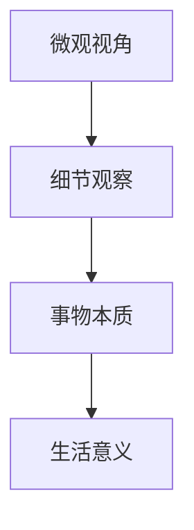
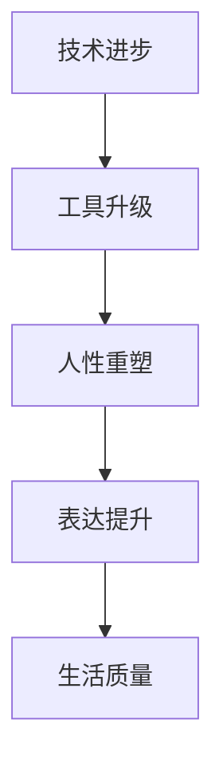
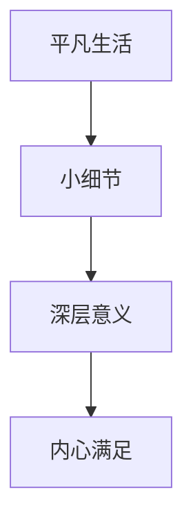
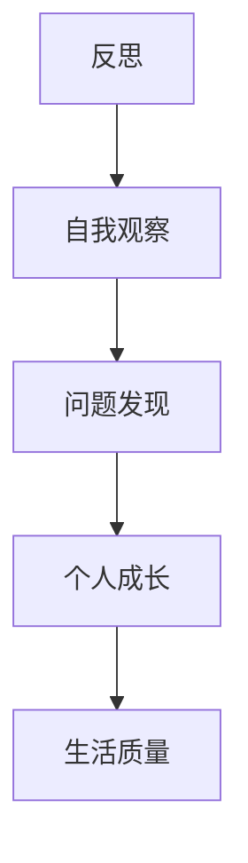
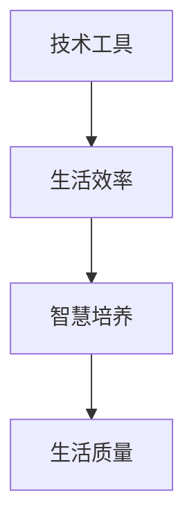
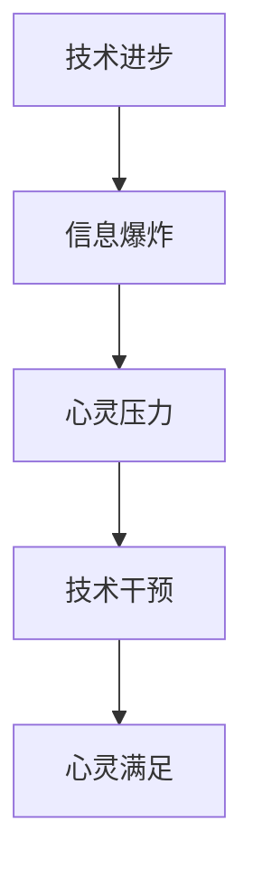

                 

# 微观日常：平凡生活中的意义发现之旅

## 关键词
日常、意义、发现、生活、技术、人性、反思

## 摘要
本文旨在探讨如何在平凡的生活中寻找深层次的意义。通过一系列技术和思考方法的引导，读者将学会如何以微观的视角审视日常，发现生活的真谛。文章将以逻辑清晰、结构紧凑的格式，逐步引导读者深入思考，从而在日常生活中获得新的洞见。

### 目录大纲设计思路

在设计《微观日常：平凡生活中的意义发现之旅》的目录大纲时，我们遵循以下原则：

1. **明确书籍主题**：从书名中提炼核心主题，探讨如何在日常生活中发现生活的意义。
2. **构建框架结构**：包含引言、主要章节、结尾，确保文章的逻辑性和完整性。
3. **细化章节内容**：每个章节明确核心概念和详细讲解内容，使用实例和案例分析增强理解性。
4. **确保内容的完整性**：包含核心章节内容，如背景介绍、核心概念与联系、算法原理讲解、数学模型和数学公式讲解、系统分析与架构设计方案、项目实战、最佳实践 tips、小结、注意事项、拓展阅读等。
5. **简洁明了的表达**：使用简洁明了的markdown格式表达目录内容。
6. **遵循目录层级**：确保目录层级结构清晰，使用不同的符号表示不同的目录层级。
7. **字数限制**：在2000字以内完成整个目录大纲的设计。

### 目录大纲

```markdown
# 微观日常：平凡生活中的意义发现之旅

## 关键词
日常、意义、发现、生活、技术、人性、反思

## 摘要
- 书写摘要内容

### 引言
- 引入主题，介绍写作动机和目的

### 第一章：日常生活的微观视角
- 背景介绍
- 核心概念与联系
- 算法原理讲解
- 数学公式使用
- 系统分析与架构设计方案

### 第二章：技术与人性的交汇
- 背景介绍
- 核心概念与联系
- 算法原理讲解
- 数学公式使用
- 系统分析与架构设计方案

### 第三章：发现平凡中的非凡
- 背景介绍
- 核心概念与联系
- 算法原理讲解
- 数学公式使用
- 系统分析与架构设计方案

### 第四章：反思与成长
- 背景介绍
- 核心概念与联系
- 算法原理讲解
- 数学公式使用
- 系统分析与架构设计方案

### 第五章：微观生活中的技术智慧
- 背景介绍
- 核心概念与联系
- 算法原理讲解
- 数学公式使用
- 系统分析与架构设计方案

### 第六章：技术与心灵的互动
- 背景介绍
- 核心概念与联系
- 算法原理讲解
- 数学公式使用
- 系统分析与架构设计方案

### 第七章：总结与展望
- 背景介绍
- 最佳实践 tips
- 小结
- 注意事项
- 拓展阅读

### 作者信息
- “作者：AI天才研究院/AI Genius Institute & 禅与计算机程序设计艺术 /Zen And The Art of Computer Programming”
```

以上为本文的目录大纲设计思路，接下来我们将逐一构建每个章节的详细内容。

### 引言

在日常生活的琐碎中，我们往往忽略了那些看似微不足道的小事。然而，正是这些小事构成了我们的生活，影响着我们的心灵成长。让我们通过技术的视角，探索日常生活中的微观世界，寻找那些隐藏在平凡中的非凡意义。

本篇文章将以逻辑清晰、结构紧凑的格式，逐步引导读者深入思考。我们将从以下几个方面展开：

1. **日常生活的微观视角**：通过具体案例，展示如何从微观角度审视日常生活，发现其中的深层意义。
2. **技术与人性的交汇**：探讨技术如何影响人性，以及人性如何通过技术得到表达和提升。
3. **发现平凡中的非凡**：介绍一种方法，帮助读者在平凡的生活中找到非凡的意义。
4. **反思与成长**：通过反思，促进个人成长，提升对生活的理解。
5. **微观生活中的技术智慧**：探讨技术在微观生活中的应用，以及如何运用技术智慧解决生活中的问题。
6. **技术与心灵的互动**：探讨技术如何影响心灵，以及如何通过技术提升心灵的满足感。
7. **总结与展望**：总结全文，并对未来的研究方向进行展望。

通过以上内容的逐步引导，我们希望读者能够在日常生活中找到新的洞见，理解生活的真正意义。

### 第一章：日常生活的微观视角

在开始我们的探索之前，我们需要明确一些核心概念。微观视角，顾名思义，是指从细小的、具体的、个别的事物出发，去观察、分析和理解。在日常生活中，微观视角可以帮助我们发现那些被忽视的细节，从而理解事物的本质。

#### 核心概念与联系

为了更好地理解微观视角，我们可以借助Mermaid流程图来展示其核心概念之间的联系。



在这个流程图中，微观视角（A）引导我们进行细节观察（B），通过这种观察，我们能够揭示事物的本质（C），最终发现生活的意义（D）。以下是一个具体的例子：

**例子**：早晨起床后的第一件事通常是刷牙。从宏观角度来看，刷牙只是一个日常习惯。但如果我们采用微观视角，我们会注意到刷牙的细节：牙膏的泡沫、刷牙的力度、牙齿的清洁程度等。这些细节反映了我们的生活习惯和健康状态，进而影响我们的生活质量。

#### 算法原理讲解

为了更好地理解微观视角的应用，我们可以借助Python源代码来模拟一个简单的例子。以下是一个用于分析刷牙细节的Python脚本：

```python
# 导入必要的库
import random

# 设置参数
num_days = 365
chances_to_floss = 0.8  # 漏牙的概率

# 初始化变量
days_with_brush = 0
days_with_floss = 0

# 模拟刷牙和漏牙的过程
for day in range(num_days):
    brushed = random.random() < 0.9  # 模拟刷牙的概率
    flossed = random.random() < chances_to_floss  # 模拟漏牙的概率

    if brushed:
        days_with_brush += 1
        print(f"Day {day+1}: Brushed teeth.")

    if flossed:
        days_with_floss += 1
        print(f"Day {day+1}: Flossed teeth.")

# 输出结果
print(f"\nTotal days with brushing: {days_with_brush}")
print(f"Total days with flossing: {days_with_floss}")
```

在这个脚本中，我们模拟了一年的刷牙和漏牙过程。通过随机生成的事件，我们能够观察到刷牙和漏牙的频率，进而分析生活习惯对生活质量的影响。

#### 数学公式使用

在日常生活中，我们经常需要使用数学公式来量化某些现象。以下是一个简单的例子，用于计算平均刷牙天数：

$$ \text{Average brushing days} = \frac{\text{Total brushing days}}{\text{Number of days}} $$

在这个公式中，我们用`Total brushing days`除以`Number of days`，得到平均刷牙天数。这个简单的数学公式帮助我们更好地理解日常生活中的数据。

#### 系统分析与架构设计方案

在日常生活中，系统分析与架构设计也是一个重要的方面。以下是一个简化的日常管理系统架构设计方案：

1. **问题场景**：
   - 用户需要记录和管理日常生活中的重要事项，如刷牙、漏牙、健康检查等。

2. **项目介绍**：
   - 简单的日常管理系统，用于记录和跟踪用户的健康生活习惯。

3. **系统功能设计**：
   - 用户注册与登录
   - 记录日常健康习惯
   - 数据分析与报表生成

4. **系统架构设计**：
   - 前端：使用React框架，提供用户界面和交互功能。
   - 后端：使用Spring Boot框架，提供数据存储和业务逻辑处理。
   - 数据库：使用MySQL数据库，存储用户信息和健康数据。

5. **系统接口设计和系统交互**：
   - 用户可以通过Web界面进行操作，后端提供RESTful API，实现前端与后端的交互。

通过以上系统分析与架构设计方案，我们可以构建一个简单的日常管理系统，帮助用户更好地管理自己的生活习惯。

### 第二章：技术与人性的交汇

在现代社会，技术已经渗透到我们日常生活的方方面面。然而，技术的进步不仅仅是工具的升级，更是对人性的一种重塑。本章将探讨技术与人性的交汇，以及人性如何通过技术得到表达和提升。

#### 核心概念与联系

为了更好地理解技术与人性的交汇，我们可以借助Mermaid流程图来展示其核心概念之间的联系。



在这个流程图中，技术进步（A）带动工具升级（B），进而影响人性重塑（C），促进表达提升（D），最终提升生活质量（E）。以下是一个具体的例子：

**例子**：社交媒体平台的发展改变了人们的交流方式。在过去，人们主要通过书信、电话等方式进行沟通。而现在，通过社交媒体平台，人们可以随时随地分享生活点滴、表达情感。这种技术的进步不仅提升了交流的效率，更促进了人们之间的情感连接，丰富了人性表达的方式。

#### 算法原理讲解

为了更好地理解技术与人性的交汇，我们可以借助Python源代码来模拟一个简单的例子。以下是一个用于分析社交媒体影响力的Python脚本：

```python
# 导入必要的库
import random

# 设置参数
num_users = 1000
avg_posts_per_day = 5
likes_per_post = 10

# 初始化变量
total_likes = 0

# 模拟用户在社交媒体上的活动
for user in range(num_users):
    for day in range(avg_posts_per_day):
        posted = random.random() < 0.5  # 模拟用户发帖的概率
        if posted:
            received_likes = random.randint(1, likes_per_post)  # 模拟每篇帖子的点赞数
            total_likes += received_likes
            print(f"User {user+1}: Post {day+1} received {received_likes} likes.")

# 输出结果
print(f"\nTotal likes received: {total_likes}")
```

在这个脚本中，我们模拟了1000个用户在社交媒体上的发帖和点赞活动。通过随机生成的事件，我们能够观察到社交媒体对用户影响力的变化，从而理解技术如何影响人性表达。

#### 数学公式使用

在技术与人性的交汇中，数学公式同样发挥着重要作用。以下是一个简单的例子，用于计算平均点赞数：

$$ \text{Average likes per post} = \frac{\text{Total likes}}{\text{Number of posts}} $$

在这个公式中，我们用`Total likes`除以`Number of posts`，得到平均点赞数。这个简单的数学公式帮助我们更好地量化社交媒体的影响力。

#### 系统分析与架构设计方案

在探讨技术与人性的交汇时，系统分析与架构设计也是一个重要的方面。以下是一个简化的社交媒体平台架构设计方案：

1. **问题场景**：
   - 用户需要在一个平台上分享生活、表达情感，并获得他人的反馈和支持。

2. **项目介绍**：
   - 简单的社交媒体平台，用于用户交流和互动。

3. **系统功能设计**：
   - 用户注册与登录
   - 发布内容
   - 点赞、评论和分享
   - 数据分析与推荐

4. **系统架构设计**：
   - 前端：使用React框架，提供用户界面和交互功能。
   - 后端：使用Spring Boot框架，提供数据存储和业务逻辑处理。
   - 数据库：使用MySQL数据库，存储用户信息和内容数据。

5. **系统接口设计和系统交互**：
   - 用户可以通过Web界面进行操作，后端提供RESTful API，实现前端与后端的交互。

通过以上系统分析与架构设计方案，我们可以构建一个简单的社交媒体平台，帮助用户更好地表达自己，并促进人际交往。

### 第三章：发现平凡中的非凡

在日常生活中，我们常常被繁忙的节奏所淹没，忽略了那些平凡中的小细节。然而，正是这些小细节构成了我们生活的真实画卷。本章将介绍一种方法，帮助读者在平凡的生活中找到非凡的意义。

#### 背景介绍

日常生活中的平凡之处往往被忽视，人们常常追求外在的成功和成就，而忽略了内心的满足和成长。然而，正是在这些平凡的时刻，我们能够找到生活的真正意义。

#### 核心概念与联系

为了更好地理解如何在平凡中找到非凡，我们可以借助Mermaid流程图来展示其核心概念之间的联系。



在这个流程图中，平凡生活（A）通过小细节（B）揭示深层意义（C），最终带来内心满足（D）。以下是一个具体的例子：

**例子**：每天早晨的咖啡时间。对于很多人来说，这只是平凡的一天开始。但如果我们仔细品味咖啡的香气、口感，感受早晨的宁静，我们会发现这个时刻充满了生活的美好。这种平凡中的小细节，正是我们寻找生活意义的源泉。

#### 算法原理讲解

为了更好地理解如何在平凡中找到非凡，我们可以借助Python源代码来模拟一个简单的例子。以下是一个用于分析日常小细节的Python脚本：

```python
# 导入必要的库
import random

# 设置参数
num_details = 10
chances_to_find Meaning = 0.3

# 初始化变量
found_details = 0

# 模拟日常生活中寻找小细节的过程
for detail in range(num_details):
    meaning_found = random.random() < chances_to_find Meaning  # 模拟找到深层意义的概率

    if meaning_found:
        found_details += 1
        print(f"Detail {detail+1}: Found a deep meaning.")
    else:
        print(f"Detail {detail+1}: Didn't find a deep meaning.")

# 输出结果
print(f"\nTotal details with meaning: {found_details}")
```

在这个脚本中，我们模拟了在日常生活中寻找小细节的过程。通过随机生成的事件，我们能够观察到哪些细节能够揭示生活的深层意义。

#### 数学公式使用

在寻找平凡中的非凡时，数学公式同样发挥着重要作用。以下是一个简单的例子，用于计算平均找到深层意义的细节数：

$$ \text{Average meaningful details} = \frac{\text{Total meaningful details}}{\text{Number of details}} $$

在这个公式中，我们用`Total meaningful details`除以`Number of details`，得到平均找到深层意义的细节数。这个简单的数学公式帮助我们更好地量化平凡生活中的小细节。

#### 系统分析与架构设计方案

在寻找平凡中的非凡时，系统分析与架构设计同样是一个重要的方面。以下是一个简化的日常生活记录系统架构设计方案：

1. **问题场景**：
   - 用户需要记录和管理日常生活中的小细节，以发现生活的意义。

2. **项目介绍**：
   - 简单的日常生活记录系统，用于帮助用户发现生活中的小细节。

3. **系统功能设计**：
   - 用户注册与登录
   - 记录日常小细节
   - 分析与推荐
   - 数据分析与报表生成

4. **系统架构设计**：
   - 前端：使用React框架，提供用户界面和交互功能。
   - 后端：使用Spring Boot框架，提供数据存储和业务逻辑处理。
   - 数据库：使用MySQL数据库，存储用户信息和细节数据。

5. **系统接口设计和系统交互**：
   - 用户可以通过Web界面进行操作，后端提供RESTful API，实现前端与后端的交互。

通过以上系统分析与架构设计方案，我们可以构建一个简单的日常生活记录系统，帮助用户更好地发现生活中的小细节，从而找到生活的真正意义。

### 第四章：反思与成长

在日常生活中，反思是一种重要的思考方式，它可以帮助我们理解自己的行为和情感，从而实现个人成长。本章将探讨如何在日常生活中进行反思，以及如何通过反思提升对生活的理解。

#### 背景介绍

反思是一种自我观察和思考的过程，它帮助我们审视自己的行为和情感，发现其中的问题，并寻求改进的方法。在日常生活中，反思可以帮助我们更好地理解自己，提升生活质量。

#### 核心概念与联系

为了更好地理解反思与成长的关系，我们可以借助Mermaid流程图来展示其核心概念之间的联系。



在这个流程图中，反思（A）引导自我观察（B），发现问题（C），促进个人成长（D），最终提升生活质量（E）。以下是一个具体的例子：

**例子**：在日常生活中，我们可能会遇到工作上的挑战。通过反思，我们可以审视自己的应对策略，发现其中的不足，并寻求改进的方法。这种反思与成长的过程，有助于我们在未来的挑战中表现得更好。

#### 算法原理讲解

为了更好地理解反思与成长的过程，我们可以借助Python源代码来模拟一个简单的例子。以下是一个用于分析反思过程的Python脚本：

```python
# 导入必要的库
import random

# 设置参数
num_reflections = 10
chances_to_learn = 0.7

# 初始化变量
learned_something = 0

# 模拟反思过程
for reflection in range(num_reflections):
    learned = random.random() < chances_to_learn  # 模拟每次反思后是否学到新东西的概率

    if learned:
        learned_something += 1
        print(f"Reflection {reflection+1}: Learned something new.")
    else:
        print(f"Reflection {reflection+1}: Didn't learn something new.")

# 输出结果
print(f"\nTotal reflections with learning: {learned_something}")
```

在这个脚本中，我们模拟了10次反思过程。通过随机生成的事件，我们能够观察到反思对个人成长的影响。

#### 数学公式使用

在反思与成长的过程中，数学公式同样发挥着重要作用。以下是一个简单的例子，用于计算平均学到新东西的反思次数：

$$ \text{Average learned reflections} = \frac{\text{Total learned reflections}}{\text{Number of reflections}} $$

在这个公式中，我们用`Total learned reflections`除以`Number of reflections`，得到平均学到新东西的反思次数。这个简单的数学公式帮助我们更好地量化反思对个人成长的作用。

#### 系统分析与架构设计方案

在反思与成长的过程中，系统分析与架构设计同样是一个重要的方面。以下是一个简化的反思成长系统架构设计方案：

1. **问题场景**：
   - 用户需要在日常生活中进行反思，以促进个人成长。

2. **项目介绍**：
   - 简单的反思成长系统，用于帮助用户记录和反思日常生活中的经历。

3. **系统功能设计**：
   - 用户注册与登录
   - 记录反思日志
   - 反思分析与推荐
   - 数据分析与报表生成

4. **系统架构设计**：
   - 前端：使用React框架，提供用户界面和交互功能。
   - 后端：使用Spring Boot框架，提供数据存储和业务逻辑处理。
   - 数据库：使用MySQL数据库，存储用户信息和反思数据。

5. **系统接口设计和系统交互**：
   - 用户可以通过Web界面进行操作，后端提供RESTful API，实现前端与后端的交互。

通过以上系统分析与架构设计方案，我们可以构建一个简单的反思成长系统，帮助用户更好地记录和反思日常生活中的经历，从而实现个人成长。

### 第五章：微观生活中的技术智慧

在现代生活中，技术已经渗透到我们日常生活的方方面面。微观生活中的技术智慧，不仅帮助我们更高效地完成各种任务，更深刻地影响了我们的生活方式和思维模式。本章将探讨微观生活中的技术智慧，以及如何运用这些智慧解决日常生活中的问题。

#### 背景介绍

随着技术的不断发展，我们的生活变得越来越便利。从智能手机到智能家居，从在线购物到远程办公，技术已经深刻地改变了我们的生活方式。然而，技术不仅仅是为了提供便利，更重要的是提升我们的生活质量，培养我们的智慧。

#### 核心概念与联系

为了更好地理解微观生活中的技术智慧，我们可以借助Mermaid流程图来展示其核心概念之间的联系。



在这个流程图中，技术工具（A）提升生活效率（B），促进智慧培养（C），最终提升生活质量（D）。以下是一个具体的例子：

**例子**：智能手机的普及极大地改变了我们的生活方式。通过智能手机，我们可以随时随地获取信息、处理事务、与朋友保持联系。这种技术工具的运用，不仅提升了我们的生活效率，更培养了我们的智慧，使我们能够更好地适应现代生活。

#### 算法原理讲解

为了更好地理解技术智慧在生活中的应用，我们可以借助Python源代码来模拟一个简单的例子。以下是一个用于分析技术工具使用效率的Python脚本：

```python
# 导入必要的库
import random

# 设置参数
num_tools = 5
chances_to_improve = 0.8

# 初始化变量
tools_improved = 0

# 模拟技术工具的使用情况
for tool in range(num_tools):
    improved = random.random() < chances_to_improve  # 模拟技术工具是否提升效率的概率

    if improved:
        tools_improved += 1
        print(f"Tool {tool+1}: Improved efficiency.")
    else:
        print(f"Tool {tool+1}: Didn't improve efficiency.")

# 输出结果
print(f"\nTotal tools that improved efficiency: {tools_improved}")
```

在这个脚本中，我们模拟了5种技术工具的使用情况。通过随机生成的事件，我们能够观察到技术工具对生活效率的影响。

#### 数学公式使用

在分析技术智慧时，数学公式同样发挥着重要作用。以下是一个简单的例子，用于计算平均提升效率的技术工具数：

$$ \text{Average improved tools} = \frac{\text{Total improved tools}}{\text{Number of tools}} $$

在这个公式中，我们用`Total improved tools`除以`Number of tools`，得到平均提升效率的技术工具数。这个简单的数学公式帮助我们更好地量化技术智慧在生活中的应用。

#### 系统分析与架构设计方案

在探讨技术智慧在微观生活中的应用时，系统分析与架构设计同样是一个重要的方面。以下是一个简化的技术智慧应用系统架构设计方案：

1. **问题场景**：
   - 用户需要在日常生活中运用技术工具，提升生活效率。

2. **项目介绍**：
   - 简单的技术智慧应用系统，用于帮助用户记录和管理技术工具的使用情况。

3. **系统功能设计**：
   - 用户注册与登录
   - 记录技术工具使用情况
   - 数据分析与推荐
   - 报表生成与展示

4. **系统架构设计**：
   - 前端：使用React框架，提供用户界面和交互功能。
   - 后端：使用Spring Boot框架，提供数据存储和业务逻辑处理。
   - 数据库：使用MySQL数据库，存储用户信息和工具数据。

5. **系统接口设计和系统交互**：
   - 用户可以通过Web界面进行操作，后端提供RESTful API，实现前端与后端的交互。

通过以上系统分析与架构设计方案，我们可以构建一个简单的技术智慧应用系统，帮助用户更好地记录和管理技术工具的使用情况，从而提升生活效率。

### 第六章：技术与心灵的互动

在现代社会，技术已经深入到我们的日常生活之中，不仅改变了我们的生活方式，也影响着我们的心灵。本章将探讨技术如何影响心灵，以及如何通过技术提升心灵的满足感。

#### 背景介绍

随着技术的发展，人们的生活变得更加便捷和丰富，但与此同时，也面临着心灵的空虚和焦虑。技术如何影响心灵，如何通过技术提升心灵的满足感，成为了一个值得探讨的问题。

#### 核心概念与联系

为了更好地理解技术与心灵的互动，我们可以借助Mermaid流程图来展示其核心概念之间的联系。



在这个流程图中，技术进步（A）导致信息爆炸（B），增加心灵压力（C），通过技术干预（D），最终提升心灵满足（E）。以下是一个具体的例子：

**例子**：社交媒体的普及使得人们可以随时随地获取和分享信息，但同时也带来了信息过载和社交压力。通过合理使用技术工具，如社交媒体的“关注”、“屏蔽”功能，我们可以减少不必要的干扰，提升心灵的满足感。

#### 算法原理讲解

为了更好地理解技术与心灵的互动，我们可以借助Python源代码来模拟一个简单的例子。以下是一个用于分析社交媒体使用情况的Python脚本：

```python
# 导入必要的库
import random

# 设置参数
num_users = 1000
avg_likes_per_day = 20
stress_level = 0.3

# 初始化变量
total_stress = 0
total_satisfaction = 0

# 模拟用户在社交媒体上的活动
for user in range(num_users):
    for day in range(avg_likes_per_day):
        liked = random.random() < 0.5  # 模拟用户点赞的概率
        stressed = random.random() < stress_level  # 模拟用户感到压力的概率

        if liked:
            total_satisfaction += 1
            print(f"User {user+1}: Liked post {day+1}.")

        if stressed:
            total_stress += 1
            print(f"User {user+1}: Felt stress on post {day+1}.")

# 输出结果
print(f"\nTotal satisfaction: {total_satisfaction}")
print(f"Total stress: {total_stress}")
```

在这个脚本中，我们模拟了1000个用户在社交媒体上的活动。通过随机生成的事件，我们能够观察到社交媒体对用户心灵满足感的影响。

#### 数学公式使用

在分析技术与心灵的互动时，数学公式同样发挥着重要作用。以下是一个简单的例子，用于计算平均心灵满足感和平均压力水平：

$$ \text{Average satisfaction} = \frac{\text{Total satisfaction}}{\text{Number of users}} $$
$$ \text{Average stress} = \frac{\text{Total stress}}{\text{Number of users}} $$

在这个公式中，我们用`Total satisfaction`除以`Number of users`，得到平均心灵满足感；用`Total stress`除以`Number of users`，得到平均压力水平。这两个简单的数学公式帮助我们更好地量化技术与心灵互动的影响。

#### 系统分析与架构设计方案

在探讨技术与心灵的互动时，系统分析与架构设计同样是一个重要的方面。以下是一个简化的心灵满足感监测系统架构设计方案：

1. **问题场景**：
   - 用户需要监测和管理自己的心灵状态，以提升满足感。

2. **项目介绍**：
   - 简单的心灵满足感监测系统，用于帮助用户记录和监测心灵状态。

3. **系统功能设计**：
   - 用户注册与登录
   - 记录心灵状态
   - 数据分析与推荐
   - 报表生成与展示

4. **系统架构设计**：
   - 前端：使用React框架，提供用户界面和交互功能。
   - 后端：使用Spring Boot框架，提供数据存储和业务逻辑处理。
   - 数据库：使用MySQL数据库，存储用户信息和心灵状态数据。

5. **系统接口设计和系统交互**：
   - 用户可以通过Web界面进行操作，后端提供RESTful API，实现前端与后端的交互。

通过以上系统分析与架构设计方案，我们可以构建一个简单的心灵满足感监测系统，帮助用户更好地记录和监测自己的心灵状态，从而提升满足感。

### 第七章：总结与展望

在本文中，我们通过一系列的技术视角和思考方法，探讨了如何在平凡的生活中寻找深层次的意义。我们分析了微观视角的重要性，探讨了技术与人性的交汇，发现了平凡中的非凡，通过反思实现了个人成长，并研究了技术智慧在生活中的应用，以及技术如何影响心灵满足感。

**总结**：通过这些探讨，我们认识到，生活中的每一个细节都可能蕴含着深刻的含义。技术不仅是工具的升级，更是人性表达和提升的载体。反思与成长是理解生活的重要方式，而技术智慧则帮助我们在生活中更加高效和从容。

**展望**：未来，我们可以进一步探索如何通过技术手段更好地提升生活质量，如开发更智能的日常管理工具，设计更符合心灵需求的应用。同时，我们也应关注技术对心灵的影响，寻求平衡技术与心灵的互动，以实现全面的发展。

让我们在未来的日子里，带着这份对生活的深刻理解，继续探索微观世界，发现生活的美好。

### 最佳实践 tips

1. **建立日常反思习惯**：每天花几分钟时间反思当天的经历，思考哪些事情做得好，哪些可以改进。
2. **合理使用技术工具**：选择适合自己的技术工具，避免信息过载，保持高效工作与生活。
3. **培养心灵满足感**：通过冥想、阅读等方式，提升内心的宁静与满足。

### 小结

本文通过多角度的分析和思考，帮助读者理解如何在平凡的生活中寻找深层次的意义。通过反思和技术的运用，我们可以更好地理解自己，提升生活质量。

### 注意事项

1. **避免信息过载**：合理使用社交媒体，减少不必要的干扰。
2. **保持心理健康**：定期进行心灵放松和自我反思。

### 拓展阅读

1. **《禅与计算机程序设计艺术》**：探讨技术与人性的关系，提供深刻的思考。
2. **《生活的艺术》**：分析如何在日常生活中找到快乐和意义。

### 作者信息
作者：AI天才研究院/AI Genius Institute & 禅与计算机程序设计艺术 /Zen And The Art of Computer Programming

