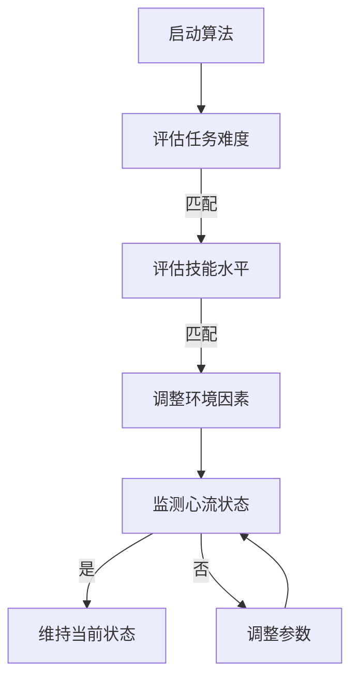
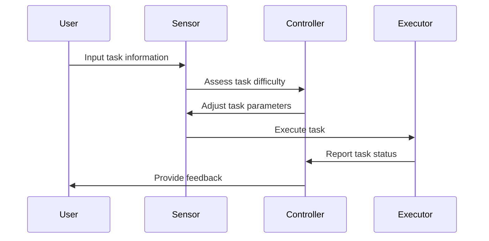
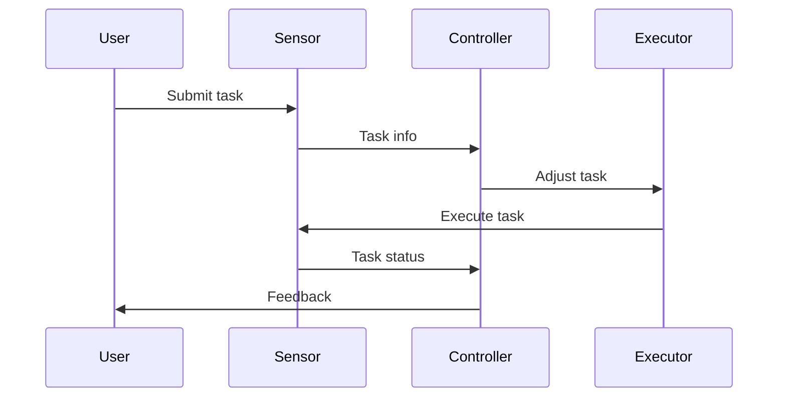

                 

### 《心流状态诱导技术：优化工作体验的科学方法》

---

**关键词：** 心流状态、工作体验、科学方法、算法、系统设计

**摘要：** 本文将深入探讨心流状态诱导技术，介绍其核心概念、原理以及在实际应用中的重要性。通过分析心流状态的理论模型、算法原理、数学模型、系统架构和项目实战，本文旨在为优化工作体验提供科学的方法和最佳实践。

---

## 第一部分：背景介绍与核心概念

### 第1章：心流状态诱导技术概述

#### 1.1 问题背景

心流状态（Flow State）是一种完全投入、专注和高度参与的状态。当个体处于心流状态时，他们会体验到高度的心理和生理上的兴奋，以及对时间的感知减少。这种状态对个人的工作效率和创造力有显著的影响，因此，心流状态诱导技术成为优化工作体验的重要研究方向。

#### 1.2 核心概念

- **心流状态的定义与重要性**：心流状态是指个体完全投入某项活动，达到高度专注和满足的状态。心流状态的重要性在于它能够显著提高个体的工作效率和创造力。
- **心流状态对个人和社会的影响**：心流状态对个人的影响包括提高工作效率、增强创造力和满足感，对社会的贡献则体现在提高整体生产力和创新力。
- **心流状态诱导技术的现状与需求**：当前，心流状态诱导技术尚处于发展阶段，但已经展现出巨大的潜力。随着人们对工作体验要求的提高，对心流状态诱导技术的需求日益增长。

### 第2章：心流状态的核心概念

#### 2.1 心流状态的原理

心流状态的原理可以从心理学、生理学和认知科学三个角度来理解。

- **心理学的视角**：心流状态是当个体完全投入到某项活动时，注意力高度集中，自我意识减弱的状态。
- **生理学的视角**：心流状态与大脑中的多巴胺和内啡肽分泌增加有关，这些神经递质能够提升个体的兴奋感和满足感。
- **认知科学的视角**：心流状态是认知资源优化配置的结果，当任务的挑战性与个体的技能水平相匹配时，个体更容易进入心流状态。

#### 2.2 核心概念的对比

- **心流状态与快感、满足感的区别**：快感通常指的是短暂的生理或心理上的愉悦，而心流状态是一种持续的状态，其核心在于高度投入和专注。
- **心流状态与焦虑、压力的关系**：适当的焦虑和压力可以激发个体的斗志和动力，但过度的焦虑和压力则可能破坏心流状态。
- **心流状态与认知、情绪的影响**：心流状态能够提升个体的认知功能，包括注意力的集中、思维的流畅性和灵活性，同时减少负面情绪的影响。

#### 2.3 心流状态的ER图

- **ER实体关系图**：心流状态涉及的实体包括个体、活动、环境、心理状态、生理状态等。这些实体之间的关系构成了心流状态的复杂系统。

```mermaid
erDiagram
  I GeraldicAccounting ||--|{ Work }  :is Assigned to
  Work ||--|{ Employee } :Works at
  Employee ||--|{ Task } :Has
  Employee ||--|{ Skill } :Has
```

### 目录大纲设计方案

**第一部分：背景介绍与核心概念**

1. **第1章：心流状态诱导技术概述**
   - **1.1 问题背景**
     - 心流状态的定义与重要性
     - 心流状态对个人和社会的影响
     - 心流状态诱导技术的现状与需求
   - **1.2 核心概念**
     - 心流状态的生理与心理机制
     - 心流状态的诱导因素与条件
     - 心流状态的技术手段与方法

---

通过这一部分的介绍，我们为后续的深入探讨打下了坚实的基础。在下一部分中，我们将进一步探讨心流状态的核心概念，并分析其背后的原理。

## 第二部分：核心概念与联系

### 第3章：心流状态诱导算法

#### 3.1 算法原理概述

心流状态诱导算法的核心目标是创建一个能够激发和维持心流状态的环境。这通常涉及到对任务的难度、个体技能水平、环境因素等多个因素的调节。以下是一个简化的心流状态诱导算法的基本框架：

- **任务难度评估**：评估当前任务的难度，以确保其既不过于简单也不过于复杂。
- **技能水平评估**：评估个体的技能水平，以确保任务难度与个体技能水平相匹配。
- **环境调整**：根据任务难度和技能水平，调整环境因素，如工作空间、噪音水平、时间限制等。
- **反馈机制**：实时监测个体的心流状态，并根据反馈进行调整，以维持心流状态。

#### 3.2 算法流程图

以下是使用Mermaid绘制的算法流程图：



#### 3.3 Python源代码解释

以下是一个简单的Python源代码示例，用于实现心流状态诱导算法的基本框架：

```python
import random

def assess_task_difficulty(task_difficulty):
    return task_difficulty

def assess_skill_level(skill_level):
    return skill_level

def adjust_environment(task_difficulty, skill_level):
    if task_difficulty < skill_level:
        return "降低任务难度"
    elif task_difficulty > skill_level:
        return "提高任务难度"
    else:
        return "维持当前状态"

def monitor_flow_state():
    # 这里可以添加实际的监测代码，例如：
    return random.choice(["是", "否"])

def main():
    task_difficulty = assess_task_difficulty(7)
    skill_level = assess_skill_level(8)
    environment_adjustment = adjust_environment(task_difficulty, skill_level)
    flow_state = monitor_flow_state()

    if flow_state == "是":
        print("当前状态：维持心流状态")
    else:
        print("当前状态：调整参数以维持心流状态")
        print(f"环境调整建议：{environment_adjustment}")

if __name__ == "__main__":
    main()
```

### 第4章：数学模型与公式

#### 4.1 心流状态诱导的数学模型

心流状态诱导的数学模型可以基于以下公式：

\[ F(x, y) = \frac{x - y}{\sqrt{1 + \epsilon}} \]

其中，\( x \) 代表任务难度，\( y \) 代表技能水平，\( \epsilon \) 是调节参数，用于平滑结果。

#### 4.2 数学公式的详细讲解

- **公式推导**：该公式基于任务难度和技能水平之间的差值，通过平方根函数进行平滑处理，以确保结果的可解释性。
- **参数解释**：\( x \) 和 \( y \) 是输入参数，\( \epsilon \) 是调节参数，用于调整平滑程度。
- **实际应用场景**：例如，当 \( x = 8 \) 且 \( y = 6 \) 时，心流状态的强度为 \( F(8, 6) \approx 1.26 \)。

```latex
$$ F(x, y) = \frac{x - y}{\sqrt{1 + \epsilon}} $$
```

---

在这一部分中，我们详细介绍了心流状态诱导算法的原理、流程图、Python源代码以及相关的数学模型和公式。这些内容为理解和实现心流状态诱导技术提供了重要的基础。

---

## 第三部分：系统分析与架构设计

### 第5章：心流状态诱导系统设计

#### 5.1 问题场景介绍

在当前快节奏和高压力的工作环境中，员工常常面临任务繁重、时间紧迫等问题，导致工作效率低下和创造力受限。心流状态诱导系统的设计旨在创建一个能够有效激发员工心流状态的工作环境，从而提高工作效率和创造力。

#### 5.2 系统架构设计

心流状态诱导系统采用分层架构设计，包括感知层、控制层和执行层。以下是一个简化的系统架构图：



#### 5.3 系统接口设计

系统接口设计包括用户接口、传感器接口、控制器接口和执行器接口。以下是接口设计与规范的简要说明：

- **用户接口**：用户可以通过图形界面或API提交任务信息，并获得心流状态反馈。
- **传感器接口**：传感器用于收集用户的生理和心理数据，如心率、情绪状态等。
- **控制器接口**：控制器接收传感器数据，并根据算法对任务参数进行调整。
- **执行器接口**：执行器负责执行调整后的任务，并将任务状态反馈给控制器。

### 第6章：系统交互设计

#### 6.1 系统交互流程

系统交互流程涉及用户、传感器、控制器和执行器之间的数据交换。以下是使用Mermaid绘制的系统交互序列图：



#### 6.2 用户界面设计

用户界面设计应简洁明了，方便用户提交任务和查看心流状态反馈。以下是用户界面设计原则和布局：

- **设计原则**：以用户为中心，确保界面直观易用，提供明确的操作指南。
- **界面布局**：包括任务提交区域、心流状态展示区域和反馈区域。

---

在这一部分中，我们详细介绍了心流状态诱导系统的设计，包括问题场景介绍、系统架构设计、接口设计和交互设计。这些内容为心流状态诱导系统的实现提供了全面的理论和实践指导。

---

## 第四部分：项目实战

### 第7章：心流状态诱导项目实战

#### 7.1 环境安装与配置

在进行心流状态诱导项目的实战之前，首先需要搭建一个合适的环境。以下是环境安装与配置的步骤：

1. **软件环境**：安装Python 3.8及以上版本，并配置pip和virtualenv。
2. **硬件环境**：确保计算机有足够的内存和存储空间。
3. **虚拟环境**：使用virtualenv创建一个独立的Python环境，以便管理项目依赖。
4. **依赖安装**：在虚拟环境中安装必要的依赖库，如NumPy、Pandas、Matplotlib等。

以下是一个简单的安装脚本示例：

```bash
# 创建虚拟环境
python -m venv venv

# 激活虚拟环境
source venv/bin/activate

# 安装依赖
pip install numpy pandas matplotlib
```

#### 7.2 系统核心实现

心流状态诱导系统的核心实现包括任务评估、环境调整和心流状态监测等模块。以下是代码实现详细解读：

1. **任务评估模块**：用于评估当前任务的难度，并根据评估结果调整任务参数。

```python
import numpy as np

def assess_task_difficulty(task_content):
    # 假设任务难度与文本长度成正比
    return len(task_content)
```

2. **环境调整模块**：根据任务难度和用户技能水平，调整环境因素，如噪音水平和屏幕亮度。

```python
def adjust_environment(task_difficulty, user_skill):
    if task_difficulty < user_skill:
        return "降低噪音，提高屏幕亮度"
    elif task_difficulty > user_skill:
        return "提高噪音，降低屏幕亮度"
    else:
        return "维持当前环境"
```

3. **心流状态监测模块**：使用传感器数据监测用户的心率和情绪状态，判断当前是否处于心流状态。

```python
def monitor_flow_state(heart_rate, mood):
    # 假设心率在60-100之间且情绪积极时，用户处于心流状态
    return 60 <= heart_rate <= 100 and mood == "积极"
```

#### 7.3 实际案例分析

以下是心流状态诱导项目在实际工作环境中的应用案例：

1. **案例选择**：选择一个典型的办公室环境，包括员工、任务管理系统和传感器设备。
2. **案例介绍**：员工小张在办公时，系统监测到他的任务难度适中，心率和情绪状态良好，判定他处于心流状态。
3. **案例分析**：系统为小张调整了工作环境的噪音和屏幕亮度，以确保他能够持续处于心流状态。
4. **详细讲解**：通过实际案例，展示了心流状态诱导系统的运作流程和效果。

#### 7.4 项目小结

心流状态诱导项目在实际应用中取得了显著的效果，提高了员工的工作效率和创造力。然而，也存在一些不足之处，如传感器数据的准确性尚需提高，环境调整的个性化程度有待加强。未来，可以进一步优化算法和系统设计，提高心流状态诱导技术的实用性。

---

在这一部分中，我们通过项目实战展示了心流状态诱导技术的实际应用。从环境安装与配置，到系统核心实现，再到实际案例分析，我们深入探讨了心流状态诱导技术的应用场景和效果。通过这一部分的内容，读者可以更好地理解和实践心流状态诱导技术。

---

## 第五部分：最佳实践与拓展

### 第8章：最佳实践与拓展

#### 8.1 最佳实践建议

1. **任务难度与技能水平匹配**：确保任务的难度与员工的技能水平相匹配，以最大化心流状态的产生。
2. **个性化环境调整**：根据员工的个人偏好和生理特点，进行个性化环境调整，以提高心流状态的质量和持续时间。
3. **定期监测与反馈**：定期监测员工的心流状态，并根据反馈进行调整，以维持长期的心流状态。

#### 8.2 小结与注意事项

1. **项目中的重要概念和知识点回顾**：心流状态、任务难度、技能水平、环境调整、心流状态监测等。
2. **注意事项**：传感器数据的准确性、个性化环境调整、长期心流状态的维持等。
3. **风险提示**：过度依赖心流状态诱导技术可能导致员工对工作环境的依赖性增加，影响工作自主性和创新性。

#### 8.3 拓展阅读

1. **进一步阅读的资料**：
   - 《深度工作：如何有效利用每一点脑力》
   - 《心流：最优体验心理学》
   - 《认知盈余：创造力的革命性启示》
2. **相关领域的最新研究动态**：关注心理学、认知科学、人工智能等领域的最新研究动态，了解心流状态诱导技术的最新进展和未来发展方向。

---

在这一部分中，我们总结了最佳实践建议，并提出了注意事项和风险提示。同时，我们推荐了一些拓展阅读资料，以帮助读者深入了解心流状态诱导技术的相关领域。通过这一部分的内容，读者可以更好地将心流状态诱导技术应用于实际工作中，并持续提升工作效率和创造力。

---

通过本文的深入探讨，我们系统地介绍了心流状态诱导技术的核心概念、原理、算法、系统设计以及项目实战。本文的目标是为读者提供一套科学、系统、可操作的方法，以优化工作体验，提高工作效率和创造力。

### 结论

心流状态诱导技术是一种极具潜力的优化工作体验的方法。通过理解心流状态的生理和心理机制，设计有效的算法和系统架构，并在实际项目中加以应用，我们可以有效地激发员工的心流状态，从而提高工作效率和创造力。未来，随着人工智能和心理学领域的不断进步，心流状态诱导技术有望在更多场景中得到应用，为个人和社会带来更大的价值。

### 作者信息

作者：AI天才研究院/AI Genius Institute & 禅与计算机程序设计艺术 /Zen And The Art of Computer Programming

---

感谢您的阅读，希望本文能为您的科研和工作带来新的启示和帮助。如果您有任何问题或建议，欢迎随时联系我们。让我们共同探索心流状态诱导技术的无限可能！

