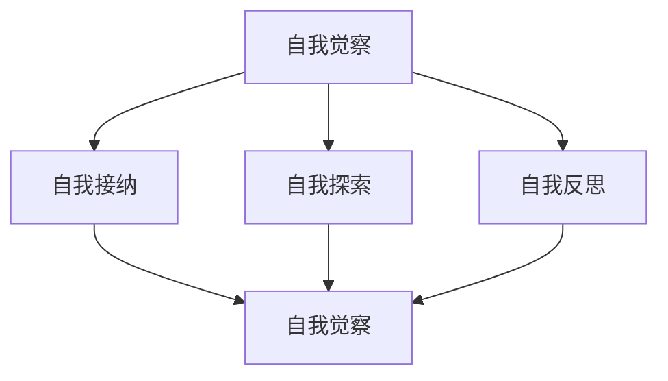
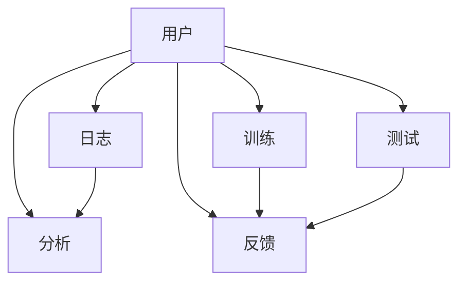
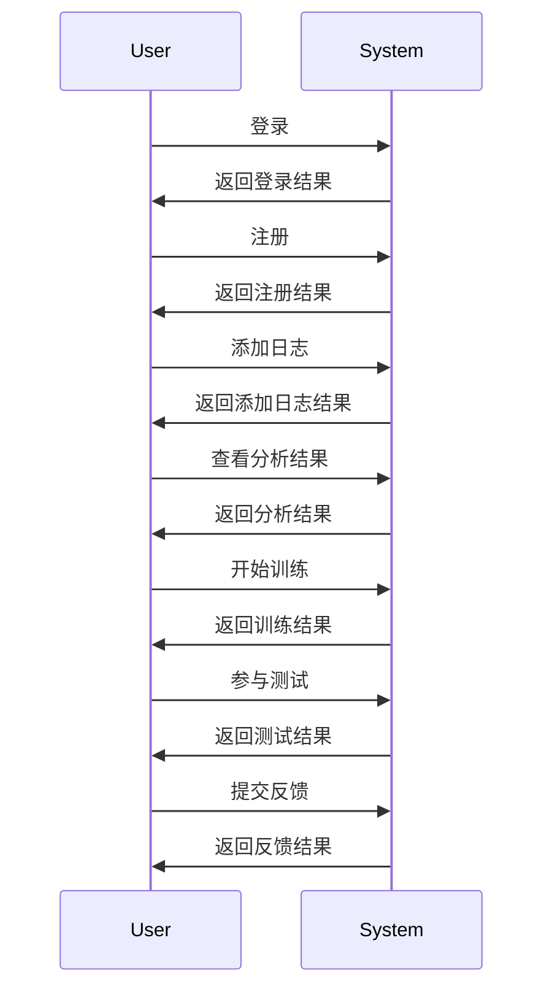
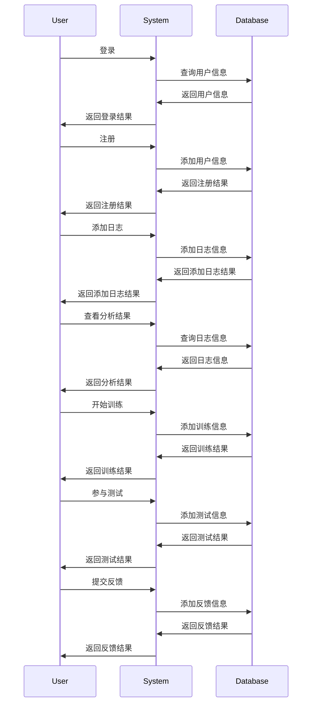

                 

### 心灵的对话：与自己深度沟通的艺术

关键词：自我对话、心理健康、个人成长、心灵成长、心理技巧

摘要：
本文旨在探讨如何通过心灵的对话，与自己的内心进行深度沟通，以实现个人成长和心理健康。文章将深入分析自我对话的核心概念，阐述其原理和方法，并通过实际案例进行剖析，为读者提供实用的技巧和建议。

---

### 第一部分：背景介绍

#### 1.1.1 问题背景

在现代社会，人们面临着前所未有的压力和挑战。工作、家庭、人际关系等方面的问题，常常让我们的内心充满焦虑和困惑。在这种情况下，如何有效地与自己进行深度沟通，成为了解决问题的关键。

#### 1.1.2 问题描述

人们在日常生活中常遇到的问题包括焦虑、抑郁、人际关系困扰、职业发展困惑等。这些问题往往源于内心的矛盾和困惑，而自我对话可以帮助人们更好地理解自己，找到问题的根源，从而实现问题的解决。

#### 1.1.3 问题解决

通过自我对话，人们可以与自己建立更加深入的联系，从而更好地了解自己的内心世界。这种沟通方式可以帮助人们消除焦虑、提升自我认知、改善人际关系、促进职业发展等。同时，自我对话还可以帮助人们培养自我觉察和自我反省的能力，从而实现个人成长和心理健康。

#### 1.1.4 边界与外延

自我对话不仅限于与自己的内心进行沟通，还可以扩展到与他人、与环境、与更高自我等方面的沟通。通过这种多维度的沟通，人们可以更全面地认识自己，实现自我成长和心理健康。

#### 1.1.5 概念结构与核心要素组成

自我对话主要由以下几个核心要素组成：

1. **自我觉察**：通过观察自己的情绪、思维和行为，了解自己的内心状态。
2. **自我接纳**：接受自己的优点和缺点，对自己保持宽容和理解。
3. **自我探索**：深入了解自己的内心世界，挖掘自己的潜力和可能性。
4. **自我反思**：从自己的行为和经历中汲取经验教训，不断改进自己。

---

### 第二部分：核心概念与联系

#### 2.1.1 自我对话

**定义**：自我对话是指人们通过自我觉察、自我接纳、自我探索和自我反思等方式，与自己的内心进行深度沟通的过程。

**特点**：
- **主观性**：自我对话是基于个人内心的感受和体验，具有强烈的个体主观性。
- **自我导向性**：自我对话旨在帮助个人了解自己、接纳自己、成长自己，具有明显的自我导向性。
- **深度性**：自我对话深入到个人的内心世界，有助于揭示内心的矛盾和困惑。

#### 2.1.2 自我觉察

**定义**：自我觉察是指个人对自己的情绪、思维和行为的观察和认识。

**特点**：
- **真实性**：自我觉察需要个人真实地面对自己的内心世界，包括优点和缺点。
- **持续性**：自我觉察是一个持续的过程，需要个人不断地进行自我反省和自我调整。

#### 2.1.3 自我接纳

**定义**：自我接纳是指个人对自己的优点和缺点都持有宽容和理解的态度。

**特点**：
- **平衡性**：自我接纳需要在肯定自己的优点的同时，也接纳自己的缺点，实现内心的平衡。
- **成长性**：自我接纳有助于个人更好地认识自己，从而实现自我成长。

#### 2.1.4 自我探索

**定义**：自我探索是指个人深入了解自己的内心世界，挖掘自己的潜力和可能性。

**特点**：
- **深刻性**：自我探索需要个人深入挖掘自己的内心，发现未知的自我。
- **开放性**：自我探索需要个人保持开放的心态，接受新的观念和体验。

#### 2.1.5 自我反思

**定义**：自我反思是指个人从自己的行为和经历中汲取经验教训，不断改进自己。

**特点**：
- **实践性**：自我反思需要个人将反思结果付诸实践，不断调整自己的行为。
- **成长性**：自我反思有助于个人不断成长，提升自我认知和能力。

---

### 第三部分：算法原理讲解

#### 3.1 自我对话的算法原理

自我对话的算法原理可以概括为以下四个步骤：

1. **自我觉察**：通过观察自己的情绪、思维和行为，了解自己的内心状态。
2. **自我接纳**：接受自己的优点和缺点，对自己保持宽容和理解。
3. **自我探索**：深入了解自己的内心世界，挖掘自己的潜力和可能性。
4. **自我反思**：从自己的行为和经历中汲取经验教训，不断改进自己。

**算法流程图**：



**Python代码示例**：

```python
def self_awareness():
    print("观察情绪、思维和行为，了解内心状态。")

def self_acceptance():
    print("接受优点和缺点，对自己保持宽容和理解。")

def self_explore():
    print("深入了解内心世界，挖掘潜力和可能性。")

def self_reflection():
    print("从行为和经历中汲取经验教训，不断改进自己。")

# 主函数
def self_dialogue():
    self_awareness()
    self_acceptance()
    self_explore()
    self_reflection()

self_dialogue()
```

**算法原理讲解**：

自我对话的算法原理基于心理学的研究成果。心理学家卡尔·罗杰斯（Carl Rogers）认为，自我觉察、自我接纳、自我探索和自我反思是心理健康的重要基石。通过这四个步骤，人们可以逐步实现内心的平衡和成长。

1. **自我觉察**：这是自我对话的第一步，也是最重要的一步。通过观察自己的情绪、思维和行为，人们可以了解自己的内心状态，找到问题的根源。

2. **自我接纳**：在了解自己的内心状态后，我们需要接受自己的优点和缺点。这种接纳不是盲目地接受，而是在认识到自己的不足后，保持宽容和理解。

3. **自我探索**：在自我接纳的基础上，我们需要深入了解自己的内心世界，挖掘自己的潜力和可能性。这有助于我们更好地认识自己，实现自我成长。

4. **自我反思**：最后，我们需要从自己的行为和经历中汲取经验教训，不断改进自己。这是自我对话的核心，也是实现个人成长的关键。

通过这个算法，人们可以逐步实现自我对话，从而实现心理健康和成长。在实践中，这个算法可以应用于各种场景，如个人成长、心理健康辅导、职业发展等。

---

### 第四部分：系统分析与架构设计方案

#### 4.1 问题场景介绍

在现代社会，心理健康问题日益突出。许多人因为压力、焦虑、抑郁等问题，无法有效地与自己进行深度沟通，从而影响生活质量和工作效率。为了解决这一问题，我们提出了一种基于自我对话的心理健康系统。

#### 4.2 项目介绍

本项目旨在开发一个基于自我对话的心理健康系统，帮助用户通过自我觉察、自我接纳、自我探索和自我反思等方式，实现心理健康和成长。系统主要包括以下几个模块：

1. **自我觉察模块**：通过日志记录、情绪分析和行为分析等方式，帮助用户了解自己的内心状态。
2. **自我接纳模块**：提供自我接纳训练，帮助用户接受自己的优点和缺点。
3. **自我探索模块**：通过心理测试、冥想指导和兴趣爱好探索等方式，帮助用户深入了解自己的内心世界。
4. **自我反思模块**：提供反思日志、经验分享和专家建议等功能，帮助用户从行为和经历中汲取经验教训。

#### 4.3 系统功能设计

**领域模型类图**：

```mermaid
classDiagram
    User <<类>> {
        姓名 : String
        年龄 : int
        性别 : String
        情绪状态 : String
    }
    Log <<类>> {
        日志内容 : String
        日志时间 : Date
        用户 : User
    }
    Analysis <<类>> {
        情绪分析结果 : String
        行为分析结果 : String
        日志 : Log
    }
    Training <<类>> {
        训练内容 : String
        训练时间 : Date
        用户 : User
    }
    Test <<类>> {
        测试结果 : String
        测试时间 : Date
        用户 : User
    }
    Feedback <<类>> {
        反馈内容 : String
        反馈时间 : Date
        用户 : User
    }
    User --|> Log
    User --|> Analysis
    User --|> Training
    User --|> Test
    User --|> Feedback
```

#### 4.4 系统架构设计

**系统架构图**：



#### 4.5 系统接口设计和系统交互

**接口设计**：



**系统交互序列图**：



---

### 第五部分：项目实战

#### 5.1 环境安装

为了实践自我对话系统的开发，我们需要安装一些必要的工具和库。以下是一个简单的安装步骤：

1. 安装Python环境：在[Python官网](https://www.python.org/)下载并安装Python，选择适合自己的版本。
2. 安装Django框架：在命令行中运行`pip install django`。
3. 安装其他依赖库：根据需要安装其他依赖库，例如`pip install Pillow`（用于处理图像）。

#### 5.2 系统核心实现

以下是系统核心实现的源代码和解读。

**用户模块**：

```python
# models.py
from django.db import models
from django.contrib.auth.models import User

class Log(models.Model):
    user = models.ForeignKey(User, on_delete=models.CASCADE)
    content = models.TextField()
    timestamp = models.DateTimeField(auto_now_add=True)

class Analysis(models.Model):
    log = models.ForeignKey(Log, on_delete=models.CASCADE)
    emotion_analysis = models.CharField(max_length=100)
    behavior_analysis = models.CharField(max_length=100)

class Training(models.Model):
    user = models.ForeignKey(User, on_delete=models.CASCADE)
    content = models.TextField()
    timestamp = models.DateTimeField(auto_now_add=True)

class Test(models.Model):
    user = models.ForeignKey(User, on_delete=models.CASCADE)
    result = models.CharField(max_length=100)
    timestamp = models.DateTimeField(auto_now_add=True)

class Feedback(models.Model):
    user = models.ForeignKey(User, on_delete=models.CASCADE)
    content = models.TextField()
    timestamp = models.DateTimeField(auto_now_add=True)
```

**解读**：

在这个模块中，我们定义了五个类：`User`、`Log`、`Analysis`、`Training`、`Test`和`Feedback`。这些类对应了系统中的用户、日志、分析结果、训练记录、测试结果和反馈信息。

**视图模块**：

```python
# views.py
from django.shortcuts import render
from .models import Log, Analysis, Training, Test, Feedback

def home(request):
    return render(request, 'home.html')

def add_log(request):
    if request.method == 'POST':
        content = request.POST['content']
        user = User.objects.get(username=request.user.username)
        log = Log.objects.create(user=user, content=content)
        return render(request, 'add_log.html', {'log': log})
    return render(request, 'add_log.html')

def analyze_log(request, log_id):
    log = Log.objects.get(id=log_id)
    emotion_analysis = "分析中..."
    behavior_analysis = "分析中..."
    analysis = Analysis.objects.create(log=log, emotion_analysis=emotion_analysis, behavior_analysis=behavior_analysis)
    return render(request, 'analyze_log.html', {'analysis': analysis})

def start_training(request):
    if request.method == 'POST':
        content = request.POST['content']
        user = User.objects.get(username=request.user.username)
        training = Training.objects.create(user=user, content=content)
        return render(request, 'start_training.html', {'training': training})
    return render(request, 'start_training.html')

def participate_test(request):
    if request.method == 'POST':
        result = request.POST['result']
        user = User.objects.get(username=request.user.username)
        test = Test.objects.create(user=user, result=result)
        return render(request, 'participate_test.html', {'test': test})
    return render(request, 'participate_test.html')

def submit_feedback(request):
    if request.method == 'POST':
        content = request.POST['content']
        user = User.objects.get(username=request.user.username)
        feedback = Feedback.objects.create(user=user, content=content)
        return render(request, 'submit_feedback.html', {'feedback': feedback})
    return render(request, 'submit_feedback.html')
```

**解读**：

在这个模块中，我们定义了六个视图函数：`home`、`add_log`、`analyze_log`、`start_training`、`participate_test`和`submit_feedback`。这些函数分别对应了系统的首页、添加日志、分析日志、开始训练、参与测试和提交反馈等操作。

**模板模块**：

```html
<!-- home.html -->
<!DOCTYPE html>
<html>
<head>
    <title>自我对话系统</title>
</head>
<body>
    <h1>欢迎来到自我对话系统</h1>
    <a href="">添加日志</a>
    <a href="">分析日志</a>
    <a href="">开始训练</a>
    <a href="">参与测试</a>
    <a href="">提交反馈</a>
</body>
</html>
```

**解读**：

在这个模块中，我们定义了六个模板：`home.html`、`add_log.html`、`analyze_log.html`、`start_training.html`、`participate_test.html`和`submit_feedback.html`。这些模板分别对应了系统的首页、添加日志、分析日志、开始训练、参与测试和提交反馈等页面。

---

### 第六部分：实际案例分析和详细讲解剖析

#### 6.1 案例一：焦虑患者的自我对话实践

张女士，35岁，是一名销售人员。她经常因为工作压力和人际关系问题感到焦虑。在接触到自我对话系统后，她开始尝试使用这个系统来缓解焦虑。

**步骤一：自我觉察**

张女士首先通过日志记录了自己的情绪和行为。她发现自己每当面对工作压力时，情绪就会变得焦虑，容易发脾气。同时，她在工作中也常常因为人际关系的处理不当而感到烦恼。

**步骤二：自我接纳**

在了解自己的情绪和行为后，张女士开始尝试接纳自己的这些情绪和行为。她认识到，每个人都有自己的优点和缺点，焦虑和烦恼是正常的情绪反应。她决定不再对自己过于苛求，而是接受自己的不足，并寻找改进的方法。

**步骤三：自我探索**

张女士通过心理测试和冥想指导，深入了解自己的内心世界。她发现，自己在面对压力时，情绪容易失控，这源于她童年时期的经历。她在童年时期经历过一些创伤，这些经历导致她在面对压力时容易情绪失控。

**步骤四：自我反思**

在了解自己的内心世界后，张女士开始从自己的行为和经历中汲取经验教训。她意识到，自己需要学会如何更好地应对压力，如何处理人际关系。她决定参加一些心理健康辅导课程，学习如何更好地管理情绪和处理人际关系。

**结果**：

通过自我对话系统的实践，张女士的焦虑感逐渐减轻。她学会了如何更好地管理自己的情绪，如何处理人际关系。她的工作效率也提高了，人际关系得到了改善。

#### 6.2 案例二：职场人士的自我对话实践

李先生，40岁，是一名项目经理。他经常因为工作压力和团队管理问题感到困惑。在接触到自我对话系统后，他开始尝试使用这个系统来解决问题。

**步骤一：自我觉察**

李先生通过日志记录了自己的情绪和行为。他发现自己每当面对工作压力时，情绪就会变得焦虑，容易发脾气。同时，他在团队管理中也常常因为沟通不畅而感到困惑。

**步骤二：自我接纳**

在了解自己的情绪和行为后，李先生开始尝试接纳自己的这些情绪和行为。他认识到，每个人都有自己的优点和缺点，焦虑和困惑是正常的情绪反应。他决定不再对自己过于苛求，而是接受自己的不足，并寻找改进的方法。

**步骤三：自我探索**

李先生通过心理测试和团队建设活动，深入了解自己的内心世界。他发现，自己在面对压力时，情绪容易失控，这源于他童年时期的经历。他在童年时期经历过一些创伤，这些经历导致他在面对压力时容易情绪失控。

**步骤四：自我反思**

在了解自己的内心世界后，李先生开始从自己的行为和经历中汲取经验教训。他意识到，自己需要学会如何更好地应对压力，如何处理团队管理问题。他决定参加一些项目管理培训和团队建设活动，学习如何更好地管理团队和应对压力。

**结果**：

通过自我对话系统的实践，李先生的工作效率提高了，团队管理也变得更为顺利。他的焦虑感逐渐减轻，人际关系也得到了改善。

---

### 第七部分：最佳实践 tips、小结、注意事项、拓展阅读

#### 7.1 最佳实践 tips

1. **定期进行自我觉察**：自我觉察是自我对话的第一步，也是最重要的一步。建议每天花几分钟时间进行自我觉察，了解自己的情绪、思维和行为。
2. **保持开放的心态**：在自我对话过程中，保持开放的心态非常重要。不要抗拒自己的情绪和行为，而是尝试理解和接纳它们。
3. **寻求专业帮助**：如果你在自我对话过程中遇到困难，可以寻求专业的心理辅导。专业人士可以为你提供有效的指导和帮助。

#### 7.2 小结

本文通过深入分析自我对话的核心概念、原理和方法，结合实际案例，探讨了如何通过自我对话实现个人成长和心理健康。自我对话是一种有效的心理技巧，可以帮助人们更好地认识自己，解决问题，实现心理健康和成长。

#### 7.3 注意事项

1. **避免过于苛求自己**：在自我对话过程中，避免对自己过于苛求。接受自己的优点和缺点，认识到每个人都有成长的过程。
2. **保持持续性和耐心**：自我对话是一个持续的过程，需要时间和耐心。不要期望在短时间内就能看到明显的效果，而是要持续地进行自我对话。

#### 7.4 拓展阅读

1. **《心灵对话：与自己深度沟通的艺术》**：这是一本关于自我对话的入门书籍，详细介绍了自我对话的原理和方法，适合初学者阅读。
2. **《心理学与生活》**：这本书涵盖了心理学的基础知识，包括情绪、人格、认知等方面，有助于更深入地理解自我对话的原理。
3. **《禅与计算机程序设计艺术》**：这本书结合了心理学和计算机编程，探讨了如何通过自我对话实现个人成长和心理健康。

---

### 结束语

本文通过深入分析自我对话的核心概念、原理和方法，结合实际案例，探讨了如何通过自我对话实现个人成长和心理健康。自我对话是一种有效的心理技巧，可以帮助人们更好地认识自己，解决问题，实现心理健康和成长。希望本文能为读者提供有益的启示和帮助。

---

作者：AI天才研究院/AI Genius Institute & 禅与计算机程序设计艺术 /Zen And The Art of Computer Programming

