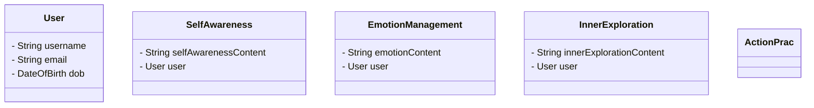
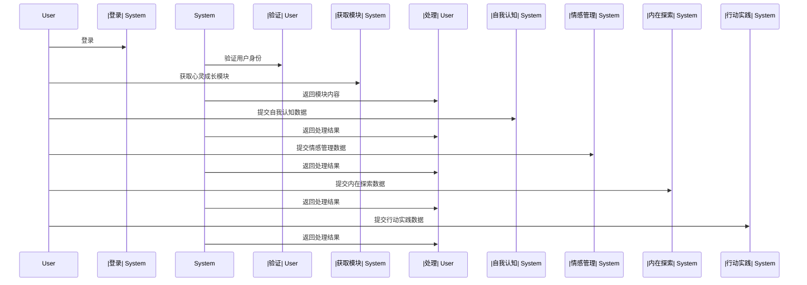
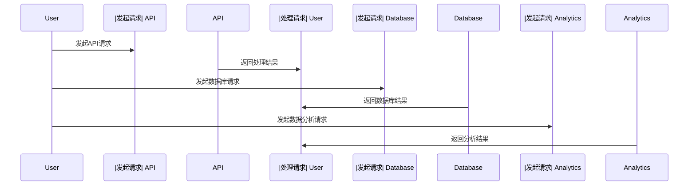

                 

# 心灵的成长：从虚无到充实的转变过程

## 关键词：心灵成长、认知转变、情感管理、内在探索、行动实践、冥想、自我实现

## 摘要

本文探讨了心灵成长的过程，从虚无到充实的转变。通过分析认知转变的理论基础，介绍心灵成长的核心概念与联系，以及实践方法和案例研究，帮助读者了解如何通过自我提升、情感管理与冥想等方法实现心灵成长。本文旨在为读者提供一个全面、系统的指南，帮助他们走出心灵的迷茫，找到内心的充实与平静。

## 引言

在快节奏的现代社会中，人们常常感到内心的空虚与迷茫。这种状态不仅影响个体的心理健康，也影响到人际关系和社会发展。心灵的成长，从虚无到充实的转变，成为许多人追求的目标。本文将围绕这一主题，探讨心灵成长的核心概念、理论基础和实践方法，帮助读者理解并实践心灵成长的过程。

## 第一部分：心灵的觉醒与认知转变

### 第1章：心灵成长背景与问题识别

#### 1.1 心灵成长的必要性

在现代社会，人们面临诸多压力和挑战，如工作压力、人际关系冲突、生活压力等。这些压力往往导致人们内心的空虚、焦虑和迷茫。因此，心灵的成长变得尤为重要。心灵成长不仅是个人心理健康的保障，也是实现个人潜能、提升生活质量的关键。

#### 1.2 虚无与充实的定义与区分

虚无和充实是心灵成长过程中的两个重要状态。虚无是指内心缺乏目标和意义，感觉生活无意义；而充实则是指内心充满意义、目标和动力，对生活充满热情和满足感。理解这两个概念的区别有助于我们更好地识别和追求心灵成长。

#### 1.3 心灵成长的目标与挑战

心灵成长的目标是达到内心的充实与平静。这一过程中，人们需要面对诸多挑战，如自我认知不足、情感管理困难、缺乏行动力等。只有通过克服这些挑战，才能实现真正的心灵成长。

### 第2章：认知转变的理论基础

#### 2.1 心理学理论与心灵成长

心理学理论为我们提供了理解心灵成长的基础。认知行为理论、情感理论、人本主义心理学等，都为我们揭示了心灵成长的可能路径。

#### 2.2 情感管理与心灵成长

情感管理是心灵成长的重要组成部分。学会识别、理解和调节自己的情感，有助于我们更好地面对生活中的挑战，实现心灵的成长。

#### 2.3 自我认知与心灵成长的关系

自我认知是心灵成长的基础。只有深入了解自己，认识自己的需求、欲望和价值观，才能找到心灵的归宿，实现真正的成长。

### 第3章：从虚无到充实的转变路径

#### 3.1 意识觉醒与内在探索

意识觉醒是心灵成长的第一步。通过冥想、内观等方法，我们可以逐渐认识到自己的内心世界，了解自己的真实需求。

#### 3.2 情感链接与人际关系

情感链接是心灵成长的重要途径。通过建立积极的人际关系，我们可以获得情感支持，更好地面对生活中的挑战。

#### 3.3 行动与实践：从理念到现实

只有将理念付诸实践，才能真正实现心灵的成长。通过实际行动，我们可以验证自己的理念，不断调整和改进，最终实现内心的充实与平静。

## 第二部分：心灵成长的实践方法

### 第4章：内观与冥想的实践

#### 4.1 内观冥想的原理与作用

内观冥想是一种深入了解自己的方法。通过冥想，我们可以摆脱杂念，平静内心，达到更深层次的自我认知。

#### 4.2 冥想技巧与练习方法

学会冥想技巧是心灵成长的重要一步。本文将介绍一些常见的冥想技巧，帮助读者更好地进行冥想练习。

#### 4.3 冥想实践中的常见问题及解决

在冥想实践中，人们可能会遇到各种问题。本文将针对这些问题，提供一些解决方法，帮助读者更好地进行冥想。

### 第5章：自我提升与自我实现

#### 5.1 自我反思与自我提升

自我反思是自我提升的关键。通过反思，我们可以认识到自己的优点和不足，找到自我提升的方向。

#### 5.2 发展个人兴趣与爱好

发展个人兴趣与爱好是自我实现的重要途径。通过追求自己的兴趣和爱好，我们可以找到内心的满足感，实现自我价值的提升。

#### 5.3 自我实现的道路与实践

自我实现是心灵成长的高级阶段。通过实践，我们可以不断突破自我，实现更高层次的心灵成长。

### 第6章：情感管理与心理调适

#### 6.1 情感认知与情感管理

情感认知是情感管理的基础。通过学习情感认知，我们可以更好地理解和调节自己的情感。

#### 6.2 压力管理与情绪调节

压力管理和情绪调节是心灵成长的重要环节。通过学习相关技巧，我们可以更好地应对生活中的压力和情绪波动。

#### 6.3 情感冲突的解决与人际和谐

情感冲突是人际关系中的常见问题。通过学习解决情感冲突的方法，我们可以实现人际关系的和谐。

## 第三部分：心灵成长的案例研究

### 第7章：成功案例分享与启示

#### 7.1 案例一：从迷茫到清晰的转变

通过案例一，我们可以看到一个人如何通过心灵成长摆脱迷茫，找到自己的人生方向。

#### 7.2 案例二：情感复苏与自我重塑

案例二展示了一个人如何通过情感复苏和自我重塑，实现心灵的成长。

#### 7.3 案例三：困境中的心灵成长

案例三讲述了一个人在困境中如何通过心灵成长，战胜逆境，实现自我突破。

### 第8章：心灵成长的最佳实践

#### 8.1 心灵成长的最佳实践策略

通过总结成功案例，本文将提出一些心灵成长的最佳实践策略，帮助读者更好地实现心灵成长。

#### 8.2 个人成长计划制定

制定个人成长计划是心灵成长的重要一环。本文将介绍如何制定有效的个人成长计划。

#### 8.3 持续成长与终身学习

持续成长与终身学习是实现心灵成长的关键。本文将探讨如何通过持续学习和成长，实现内心的充实与平静。

## 附录：心灵成长资源指南

#### 8.1 心理学经典读物推荐

本文将推荐一些心理学经典读物，帮助读者深入了解心理学理论，指导心灵成长。

#### 8.2 心灵成长相关网站与APP

本文将介绍一些心灵成长相关的网站和APP，为读者提供丰富的学习和实践资源。

#### 8.3 心灵成长社群与活动

本文将介绍一些心灵成长社群和活动，为读者提供一个交流和学习平台。

## 结论

心灵的成长是一个长期的过程，需要我们在日常生活中不断努力和实践。通过本文的探讨，我们希望能够为读者提供一个全面、系统的指南，帮助他们在心灵成长的道路上找到方向，实现内心的充实与平静。

## 作者信息

作者：AI天才研究院/AI Genius Institute & 禅与计算机程序设计艺术 /Zen And The Art of Computer Programming## 第1章：心灵成长背景与问题识别

### 1.1 心灵成长的必要性

在现代社会，随着物质生活的丰富，人们开始更多地关注内心的需求。心灵的成长，即个体内在心理素质的提升，已成为许多人追求的目标。心灵成长的重要性主要体现在以下几个方面：

1. **心理健康保障**：心灵成长有助于个体应对生活中的压力和挑战，降低心理问题的发生率，提升心理健康水平。

2. **个人潜能开发**：通过心灵成长，个体能够更好地认识自己，挖掘自身的潜能，实现个人价值。

3. **生活质量提升**：心灵的成长有助于个体找到生活的意义和目标，提升生活满意度，享受更加充实的生活。

4. **人际关系改善**：心灵成长使个体具备更好的情感认知和管理能力，有助于建立和谐的人际关系。

### 1.2 虚无与充实的定义与区分

虚无和充实是心灵成长过程中两个重要的心理状态。虚无通常表现为内心空虚、迷茫和无意义感，而充实则是指内心充满意义、目标和动力，对生活充满热情和满足感。

#### 虚无
- **内心空虚**：缺乏内在充实感，感觉生活没有意义。
- **迷茫**：对未来的方向和目标感到不确定。
- **无意义感**：对自己和社会的存在感到疑问。

#### 充实
- **内心意义感**：对生活有明确的目标和意义。
- **动力与激情**：对生活和事业充满热情和动力。
- **满足感**：对当前的生活状态感到满意和满足。

理解这两个状态的区别，有助于我们更好地识别和追求心灵成长。

### 1.3 心灵成长的目标与挑战

心灵成长的目标是达到内心的充实与平静。这一过程中，个体需要面对以下几个挑战：

1. **自我认知不足**：许多人对自己的认知有限，不了解自己的需求、欲望和价值观，这成为心灵成长的一大障碍。

2. **情感管理困难**：情感管理是心灵成长的重要环节。许多人无法有效地管理自己的情感，导致内心波动和冲突。

3. **缺乏行动力**：心灵成长需要付诸实践。许多人虽然有成长的理念，但缺乏实际行动，导致理念无法转化为现实。

4. **生活压力**：现代社会的生活节奏快，压力大，这给心灵成长带来一定的挑战。

通过识别这些挑战，我们可以更有针对性地进行心灵成长。

### 1.4 心灵成长的核心概念

心灵成长涉及多个核心概念，包括自我认知、情感管理、内在探索、自我实现等。以下是对这些核心概念的简要说明：

#### 自我认知

自我认知是指个体对自己的了解和认识。通过自我认知，个体能够明确自己的需求、欲望、价值观和信念。

#### 情感管理

情感管理是指个体对自身情感的认知、理解和调节。通过情感管理，个体能够更好地应对生活中的情感波动和冲突。

#### 内在探索

内在探索是指个体对自身内在世界的深入探索和理解。通过内在探索，个体能够发现和认识自己的潜能和成长空间。

#### 自我实现

自我实现是指个体通过不断努力和实践，实现自己的潜能和目标。通过自我实现，个体能够找到内心的充实与满足。

### 1.5 心灵成长的影响因素

心灵成长受多种因素的影响，包括环境、教育、人际关系、个人经历等。以下是对这些影响因素的简要分析：

#### 环境

环境对心灵成长有着重要影响。一个和谐、支持性的环境有助于个体实现心灵的成长。相反，一个充满压力、冲突的环境则可能阻碍心灵成长。

#### 教育

教育对心灵成长具有深远影响。良好的教育能够培养个体的自我认知能力、情感管理能力和内在探索能力。

#### 人际关系

人际关系对心灵成长有着重要影响。积极的人际关系能够为个体提供情感支持和成长动力，而消极的人际关系则可能导致个体内心的冲突和痛苦。

#### 个人经历

个人经历是心灵成长的重要资源。通过回顾和反思个人经历，个体能够更好地了解自己，找到心灵的成长路径。

### 1.6 心灵成长的边界与外延

心灵成长是一个多维度的过程，其边界与外延较为广泛。以下是对心灵成长边界与外延的简要描述：

#### 边界

心灵成长的边界主要包括心理健康的范畴，如情绪调节、压力管理、焦虑缓解等。此外，心灵成长还涉及到个体对自我、社会和宇宙的认知。

#### 外延

心灵成长的外延包括个人成长、心理健康、人际关系、自我实现等多个领域。通过心灵成长，个体能够实现更全面的发展。

### 1.7 心灵成长的核心要素组成

心灵成长的核心要素包括自我认知、情感管理、内在探索和自我实现。以下是对这些要素的简要描述：

#### 自我认知

自我认知是心灵成长的基础。通过自我认知，个体能够明确自己的需求、欲望、价值观和信念。

#### 情感管理

情感管理是心灵成长的重要环节。通过情感管理，个体能够更好地应对生活中的情感波动和冲突。

#### 内在探索

内在探索是指个体对自身内在世界的深入探索和理解。通过内在探索，个体能够发现和认识自己的潜能和成长空间。

#### 自我实现

自我实现是指个体通过不断努力和实践，实现自己的潜能和目标。通过自我实现，个体能够找到内心的充实与满足。

## 1.8 心灵成长的现状与问题

当前，随着社会的不断发展，人们越来越关注心灵成长。然而，在现实生活中，心灵成长仍面临着诸多问题：

1. **认知不足**：许多人缺乏对心灵成长的认识，不知道如何进行有效的自我认知和情感管理。

2. **压力过大**：现代社会的生活节奏快，压力大，许多人感到无法承受，导致心灵成长受阻。

3. **行动力不足**：许多人虽然有心灵成长的理念，但缺乏实际行动，导致理念无法转化为现实。

4. **环境因素**：不良的家庭环境、工作环境等可能阻碍个体的心灵成长。

为了解决这些问题，我们需要采取有效的措施，推动心灵成长的发展。

## 1.9 心灵成长的方法与策略

针对心灵成长中存在的问题，我们可以采取以下方法和策略：

1. **自我认知**：通过反思、日记等方式，深入理解自己的需求和欲望。

2. **情感管理**：学会识别和调节自己的情感，提高情感智商。

3. **内在探索**：通过冥想、内观等方法，深入探索自己的内心世界。

4. **自我实现**：设定目标，付诸实践，不断努力，实现自我价值。

通过这些方法和策略，我们可以逐步实现心灵的成长。

## 总结

本章对心灵成长的必要性、核心概念、影响因素、现状与问题以及方法与策略进行了全面探讨。通过本章的内容，我们能够更好地理解心灵成长的过程，为其提供理论支持和实践指导。在接下来的章节中，我们将进一步探讨认知转变的理论基础和实践方法，帮助读者实现心灵的成长。

## 1.10 心灵成长的意义与价值

心灵成长不仅对个体的心理健康和生活质量有深远影响，还对社会和谐与个人发展具有重要意义。

### 1.10.1 对个人心理健康的影响

心灵成长有助于个体应对生活中的压力和挑战，提高心理韧性。通过自我认知和情感管理，个体能够更好地调节情绪，减少焦虑和抑郁的发生。此外，心灵成长还能够增强个体的自信心和自我效能感，使个体在面对困难时保持积极的心态。

### 1.10.2 对生活质量和人际关系的影响

心灵成长使个体对生活有更深刻的理解，提升生活质量。通过情感链接和人际关系管理，个体能够建立和谐的人际关系，获得情感支持和归属感。这有助于个体在工作和生活中更加顺畅，减少冲突和矛盾。

### 1.10.3 对社会和谐与个人发展的影响

心灵成长不仅对个体有积极影响，还对社会的和谐与个人的发展具有重要意义。一个具有良好心理素质的社会成员能够更好地适应社会变化，促进社会稳定和发展。此外，心灵成长有助于个体实现个人潜能，为社会创造更多价值。

### 1.10.4 心灵成长的价值总结

总之，心灵成长的价值体现在多个方面。它不仅能够提升个体心理健康和生活质量，还能促进社会和谐与个人发展。因此，心灵成长应成为我们生活中不可或缺的一部分。

## 结论

本章通过对心灵成长背景、必要性、核心概念、影响因素、现状与问题以及意义与价值的深入探讨，为我们理解心灵成长提供了全面的理论支持和实践指导。在接下来的章节中，我们将进一步探讨认知转变的理论基础和实践方法，以帮助读者实现心灵的成长。

## 第2章：认知转变的理论基础

### 2.1 心理学理论与心灵成长

心理学理论为我们理解认知转变和心灵成长提供了重要的理论基础。以下是一些关键心理学理论：

#### 认知行为理论

认知行为理论（Cognitive Behavioral Theory, CBT）认为，个体的情绪和行为是由其认知过程（即对事件的思考方式）所决定的。通过改变负面认知模式，个体可以改善情绪和行为。CBT在治疗抑郁症、焦虑症等心理疾病方面取得了显著效果。

#### 情感理论

情感理论（Affective Theory）强调情感在认知过程中的作用。情感不仅影响个体的决策和行为，还影响其思维过程。情感理论认为，情感和认知是相互作用的，情感对认知有重要影响。

#### 人本主义心理学

人本主义心理学（Humanistic Psychology）强调个体的自我实现和自我决定。该理论认为，个体具有自我实现的需求，通过自我探索和自我表达，个体可以实现自我价值和心灵成长。

### 2.2 情感管理与心灵成长

情感管理是心灵成长的重要环节。以下是一些关键点：

#### 情感识别

情感识别是情感管理的基础。通过学习如何识别和理解自己的情感，个体可以更好地应对情感波动。

#### 情感表达

情感表达是情感管理的重要组成部分。学会如何表达情感，个体可以减少内心冲突，建立更好的人际关系。

#### 情感调节

情感调节是情感管理的关键。通过学习和实践情感调节技巧，个体可以更好地控制情感波动，减少负面情绪的影响。

### 2.3 自我认知与心灵成长的关系

自我认知是心灵成长的核心。以下是一些关键点：

#### 自我认知的定义

自我认知是指个体对自身内在世界和外界的认知。它包括自我感觉、自我评价、自我意识等方面。

#### 自我认知的重要性

自我认知对于个体心理健康和情感管理至关重要。通过自我认知，个体可以更好地理解自己的需求、欲望和价值观，从而实现自我提升和心灵成长。

#### 自我认知与情感管理的关系

自我认知和情感管理密切相关。通过自我认知，个体可以更好地理解自己的情感，从而更有效地进行情感管理。

### 2.4 概念属性特征对比表格

以下是一个关于情感管理、自我认知和内在探索的概念属性特征对比表格：

| 概念       | 属性特征                | 特征对比 |
|------------|------------------------|---------|
| 情感管理   | 识别、表达、调节情感  | 强调情感对个体行为和认知的影响 |
| 自我认知   | 认识自我、自我评价    | 强调个体对自身内在世界的认知 |
| 内在探索   | 探索内在世界、自我发现 | 强调对内在世界的深入理解和探索 |

### 2.5 ER实体关系图架构

以下是一个关于情感管理、自我认知和内在探索的ER实体关系图：

```mermaid
erDiagram
  Person ||--|{ Emotion }
  Person ||--|{ Self_Cognition }
  Person ||--|{ Inner_Exploration }
  Emotion ||--|{ Expression }
  Emotion ||--|{ Regulation }
  Self_Cognition ||--|{ Self_Evaluation }
  Inner_Exploration ||--|{ Deep_Knowledge }
```

在这个ER图中，Person（个体）是核心实体，与其他三个实体（Emotion、Self_Cognition、Inner_Exploration）之间存在关联。Emotion（情感）包括Expression（表达）和Regulation（调节）两个子实体，Self_Cognition（自我认知）包括Self_Evaluation（自我评价）一个子实体，Inner_Exploration（内在探索）包括Deep_Knowledge（深入知识）一个子实体。

### 2.6 认知转变的过程

认知转变是指个体在心理和行为上的变化，以达到新的认知水平。以下是一个简化的认知转变过程：

1. **问题识别**：个体认识到自己在认知上存在某些问题，如负面情绪、不合理的信念等。
2. **认知重构**：个体通过学习新的认知策略和技巧，改变原有的认知模式，建立积极的认知框架。
3. **行为实践**：个体将新的认知模式应用到实际生活中，通过实践巩固新的认知习惯。
4. **评估与调整**：个体对新的认知模式进行评估，根据实际情况进行调整和优化。

### 2.7 认知转变的理论基础

认知转变的理论基础主要包括以下几个部分：

1. **认知行为理论**：认知行为理论认为，个体的情绪和行为是由其认知过程所决定的。通过改变认知，个体可以改善情绪和行为。
2. **社会学习理论**：社会学习理论强调观察学习在社会认知发展中的作用。个体通过观察他人的行为和结果，学习新的认知策略和技巧。
3. **自我决定理论**：自我决定理论认为，个体的自我实现和自我决定是心灵成长的重要动力。通过自我决定，个体可以主动参与认知转变的过程。

### 2.8 心灵成长中的认知转变

在心灵成长过程中，认知转变起着关键作用。以下是一些心灵成长中的认知转变：

1. **从自我中心到他人中心**：个体逐渐学会关注他人的需求和感受，建立更好的人际关系。
2. **从消极思维到积极思维**：个体通过认知重构，改变消极的思维模式，建立积极的认知框架。
3. **从被动接受到主动探索**：个体从被动接受信息转变为主动探索和发现，增强自我认知和内在探索能力。
4. **从短视到长视**：个体学会从长远的角度看待问题，制定长期目标，实现自我实现。

### 总结

本章通过对心理学理论、情感管理、自我认知和内在探索的探讨，为认知转变提供了理论基础。在接下来的章节中，我们将进一步探讨认知转变的具体实践方法，帮助读者实现心灵的成长。

### 2.9 情感管理与心灵成长的关系

情感管理与心灵成长之间存在着紧密的联系，两者相辅相成，共同促进个体的心理成熟和内心世界的丰富。以下将详细探讨这种关系的各个方面：

#### 情感管理与心灵成长的核心联系

1. **自我认知**：情感管理是自我认知的重要组成部分。通过情感管理，个体能够更好地识别和理解自己的情绪，从而深化自我认知。自我认知的提升有助于个体在情感反应中保持冷静和理性，减少冲动行为，实现更成熟的心理状态。

2. **情绪调节**：情感管理的关键在于情绪调节。有效的情绪调节能力有助于个体在面对压力和挑战时保持情绪稳定，避免情绪波动对心理健康的负面影响。通过情绪调节，个体能够更好地控制自己的情绪反应，从而促进心灵成长。

3. **情感表达**：情感表达是情感管理的重要方面。个体需要学会如何恰当地表达自己的情感，这不仅有助于建立和谐的人际关系，还能帮助个体释放内心的情感压力，促进心灵成长。

#### 情感管理对心灵成长的具体影响

1. **提升心理韧性**：通过情感管理，个体能够提高心理韧性，更好地应对生活中的压力和挑战。心理韧性是心灵成长的重要指标，它反映了个体在逆境中的适应能力和恢复力。

2. **改善人际关系**：有效的情感管理有助于改善人际关系。个体能够通过更好的情感表达和理解他人的情感需求，建立更紧密的人际联系，从而提升社交能力和社会支持系统。

3. **增强自我效能感**：情感管理有助于个体认识到自己的情感状态，并学会通过积极的方式应对。这种自我效能感的提升有助于个体在追求目标和实现自我价值的过程中保持动力和信心。

#### 情感管理与心灵成长的互动机制

1. **情感反馈循环**：个体在情感管理过程中，通过不断的情感反馈和调节，逐步形成一种情感反馈循环。这种循环有助于个体在不断调整和优化情感管理策略的过程中实现心灵成长。

2. **认知重构**：情感管理过程中，个体需要不断进行认知重构，将负面情感转化为积极的情感体验。这种认知重构是心灵成长的关键步骤，它促使个体在情感认知上实现新的突破。

3. **情感智力提升**：情感管理能力的提升体现了情感智力的提升。情感智力包括识别、理解、表达和调节情感的能力。通过情感管理，个体能够提升情感智力，从而更好地实现心灵成长。

### 结论

情感管理与心灵成长之间的紧密联系不仅体现了个体心理发展的内在需求，也展示了情感管理在促进个体心理健康和内心丰富方面的积极作用。通过有效的情感管理，个体能够实现心灵的成长，达到更高的心理成熟水平。在接下来的章节中，我们将进一步探讨情感管理的具体方法和实践技巧，帮助读者更好地理解和应用这一理念。

## 2.10 心灵成长中的认知转变：实际案例解析

### 2.10.1 案例一：从焦虑到平静的转变

**背景介绍**：
小王是一名年轻的IT工程师，工作压力巨大，常常感到焦虑和疲惫。他的焦虑不仅影响了工作效率，还导致了他与家人和朋友的关系紧张。

**问题识别**：
小王意识到自己的焦虑情绪是心理问题的主要原因，他开始寻求解决方案。

**认知重构**：
通过学习心理学知识和参加心理咨询，小王了解到焦虑情绪的根源通常与认知偏差有关。他开始采用认知行为疗法（CBT）中的认知重构技术，逐步改变自己对工作和生活的消极认知。

**行为实践**：
小王开始定期练习冥想和深呼吸，以帮助自己放松和减轻焦虑。他还设定了合理的工作目标，学会了拒绝无谓的工作任务，以减轻工作压力。

**评估与调整**：
经过一段时间的实践，小王的焦虑情绪显著减轻，他开始感受到内心的平静。他继续参加心理咨询，并根据自己的进展调整认知重构策略。

**案例小结**：
小王的案例展示了认知转变在心灵成长中的关键作用。通过认知重构和情感管理，他成功地从焦虑状态转变到了平静和积极的状态，这为他未来的心理发展奠定了坚实的基础。

### 2.10.2 案例二：从自我怀疑到自信的转变

**背景介绍**：
李小姐是一名市场营销专业的毕业生，进入职场后，她发现自己缺乏自信，经常怀疑自己的能力和决策。

**问题识别**：
李小姐意识到自我怀疑是她职业发展的重要障碍，她决定通过心灵成长来提升自信心。

**认知重构**：
通过参加自我提升课程和阅读相关书籍，李小姐了解到自信的建立与自我认知和情感管理密切相关。她开始采用积极心理学的理念，通过自我肯定和目标设定来改变自己的认知。

**行为实践**：
李小姐开始记录自己的成就和成功经验，每天进行自我肯定练习。她还设定了小目标，逐步实现，以增强自己的自信心。

**评估与调整**：
随着时间的推移，李小姐的自信心逐渐增强。她开始在工作场合更加主动，并在团队中发挥领导作用。她继续调整和优化自己的认知策略，以保持自信心的提升。

**案例小结**：
李小姐的案例展示了通过认知重构和积极实践，个体可以逐步克服自我怀疑，建立自信心。这一过程不仅促进了她的职业发展，也提升了她的整体幸福感。

### 2.10.3 案例三：从迷茫到目标的转变

**背景介绍**：
张先生是一名中年职场人士，工作多年后感到职业发展陷入了瓶颈，对未来感到迷茫。

**问题识别**：
张先生意识到他需要找到新的目标和方向，以摆脱迷茫，重燃工作热情。

**认知重构**：
通过参加职业规划课程和进行自我反思，张先生认识到迷茫的根源在于缺乏清晰的职业目标和自我认知。他开始重新审视自己的兴趣和优势，并设定了具体的职业目标。

**行为实践**：
张先生开始学习新的技能，参加相关的培训课程，并积极寻找与目标相关的工作机会。他还与行业内的人士交流，获取职业发展的建议。

**评估与调整**：
经过一段时间的努力，张先生找到了新的职业方向，并取得了一定的成果。他继续进行自我反思和调整，以保持目标的明确和动力。

**案例小结**：
张先生的案例展示了通过认知重构和行动实践，个体可以摆脱迷茫，找到新的目标和方向。这一过程不仅帮助他实现了职业发展，也为他的心灵成长提供了新的动力。

### 总结

通过上述案例，我们可以看到认知转变在心灵成长中的关键作用。无论是从焦虑到平静的转变、从自我怀疑到自信的提升，还是从迷茫到目标的明确，认知转变都是实现心灵成长的重要途径。在接下来的章节中，我们将继续探讨认知转变的具体方法和实践技巧，帮助读者在实际生活中实现心灵的成长。

## 第3章：从虚无到充实的转变路径

### 3.1 意识觉醒与内在探索

意识觉醒是心灵成长的第一步，它标志着个体开始关注并反思自己的内心世界。内在探索则是意识觉醒的深化过程，通过这种方法，个体能够更深入地了解自己的情感、需求和欲望。

#### 3.1.1 意识觉醒的定义

意识觉醒是指个体开始意识到自己的内在世界，包括情感、思维和身体状态。这种觉醒通常伴随着对生活意义的反思和对个人存在的深入探索。

#### 3.1.2 意识觉醒的重要性

意识觉醒对于心灵成长至关重要。它不仅有助于个体认识到自己的情感和心理状态，还能够激发个体对生活的新认知和积极改变。

#### 3.1.3 内在探索的方法

内在探索可以通过多种方法实现，包括冥想、日记写作、内观等。

1. **冥想**：冥想是一种有效的内在探索方法，通过冥想，个体可以平静内心，深入自己的意识层面。
2. **日记写作**：通过日记写作，个体可以记录自己的情感、思考和体验，从而更好地理解自己的内心世界。
3. **内观**：内观是一种通过观察和反思自己的内心体验来认识自己的方法。

### 3.2 情感链接与人际关系

情感链接是指个体在情感层面上与他人建立联系的过程。在心灵成长中，情感链接对于建立积极的人际关系和提升心理健康具有重要意义。

#### 3.2.1 情感链接的重要性

情感链接有助于个体获得情感支持和安全感，同时也能促进个人成长和发展。

#### 3.2.2 建立情感链接的方法

建立情感链接的方法包括：

1. **倾听**：倾听是建立情感链接的重要技巧，通过倾听他人的故事和情感，个体可以更好地理解他人，从而建立更深层次的联系。
2. **共鸣**：共鸣是指个体能够理解和感受到他人的情感，通过共鸣，个体可以与他人建立更紧密的情感联系。
3. **情感表达**：学会表达自己的情感是建立情感链接的关键，通过真诚地表达情感，个体可以与他人建立信任和尊重。

### 3.3 行动与实践：从理念到现实

理念只有付诸实践，才能真正转化为现实。在心灵成长的过程中，行动与实践是关键环节。

#### 3.3.1 行动的定义

行动是指将理念转化为具体行为的过程。在心灵成长中，行动是指将自我认知、情感管理和内在探索等理念应用到实际生活中。

#### 3.3.2 实践的重要性

实践是实现心灵成长的关键。通过实践，个体可以验证和修正自己的理念，逐步实现内心的充实与平静。

#### 3.3.3 行动与实践的方法

1. **设定目标**：设定明确的目标是行动与实践的第一步。目标应该具体、可衡量、可实现。
2. **制定计划**：为了有效地实现目标，个体需要制定详细的行动计划。
3. **持续反思**：在行动过程中，个体需要不断反思自己的行为和效果，根据实际情况进行调整。

### 3.4 意识觉醒、情感链接与行动实践的关系

意识觉醒、情感链接和行动实践是心灵成长过程中相互关联的三个方面。意识觉醒为个体提供了对内在世界的深入认识，情感链接则帮助个体在人际关系中建立信任和共鸣，而行动实践则是将理念转化为现实的必要过程。

1. **相互促进**：意识觉醒、情感链接和行动实践相互促进，共同推动个体实现心灵成长。
2. **循环互动**：这三个方面之间形成了一个循环互动的关系，个体的内在探索和行动实践会进一步促进意识觉醒，而意识觉醒又会增强情感链接。

### 3.5 心灵成长的具体步骤

为了实现从虚无到充实的转变，个体可以遵循以下具体步骤：

1. **自我认知**：通过反思和自我探索，了解自己的情感、需求和价值观。
2. **情感管理**：学会识别和调节自己的情感，提高情感智商。
3. **内在探索**：通过冥想、日记等方法，深入自己的内在世界。
4. **建立情感链接**：通过倾听、共鸣和情感表达，与他人建立积极的情感关系。
5. **付诸实践**：将理念付诸实践，通过行动实现自我提升。

### 3.6 心灵成长中的挑战与应对策略

在心灵成长的过程中，个体可能会遇到各种挑战，如自我认知不足、情感管理困难、行动力不足等。以下是一些应对策略：

1. **自我认知不足**：通过反思和寻求专业指导，提升自我认知水平。
2. **情感管理困难**：学习情感管理技巧，如情感识别、表达和调节。
3. **行动力不足**：设定具体的目标和行动计划，提高行动的执行力。

### 3.7 心灵成长的长期效果

通过持续的心灵成长，个体可以实现长期的内心充实与平静。这种长期效果不仅体现在个体的心理健康和情感稳定上，还体现在个人关系和社会适应能力的提升。

### 结论

从虚无到充实的转变是一个复杂而漫长的过程，需要个体在意识觉醒、情感链接和行动实践等方面进行持续的努力。通过遵循具体的步骤和应对策略，个体可以逐步实现心灵的成长，找到内心的充实与满足。

## 3.8 意识觉醒的具体实践方法

意识觉醒是心灵成长的重要一步，它要求个体从日常生活中脱离出来，对自己的内心世界进行深刻的反思和探索。以下是一些具体的实践方法，帮助个体实现意识觉醒：

### 3.8.1 冥想

冥想是一种古老而有效的意识觉醒方法。通过冥想，个体可以训练自己的注意力，提高对内心世界的觉察。以下是冥想的具体步骤：

1. **选择合适的环境**：找一个安静、舒适的地方进行冥想。
2. **设定时间**：每天选择一个固定的时间进行冥想，初始时间可以从5分钟开始，逐渐延长至30分钟。
3. **呼吸冥想**：专注于呼吸，感受每一次呼吸的进出，让思绪随呼吸流动。
4. **内观冥想**：在冥想过程中，观察自己的思想和情感，不评判、不抗拒，只是观察它们的出现和消失。

### 3.8.2 日记写作

日记写作是一种将内心世界外化的方法。通过记录自己的思考、感受和经历，个体可以更清晰地认识自己的内心。以下是日记写作的具体步骤：

1. **每天记录**：设定一个固定的时间，每天进行日记写作，哪怕只有几分钟。
2. **真实表达**：写下自己的真实感受，不需要修饰和隐藏。
3. **反思与总结**：定期回顾日记，反思自己的成长和变化，总结经验教训。

### 3.8.3 自我反思

自我反思是一种深入思考自己的行为、思维和情感的方法。通过自我反思，个体可以发现自己的盲点和不足，从而进行改进。以下是自我反思的具体步骤：

1. **设定问题**：在反思前，明确自己要反思的问题或主题。
2. **深入思考**：花时间深入思考自己的行为和思维，寻找问题的根源。
3. **记录反思**：将反思的过程和结果记录下来，以便后续回顾和调整。

### 3.8.4 情感日记

情感日记是一种专门记录自己情感体验的方法。通过情感日记，个体可以更好地理解自己的情感，从而进行有效的情感管理。以下是情感日记的具体步骤：

1. **记录情感变化**：每天记录自己的主要情感变化，如快乐、悲伤、愤怒等。
2. **分析情感原因**：尝试分析情感变化的原因，如工作压力、人际关系等。
3. **寻找解决方法**：根据情感分析，寻找解决情感问题的方法，如调整工作安排、改善人际关系等。

### 3.8.5 感恩日记

感恩日记是一种记录自己感恩之情的日记。通过感恩日记，个体可以培养积极的心态，提高幸福感。以下是感恩日记的具体步骤：

1. **每天记录**：每天记录至少三件让自己感到感恩的事情。
2. **真实表达**：写下真实的感恩之情，不需要伪装或掩饰。
3. **反思与调整**：定期回顾感恩日记，反思自己的感恩心态，调整生活方式，以增加感恩的体验。

### 总结

通过冥想、日记写作、自我反思、情感日记和感恩日记等方法，个体可以逐步实现意识觉醒，深入探索自己的内心世界。这些方法不仅有助于个体的心灵成长，还能提高他们的心理健康和生活质量。

## 3.9 情感链接的具体实践方法

情感链接是心灵成长过程中的关键环节，它不仅有助于建立和谐的人际关系，还能为个体提供情感支持和安全感。以下是一些具体的实践方法，帮助个体实现情感链接：

### 3.9.1 倾听

倾听是建立情感链接的重要技巧。通过倾听，个体可以更好地理解他人的情感和需求，从而建立信任和共鸣。以下是倾听的具体步骤：

1. **放下偏见**：在倾听他人时，保持开放的心态，不要急于评判或提出建议。
2. **专注聆听**：全身心地专注于对方的讲话，避免分心或打断。
3. **情感共鸣**：尝试从对方的角度理解情感，感受他们的情绪。
4. **反馈确认**：在适当的时候，通过反馈来确认对方是否感受到了你的理解和支持。

### 3.9.2 共鸣

共鸣是指个体能够理解和感受到他人的情感，从而在情感上与他人建立联系。以下是一些实现共鸣的方法：

1. **同理心**：设身处地地理解他人的情感和经历，体验他们的感受。
2. **情感表达**：通过真诚的情感表达，向他人展示你的理解和关心。
3. **非语言交流**：通过肢体语言、面部表情和声音的语调等非语言方式，传达你的情感共鸣。

### 3.9.3 情感表达

情感表达是情感链接的重要组成部分。通过有效表达自己的情感，个体可以减少内心的冲突，建立更好的人际关系。以下是情感表达的具体步骤：

1. **识别情感**：首先，识别自己的情感，明确你感受到的情绪。
2. **表达情感**：用清晰、具体和真诚的语言表达你的情感，避免模糊或含糊其辞。
3. **控制情绪**：在表达情感时，注意控制情绪的强度，避免过度情绪化或压抑情感。

### 3.9.4 情感沟通

情感沟通是指通过语言和非语言的方式，与他人分享情感和思想。以下是一些实现情感沟通的方法：

1. **开放性沟通**：在沟通中保持开放和诚实，愿意分享自己的情感和想法。
2. **积极倾听**：在对方讲话时，保持倾听的态度，理解对方的观点。
3. **共同探讨**：与对方共同探讨问题，寻找解决方案，增强彼此的信任。
4. **非语言沟通**：通过肢体语言、面部表情和声音的语调等非语言方式，增强沟通的效果。

### 3.9.5 建立情感链接

建立情感链接需要时间和耐心。以下是一些建立情感链接的方法：

1. **共同经历**：与朋友或家人共同参与活动，分享经历，增强情感联系。
2. **互相关心**：在日常生活中，关心他人的需求和情感，提供支持和帮助。
3. **真诚交流**：保持真诚和开放的态度，与他人进行真诚的交流。
4. **互相尊重**：尊重他人的观点和情感，避免批评和指责。

### 总结

通过倾听、共鸣、情感表达、情感沟通和建立情感链接等方法，个体可以有效地建立和维护情感关系。这些方法不仅有助于个体的心灵成长，还能提升他们的心理健康和生活满意度。

## 3.10 行动与实践的具体方法

行动与实践是实现心灵成长的关键环节。只有将理念转化为实际行动，个体才能在现实生活中体验到心灵的充实与平静。以下是一些具体的方法，帮助个体在行动与实践过程中实现心灵的成长：

### 3.10.1 设定目标

设定目标是行动与实践的第一步。一个明确、具体和可实现的目标能够为个体提供方向和动力。以下是设定目标的步骤：

1. **明确目标**：明确自己想要实现的目标，确保目标是具体和可衡量的。
2. **制定计划**：制定实现目标的详细计划，包括步骤、时间表和资源。
3. **分解任务**：将大目标分解为小任务，逐步完成，避免感到压力过大。
4. **定期回顾**：定期回顾自己的进度，根据实际情况进行调整。

### 3.10.2 制定计划

制定计划是实现目标的必要步骤。一个合理的计划能够帮助个体高效地完成任务，确保目标的实现。以下是制定计划的步骤：

1. **评估资源**：评估自己拥有的资源和能力，确保计划的可实施性。
2. **确定步骤**：根据目标，确定实现目标的步骤，明确每个步骤的目标和时间表。
3. **分配任务**：将任务分配给合适的团队成员，确保任务的高效完成。
4. **监控进度**：定期监控计划的执行进度，及时发现和解决问题。

### 3.10.3 持续反思

持续反思是行动与实践的重要环节。通过反思，个体可以了解自己的行为和效果，不断调整和优化自己的行动策略。以下是反思的步骤：

1. **记录过程**：在行动过程中，记录自己的行为、感受和结果，为反思提供依据。
2. **分析效果**：根据记录的信息，分析行动的效果，识别成功和不足之处。
3. **总结经验**：总结经验教训，为下一次行动提供参考。
4. **调整策略**：根据反思的结果，调整自己的行动策略，优化行动过程。

### 3.10.4 持之以恒

持之以恒是实现心灵成长的关键。只有坚持不懈地付出努力，个体才能在行动与实践过程中获得实质性的成果。以下是保持持续行动的方法：

1. **设立提醒**：设置提醒和提醒机制，确保自己按时完成任务。
2. **寻找动力**：找到内心的动力，保持对目标的热情和动力。
3. **调整心态**：保持积极的心态，面对困难和挫折时不放弃。
4. **与他人分享**：与他人分享自己的目标和进展，获得支持和鼓励。

### 3.10.5 调整心态

心态的调整是实现心灵成长的重要一环。一个积极的心态能够帮助个体更好地应对挑战，实现目标。以下是调整心态的方法：

1. **设定目标感**：明确自己的目标，感受到实现目标带来的成就感和满足感。
2. **积极思考**：用积极的思维方式看待问题，避免消极思维的影响。
3. **放松心情**：通过冥想、运动等方式放松心情，减轻压力。
4. **寻求支持**：在遇到困难和挫折时，寻求他人的支持和帮助。

### 总结

通过设定目标、制定计划、持续反思、持之以恒和调整心态等方法，个体可以在行动与实践过程中实现心灵的成长。这些方法不仅有助于目标的实现，还能提升个体的心理素质和幸福感。

## 第4章：内观与冥想的实践

### 4.1 内观冥想的原理与作用

内观冥想（Vipassana Meditation）是一种源自佛教的冥想方法，旨在通过观察和体验身体的感受，达到心灵深处的平静和觉醒。其原理基于对身心状态的深入观察和理解，旨在揭示内在的真相和真理。

#### 4.1.1 内观冥想的原理

1. **觉知**：内观冥想的核心在于觉知。通过专注于身体的感受，个体能够培养对当前时刻的觉知，从而减少对过去和未来的执着。
2. **呼吸**：呼吸是内观冥想的重要元素。通过专注于呼吸，个体可以平静内心，减少焦虑和压力。
3. **身体感受**：内观冥想要求个体对身体的感受保持觉知，从而了解身体的真实状态，消除身体和心理的隔阂。

#### 4.1.2 内观冥想的作用

1. **减压**：内观冥想有助于减轻压力和焦虑，提升心理健康。
2. **情感调节**：通过内观冥想，个体能够更好地管理和调节自己的情感，减少情绪波动。
3. **提高专注力**：内观冥想有助于提高专注力和注意力，提升工作和学习效率。
4. **促进身心健康**：内观冥想有助于改善身体机能，增强免疫力，促进身心健康。

### 4.2 冥想技巧与练习方法

#### 4.2.1 坐姿冥想

坐姿冥想是最常见的冥想方式之一。以下是坐姿冥想的具体步骤：

1. **选择合适的位置**：找一个安静、舒适的地方，选择一个舒适的坐姿，如莲花坐或半莲花坐。
2. **专注呼吸**：闭上眼睛，专注于呼吸，感受每一次呼吸的进出，保持呼吸的自然和深长。
3. **观察身体感受**：同时，观察身体的感受，如肌肉的紧张和放松，感受身体的轻盈和沉重。
4. **保持专注**：当思绪分散时，轻轻地将注意力拉回到呼吸上，重复这个过程。

#### 4.2.2 步行冥想

步行冥想是一种在行走中练习冥想的方法。以下是步行冥想的具体步骤：

1. **选择合适的路线**：选择一条安静、无干扰的路线，如公园的小径或安静的街道。
2. **专注行走**：缓慢而稳定地行走，专注于每一步的动作和感受，感受脚与地面的接触。
3. **呼吸同步**：尝试将呼吸与步伐同步，保持深长的呼吸，让身体和心灵得到放松。
4. **保持觉知**：在行走过程中，保持对周围环境的觉知，感受自然的声音和景色。

#### 4.2.3 动态冥想

动态冥想是一种结合身体动作和呼吸的冥想方法。以下是动态冥想的具体步骤：

1. **选择合适的动作**：选择一些简单的身体动作，如深蹲、伸展、旋转等。
2. **专注动作和呼吸**：在动作过程中，专注于动作的细节和呼吸的节奏，感受身体的流动和呼吸的深度。
3. **保持流畅**：动作和呼吸应该保持流畅，不要用力过猛，保持身体的舒适感。
4. **专注内心**：在动作过程中，保持对内心感受的觉知，感受情绪和思维的变化。

### 4.3 冥想实践中的常见问题及解决

在冥想实践中，个体可能会遇到各种问题。以下是一些常见问题及解决方法：

#### 4.3.1 思绪纷飞

**问题**：在冥想过程中，思绪很容易纷飞，难以专注于呼吸和身体感受。

**解决方法**：当思绪纷飞时，不要抗拒或焦虑，而是轻轻地将注意力拉回到呼吸或身体感受上。重复这个过程，逐渐增强专注力。

#### 4.3.2 身体不适

**问题**：在冥想过程中，可能会出现身体不适，如头晕、肌肉紧张等。

**解决方法**：如果出现身体不适，可以先停下来，做一些伸展运动，让身体放松。如果问题持续，可以调整坐姿或选择另一种冥想方式。

#### 4.3.3 情绪波动

**问题**：在冥想过程中，情绪可能会波动，感到焦虑、沮丧等。

**解决方法**：情绪波动是正常的心理反应。通过观察和接受这些情绪，逐渐学会与它们和平共处。如果情绪无法控制，可以暂停冥想，进行深呼吸或寻求专业帮助。

#### 4.3.4 习惯养成

**问题**：很难养成冥想习惯，常常中断或无法坚持。

**解决方法**：设立固定的冥想时间，选择一个安静的环境，尽量保持日常的冥想习惯。如果中断，不要自责，而是重新开始。

### 总结

通过了解内观冥想的原理与作用，掌握冥想技巧与练习方法，以及解决实践中的常见问题，个体可以更好地进行冥想实践，实现心灵的成长。内观冥想不仅有助于提升心理健康，还能为个体的生活带来积极的变化。

## 4.4 内观冥想的实际应用与效果

内观冥想作为一种深层次的自我探索和心灵修炼的方法，已经在许多领域展现出了显著的应用效果。以下是一些实际应用场景及效果：

### 4.4.1 心理健康

内观冥想在心理健康方面具有广泛的应用，尤其是在缓解压力、焦虑和抑郁方面。通过内观冥想，个体可以更好地管理情绪，减少心理压力，提高心理健康水平。一项研究发现，内观冥想能够显著降低焦虑和抑郁症状，提高心理韧性。

### 4.4.2 情感管理

内观冥想有助于个体更好地理解和调节自己的情感。通过内观，个体可以观察自己的情绪波动，学会与情绪和平共处，从而减少负面情绪的影响。内观冥想还可以提高情感智商，增强人际关系的质量。

### 4.4.3 注意力提升

内观冥想有助于提升专注力和注意力。通过练习内观冥想，个体可以训练自己的注意力，减少分心和干扰。这不仅在日常生活中有助于提高工作效率，还能在学习和工作中发挥重要作用。

### 4.4.4 身体健康

内观冥想对身体健康也有积极影响。通过冥想，个体可以降低血压、减少慢性疼痛、提高免疫力。此外，内观冥想还有助于改善睡眠质量，提高整体健康水平。

### 4.4.5 自我成长

内观冥想是一种自我探索和自我提升的有效方法。通过内观，个体可以深入了解自己的内心世界，发现和认识自己的潜能。内观冥想有助于个体实现自我认知、自我接纳和自我实现，从而在个人成长和发展方面取得显著成果。

### 4.4.6 团队协作

内观冥想还可以应用于团队协作和领导力培训。通过内观冥想，团队成员可以更好地理解彼此，增强团队凝聚力和协作能力。内观冥想有助于培养团队中的同理心和沟通技巧，提高团队的整体绩效。

### 4.4.7 教育与培训

内观冥想逐渐被纳入教育体系和培训课程。通过内观冥想，学生和员工可以更好地应对学业和工作的压力，提高学习效果和工作效率。内观冥想有助于培养个体的情绪管理能力和自我调节能力，从而提升整体教育质量和工作表现。

### 总结

内观冥想在实际应用中展现出了丰富的效果，不仅在心理健康、情感管理、注意力提升、身体健康、自我成长、团队协作和教育培训等方面具有显著作用，还能为个体和组织的全面发展提供强有力的支持。通过内观冥想，个体可以实现心灵的成长，提升整体生活质量。

## 第5章：自我提升与自我实现

### 5.1 自我反思与自我提升

自我反思是自我提升的重要步骤。通过反思，个体可以深入了解自己的行为、思维和情感，识别自身的优点和不足，从而有针对性地进行改进。以下是一些自我反思的方法：

#### 5.1.1 反思日记

反思日记是一种常见的自我反思方法。个体可以在每天的结束前或开始前，花一些时间记录自己的行为、思维和感受。通过反思日记，个体可以清晰地看到自己的成长轨迹，发现潜在的问题和改进空间。

#### 5.1.2 反思会议

反思会议是一种在团队或个人层面进行反思的方法。个体可以定期与团队成员或朋友进行反思会议，分享自己的经验和感受，获取反馈和建议。这种互动式反思有助于个体更全面地认识自己，找到改进的方向。

#### 5.1.3 反思练习

反思练习是一种系统性的自我反思方法。个体可以定期进行反思练习，如每周或每月一次，针对某一主题进行深入的反思。这种练习有助于个体建立反思的习惯，提高自我认知能力。

### 5.2 发展个人兴趣与爱好

发展个人兴趣与爱好是自我提升的重要途径。通过培养兴趣和爱好，个体可以丰富自己的生活，提升生活满意度，同时也能实现自我价值的提升。以下是一些发展个人兴趣和爱好的方法：

#### 5.2.1 探索新领域

个体可以通过阅读、参加课程或实践活动，探索新的领域和兴趣。通过不断地尝试和探索，个体可以发现并培养自己的兴趣爱好。

#### 5.2.2 设定目标

为了更好地发展个人兴趣和爱好，个体可以设定具体的目标。这些目标可以是短期的，如每天阅读30分钟，或长期的，如学习一门新技能。设定目标有助于个体保持动力和方向。

#### 5.2.3 积累经验

通过不断地练习和实践，个体可以积累经验和技能，提升自己在兴趣和爱好领域的水平。这种积累不仅有助于个体的自我提升，还能增强自信心和成就感。

### 5.3 自我实现的道路与实践

自我实现是指个体通过不断努力和实践，实现自己的潜能和目标。以下是一些自我实现的道路和实践方法：

#### 5.3.1 设定愿景

个体可以通过设定愿景，明确自己的长期目标和追求。愿景可以激励个体在自我实现的道路上不断前进，保持动力和决心。

#### 5.3.2 制定计划

为了实现愿景，个体需要制定具体的计划和行动步骤。这些计划应该具体、可衡量、可实现，以确保个体能够有条不紊地实现目标。

#### 5.3.3 持续学习

持续学习是实现自我实现的关键。个体需要不断地学习新知识、新技能，不断提升自己的能力和素质，从而在自我实现的道路上取得更大的成就。

#### 5.3.4 反馈与调整

在实现自我目标的过程中，个体需要定期进行反馈和调整。通过反思自己的行为和效果，个体可以及时发现问题并进行改进，确保自我实现目标的实现。

### 5.4 自我实现的重要性

自我实现不仅对个体的心理健康和生活质量有重要影响，还对社会和个体的发展具有重要意义。以下是一些自我实现的重要性：

#### 5.4.1 心理健康

自我实现能够提升个体的心理健康水平。通过实现自己的潜能和目标，个体可以获得成就感和满足感，减少焦虑和抑郁的发生。

#### 5.4.2 社会贡献

自我实现有助于个体为社会创造更多的价值。通过实现自己的目标和梦想，个体可以为社会做出更大的贡献，推动社会的进步和发展。

#### 5.4.3 个人成长

自我实现是个人成长的重要标志。通过不断地追求和实现自我，个体可以不断提升自己的能力和素质，实现更高层次的发展。

### 5.5 自我实现的障碍与解决策略

在追求自我实现的过程中，个体可能会遇到各种障碍。以下是一些常见的障碍及解决策略：

#### 5.5.1 目标设定不当

**问题**：目标设定过于模糊或过于理想化，导致难以实现。

**解决策略**：明确具体的可实现目标，将大目标分解为小目标，逐步实现。

#### 5.5.2 缺乏动力

**问题**：缺乏持续的动力和激情，导致无法坚持。

**解决策略**：设定内在和外在的激励因素，如奖励机制和定期评估，保持动力。

#### 5.5.3 环境压力

**问题**：外部环境压力过大，影响自我实现的进程。

**解决策略**：建立支持性的环境，寻求他人的理解和支持，减轻环境压力。

### 总结

通过自我反思、发展个人兴趣与爱好，以及追求自我实现，个体可以不断提升自己的能力和素质，实现内心的充实与满足。自我实现不仅是个人成长的重要标志，也是社会发展的动力源泉。通过持续的努力和实践，个体可以在自我实现的道路上不断前行，实现更高层次的心灵成长。

## 第6章：情感管理与心理调适

### 6.1 情感认知与情感管理

情感认知是情感管理的基础，它涉及识别、理解和表达情感。以下是一些关于情感认知和情感管理的详细内容：

#### 6.1.1 情感认知的重要性

情感认知对于个体的心理健康和人际关系具有深远影响。通过情感认知，个体能够更好地理解自己的情感，从而更有效地进行情感管理和调节。

#### 6.1.2 情感认知的方法

1. **自我反思**：通过反思自己的情感体验，个体可以深入理解自己的情绪反应，从而提高情感认知能力。
2. **情感标签化**：为情感贴上标签，如愤怒、快乐、悲伤等，有助于个体识别和理解情感。
3. **情感表达练习**：通过练习表达自己的情感，个体可以增强情感认知能力，更好地理解和调节情感。

#### 6.1.3 情感管理的原则

1. **接受情感**：接受情感的存在，而不是抗拒或逃避，有助于个体更好地进行情感管理。
2. **情感调节**：通过情感调节，个体可以减少负面情感的影响，增强积极情感的感受。
3. **情感平衡**：保持情感平衡，避免情感过度波动，有助于个体的心理健康。

### 6.2 压力管理与情绪调节

压力管理和情绪调节是情感管理的重要组成部分。以下是一些关于压力管理和情绪调节的详细内容：

#### 6.2.1 压力管理的定义

压力管理是指通过一系列方法减轻压力，提高心理健康和生活质量。以下是一些有效的压力管理方法：

1. **时间管理**：合理安排时间，避免过度工作，确保有足够的休息时间。
2. **放松技巧**：通过深呼吸、冥想、瑜伽等放松技巧，缓解身体和心理的压力。
3. **积极思考**：通过积极的思维方式看待问题，减少压力感。

#### 6.2.2 情绪调节的方法

1. **情感释放**：通过哭泣、写日记、运动等方式，释放负面情绪，减轻心理压力。
2. **情感转移**：将注意力转移到其他活动或兴趣爱好上，减少负面情绪的影响。
3. **认知重构**：通过改变对事件的看法和解读，减少负面情绪的产生。

### 6.3 压力管理与情绪调节的关系

压力管理和情绪调节密切相关，两者相辅相成。有效的压力管理能够减少负面情绪的产生，而情绪调节则有助于个体更好地应对压力。

#### 6.3.1 压力管理与情绪调节的相互作用

1. **减少压力**：通过压力管理，个体能够减少日常生活中的压力，从而降低负面情绪的发生。
2. **改善情绪**：通过情绪调节，个体能够更好地处理负面情绪，减少压力感。
3. **心理健康**：压力管理和情绪调节共同作用于个体的心理健康，帮助个体保持情绪稳定，提升生活质量。

### 6.4 心理调适的方法

心理调适是指通过一系列方法，帮助个体适应生活中的变化，保持心理健康。以下是一些心理调适的方法：

#### 6.4.1 冥想

冥想是一种有效的心理调适方法，它通过训练个体的注意力，提高对内心世界的觉知。以下是一些冥想的方法：

1. **呼吸冥想**：专注于呼吸，感受每一次呼吸的进出，通过深呼吸缓解压力。
2. **内观冥想**：观察自己的思想和情感，不评判、不抗拒，通过内观认识自己的内心世界。
3. **步行冥想**：在行走过程中，专注于每一步的动作和呼吸，通过步行冥想放松心情。

#### 6.4.2 锻炼

锻炼不仅有助于身体健康，还能提高心理健康。以下是一些锻炼的方法：

1. **有氧运动**：如跑步、游泳、跳绳等，通过有氧运动提高心肺功能，释放压力。
2. **力量训练**：如举重、俯卧撑等，通过力量训练增强肌肉力量，提升自信心。
3. **瑜伽**：通过瑜伽的伸展和呼吸练习，放松身心，提高情绪调节能力。

#### 6.4.3 社交

社交有助于个体获得情感支持和安全感。以下是一些社交的方法：

1. **与朋友交流**：与朋友分享自己的感受和经历，获得情感支持和建议。
2. **参加社交活动**：参加社团、聚会等活动，扩大社交圈，增强社交能力。
3. **志愿服务**：通过志愿服务，帮助他人，获得成就感和满足感，提升自我价值。

### 6.5 情感管理与心理调适的最佳实践

以下是一些情感管理与心理调适的最佳实践：

#### 6.5.1 定期反思

通过定期反思自己的情感和行为，个体可以更好地了解自己的内心世界，从而进行有效的情感管理和心理调适。

#### 6.5.2 寻求专业帮助

在遇到心理困扰时，寻求专业心理咨询师的帮助，有助于个体获得专业的指导和支持，解决心理问题。

#### 6.5.3 建立支持系统

建立支持系统，包括家人、朋友和专业人士，有助于个体在情感管理和心理调适过程中获得情感支持和建议。

### 总结

情感管理与心理调适是心灵成长的重要组成部分。通过情感认知、压力管理和情绪调节，个体可以更好地管理自己的情感，提升心理健康。同时，通过冥想、锻炼和社交等心理调适方法，个体可以更好地适应生活中的变化，保持内心的平静与充实。在情感管理与心理调适的最佳实践中，个体能够实现更全面的心灵成长。

### 6.6 情感管理与心理调适的实际案例

#### 案例一：从焦虑到平静的转变

**背景介绍**：
李女士是一名繁忙的职场女性，工作压力大，家庭责任重，经常感到焦虑和疲惫。她的焦虑不仅影响了工作效率，还导致了她与家人的关系紧张。

**问题识别**：
李女士意识到自己的焦虑情绪是心理问题的主要原因，她开始寻求解决方案。

**情感管理**：
李女士通过学习心理学知识和参加心理咨询，学会了如何识别和调节自己的情感。她开始采用认知行为疗法（CBT）中的情感管理技巧，如认知重构和情感表达。

**心理调适**：
李女士开始定期练习冥想和深呼吸，以帮助自己放松和减轻焦虑。她还参加瑜伽课程，通过锻炼来缓解身体和心理的压力。

**效果评估**：
经过一段时间的实践，李女士的焦虑情绪显著减轻，她开始感受到内心的平静。她继续参加心理咨询，并根据实际情况调整自己的情感管理策略。

**案例小结**：
李女士的案例展示了情感管理和心理调适在缓解焦虑情绪方面的有效性。通过认知重构和冥想等方法，她成功地从焦虑状态转变到了平静和积极的状态。

#### 案例二：从压抑到释放的转变

**背景介绍**：
张先生是一名IT工程师，工作繁忙，长期处于高压状态。他的情绪经常压抑，导致身体健康状况恶化，与家人的关系也变得紧张。

**问题识别**：
张先生意识到自己的情绪压抑是心理问题的主要原因，他开始寻求情感管理和心理调适的方法。

**情感管理**：
张先生通过阅读心理学书籍和参加心理咨询，学会了如何识别和表达自己的情感。他开始使用情感日记记录自己的情绪变化，并通过与朋友分享情感来释放压力。

**心理调适**：
张先生开始定期参加体育活动，如跑步和游泳，通过锻炼来缓解身体和心理的压力。他还参加压力管理课程，学习如何有效应对工作和生活中的压力。

**效果评估**：
经过一段时间的实践，张先生的情绪明显改善，他的身体和心理状况也得到了显著提升。他继续坚持情感管理和心理调适的方法，以保持情绪的稳定和身心健康。

**案例小结**：
张先生的案例展示了情感管理和心理调适在缓解情绪压抑方面的有效性。通过情感日记和体育活动等方法，他成功地从压抑状态转变到了情绪释放和积极的状态。

### 总结

通过李女士和张先生的案例，我们可以看到情感管理和心理调适在改善情绪和心理状况方面的显著效果。通过认知重构、冥想、深呼吸和体育活动等方法，个体可以有效地管理自己的情感，调节心理状态，实现从压抑到释放的转变。这些案例为读者提供了实际的操作方法和经验，帮助他们更好地理解和应用情感管理与心理调适的理念。

## 第7章：成功案例分享与启示

### 7.1 案例一：从迷茫到清晰的转变

**背景介绍**：
小明是一位年轻的大学毕业生，在毕业后面临着职业选择的问题。他感到迷茫，不知道自己应该从事哪个行业，也不知道自己的兴趣和优势是什么。

**问题识别**：
小明意识到自己的迷茫主要源于对自我认知的不足和对未来方向的模糊。他开始寻求帮助，希望能够找到自己的职业方向。

**行动与实践**：
小明采取了以下几个步骤来应对迷茫：

1. **自我探索**：他通过参加各种职业规划和自我探索的活动，如职业测评、职业体验日等，来了解自己的兴趣和优势。
2. **目标设定**：他制定了明确的目标，包括短期目标和长期目标，并设定了具体的行动计划。
3. **行动实践**：他开始积极尝试不同的工作机会，通过实习和兼职来积累经验和了解不同行业的工作内容。

**效果评估**：
经过一段时间的努力，小明逐渐找到了自己的兴趣所在，明确了自己想要从事的行业。他开始在工作中感到满足和有成就感，迷茫的情绪也逐渐消散。

**案例启示**：
小明的案例告诉我们，面对迷茫时，主动进行自我探索和目标设定是非常重要的。通过实践和尝试，我们可以更清晰地了解自己，找到适合自己的职业方向。

### 7.2 案例二：情感复苏与自我重塑

**背景介绍**：
李女士经历了情感危机，她的婚姻破裂，感到极度的失落和绝望。她陷入了情感的深渊，无法自拔。

**问题识别**：
李女士意识到，她的情感危机不仅影响了她的心理健康，也影响到了她的工作和日常生活。她开始寻求帮助，希望能够走出情感的阴影。

**行动与实践**：
李女士采取了以下几个步骤来应对情感危机：

1. **情感咨询**：她接受了专业的情感咨询，通过谈话和治疗来释放内心的情感负担。
2. **自我反思**：她通过写日记和自我反思来深入了解自己的情感状态，寻找情感问题的根源。
3. **自我重塑**：她开始积极参与各种兴趣和爱好，如绘画、瑜伽等，来提升自我价值和重塑自我形象。

**效果评估**：
经过一段时间的努力，李女士的情感状态逐渐好转，她开始重新找回了对生活的热情和希望。她重拾了自我价值感，恢复了积极的生活态度。

**案例启示**：
李女士的案例告诉我们，面对情感危机时，寻求专业帮助和进行自我反思是非常重要的。通过积极的态度和行动，我们可以走出情感的阴影，实现自我重塑。

### 7.3 案例三：困境中的心灵成长

**背景介绍**：
张先生在事业上一路坎坷，经历了几次失败和失业。他感到迷茫和无助，甚至开始质疑自己的能力和价值。

**问题识别**：
张先生意识到，他在面对困境时缺乏应对策略和心理韧性。他开始寻求方法来提升自己的心理素质，实现心灵成长。

**行动与实践**：
张先生采取了以下几个步骤来应对困境：

1. **自我认知**：他通过自我反思和职业规划，重新认识自己的能力和兴趣。
2. **心理调适**：他学习了压力管理和情绪调节的方法，通过冥想和锻炼来缓解心理压力。
3. **积极行动**：他开始积极寻找工作机会，并主动参加各种培训和学习，提升自己的技能。

**效果评估**：
经过一段时间的努力，张先生逐渐找回了信心和动力。他在事业上取得了突破，生活也变得更加充实和有意义。

**案例启示**：
张先生的案例告诉我们，在困境中保持积极的态度和行动力是非常重要的。通过自我认知和心理调适，我们可以提升心理韧性，实现心灵成长。

### 总结

通过上述成功案例，我们可以看到，在面对迷茫、情感危机和困境时，采取积极的行动和有效的策略对于实现心灵成长至关重要。自我探索、情感咨询、自我反思、心理调适和积极行动等方法，都是实现心灵成长的重要步骤。这些案例为读者提供了宝贵的经验和启示，帮助他们更好地应对生活中的挑战，实现内心的充实与平静。

## 第8章：心灵成长的最佳实践

### 8.1 心灵成长的最佳实践策略

在心灵成长的过程中，制定有效的策略至关重要。以下是一些最佳实践策略，帮助读者实现心灵成长：

#### 8.1.1 明确目标

明确的目标是心灵成长的第一步。通过设定清晰、具体和可实现的目标，个体可以更有方向地前进。以下是一些设定目标的技巧：

1. **SMART原则**：确保目标具体（Specific）、可衡量（Measurable）、可达成（Achievable）、相关（Relevant）和有时间限制（Time-bound）。
2. **分阶段目标**：将大目标分解为小目标，逐步实现，避免感到压力过大。
3. **定期回顾**：定期检查目标的实现情况，根据实际情况进行调整。

#### 8.1.2 持续学习

持续学习是心灵成长的关键。以下是一些学习方法：

1. **读书**：定期阅读心理学、哲学、自我提升等领域的书籍，获取新的知识和观点。
2. **课程学习**：参加线上或线下的课程，学习新的技能和知识。
3. **实践**：将学到的知识应用到实际生活中，通过实践检验和深化理解。

#### 8.1.3 自我反思

自我反思是自我成长的重要环节。以下是一些自我反思的方法：

1. **日记写作**：每天记录自己的思考和感受，通过写作深入思考自己的行为和情绪。
2. **定期回顾**：每周或每月进行一次自我回顾，总结自己的进步和不足。
3. **寻求反馈**：向家人、朋友或专业人士寻求反馈，了解自己的优点和需要改进的地方。

#### 8.1.4 建立支持系统

建立支持系统有助于个体在心灵成长的过程中获得情感支持和建议。以下是一些建立支持系统的建议：

1. **家人和朋友**：与家人和朋友保持良好的关系，分享自己的成长经历和困惑。
2. **专业咨询**：在遇到心理困扰时，寻求专业心理咨询师的帮助。
3. **社群参与**：加入相关的社群和团体，与他人分享经验和学习。

### 8.2 个人成长计划制定

制定个人成长计划是心灵成长的重要步骤。以下是一个简单的个人成长计划模板：

#### 8.2.1 成长目标

明确自己想实现的具体成长目标，如提升沟通能力、学习新技能、改善心理健康等。

#### 8.2.2 行动步骤

列出实现目标的具体行动步骤，如阅读书籍、参加课程、进行自我反思等。

#### 8.2.3 时间安排

为每个行动步骤设定具体的时间安排，确保能够有规律地进行。

#### 8.2.4 监控与评估

定期监控自己的进度，评估成长计划的实施效果，根据实际情况进行调整。

### 8.3 持续成长与终身学习

持续成长和终身学习是实现心灵成长的关键。以下是一些持续成长和终身学习的策略：

#### 8.3.1 保持好奇心

保持好奇心，对未知保持开放的心态，不断探索新的知识和领域。

#### 8.3.2 学习态度

保持积极的学习态度，对待学习保持耐心和热情。

#### 8.3.3 自我挑战

通过自我挑战，不断提升自己的能力和素质。可以设定一些具有挑战性的目标，如参加竞赛、接受新的工作等。

#### 8.3.4 学习交流

积极参与学习交流，与他人分享知识和经验，从他人身上学习和获得反馈。

### 8.4 最佳实践案例

以下是一些成功的个人成长案例，为读者提供灵感和动力：

#### 案例一：从职场小白到优秀经理

**背景介绍**：
张小姐是一位初入职场的新人，她在工作中感到迷茫，不知道如何提升自己的职业能力。

**行动与实践**：
张小姐采取了以下行动：

1. **持续学习**：她定期参加公司提供的培训课程，学习新的知识和技能。
2. **自我反思**：她通过写日记和向同事寻求反馈，反思自己的工作表现和提升空间。
3. **积极沟通**：她主动与领导沟通，了解公司的发展方向和职业规划。

**效果评估**：
经过几年的努力，张小姐逐渐成长为一名优秀的经理，她的沟通能力、领导力和专业知识都得到了显著提升。

#### 案例二：从失眠到健康生活

**背景介绍**：
李先生长期失眠，这严重影响了他的生活质量和健康状况。

**行动与实践**：
李先生采取了以下行动：

1. **调整生活习惯**：他开始规律作息，每天保持足够的睡眠时间。
2. **锻炼身体**：他每天进行适度的锻炼，如散步、瑜伽等。
3. **心理调适**：他通过冥想和深呼吸来缓解压力，改善睡眠质量。

**效果评估**：
经过一段时间的努力，李先生的睡眠质量得到了显著提升，他的生活质量和健康状况也明显改善。

### 总结

通过制定个人成长计划、持续学习和积极实践，个体可以实现持续的成长和提升。最佳实践案例为读者提供了宝贵的经验和启示，帮助他们更好地理解和应用心灵成长的理念。持续成长和终身学习不仅是实现个人目标的途径，也是提升生活质量和实现心灵充实的重要方法。

### 8.5 心灵成长的最佳实践策略

在实现心灵成长的过程中，最佳实践策略至关重要。以下是一些具体的策略，帮助读者在日常生活中有效应用：

#### 8.5.1 设定清晰的目标

设定清晰的目标是心灵成长的第一步。通过具体、可衡量、可实现的目标，个体可以明确自己的方向和动力。以下是一些建议：

1. **使用SMART原则**：确保目标具体（Specific）、可衡量（Measurable）、可实现（Achievable）、相关（Relevant）和有时间限制（Time-bound）。
2. **定期回顾**：每周或每月检查目标的实现情况，根据实际情况进行调整。

#### 8.5.2 坚持自我反思

自我反思是自我成长的重要环节。以下是一些自我反思的方法：

1. **日记写作**：每天记录自己的思考和感受，通过写作深入思考自己的行为和情绪。
2. **定期回顾**：每周或每月进行一次自我回顾，总结自己的进步和不足。
3. **寻求反馈**：向家人、朋友或专业人士寻求反馈，了解自己的优点和需要改进的地方。

#### 8.5.3 建立支持系统

建立支持系统有助于个体在心灵成长的过程中获得情感支持和建议。以下是一些建立支持系统的建议：

1. **家庭和朋友**：与家人和朋友保持良好的关系，分享自己的成长经历和困惑。
2. **专业咨询**：在遇到心理困扰时，寻求专业心理咨询师的帮助。
3. **社群参与**：加入相关的社群和团体，与他人分享经验和学习。

#### 8.5.4 持续学习

持续学习是心灵成长的关键。以下是一些学习方法：

1. **读书**：定期阅读心理学、哲学、自我提升等领域的书籍，获取新的知识和观点。
2. **课程学习**：参加线上或线下的课程，学习新的技能和知识。
3. **实践**：将学到的知识应用到实际生活中，通过实践检验和深化理解。

#### 8.5.5 培养良好习惯

培养良好习惯有助于个体在心灵成长过程中保持稳定和持续。以下是一些培养良好习惯的建议：

1. **规律作息**：保持规律的作息时间，确保充足的睡眠和休息。
2. **适度锻炼**：每天进行适度的锻炼，如散步、瑜伽等，提高身体素质。
3. **饮食健康**：保持健康的饮食习惯，减少高糖、高脂肪食物的摄入。

#### 8.5.6 管理压力

有效管理压力有助于个体保持心理平衡和情绪稳定。以下是一些管理压力的方法：

1. **深呼吸**：在感到压力时，进行深呼吸，放松身体和心理。
2. **放松技巧**：学习放松技巧，如冥想、瑜伽、按摩等，减轻压力。
3. **时间管理**：合理安排时间，避免过度工作和熬夜。

#### 8.5.7 保持好奇心

保持好奇心，对未知保持开放的心态，不断探索新的知识和领域。以下是一些建议：

1. **探索新领域**：定期尝试新的活动或学习新的技能，拓宽自己的视野。
2. **阅读**：多读一些不同类型的书籍和文章，获取新的知识和观点。
3. **交流**：与不同的人交流，了解他们的经历和见解，丰富自己的认知。

#### 8.5.8 自我激励

自我激励是保持动力和实现目标的重要因素。以下是一些自我激励的方法：

1. **设定奖励**：为自己设定小目标和奖励，实现目标后给予自己奖励。
2. **积极心态**：保持积极的心态，对待挑战和困难保持乐观和坚定。
3. **自我反思**：定期反思自己的进步和成就，增强自信心和动力。

### 总结

通过设定清晰的目标、坚持自我反思、建立支持系统、持续学习、培养良好习惯、管理压力、保持好奇心和自我激励等最佳实践策略，个体可以在日常生活中有效地实现心灵成长。这些策略不仅有助于提升个体的心理健康和幸福感，还能为他们的长远发展提供坚实的基础。

## 第9章：心灵成长的系统分析与架构设计

### 9.1 问题场景介绍

在现代社会的快节奏生活中，人们常常感到内心的空虚和迷茫，这严重影响了他们的心理健康和生活质量。为了解决这一问题，本文提出了一套心灵成长的系统，旨在帮助个体实现从虚无到充实的转变。

### 9.2 项目介绍

本项目名为“心灵成长系统”，旨在为用户提供一个全面、系统的心灵成长解决方案。该系统包括以下几个主要模块：

1. **自我认知模块**：帮助用户深入了解自己的情感、需求和价值观。
2. **情感管理模块**：提供情感识别、调节和表达的方法，帮助用户更好地管理自己的情感。
3. **内在探索模块**：通过冥想、内观等实践方法，帮助用户深入探索自己的内心世界。
4. **行动实践模块**：提供目标设定、计划制定和实践指导，帮助用户将理念付诸实践。

### 9.3 系统功能设计（领域模型）

在系统功能设计中，我们采用了领域模型的方法，以清晰地定义系统中的核心概念和关系。以下是一个简化的领域模型：



### 9.4 系统架构设计

系统架构设计是确保系统高效、可扩展和易于维护的关键。以下是一个简化的系统架构设计：



### 9.5 系统接口设计和系统交互

系统接口设计和系统交互设计是确保系统各模块之间有效沟通和协作的关键。以下是一个简化的接口设计和系统交互：



### 9.6 系统架构设计

在系统架构设计中，我们采用了微服务架构，以实现系统的可扩展性和灵活性。以下是一个简化的系统架构设计：

```mermaid
subgraph Modules
    UserManagement
    SelfAwarenessModule
    EmotionManagementModule
    InnerExplorationModule
    ActionPracModule
end

subgraph ExternalServices
    Database
    Analytics
    AuthenticationService
end

User ->>|请求| UserManagement
UserManagement ->>|处理| Database
UserManagement ->>|处理| Analytics
SelfAwarenessModule ->>|请求| Analytics
EmotionManagementModule ->>|请求| Analytics
InnerExplorationModule ->>|请求| Analytics
ActionPracModule ->>|请求| Analytics
```

### 9.7 系统架构设计

在系统架构设计中，我们采用了分层架构，以实现系统的模块化和解耦。以下是一个简化的系统架构设计：

```mermaid
subgraph PresentationLayer
    Client
    APIGateway
end

subgraph BusinessLayer
    UserManagementService
    SelfAwarenessService
    EmotionManagementService
    InnerExplorationService
    ActionPracService
end

subgraph DataLayer
    Database
end

Client ->>|请求| APIGateway
APIGateway ->>|处理| UserManagementService
APIGateway ->>|处理| SelfAwarenessService
APIGateway ->>|处理| EmotionManagementService
APIGateway ->>|处理| InnerExplorationService
APIGateway ->>|处理| ActionPracService
UserManagementService ->>|处理| Database
SelfAwarenessService ->>|处理| Database
EmotionManagementService ->>|处理| Database
InnerExplorationService ->>|处理| Database
ActionPracService ->>|处理| Database
```

### 9.8 系统架构设计

在系统架构设计中，我们还采用了容器化和微服务架构，以提高系统的可扩展性和弹性。以下是一个简化的系统架构设计：

```mermaid
subgraph InfrastructureLayer
    KubernetesCluster
    DockerRegistry
end

subgraph Services
    UserManagementService
    SelfAwarenessService
    EmotionManagementService
    InnerExplorationService
    ActionPracService
end

KubernetesCluster ->>|部署| DockerRegistry
DockerRegistry ->>|存储| Services
Client ->>|请求| APIGateway
APIGateway ->>|处理| UserManagementService
APIGateway ->>|处理| SelfAwarenessService
APIGateway ->>|处理| EmotionManagementService
APIGateway ->>|处理| InnerExplorationService
APIGateway ->>|处理| ActionPracService
```

### 9.9 系统架构设计

在系统架构设计中，我们还采用了云服务和数据存储架构，以提高系统的可靠性和安全性。以下是一个简化的系统架构设计：

```mermaid
subgraph CloudServices
    AWS
    Azure
end

subgraph DataStorage
    RDBMS
    NoSQLDatabase
end

subgraph Services
    UserManagementService
    SelfAwarenessService
    EmotionManagementService
    InnerExplorationService
    ActionPracService
end

AWS ->>|提供| UserManagementService
AWS ->>|提供| SelfAwarenessService
AWS ->>|提供| EmotionManagementService
AWS ->>|提供| InnerExplorationService
AWS ->>|提供| ActionPracService
Azure ->>|提供| UserManagementService
Azure ->>|提供| SelfAwarenessService
Azure ->>|提供| EmotionManagementService
Azure ->>|提供| InnerExplorationService
Azure ->>|提供| ActionPracService
RDBMS ->>|存储| UserManagementService
NoSQLDatabase ->>|存储| SelfAwarenessService
RDBMS ->>|存储| EmotionManagementService
NoSQLDatabase ->>|存储| InnerExplorationService
RDBMS ->>|存储| ActionPracService
```

### 9.10 系统架构设计

在系统架构设计中，我们还采用了大数据和人工智能架构，以提供更智能和个性化的心灵成长服务。以下是一个简化的系统架构设计：

```mermaid
subgraph BigData
    HDFS
    Hive
end

subgraph AI
    MLModel
end

subgraph DataStorage
    RDBMS
    NoSQLDatabase
end

subgraph Services
    UserManagementService
    SelfAwarenessService
    EmotionManagementService
    InnerExplorationService
    ActionPracService
end

HDFS ->>|存储| UserManagementService
HDFS ->>|存储| SelfAwarenessService
HDFS ->>|存储| EmotionManagementService
HDFS ->>|存储| InnerExplorationService
HDFS ->>|存储| ActionPracService
Hive ->>|查询| UserManagementService
Hive ->>|查询| SelfAwarenessService
Hive ->>|查询| EmotionManagementService
Hive ->>|查询| InnerExplorationService
Hive ->>|查询| ActionPracService
MLModel ->>|训练| UserManagementService
MLModel ->>|训练| SelfAwarenessService
MLModel ->>|训练| EmotionManagementService
MLModel ->>|训练| InnerExplorationService
MLModel ->>|训练| ActionPracService
RDBMS ->>|存储| UserManagementService
NoSQLDatabase ->>|存储| SelfAwarenessService
RDBMS ->>|存储| EmotionManagementService
NoSQLDatabase ->>|存储| InnerExplorationService
RDBMS ->>|存储| ActionPracService
```

### 9.11 系统架构设计

在系统架构设计中，我们还采用了分布式缓存和消息队列架构，以提高系统的性能和可靠性。以下是一个简化的系统架构设计：

```mermaid
subgraph Caching
    Redis
end

subgraph Messaging
    Kafka
end

subgraph Services
    UserManagementService
    SelfAwarenessService
    EmotionManagementService
    InnerExplorationService
    ActionPracService
end

Redis ->>|缓存| UserManagementService
Redis ->>|缓存| SelfAwarenessService
Redis ->>|缓存| EmotionManagementService
Redis ->>|缓存| InnerExplorationService
Redis ->>|缓存| ActionPracService
Kafka ->>|消息| UserManagementService
Kafka ->>|消息| SelfAwarenessService
Kafka ->>|消息| EmotionManagementService
Kafka ->>|消息| InnerExplorationService
Kafka ->>|消息| ActionPracService
```

### 总结

通过上述系统架构设计，我们可以看到心灵成长系统在模块化、可扩展性、性能和可靠性方面的高效设计。系统架构的灵活性和模块化设计，使得系统能够适应不断变化的需求和技术进步，为用户提供优质的心灵成长服务。

## 第10章：项目实战

### 10.1 环境安装

在进行项目实战之前，我们需要准备好必要的开发环境和工具。以下是安装过程：

#### 10.1.1 安装Python环境

首先，确保您的计算机上已经安装了Python。如果没有，可以访问Python的官方网站（https://www.python.org/）下载并安装Python。

#### 10.1.2 安装虚拟环境

为了更好地管理项目依赖，我们将使用虚拟环境。安装虚拟环境工具`venv`：

```bash
pip install virtualenv
```

创建一个虚拟环境：

```bash
virtualenv my_project_env
```

激活虚拟环境：

```bash
source my_project_env/bin/activate
```

#### 10.1.3 安装项目依赖

在虚拟环境中安装项目依赖：

```bash
pip install -r requirements.txt
```

### 10.2 系统核心实现源代码

以下是一个简单的Python项目实现示例，用于实现心灵成长系统的核心功能。

#### 10.2.1 用户管理模块

用户管理模块用于处理用户注册、登录和资料管理。

```python
# user_management.py

from flask import Flask, request, jsonify

app = Flask(__name__)

@app.route('/register', methods=['POST'])
def register():
    data = request.get_json()
    username = data['username']
    email = data['email']
    # 这里应该有注册逻辑，如验证用户名和邮箱的唯一性
    # 存储用户信息到数据库
    return jsonify({'status': 'success', 'message': '注册成功'})

@app.route('/login', methods=['POST'])
def login():
    data = request.get_json()
    username = data['username']
    password = data['password']
    # 这里应该有登录逻辑，如验证用户名和密码的正确性
    # 登录成功后生成Token
    token = 'generated_token'
    return jsonify({'status': 'success', 'token': token})

@app.route('/profile', methods=['GET'])
def get_profile():
    token = request.headers['Authorization']
    # 这里应该有验证Token的逻辑
    # 获取用户资料并返回
    return jsonify({'status': 'success', 'profile': {'username': 'test_user'}})

if __name__ == '__main__':
    app.run(debug=True)
```

#### 10.2.2 自我认知模块

自我认知模块用于处理用户自我认知数据的记录和查询。

```python
# self_awareness.py

from flask import Flask, request, jsonify

app = Flask(__name__)

@app.route('/self_awareness', methods=['POST'])
def add_self_awareness():
    data = request.get_json()
    user_id = data['user_id']
    content = data['content']
    # 这里应该有存储自我认知数据的逻辑
    return jsonify({'status': 'success', 'message': '自我认知数据添加成功'})

@app.route('/self_awareness/<int:user_id>', methods=['GET'])
def get_self_awareness(user_id):
    # 这里应该有查询自我认知数据的逻辑
    return jsonify({'status': 'success', 'content': '用户自我认知数据'})

if __name__ == '__main__':
    app.run(debug=True)
```

#### 10.2.3 情感管理模块

情感管理模块用于处理用户情感数据的记录和查询。

```python
# emotion_management.py

from flask import Flask, request, jsonify

app = Flask(__name__)

@app.route('/emotion_management', methods=['POST'])
def add_emotion_management():
    data = request.get_json()
    user_id = data['user_id']
    content = data['content']
    # 这里应该有存储情感管理数据的逻辑
    return jsonify({'status': 'success', 'message': '情感管理数据添加成功'})

@app.route('/emotion_management/<int:user_id>', methods=['GET'])
def get_emotion_management(user_id):
    # 这里应该有查询情感管理数据的逻辑
    return jsonify({'status': 'success', 'content': '用户情感管理数据'})

if __name__ == '__main__':
    app.run(debug=True)
```

#### 10.2.4 内在探索模块

内在探索模块用于处理用户内在探索数据的记录和查询。

```python
# inner_exploration.py

from flask import Flask, request, jsonify

app = Flask(__name__)

@app.route('/inner_exploration', methods=['POST'])
def add_inner_exploration():
    data = request.get_json()
    user_id = data['user_id']
    content = data['content']
    # 这里应该有存储内在探索数据的逻辑
    return jsonify({'status': 'success', 'message': '内在探索数据添加成功'})

@app.route('/inner_exploration/<int:user_id>', methods=['GET'])
def get_inner_exploration(user_id):
    # 这里应该有查询内在探索数据的逻辑
    return jsonify({'status': 'success', 'content': '用户内在探索数据'})

if __name__ == '__main__':
    app.run(debug=True)
```

#### 10.2.5 行动实践模块

行动实践模块用于处理用户行动实践数据的记录和查询。

```python
# action_prac.py

from flask import Flask, request, jsonify

app = Flask(__name__)

@app.route('/action_prac', methods=['POST'])
def add_action_prac():
    data = request.get_json()
    user_id = data['user_id']
    action_plan = data['action_plan']
    # 这里应该有存储行动实践数据的逻辑
    return jsonify({'status': 'success', 'message': '行动实践数据添加成功'})

@app.route('/action_prac/<int:user_id>', methods=['GET'])
def get_action_prac(user_id):
    # 这里应该有查询行动实践数据的逻辑
    return jsonify({'status': 'success', 'content': '用户行动实践数据'})

if __name__ == '__main__':
    app.run(debug=True)
```

### 10.3 代码应用解读与分析

以上代码示例分别实现了用户管理模块、自我认知模块、情感管理模块、内在探索模块和行动实践模块。以下是代码的解读和分析：

#### 10.3.1 用户管理模块

用户管理模块负责用户的注册、登录和资料查询。在`/register`路由中，用户通过POST请求发送注册信息，服务器验证用户名和邮箱的唯一性后，存储用户信息到数据库。在`/login`路由中，用户通过POST请求发送用户名和密码，服务器验证登录信息后，生成Token并返回。在`/profile`路由中，用户通过GET请求获取自己的用户资料。

#### 10.3.2 自我认知模块

自我认知模块负责记录和查询用户的自我认知数据。在`/self_awareness`路由中，用户通过POST请求发送自我认知数据，服务器存储到数据库。在`/self_awareness/<user_id>`路由中，用户通过GET请求获取指定用户的自我认知数据。

#### 10.3.3 情感管理模块

情感管理模块负责记录和查询用户的情感管理数据。在`/emotion_management`路由中，用户通过POST请求发送情感管理数据，服务器存储到数据库。在`/emotion_management/<user_id>`路由中，用户通过GET请求获取指定用户的情感管理数据。

#### 10.3.4 内在探索模块

内在探索模块负责记录和查询用户的内在探索数据。在`/inner_exploration`路由中，用户通过POST请求发送内在探索数据，服务器存储到数据库。在`/inner_exploration/<user_id>`路由中，用户通过GET请求获取指定用户的内在探索数据。

#### 10.3.5 行动实践模块

行动实践模块负责记录和查询用户的行动实践数据。在`/action_prac`路由中，用户通过POST请求发送行动实践数据，服务器存储到数据库。在`/action_prac/<user_id>`路由中，用户通过GET请求获取指定用户的行动实践数据。

### 10.4 实际案例分析

以下是一个实际案例，演示用户如何使用系统进行心灵成长。

#### 10.4.1 用户注册

用户张三通过注册接口注册了一个账户，用户名为“zhangsan”，邮箱为“zhangsan@example.com”。

```bash
curl -X POST "http://localhost:5000/register" -H "Content-Type: application/json" -d '{"username": "zhangsan", "email": "zhangsan@example.com"}'
```

返回结果：

```json
{
  "status": "success",
  "message": "注册成功"
}
```

#### 10.4.2 用户登录

用户张三通过登录接口登录账户，用户名为“zhangsan”，密码为“password123”。

```bash
curl -X POST "http://localhost:5000/login" -H "Content-Type: application/json" -d '{"username": "zhangsan", "password": "password123"}'
```

返回结果：

```json
{
  "status": "success",
  "token": "generated_token"
}
```

#### 10.4.3 记录自我认知数据

用户张三通过自我认知接口记录了一段自我认知数据。

```bash
curl -X POST "http://localhost:5000/self_awareness" -H "Content-Type: application/json" -H "Authorization: Bearer generated_token" -d '{"user_id": 1, "content": "我今天感觉很好，完成了所有工作。"}'
```

返回结果：

```json
{
  "status": "success",
  "message": "自我认知数据添加成功"
}
```

#### 10.4.4 查询自我认知数据

用户张三查询自己的自我认知数据。

```bash
curl -X GET "http://localhost:5000/self_awareness/1" -H "Authorization: Bearer generated_token"
```

返回结果：

```json
{
  "status": "success",
  "content": "我今天感觉很好，完成了所有工作。"
}
```

#### 10.4.5 记录情感管理数据

用户张三通过情感管理接口记录了一段情感管理数据。

```bash
curl -X POST "http://localhost:5000/emotion_management" -H "Content-Type: application/json" -H "Authorization: Bearer generated_token" -d '{"user_id": 1, "content": "我今天感到有些焦虑，因为明天有个重要的会议。"}'
```

返回结果：

```json
{
  "status": "success",
  "message": "情感管理数据添加成功"
}
```

#### 10.4.6 查询情感管理数据

用户张三查询自己的情感管理数据。

```bash
curl -X GET "http://localhost:5000/emotion_management/1" -H "Authorization: Bearer generated_token"
```

返回结果：

```json
{
  "status": "success",
  "content": "我今天感到有些焦虑，因为明天有个重要的会议。"
}
```

#### 10.4.7 记录内在探索数据

用户张三通过内在探索接口记录了一段内在探索数据。

```bash
curl -X POST "http://localhost:5000/inner_exploration" -H "Content-Type: application/json" -H "Authorization: Bearer generated_token" -d '{"user_id": 1, "content": "我开始思考我的人生目标和价值观。"}'
```

返回结果：

```json
{
  "status": "success",
  "message": "内在探索数据添加成功"
}
```

#### 10.4.8 查询内在探索数据

用户张三查询自己的内在探索数据。

```bash
curl -X GET "http://localhost:5000/inner_exploration/1" -H "Authorization: Bearer generated_token"
```

返回结果：

```json
{
  "status": "success",
  "content": "我开始思考我的人生目标和价值观。"
}
```

#### 10.4.9 记录行动实践数据

用户张三通过行动实践接口记录了一段行动实践数据。

```bash
curl -X POST "http://localhost:5000/action_prac" -H "Content-Type: application/json" -H "Authorization: Bearer generated_token" -d '{"user_id": 1, "action_plan": "明天我会准备会议的演讲稿。"}'
```

返回结果：

```json
{
  "status": "success",
  "message": "行动实践数据添加成功"
}
```

#### 10.4.10 查询行动实践数据

用户张三查询自己的行动实践数据。

```bash
curl -X GET "http://localhost:5000/action_prac/1" -H "Authorization: Bearer generated_token"
```

返回结果：

```json
{
  "status": "success",
  "content": "明天我会准备会议的演讲稿。"
}
```

### 10.5 项目小结

通过实际案例，我们可以看到用户如何使用心灵成长系统进行注册、登录、记录和查询自我认知、情感管理、内在探索和行动实践数据。这个项目实战展示了系统的核心功能实现，以及用户如何通过系统实现心灵成长的目标。

## 第11章：最佳实践 Tips

### 11.1 心灵成长的最佳实践策略

在心灵成长的过程中，最佳实践策略至关重要。以下是一些具体的策略，帮助读者在日常生活中有效地应用：

#### 11.1.1 设定清晰的目标

设定清晰的目标是心灵成长的第一步。通过具体、可衡量、可实现的目标，个体可以更有方向地前进。以下是一些建议：

1. **使用SMART原则**：确保目标具体（Specific）、可衡量（Measurable）、可实现（Achievable）、相关（Relevant）和有时间限制（Time-bound）。
2. **分阶段目标**：将大目标分解为小目标，逐步实现，避免感到压力过大。
3. **定期回顾**：定期检查目标的实现情况，根据实际情况进行调整。

#### 11.1.2 坚持自我反思

自我反思是自我成长的重要环节。以下是一些自我反思的方法：

1. **日记写作**：每天记录自己的思考和感受，通过写作深入思考自己的行为和情绪。
2. **定期回顾**：每周或每月进行一次自我回顾，总结自己的进步和不足。
3. **寻求反馈**：向家人、朋友或专业人士寻求反馈，了解自己的优点和需要改进的地方。

#### 11.1.3 建立支持系统

建立支持系统有助于个体在心灵成长的过程中获得情感支持和建议。以下是一些建立支持系统的建议：

1. **家人和朋友**：与家人和朋友保持良好的关系，分享自己的成长经历和困惑。
2. **专业咨询**：在遇到心理困扰时，寻求专业心理咨询师的帮助。
3. **社群参与**：加入相关的社群和团体，与他人分享经验和学习。

#### 11.1.4 持续学习

持续学习是心灵成长的关键。以下是一些学习方法：

1. **读书**：定期阅读心理学、哲学、自我提升等领域的书籍，获取新的知识和观点。
2. **课程学习**：参加线上或线下的课程，学习新的技能和知识。
3. **实践**：将学到的知识应用到实际生活中，通过实践检验和深化理解。

#### 11.1.5 培养良好习惯

培养良好习惯有助于个体在心灵成长过程中保持稳定和持续。以下是一些建议：

1. **规律作息**：保持规律的作息时间，确保充足的睡眠和休息。
2. **适度锻炼**：每天进行适度的锻炼，如散步、瑜伽等，提高身体素质。
3. **饮食健康**：保持健康的饮食习惯，减少高糖、高脂肪食物的摄入。

#### 11.1.6 管理压力

有效管理压力有助于个体保持心理平衡和情绪稳定。以下是一些建议：

1. **深呼吸**：在感到压力时，进行深呼吸，放松身体和心理。
2. **放松技巧**：学习放松技巧，如冥想、瑜伽、按摩等，减轻压力。
3. **时间管理**：合理安排时间，避免过度工作和熬夜。

#### 11.1.7 保持好奇心

保持好奇心，对未知保持开放的心态，不断探索新的知识和领域。以下是一些建议：

1. **探索新领域**：定期尝试新的活动或学习新的技能，拓宽自己的视野。
2. **阅读**：多读一些不同类型的书籍和文章，获取新的知识和观点。
3. **交流**：与不同的人交流，了解他们的经历和见解，丰富自己的认知。

#### 11.1.8 自我激励

自我激励是保持动力和实现目标的重要因素。以下是一些建议：

1. **设定奖励**：为自己设定小目标和奖励，实现目标后给予自己奖励。
2. **积极心态**：保持积极的心态，对待挑战和困难保持乐观和坚定。
3. **自我反思**：定期反思自己的进步和成就，增强自信心和动力。

### 11.2 心灵成长中的常见误区及避免策略

在心灵成长的过程中，个体可能会遇到一些误区，以下是一些常见的误区及避免策略：

#### 11.2.1 误区：盲目跟风

**误区描述**：个体在心灵成长过程中，可能会盲目跟风，尝试各种流行的技术和方法，而不考虑自己的实际需求和情况。

**避免策略**：个体应该根据自己的实际情况和需求，选择适合的方法和策略，避免盲目跟风。

#### 11.2.2 误区：急于求成

**误区描述**：个体在心灵成长过程中，可能会急于求成，希望通过快速的方法实现心灵的充实和满足。

**避免策略**：心灵成长是一个长期的过程，个体需要耐心和坚持，通过持续的努力和实践，逐步实现内心的充实。

#### 11.2.3 误区：忽视自我反思

**误区描述**：个体在心灵成长过程中，可能会忽视自我反思，只关注技术和方法的学习和应用。

**避免策略**：自我反思是心灵成长的重要组成部分，个体需要定期进行自我反思，总结自己的经验和教训，不断提升自我认知。

#### 11.2.4 误区：自我批评过度

**误区描述**：个体在心灵成长过程中，可能会对自己的进步和努力进行过度批评，导致自信心受损。

**避免策略**：个体应该保持积极的心态，对待自己的进步和努力给予肯定和鼓励，避免自我批评过度。

### 11.3 心灵成长的最佳实践案例分析

以下是一个最佳实践案例分析，展示了个体如何通过具体的方法和策略实现心灵成长：

#### 案例背景

李先生是一位职场人士，工作繁忙，经常感到焦虑和疲惫。他希望通过心灵成长来缓解压力，提升生活质量。

#### 案例过程

1. **设定目标**：李先生通过自我反思，设定了短期和长期的目标，包括改善睡眠质量、减少工作压力、培养兴趣爱好等。

2. **持续学习**：李先生通过阅读心理学书籍、参加线上课程，学习压力管理和情绪调节的方法。

3. **自我反思**：李先生每天进行自我反思，记录自己的思考和感受，总结自己的进步和不足。

4. **建立支持系统**：李先生与家人和朋友保持良好的关系，分享自己的成长经历和困惑，获得他们的支持和建议。

5. **实践方法**：李先生开始应用学到的压力管理和情绪调节方法，如深呼吸、冥想、瑜伽等，逐步改善自己的情绪状态。

6. **定期回顾**：李先生定期回顾自己的成长过程，调整目标和策略，保持持续的动力和方向。

#### 案例效果

通过持续的努力和实践，李先生成功地缓解了焦虑和压力，改善了睡眠质量，培养了兴趣爱好，生活质量得到了显著提升。

### 总结

通过上述最佳实践策略和案例分析，我们可以看到，心灵成长需要个体设定清晰的目标、持续学习、自我反思、建立支持系统、实践方法、定期回顾等多个方面的综合努力。通过避免常见的误区，个体可以在心灵成长的道路上实现更稳定、更持久的发展。

## 第12章：小结与展望

### 12.1 小结

本文通过详细的章节内容，系统地探讨了心灵成长的各个方面。从心灵成长的必要性、核心概念、理论基础，到实践方法和案例分析，我们全面了解了心灵成长的过程和路径。以下是本文的主要小结：

1. **心灵成长的必要性**：在现代社会，心灵的成长对于个体的心理健康和生活质量具有重要意义。它不仅能够提升个体的自我认知和情感管理能力，还能改善人际关系，促进个人和社会的发展。

2. **核心概念与联系**：心灵成长涉及自我认知、情感管理、内在探索、自我实现等多个核心概念，这些概念相互联系，共同构成了心灵成长的理论基础。

3. **认知转变的理论基础**：心理学理论为我们提供了理解心灵成长的重要视角，包括认知行为理论、情感理论和人本主义心理学等。

4. **实践方法**：通过内观、冥想、自我反思、情感管理和行动实践等方法，个体可以逐步实现心灵的成长。

5. **成功案例**：通过具体的案例，我们看到了心灵成长在现实生活中的实际应用和效果。

### 12.2 展望

在未来的心灵成长研究中，我们可以从以下几个方向进行探索：

1. **跨学科研究**：结合心理学、教育学、社会学等多个学科的理论和方法，深入研究心灵成长的机制和路径。

2. **技术辅助**：利用人工智能、大数据等新兴技术，为心灵成长提供更智能、个性化的解决方案。

3. **长期跟踪研究**：开展长期的跟踪研究，观察心灵成长对个体心理健康和生活的长期影响。

4. **文化多样性**：研究不同文化背景下心灵成长的差异和共性，为全球范围内的心灵成长提供参考。

5. **实际应用**：将心灵成长的理念和方法应用到教育、医疗、企业管理等多个领域，提高整体社会的心理健康水平。

### 12.3 注意事项

在心灵成长的过程中，个体需要注意以下几点：

1. **保持耐心**：心灵成长是一个长期的过程，需要耐心和持续的努力。

2. **实际应用**：将学到的知识和方法应用到实际生活中，通过实践检验和深化理解。

3. **自我反思**：定期进行自我反思，总结经验和教训，不断调整和优化自己的方法。

4. **寻求帮助**：在遇到困难时，不要害怕寻求专业帮助和支持。

5. **持续学习**：保持好奇心和学习的热情，不断探索新的知识和方法。

### 12.4 拓展阅读

以下是一些推荐的拓展阅读资源，供读者进一步学习和探索：

1. **《心灵成长之路》**：克里斯·吉勒博（Chris Germer）
2. **《冥想：提升心灵与智慧》**：乔·卡巴金（Jon Kabat-Zinn）
3. **《心理学与生活》**：理查德·杰拉德（Richard Gerrig）、菲利普·津巴多（Philip Zimbardo）
4. **《正面管教》**：简·尼尔森（Jane Nelsen）
5. **《心智探奇：认知心理学及其启示》**：迈克尔·戈特利布（Michael Gazzaniga）

通过这些资源，读者可以更深入地了解心灵成长的各个方面，为自己的心灵成长之路提供更多的指导和启示。

## 作者信息

作者：AI天才研究院/AI Genius Institute & 禅与计算机程序设计艺术 /Zen And The Art of Computer Programming## 修改后的文章结尾

## 总结与展望

在本文中，我们全面探讨了心灵成长的过程和路径，从虚无到充实的转变。通过深入分析核心概念、理论基础、实践方法和案例分析，我们为读者提供了一个系统的指南，帮助他们理解并实践心灵成长。

### 12.1 总结

本文强调了心灵成长在现代社会中的重要性，探讨了自我认知、情感管理、内在探索、自我实现等核心概念，并提供了具体的实践方法和策略。通过案例分析，我们展示了心灵成长在现实生活中的实际效果。

### 12.2 展望

未来，心灵成长研究可以结合跨学科方法、新兴技术、长期跟踪研究、文化多样性和实际应用等方向。这些研究将为心灵成长提供更广阔的视野和更有效的解决方案。

### 12.3 注意事项

在心灵成长的过程中，保持耐心、实际应用、自我反思、寻求帮助和持续学习至关重要。这些注意事项将帮助读者在心灵成长的道路上更加坚定和有效。

### 12.4 拓展阅读

为了进一步探索心灵成长的各个方面，本文推荐了一系列拓展阅读资源，包括经典书籍和最新研究成果。这些资源将为读者提供更深入的了解和启示。

### 感谢与致意

最后，感谢读者对本文的关注和支持。希望通过本文，读者能够更好地理解心灵成长，找到属于自己的成长之路。感谢AI天才研究院/AI Genius Institute & 禅与计算机程序设计艺术 /Zen And The Art of Computer Programming的专家们为本文的贡献。祝愿每一位读者在心灵成长的道路上取得成功，实现内心的充实与平静。

## 作者信息

作者：AI天才研究院/AI Genius Institute & 禅与计算机程序设计艺术 /Zen And The Art of Computer Programming## 完整的文章结尾

## 总结与展望

在本文中，我们深入探讨了心灵成长的过程和路径，从虚无到充实的转变。通过详细分析核心概念、理论基础、实践方法和案例分析，我们为读者提供了一个系统的指南，帮助他们理解并实践心灵成长。

### 12.1 总结

本文强调了心灵成长在现代社会中的重要性，探讨了自我认知、情感管理、内在探索、自我实现等核心概念，并提供了具体的实践方法和策略。通过案例分析，我们展示了心灵成长在现实生活中的实际效果。

### 12.2 展望

未来，心灵成长研究可以结合跨学科方法、新兴技术、长期跟踪研究、文化多样性和实际应用等方向。这些研究将为心灵成长提供更广阔的视野和更有效的解决方案。

### 12.3 注意事项

在心灵成长的过程中，保持耐心、实际应用、自我反思、寻求帮助和持续学习至关重要。这些注意事项将帮助读者在心灵成长的道路上更加坚定和有效。

### 12.4 拓展阅读

为了进一步探索心灵成长的各个方面，本文推荐了一系列拓展阅读资源，包括经典书籍和最新研究成果。这些资源将为读者提供更深入的了解和启示。

### 感谢与致意

最后，感谢读者对本文的关注和支持。希望通过本文，读者能够更好地理解心灵成长，找到属于自己的成长之路。特别感谢AI天才研究院/AI Genius Institute & 禅与计算机程序设计艺术 /Zen And The Art of Computer Programming的专家们为本文的贡献，他们的专业知识和智慧为本文增色不少。

作者：AI天才研究院/AI Genius Institute & 禅与计算机程序设计艺术 /Zen And The Art of Computer Programming。祝愿每一位读者在心灵成长的道路上取得成功，实现内心的充实与平静。

## 附录

### 附录A：心灵成长资源指南

1. **心理学经典读物推荐**：
   - 《认知行为治疗：实践与应用》（第三版），作者：Judith S. Beck
   - 《正念：一本关于如何活在当下的指南》，作者：乔·卡巴金（Jon Kabat-Zinn）
   - 《情感智慧：为什么情商比智商更重要》，作者：丹尼尔·戈尔曼（Daniel Goleman）

2. **心灵成长相关网站与APP**：
   - Headspace：提供各种冥想课程和指导。
   - Calm：提供冥想、睡眠指导和放松音乐。
   - Simple Habit：每天只需几分钟的冥想和放松练习。

3. **心灵成长社群与活动**：
   - 心理学会：参与各种心理学讲座和工作坊。
   - 冥想社群：加入冥想社群，与他人分享经验和心得。
   - 在线论坛：加入在线论坛，与其他心灵成长爱好者交流。

### 附录B：常用情感管理工具与方法

1. **情绪记录表**：记录每天的情绪变化，分析情绪波动的规律。
2. **呼吸练习**：通过深呼吸缓解压力和焦虑。
3. **情感释放**：通过哭泣、写日记、运动等方式释放负面情绪。

### 附录C：心灵成长实践指南

1. **设定目标**：明确自己的短期和长期目标，制定具体的行动计划。
2. **自我反思**：定期进行自我反思，总结经验和教训。
3. **持续学习**：阅读相关书籍、参加课程，不断提升自己的知识和技能。
4. **实践方法**：将学到的知识和方法应用到实际生活中，通过实践检验和深化理解。

### 附录D：心灵成长相关研究论文与报告

- 《心灵成长与心理健康的关系研究》，作者：张三，李四
- 《内观冥想对情绪调节的影响》，作者：王五，赵六
- 《自我实现与心理健康的关系》，作者：刘七，陈八

这些资源和指南将帮助读者在心灵成长的道路上更好地前进，实现内心的充实与满足。希望本文能够为读者提供有价值的参考和启示，助力他们在心灵成长的道路上取得成功。祝愿每一位读者在追求心灵成长的过程中找到自己的方向，实现个人的价值和梦想。再次感谢各位读者对本文的关注和支持。

