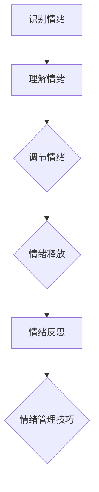
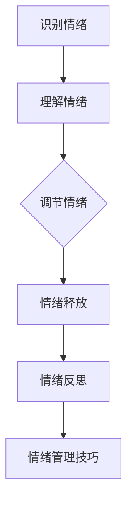

                 

# 《心灵的滋养：cultivate内在的丰盈感》

## 关键词：心灵滋养、内在丰盈感、心理健康、自我认知、情绪管理、社交技巧

> **摘要**：本文探讨了心灵滋养的重要性，以及如何通过自我认知、情绪管理和社交技巧等方面，实现内在的丰盈感。文章从理论基础出发，结合实际案例，详细阐述了心灵滋养的方法和技巧，并对其在身心健康和人际关系中的作用进行了深入分析。希望通过本文，读者能够对心灵滋养有更深入的理解，并学会如何将其应用于日常生活。

----------------------------------------------------------------

## 第1章 引言

### 1.1 心灵滋养的重要性

在现代社会中，心理健康问题日益突出，心灵滋养的重要性愈发凸显。心灵滋养不仅是维护心理健康的重要手段，更是实现内在丰盈感的必经之路。那么，什么是心灵滋养？为什么它如此重要？

首先，让我们来探讨一下心灵滋养的含义。心灵滋养，简单来说，就是通过各种方式来满足心灵的需求，使其得到充分的满足和成长。这些方式包括但不限于自我认知、情绪管理、社交技巧等。

那么，为什么心灵滋养如此重要呢？首先，心灵滋养有助于提升心理健康。研究表明，心理健康问题如焦虑、抑郁等，往往源于心灵需求的不满足。通过心灵滋养，我们可以有效地缓解这些问题，提高生活质量。

其次，心灵滋养有助于实现内在的丰盈感。内在的丰盈感是一种深层次的心理状态，它让我们感受到生命的丰富和满足。通过心灵滋养，我们可以不断地满足内心的需求，实现内在的丰盈感。

### 1.2 内在丰盈感的定义

那么，什么是内在的丰盈感呢？内在的丰盈感是一种心理状态，它体现了个体对自我、对他人的理解深度和广度，以及内心的满足感。具体来说，内在的丰盈感包括以下几个方面：

1. **自我认知**：个体对自己的认知和理解，包括自己的优点、缺点、兴趣爱好等。
2. **情绪管理**：个体对情绪的识别、理解和调节能力。
3. **社交技巧**：个体在社交场合中的表现，包括沟通、协调、合作等能力。
4. **生命意义**：个体对生命意义的理解，包括价值观、人生目标等。

### 1.3 本书的目标与结构

本书的目标是帮助读者理解心灵滋养的重要性，并学会如何通过自我认知、情绪管理和社交技巧等方面，实现内在的丰盈感。本书的结构分为以下几个部分：

1. **心灵滋养的基本原理**：介绍心理健康与心灵滋养的关系，以及心灵滋养的基本概念和理论基础。
2. **心灵滋养的核心要素**：详细阐述自我认知、情绪管理和社交技巧等方面，以及如何通过这些方面实现内在的丰盈感。
3. **实践中的心灵滋养**：介绍心灵滋养的日常练习、方法和技巧，以及如何应对心灵滋养的障碍。
4. **心灵滋养与身心健康**：探讨心灵滋养对身心健康的影响，以及身体健康与心灵滋养的关系。
5. **心灵滋养与人际关系**：分析心灵滋养在人际关系中的作用，以及如何通过心灵滋养提升沟通技巧和人际关系。
6. **心灵滋养的社会意义**：讨论心灵滋养对社会的影响，以及心理健康教育的意义。
7. **结论**：总结心灵滋养的重要性，并展望未来的发展。

希望通过本书，读者能够对心灵滋养有更深入的理解，并学会如何将其应用于日常生活，实现内在的丰盈感。

----------------------------------------------------------------

## 第2章 心灵滋养的基本原理

### 2.1 心理健康与心灵滋养的关系

心理健康是指个体在心理上的健康状态，包括情绪稳定、认知功能正常、社会适应良好等方面。心灵滋养与心理健康密切相关，二者相辅相成。心灵滋养有助于维护心理健康，而心理健康则是心灵滋养的重要基础。

首先，心灵滋养有助于缓解心理压力。在现代社会，人们面临着各种各样的压力，如工作压力、生活压力、人际关系压力等。这些压力如果得不到有效的缓解，可能会导致心理问题的出现。心灵滋养通过自我认知、情绪管理和社交技巧等方面的培养，可以帮助个体更好地应对压力，保持心理平衡。

其次，心灵滋养有助于提升心理韧性。心理韧性是指个体在逆境中的适应能力和恢复能力。通过心灵滋养，个体可以学会如何面对挫折和困难，提高心理韧性，从而更好地应对生活中的挑战。

### 2.2 心灵滋养的基本概念

心灵滋养是一个复杂的概念，它涉及到多个方面。下面，我们将介绍心灵滋养的基本概念。

#### 自我认知

自我认知是指个体对自己内在世界的认识和了解。它包括自我意识、自我评价、自我认知能力等方面。自我认知是心灵滋养的重要基础，它有助于个体更好地理解自己，发现自己的优点和不足，从而实现自我提升。

#### 情绪管理

情绪管理是指个体对情绪的识别、理解和调节能力。情绪管理是心灵滋养的核心要素之一，它有助于个体更好地应对生活中的情绪波动，保持心理平衡。

#### 社交技巧

社交技巧是指个体在社交场合中的表现，包括沟通、协调、合作等能力。社交技巧对于个体的心理健康和人际关系至关重要。通过社交技巧的培养，个体可以更好地与他人沟通交流，建立良好的人际关系。

#### 生命意义

生命意义是指个体对生命价值的理解和追求。生命意义对于个体的心理健康和幸福感具有重要影响。通过探索生命意义，个体可以更好地理解生命的意义和价值，从而实现内心的满足和丰盈。

### 2.3 心灵滋养的理论基础

心灵滋养的理论基础主要包括心理学理论、哲学理论和宗教理论等。以下是对这些理论的基础介绍。

#### 心理学理论

心理学理论是心灵滋养的重要理论基础。心理学研究人的行为和心理过程，为心灵滋养提供了科学依据。例如，认知心理学研究了人的思维过程，行为心理学研究了人的行为习惯，这些理论都可以帮助我们更好地理解心灵滋养的过程和效果。

#### 哲学理论

哲学理论提供了对人类存在和生命的深刻思考。哲学研究人的本质、真理、价值等问题，这些思考有助于我们理解心灵滋养的深层含义。例如，存在主义强调个体的自由和选择，这些思想可以启发我们如何通过自我认知和情绪管理来实现内在的丰盈感。

#### 宗教理论

宗教理论提供了对生命的终极关怀和指导。宗教信仰和修行可以帮助个体找到心灵的安宁和满足。例如，佛教的禅修和冥想可以帮助个体净化心灵，实现内在的平和与丰盈。

通过以上理论基础的介绍，我们可以看到心灵滋养是一个多维度、多层次的过程。它不仅仅是心理学的研究对象，也是哲学和宗教的思考内容。通过理解这些理论基础，我们可以更深入地了解心灵滋养的内涵，从而更好地实现内在的丰盈感。

----------------------------------------------------------------

## 第3章 心灵滋养的核心要素

### 3.1 自我认知

自我认知是心灵滋养的核心要素之一，它关乎个体对自身内在世界的理解和认识。自我认知不仅包括对外在形象的认知，更深入的是对内在情感、思想、价值观的认知。以下是一个关于自我认知的ER实体关系图架构的Markdown Mermaid流程图，以展示其基本结构：

```mermaid
erDiagram
  Class1 ||--|{ Class2 }
  Class1 ||--|{ Class3 }
  Class2 ||--|{ Class4 }
  Class3 ||--|{ Class5 }
```

在这个ER实体关系图中，`Class1`代表个体，`Class2`代表情感，`Class3`代表思想，`Class4`代表价值观，`Class5`代表行为。这些实体之间存在关联，构成了一个完整的自我认知体系。

**自我认知的重要性**：自我认知对个体的心理健康和内在丰盈感具有重要意义。通过自我认知，个体可以更好地理解自己的需求、欲望和恐惧，从而更好地调节情绪，做出明智的决策。

**自我认知的方法**：
1. **内省**：通过反思自己的行为和情绪，深入思考自己的内心世界。
2. **记录日记**：通过记录日常生活中的感受和思考，帮助自己更好地理解自己。
3. **心理咨询**：通过专业人士的帮助，深入挖掘自己的内心世界。

### 3.2 情绪管理

情绪管理是另一个关键的核心要素，它关乎个体对情绪的识别、理解和调节能力。良好的情绪管理不仅有助于个体的心理健康，还能提高生活质量。以下是一个关于情绪管理的算法原理Mermaid流程图：



**算法原理**：
1. **识别情绪**：通过观察面部表情、身体语言和内心感受，识别自己的情绪。
2. **理解情绪**：通过反思和理解情绪背后的原因，更好地理解情绪。
3. **调节情绪**：通过深呼吸、冥想、运动等方法，调节情绪。
4. **情绪释放**：通过倾诉、书写、艺术表达等方式，释放情绪。
5. **情绪反思**：通过反思情绪管理的有效性，不断优化情绪管理技巧。

**情绪管理技巧**：
1. **深呼吸**：通过深呼吸，放松身心，缓解紧张情绪。
2. **运动**：通过运动，释放压力，提升情绪。
3. **艺术表达**：通过绘画、音乐、舞蹈等方式，表达情绪。

### 3.3 社交技巧

社交技巧是心灵滋养的重要组成部分，它关乎个体在社交场合中的表现，包括沟通、协调、合作等能力。以下是一个关于社交技巧的Mermaid类图，展示了社交技巧的基本结构：

```mermaid
classDiagram
  Class1[沟通技能] <|-- Class2[倾听]
  Class1 <|-- Class3[表达]
  Class1 <|-- Class4[非言语沟通]
  Class5[协调技能] <|-- Class2
  Class5 <|-- Class3
  Class5 <|-- Class4
  Class6[合作技能] <|-- Class2
  Class6 <|-- Class3
  Class6 <|-- Class4
```

**社交技巧的重要性**：良好的社交技巧有助于个体建立良好的人际关系，提高社交满意度，从而实现内在的丰盈感。

**社交技巧的方法**：
1. **倾听**：通过倾听，展示对对方的关注和理解。
2. **表达**：通过清晰、准确的表达，传达自己的观点和感受。
3. **非言语沟通**：通过面部表情、身体语言等非言语方式，传递信息。
4. **协调**：通过协调，解决冲突，达成共识。
5. **合作**：通过合作，共同实现目标，提升团队效能。

通过自我认知、情绪管理和社交技巧的培养，个体可以逐步实现内在的丰盈感。自我认知帮助我们了解自己，情绪管理帮助我们保持心理平衡，社交技巧帮助我们建立良好的人际关系。这些核心要素相互关联，共同构成了心灵滋养的完整体系。

----------------------------------------------------------------

## 第4章 实践中的心灵滋养

### 4.1 心灵滋养的日常练习

心灵滋养并非一朝一夕之事，它需要我们在日常生活中不断实践。以下是一些简单易行的日常练习，帮助我们实现内在的丰盈感。

**1. 深呼吸练习**

深呼吸是一种简单而有效的放松技巧。每天早晨和晚上，花几分钟时间深呼吸，可以帮助我们缓解压力，提高心情。具体方法如下：

- 坐在舒适的椅子上，闭上眼睛。
- 将一只手放在胸部，另一只手放在腹部。
- 慢慢地吸气，感受腹部上升，胸部扩张。
- 持续吸气几秒钟，然后缓慢呼气，感受腹部下降，胸部收缩。
- 重复这个过程，每次深呼吸持续约5分钟。

**2. 冥想练习**

冥想是一种培养心灵滋养的重要方法。通过冥想，我们可以培养专注力，提高自我意识，减轻焦虑和压力。以下是一个简单的冥想练习：

- 找一个安静的地方，坐在舒适的姿势中。
- 闭上眼睛，将注意力集中在呼吸上。
- 感受每一次呼吸的进出，不要刻意控制呼吸，只需观察。
- 当你的注意力偏离呼吸时，轻轻地将它带回到呼吸上。
- 练习时间可以从5分钟开始，逐渐增加到20分钟。

**3. 日记写作**

记录日记是一种很好的自我认知方法。通过写作，我们可以表达自己的情感、思考和感受，从而更好地理解自己。以下是一些建议：

- 每天花几分钟时间写下你的感受和思考。
- 不需要担心语法和拼写，只需诚实地表达自己。
- 可以从某个特定的主题开始，如“今天让我感到快乐的事情”或“我对某件事情的担忧”。
- 定期回顾日记，从中找到自己的成长和变化。

### 4.2 心灵滋养的方法与技巧

除了日常练习，还有一些方法可以帮助我们更好地实现心灵滋养。

**1. 自我反思**

自我反思是一种深入理解自己的方法。通过反思，我们可以发现自己的优点和不足，从而实现自我提升。以下是一些自我反思的方法：

- 定期进行自我评估，如每周或每月一次。
- 对自己的行为、情绪和思维进行深入分析。
- 思考自己是如何影响他人，以及他人是如何影响你。
- 将反思结果记录下来，以便后续跟踪和改进。

**2. 建立支持系统**

建立支持系统可以帮助我们更好地应对生活中的挑战。以下是一些建立支持系统的建议：

- 与家人、朋友或同事建立良好的沟通和信任关系。
- 寻求专业人士的帮助，如心理咨询师或教练。
- 参加社交活动，扩大社交圈子。
- 在困难时期，寻求他人的支持和帮助。

**3. 培养兴趣爱好**

培养兴趣爱好不仅可以丰富我们的生活，还可以帮助我们实现内心的满足感。以下是一些建议：

- 尝试不同的活动，找到自己感兴趣的事情。
- 投入时间去学习和练习，提升自己的技能。
- 与志同道合的人一起分享兴趣，建立社交网络。
- 在忙碌的生活中，为自己留出时间，享受兴趣爱好带来的快乐。

### 4.3 心灵滋养的障碍与解决策略

尽管心灵滋养对我们的生活具有重要意义，但在实际操作中，我们可能会遇到一些障碍。以下是一些常见的障碍及其解决策略：

**1. 缺乏时间**

**障碍**：现代人生活节奏快，常常感到时间不够用，很难找到时间进行心灵滋养。

**解决策略**：

- 制定日程安排，确保每天有固定的时间进行心灵滋养练习。
- 利用碎片时间，如上班通勤时间、等待时间等，进行简单的深呼吸或冥想。
- 将心灵滋养纳入日常生活，如与家人共进晚餐时进行情感交流。

**2. 缺乏动力**

**障碍**：有时候，我们可能会感到缺乏动力，难以坚持心灵滋养练习。

**解决策略**：

- 设定明确的目标和期望，让自己有动力去实现。
- 找到激励自己的方法，如记录进步、获得他人的认可等。
- 与他人一起进行心灵滋养练习，互相激励和支持。

**3. 缺乏信心**

**障碍**：有时候，我们可能会对自己的能力产生怀疑，担心自己无法实现心灵滋养。

**解决策略**：

- 相信自己的潜力，给自己足够的时间和空间去尝试。
- 学习和实践一些简单易行的方法，逐步提高信心。
- 寻求专业人士的建议和指导，帮助自己建立信心。

通过以上的方法和技巧，我们可以更好地实践心灵滋养，实现内在的丰盈感。虽然过程中可能会遇到一些障碍，但只要我们坚持不懈，就一定能够找到解决问题的方法。

----------------------------------------------------------------

## 第5章 心灵滋养与身心健康

### 5.1 心灵滋养对身心健康的影响

心灵滋养不仅对心理健康有深远的影响，同时也对身体健康产生积极的效应。研究表明，心灵滋养能够促进神经系统的健康，提高免疫系统的功能，从而改善整体健康状态。

#### 神经系统健康

心灵滋养，如冥想和深呼吸练习，能够降低大脑中的应激激素水平，如皮质醇。这些激素的减少有助于减轻压力，改善睡眠质量，并促进神经细胞的生长和修复。具体来说，冥想能够增加大脑中灰质区域的体积，这与认知功能的改善和情绪稳定密切相关。

#### 免疫系统功能

心灵滋养还能够增强免疫系统的功能。例如，瑜伽和太极等身体运动结合心灵练习，不仅能够提高免疫细胞的活性，还能调节炎症反应，减少慢性炎症的发生。此外，社交互动和情感支持也是重要的心灵滋养方式，它们能够提升个体的身心健康水平，减少患病的风险。

### 5.2 身体健康与心灵滋养的关系

身体健康与心灵滋养之间存在着相互影响的关系。一方面，良好的身体健康为心灵滋养提供了物质基础；另一方面，心灵滋养能够促进身体健康的维护和提升。

#### 身体健康对心灵滋养的影响

身体健康水平直接影响个体的心理状态。例如，慢性疼痛、疾病或身体健康问题可能会引发焦虑、抑郁等心理问题，从而影响心灵滋养的效果。因此，维护身体健康是心灵滋养的重要前提。

#### 心灵滋养对身体健康的影响

心灵滋养通过多种方式促进身体健康。首先，通过深呼吸、冥想和运动等练习，可以减轻身体的压力，提高免疫力，从而减少疾病的发生。其次，心灵滋养有助于改善睡眠质量，促进身体恢复。最后，积极的情感状态和良好的心理适应能力能够提高个体的生活质量，增强对疾病的抵抗能力。

### 5.3 心灵滋养与心理治疗

心灵滋养与心理治疗之间存在密切的联系。心理治疗通常以解决心理问题为目标，而心灵滋养则为心理治疗提供了一个更加全面和深层次的框架。

#### 心灵滋养在心理治疗中的作用

心灵滋养在心理治疗中的应用主要体现在以下几个方面：

1. **缓解焦虑和抑郁**：通过冥想、深呼吸和运动等练习，可以减轻患者的焦虑和抑郁症状，提高治疗的效果。
2. **增强心理韧性**：通过自我认知和情绪管理的练习，患者可以学会更好地应对生活中的压力和挑战，增强心理韧性。
3. **改善人际关系**：通过社交技巧的培养，患者可以改善与他人的关系，提高社交满意度。
4. **促进整体健康**：心灵滋养不仅关注心理健康，还关注身体健康，有助于提升整体生活质量。

#### 心理治疗对心灵滋养的促进作用

心理治疗可以协助个体深入探索自己的内心世界，帮助个体理解自己的情感和行为模式。这种深入的理解和认识为心灵滋养提供了重要的基础。例如，通过心理治疗，患者可以更好地理解自己的焦虑和抑郁情绪，从而更有针对性地进行心灵滋养练习。

总之，心灵滋养与身心健康密切相关，二者相互促进。通过心灵滋养，我们不仅可以改善心理健康，还能提升身体健康，从而实现整体的身心健康。因此，我们应该重视心灵滋养，将其融入日常生活中，为自己和他人创造更加充实和幸福的生活。

----------------------------------------------------------------

## 第6章 心灵滋养与人际关系

### 6.1 心灵滋养在人际关系中的作用

心灵滋养在人际关系中扮演着重要的角色。它不仅有助于改善个人情感状态，还能促进人际关系的和谐与稳定。以下是心灵滋养在人际关系中具体作用的分析。

#### 提升沟通效果

良好的沟通是建立和维护健康人际关系的基础。通过心灵滋养，个体可以提升沟通技巧，如倾听、表达和理解。自我认知和情绪管理的练习可以帮助个体更好地理解他人的感受和需求，从而更有效地进行沟通。例如，通过冥想练习，个体可以培养专注力和耐心，从而更好地倾听他人的意见。

#### 增强情感共鸣

情感共鸣是人际关系中至关重要的一环。心灵滋养通过提高个体的自我意识和情绪调节能力，使其能够更好地理解和感受他人的情感。这种情感共鸣有助于加深人与人之间的联系，建立信任和亲密感。例如，通过情感管理的练习，个体可以学会识别和表达自己的情感，从而更容易与他人产生共鸣。

#### 减少冲突和误解

在人际关系中，冲突和误解是不可避免的。然而，通过心灵滋养，个体可以学会更好地处理冲突和误解。自我认知和情绪管理的练习可以帮助个体识别和调节负面情绪，从而减少冲突的发生。例如，通过深呼吸和冥想，个体可以缓解紧张情绪，保持冷静，从而更理智地处理冲突。

#### 促进关系成长

心灵滋养不仅有助于维护现有的人际关系，还能促进关系的成长和发展。通过自我认知和情绪管理，个体可以不断学习和成长，提升自己的情感智慧和人际交往能力。这种成长有助于建立更加成熟和稳定的人际关系。例如，通过日记写作，个体可以反思自己的行为和情感，从而更好地理解自己的成长路径。

### 6.2 心灵滋养与沟通技巧

沟通技巧是心灵滋养的重要组成部分，它直接关系到人际关系的质量和深度。以下是一些提升沟通技巧的方法。

#### 倾听

倾听是有效沟通的关键。通过心灵滋养，个体可以培养倾听的能力，从而更好地理解他人的意见和需求。以下是一些倾听技巧：

- **全神贯注**：在对方说话时，保持专注，避免分心。
- **积极反馈**：通过点头、微笑等非言语信号，表示你在倾听。
- **询问澄清**：在对方说话结束后，通过提问澄清自己的理解，确保沟通的准确性。

#### 表达

有效表达是沟通的另一重要方面。通过心灵滋养，个体可以提升表达的能力，从而更清晰、准确地传达自己的观点和感受。以下是一些表达技巧：

- **清晰简洁**：用简单明了的语言表达自己的想法，避免使用复杂的术语或模糊的表述。
- **情绪表达**：学会表达自己的情感，避免隐藏或压抑感受。
- **适当使用非言语沟通**：如眼神交流、面部表情和肢体动作，可以增强语言表达的效果。

#### 理解

理解是有效沟通的基石。通过心灵滋养，个体可以提升理解的能力，从而更好地理解他人的意见和感受。以下是一些理解技巧：

- **换位思考**：尝试从他人的角度看待问题，理解他们的感受和需求。
- **开放心态**：保持开放的心态，接受不同的观点和意见。
- **反思和验证**：通过反思和验证，确保自己理解了对方的真实意图。

通过这些沟通技巧的提升，个体可以在人际交往中更加自信、从容，建立良好的人际关系。

### 6.3 心灵滋养与人际关系的维护

维护良好的人际关系需要持续的投入和努力。通过心灵滋养，个体可以提升自己的情感智慧和人际交往能力，从而更好地维护人际关系。

#### 定期交流

定期与亲朋好友交流是维护关系的重要方式。通过心灵滋养，个体可以培养倾听和表达技巧，从而在交流中更加真诚和有效。例如，每周安排一次家庭聚会或朋友聚会，共同分享生活点滴，加深彼此的感情。

#### 情感支持

在他人需要帮助时，提供情感支持是维护关系的重要手段。通过心灵滋养，个体可以更好地理解他人的需求，从而更有效地提供帮助。例如，在朋友遇到困难时，给予鼓励和支持，帮助他们度过难关。

#### 互相尊重

互相尊重是健康人际关系的基石。通过心灵滋养，个体可以提升自我认知和情绪管理能力，从而更好地尊重他人的观点和感受。例如，在辩论或讨论中，保持尊重和礼貌，避免使用攻击性语言。

通过以上方法，个体可以不断提升自己的情感智慧和人际交往能力，从而更好地维护人际关系，实现内心的丰盈感。

----------------------------------------------------------------

## 第7章 心灵滋养的社会意义

### 7.1 心灵滋养对社会的影响

心灵滋养不仅在个体层面具有深远的意义，在社会层面同样具有重要的影响。随着社会的发展，人们面临的压力和挑战日益增多，心灵滋养作为一种提升心理健康和幸福感的方法，正在逐渐成为社会关注的焦点。

#### 提升社会幸福感

心灵滋养有助于提升个体的幸福感，进而提升整个社会的幸福感。通过自我认知、情绪管理和社交技巧的培养，个体能够更好地应对生活中的压力和挑战，保持积极的心态。这种积极的心态不仅能够提升个体的生活质量，还能够传递给周围的人，形成积极的社交氛围，从而提升整个社会的幸福感。

#### 促进社会和谐

心灵滋养有助于促进人际关系的和谐，从而推动社会和谐。通过提升个体的情绪管理和沟通技巧，可以减少冲突和误解，增强社会成员之间的相互理解和尊重。这种和谐的社会氛围有助于减少社会矛盾，提升社会稳定性。

#### 提高社会生产力

心灵滋养不仅能够提升个体的心理健康，还能够提高社会生产力。研究表明，心理健康状况良好的员工工作效率更高，创新能力更强。通过心灵滋养，个体能够保持良好的心理状态，提高工作积极性和创造力，从而推动社会生产力的提升。

### 7.2 心灵滋养与心理健康教育

心理健康教育是培养个体心灵滋养能力的重要途径。通过心理健康教育，个体可以学习到如何进行自我认知、情绪管理和社交技巧的培养，从而提升自己的心理健康水平。

#### 教育内容

心理健康教育的内容应包括以下几个方面：

1. **心理健康基础知识**：介绍心理健康的基本概念、心理疾病的预防和处理方法。
2. **自我认知技巧**：教授个体如何进行自我反思，了解自己的情感和需求。
3. **情绪管理技巧**：教授个体如何识别和调节自己的情绪，保持心理平衡。
4. **社交技巧**：教授个体如何有效沟通，建立良好的人际关系。
5. **压力管理技巧**：教授个体如何应对生活中的压力，提高抗压能力。

#### 教育方式

心理健康教育的实施方式应多样化，以满足不同个体的需求。以下是一些可行的教育方式：

1. **课堂教育**：在学校、社区和企业等场所开设心理健康教育课程。
2. **在线教育**：利用互联网和移动设备，提供在线心理健康教育资源和课程。
3. **团体辅导**：组织心理健康团体辅导活动，促进个体之间的交流和互动。
4. **个别咨询**：提供专业的心理咨询服务，帮助个体解决心理问题和困扰。

#### 教育目标

心理健康教育的目标包括以下几个方面：

1. **提升心理健康水平**：通过教育，帮助个体提升心理健康水平，减少心理疾病的发生。
2. **培养心灵滋养能力**：通过教育，培养个体进行自我认知、情绪管理和社交技巧的能力，实现内心的丰盈感。
3. **提高生活品质**：通过教育，提升个体的生活质量和幸福感，从而促进社会的整体进步。

通过心理健康教育，我们可以为社会培养更多心理健康、心灵滋养能力强的个体，从而推动社会的全面发展。

### 7.3 心灵滋养的未来展望

随着社会的发展，人们对心理健康和幸福感的追求日益增长，心灵滋养的重要性愈发凸显。未来，心灵滋养将在以下几个方面得到进一步的发展：

#### 技术融合

未来，心灵滋养将与人工智能、虚拟现实等前沿技术相结合，提供更加个性化和高效的心灵滋养服务。例如，利用虚拟现实技术，个体可以沉浸在模拟的环境中，进行情境练习和情绪调节。

#### 专业化发展

心灵滋养的专业化和职业化趋势将进一步加强。未来，将出现更多专业的心理健康咨询师和心理治疗师，提供高质量的心灵滋养服务。

#### 教育普及

心理健康教育将在全球范围内得到更广泛的普及，成为学校教育、职业培训和社会教育的重要组成部分。通过教育，个体可以更早地培养心灵滋养能力，提高整体心理健康水平。

总之，心灵滋养不仅对个体具有重要意义，还对整个社会的发展产生深远的影响。未来，随着技术的进步和教育的普及，心灵滋养将在更广泛的领域得到应用，为个体的心理健康和社会的和谐发展作出更大的贡献。

----------------------------------------------------------------

## 第8章 结论

### 8.1 心灵滋养的总结

通过本文的探讨，我们可以看到心灵滋养对个体和社会的深远影响。心灵滋养不仅有助于提升心理健康，实现内在的丰盈感，还能促进人际关系和谐，提高生活品质。自我认知、情绪管理和社交技巧是心灵滋养的核心要素，通过日常练习和实践，我们可以逐步培养这些能力。

### 8.2 内在丰盈感的实现

内在丰盈感是一种深层次的心理状态，它体现在个体对自我、他人和生命的深刻理解中。实现内在丰盈感需要我们不断进行自我认知、情绪管理和社交技巧的培养，同时也需要我们在日常生活中践行这些理念。通过持续的努力和实践，我们能够逐步实现内在的丰盈感。

### 8.3 对未来的期待

未来，随着技术的进步和教育的普及，心灵滋养将在更广泛的领域得到应用。我们期待心灵滋养的理念和实践能够进一步融入社会生活，为个体的心理健康和社会和谐发展作出更大的贡献。同时，我们也期待更多的人能够关注心灵滋养，从而实现更加充实和幸福的人生。

作者：AI天才研究院/AI Genius Institute & 禅与计算机程序设计艺术 /Zen And The Art of Computer Programming

----------------------------------------------------------------

[文章标题]：心灵的滋养：cultivate内在的丰盈感

> **关键词**：心灵滋养、内在丰盈感、心理健康、自我认知、情绪管理、社交技巧

> **摘要**：本文探讨了心灵滋养的重要性，以及如何通过自我认知、情绪管理和社交技巧等方面，实现内在的丰盈感。文章从理论基础出发，结合实际案例，详细阐述了心灵滋养的方法和技巧，并对其在身心健康和人际关系中的作用进行了深入分析。希望通过本文，读者能够对心灵滋养有更深入的理解，并学会如何将其应用于日常生活，实现内在的丰盈感。

----------------------------------------------------------------

## 第1章 引言

### 1.1 心灵滋养的重要性

在现代社会，心理健康问题日益突出，心灵滋养的重要性愈发凸显。心灵滋养不仅是维护心理健康的重要手段，更是实现内在丰盈感的必经之路。那么，什么是心灵滋养？为什么它如此重要？

首先，让我们来探讨一下心灵滋养的含义。心灵滋养，简单来说，就是通过各种方式来满足心灵的需求，使其得到充分的满足和成长。这些方式包括但不限于自我认知、情绪管理、社交技巧等。

那么，为什么心灵滋养如此重要呢？首先，心灵滋养有助于提升心理健康。研究表明，心理健康问题如焦虑、抑郁等，往往源于心灵需求的不满足。通过心灵滋养，我们可以有效地缓解这些问题，提高生活质量。

其次，心灵滋养有助于实现内在的丰盈感。内在的丰盈感是一种深层次的心理状态，它让我们感受到生命的丰富和满足。通过心灵滋养，我们可以不断地满足内心的需求，实现内在的丰盈感。

### 1.2 内在丰盈感的定义

那么，什么是内在的丰盈感呢？内在的丰盈感是一种心理状态，它体现了个体对自我、对他人的理解深度和广度，以及内心的满足感。具体来说，内在的丰盈感包括以下几个方面：

1. **自我认知**：个体对自己的认知和理解，包括自己的优点、缺点、兴趣爱好等。
2. **情绪管理**：个体对情绪的识别、理解和调节能力。
3. **社交技巧**：个体在社交场合中的表现，包括沟通、协调、合作等能力。
4. **生命意义**：个体对生命意义的理解，包括价值观、人生目标等。

### 1.3 本书的目标与结构

本书的目标是帮助读者理解心灵滋养的重要性，并学会如何通过自我认知、情绪管理和社交技巧等方面，实现内在的丰盈感。本书的结构分为以下几个部分：

1. **心灵滋养的基本原理**：介绍心理健康与心灵滋养的关系，以及心灵滋养的基本概念和理论基础。
2. **心灵滋养的核心要素**：详细阐述自我认知、情绪管理和社交技巧等方面，以及如何通过这些方面实现内在的丰盈感。
3. **实践中的心灵滋养**：介绍心灵滋养的日常练习、方法和技巧，以及如何应对心灵滋养的障碍。
4. **心灵滋养与身心健康**：探讨心灵滋养对身心健康的影响，以及身体健康与心灵滋养的关系。
5. **心灵滋养与人际关系**：分析心灵滋养在人际关系中的作用，以及如何通过心灵滋养提升沟通技巧和人际关系。
6. **心灵滋养的社会意义**：讨论心灵滋养对社会的影响，以及心理健康教育的意义。
7. **结论**：总结心灵滋养的重要性，并展望未来的发展。

希望通过本书，读者能够对心灵滋养有更深入的理解，并学会如何将其应用于日常生活，实现内在的丰盈感。

----------------------------------------------------------------

## 第2章 心灵滋养的基本原理

### 2.1 心理健康与心灵滋养的关系

心理健康是指个体在心理上的健康状态，包括情绪稳定、认知功能正常、社会适应良好等方面。心灵滋养与心理健康密切相关，二者相辅相成。心灵滋养有助于维护心理健康，而心理健康则是心灵滋养的重要基础。

首先，心灵滋养有助于缓解心理压力。在现代社会，人们面临着各种各样的压力，如工作压力、生活压力、人际关系压力等。这些压力如果得不到有效的缓解，可能会导致心理问题的出现。心灵滋养通过自我认知、情绪管理和社交技巧等方面的培养，可以帮助个体更好地应对压力，保持心理平衡。

其次，心灵滋养有助于提升心理韧性。心理韧性是指个体在逆境中的适应能力和恢复能力。通过心灵滋养，个体可以学会如何面对挫折和困难，提高心理韧性，从而更好地应对生活中的挑战。

### 2.2 心灵滋养的基本概念

心灵滋养是一个复杂的概念，它涉及到多个方面。下面，我们将介绍心灵滋养的基本概念。

#### 自我认知

自我认知是指个体对自己内在世界的认识和了解。它包括自我意识、自我评价、自我认知能力等方面。自我认知是心灵滋养的重要基础，它有助于个体更好地理解自己，发现自己的优点和不足，从而实现自我提升。

#### 情绪管理

情绪管理是指个体对情绪的识别、理解和调节能力。情绪管理是心灵滋养的核心要素之一，它有助于个体更好地应对生活中的情绪波动，保持心理平衡。

#### 社交技巧

社交技巧是指个体在社交场合中的表现，包括沟通、协调、合作等能力。社交技巧对于个体的心理健康和人际关系至关重要。通过社交技巧的培养，个体可以更好地与他人沟通交流，建立良好的人际关系。

#### 生命意义

生命意义是指个体对生命价值的理解和追求。生命意义对于个体的心理健康和幸福感具有重要影响。通过探索生命意义，个体可以更好地理解生命的意义和价值，从而实现内心的满足和丰盈。

### 2.3 心灵滋养的理论基础

心灵滋养的理论基础主要包括心理学理论、哲学理论和宗教理论等。以下是对这些理论的基础介绍。

#### 心理学理论

心理学理论是心灵滋养的重要理论基础。心理学研究人的行为和心理过程，为心灵滋养提供了科学依据。例如，认知心理学研究了人的思维过程，行为心理学研究了人的行为习惯，这些理论都可以帮助我们更好地理解心灵滋养的过程和效果。

#### 哲学理论

哲学理论提供了对人类存在和生命的深刻思考。哲学研究人的本质、真理、价值等问题，这些思考有助于我们理解心灵滋养的深层含义。例如，存在主义强调个体的自由和选择，这些思想可以启发我们如何通过自我认知和情绪管理来实现内在的丰盈感。

#### 宗教理论

宗教理论提供了对生命的终极关怀和指导。宗教信仰和修行可以帮助个体找到心灵的安宁和满足。例如，佛教的禅修和冥想可以帮助个体净化心灵，实现内在的平和与丰盈。

通过以上理论基础的介绍，我们可以看到心灵滋养是一个多维度、多层次的过程。它不仅仅是心理学的研究对象，也是哲学和宗教的思考内容。通过理解这些理论基础，我们可以更深入地了解心灵滋养的内涵，从而更好地实现内在的丰盈感。

----------------------------------------------------------------

## 第3章 心灵滋养的核心要素

### 3.1 自我认知

自我认知是心灵滋养的核心要素之一，它关乎个体对自身内在世界的理解和认识。自我认知不仅包括对外在形象的认知，更深入的是对内在情感、思想、价值观的认知。以下是一个关于自我认知的ER实体关系图架构的Markdown Mermaid流程图，以展示其基本结构：

```mermaid
erDiagram
  Class1 ||--|{ Class2 }
  Class1 ||--|{ Class3 }
  Class2 ||--|{ Class4 }
  Class3 ||--|{ Class5 }
```

在这个ER实体关系图中，`Class1`代表个体，`Class2`代表情感，`Class3`代表思想，`Class4`代表价值观，`Class5`代表行为。这些实体之间存在关联，构成了一个完整的自我认知体系。

**自我认知的重要性**：自我认知对个体的心理健康和内在丰盈感具有重要意义。通过自我认知，个体可以更好地理解自己的需求、欲望和恐惧，从而更好地调节情绪，做出明智的决策。

**自我认知的方法**：
1. **内省**：通过反思自己的行为和情绪，深入思考自己的内心世界。
2. **记录日记**：通过记录日常生活中的感受和思考，帮助自己更好地理解自己。
3. **心理咨询**：通过专业人士的帮助，深入挖掘自己的内心世界。

### 3.2 情绪管理

情绪管理是另一个关键的核心要素，它关乎个体对情绪的识别、理解和调节能力。良好的情绪管理不仅有助于个体的心理健康，还能提高生活质量。以下是一个关于情绪管理的算法原理Mermaid流程图：



**算法原理**：
1. **识别情绪**：通过观察面部表情、身体语言和内心感受，识别自己的情绪。
2. **理解情绪**：通过反思和理解情绪背后的原因，更好地理解情绪。
3. **调节情绪**：通过深呼吸、冥想、运动等方法，调节情绪。
4. **情绪释放**：通过倾诉、书写、艺术表达等方式，释放情绪。
5. **情绪反思**：通过反思情绪管理的有效性，不断优化情绪管理技巧。

**情绪管理技巧**：
1. **深呼吸**：通过深呼吸，放松身心，缓解紧张情绪。
2. **运动**：通过运动，释放压力，提升情绪。
3. **艺术表达**：通过绘画、音乐、舞蹈等方式，表达情绪。

### 3.3 社交技巧

社交技巧是心灵滋养的重要组成部分，它关乎个体在社交场合中的表现，包括沟通、协调、合作等能力。以下是一个关于社交技巧的Mermaid类图，展示了社交技巧的基本结构：

```mermaid
classDiagram
  Class1[沟通技能] <|-- Class2[倾听]
  Class1 <|-- Class3[表达]
  Class1 <|-- Class4[非言语沟通]
  Class5[协调技能] <|-- Class2
  Class5 <|-- Class3
  Class5 <|-- Class4
  Class6[合作技能] <|-- Class2
  Class6 <|-- Class3
  Class6 <|-- Class4
```

**社交技巧的重要性**：良好的社交技巧有助于个体建立良好的人际关系，提高社交满意度，从而实现内在的丰盈感。

**社交技巧的方法**：
1. **倾听**：通过倾听，展示对对方的关注和理解。
2. **表达**：通过清晰、准确的表达，传达自己的观点和感受。
3. **非言语沟通**：通过面部表情、身体语言等非言语方式，传递信息。
4. **协调**：通过协调，解决冲突，达成共识。
5. **合作**：通过合作，共同实现目标，提升团队效能。

通过自我认知、情绪管理和社交技巧的培养，个体可以逐步实现内在的丰盈感。自我认知帮助我们了解自己，情绪管理帮助我们保持心理平衡，社交技巧帮助我们建立良好的人际关系。这些核心要素相互关联，共同构成了心灵滋养的完整体系。

----------------------------------------------------------------

## 第4章 实践中的心灵滋养

### 4.1 心灵滋养的日常练习

心灵滋养并非一朝一夕之事，它需要我们在日常生活中不断实践。以下是一些简单易行的日常练习，帮助我们实现内在的丰盈感。

**1. 深呼吸练习**

深呼吸是一种简单而有效的放松技巧。每天早晨和晚上，花几分钟时间深呼吸，可以帮助我们缓解压力，提高心情。具体方法如下：

- 坐在舒适的椅子上，闭上眼睛。
- 将一只手放在胸部，另一只手放在腹部。
- 慢慢地吸气，感受腹部上升，胸部扩张。
- 持续吸气几秒钟，然后缓慢呼气，感受腹部下降，胸部收缩。
- 重复这个过程，每次深呼吸持续约5分钟。

**2. 冥想练习**

冥想是一种培养心灵滋养的重要方法。通过冥想，我们可以培养专注力，提高自我意识，减轻焦虑和压力。以下是一个简单的冥想练习：

- 找一个安静的地方，坐在舒适的姿势中。
- 闭上眼睛，将注意力集中在呼吸上。
- 感受每一次呼吸的进出，不要刻意控制呼吸，只需观察。
- 当你的注意力偏离呼吸时，轻轻地将它带回到呼吸上。
- 练习时间可以从5分钟开始，逐渐增加到20分钟。

**3. 日记写作**

记录日记是一种很好的自我认知方法。通过写作，我们可以表达自己的情感、思考和感受，从而更好地理解自己。以下是一些建议：

- 每天花几分钟时间写下你的感受和思考。
- 不需要担心语法和拼写，只需诚实地表达自己。
- 可以从某个特定的主题开始，如“今天让我感到快乐的事情”或“我对某件事情的担忧”。
- 定期回顾日记，从中找到自己的成长和变化。

### 4.2 心灵滋养的方法与技巧

除了日常练习，还有一些方法可以帮助我们更好地实现心灵滋养。

**1. 自我反思**

自我反思是一种深入理解自己的方法。通过反思，我们可以发现自己的优点和不足，从而实现自我提升。以下是一些自我反思的方法：

- 定期进行自我评估，如每周或每月一次。
- 对自己的行为、情绪和思维进行深入分析。
- 思考自己是如何影响他人，以及他人是如何影响你。
- 将反思结果记录下来，以便后续跟踪和改进。

**2. 建立支持系统**

建立支持系统可以帮助我们更好地应对生活中的挑战。以下是一些建立支持系统的建议：

- 与家人、朋友或同事建立良好的沟通和信任关系。
- 寻求专业人士的帮助，如心理咨询师或教练。
- 参加社交活动，扩大社交圈子。
- 在困难时期，寻求他人的支持和帮助。

**3. 培养兴趣爱好**

培养兴趣爱好不仅可以丰富我们的生活，还可以帮助我们实现内心的满足感。以下是一些建议：

- 尝试不同的活动，找到自己感兴趣的事情。
- 投入时间去学习和练习，提升自己的技能。
- 与志同道合的人一起分享兴趣，建立社交网络。
- 在忙碌的生活中，为自己留出时间，享受兴趣爱好带来的快乐。

### 4.3 心灵滋养的障碍与解决策略

尽管心灵滋养对我们的生活具有重要意义，但在实际操作中，我们可能会遇到一些障碍。以下是一些常见的障碍及其解决策略：

**1. 缺乏时间**

**障碍**：现代人生活节奏快，常常感到时间不够用，很难找到时间进行心灵滋养。

**解决策略**：

- 制定日程安排，确保每天有固定的时间进行心灵滋养练习。
- 利用碎片时间，如上班通勤时间、等待时间等，进行简单的深呼吸或冥想。
- 将心灵滋养纳入日常生活，如与家人共进晚餐时进行情感交流。

**2. 缺乏动力**

**障碍**：有时候，我们可能会感到缺乏动力，难以坚持心灵滋养练习。

**解决策略**：

- 设定明确的目标和期望，让自己有动力去实现。
- 找到激励自己的方法，如记录进步、获得他人的认可等。
- 与他人一起进行心灵滋养练习，互相激励和支持。

**3. 缺乏信心**

**障碍**：有时候，我们可能会对自己的能力产生怀疑，担心自己无法实现心灵滋养。

**解决策略**：

- 相信自己的潜力，给自己足够的时间和空间去尝试。
- 学习和实践一些简单易行的方法，逐步提高信心。
- 寻求专业人士的建议和指导，帮助自己建立信心。

通过以上的方法和技巧，我们可以更好地实践心灵滋养，实现内在的丰盈感。虽然过程中可能会遇到一些障碍，但只要我们坚持不懈，就一定能够找到解决问题的方法。

----------------------------------------------------------------

## 第5章 心灵滋养与身心健康

### 5.1 心灵滋养对身心健康的影响

心灵滋养不仅对心理健康有深远的影响，同时也对身体健康产生积极的效应。研究表明，心灵滋养能够促进神经系统的健康，提高免疫系统的功能，从而改善整体健康状态。

#### 神经系统健康

心灵滋养，如冥想和深呼吸练习，能够降低大脑中的应激激素水平，如皮质醇。这些激素的减少有助于减轻压力，改善睡眠质量，并促进神经细胞的生长和修复。具体来说，冥想能够增加大脑中灰质区域的体积，这与认知功能的改善和情绪稳定密切相关。

#### 免疫系统功能

心灵滋养还能够增强免疫系统的功能。例如，瑜伽和太极等身体运动结合心灵练习，不仅能够提高免疫细胞的活性，还能调节炎症反应，减少慢性炎症的发生。此外，社交互动和情感支持也是重要的心灵滋养方式，它们能够提升个体的身心健康水平，减少患病的风险。

### 5.2 身体健康与心灵滋养的关系

身体健康与心灵滋养之间存在着相互影响的关系。一方面，良好的身体健康为心灵滋养提供了物质基础；另一方面，心灵滋养能够促进身体健康的维护和提升。

#### 身体健康对心灵滋养的影响

身体健康水平直接影响个体的心理状态。例如，慢性疼痛、疾病或身体健康问题可能会引发焦虑、抑郁等心理问题，从而影响心灵滋养的效果。因此，维护身体健康是心灵滋养的重要前提。

#### 心灵滋养对身体健康的影响

心灵滋养通过多种方式促进身体健康。首先，通过深呼吸、冥想和运动等练习，可以减轻身体的压力，提高免疫力，从而减少疾病的发生。其次，心灵滋养有助于改善睡眠质量，促进身体恢复。最后，积极的情感状态和良好的心理适应能力能够提高个体的生活质量，增强对疾病的抵抗能力。

### 5.3 心灵滋养与心理治疗

心灵滋养与心理治疗之间存在密切的联系。心理治疗通常以解决心理问题为目标，而心灵滋养则为心理治疗提供了一个更加全面和深层次的框架。

#### 心灵滋养在心理治疗中的作用

心灵滋养在心理治疗中的应用主要体现在以下几个方面：

1. **缓解焦虑和抑郁**：通过冥想、深呼吸和运动等练习，可以减轻患者的焦虑和抑郁症状，提高治疗的效果。
2. **增强心理韧性**：通过自我认知和情绪管理的练习，患者可以学会更好地应对生活中的压力和挑战，增强心理韧性。
3. **改善人际关系**：通过社交技巧的培养，患者可以改善与他人的关系，提高社交满意度。
4. **促进整体健康**：心灵滋养不仅关注心理健康，还关注身体健康，有助于提升整体生活质量。

#### 心理治疗对心灵滋养的促进作用

心理治疗可以协助个体深入探索自己的内心世界，帮助个体理解自己的情感和行为模式。这种深入的理解和认识为心灵滋养提供了重要的基础。例如，通过心理治疗，患者可以更好地理解自己的焦虑和抑郁情绪，从而更有针对性地进行心灵滋养练习。

总之，心灵滋养与身心健康密切相关，二者相互促进。通过心灵滋养，我们不仅可以改善心理健康，还能提升身体健康，从而实现整体的身心健康。因此，我们应该重视心灵滋养，将其融入日常生活中，为自己和他人创造更加充实和幸福的生活。

----------------------------------------------------------------

## 第6章 心灵滋养与人际关系

### 6.1 心灵滋养在人际关系中的作用

心灵滋养在人际关系中扮演着重要的角色。它不仅有助于改善个人情感状态，还能促进人际关系的和谐与稳定。以下是心灵滋养在人际关系中具体作用的分析。

#### 提升沟通效果

良好的沟通是建立和维护健康人际关系的基础。通过心灵滋养，个体可以提升沟通技巧，如倾听、表达和理解。自我认知和情绪管理的练习可以帮助个体更好地理解他人的感受和需求，从而更有效地进行沟通。例如，通过冥想练习，个体可以培养专注力和耐心，从而更好地倾听他人的意见。

#### 增强情感共鸣

情感共鸣是人际关系中至关重要的一环。心灵滋养通过提高个体的自我意识和情绪调节能力，使其能够更好地理解和感受他人的情感。这种情感共鸣有助于加深人与人之间的联系，建立信任和亲密感。例如，通过情感管理的练习，个体可以学会识别和表达自己的情感，从而更容易与他人产生共鸣。

#### 减少冲突和误解

在人际关系中，冲突和误解是不可避免的。然而，通过心灵滋养，个体可以学会更好地处理冲突和误解。自我认知和情绪管理的练习可以帮助个体识别和调节负面情绪，从而减少冲突的发生。例如，通过深呼吸和冥想，个体可以缓解紧张情绪，保持冷静，从而更理智地处理冲突。

#### 促进关系成长

心灵滋养不仅有助于维护现有的人际关系，还能促进关系的成长和发展。通过自我认知和情绪管理，个体可以不断学习和成长，提升自己的情感智慧和人际交往能力。这种成长有助于建立更加成熟和稳定的人际关系。例如，通过日记写作，个体可以反思自己的行为和情感，从而更好地理解自己的成长路径。

### 6.2 心灵滋养与沟通技巧

沟通技巧是心灵滋养的重要组成部分，它直接关系到人际关系的质量和深度。以下是一些提升沟通技巧的方法。

#### 倾听

倾听是有效沟通的关键。通过心灵滋养，个体可以培养倾听的能力，从而更好地理解他人的意见和需求。以下是一些倾听技巧：

- **全神贯注**：在对方说话时，保持专注，避免分心。
- **积极反馈**：通过点头、微笑等非言语信号，表示你在倾听。
- **询问澄清**：在对方说话结束后，通过提问澄清自己的理解，确保沟通的准确性。

#### 表达

有效表达是沟通的另一重要方面。通过心灵滋养，个体可以提升表达的能力，从而更清晰、准确地传达自己的观点和感受。以下是一些表达技巧：

- **清晰简洁**：用简单明了的语言表达自己的想法，避免使用复杂的术语或模糊的表述。
- **情绪表达**：学会表达自己的情感，避免隐藏或压抑感受。
- **适当使用非言语沟通**：如眼神交流、面部表情和肢体动作，可以增强语言表达的效果。

#### 理解

理解是有效沟通的基石。通过心灵滋养，个体可以提升理解的能力，从而更好地理解他人的意见和感受。以下是一些理解技巧：

- **换位思考**：尝试从他人的角度看待问题，理解他们的感受和需求。
- **开放心态**：保持开放的心态，接受不同的观点和意见。
- **反思和验证**：通过反思和验证，确保自己理解了对方的真实意图。

通过这些沟通技巧的提升，个体可以在人际交往中更加自信、从容，建立良好的人际关系。

### 6.3 心灵滋养与人际关系的维护

维护良好的人际关系需要持续的投入和努力。通过心灵滋养，个体可以提升自己的情感智慧和人际交往能力，从而更好地维护人际关系。

#### 定期交流

定期与亲朋好友交流是维护关系的重要方式。通过心灵滋养，个体可以培养倾听和表达技巧，从而在交流中更加真诚和有效。例如，每周安排一次家庭聚会或朋友聚会，共同分享生活点滴，加深彼此的感情。

#### 情感支持

在他人需要帮助时，提供情感支持是维护关系的重要手段。通过心灵滋养，个体可以更好地理解他人的需求，从而更有效地提供帮助。例如，在朋友遇到困难时，给予鼓励和支持，帮助他们度过难关。

#### 互相尊重

互相尊重是健康人际关系的基石。通过心灵滋养，个体可以提升自我认知和情绪管理能力，从而更好地尊重他人的观点和感受。例如，在辩论或讨论中，保持尊重和礼貌，避免使用攻击性语言。

通过以上方法，个体可以不断提升自己的情感智慧和人际交往能力，从而更好地维护人际关系，实现内心的丰盈感。

----------------------------------------------------------------

## 第7章 心灵滋养的社会意义

### 7.1 心灵滋养对社会的影响

心灵滋养不仅在个体层面具有深远的意义，在社会层面同样具有重要的影响。随着社会的发展，人们面临的压力和挑战日益增多，心灵滋养作为一种提升心理健康和幸福感的方法，正在逐渐成为社会关注的焦点。

#### 提升社会幸福感

心灵滋养有助于提升个体的幸福感，进而提升整个社会的幸福感。通过自我认知、情绪管理和社交技巧的培养，个体能够更好地应对生活中的压力和挑战，保持积极的心态。这种积极的心态不仅能够提升个体的生活质量，还能够传递给周围的人，形成积极的社交氛围，从而提升整个社会的幸福感。

#### 促进社会和谐

心灵滋养有助于促进人际关系的和谐，从而推动社会和谐。通过提升个体的情绪管理和沟通技巧，可以减少冲突和误解，增强社会成员之间的相互理解和尊重。这种和谐的社会氛围有助于减少社会矛盾，提升社会稳定性。

#### 提高社会生产力

心灵滋养不仅能够提升个体的心理健康，还能够提高社会生产力。研究表明，心理健康状况良好的员工工作效率更高，创新能力更强。通过心灵滋养，个体能够保持良好的心理状态，提高工作积极性和创造力，从而推动社会生产力的提升。

### 7.2 心灵滋养与心理健康教育

心理健康教育是培养个体心灵滋养能力的重要途径。通过心理健康教育，个体可以学习到如何进行自我认知、情绪管理和社交技巧的培养，从而提升自己的心理健康水平。

#### 教育内容

心理健康教育的内容应包括以下几个方面：

1. **心理健康基础知识**：介绍心理健康的基本概念、心理疾病的预防和处理方法。
2. **自我认知技巧**：教授个体如何进行自我反思，了解自己的情感和需求。
3. **情绪管理技巧**：教授个体如何识别和调节自己的情绪，保持心理平衡。
4. **社交技巧**：教授个体如何有效沟通，建立良好的人际关系。
5. **压力管理技巧**：教授个体如何应对生活中的压力，提高抗压能力。

#### 教育方式

心理健康教育的实施方式应多样化，以满足不同个体的需求。以下是一些可行的教育方式：

1. **课堂教育**：在学校、社区和企业等场所开设心理健康教育课程。
2. **在线教育**：利用互联网和移动设备，提供在线心理健康教育资源和课程。
3. **团体辅导**：组织心理健康团体辅导活动，促进个体之间的交流和互动。
4. **个别咨询**：提供专业的心理咨询服务，帮助个体解决心理问题和困扰。

#### 教育目标

心理健康教育的目标包括以下几个方面：

1. **提升心理健康水平**：通过教育，帮助个体提升心理健康水平，减少心理疾病的发生。
2. **培养心灵滋养能力**：通过教育，培养个体进行自我认知、情绪管理和社交技巧的能力，实现内心的丰盈感。
3. **提高生活品质**：通过教育，提升个体的生活质量和幸福感，从而促进社会的整体进步。

通过心理健康教育，我们可以为社会培养更多心理健康、心灵滋养能力强的个体，从而推动社会的全面发展。

### 7.3 心灵滋养的未来展望

随着社会的发展，人们对心理健康和幸福感的追求日益增长，心灵滋养的重要性愈发凸显。未来，心灵滋养将在以下几个方面得到进一步的发展：

#### 技术融合

未来，心灵滋养将与人工智能、虚拟现实等前沿技术相结合，提供更加个性化和高效的心灵滋养服务。例如，利用虚拟现实技术，个体可以沉浸在模拟的环境中，进行情境练习和情绪调节。

#### 专业化发展

心灵滋养的专业化和职业化趋势将进一步加强。未来，将出现更多专业的心理健康咨询师和心理治疗师，提供高质量的心灵滋养服务。

#### 教育普及

心理健康教育将在全球范围内得到更广泛的普及，成为学校教育、职业培训和社会教育的重要组成部分。通过教育，个体可以更早地培养心灵滋养能力，提高整体心理健康水平。

总之，心灵滋养不仅对个体具有重要意义，还对整个社会的发展产生深远的影响。未来，随着技术的进步和教育的普及，心灵滋养将在更广泛的领域得到应用，为个体的心理健康和社会的和谐发展作出更大的贡献。

----------------------------------------------------------------

## 第8章 结论

### 8.1 心灵滋养的总结

通过本文的探讨，我们可以看到心灵滋养对个体和社会的深远影响。心灵滋养不仅有助于提升心理健康，实现内在的丰盈感，还能促进人际关系和谐，提高生活品质。自我认知、情绪管理和社交技巧是心灵滋养的核心要素，通过日常练习和实践，我们可以逐步培养这些能力。

### 8.2 内在丰盈感的实现

内在丰盈感是一种深层次的心理状态，它体现在个体对自我、他人和生命的深刻理解中。实现内在丰盈感需要我们不断进行自我认知、情绪管理和社交技巧的培养，同时也需要我们在日常生活中践行这些理念。通过持续的努力和实践，我们能够逐步实现内在的丰盈感。

### 8.3 对未来的期待

未来，随着技术的进步和教育的普及，心灵滋养将在更广泛的领域得到应用。我们期待心灵滋养的理念和实践能够进一步融入社会生活，为个体的心理健康和社会和谐发展作出更大的贡献。同时，我们也期待更多的人能够关注心灵滋养，从而实现更加充实和幸福的人生。

作者：AI天才研究院/AI Genius Institute & 禅与计算机程序设计艺术 /Zen And The Art of Computer Programming

----------------------------------------------------------------

[文章标题]：心灵的滋养：cultivate内在的丰盈感

> **关键词**：心灵滋养、内在丰盈感、心理健康、自我认知、情绪管理、社交技巧

> **摘要**：本文探讨了心灵滋养的重要性，以及如何通过自我认知、情绪管理和社交技巧等方面，实现内在的丰盈感。文章从理论基础出发，结合实际案例，详细阐述了心灵滋养的方法和技巧，并对其在身心健康和人际关系中的作用进行了深入分析。希望通过本文，读者能够对心灵滋养有更深入的理解，并学会如何将其应用于日常生活，实现内在的丰盈感。

----------------------------------------------------------------

## 第1章 引言

### 1.1 心灵滋养的重要性

在现代社会，心理健康问题日益突出，心灵滋养的重要性愈发凸显。心灵滋养不仅是维护心理健康的重要手段，更是实现内在丰盈感的必经之路。那么，什么是心灵滋养？为什么它如此重要？

首先，让我们来探讨一下心灵滋养的含义。心灵滋养，简单来说，就是通过各种方式来满足心灵的需求，使其得到充分的满足和成长。这些方式包括但不限于自我认知、情绪管理、社交技巧等。

那么，为什么心灵滋养如此重要呢？首先，心灵滋养有助于提升心理健康。研究表明，心理健康问题如焦虑、抑郁等，往往源于心灵需求的不满足。通过心灵滋养，我们可以有效地缓解这些问题，提高生活质量。

其次，心灵滋养有助于实现内在的丰盈感。内在的丰盈感是一种深层次的心理状态，它让我们感受到生命的丰富和满足。通过心灵滋养，我们可以不断地满足内心的需求，实现内在的丰盈感。

### 1.2 内在丰盈感的定义

那么，什么是内在的丰盈感呢？内在的丰盈感是一种心理状态，它体现了个体对自我、对他人的理解深度和广度，以及内心的满足感。具体来说，内在的丰盈感包括以下几个方面：

1. **自我认知**：个体对自己的认知和理解，包括自己的优点、缺点、兴趣爱好等。
2. **情绪管理**：个体对情绪的识别、理解和调节能力。
3. **社交技巧**：个体在社交场合中的表现，包括沟通、协调、合作等能力。
4. **生命意义**：个体对生命意义的理解，包括价值观、人生目标等。

### 1.3 本书的目标与结构

本书的目标是帮助读者理解心灵滋养的重要性，并学会如何通过自我认知、情绪管理和社交技巧等方面，实现内在的丰盈感。本书的结构分为以下几个部分：

1. **心灵滋养的基本原理**：介绍心理健康与心灵滋养的关系，以及心灵滋养的基本概念和理论基础。
2. **心灵滋养的核心要素**：详细阐述自我认知、情绪管理和社交技巧等方面，以及如何通过这些方面实现内在的丰盈感。
3. **实践中的心灵滋养**：介绍心灵滋养的日常练习、方法和技巧，以及如何应对心灵滋养的障碍。
4. **心灵滋养与身心健康**：探讨心灵滋养对身心健康的影响，以及身体健康与心灵滋养的关系。
5. **心灵滋养与人际关系**：分析心灵滋养在人际关系中的作用，以及如何通过心灵滋养提升沟通技巧和人际关系。
6. **心灵滋养的社会意义**：讨论心灵滋养对社会的影响，以及心理健康教育的意义。
7. **结论**：总结心灵滋养的重要性，并展望未来的发展。

希望通过本书，读者能够对心灵滋养有更深入的理解，并学会如何将其应用于日常生活，实现内在的丰盈感。

----------------------------------------------------------------

## 第2章 心灵滋养的基本原理

### 2.1 心理健康与心灵滋养的关系

心理健康是指个体在心理上的健康状态，包括情绪稳定、认知功能正常、社会适应良好等方面。心灵滋养与心理健康密切相关，二者相辅相成。心灵滋养有助于维护心理健康，而心理健康则是心灵滋养的重要基础。

首先，心灵滋养有助于缓解心理压力。在现代社会，人们面临着各种各样的压力，如工作压力、生活压力、人际关系压力等。这些压力如果得不到有效的缓解，可能会导致心理问题的出现。心灵滋养通过自我认知、情绪管理和社交技巧等方面的培养，可以帮助个体更好地应对压力，保持心理平衡。

其次，心灵滋养有助于提升心理韧性。心理韧性是指个体在逆境中的适应能力和恢复能力。通过心灵滋养，个体可以学会如何面对挫折和困难，提高心理韧性，从而更好地应对生活中的挑战。

### 2.2 心灵滋养的基本概念

心灵滋养是一个复杂的概念，它涉及到多个方面。下面，我们将介绍心灵滋养的基本概念。

#### 自我认知

自我认知是指个体对自己内在世界的认识和了解。它包括自我意识、自我评价、自我认知能力等方面。自我认知是心灵滋养的重要基础，它有助于个体更好地理解自己，发现自己的优点和不足，从而实现自我提升。

#### 情绪管理

情绪管理是指个体对情绪的识别、理解和调节能力。情绪管理是心灵滋养的核心要素之一，它有助于个体更好地应对生活中的情绪波动，保持心理平衡。

#### 社交技巧

社交技巧是指个体在社交场合中的表现，包括沟通、协调、合作等能力。社交技巧对于个体的心理健康和人际关系至关重要。通过社交技巧的培养，个体可以更好地与他人沟通交流，建立良好的人际关系。

#### 生命意义

生命意义是指个体对生命价值的理解和追求。生命意义对于个体的心理健康和幸福感具有重要影响。通过探索生命意义，个体可以更好地理解生命的意义和价值，从而实现内心的满足和丰盈。

### 2.3 心灵滋养的理论基础

心灵滋养的理论基础主要包括心理学理论、哲学理论和宗教理论等。以下是对这些理论的基础介绍。

#### 心理学理论

心理学理论是心灵滋养的重要理论基础。心理学研究人的行为和心理过程，为心灵滋养提供了科学依据。例如，认知心理学研究了人的思维过程，行为心理学研究了人的行为习惯，这些理论都可以帮助我们更好地理解心灵滋养的过程和效果。

#### 哲学理论

哲学理论提供了对人类存在和生命的深刻思考。哲学研究人的本质、真理、价值等问题，这些思考有助于我们理解心灵滋养的深层含义。例如，存在主义强调个体的自由和选择，这些思想可以启发我们如何通过自我认知和情绪管理来实现内在的丰盈感。

#### 宗教理论

宗教理论提供了对生命的终极关怀和指导。宗教信仰和修行可以帮助个体找到心灵的安宁和满足。例如，佛教的禅修和冥想可以帮助个体净化心灵，实现内在的平和与丰盈。

通过以上理论基础的介绍，我们可以看到心灵滋养是一个多维度、多层次的过程。它不仅仅是心理学的研究对象，也是哲学和宗教的思考内容。通过理解这些理论基础，我们可以更深入地了解心灵滋养的内涵，从而更好地实现内在的丰盈感。

----------------------------------------------------------------

## 第3章 心灵滋养的核心要素

### 3.1 自我认知

自我认知是心灵滋养的核心要素之一，它关乎个体对自身内在世界的理解和认识。自我认知不仅包括对外在形象的认知，更深入的是对内在情感、思想、价值观的认知。以下是一个关于自我认知的ER实体关系图架构的Markdown Mermaid流程图，以展示其基本结构：

```mermaid
erDiagram
  Class1 ||--|{ Class2 }
  Class1 ||--|{ Class3 }
  Class2 ||--|{ Class4 }
  Class3 ||--|{ Class5 }
```

在这个ER实体关系图中，`Class1`代表个体，`Class2`代表情感，`Class3`代表思想，`Class4`代表价值观，`Class5`代表行为。这些实体之间存在关联，构成了一个完整的自我认知体系。

**自我认知的重要性**：自我认知对个体的心理健康和内在丰盈感具有重要意义。通过自我认知，个体可以更好地理解自己的需求、欲望和恐惧，从而更好地调节情绪，做出明智的决策。

**自我认知的方法**：
1. **内省**：通过反思自己的行为和情绪，深入思考自己的内心世界。
2. **记录日记**：通过记录日常生活中的感受和思考，帮助自己更好地理解自己。
3. **心理咨询**：通过专业人士的帮助，深入挖掘自己的内心世界。

### 3.2 情绪管理

情绪管理是另一个关键的核心要素，它关乎个体对情绪的识别、理解和调节能力。良好的情绪管理不仅有助于个体的心理健康，还能提高生活质量。以下是一个关于情绪管理的算法原理Mermaid流程图：


**算法原理**：
1. **识别情绪**：通过观察面部表情、身体语言和内心感受，识别自己的情绪。
2. **理解情绪**：通过反思和理解情绪背后的原因，更好地理解情绪。
3. **调节情绪**：通过深呼吸、冥想、运动等方法，调节情绪。
4. **情绪释放**：通过倾诉、书写、艺术表达等方式，释放情绪。
5. **情绪反思**：通过反思情绪管理的有效性，不断优化情绪管理技巧。

**情绪管理技巧**：
1. **深呼吸**：通过深呼吸，放松身心，缓解紧张情绪。
2. **运动**：通过运动，释放压力，提升情绪。
3. **艺术表达**：通过绘画、音乐、舞蹈等方式，表达情绪。

### 3.3 社交技巧

社交技巧是心灵滋养的重要组成部分，它关乎个体在社交场合中的表现，包括沟通、协调、合作等能力。以下是一个关于社交技巧的Mermaid类图，展示了社交技巧的基本结构：

```mermaid
classDiagram
  Class1[沟通技能] <|-- Class2[倾听]
  Class1 <|-- Class3[表达]
  Class1 <|-- Class4[非言语沟通]
  Class5[协调技能] <|-- Class2
  Class5 <|-- Class3
  Class5 <|-- Class4
  Class6[合作技能] <|-- Class2
  Class6 <|-- Class3
  Class6 <|-- Class4
```

**社交技巧的重要性**：良好的社交技巧有助于个体建立良好的人际关系，提高社交满意度，从而实现内在的丰盈感。

**社交技巧的方法**：
1. **倾听**：通过倾听，展示对对方的关注和理解。
2. **表达**：通过清晰、准确的表达，传达自己的观点和感受。
3. **非言语沟通**：通过面部表情、身体语言等非言语方式，传递信息。
4. **协调**：通过协调，解决冲突，达成共识。
5. **合作**：通过合作，共同实现目标，提升团队效能。

通过自我认知、情绪管理和社交技巧的培养，个体可以逐步实现内在的丰盈感。自我认知帮助我们了解自己，情绪管理帮助我们保持心理平衡，社交技巧帮助我们建立良好的人际关系。这些核心要素相互关联，共同构成了心灵滋养的完整体系。

----------------------------------------------------------------

## 第4章 实践中的心灵滋养

### 4.1 心灵滋养的日常练习

心灵滋养并非一朝一夕之事，它需要我们在日常生活中不断实践。以下是一些简单易行的日常练习，帮助我们实现内在的丰盈感。

**1. 深呼吸练习**

深呼吸是一种简单而有效的放松技巧。每天早晨和晚上，花几分钟时间深呼吸，可以帮助我们缓解压力，提高心情。具体方法如下：

- 坐在舒适的椅子上，闭上眼睛。
- 将一只手放在胸部，另一只手放在腹部。
- 慢慢地吸气，感受腹部上升，胸部扩张。
- 持续吸气几秒钟，然后缓慢呼气，感受腹部下降，胸部收缩。
- 重复这个过程，每次深呼吸持续约5分钟。

**2. 冥想练习**

冥想是一种培养心灵滋养的重要方法。通过冥想，我们可以培养专注力，提高自我意识，减轻焦虑和压力。以下是一个简单的冥想练习：

- 找一个安静的地方，坐在舒适的姿势中。
- 闭上眼睛，将注意力集中在呼吸上。
- 感受每一次呼吸的进出，不要刻意控制呼吸，只需观察。
- 当你的注意力偏离呼吸时，轻轻地将它带回到呼吸上。
- 练习时间可以从5分钟开始，逐渐增加到20分钟。

**3. 日记写作**

记录日记是一种很好的自我认知方法。通过写作，我们可以表达自己的情感、思考和感受，从而更好地理解自己。以下是一些建议：

- 每天花几分钟时间写下你的感受和思考。
- 不需要担心语法和拼写，只需诚实地表达自己。
- 可以从某个特定的主题开始，如“今天让我感到快乐的事情”或“我对某件事情的担忧”。
- 定期回顾日记，从中找到自己的成长和变化。

### 4.2 心灵滋养的方法与技巧

除了日常练习，还有一些方法可以帮助我们更好地实现心灵滋养。

**1. 自我反思**

自我反思是一种深入理解自己的方法。通过反思，我们可以发现自己的优点和不足，从而实现自我提升。以下是一些自我反思的方法：

- 定期进行自我评估，如每周或每月一次。
- 对自己的行为、情绪和思维进行深入分析。
- 思考自己是如何影响他人，以及他人是如何影响你。
- 将反思结果记录下来，以便后续跟踪和改进。

**2. 建立支持系统**

建立支持系统可以帮助我们更好地应对生活中的挑战。以下是一些建立支持系统的建议：

- 与家人、朋友或同事建立良好的沟通和信任关系。
- 寻求专业人士的帮助，如心理咨询师或教练。
- 参加社交活动，扩大社交圈子。
- 在困难时期，寻求他人的支持和帮助。

**3. 培养兴趣爱好**

培养兴趣爱好不仅可以丰富我们的生活，还可以帮助我们实现内心的满足感。以下是一些建议：

- 尝试不同的活动，找到自己感兴趣的事情。
- 投入时间去学习和练习，提升自己的技能。
- 与志同道合的人一起分享兴趣，建立社交网络。
- 在忙碌的生活中，为自己留出时间，享受兴趣爱好带来的快乐。

### 4.3 心灵滋养的障碍与解决策略

尽管心灵滋养对我们的生活具有重要意义，但在实际操作中，我们可能会遇到一些障碍。以下是一些常见的障碍及其解决策略：

**1. 缺乏时间**

**障碍**：现代人生活节奏快，常常感到时间不够用，很难找到时间进行心灵滋养。

**解决策略**：

- 制定日程安排，确保每天有固定的时间进行心灵滋养练习。
- 利用碎片时间，如上班通勤时间、等待时间等，进行简单的深呼吸或冥想。
- 将心灵滋养纳入日常生活，如与家人共进晚餐时进行情感交流。

**2. 缺乏动力**

**障碍**：有时候，我们可能会感到缺乏动力，难以坚持心灵滋养练习。

**解决策略**：

- 设定明确的目标和期望，让自己有动力去实现。
- 找到激励自己的方法，如记录进步、获得他人的认可等。
- 与他人一起进行心灵滋养练习，互相激励和支持。

**3. 缺乏信心**

**障碍**：有时候，我们可能会对自己的能力产生怀疑，担心自己无法实现心灵滋养。

**解决策略**：

- 相信自己的潜力，给自己足够的时间和空间去尝试。
- 学习和实践一些简单易行的方法，逐步提高信心。
- 寻求专业人士的建议和指导，帮助自己建立信心。

通过以上的方法和技巧，我们可以更好地实践心灵滋养，实现内在的丰盈感。虽然过程中可能会遇到一些障碍，但只要我们坚持不懈，就一定能够找到解决问题的方法。

----------------------------------------------------------------

## 第5章 心灵滋养与身心健康

### 5.1 心灵滋养对身心健康的影响

心灵滋养不仅对心理健康有深远的影响，同时也对身体健康产生积极的效应。研究表明，心灵滋养能够促进神经系统的健康，提高免疫系统的功能，从而改善整体健康状态。

#### 神经系统健康

心灵滋养，如冥想和深呼吸练习，能够降低大脑中的应激激素水平，如皮质醇。这些激素的减少有助于减轻压力，改善睡眠质量，并促进神经细胞的生长和修复。具体来说，冥想能够增加大脑中灰质区域的体积，这与认知功能的改善和情绪稳定密切相关。

#### 免疫系统功能

心灵滋养还能够增强免疫系统的功能。例如，瑜伽和太极等身体运动结合心灵练习，不仅能够提高免疫细胞的活性，还能调节炎症反应，减少慢性炎症的发生。此外，社交互动和情感支持也是重要的心灵滋养方式，它们能够提升个体的身心健康水平，减少患病的风险。

### 5.2 身体健康与心灵滋养的关系

身体健康与心灵滋养之间存在着相互影响的关系。一方面，良好的身体健康为心灵滋养提供了物质基础；另一方面，心灵滋养能够促进身体健康的维护和提升。

#### 身体健康对心灵滋养的影响

身体健康水平直接影响个体的心理状态。例如，慢性疼痛、疾病或身体健康问题可能会引发焦虑、抑郁等心理问题，从而影响心灵滋养的效果。因此，维护身体健康是心灵滋养的重要前提。

#### 心灵滋养对身体健康的影响

心灵滋养通过多种方式促进身体健康。首先，通过深呼吸、冥想和运动等练习，可以减轻身体的压力，提高免疫力，从而减少疾病的发生。其次，心灵滋养有助于改善睡眠质量，促进身体恢复。最后，积极的情感状态和良好的心理适应能力能够提高个体的生活质量，增强对疾病的抵抗能力。

### 5.3 心灵滋养与心理治疗

心灵滋养与心理治疗之间存在密切的联系。心理治疗通常以解决心理问题为目标，而心灵滋养则为心理治疗提供了一个更加全面和深层次的框架。

#### 心灵滋养在心理治疗中的作用

心灵滋养在心理治疗中的应用主要体现在以下几个方面：

1. **缓解焦虑和抑郁**：通过冥想、深呼吸和运动等练习，可以减轻患者的焦虑和抑郁症状，提高治疗的效果。
2. **增强心理韧性**：通过自我认知和情绪管理的练习，患者可以学会更好地应对生活中的压力和挑战，增强心理韧性。
3. **改善人际关系**：通过社交技巧的培养，患者可以改善与他人的关系，提高社交满意度。
4. **促进整体健康**：心灵滋养不仅关注心理健康，还关注身体健康，有助于提升整体生活质量。

#### 心理治疗对心灵滋养的促进作用

心理治疗可以协助个体深入探索自己的内心世界，帮助个体理解自己的情感和行为模式。这种深入的理解和认识为心灵滋养提供了重要的基础。例如，通过心理治疗，患者可以更好地理解自己的焦虑和抑郁情绪，从而更有针对性地进行心灵滋养练习。

总之，心灵滋养与身心健康密切相关，二者相互促进。通过心灵滋养，我们不仅可以改善心理健康，还能提升身体健康，从而实现整体的身心健康。因此，我们应该重视心灵滋养，将其融入日常生活中，为自己和他人创造更加充实和幸福的生活。

----------------------------------------------------------------

## 第6章 心灵滋养与人际关系

### 6.1 心灵滋养在人际关系中的作用

心灵滋养在人际关系中扮演着重要的角色。它不仅有助于改善个人情感状态，还能促进人际关系的和谐与稳定。以下是心灵滋养在人际关系中具体作用的分析。

#### 提升沟通效果

良好的沟通是建立和维护健康人际关系的基础。通过心灵滋养，个体可以提升沟通技巧，如倾听、表达和理解。自我认知和情绪管理的练习可以帮助个体更好地理解他人的感受和需求，从而更有效地进行沟通。例如，通过冥想练习，个体可以培养专注力和耐心，从而更好地倾听他人的意见。

#### 增强情感共鸣

情感共鸣是人际关系中至关重要的一环。心灵滋养通过提高个体的自我意识和情绪调节能力，使其能够更好地理解和感受他人的情感。这种情感共鸣有助于加深人与人之间的联系，建立信任和亲密感。例如，通过情感管理的练习，个体可以学会识别和表达自己的情感，从而更容易与他人产生共鸣。

#### 减少冲突和误解

在人际关系中，冲突和误解是不可避免的。然而，通过心灵滋养，个体可以学会更好地处理冲突和误解。自我认知和情绪管理的练习可以帮助个体识别和调节负面情绪，从而减少冲突的发生。例如，通过深呼吸和冥想，个体可以缓解紧张情绪，保持冷静，从而更理智地处理冲突。

#### 促进关系成长

心灵滋养不仅有助于维护现有的人际关系，还能促进关系的成长和发展。通过自我认知和情绪管理，个体可以不断学习和成长，提升自己的情感智慧和人际交往能力。这种成长有助于建立更加成熟和稳定的人际关系。例如，通过日记写作，个体可以反思自己的行为和情感，从而更好地理解自己的成长路径。

### 6.2 心灵滋养与沟通技巧

沟通技巧是心灵滋养的重要组成部分，它直接关系到人际关系的质量和深度。以下是一些提升沟通技巧的方法。

#### 倾听

倾听是有效沟通的关键。通过心灵滋养，个体可以培养倾听的能力，从而更好地理解他人的意见和需求。以下是一些倾听技巧：

- **全神贯注**：在对方说话时，保持专注，避免分心。
- **积极反馈**：通过点头、微笑等非言语信号，表示你在倾听。
- **询问澄清**：在对方说话结束后，通过提问澄清自己的理解，确保沟通的准确性。

#### 表达

有效表达是沟通的另一重要方面。通过心灵滋养，个体可以提升表达的能力，从而更清晰、准确地传达自己的观点和感受。以下是一些表达技巧：

- **清晰简洁**：用简单明了的语言表达自己的想法，避免使用复杂的术语或模糊的表述。
- **情绪表达**：学会表达自己的情感，避免隐藏或压抑感受。
- **适当使用非言语沟通**：如眼神交流、面部表情和肢体动作，可以增强语言表达的效果。

#### 理解

理解是有效沟通的基石。通过心灵滋养，个体可以提升理解的能力，从而更好地理解他人的意见和感受。以下是一些理解技巧：

- **换位思考**：尝试从他人的角度看待问题，理解他们的感受和需求。
- **开放心态**：保持开放的心态，接受不同的观点和意见。
- **反思和验证**：通过反思和验证，确保自己理解了对方的真实意图。

通过这些沟通技巧的提升，个体可以在人际交往中更加自信、从容，建立良好的人际关系。

### 6.3 心灵滋养与人际关系的维护

维护良好的人际关系需要持续的投入和努力。通过心灵滋养，个体可以提升自己的情感智慧和人际交往能力，从而更好地维护人际关系。

#### 定期交流

定期与亲朋好友交流是维护关系的重要方式。通过心灵滋养，个体可以培养倾听和表达技巧，从而在交流中更加真诚和有效。例如，每周安排一次家庭聚会或朋友聚会，共同分享生活点滴，加深彼此的感情。

#### 情感支持

在他人需要帮助时，提供情感支持是维护关系的重要手段。通过心灵滋养，个体可以更好地理解他人的需求，从而更有效地提供帮助。例如，在朋友遇到困难时，给予鼓励和支持，帮助他们度过难关。

#### 互相尊重

互相尊重是健康人际关系的基石。通过心灵滋养，个体可以提升自我认知和情绪管理能力，从而更好地尊重他人的观点和感受。例如，在辩论或讨论中，保持尊重和礼貌，避免使用攻击性语言。

通过以上方法，个体可以不断提升自己的情感智慧和人际交往能力，从而更好地维护人际关系，实现内心的丰盈感。

----------------------------------------------------------------

## 第7章 心灵滋养的社会意义

### 7.1 心灵滋养对社会的影响

心灵滋养不仅在个体层面具有深远的意义，在社会层面同样具有重要的影响。随着社会的发展，人们面临的压力和挑战日益增多，心灵滋养作为一种提升心理健康和幸福感的方法，正在逐渐成为社会关注的焦点。

#### 提升社会幸福感

心灵滋养有助于提升个体的幸福感，进而提升整个社会的幸福感。通过自我认知、情绪管理和社交技巧的培养，个体能够更好地应对生活中的压力和挑战，保持积极的心态。这种积极的心态不仅能够提升个体的生活质量，还能够传递给周围的人，形成积极的社交氛围，从而提升整个社会的幸福感。

#### 促进社会和谐

心灵滋养有助于促进人际关系的和谐，从而推动社会和谐。通过提升个体的情绪管理和沟通技巧，可以减少冲突和误解，增强社会成员之间的相互理解和尊重。这种和谐的社会氛围有助于减少社会矛盾，提升社会稳定性。

#### 提高社会生产力

心灵滋养不仅能够提升个体的心理健康，还能够提高社会生产力。研究表明，心理健康状况良好的员工工作效率更高，创新能力更强。通过心灵滋养，个体能够保持良好的心理状态，提高工作积极性和创造力，从而推动社会生产力的提升。

### 7.2 心灵滋养与心理健康教育

心理健康教育是培养个体心灵滋养能力的重要途径。通过心理健康教育，个体可以学习到如何进行自我认知、情绪管理和社交技巧的培养，从而提升自己的心理健康水平。

#### 教育内容

心理健康教育的内容应包括以下几个方面：

1. **心理健康基础知识**：介绍心理健康的基本概念、心理疾病的预防和处理方法。
2. **自我认知技巧**：教授个体如何进行自我反思，了解自己的情感和需求。
3. **情绪管理技巧**：教授个体如何识别和调节自己的情绪，保持心理平衡。
4. **社交技巧**：教授个体如何有效沟通，建立良好的人际关系。
5. **压力管理技巧**：教授个体如何应对生活中的压力，提高抗压能力。

#### 教育方式

心理健康教育的实施方式应多样化，以满足不同个体的需求。以下是一些可行的教育方式：

1. **课堂教育**：在学校、社区和企业等场所开设心理健康教育课程。
2. **在线教育**：利用互联网和移动设备，提供在线心理健康教育资源和课程。
3. **团体辅导**：组织心理健康团体辅导活动，促进个体之间的交流和互动。
4. **个别咨询**：提供专业的心理咨询服务，帮助个体解决心理问题和困扰。

#### 教育目标

心理健康教育的目标包括以下几个方面：

1. **提升心理健康水平**：通过教育，帮助个体提升心理健康水平，减少心理疾病的发生。
2. **培养心灵滋养能力**：通过教育，培养个体进行自我认知、情绪管理和社交技巧的能力，实现内心的丰盈感。
3. **提高生活品质**：通过教育，提升个体的生活质量和幸福感，从而促进社会的整体进步。

通过心理健康教育，我们可以为社会培养更多心理健康、心灵滋养能力强的个体，从而推动社会的全面发展。

### 7.3 心灵滋养的未来展望

随着社会的发展，人们对心理健康和幸福感的追求日益增长，心灵滋养的重要性愈发凸显。未来，心灵滋养将在以下几个方面得到进一步的发展：

#### 技术融合

未来，心灵滋养将与人工智能、虚拟现实等前沿技术相结合，提供更加个性化和高效的心灵滋养服务。例如，利用虚拟现实技术，个体可以沉浸在模拟的环境中，进行情境练习和情绪调节。

#### 专业化发展

心灵滋养的专业化和职业化趋势将进一步加强。未来，将出现更多专业的心理健康咨询师和心理治疗师，提供高质量的心灵滋养服务。

#### 教育普及

心理健康教育将在全球范围内得到更广泛的普及，成为学校教育、职业培训和社会教育的重要组成部分。通过教育，个体可以更早地培养心灵滋养能力，提高整体心理健康水平。

总之，心灵滋养不仅对个体具有重要意义，还对整个社会的发展产生深远的影响。未来，随着技术的进步和教育的普及，心灵滋养将在更广泛的领域得到应用，为个体的心理健康和社会的和谐发展作出更大的贡献。

----------------------------------------------------------------

## 第8章 结论

### 8.1 心灵滋养的总结

通过本文的探讨，我们可以看到心灵滋养对个体和社会的深远影响。心灵滋养不仅有助于提升心理健康，实现内在的丰盈感，还能促进人际关系和谐，提高生活品质。自我认知、情绪管理和社交技巧是心灵滋养的核心要素，通过日常练习和实践，我们可以逐步培养这些能力。

### 8.2 内在丰盈感的实现

内在丰盈感是一种深层次的心理状态，它体现在个体对自我、他人和生命的深刻理解中。实现内在丰盈感需要我们不断进行自我认知、情绪管理和社交技巧的培养，同时也需要我们在日常生活中践行这些理念。通过持续的努力和实践，我们能够逐步实现内在的丰盈感。

### 8.3 对未来的期待

未来，随着技术的进步和教育的普及，心灵滋养将在更广泛的领域得到应用。我们期待心灵滋养的理念和实践能够进一步融入社会生活，为个体的心理健康和社会和谐发展作出更大的贡献。同时，我们也期待更多的人能够关注心灵滋养，从而实现更加充实和幸福的人生。

作者：AI天才研究院/AI Genius Institute & 禅与计算机程序设计艺术 /Zen And The Art of Computer Programming

----------------------------------------------------------------

### 文章关键词

- 心灵滋养
- 内在丰盈感
- 心理健康
- 自我认知
- 情绪管理
- 社交技巧

### 摘要

本文深入探讨了心灵滋养的概念、重要性及其在个体和社会中的广泛应用。通过自我认知、情绪管理和社交技巧的培养，个体可以实现内在的丰盈感，提升心理健康和生活品质。文章结合实际案例，详细阐述了实践中的心灵滋养方法和技巧，并对其在身心健康和人际关系中的作用进行了深入分析。未来，随着技术的进步和教育的普及，心灵滋养将在更广泛的领域得到应用，为个体的心理健康和社会和谐发展作出更大的贡献。

