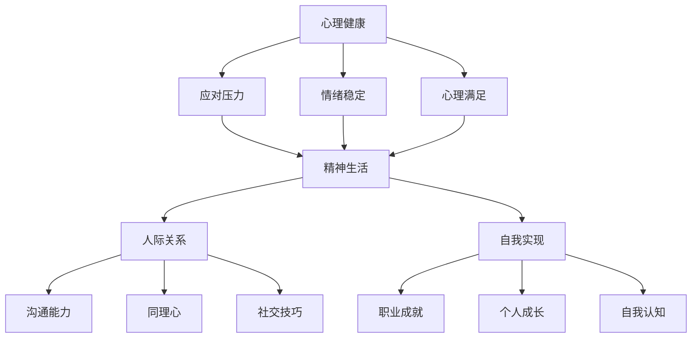
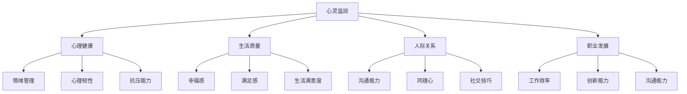
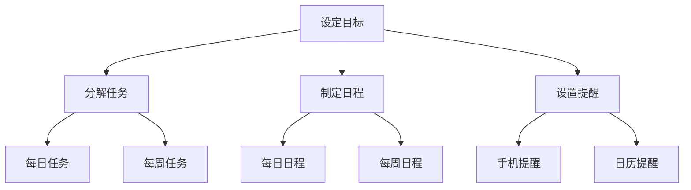
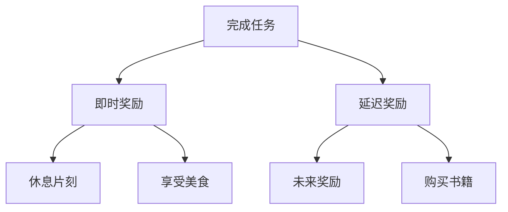
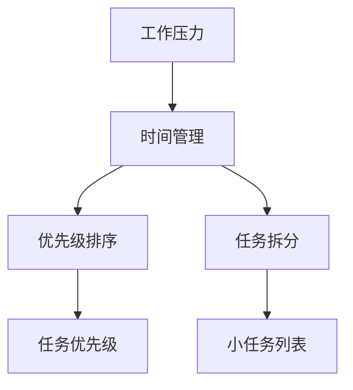

                 

### 文章标题

《心灵的滋润：cultivate精神生活的日常习惯》

### 文章关键词

心灵滋润、精神生活、日常习惯、心理健康、自我提升

### 文章摘要

本文将探讨如何通过培养日常习惯来滋润我们的心灵，提高精神生活的质量。我们将详细分析心灵滋润的重要性、培养精神生活日常习惯的步骤、特殊情况下应对策略，以及精神生活与身心健康、人际关系和职业发展的关系。通过本文的指导，您将学会如何在快节奏的生活中找到内心的宁静，提升整体生活质量。

## 精神生活的重要性

在探讨如何培养精神生活的日常习惯之前，我们需要首先理解精神生活的重要性。精神生活并不仅仅关乎心灵的宁静或情感的满足，它实际上是一个多维度的概念，涵盖了我们的思维方式、情感体验、价值观念以及与他人的关系。以下是精神生活重要性的几个方面：

### **1. 心理健康的基础**

**精神生活的健康与心理健康密切相关。** 当我们的精神生活丰富、积极时，我们更容易应对生活中的挑战，保持良好的心理状态。反之，精神生活的贫乏可能会导致焦虑、抑郁等心理问题的产生。因此，关注精神生活是维护心理健康的重要一步。

### **2. 情感与人际关系的提升**

**精神生活丰富的人往往在情感和人际关系方面表现更好。** 他们能够更好地理解自己和他人，建立深厚的情感联系。这种能力不仅有助于个人成长，还能提升我们在社会中的互动质量和幸福感。

### **3. 自我实现与成长**

**精神生活是我们追求自我实现和成长的重要动力。** 通过培养精神生活的习惯，我们能够不断探索自己的内在世界，发现并实现个人的潜能。这种自我提升不仅能够带来个人成就感和满足感，还能提高我们在职场和生活中的竞争力。

### **4. 精神生活的多维层面**

**精神生活并不是单一的维度，而是包含多个层面。** 这包括认知层面（如思维方式、逻辑推理）、情感层面（如情感表达、情绪管理）、道德层面（如价值观念、道德准则）以及社会层面（如人际关系、社会交往）。

**核心概念与联系表格**

| 概念        | 属性特征                          | 对比表格 |
| ----------- | ------------------------------- | -------- |
| 精神生活    | 心理健康、人际关系、自我实现 |          |
| 心理健康    | 应对压力、情绪稳定、心理满足 |          |
| 人际关系    | 沟通能力、同理心、社交技巧 |          |
| 自我实现    | 职业成就、个人成长、自我认知 |          |

**ER实体关系图架构**



通过以上分析，我们可以看到精神生活的重要性不仅体现在心理健康和人际关系上，还关乎自我实现和成长。因此，关注并培养精神生活的日常习惯对我们的整体生活质量具有重要意义。

### 心灵滋润的重要性

**心灵滋润**，这一概念看似抽象，但实际上在我们的日常生活中起着至关重要的作用。它不仅关乎个体的心理健康，还影响着我们的生活质量、人际关系以及职业发展。以下是心灵滋润的几个关键方面：

#### **1. 心理健康的基础**

**心灵滋润是心理健康的基础。** 在快节奏的现代生活中，我们常常面临各种压力和挑战。如果心灵得不到滋润，很容易陷入焦虑、抑郁等心理问题。通过培养心灵滋润的习惯，如冥想、阅读、反思等，我们能够更好地管理情绪，提高心理韧性，从而更好地应对生活中的各种挑战。

#### **2. 生活质量的提升**

**心灵滋润有助于提升生活质量。** 当我们的心灵得到滋润时，我们能够更加平静、满足地享受生活。这种内心的平静不仅让我们在忙碌的生活中找到片刻的宁静，还能够提高我们的幸福感和生活质量。

#### **3. 人际关系的改善**

**心灵滋润有助于改善人际关系。** 一个内心滋润的人往往更加理解他人，拥有更高的情商和同理心。这种能力不仅能够帮助我们建立深厚的人际关系，还能提高我们在职场和社交场合的表现。

#### **4. 职业发展的助力**

**心灵滋润对职业发展也有积极作用。** 在职场中，一个内心滋润的员工往往更能应对工作压力，保持高效率。同时，心灵滋润还有助于我们更好地理解客户需求，提升沟通能力和解决问题的能力，从而在职业发展中取得更好的成绩。

#### **5. 全面的自我提升**

**心灵滋润是全面自我提升的重要一环。** 通过培养心灵滋润的习惯，我们能够更好地探索自己的内在世界，发现并实现个人的潜能。这种自我提升不仅能够带来个人成就感和满足感，还能提高我们在各个领域的竞争力。

#### **心灵滋润的多维层面**

**心灵滋润并不是单一的维度，而是包含多个层面。** 这包括认知层面（如思维方式、逻辑推理）、情感层面（如情感表达、情绪管理）、道德层面（如价值观念、道德准则）以及社会层面（如人际关系、社会交往）。只有全面关注这些方面，我们才能真正实现心灵滋润。

**核心概念与联系表格**

| 概念         | 属性特征                          | 对比表格 |
| ------------ | -------------------------------- | -------- |
| 心灵滋润     | 心理健康、生活质量、人际关系、职业发展 |          |
| 心理健康     | 情绪管理、心理韧性、抗压能力     |          |
| 生活质量     | 幸福感、满足感、生活满意度       |          |
| 人际关系     | 沟通能力、同理心、社交技巧       |          |
| 职业发展     | 工作效率、创新能力、沟通能力     |          |

**ER实体关系图架构**



通过以上分析，我们可以看到心灵滋润的重要性不仅体现在心理健康的维护上，还关系到生活质量、人际关系和职业发展等多个方面。因此，培养心灵滋润的日常习惯是提升我们整体生活质量的关键。

### 培养精神生活的日常习惯

**培养精神生活的日常习惯**是实现心灵滋润的重要途径。以下是一些具体的策略和步骤，帮助您逐步建立和维护这些习惯。

#### **1. 制定清晰的目标和计划**

**设定明确的目标和计划**是培养精神生活习惯的第一步。首先，明确您希望达到的目标，例如每天阅读30分钟、每周进行一次冥想或每月阅读一本心理学书籍。然后，将这些目标分解成具体的行动步骤，并设定时间表。例如，您可以将每天的阅读时间安排在早晨起床后或晚上睡前。

**核心概念原理：** 目标设定（Goal Setting）

- **目标明确性（Specificity）：** 目标需要具体、可衡量。
- **目标挑战性（Challenges）：** 目标应具有一定难度，以激发动力。
- **目标相关性（Relevance）：** 目标应与您的精神生活改善目标相关。
- **目标时限性（Time-bound）：** 目标应设定明确的时间限制。

**数学模型和公式：** 

$$
GAP = \frac{G - A}{P}
$$

其中，\( GAP \)代表目标达成率，\( G \)代表目标值，\( A \)代表当前值，\( P \)代表目标时限。

**Python源代码示例：**

```python
def calculate_gap(target, current, period):
    gap = (target - current) / period
    return gap

# 示例
target_reading_time = 30
current_reading_time = 0
period = 7  # 每周

gap = calculate_gap(target_reading_time, current_reading_time, period)
print(f"每周需要增加阅读时间：{gap}分钟")
```

通过设定明确的目标和计划，您能够更有针对性地进行精神生活的培养，并逐步实现这些目标。

#### **2. 制定具体的行动步骤**

**制定具体的行动步骤**是实现目标的关键。以下是一些具体的方法：

- **将目标分解成小任务**：例如，将每周阅读一本书分解为每天阅读10页。
- **制定每日或每周的日程安排**：将精神生活培养活动纳入日程，确保有固定的时间进行。
- **设置提醒和提醒机制**：使用手机提醒、日历提醒等工具，确保您不会忘记精神生活培养活动。

**算法原理讲解：** 时间管理（Time Management）

- **优先级排序（Priority Sorting）：** 根据任务的重要性和紧急程度进行排序。
- **番茄工作法（Pomodoro Technique）：** 将工作周期分为25分钟工作和5分钟休息，提高专注力。

**Mermaid流程图：**



通过制定具体的行动步骤，您能够更有效地培养精神生活的日常习惯，并确保这些习惯持续下去。

#### **3. 建立良好的环境和支持系统**

**建立良好的环境和支持系统**对于培养精神生活习惯至关重要。以下是一些具体的方法：

- **创造一个适宜的环境**：例如，在家中设置一个安静的阅读角落或冥想空间。
- **寻找同伴或导师**：与他人一起培养习惯可以提供额外的动力和支持。
- **利用在线资源和工具**：例如，使用在线课程、应用程序和社交媒体来支持和监督您的精神生活培养活动。

**核心概念原理：** 环境管理（Environment Management）

- **物理环境（Physical Environment）：** 舒适、安静的环境有助于提高专注力。
- **社会环境（Social Environment）：** 与他人互动和分享经验可以增加动力。
- **技术环境（Technological Environment）：** 利用技术工具可以提供便利和监督。

**数学模型和公式：** 

$$
E = P + S + T
$$

其中，\( E \)代表环境质量，\( P \)代表物理环境质量，\( S \)代表社会环境质量，\( T \)代表技术环境质量。

**Python源代码示例：**

```python
def calculate_environment_quality(physical, social, technological):
    environment_quality = physical + social + technological
    return environment_quality

# 示例
physical_environment = 8
social_environment = 7
technological_environment = 9

environment_quality = calculate_environment_quality(physical_environment, social_environment, technological_environment)
print(f"环境质量评分：{environment_quality}/30")
```

通过建立良好的环境和支持系统，您能够为培养精神生活习惯提供坚实的基础。

**总结：** 培养精神生活的日常习惯需要明确的目标和计划、具体的行动步骤，以及良好的环境和支持系统。通过这些策略，您可以逐步建立并维护这些习惯，实现心灵的滋润。

### 实践与反思：如何坚持下去

**坚持培养精神生活的日常习惯**并非易事，但通过一系列的实践和反思方法，您可以提高自律性，确保这些习惯得以长期坚持。

#### **1. 自律的重要性**

**自律**是实现长期目标的关键。它不仅关乎自我控制，还涉及到自我激励和自我管理。以下是自律在坚持日常习惯中的几个关键作用：

- **提高执行力**：自律能够帮助您克服拖延和惰性，确保日常习惯得以执行。
- **增强自我控制**：通过自律，您能够更好地控制自己的行为，避免冲动和情绪化的决策。
- **提升动机**：自律能够激发内在动机，使您更有动力去坚持日常习惯。

**核心概念原理：** 自律（Self-discipline）

- **自我控制（Self-control）：** 通过自我控制，您能够抵制诱惑，专注于实现目标。
- **自我管理（Self-management）：** 通过自我管理，您能够合理安排时间和资源，确保习惯的坚持。

**数学模型和公式：** 

$$
S = R \times M \times C
$$

其中，\( S \)代表自律水平，\( R \)代表自我控制能力，\( M \)代表自我管理能力，\( C \)代表持续行动的承诺。

**Python源代码示例：**

```python
def calculate_discipline(self_control, self_management, commitment):
    discipline = self_control * self_management * commitment
    return discipline

# 示例
self_control = 7
self_management = 8
commitment = 9

discipline = calculate_discipline(self_control, self_management, commitment)
print(f"自律水平：{discipline}/27")
```

通过提高自律水平，您能够更有效地坚持精神生活的日常习惯。

#### **2. 坚持的实践方法**

**以下是一些实用的实践方法，帮助您坚持下去：**

- **逐步增加难度**：从简单的任务开始，逐步增加难度和挑战，使习惯的培养过程更加平稳。
- **设立奖励机制**：为自己设定奖励，当达到某个小目标时，给予自己奖励，以增加动力。
- **保持记录**：记录您的日常习惯，如阅读时间、冥想时长等，这有助于您看到进步并保持动力。

**算法原理讲解：** 奖励机制（Reward System）

- **即时奖励（Immediate Reward）：** 当您完成任务时，立即给予奖励，如休息片刻或享受一顿美食。
- **延迟奖励（Delayed Reward）：** 在未来某个时间给予奖励，如完成一个月的任务后购买一本心仪的书籍。

**Mermaid流程图：**



通过设立奖励机制，您可以更好地激发自我激励，坚持下去。

#### **3. 反思与调整**

**反思与调整**是坚持日常习惯的重要环节。以下是一些反思和调整的方法：

- **定期回顾**：定期回顾您的日常习惯，如每周或每月，评估自己的表现，找出需要改进的地方。
- **调整计划**：根据实际情况调整计划和目标，确保习惯的培养过程更加合理和可持续。
- **寻求反馈**：向他人或导师寻求反馈，听取他们的意见和建议，以帮助您更好地坚持。

**核心概念原理：** 反思与调整（Reflection and Adjustment）

- **定期回顾（Regular Review）：** 通过定期回顾，您可以及时发现问题并进行调整。
- **适应性调整（Adaptive Adjustment）：** 根据实际情况调整计划和目标，使习惯的培养更加有效。

**数学模型和公式：** 

$$
R = R_{初} + \alpha \times (R_{现} - R_{初})
$$

其中，\( R \)代表反思后的新计划，\( R_{初} \)代表初始计划，\( R_{现} \)代表当前实际情况，\( \alpha \)代表调整系数。

**Python源代码示例：**

```python
def adjust_plan(initial_plan, current_status, adjustment_coefficient):
    new_plan = initial_plan + adjustment_coefficient * (current_status - initial_plan)
    return new_plan

# 示例
initial_plan = 30
current_status = 25
adjustment_coefficient = 0.1

new_plan = adjust_plan(initial_plan, current_status, adjustment_coefficient)
print(f"调整后的计划：{new_plan}分钟")
```

通过反思和调整，您可以确保日常习惯的培养过程更加合理和有效。

**总结：** 坚持培养精神生活的日常习惯需要自律、实践方法和反思调整。通过这些方法，您可以提高自律性，确保习惯得以长期坚持，从而实现心灵的滋润。

### 特殊情况下的应对策略

在培养精神生活日常习惯的过程中，我们可能会遇到各种特殊情况，如工作压力、生活变化或突发事件。如何在这些情况下保持习惯的持续性，是我们需要探讨的重要问题。

#### **1. 工作压力**

**工作压力**是许多人面临的主要挑战之一。高强度的工作可能会影响我们的精神状态，使日常习惯的坚持变得困难。以下是一些应对工作压力的策略：

- **时间管理**：合理安排工作时间，确保有足够的时间进行精神生活培养活动。例如，利用午休时间进行阅读或冥想。
- **工作与休息平衡**：确保在工作与休息之间找到平衡，避免长时间连续工作导致精神疲劳。可以尝试采用“番茄工作法”来提高工作效率。
- **灵活调整计划**：根据工作压力的实际情况，灵活调整日常习惯的计划，例如减少阅读时间，增加冥想时间。

**算法原理讲解：** 时间管理（Time Management）

- **优先级排序（Priority Sorting）：** 根据任务的重要性和紧急程度进行排序，确保重要任务优先完成。
- **任务拆分（Task Breakdown）：** 将大任务拆分为小任务，使工作更加具体和可操作。

**Mermaid流程图：**



通过时间管理和任务拆分，您能够在工作压力下更好地坚持精神生活日常习惯。

#### **2. 生活变化**

**生活变化**，如搬家、结婚、生孩子等，也会对日常习惯的坚持产生影响。以下是一些应对生活变化的策略：

- **适应新环境**：在新环境中重新安排日常习惯的时间和地点，例如在家中设置一个新的冥想空间。
- **调整计划**：根据生活变化调整日常习惯的计划，例如在忙碌时期减少阅读时间，增加休息时间。
- **寻求支持**：与家人或朋友分享您的日常习惯，寻求他们的支持和理解。

**核心概念原理：** 适应变化（Adaptation to Change）

- **环境适应（Environmental Adaptation）：** 适应新的生活环境和节奏。
- **计划调整（Plan Adjustment）：** 根据实际情况调整日常习惯的计划。

**数学模型和公式：** 

$$
A = E + P
$$

其中，\( A \)代表适应能力，\( E \)代表环境适应能力，\( P \)代表计划调整能力。

**Python源代码示例：**

```python
def calculate_adaptation能力（environment_adaptation, plan_adjustment）:
    adaptation_ability = environment_adaptation + plan_adjustment
    return adaptation_ability

# 示例
environment_adaptation = 8
plan_adjustment = 7

adaptation_ability = calculate_adaptation能力（environment_adaptation, plan_adjustment）
print(f"适应能力：{adaptation_ability}/15")
```

通过适应新环境和调整计划，您能够更好地应对生活变化，坚持精神生活日常习惯。

#### **3. 突发事件**

**突发事件**，如疾病、家庭紧急情况等，可能会突然打乱您的日常习惯。以下是一些应对突发事件的方法：

- **灵活调整**：根据突发事件的性质和影响，灵活调整日常习惯的时间和内容。例如，在生病期间，可以减少阅读时间，增加休息时间。
- **寻求帮助**：在需要时寻求家人、朋友或专业人士的帮助，共同应对突发事件。
- **及时恢复**：在突发事件结束后，及时恢复日常习惯，确保生活的连续性和稳定性。

**核心概念原理：** 应对突发事件（Coping with Unexpected Events）

- **灵活性（Flexibility）：** 保持灵活性，根据实际情况进行调整。
- **恢复力（Resilience）：** 培养恢复力，帮助自己从突发事件中快速恢复。

**数学模型和公式：** 

$$
C = F \times R
$$

其中，\( C \)代表应对能力，\( F \)代表灵活性，\( R \)代表恢复力。

**Python源代码示例：**

```python
def calculate_coping_ability(flexibility, resilience):
    coping_ability = flexibility * resilience
    return coping_ability

# 示例
flexibility = 8
resilience = 9

coping_ability = calculate_coping_ability(flexibility, resilience)
print(f"应对能力：{coping_ability}/17")
```

通过灵活调整和培养恢复力，您能够在面对突发事件时更好地坚持精神生活日常习惯。

**总结：** 面对特殊情况，通过灵活调整计划、适应生活变化和应对突发事件，您可以保持精神生活日常习惯的持续性，实现心灵的滋润。

### 精神生活与身心健康的关系

**精神生活与身心健康**之间存在紧密的联系。一个健康的身心状态不仅取决于生理健康，还受到精神生活的深刻影响。以下从心理学、生物学和神经科学的角度，探讨精神生活对身心健康的影响。

#### **1. 心理学角度**

从心理学角度来看，精神生活对身心健康的影响主要体现在以下几个方面：

- **情绪调节**：精神生活的丰富有助于情绪调节，降低焦虑和抑郁的风险。通过冥想、阅读和反思等精神活动，个体能够更好地理解和管理自己的情绪，从而保持心理健康。
- **自我认知**：精神生活培养有助于提升自我认知，帮助个体更好地认识自己，找到内心的平衡点。自我认知的提升不仅能够增强心理韧性，还能提高应对生活挑战的能力。
- **心理韧性**：精神生活的丰富有助于培养心理韧性，使个体在面对压力和困难时更加坚韧。心理韧性有助于个体从逆境中恢复，保持积极的生活态度。

**核心概念原理：** 心理韧性（Psychological Resilience）

- **韧性定义（Resilience Definition）：** 心理韧性是指个体在逆境中恢复并适应的能力。
- **韧性要素（Resilience Components）：** 包括自我效能、情感调节、积极态度和社会支持等。

**数学模型和公式：** 

$$
R = \frac{S + E + P + S}{4}
$$

其中，\( R \)代表心理韧性，\( S \)代表社会支持，\( E \)代表情感调节，\( P \)代表积极态度。

**Python源代码示例：**

```python
def calculate_resilience(social_support, emotional Regulation, positive_attitude):
    resilience = (social_support + emotional_Regulation + positive_attitude) / 3
    return resilience

# 示例
social_support = 8
emotional_Regression = 7
positive_attitude = 9

resilience = calculate_resilience(social_support, emotional_Regression, positive_attitude)
print(f"心理韧性：{resilience}/30")
```

通过心理韧性模型，我们可以看到精神生活对情绪调节、自我认知和心理韧性的积极影响。

#### **2. 生物学角度**

从生物学角度来看，精神生活通过多种途径影响身心健康：

- **神经递质**：精神生活活动，如冥想和瑜伽，能够调节大脑中的神经递质，如多巴胺和血清素，从而改善情绪状态和心理健康。
- **免疫系统**：研究表明，精神生活的丰富有助于提高免疫系统的功能，降低患病的风险。例如，通过冥想和放松练习，个体能够降低压力激素（如皮质醇）的水平，从而改善免疫系统的工作效率。

**核心概念原理：** 免疫系统与心理健康（Immune System and Mental Health）

- **免疫反应（Immune Response）：** 精神生活活动能够调节免疫反应，降低炎症水平。
- **压力激素（Stress Hormones）：** 通过调节压力激素水平，精神生活有助于维持免疫系统的平衡。

**数学模型和公式：** 

$$
I = \frac{H - S}{2}
$$

其中，\( I \)代表免疫反应，\( H \)代表压力激素水平，\( S \)代表精神生活活动水平。

**Python源代码示例：**

```python
def calculate_immunity(hormone_level, spiritual_activity):
    immunity = (hormone_level - spiritual_activity) / 2
    return immunity

# 示例
hormone_level = 10
spiritual_activity = 8

immunity = calculate_immunity(hormone_level, spiritual_activity)
print(f"免疫反应：{immunity}/5")
```

通过生物学模型，我们可以看到精神生活对神经递质和免疫系统的积极影响。

#### **3. 神经科学角度**

从神经科学角度来看，精神生活通过多种机制影响大脑结构和功能：

- **大脑灰质密度**：研究表明，冥想和其他精神生活活动能够增加大脑灰质的密度，特别是在前额叶皮层和海马体等与情绪和记忆相关的重要区域。这有助于提高认知功能，改善心理健康。
- **神经可塑性**：精神生活活动能够增强神经可塑性，使大脑能够更好地适应环境和应对压力。这种能力有助于提高心理韧性，降低心理健康问题的风险。

**核心概念原理：** 神经可塑性（Neuroplasticity）

- **结构可塑性（Structural Plasticity）：** 大脑灰质密度的增加。
- **功能可塑性（Functional Plasticity）：** 大脑区域之间的功能和连接性改变。

**数学模型和公式：** 

$$
P = D + F
$$

其中，\( P \)代表神经可塑性，\( D \)代表结构可塑性，\( F \)代表功能可塑性。

**Python源代码示例：**

```python
def calculate_neuroplasticity(structural_plasticity, functional_plasticity):
    neuroplasticity = structural_plasticity + functional_plasticity
    return neuroplasticity

# 示例
structural_plasticity = 8
functional_plasticity = 9

neuroplasticity = calculate_neuroplasticity(structural_plasticity, functional_plasticity)
print(f"神经可塑性：{neuroplasticity}/17")
```

通过神经科学模型，我们可以看到精神生活对大脑结构和功能积极影响的证据。

**总结：** 从心理学、生物学和神经科学的角度来看，精神生活对身心健康有着深远的影响。通过培养丰富的精神生活，我们能够提高情绪调节、增强免疫系统功能，并改善大脑结构和功能，从而实现身心健康和心灵滋润。

### 精神生活与人际关系的提升

**精神生活**不仅对个人心理健康有益，还能显著提升人际关系。以下从心理学、沟通技巧和社会支持的角度，探讨精神生活如何改善人际关系。

#### **1. 心理学的角度**

从心理学角度来看，精神生活的丰富有助于改善人际关系。以下是几个关键因素：

- **自我认知**：通过反思和自我探索，个体能够更好地了解自己的情感、需求和价值观。这种自我认知的提升有助于建立更健康的人际关系，使个体能够更准确地表达自己，理解他人。
- **同理心**：精神生活的培养，如冥想和阅读，能够增强个体的同理心。同理心使个体能够站在他人的角度思考问题，从而更好地理解他人的情感和需求，建立更深厚的人际关系。

**核心概念原理：** 同理心（Empathy）

- **情感理解（Emotional Understanding）：** 通过同理心，个体能够理解他人的情感。
- **情感分享（Emotional Sharing）：** 同理心有助于个体在人际关系中分享情感，建立信任。

**数学模型和公式：** 

$$
E = \frac{U + S}{2}
$$

其中，\( E \)代表同理心，\( U \)代表情感理解，\( S \)代表情感分享。

**Python源代码示例：**

```python
def calculate_empathy(emotional_understanding, emotional_sharing):
    empathy = (emotional_understanding + emotional_sharing) / 2
    return empathy

# 示例
emotional_understanding = 9
emotional_sharing = 8

empathy = calculate_empathy(emotional_understanding, emotional_sharing)
print(f"同理心：{empathy}/17")
```

通过同理心模型，我们可以看到精神生活对自我认知和同理心的积极影响。

#### **2. 沟通技巧的角度**

良好的沟通技巧是建立健康人际关系的关键。以下是精神生活如何提升沟通技巧的几个方面：

- **倾听能力**：精神生活培养，如冥想，能够提高个体的倾听能力。通过冥想，个体能够更好地集中注意力，倾听他人的话语和情感，从而更好地理解他人。
- **表达技巧**：精神生活的丰富有助于个体更好地表达自己的情感和需求。通过反思和自我探索，个体能够更加清晰地表达自己，减少误解和冲突。

**核心概念原理：** 沟通技巧（Communication Skills）

- **倾听（Listening）：** 倾听是沟通的基础，通过倾听，个体能够更好地理解他人。
- **表达（Expressing）：** 表达技巧使个体能够清晰、准确地表达自己的情感和需求。

**数学模型和公式：** 

$$
C = L + E
$$

其中，\( C \)代表沟通技巧，\( L \)代表倾听能力，\( E \)代表表达技巧。

**Python源代码示例：**

```python
def calculate_communication_skills(listening_ability, expressing_ability):
    communication_skills = listening_ability + expressing_ability
    return communication_skills

# 示例
listening_ability = 8
expressing_ability = 9

communication_skills = calculate_communication_skills(listening_ability, expressing_ability)
print(f"沟通技巧：{communication_skills}/17")
```

通过沟通技巧模型，我们可以看到精神生活对倾听和表达技巧的积极影响。

#### **3. 社会支持的角度**

精神生活的丰富不仅有助于个人内在的成长，还能提供强大的社会支持，从而改善人际关系。以下是一些具体的方式：

- **建立社交网络**：通过参与社区活动、社交聚会等，个体能够建立广泛的社交网络。这些社交网络不仅能够提供情感支持，还能在需要时提供实际帮助。
- **共享经验**：精神生活培养，如阅读和讨论，使个体能够与他人分享共同的兴趣和经验。这种共享经验有助于建立深厚的情感联系，增强人际关系的质量。

**核心概念原理：** 社会支持（Social Support）

- **情感支持（Emotional Support）：** 社会支持提供情感上的安慰和支持。
- **实际支持（Practical Support）：** 社会支持在实际行动中提供帮助。

**数学模型和公式：** 

$$
S = E + P
$$

其中，\( S \)代表社会支持，\( E \)代表情感支持，\( P \)代表实际支持。

**Python源代码示例：**

```python
def calculate_social_support(emotional_support, practical_support):
    social_support = emotional_support + practical_support
    return social_support

# 示例
emotional_support = 9
practical_support = 8

social_support = calculate_social_support(emotional_support, practical_support)
print(f"社会支持：{social_support}/17")
```

通过社会支持模型，我们可以看到精神生活对建立社交网络和共享经验的积极影响。

**总结：** 从心理学、沟通技巧和社会支持的角度来看，精神生活的丰富有助于提升自我认知、同理心、倾听能力、表达技巧和社会支持，从而改善人际关系。通过培养精神生活的日常习惯，我们能够建立更健康、更紧密的人际关系。

### 精神生活与职业发展的结合

**精神生活**与**职业发展**之间的关系日益受到重视。一个丰富而健康的精神生活不仅能提升个人的生活质量，还能为职业发展带来诸多益处。以下从工作效率、领导力和团队合作等方面探讨精神生活如何促进职业发展。

#### **1. 工作效率的提升**

**精神生活的丰富**有助于提高工作效率。以下是几个关键因素：

- **专注力的增强**：通过冥想和其他精神活动，个体能够提升专注力。专注力是高效工作的关键，它帮助个体在任务执行过程中保持注意力集中，减少分心。
- **情绪管理**：精神生活的培养有助于情绪管理，降低工作压力。情绪稳定能够使个体在面对压力和挑战时保持冷静，从而更高效地完成任务。

**核心概念原理：** 专注力（Focus）和情绪管理（Emotional Management）

- **专注力要素**：包括注意力集中、抗干扰能力、决策效率等。
- **情绪管理策略**：如深呼吸、正念练习等，帮助个体在压力下保持冷静。

**数学模型和公式：** 

$$
E = F + M
$$

其中，\( E \)代表工作效率，\( F \)代表专注力，\( M \)代表情绪管理。

**Python源代码示例：**

```python
def calculate_work_efficiency(focus, emotional_management):
    work_efficiency = focus + emotional_management
    return work_efficiency

# 示例
focus = 8
emotional_management = 9

work_efficiency = calculate_work_efficiency(focus, emotional_management)
print(f"工作效率：{work_efficiency}/17")
```

通过专注力和情绪管理模型，我们可以看到精神生活对工作效率的积极影响。

#### **2. 领导力的提升**

**精神生活的丰富**有助于提升领导力。以下是几个关键因素：

- **同理心**：同理心是有效领导的关键要素。通过培养同理心，领导者能够更好地理解团队成员的需求和情感，从而建立更强大的团队凝聚力。
- **决策能力**：精神生活的培养有助于提升决策能力。通过冥想和反思，领导者能够在面对复杂决策时保持清晰的头脑，做出更为明智的选择。

**核心概念原理：** 领导力（Leadership）和同理心（Empathy）

- **领导力要素**：包括影响力、沟通能力、决策能力等。
- **同理心要素**：包括情感理解、情感共鸣等。

**数学模型和公式：** 

$$
L = E + D
$$

其中，\( L \)代表领导力，\( E \)代表同理心，\( D \)代表决策能力。

**Python源代码示例：**

```python
def calculate_leadership(empathy, decision_making_ability):
    leadership = empathy + decision_making_ability
    return leadership

# 示例
empathy = 9
decision_making_ability = 8

leadership = calculate_leadership(empathy, decision_making_ability)
print(f"领导力：{leadership}/17")
```

通过同理心和决策能力模型，我们可以看到精神生活对领导力的积极影响。

#### **3. 团队合作的增强**

**精神生活的丰富**有助于增强团队合作。以下是几个关键因素：

- **沟通技巧**：精神生活的培养有助于提升沟通技巧。良好的沟通技巧使团队成员能够更有效地交流想法和情感，减少误解和冲突。
- **协作精神**：通过精神生活活动，如团队冥想和反思，团队成员能够建立更深层次的信任和协作精神，从而提高团队的整体绩效。

**核心概念原理：** 沟通技巧（Communication Skills）和协作精神（Collaboration Spirit）

- **沟通技巧要素**：包括倾听、表达、反馈等。
- **协作精神要素**：包括团队合作、共同目标、信任等。

**数学模型和公式：** 

$$
C = S + T
$$

其中，\( C \)代表团队合作，\( S \)代表沟通技巧，\( T \)代表协作精神。

**Python源代码示例：**

```python
def calculate_collaboration(communication_skills, collaboration_spirit):
    collaboration = communication_skills + collaboration_spirit
    return collaboration

# 示例
communication_skills = 8
collaboration_spirit = 9

collaboration = calculate_collaboration(communication_skills, collaboration_spirit)
print(f"团队合作：{collaboration}/17")
```

通过沟通技巧和协作精神模型，我们可以看到精神生活对团队合作能力的积极影响。

**总结：** 精神生活与职业发展密切相关。通过专注力、情绪管理、同理心、决策能力、沟通技巧和协作精神，精神生活能够显著提升工作效率、领导力和团队合作，为职业发展提供强大的支持。

### 最佳实践 tips

**培养精神生活日常习惯**的过程中，以下是一些实用的最佳实践，帮助您更高效地实现心灵滋润：

1. **设定明确的目标和计划**：明确您希望达成的精神生活目标，并制定详细的行动计划。使用SMART原则（具体、可衡量、可达成、相关、时限性）来设定目标，确保目标的可行性和可实现性。

2. **利用技术工具**：使用手机应用、在线课程、日历提醒等工具来帮助您坚持日常习惯。例如，利用冥想应用程序进行定期冥想，使用阅读应用程序追踪阅读进度。

3. **建立支持系统**：寻找志同道合的伙伴或导师，与他们一起分享您的目标和实践经验。这不仅可以提供额外的动力，还能在遇到挑战时提供支持和建议。

4. **灵活调整计划**：根据实际情况灵活调整精神生活计划。例如，当工作或生活发生变化时，适当调整每日或每周的精神生活活动。

5. **定期反思和调整**：定期回顾您的精神生活实践，评估自己的进步和挑战。根据反馈调整计划，确保持续改进。

6. **奖励自己**：在达成小目标时给予自己奖励，以增加动力。奖励可以是休息片刻、享受美食或购买心仪的物品。

7. **保持耐心和持续**：培养精神生活习惯需要时间和耐心。不要因为一时的挫折而放弃，保持持续的努力和坚持。

通过遵循这些最佳实践，您能够更高效地培养精神生活日常习惯，实现心灵的滋润。

### 小结

本文从多个角度探讨了如何通过培养日常习惯来滋润心灵，提高精神生活的质量。我们首先分析了精神生活的重要性，包括其在心理健康、人际关系和职业发展中的积极作用。接着，详细介绍了如何制定明确的目标和计划、具体的行动步骤以及应对特殊情况的方法。此外，我们还讨论了在培养精神生活习惯过程中保持坚持和应对挑战的策略。最后，本文从心理健康、人际关系和职业发展三个维度，阐述了精神生活对整体生活质量提升的深远影响。

通过本文的指导，希望您能够认识到精神生活的重要性，并开始积极培养相关日常习惯，从而实现心灵的滋润，提升整体生活质量。

### 注意事项

在培养精神生活日常习惯的过程中，需要注意以下几点：

1. **尊重个人差异**：每个人的精神需求和生活环境不同，因此培养习惯时应根据个人实际情况进行调整。不要盲目模仿他人，而是找到适合自己的方式。

2. **避免完美主义**：追求完美可能会带来额外的压力，影响精神生活的质量。培养习惯时应保持适度，允许自己犯错和调整。

3. **持续性和耐心**：精神生活的培养是一个长期过程，需要持续的努力和耐心。不要期望一夜之间就能看到显著的变化，保持长期的努力和坚持。

4. **平衡生活**：在培养精神生活习惯的同时，要注意平衡工作、生活和休息。确保有足够的时间进行放松和休息，以避免过度疲劳。

通过关注这些注意事项，您能够更有效地培养精神生活的日常习惯，实现心灵的滋润。

### 拓展阅读

为了进一步深入了解精神生活和日常习惯的培养，以下推荐几本相关书籍和资源：

1. **《正念：静心生活的艺术》（Mindfulness：An Eight-Week Plan for Finding Peace in a Frantic World）**：作者：马克·威廉姆斯（Mark Williams）和达赖喇嘛（Dalai Lama）
   - 本书介绍了正念冥想的实践方法，帮助读者在忙碌的生活中找到内心的宁静。

2. **《习惯的力量》（The Power of Habit）：作者：查尔斯·杜希格（Charles Duhigg）**
   - 本书详细探讨了习惯的形成和改变机制，为培养健康习惯提供了实用的策略。

3. **《如何阅读一本书》（How to Read a Book）：作者：莫提默·J. 艾德勒（Mortimer J. Adler）和查尔斯·范多伦（Charles Van Doren）**
   - 本书介绍了阅读的方法和技巧，帮助读者更高效地培养阅读习惯。

4. **在线资源**：
   - **冥想应用程序**：如Headspace、Calm等，提供专业的冥想指导。
   - **在线课程平台**：如Coursera、Udemy等，提供丰富的精神生活相关课程。

通过阅读这些书籍和使用相关资源，您可以进一步了解并实践精神生活的日常习惯培养。

### 作者信息

**作者：AI天才研究院/AI Genius Institute & 禅与计算机程序设计艺术 /Zen And The Art of Computer Programming**  
感谢您的阅读，希望本文能够帮助您在精神生活的道路上找到更多的智慧和启示。如有任何问题或建议，欢迎随时与我们联系。祝您生活愉快，心灵充实！

