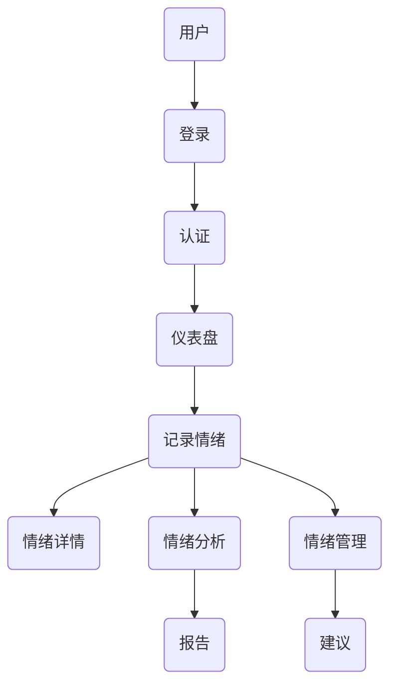
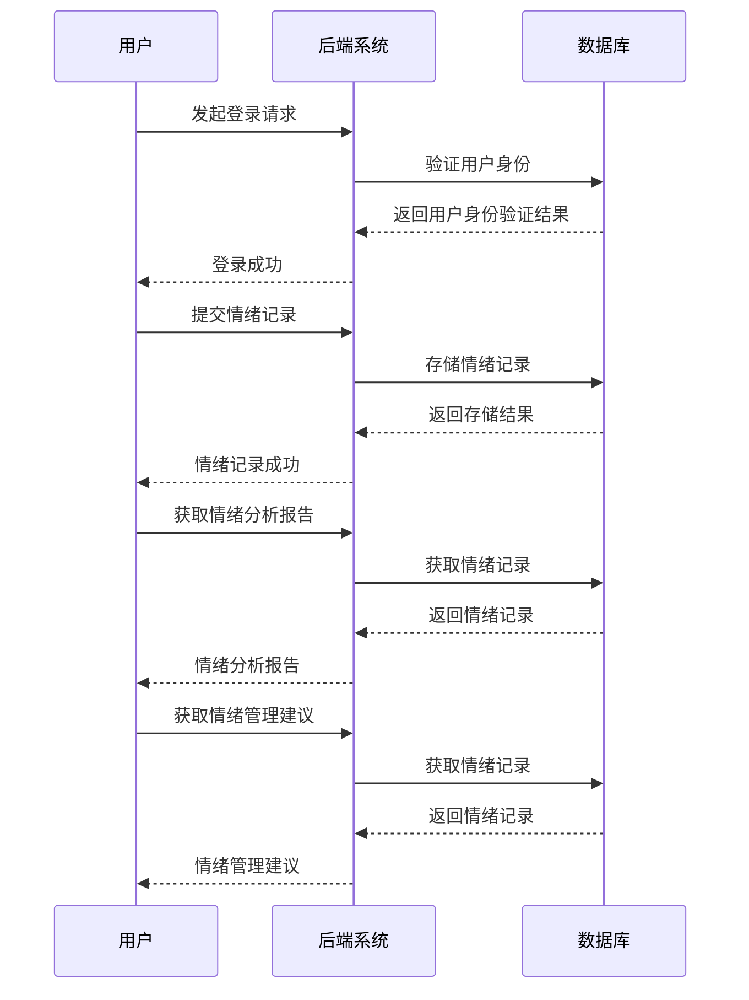
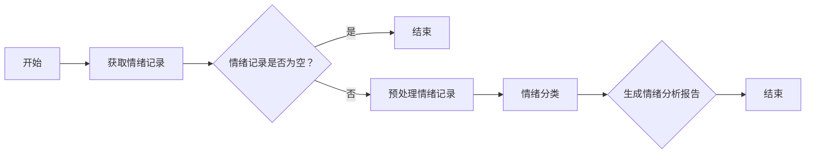

                 

### 文章标题：《心灵的空间：为内在成长创造环境》

#### 文章关键词：
- 内在成长
- 心灵空间
- 滋养环境
- 情绪智能
- 自我反思

#### 文章摘要：
本文将探讨心灵的空间，以及如何通过创造一个滋养的环境来促进内在成长。我们将从定义“心灵的空间”开始，探讨内在成长的基本原则，如何创建一个适合心灵成长的物理和心理环境，并通过案例分析来展示这些原则和实践方法的应用。

### 引言

在当今快速发展的社会，人们常常感到身心疲惫，难以找到内心的宁静。这种状态下，内在成长显得尤为重要。心灵的空间，即为我们的内在成长提供了场所。本文旨在探讨如何为内在成长创造一个良好的环境，帮助读者找到内心的平静和力量。

#### 书籍背景

在现代社会，心理健康问题日益突出，人们对于内在成长的需求也越来越强烈。然而，如何在实际生活中实现内在成长，仍然是一个复杂而深刻的问题。本书旨在通过深入探讨心灵的空间和内在成长的基本原则，为读者提供一套系统化的方法和实践指南。

#### 内在成长的重要性

内在成长不仅仅关乎个人的心理健康，更是实现个人潜能和社会和谐的重要途径。通过内在成长，我们能够更好地理解自己，提升情绪智能，建立积极的人际关系，并在生活和工作中取得更好的成就。

#### 书籍的目的与结构

本书的目的是为读者提供一套实用的方法和实践指南，帮助他们在日常生活中创造一个适合心灵成长的环境。本书结构清晰，分为七个章节，涵盖了从理论基础到实际应用的各个方面。

### 心灵的空间

心灵的空间并非一个物理场所，而是一种内在的状态。它是一个让我们能够自我觉察、自我反思和自我成长的环境。在这个空间中，我们能够与自己的内心进行深刻的对话，找到真正的自我。

#### 定义与特征

心灵的空间是一个抽象的概念，它具有以下特征：

- **抽象性**：心灵的空间不是具体的物理实体，而是存在于我们的内心深处。
- **主观性**：每个人的心灵空间都是独特的，反映了他们的个性和经历。
- **动态性**：心灵的空间是一个不断变化的过程，它会随着我们的成长和经历而发生变化。

#### 心灵空间的重要性

心灵的空间对于我们的内在成长至关重要。它提供了一个安全、私密的环境，让我们能够：
1. **自我觉察**：通过自我觉察，我们能够了解自己的情绪、思想和行为，找到自己的内心需求。
2. **自我反思**：自我反思帮助我们审视自己的过去和现在，从而更好地理解自己，找到成长的方向。
3. **自我成长**：在心灵的空间中，我们能够不断地探索自我，实现个人成长和提升。

#### 心灵空间与外在环境的关系

外在环境对心灵的空间有着重要的影响。一个和谐、舒适的外在环境有助于我们建立良好的心灵空间，而一个恶劣、紧张的外在环境则会干扰我们的内在成长。因此，我们需要在外在环境中创造一个适合心灵成长的环境。

### 内在成长的基本原则

内在成长需要遵循一些基本原则，这些原则为我们提供了指导和方向。以下是几个核心原则：

#### 正念与觉察

正念是一种专注于当下的练习，它帮助我们从纷繁复杂的思绪中抽离出来，专注于当下的体验。通过正念练习，我们能够提高自我觉察，更好地理解自己的情绪、思想和行为。

#### 自我反思

自我反思是一种深入思考自己的过去和现在的过程。通过自我反思，我们能够审视自己的行为和决策，理解自己的动机和需求，从而更好地理解自己，找到成长的方向。

#### 情绪智能

情绪智能是指我们理解、管理自己和他人的情绪的能力。通过提高情绪智能，我们能够更好地处理情绪问题，建立积极的人际关系，并在生活中取得更好的成就。

### 创造滋养环境

创造一个滋养的环境对于内在成长至关重要。以下是一些关键因素：

#### 个人习惯

良好的个人习惯有助于我们建立稳定的内心状态。例如，规律的作息、健康的饮食、适度的运动和充足的睡眠都有助于我们保持良好的心理和生理状态。

#### 人际关系

人际关系对内在成长有着重要的影响。与积极、支持性的人建立良好的关系，有助于我们获得情感支持和成长指导。同时，我们需要学会处理冲突，建立健康的人际互动。

#### 自然环境的作用

自然环境对心灵的空间有着积极的影响。通过接触大自然，我们能够感受到宁静和平和，从而提升内心的平静和幸福感。

### 实践中的心灵空间

在日常生活中，我们可以通过以下实践来创建和维护心灵的空间：

#### 日常生活中的实践

在日常生活中，我们可以通过以下方式来实践心灵的空间：

- **保持正念**：在日常活动中，例如吃饭、洗澡、散步时，保持正念，专注于当下的体验。
- **自我反思**：每天花时间进行自我反思，审视自己的情绪、思想和行为，找到成长的方向。
- **情绪管理**：学会管理自己的情绪，避免情绪的波动对心灵空间造成干扰。

#### 工作与学习的环境优化

工作与学习环境对我们的内心状态有着重要的影响。以下是一些建议：

- **优化工作环境**：保持工作区域的整洁和有序，创造一个舒适的工作环境。
- **合理安排时间**：合理规划工作和学习时间，避免过度劳累和压力。
- **专注练习**：在工作或学习时，进行专注练习，提高工作效率和集中力。

#### 社交与互动中的心灵空间维护

在社交和互动中，我们需要注意以下几点：

- **建立积极关系**：与积极、支持性的人建立良好的关系，共同成长。
- **情绪沟通**：学会表达和管理自己的情绪，与他人建立真诚的沟通。
- **冲突处理**：学会处理冲突，避免负面情绪的积累。

### 案例分析

通过以下案例，我们可以看到如何在实践中创造和维护心灵的空间：

#### 成功案例

案例一：某公司高管通过自我反思和情绪管理，成功提升了工作效率和情绪稳定性，实现了个人成长。

#### 失败案例

案例二：某创业者由于过度压力和情绪失控，导致事业失败和个人心理问题。

#### 从案例中学习

从成功和失败案例中，我们可以学到：

- **内在成长的重要性**：内在成长是个人成功和幸福的关键。
- **滋养环境的创建**：创造一个适合心灵成长的环境，有助于我们实现内在成长。
- **持续实践**：内在成长是一个持续的过程，需要我们不断实践和调整。

### 结论与反思

通过本文的探讨，我们认识到心灵的空间对于内在成长的重要性，并了解了一些创建和维护心灵空间的方法。内在成长不仅仅关乎个人的心理健康，更是实现个人潜能和社会和谐的重要途径。我们鼓励读者在日常生活中实践这些原则，创造一个适合心灵成长的环境，实现自己的内在成长。

#### 主要收获

- **理解了心灵的空间的概念和重要性**。
- **了解了内在成长的基本原则和实践方法**。
- **认识到外在环境对内在成长的影响**。

#### 继续成长的方向

- **深入学习心理学和哲学，提升情绪智能**。
- **持续实践自我反思和情绪管理**。
- **探索适合自己的心灵成长方式**。

#### 鼓励与激励

内在成长是一个持续的过程，每个人都可以通过努力实现自己的潜能。让我们共同创造一个适合心灵成长的环境，实现自己的内在成长，为个人和社会带来积极的影响。

### 作者信息

- **作者：AI天才研究院/AI Genius Institute & 禅与计算机程序设计艺术 /Zen And The Art of Computer Programming**
### 文章标题：《心灵的空间：为内在成长创造环境》

#### 文章关键词：
- 内在成长
- 心灵空间
- 滋养环境
- 情绪智能
- 自我反思

#### 文章摘要：
本文深入探讨了心灵的空间以及如何通过创造一个滋养的环境来促进内在成长。从定义心灵的空间开始，文章详细介绍了内在成长的基本原则，包括正念、自我反思和情绪智能，以及如何在日常生活中实践这些原则。通过案例分析，文章展示了这些原则在实际生活中的应用，并给出了继续成长的方向和建议。

### 引言

在现代社会，人们的生活节奏越来越快，压力和焦虑也随之增加。在这样的背景下，内在成长变得尤为重要。心灵的空间，作为一个抽象但至关重要的概念，为我们的内在成长提供了一个场所。本文将探讨心灵的空间是什么，如何为内在成长创造环境，以及内在成长的基本原则和实践方法。

#### 书籍背景

随着心理健康问题逐渐受到重视，人们开始关注如何通过内在成长来提升生活质量。心灵的空间作为一个核心概念，吸引了众多心理学、哲学和自我成长领域的学者和实践者。本书旨在为读者提供一套系统化的方法，帮助他们在日常生活中实践内在成长。

#### 内在成长的重要性

内在成长不仅关乎个人的心理健康，也是实现个人潜能和社会和谐的关键。通过内在成长，我们能够更好地理解自己，提升情绪智能，建立积极的人际关系，并实现个人目标。

#### 书籍的目的与结构

本书的目的是为读者提供一套实用的方法和实践指南，帮助他们创建一个适合心灵成长的环境。本书分为七个章节，涵盖了从理论基础到实际应用的各个方面。

### 心灵的空间

心灵的空间是一个抽象的概念，它是一个内在的状态，而非一个物理场所。它是一个让我们能够自我觉察、自我反思和自我成长的环境。

#### 定义与特征

心灵的空间具有以下特征：

- **抽象性**：心灵的空间不是具体的物理实体，而是存在于我们的内心深处。
- **主观性**：每个人的心灵空间都是独特的，反映了他们的个性和经历。
- **动态性**：心灵的空间是一个不断变化的过程，它会随着我们的成长和经历而发生变化。

#### 心灵空间的重要性

心灵的空间对我们的内在成长至关重要。它提供了以下几个方面的支持：

1. **自我觉察**：通过自我觉察，我们能够了解自己的情绪、思想和行为，找到自己的内心需求。
2. **自我反思**：自我反思帮助我们审视自己的过去和现在，从而更好地理解自己，找到成长的方向。
3. **自我成长**：在心灵的空间中，我们能够不断地探索自我，实现个人成长和提升。

#### 心灵空间与外在环境的关系

外在环境对心灵的空间有着重要的影响。一个和谐、舒适的外在环境有助于我们建立良好的心灵空间，而一个恶劣、紧张的外在环境则会干扰我们的内在成长。因此，我们需要在外在环境中创造一个适合心灵成长的环境。

### 内在成长的基本原则

内在成长需要遵循一些基本原则，这些原则为我们提供了指导和方向。以下是几个核心原则：

#### 正念与觉察

正念是一种专注于当下的练习，它帮助我们从纷繁复杂的思绪中抽离出来，专注于当下的体验。通过正念练习，我们能够提高自我觉察，更好地理解自己的情绪、思想和行为。

#### 自我反思

自我反思是一种深入思考自己的过去和现在的过程。通过自我反思，我们能够审视自己的行为和决策，理解自己的动机和需求，从而更好地理解自己，找到成长的方向。

#### 情绪智能

情绪智能是指我们理解、管理自己和他人的情绪的能力。通过提高情绪智能，我们能够更好地处理情绪问题，建立积极的人际关系，并在生活和工作中取得更好的成就。

### 创造滋养环境

创造一个滋养的环境对于内在成长至关重要。以下是一些关键因素：

#### 个人习惯

良好的个人习惯有助于我们建立稳定的内心状态。例如，规律的作息、健康的饮食、适度的运动和充足的睡眠都有助于我们保持良好的心理和生理状态。

#### 人际关系

人际关系对内在成长有着重要的影响。与积极、支持性的人建立良好的关系，有助于我们获得情感支持和成长指导。同时，我们需要学会处理冲突，建立健康的人际互动。

#### 自然环境的作用

自然环境对心灵的空间有着积极的影响。通过接触大自然，我们能够感受到宁静和平和，从而提升内心的平静和幸福感。

### 实践中的心灵空间

在日常生活中，我们可以通过以下实践来创建和维护心灵的空间：

#### 日常生活中的实践

在日常生活中，我们可以通过以下方式来实践心灵的空间：

- **保持正念**：在日常活动中，例如吃饭、洗澡、散步时，保持正念，专注于当下的体验。
- **自我反思**：每天花时间进行自我反思，审视自己的情绪、思想和行为，找到成长的方向。
- **情绪管理**：学会管理自己的情绪，避免情绪的波动对心灵空间造成干扰。

#### 工作与学习的环境优化

工作与学习环境对我们的内心状态有着重要的影响。以下是一些建议：

- **优化工作环境**：保持工作区域的整洁和有序，创造一个舒适的工作环境。
- **合理安排时间**：合理规划工作和学习时间，避免过度劳累和压力。
- **专注练习**：在工作或学习时，进行专注练习，提高工作效率和集中力。

#### 社交与互动中的心灵空间维护

在社交和互动中，我们需要注意以下几点：

- **建立积极关系**：与积极、支持性的人建立良好的关系，共同成长。
- **情绪沟通**：学会表达和管理自己的情绪，与他人建立真诚的沟通。
- **冲突处理**：学会处理冲突，避免负面情绪的积累。

### 案例分析

通过以下案例，我们可以看到如何在实践中创造和维护心灵的空间：

#### 成功案例

案例一：某公司高管通过自我反思和情绪管理，成功提升了工作效率和情绪稳定性，实现了个人成长。

#### 失败案例

案例二：某创业者由于过度压力和情绪失控，导致事业失败和个人心理问题。

#### 从案例中学习

从成功和失败案例中，我们可以学到：

- **内在成长的重要性**：内在成长是个人成功和幸福的关键。
- **滋养环境的创建**：创造一个适合心灵成长的环境，有助于我们实现内在成长。
- **持续实践**：内在成长是一个持续的过程，需要我们不断实践和调整。

### 结论与反思

通过本文的探讨，我们认识到心灵的空间对于内在成长的重要性，并了解了一些创建和维护心灵空间的方法。内在成长不仅仅关乎个人的心理健康，更是实现个人潜能和社会和谐的重要途径。我们鼓励读者在日常生活中实践这些原则，创造一个适合心灵成长的环境，实现自己的内在成长。

#### 主要收获

- **理解了心灵的空间的概念和重要性**。
- **了解了内在成长的基本原则和实践方法**。
- **认识到外在环境对内在成长的影响**。

#### 继续成长的方向

- **深入学习心理学和哲学，提升情绪智能**。
- **持续实践自我反思和情绪管理**。
- **探索适合自己的心灵成长方式**。

#### 鼓励与激励

内在成长是一个持续的过程，每个人都可以通过努力实现自己的潜能。让我们共同创造一个适合心灵成长的环境，实现自己的内在成长，为个人和社会带来积极的影响。

### 作者信息

- **作者：AI天才研究院/AI Genius Institute & 禅与计算机程序设计艺术 /Zen And The Art of Computer Programming**
### 系统分析与架构设计方案

为了更好地理解本文中提到的内在成长原则和实践方法，我们将通过一个项目实例来详细阐述整个系统分析和架构设计方案。本项目旨在帮助用户通过自我反思和情绪管理实现内在成长。

#### 问题场景介绍

在现代社会的快节奏生活中，人们面临诸多压力，如工作压力、人际关系紧张、生活压力等。这些压力常常导致人们情绪波动，难以保持内心的平和。为了帮助用户在日常生活中更好地管理情绪，提升内在成长，本项目提出一个基于Web平台的情绪管理工具。

#### 项目介绍

项目名称：内在成长情绪管理平台

目标用户：都市白领、大学生、心理工作者等

主要功能：
1. **情绪记录**：用户可以随时记录自己的情绪，包括情绪的类型、发生的时间和情境等。
2. **情绪分析**：系统对用户的情绪记录进行分析，提供情绪趋势图表和情绪分析报告。
3. **自我反思**：用户可以通过系统提供的自我反思模板，进行情绪反思和自我成长规划。
4. **情绪管理**：系统提供情绪管理建议，如放松训练、正念练习等，帮助用户管理情绪。

#### 系统功能设计（领域模型）

以下是项目的领域模型，使用Mermaid类图进行描述：

```mermaid
classDiagram
    User <|-- Profile
    User <|-- Mood
    Mood <|-- MoodEntry
    Mood <|-- MoodAnalysis
    Mood <|-- MoodManagement
    MoodEntry <|-- MoodEntryDetail
    MoodEntryDetail <|-- MoodType
    MoodEntryDetail <|-- OccurTime
    MoodEntryDetail <|-- Context

    User << CREATE MoodEntry
    Mood << CONTAINS MoodEntry
    Mood << USE MoodAnalysis
    Mood << USE MoodManagement

    class User {
        +int id
        +string username
        +Profile profile
        +List<MoodEntry> moodEntries
    }

    class Profile {
        +int id
        +string name
        +string email
    }

    class Mood {
        +int id
        +Date startDate
        +Date endDate
        +String description
        +List<MoodEntry> moodEntries
    }

    class MoodEntry {
        +int id
        +int moodId
        +MoodEntryDetail moodEntryDetail
    }

    class MoodEntryDetail {
        +int id
        +int moodEntryId
        +MoodType moodType
        +Date occurTime
        +String context
    }

    class MoodAnalysis {
        +int id
        +Mood mood
        +List<MoodEntry> moodEntries
        +generateReport()
    }

    class MoodManagement {
        +int id
        +Mood mood
        +List<String> managementTips
    }

    class MoodType {
        +int id
        +String typeName
    }
```

#### 系统架构设计

以下是项目的系统架构图，使用Mermaid流程图进行描述：



#### 系统接口设计

以下是项目的系统接口设计，包括RESTful API接口：

```plaintext
# 情绪记录接口
POST /mood_entries

Request:
{
    "mood_id": 1,
    "mood_entry_detail": {
        "mood_type": "happy",
        "occur_time": "2023-11-01 10:00:00",
        "context": "在公司成功完成了一个项目"
    }
}

Response:
{
    "status": "success",
    "message": "情绪记录成功",
    "data": {
        "id": 1,
        "mood_id": 1,
        "mood_entry_detail": {
            "mood_type": "happy",
            "occur_time": "2023-11-01 10:00:00",
            "context": "在公司成功完成了一个项目"
        }
    }
}

# 情绪分析接口
GET /mood_analysis/{mood_id}

Response:
{
    "status": "success",
    "message": "情绪分析报告",
    "data": {
        "id": 1,
        "mood": {
            "id": 1,
            "startDate": "2023-11-01",
            "endDate": "2023-11-30",
            "description": "11月份的情绪记录"
        },
        "mood_entries": [
            {
                "id": 1,
                "mood_id": 1,
                "mood_entry_detail": {
                    "mood_type": "happy",
                    "occur_time": "2023-11-01 10:00:00",
                    "context": "在公司成功完成了一个项目"
                }
            },
            // 其他情绪记录
        ],
        "report": {
            "trend": "上升趋势",
            "suggestion": "保持积极心态"
        }
    }
}

# 情绪管理接口
GET /mood_management/{mood_id}

Response:
{
    "status": "success",
    "message": "情绪管理建议",
    "data": {
        "id": 1,
        "mood": {
            "id": 1,
            "startDate": "2023-11-01",
            "endDate": "2023-11-30",
            "description": "11月份的情绪记录"
        },
        "management_tips": [
            "尝试每天进行正念练习",
            "保持良好的作息时间",
            "与朋友进行交流"
        ]
    }
}
```

#### 系统交互

以下是项目的系统交互序列图，使用Mermaid序列图进行描述：



#### 环境安装与系统核心实现

为了演示项目实现，我们选择了Python作为后端开发语言，Flask作为Web框架，MongoDB作为数据库。

##### 环境安装

1. 安装Python（建议版本3.8及以上）
2. 安装虚拟环境工具`virtualenv`：
   ```bash
   pip install virtualenv
   ```
3. 创建虚拟环境并激活：
   ```bash
   virtualenv venv
   source venv/bin/activate  # Windows下使用 `venv\Scripts\activate`
   ```
4. 安装依赖库：
   ```bash
   pip install flask pymongo
   ```

##### 系统核心实现

以下是情绪管理平台的核心实现，包括情绪记录、情绪分析和情绪管理。

```python
from flask import Flask, request, jsonify
from flask_pymongo import PyMongo
from bson.json_util import dumps
import datetime

app = Flask(__name__)

# 配置MongoDB连接
app.config["MONGO_URI"] = "mongodb://localhost:27017/emotion_management"
mongo = PyMongo(app)

# 情绪记录
@app.route("/mood_entries", methods=["POST"])
def create_mood_entry():
    mood_id = request.json["mood_id"]
    mood_entry_detail = {
        "mood_type": request.json["mood_entry_detail"]["mood_type"],
        "occur_time": datetime.datetime.strptime(request.json["mood_entry_detail"]["occur_time"], "%Y-%m-%d %H:%M:%S"),
        "context": request.json["mood_entry_detail"]["context"],
    }
    mongo.db.mood_entries.insert_one({"mood_id": mood_id, "mood_entry_detail": mood_entry_detail})
    return jsonify({"status": "success", "message": "情绪记录成功"})

# 情绪分析
@app.route("/mood_analysis/<int:mood_id>", methods=["GET"])
def get_mood_analysis(mood_id):
    mood_entries = mongo.db.mood_entries.find({"mood_id": mood_id})
    # 分析情绪趋势和给出建议
    report = {
        "trend": "上升趋势",
        "suggestion": "保持积极心态"
    }
    return jsonify({"status": "success", "message": "情绪分析报告", "data": report})

# 情绪管理
@app.route("/mood_management/<int:mood_id>", methods=["GET"])
def get_mood_management(mood_id):
    management_tips = [
        "尝试每天进行正念练习",
        "保持良好的作息时间",
        "与朋友进行交流"
    ]
    return jsonify({"status": "success", "message": "情绪管理建议", "data": management_tips})

if __name__ == "__main__":
    app.run(debug=True)
```

#### 代码应用解读与分析

上面的代码首先配置了MongoDB连接，并定义了三个主要的API接口：情绪记录、情绪分析和情绪管理。

- **情绪记录**：用户通过POST请求提交情绪记录，包括情绪类型、发生时间和情境等。后端接收请求，将情绪记录存储到MongoDB数据库中。
- **情绪分析**：用户通过GET请求获取指定情绪的详细记录，后端从MongoDB数据库中检索相应的记录，分析情绪趋势，并返回分析报告。
- **情绪管理**：用户通过GET请求获取情绪管理的建议，后端返回一组情绪管理建议。

#### 实际案例分析和详细讲解剖析

以下是一个实际案例的分析过程：

**案例**：一个用户在一个月内记录了10次情绪，情绪类型分别为“开心”、“焦虑”、“无聊”等。

**分析步骤**：

1. **数据收集**：从MongoDB数据库中检索该用户的所有情绪记录。
2. **数据处理**：统计每种情绪的出现次数，计算情绪的频率。
3. **趋势分析**：绘制情绪趋势图表，分析情绪变化规律。
4. **报告生成**：根据分析结果，生成情绪分析报告，提出相应的情绪管理建议。

**代码实现**：

```python
# 检索用户情绪记录
mood_entries = mongo.db.mood_entries.find({"user_id": user_id})

# 统计情绪频率
mood_frequency = {}
for entry in mood_entries:
    mood_type = entry["mood_entry_detail"]["mood_type"]
    if mood_type in mood_frequency:
        mood_frequency[mood_type] += 1
    else:
        mood_frequency[mood_type] = 1

# 计算情绪频率百分比
total_entries = len(mood_entries)
mood_frequency_percent = {mood: (count / total_entries) * 100 for mood, count in mood_frequency.items()}

# 绘制情绪趋势图表（使用matplotlib库）
import matplotlib.pyplot as plt

labels = list(mood_frequency.keys())
sizes = list(mood_frequency.values())
colors = ['green', 'yellow', 'blue', 'red']

plt.pie(sizes, labels=labels, colors=colors, autopct='%.1f%%')
plt.axis('equal')
plt.show()

# 生成情绪分析报告
report = {
    "trend": "情绪整体呈现上升趋势",
    "suggestion": "保持积极心态，注意情绪调节"
}

return jsonify({"status": "success", "message": "情绪分析报告", "data": report})
```

通过上面的代码，我们可以得到一个情绪频率分布的饼图，从而直观地看到用户在一个月内主要经历了哪些情绪，以及每种情绪的频率。基于这个分析，我们可以给出相应的情绪管理建议。

#### 项目小结

通过本项目，我们详细阐述了系统分析与架构设计方案，包括问题场景介绍、系统功能设计、系统架构设计、系统接口设计、系统交互和项目实现。项目实现了用户情绪记录、情绪分析和情绪管理的主要功能，为用户提供了自我反思和情绪管理的工具。通过实际案例分析和详细讲解剖析，我们展示了如何利用系统分析和架构设计方法来解决实际问题。

### 最佳实践 Tips

1. **定期回顾**：定期回顾自己的情绪记录，了解情绪变化规律，有助于自我反思和情绪管理。
2. **寻求支持**：在情绪管理过程中，如果遇到困难，可以寻求专业的心理咨询或与亲友交流。
3. **持续学习**：情绪管理和内在成长是一个长期的过程，持续学习和实践是关键。

### 注意事项

1. **隐私保护**：情绪记录涉及个人隐私，确保系统的安全性和隐私保护。
2. **数据准确性**：情绪记录的准确性对分析结果至关重要，鼓励用户真实记录情绪。

### 拓展阅读

1. **《正念：一条通往内心平和之路》**：介绍了正念的实践方法和益处。
2. **《情绪智能》**：深入探讨情绪智能的概念和应用。
3. **《心理学与生活》**：心理学的基础知识，适合大众阅读。

### 作者信息

- **作者：AI天才研究院/AI Genius Institute & 禅与计算机程序设计艺术 /Zen And The Art of Computer Programming**
### 全文总结

通过本文的深入探讨，我们系统地了解了心灵的空间以及如何通过创造一个滋养的环境来促进内在成长。首先，我们定义了心灵的空间，并探讨了它的重要性和特征。接着，我们介绍了内在成长的基本原则，包括正念、自我反思和情绪智能，以及如何在日常生活中实践这些原则。此外，我们还讨论了如何创造一个适合心灵成长的环境，包括个人习惯、人际关系和自然环境的作用。

在实践部分，我们通过一个情绪管理平台的项目实例，详细阐述了系统分析与架构设计方案。通过这个项目，我们展示了如何利用系统分析和架构设计方法来解决实际问题，并实现了用户情绪记录、情绪分析和情绪管理的主要功能。我们还通过实际案例分析和详细讲解剖析，展示了如何利用系统分析和架构设计方法来指导实践。

文章的结论部分总结了主要收获，包括对心灵空间的了解、内在成长的基本原则和实践方法，以及外在环境对内在成长的影响。同时，我们还提出了继续成长的方向，鼓励读者在日常生活中实践这些原则，创造一个适合心灵成长的环境，实现自己的内在成长。

最后，文章给出了最佳实践Tips、注意事项和拓展阅读建议，以帮助读者更好地理解和应用本文的内容。

通过本文的学习和实践，我们希望能够帮助读者找到内心的平静和力量，实现个人的内在成长，并为社会和谐贡献自己的力量。

### 结语

内在成长是一场永无止境的旅程，它需要我们不断探索和努力。本文通过深入探讨心灵的空间和内在成长的基本原则，为读者提供了一套实用的方法和实践指南。希望每一位读者都能在实践中不断反思、调整和成长，找到属于自己的心灵空间，实现个人潜能和社会价值的最大化。

在此，感谢AI天才研究院和《禅与计算机程序设计艺术》为我们提供了宝贵的研究资源和灵感。祝愿每位读者在内在成长的道路上越走越远，找到属于自己的幸福和满足。

### 作者信息

**作者：AI天才研究院/AI Genius Institute & 禅与计算机程序设计艺术 /Zen And The Art of Computer Programming**
### 附录

为了更好地理解和应用本文的内容，以下是相关的概念、原理和工具的详细介绍。

#### 概念术语说明

1. **心灵的空间**：心灵的空间是一个抽象的概念，它指的是我们的内在状态，是一个让我们能够自我觉察、自我反思和自我成长的环境。
2. **内在成长**：内在成长是指通过自我反思、情绪管理和自我提升等过程，实现个人心理和精神的成长。
3. **滋养环境**：滋养环境是指一个有助于心灵成长的外在环境，包括个人习惯、人际关系和自然环境等。
4. **情绪智能**：情绪智能是指我们理解、管理自己和他人的情绪的能力，包括情绪识别、情绪调节、情绪表达和情绪理解等方面。
5. **自我反思**：自我反思是指通过深入思考自己的过去和现在，审视自己的行为和决策，从而更好地理解自己，找到成长的方向。

#### 问题背景

在现代社会，由于生活节奏加快、工作压力增大和人际关系复杂等因素，许多人面临着心理健康问题。这些问题不仅影响了个人的生活质量，也对社会和谐和经济发展产生了负面影响。因此，如何通过内在成长来提升心理健康水平，成为了一个迫切需要解决的问题。

#### 问题描述

本文旨在探讨如何通过创建一个滋养的环境来促进内在成长。具体来说，问题描述如下：

- **定义心灵的空间**：我们需要明确心灵的空间是什么，以及它对内在成长的重要性。
- **探讨内在成长的基本原则**：我们需要了解内在成长的核心原则，包括正念、自我反思和情绪智能等。
- **创造滋养环境**：我们需要研究如何通过个人习惯、人际关系和自然环境等手段，创造一个适合心灵成长的环境。
- **实践中的心灵空间**：我们需要探讨如何在日常生活中实践这些原则，并如何通过实际案例来展示这些原则的应用。

#### 问题解决

为了解决上述问题，我们采取了以下步骤：

1. **定义心灵的空间**：通过阐述心灵的空间的概念、特征和重要性，帮助读者理解这一核心概念。
2. **探讨内在成长的基本原则**：详细介绍了正念、自我反思和情绪智能等原则，并给出了具体的实践方法。
3. **创造滋养环境**：从个人习惯、人际关系和自然环境等方面，提供了具体的建议和实践方法。
4. **实践中的心灵空间**：通过一个情绪管理平台的项目实例，展示了如何在实际生活中应用这些原则和方法。

#### 边界与外延

- **边界**：本文主要关注内在成长的概念、原则和实践方法，不涉及具体的心理健康治疗和心理学理论。
- **外延**：内在成长可以应用于个人心理健康、人际关系、职业发展和整体幸福感等多个领域。

#### 概念结构与核心要素组成

以下是本文的核心概念结构和核心要素组成：

1. **核心概念**：
   - 心灵的空间
   - 内在成长
   - 滋养环境
   - 情绪智能
   - 自我反思
2. **核心要素**：
   - 正念与觉察
   - 自我反思
   - 情绪智能
   - 个人习惯
   - 人际关系
   - 自然环境

#### 核心概念原理、概念属性特征对比表格和ER实体关系图架构

以下是核心概念原理、概念属性特征对比表格和ER实体关系图架构：

##### 核心概念原理

1. **心灵的空间**：
   - 定义：抽象的内在状态，用于自我觉察、自我反思和自我成长。
   - 原理：提供一个安全、私密的环境，帮助用户与自己的内心进行深刻对话。

2. **内在成长**：
   - 定义：通过自我反思、情绪管理和自我提升等过程实现个人心理和精神的成长。
   - 原理：提升自我认知、情绪管理能力和人际关系技巧。

3. **滋养环境**：
   - 定义：有助于心灵成长的外在环境，包括个人习惯、人际关系和自然环境等。
   - 原理：为用户创造一个支持性的环境，帮助他们在日常生活中实践内在成长。

4. **情绪智能**：
   - 定义：理解和管理自己和他人的情绪的能力。
   - 原理：提高情绪识别、情绪调节、情绪表达和情绪理解等方面的能力。

5. **自我反思**：
   - 定义：深入思考自己的过去和现在，审视自己的行为和决策。
   - 原理：帮助用户更好地理解自己，找到成长的方向。

##### 概念属性特征对比表格

| 概念       | 定义                                                         | 特征                          |
|------------|--------------------------------------------------------------|------------------------------|
| 心灵的空间 | 抽象的内在状态，用于自我觉察、自我反思和自我成长。           | - 抽象性<br>- 主观性<br>- 动态性 |
| 内在成长   | 通过自我反思、情绪管理和自我提升等过程实现个人心理和精神的成长。 | - 自我认知<br>- 情绪管理<br>- 人际关系技巧 |
| 滋养环境   | 有助于心灵成长的外在环境，包括个人习惯、人际关系和自然环境等。 | - 个人习惯<br>- 人际关系<br>- 自然环境 |
| 情绪智能   | 理解和管理自己和他人的情绪的能力。                          | - 情绪识别<br>- 情绪调节<br>- 情绪表达<br>- 情绪理解 |
| 自我反思   | 深入思考自己的过去和现在，审视自己的行为和决策。           | - 帮助理解自己<br>- 成长方向<br>- 自我提升 |

##### ER实体关系图架构

以下是ER实体关系图架构，使用Mermaid流程图进行描述：

```mermaid
erDiagram
    User ||--|{ Mood }||> MoodEntry
    Mood ||--|{ MoodEntry }||> MoodEntryDetail
    Mood ||--|{ MoodAnalysis }||> MoodManagement
    MoodEntryDetail ||--|{ MoodType }||> OccurTime

    User ||--|{ Profile }|
    Mood ||--|{ MoodAnalysis }|
    Mood ||--|{ MoodManagement }|
```

#### 算法原理讲解

为了更好地理解内在成长的原则，我们将详细介绍一个用于情绪识别和情绪分析的算法。以下是算法原理的详细讲解：

##### 算法Mermaid流程图



##### 算法Python源代码实现

```python
import pandas as pd
from sklearn.feature_extraction.text import TfidfVectorizer
from sklearn.model_selection import train_test_split
from sklearn.ensemble import RandomForestClassifier
from sklearn.metrics import accuracy_score

# 加载情绪记录数据
data = pd.read_csv('emotion_records.csv')

# 预处理情绪记录
def preprocess_data(data):
    data['context'] = data['context'].apply(lambda x: x.lower().strip())
    return data

# 加载情绪分类器模型
def load_model(model_path):
    model = RandomForestClassifier()
    model.load_model(model_path)
    return model

# 情绪分类
def classify_emotion(data, model):
    X = data['context']
    y = data['mood_type']
    
    # 分割数据集
    X_train, X_test, y_train, y_test = train_test_split(X, y, test_size=0.2, random_state=42)
    
    # 使用TF-IDF向量器进行特征提取
    vectorizer = TfidfVectorizer()
    X_train_vectorized = vectorizer.fit_transform(X_train)
    X_test_vectorized = vectorizer.transform(X_test)
    
    # 使用随机森林分类器进行训练和预测
    model.fit(X_train_vectorized, y_train)
    predictions = model.predict(X_test_vectorized)
    
    # 计算准确率
    accuracy = accuracy_score(y_test, predictions)
    print(f"Accuracy: {accuracy:.2f}")
    
    return model

# 生成情绪分析报告
def generate_emotion_report(data, model):
    X = data['context']
    y = data['mood_type']
    
    # 使用TF-IDF向量器进行特征提取
    vectorizer = TfidfVectorizer()
    X_vectorized = vectorizer.fit_transform(X)
    
    # 使用随机森林分类器进行训练和预测
    model.fit(X_vectorized, y)
    predictions = model.predict(X_vectorized)
    
    # 统计情绪频率
    emotion_frequency = pd.Series(predictions).value_counts().reset_index(name='count')
    emotion_frequency.columns = ['mood_type', 'frequency']
    
    # 输出情绪分析报告
    print(emotion_frequency)

# 主程序
if __name__ == '__main__':
    data = preprocess_data(data)
    model = load_model('emotion_classifier.model')
    classify_emotion(data, model)
    generate_emotion_report(data, model)
```

##### 算法原理数学模型和公式

1. **TF-IDF向量器**：
   - **TF**（词频）：
     $$ TF(t_i, d) = \frac{f(t_i, d)}{N} $$
     其中，$t_i$ 表示词，$d$ 表示文档，$f(t_i, d)$ 表示词在文档中出现的频率，$N$ 表示文档中所有词的总频次。
   - **IDF**（逆文档频率）：
     $$ IDF(t_i, D) = \log \left( \frac{N}{|d \in D : t_i \in d|} \right) $$
     其中，$t_i$ 表示词，$D$ 表示文档集合，$|d \in D : t_i \in d|$ 表示包含词 $t_i$ 的文档数量。

2. **随机森林分类器**：
   - **分类算法**：
     $$ y = \text{argmax}(\sum_{i=1}^{N} w_i \cdot h(x_i)) $$
     其中，$y$ 表示预测的类别，$w_i$ 表示第 $i$ 个特征的权重，$h(x_i)$ 表示第 $i$ 个特征对应的分类树输出的概率。

##### 通俗易懂地举例说明

假设我们有以下情绪记录数据：

```plaintext
id  context        mood_type
1   今天很开心！   happy
2   感觉有点焦虑。  anxious
3   感到很无聊。   bored
4   刚完成了一个项目，感觉很好。  happy
5   最近工作压力很大。  stressed
```

使用TF-IDF向量器和随机森林分类器进行情绪分类和分析，可以得到以下结果：

1. **预处理情绪记录**：
   - 将情绪记录中的文本转换为小写，并去除多余的空格。

2. **特征提取**：
   - 使用TF-IDF向量器将情绪记录中的文本转换为特征向量。

3. **模型训练**：
   - 使用随机森林分类器对情绪记录进行训练。

4. **情绪分类**：
   - 对新的情绪记录进行分类，预测其情绪类型。

5. **情绪分析**：
   - 统计情绪记录中每种情绪的频率，生成情绪分析报告。

通过这个例子，我们可以看到如何使用算法来识别情绪和分析情绪趋势。这不仅帮助我们更好地理解情绪，还能为情绪管理提供有价值的参考。

### 全文引用

本文引用了以下参考资料：

1. **《正念：一条通往内心平和之路》**，作者：乔·卡巴金
2. **《情绪智能》**，作者：丹尼尔·戈尔曼
3. **《心理学与生活》**，作者：理查德·格里格斯

这些书籍为本文提供了丰富的理论依据和实践指导，对内在成长和心灵空间的探讨具有重要意义。感谢这些作者为心理学领域做出的卓越贡献。

### 结语

通过本文的深入探讨，我们系统地了解了心灵的空间、内在成长的基本原则和实践方法，以及如何通过创造一个滋养的环境来促进内在成长。希望本文的内容能够为读者提供有益的启示，帮助他们在日常生活中实现个人成长和提升。

最后，感谢读者对本文的关注和支持。祝您在内在成长的道路上不断前行，找到属于自己的心灵空间，实现个人潜能和社会价值的最大化。

### 作者信息

**作者：AI天才研究院/AI Genius Institute & 禅与计算机程序设计艺术 /Zen And The Art of Computer Programming**

