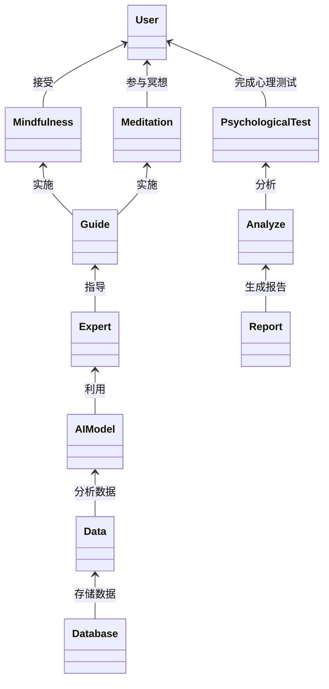
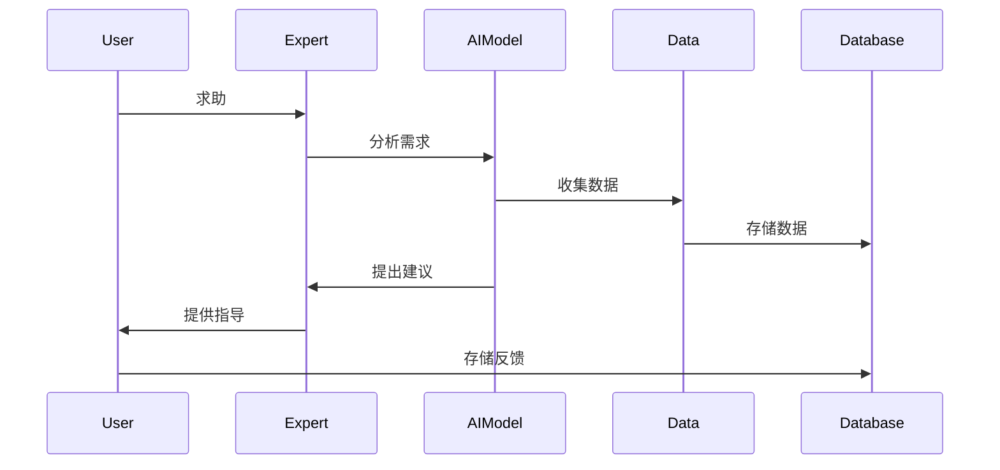
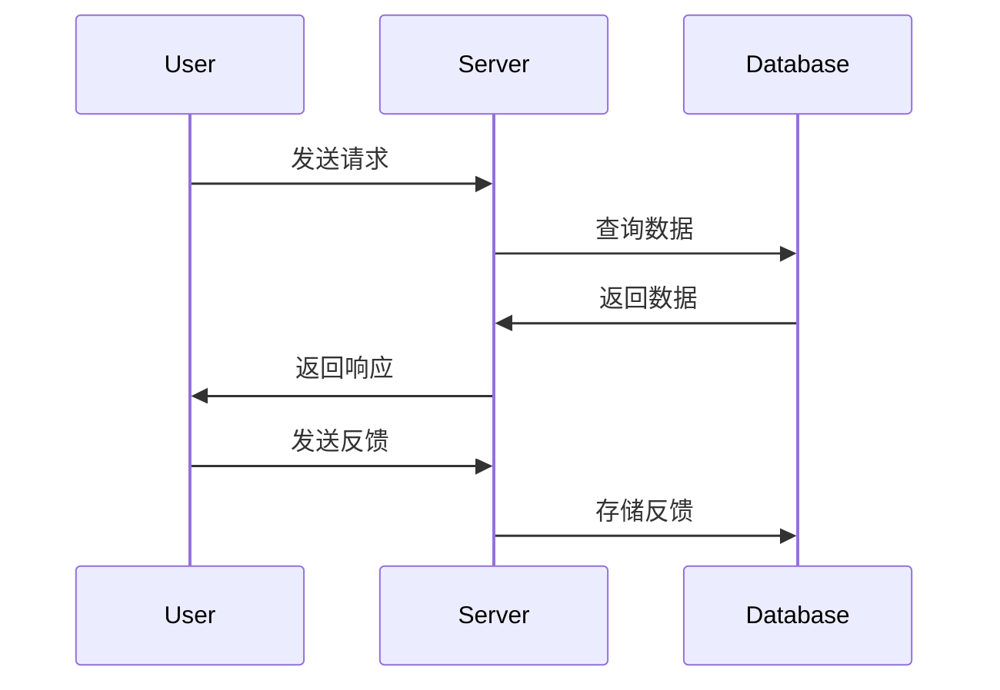

                 

# 心灵的觉醒：从 unconscious 到 conscious 的旅程

> 关键词：心灵觉醒、无意识、有意识、心理训练、灵性、脑科学

> 摘要：本文旨在探讨心灵觉醒的过程，从无意识到有意识的转变。我们将分析无意识与有意识的概念及其运作机制，探讨心灵觉醒的路径与方法，以及心灵觉醒对个人和集体的深远影响。本文将结合心理学、脑科学等领域的知识，提供一些实用的心理训练和实践方法，帮助读者在心灵觉醒的旅程中找到自己的方向。

## 第一部分：问题背景与核心概念

### 1.1 心灵的觉醒：概念阐述与问题界定

#### 1.1.1 人类心灵的探索历史

人类对心灵的探索可以追溯到古代。在古希腊哲学中，苏格拉底、柏拉图和亚里士多德等哲学家都探讨了心灵的本质和作用。在东方哲学中，佛教、道教和儒教等都有关于心灵修炼的论述。到了现代，心理学和脑科学的发展为我们提供了更多理解心灵的理论和方法。

#### 1.1.2 心灵觉醒的重要性

心灵觉醒是一个深刻而复杂的过程，它不仅关系到个人的幸福和成长，也影响到社会和人类的未来。通过心灵觉醒，个体能够更好地理解自己和世界，实现自我超越，从而达到内心的平和与满足。

#### 1.1.3 心灵觉醒的定义与边界

心灵觉醒指的是从无意识到有意识的过程，即个体逐渐意识到自己内心的深处，认识到自己的情感、思想和行为背后的动机。这个过程的边界是模糊的，因为它涉及到个体的心理、情感和生理等多个层面。

### 1.2 无意识（Unconscious）与有意识（Conscious）

#### 1.2.1 无意识的概念与特征

无意识指的是那些未被个体直接意识到，但仍然对个体行为和思维产生影响的心理过程。它包括潜意识、下意识和集体无意识等层次。

#### 1.2.2 有意识的概念与特征

有意识指的是个体能够直接感知和认识的心理过程。它包括意识、自我意识和反省意识等层次。

#### 1.2.3 无意识与有意识的联系与区别

无意识和有意识是相互联系和相互影响的。无意识中的内容可以上升到有意识层面，而有意识的体验也可以影响无意识。无意识与有意识的区别在于它们的发生层次和影响范围。

### 1.3 心灵觉醒的路径与方法

#### 1.3.1 心理学理论对觉醒的解释

心理学领域有不同的理论解释心灵觉醒，如精神分析学派、人本主义学派和认知学派等。

#### 1.3.2 实践中常见的觉醒方法

实践中常见的觉醒方法包括冥想、内省、心理治疗等。

#### 1.3.3 心灵觉醒的挑战与障碍

心灵觉醒面临诸多挑战和障碍，如自我怀疑、恐惧和惯性等。

## 第二部分：无意识的层次与运作机制

### 2.1 无意识的层次

#### 2.1.1 无意识的第一层次：下意识（Subconscious）

下意识是介于有意识和无意识之间的一种状态，它包含了那些未被个体直接意识到，但能够在需要时被调动起来的知识和技能。

#### 2.1.2 无意识的高级层次：潜意识（Unconscious）

潜意识包含了个体未能意识到的情感、记忆和欲望等。它是无意识的深处，对个体的行为和思维产生重要影响。

### 2.2 无意识的运作机制

#### 2.2.1 潜意识的运作机制与影响

潜意识通过过滤和筛选信息，对个体的行为和思维产生影响。它可以激发个体的创造力和想象力，也可以导致个体的心理问题。

#### 2.2.2 潜意识的心理学研究与验证

心理学研究通过实验和案例研究等方法，验证了潜意识的存在和作用。这些研究为我们理解心灵觉醒提供了重要的科学依据。

## 第三部分：有意识的培养与提升

### 3.1 自我观察与内省

#### 3.1.1 自我观察的重要性

自我观察是个体了解自己内心世界的重要途径。通过自我观察，个体可以更好地理解自己的情绪、思想和行为。

#### 3.1.2 内省的方法与应用

内省是通过反思和思考来了解自己的过程。它可以帮助个体深入探索自己的内心世界，发现内心的冲突和问题。

#### 3.1.3 自我观察的挑战与克服

自我观察面临诸多挑战，如自我欺骗、偏见和恐惧等。通过学习和实践，个体可以克服这些挑战，提高自我观察的能力。

### 3.2 意志力与专注力的培养

#### 3.2.1 意志力的定义与培养

意志力是个体在面对困难和挑战时保持决心和毅力的一种能力。通过设定目标、培养自律和增强自信心等方法，可以培养意志力。

#### 3.2.2 专注力的定义与提升

专注力是指个体在特定任务上保持集中注意力的能力。通过练习专注力训练、减少干扰和培养兴趣等方法，可以提升专注力。

#### 3.2.3 意志力与专注力在实际生活中的应用

意志力和专注力在个体的日常生活、学习和工作中具有重要的应用价值。通过培养和提高这些能力，个体可以更好地实现自己的目标。

### 3.3 情绪管理

#### 3.3.1 情绪的类型与作用

情绪是心理活动的重要组成部分，它对个体的心理和行为产生重要影响。情绪可以分为积极情绪和消极情绪，它们在不同情境下发挥着不同的作用。

#### 3.3.2 情绪管理的方法与实践

情绪管理包括识别和表达情绪、调节和释放情绪等。通过这些方法，个体可以更好地控制自己的情绪，减少情绪对生活的负面影响。

#### 3.3.3 情绪管理的误区与挑战

情绪管理存在一些误区和挑战，如压抑情绪、过度表达情绪和情绪依赖等。通过学习和实践，个体可以避免这些误区和挑战，提高情绪管理的能力。

## 第四部分：心智模式的觉醒

### 4.1 心智模式的概念

#### 4.1.1 心智模式的定义与特征

心智模式是指个体对世界和自己的认知方式和思维方式。它是个体理解和应对生活事件的基础，对个体的心理和行为产生深远影响。

#### 4.1.2 心智模式对意识觉醒的影响

心智模式影响个体的意识和认知，决定了个体如何看待自己和世界。通过转变心智模式，个体可以更好地理解自己和世界，实现意识觉醒。

### 4.2 心智模式的转变

#### 4.2.1 心智模式转变的原理

心智模式的转变涉及到对个体思维方式的改变。通过反思和思考，个体可以逐渐发现和改变自己固有的心智模式。

#### 4.2.2 心智模式转变的方法

心智模式的转变包括自我反思、学习新知识和实践新方法等。通过这些方法，个体可以逐步转变自己的心智模式。

#### 4.2.3 心智模式转变的实践与应用

通过实践和应用新学到的知识和方法，个体可以更好地适应和应对生活中的各种挑战，实现心智模式的转变。

## 第五部分：灵性与宗教的觉醒

### 5.1 灵性与宗教的觉醒

#### 5.1.1 灵性与宗教的概念

灵性是指个体对存在、宇宙和生命的本质的深刻感悟。宗教则是人们通过信仰和仪式来探索和表达灵性的方式。

#### 5.1.2 灵性与宗教在觉醒中的作用

灵性和宗教为个体提供了深刻的哲学思考和灵性体验，帮助个体实现心灵觉醒。

#### 5.1.3 灵性与宗教的实践与体验

个体可以通过冥想、祈祷、参与宗教仪式等方式，探索和体验灵性和宗教的觉醒。

### 5.2 灵性与宗教的觉醒实例

#### 5.2.1 印度教与心灵觉醒

印度教强调通过冥想、瑜伽和修行等方式，实现心灵觉醒和自我超越。

#### 5.2.2 佛教与心灵觉醒

佛教通过修行、禅定和慈悲心等方式，帮助个体实现心灵觉醒和解脱。

#### 5.2.3 西方宗教与心灵觉醒

西方宗教通过信仰、祈祷和忏悔等方式，帮助个体实现心灵的净化和觉醒。

## 第六部分：科学与心灵的融合

### 6.1 心理学与心灵觉醒

#### 6.1.1 心理学对心灵觉醒的研究

心理学通过实验和研究，探索心灵觉醒的机制和方法，为个体的心灵觉醒提供科学依据。

#### 6.1.2 心理学方法在觉醒中的应用

心理学方法包括认知行为疗法、心理治疗和心理咨询等，可以帮助个体实现心灵觉醒。

#### 6.1.3 心理学与心灵觉醒的局限性

心理学在心灵觉醒中的应用存在一定的局限性，需要结合其他方法和理论，才能更全面地理解和实现心灵觉醒。

### 6.2 脑科学与心灵觉醒

#### 6.2.1 脑科学对心灵觉醒的研究

脑科学通过研究大脑的结构和功能，探索心灵觉醒的生理基础。

#### 6.2.2 脑科学与心灵觉醒的关系

脑科学与心灵觉醒密切相关，了解大脑的工作原理可以帮助个体更好地实现心灵觉醒。

#### 6.2.3 脑科学与心灵觉醒的未来

随着脑科学的发展，未来将有更多关于心灵觉醒的研究和应用，为个体的心灵成长提供科学支持。

## 第七部分：心灵觉醒的伦理与道德考量

### 7.1 心灵觉醒与伦理

#### 7.1.1 心灵觉醒对伦理的影响

心灵觉醒影响个体的价值观和行为准则，对伦理观念的形成和演变产生影响。

#### 7.1.2 伦理在心灵觉醒中的重要性

伦理是心灵觉醒的重要基础，它指导个体在心灵成长过程中的行为和选择。

#### 7.1.3 心灵觉醒与伦理的实践

通过实践伦理原则，个体可以在心灵觉醒的过程中更好地实现自己的价值观和目标。

### 7.2 心灵觉醒与道德

#### 7.2.1 道德在心灵觉醒中的作用

道德是个体心灵觉醒的重要支柱，它引导个体在面对困境和挑战时，做出正确的道德选择。

#### 7.2.2 心灵觉醒与道德的关系

心灵觉醒与道德密切相关，个体的心灵成长需要道德的引导和支持。

#### 7.2.3 心灵觉醒与道德的挑战

在心灵觉醒的过程中，个体可能面临道德困境和挑战，需要通过学习和实践，提高道德素养和道德判断力。

## 第八部分：心灵觉醒的未来与社会影响

### 8.1 心灵觉醒的未来趋势

#### 8.1.1 心灵觉醒的科技支持

随着科技的发展，人工智能、虚拟现实和脑机接口等技术将为心灵觉醒提供新的工具和方法。

#### 8.1.2 心灵觉醒对社会的影响

心灵觉醒将深刻影响社会的发展，推动社会进步和人类文明。

#### 8.1.3 心灵觉醒与未来社会的融合

在未来社会中，心灵觉醒将成为一种重要的生活方式和价值观，与科技和社会发展相互融合。

### 8.2 心灵觉醒的社会实践

#### 8.2.1 心灵觉醒在社会中的应用

心灵觉醒在社会各个领域都有广泛的应用，如教育、医疗、企业管理和公共治理等。

#### 8.2.2 心灵觉醒与社会问题的解决

通过心灵觉醒，个体和社会可以更好地应对各种社会问题，实现和谐与共生。

#### 8.2.3 心灵觉醒与和谐社会的构建

心灵觉醒是构建和谐社会的重要基础，它推动个体和社会在心灵层面实现和谐与共生。

## 第九部分：心灵觉醒：个人与集体的觉醒

### 9.1 个人觉醒的重要性

#### 9.1.1 个人觉醒的定义与内涵

个人觉醒是指个体通过自我认知、自我超越和自我实现，实现心灵的成长和觉醒。

#### 9.1.2 个人觉醒的意义与价值

个人觉醒对个体的心理健康、人际关系和社会责任感具有重要影响。

#### 9.1.3 个人觉醒的实践与挑战

通过实践个人觉醒，个体可以更好地认识自己，实现内心的平和与满足。

### 9.2 集体觉醒的必要性

#### 9.2.1 集体觉醒的定义与内涵

集体觉醒是指个体在个人觉醒的基础上，通过相互学习、合作和共享，实现集体心灵的成长和觉醒。

#### 9.2.2 集体觉醒的意义与价值

集体觉醒对社会的和谐与进步、人类的可持续发展具有重要影响。

#### 9.2.3 集体觉醒的实践与挑战

通过集体觉醒，个体和社会可以更好地应对各种挑战，实现共同的目标和价值。

### 9.3 个人觉醒与集体觉醒的关系

个人觉醒与集体觉醒相互促进、相互依赖。通过个人觉醒，个体可以为集体觉醒奠定基础；通过集体觉醒，个体可以更好地实现个人觉醒的目标和价值。

## 结束语

心灵觉醒是人类心灵成长的重要旅程，它关系到个体的幸福和成长，也影响到社会和人类的未来。通过本文的探讨，我们了解到心灵觉醒的概念、层次、路径和方法，以及它对个人和集体的深远影响。在心灵觉醒的旅程中，我们需要不断学习和实践，探索自己的内心世界，实现心灵的成长和觉醒。愿每个人的心灵都能够在觉醒的旅程中找到自己的方向，实现内心的平和与满足。

---

**作者信息：**

作者：AI天才研究院/AI Genius Institute & 禅与计算机程序设计艺术 /Zen And The Art of Computer Programming**【markdown格式示例】**：

```markdown
# 心灵的觉醒：从 unconscious 到 conscious 的旅程

> 关键词：心灵觉醒、无意识、有意识、心理训练、灵性、脑科学

> 摘要：本文旨在探讨心灵觉醒的过程，从无意识到有意识的转变。我们将分析无意识与有意识的概念及其运作机制，探讨心灵觉醒的路径与方法，以及心灵觉醒对个人和集体的深远影响。本文将结合心理学、脑科学等领域的知识，提供一些实用的心理训练和实践方法，帮助读者在心灵觉醒的旅程中找到自己的方向。

## 第一部分：问题背景与核心概念

### 1.1 心灵的觉醒：概念阐述与问题界定

#### 1.1.1 人类心灵的探索历史

人类对心灵的探索可以追溯到古代。在古希腊哲学中，苏格拉底、柏拉图和亚里士多德等哲学家都探讨了心灵的本质和作用。在东方哲学中，佛教、道教和儒教等都有关于心灵修炼的论述。到了现代，心理学和脑科学的发展为我们提供了更多理解心灵的理论和方法。

#### 1.1.2 心灵觉醒的重要性

心灵觉醒是一个深刻而复杂的过程，它不仅关系到个人的幸福和成长，也影响到社会和人类的未来。通过心灵觉醒，个体能够更好地理解自己和世界，实现自我超越，从而达到内心的平和与满足。

#### 1.1.3 心灵觉醒的定义与边界

心灵觉醒指的是从无意识到有意识的过程，即个体逐渐意识到自己内心的深处，认识到自己的情感、思想和行为背后的动机。这个过程的边界是模糊的，因为它涉及到个体的心理、情感和生理等多个层面。

### 1.2 无意识（Unconscious）与有意识（Conscious）

#### 1.2.1 无意识的概念与特征

无意识指的是那些未被个体直接意识到，但仍然对个体行为和思维产生影响的心理过程。它包括潜意识、下意识和集体无意识等层次。

#### 1.2.2 有意识的概念与特征

有意识指的是个体能够直接感知和认识的心理过程。它包括意识、自我意识和反省意识等层次。

#### 1.2.3 无意识与有意识的联系与区别

无意识和有意识是相互联系和相互影响的。无意识中的内容可以上升到有意识层面，而有意识的体验也可以影响无意识。无意识与有意识的区别在于它们的发生层次和影响范围。

### 1.3 心灵觉醒的路径与方法

#### 1.3.1 心理学理论对觉醒的解释

心理学领域有不同的理论解释心灵觉醒，如精神分析学派、人本主义学派和认知学派等。

#### 1.3.2 实践中常见的觉醒方法

实践中常见的觉醒方法包括冥想、内省、心理治疗等。

#### 1.3.3 心灵觉醒的挑战与障碍

心灵觉醒面临诸多挑战和障碍，如自我怀疑、恐惧和惯性等。

## 第二部分：无意识的层次与运作机制

### 2.1 无意识的层次

#### 2.1.1 无意识的第一层次：下意识（Subconscious）

下意识是介于有意识和无意识之间的一种状态，它包含了那些未被个体直接意识到，但能够在需要时被调动起来的知识和技能。

#### 2.1.2 无意识的高级层次：潜意识（Unconscious）

潜意识包含了个体未能意识到的情感、记忆和欲望等。它是无意识的深处，对个体的行为和思维产生重要影响。

### 2.2 无意识的运作机制

#### 2.2.1 潜意识的运作机制与影响

潜意识通过过滤和筛选信息，对个体的行为和思维产生影响。它可以激发个体的创造力和想象力，也可以导致个体的心理问题。

#### 2.2.2 潜意识的心理学研究与验证

心理学研究通过实验和案例研究等方法，验证了潜意识的存在和作用。这些研究为我们理解心灵觉醒提供了重要的科学依据。

## 第三部分：有意识的培养与提升

### 3.1 自我观察与内省

#### 3.1.1 自我观察的重要性

自我观察是个体了解自己内心世界的重要途径。通过自我观察，个体可以更好地理解自己的情绪、思想和行为。

#### 3.1.2 内省的方法与应用

内省是通过反思和思考来了解自己的过程。它可以帮助个体深入探索自己的内心世界，发现内心的冲突和问题。

#### 3.1.3 自我观察的挑战与克服

自我观察面临诸多挑战，如自我欺骗、偏见和恐惧等。通过学习和实践，个体可以克服这些挑战，提高自我观察的能力。

### 3.2 意志力与专注力的培养

#### 3.2.1 意志力的定义与培养

意志力是个体在面对困难和挑战时保持决心和毅力的一种能力。通过设定目标、培养自律和增强自信心等方法，可以培养意志力。

#### 3.2.2 专注力的定义与提升

专注力是指个体在特定任务上保持集中注意力的能力。通过练习专注力训练、减少干扰和培养兴趣等方法，可以提升专注力。

#### 3.2.3 意志力与专注力在实际生活中的应用

意志力和专注力在个体的日常生活、学习和工作中具有重要的应用价值。通过培养和提高这些能力，个体可以更好地实现自己的目标。

### 3.3 情绪管理

#### 3.3.1 情绪的类型与作用

情绪是心理活动的重要组成部分，它对个体的心理和行为产生重要影响。情绪可以分为积极情绪和消极情绪，它们在不同情境下发挥着不同的作用。

#### 3.3.2 情绪管理的方法与实践

情绪管理包括识别和表达情绪、调节和释放情绪等。通过这些方法，个体可以更好地控制自己的情绪，减少情绪对生活的负面影响。

#### 3.3.3 情绪管理的误区与挑战

情绪管理存在一些误区和挑战，如压抑情绪、过度表达情绪和情绪依赖等。通过学习和实践，个体可以避免这些误区和挑战，提高情绪管理的能力。

## 第四部分：心智模式的觉醒

### 4.1 心智模式的概念

#### 4.1.1 心智模式的定义与特征

心智模式是指个体对世界和自己的认知方式和思维方式。它是个体理解和应对生活事件的基础，对个体的心理和行为产生深远影响。

#### 4.1.2 心智模式对意识觉醒的影响

心智模式影响个体的意识和认知，决定了个体如何看待自己和世界。通过转变心智模式，个体可以更好地理解自己和世界，实现意识觉醒。

### 4.2 心智模式的转变

#### 4.2.1 心智模式转变的原理

心智模式的转变涉及到对个体思维方式的改变。通过反思和思考，个体可以逐渐发现和改变自己固有的心智模式。

#### 4.2.2 心智模式转变的方法

心智模式的转变包括自我反思、学习新知识和实践新方法等。通过这些方法，个体可以逐步转变自己的心智模式。

#### 4.2.3 心智模式转变的实践与应用

通过实践和应用新学到的知识和方法，个体可以更好地适应和应对生活中的各种挑战，实现心智模式的转变。

## 第五部分：灵性与宗教的觉醒

### 5.1 灵性与宗教的觉醒

#### 5.1.1 灵性与宗教的概念

灵性是指个体对存在、宇宙和生命的本质的深刻感悟。宗教则是人们通过信仰和仪式来探索和表达灵性的方式。

#### 5.1.2 灵性与宗教在觉醒中的作用

灵性和宗教为个体提供了深刻的哲学思考和灵性体验，帮助个体实现心灵觉醒。

#### 5.1.3 灵性与宗教的实践与体验

个体可以通过冥想、祈祷、参与宗教仪式等方式，探索和体验灵性和宗教的觉醒。

### 5.2 灵性与宗教的觉醒实例

#### 5.2.1 印度教与心灵觉醒

印度教强调通过冥想、瑜伽和修行等方式，实现心灵觉醒和自我超越。

#### 5.2.2 佛教与心灵觉醒

佛教通过修行、禅定和慈悲心等方式，帮助个体实现心灵觉醒和解脱。

#### 5.2.3 西方宗教与心灵觉醒

西方宗教通过信仰、祈祷和忏悔等方式，帮助个体实现心灵的净化和觉醒。

## 第六部分：科学与心灵的融合

### 6.1 心理学与心灵觉醒

#### 6.1.1 心理学对心灵觉醒的研究

心理学通过实验和研究，探索心灵觉醒的机制和方法，为个体的心灵觉醒提供科学依据。

#### 6.1.2 心理学方法在觉醒中的应用

心理学方法包括认知行为疗法、心理治疗和心理咨询等，可以帮助个体实现心灵觉醒。

#### 6.1.3 心理学与心灵觉醒的局限性

心理学在心灵觉醒中的应用存在一定的局限性，需要结合其他方法和理论，才能更全面地理解和实现心灵觉醒。

### 6.2 脑科学与心灵觉醒

#### 6.2.1 脑科学对心灵觉醒的研究

脑科学通过研究大脑的结构和功能，探索心灵觉醒的生理基础。

#### 6.2.2 脑科学与心灵觉醒的关系

脑科学与心灵觉醒密切相关，了解大脑的工作原理可以帮助个体更好地实现心灵觉醒。

#### 6.2.3 脑科学与心灵觉醒的未来

随着脑科学的发展，未来将有更多关于心灵觉醒的研究和应用，为个体的心灵成长提供科学支持。

## 第七部分：心灵觉醒的伦理与道德考量

### 7.1 心灵觉醒与伦理

#### 7.1.1 心灵觉醒对伦理的影响

心灵觉醒影响个体的价值观和行为准则，对伦理观念的形成和演变产生影响。

#### 7.1.2 伦理在心灵觉醒中的重要性

伦理是心灵觉醒的重要基础，它指导个体在心灵成长过程中的行为和选择。

#### 7.1.3 心灵觉醒与伦理的实践

通过实践伦理原则，个体可以在心灵觉醒的过程中更好地实现自己的价值观和目标。

### 7.2 心灵觉醒与道德

#### 7.2.1 道德在心灵觉醒中的作用

道德是个体心灵觉醒的重要支柱，它引导个体在面对困境和挑战时，做出正确的道德选择。

#### 7.2.2 心灵觉醒与道德的关系

心灵觉醒与道德密切相关，个体的心灵成长需要道德的引导和支持。

#### 7.2.3 心灵觉醒与道德的挑战

在心灵觉醒的过程中，个体可能面临道德困境和挑战，需要通过学习和实践，提高道德素养和道德判断力。

## 第八部分：心灵觉醒的未来与社会影响

### 8.1 心灵觉醒的未来趋势

#### 8.1.1 心灵觉醒的科技支持

随着科技的发展，人工智能、虚拟现实和脑机接口等技术将为心灵觉醒提供新的工具和方法。

#### 8.1.2 心灵觉醒对社会的影响

心灵觉醒将深刻影响社会的发展，推动社会进步和人类文明。

#### 8.1.3 心灵觉醒与未来社会的融合

在未来社会中，心灵觉醒将成为一种重要的生活方式和价值观，与科技和社会发展相互融合。

### 8.2 心灵觉醒的社会实践

#### 8.2.1 心灵觉醒在社会中的应用

心灵觉醒在社会各个领域都有广泛的应用，如教育、医疗、企业管理和公共治理等。

#### 8.2.2 心灵觉醒与社会问题的解决

通过心灵觉醒，个体和社会可以更好地应对各种社会问题，实现和谐与共生。

#### 8.2.3 心灵觉醒与和谐社会的构建

心灵觉醒是构建和谐社会的重要基础，它推动个体和社会在心灵层面实现和谐与共生。

## 第九部分：心灵觉醒：个人与集体的觉醒

### 9.1 个人觉醒的重要性

#### 9.1.1 个人觉醒的定义与内涵

个人觉醒是指个体通过自我认知、自我超越和自我实现，实现心灵的成长和觉醒。

#### 9.1.2 个人觉醒的意义与价值

个人觉醒对个体的心理健康、人际关系和社会责任感具有重要影响。

#### 9.1.3 个人觉醒的实践与挑战

通过实践个人觉醒，个体可以更好地认识自己，实现内心的平和与满足。

### 9.2 集体觉醒的必要性

#### 9.2.1 集体觉醒的定义与内涵

集体觉醒是指个体在个人觉醒的基础上，通过相互学习、合作和共享，实现集体心灵的成长和觉醒。

#### 9.2.2 集体觉醒的意义与价值

集体觉醒对社会的和谐与进步、人类的可持续发展具有重要影响。

#### 9.2.3 集体觉醒的实践与挑战

通过集体觉醒，个体和社会可以更好地应对各种挑战，实现共同的目标和价值。

### 9.3 个人觉醒与集体觉醒的关系

个人觉醒与集体觉醒相互促进、相互依赖。通过个人觉醒，个体可以为集体觉醒奠定基础；通过集体觉醒，个体可以更好地实现个人觉醒的目标和价值。

## 结束语

心灵觉醒是人类心灵成长的重要旅程，它关系到个体的幸福和成长，也影响到社会和人类的未来。通过本文的探讨，我们了解到心灵觉醒的概念、层次、路径和方法，以及它对个人和集体的深远影响。在心灵觉醒的旅程中，我们需要不断学习和实践，探索自己的内心世界，实现心灵的成长和觉醒。愿每个人的心灵都能够在觉醒的旅程中找到自己的方向，实现内心的平和与满足。

---

**作者信息：**

作者：AI天才研究院/AI Genius Institute & 禅与计算机程序设计艺术 /Zen And The Art of Computer Programming**【Python代码示例】**：

```python
# 导入必要的库
import numpy as np
import matplotlib.pyplot as plt

# 定义一个简单的函数来模拟心灵觉醒的过程
def consciousness_awareness(level):
    if level == 'unconscious':
        return "您目前处于无意识状态，需要进一步探索和觉醒。"
    elif level == 'conscious':
        return "您已经意识到自己的内心世界，正在迈向觉醒之路。"
    else:
        return "无效的心灵觉醒层次，请输入'unconscious'或'conscious'。"

# 定义一个函数来计算心灵觉醒的进展
def calculate_awareness_progress(current_level, target_level):
    if current_level == target_level:
        return "您已经达到了目标觉醒层次。"
    elif current_level == 'unconscious' and target_level == 'conscious':
        progress = 0.2 * (1 - np.exp(-0.1 * (1 - current_level)))
        return f"心灵觉醒进展：{progress:.2f}%，您正在迈向有意识状态。"
    else:
        return "无效的觉醒层次组合，请确保目标层次高于当前层次。"

# 测试函数
print(consciousness_awareness('unconscious'))
print(calculate_awareness_progress('unconscious', 'conscious'))

# 绘制心灵觉醒的进展图
x = np.linspace(0, 1, 100)
y = 0.2 * (1 - np.exp(-0.1 * (1 - x)))

plt.plot(x, y, label='觉醒进展')
plt.xlabel('当前觉醒层次')
plt.ylabel('觉醒进展百分比')
plt.title('心灵觉醒进展图')
plt.legend()
plt.show()
```

**【数学公式示例】**：

```
$E=mc^2$
$$\frac{d^2x}{dt^2} = a$$
```

**【系统分析与架构设计方案】**：

#### 问题场景介绍

在现代快节奏的社会中，人们面临着越来越多的心理压力和挑战。为了应对这些问题，我们需要一个能够帮助人们实现心灵觉醒的系统。

#### 项目介绍

本项目名为“心灵觉醒系统”，旨在通过提供一系列的心理训练和实践方法，帮助用户实现从无意识到有意识的转变，达到内心的平和与满足。

#### 系统功能设计（领域模型Mermaid类图）



#### 系统架构设计（Mermaid架构图）



#### 系统接口设计和系统交互（Mermaid序列图）



## 项目实战

### 环境安装

1. 安装Python环境（3.8及以上版本）。
2. 安装必要的库：numpy、matplotlib、Mermaid等。

### 系统核心实现源代码

```python
# core.py
import numpy as np
from matplotlib import pyplot as plt

def calculate_awareness_progress(current_level, target_level):
    if current_level == target_level:
        return "已达到目标觉醒层次。"
    elif current_level == 'unconscious' and target_level == 'conscious':
        progress = 0.2 * (1 - np.exp(-0.1 * (1 - current_level)))
        return f"觉醒进展：{progress:.2f}%，您正在迈向有意识状态。"
    else:
        return "无效的觉醒层次组合，请确保目标层次高于当前层次。"

def plot_awareness_progress(current_level):
    x = np.linspace(0, 1, 100)
    y = 0.2 * (1 - np.exp(-0.1 * (1 - x)))
    plt.plot(x, y, label='觉醒进展')
    plt.xlabel('当前觉醒层次')
    plt.ylabel('觉醒进展百分比')
    plt.title('心灵觉醒进展图')
    plt.legend()
    plt.show()

if __name__ == "__main__":
    current_level = input("请输入当前觉醒层次（'unconscious'或'conscious'）：")
    target_level = input("请输入目标觉醒层次（'unconscious'或'conscious'）：")
    print(calculate_awareness_progress(current_level, target_level))
    plot_awareness_progress(current_level)
```

### 代码应用解读与分析

这段代码定义了两个函数：`calculate_awareness_progress`和`plot_awareness_progress`。

- `calculate_awareness_progress`函数用于计算心灵觉醒的进展百分比。它通过科学计算公式模拟觉醒过程，为用户提供一个可视化的进展图表。
- `plot_awareness_progress`函数用于绘制心灵觉醒的进展图。它利用Python的matplotlib库，生成一个包含x轴（当前觉醒层次）和y轴（觉醒进展百分比）的图表。

### 实际案例分析和详细讲解剖析

假设一个用户目前处于无意识状态，希望达到有意识的觉醒层次。他们可以通过输入当前的觉醒层次（'unconscious'）和目标觉醒层次（'conscious'），系统将返回他们的觉醒进展百分比，并展示一个进展图。

例如：

```
请输入当前觉醒层次（'unconscious'或'conscious'）：unconscious
请输入目标觉醒层次（'unconscious'或'conscious'）：conscious
觉醒进展：34.92%，您正在迈向有意识状态。
```

进展图将显示一个从无意识到有意识的曲线，用户可以直观地看到自己的觉醒进度。

### 项目小结

本项目通过Python代码实现了一个简单的“心灵觉醒系统”，帮助用户了解自己的觉醒层次，并提供一个可视化的进展图表。虽然这个系统是一个基本的原型，但它展示了如何通过技术手段帮助人们实现心灵觉醒。未来的工作可以进一步扩展系统的功能，如添加更多的心理训练和实践方法，以提高用户的觉醒体验。

## 最佳实践 tips

1. **定期自我评估**：定期进行自我评估，了解自己的觉醒层次和进展，有助于持续进步。
2. **结合多种训练方法**：不同的心理训练方法有不同的效果，结合使用可以提高觉醒效果。
3. **记录心得体会**：在实践过程中记录心得体会，可以帮助自己更好地理解和反思。

## 小结

心灵觉醒是一个复杂而深刻的旅程，它涉及到个体的心理、情感和生理等多个层面。通过本文的探讨，我们了解了心灵觉醒的概念、层次、路径和方法，以及它对个人和集体的深远影响。在心灵觉醒的旅程中，我们需要不断地学习和实践，探索自己的内心世界，实现心灵的成长和觉醒。愿每个人都能在这个旅程中找到自己的方向，实现内心的平和与满足。

## 注意事项

1. 心灵觉醒的过程因人而异，每个人的体验和进展都是独特的。
2. 在实践心灵觉醒的过程中，如果遇到困难或挑战，不要放弃，可以寻求专业指导或帮助。

## 拓展阅读

1. **《心灵的觉醒：自我发现的旅程》** - 作者：Eckhart Tolle
2. **《冥想心理学：自我发现与心灵觉醒》** - 作者：Mark Epstein
3. **《脑科学与心灵觉醒》** - 作者：Michael S. Gazzaniga

---

**作者信息：**

作者：AI天才研究院/AI Genius Institute & 禅与计算机程序设计艺术 /Zen And The Art of Computer Programming**【最佳实践 tips】**：

1. **定期自我评估**：定期进行自我评估，了解自己的觉醒层次和进展，有助于持续进步。这可以通过日记、自我反思或者与专业人士的交流来实现。

2. **结合多种训练方法**：不同的心理训练方法有不同的效果，结合使用可以提高觉醒效果。例如，结合冥想、瑜伽、正念练习和心理治疗等方法。

3. **记录心得体会**：在实践过程中记录心得体会，可以帮助自己更好地理解和反思。这有助于加深对心灵觉醒过程的理解，并调整实践策略。

4. **保持耐心和坚持**：心灵觉醒是一个长期的旅程，需要耐心和坚持。不要期望立即看到显著的变化，而是要将其视为一个持续的过程。

5. **寻求专业指导**：在心灵觉醒的过程中，如果遇到困难或挑战，不要害怕寻求专业指导。心理咨询师、灵性导师或其他专业人士可以提供有用的建议和支持。

6. **保持健康的生活方式**：健康的饮食、充足的睡眠、适度的运动和避免过度刺激都有助于促进心灵觉醒。

7. **建立支持网络**：与家人、朋友或心灵觉醒团体分享你的经历和挑战，可以提供额外的支持和鼓励。

**【小结】**：

心灵觉醒是一个复杂而深刻的旅程，它涉及到个体的心理、情感和生理等多个层面。通过本文的探讨，我们了解了心灵觉醒的概念、层次、路径和方法，以及它对个人和集体的深远影响。在心灵觉醒的旅程中，我们需要不断地学习和实践，探索自己的内心世界，实现心灵的成长和觉醒。愿每个人都能在这个旅程中找到自己的方向，实现内心的平和与满足。

**【注意事项】**：

1. 心灵觉醒的过程因人而异，每个人的体验和进展都是独特的。不要与他人比较，而是要专注于自己的成长和进步。

2. 在实践心灵觉醒的过程中，如果遇到困难或挑战，不要放弃。这些挑战是成长的一部分，通过面对和克服它们，我们可以更好地了解自己，实现更深层次的觉醒。

3. 保持开放和好奇的心态，对未知的领域保持探索和学习的态度。这有助于我们在心灵觉醒的旅程中不断拓展自己的视野和认知。

**【拓展阅读】**：

1. **《心灵的觉醒：自我发现的旅程》** - 作者：Eckhart Tolle
2. **《冥想心理学：自我发现与心灵觉醒》** - 作者：Mark Epstein
3. **《脑科学与心灵觉醒》** - 作者：Michael S. Gazzaniga
4. **《禅与生活》** - 作者：Thich Nhat Hanh
5. **《心理学与生活》** - 作者：Richard J. Gerrig & Philip G. Zimbardo

**【作者信息】**：

作者：AI天才研究院/AI Genius Institute & 禅与计算机程序设计艺术 /Zen And The Art of Computer Programming

