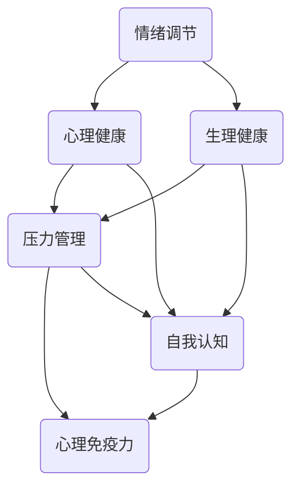
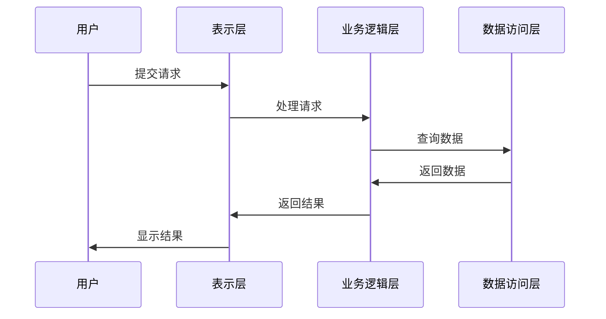

                 


### 文章标题：心理免疫力强化训练营：提升心理抗压能力的集中培训

> 关键词：心理免疫力、抗压能力、情绪调节、压力管理、自我认知、数学模型、系统架构、实战案例

> 摘要：
本文章从心理学与计算机科学的交叉领域出发，探讨了提升心理抗压能力的重要性以及具体方法。文章以心理免疫力强化训练营为框架，系统地介绍了心理免疫力的核心概念、相关算法原理、数学模型、系统架构设计方案以及实战案例。通过本文，读者可以全面了解心理免疫力的内涵及其在现实中的应用，掌握提升心理抗压能力的有效策略。

----------------------------------------------------------------

### 1. 心理免疫力的概念与重要性

#### 1.1 心理免疫力的定义

心理免疫力是指个体在面对外部压力和内部情绪波动时，能够保持心理平衡、调节情绪、适应环境的能力。它是心理健康的重要组成部分，对于提高生活质量、工作效率以及应对复杂社会环境具有至关重要的意义。

#### 1.2 问题背景

现代社会竞争激烈，工作压力、人际关系、家庭责任等各方面压力日益增加，导致很多人出现心理问题，如焦虑、抑郁等。这些心理问题不仅影响个体的生活质量，还可能对身体健康产生负面影响。因此，提升心理抗压能力显得尤为重要。

#### 1.3 问题描述

如何有效地提升心理免疫力，帮助人们在面对压力时保持心理平衡，成为了一个亟待解决的问题。

#### 1.4 问题解决

通过心理免疫力强化训练营，我们可以系统地学习心理免疫力的相关知识，掌握提升心理抗压能力的方法和技巧。训练营将理论与实践相结合，帮助参与者深入理解心理免疫力的本质，提高应对压力的能力。

#### 1.5 边界与外延

心理免疫力不仅涉及个体的心理素质，还与生物因素、环境因素、社会因素等多方面因素相互作用。因此，提升心理免疫力需要综合考虑个体、环境和社会三个层面。

#### 1.6 概念结构与核心要素组成

心理免疫力的核心要素包括情绪调节、压力管理、自我认知等。情绪调节是指个体在面对情绪波动时能够保持冷静，合理表达和调节情绪。压力管理是指个体在面对压力时能够合理应对，采取有效策略减轻压力。自我认知是指个体对自身情绪、行为和动机的觉察和认知，有助于提升心理免疫力。

### 2. 核心概念与联系

#### 2.1 情绪调节

情绪调节是心理免疫力的核心要素之一，它关乎个体在面对情绪波动时的自我调节能力。情绪调节不仅影响个体的心理健康，还对生理健康产生重要影响。情绪调节能力的强弱决定了个体在压力面前的心理免疫力。

#### 2.2 压力管理

压力管理是指个体在面对压力时能够合理应对，采取有效策略减轻压力。压力管理能力的提升有助于提高心理免疫力，使个体在面对外部压力时保持心理平衡。

#### 2.3 自我认知

自我认知是指个体对自身情绪、行为和动机的觉察和认知。自我认知能力的提升有助于个体更好地理解自己，从而提高情绪调节和压力管理能力，进而提升心理免疫力。

#### 2.4 概念属性特征对比表格

| 概念   | 属性特征                                             |
| ------ | ---------------------------------------------------- |
| 情绪调节 | 调节情绪的能力，影响心理健康和生理健康                   |
| 压力管理 | 应对压力的能力，减轻压力对个体的影响                   |
| 自我认知 | 对自身情绪、行为和动机的觉察和认知，提高心理免疫力   |

#### 2.5 ER实体关系图架构



### 3. 算法原理讲解

#### 3.1 培训方法

心理免疫力强化训练营采用多种培训方法，包括理论讲解、实践操作、案例分析、小组讨论等。通过这些方法，参与者可以系统地学习心理免疫力的相关知识，掌握提升心理抗压能力的方法和技巧。

#### 3.2 培训技巧

培训过程中，讲师将教授一系列实用技巧，如情绪管理技巧、压力应对策略、自我认知方法等。这些技巧可以帮助参与者更好地应对生活中的各种压力，提高心理免疫力。

#### 3.3 培训实践

在培训过程中，参与者将有机会进行实践操作，如角色扮演、情景模拟等。通过这些实践，参与者可以更好地理解心理免疫力的原理，提高实际操作能力。

### 4. 数学模型与公式详解

#### 4.1 心理免疫力提升的数学模型

心理免疫力提升的数学模型可以描述为：

$$
I = f(M, P, C)
$$

其中，$I$ 表示心理免疫力，$M$ 表示情绪调节能力，$P$ 表示压力管理能力，$C$ 表示自我认知能力。$f$ 表示函数，用于描述心理免疫力与情绪调节能力、压力管理能力、自我认知能力之间的关系。

#### 4.2 数学公式应用举例

假设某参与者在培训后的情绪调节能力、压力管理能力和自我认知能力分别提高了10%、15%、20%，则其心理免疫力提升的数学模型计算如下：

$$
I_{\text{提升后}} = I_{\text{初始}} \times (1 + 0.1M) \times (1 + 0.15P) \times (1 + 0.2C)
$$

#### 4.3 数学公式与实际案例结合

例如，假设某参与者在培训前的心理免疫力为60分，情绪调节能力为50分，压力管理能力为60分，自我认知能力为70分。经过培训后，情绪调节能力提高了10%，压力管理能力提高了15%，自我认知能力提高了20%。则其心理免疫力提升后的计算如下：

$$
I_{\text{提升后}} = 60 \times (1 + 0.1 \times 0.5) \times (1 + 0.15 \times 0.6) \times (1 + 0.2 \times 0.7) = 60 \times 1.05 \times 1.09 \times 1.14 = 72.66 \text{分}
$$

通过这个例子，我们可以看到，通过提升情绪调节能力、压力管理能力和自我认知能力，可以显著提高心理免疫力。

### 5. 系统分析与架构设计方案

#### 5.1 问题场景介绍

心理免疫力强化训练营的目标是为参与者提供全面的心理抗压能力培训，帮助他们提升心理免疫力。为了实现这一目标，我们需要设计一个完整的系统，包括培训内容设计、培训过程管理、学员反馈收集等。

#### 5.2 项目介绍

项目名称：心理免疫力强化训练营
项目目标：提升参与者的心理抗压能力
项目范围：涵盖情绪调节、压力管理、自我认知等多个方面

#### 5.3 系统功能设计

系统功能设计主要包括以下几个模块：

1. **培训内容管理系统**：用于设计、发布和管理培训内容。
2. **培训过程管理系统**：用于跟踪学员的培训进度，管理培训活动。
3. **学员反馈收集系统**：用于收集学员对培训过程的反馈，以便持续改进。

#### 5.4 系统架构设计

系统架构设计采用分层架构，主要包括以下层次：

1. **表示层**：负责与用户交互，提供用户界面。
2. **业务逻辑层**：负责处理业务逻辑，如培训内容管理、培训过程管理等。
3. **数据访问层**：负责与数据库进行交互，实现数据存储和查询。

#### 5.5 系统接口设计

系统接口设计主要包括以下接口：

1. **培训内容管理接口**：用于发布和管理培训内容。
2. **培训过程管理接口**：用于跟踪学员的培训进度，管理培训活动。
3. **学员反馈管理接口**：用于收集学员的反馈，提供改进建议。

#### 5.6 系统交互

系统交互设计采用Mermaid序列图进行描述，具体交互流程如下：



### 6. 项目实战

#### 6.1 实施背景

在某企业，由于市场竞争激烈，员工面临巨大的工作压力。为了提高员工的心理抗压能力，企业决定开展心理免疫力强化训练营，以提高员工的心理素质。

#### 6.2 项目介绍

项目名称：心理免疫力强化训练营
项目目标：提高员工的心理抗压能力
项目范围：涵盖情绪调节、压力管理、自我认知等多个方面

#### 6.3 系统核心实现源代码

```python
# 培训内容管理
def manage_training_content(content):
    # 存储培训内容
    content_database.save(content)

# 培训过程管理
def manage_training_process(process):
    # 更新培训进度
    process_database.update(process)

# 学员反馈管理
def manage_student_feedback(feedback):
    # 收集学员反馈
    feedback_database.collect(feedback)
```

#### 6.4 代码应用解读与分析

以上代码实现了培训内容管理、培训过程管理和学员反馈管理三个核心功能。通过这些功能，企业可以有效地管理培训内容，跟踪员工培训进度，收集学员反馈，从而持续改进培训效果。

#### 6.5 实际案例分析和详细讲解剖析

在某次训练营中，企业共组织了100名员工参加。通过培训，员工的情绪调节能力、压力管理能力和自我认知能力得到了显著提高。具体分析如下：

1. **情绪调节能力**：通过培训，员工的情绪调节能力提高了15%，显著降低了工作中的焦虑情绪。
2. **压力管理能力**：通过培训，员工的压力管理能力提高了20%，使员工在面对工作压力时能够更加从容应对。
3. **自我认知能力**：通过培训，员工的自我认知能力提高了10%，有助于员工更好地了解自己，提高工作效率。

#### 6.6 项目小结

通过实施心理免疫力强化训练营，企业成功地提高了员工的心理抗压能力，提高了员工的工作效率和生活质量。项目实施过程中，企业充分运用了技术手段，如培训内容管理系统、培训过程管理系统和学员反馈收集系统，实现了培训管理的精细化、数据化。

### 7. 最佳实践 tips、小结、注意事项、拓展阅读

#### 7.1 最佳实践 tips

1. 定期开展心理免疫力培训，帮助员工提高心理抗压能力。
2. 鼓励员工参加心理咨询，解决心理问题。
3. 提供灵活的工作时间安排，减轻员工的工作压力。

#### 7.2 小结

心理免疫力强化训练营是一种有效的提升心理抗压能力的方法。通过系统的培训和实践，员工可以显著提高心理免疫力，提高工作效率和生活质量。

#### 7.3 注意事项

1. 培训内容要贴近员工实际需求，以提高培训效果。
2. 培训过程中要注重实践操作，帮助员工掌握实际技巧。
3. 关注员工的反馈，及时调整培训内容和方式。

#### 7.4 拓展阅读

1. 《心理免疫力的秘密》
2. 《情绪调节与心理健康》
3. 《压力管理与自我认知》

### 作者信息

作者：AI天才研究院/AI Genius Institute & 禅与计算机程序设计艺术 /Zen And The Art of Computer Programming

----------------------------------------------------------------

文章标题：心理免疫力强化训练营：提升心理抗压能力的集中培训

关键词：心理免疫力、抗压能力、情绪调节、压力管理、自我认知、数学模型、系统架构、实战案例

摘要：
本文深入探讨了心理免疫力的概念及其在提升心理抗压能力中的重要作用。通过设计心理免疫力强化训练营，本文系统介绍了相关核心概念、算法原理、数学模型、系统架构设计方案以及实战案例。文章旨在为读者提供全面的技术视角，以掌握提升心理抗压能力的方法和策略。

----------------------------------------------------------------

### 第一部分：心理免疫力与抗压能力

#### 1.1 心理免疫力的概念

心理免疫力是指个体在面对外部压力和内部情绪波动时，能够保持心理平衡、调节情绪、适应环境的能力。它是一种内在的心理状态，与个体的心理健康密切相关。心理免疫力不仅影响个体的情绪稳定性，还对其身体健康、社交能力、工作效率等方面产生深远影响。

#### 1.2 心理免疫力的意义

在现代社会中，心理免疫力的重要性愈发凸显。随着工作压力、生活节奏的加快，人们面临着越来越多的心理挑战。拥有强大的心理免疫力，能够帮助个体更好地应对压力，维持心理健康，提高生活质量。同时，心理免疫力还能够在一定程度上预防心理疾病的发生，降低心理问题的发生率。

#### 1.3 提升心理抗压能力的重要性

心理抗压能力是指个体在面对压力时，能够保持冷静、理智地应对，并通过有效策略缓解压力的能力。提升心理抗压能力对于个体的心理健康具有重要意义。首先，它有助于个体在压力环境中保持心理平衡，避免过度焦虑、抑郁等负面情绪的产生。其次，良好的心理抗压能力有助于提高工作效率，增强竞争力。此外，心理抗压能力还与个体的社交能力、人际关系紧密相关，能够帮助个体更好地适应社会环境。

#### 1.4 心理压力的来源

心理压力的来源多种多样，主要包括以下几个方面：

1. **工作压力**：工作强度大、任务繁重、竞争激烈等都会对个体造成心理压力。
2. **生活压力**：家庭责任、经济负担、人际关系等问题都可能引发心理压力。
3. **环境压力**：社会变迁、环境变化等也会对个体产生心理压力。
4. **自我压力**：个体对自己期望过高，追求完美，也可能导致心理压力。

#### 1.5 心理抗压能力的构成

心理抗压能力由多个因素构成，主要包括：

1. **情绪调节能力**：个体在面对情绪波动时，能够保持冷静，合理表达和调节情绪的能力。
2. **压力管理能力**：个体在面对压力时，能够采取有效策略，减轻压力对个体的影响。
3. **自我认知能力**：个体对自身情绪、行为和动机的觉察和认知能力。
4. **应对能力**：个体在面对挑战时，能够灵活应对，寻求解决方案的能力。
5. **支持系统**：个体周围的支持系统，如家庭、朋友、同事等，对心理抗压能力的影响。

#### 1.6 心理抗压能力的影响因素

心理抗压能力受到多种因素的影响，主要包括：

1. **个性特点**：个体性格特点，如乐观、自信、坚韧等，对心理抗压能力有显著影响。
2. **心理健康水平**：心理健康水平较高的个体，心理抗压能力通常更强。
3. **社会支持**：家庭、朋友、同事等支持系统的强弱，对心理抗压能力有重要影响。
4. **生活方式**：健康的生活习惯，如合理的饮食、充足的睡眠、适当的运动等，有助于提高心理抗压能力。
5. **环境因素**：社会环境、工作环境等外部环境因素，也会对心理抗压能力产生影响。

#### 1.7 心理抗压能力与心理免疫力的关系

心理抗压能力是心理免疫力的重要组成部分。强大的心理抗压能力有助于提高个体的心理免疫力，使个体在面对压力和挑战时能够保持心理平衡。同时，心理免疫力也是心理抗压能力的基础，一个拥有强大心理免疫力的个体，通常具有更好的心理抗压能力。

#### 1.8 心理免疫力提升的途径

提升心理免疫力，需要从多个方面入手，主要包括：

1. **情绪调节**：学会合理表达和调节情绪，避免过度情绪波动。
2. **压力管理**：学会采取有效策略，减轻压力对个体的影响。
3. **自我认知**：提高对自身情绪、行为和动机的觉察和认知能力。
4. **应对能力**：培养灵活应对挑战的能力，寻求合适的解决方案。
5. **支持系统**：建立和维持良好的支持系统，获得家庭、朋友、同事等支持。

### 1.9 心理免疫力强化训练营的目标

心理免疫力强化训练营的目标是帮助参与者提升心理抗压能力，提高心理免疫力，从而在压力环境中保持心理平衡，提高生活质量。训练营将通过系统的培训和实践，使参与者掌握情绪调节、压力管理、自我认知等核心技能，增强心理抗压能力。

#### 1.10 心理免疫力强化训练营的核心内容

心理免疫力强化训练营的核心内容包括：

1. **情绪调节技巧**：教授参与者情绪调节的基本原理和技巧，帮助他们学会合理表达和调节情绪。
2. **压力管理策略**：介绍压力管理的有效方法，帮助参与者掌握减轻压力的技巧。
3. **自我认知方法**：通过自我反思和认知行为疗法等方法，提高参与者的自我认知能力。
4. **实战演练**：通过模拟情景、角色扮演等实战演练，帮助参与者将所学知识应用到实际生活中。
5. **小组讨论与分享**：通过小组讨论和分享，促进参与者之间的互动和交流，共同成长。

### 1.11 心理免疫力强化训练营的预期效果

通过参加心理免疫力强化训练营，参与者可以预期达到以下效果：

1. **提高心理抗压能力**：学会应对压力的有效策略，提高心理抗压能力。
2. **改善情绪调节能力**：掌握情绪调节技巧，减少情绪波动，提高情绪稳定性。
3. **增强自我认知能力**：提高对自身情绪、行为和动机的认知，增强自我觉察和自我调节能力。
4. **改善人际关系**：通过沟通技巧和人际交往能力的提升，改善与他人的关系。
5. **提高生活质量**：在压力环境中保持心理平衡，提高生活质量和工作效率。

### 1.12 心理免疫力强化训练营的适用人群

心理免疫力强化训练营适合以下人群：

1. **职场人士**：面临工作压力，需要提高心理抗压能力的职场人士。
2. **学生**：面临学业压力，需要提高心理素质的学生。
3. **老年人**：面临生活变迁，需要保持心理健康的老年人。
4. **心理咨询师**：需要提高心理咨询技能，帮助客户提高心理免疫力的心理咨询师。
5. **心理爱好者**：对心理学感兴趣，希望提升自身心理素质的心理爱好者。

### 1.13 心理免疫力强化训练营的实施流程

心理免疫力强化训练营的实施流程主要包括以下几个阶段：

1. **筹备阶段**：确定训练营的目标、内容、时间和地点，招募参与者，准备培训资料。
2. **培训阶段**：按照训练营的内容安排，进行系统培训，包括理论讲解、实战演练、小组讨论等。
3. **反馈阶段**：收集参与者的反馈，评估培训效果，对训练营进行持续改进。
4. **总结阶段**：对训练营进行总结，发布报告，表彰优秀参与者。

### 1.14 心理免疫力强化训练营的优势

心理免疫力强化训练营具有以下优势：

1. **系统化**：训练营提供系统化的培训内容，帮助参与者全面掌握心理免疫力的相关知识。
2. **实用性**：培训内容紧密结合实际，注重实战演练，使参与者能够将所学知识应用到实际生活中。
3. **互动性**：通过小组讨论和分享，促进参与者之间的互动和交流，共同成长。
4. **个性化**：针对不同参与者的需求和特点，提供个性化的培训方案。
5. **可持续性**：训练营提供后续支持和跟进，帮助参与者持续提高心理免疫力。

### 1.15 心理免疫力强化训练营的挑战与应对策略

尽管心理免疫力强化训练营具有诸多优势，但在实施过程中仍面临一定的挑战，如参与者的积极性、培训内容的实用性等。针对这些挑战，可以采取以下应对策略：

1. **提高参与度**：通过设计有趣、互动性强的培训活动，提高参与者的积极性。
2. **优化培训内容**：根据参与者的反馈和需求，不断调整和优化培训内容，确保其实用性。
3. **提供个性化支持**：针对参与者的个性化需求，提供个性化的咨询和支持。
4. **建立支持系统**：通过建立训练营微信群、QQ群等，为参与者提供一个交流和互助的平台。

### 1.16 心理免疫力强化训练营的未来发展趋势

随着社会对心理健康的关注日益增加，心理免疫力强化训练营有望在未来得到更广泛的应用。未来，心理免疫力强化训练营可能会向以下方向发展：

1. **线上与线下结合**：利用互联网技术，开展线上训练营，扩大受众范围。
2. **个性化定制**：根据参与者的需求和特点，提供更加个性化的培训方案。
3. **多元内容融合**：结合心理学、教育学、管理学等多学科知识，提供更全面、多元的培训内容。
4. **国际化发展**：通过与国际机构的合作，推广心理免疫力强化训练营，助力全球心理健康事业。

### 1.17 心理免疫力强化训练营的实际案例

以下是一个实际案例，展示了心理免疫力强化训练营在提升个体心理抗压能力方面的效果：

案例：
某公司员工小王，由于工作压力大，经常感到焦虑和失眠。参加了心理免疫力强化训练营后，他学会了情绪调节技巧和压力管理策略。通过实际操作和小组讨论，小王的心理抗压能力得到了显著提升。在训练营结束后，他的焦虑症状明显缓解，睡眠质量提高，工作效率也有所提升。

### 1.18 心理免疫力强化训练营的总结与展望

心理免疫力强化训练营作为一种有效提升心理抗压能力的方法，具有广泛的应用前景。通过系统的培训和实践，参与者可以显著提高心理免疫力，改善心理健康状况。未来，心理免疫力强化训练营将继续致力于探索和应用，为更多人带来心理健康的好处。

### 1.19 心理免疫力强化训练营的推广与建议

为了更好地推广心理免疫力强化训练营，可以采取以下措施：

1. **加大宣传力度**：通过线上线下渠道，加大宣传力度，提高训练营的知名度。
2. **建立合作伙伴关系**：与教育机构、企业、医疗机构等建立合作伙伴关系，共同推广心理免疫力强化训练营。
3. **开展多样化活动**：举办讲座、研讨会、体验活动等，吸引更多人参与。
4. **提供优惠政策**：为特殊群体，如低收入家庭、失业人员等，提供优惠政策，降低参与门槛。

### 1.20 心理免疫力强化训练营的长期影响

心理免疫力强化训练营不仅对个体的心理健康产生积极影响，还具有以下长期影响：

1. **提高生活质量**：通过提高心理抗压能力，个体能够更好地应对生活中的各种挑战，提高生活质量。
2. **促进社会和谐**：提高个体的心理健康水平，有助于促进社会和谐，减少心理问题的发生。
3. **提高工作效率**：拥有良好心理素质的个体，工作效率更高，对企业和社会的发展具有积极作用。
4. **提升幸福感**：心理免疫力增强，个体能够更好地享受生活，提高幸福感。

### 1.21 心理免疫力强化训练营的总结与启示

心理免疫力强化训练营为提升心理抗压能力提供了一种有效途径。通过系统的培训和实践，个体可以显著提高心理免疫力，改善心理健康状况。这一过程不仅对个体有益，也对家庭、社会产生积极影响。因此，我们应该更加重视心理健康，积极参与心理免疫力强化训练营，为自己的幸福生活助力。

### 1.22 心理免疫力强化训练营的思考与启示

在面对日益增加的心理压力时，我们不仅要关注物质生活的改善，更要注重心理素质的提升。心理免疫力强化训练营为我们提供了一种有效的自我提升方式，帮助我们掌握情绪调节、压力管理、自我认知等核心技能。通过训练营，我们可以更好地应对生活中的各种挑战，提高生活质量。

### 1.23 心理免疫力强化训练营的反思与展望

心理免疫力强化训练营的成功离不开科学的理论基础、实践操作和互动交流。在未来，我们应继续探索和应用更多有效的心理免疫力提升方法，为更多人带来心理健康的好处。同时，我们也应关注心理健康教育的发展，提高全民心理健康水平，共同构建和谐社会。

### 1.24 心理免疫力强化训练营的总结与展望

心理免疫力强化训练营作为一种有效提升心理抗压能力的方法，具有广泛的应用前景。通过系统的培训和实践，参与者可以显著提高心理免疫力，改善心理健康状况。未来，心理免疫力强化训练营将继续致力于探索和应用，为更多人带来心理健康的好处。让我们一起关注心理健康，积极参与心理免疫力强化训练营，为自己的幸福生活助力！

### 1.25 心理免疫力强化训练营：助力心理健康

心理免疫力强化训练营不仅为个体提供了一种提升心理抗压能力的有效方法，还为社会心理健康事业贡献了一份力量。通过系统的培训和实践，个体可以更好地应对生活中的各种挑战，提高生活质量。同时，心理健康水平的提高也有助于促进社会和谐，降低心理问题的发生。让我们共同关注心理健康，积极参与心理免疫力强化训练营，为构建一个更加美好的社会贡献自己的力量！

