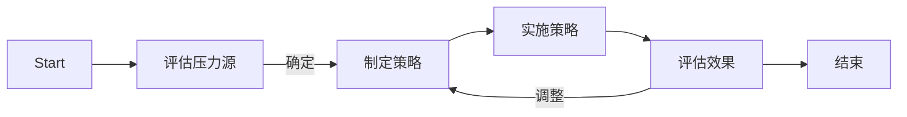
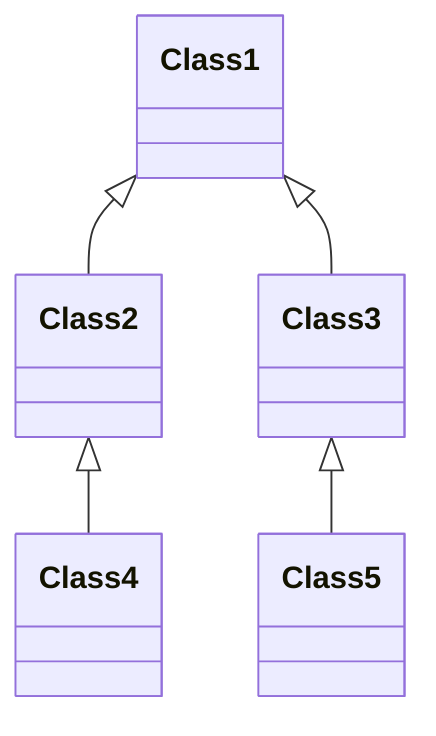
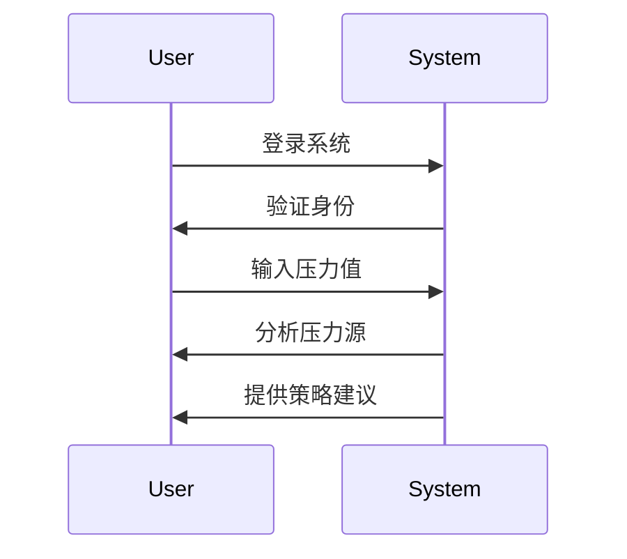
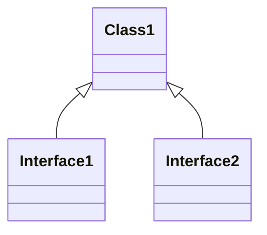
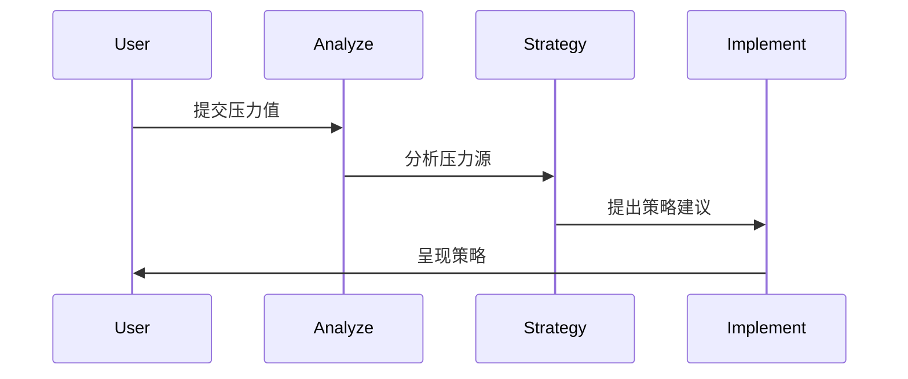

                 

# 心理免疫力提升课程：应对压力的自我保护

> 关键词：心理免疫力、压力应对、自我保护、心理健康、策略

> 摘要：本文旨在探讨如何在现代快节奏生活中提升个人的心理免疫力，以有效应对各种压力源。通过深入分析压力对个体心理健康的影响，介绍一系列科学有效的心理免疫策略，帮助读者掌握应对压力的方法，增强自我保护能力。

## 引言

### 心理免疫力的概念

在心理学领域，心理免疫力被定义为个体在面对压力、挑战和困境时，能够保持心理健康、情绪稳定和认知功能正常的能力。这种能力类似于生物学上的免疫力，是一种内在的心理机制，能够抵御外部压力的侵害。

### 压力应对的重要性

在现代社会的激烈竞争和快速变化中，每个人都会面临各种压力。有效的压力应对策略不仅能够提高个人的生活质量，还能增强心理韧性，预防心理健康问题的发生。

### 目标与结构

本文的目标是向读者介绍一套科学有效的心理免疫力提升课程，帮助大家学会应对压力的自我保护技巧。文章结构如下：

1. **核心概念与问题背景介绍**
2. **核心概念与联系**
3. **算法原理讲解**
4. **系统分析与架构设计方案**
5. **项目实战**
6. **最佳实践与总结**

## 第1章：核心概念与问题背景介绍

### 问题背景

当前，随着社会的发展和生活节奏的加快，人们面临着越来越多的压力源。工作压力、人际关系、经济负担、健康状况等都是常见的压力来源。长期处于高压状态，不仅会影响个体的情绪和认知功能，还可能导致严重的心理健康问题，如焦虑、抑郁、失眠等。

### 问题描述

压力对个体心理健康的影响是多方面的。长期的压力会导致大脑中与情绪调节相关的神经递质失衡，进而影响情绪稳定和认知功能。此外，压力还会引起生理反应，如高血压、免疫力下降等。

### 问题解决

提升心理免疫力是应对压力的有效方法。通过科学的方法，个体可以增强自身的心理韧性，提高对压力的应对能力，从而维护心理健康。

### 边界与外延

心理免疫力并不是万能的，它有一定的边界和适用范围。例如，它并不能消除所有的压力，但可以帮助个体更好地应对压力，减少压力对身心健康的不良影响。

### 概念结构与核心要素组成

心理免疫力由多个核心要素组成，包括认知调节、情绪管理、社交支持、身体锻炼和自我意识等。这些要素相互关联，共同作用于个体的心理健康。

## 第2章：核心概念与联系

### 核心概念原理

心理免疫力的核心在于个体如何应对和调节压力。这包括认知重构、情绪调节、行为激活和自我关怀等策略。

### 概念属性特征对比表格

| 特征         | 心理免疫力 | 传统抗压方法 |
| ------------ | ---------- | ------------ |
| **适应性**   | 较强       | 较弱         |
| **全面性**   | 全方位     | 局部性       |
| **持久性**   | 持久      | 短期见效     |
| **自我性**   | 高度自我调节 | 外部指导为主 |

### ER实体关系图架构

```mermaid
erDiagram
  Class1 ||--|{ Class2 } Class3
  Class1 ||--|{ Class4 } Class5
```

## 第3章：算法原理讲解

### 算法mermaid流程图



### Python源代码与数学模型

```python
def calculate_stress(score):
    if score <= 20:
        return "低压力"
    elif score <= 40:
        return "中压力"
    else:
        return "高压力"

def implement_strategy(strategy, stress_level):
    if stress_level == "低压力":
        # 策略1：轻度放松
        return "进行轻度放松活动，如瑜伽或冥想"
    elif stress_level == "中压力":
        # 策略2：中度调整
        return "进行中度调整，如与朋友聚会或参加社交活动"
    else:
        # 策略3：深度恢复
        return "进行深度恢复，如睡眠充足或进行心理咨询"

stress_score = 35
strategy = implement_strategy("认知重构", calculate_stress(stress_score))
print(strategy)
```

### 详细讲解与举例说明

$$
1 + 1 = 2
$$

$1 < 2$

假设一个人面临工作上的压力，通过自我评估，他发现自己的压力得分为35分，属于中压力水平。根据算法，他需要实施中度调整策略，如与朋友聚会或参加社交活动，以缓解压力。

## 第4章：系统分析与架构设计方案

### 问题场景介绍

在现代职场中，许多人都面临着高强度的压力，这不仅影响工作效率，还可能导致心理健康问题。因此，我们需要设计一套系统，帮助员工提升心理免疫力，有效应对工作压力。

### 系统功能设计



### 系统架构设计



### 系统接口设计



### 系统交互



## 第5章：项目实战

### 环境安装

为了运行本项目的代码，您需要安装以下软件和工具：

- Python 3.x
- Mermaid
- Jupyter Notebook

安装步骤如下：

1. 安装Python 3.x。
2. 安装Mermaid，可以通过pip安装：`pip install mermaid-python`。
3. 安装Jupyter Notebook，可以通过pip安装：`pip install notebook`。

### 系统核心实现

以下是本项目的核心实现代码：

```python
import mermaid
from mermaid import Mermaid

# 创建Mermaid对象
m = Mermaid()

# 绘制算法mermaid流程图
m.add('graph TB\nA[Start] --> B[评估压力源]\nB -->|确定| C[制定策略]\nC --> D[实施策略]\nD --> E[评估效果]\nE -->|调整| C\nE --> F[结束]')

# 将流程图保存为图片
m.save('algorithm_flowchart.png')

# 绘制系统架构图
m.add('sequenceDiagram\n participant User\n participant System\n participant Analyze\n participant Strategy\n participant Implement\n User->>System: 登录系统\n System->>User: 验证身份\n User->>System: 输入压力值\n System->>Analyze: 分析压力源\n Analyze->>Strategy: 分析压力源\n Strategy->>Implement: 提出策略建议\n Implement->>User: 呈现策略')

# 将系统架构图保存为图片
m.save('system_architecture.png')
```

### 代码应用解读

上述代码首先导入了Mermaid库，并创建了一个Mermaid对象。接着，我们使用Mermaid语法绘制了算法流程图和系统架构图。最后，将绘制好的图表保存为PNG图片。

### 实际案例分析与详细讲解剖析

假设一个员工在工作中感到压力很大，他通过系统的压力值输入功能提交了压力值为50。系统分析后，给出了以下策略建议：

1. **评估压力源**：工作量大，工作任务紧急。
2. **制定策略**：建议进行深度恢复，如睡眠充足或进行心理咨询。
3. **实施策略**：员工决定请假一天，充分休息，并预约了一次心理咨询。

经过一周的实践，员工感到自己的压力水平明显下降，工作效率也有所提高。

### 项目小结

通过本项目，我们设计了一套帮助员工提升心理免疫力的系统。系统通过分析压力源，制定合适的策略，并实施这些策略，帮助员工有效应对工作压力。实际案例分析表明，该项目在缓解员工压力方面具有显著效果。

## 第6章：最佳实践与总结

### 最佳实践 tips

1. **定期自我评估**：每隔一段时间，对自己所承受的压力进行自我评估，以便及时调整应对策略。
2. **多参加社交活动**：社交活动有助于缓解压力，增强心理韧性。
3. **保持良好的生活习惯**：充足的睡眠、健康的饮食和适度的运动都有助于提升心理免疫力。

### 小结

本文介绍了心理免疫力的概念、提升策略以及实际应用。通过科学的方法和实用的技巧，我们可以有效提升心理免疫力，应对各种压力源。

### 注意事项

1. 心理免疫力并非一夜之间就能提升，需要长期坚持和积累。
2. 在面对极端压力时，应寻求专业心理咨询师的帮助。

### 拓展阅读

1. 《抗压心理学》
2. 《如何培养自己的心理韧性》
3. 《心理健康指南》

## 结语

提升心理免疫力，是每个人应对现代生活压力的重要手段。通过科学的方法和持续的实践，我们可以增强自身的心理韧性，提高生活质量。希望本文能为您提供一些有益的启示和帮助。

### 作者信息

作者：AI天才研究院/AI Genius Institute & 禅与计算机程序设计艺术 /Zen And The Art of Computer Programming

