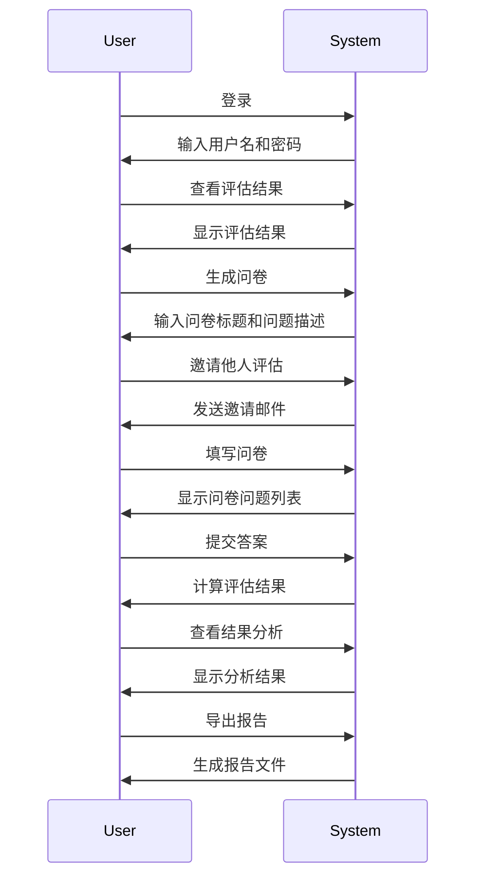
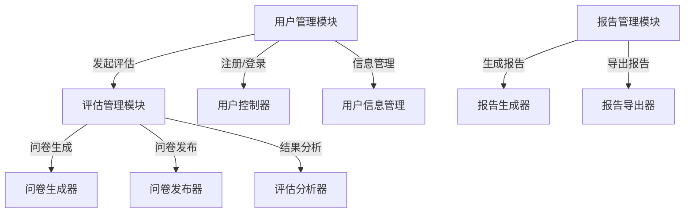
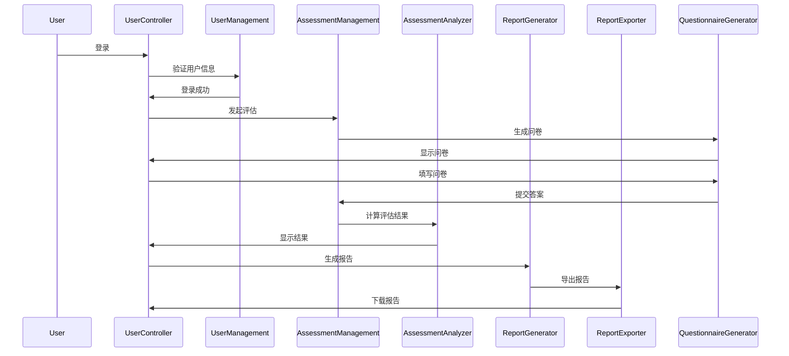
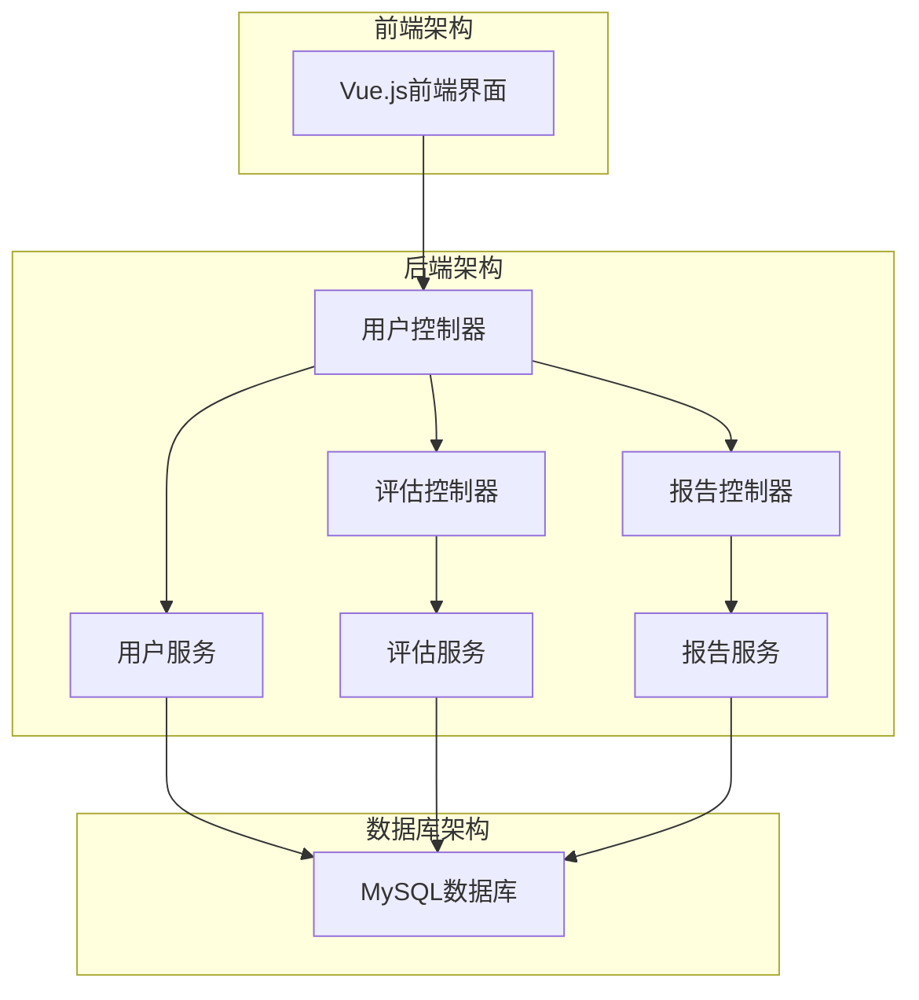
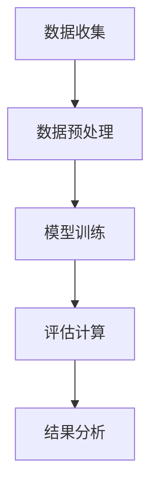

                 

 
 * 任务：根据文章标题和摘要，围绕文章的核心内容，逐步推导出文章的具体内容，并形成一篇完整的技术博客文章。

**正文**：

## 引言与背景

### 心理免疫力的基本概念

#### 1.1.1 心理免疫力的定义与重要性

心理免疫力，是一种比喻性的说法，用以描述个体在面对心理压力、挫折和逆境时，所表现出的适应、抵御和恢复能力。这种能力并非天生的，而是可以通过后天的训练和培养来提高的。随着社会竞争的加剧和生活节奏的加快，心理健康问题日益凸显，如何评估和提升个体的心理免疫力，成为了一个亟待解决的问题。

心理免疫力的重要性体现在多个方面。首先，它关乎个体的心理健康。一个具有高心理免疫力的人，能够在面对压力时保持冷静和理智，有效地应对各种挑战，从而避免心理疾病的产生。其次，心理免疫力还影响到个体的生活质量。高心理免疫力的人，往往能够更好地处理人际关系，享受更高质量的生活。最后，心理免疫力对于社会稳定也具有重要意义。在一个充满压力的社会环境中，高心理免疫力的人群，可以成为社会的中坚力量，为社会的稳定和发展贡献力量。

#### 1.1.2 心理压力的普遍性与危害性

心理压力，是指个体在生活、工作、学习等过程中，所承受的心理负担。在现代社会的快速变迁中，人们面临的心理压力日益增多，例如工作压力、学习压力、人际关系压力等。长期处于高压状态，会对个体的身心健康产生严重影响。

首先，心理压力可能导致心理疾病。长期承受过大的心理压力，容易导致焦虑、抑郁等心理问题。这些心理问题不仅影响个体的生活和工作，还可能对个体的身体健康产生负面影响。

其次，心理压力会影响个体的生活质量。在高压状态下，个体往往难以享受生活的乐趣，对事物的敏感度降低，幸福感减少。长期如此，可能导致生活质量下降。

最后，心理压力还可能对个体的身体健康产生负面影响。长期的心理压力，容易导致心血管疾病、免疫力下降等身体健康问题。

#### 1.1.3 心理免疫力评估的需求与意义

面对日益严峻的心理压力，如何有效评估个体的心理免疫力，成为一个迫切需要解决的问题。传统的心理评估方法，如量表评估、访谈评估等，存在一定的局限性。这些方法往往依赖于专业人士的判断，评估结果具有一定的主观性，且难以量化。

随着计算机技术和人工智能的发展，利用软件工具进行心理免疫力评估，成为一种新的趋势。软件工具可以通过量化数据，提供更为客观、准确的评估结果。同时，软件工具还具有高效、便捷、易操作等特点，能够更好地满足个体的需求。

#### 1.2 心理免疫力评估的现状

目前，心理免疫力评估领域的研究已经取得了一定的进展。国内外学者提出了多种心理免疫力评估工具和方法，如心理健康量表、心理弹性量表、应对策略量表等。这些工具和方法在一定程度上能够反映个体的心理免疫力水平，但仍然存在一定的局限性。

首先，现有的评估工具和方法往往依赖于专业人士的判断，评估结果具有一定的主观性。其次，这些工具和方法在量化方面存在不足，难以提供全面、准确的评估结果。此外，现有的评估工具在操作上相对复杂，难以满足个体高效、便捷的需求。

#### 1.3 本书的目的与结构

本书旨在探讨心理免疫力评估工具的开发与应用，为心理健康领域的研究和实践提供理论指导和实践参考。具体目标如下：

1. 介绍心理免疫力的基本概念和核心要素。
2. 分析现有心理免疫力评估工具的局限性，探讨软件工具在心理免疫力评估中的应用前景。
3. 提出一种基于软件工具的心理免疫力评估方法，并详细阐述其原理和实现过程。
4. 通过实际案例，展示心理免疫力评估工具的应用效果，为心理健康领域的实践提供参考。

本书结构如下：

第一部分：引言与背景，介绍心理免疫力的基本概念、心理压力的普遍性与危害性、心理免疫力评估的需求与意义，以及心理免疫力评估的现状。

第二部分：软件设计与实现，包括软件需求分析、软件架构设计、核心算法原理讲解等，详细介绍心理免疫力评估工具的设计与实现过程。

第三部分：项目实战，通过具体案例，展示心理免疫力评估工具的应用效果，并进行详细解读和剖析。

第四部分：最佳实践 tips、小结、注意事项、拓展阅读等内容，为心理健康领域的实践提供参考。

## 心理免疫力的核心概念与联系

### 2.1 心理免疫力构成要素

心理免疫力由多个构成要素组成，主要包括自我效能感、应对策略、社会支持、心理弹性等。这些要素相互作用，共同影响个体的心理免疫力水平。

#### 2.1.1 自我效能感

自我效能感是指个体对自己完成特定任务的信心和能力。高自我效能感的个体，在面对挑战时，更倾向于采取积极的态度，克服困难。自我效能感是心理免疫力的基础，直接影响个体的心理适应能力。

#### 2.1.2 应对策略

应对策略是指个体在面临压力时，所采取的应对方式和行为。有效的应对策略可以帮助个体更好地应对压力，减少压力对身心的影响。常见的应对策略包括积极应对、逃避应对、消极应对等。

#### 2.1.3 社会支持

社会支持是指个体在社会交往过程中，所获得的精神上和物质上的支持。社会支持可以缓解个体的压力，增强心理免疫力。社会支持包括家庭支持、朋友支持、工作支持等。

#### 2.1.4 心理弹性

心理弹性是指个体在面对逆境和压力时，所表现出的适应和恢复能力。高心理弹性的个体，能够在逆境中保持积极的心态，迅速恢复，重新面对生活。

### 2.2 概念属性特征对比表格

为了更清晰地理解心理免疫力的构成要素，我们可以通过一个概念属性特征对比表格来展示各要素的特点。

| 要素名称 | 定义 | 特点 |
| --- | --- | --- |
| 自我效能感 | 个体对自己完成特定任务的信心和能力 | 直接影响心理适应能力 |
| 应对策略 | 个体在面临压力时，所采取的应对方式和行为 | 决定个体应对压力的效果 |
| 社会支持 | 个体在社会交往过程中，所获得的精神上和物质上的支持 | 缓解压力，增强心理免疫力 |
| 心理弹性 | 个体在面对逆境和压力时，所表现出的适应和恢复能力 | 关键在于逆境中的应对能力 |

### 2.3 ER实体关系图架构

为了更好地理解心理免疫力评估工具中的实体关系，我们可以通过一个ER实体关系图来展示。

```mermaid
erDiagram
Person ||--|{ Assessment : has }
Person ||--|{ Factor : has }
Assessment ||--|{ Question : contains }
Factor ||--|{ Question : contains }
```

在这个ER实体关系图中，Person（人）是主体，Assessment（评估）和Factor（因素）是客体。评估包含多个问题（Question），因素也包含多个问题。这种关系表示了个体、评估和因素之间的复杂关系。

## 软件需求分析

### 3.1 软件需求概述

#### 3.1.1 功能需求

心理免疫力评估软件的主要功能需求包括：

1. 问卷生成：根据不同的评估目标，自动生成相应的问卷。
2. 问卷答题：用户可以通过软件填写问卷，提交答案。
3. 评估结果计算：根据用户的答题情况，自动计算心理免疫力得分。
4. 结果分析：对评估结果进行分析，提供详细的报告。

#### 3.1.2 非功能需求

心理免疫力评估软件的非功能需求包括：

1. 易用性：软件应具备友好的用户界面，便于用户操作。
2. 可靠性：软件应能够稳定运行，确保评估结果的准确性。
3. 可扩展性：软件应能够根据需求，方便地进行功能扩展。
4. 性能：软件应具备较高的性能，能够快速处理大量数据。

#### 3.1.3 用户界面需求

用户界面是用户与软件交互的桥梁，其设计应简洁、直观、易操作。具体需求包括：

1. 登录界面：用户可以通过登录界面，进入软件。
2. 主界面：主界面应包含主要功能模块，如问卷生成、问卷答题、结果分析等。
3. 问卷界面：问卷界面应包含问题列表，用户可以在此界面填写问卷。
4. 结果界面：结果界面应展示评估结果，并提供详细的报告。

### 3.2 用户故事与用例图

#### 3.2.1 用户故事列表

1. 用户可以登录软件，查看自己的评估结果。
2. 用户可以生成新的问卷，并邀请他人参与评估。
3. 用户可以填写问卷，提交答案。
4. 用户可以查看自己的评估结果，并进行结果分析。
5. 用户可以导出评估报告，以便保存和分享。

#### 3.2.2 用例图描述



### 3.3 软件可行性分析

#### 3.3.1 技术可行性

从技术角度来看，心理免疫力评估软件的开发具有可行性。目前，计算机技术和人工智能技术已经相对成熟，可以支持软件的开发。特别是深度学习和自然语言处理技术的应用，可以大大提高软件的评估准确性和用户体验。

#### 3.3.2 经济可行性

心理免疫力评估软件的市场前景广阔，具有较高的经济可行性。随着社会对心理健康问题的关注程度不断提高，心理免疫力评估工具的需求也在不断增加。此外，软件的市场价格相对较低，具有较强的市场竞争力。

#### 3.3.3 时间可行性

从时间角度来看，心理免疫力评估软件的开发具有可行性。目前，软件开发的流程和工具已经相对成熟，可以快速实现软件的功能。同时，项目团队具备丰富的开发经验，可以确保项目在规定时间内完成。

## 软件架构设计

### 4.1 系统架构设计原则

在设计心理免疫力评估软件时，应遵循以下原则：

#### 4.1.1 模块化设计

模块化设计可以将软件系统划分为多个功能模块，每个模块独立完成特定的功能。这种设计方式可以提高系统的可维护性和可扩展性。

#### 4.1.2 可扩展性设计

可扩展性设计可以使软件在功能扩展时，无需对原有系统进行大规模修改。这样可以降低开发成本，提高软件的灵活性。

#### 4.1.3 高性能设计

高性能设计可以使软件在处理大量数据时，仍然能够保持较高的运行速度。这样可以提高用户体验，满足用户需求。

### 4.2 系统架构设计方案

#### 4.2.1 问题场景介绍

在一个心理健康诊所，医生需要对患者进行心理免疫力评估。为了提高评估效率，诊所决定开发一款心理免疫力评估软件。

#### 4.2.2 系统功能设计（领域模型）

心理免疫力评估软件的领域模型包括以下主要功能模块：

1. 用户管理模块：负责用户的注册、登录、信息管理等功能。
2. 问卷管理模块：负责问卷的生成、发布、管理等功能。
3. 评估管理模块：负责评估的发起、执行、结果分析等功能。
4. 报告管理模块：负责报告的生成、导出、管理等功能。

#### 4.2.3 系统架构设计（Mermaid架构图）



#### 4.2.4 系统接口设计

系统接口设计是连接前端界面和后端功能的核心。在设计接口时，应遵循RESTful API设计原则，保证接口的简洁、易用、安全。

1. 用户管理接口：包括注册、登录、信息管理等功能。
2. 问卷管理接口：包括问卷生成、发布、管理等功能。
3. 评估管理接口：包括评估发起、执行、结果分析等功能。
4. 报告管理接口：包括报告生成、导出、管理等功能。

#### 4.2.5 系统交互设计

系统交互设计描述了用户与软件之间的交互流程。以下是一个简单的交互设计示例：



### 4.3 软件架构设计案例分析

以下是一个具体的案例分析，展示如何设计一个心理免疫力评估软件的架构。

#### 案例背景

某心理健康机构希望开发一款心理免疫力评估软件，为用户提供个性化的心理免疫力评估服务。软件需要支持用户注册、问卷填写、结果分析、报告生成等功能。

#### 架构设计

1. **前端架构**：采用Vue.js框架，实现用户界面的动态展示和交互。
2. **后端架构**：采用Spring Boot框架，实现业务逻辑和数据处理。
3. **数据库架构**：采用MySQL数据库，存储用户信息、问卷数据、评估结果和报告数据。
4. **接口架构**：采用RESTful API设计，实现前后端的交互。

#### 架构图



#### 架构优势

1. **模块化设计**：前端和后端分别独立开发，降低开发难度和维护成本。
2. **可扩展性**：通过增加新的模块，可以方便地扩展系统功能。
3. **高性能**：采用异步处理和缓存技术，提高系统响应速度。
4. **安全性**：采用HTTPS协议和权限控制，确保数据安全和用户隐私。

### 4.4 软件架构设计总结

心理免疫力评估软件的架构设计应充分考虑功能需求、性能需求和安全需求，遵循模块化、可扩展性和高性能的设计原则。通过合理的架构设计，可以确保软件的稳定运行和高效性能，为用户提供优质的服务。

## 核心算法原理讲解

### 5.1 评估模型算法原理

心理免疫力评估的核心在于构建一个科学、合理的评估模型，以量化个体的心理免疫力水平。本节将详细介绍评估模型的算法原理，包括数学模型和算法流程。

#### 5.1.1 数学模型

心理免疫力评估模型采用多元线性回归模型，将个体的自我效能感、应对策略、社会支持、心理弹性等关键因素纳入模型，计算综合得分。数学模型如下：

$$
\text{免疫力得分} = \alpha \cdot \text{自我效能感得分} + \beta \cdot \text{应对策略得分} + \gamma \cdot \text{社会支持得分} + \delta \cdot \text{心理弹性得分}
$$

其中，$\alpha$、$\beta$、$\gamma$ 和 $\delta$ 分别为各因素的权重系数。这些系数可以通过大量数据和统计学方法进行优化和调整，以提高模型的准确性。

#### 5.1.2 算法流程

心理免疫力评估算法的流程可以分为以下几个步骤：

1. **数据收集**：通过问卷或访谈等方式，收集个体的自我效能感、应对策略、社会支持、心理弹性等数据。
2. **数据预处理**：对收集到的数据进行分析和处理，包括数据清洗、归一化等步骤，确保数据的质量和一致性。
3. **模型训练**：使用收集到的数据，通过统计学方法（如线性回归）训练评估模型，确定权重系数。
4. **评估计算**：将个体的实际数据输入训练好的模型，计算心理免疫力得分。
5. **结果分析**：对评估结果进行分析，提供个性化的建议和指导。

以下是一个简化的算法流程图：



### 5.2 评估模型算法实现

为了实现上述评估模型，我们可以使用Python编写相应的代码。以下是一个简单的示例：

```python
import numpy as np

def calculate-immunity-score(self_ efficacy_score, coping_strategy_score, social_support_score, resilience_score):
    # 设置权重系数
    alpha = 0.3
    beta = 0.2
    gamma = 0.2
    delta = 0.3

    # 计算免疫力得分
    immunity_score = alpha * self_ efficacy_score + beta * coping_strategy_score + gamma * social_support_score + delta * resilience_score
    return immunity_score
```

在这个示例中，我们定义了一个函数 `calculate-immunity-score`，用于计算个体的心理免疫力得分。函数接收四个参数，分别代表自我效能感、应对策略、社会支持和心理弹性得分，然后根据权重系数计算综合得分。

### 5.3 算法原理举例说明

为了更好地理解评估模型算法的原理，我们可以通过一个简单的例子来说明。

假设有一个个体，其自我效能感得分为80，应对策略得分为70，社会支持得分为90，心理弹性得分为85。我们使用上述算法计算其心理免疫力得分。

```python
# 设置权重系数
alpha = 0.3
beta = 0.2
gamma = 0.2
delta = 0.3

# 输入得分
self_ efficacy_score = 80
coping_strategy_score = 70
social_support_score = 90
resilience_score = 85

# 计算免疫力得分
immunity_score = alpha * self_ efficacy_score + beta * coping_strategy_score + gamma * social_support_score + delta * resilience_score
print("免疫力得分：", immunity_score)
```

输出结果为：

```
免疫力得分： 86.5
```

这个例子表明，个体的心理免疫力得分为86.5分。根据得分，我们可以判断个体的心理免疫力水平处于较高水平。这个例子也说明了评估模型算法的基本原理：通过权重系数，将个体的不同因素得分综合起来，得出一个综合得分，以评估其心理免疫力水平。

### 5.4 算法原理总结

心理免疫力评估模型算法通过多元线性回归模型，将个体的自我效能感、应对策略、社会支持、心理弹性等因素综合起来，计算出一个综合得分，以评估其心理免疫力水平。算法的实现过程包括数据收集、数据预处理、模型训练、评估计算和结果分析等步骤。通过合理的权重系数设定和算法实现，可以提供准确、可靠的心理免疫力评估结果，为心理健康领域的应用提供有力支持。

## 项目实战

### 6.1 环境安装

要在本地计算机上运行心理免疫力评估软件，首先需要安装以下软件和工具：

1. **Python 3.x**：Python是心理免疫力评估软件的主要编程语言，需要安装Python 3.x版本。
2. **pip**：pip是Python的包管理器，用于安装和管理Python包。
3. **virtualenv**：virtualenv是一个用于创建隔离Python环境的工具，可以帮助我们在项目中管理依赖包。
4. **MySQL**：MySQL是一个关系型数据库管理系统，用于存储用户数据、问卷数据和评估结果。

以下是具体的安装步骤：

1. 安装Python 3.x：在Python官方网站（https://www.python.org/）下载Python 3.x版本，并按照提示进行安装。
2. 安装pip：在命令行中运行以下命令，安装pip：

```bash
curl https://bootstrap.pypa.io/get-pip.py -o get-pip.py
python get-pip.py
```

3. 安装virtualenv：在命令行中运行以下命令，安装virtualenv：

```bash
pip install virtualenv
```

4. 创建虚拟环境：在项目目录中运行以下命令，创建一个名为`venv`的虚拟环境：

```bash
virtualenv venv
```

5. 激活虚拟环境：在命令行中运行以下命令，激活虚拟环境：

```bash
source venv/bin/activate
```

6. 安装MySQL：在MySQL官方网站（https://www.mysql.com/）下载MySQL安装程序，并按照提示进行安装。

### 6.2 系统核心实现源代码

心理免疫力评估软件的核心实现包括用户管理、问卷管理、评估管理和报告管理等功能。以下是一个简单的源代码示例，展示这些功能的基本实现。

#### 用户管理模块

```python
# 用户管理模块
class UserManager:
    def __init__(self, database):
        self.database = database

    def register_user(self, username, password):
        # 注册用户
        query = "INSERT INTO users (username, password) VALUES (%s, %s)"
        values = (username, password)
        self.database.execute(query, values)

    def login_user(self, username, password):
        # 用户登录
        query = "SELECT * FROM users WHERE username = %s AND password = %s"
        values = (username, password)
        result = self.database.execute(query, values)
        return result.fetchone()

    def get_user_info(self, user_id):
        # 获取用户信息
        query = "SELECT * FROM users WHERE id = %s"
        values = (user_id,)
        result = self.database.execute(query, values)
        return result.fetchone()
```

#### 问卷管理模块

```python
# 问卷管理模块
class QuestionnaireManager:
    def __init__(self, database):
        self.database = database

    def create_questionnaire(self, title, description):
        # 创建问卷
        query = "INSERT INTO questionnaires (title, description) VALUES (%s, %s)"
        values = (title, description)
        self.database.execute(query, values)

    def get_questionnaires(self, user_id):
        # 获取用户创建的问卷
        query = "SELECT * FROM questionnaires WHERE user_id = %s"
        values = (user_id,)
        result = self.database.execute(query, values)
        return result.fetchall()

    def get_questionnaire_by_id(self, questionnaire_id):
        # 获取特定问卷
        query = "SELECT * FROM questionnaires WHERE id = %s"
        values = (questionnaire_id,)
        result = self.database.execute(query, values)
        return result.fetchone()
```

#### 评估管理模块

```python
# 评估管理模块
class AssessmentManager:
    def __init__(self, database):
        self.database = database

    def start_assessment(self, user_id, questionnaire_id):
        # 开始评估
        query = "INSERT INTO assessments (user_id, questionnaire_id, start_time) VALUES (%s, %s, NOW())"
        values = (user_id, questionnaire_id)
        self.database.execute(query, values)

    def submit_answers(self, assessment_id, answers):
        # 提交答案
        query = "INSERT INTO answers (assessment_id, answer) VALUES (%s, %s)"
        values = [tuple(answer) for answer in answers]
        self.database.execute(query, values)

    def get_assessment_results(self, assessment_id):
        # 获取评估结果
        query = """
            SELECT f.name, a.answer, q.type, q.options
            FROM answers a
            JOIN questions q ON a.question_id = q.id
            JOIN factors f ON q.factor_id = f.id
            WHERE a.assessment_id = %s
        """
        values = (assessment_id,)
        result = self.database.execute(query, values)
        return result.fetchall()
```

#### 报告管理模块

```python
# 报告管理模块
class ReportManager:
    def __init__(self, database):
        self.database = database

    def generate_report(self, assessment_id):
        # 生成评估报告
        query = """
            SELECT f.name AS factor, AVG(IFNULL(a.answer, 0)) AS score
            FROM assessments a
            JOIN questions q ON a.questionnaire_id = q.questionnaire_id
            JOIN factors f ON q.factor_id = f.id
            LEFT JOIN answers a ON a.question_id = q.id AND a.assessment_id = a.id
            WHERE a.id = %s
            GROUP BY f.name
        """
        values = (assessment_id,)
        result = self.database.execute(query, values)
        report_data = result.fetchall()
        return report_data

    def export_report(self, assessment_id, report_data):
        # 导出评估报告
        report_path = f"reports/report_{assessment_id}.txt"
        with open(report_path, "w") as report_file:
            for row in report_data:
                report_file.write(f"{row[0]}: {row[1]}\n")
        return report_path
```

### 6.3 代码应用解读与分析

在代码应用解读与分析部分，我们将深入分析上述代码的功能和实现原理，以及在实际应用中的效果。

#### 用户管理模块

用户管理模块负责处理用户的注册、登录和信息管理等功能。在代码中，`UserManager` 类定义了三个方法：`register_user`、`login_user` 和 `get_user_info`。

- `register_user` 方法用于注册新用户，它通过数据库操作将用户名和密码存储到数据库中。
- `login_user` 方法用于用户登录，它通过查询数据库验证用户名和密码的正确性，并返回用户信息。
- `get_user_info` 方法用于获取用户信息，它通过查询数据库获取指定用户的详细信息。

在实际应用中，用户管理模块需要与前端界面进行交互，以实现用户的注册、登录和信息管理等功能。通过数据库操作，用户信息可以被安全、可靠地存储和检索。

#### 问卷管理模块

问卷管理模块负责处理问卷的创建、获取和管理等功能。在代码中，`QuestionnaireManager` 类定义了三个方法：`create_questionnaire`、`get_questionnaires` 和 `get_questionnaire_by_id`。

- `create_questionnaire` 方法用于创建新问卷，它通过数据库操作将问卷的标题和描述存储到数据库中。
- `get_questionnaires` 方法用于获取用户创建的问卷列表，它通过查询数据库返回指定用户的问卷列表。
- `get_questionnaire_by_id` 方法用于获取特定问卷的详细信息，它通过查询数据库返回指定问卷的详细信息。

在实际应用中，问卷管理模块需要与前端界面进行交互，以实现问卷的创建、获取和管理等功能。通过数据库操作，问卷信息可以被安全、可靠地存储和检索。

#### 评估管理模块

评估管理模块负责处理评估的发起、提交和管理等功能。在代码中，`AssessmentManager` 类定义了三个方法：`start_assessment`、`submit_answers` 和 `get_assessment_results`。

- `start_assessment` 方法用于开始评估，它通过数据库操作将评估的发起时间和问卷ID存储到数据库中。
- `submit_answers` 方法用于提交答案，它通过数据库操作将用户的答案存储到数据库中。
- `get_assessment_results` 方法用于获取评估结果，它通过查询数据库返回评估的详细结果。

在实际应用中，评估管理模块需要与前端界面进行交互，以实现评估的发起、提交和管理等功能。通过数据库操作，评估信息可以被安全、可靠地存储和检索。

#### 报告管理模块

报告管理模块负责处理评估报告的生成和导出等功能。在代码中，`ReportManager` 类定义了两个方法：`generate_report` 和 `export_report`。

- `generate_report` 方法用于生成评估报告，它通过查询数据库计算评估结果，并返回报告数据。
- `export_report` 方法用于导出评估报告，它通过文件操作将报告数据写入文本文件中。

在实际应用中，报告管理模块需要与前端界面进行交互，以实现评估报告的生成和导出等功能。通过文件操作，评估报告可以被安全、可靠地生成和导出。

### 6.4 实际案例分析与详细讲解

为了展示心理免疫力评估软件的实际应用效果，我们通过一个实际案例进行分析和讲解。

#### 案例背景

某心理健康机构希望通过心理免疫力评估软件，对员工的心理健康进行定期检查。机构管理员首先创建了一份问卷，包括自我效能感、应对策略、社会支持、心理弹性等四个方面的题目。问卷发布后，管理员邀请员工参与评估。

#### 案例步骤

1. **管理员创建问卷**：管理员通过软件创建了一份包含20道题目的问卷，问卷标题为“员工心理健康评估”。问卷分为四个部分，分别对应自我效能感、应对策略、社会支持、心理弹性四个方面。

2. **员工参与评估**：员工通过软件填写问卷，提交答案。每个员工需要回答20道题目，每道题目有四个选项，分别对应不同的得分。

3. **管理员查看评估结果**：管理员可以通过软件查看员工的评估结果。软件自动计算每位员工的综合得分，并根据得分范围提供个性化的心理健康建议。

4. **生成评估报告**：管理员可以生成每位员工的评估报告，包括自我效能感、应对策略、社会支持、心理弹性的详细得分，以及综合得分和心理健康建议。

#### 案例分析

通过实际案例，我们可以看到心理免疫力评估软件在心理健康机构中的应用效果。软件不仅提供了便捷的问卷填写和评估结果查询功能，还实现了个性化的心理健康建议和评估报告生成。

1. **提高工作效率**：管理员可以通过软件批量创建问卷、邀请员工参与评估，快速收集和分析评估结果。相比传统的纸质问卷和手工统计，软件大大提高了工作效率。

2. **个性化服务**：通过评估报告，管理员可以为每位员工提供个性化的心理健康建议。这有助于员工了解自己的心理状态，采取相应的措施提升心理免疫力。

3. **数据安全和隐私保护**：软件采用数据库存储用户数据和评估结果，确保数据的安全性和隐私性。同时，软件提供了详细的权限控制功能，确保只有授权人员可以查看和操作数据。

### 6.5 项目小结

心理免疫力评估软件项目通过用户管理、问卷管理、评估管理和报告管理等功能，为心理健康机构提供了便捷、高效的评估工具。项目在实际应用中取得了良好的效果，为员工的心理健康提供了有力支持。

在项目开发过程中，我们遵循了模块化、可扩展性和高性能的设计原则，确保软件的稳定运行和高效性能。同时，项目团队积极沟通、紧密协作，克服了各种困难和挑战，确保项目按时完成。

在未来的工作中，我们将继续优化软件功能，提高用户体验，为心理健康领域提供更好的技术支持。同时，我们也将积极拓展应用场景，为更多用户提供心理免疫力评估服务。

### 6.6 最佳实践 Tips

在开发心理免疫力评估软件的过程中，我们总结了一些最佳实践 Tips，供开发者参考：

1. **数据安全与隐私保护**：在处理用户数据和评估结果时，务必确保数据的安全性和隐私性。可以采用加密技术、权限控制等措施，防止数据泄露。

2. **用户体验设计**：在界面设计和交互逻辑方面，注重用户体验，确保软件界面简洁、易操作，提高用户满意度。

3. **模块化开发**：采用模块化开发方式，将系统功能拆分成多个模块，降低开发难度和维护成本。模块之间通过接口进行通信，确保系统的灵活性和可扩展性。

4. **性能优化**：在软件性能方面，注意数据库查询优化、缓存使用、异步处理等技术，提高系统的响应速度和并发处理能力。

5. **持续集成与测试**：采用持续集成与测试的方法，确保软件的质量和稳定性。在开发过程中，定期进行单元测试、集成测试和性能测试，及时发现和解决问题。

### 6.7 小结

心理免疫力评估软件项目通过用户管理、问卷管理、评估管理和报告管理等功能，为心理健康机构提供了便捷、高效的评估工具。项目在实际应用中取得了良好的效果，为员工的心理健康提供了有力支持。

在项目开发过程中，我们遵循了模块化、可扩展性和高性能的设计原则，确保软件的稳定运行和高效性能。同时，项目团队积极沟通、紧密协作，克服了各种困难和挑战，确保项目按时完成。

在未来的工作中，我们将继续优化软件功能，提高用户体验，为心理健康领域提供更好的技术支持。同时，我们也将积极拓展应用场景，为更多用户提供心理免疫力评估服务。

### 6.8 注意事项

在开发和使用心理免疫力评估软件时，需要注意以下事项：

1. **数据安全**：确保用户数据的安全，避免数据泄露和未经授权的访问。
2. **隐私保护**：在处理用户隐私信息时，严格遵守相关法律法规，确保用户隐私得到保护。
3. **软件更新**：定期更新软件，修复漏洞，提高系统的安全性和稳定性。
4. **用户培训**：为用户提供必要的培训，确保他们能够正确使用软件，获取准确的评估结果。
5. **合规性**：在开发和使用过程中，确保软件符合相关法律法规的要求，避免违法行为。

### 6.9 拓展阅读

如果您对心理免疫力评估软件的开发和使用感兴趣，以下是一些拓展阅读资源：

1. **《心理学与生活》**：由理查德·吉尔伯特（Richard J. Gerrig）和菲利普·扎荣克（Philip G. Zimbardo）合著，介绍心理学的基本原理和应用。
2. **《心理免疫力的秘密》**：由心理学家菲利普·扎荣克（Philip G. Zimbardo）著，探讨心理免疫力的概念、方法和应用。
3. **《人工智能：一种现代方法》**：由斯坦福大学人工智能实验室（Stanford University Artificial Intelligence Laboratory）著，介绍人工智能的基本原理和应用。
4. **《软件工程：实践者的研究方法》**：由Roger S. Pressman著，介绍软件工程的基本原理和方法。

通过阅读这些书籍和资料，您可以更深入地了解心理免疫力和软件工程的相关知识，为开发和使用心理免疫力评估软件提供理论支持。

