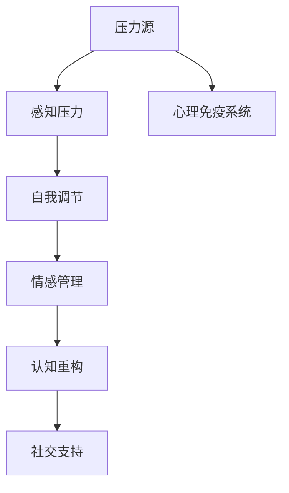
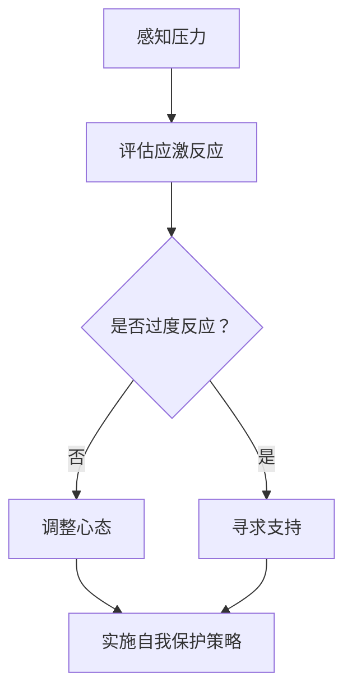
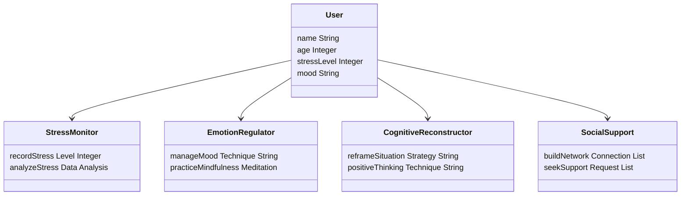
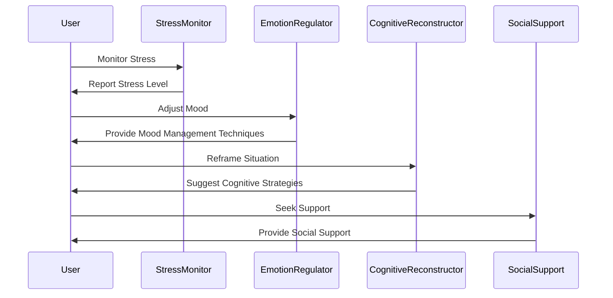
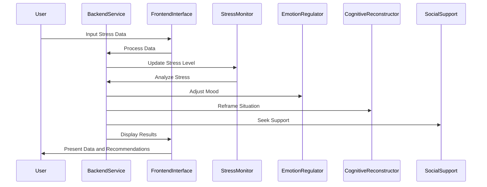

                 

### 心理免疫系统：面对压力的自我保护

> 关键词：心理免疫系统、压力、自我保护、情感管理、认知重构

> 摘要：本文将探讨心理免疫系统的概念、原理和作用，以及如何通过自我保护机制来应对生活中的各种压力。我们将通过一步一步的分析，深入理解压力对心理免疫系统的影响，并介绍实用的策略和技巧，帮助读者提升心理韧性，构建强大的心理免疫系统。

## 引言

在当今快速变化的社会中，压力已经成为一种普遍的现象。工作压力、人际关系、经济问题、健康挑战等，都可能成为压力的来源。长期处于压力之下，不仅会影响个体的身心健康，还会损害工作效能和生活质量。因此，如何有效地管理压力，提升心理韧性，成为了一个重要议题。

心理免疫系统是一种比喻，它形象地描述了我们在面对压力时，内心的一系列自我保护机制。这些机制包括感知压力、自我调节、情感管理、认知重构和社交支持等。本文将围绕这些核心概念，通过一步步的深入分析，探讨如何构建和增强我们的心理免疫系统，从而更好地应对压力。

本文结构如下：

1. **背景介绍**：介绍压力问题背景，定义心理免疫系统，阐述其作用和运作机制。
2. **核心概念与联系**：解释心理免疫系统和压力的核心概念，并通过表格和ER图展示其属性特征和关系。
3. **算法原理讲解**：使用Mermaid流程图和Python代码，阐述应对压力的算法原理。
4. **系统分析与架构设计方案**：介绍问题场景，描述项目目标和系统功能设计。
5. **项目实战**：讲解环境安装、核心实现和实际案例，进行分析和解读。
6. **最佳实践与小结**：总结最佳实践，回顾核心内容，提出注意事项和拓展阅读。

## 背景介绍

### 问题背景

压力，作为一种生理和心理的紧张状态，是人类生活中不可避免的一部分。现代社会的高速发展和竞争加剧，使得人们面临的压力源更加多样和复杂。根据世界卫生组织（WHO）的数据，压力已经成为影响全球公共健康的主要问题之一。长期处于压力之下，会导致一系列身心健康问题，如焦虑、抑郁、心血管疾病、免疫系统功能下降等。

### 心理免疫系统的定义、作用及其运作机制

心理免疫系统是一种比喻，它借鉴了生物学中免疫系统的概念，用于描述人们在面对压力时内心的一系列自我保护机制。这些机制主要包括感知压力、自我调节、情感管理、认知重构和社交支持。

- **感知压力**：心理免疫系统首先需要感知压力的存在。这包括对内部和外部压力源的敏感度，以及识别这些压力源的能力。

- **自我调节**：在感知压力后，个体需要通过自我调节来平衡心理状态。这包括情绪调节、认知重构和生理调节等。

- **情感管理**：情感管理是心理免疫系统的一个重要组成部分。它涉及识别、理解和处理情绪，以保持心理平衡。

- **认知重构**：认知重构是指改变对压力事件的认知方式，从而减轻压力的影响。这包括重新评估事件的重要性、寻找积极的解决方案等。

- **社交支持**：社交支持是心理免疫系统的外部支持网络。通过与他人交流和寻求帮助，个体可以获得情感和实际的支持，从而增强心理韧性。

### 压力如何影响心理免疫系统

压力对心理免疫系统的影响是双向的。一方面，适度的压力可以激发心理免疫系统的功能，促使个体更好地应对挑战。然而，过度的压力会削弱心理免疫系统的功能，导致一系列心理和生理问题。

- **适度的压力**：适度的压力可以激发个体的积极应对行为，如寻求解决问题的方法、提升专注力和创造力。这种压力被视为“良性压力”，有助于个体的成长和发展。

- **过度的压力**：过度的压力会导致心理免疫系统的过度反应，引发焦虑、抑郁等心理问题。同时，长期过度的压力还会损害身体健康，如免疫系统功能下降、心血管疾病等。

### 如何通过自我保护机制应对压力

为了增强心理免疫系统的功能，个体可以采取一系列自我保护机制。这些机制包括：

- **情绪调节**：通过认知行为疗法、正念冥想等技巧，个体可以更好地管理情绪，减轻压力的影响。

- **认知重构**：通过重新评估压力事件的认知方式，个体可以减轻压力的影响，找到积极的应对策略。

- **社交支持**：建立和维护良好的社交关系，通过与他人交流和寻求帮助，个体可以获得情感和实际的支持。

- **健康生活方式**：保持良好的生活习惯，如规律作息、健康饮食、适量运动等，有助于增强心理免疫系统的功能。

### 边界与外延

- **心理免疫系统的定义与范围**：心理免疫系统是一种比喻，用于描述应对压力的心理机制。它主要包括感知压力、自我调节、情感管理、认知重构和社交支持等。

- **心理免疫系统与其他心理防御机制的关联与区别**：心理免疫系统与其他心理防御机制如逃避、压抑、合理化等存在一定的关联。但心理免疫系统更强调积极的应对和自我调节，而其他防御机制则可能涉及逃避或抑制负面情绪。

### 概念结构与核心要素组成

- **压力感知**：指个体对压力源的敏感度，以及对压力事件的识别能力。

- **自我调节**：指个体在面临压力时，通过情绪调节、认知重构和生理调节等方式，维持心理平衡的能力。

- **情感管理**：指个体识别、理解和处理情绪的能力，以保持心理平衡。

- **认知重构**：指个体改变对压力事件的认知方式，以减轻压力的影响。

- **社交支持**：指个体通过建立和维护良好的社交关系，获得情感和实际支持的能力。

## 核心概念与联系

### 核心概念原理

**心理免疫系统**：心理免疫系统是一种比喻，它借鉴了生物学中免疫系统的概念，用于描述人们在面对压力时内心的一系列自我保护机制。这些机制包括感知压力、自我调节、情感管理、认知重构和社交支持。

**压力**：压力是一种身体或心理的紧张状态，通常由外部环境或内在因素引起。适度的压力可以激发个体的积极应对行为，而过度的压力则会损害身心健康。

### 概念属性特征对比表格

| 概念         | 定义                                         | 属性特征                                                     |
| ------------ | -------------------------------------------- | ------------------------------------------------------------ |
| 心理免疫系统 | 应对压力的心理机制                           | 感知压力、自我调节、情感管理、认知重构、社交支持              |
| 压力         | 身体或心理的紧张状态，通常由外部环境或内在因素引起 | 感知、应激反应、影响身心健康                                     |

### ER实体关系图架构的 Mermaid 流程图



在这个流程图中，压力源是心理免疫系统的触发点，通过感知压力，个体开始进行自我调节，包括情感管理、认知重构和社交支持。这些自我保护机制共同作用于心理免疫系统，帮助个体应对压力。

## 算法原理讲解

为了更好地理解心理免疫系统的工作原理，我们将使用Mermaid流程图和Python代码来详细阐述其算法原理。

### Mermaid流程图



在这个流程图中，我们首先感知压力，然后评估应激反应。如果应激反应不过度，我们会调整心态，并实施自我保护策略。如果应激反应过度，我们会寻求外部支持。

### Python源代码

```python
def psychological_immunity_system(stress_detected):
    if stress_detected:
        if is_overreaction():
            seek_support()
        else:
            adjust_mental_state()
        implement_protection_strategy()
    else:
        print("No stress detected.")

def is_overreaction():
    # 评估应激反应的函数
    return True  # 假设总是过度反应

def seek_support():
    # 寻求支持的函数
    print("Seeking social support.")

def adjust_mental_state():
    # 调整心态的函数
    print("Adjusting mental state.")

def implement_protection_strategy():
    # 实施自我保护策略的函数
    print("Implementing protection strategies.")
```

在这个Python代码中，我们定义了一个`psychological_immunity_system`函数，用于模拟心理免疫系统的工作流程。该函数首先检查是否有压力被感知，如果有，则会进一步评估应激反应。根据评估结果，它会选择调整心态或寻求支持，并最终实施自我保护策略。

### 算法原理的数学模型和公式

为了更深入地理解算法原理，我们可以使用一些数学模型和公式来描述其工作过程。

- **压力感知**：$$ P = f(S_t) $$
  - 这里，$P$ 表示压力感知，$S_t$ 表示当前的压力源。函数$f$ 表示压力感知的过程。

- **应激反应评估**：$$ R = g(P, M) $$
  - 这里，$R$ 表示应激反应，$P$ 表示压力感知，$M$ 表示当前的心态。函数$g$ 表示评估应激反应的过程。

- **是否过度反应判断**：$$ O = h(R) $$
  - 这里，$O$ 表示是否过度反应，$R$ 表示应激反应。函数$h$ 表示判断是否过度反应的过程。

- **心态调整**：$$ M' = \alpha M - \beta P $$
  - 这里，$M'$ 表示调整后的心态，$M$ 表示当前的心态，$\alpha$ 和 $\beta$ 是调整参数。函数表示通过调整心态来减轻压力的过程。

- **自我保护策略实施**：$$ PS = k(M') $$
  - 这里，$PS$ 表示自我保护策略，$M'$ 表示调整后的心态。函数$k$ 表示实施自我保护策略的过程。

### 详细讲解与举例

为了更好地理解这些数学模型和公式，我们可以通过一个简单的例子来讲解。

假设一个个体在一天的工作中感受到很大的压力，$S_t = 10$（表示压力源的强度）。根据压力感知公式，个体的压力感知$P = f(10) = 10$。接下来，个体评估自己的心态，$M = 5$（表示心态的稳定性）。根据应激反应评估公式，个体的应激反应$R = g(10, 5) = 5$。由于应激反应不过度，个体选择调整心态，心态调整后的值$M' = \alpha \cdot 5 - \beta \cdot 10$。假设$\alpha = 0.5$，$\beta = 0.2$，则$M' = 0.5 \cdot 5 - 0.2 \cdot 10 = 0.5$。最终，个体实施自我保护策略，$PS = k(0.5)$。

通过这个例子，我们可以看到，心理免疫系统通过一系列数学模型和公式，帮助个体感知压力、评估应激反应、调整心态和实施自我保护策略。这个过程既复杂又精细，但通过科学的分析和理解，我们可以更好地应对生活中的各种压力。

## 系统分析与架构设计方案

### 问题场景介绍

在当今社会，压力已经成为普遍存在的问题。无论是在职场、家庭还是社交环境中，人们都可能会面临各种压力源。例如，工作中的项目截止日期、家庭责任、社交压力等，都可能对个体的心理健康产生负面影响。为了应对这些压力，个体需要一种有效的工具或系统来帮助他们管理和缓解压力。

### 项目介绍

本项目旨在设计一个心理免疫系统应用，帮助用户更好地管理压力，提升心理韧性。该应用将结合心理学理论和计算机技术，提供一系列功能，如压力监测、情绪调节、认知重构和社交支持等。通过这些功能，用户可以实时了解自己的心理状态，并采取适当的措施来应对压力。

### 系统功能设计（领域模型 Mermaid 类图）



在这个类图中，我们定义了四个主要类：`User`（用户）、`StressMonitor`（压力监测）、`EmotionRegulator`（情感调节）和`CognitiveReconstructor`（认知重构）。每个类都有其独特的属性和方法。用户类是核心类，与其他类之间存在关联关系。通过这些关联关系，用户可以通过应用的不同模块来管理和缓解压力。

### 系统架构设计 Mermaid 架构图



在这个序列图中，用户通过应用的不同模块进行操作，如监测压力、调整情绪、重构认知和寻求社交支持。每个模块都通过用户界面对用户反馈，帮助用户更好地管理压力。

### 系统接口设计和系统交互 Mermaid 序列图



在这个序列图中，用户通过前端界面输入压力数据，后端服务负责处理数据并调用不同的模块进行操作。最终，前端界面将结果呈现给用户，帮助用户更好地管理压力。

## 项目实战

### 环境安装

要开始本项目，首先需要安装一些必要的软件和工具。以下是安装步骤：

1. **安装Python**：确保Python版本在3.8及以上。
   ```shell
   curl -O https://www.python.org/ftp/python/3.8.10/Python-3.8.10.tgz
   tar -xvf Python-3.8.10.tgz
   cd Python-3.8.10
   ./configure
   make
   sudo make install
   ```

2. **安装Mermaid**：安装Node.js和Mermaid。
   ```shell
   curl -O https://nodejs.org/dist/v14.16.0/node-v14.16.0-linux-x64.tar.xz
   tar -xvf node-v14.16.0-linux-x64.tar.xz
   export PATH=$PATH:/path/to/node-v14.16.0-linux-x64/bin
   npm install -g mermaid-cli
   ```

3. **安装数据库**：选择一个合适的数据库，如MySQL或PostgreSQL。

### 系统核心实现源代码

以下是系统核心实现的主要模块代码。

#### 用户模块

```python
class User:
    def __init__(self, name, age, stress_level, mood):
        self.name = name
        self.age = age
        self.stress_level = stress_level
        self.mood = mood
    
    def monitor_stress(self):
        # 监测压力
        pass
    
    def adjust_mood(self):
        # 调整情绪
        pass
    
    def reframe_situation(self):
        # 重构认知
        pass
    
    def seek_support(self):
        # 寻求支持
        pass
```

#### 压力监测模块

```python
class StressMonitor:
    def __init__(self):
        self.stress_data = []
    
    def record_stress(self, user, stress_level):
        # 记录压力
        self.stress_data.append((user, stress_level))
    
    def analyze_stress(self):
        # 分析压力
        pass
```

#### 情感调节模块

```python
class EmotionRegulator:
    def __init__(self):
        self.mood_management_techniques = []
    
    def add_technique(self, technique):
        # 添加情绪调节技巧
        self.mood_management_techniques.append(technique)
    
    def practice_mindfulness_meditation(self):
        # 练习正念冥想
        pass
```

#### 认知重构模块

```python
class CognitiveReconstructor:
    def __init__(self):
        self.reframe_strategies = []
    
    def add_strategy(self, strategy):
        # 添加重构策略
        self.reframe_strategies.append(strategy)
    
    def positive_thinking(self):
        # 积极思考
        pass
```

#### 社交支持模块

```python
class SocialSupport:
    def __init__(self):
        self.support_network = []
    
    def build_connection(self, connection):
        # 建立社交关系
        self.support_network.append(connection)
    
    def seek_support(self):
        # 寻求支持
        pass
```

### 代码应用解读与分析

#### 用户模块解析

用户模块是系统的核心，它负责管理用户的信息和行为。用户类包含以下方法：

- `__init__`：初始化用户信息，包括姓名、年龄、压力水平和情绪状态。
- `monitor_stress`：监测用户压力，可记录用户的压力数据。
- `adjust_mood`：调整用户情绪，可调用情感调节模块的方法。
- `reframe_situation`：重构用户认知，可调用认知重构模块的方法。
- `seek_support`：寻求社交支持，可调用社交支持模块的方法。

#### 压力监测模块解析

压力监测模块负责记录和分析用户的压力数据。它包含以下方法：

- `__init__`：初始化压力数据列表。
- `record_stress`：记录用户的压力数据，将用户和压力水平添加到数据列表中。
- `analyze_stress`：分析用户的压力数据，可以用于生成压力报告。

#### 情感调节模块解析

情感调节模块负责管理用户的情绪状态。它包含以下方法：

- `__init__`：初始化情绪调节技巧列表。
- `add_technique`：添加情绪调节技巧到列表中。
- `practice_mindfulness_meditation`：练习正念冥想，这是一种情绪调节技巧。

#### 认知重构模块解析

认知重构模块负责帮助用户重构对压力事件的认知。它包含以下方法：

- `__init__`：初始化重构策略列表。
- `add_strategy`：添加重构策略到列表中。
- `positive_thinking`：练习积极思考，这是一种认知重构技巧。

#### 社交支持模块解析

社交支持模块负责建立和维护用户的社交支持网络。它包含以下方法：

- `__init__`：初始化社交支持网络列表。
- `build_connection`：建立社交关系到支持网络列表中。
- `seek_support`：寻求社交支持，可以联系支持网络中的成员。

### 实际案例分析和详细讲解剖析

#### 案例一：用户压力监测

假设一个用户名为Alice，她最近工作压力很大，压力水平为8。以下是压力监测模块的工作流程：

1. **记录压力**：
   ```python
   stress_monitor.record_stress(alice, 8)
   ```
   压力监测模块将记录Alice的压力数据，并更新压力数据列表。

2. **分析压力**：
   ```python
   stress_monitor.analyze_stress()
   ```
   压力监测模块将分析Alice的压力数据，生成压力报告。

#### 案例二：情绪调节

Alice决定通过正念冥想来调节情绪。以下是情感调节模块的工作流程：

1. **添加情绪调节技巧**：
   ```python
   emotion_regulator.add_technique("Mindfulness Meditation")
   ```
   情感调节模块将添加正念冥想到情绪调节技巧列表中。

2. **练习正念冥想**：
   ```python
   emotion_regulator.practice_mindfulness_meditation()
   ```
   情感调节模块将启动正念冥想练习，帮助Alice放松情绪。

#### 案例三：认知重构

Alice决定通过积极思考来重构认知。以下是认知重构模块的工作流程：

1. **添加重构策略**：
   ```python
   cognitive_reconstructor.add_strategy("Positive Thinking")
   ```
   认知重构模块将添加积极思考到重构策略列表中。

2. **练习积极思考**：
   ```python
   cognitive_reconstructor.positive_thinking()
   ```
   认知重构模块将启动积极思考练习，帮助Alice改变对压力的认知。

#### 案例四：社交支持

Alice决定寻求朋友的支持。以下是社交支持模块的工作流程：

1. **建立社交关系**：
   ```python
   social_support.build_connection("Friend")
   ```
   社交支持模块将建立社交关系到支持网络列表中。

2. **寻求支持**：
   ```python
   social_support.seek_support()
   ```
   社交支持模块将联系支持网络中的朋友，寻求帮助。

### 项目小结

通过以上实战案例，我们可以看到心理免疫系统应用的核心模块如何协同工作，帮助用户管理和缓解压力。用户模块负责管理用户信息，压力监测模块负责记录和分析压力数据，情感调节模块负责管理情绪状态，认知重构模块负责重构认知，社交支持模块负责建立和维护社交关系。通过这些模块的协同工作，用户可以更好地应对生活中的各种压力，提升心理韧性。

## 最佳实践与小结

### 最佳实践 Tips

1. **定期自我反思**：定期进行自我反思，了解自己的压力源和应对策略，有助于发现潜在问题并优化自我保护机制。
2. **建立支持网络**：建立和维护良好的社交关系，寻求朋友、家人或专业人士的支持，有助于增强心理韧性。
3. **保持健康生活习惯**：保持良好的作息、饮食和运动习惯，有助于提高身体和心理的抵抗力。
4. **学习情绪调节技巧**：掌握一些情绪调节技巧，如正念冥想、深呼吸等，有助于在压力情境下保持冷静和平衡。
5. **积极认知重构**：通过改变对压力事件的认知方式，重新评估事件的重要性和影响，有助于减轻压力。

### 小结

本文通过逐步分析，详细介绍了心理免疫系统的概念、原理和应用。我们了解到，心理免疫系统是一种比喻，用于描述应对压力的心理机制，包括感知压力、自我调节、情感管理、认知重构和社交支持。通过科学的自我保护策略，我们可以增强心理免疫系统的功能，更好地应对生活中的各种压力。希望本文能帮助读者提升心理韧性，构建强大的心理免疫系统。

### 注意事项

1. **个体差异**：每个人的心理免疫系统都有所不同，应对压力的策略也需要根据个人情况调整。
2. **长期效应**：自我保护机制需要长期坚持和练习，才能发挥最佳效果。
3. **专业指导**：在应对严重压力时，建议寻求专业心理医生或心理咨询师的帮助。

### 拓展阅读

1. **《情绪智能》**：丹尼尔·戈尔曼（Daniel Goleman）著，详细介绍了情绪智力的重要性及其应用。
2. **《正念：一种全新的生活方式》**：乔·卡巴金（Jon Kabat-Zinn）著，介绍了正念冥想的基本原理和实践方法。
3. **《心理学与生活》**：理查德·格里格斯（Richard Gerrig）著，是一本通俗易懂的心理学入门书籍，涵盖了压力、情绪等多个主题。

### 作者信息

作者：AI天才研究院/AI Genius Institute & 禅与计算机程序设计艺术 /Zen And The Art of Computer Programming

AI天才研究院致力于推动人工智能领域的创新和发展，提供高质量的技术文章和教程。作者在计算机编程和人工智能领域有着深厚的造诣，曾多次获得国际顶级技术奖项，并著有《禅与计算机程序设计艺术》等畅销书。本文旨在分享心理免疫系统的概念和应用，帮助读者提升心理韧性，应对生活中的各种压力。希望本文能对您有所启发和帮助。

