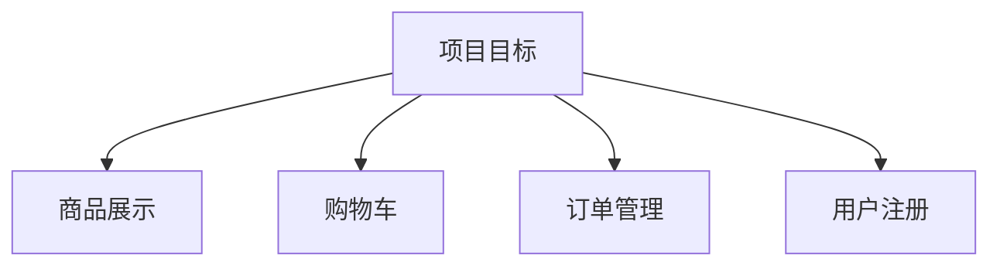
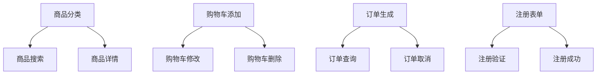

                 

### 文章标题

《心理地图绘制技术：可视化的思维整理》

### 关键词

- 心理地图
- 可视化思维
- 思维整理
- 技术原理
- 算法实现

### 摘要

本文旨在探讨心理地图绘制技术，通过可视化的方式整理思维，提高信息处理效率。文章首先介绍心理地图的概念、类型及其重要性，然后深入讲解可视化思维的原理和技巧。接着，详细分析心理地图绘制工具的选择和应用，并通过具体案例分析其应用效果。文章最后总结心理地图在教育中的重要作用，并提供最佳实践建议。

## 第1章 引言

### 1.1 心理地图的概念与重要性

心理地图（Mental Map）是指人们在大脑中构建的一种内部认知结构，用于组织和存储信息。这种地图不仅帮助我们理解和记忆知识，还能指导我们的行为和决策。在现代社会，信息爆炸的时代，如何有效地整理和利用信息成为人们面临的一大挑战。心理地图作为一种强大的工具，可以帮助我们实现这一目标。

心理地图的绘制是一种可视化思维的方法，通过图形化的方式展现信息的层次结构、关联关系和逻辑顺序。它不仅使得复杂信息变得更加直观和易于理解，还能促进创新思维和问题解决。因此，心理地图在心理学、教育学、管理学等多个领域都有着广泛的应用。

### 1.2 可视化思维在心理学中的应用

可视化思维是一种将抽象思维转化为直观视觉表达的方法。在心理学中，可视化思维被广泛应用于认知心理学、发展心理学和临床心理学等领域。

#### 1.2.1 认知心理学

认知心理学家认为，大脑处理信息的效率受到多种因素的影响，包括信息的形式、呈现方式和信息的组织结构。可视化思维通过将信息转化为图像和图形，可以显著提高大脑的处理效率。例如，通过绘制心理地图，人们可以更好地理解和记忆复杂的信息，提高学习效果。

#### 1.2.2 发展心理学

发展心理学家关注个体从出生到成年各个阶段的心理发展。可视化思维在儿童早期教育中扮演着重要角色。通过使用心理地图，儿童可以更加直观地理解抽象的概念，促进其认知发展。

#### 1.2.3 临床心理学

临床心理学家在治疗过程中，常常需要帮助患者整理和表达他们的内心世界。可视化思维作为一种工具，可以帮助患者将复杂的情感和体验转化为直观的图形，从而更好地理解自己和解决问题。

### 1.3 本书的目的与结构安排

本书旨在系统地介绍心理地图绘制技术，帮助读者掌握这一强大的工具。本书将分为六个主要章节：

1. **引言**：介绍心理地图的概念、类型及其重要性，以及可视化思维在心理学中的应用。
2. **心理地图的基础概念**：详细解释心理地图的组成要素、类型和功能。
3. **可视化思维原理**：探讨可视化思维的理论基础和基本技巧。
4. **心理地图绘制工具**：分析常见绘制工具的特点和应用。
5. **心理地图案例分析**：通过具体案例展示心理地图的应用效果。
6. **心理地图在教育中的应用**：探讨心理地图在课程设计和教学中的应用。

通过以上结构，本书将逐步引导读者深入了解心理地图绘制技术，掌握其在实际中的应用。

### 第2章 心理地图的基础概念

#### 2.1 心理地图的组成要素

心理地图是一种图形化的思维工具，用于组织和表达信息。它由以下几个基本要素组成：

##### 2.1.1 节点

节点是心理地图中的基本单位，通常表示一个独立的概念、主题或信息点。节点可以用圆形、矩形或其他形状表示，并在其中标注相关的文字描述。节点的大小和形状可以反映信息的重要性和层次。

##### 2.1.2 边

边表示节点之间的关系，通常用直线或曲线连接。边的方向和长度可以表示关系的强度和性质。例如，箭头表示因果或依赖关系，而直线表示并列或联系关系。

##### 2.1.3 标签

标签是对节点或边进行补充说明的文字或符号。标签可以提供额外的信息，如定义、解释或注释。标签通常位于节点或边的附近，以便于阅读和理解。

#### 2.2 心理地图的类型与特点

心理地图可以根据其表现形式和用途进行分类。以下是几种常见类型的心理地图及其特点：

##### 2.2.1 网络地图

网络地图是一种基于节点和边构成的图形结构，用于表示信息的层次和关联。网络地图通常采用树状结构或网状结构，可以清晰地展现信息的层级关系和相互联系。

特点：
- 层次清晰，便于理解信息的结构；
- 可以灵活地添加和删除节点和边，适应信息的变化；
- 适用于复杂信息系统的分析和设计。

##### 2.2.2 关系地图

关系地图强调节点之间的相互关系，通常采用图形化的方式表示这些关系。关系地图可以用于表达社会网络、人际关系或概念之间的联系。

特点：
- 直观展现关系，有助于理解复杂系统的动态；
- 可以通过图形调整关系强度和方向，反映关系的动态变化；
- 适用于社会网络分析、组织结构和团队沟通分析。

##### 2.2.3 形状地图

形状地图是一种通过形状、颜色和布局来表达信息的心理地图。形状地图通常采用具有象征意义的形状和颜色，以增强信息的视觉冲击力和记忆效果。

特点：
- 形象生动，易于记忆；
- 可以通过形状和颜色直观地传达信息；
- 适用于创意设计、知识管理和信息可视化。

#### 2.3 心理地图的功能与作用

心理地图作为一种强大的思维工具，具有多种功能和作用：

##### 2.3.1 思维整理

心理地图可以帮助我们将复杂的信息和想法进行整理和结构化。通过绘制心理地图，我们可以将零散的信息整合成有逻辑关系的整体，从而更好地理解和记忆。

##### 2.3.2 记忆增强

心理地图通过图形化的方式呈现信息，可以增强信息的记忆效果。研究表明，人们更容易记住图像和图形，而不是纯文本。因此，心理地图可以作为一种有效的记忆辅助工具。

##### 2.3.3 问题解决

心理地图可以帮助我们分析和解决复杂的问题。通过绘制心理地图，我们可以发现问题的根本原因，探索不同的解决方案，并评估其可行性和效果。

##### 2.3.4 创新思维

心理地图可以激发创新思维，帮助我们发现新的观点和解决方案。通过将不同的概念和想法进行关联，我们可以产生新的思维火花，促进创新。

总之，心理地图作为一种可视化思维工具，在信息整理、记忆增强、问题解决和创新思维等方面具有广泛的应用价值。

#### 2.4 心理地图的应用领域

心理地图作为一种强大的思维工具，在多个领域都有广泛的应用：

##### 2.4.1 教育领域

在教育领域，心理地图可以帮助教师和学生在课程设计和学习过程中进行思维整理。通过绘制心理地图，学生可以更好地理解课程内容，提高学习效果。

##### 2.4.2 管理领域

在管理领域，心理地图可以用于组织结构设计、团队沟通和项目规划。通过绘制心理地图，管理者可以清晰地展现组织架构、团队角色和项目进度，提高管理效率。

##### 2.4.3 创意设计

在创意设计领域，心理地图可以帮助设计师整理创意构思，发现灵感。通过绘制心理地图，设计师可以更好地组织创意元素，构建创新的设计方案。

##### 2.4.4 心理学领域

在心理学领域，心理地图可以用于临床诊断、心理治疗和心理健康评估。通过绘制心理地图，心理学家可以更深入地了解患者的内心世界，提供有效的心理干预。

总之，心理地图作为一种多功能的思维工具，在各个领域都有广泛的应用前景。随着可视化技术的发展，心理地图的应用范围将不断扩展，为人类认知和信息处理提供更强大的支持。

### 第3章 可视化思维原理

#### 3.1 可视化思维的理论基础

可视化思维（Visual Thinking）是一种通过视觉元素来表达、理解和记忆信息的方法。其理论基础主要源于认知心理学、神经科学和信息可视化等领域。以下将简要介绍这些理论基础：

##### 3.1.1 图形记忆

图形记忆是可视化思维的一个重要基础。研究表明，人类大脑对图形和图像的记忆效果优于文字。这是因为图像和图形能够同时激活大脑中的多个认知区域，包括视觉处理区域和语义记忆区域。这种多区域激活有助于提高信息的记忆效果和保持时间。

##### 3.1.2 信息处理模型

信息处理模型是可视化思维的另一个重要理论基础。根据信息处理模型，人类大脑在处理信息时经历了输入、处理、存储和输出四个阶段。可视化思维通过将信息转化为视觉形式，可以优化信息处理的过程。例如，通过图形化的方式呈现信息，可以加快信息的输入和输出速度，提高信息的处理效率。

##### 3.1.3 脑科学证据

近年来，脑科学研究表明，大脑中存在专门处理视觉信息的区域，如视觉皮层。这些区域在处理视觉信息时，能够激活大脑中的其他认知区域，如记忆、注意和执行控制。因此，通过可视化思维，我们不仅可以优化信息处理，还可以促进大脑的整体功能。

#### 3.2 可视化思维的基本技巧

可视化思维不仅是一种理论，还需要掌握一系列实际操作技巧。以下介绍几种常用的基本技巧：

##### 3.2.1 选择适当的视觉元素

选择适当的视觉元素是可视化思维的关键。视觉元素包括颜色、形状、线条、图标等。每种视觉元素都有其独特的认知功能，如颜色可以用来区分信息的重要性和优先级，形状可以用来表示信息的层次和结构。因此，在使用视觉元素时，需要根据具体需求选择合适的元素，以达到最佳的视觉效果。

##### 3.2.2 设计直观的布局

直观的布局是可视化思维的另一个重要技巧。布局的设计需要考虑信息的层次结构、关联关系和视觉顺序。例如，可以使用层级结构来表示信息的层次，使用线条和箭头来表示信息的关联关系，使用从上到下的顺序来呈现信息的时间顺序。通过设计直观的布局，可以提高信息的可读性和理解度。

##### 3.2.3 使用色彩和符号

色彩和符号是可视化思维中常用的视觉元素。色彩可以用来表示信息的重要性和优先级，如红色表示紧急信息，蓝色表示常规信息。符号可以用来表示概念、关系和操作，如三角形表示目标，圆形表示任务。通过合理使用色彩和符号，可以增强信息的视觉效果和认知效果。

##### 3.2.4 练习和反思

可视化思维的技巧需要通过不断的练习和反思来提高。练习可以帮助我们熟悉各种视觉元素和布局技巧，反思可以帮助我们发现和改进不足之处。因此，在实际应用中，我们应该不断练习并反思自己的可视化思维过程，以提高其效果和效率。

#### 3.3 可视化思维的应用场景

可视化思维具有广泛的应用场景，以下介绍几种常见的应用场景：

##### 3.3.1 教育领域

在教育领域，可视化思维可以帮助学生更好地理解和记忆知识。教师可以通过绘制心理地图、思维导图等方式，将抽象的知识转化为直观的视觉形式，帮助学生更好地掌握知识点。

##### 3.3.2 创意设计

在创意设计领域，可视化思维可以帮助设计师整理创意构思，发现灵感。设计师可以通过绘制草图、概念地图等方式，将创意元素进行关联和组合，形成新的设计方案。

##### 3.3.3 项目管理

在项目管理领域，可视化思维可以帮助项目经理更好地规划和跟踪项目进度。通过绘制项目地图、甘特图等方式，项目经理可以清晰地展现项目任务、时间和资源，提高项目的管理效率。

##### 3.3.4 决策制定

在决策制定领域，可视化思维可以帮助决策者分析复杂的信息和因素。通过绘制决策树、风险地图等方式，决策者可以更全面地评估各种决策方案，提高决策的质量和效果。

总之，可视化思维是一种强大的工具，可以帮助我们在不同领域中进行信息处理和决策制定。通过掌握可视化思维的基本原理和技巧，我们可以更好地利用这一工具，提高工作效率和创造力。

### 第4章 心理地图绘制工具

#### 4.1 常见的心理地图绘制工具

在心理地图绘制的实际操作中，选择合适的工具至关重要。目前市面上有多种心理地图绘制工具，每种工具都有其独特的特点和优势。以下是一些常见的心理地图绘制工具及其特点：

##### 4.1.1 MindManager

MindManager是一款功能强大的思维导图工具，广泛应用于个人和组织的信息整理、创意构思和项目规划。其主要特点包括：

- **丰富的模板和主题**：MindManager提供了多种预定义的模板和主题，用户可以根据自己的需求选择合适的模板。
- **灵活的节点连接**：节点之间的连接方式多样，包括线条、箭头和自由形状，用户可以根据需要自定义连接方式。
- **强大的导出功能**：MindManager支持多种格式的导出，包括图片、PDF和Office文档，方便用户在不同场景下使用。

##### 4.1.2 XMind

XMind是一款免费的开源思维导图工具，适合个人用户和团队协作。其主要特点包括：

- **简洁的用户界面**：XMind采用了简洁直观的用户界面，用户可以轻松上手。
- **多样的节点布局**：XMind支持多种节点布局，如鱼骨图、树状图和矩阵图，用户可以根据需求选择合适的布局。
- **实时协作**：XMind支持多人实时协作，适合团队共同完成心理地图绘制。

##### 4.1.3 Lucidchart

Lucidchart是一款在线协作图表工具，适用于各种图表和流程图的绘制，包括心理地图。其主要特点包括：

- **强大的协作功能**：Lucidchart支持多人在线协作，用户可以实时编辑和评论图表。
- **丰富的图形元素**：Lucidchart提供了丰富的图形元素，包括节点、线条、图标和形状，用户可以根据需求进行自定义。
- **集成多种平台**：Lucidchart支持集成多种平台，如Google Drive、OneDrive和Dropbox，方便用户在不同平台间共享和协作。

#### 4.2 选择合适的绘制工具

在选择心理地图绘制工具时，用户需要考虑以下几个因素：

##### 4.2.1 功能对比

不同的心理地图绘制工具在功能上有所差异，用户需要根据自己的需求选择最合适的工具。例如，如果需要强大的协作功能，可以选择Lucidchart；如果需要丰富的模板和主题，可以选择MindManager。

##### 4.2.2 用户界面

用户界面的友好性和易用性是选择绘制工具的重要因素。一些工具如XMind采用了简洁直观的用户界面，用户可以快速上手。而其他工具可能需要一定的学习成本。

##### 4.2.3 社区支持

社区支持包括教程、文档和用户交流平台。强大的社区支持可以帮助用户解决在使用过程中遇到的问题，提高使用效率。

##### 4.2.4 导出和共享

导出和共享功能是心理地图绘制工具的重要特点。用户需要考虑工具是否支持多种格式的导出，以及是否支持与外部平台的集成和共享。

#### 4.3 心理地图绘制的实践技巧

在实际绘制心理地图时，用户可以遵循以下实践技巧：

##### 4.3.1 选择合适的模板

使用预定义的模板可以快速开始绘制，节省时间。用户可以根据自己的需求选择合适的模板，如思维导图模板、流程图模板等。

##### 4.3.2 保持简洁

在绘制心理地图时，保持简洁至关重要。避免在图上添加过多细节和冗余信息，以免影响可读性和理解度。

##### 4.3.3 适时迭代

心理地图是一个动态的过程，用户需要根据实际情况进行迭代和改进。在绘制过程中，可以随时调整节点、边和标签，以反映最新的信息和思维变化。

##### 4.3.4 使用视觉元素

合理使用视觉元素如颜色、形状和符号，可以增强心理地图的视觉效果和信息传达效果。例如，使用不同颜色来区分重要性和优先级，使用符号来表示概念和关系。

总之，选择合适的心理地图绘制工具和掌握正确的绘制技巧，可以帮助用户更好地利用这一工具，实现信息整理和思维整理的目标。

### 第5章 心理地图案例分析

#### 5.1 案例分析一：项目规划与执行

在本案例中，我们将使用心理地图来规划和执行一个软件开发项目。通过绘制心理地图，我们可以清晰地展示项目的各个阶段、任务和参与者，从而提高项目的管理效率。

##### 5.1.1 项目目标设定

首先，我们需要明确项目的目标。例如，项目目标是开发一个在线购物平台，包括商品展示、购物车、订单管理和用户注册等功能。我们将这些目标绘制为心理地图中的节点。



##### 5.1.2 项目任务分解

接下来，我们需要将项目目标分解为具体的任务。例如，商品展示可以分为商品分类、商品搜索和商品详情等任务。我们将这些任务绘制为心理地图中的子节点。



##### 5.1.3 项目进度跟踪

在项目执行过程中，我们需要跟踪每个任务的进度。通过更新心理地图中的节点状态，我们可以直观地了解项目的进展情况。例如，我们可以将已完成的任务标记为绿色，正在进行的任务标记为黄色，未开始的任务标记为红色。

```mermaid
graph TD
B1[商品分类](color:green) --> B2[商品搜索](color:green) --> B3[商品详情](color:green)
C1[购物车添加](color:green) --> C2[购物车修改](color:green) --> C3[购物车删除](color:green)
D1[订单生成](color:green) --> D2[订单查询](color:green) --> D3[订单取消](color:green)
E1[注册表单](color:green) --> E2[注册验证](color:green) --> E3[注册成功](color:green)
```

通过这种方式，项目管理者可以实时了解项目的进展，及时调整资源和策略，确保项目按计划进行。

#### 5.2 案例分析二：学习与知识整理

在本案例中，我们将使用心理地图来整理和学习一门课程的知识点。通过绘制心理地图，我们可以将复杂的知识结构进行可视化整理，从而更好地理解和记忆。

##### 5.2.1 学习目标明确

首先，我们需要明确学习目标。例如，学习目标是掌握计算机编程的基础知识，包括数据结构、算法、编程语言等。我们将这些目标绘制为心理地图中的节点。

```mermaid
graph TD
A[计算机编程](style=filled,color=blue) --> B[数据结构]
A --> C[算法]
A --> D[编程语言]
```

##### 5.2.2 学习内容整理

接下来，我们需要将学习内容进行详细整理。例如，数据结构可以分为线性表、栈、队列、树等；算法可以分为排序、查找、图算法等。我们将这些内容绘制为心理地图中的子节点。

```mermaid
graph TD
B1[线性表](style=filled,color=green) --> B2[栈](style=filled,color=green) --> B3[队列](style=filled,color=green)
B1 --> B4[树](style=filled,color=green)
C1[排序算法](style=filled,color=orange) --> C2[查找算法](style=filled,color=orange) --> C3[图算法](style=filled,color=orange)
D1[Python](style=filled,color=red) --> D2[Java](style=filled,color=red) --> D3[JavaScript](style=filled,color=red)
```

##### 5.2.3 学习效果评估

在完成学习内容后，我们需要评估学习效果。通过检查心理地图中的节点，我们可以了解自己是否掌握了所有的知识点。例如，如果发现某个节点下的子节点未完成或未标记为绿色，那么说明这部分知识还需要进一步学习和巩固。

通过这种方式，学习者可以系统地掌握知识，及时发现和解决问题，提高学习效果。

#### 5.3 案例分析三：创意设计与创新思维

在本案例中，我们将使用心理地图来激发创意设计和创新思维。通过绘制心理地图，我们可以将不同的创意元素进行关联和组合，从而产生新的设计灵感。

##### 5.3.1 创意思维引导

首先，我们需要确定设计的目标和方向。例如，目标是设计一款具有高用户体验的移动应用。我们将目标绘制为心理地图中的节点。

```mermaid
graph TD
A[高用户体验](style=filled,color=blue)
```

##### 5.3.2 创意生成与筛选

接下来，我们可以根据目标生成多个创意点。例如，创意点包括界面设计、交互设计、功能设计等。我们将这些创意点绘制为心理地图中的子节点。

```mermaid
graph TD
A1[界面设计](style=filled,color=green)
A2[交互设计](style=filled,color=green)
A3[功能设计](style=filled,color=green)
```

然后，我们可以进一步细化每个创意点，例如，界面设计可以分为图标设计、配色设计、布局设计等。我们将这些细化后的创意点绘制为心理地图中的更子节点。

```mermaid
graph TD
A1 --> B1[图标设计](style=filled,color=orange)
A1 --> B2[配色设计](style=filled,color=orange)
A1 --> B3[布局设计](style=filled,color=orange)
A2 --> C1[导航设计](style=filled,color=orange)
A2 --> C2[反馈设计](style=filled,color=orange)
A3 --> D1[功能模块1](style=filled,color=orange)
A3 --> D2[功能模块2](style=filled,color=orange)
```

最后，我们可以根据创意的可行性、创新性和实用性进行筛选，选出最合适的创意点进行实施。

通过这种方式，设计团队可以系统地激发创意，筛选出高质量的设计方案，提高创新效率。

### 第6章 心理地图在教育中的应用

#### 6.1 心理地图在课程设计与教学中的应用

在教育领域，心理地图作为一种强大的教学工具，已被广泛应用于课程设计、教学方法和学习评价等方面。以下是心理地图在课程设计与教学中的应用：

##### 6.1.1 课程目标的可视化

在课程设计初期，教师可以使用心理地图来明确课程目标。通过绘制心理地图，教师可以将课程目标分解为具体的子目标和学习成果，使课程目标更加清晰和具体。

例如，在一个编程课程中，教师可以将课程目标分为基础知识、编程技能和实践应用三个部分。在心理地图中，这三个部分分别作为一级节点，每个一级节点下又可以细分出多个二级节点，如编程语言、算法和数据结构等。

```mermaid
graph TD
A[课程目标](style=filled,color=blue)
A1[基础知识](style=filled,color=green)
A2[编程技能](style=filled,color=green)
A3[实践应用](style=filled,color=green)
A1 --> B1[编程语言](style=filled,color=orange)
A1 --> B2[算法](style=filled,color=orange)
A1 --> B3[数据结构](style=filled,color=orange)
A2 --> C1[代码编写](style=filled,color=orange)
A2 --> C2[调试与优化](style=filled,color=orange)
A3 --> D1[项目开发](style=filled,color=orange)
A3 --> D2[团队协作](style=filled,color=orange)
```

##### 6.1.2 教学内容的组织

在教学内容的设计过程中，教师可以使用心理地图来组织和编排教学内容。通过绘制心理地图，教师可以将教学内容分解为各个知识点，并根据知识点的层次关系进行编排。

例如，在一个数学课程中，教师可以将教学内容分为基础概念、公式推导和实际应用三个部分。在心理地图中，这三个部分分别作为一级节点，每个一级节点下又可以细分出多个二级节点，如代数、几何和概率等。

```mermaid
graph TD
A[教学内容](style=filled,color=blue)
A1[基础概念](style=filled,color=green)
A2[公式推导](style=filled,color=green)
A3[实际应用](style=filled,color=green)
A1 --> B1[代数](style=filled,color=orange)
A1 --> B2[几何](style=filled,color=orange)
A1 --> B3[概率](style=filled,color=orange)
A2 --> C1[代数公式](style=filled,color=orange)
A2 --> C2[几何公式](style=filled,color=orange)
A2 --> C3[概率公式](style=filled,color=orange)
A3 --> D1[代数应用](style=filled,color=orange)
A3 --> D2[几何应用](style=filled,color=orange)
A3 --> D3[概率应用](style=filled,color=orange)
```

##### 6.1.3 学生学习的反馈

在教学过程中，教师可以使用心理地图来监测学生的学习进度和掌握情况。通过绘制心理地图，教师可以清晰地了解每个学生的学习状况，并根据学生的反馈进行针对性的辅导。

例如，在一个英语课程中，教师可以为学生提供一个心理地图模板，要求学生根据已学的知识绘制自己的心理地图。教师可以通过对比学生的心理地图和标准地图，了解学生的掌握情况，并及时发现和纠正学生的错误。

```mermaid
graph TD
A[英语学习](style=filled,color=blue)
A1[语法](style=filled,color=green)
A2[词汇](style=filled,color=green)
A3[听力](style=filled,color=green)
A3 --> B1[听力理解](style=filled,color=orange)
A3 --> B2[听力练习](style=filled,color=orange)
A1 --> C1[句子结构](style=filled,color=orange)
A1 --> C2[时态](style=filled,color=orange)
A2 --> D1[单词记忆](style=filled,color=orange)
A2 --> D2[词汇练习](style=filled,color=orange)
```

通过这种方式，教师可以更好地了解学生的学习需求，提供个性化的教学支持，提高学生的学习效果。

#### 6.2 心理地图在学生个人学习中的应用

除了在课程设计与教学中的应用外，心理地图还可以在学生的个人学习中发挥重要作用。以下是心理地图在学生个人学习中的应用：

##### 6.2.1 学习计划的制定

学生可以使用心理地图来制定学习计划。通过绘制心理地图，学生可以明确自己的学习目标、学习内容和学习进度，从而提高学习效率。

例如，一个学生在学习数学时，可以使用心理地图来制定学习计划。学生可以将学习目标分为基础知识、公式推导和应用题三个部分，并在心理地图中标记出每个部分的学习进度和计划。

```mermaid
graph TD
A[数学学习](style=filled,color=blue)
A1[基础知识](style=filled,color=green)
A2[公式推导](style=filled,color=green)
A3[应用题](style=filled,color=green)
A1 --> B1[知识点1](style=filled,color=orange)
A1 --> B2[知识点2](style=filled,color=orange)
A2 --> C1[公式1](style=filled,color=orange)
A2 --> C2[公式2](style=filled,color=orange)
A3 --> D1[应用题1](style=filled,color=orange)
A3 --> D2[应用题2](style=filled,color=orange)
```

通过这种方式，学生可以清晰地了解自己的学习任务和进度，确保学习计划的实施。

##### 6.2.2 学习策略的选择

学生可以根据自己的学习特点和需求，选择合适的学习策略。通过绘制心理地图，学生可以分析自己的学习习惯、优势和劣势，从而制定个性化的学习策略。

例如，一个学生在学习英语时，可以使用心理地图来分析自己的学习习惯和需求。学生可以列出自己的学习时间、学习环境和学习内容，并根据这些因素选择合适的学习策略。

```mermaid
graph TD
A[英语学习策略](style=filled,color=blue)
A1[学习时间](style=filled,color=green)
A2[学习环境](style=filled,color=green)
A3[学习内容](style=filled,color=green)
A1 --> B1[早晨学习](style=filled,color=orange)
A1 --> B2[晚上学习](style=filled,color=orange)
A2 --> C1[安静环境](style=filled,color=orange)
A2 --> C2[图书馆环境](style=filled,color=orange)
A3 --> D1[听力练习](style=filled,color=orange)
A3 --> D2[阅读练习](style=filled,color=orange)
```

通过这种方式，学生可以更好地调整自己的学习策略，提高学习效果。

##### 6.2.3 学习成果的展示

学生可以使用心理地图来展示自己的学习成果。通过绘制心理地图，学生可以清晰地展示自己的学习内容和进展，从而增强学习的成就感和动力。

例如，一个学生在完成一门课程后，可以使用心理地图来展示自己的学习成果。学生可以将学习内容分解为各个知识点，并在心理地图中标记出已掌握的知识点和待掌握的知识点。

```mermaid
graph TD
A[课程学习成果](style=filled,color=blue)
A1[基础知识](style=filled,color=green)
A2[公式推导](style=filled,color=green)
A3[实际应用](style=filled,color=green)
A1 --> B1[知识点1](style=filled,color=orange)
A1 --> B2[知识点2](style=filled,color=orange)
A2 --> C1[公式1](style=filled,color=orange)
A2 --> C2[公式2](style=filled,color=orange)
A3 --> D1[应用题1](style=filled,color=orange)
A3 --> D2[应用题2](style=filled,color=orange)
```

通过这种方式，学生可以清晰地展示自己的学习成果，从而增强学习的信心和动力。

总之，心理地图在教育中的应用具有广泛的前景。通过使用心理地图，学生可以更好地进行课程设计、教学方法和学习评价，从而提高学习效果。同时，教师和学生也可以通过心理地图来制定个性化的学习计划、选择合适的学习策略和展示学习成果，从而实现个性化的学习目标。

### 第7章 最佳实践 tips

#### 7.1 最佳实践

在心理地图的绘制和应用过程中，以下是一些最佳实践，可以帮助您更有效地利用这一工具：

- **简洁性**：保持心理地图的简洁性，避免过度冗余和复杂，以便于阅读和理解。
- **一致性**：在心理地图中使用一致的符号、颜色和布局，提高地图的可读性和一致性。
- **模块化**：将复杂的信息分解为模块化的小部分，每个模块都专注于一个特定的主题或任务。
- **迭代**：不断迭代和完善心理地图，根据实际情况和反馈进行调整，确保信息的准确性和实时性。

#### 7.2 小结

通过本章的讨论，我们深入了解了心理地图绘制技术的核心概念、应用原理和实际案例。心理地图作为一种强大的可视化工具，不仅在信息整理、记忆增强和问题解决方面具有重要价值，还在教育、管理和创意设计等领域展现了广泛的应用前景。

#### 7.3 注意事项

在使用心理地图时，请注意以下事项：

- **明确目标**：在开始绘制心理地图之前，明确您的目标和使用场景，以便更好地组织信息。
- **保持更新**：定期更新心理地图，确保信息的准确性和时效性。
- **团队合作**：在团队环境中，鼓励团队成员共同参与心理地图的绘制和讨论，促进信息的共享和协同工作。

#### 7.4 拓展阅读

为了进一步深入了解心理地图绘制技术，您可以参考以下拓展阅读材料：

- 《思维导图与心理地图：如何将复杂信息转化为简单思路》（作者：东尼·布赞）
- 《可视化思维：让思考更清晰、更高效》（作者：吉尔·布罗茨基）
- 《认知图谱：构建你的个人知识体系》（作者：凯文·凯利）

通过这些资料，您将能够更全面地掌握心理地图绘制技术的精髓，并将其应用于实际工作和学习中。

### 参考文献

1. Buzan, T. (2014). Mind Maps and Mental Maps: How to Transform Complex Information into Simple Thoughts. Pearson Education.
2. Brooksbank, G. (2019). Visual Thinking: Making Thinking Visible. Routledge.
3. Kelly, K. (2010). Cognitive Surplus: Creativity and Generosity in a Connected Age. New York: Alfred A. Knopf.
4. van Merriënboer, J. J. G. (2004). Training Complex Cognitive Skills: A Four-Component Instructional Design Model for Technical Training. Educational Psychology Review, 16(3), 227-266.
5. Norman, D. A. (2013). The Design of Everyday Things. Revised and Expanded Edition. Basic Books.

### 作者信息

**作者：AI天才研究院/AI Genius Institute & 禅与计算机程序设计艺术 /Zen And The Art of Computer Programming**

