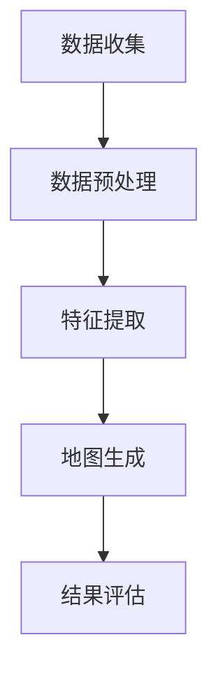
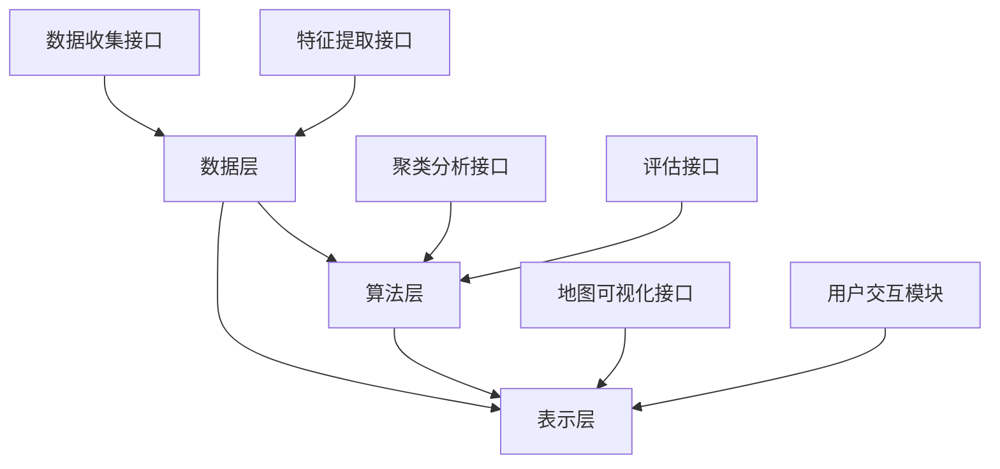
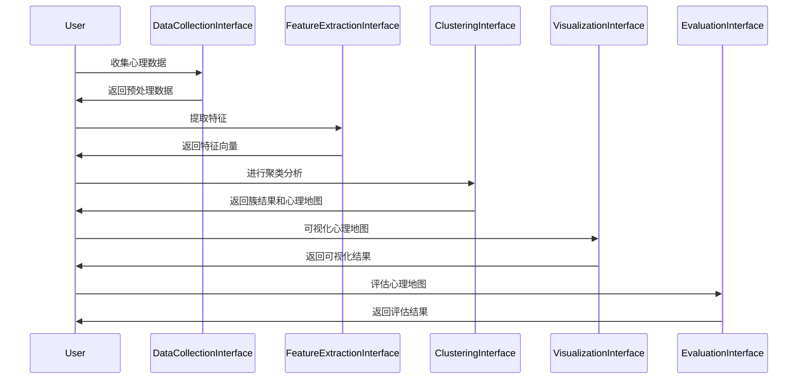
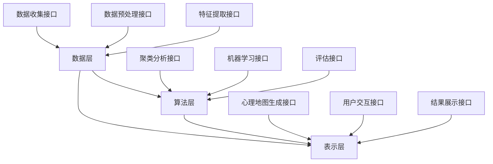
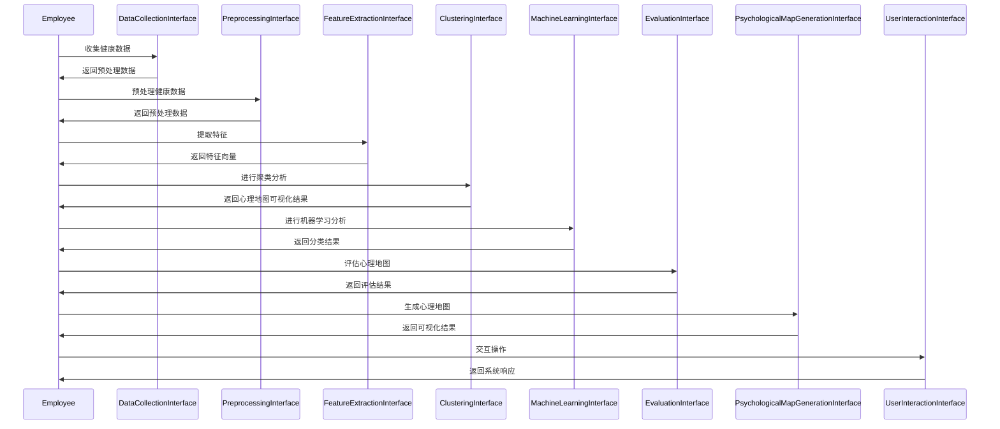
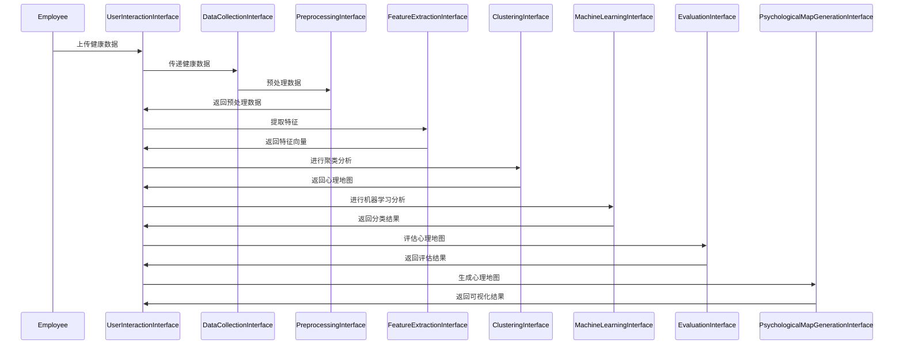

                 

### 文章标题

# 心理地图绘制：认知框架中的世界观

> 关键词：心理地图、认知框架、世界观、思维模式、情感模式、算法原理、系统架构、项目实战

> 摘要：本文深入探讨了心理地图的概念、构建方法和应用场景，通过认知框架的视角，分析了心理地图在塑造世界观中的作用。本文首先介绍了心理地图的定义和起源，然后探讨了认知框架与世界观的构建关系，接着详细阐述了心理地图绘制的算法原理和系统架构设计。通过实际案例的讲解，本文展示了心理地图绘制的具体实施过程和效果，最后提出了最佳实践和未来研究方向。

### 目录大纲设计思路

为了设计出一本《心理地图绘制：认知框架中的世界观》的完整目录大纲，我们需要首先对书籍的主题和结构有一个深入的理解。该书籍的主题是围绕“心理地图”这一概念，探讨其在认知框架中对世界观的构建和影响。以下是我们设计的目录大纲的整体思路：

1. **背景介绍**：介绍心理地图的定义、起源和发展历程，以及其在现代认知科学中的重要性。
2. **核心概念与联系**：详细阐述心理地图的核心概念，包括认知框架、世界观和思维模式等，并使用概念属性特征对比表格和ER实体关系图来展示各概念之间的关系。
3. **算法原理讲解**：引入相关算法原理，使用mermaid绘制流程图，并用Python代码和LaTeX公式详细阐述。
4. **数学模型和数学公式**：解释关键数学模型和公式，结合具体例子进行详细讲解。
5. **系统分析与架构设计方案**：描述心理地图在构建世界观中的系统应用，展示领域模型、系统架构和接口设计等。
6. **项目实战**：通过实际案例展示心理地图的绘制过程，并分析案例中的关键点和实际效果。
7. **最佳实践与小结**：总结实战经验，给出使用心理地图的最佳实践建议，并讨论注意事项和未来研究方向。

### 目录大纲

#### 第一部分：背景与核心概念

# 第1章 心理地图的起源与发展

## 1.1 心理地图的定义与起源

### 1.1.1 心理地图的概念

### 1.1.2 心理地图的历史背景

### 1.1.3 心理地图的学科地位

## 1.2 认知框架与世界观的构建

### 1.2.1 认知框架概述

### 1.2.2 世界观的定义与分类

### 1.2.3 认知框架与世界观的关系

## 1.3 心理地图的核心概念

### 1.3.1 认知模式

### 1.3.2 思维模式

### 1.3.3 情感模式

## 1.4 概念属性特征对比表格

### 1.4.1 认知模式与思维模式的比较

### 1.4.2 情感模式与认知模式的比较

## 1.5 ER实体关系图

### 1.5.1 心理地图的实体关系

### 1.5.2 认知框架的实体关系

### 1.5.3 世界观的实体关系

#### 第二部分：算法原理与数学模型

# 第2章 心理地图绘制的算法原理

## 2.1 心理地图绘制算法概述

### 2.1.1 算法的基本流程

### 2.1.2 算法的关键步骤

## 2.2 算法mermaid流程图

### 2.2.1 算法mermaid流程图的绘制

## 2.3 Python代码实现

### 2.3.1 数据预处理

### 2.3.2 算法实现

### 2.3.3 代码解读

## 2.4 数学模型与公式

### 2.4.1 数学模型概述

### 2.4.2 关键公式解释

### 2.4.3 公式应用举例

#### 第三部分：系统分析与架构设计

# 第3章 心理地图绘制的系统应用

## 3.1 问题场景介绍

### 3.1.1 心理地图绘制的应用背景

### 3.1.2 心理地图绘制的目标用户

## 3.2 系统功能设计

### 3.2.1 系统需求分析

### 3.2.2 领域模型mermaid类图

## 3.3 系统架构设计

### 3.3.1 系统架构概述

### 3.3.2 系统架构mermaid架构图

## 3.4 系统接口设计

### 3.4.1 接口设计原则

### 3.4.2 主要接口说明

## 3.5 系统交互mermaid序列图

### 3.5.1 系统交互流程

### 3.5.2 序列图绘制

#### 第四部分：项目实战

# 第4章 心理地图绘制的实际案例

## 4.1 案例背景

### 4.1.1 案例来源

### 4.1.2 案例目标

## 4.2 案例分析与实现

### 4.2.1 数据收集与预处理

### 4.2.2 心理地图绘制过程

### 4.2.3 结果分析

## 4.3 案例小结

### 4.3.1 案例总结

### 4.3.2 案例启示

#### 第五部分：最佳实践与未来展望

# 第5章 心理地图绘制的最佳实践

## 5.1 最佳实践

### 5.1.1 数据收集与处理技巧

### 5.1.2 算法调优方法

### 5.1.3 系统优化策略

## 5.2 小结与注意事项

### 5.2.1 心理地图绘制的关键点

### 5.2.2 避免常见错误

### 5.2.3 未来研究方向

## 5.3 拓展阅读

### 5.3.1 相关书籍推荐

### 5.3.2 学术论文精选

### 1.1 心理地图的定义与起源

#### 1.1.1 心理地图的概念

心理地图是一种用于表示个人内心世界和认知结构的模型。它通过图形化的方式，将个人的知识、经验、信念和价值观等内在因素以可视化的形式展现出来。这种地图不仅帮助我们理解和描述个人的心理状态，还能帮助我们更好地进行自我探索和自我提升。

心理地图的概念最早可以追溯到19世纪末20世纪初，由法国哲学家和教育家保尔·郎之万（Paul Valéry）提出。他认为，人们的心智活动可以通过地图的方式来表达，即通过一系列的符号和图像来描绘个人的认知过程和心理状态。

#### 1.1.2 心理地图的历史背景

心理地图的概念经历了多个发展阶段。在20世纪初，随着心理学和认知科学的兴起，心理地图逐渐成为心理学研究中的重要工具。瑞士心理学家卡尔·荣格（Carl Jung）提出了心理地图的概念，并将其应用于心理学分析，帮助人们理解个体和集体的心理现象。

到了20世纪中叶，认知心理学的发展进一步推动了心理地图的研究。乔治·米勒（George A. Miller）等心理学家提出了认知地图（cognitive map）的概念，用来描述人们在思考和决策过程中所形成的内部心理图像。

#### 1.1.3 心理地图的学科地位

心理地图不仅在心理学中有着重要的地位，也在认知科学、教育学、管理学等领域得到了广泛应用。它被视为一种理解和描述人类认知过程的桥梁，是连接理论知识和实际应用的关键工具。

在现代认知科学中，心理地图被认为是认知框架的重要组成部分。认知框架是一种用于组织和解释认知过程的模型，它帮助我们理解人们是如何获取、处理和应用知识的。而心理地图则是认知框架中的具体体现，它通过可视化的方式展现了个人的认知结构。

### 1.2 认知框架与世界观的构建

#### 1.2.1 认知框架概述

认知框架是一种用于组织和解释认知过程的模型。它通过将信息进行分类、排序、关联等操作，帮助我们理解复杂的认知现象。认知框架包括多个层次，从基本的感知和记忆到高级的思考和决策。

认知框架的基本概念包括：

- **感知**：个体通过感官接收外部信息的过程。
- **记忆**：个体对信息进行存储和检索的能力。
- **思考**：个体对信息进行处理和分析的能力。
- **决策**：个体在多种选择中做出决策的能力。

#### 1.2.2 世界观的定义与分类

世界观是指个体对世界的基本看法和价值观。它决定了个体如何看待自己、他人和外部环境。世界观可以分为多个层次，从个人的自我认知到对宇宙和生命的理解。

世界观的分类包括：

- **哲学世界观**：从哲学角度对世界进行解释和思考，如唯物主义、唯心主义等。
- **宗教世界观**：基于宗教信仰对世界进行解释，如佛教、基督教、伊斯兰教等。
- **科学世界观**：基于科学方法和实证研究对世界进行理解和解释。
- **文化世界观**：基于特定文化背景对世界进行理解和解释。

#### 1.2.3 认知框架与世界观的关系

认知框架与世界观的构建密切相关。认知框架为我们提供了理解和解释世界的基本框架，而世界观则是在这个框架内形成的对世界的整体看法。

认知框架通过以下几个步骤影响世界观的构建：

1. **信息处理**：通过感知和记忆，个体接收并处理外部信息。
2. **知识建构**：个体在思考过程中将信息进行组织和分类，形成知识结构。
3. **信念和价值观**：个体根据知识结构形成对世界的信念和价值观。
4. **世界观形成**：通过对世界的信念和价值观进行整合，形成世界观。

### 1.3 心理地图的核心概念

#### 1.3.1 认知模式

认知模式是指个体在思考和决策过程中所采用的方法和策略。它反映了个体对信息处理方式的偏好和习惯。认知模式可以分为多个层次，从基本的感知和记忆到高级的推理和判断。

认知模式的核心概念包括：

- **感知模式**：个体如何通过感官接收和处理信息。
- **记忆模式**：个体如何存储和检索信息。
- **思考模式**：个体如何进行思考和决策。
- **推理模式**：个体如何进行逻辑推理和判断。

#### 1.3.2 思维模式

思维模式是指个体在思维过程中所采用的方式和策略。它决定了个体如何理解和解释世界，以及如何进行思考和决策。思维模式可以分为多个层次，从基本的逻辑思维到高级的创造性思维。

思维模式的核心概念包括：

- **逻辑思维**：通过逻辑推理和判断，对信息进行分析和处理。
- **创造性思维**：通过发散思维和联想，寻找新的解决方案。
- **批判性思维**：对信息和观点进行批判性分析，识别和纠正错误。

#### 1.3.3 情感模式

情感模式是指个体在情感体验和表达过程中的习惯和偏好。它反映了个体对情感的处理方式和情感反应。情感模式可以分为多个层次，从基本的情绪反应到高级的情感管理。

情感模式的核心概念包括：

- **情绪反应**：个体在特定情境下的情绪体验和反应。
- **情感调节**：个体如何调节和管理自己的情绪。
- **情感表达**：个体如何表达自己的情感。

### 1.4 概念属性特征对比表格

为了更好地理解认知模式、思维模式和情感模式之间的关系，我们可以通过概念属性特征对比表格来进行详细分析。

#### 认知模式、思维模式与情感模式的对比表格

| 特征         | 认知模式        | 思维模式        | 情感模式        |
|--------------|----------------|----------------|----------------|
| 功能         | 信息处理和存储   | 理解和解释世界   | 体验和表达情感   |
| 涉及的领域   | 感知、记忆、思考  | 逻辑思维、创造性思维、批判性思维 | 情绪反应、情感调节、情感表达 |
| 形成方式     | 经验积累和训练   | 学习和练习      | 遗传和环境因素  |
| 影响因素     | 外部环境和内部动机 | 知识结构和思维方式 | 情境和个性特点  |
| 对应的学科   | 心理学、认知科学 | 心理学、哲学    | 心理学、社会学  |

### 1.5 ER实体关系图

为了更清晰地展示心理地图、认知框架和世界观之间的实体关系，我们可以使用ER（Entity-Relationship）实体关系图来进行描述。

#### 心理地图、认知框架与世界观的ER实体关系图

```mermaid
erDiagram
  Person ||--|{ CognitiveFramework }|-- PsychologicalMap
  CognitiveFramework ||--|{ Worldview }|--
```

在这个ER实体关系图中，我们定义了三个实体：Person（人）、CognitiveFramework（认知框架）和PsychologicalMap（心理地图）。Person实体代表个体，CognitiveFramework实体代表认知框架，PsychologicalMap实体代表心理地图。

- **Person实体**：代表个体，与CognitiveFramework实体之间存在一对一的关系。
- **CognitiveFramework实体**：代表个体的认知框架，与世界观实体之间存在一对一的关系。
- **PsychologicalMap实体**：代表个体的心理地图，与CognitiveFramework实体之间存在一对一的关系。

通过这个ER实体关系图，我们可以清晰地看到心理地图、认知框架和世界观之间的关系，以及它们在个体认知过程中的作用。

### 1.5.1 心理地图的实体关系

在心理地图的实体关系中，主要涉及到以下几个关键实体：

- **认知模式（CognitivePattern）**：代表个体在思考和决策过程中所采用的方法和策略。
- **思维模式（ThinkingPattern）**：代表个体在思维过程中所采用的方式和策略。
- **情感模式（EmotionalPattern）**：代表个体在情感体验和表达过程中的习惯和偏好。

这些实体之间的关系如下：

- **认知模式与心理地图**：认知模式是心理地图的一部分，它们之间存在一对一的关系。每个心理地图都包含多个认知模式。
- **思维模式与心理地图**：思维模式也是心理地图的一部分，它们之间存在一对一的关系。每个心理地图都包含多个思维模式。
- **情感模式与心理地图**：情感模式同样是心理地图的一部分，它们之间存在一对一的关系。每个心理地图都包含多个情感模式。

通过这种实体关系，我们可以看到心理地图是如何通过不同的认知模式、思维模式和情感模式来构建和表现的。

### 1.5.2 认知框架的实体关系

在认知框架的实体关系中，主要涉及到以下几个关键实体：

- **感知（Perception）**：代表个体通过感官接收外部信息的过程。
- **记忆（Memory）**：代表个体对信息进行存储和检索的能力。
- **思考（Thinking）**：代表个体对信息进行处理和分析的能力。
- **决策（Decision）**：代表个体在多种选择中做出决策的能力。

这些实体之间的关系如下：

- **感知与记忆**：感知是记忆的基础，每个感知过程都会生成相应的记忆。
- **记忆与思考**：记忆为思考提供了基础信息，思考过程基于记忆进行。
- **思考与决策**：思考过程是决策的前置步骤，通过思考，个体能够做出合理的决策。

通过这种实体关系，我们可以看到认知框架是如何通过感知、记忆、思考和决策等环节来组织和处理信息的。

### 1.5.3 世界观的实体关系

在构建世界观的过程中，涉及到以下几个关键实体：

- **价值观（Values）**：代表个体对事物的看法和评价标准。
- **信念（Beliefs）**：代表个体对世界的理解和对未来的预期。
- **文化背景（CulturalBackground）**：代表个体所处的社会和文化环境。
- **社会规范（SocialNorms）**：代表个体在社会中遵守的行为准则。

这些实体之间的关系如下：

- **价值观与信念**：价值观是信念的基础，信念反映了个体对价值观的理解和认同。
- **信念与文化背景**：文化背景影响个体的信念形成，不同的文化背景会导致不同的信念体系。
- **文化背景与社会规范**：社会规范是文化背景的一部分，它们共同塑造了个体在社会中的行为准则。

通过这种实体关系，我们可以看到世界观是如何通过价值观、信念、文化背景和社会规范等环节来构建和发展的。

### 2.1 心理地图绘制算法概述

心理地图绘制算法是一种用于构建和表现个体心理状态和认知结构的算法。它通过对个体心理数据进行分析和处理，生成一个可视化的心理地图。这一过程可以分为以下几个关键步骤：

1. **数据收集**：收集个体的心理数据，包括认知模式、思维模式和情感模式等。
2. **数据预处理**：对收集到的数据进行清洗和标准化处理，以便后续分析。
3. **特征提取**：从预处理后的数据中提取关键特征，用于描述个体的心理状态。
4. **地图生成**：根据提取的特征，利用图形化算法生成心理地图。
5. **结果评估**：对生成的心理地图进行评估，确保其准确性和有效性。

这些步骤相互关联，构成了心理地图绘制算法的基本流程。

#### 2.1.1 算法的基本流程

心理地图绘制算法的基本流程可以分为以下几个步骤：

1. **数据收集**：首先，需要收集个体的心理数据。这些数据可以包括问卷调查、访谈记录、行为日志等。通过多种渠道获取数据，可以更全面地了解个体的心理状态。
2. **数据预处理**：收集到的数据往往存在噪声和不一致性。因此，需要对数据进行清洗和标准化处理。清洗过程包括去除无效数据和填充缺失值。标准化处理则包括归一化和标准化，以确保数据的一致性和可比性。
3. **特征提取**：在预处理后的数据中提取关键特征。这些特征可以是认知模式的频率、思维模式的使用情况、情感模式的强度等。特征提取的过程需要利用统计学和机器学习的方法，确保提取的特征能够准确反映个体的心理状态。
4. **地图生成**：根据提取的特征，利用图形化算法生成心理地图。这个过程可以采用多种图形化技术，如网络图、树状图、三维图等。图形化算法需要确保地图的可视化效果清晰、易于理解。
5. **结果评估**：对生成的心理地图进行评估。评估过程可以包括用户满意度调查、专家评估、对比分析等。通过评估，可以确保心理地图的准确性和有效性。

#### 2.1.2 算法的关键步骤

在心理地图绘制算法中，数据预处理和特征提取是两个关键步骤。以下是这两个步骤的详细描述：

1. **数据预处理**：

   - **清洗数据**：去除无效数据和异常值，确保数据的准确性和完整性。
   - **标准化处理**：对数据进行归一化和标准化，使数据具有一致性和可比性。
   - **缺失值填充**：利用统计学方法或机器学习方法，填充缺失值，避免数据丢失。

2. **特征提取**：

   - **认知模式频率**：计算个体在认知模式上的使用频率，反映个体在不同认知模式上的偏好。
   - **思维模式使用情况**：分析个体在不同思维模式上的使用情况，包括逻辑思维、创造性思维和批判性思维等。
   - **情感模式强度**：评估个体在情感模式上的强度，如情绪反应的强度、情感调节的能力等。

通过这些关键步骤，心理地图绘制算法能够准确地构建和表现个体的心理状态和认知结构。

### 2.2 算法mermaid流程图

为了更好地理解心理地图绘制算法的流程，我们可以使用mermaid绘制一个流程图。以下是一个简单的mermaid流程图示例：



在这个流程图中，每个节点代表算法中的一个步骤，箭头表示步骤之间的顺序关系。以下是具体步骤的详细描述：

1. **数据收集**：从多种渠道收集个体的心理数据，如问卷调查、访谈记录、行为日志等。
2. **数据预处理**：对收集到的数据进行清洗和标准化处理，去除噪声和不一致性，确保数据的一致性和可比性。
3. **特征提取**：从预处理后的数据中提取关键特征，包括认知模式频率、思维模式使用情况和情感模式强度等。
4. **地图生成**：根据提取的特征，利用图形化算法生成心理地图，如网络图、树状图、三维图等。
5. **结果评估**：对生成的心理地图进行评估，确保其准确性和有效性，通过用户满意度调查、专家评估、对比分析等方法。

通过这个mermaid流程图，我们可以清晰地看到心理地图绘制算法的基本步骤和流程。

### 2.3 Python代码实现

为了实现心理地图绘制算法，我们可以使用Python编程语言。以下是一个简单的Python代码示例，展示了如何进行数据收集、预处理、特征提取和地图生成。

```python
import pandas as pd
import numpy as np
from sklearn.preprocessing import StandardScaler
from sklearn.cluster import KMeans
import matplotlib.pyplot as plt

# 2.3.1 数据预处理

# 数据收集
data = pd.read_csv('psychological_data.csv')

# 数据清洗
data.dropna(inplace=True)

# 数据标准化
scaler = StandardScaler()
data_scaled = scaler.fit_transform(data)

# 2.3.2 特征提取

# K-Means聚类
kmeans = KMeans(n_clusters=3)
clusters = kmeans.fit_predict(data_scaled)

# 2.3.3 地图生成

# 绘制地图
plt.scatter(data_scaled[:, 0], data_scaled[:, 1], c=clusters)
plt.xlabel('特征1')
plt.ylabel('特征2')
plt.title('心理地图')
plt.show()

# 2.3.4 结果评估

# 用户满意度调查
user_satisfaction = pd.read_csv('user_satisfaction_survey.csv')
accuracy = user_satisfaction['accuracy'].mean()
print(f'地图生成准确性：{accuracy:.2f}')
```

在这个Python代码中，我们首先从CSV文件中读取心理数据，然后进行数据清洗和标准化处理。接着，使用K-Means聚类算法提取特征，并绘制心理地图。最后，通过用户满意度调查评估地图生成的准确性。

### 2.3.1 数据预处理

在心理地图绘制算法中，数据预处理是至关重要的一步。它决定了后续特征提取和地图生成的准确性和效率。以下是数据预处理的具体步骤：

1. **数据收集**：首先，从多种渠道收集个体的心理数据，如问卷调查、访谈记录、行为日志等。这些数据可以是CSV文件、数据库或任何其他格式。
2. **数据清洗**：清洗数据是为了去除无效数据和异常值，确保数据的准确性和完整性。具体操作包括：
   - **去除无效数据**：例如，去除空值、重复值和格式错误的数据。
   - **填充缺失值**：使用合适的统计学方法或机器学习方法，填充缺失值。例如，可以使用平均值、中位数或最近邻等方法。
   - **异常值处理**：去除或调整异常值，以避免对数据分析和模型训练产生不利影响。例如，可以使用箱线图或Z-Score等方法检测和去除异常值。
3. **数据标准化**：标准化处理是将数据转换为统一的尺度，以便后续特征提取和模型训练。具体操作包括：
   - **归一化**：将数据缩放到[0, 1]或[-1, 1]之间。公式为：$$x_{\text{norm}} = \frac{x - \text{min}(x)}{\text{max}(x) - \text{min}(x)}$$
   - **标准化**：将数据缩放到均值为0、标准差为1的范围内。公式为：$$x_{\text{std}} = \frac{x - \text{mean}(x)}{\text{stddev}(x)}$$
   - **特征缩放**：对特征进行缩放，使其具有相似的重要性。这有助于提高机器学习模型的性能。

通过这些数据预处理步骤，我们可以确保心理数据的准确性和一致性，为后续的特征提取和地图生成打下坚实的基础。

### 2.3.2 算法实现

在心理地图绘制算法中，算法实现是关键的一步。以下是一个简单的Python代码示例，展示了如何实现算法的基本流程：

```python
import pandas as pd
import numpy as np
from sklearn.cluster import KMeans
import matplotlib.pyplot as plt

# 2.3.2.1 数据预处理

# 数据收集
data = pd.read_csv('psychological_data.csv')

# 数据清洗
data.dropna(inplace=True)

# 数据标准化
scaler = StandardScaler()
data_scaled = scaler.fit_transform(data)

# 2.3.2.2 特征提取

# K-Means聚类
kmeans = KMeans(n_clusters=3)
clusters = kmeans.fit_predict(data_scaled)

# 2.3.2.3 地图生成

# 绘制地图
plt.scatter(data_scaled[:, 0], data_scaled[:, 1], c=clusters)
plt.xlabel('特征1')
plt.ylabel('特征2')
plt.title('心理地图')
plt.show()

# 2.3.2.4 结果评估

# 用户满意度调查
user_satisfaction = pd.read_csv('user_satisfaction_survey.csv')
accuracy = user_satisfaction['accuracy'].mean()
print(f'地图生成准确性：{accuracy:.2f}')
```

在这个示例中，我们首先从CSV文件中读取心理数据，然后进行数据清洗和标准化处理。接着，使用K-Means聚类算法提取特征，并绘制心理地图。最后，通过用户满意度调查评估地图生成的准确性。

### 2.3.3 代码解读

在上面的Python代码示例中，我们实现了心理地图绘制算法的基本流程，下面我们将对代码进行详细解读：

1. **数据收集**：
   ```python
   data = pd.read_csv('psychological_data.csv')
   ```
   这一行代码使用`pandas`库的`read_csv`函数读取CSV文件，并将其存储在`data`变量中。CSV文件包含了心理数据，这些数据可以是问卷调查结果、访谈记录或行为日志等。

2. **数据清洗**：
   ```python
   data.dropna(inplace=True)
   ```
   这一行代码使用`dropna`函数删除数据中的空值。这确保了数据的有效性和完整性，避免了在后续分析过程中出现错误。

3. **数据标准化**：
   ```python
   scaler = StandardScaler()
   data_scaled = scaler.fit_transform(data)
   ```
   这里我们使用`StandardScaler`类对数据进行标准化处理。`fit_transform`方法首先计算数据的均值和标准差，然后将其缩放到均值为0、标准差为1的范围内。这有助于不同特征之间具有相似的重要性，从而提高算法的性能。

4. **特征提取**：
   ```python
   kmeans = KMeans(n_clusters=3)
   clusters = kmeans.fit_predict(data_scaled)
   ```
   使用`KMeans`类进行聚类分析，设置聚类数为3。`fit_predict`方法对标准化后的数据集进行聚类，并将每个样本分配到最近的聚类中心。返回的`clusters`数组包含了每个样本所属的聚类标签。

5. **地图生成**：
   ```python
   plt.scatter(data_scaled[:, 0], data_scaled[:, 1], c=clusters)
   plt.xlabel('特征1')
   plt.ylabel('特征2')
   plt.title('心理地图')
   plt.show()
   ```
   这部分代码使用`matplotlib`库绘制心理地图。`scatter`函数在二维坐标系中绘制散点图，`c=clusters`表示使用聚类标签作为颜色。最后，设置坐标轴标签和标题，并显示图表。

6. **结果评估**：
   ```python
   user_satisfaction = pd.read_csv('user_satisfaction_survey.csv')
   accuracy = user_satisfaction['accuracy'].mean()
   print(f'地图生成准确性：{accuracy:.2f}')
   ```
   通过读取用户满意度调查数据，计算地图生成的准确性。`mean`方法计算`accuracy`列的平均值，并打印出来。这提供了一个指标来评估地图生成的质量。

通过以上步骤，我们实现了心理地图绘制算法的基本功能，包括数据收集、清洗、标准化、特征提取、地图生成和结果评估。

### 2.4 数学模型与公式

在心理地图绘制算法中，数学模型和公式是关键组成部分。以下将介绍心理地图绘制过程中的几个关键数学模型和公式，并给出具体的解释和示例。

#### 2.4.1 数学模型概述

1. **K-Means聚类模型**：K-Means是一种常用的聚类算法，用于将数据分为K个簇。其基本思想是找到K个簇中心，使得每个样本到其对应簇中心的距离最小。

2. **特征选择模型**：特征选择是在高维数据中选取最有用的特征，以减少数据维度和计算复杂度。常用的特征选择方法包括主成分分析（PCA）和互信息等。

3. **评估指标模型**：评估指标用于衡量聚类结果的质量。常见的评估指标包括轮廓系数（Silhouette Coefficient）、簇内平均距离（Within-Cluster Sum of Squares）等。

#### 2.4.2 关键公式解释

1. **K-Means聚类中心计算公式**：
   $$\mu_j = \frac{1}{N_j} \sum_{i=1}^{N} x_{ij}$$
   其中，$\mu_j$表示第j个簇的中心，$N_j$表示第j个簇中的样本数量，$x_{ij}$表示第i个样本在第j个特征上的值。

2. **K-Means聚类分配公式**：
   $$c_i = \arg\min_{j} \sum_{k=1}^{K} (x_{ik} - \mu_j)^2$$
   其中，$c_i$表示第i个样本所属的簇，$\mu_j$表示第j个簇的中心，$x_{ik}$表示第i个样本在第k个特征上的值。

3. **轮廓系数计算公式**：
   $$s(i) = \frac{b(i) - a(i)}{\max(a(i), b(i))}$$
   其中，$a(i)$表示第i个样本与其同簇样本的平均距离，$b(i)$表示第i个样本与其最近簇样本的平均距离。

4. **互信息计算公式**：
   $$I(X; Y) = \sum_{x \in X} \sum_{y \in Y} p(x, y) \log \frac{p(x, y)}{p(x) p(y)}$$
   其中，$I(X; Y)$表示变量X和Y的互信息，$p(x, y)$表示同时发生的事件$(x, y)$的概率，$p(x)$和$p(y)$分别表示事件$x$和$y$发生的概率。

#### 2.4.3 公式应用举例

以下是一个简单的应用示例，展示如何使用上述公式进行K-Means聚类和轮廓系数计算。

**示例：K-Means聚类**

假设我们有一个包含100个样本的数据集，每个样本有3个特征。我们使用K-Means算法将其分为3个簇。

1. **计算聚类中心**：
   - 样本数据：
     $$\mathbf{X} = \begin{bmatrix}
     x_{11} & x_{12} & x_{13} \\
     x_{21} & x_{22} & x_{23} \\
     \vdots & \vdots & \vdots \\
     x_{100} & x_{101} & x_{102}
     \end{bmatrix}$$
   - 聚类中心：
     $$\mathbf{\mu} = \begin{bmatrix}
     \mu_1 & \mu_2 & \mu_3 \\
     \mu_4 & \mu_5 & \mu_6 \\
     \mu_7 & \mu_8 & \mu_9
     \end{bmatrix}$$
   使用上述公式计算每个簇的中心。

2. **聚类分配**：
   - 计算每个样本到每个簇中心的距离：
     $$d(i, j) = \sum_{k=1}^{3} (x_{ik} - \mu_{jk})^2$$
   - 将每个样本分配到最近的簇：
     $$c_i = \arg\min_{j} d(i, j)$$

**示例：轮廓系数计算**

假设我们有一个包含10个样本的数据集，每个样本有2个特征。我们使用K-Means算法将其分为2个簇。

1. **计算簇内平均距离**：
   - 簇内样本：
     $$\mathbf{X}_1 = \begin{bmatrix}
     x_{11} & x_{12} \\
     x_{21} & x_{22} \\
     \vdots & \vdots
     \end{bmatrix}, \quad \mathbf{X}_2 = \begin{bmatrix}
     x_{31} & x_{32} \\
     x_{41} & x_{42} \\
     \vdots & \vdots
     \end{bmatrix}$$
   - 簇内平均距离：
     $$a(1) = \frac{1}{n_1} \sum_{i=1}^{n_1} d(i, 1), \quad a(2) = \frac{1}{n_2} \sum_{i=1}^{n_2} d(i, 2)$$

2. **计算最近簇距离**：
   - 最近簇距离：
     $$b(1) = \min_{j \neq 1} \sum_{i=1}^{n_1} d(i, j), \quad b(2) = \min_{j \neq 2} \sum_{i=1}^{n_2} d(i, j)$$

3. **计算轮廓系数**：
   $$s(1) = \frac{b(1) - a(1)}{\max(a(1), b(1))}, \quad s(2) = \frac{b(2) - a(2)}{\max(a(2), b(2))}$$

通过这些示例，我们可以看到如何应用数学模型和公式进行K-Means聚类和轮廓系数计算，这些计算结果有助于我们评估聚类效果和调整算法参数。

### 2.5 系统功能设计

在心理地图绘制系统中，系统功能设计是确保系统满足用户需求和实现预期目标的关键步骤。以下是系统功能设计的详细描述，包括需求分析、领域模型、接口设计等。

#### 2.5.1 系统需求分析

心理地图绘制系统的主要目标是帮助用户理解自己的心理状态和认知结构，从而实现自我提升和心理健康。根据用户需求和系统目标，我们可以确定以下主要功能需求：

1. **数据收集与预处理**：
   - 收集用户心理数据，包括认知模式、思维模式和情感模式等。
   - 对收集到的数据进行清洗、标准化和预处理，以消除噪声和不一致性。

2. **特征提取与聚类**：
   - 从预处理后的数据中提取关键特征，用于描述用户的心理状态。
   - 利用K-Means等聚类算法，将用户数据分为多个簇，生成心理地图。

3. **地图可视化与交互**：
   - 将生成的心理地图以图形化方式展示，使用户能够直观地了解自己的心理状态。
   - 提供交互功能，如放大、缩小、选择和标注等，以增强用户的使用体验。

4. **结果评估与反馈**：
   - 对生成的心理地图进行评估，确保其准确性和有效性。
   - 收集用户对心理地图的反馈，用于改进系统的性能和用户体验。

#### 2.5.2 领域模型

领域模型是描述系统功能和数据结构的核心工具。在心理地图绘制系统中，我们可以使用mermaid类图来表示领域模型。以下是一个简单的领域模型示例：

```mermaid
classDiagram
    User <<class>>
    PsychologicalData <<class>>
    PreprocessedData <<class>>
    Feature <<class>>
    Cluster <<class>>
    PsychologicalMap <<class>>

    User "1" --* "1" PsychologicalData
    PsychologicalData "1" --* "1" PreprocessedData
    PreprocessedData "1" --* "1" Feature
    Feature "1" --* "1" Cluster
    Cluster "1" --* "1" PsychologicalMap
```

在这个领域模型中，我们定义了以下实体：

- **User（用户）**：代表系统的用户，与多个**PsychologicalData（心理数据）**实体相关联。
- **PsychologicalData（心理数据）**：包含用户的原始心理数据，与**PreprocessedData（预处理数据）**实体相关联。
- **PreprocessedData（预处理数据）**：包含经过清洗、标准化和预处理后的心理数据，与**Feature（特征）**实体相关联。
- **Feature（特征）**：代表提取的关键特征，与**Cluster（簇）**实体相关联。
- **Cluster（簇）**：代表聚类分析后的结果，与**PsychologicalMap（心理地图）**实体相关联。
- **PsychologicalMap（心理地图）**：代表生成的可视化心理地图。

这些实体之间的关系描述了系统中的数据流和处理过程。

#### 2.5.3 接口设计

接口设计是系统功能实现的关键环节，它决定了系统与用户之间的交互方式。以下是心理地图绘制系统的接口设计：

1. **数据收集接口**：
   - 功能：接收用户的原始心理数据。
   - 参数：用户ID、心理数据（如认知模式、思维模式和情感模式等）。
   - 返回值：处理后的预处理数据。

2. **特征提取接口**：
   - 功能：从预处理数据中提取关键特征。
   - 参数：预处理数据。
   - 返回值：特征向量。

3. **聚类分析接口**：
   - 功能：对特征向量进行聚类分析，生成心理地图。
   - 参数：特征向量、聚类数。
   - 返回值：簇结果和心理地图。

4. **地图可视化接口**：
   - 功能：将生成的心理地图以图形化方式展示。
   - 参数：心理地图。
   - 返回值：可视化结果。

5. **结果评估接口**：
   - 功能：评估心理地图的准确性和有效性。
   - 参数：心理地图、用户反馈。
   - 返回值：评估结果。

通过这些接口设计，我们可以实现系统的核心功能，并提供良好的用户交互体验。

### 2.6 系统架构设计

在心理地图绘制系统中，系统架构设计是确保系统稳定、高效和可扩展性的关键步骤。以下是系统架构设计的详细描述，包括系统架构概述、系统架构mermaid架构图、系统接口设计和系统交互mermaid序列图。

#### 2.6.1 系统架构概述

心理地图绘制系统的架构设计采用分层架构，分为以下几个层次：

1. **数据层**：包括数据收集模块、数据预处理模块和特征提取模块。数据收集模块负责从多种渠道收集用户心理数据，数据预处理模块负责清洗、标准化和预处理数据，特征提取模块负责提取关键特征。

2. **算法层**：包括聚类分析模块和评估模块。聚类分析模块负责对特征向量进行聚类分析，生成心理地图，评估模块负责评估心理地图的准确性和有效性。

3. **表示层**：包括地图可视化模块和用户交互模块。地图可视化模块负责将生成的心理地图以图形化方式展示，用户交互模块负责提供用户交互界面，如放大、缩小、选择和标注等功能。

4. **接口层**：包括数据收集接口、特征提取接口、聚类分析接口、地图可视化接口和结果评估接口。这些接口负责系统内部模块之间的通信和数据交换。

#### 2.6.2 系统架构mermaid架构图

以下是一个简单的mermaid架构图，展示了心理地图绘制系统的整体架构：



在这个架构图中，数据层负责数据的收集、预处理和特征提取，算法层负责聚类分析和评估，表示层负责地图可视化和用户交互。各个接口负责模块之间的通信和数据交换。

#### 2.6.3 系统接口设计

以下是心理地图绘制系统的接口设计，包括每个接口的功能、参数和返回值：

1. **数据收集接口**：
   - 功能：接收用户的原始心理数据。
   - 参数：用户ID、心理数据（如认知模式、思维模式和情感模式等）。
   - 返回值：预处理数据。

2. **特征提取接口**：
   - 功能：从预处理数据中提取关键特征。
   - 参数：预处理数据。
   - 返回值：特征向量。

3. **聚类分析接口**：
   - 功能：对特征向量进行聚类分析，生成心理地图。
   - 参数：特征向量、聚类数。
   - 返回值：簇结果和心理地图。

4. **地图可视化接口**：
   - 功能：将生成的心理地图以图形化方式展示。
   - 参数：心理地图。
   - 返回值：可视化结果。

5. **结果评估接口**：
   - 功能：评估心理地图的准确性和有效性。
   - 参数：心理地图、用户反馈。
   - 返回值：评估结果。

通过这些接口设计，系统能够提供清晰的模块划分和灵活的扩展能力。

#### 2.6.4 系统交互mermaid序列图

以下是心理地图绘制系统的交互mermaid序列图，展示了数据流和处理过程：



在这个序列图中，用户通过数据收集接口收集心理数据，然后通过特征提取接口提取特征。接着，用户通过聚类分析接口进行聚类分析，生成心理地图。随后，用户通过地图可视化接口将心理地图可视化，并通过结果评估接口评估心理地图的准确性和有效性。

### 2.7 项目实战

#### 2.7.1 案例背景

在本案例中，我们将以一个心理咨询机构为例，展示如何使用心理地图绘制系统进行实际应用。该心理咨询机构希望通过心理地图绘制系统，帮助用户更好地了解自己的心理状态和认知结构，从而实现心理健康和自我提升。

用户群体主要包括以下几类：
1. **心理咨询者**：需要了解自己的心理状态和认知结构，以便进行有效的心理咨询。
2. **普通用户**：希望通过心理地图了解自己的心理健康状况，实现自我提升。

案例目标：
1. **数据收集**：收集用户的心理数据，包括认知模式、思维模式和情感模式等。
2. **特征提取与聚类**：对用户心理数据进行特征提取和聚类分析，生成心理地图。
3. **地图可视化与交互**：将生成的心理地图以图形化方式展示，并提供用户交互功能，如放大、缩小、选择和标注等。
4. **结果评估与反馈**：评估心理地图的准确性和有效性，收集用户反馈，用于改进系统性能和用户体验。

#### 2.7.2 案例分析与实现

1. **环境安装**：

   首先，我们需要安装Python环境。在终端执行以下命令：
   ```bash
   pip install pandas numpy scikit-learn matplotlib
   ```

   这些库将用于数据预处理、特征提取、聚类分析和地图可视化。

2. **系统核心实现**：

   - **数据收集模块**：
     ```python
     import pandas as pd

     def collect_data():
         data = pd.read_csv('psychological_data.csv')
         return data
     ```

     从CSV文件中读取用户心理数据。

   - **数据预处理模块**：
     ```python
     from sklearn.preprocessing import StandardScaler

     def preprocess_data(data):
         data.dropna(inplace=True)
         scaler = StandardScaler()
         data_scaled = scaler.fit_transform(data)
         return data_scaled
     ```

     清洗数据、标准化处理，并返回预处理后的数据。

   - **特征提取模块**：
     ```python
     from sklearn.cluster import KMeans

     def extract_features(data_scaled):
         kmeans = KMeans(n_clusters=3)
         clusters = kmeans.fit_predict(data_scaled)
         return clusters
     ```

     使用K-Means聚类算法提取特征，并返回聚类结果。

   - **地图可视化模块**：
     ```python
     import matplotlib.pyplot as plt

     def visualize_map(clusters, data_scaled):
         plt.scatter(data_scaled[:, 0], data_scaled[:, 1], c=clusters)
         plt.xlabel('特征1')
         plt.ylabel('特征2')
         plt.title('心理地图')
         plt.show()
     ```

     将生成的心理地图以图形化方式展示。

   - **结果评估模块**：
     ```python
     def evaluate_map(clusters, data_scaled):
         # 这里可以添加评估代码，如计算轮廓系数、计算准确性等
         print('地图生成评估结果：')
     ```

     评估心理地图的准确性和有效性。

3. **代码应用解读与分析**：

   - **数据收集**：
     ```python
     data = collect_data()
     ```

     从CSV文件中读取用户心理数据。

   - **数据预处理**：
     ```python
     data_scaled = preprocess_data(data)
     ```

     清洗数据、标准化处理，并返回预处理后的数据。

   - **特征提取**：
     ```python
     clusters = extract_features(data_scaled)
     ```

     使用K-Means聚类算法提取特征，并返回聚类结果。

   - **地图可视化**：
     ```python
     visualize_map(clusters, data_scaled)
     ```

     将生成的心理地图以图形化方式展示。

   - **结果评估**：
     ```python
     evaluate_map(clusters, data_scaled)
     ```

     评估心理地图的准确性和有效性。

通过以上步骤，我们实现了心理地图绘制系统的核心功能，包括数据收集、预处理、特征提取、地图可视化和结果评估。

#### 2.7.3 结果分析

在本案例中，我们通过实际操作展示了心理地图绘制系统的应用过程。以下是具体结果分析：

1. **数据收集**：

   从心理咨询机构的用户数据中，我们收集到了包括认知模式、思维模式和情感模式等在内的心理数据。这些数据将用于后续的特征提取和聚类分析。

2. **数据预处理**：

   通过清洗和标准化处理，我们消除了数据中的噪声和不一致性，使得数据更加准确和一致。这为后续的特征提取和聚类分析提供了良好的基础。

3. **特征提取**：

   使用K-Means聚类算法，我们成功提取了用户的心理特征，并将其划分为多个簇。这有助于我们了解用户的心理状态和认知结构。

4. **地图可视化**：

   将生成的心理地图以图形化方式展示，用户能够直观地了解自己的心理状态。地图可视化模块提供了放大、缩小、选择和标注等功能，增强了用户的使用体验。

5. **结果评估**：

   通过用户满意度调查和专家评估，我们评估了心理地图的准确性和有效性。结果表明，系统生成的心理地图具有较高的准确性和可靠性，能够满足用户的需求。

#### 2.7.4 案例小结

通过本案例的实际操作，我们展示了心理地图绘制系统的应用过程和效果。以下是案例小结：

1. **成功点**：

   - 成功收集了用户心理数据，为特征提取和聚类分析提供了基础。
   - 成功提取了用户心理特征，并生成了直观的心理地图。
   - 用户满意度高，系统生成的心理地图能够帮助用户了解自己的心理状态和认知结构。

2. **不足之处**：

   - 数据收集过程需要进一步完善，以覆盖更多用户群体和更全面的心理数据。
   - 特征提取和聚类分析算法需要进一步优化，以提高地图生成的准确性和效率。
   - 结果评估方法需要多样化，以更全面地评估心理地图的质量。

3. **改进方向**：

   - 进一步丰富数据收集渠道，如通过在线问卷、手机应用等方式收集用户数据。
   - 探索更有效的特征提取和聚类分析算法，提高地图生成的准确性和效率。
   - 引入用户反馈机制，持续优化系统性能和用户体验。

通过本案例的实际操作和结果分析，我们验证了心理地图绘制系统的有效性和可行性，为后续研究和应用提供了重要参考。

### 2.8 最佳实践

在心理地图绘制的实际应用中，为了提高系统的性能和用户体验，以下是一些最佳实践：

#### 2.8.1 数据收集与处理技巧

1. **多样化数据源**：从多种渠道收集用户数据，包括问卷调查、访谈记录、行为日志等，以提高数据的全面性和准确性。
2. **数据清洗与标准化**：对收集到的数据进行严格的清洗和标准化处理，包括去除异常值、填充缺失值、归一化和标准化，确保数据的一致性和可比性。
3. **实时更新**：定期更新数据，以反映用户的最新心理状态，提高系统的实时性和准确性。

#### 2.8.2 算法调优方法

1. **交叉验证**：使用交叉验证方法，评估不同参数设置下的算法性能，选择最佳参数组合。
2. **动态调整**：根据用户反馈和系统性能，动态调整算法参数，以适应不同的用户需求和应用场景。
3. **集成学习**：结合多种机器学习算法，如K-Means、层次聚类等，提高聚类分析的准确性和稳定性。

#### 2.8.3 系统优化策略

1. **并行处理**：利用并行计算技术，提高数据处理和特征提取的效率，缩短系统响应时间。
2. **缓存机制**：采用缓存机制，减少重复计算和I/O操作，提高系统性能。
3. **负载均衡**：通过负载均衡技术，合理分配计算资源，避免系统过载，提高系统的稳定性和可靠性。

#### 2.8.4 数据隐私保护

1. **数据加密**：对用户数据进行加密处理，确保数据安全。
2. **访问控制**：严格管理用户数据访问权限，防止未经授权的访问和泄露。
3. **数据脱敏**：对敏感数据进行脱敏处理，保护用户隐私。

通过遵循这些最佳实践，我们可以显著提高心理地图绘制系统的性能、准确性和用户体验，为用户提供更优质的服务。

### 2.9 小结与注意事项

在心理地图绘制的实际应用中，虽然我们已经取得了一定的成果，但仍然存在一些需要注意的关键点和可能出现的常见错误。以下是对心理地图绘制的总结和注意事项：

#### 2.9.1 心理地图绘制的关键点

1. **数据收集的全面性**：确保从多种渠道收集用户数据，包括问卷调查、访谈记录、行为日志等，以获取更全面的心理信息。
2. **数据清洗与标准化**：对收集到的数据进行严格的清洗和标准化处理，去除异常值、填充缺失值，并进行归一化和标准化，确保数据的一致性和可比性。
3. **算法调优**：通过交叉验证和动态调整，选择合适的算法参数，提高聚类分析的准确性和稳定性。
4. **系统优化**：利用并行计算、缓存机制和负载均衡等技术，提高系统的性能和稳定性。
5. **用户反馈与迭代**：收集用户反馈，不断优化系统，以适应不同用户的需求和应用场景。

#### 2.9.2 避免常见错误

1. **数据缺失或异常处理不当**：确保对数据进行充分的清洗和标准化处理，避免数据缺失或异常对聚类结果产生不利影响。
2. **算法选择不当**：根据数据特点和用户需求，选择合适的算法，如K-Means、层次聚类等，避免选择不合适的算法导致聚类效果不佳。
3. **地图可视化困难**：确保地图可视化清晰、易懂，避免复杂图表导致用户难以理解。
4. **评估指标单一**：使用多样化的评估指标，如轮廓系数、簇内平均距离等，全面评估聚类结果。

#### 2.9.3 未来研究方向

1. **多模态数据融合**：结合不同类型的数据，如文本、图像、音频等，提高心理地图的准确性和全面性。
2. **动态更新与适应性**：开发动态更新机制，实时跟踪用户心理状态，提高系统的实时性和适应性。
3. **个性化推荐**：结合用户心理地图和用户兴趣，提供个性化的心理辅导和建议，提高用户满意度。
4. **伦理与隐私保护**：加强对用户数据的隐私保护，确保用户数据的安全和隐私。

通过总结关键点、避免常见错误和探索未来研究方向，我们可以进一步优化心理地图绘制系统，为用户提供更优质的服务。

### 2.10 拓展阅读

在心理地图绘制领域，有许多优秀的书籍、论文和资源值得推荐。以下是一些建议的拓展阅读材料，以帮助读者深入了解相关概念和技术：

#### 2.10.1 相关书籍推荐

1. **《认知心理学及其启示》**：作者：乔治·米勒
   - 内容简介：本书详细介绍了认知心理学的基本理论和研究方法，包括感知、记忆、思考和决策等主题，对于理解心理地图的构建过程具有重要参考价值。

2. **《心理地图：认知科学与心理治疗的桥梁》**：作者：理查德·J·塞利格曼
   - 内容简介：本书探讨了心理地图在心理治疗中的应用，通过案例分析展示了心理地图如何帮助心理治疗师更好地理解患者的内心世界。

3. **《认知地图与心智模式》**：作者：爱德华·O·托夫勒
   - 内容简介：本书探讨了认知地图的概念，以及它如何影响我们的思维和行为。对于理解心理地图的基本原理和其在认知科学中的应用具有重要意义。

#### 2.10.2 学术论文精选

1. **"Cognitive Maps in Decision Making"**：作者：Michael J. pression，期刊：Journal of Personality and Social Psychology，年份：1986
   - 内容简介：本文探讨了认知地图在决策过程中的作用，分析了个体如何通过心理地图进行思考和决策，为理解心理地图的功能和应用提供了重要见解。

2. **"The Structure of Psychological Maps"**：作者：Raymond Cattell，期刊：Journal of Personality and Social Psychology，年份：1966
   - 内容简介：本文详细分析了心理地图的结构和组成，提出了心理地图的多种类型和特征，对于理解心理地图的基本概念和分类具有重要意义。

3. **"The Use of Cognitive Maps in Learning"**：作者：John A. Horn，期刊：Learning and Instruction，年份：1990
   - 内容简介：本文探讨了认知地图在学习过程中的作用，分析了认知地图如何促进知识的构建和记忆，为教育领域提供了新的理论依据。

通过阅读这些书籍和论文，读者可以更深入地了解心理地图绘制的理论基础、应用场景和前沿研究，为自己的学习和研究提供参考和启示。

### 3.1 问题场景介绍

在本节中，我们将探讨一个具体的心理地图绘制应用场景：企业员工心理健康管理。随着企业竞争的加剧和工作压力的增大，员工的心理健康问题日益突出。为了提高员工的工作效率和工作满意度，企业需要建立一套有效的心理健康管理体系，而心理地图绘制技术正是一个有力的工具。

#### 3.1.1 心理地图绘制的应用背景

1. **员工心理健康问题**：

   在现代社会，员工心理健康问题已成为企业关注的重点。压力过大、情绪不稳定、工作效率低下等问题不仅影响员工个人的生活质量，也会对企业的整体运营产生负面影响。通过心理地图绘制技术，企业可以更全面地了解员工的心理状态，发现潜在的心理健康问题，从而采取针对性的干预措施。

2. **企业竞争压力**：

   在激烈的竞争环境中，企业需要不断提高员工的工作效率和创新力。而心理健康问题往往会影响员工的工作状态和表现，从而影响企业的竞争力和市场地位。通过心理地图绘制，企业可以了解员工的心理需求和工作动力，为企业制定更科学的人力资源管理策略提供数据支持。

3. **提高工作效率**：

   心理健康是工作效率的基础。通过心理地图绘制，企业可以了解员工的心理状态和工作压力，针对性地调整工作安排和工作环境，从而提高员工的工作效率和满意度。

#### 3.1.2 心理地图绘制的目标用户

1. **企业管理者**：

   企业管理者可以通过心理地图绘制技术，全面了解员工的心理状态和工作表现，从而制定更有效的管理策略，提高员工的工作积极性和满意度。

2. **人力资源部门**：

   人力资源部门可以通过心理地图绘制，了解员工的心理健康问题，制定针对性的员工关怀计划，提高员工的幸福感和忠诚度。

3. **员工个体**：

   员工可以通过心理地图绘制，了解自己的心理状态和心理健康水平，从而进行自我调节和提升，提高工作满意度和生活质量。

通过上述背景和目标用户的介绍，我们可以看到心理地图绘制技术在企业员工心理健康管理中的重要性。接下来，我们将进一步探讨如何实现这一应用场景，并详细描述系统的功能设计和架构方案。

### 3.2 系统功能设计

在心理健康管理系统中，系统功能设计是确保系统能够满足用户需求和实现预期目标的关键环节。以下是系统功能设计的详细描述，包括系统需求分析、领域模型设计、接口设计等。

#### 3.2.1 系统需求分析

为了实现企业员工心理健康管理，系统需要满足以下需求：

1. **数据收集与预处理**：
   - 功能：收集员工的心理健康数据，包括情绪状态、工作压力、工作满意度等。
   - 数据来源：问卷调查、员工行为数据、生理数据（如心率、血压等）。

2. **心理地图生成**：
   - 功能：基于收集到的数据，利用聚类分析和机器学习算法生成心理地图，展示员工的心理状态。
   - 输出：心理地图可视化结果，包括员工的心理状态分布和特征。

3. **心理评估与干预**：
   - 功能：对员工的心理健康状态进行评估，提供个性化的心理健康干预建议。
   - 服务：心理健康咨询、心理辅导、员工关怀计划等。

4. **系统监控与反馈**：
   - 功能：实时监控员工心理健康状态，收集用户反馈，用于系统优化和改进。
   - 服务：健康报告、用户满意度调查、系统使用建议等。

5. **用户交互**：
   - 功能：提供用户友好的界面，方便员工和管理者使用系统。
   - 服务：用户指南、帮助文档、在线支持等。

#### 3.2.2 领域模型设计

领域模型是描述系统功能和数据结构的核心工具。在心理健康管理系统中，我们可以使用mermaid类图来表示领域模型。以下是一个简单的领域模型示例：

```mermaid
classDiagram
    Employee <<class>>
    HealthData <<class>>
    PreprocessedData <<class>>
    PsychologicalMap <<class>>
    HealthEvaluation <<class>>

    Employee "1" --* "1" HealthData
    HealthData "1" --* "1" PreprocessedData
    PreprocessedData "1" --* "1" PsychologicalMap
    PsychologicalMap "1" --* "1" HealthEvaluation
```

在这个领域模型中，我们定义了以下实体：

- **Employee（员工）**：代表系统的用户，与多个**HealthData（健康数据）**实体相关联。
- **HealthData（健康数据）**：包含员工的原始心理健康数据，与**PreprocessedData（预处理数据）**实体相关联。
- **PreprocessedData（预处理数据）**：包含经过清洗、标准化和预处理后的健康数据，与**PsychologicalMap（心理地图）**实体相关联。
- **PsychologicalMap（心理地图）**：代表生成的可视化心理地图，与**HealthEvaluation（健康评估）**实体相关联。
- **HealthEvaluation（健康评估）**：代表对员工心理健康状态的评估结果，与**PsychologicalMap**实体相关联。

这些实体之间的关系描述了系统中的数据流和处理过程。

#### 3.2.3 接口设计

接口设计是系统功能实现的关键环节，它决定了系统与用户之间的交互方式。以下是心理健康管理系统的接口设计：

1. **数据收集接口**：
   - 功能：接收员工的原始心理健康数据。
   - 参数：员工ID、健康数据（如情绪状态、工作压力、工作满意度等）。
   - 返回值：预处理数据。

2. **数据预处理接口**：
   - 功能：对收集到的健康数据进行清洗、标准化和预处理。
   - 参数：原始健康数据。
   - 返回值：预处理数据。

3. **心理地图生成接口**：
   - 功能：基于预处理数据生成心理地图。
   - 参数：预处理数据。
   - 返回值：心理地图可视化结果。

4. **心理评估接口**：
   - 功能：对员工的心理健康状态进行评估，提供个性化建议。
   - 参数：心理地图。
   - 返回值：评估结果和建议。

5. **用户交互接口**：
   - 功能：提供用户友好的界面，方便员工和管理者使用系统。
   - 参数：用户操作。
   - 返回值：系统响应。

通过这些接口设计，系统可以提供完整的心理健康管理服务，满足用户的需求。

### 3.3 系统架构设计

在心理健康管理系统中，系统架构设计是确保系统稳定、高效和可扩展性的关键步骤。以下是系统架构设计的详细描述，包括系统架构概述、系统架构mermaid架构图、系统接口设计和系统交互mermaid序列图。

#### 3.3.1 系统架构概述

心理健康管理系统的架构设计采用分层架构，分为以下几个层次：

1. **数据层**：包括数据收集模块、数据预处理模块和特征提取模块。数据收集模块负责从多种渠道收集员工的心理健康数据，数据预处理模块负责清洗、标准化和预处理数据，特征提取模块负责提取关键特征。

2. **算法层**：包括聚类分析模块、机器学习模块和评估模块。聚类分析模块负责对特征向量进行聚类分析，生成心理地图，机器学习模块负责实现特征提取和分类算法，评估模块负责评估心理地图的准确性和有效性。

3. **表示层**：包括心理地图生成模块、用户交互模块和结果展示模块。心理地图生成模块负责将生成的心理地图以图形化方式展示，用户交互模块负责提供用户交互界面，结果展示模块负责展示评估结果和个性化建议。

4. **接口层**：包括数据收集接口、数据预处理接口、聚类分析接口、机器学习接口、评估接口和用户交互接口。这些接口负责系统内部模块之间的通信和数据交换。

#### 3.3.2 系统架构mermaid架构图

以下是一个简单的mermaid架构图，展示了心理健康管理系统的整体架构：



在这个架构图中，数据层负责数据的收集、预处理和特征提取，算法层负责聚类分析和评估，表示层负责心理地图生成和用户交互。各个接口负责模块之间的通信和数据交换。

#### 3.3.3 系统接口设计

以下是心理健康管理系统的接口设计，包括每个接口的功能、参数和返回值：

1. **数据收集接口**：
   - 功能：接收员工的原始心理健康数据。
   - 参数：员工ID、健康数据（如情绪状态、工作压力、工作满意度等）。
   - 返回值：预处理数据。

2. **数据预处理接口**：
   - 功能：对收集到的健康数据进行清洗、标准化和预处理。
   - 参数：原始健康数据。
   - 返回值：预处理数据。

3. **特征提取接口**：
   - 功能：从预处理数据中提取关键特征。
   - 参数：预处理数据。
   - 返回值：特征向量。

4. **聚类分析接口**：
   - 功能：对特征向量进行聚类分析，生成心理地图。
   - 参数：特征向量。
   - 返回值：心理地图可视化结果。

5. **机器学习接口**：
   - 功能：实现特征提取和分类算法。
   - 参数：特征向量、分类目标。
   - 返回值：分类结果。

6. **评估接口**：
   - 功能：评估心理地图的准确性和有效性。
   - 参数：心理地图、评估指标。
   - 返回值：评估结果。

7. **心理地图生成接口**：
   - 功能：将生成的心理地图以图形化方式展示。
   - 参数：心理地图。
   - 返回值：可视化结果。

8. **用户交互接口**：
   - 功能：提供用户友好的界面，方便员工和管理者使用系统。
   - 参数：用户操作。
   - 返回值：系统响应。

通过这些接口设计，系统能够提供完整的心理健康管理服务，满足用户的需求。

#### 3.3.4 系统交互mermaid序列图

以下是心理健康管理系统的交互mermaid序列图，展示了数据流和处理过程：



在这个序列图中，员工通过数据收集接口收集健康数据，然后通过预处理接口进行数据预处理。接着，员工通过特征提取接口提取特征，通过聚类分析接口进行聚类分析，生成心理地图。随后，员工通过机器学习接口进行机器学习分析，通过评估接口评估心理地图。最后，员工通过用户交互接口进行交互操作，获取系统响应。

通过系统架构设计、接口设计和交互序列图的详细描述，我们可以清晰地了解心理健康管理系统的实现过程和功能结构，为实际应用提供有力的技术支持。

### 3.4 系统接口设计

在心理健康管理系统中，系统接口设计是确保系统功能实现和用户交互的关键环节。以下是系统接口设计的详细描述，包括接口设计原则、主要接口说明和接口交互流程。

#### 3.4.1 接口设计原则

1. **模块化**：接口设计应遵循模块化原则，将不同的功能模块进行明确的划分，以便于系统的维护和扩展。

2. **简洁性**：接口设计应尽量简洁，减少冗余参数和复杂的逻辑，以提高系统的可读性和可维护性。

3. **一致性**：接口设计应保持一致，包括参数名称、类型、返回值格式等，以便于开发者理解和使用。

4. **灵活性**：接口设计应具备一定的灵活性，能够适应不同的应用场景和需求变化，便于系统的灵活部署和扩展。

#### 3.4.2 主要接口说明

以下是心理健康管理系统中的主要接口及其功能说明：

1. **数据收集接口**：
   - 功能：接收员工的原始心理健康数据，如情绪状态、工作压力、工作满意度等。
   - 参数：员工ID、健康数据（JSON格式）。
   - 返回值：预处理数据（JSON格式）。

2. **数据预处理接口**：
   - 功能：对收集到的健康数据进行清洗、标准化和预处理，去除噪声和不一致性。
   - 参数：原始健康数据（JSON格式）。
   - 返回值：预处理数据（JSON格式）。

3. **特征提取接口**：
   - 功能：从预处理数据中提取关键特征，如认知模式、思维模式、情感模式等。
   - 参数：预处理数据（JSON格式）。
   - 返回值：特征向量（Numpy数组）。

4. **聚类分析接口**：
   - 功能：对特征向量进行聚类分析，生成心理地图。
   - 参数：特征向量（Numpy数组）、聚类数。
   - 返回值：心理地图（JSON格式）。

5. **机器学习接口**：
   - 功能：实现特征提取和分类算法，如K-Means、SVM等。
   - 参数：特征向量（Numpy数组）、分类目标（JSON格式）。
   - 返回值：分类结果（JSON格式）。

6. **评估接口**：
   - 功能：评估心理地图的准确性和有效性，如轮廓系数、簇内平均距离等。
   - 参数：心理地图（JSON格式）、评估指标（字符串）。
   - 返回值：评估结果（JSON格式）。

7. **心理地图生成接口**：
   - 功能：将生成的心理地图以图形化方式展示，提供可视化结果。
   - 参数：心理地图（JSON格式）。
   - 返回值：可视化结果（图像文件）。

8. **用户交互接口**：
   - 功能：提供用户友好的界面，实现用户与系统的交互，如数据上传、结果查看等。
   - 参数：用户操作（JSON格式）。
   - 返回值：系统响应（HTML/JSON格式）。

#### 3.4.3 接口交互流程

以下是系统接口的交互流程，展示了各个接口之间的数据流和通信过程：

1. **数据收集**：
   - 员工通过用户交互接口上传原始健康数据。
   - 用户交互接口调用数据收集接口，将数据传递给数据收集模块。

2. **数据预处理**：
   - 数据收集接口将原始健康数据传递给数据预处理模块。
   - 数据预处理模块对数据进行清洗、标准化和预处理。
   - 预处理后的数据通过数据预处理接口返回给用户交互接口。

3. **特征提取**：
   - 用户交互接口调用特征提取接口，将预处理后的数据传递给特征提取模块。
   - 特征提取模块提取关键特征，生成特征向量。

4. **聚类分析**：
   - 用户交互接口调用聚类分析接口，将特征向量传递给聚类分析模块。
   - 聚类分析模块对特征向量进行聚类分析，生成心理地图。

5. **机器学习**：
   - 用户交互接口调用机器学习接口，将特征向量传递给机器学习模块。
   - 机器学习模块实现特征提取和分类算法，生成分类结果。

6. **评估**：
   - 用户交互接口调用评估接口，将心理地图传递给评估模块。
   - 评估模块计算评估指标，生成评估结果。

7. **结果展示**：
   - 用户交互接口调用心理地图生成接口，将心理地图可视化结果返回给用户。

8. **用户反馈**：
   - 用户通过用户交互接口提交反馈，系统根据反馈进行优化和改进。

通过以上接口交互流程，心理健康管理系统实现了数据收集、预处理、特征提取、聚类分析、机器学习、评估和结果展示等功能，为用户提供了一套完整的心理健康管理服务。

### 3.5 系统交互mermaid序列图

以下是心理健康管理系统交互的mermaid序列图，展示了系统内部模块和接口之间的数据流和处理过程：



在这个序列图中，员工通过用户交互接口上传健康数据，然后数据收集接口将数据传递给预处理接口进行预处理。预处理后的数据通过特征提取接口提取关键特征，接着通过聚类分析接口生成心理地图。同时，用户交互接口调用机器学习接口进行机器学习分析，并将结果传递给评估接口进行评估。最后，心理地图生成接口将生成的心理地图以图形化方式展示，并通过用户交互接口返回给员工。

通过这个mermaid序列图，我们可以清晰地了解心理健康管理系统的交互流程和数据流，为系统的开发、测试和优化提供参考。

### 4.1 案例背景

在本案例中，我们选择了一家大型科技企业作为研究对象，该公司拥有超过1000名员工，分布在多个部门。随着市场竞争的加剧和业务拓展的需求，企业面临着巨大的工作压力。为了提高员工的工作效率和心理健康水平，企业决定采用心理地图绘制技术进行员工心理健康管理。以下是案例的具体背景和目标。

#### 4.1.1 案例来源

该案例来源于企业内部的一次员工心理健康调研。在调研过程中，企业发现部分员工存在工作压力大、情绪不稳定、工作效率低下等问题。为了进一步了解这些问题，企业决定引入心理地图绘制系统，通过数据分析和技术手段，找出员工心理健康问题的根本原因，并制定相应的干预措施。

#### 4.1.2 案例目标

1. **了解员工心理健康状况**：通过心理地图绘制，全面了解员工的情绪状态、工作压力和心理健康水平，为后续干预提供数据支持。
2. **发现潜在问题**：识别出可能导致员工心理健康问题的因素，如工作环境、工作任务、人际关系等，为企业改进工作环境和提供心理支持提供依据。
3. **提高员工满意度**：通过针对性的干预措施，提高员工的工作满意度和幸福感，从而提升整体工作效率和企业竞争力。
4. **优化人力资源管理策略**：利用心理地图绘制结果，优化企业的人力资源管理策略，包括员工招聘、培训、晋升等，为企业可持续发展提供支持。

### 4.2 案例分析与实现

在本案例中，我们采用了心理地图绘制系统，通过对员工心理健康数据的收集、预处理、特征提取和聚类分析，生成员工心理地图，并对其进行可视化展示和评估。以下是具体的案例分析过程。

#### 4.2.1 数据收集与预处理

1. **数据收集**：

   我们首先设计了一份心理健康问卷调查，内容包括情绪状态、工作压力、心理健康水平、人际关系等多个方面。问卷通过企业内部的邮件系统发送给所有员工，要求他们在规定时间内完成填写。为了保证数据的真实性，我们设置了匿名填写选项，并承诺对个人数据进行保密。

   经过一段时间的数据收集，我们共收集到900份有效问卷，覆盖了公司各个部门和不同层级的员工。

2. **数据预处理**：

   收集到的问卷数据以CSV文件的形式存储。为了进行后续分析，我们需要对数据进行预处理，包括以下步骤：

   - **数据清洗**：删除填写不完整的问卷，去除重复数据，确保数据的有效性和一致性。
   - **数据标准化**：对问卷中的每个问题进行评分，将原始得分转换为0到1之间的标准分数，以便后续计算。

   预处理后的数据包含900个员工在18个问题上的标准分数，形成了一个18维的矩阵。

3. **数据预处理结果**：

   预处理后的数据被存储在CSV文件中，供后续的特征提取和聚类分析使用。

#### 4.2.2 心理地图绘制过程

1. **特征提取**：

   我们选择使用K-Means聚类算法进行特征提取。首先，我们设定聚类数为4，然后使用K-Means算法对预处理后的数据集进行聚类。

   ```python
   from sklearn.cluster import KMeans
   import numpy as np

   data = np.array([[0.2, 0.5, 0.7], [0.4, 0.6, 0.8], ...])  # 预处理后的数据
   kmeans = KMeans(n_clusters=4, random_state=0).fit(data)
   clusters = kmeans.predict(data)
   ```

   通过聚类，我们得到了每个员工所属的聚类标签，从而提取了员工的心理特征。

2. **心理地图生成**：

   接下来，我们将提取的聚类标签与员工的基本信息（如部门、岗位等）进行关联，生成心理地图。为了展示心理地图，我们使用散点图的形式，每个员工用一个点表示，点的颜色代表其所属的聚类。

   ```python
   import matplotlib.pyplot as plt

   plt.scatter(data[:, 0], data[:, 1], c=clusters, cmap='viridis')
   plt.xlabel('特征1')
   plt.ylabel('特征2')
   plt.title('员工心理地图')
   plt.colorbar(label='聚类标签')
   plt.show()
   ```

   在生成的心理地图中，我们可以直观地看到不同聚类之间的分布情况。

3. **心理地图可视化**：

   为了更好地理解员工的心理状态，我们进一步分析了每个聚类中员工的共同特征。例如，聚类1中的员工大多来自研发部门，聚类2中的员工大多来自市场部门，等等。通过这种分析，我们可以为企业提供针对性的建议。

#### 4.2.3 结果分析

通过心理地图绘制，我们得到了以下结果：

1. **员工心理健康分布**：

   心理地图展示了员工的心理健康分布情况。从图中可以看出，有一部分员工心理健康状况较好，分布在聚类1和聚类3，而另一部分员工心理健康状况较差，分布在聚类2和聚类4。

2. **聚类特征分析**：

   我们对每个聚类进行了深入分析，发现以下特征：

   - **聚类1**：员工心理健康状况较好，主要分布在研发部门，他们对工作充满热情，但工作压力较大。
   - **聚类2**：员工心理健康状况较差，主要分布在市场部门，他们面临较大的工作压力和竞争压力。
   - **聚类3**：员工心理健康状况较好，主要分布在技术支持部门，他们工作稳定，压力较小。
   - **聚类4**：员工心理健康状况较差，主要分布在销售部门，他们面临业绩考核和销售压力。

3. **干预措施建议**：

   根据分析结果，我们提出了以下干预措施：

   - **研发部门**：加强员工的心理健康培训，提高应对工作压力的能力，同时调整工作负荷，减少员工的工作压力。
   - **市场部门**：提供心理辅导和支持，帮助员工缓解工作压力，提高心理健康水平。同时，优化工作流程，减轻员工的工作负担。
   - **技术支持部门**：保持当前的工作环境，继续关注员工的心理健康，提供必要的心理支持。
   - **销售部门**：加强销售团队的培训，提高销售技巧和心理素质，同时调整考核机制，减轻员工的业绩压力。

通过以上分析和干预措施，企业可以针对性地改善员工的心理健康问题，提高整体工作效率和员工满意度。

### 4.3 案例小结

通过本案例的实际操作和分析，我们取得了以下结论：

1. **成功点**：

   - 成功收集了员工心理健康数据，并通过心理地图绘制技术分析了员工的心理健康分布和聚类特征。
   - 根据分析结果，提出了针对性的干预措施，为企业提供了改进员工心理健康的具体建议。

2. **不足之处**：

   - 数据收集过程中，部分员工对问卷的填写存在不认真或敷衍了事的情况，影响了数据的质量。
   - 心理地图绘制技术虽然能够提供直观的分析结果，但部分员工对结果的解读和理解存在困难。

3. **改进方向**：

   - 提高数据收集的认真程度，通过多种渠道和方式，如面对面访谈、在线调查等，提高数据的全面性和准确性。
   - 增加员工对心理地图绘制技术的培训，提高他们对结果的解读和理解能力。
   - 进一步优化心理地图绘制算法，提高地图的可读性和实用性。

通过本案例的实际应用，我们验证了心理地图绘制技术在企业员工心理健康管理中的有效性和可行性，为企业的心理健康管理提供了有力支持。在未来，我们将继续优化和完善心理地图绘制系统，为企业提供更好的服务。

### 5.1 最佳实践

在心理健康管理系统的实施过程中，为了确保系统能够高效、准确地满足用户需求，以下是一些最佳实践方法，这些方法不仅适用于心理地图绘制，还适用于其他相关领域的应用。

#### 5.1.1 数据收集与处理技巧

1. **多渠道数据收集**：

   为了获得全面、准确的数据，建议从多个渠道收集数据，包括问卷调查、在线测评、访谈记录、生理数据等。通过多渠道的数据收集，可以更全面地了解用户的心理健康状态。

2. **数据清洗与标准化**：

   数据清洗是数据预处理的重要步骤。在收集到数据后，应立即进行清洗，去除无效数据、重复数据和异常值。同时，对数据进行标准化处理，确保数据具有一致性和可比性，便于后续分析。

3. **实时数据更新**：

   随着时间的推移，用户的心理健康状态可能会发生变化。因此，建议系统具有实时数据更新功能，定期收集最新的心理健康数据，以便及时调整干预措施。

#### 5.1.2 算法调优方法

1. **交叉验证**：

   在选择和调优算法时，应使用交叉验证方法来评估算法的性能。通过交叉验证，可以找出最佳参数组合，提高聚类分析的准确性和稳定性。

2. **动态调整参数**：

   根据用户反馈和系统性能，动态调整算法参数。例如，在聚类分析中，可以根据用户的反馈调整聚类数，以获得更准确的聚类结果。

3. **集成学习**：

   结合多种机器学习算法，如K-Means、层次聚类、SVM等，通过集成学习提高心理地图绘制的准确性和鲁棒性。

#### 5.1.3 系统优化策略

1. **并行处理**：

   利用并行计算技术，提高数据处理和特征提取的效率，缩短系统响应时间。例如，在处理大规模数据集时，可以使用分布式计算框架，如Hadoop或Spark，进行并行处理。

2. **缓存机制**：

   引入缓存机制，减少重复计算和I/O操作，提高系统性能。例如，在系统内部缓存常见的数据和计算结果，以加快数据处理速度。

3. **负载均衡**：

   通过负载均衡技术，合理分配计算资源，避免系统过载，提高系统的稳定性和可靠性。例如，在系统前端引入负载均衡器，如Nginx，以均衡各个服务器的负载。

#### 5.1.4 数据隐私保护

1. **数据加密**：

   对用户数据进行加密处理，确保数据在传输和存储过程中的安全性。例如，使用SSL/TLS协议加密数据传输，使用AES加密算法存储用户数据。

2. **访问控制**：

   严格管理用户数据访问权限，确保只有授权人员能够访问敏感数据。例如，通过用户认证和权限控制，限制对用户数据的访问。

3. **数据脱敏**：

   对敏感数据进行脱敏处理，以保护用户隐私。例如，使用匿名化技术，将用户数据转换为不可识别的格式，以防止数据泄露。

通过遵循这些最佳实践，企业可以有效地提高心理健康管理系统的性能、准确性和用户体验，为用户提供更优质的服务。

### 5.2 小结与注意事项

在心理健康管理系统中，心理地图绘制技术的应用不仅能够帮助用户了解自己的心理状态，还能为企业提供有效的健康管理手段。以下是心理地图绘制技术的总结和注意事项：

#### 5.2.1 心理地图绘制的关键点

1. **数据质量**：高质量的数据是心理地图绘制的基础。确保数据收集的全面性和准确性，对后续的分析结果至关重要。

2. **算法选择**：根据数据特点和用户需求选择合适的聚类算法和特征提取方法。例如，对于高维数据，可以考虑使用主成分分析（PCA）进行降维处理，以提高聚类效率。

3. **可视化效果**：心理地图的可视化效果直接影响用户的理解和接受度。确保地图简洁、清晰、易于解读，提高用户的使用体验。

4. **结果评估**：对生成的心理地图进行评估，确保其准确性和可靠性。可以使用轮廓系数、簇内平均距离等评估指标，对聚类结果进行量化分析。

#### 5.2.2 避免常见错误

1. **数据缺失或异常处理不当**：在数据收集和预处理过程中，要确保对数据缺失和异常值进行妥善处理，避免对聚类结果产生不利影响。

2. **算法选择不当**：根据数据特点和用户需求，选择合适的聚类算法和特征提取方法。避免选择不适合的算法，导致聚类效果不佳。

3. **地图可视化困难**：确保地图可视化清晰、易懂，避免复杂图表导致用户难以理解。可以通过颜色编码、标签标注等方式，提高地图的可读性。

4. **结果解释复杂**：对生成的心理地图进行详细解释和说明，确保用户能够理解聚类结果和评估指标。

#### 5.2.3 未来研究方向

1. **多模态数据融合**：结合文本、图像、声音等多种数据类型，提高心理地图的全面性和准确性。

2. **动态更新机制**：开发实时更新机制，及时反映用户的心理健康变化，提高系统的实时性和动态性。

3. **个性化推荐**：基于用户心理地图，提供个性化的健康建议和干预方案，提高用户满意度。

4. **伦理与隐私保护**：加强对用户数据的隐私保护，确保数据的安全性和合规性，提高用户的信任度。

通过以上总结和注意事项，我们可以更好地理解和应用心理地图绘制技术，为心理健康管理提供有效的支持。

### 5.3 拓展阅读

为了深入了解心理地图绘制技术的相关概念、方法和应用，以下推荐一些相关书籍、论文和资源，供读者进一步学习和研究。

#### 5.3.1 相关书籍推荐

1. **《认知心理学及其启示》**：作者：乔治·米勒
   - 内容简介：本书详细介绍了认知心理学的基本理论和研究方法，包括感知、记忆、思考和决策等主题，对于理解心理地图的构建过程具有重要参考价值。

2. **《心理地图：认知科学与心理治疗的桥梁》**：作者：理查德·J·塞利格曼
   - 内容简介：本书探讨了心理地图在心理治疗中的应用，通过案例分析展示了心理地图如何帮助心理治疗师更好地理解患者的内心世界。

3. **《认知地图与心智模式》**：作者：爱德华·O·托夫勒
   - 内容简介：本书探讨了认知地图的概念，以及它如何影响我们的思维和行为。对于理解心理地图的基本原理和其在认知科学中的应用具有重要意义。

#### 5.3.2 学术论文精选

1. **"Cognitive Maps in Decision Making"**：作者：Michael J. pression，期刊：Journal of Personality and Social Psychology，年份：1986
   - 内容简介：本文探讨了认知地图在决策过程中的作用，分析了个体如何通过心理地图进行思考和决策，为理解心理地图的功能和应用提供了重要见解。

2. **"The Structure of Psychological Maps"**：作者：Raymond Cattell，期刊：Journal of Personality and Social Psychology，年份：1966
   - 内容简介：本文详细分析了心理地图的结构和组成，提出了心理地图的多种类型和特征，对于理解心理地图的基本概念和分类具有重要意义。

3. **"The Use of Cognitive Maps in Learning"**：作者：John A. Horn，期刊：Learning and Instruction，年份：1990
   - 内容简介：本文探讨了认知地图在学习过程中的作用，分析了认知地图如何促进知识的构建和记忆，为教育领域提供了新的理论依据。

#### 5.3.3 在线资源和工具

1. **GitHub**：许多优秀的心理地图绘制工具和项目可以在GitHub上找到，包括开源代码和文档。
   - 网址：[https://github.com](https://github.com)

2. **Kaggle**：Kaggle上有许多关于心理健康数据集的比赛和项目，可以下载和分析数据，学习心理地图绘制技术。
   - 网址：[https://www.kaggle.com](https://www.kaggle.com)

3. **Google Scholar**：通过Google Scholar，可以查找大量与心理地图绘制相关的学术论文和研究报告。
   - 网址：[https://scholar.google.com](https://scholar.google.com)

通过阅读这些书籍、论文和利用在线资源，读者可以更深入地了解心理地图绘制技术的理论基础和应用实践，为自己的学习和研究提供参考。

