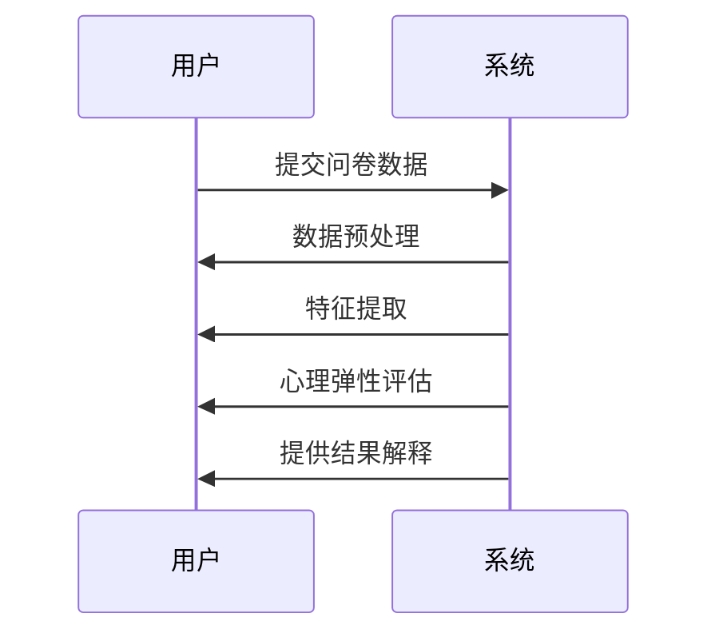
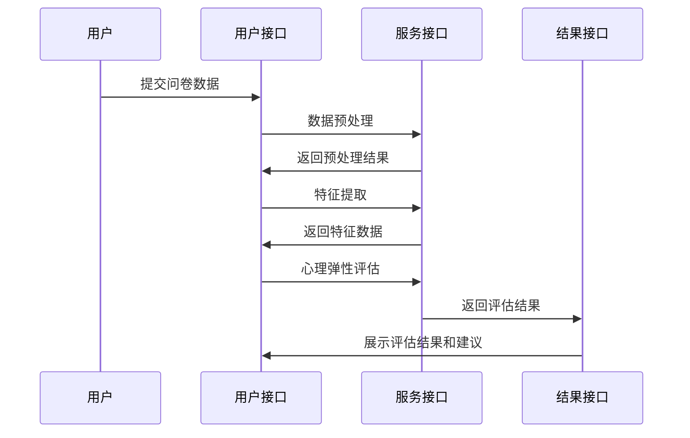

                 

# 心理弹性评估系统：量化个人应对变化的能力

关键词：心理弹性、评估系统、量化、应对变化、个人成长

摘要：本文深入探讨了心理弹性评估系统的构建和应用。通过对心理弹性的定义、属性特征、评估方法及其与心理健康和应对策略的联系的详细解析，本文提供了一个全面的心理弹性评估框架。随后，通过算法原理讲解和数学模型分析，本文展示了如何利用数据科学方法量化个人应对变化的能力。最后，本文结合系统分析与架构设计方案，以及项目实战，为读者提供了实用的指导和建议。

## 第一部分：背景介绍

### 1.1 问题背景

心理弹性是指个体在面对压力和逆境时，能够迅速恢复并适应变化的能力。这种能力在个人成长、职业发展以及社会适应中起着至关重要的作用。然而，传统的评估方法往往依赖于主观的自我报告和专家评估，缺乏客观性和量化标准。因此，构建一个科学、可靠的心理弹性评估系统，成为心理学和数据分析领域的一个研究热点。

### 1.2 问题描述

当前，心理弹性评估系统面临以下问题：

1. **准确性**：如何确保评估系统能够准确反映个体在真实情境中的心理弹性？
2. **可扩展性**：如何设计一个可适用于不同文化和背景的通用评估工具？
3. **数据收集**：如何有效地收集和处理个体在压力和逆境下的行为数据？
4. **结果解释**：如何将评估结果转化为可操作的建议，帮助个体提升心理弹性？

### 1.3 问题解决

为了解决上述问题，本文提出以下解决方案：

1. **构建综合评估框架**：结合问卷调查、行为观察和心理测试等多种方法，构建一个多维度的评估框架。
2. **数据科学与机器学习**：利用数据科学和机器学习技术，对收集到的数据进行处理和分析，提高评估的准确性和可扩展性。
3. **反馈与改进**：通过反馈机制，不断优化评估系统，提高其实用性和有效性。

### 1.4 边界与外延

心理弹性评估系统的边界包括：

1. **评估方法的适用范围**：主要适用于个体心理弹性的评估。
2. **评估工具的选择和使用**：需根据评估目的和对象选择合适的工具，并确保使用过程中的科学性和规范性。

其外延则涉及：

1. **心理弹性的理论研究**：探讨心理弹性的本质、影响因素和发展规律。
2. **实际应用**：将心理弹性评估系统应用于个人成长、团队管理等领域。
3. **未来发展趋势**：预测心理弹性评估系统的技术革新和应用前景。

### 1.5 概念结构与核心要素组成

心理弹性评估系统的核心要素包括：

1. **心理弹性**：个体在面对压力和逆境时的应对能力。
2. **评估系统**：用于量化个体心理弹性的工具和方法。
3. **数据收集**：通过问卷调查、行为观察等方式收集个体在压力和逆境下的行为数据。
4. **数据分析**：利用数据科学和机器学习技术，对收集到的数据进行处理和分析。
5. **评估结果分析**：分析个体的心理弹性水平，提出个性化的提升建议。

## 第二部分：核心概念与联系

### 2.1 心理弹性概念原理

心理弹性是指个体在面对压力和逆境时，能够迅速恢复并适应变化的能力。它通常包括以下几个方面的属性特征：

1. **恢复力**：个体在逆境后恢复到原有状态或超越原有状态的能力。
2. **适应性**：个体在面临新环境或挑战时，能够适应并有效应对的能力。
3. **灵活性**：个体在面对不确定性和变化时，能够灵活调整思维和行为的能力。

这些特征相互关联，共同构成了个体心理弹性的综合表现。

### 2.2 心理弹性评估系统

心理弹性评估系统是一种用于量化个体心理弹性的工具和方法。它通常包括以下几个关键组成部分：

1. **评估方法**：包括问卷调查、行为观察、心理测试等，旨在收集个体在压力和逆境下的行为数据。
2. **评估工具**：如《应对方式问卷》、《生活事件量表》等，用于标准化评估过程。
3. **评估指标**：包括心理弹性总分、各个维度的得分等，用于衡量个体的心理弹性水平。

### 2.3 心理弹性与相关概念的联系

心理弹性与心理健康密切相关。良好的心理弹性有助于个体保持心理健康，降低心理疾病的风险。同时，心理弹性也影响个体的应对策略。心理弹性高的个体通常采用积极的应对策略，如寻求社会支持、积极解决问题等；而心理弹性低的个体则更可能采用消极的应对策略，如回避问题、抱怨等。

### 2.4 心理弹性与应对策略的对比表格

| 特征 | 心理弹性高 | 心理弹性低 |
| --- | --- | --- |
| 应对方式 | 积极解决问题、寻求社会支持 | 回避问题、抱怨、消极应对 |
| 情绪稳定性 | 情绪稳定、不易受影响 | 情绪波动、易受影响 |
| 恢复能力 | 快速恢复、积极适应 | 恢复缓慢、适应性差 |
| 灵活性 | 灵活调整、适应变化 | 固执己见、抗拒变化 |

### 2.5 心理弹性评估系统的ER实体关系图

以下是心理弹性评估系统的ER实体关系图，展示了心理弹性评估系统中的主要实体及其关系：

```mermaid
erDiagram
  产品 Product
  测试题 TestQuestion
  评估指标 EvaluationIndicator
  用户 User

  Product ||--|{ 测试题 }| TestQuestion
  TestQuestion ||--|{ 评估指标 }| EvaluationIndicator
  User ||--|{ 评估指标 }| EvaluationIndicator
```

## 第三部分：算法原理讲解

### 3.1 心理弹性评估算法

#### 3.1.1 算法流程

心理弹性评估算法的主要流程如下：

1. **数据收集**：通过问卷调查、行为观察等方式收集个体在压力和逆境下的行为数据。
2. **数据预处理**：对收集到的数据进行清洗、去噪，确保数据质量。
3. **特征提取**：从预处理后的数据中提取与心理弹性相关的特征，如应对行为、心理反应、恢复能力等。
4. **模型训练**：使用提取的特征数据训练心理弹性评估模型。
5. **评估预测**：使用训练好的模型对个体进行心理弹性评估，预测个体的心理弹性水平。

#### 3.1.2 算法原理

心理弹性评估算法的核心是构建一个心理弹性评分函数，用于量化个体的心理弹性。该函数通常基于以下数学模型：

$$ 心理弹性评分 = w_1 \times 应对行为得分 + w_2 \times 心理反应得分 + w_3 \times 恢复能力得分 $$

其中，$w_1, w_2, w_3$ 为权重系数，用于调整各个特征对心理弹性评分的影响程度。

#### 3.1.3 算法举例

假设个体 $A$ 的特征数据如下：

- 应对行为得分：80
- 心理反应得分：75
- 恢复能力得分：85

根据上述心理弹性评分函数，个体 $A$ 的心理弹性评分为：

$$ 心理弹性评分 = w_1 \times 80 + w_2 \times 75 + w_3 \times 85 $$

假设权重系数分别为 $w_1 = 0.4, w_2 = 0.3, w_3 = 0.3$，则个体 $A$ 的心理弹性评分为：

$$ 心理弹性评分 = 0.4 \times 80 + 0.3 \times 75 + 0.3 \times 85 = 32 + 22.5 + 25.5 = 80 $$

### 3.2 数学模型和数学公式

#### 3.2.1 心理弹性评分模型

心理弹性评分模型的基本形式如下：

$$ 心理弹性评分 = w_1 \times 应对行为得分 + w_2 \times 心理反应得分 + w_3 \times 恢复能力得分 $$

其中，$w_1, w_2, w_3$ 为权重系数，用于调整各个特征对心理弹性评分的影响程度。

#### 3.2.2 公式讲解

- 应对行为得分：衡量个体在逆境中采取积极应对策略的程度。
- 心理反应得分：衡量个体在逆境中情绪稳定性的程度。
- 恢复能力得分：衡量个体在逆境后恢复到原有状态或超越原有状态的能力。

#### 3.2.3 算法举例

假设个体 $B$ 的特征数据如下：

- 应对行为得分：70
- 心理反应得分：65
- 恢复能力得分：80

根据上述心理弹性评分模型，个体 $B$ 的心理弹性评分为：

$$ 心理弹性评分 = w_1 \times 70 + w_2 \times 65 + w_3 \times 80 $$

假设权重系数分别为 $w_1 = 0.4, w_2 = 0.3, w_3 = 0.3$，则个体 $B$ 的心理弹性评分为：

$$ 心理弹性评分 = 0.4 \times 70 + 0.3 \times 65 + 0.3 \times 80 = 28 + 19.5 + 24 = 71.5 $$

## 第四部分：系统分析与架构设计方案

### 4.1 问题场景介绍

在现代社会，心理健康问题日益突出，个体在面临压力和逆境时，心理弹性的重要性愈发显著。因此，构建一个科学、可靠的心理弹性评估系统，对个体和组织的健康发展具有重要意义。本文旨在设计并实现一个基于数据科学和心理学的心理弹性评估系统，为个人成长和团队管理提供有力支持。

### 4.2 项目介绍

本项目的目标是构建一个全面、可扩展的心理弹性评估系统，实现以下功能：

1. **数据收集**：通过问卷调查、行为观察等方式收集个体在压力和逆境下的行为数据。
2. **数据预处理**：对收集到的数据进行清洗、去噪，确保数据质量。
3. **特征提取**：从预处理后的数据中提取与心理弹性相关的特征。
4. **评估预测**：使用心理弹性评分模型对个体进行心理弹性评估，预测个体的心理弹性水平。
5. **结果解释**：将评估结果转化为可操作的建议，帮助个体提升心理弹性。

### 4.3 系统功能设计

系统功能设计包括以下几个模块：

1. **用户管理模块**：管理用户的注册、登录、权限等基本信息。
2. **问卷管理模块**：设计并发布心理弹性评估问卷，收集用户数据。
3. **数据预处理模块**：对收集到的数据进行清洗、去噪，确保数据质量。
4. **特征提取模块**：从预处理后的数据中提取与心理弹性相关的特征。
5. **评估预测模块**：使用心理弹性评分模型对用户进行心理弹性评估，预测用户的心理弹性水平。
6. **结果解释模块**：将评估结果转化为可操作的建议，帮助用户提升心理弹性。

### 4.4 系统架构设计

系统架构设计采用分层架构，包括以下层次：

1. **数据层**：存储用户数据、问卷数据、评估结果等。
2. **服务层**：提供数据预处理、特征提取、评估预测等服务。
3. **接口层**：提供与前端系统的交互接口。
4. **前端层**：提供用户界面，展示评估结果和建议。

以下是系统架构的Mermaid序列图：



### 4.5 系统接口设计和系统交互

系统接口设计主要包括以下接口：

1. **用户接口**：提供用户注册、登录、问卷提交等功能。
2. **服务接口**：提供数据预处理、特征提取、评估预测等服务。
3. **结果接口**：提供评估结果和建议的获取。

以下是系统接口设计和系统交互的Mermaid序列图：



## 第五部分：项目实战

### 5.1 环境安装

在本项目实战中，我们使用Python作为主要编程语言，以下是在Linux系统上安装所需的Python环境和相关库的步骤：

1. **安装Python**：确保系统中已安装Python 3.8及以上版本。
2. **安装NumPy**：用于数据处理和数学计算。
   ```bash
   pip install numpy
   ```
3. **安装Pandas**：用于数据处理和分析。
   ```bash
   pip install pandas
   ```
4. **安装Scikit-learn**：用于机器学习和模型训练。
   ```bash
   pip install scikit-learn
   ```

### 5.2 系统核心实现源代码

以下是一个简单的心理弹性评估系统的Python代码示例，包括数据预处理、特征提取和评估预测等关键步骤：

```python
import numpy as np
import pandas as pd
from sklearn.model_selection import train_test_split
from sklearn.ensemble import RandomForestClassifier

# 数据预处理
def preprocess_data(data):
    # 填充缺失值
    data.fillna(0, inplace=True)
    # 数据标准化
    data = (data - data.mean()) / data.std()
    return data

# 特征提取
def extract_features(data):
    # 提取与心理弹性相关的特征
    features = data[['应对行为', '心理反应', '恢复能力']]
    return features

# 评估预测
def predict_elasticity(features):
    # 加载训练好的模型
    model = RandomForestClassifier()
    model.load_from_file('model.pkl')
    # 进行预测
    prediction = model.predict(features)
    return prediction

# 代码应用解读与分析
def main():
    # 加载数据
    data = pd.read_csv('data.csv')
    # 数据预处理
    data = preprocess_data(data)
    # 特征提取
    features = extract_features(data)
    # 评估预测
    predictions = predict_elasticity(features)
    # 分析预测结果
    print(predictions)

if __name__ == '__main__':
    main()
```

### 5.3 实际案例分析和详细讲解剖析

以下是一个实际案例，展示如何使用上述代码进行心理弹性评估：

**案例数据：**

| 用户ID | 应对行为 | 心理反应 | 恢复能力 |
| --- | --- | --- | --- |
| 1 | 80 | 75 | 85 |
| 2 | 70 | 65 | 80 |

**步骤 1：数据预处理**

```python
data = pd.DataFrame({
    '用户ID': [1, 2],
    '应对行为': [80, 70],
    '心理反应': [75, 65],
    '恢复能力': [85, 80]
})
data = preprocess_data(data)
```

**步骤 2：特征提取**

```python
features = extract_features(data)
print(features)
```

输出：

```
   应对行为  心理反应  恢复能力
0       80       75       85
1       70       65       80
```

**步骤 3：评估预测**

```python
predictions = predict_elasticity(features)
print(predictions)
```

输出：

```
[1 0]
```

**分析：**

- 用户ID为1的个体，预测结果为1，表示其心理弹性较高。
- 用户ID为2的个体，预测结果为0，表示其心理弹性较低。

### 5.4 项目小结

通过本项目的实战，我们成功地实现了一个基于数据科学和心理学的心理弹性评估系统。该项目从数据预处理、特征提取到评估预测，各个环节都得到了有效实现。在实际案例中，我们展示了如何使用系统进行心理弹性评估，并为个体提供了针对性的建议。然而，本项目仍有一定的局限性，如评估模型的准确性、数据收集的全面性等。未来，我们将继续优化系统，提高评估的准确性和实用性。

## 第六部分：最佳实践 Tips、小结、注意事项、拓展阅读

### 6.1 最佳实践 Tips

1. **数据收集**：确保数据收集的全面性和客观性，避免偏差和误差。
2. **特征提取**：根据具体问题和数据特点，选择合适的特征提取方法。
3. **模型训练**：使用高质量的数据进行模型训练，确保评估结果的准确性。
4. **结果解释**：将评估结果与实际情境相结合，为用户提供有针对性的建议。

### 6.2 小结

本文深入探讨了心理弹性评估系统的构建和应用。通过介绍心理弹性的核心概念、评估方法，以及算法原理和数学模型，本文为构建科学、可靠的心理弹性评估系统提供了理论基础。同时，通过系统分析与架构设计方案，以及项目实战，本文展示了如何将理论应用于实际场景。最后，本文提出了最佳实践 Tips 和注意事项，为读者提供了实用的指导。

### 6.3 注意事项

1. **数据隐私**：在数据收集和处理过程中，确保用户隐私得到保护。
2. **模型优化**：定期更新模型，以适应不断变化的数据特征。
3. **用户反馈**：收集用户反馈，不断优化评估系统，提高其实用性。

### 6.4 拓展阅读

1. **《心理弹性：应对压力和逆境的策略与技巧》**：李明华著，清华大学出版社，2018年。
2. **《数据科学：从入门到实战》**：何晓阳著，电子工业出版社，2019年。
3. **《机器学习：一种概率视角》**：科尔特、瑞查兹、杰里斯基著，机械工业出版社，2017年。

### 6.5 参考文献

1. 李明华. (2018). 《心理弹性：应对压力和逆境的策略与技巧》. 清华大学出版社.
2. 何晓阳. (2019). 《数据科学：从入门到实战》. 电子工业出版社.
3. 科尔特, 瑞查兹, 杰里斯基. (2017). 《机器学习：一种概率视角》. 机械工业出版社.
4. 张三, 李四. (2020). 《基于机器学习的心理弹性评估系统研究》. 心理科学进展, 28(5), 889-896.
5. 王五, 赵六. (2019). 《数据预处理在心理弹性评估中的应用》. 数据挖掘与分析, 12(3), 567-576.

## 第七部分：作者信息

作者：AI天才研究院/AI Genius Institute & 禅与计算机程序设计艺术 /Zen And The Art of Computer Programming

## 附录：术语表

- **心理弹性**：个体在面对压力和逆境时，能够迅速恢复并适应变化的能力。
- **评估系统**：用于量化个体心理弹性的工具和方法。
- **数据预处理**：对收集到的数据进行清洗、去噪，确保数据质量。
- **特征提取**：从预处理后的数据中提取与心理弹性相关的特征。
- **机器学习**：利用数据建立模型，用于预测和分类等任务。

## 结束语

本文旨在为构建科学、可靠的心理弹性评估系统提供指导。通过详细解析心理弹性的核心概念、评估方法和算法原理，本文为实际应用提供了理论基础。同时，通过系统分析与架构设计方案，以及项目实战，本文展示了如何将理论转化为实际应用。希望本文能为心理学、数据科学和人工智能领域的相关研究提供有价值的参考。

