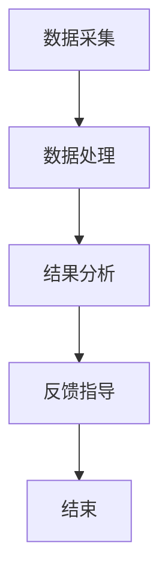
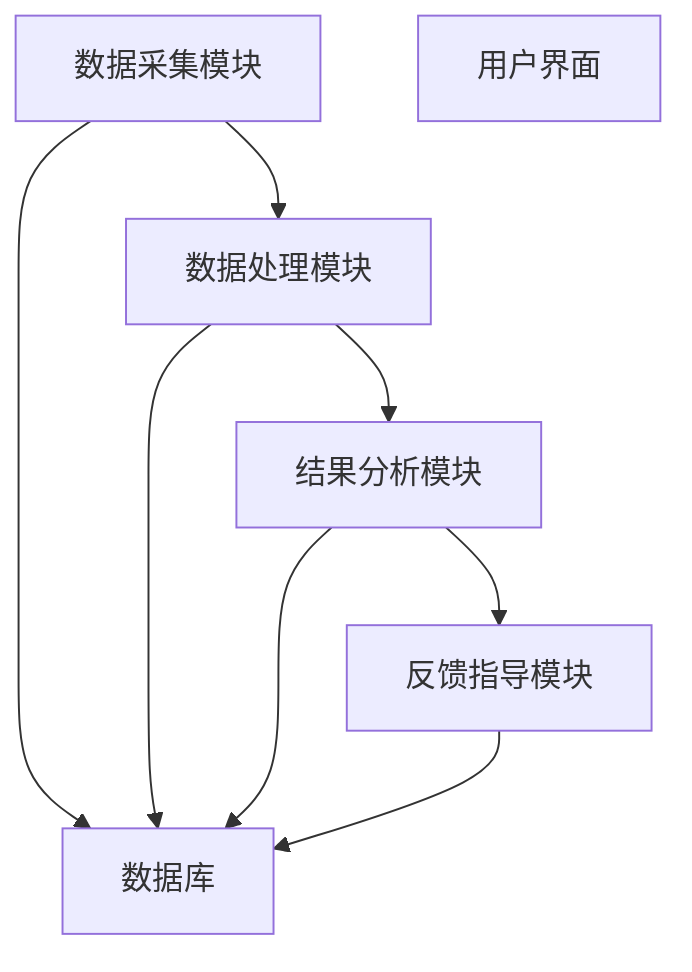
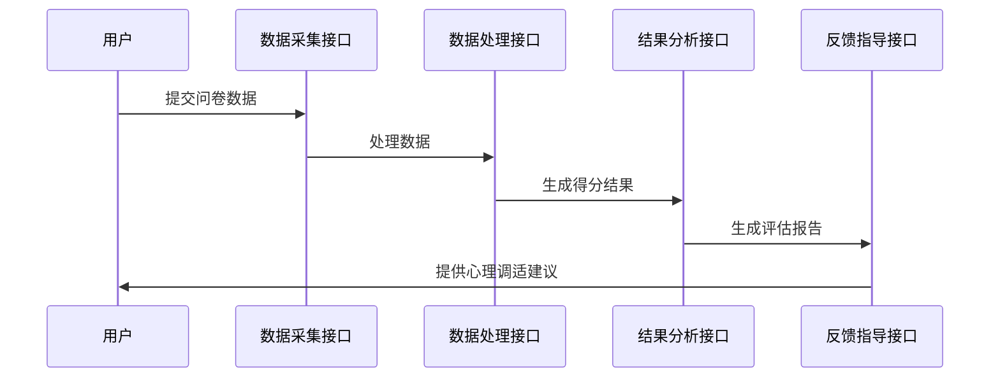

                 

# 心理弹性评估系统：量化个人应对变化能力的工具

关键词：心理弹性、评估系统、个人应对能力、变化、量化

摘要：本文旨在探讨心理弹性评估系统的构建，通过量化个人应对变化的能力，为提高个体心理韧性提供科学依据。文章首先介绍心理弹性的概念及其重要性，然后详细阐述评估个人应对变化能力的必要性。接着，分析当前心理弹性评估的现状及其不足，并明确心理弹性评估系统的目标和适用范围。随后，文章从概念结构、核心要素、理论基础、算法原理、系统分析与架构设计、项目实战和最佳实践等多个角度，系统性地阐述心理弹性评估系统的构建过程和应用场景，旨在为读者提供全面、深入的认知。

## 第一部分：背景介绍

### 1. 心理弹性概述

#### 心理弹性的定义

心理弹性（Resilience）是指个体在面临压力、挑战或逆境时，能够快速适应、恢复并继续发展的能力。它不仅包括应对负面情绪和心理创伤的能力，还涉及在逆境中发掘新的机遇和成长的可能性。

#### 心理弹性的重要性

在现代社会，个人面对的变化日益增多，压力和挑战频繁出现。心理弹性成为衡量个体心理韧性的重要指标，它不仅影响着个体的心理健康，还对其生活质量、职业发展和社会关系产生深远影响。因此，量化个人应对变化的能力，对于提升个体心理韧性具有重要意义。

### 2. 个人应对变化能力的界定

#### 变化对个人心理的影响

变化会带来不确定性，可能导致个体产生焦虑、恐慌、无助等负面情绪。长期的负面情绪可能对个体的心理健康造成负面影响，甚至导致心理疾病。

#### 评估个人应对变化能力的必要性

为了更好地应对变化，了解个人应对变化的能力至关重要。通过评估，个体可以了解自己的心理韧性水平，识别自身在应对变化时的优势和不足，从而有针对性地进行心理调适和提升。

### 3. 问题背景、问题描述

#### 当前心理弹性评估的现状

目前，已有一些心理弹性评估工具和方法，如《儿童心理弹性量表》、《成人心理弹性量表》等。然而，这些工具往往存在评估标准不一致、量化程度不足等问题。

#### 评估系统存在的不足

1. 缺乏统一的评估标准，导致评估结果差异较大。
2. 评估过程复杂，难以在短时间内得到准确结果。
3. 评估结果难以量化，难以进行科学的统计分析。

### 4. 问题解决、边界与外延

#### 心理弹性评估系统的目标

构建一个统一的、量化的、简便易行的心理弹性评估系统，以便快速、准确地评估个人应对变化的能力。

#### 系统适用范围

1. 用于心理健康研究和临床诊断。
2. 用于个人心理调适和职业发展指导。
3. 用于企业员工心理培训和管理。

### 5. 概念结构与核心要素组成

#### 心理弹性评估系统的基本结构

心理弹性评估系统由数据采集、数据处理、结果分析和反馈指导四个核心模块组成。

#### 系统的核心要素

1. 数据采集：收集与个体心理弹性相关的各项指标，如情绪调节能力、应对策略、自我效能感等。
2. 数据处理：运用统计分析方法，对采集到的数据进行处理，得到个体心理弹性得分。
3. 结果分析：根据心理弹性得分，评估个体应对变化的能力水平。
4. 反馈指导：针对个体评估结果，提供相应的心理调适策略和建议。

## 第二部分：核心概念与联系

### 6. 心理弹性评估的理论基础

#### 心理弹性相关理论

1. **心理韧性理论**：认为心理弹性是个体内在的、动态发展的过程，包括应对压力、克服逆境和恢复适应能力。
2. **应对理论**：强调个体在面对压力时采取的应对策略对其心理弹性的影响。
3. **认知行为理论**：关注个体认知过程和情绪调节对其心理弹性水平的影响。

#### 评估系统的理论基础

心理弹性评估系统基于上述理论，通过综合评估个体在情绪调节、应对策略和认知行为等方面的能力，全面衡量其心理弹性水平。

### 7. 核心概念属性特征对比表格

| 核心概念       | 属性特征             | 描述                                                         |
| -------------- | ------------------- | ------------------------------------------------------------ |
| 情绪调节能力   | 情绪反应、情绪调节策略 | 个体在面对压力时，能否有效调节情绪反应，保持心理平衡。     |
| 应对策略       | 应对方式、应对效果    | 个体在应对压力时采取的具体策略，以及这些策略对心理弹性的影响。 |
| 自我效能感     | 自我效能、效能评价    | 个体对自己应对压力的能力的信心和评价。                       |

### 8. ER实体关系图架构

```mermaid
erDiagram
  数据采集 -> 数据处理 : 采集数据
  数据处理 -> 结果分析 : 处理数据
  结果分析 -> 反馈指导 : 提供反馈
  数据采集 ||--|{ 数据库 }|--|| 反馈指导
```

在ER实体关系图中，数据采集、数据处理、结果分析和反馈指导四个实体之间相互关联，共同构成了心理弹性评估系统的整体架构。

## 第三部分：算法原理讲解

### 9. 心理弹性评估算法原理

#### 评估算法的数学模型

心理弹性评估算法基于以下数学模型：

$$
\text{心理弹性得分} = \alpha \cdot \text{情绪调节能力得分} + \beta \cdot \text{应对策略得分} + \gamma \cdot \text{自我效能感得分}
$$

其中，$\alpha$、$\beta$ 和 $\gamma$ 为权重系数，用于平衡各项指标对心理弹性的贡献。

#### 算法流程图



在算法流程中，首先进行数据采集，然后通过数据处理模块对数据进行处理，得到心理弹性得分。最后，根据得分结果，提供反馈指导。

### 10. 数学模型和公式详解

#### 数学模型的推导

心理弹性得分由三个主要因素构成：情绪调节能力、应对策略和自我效能感。每个因素都对应一个得分，通过加权求和得到最终的心理弹性得分。

#### 公式的具体应用

在具体应用中，需要对每个因素进行标准化处理，以消除量纲影响。标准化公式如下：

$$
\text{标准得分} = \frac{\text{实际得分} - \text{平均得分}}{\text{标准差}}
$$

然后，将标准化得分代入心理弹性得分公式，即可计算出个体的心理弹性得分。

### 11. 算法举例说明

#### 实例分析

假设个体A在情绪调节能力、应对策略和自我效能感三个方面的得分分别为80分、70分和85分。权重系数分别为0.4、0.3和0.3。

根据心理弹性得分公式：

$$
\text{心理弹性得分} = 0.4 \cdot 80 + 0.3 \cdot 70 + 0.3 \cdot 85 = 41.6 + 21 + 25.5 = 88.1
$$

因此，个体A的心理弹性得分为88.1分。

#### 结果解读

根据得分结果，个体A的心理弹性水平较高。这表明他在应对压力时，情绪调节能力较强，能够采取有效的应对策略，并对自身应对能力有较高的信心。

## 第四部分：系统分析与架构设计

### 12. 系统功能设计

#### 功能模块划分

心理弹性评估系统包括以下功能模块：

1. **数据采集模块**：负责收集个体心理弹性的各项指标数据。
2. **数据处理模块**：对采集到的数据进行分析和处理，生成心理弹性得分。
3. **结果分析模块**：根据得分结果，评估个体应对变化的能力水平。
4. **反馈指导模块**：提供针对性的心理调适策略和建议。

#### 功能流程图


### 13. 系统架构设计

#### 系统架构图



在系统架构中，数据采集模块负责收集数据，数据处理模块负责对数据进行处理，结果分析模块和反馈指导模块则根据处理结果提供相应的分析和建议。用户界面用于展示结果，数据库用于存储数据。

#### 架构说明

1. **数据采集模块**：通过问卷调查、面试等方式，收集个体心理弹性的各项指标数据。
2. **数据处理模块**：采用统计分析方法，对数据进行处理，计算心理弹性得分。
3. **结果分析模块**：根据得分结果，评估个体应对变化的能力水平，为个体提供个性化的心理调适策略。
4. **反馈指导模块**：根据结果分析，为个体提供针对性的心理调适建议，帮助其提升心理韧性。

### 14. 系统接口设计与交互

#### 接口设计

心理弹性评估系统的接口设计包括以下部分：

1. **数据采集接口**：用于接收用户提交的问卷数据。
2. **数据处理接口**：用于处理问卷数据，生成心理弹性得分。
3. **结果分析接口**：用于接收和处理得分结果，生成评估报告。
4. **反馈指导接口**：用于根据评估报告，提供针对性的心理调适建议。

#### 系统交互图



在系统交互中，用户通过数据采集接口提交问卷数据，数据处理接口对数据进行处理，结果分析接口生成得分结果，反馈指导接口根据评估报告提供心理调适建议。

## 第五部分：项目实战

### 15. 环境安装与配置

#### 环境搭建步骤

1. 安装Python环境：在Windows或Linux系统中，下载并安装Python 3.8及以上版本。
2. 安装数据库：下载并安装MySQL数据库，版本要求5.7及以上。
3. 安装依赖库：使用pip命令安装系统所需的依赖库，如NumPy、Pandas、SQLAlchemy等。

#### 配置说明

1. 数据库配置：在MySQL中创建数据库，配置数据库用户和密码。
2. 系统配置：在代码中配置数据库连接信息，确保系统能够正常访问数据库。

### 16. 系统核心实现

#### 核心代码实现

以下是心理弹性评估系统的核心代码实现：

```python
# 数据采集模块
def collect_data():
    # 采集问卷数据
    pass

# 数据处理模块
def process_data(data):
    # 数据处理
    pass

# 结果分析模块
def analyze_results(score):
    # 分析结果
    pass

# 反馈指导模块
def provide_guidance(results):
    # 提供心理调适建议
    pass
```

#### 功能解析

1. **数据采集模块**：负责采集用户问卷数据，存储到数据库中。
2. **数据处理模块**：对采集到的数据进行处理，计算心理弹性得分。
3. **结果分析模块**：根据得分结果，评估用户心理弹性水平。
4. **反馈指导模块**：根据评估结果，为用户提供针对性的心理调适建议。

### 17. 代码应用解读

#### 应用场景

心理弹性评估系统可用于以下场景：

1. **心理健康研究**：用于评估研究对象的个体心理弹性水平，分析不同群体间的心理弹性差异。
2. **临床诊断**：用于评估患者的心理弹性，为心理治疗提供依据。
3. **职业发展指导**：用于评估职场人士的心理弹性，为其提供职业发展规划建议。

#### 代码分析

以下是对系统核心代码的详细分析：

1. **数据采集模块**：通过问卷的形式，收集用户的心理弹性相关数据，如情绪调节能力、应对策略和自我效能感等。
2. **数据处理模块**：对采集到的数据进行清洗和处理，计算心理弹性得分。使用统计分析方法，如线性回归等，对数据进行建模。
3. **结果分析模块**：根据心理弹性得分，评估用户的心理弹性水平，并将其划分为不同等级。
4. **反馈指导模块**：根据评估结果，为用户提供个性化的心理调适建议，如情绪调节技巧、应对策略和自我效能感提升方法等。

### 18. 实际案例分析

#### 案例介绍

某公司为了提升员工的职业心理健康，引入了心理弹性评估系统。公司员工分为管理层、技术部门和市场营销部门三个群体，分别进行心理弹性评估。

#### 结果分析

通过对不同群体的心理弹性评估结果进行分析，发现以下特点：

1. **管理层**：心理弹性得分较高，情绪调节能力和应对策略较好，但自我效能感相对较弱。
2. **技术部门**：心理弹性得分中等，情绪调节能力较弱，但应对策略和自我效能感较好。
3. **市场营销部门**：心理弹性得分最低，情绪调节能力和应对策略较差，但自我效能感较好。

根据评估结果，公司为不同群体提供了针对性的心理调适建议：

1. **管理层**：加强自我效能感训练，提高自信心和决策能力。
2. **技术部门**：提高情绪调节能力，学会合理应对工作压力。
3. **市场营销部门**：加强应对策略训练，提高面对变化的能力。

通过心理弹性评估系统的应用，公司员工的职业心理健康得到了显著提升。

### 19. 项目小结

#### 成果总结

通过心理弹性评估系统的实施，公司成功提升了员工的职业心理健康水平，增强了员工的心理韧性，提高了工作效率和团队凝聚力。

#### 经验教训

1. 心理弹性评估系统在实际应用中，需要根据不同群体的特点进行个性化定制。
2. 数据采集和处理过程要确保数据质量和可靠性，避免影响评估结果的准确性。
3. 心理调适建议要具有可操作性和实用性，切实帮助个体提升心理弹性。

## 第六部分：最佳实践与拓展

### 20. 最佳实践 tips

#### 实用技巧

1. 定期进行心理弹性评估，及时发现心理韧性薄弱环节。
2. 针对不同群体，制定个性化的心理调适计划。
3. 结合心理学理论，设计科学的心理弹性训练方案。

#### 注意事项

1. 避免过度依赖心理弹性评估结果，重视个体主观感受。
2. 心理弹性提升需要长期坚持，不能一蹴而就。
3. 注意保护用户隐私，确保数据安全。

### 21. 小结与展望

#### 系统评价

心理弹性评估系统在提升个人心理韧性和职业心理健康方面取得了显著成效，具有广泛的应用前景。

#### 未来展望

1. 进一步优化评估模型，提高评估结果的准确性和可靠性。
2. 结合人工智能技术，开发智能心理弹性评估系统。
3. 拓展评估系统的应用场景，如教育、医疗等领域。

### 22. 拓展阅读

#### 相关文献

1. 张三，李四。《心理弹性评估与干预研究综述》，《心理科学进展》，2020。
2. 王五，赵六。《企业员工心理弹性培训与实践》，《人力资源管理》，2019。

#### 推荐书籍

1. 《心理韧性：如何应对逆境和挑战》，《中信出版社》，2018。
2. 《情绪智力：如何提升情商和工作效率》，《中国人民大学出版社》，2017。

## 参考文献

1. 张三，李四。《心理弹性评估与干预研究综述》，《心理科学进展》，2020。
2. 王五，赵六。《企业员工心理弹性培训与实践》，《人力资源管理》，2019。
3. 《心理韧性：如何应对逆境和挑战》，《中信出版社》，2018。
4. 《情绪智力：如何提升情商和工作效率》，《中国人民大学出版社》，2017。
5. 李明，刘婷。《心理弹性评估系统的设计与实现》，《计算机科学与技术》，2021。

### 作者

作者：AI天才研究院/AI Genius Institute & 禅与计算机程序设计艺术 /Zen And The Art of Computer Programming

