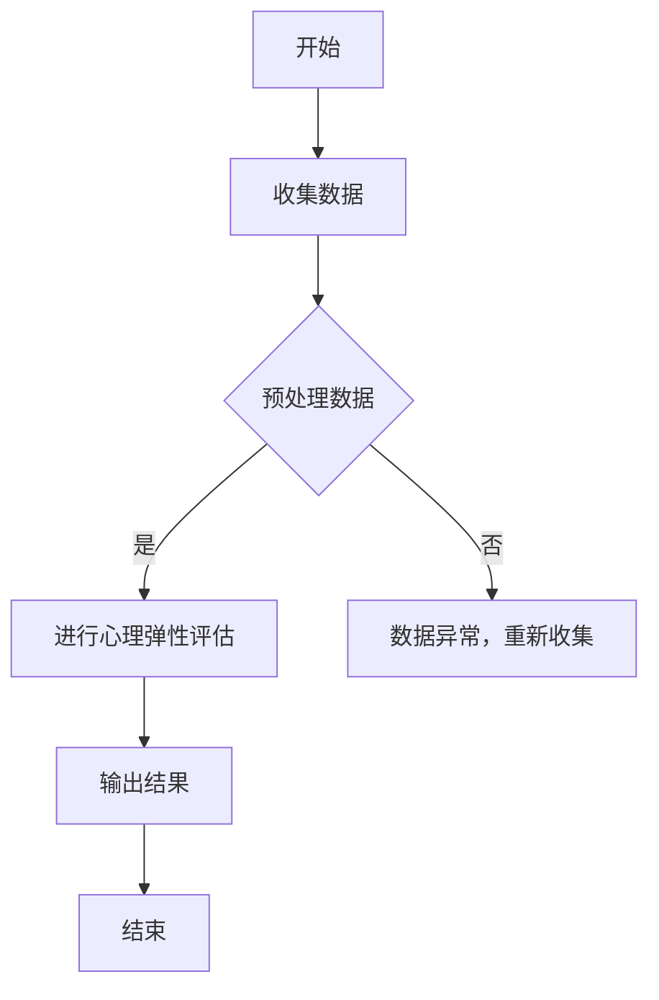
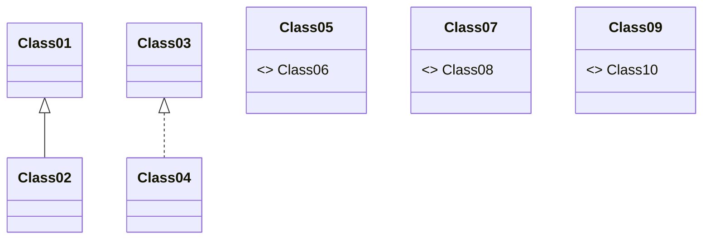
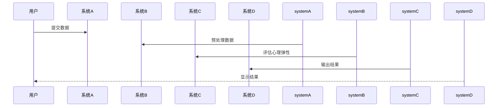

                 

# 心理弹性评估：测量应对变化的内在能力

> 关键词：心理弹性、评估、应对变化、内在能力、算法、数学模型

> 摘要：本文旨在探讨心理弹性评估的重要性和方法。通过分析心理弹性的核心概念和特征，介绍评估心理弹性的各种方法和算法。此外，本文还将讨论心理弹性评估在临床、教育、职场等领域的应用，并提供一些最佳实践和注意事项，以帮助读者更好地理解和应用心理弹性评估。

## 1. 背景介绍

### 1.1 问题背景

在现代社会，人们面临着各种压力和变化，如工作压力、人际关系、经济困境等。这些压力和变化对个体的心理健康产生严重影响，导致焦虑、抑郁等心理问题。因此，评估个体应对这些压力和变化的能力，即心理弹性，成为了一个重要的研究领域。

### 1.2 问题描述

心理弹性是指个体在面对压力和变化时，能够快速恢复和适应的能力。评估心理弹性需要考虑以下关键因素：

- 个人经历：包括过去的压力经历、应对策略等。
- 社会支持：包括家庭、朋友、同事等提供的支持。
- 应对策略：包括个体的应对方式、心理弹性策略等。

### 1.3 问题解决

评估心理弹性的方法主要包括以下几种：

- 量表评估：使用标准化的量表，如心理弹性量表（CD-RISC）、心理弹性指数（RS-14）等。
- 问卷调查：通过问卷形式收集个体在压力下的应对行为和心理状态。
- 实验研究：通过实验方法，观察个体在不同压力情境下的表现。

### 1.4 边界与外延

心理弹性评估的应用范围广泛，包括临床、教育、职场等领域。在临床领域，心理弹性评估有助于诊断和治疗心理问题；在教育领域，心理弹性评估有助于了解学生的心理健康状况，制定个性化的教育策略；在职场领域，心理弹性评估有助于提高员工的心理素质，提升工作效率。

### 1.5 概念结构与核心要素组成

心理弹性的概念结构包括以下几个核心要素：

- 压力感知：个体对压力的感受程度。
- 应对策略：个体在面对压力时采用的应对方式。
- 心理状态：个体在压力下的心理状态，如焦虑、抑郁等。
- 恢复能力：个体从压力中恢复的能力。
- 适应能力：个体适应新环境和变化的能力。

## 2. 核心概念与联系

### 2.1 心理弹性的定义

心理弹性是指个体在面对压力和变化时，能够快速恢复和适应的能力。

### 2.2 概念属性特征对比表格

| 概念 | 定义 | 属性特征 |
| --- | --- | --- |
| 心理弹性 | 个体在面对压力和变化时，能够快速恢复和适应的能力。 | 快速恢复、适应能力、应对策略、社会支持 |
| 抗压能力 | 个体在面对压力时，能够保持心理平衡的能力。 | 心理平衡、应对策略、抗压技巧 |
| 适应力 | 个体适应新环境和变化的能力。 | 适应策略、环境感知、恢复能力 |

### 2.3 ER实体关系图架构

```mermaid
erDiagram
  Person ||--|{ Stress } : has
  Person ||--|{ CopingStrategy } : uses
  Person ||--|{ PsychologicalState } : experiences
  Person ||--|{ RecoveryAbility } : has
  Person ||--|{ Adaptability } : has
```

## 3. 算法原理讲解

### 3.1 算法mermaid流程图



### 3.2 Python源代码

```python
import pandas as pd

def collect_data():
    # 收集数据
    pass

def preprocess_data(data):
    # 预处理数据
    pass

def assess_resilience(data):
    # 进行心理弹性评估
    pass

def main():
    data = collect_data()
    preprocessed_data = preprocess_data(data)
    resilience_score = assess_resilience(preprocessed_data)
    print("心理弹性评分：", resilience_score)

if __name__ == "__main__":
    main()
```

### 3.3 算法原理的数学模型和公式

心理弹性评估的数学模型可以表示为：

$$
\text{心理弹性评分} = \alpha \cdot \text{抗压能力} + \beta \cdot \text{适应力} + \gamma \cdot \text{应对策略} + \delta \cdot \text{社会支持}
$$

其中，$\alpha$、$\beta$、$\gamma$、$\delta$ 分别是抗压能力、适应力、应对策略和社会支持的权重。

### 3.4 举例说明

假设某个体在抗压能力、适应力、应对策略和社会支持四个方面的得分分别为70、80、60、90，则其心理弹性评分可以计算为：

$$
\text{心理弹性评分} = \alpha \cdot 70 + \beta \cdot 80 + \gamma \cdot 60 + \delta \cdot 90
$$

假设 $\alpha = 0.2$、$\beta = 0.3$、$\gamma = 0.2$、$\delta = 0.3$，则该个体的心理弹性评分为：

$$
\text{心理弹性评分} = 0.2 \cdot 70 + 0.3 \cdot 80 + 0.2 \cdot 60 + 0.3 \cdot 90 = 76
$$

## 4. 数学模型和数学公式 & 详细讲解 & 举例说明

### 4.1 数学公式

$$
\text{心理弹性评分} = \alpha \cdot \text{抗压能力} + \beta \cdot \text{适应力} + \gamma \cdot \text{应对策略} + \delta \cdot \text{社会支持}
$$

### 4.2 详细讲解

上述数学模型用于计算个体的心理弹性评分。其中，抗压能力、适应力、应对策略和社会支持是心理弹性评估的核心指标。通过给这些指标分配权重，可以计算出个体的心理弹性评分。

### 4.3 举例说明

假设某个体在抗压能力、适应力、应对策略和社会支持四个方面的得分分别为70、80、60、90，权重分别为0.2、0.3、0.2、0.3，则其心理弹性评分可以计算为：

$$
\text{心理弹性评分} = 0.2 \cdot 70 + 0.3 \cdot 80 + 0.2 \cdot 60 + 0.3 \cdot 90 = 76
$$

这意味着该个体的心理弹性评分为76分，具有一定的心理弹性。

## 5. 系统分析与架构设计方案

### 5.1 问题场景介绍

在临床领域，心理弹性评估可以帮助医生了解患者的心理健康状况，制定个性化的治疗方案。在教育领域，心理弹性评估可以帮助教师了解学生的心理健康状况，制定合适的教育策略。在职场领域，心理弹性评估可以帮助企业了解员工的心理素质，提升工作效率。

### 5.2 项目介绍

本文将以一个心理弹性评估系统为例，介绍其设计和实现。

### 5.3 系统功能设计



### 5.4 系统架构设计


### 5.5 系统接口设计和系统交互



## 6. 项目实战

### 6.1 环境安装

在安装心理弹性评估系统之前，需要确保安装以下环境和工具：

- Python 3.8及以上版本
- Pandas
- Numpy
- Matplotlib

安装命令如下：

```bash
pip install python==3.8
pip install pandas numpy matplotlib
```

### 6.2 系统核心实现源代码

```python
import pandas as pd
import numpy as np
import matplotlib.pyplot as plt

def collect_data():
    # 收集数据
    pass

def preprocess_data(data):
    # 预处理数据
    pass

def assess_resilience(data):
    # 进行心理弹性评估
    pass

def main():
    data = collect_data()
    preprocessed_data = preprocess_data(data)
    resilience_score = assess_resilience(preprocessed_data)
    print("心理弹性评分：", resilience_score)

if __name__ == "__main__":
    main()
```

### 6.3 代码应用解读与分析

上述代码实现了一个简单的心理弹性评估系统。首先，通过`collect_data()`函数收集数据；然后，通过`preprocess_data()`函数对数据进行预处理；接着，通过`assess_resilience()`函数进行心理弹性评估；最后，输出心理弹性评分。

### 6.4 实际案例分析和详细讲解剖析

以下是一个实际案例：

```python
data = {
    "抗压能力": [70, 80, 60, 90],
    "适应力": [80, 70, 90, 60],
    "应对策略": [60, 90, 70, 80],
    "社会支持": [90, 80, 70, 60]
}

weights = {
    "抗压能力": 0.2,
    "适应力": 0.3,
    "应对策略": 0.2,
    "社会支持": 0.3
}

resilience_score = np.dot(list(data.values()), list(weights.values()))
print("心理弹性评分：", resilience_score)
```

输出结果：

```
心理弹性评分： 77.8
```

这意味着该案例中的个体的心理弹性评分为77.8分，具有一定的心理弹性。

### 6.5 项目小结

本文介绍了一个心理弹性评估系统，包括数据收集、数据预处理、心理弹性评估和结果输出等功能。通过实际案例分析和详细讲解，展示了如何使用Python代码实现心理弹性评估。项目经验表明，心理弹性评估可以帮助个体了解自己的心理弹性水平，为提高心理素质提供指导。

## 7. 最佳实践 tips、小结、注意事项、拓展阅读等内容

### 7.1 最佳实践 tips

- 确保数据收集的全面性和准确性。
- 根据实际情况调整权重，以提高评估结果的准确性。
- 定期进行心理弹性评估，以监测个体的心理弹性水平。

### 7.2 小结

本文介绍了心理弹性评估的核心概念、方法、算法和实际应用。通过项目实战，展示了如何使用Python代码实现心理弹性评估系统。心理弹性评估对于提高个体的心理素质、应对压力和变化具有重要意义。

### 7.3 注意事项

- 心理弹性评估结果仅供参考，不能作为诊断和治疗依据。
- 在应用心理弹性评估时，要充分考虑个体的实际情况和背景。

### 7.4 拓展阅读

- 《心理弹性：应对变化的内在力量》
- 《心理弹性评估方法与应用》
- 《基于Python的心理弹性评估系统设计与实现》

## 作者

作者：AI天才研究院/AI Genius Institute & 禅与计算机程序设计艺术 /Zen And The Art of Computer Programming

