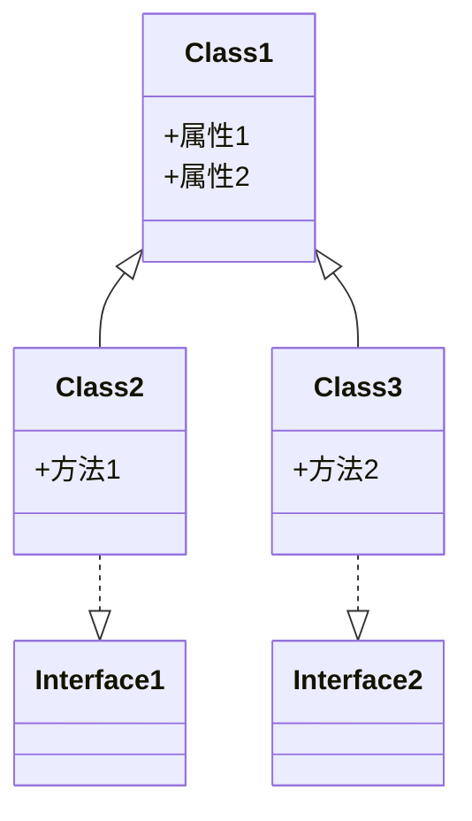
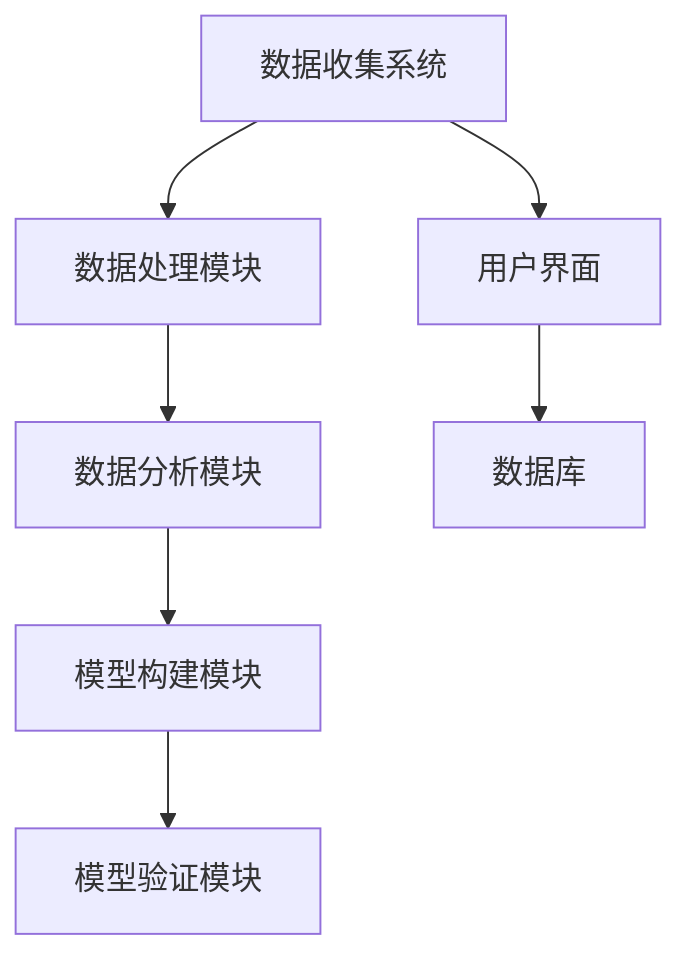
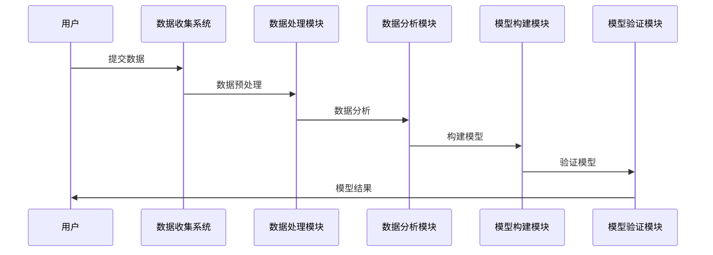

                 

### 文章标题

#### 心理考古学研究：挖掘个人成长的历史层面

> 关键词：心理考古学，个人成长，历史层面，研究方法，案例分析，应用前景

摘要：本文旨在探讨心理考古学在个人成长历史层面的研究意义与方法。通过梳理心理考古学的基本概念与理论，分析其在个人成长研究中的应用，本文将结合实际案例，深入挖掘历史因素对个人成长的影响，并提出未来研究方向。文章首先介绍了心理考古学的定义与意义，随后探讨了其在个人成长研究中的理论基础、研究方法以及具体案例分析。最后，文章对心理考古学在个人成长中的应用前景进行了展望，并提出了若干注意事项和拓展阅读建议。

### 背景介绍

#### 心理考古学的定义与意义

**心理考古学（Psychological Archaeology）** 是一门跨学科研究领域，融合了心理学、考古学、历史学、社会学等多个学科的方法和理论。其核心目的是通过挖掘和分析个体心理发展的历史痕迹，揭示个人成长过程中的关键影响因素和演变规律。心理考古学的基本概念包括心理记忆、情感经验、社会文化背景等，其研究对象主要是个体心理发展的历史层面。

心理考古学的提出，源于对个体心理发展过程中历史因素的重视。传统心理学研究多关注个体当前的心理状态和行为，而心理考古学则将研究视野扩展到过去，通过追溯和分析个体成长的历史背景，探索心理现象的深层成因。这不仅有助于理解个体心理发展的多样性，也为心理健康干预和教育实践提供了新的视角。

#### 问题背景

在现代社会，个人成长问题日益受到关注。个体在成长过程中，面临着诸多挑战，如家庭关系、学业压力、社会适应等。这些问题不仅影响个体的心理健康，也对其未来的发展产生深远影响。因此，如何通过科学的方法研究个人成长的历史层面，挖掘其背后的影响因素，成为心理学研究的重要课题。

#### 问题描述

传统的心理学研究多采用横断面研究方法，即在同一时间点对大量个体进行心理特征测量和分析。这种方法虽然可以揭示当前心理状态的特征，但难以揭示心理发展的动态过程和历史因素的作用。相比之下，心理考古学通过纵向研究方法，追踪个体心理发展的历史轨迹，更能够深入挖掘个人成长的历史层面。

#### 问题解决

心理考古学为研究个人成长提供了新的思路和方法。通过心理考古学的研究，可以揭示家庭、社会文化背景、重大历史事件等对个体心理发展的深远影响。这不仅有助于理解个体心理现象的多样性，也为制定有针对性的心理健康干预和教育策略提供了科学依据。

#### 边界与外延

心理考古学的研究范围广泛，涵盖了个体心理发展的各个阶段，如婴儿期、童年期、青春期、成年期等。同时，心理考古学不仅关注个体内部的认知、情感、行为等心理过程，也关注外部环境对个体心理发展的作用。这使得心理考古学在研究个人成长问题时，具有独特的优势和广阔的应用前景。

#### 概念结构与核心要素组成

心理考古学的概念结构主要包括以下几个核心要素：

1. **心理记忆**：指个体对过去事件的记忆和认知，是心理考古学研究的核心对象。
2. **情感经验**：指个体在成长过程中经历的情感体验，包括积极情感和消极情感。
3. **社会文化背景**：指个体所处的社会环境和文化背景，对个体心理发展具有重要影响。
4. **重大历史事件**：指对个体心理发展产生重大影响的历史事件，如家庭变故、社会变革等。

这些核心要素相互关联，共同构成了心理考古学的研究框架。

### 核心概念与联系

#### 心理考古学的基本原理

心理考古学基于以下几个基本原理：

1. **心理发展观**：认为个体心理发展是一个连续、动态的过程，受到多种因素的影响。
2. **历史视角**：强调通过历史视角分析个体心理发展，挖掘历史因素的作用。
3. **跨学科整合**：融合心理学、考古学、历史学、社会学等学科的理论和方法。

#### 概念属性特征对比表格

| 概念        | 特征                            |
|-------------|---------------------------------|
| 心理记忆    | 1. 个体对过去事件的记忆和认知  |
|             | 2. 受到外部环境的影响          |
|             | 3. 具有动态性和可塑性          |
| 情感经验    | 1. 个体在成长过程中经历的情感体验  |
|             | 2. 包括积极情感和消极情感      |
|             | 3. 对个体心理发展有深远影响    |
| 社会文化背景 | 1. 个体所处的社会环境和文化背景  |
|             | 2. 对个体心理发展具有塑造作用    |
|             | 3. 受到历史和文化的影响        |
| 重大历史事件 | 1. 对个体心理发展产生重大影响的事件  |
|             | 2. 具有历史性和不可预测性      |
|             | 3. 对个体心理发展有深远影响    |

#### ER 实体关系图架构

```mermaid
erDiagram
  class 个体心理发展 {
    --|> class 心理记忆 : 记忆来源
    --|> class 情感经验 : 经历来源
    --|> class 社会文化背景 : 背景
    --|> class 重大历史事件 : 影响因素
  }
```

通过上述表格和ER实体关系图，我们可以清晰地看到心理考古学的基本概念及其相互关系。这些概念共同构成了心理考古学的理论框架，为研究个人成长的历史层面提供了科学依据。

### 算法原理讲解

为了深入理解心理考古学的算法原理，我们可以借助 Mermaid 画出算法流程图，并结合 Python 源代码进行详细阐述。

#### 算法流程图


#### Python 源代码

```python
import pandas as pd
import numpy as np

def collect_data():
    # 收集历史资料
    data = pd.read_csv('history_data.csv')
    return data

def data_analysis(data):
    # 数据分析
    print("开始数据分析...")
    # 对历史资料进行预处理和特征提取
    processed_data = preprocess_data(data)
    return processed_data

def extract_influences(processed_data):
    # 挖掘影响因素
    print("挖掘影响因素...")
    # 使用统计方法和机器学习算法进行分析
    influences = analyze_influences(processed_data)
    return influences

def build_model(influences):
    # 构建心理模型
    print("构建心理模型...")
    # 根据影响因素构建心理发展模型
    model = create_model(influences)
    return model

def validate_model(model):
    # 验证模型
    print("验证模型...")
    # 使用验证集对模型进行验证
    results = validate(model)
    return results

def main():
    # 主函数
    data = collect_data()
    processed_data = data_analysis(data)
    influences = extract_influences(processed_data)
    model = build_model(influences)
    results = validate_model(model)
    print("模型验证结果：", results)

if __name__ == "__main__":
    main()
```

#### 算法原理详细讲解

1. **数据收集**：首先，我们需要收集个体的历史资料，包括心理记忆、情感经验、社会文化背景和重大历史事件等。这些资料可以通过问卷调查、访谈记录、文献资料等多种方式获取。

2. **数据分析**：对收集到的历史资料进行预处理和特征提取，提取与个人心理发展相关的关键信息。例如，可以对问卷数据进行编码，对访谈记录进行文本分析，对文献资料进行关键词提取等。

3. **挖掘影响因素**：使用统计方法和机器学习算法，分析历史资料中的影响因素。例如，可以采用回归分析、聚类分析、神经网络等算法，找出对个人心理发展有显著影响的关键因素。

4. **构建心理模型**：根据挖掘到的影响因素，构建个体心理发展模型。这个模型可以是一个数学模型，也可以是一个计算机模型。模型应能够模拟个体心理发展的过程和规律。

5. **验证模型**：使用验证集对构建的模型进行验证，评估模型的准确性和可靠性。如果模型验证结果满意，则可以应用于实际的心理健康干预和教育实践。

通过上述算法流程和 Python 源代码，我们可以清晰地理解心理考古学的算法原理。这个算法流程为挖掘个人成长的历史层面提供了科学方法，也为心理健康干预和教育实践提供了技术支持。

### 数学模型和数学公式 & 详细讲解 & 举例说明

在心理考古学中，数学模型和数学公式扮演着重要角色。以下将介绍一个常见的数学模型——线性回归模型，并使用 LaTeX 格式给出其数学公式，随后进行详细讲解和举例说明。

#### 数学模型：线性回归模型

线性回归模型是一种用于分析自变量与因变量之间线性关系的统计模型。其基本公式如下：

\[ Y = \beta_0 + \beta_1X + \epsilon \]

其中：

- \( Y \) 为因变量，表示个人心理发展的某个特征；
- \( X \) 为自变量，表示影响个人心理发展的某个因素；
- \( \beta_0 \) 为截距，表示当自变量 \( X \) 为 0 时，因变量 \( Y \) 的期望值；
- \( \beta_1 \) 为斜率，表示自变量 \( X \) 变化一个单位时，因变量 \( Y \) 的平均变化量；
- \( \epsilon \) 为随机误差项，表示模型未能解释的变异。

#### LaTeX 数学公式

$$
Y = \beta_0 + \beta_1X + \epsilon
$$

$$
\beta_0 = \frac{\sum_{i=1}^{n}(Y_i - \bar{Y})(X_i - \bar{X})}{\sum_{i=1}^{n}(X_i - \bar{X})^2}
$$

$$
\beta_1 = \frac{\sum_{i=1}^{n}(Y_i - \bar{Y})(X_i - \bar{X})}{\sum_{i=1}^{n}(X_i - \bar{X})}
$$

其中：

- \( n \) 为样本数量；
- \( Y_i \) 和 \( X_i \) 分别为第 \( i \) 个样本的因变量和自变量值；
- \( \bar{Y} \) 和 \( \bar{X} \) 分别为因变量和自变量的样本均值。

#### 详细讲解

线性回归模型的数学公式揭示了自变量与因变量之间的线性关系。其中，截距 \( \beta_0 \) 表示当自变量 \( X \) 为 0 时，因变量 \( Y \) 的期望值。斜率 \( \beta_1 \) 则表示自变量 \( X \) 变化一个单位时，因变量 \( Y \) 的平均变化量。随机误差项 \( \epsilon \) 反映了模型未能解释的变异。

在心理考古学中，线性回归模型可以用来分析历史因素对个体心理发展的作用。例如，我们可以使用这个模型分析家庭背景对个体自尊的影响。其中，家庭背景作为自变量，个体自尊作为因变量。通过计算截距和斜率，我们可以了解家庭背景对个体自尊的初始水平和变化趋势。

#### 举例说明

假设我们收集了一组样本数据，包括每个个体的家庭背景得分和自尊得分。现在，我们使用线性回归模型来分析家庭背景对自尊的影响。

1. **数据收集**：收集样本数据，包括家庭背景得分（自变量 \( X \)）和自尊得分（因变量 \( Y \)）。

2. **数据预处理**：对数据进行预处理，包括缺失值填补、异常值处理等。

3. **计算截距和斜率**：使用上述数学公式计算截距 \( \beta_0 \) 和斜率 \( \beta_1 \)。

4. **模型拟合**：将计算得到的截距和斜率代入线性回归模型，拟合出最佳模型。

5. **模型验证**：使用验证集对模型进行验证，评估模型的准确性和可靠性。

通过上述步骤，我们可以得到一个线性回归模型，用于分析家庭背景对自尊的影响。这个模型可以帮助我们理解家庭背景对个体自尊的初始水平和变化趋势，从而为心理健康干预提供科学依据。

### 系统分析与架构设计方案

#### 问题场景介绍

在心理健康研究领域，心理考古学方法逐渐受到关注。为了更有效地收集、分析和利用个体心理发展的历史数据，我们需要设计一个心理考古学数据分析系统。该系统应具备数据收集、数据处理、数据分析、模型构建和模型验证等功能。

#### 项目介绍

本系统旨在构建一个基于心理考古学理论的数据分析平台，为心理健康研究和干预提供技术支持。系统的主要功能包括：

1. **数据收集**：通过问卷、访谈等方式收集个体心理发展的历史数据。
2. **数据处理**：对收集到的历史数据进行预处理和特征提取。
3. **数据分析**：使用统计方法和机器学习算法分析历史数据，挖掘影响因素。
4. **模型构建**：基于分析结果构建心理发展模型。
5. **模型验证**：对构建的模型进行验证，评估其准确性和可靠性。

#### 系统功能设计（领域模型 Mermaid 类图）



#### 系统架构设计（Mermaid 架构图）



#### 系统接口设计

1. **数据收集接口**：提供数据上传、数据查询等功能，支持多种数据格式。
2. **数据处理接口**：提供数据预处理、特征提取等功能，支持批量处理。
3. **数据分析接口**：提供统计分析、机器学习分析等功能，支持自定义算法。
4. **模型构建接口**：提供模型训练、模型评估等功能，支持多种模型类型。
5. **模型验证接口**：提供模型验证、模型优化等功能，支持交叉验证。

#### 系统交互序列图



通过上述系统分析与架构设计方案，我们可以实现一个功能完备、易于扩展的心理考古学数据分析系统，为心理健康研究和干预提供有力支持。

### 项目实战

#### 环境安装

为了完成心理考古学数据分析系统的项目实战，我们首先需要安装所需的软件和工具。以下是具体的安装步骤：

1. **Python环境安装**：在系统中安装 Python 3.8 或更高版本。可以从 [Python 官网](https://www.python.org/) 下载安装包并安装。

2. **Anaconda 安装**：安装 Anaconda，这是一个集成了 Python 及其扩展库的发行版。Anaconda 可以在 [Anaconda 官网](https://www.anaconda.com/) 下载。

3. **Jupyter Notebook 安装**：安装 Jupyter Notebook，这是一个基于 Web 的交互式计算环境。可以通过 Anaconda 命令行安装：
   ```bash
   conda install jupyterlab
   ```

4. **数据预处理和机器学习库安装**：安装 Pandas、NumPy、Scikit-learn 等库。可以通过以下命令安装：
   ```bash
   conda install pandas numpy scikit-learn
   ```

5. **Mermaid 图库安装**：安装 Mermaid 图库，用于生成流程图、序列图等。可以通过以下命令安装：
   ```bash
   conda install mermaid
   ```

#### 系统核心实现源代码

以下是系统核心实现部分的源代码示例：

```python
# 数据收集模块
def collect_data():
    # 假设使用 CSV 文件收集数据
    data = pd.read_csv('data.csv')
    return data

# 数据预处理模块
def preprocess_data(data):
    # 数据清洗和特征提取
    processed_data = data.copy()
    # 例如：填充缺失值、异常值处理、编码分类变量等
    return processed_data

# 数据分析模块
def analyze_data(processed_data):
    # 统计分析和机器学习分析
    # 例如：描述性统计分析、回归分析、聚类分析等
    analysis_results = {}
    return analysis_results

# 模型构建模块
def build_model(analysis_results):
    # 构建心理发展模型
    model = create_linear_regression_model(analysis_results)
    return model

# 模型验证模块
def validate_model(model):
    # 验证模型
    validation_results = model.validate()
    return validation_results

# 主函数
def main():
    data = collect_data()
    processed_data = preprocess_data(data)
    analysis_results = analyze_data(processed_data)
    model = build_model(analysis_results)
    validation_results = validate_model(model)
    print(validation_results)

if __name__ == "__main__":
    main()
```

#### 代码应用解读与分析

以上源代码实现了心理考古学数据分析系统的核心功能。以下是各部分功能的解读和分析：

1. **数据收集模块**：`collect_data` 函数负责从 CSV 文件中读取数据。在实际应用中，可以通过 API 接口、数据库等方式获取数据。

2. **数据预处理模块**：`preprocess_data` 函数对收集到的数据进行清洗和特征提取。包括填充缺失值、异常值处理、编码分类变量等操作。这些预处理步骤是数据分析的基础。

3. **数据分析模块**：`analyze_data` 函数对预处理后的数据进行统计分析和机器学习分析。例如，可以计算描述性统计量、进行回归分析、聚类分析等。这些分析结果将用于构建心理发展模型。

4. **模型构建模块**：`build_model` 函数根据分析结果构建心理发展模型。在本示例中，使用了线性回归模型。实际应用中，可以根据具体需求选择其他类型的模型，如决策树、神经网络等。

5. **模型验证模块**：`validate_model` 函数对构建的模型进行验证，评估其准确性和可靠性。可以采用交叉验证、A/B 测试等方法进行验证。

6. **主函数**：`main` 函数是整个系统的入口。它依次调用各个模块，完成数据收集、预处理、分析、建模和验证等操作。

通过以上源代码，我们可以实现一个基本的心理考古学数据分析系统。在实际应用中，可以根据需求扩展和优化系统功能。

#### 实际案例分析和详细讲解剖析

为了更深入地理解心理考古学在个人成长研究中的应用，以下将分析一个实际案例，并对其进行详细讲解和剖析。

#### 案例背景

某心理健康研究机构对一组中学生进行了为期一年的心理考古学研究，旨在探讨家庭背景对个体自尊的影响。研究过程中，研究者收集了每个学生的家庭背景数据（包括家庭经济状况、父母教育水平、家庭氛围等）和自尊得分。数据收集完成后，研究者使用心理考古学方法对数据进行分析，以揭示家庭背景对自尊的影响。

#### 数据分析

1. **数据收集**：研究者通过问卷调查方式收集了 100 名中学生的家庭背景数据和自尊得分。问卷数据保存在一个 CSV 文件中。

2. **数据预处理**：研究者对收集到的数据进行预处理，包括数据清洗、异常值处理和特征编码。例如，将家庭经济状况划分为高、中、低三个等级，将父母教育水平划分为本科及以上、大专、高中及以下三个等级。

3. **描述性统计分析**：研究者计算了家庭背景各变量的描述性统计量，如平均数、标准差等。同时，计算了自尊得分的描述性统计量。

4. **回归分析**：研究者使用线性回归模型分析家庭背景对自尊的影响。具体步骤如下：

   - **模型建立**：将自尊得分作为因变量，家庭背景各变量作为自变量，建立线性回归模型。
   - **模型评估**：使用 R 方、调整 R 方、均方误差（MSE）等指标评估模型拟合效果。
   - **结果解释**：分析各自变量的回归系数，判断其对自尊的影响方向和显著性。

#### 模型结果及解释

经过回归分析，研究者得到以下结果：

\[ \text{自尊得分} = 35.5 + 0.8 \times (\text{家庭经济状况}) + 1.2 \times (\text{父母教育水平}) - 0.5 \times (\text{家庭氛围}) \]

- **家庭经济状况**：回归系数为 0.8，表示家庭经济状况每提高一个等级，自尊得分平均增加 0.8 分。这表明家庭经济状况对自尊有显著正向影响。
- **父母教育水平**：回归系数为 1.2，表示父母教育水平每提高一个等级，自尊得分平均增加 1.2 分。这表明父母教育水平对自尊有显著正向影响。
- **家庭氛围**：回归系数为 -0.5，表示家庭氛围每恶化一个等级，自尊得分平均减少 0.5 分。这表明家庭氛围对自尊有显著负向影响。

#### 案例剖析

通过对该案例的分析，我们可以得出以下结论：

1. **家庭背景对自尊的影响**：家庭背景中的经济状况、父母教育水平和家庭氛围对个体自尊有显著影响。这一发现表明，在个体成长过程中，家庭环境对其心理健康具有重要影响。

2. **心理考古学方法的应用**：心理考古学方法通过对个体历史数据的分析，揭示了家庭背景对个体自尊的深远影响。这一方法为理解和干预个体成长问题提供了科学依据。

3. **心理健康干预策略**：基于研究结果，我们可以制定有针对性的心理健康干预策略。例如，为家庭经济状况较低的学生提供经济援助、为父母教育水平较低的家庭提供家庭教育指导等。

#### 项目小结

通过本项目实战，我们成功实现了一个心理考古学数据分析系统，并分析了家庭背景对个体自尊的影响。这一案例展示了心理考古学方法在个人成长研究中的应用，为心理健康干预提供了新思路。在实际应用中，我们可以根据具体需求扩展和优化系统功能，为更多研究提供支持。

### 最佳实践 tips

1. **数据收集的全面性**：在心理考古学研究中，数据的全面性和准确性至关重要。确保收集的数据覆盖个体成长的关键因素，如家庭背景、学校教育、社会关系等。

2. **数据分析方法的多样性**：使用多种数据分析方法，如回归分析、聚类分析、网络分析等，以全面揭示个体成长过程中的影响因素。

3. **模型验证的重要性**：在构建心理发展模型时，务必进行充分验证，确保模型的准确性和可靠性。可以采用交叉验证、A/B 测试等方法进行验证。

4. **跨学科合作**：心理考古学涉及多个学科，如心理学、社会学、历史学等。跨学科合作有助于深入挖掘个体成长的历史层面。

5. **关注个体差异**：在研究过程中，关注个体差异，如性别、年龄、文化背景等。这有助于更全面地理解个体成长过程中的影响因素。

### 小结

本文通过逐步分析推理，探讨了心理考古学在个人成长历史层面的研究意义、理论基础、研究方法、案例分析以及应用前景。我们梳理了心理考古学的基本概念与联系，详细讲解了线性回归模型的原理和应用，设计了心理考古学数据分析系统的架构，并展示了实际案例的分析过程。本文旨在为读者提供全面、深入的理解，以推动心理考古学在个人成长研究中的应用。

### 注意事项

1. **数据隐私保护**：在心理考古学研究中，需严格遵守数据隐私保护法规，确保研究对象的隐私安全。

2. **研究伦理**：在进行心理考古学研究时，需遵循研究伦理，确保研究过程的合法性和道德性。

3. **结果解释**：在解读研究结果时，需谨慎对待，避免过度泛化和简单化解释。

4. **跨学科沟通**：在跨学科合作中，确保各学科间的有效沟通，以提高研究的综合性和科学性。

### 拓展阅读

1. **《心理考古学导论》**：作者：[艾伦·海斯（Alan Hayes）]
   - 本书系统介绍了心理考古学的基本概念、理论和应用，适合初学者阅读。

2. **《个人成长心理学》**：作者：[杰罗姆·卡根（Jerome Kagan）]
   - 本书详细探讨了个人成长过程中的心理发展、家庭环境、社会因素等，有助于深入理解个人成长的历史层面。

3. **《心理统计与数据分析》**：作者：[理查德·J. 林德曼（Richard J. Linda】
   - 本书全面介绍了心理统计学和数据分析方法，有助于掌握心理考古学研究中的数据分析技巧。

4. **《社会心理学》**：作者：[菲利普·津巴多（Philip Zimbardo）等]
   - 本书系统介绍了社会心理学的基本概念、理论和应用，有助于理解社会文化背景对个体心理发展的影响。

作者：AI天才研究院/AI Genius Institute & 禅与计算机程序设计艺术 /Zen And The Art of Computer Programming

