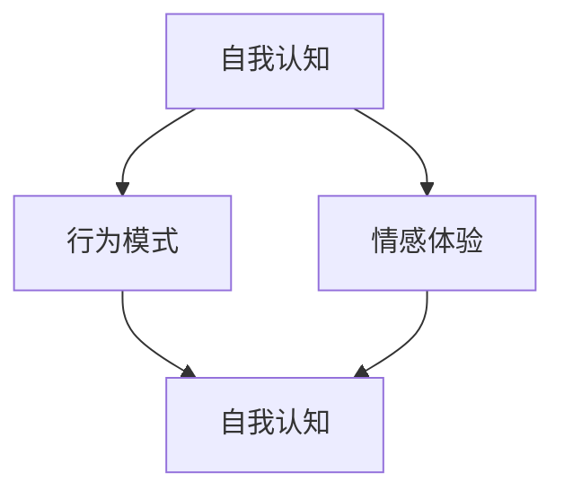

                 

# 心理考古工具箱：挖掘个人成长的历史

> 关键词：心理考古、个人成长、自我认知、行为模式、心理发展

> 摘要：本文旨在探讨如何通过心理考古的方法，深入挖掘个人成长的历史，理解自我认知和行为模式。文章将逐步分析心理考古的定义、方法及其在计算机科学中的应用，为读者提供一套实用的心理考古工具箱。

## 引言

在信息技术飞速发展的时代，计算机科学已经渗透到我们生活的方方面面。从大数据分析到人工智能，计算机技术正不断推动社会进步。然而，在技术进步的同时，人类对于自身心理和情感的探索也愈发重要。本文将引入心理考古这一概念，旨在通过分析个人成长的历史，帮助我们更好地理解自我，优化行为模式，促进心理发展。

## 第一章：心理考古的定义与核心概念

### 1.1 心理考古的定义

心理考古是一门探索个体内心世界的学科，通过对个体成长过程中的心理历程、行为模式、情感体验等进行分析，挖掘出潜藏在潜意识中的信息。它借鉴了考古学的方法，将心理学研究从表面现象深入到深层心理结构。

### 1.2 核心概念与联系

#### 概念1：自我认知
自我认知是指个体对自己内在和外在特征的认知和理解。它包括自我形象、自我价值感、自我效能感等。

#### 概念2：行为模式
行为模式是指个体在特定情境下表现出的典型行为特征。它受个体心理结构、认知水平和生活经验的影响。

#### 概念3：情感体验
情感体验是指个体在特定情境下产生的情感体验，如快乐、悲伤、愤怒等。情感体验与个体的心理需求、认知水平和环境刺激密切相关。

#### ER实体关系图

## 第二章：心理考古的方法与步骤

### 2.1 数据收集

#### 数据源
- 心理测试问卷
- 自我反思日记
- 生活记录

#### 数据收集方法
- 调查问卷
- 深度访谈
- 行为观察

### 2.2 数据分析

#### 数据处理
- 数据清洗
- 数据可视化

#### 数据分析方法
- 统计分析
- 情感分析
- 社会网络分析

### 2.3 结果解读

#### 结果解读方法
- 定量分析结果解读
- 定性分析结果解读
- 多维度综合解读

## 第三章：计算机科学中的心理考古应用

### 3.1 人工智能

#### 应用场景
- 情感识别
- 用户行为分析
- 自适应推荐系统

#### 算法原理
- 支持向量机（SVM）
- 递归神经网络（RNN）
- 聚类分析

### 3.2 大数据分析

#### 应用场景
- 用户行为分析
- 社会网络分析
- 舆情监测

#### 算法原理
- 分词与词向量
- 机器学习算法
- 社会网络分析模型

### 3.3 虚拟现实与增强现实

#### 应用场景
- 情感治疗
- 心理咨询
- 游戏化学习

#### 技术原理
- 虚拟现实技术
- 增强现实技术
- 交互设计

## 第四章：心理考古工具箱的构建与实践

### 4.1 工具箱构建

#### 工具箱组件
- 数据收集工具
- 数据分析工具
- 数据可视化工具

#### 工具选择标准
- 可靠性
- 易用性
- 扩展性

### 4.2 实践应用

#### 案例分析
- 个人成长历程分析
- 用户行为模式分析
- 社交网络情感分析

#### 实践步骤
- 环境配置与工具安装
- 数据收集与预处理
- 数据分析与结果解读
- 结果应用与优化

## 第五章：最佳实践与总结

### 5.1 最佳实践

#### 最佳实践建议
- 保持好奇心和求知欲
- 坚持数据收集与分析
- 注重结果应用与反馈

### 5.2 总结

#### 主要观点
- 心理考古有助于深入挖掘个人成长的历史，提升自我认知
- 计算机科学为心理考古提供了强大的技术支持
- 心理考古工具箱的构建与实践有助于实现个性化心理服务

### 5.3 注意事项

#### 注意事项
- 数据隐私保护
- 分析结果解读要客观、全面
- 保持持续学习与更新

### 5.4 拓展阅读

#### 相关书籍
- 《心理学与生活》
- 《认知心理学及其启示》
- 《人类简史》

#### 相关论文
- “心理考古在心理咨询中的应用”
- “大数据时代下的心理考古研究”
- “人工智能在心理考古中的应用”

## 结语

心理考古工具箱的构建与实践为我们提供了一个新的视角来理解自我，探索个人成长的历史。通过计算机科学的技术支持，我们可以更加深入、全面地挖掘心理信息，为自我认知和行为模式的优化提供有力支持。让我们共同努力，打造一个更加心理健康、积极向上的未来。

### 作者

作者：AI天才研究院/AI Genius Institute & 禅与计算机程序设计艺术 /Zen And The Art of Computer Programming

以上是《心理考古工具箱：挖掘个人成长的历史》的完整目录大纲。每个章节都详细介绍了核心概念、原理、方法和技术，旨在为读者提供一套实用的心理考古工具。通过逐步分析和实践，我们希望能够帮助读者更好地理解自我，实现个人成长与心理发展。

