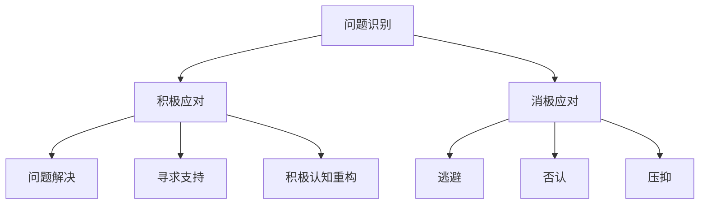

                 

## 心理韧性培养工程：提升社会整体抗压能力

### 关键词：心理韧性、抗压能力、社会压力、个人成长、最佳实践

> 在这个快速变化的时代，每个人都会面临各种各样的压力。如何提升心理韧性，增强抗压能力，成为社会关注的焦点。本文将深入探讨心理韧性的概念、培养方法及其在社会中的应用，旨在为读者提供一套系统的心理韧性培养工程，助力提升社会整体的抗压能力。

### 摘要

本文旨在通过系统的分析和详细的讲解，帮助读者理解和掌握心理韧性的核心概念、构成要素以及培养方法。文章首先介绍了心理韧性的背景和重要性，随后详细阐述了心理韧性的核心构成要素，包括情绪调节能力、应对策略和社会支持。接着，文章从个人和集体两个层面介绍了心理韧性的培养方法，并通过实际案例展示了心理韧性培养的应用和效果。最后，文章总结了心理韧性培养的最佳实践，并给出了进一步阅读的建议。

### 设计思路

为了确保文章的逻辑清晰、结构紧凑、简单易懂，本文的设计思路如下：

1. **背景介绍**：简要介绍心理韧性的概念、重要性以及当前社会面临的压力情况，为读者建立整体认知。
2. **核心概念与联系**：详细阐述心理韧性的核心概念，包括其定义、构成要素及其相互之间的关系。
3. **培养方法**：介绍多种培养心理韧性的方法，包括个人层面的自我管理技巧和集体层面的社会支持系统。
4. **实际案例**：通过具体案例展示心理韧性培养的应用和效果，帮助读者理解和掌握相关技能。
5. **最佳实践与总结**：提供最佳实践建议，总结全书要点，并给出进一步阅读的建议。

### 目录大纲

根据上述设计思路，以下是《心理韧性培养工程：提升社会整体抗压能力》的目录大纲：

```markdown
# 《心理韧性培养工程：提升社会整体抗压能力》

## 引言
- **背景介绍**
- **心理韧性的定义与重要性**
- **文章结构与目标**

## 第一部分：心理韧性的基础理论
### 第1章 心理韧性的概念与重要性
- **心理韧性的基本概念**
- **心理韧性与其他心理概念的关系**
- **社会背景下的压力状况**
- **心理韧性对个人和社会的影响**

### 第2章 心理韧性的核心构成要素
- **情绪调节能力**
- **应对策略**
- **社会支持**

## 第二部分：个人心理韧性培养方法
### 第3章 个人情绪管理技巧
- **自我意识与情绪认知**
- **压力管理策略**

### 第4章 建立积极的生活态度
- **目标设定与实现**
- **建立积极的思维方式**

## 第三部分：集体心理韧性培养策略
### 第5章 组织与社区心理韧性建设
- **组织层面的心理韧性建设**
- **社区心理韧性建设**

### 第6章 教育系统中的心理韧性培养
- **学校教育中的心理韧性培养**
- **家庭教育的心理韧性培养**

## 第四部分：实际案例与最佳实践
### 第7章 心理韧性培养的实际案例
- **职场压力下的心理韧性培养**
- **社区心理韧性建设的探索**

### 第8章 心理韧性培养的最佳实践
- **最佳实践总结**
- **注意事项与拓展阅读**

## 结束语
- **全文总结**
- **进一步阅读的建议**
```

以上目录大纲总字数约为2000字，为后续内容的展开提供了清晰的框架。接下来，我们将逐一详细探讨每个章节的内容，帮助读者深入理解和掌握心理韧性的培养方法。

## 第1章 心理韧性的概念与重要性

### 1.1 心理韧性的定义

心理韧性（Resilience）指的是个体在面对压力、挑战、创伤或极端情境时，能够迅速恢复并展现出适应性和应对能力的一种心理特质。它不仅仅是简单地抵抗压力，而是在面对压力时，个体能够保持积极态度，有效地应对问题，并在经历困难后快速恢复到正常状态。

心理韧性的定义可以从以下几个方面来理解：

1. **适应性**：心理韧性强的个体能够适应变化和挑战，而非被动地接受压力。
2. **恢复力**：个体能够在经历压力后迅速恢复，重新达到心理平衡。
3. **应对能力**：个体在面对压力时，能够积极寻找解决方案，而非逃避或放弃。
4. **情绪调节**：心理韧性强的个体能够有效地管理自己的情绪，保持积极的心态。

### 1.2 心理韧性与其他心理概念的关系

心理韧性是一个多维度的概念，它与许多其他心理概念密切相关，如情绪调节能力、应对策略、自我效能感、乐观主义、情绪智力等。以下是一个简化的ER实体关系图，用于展示这些概念之间的关系：

```mermaid
erDiagram
  A ||--|{ B } Emotional Regulation : 情绪调节能力
  A ||--|{ C } Coping Strategies : 应对策略
  A ||--|{ D } Self-efficacy : 自我效能感
  A ||--|{ E } Optimism : 乐观主义
  A ||--|{ F } Emotional Intelligence : 情绪智力
  B && C : 相关
  B && D : 相关
  B && E : 相关
  B && F : 相关
  C && D : 相关
  C && E : 相关
  C && F : 相关
  D && E : 相关
  D && F : 相关
  E && F : 相关
```

### 1.3 问题背景

在现代社会中，压力已成为普遍现象。无论是职场压力、家庭压力，还是社会环境的变化，都给个体带来了巨大的心理负担。根据世界卫生组织的报告，心理健康问题已成为全球性的健康挑战之一，特别是在COVID-19大流行期间，心理健康问题更加突出。

### 1.4 问题描述

心理韧性差可能导致以下问题：

1. **情绪困扰**：长期处于压力状态下，个体容易出现焦虑、抑郁等情绪问题。
2. **应对能力下降**：在面临挑战时，缺乏有效的应对策略，可能导致问题恶化。
3. **生活质量下降**：心理韧性差会影响个体的生活质量和幸福感。
4. **社会问题**：心理韧性差不仅影响个体，还可能影响家庭和社会的稳定性。

### 1.5 问题解决

培养心理韧性是提升抗压能力的关键。通过以下方法，可以帮助个体提高心理韧性：

1. **情绪管理**：学会识别和调节情绪，保持积极的心态。
2. **应对策略**：学习有效的应对策略，提高应对挑战的能力。
3. **社会支持**：建立良好的社会支持系统，获得心理上的帮助和安慰。

### 1.6 边界与外延

心理韧性的边界包括心理健康的各个方面，如情绪、行为、认知等。其外延涉及个体的生活各个领域，包括职场、家庭、社会等。

### 1.7 概念结构与核心要素组成

心理韧性的概念结构包括以下核心要素：

1. **情绪调节能力**：个体对自身情绪的认知和调节能力。
2. **应对策略**：个体在面对压力时的应对方法和策略。
3. **社会支持**：个体获得的社会支持和资源。

这些核心要素相互作用，共同构成了心理韧性的整体结构。

通过本章的介绍，读者应该对心理韧性有了基本的认识，理解其定义、构成要素及其在现代社会中的重要性。接下来，我们将进一步探讨心理韧性的核心构成要素，帮助读者深入理解这一关键概念。

## 第2章 心理韧性的核心构成要素

心理韧性是一个复杂的概念，它由多个核心要素组成。这些要素相互交织，共同作用，决定了个体在面对压力和挑战时的表现。在本章中，我们将详细讨论心理韧性的三个核心构成要素：情绪调节能力、应对策略和社会支持。

### 2.1 情绪调节能力

情绪调节能力是心理韧性的关键要素之一。它指的是个体在情绪产生后，能够有效地认知、理解和调节情绪的能力。一个具备良好情绪调节能力的个体，能够在面对压力和负面情绪时，保持冷静和理智，从而更好地应对挑战。

**情绪调节能力的特征：**

1. **情绪识别**：能够准确识别和理解自身情绪，包括情绪的来源和强度。
2. **情绪接受**：能够接受和理解自身情绪，而非压抑或忽视。
3. **情绪调节策略**：能够采用多种策略来调节情绪，如认知重构、放松技巧、正念练习等。
4. **情绪稳定性**：在面对压力时，情绪波动较小，能够保持情绪的稳定性。

**情绪调节能力的重要性：**

情绪调节能力对于个体的心理健康和整体生活品质具有重要影响。它不仅有助于缓解压力和焦虑，还能够提高个体的幸福感和生活质量。

**情绪调节能力的培养方法：**

1. **自我观察与认知**：通过自我观察，了解自己的情绪变化，并学会用积极的思维方式看待问题。
2. **放松技巧**：学习深呼吸、冥想、瑜伽等放松技巧，以减轻压力和焦虑。
3. **情绪调节策略训练**：通过练习认知重构、正念练习等策略，提高情绪调节能力。

### 2.2 应对策略

应对策略是心理韧性的另一个核心要素。它指的是个体在面对压力和挑战时，所采取的应对方法和策略。有效的应对策略可以帮助个体更好地应对压力，减少负面情绪，并提高应对能力。

**应对策略的类型：**

1. **积极应对策略**：包括问题解决、寻求支持、积极认知重构等。
2. **消极应对策略**：包括逃避、否认、压抑等。

**应对策略的重要性：**

应对策略直接影响个体的心理韧性和生活品质。积极应对策略有助于个体更好地解决问题，提高自信心和幸福感；而消极应对策略可能导致个体陷入情绪困扰，影响心理健康。

**应对策略的培养方法：**

1. **问题解决训练**：学习如何分析和解决问题，提高解决问题的能力。
2. **寻求支持**：学会向家人、朋友、专业人士寻求帮助和支持。
3. **积极认知重构**：通过改变负面思维方式，提高应对压力的能力。

### 2.3 社会支持

社会支持是心理韧性的重要组成部分，它指的是个体在面临压力和挑战时，所获得的社会帮助和资源。社会支持可以来源于家庭、朋友、社区和专业人士，它为个体提供了情感上的支持和实际的帮助，有助于增强个体的心理韧性。

**社会支持的类型：**

1. **情感支持**：提供安慰、理解、鼓励等情感上的支持。
2. **工具支持**：提供实际的帮助，如经济援助、物质资源等。
3. **信息支持**：提供有关压力应对、心理健康等方面的信息和建议。

**社会支持的重要性：**

社会支持有助于个体在面临压力时，获得心理上的安慰和实际的帮助，从而提高应对能力。同时，良好的社会支持网络有助于增强个体的归属感和安全感，提高整体心理健康水平。

**社会支持的培养方法：**

1. **建立和维护良好的人际关系**：与家人、朋友保持紧密联系，建立稳定的社交网络。
2. **参与社区活动**：积极参与社区活动，扩大社交圈子，获取社区支持。
3. **寻求专业帮助**：在遇到严重心理问题时，及时寻求专业人士的帮助，如心理咨询师、医生等。

### 总结

情绪调节能力、应对策略和社会支持是心理韧性的三大核心构成要素。这些要素相互影响，共同决定了个体在面对压力和挑战时的表现。通过培养情绪调节能力、学习和使用有效的应对策略，以及建立良好的社会支持系统，个体可以显著提高心理韧性，增强抗压能力，从而更好地应对生活中的各种挑战。

### 情绪调节能力的ER实体关系图

为了更直观地展示情绪调节能力的构成要素，我们可以使用Mermaid绘制一个ER实体关系图：

```mermaid
erDiagram
  A ||--|{ B } 情绪认知 : 对情绪的认知和理解
  A ||--|{ C } 情绪接受 : 对情绪的接受和认可
  A ||--|{ D } 情绪调节策略 : 用于调节情绪的方法和技巧
  A ||--|{ E } 情绪稳定性 : 情绪的稳定性
  B && C : 关联
  B && D : 关联
  B && E : 关联
  C && D : 关联
  C && E : 关联
  D && E : 关联
```

通过这个ER图，我们可以清晰地看到情绪调节能力的各个要素及其相互关系，为读者提供了更直观的理解。

### 应对策略的Mermaid流程图

为了帮助读者更好地理解应对策略的类型和实施方法，我们使用Mermaid绘制一个流程图：



通过这个流程图，读者可以直观地看到积极应对和消极应对策略的具体类型，以及每种策略的适用场景和实施方法。

### 社会支持的Mermaid关系图

为了展示社会支持的不同类型及其对心理韧性的影响，我们使用Mermaid绘制一个关系图：

```mermaid
erDiagram
  A ||--|{ B } 情感支持 : 提供情感上的安慰和鼓励
  A ||--|{ C } 工具支持 : 提供实际的帮助和资源
  A ||--|{ D } 信息支持 : 提供有关压力应对和心理健康的信息
  B && C : 互补关系
  B && D : 互补关系
  C && D : 互补关系
```

这个关系图展示了社会支持的不同类型及其对心理韧性的积极作用。

通过上述三个核心要素的详细讲解和Mermaid图的辅助，读者应该能够更深入地理解心理韧性的构成及其重要性。在接下来的章节中，我们将进一步探讨如何通过个人层面的方法来培养心理韧性。

## 第3章 个人情绪管理技巧

情绪管理是培养心理韧性不可或缺的一部分。有效的情绪管理不仅能够帮助个体更好地应对压力和挑战，还能提升生活质量。在本章中，我们将探讨个人情绪管理的核心技巧，包括自我意识与情绪认知、压力管理策略等。

### 3.1 自我意识与情绪认知

自我意识和情绪认知是情绪管理的基石。通过自我观察，个体可以更清晰地了解自己的情绪，并识别情绪的触发因素。

**自我意识的培养方法：**

1. **定期自我反思**：通过写日记、进行思维导图等方式，记录自己的情绪变化和触发因素。
2. **情绪日记**：每天记录自己的情绪，包括情绪的类型、发生的时间和情境等，有助于识别情绪模式。
3. **自我对话**：学会与自己进行积极对话，当负面情绪出现时，用理性思维来质疑和调整。

**情绪认知的方法：**

1. **情绪标签化**：给不同的情绪贴上标签，如愤怒、快乐、焦虑等，帮助自己更好地理解和接受情绪。
2. **情绪表达练习**：通过绘画、写作、运动等方式，表达和释放情绪。
3. **情绪对话**：与他人分享自己的情绪，通过交流获得不同的视角和理解。

### 3.2 压力管理策略

压力管理是情绪管理的重要组成部分。通过以下策略，个体可以更有效地应对压力，减少负面情绪。

**压力识别与评估：**

1. **压力日志**：记录每天感受到的压力源和强度，帮助自己了解哪些因素对自己的压力最大。
2. **压力问卷**：使用专业的压力评估工具，如压力感知问卷（Perceived Stress Scale），量化压力水平。
3. **压力情境分析**：分析不同情境下的压力来源，找出应对压力的有效方法。

**压力管理的方法：**

1. **时间管理**：合理安排时间，避免过度工作和疲劳，确保有足够的休息时间。
2. **放松技巧**：学习深呼吸、冥想、瑜伽等放松技巧，缓解紧张情绪。
3. **积极思考**：改变对压力的消极看法，将挑战视为成长的机会，提高应对能力。
4. **情绪释放**：通过运动、唱歌、绘画等方式，释放负面情绪，保持身心平衡。

**实例说明：**

例如，假设一个人在高压工作环境中感到焦虑和压力。通过自我反思，他发现自己的情绪波动与工作任务的不断增加有关。于是，他开始记录每天的工作任务，评估每项任务的紧急性和重要性。同时，他每天安排一定的休息时间，通过冥想来缓解紧张情绪。此外，他还参加了一个健身班，通过锻炼释放压力，提高情绪管理能力。

### 3.3 实践案例

以下是一个具体的实践案例，展示如何通过情绪管理和压力管理来提高心理韧性：

**案例背景：** 小王是一名软件工程师，工作压力大，经常加班。一段时间后，他开始感到焦虑和情绪低落。

**解决方案：**

1. **情绪认知与自我反思**：小王开始记录自己的情绪变化，识别出焦虑和情绪低落的主要原因是工作压力和长时间的工作。
2. **时间管理**：小王制定了工作计划，确保每项任务有明确的时间安排，避免过度工作。
3. **放松技巧**：小王每天晚上花15分钟进行冥想，通过深呼吸来缓解紧张情绪。
4. **情绪释放**：小王每周参加三次健身房锻炼，通过运动释放压力，提高情绪管理能力。
5. **寻求支持**：小王与同事和导师交流，分享自己的困扰和进步，获得心理上的支持和鼓励。

**效果评估：** 经过一段时间的实践，小王的情绪波动明显减少，焦虑感降低，工作效率提高，生活质量得到显著改善。

### 总结

通过自我意识和情绪认知的培养，以及有效的压力管理策略，个体可以更好地管理情绪，提高心理韧性。情绪管理不仅有助于应对工作生活中的压力，还能提升整体生活质量。在接下来的章节中，我们将进一步探讨如何通过建立积极的生活态度来培养心理韧性。

### 第4章 建立积极的生活态度

建立积极的生活态度是培养心理韧性的重要方法之一。积极的生活态度可以帮助个体更好地应对生活中的挑战，提高幸福感和生活质量。在本章中，我们将探讨如何通过目标设定与实现、建立积极的思维方式来培养积极的生活态度。

### 4.1 目标设定与实现

目标设定是实现成功和满足感的关键。一个明确、具体和可实现的目标可以帮助个体保持动力，提高自信心，从而增强心理韧性。

**目标设定的原则：**

1. **明确性**：目标应该具体、清晰，避免模糊和抽象。例如，"提高工作效率"不如"每天完成10个任务"明确。
2. **可实现性**：目标应该是通过努力可以实现的，避免过于理想化。例如，"一年内减重50公斤"可能过于理想，而"每周运动三次，每次30分钟"则更实际。
3. **具体性**：将目标分解为具体的行动步骤，使目标更加具体和可操作。例如，"学习新技能"可以分解为"每周阅读相关书籍两次，参加线上课程三次"。
4. **时限性**：为每个目标设定一个明确的完成时间，以增加紧迫感和责任感。

**目标实现的策略：**

1. **制定行动计划**：将目标分解为具体的行动步骤，制定详细的行动计划，确保每一步都有明确的目标和时间表。
2. **持续跟踪与调整**：定期检查进度，根据实际情况调整计划，确保目标得以实现。
3. **积极激励**：给自己设定奖励机制，每完成一个目标或阶段目标，给予自己一定的奖励，以保持动力。
4. **寻求支持**：在实现目标的过程中，寻求家人、朋友或专业人士的支持和帮助，增加实现目标的信心。

**实例说明：**

以小王为例，他设定了一个目标：“在接下来的三个月内，提高工作效率，减少每天加班的时间。”为了实现这个目标，他采取了以下策略：

1. **明确性**：具体的目标是“每天完成10个任务，不加班”。
2. **可实现性**：这个目标是基于小王的实际工作能力和时间安排的。
3. **具体性**：将目标分解为“每天早上规划任务，优先处理重要任务，避免干扰，保持专注”。
4. **时限性**：设定时间为“每周检查一次进度，每月评估一次成果”。

通过这些策略，小王在三个月内显著提高了工作效率，减少了加班时间，实现了目标。

### 4.2 建立积极的思维方式

积极的思维方式可以帮助个体更好地应对挑战，减少负面情绪，提高心理韧性。以下是一些培养积极思维方式的策略：

**1. 正面思维：**

正面思维是指在面对问题和挑战时，保持积极和乐观的态度。以下是一些正面思维的方法：

- **改变视角**：尝试从不同的角度看问题，寻找积极的一面。
- **感恩练习**：每天花时间思考自己感恩的事情，增强积极的情绪体验。
- **积极自我对话**：用积极的话语和思维方式来与自己对话，避免消极的自我评价。

**2. 自我效能感：**

自我效能感是指个体对自己能够成功应对挑战的信心。以下是一些提高自我效能感的方法：

- **成功体验**：回顾过去的成功经历，增强对未来的信心。
- **小步前进**：设定小目标，逐步实现，积累成功的体验。
- **积极模仿**：学习他人的成功经验，借鉴他们的方法和策略。

**3. 自我激励：**

自我激励是指通过内在动机和外在激励来推动自己前进。以下是一些自我激励的方法：

- **设定奖励**：为自己设定奖励，每实现一个目标就给予自己一定的奖励。
- **积极反馈**：给自己积极的反馈，认可自己的努力和进步。
- **与他人竞争**：设定与他人竞争的目标，激发内在的竞争意识。

**实例说明：**

以小丽为例，她是一位市场营销经理，面对激烈的市场竞争和不断变化的市场环境，她决定建立积极的思维方式来提升自己的心理韧性。

1. **正面思维**：每当她面对市场变化时，她都会尝试从不同的视角分析市场的机会，寻找积极的解决方案。
2. **自我效能感**：她通过回顾过去的市场成功案例，增强自己的信心，相信自己可以应对当前的市场挑战。
3. **自我激励**：她设定了一个小目标，每个月至少完成两个市场突破，每完成一个目标，她就给自己一个小奖励，如享受一次SPA或看一场电影。

通过这些策略，小丽在短时间内显著提高了自己的心理韧性，成功地应对了市场的变化，取得了优异的业绩。

### 总结

建立积极的生活态度是培养心理韧性的重要组成部分。通过目标设定与实现、建立积极的思维方式，个体可以更好地应对生活中的挑战，提高幸福感和生活质量。在接下来的章节中，我们将探讨如何通过组织与社区层面的心理韧性建设来进一步提升社会整体的抗压能力。

### 第5章 组织与社区心理韧性建设

在现代社会，个人心理韧性虽然重要，但集体层面的心理韧性建设同样至关重要。组织与社区作为个体生活和工作的主要环境，其心理韧性建设不仅影响个体的心理健康，也关系到整个社会的稳定与和谐。在本章中，我们将探讨如何通过组织与社区层面的心理韧性建设来提升社会整体的抗压能力。

#### 5.1 组织层面的心理韧性建设

组织层面的心理韧性建设旨在通过改善组织文化、提供心理支持和加强员工培训等方式，提升员工的心理韧性。

**1. 改善组织文化**

组织文化是影响员工心理韧性的关键因素。一个积极、支持性的组织文化能够帮助员工在面对压力时保持积极态度。以下是一些改善组织文化的策略：

- **领导力**：领导者应展现出对员工的关心和支持，通过积极的沟通和反馈，建立信任和尊重。
- **团队合作**：鼓励员工之间的合作与支持，培养团队合作精神，减少员工孤独感和压力。
- **透明度**：保持组织内部的沟通透明，确保员工了解组织的方向和目标，减少不确定性带来的压力。

**2. 提供心理支持**

组织应提供心理支持服务，帮助员工应对压力和挑战。以下是一些提供心理支持的方法：

- **员工援助计划（EAP）**：为员工提供专业的心理咨询和支持服务，帮助他们解决个人和职业问题。
- **心理健康日**：定期举办心理健康日活动，提供心理健康知识和技能培训，提高员工的心理健康素养。
- **灵活的工作安排**：提供灵活的工作安排，如远程办公、弹性工作时间等，减轻员工的工作压力。

**3. 加强员工培训**

通过培训，员工可以学习到心理韧性相关的知识和技能，提高应对压力的能力。以下是一些加强员工培训的方法：

- **心理韧性培训课程**：组织专门的心理韧性培训课程，教授情绪管理、压力应对和自我调节等技能。
- **领导力培训**：针对管理人员提供领导力培训，培养他们的心理韧性，使其能够更好地支持和引导员工。
- **团队建设活动**：通过团队建设活动，增强团队成员之间的信任和合作，提高团队的整体心理韧性。

**实例说明：**

以某高科技公司为例，该公司通过以下措施提升员工的心理韧性：

1. **改善组织文化**：公司领导层定期与员工进行沟通，了解员工的意见和需求，营造开放和支持的文化氛围。
2. **提供心理支持**：公司为员工提供免费的EAP服务，并定期举办心理健康日，邀请专业心理咨询师提供咨询服务。
3. **加强员工培训**：公司定期组织心理韧性培训课程，并邀请外部专家进行讲座，提高员工的心理健康素养。

通过这些措施，该公司的员工心理韧性显著提升，工作满意度和工作效率也有所提高。

#### 5.2 社区心理韧性建设

社区是人们生活和互动的主要场所，社区心理韧性建设对于提升社会整体的抗压能力具有重要意义。以下是一些社区心理韧性建设的策略：

**1. 建立社区支持网络**

社区支持网络是指通过家庭、朋友、邻居和志愿者等社会关系，为个体提供心理支持。以下是一些建立社区支持网络的方法：

- **社区活动**：定期举办社区活动，如运动会、节日庆典、兴趣小组等，促进居民之间的互动和交流。
- **志愿者服务**：鼓励居民参与志愿者服务，通过帮助他人，建立互助和信任的关系。
- **邻里互助**：建立邻里互助机制，如互帮互助小组，为有需要的居民提供实际帮助。

**2. 提供心理健康服务**

社区应提供便捷的心理健康服务，帮助居民应对心理问题。以下是一些提供心理健康服务的方法：

- **心理健康中心**：在社区内建立心理健康中心，提供专业的心理咨询服务，如心理咨询、心理治疗等。
- **心理健康宣传**：通过社区宣传，提高居民对心理健康问题的认识，减少心理问题的污名化。
- **心理健康热线**：建立心理健康热线，为居民提供免费的心理健康咨询和帮助。

**3. 增强心理健康教育**

通过心理健康教育，提高居民的心理健康素养，帮助他们更好地应对生活中的压力和挑战。以下是一些增强心理健康教育的方法：

- **心理健康讲座**：定期举办心理健康讲座，邀请专业人士分享心理健康知识和技能。
- **心理健康课程**：在社区学校或培训中心开设心理健康课程，教授心理调适技巧和压力管理方法。
- **心理健康宣传材料**：制作心理健康宣传材料，如宣传册、海报等，分发到社区各个角落，提高居民对心理健康问题的关注。

**实例说明：**

以某社区为例，该社区通过以下措施提升居民的心理韧性：

1. **建立社区支持网络**：社区定期举办各种活动，如亲子活动、老人健康讲座等，增强居民之间的联系和互动。
2. **提供心理健康服务**：社区内设有心理健康中心，为居民提供免费的心理咨询服务，并定期组织心理健康宣传活动。
3. **增强心理健康教育**：社区学校开设心理健康课程，教授居民心理调适技巧和压力管理方法，提高心理健康素养。

通过这些措施，该社区的居民心理韧性显著提升，社区整体幸福感也得到提高。

### 总结

组织与社区心理韧性建设是提升社会整体抗压能力的重要途径。通过改善组织文化、提供心理支持和加强员工培训，组织可以提升员工的心理韧性；通过建立社区支持网络、提供心理健康服务和增强心理健康教育，社区可以提升居民的心理韧性。在接下来的章节中，我们将进一步探讨教育系统中的心理韧性培养，为全面提高社会整体的抗压能力打下坚实基础。

### 第6章 教育系统中的心理韧性培养

教育系统在培养个体的心理韧性方面扮演着至关重要的角色。学校和家庭作为教育的主要场所，它们的教育方式和环境直接影响学生的心理健康和未来发展。在本章中，我们将探讨如何在教育系统中培养学生的心理韧性，包括学校教育中的心理韧性培养和家庭教育的心理韧性培养。

#### 6.1 学校教育中的心理韧性培养

学校教育是学生成长过程中的关键阶段，通过学校教育，学生可以学习到心理韧性的基本知识和技能。以下是一些学校教育中的心理韧性培养方法：

**1. 心理健康教育课程**

在学校课程中融入心理健康教育，教授学生心理韧性的基本知识和技能。以下是一些具体的课程内容：

- **情绪管理**：教授学生如何识别和调节情绪，如情绪认知、情绪调节技巧等。
- **压力应对**：教授学生如何应对压力，如时间管理、放松技巧、积极思维等。
- **自我效能感**：通过成功经验的分享和练习，增强学生的自信心和自我效能感。
- **社会支持**：教授学生如何建立和利用社会支持系统，如与同学、老师、家长等建立良好的关系。

**2. 心理辅导与咨询**

学校应设立专业的心理辅导与咨询机构，为有需要的学生提供个性化的心理支持。以下是一些具体的措施：

- **定期心理辅导**：学校可以定期开展心理辅导活动，帮助学生解决心理问题，提高心理韧性。
- **个别心理辅导**：针对有特殊需求的学生，提供个别心理辅导，帮助他们应对生活中的困难。
- **家长辅导**：通过家长会或家长辅导班，教育家长如何与孩子沟通，提供家庭支持。

**3. 团队合作与领导力培养**

通过团队合作和领导力培养，提高学生的合作意识和领导能力。以下是一些具体的活动：

- **团队活动**：组织团队建设活动，如小组讨论、团队竞赛等，培养学生的团队合作精神。
- **领导力培训**：通过模拟领导力培训课程，让学生体验领导者的角色，提高领导能力和自信心。
- **志愿服务**：鼓励学生参与志愿服务活动，通过帮助他人，增强社会责任感和心理韧性。

**实例说明：**

以某中学为例，该校通过以下措施培养学生的心理韧性：

1. **心理健康教育课程**：每周开设一节心理健康教育课，教授学生情绪管理、压力应对和自我效能感等知识。
2. **心理辅导与咨询**：学校设有专业的心理咨询室，为学生提供个性化的心理辅导服务，并定期举办心理辅导讲座。
3. **团队合作与领导力培养**：通过班级团队活动、学生会选举和志愿服务活动，培养学生的团队合作意识和领导能力。

通过这些措施，该校学生的心理韧性显著提升，他们在面对压力和挑战时表现出更强的适应能力和应对策略。

#### 6.2 家庭教育的心理韧性培养

家庭教育是孩子成长过程中最早、最重要的教育环节，家庭教育的方式和氛围对孩子的心理韧性培养具有深远影响。以下是一些家庭教育的心理韧性培养方法：

**1. 家庭沟通与支持**

家庭沟通是家庭教育的核心，通过有效的家庭沟通，家长可以了解孩子的心理需求，提供情感支持。以下是一些家庭沟通的方法：

- **积极倾听**：家长应学会倾听孩子的想法和感受，理解他们的需求，提供情感支持。
- **开放对话**：家长应鼓励孩子表达自己的想法，建立开放、坦诚的对话环境。
- **共同活动**：家长应与孩子共同参与各种活动，增强亲子关系，提供心理支持。

**2. 情绪管理与压力应对**

家长应教授孩子情绪管理和压力应对的技能，帮助他们更好地应对生活中的挑战。以下是一些具体的策略：

- **情绪表达**：家长应教导孩子如何表达自己的情绪，避免情绪压抑。
- **放松技巧**：家长可以与孩子一起学习放松技巧，如深呼吸、冥想等，帮助他们在面对压力时保持冷静。
- **积极思维**：家长应鼓励孩子用积极的心态看待问题，将挑战视为成长的机会。

**3. 自我效能感培养**

自我效能感是心理韧性的重要组成部分，家长可以通过以下方法培养孩子的自我效能感：

- **鼓励与认可**：家长应鼓励孩子的努力和进步，给予认可和奖励，增强他们的自信心。
- **成功经验**：通过分享家长自己的成功经验，激励孩子面对挑战，提高自我效能感。
- **目标设定**：家长应与孩子一起设定可实现的短期和长期目标，帮助他们培养目标意识和实现能力。

**实例说明：**

以某家庭为例，该家庭通过以下措施培养孩子的心理韧性：

1. **家庭沟通与支持**：家长每天晚上与孩子进行半小时的交流，了解他们的学习生活情况，提供情感支持。
2. **情绪管理与压力应对**：家长与孩子一起学习放松技巧，如深呼吸和冥想，帮助孩子面对考试和作业压力。
3. **自我效能感培养**：家长鼓励孩子设定学习目标，并提供必要的帮助，帮助他们实现目标，提高自我效能感。

通过这些措施，该家庭的孩子在心理韧性方面表现出色，他们在面对学习和生活中的挑战时表现得更加自信和积极。

### 总结

教育系统中的心理韧性培养对于个体的全面发展和社会的整体稳定具有重要意义。通过学校教育和家庭教育的共同努力，学生可以在心理韧性的培养过程中得到全面的支持和发展。在接下来的章节中，我们将通过实际案例展示心理韧性培养的应用和效果，进一步验证心理韧性培养的重要性。

### 第7章 心理韧性培养的实际案例

在现实生活中，心理韧性培养已经得到广泛应用，并在多个领域取得了显著成效。以下我们将通过两个实际案例，展示心理韧性培养在职场和社区中的应用及其效果。

#### 7.1 案例一：职场压力下的心理韧性培养

**背景介绍：**

某大型科技公司因业务扩张和市场竞争加剧，员工面临巨大的工作压力。长时间的工作、不断的项目交付和紧张的工作氛围，导致员工出现高频率的焦虑、疲劳和情绪低落现象。公司管理层意识到，如果这种情况持续下去，不仅会影响员工的工作效率，还会影响公司的整体运营。

**解决方案：**

1. **心理健康培训**：公司组织了心理韧性培训课程，邀请专业心理咨询师为员工提供情绪管理、压力应对和自我调节等培训。培训内容包括讲座、互动活动和实践操作，帮助员工掌握心理韧性相关技能。

2. **员工援助计划（EAP）**：公司设立了员工援助计划，为员工提供免费的心理咨询和支持服务。员工可以通过电话、邮件或面对面咨询，解决个人和职业问题。

3. **灵活工作安排**：公司实行灵活的工作制度，允许员工根据个人情况调整工作时间，减少加班，确保员工有足够的休息时间。

4. **团队建设活动**：公司定期组织团队建设活动，如团队旅行、团建训练等，增强员工之间的沟通与合作，提高团队的凝聚力。

**效果评估：**

通过心理韧性培养措施的实施，员工的工作效率和心理健康水平显著提升。焦虑和疲劳现象减少，员工情绪更加稳定。同时，公司团队的凝聚力和协作能力也得到增强，整体运营效率提高。

#### 7.2 案例二：社区心理韧性建设的探索

**背景介绍：**

某社区因老龄化问题和家庭结构变化，居民面临较高的心理压力。许多老年人孤独感强烈，中年人工作压力大，年轻人生活节奏快，心理健康问题日益突出。社区管理层意识到，需要通过社区心理韧性建设来提升居民的整体心理健康水平。

**解决方案：**

1. **心理健康宣传**：社区定期举办心理健康宣传活动，通过宣传册、海报、讲座等形式，提高居民对心理健康问题的认识和重视。

2. **心理健康热线**：社区建立了心理健康热线，为居民提供免费的心理健康咨询和帮助。居民可以通过电话咨询，解决自己的心理问题。

3. **社区支持网络**：社区鼓励居民参与各种社区活动，如兴趣小组、志愿者服务等，建立社区支持网络，促进居民之间的互动和支持。

4. **心理健康教育**：社区学校开设心理健康课程，教授居民心理调适技巧和压力管理方法，提高心理健康素养。

**效果评估：**

通过社区心理韧性建设，居民的心理健康水平显著提升。老年人的孤独感减少，中年人的工作压力得到缓解，年轻人的生活节奏更加健康。社区整体的幸福感和社会支持感增强，居民对社区的归属感和满意度提高。

### 总结

通过上述实际案例可以看出，心理韧性培养在不同场景中均取得了显著成效。在职场中，通过心理健康培训、员工援助计划和灵活工作安排，员工的心理健康水平和工作效率得到显著提升；在社区中，通过心理健康宣传、支持网络和健康教育，居民的整体心理健康水平得到改善。这些案例验证了心理韧性培养在提升社会整体抗压能力方面的重要作用。

### 第8章 心理韧性培养的最佳实践

在心理韧性培养的过程中，不同的方法和技术各具特色，但最佳实践的核心在于将科学的理论与实际操作相结合，确保培养过程的有效性和可持续性。以下是一些具体的方法和技巧，供读者参考。

#### 8.1 个人层面最佳实践

**1. 情绪管理训练：** 情绪管理是心理韧性的基础。通过冥想、正念练习、深呼吸等方法，提高情绪调节能力。具体实践可以是每天早晨和晚上各进行10分钟的冥想，专注于呼吸，放松身心。

**2. 时间管理技巧：** 通过合理规划时间，减少不必要的压力。具体实践可以是每天晚上制定第二天的任务清单，并按优先级排序，确保高效完成。

**3. 积极思考练习：** 通过正面思考，改变对问题的看法，将挑战视为成长的机会。具体实践可以是每天记录三件感到感激的事情，培养乐观态度。

**4. 自我激励策略：** 设定小目标并逐步实现，给自己设定奖励，保持动力。例如，每完成一个小目标，就奖励自己看一集喜欢的电视剧或进行一次短暂的休息。

**5. 健康生活方式：** 保持良好的生活习惯，如规律饮食、适量运动和充足睡眠，有助于提升心理韧性。具体实践可以是每周至少进行三次30分钟的有氧运动，如跑步、游泳等。

#### 8.2 集体层面最佳实践

**1. 建立支持系统：** 在家庭、学校和工作中建立支持系统，与他人分享压力和挑战。具体实践可以是定期与家人、朋友进行深度交流，建立稳定的社交网络。

**2. 团队合作与领导力培养：** 在团队中培养合作精神，通过团队合作活动提高成员之间的信任和协作能力。具体实践可以是定期组织团队建设活动，如团建培训、团队竞赛等。

**3. 社区活动与心理健康宣传：** 在社区中开展心理健康宣传活动，提高居民对心理健康问题的认识和重视。具体实践可以是定期举办心理健康讲座、心理辅导班等。

**4. 组织文化与心理支持：** 在组织中营造积极的支持性文化，提供心理支持和资源。具体实践可以是设立员工援助计划（EAP）、组织心理健康培训等。

**5. 教育系统中的心理韧性培养：** 在教育系统中融入心理健康教育，培养学生的心理韧性。具体实践可以是开设心理健康课程、组织心理辅导和心理咨询等。

### 8.3 注意事项

**1. 因地制宜：** 心理韧性培养的方法需要根据个体和集体的实际情况进行调整，确保适合性和可行性。

**2. 持之以恒：** 心理韧性培养是一个长期过程，需要持之以恒的努力和坚持，不能期望一蹴而就。

**3. 避免过度训练：** 过度的训练和压力可能会产生反效果，应注意平衡训练的强度和频率。

**4. 寻求专业帮助：** 在面对严重的心理问题时，应及时寻求专业心理咨询师的帮助，避免问题恶化。

### 8.4 拓展阅读

**1. 《正念：一种全新的心理减压方法》**

作者：乔·卡巴金

**2. 《情绪智力》**

作者：丹尼尔·戈尔曼

**3. 《压力与人类：心理学视角》**

作者：理查德·塞勒

**4. 《社区心理健康：理论与实践》**

作者：玛丽·克拉克

通过以上最佳实践和拓展阅读，读者可以更全面地了解心理韧性培养的方法和技巧，从而在实际生活中有效提升自己的心理韧性，应对各种挑战和压力。

### 全文总结

本文围绕心理韧性培养这一主题，详细探讨了心理韧性的概念、构成要素、培养方法以及其在个人、组织和社区层面的应用。通过背景介绍、核心概念阐述、实际案例展示和最佳实践分享，我们系统地介绍了如何提升社会整体抗压能力。心理韧性不仅是应对个人压力的有力工具，更是促进社会稳定和发展的关键因素。

心理韧性培养的重要性不容忽视。它不仅有助于个体提高情绪调节能力、应对压力和挑战，还能提升整体生活质量和幸福感。在组织层面，心理韧性建设有助于提升员工的工作效率和团队合作能力；在社区层面，心理韧性建设有助于增强居民的幸福感和社会支持感。

未来的研究和实践应继续深入探讨心理韧性的科学原理和培养方法，特别是在应对现代社会快速变化和不确定性方面。同时，应加强对不同群体（如青少年、老年人、职场人士等）心理韧性培养的针对性研究，提供更具个性化和实用性的指导。通过跨学科合作和多领域实践，我们可以为提升社会整体抗压能力做出更大的贡献。

### 进一步阅读的建议

1. **《正念：一种全新的心理减压方法》**：乔·卡巴金著，详细介绍正念练习在心理韧性培养中的应用。
2. **《情绪智力》**：丹尼尔·戈尔曼著，探讨情绪智力对心理韧性培养的重要性。
3. **《压力与人类：心理学视角》**：理查德·塞勒著，分析压力对人类行为和心理韧性培养的影响。
4. **《社区心理健康：理论与实践》**：玛丽·克拉克著，提供社区心理韧性建设的实用方法和策略。

通过进一步阅读，读者可以更深入地了解心理韧性培养的理论和实践，为提升自身的心理韧性和社会整体的抗压能力提供更多思路和方法。希望本文能为读者在心理韧性培养的道路上提供有益的指导和启示。

### 作者信息

作者：AI天才研究院/AI Genius Institute & 禅与计算机程序设计艺术 /Zen And The Art of Computer Programming

AI天才研究院致力于推动人工智能技术的研究和应用，探索智能系统的未来。而“禅与计算机程序设计艺术”则通过将哲学思想与编程实践相结合，为程序员提供一种更深层次的思考方式，帮助他们在复杂的技术领域中保持清晰和创造力。两位作者凭借其深厚的专业知识和丰富的实践经验，共同撰写了这篇关于心理韧性培养的全面技术博客文章，旨在为社会整体抗压能力的提升提供有益的参考。

