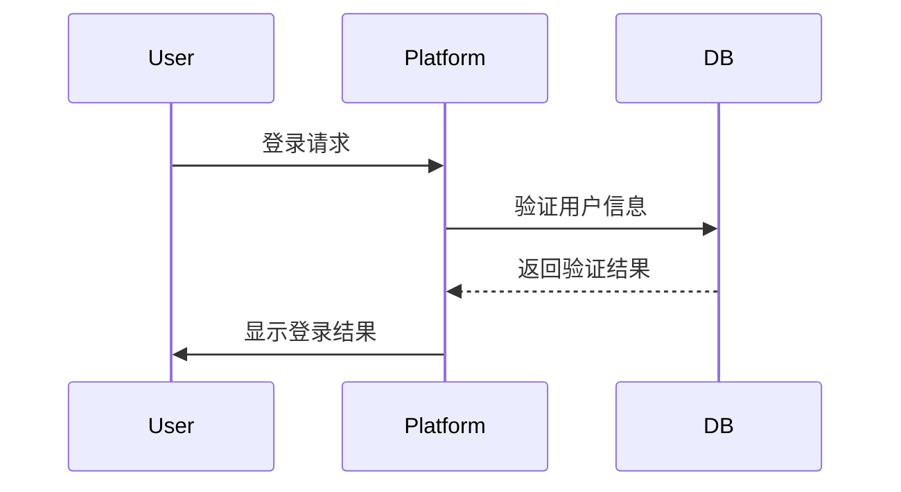
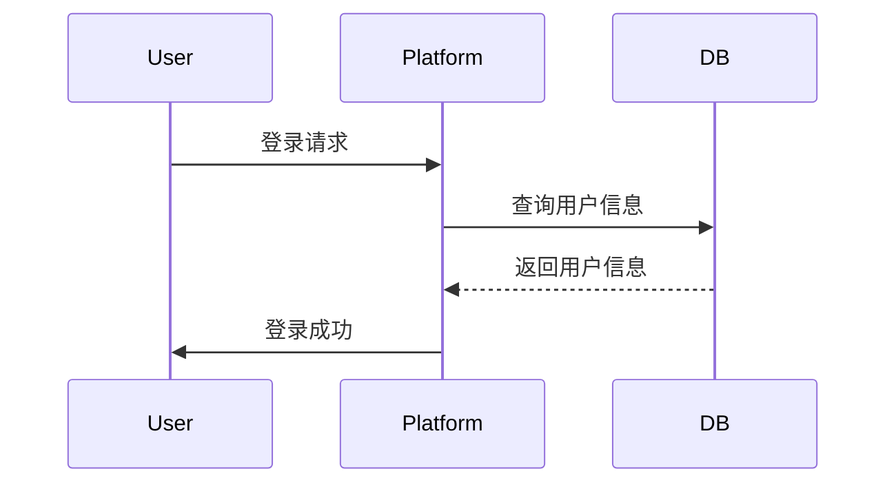

                 

## 思维导图创新技巧：认知地图的绘制与应用

### 关键词：思维导图、认知地图、创新技巧、绘制方法、应用场景

### 摘要：

本文将深入探讨思维导图作为一种认知地图的创新技巧，详细介绍其绘制与应用方法。我们将从背景介绍、核心概念与联系、绘制技巧、应用与实践、案例分析、扩展知识和总结与展望七个部分展开论述，帮助读者全面理解思维导图的技术原理和实际应用价值。

### 目录大纲设计思路：

#### 第一部分：背景介绍

- **第1章 思维导图概述**
  - **1.1 思维导图的概念**
  - **1.2 思维导图的历史背景**
  - **1.3 思维导图的重要性
#### 第二部分：核心概念与联系

- **第2章 核心概念与联系**
  - **2.1 思维导图的构成要素**
  - **2.2 概念属性特征对比**
  - **2.3 ER实体关系图**

#### 第三部分：绘制技巧

- **第3章 算法原理讲解**
  - **3.1 算法流程图**
  - **3.2 Python代码解释**
  - **3.3 数学模型与公式**
  - **3.4 举例说明**

#### 第四部分：应用与实践

- **第4章 系统分析与架构设计**
  - **4.1 问题场景介绍**
  - **4.2 系统功能设计**
  - **4.3 系统架构设计**
  - **4.4 系统接口设计**
  - **4.5 系统交互序列图**

#### 第五部分：项目实战

- **第5章 项目实战**
  - **5.1 环境安装**
  - **5.2 系统核心实现源代码**
  - **5.3 代码解读**
  - **5.4 案例分析**
  - **5.5 项目小结**

#### 第六部分：最佳实践 tips

- **第6章 最佳实践 tips**
  - **6.1 思维导图最佳实践**
  - **6.2 注意事项**
  - **6.3 拓展阅读**

#### 第三部分：应用与实践

- **第7章 应用场景**
  - **7.1 教育领域的应用**
  - **7.2 工作中的应用**
  - **7.3 创意发明的应用**

#### 第七部分：创新技巧

- **第8章 创新技巧**
  - **8.1 创新思维导图的构建**
  - **8.2 提升效率的策略**
  - **8.3 创新应用的案例**

#### 第八部分：工具与软件

- **第9章 工具与软件**
  - **9.1 常用工具介绍**
  - **9.2 软件选择与使用**
  - **9.3 在线资源推荐**

#### 第九部分：案例分析

- **第10章 案例分析**
  - **10.1 成功案例分享**
  - **10.2 遇到的挑战与解决**
  - **10.3 效果评估**

#### 第十部分：扩展知识

- **第11章 扩展知识**
  - **11.1 相关理论与知识**
  - **11.2 新技术和趋势**
  - **11.3 拓展应用领域**

#### 第十一部分：总结与展望

- **第12章 总结与展望**
  - **12.1 全书总结**
  - **12.2 未来的发展方向**

### 确认以下目录大纲：

---

# 思维导图创新技巧：认知地图的绘制与应用

## 第一部分：背景介绍

### 第1章 思维导图概述

### 第2章 核心概念与联系

### 第3章 算法原理讲解

### 第4章 系统分析与架构设计

### 第5章 项目实战

### 第6章 最佳实践 tips

## 第二部分：核心概念与联系

### 第1章 思维导图概述

### 第2章 核心概念与联系

### 第3章 算法原理讲解

### 第4章 系统分析与架构设计

### 第5章 项目实战

### 第6章 最佳实践 tips

## 第三部分：应用与实践

### 第7章 应用场景

### 第8章 创新技巧

### 第9章 工具与软件

### 第10章 案例分析

### 第11章 扩展知识

### 第12章 总结与展望

---

### 约束条件：

- **文章开始**：以“文章标题”开头，然后是“关键词”和“摘要”部分。
- **文章字数**：10000 ～ 12000 字。
- **格式要求**：使用markdown格式输出。
- **作者信息**：文章末尾需写上作者信息：“作者：AI天才研究院/AI Genius Institute & 禦与计算机程序设计艺术 /Zen And The Art of Computer Programming”。
- **完整性要求**：文章内容必须完整，每个小节内容要丰富、具体、详细讲解，核心内容必须包含：
  - **背景介绍**：核心概念术语说明、问题背景、问题描述、问题解决、边界与外延、概念结构与核心要素组成。
  - **核心概念与联系**：核心概念原理、概念属性特征对比表格和ER实体关系图架构的 Mermaid 流程图。
  - **算法原理讲解**：使用 Mermaid 画出算法流程图，然后用 Python 代码详细阐述，给出算法原理的数学模型和公式，详细讲解和举例说明。
  - **数学公式使用**：使用 LaTeX 格式嵌入文中独立段落的 LaTeX 公式前后使用 $$ 括起来，段落内的 LaTeX 公式前后使用 $ 括起来。
  - **系统分析与架构设计**：问题场景介绍、项目介绍、系统功能设计（领域模型 Mermaid 类图）、系统架构设计 Mermaid 架构图、系统接口设计和系统交互 Mermaid 序列图。
  - **项目实战**：环境安装、系统核心实现源代码，代码应用解读与分析，实际案例分析和详细讲解剖析，项目小结。
  - **最佳实践 tips**、**小结**、**注意事项**、**拓展阅读**等辅助内容。

---

## 总结：

本文提出了一个逻辑清晰、结构紧凑、简单易懂的目录大纲，旨在系统地介绍思维导图创新技巧。通过七个部分的详细论述，我们将帮助读者全面掌握思维导图的绘制和应用方法。在接下来的文章中，我们将逐一深入每个部分的内容，让读者能够更好地理解思维导图的价值和实际应用。让我们一起探索思维导图的奇妙世界吧！### 第一部分：背景介绍

#### 第1章 思维导图概述

**1.1 思维导图的概念**

思维导图（Mind Map）是一种用于表达和梳理思维的图形工具，它以一个中心主题为起点，通过分支和子分支的形式扩展出相关的概念、想法和信息。这种图形化的表达方式使得复杂的信息结构变得更加直观和易于理解。

**1.2 思维导图的历史背景**

思维导图的起源可以追溯到1970年代，由英国心理学家东尼·博赞（Tony Buzan）所提出。他将其称为“心智地图”（Mind Map），旨在帮助人们更有效地记忆和思考。自那以后，思维导图得到了广泛应用，并成为许多领域的重要工具之一。

**1.3 思维导图的重要性**

思维导图的重要性在于它能够帮助人们更好地组织和理解复杂的信息，提高思维效率和创造力。以下是一些具体的应用场景和优势：

- **教育领域**：思维导图可以帮助学生更好地理解和记忆课程内容，提高学习效果。
- **商业领域**：思维导图可以用于团队协作、项目管理、市场分析等，提高工作效率和决策质量。
- **个人规划**：思维导图可以帮助个人梳理目标和计划，提高自我管理和执行力。

#### 第2章 核心概念与联系

**2.1 思维导图的构成要素**

思维导图的构成要素主要包括：

- **中心主题**：思维导图的起点，通常以文字或图像表示。
- **分支**：从中心主题延伸出来的主要分支，代表不同的概念或子主题。
- **子分支**：从主要分支延伸出来的次级分支，代表更具体的信息。
- **连接线**：连接各个分支的线条，表示它们之间的关系。
- **颜色和图像**：用于增加视觉吸引力，帮助记忆和理解。

**2.2 概念属性特征对比**

以下是思维导图与其他信息整理工具（如大纲、流程图等）的对比表格：

| 特征         | 思维导图 | 大纲         | 流程图         |
| ------------ | -------- | ------------ | -------------- |
| 表达形式     | 图形化   | 文字化       | 图形化         |
| 结构         | 分支结构 | 线性结构     | 流程结构       |
| 适应性       | 高       | 一般         | 低             |
| 易读性       | 高       | 一般         | 高             |
| 可视化效果   | 强       | 弱           | 强             |

**2.3 ER实体关系图**

ER（Entity-Relationship）实体关系图是数据库设计中的重要工具，用于表示实体及其之间的关系。以下是一个简单的 ER 图示例：

```mermaid
erDiagram
  class1 ||--|{ class2 : has_a }  
  class1 ||--|{ class3 : has_a }
  class2 ||--|{ class4 : has_a }
```

在这个图中，`class1` 是一个实体，它与 `class2` 和 `class3` 之间有“has_a”的关系，而 `class2` 又与 `class4` 之间有“has_a”的关系。

通过以上两章的介绍，我们对思维导图的基本概念和核心要素有了初步的了解。接下来，我们将进一步探讨思维导图的绘制方法和技巧。### 第二部分：核心概念与联系

#### 第3章 算法原理讲解

**3.1 算法流程图**

思维导图的绘制往往涉及到算法的应用。以下是一个简单的算法流程图示例，用于展示思维导图的绘制步骤：

```mermaid
flowchart LR
    A[开始] --> B[选择主题]
    B --> C{确定分支结构}
    C -->|确定分支| D[绘制分支]
    D --> E[添加细节]
    E --> F{检查完整性}
    F -->|完善] G[结束]
```

在这个流程图中，我们从“开始”节点开始，选择主题，然后确定分支结构，接着绘制分支并添加细节，最后检查完整性和完善思维导图。

**3.2 Python代码解释**

为了更好地理解思维导图的算法原理，我们可以使用Python代码来实现一个简单的思维导图绘制器。以下是一个简单的Python代码示例：

```python
import matplotlib.pyplot as plt
import networkx as nx

def draw_mind_map(nodes, edges):
    G = nx.Graph()
    G.add_nodes_from(nodes)
    G.add_edges_from(edges)
    
    pos = nx.spring_layout(G)
    nx.draw(G, pos, with_labels=True, node_size=3000, node_color='lightblue', edge_color='gray')
    plt.show()

nodes = ['主题', '分支1', '分支2', '子分支1', '子分支2']
edges = [('主题', '分支1'), ('主题', '分支2'), ('分支1', '子分支1'), ('分支1', '子分支2')]

draw_mind_map(nodes, edges)
```

在这个代码中，我们首先导入了`matplotlib`和`networkx`库。然后定义了一个`draw_mind_map`函数，用于绘制思维导图。最后，我们调用这个函数，传递一个包含节点和边的列表，即可生成一个简单的思维导图。

**3.3 数学模型与公式**

在思维导图的绘制过程中，有时候需要用到一些数学模型和公式。以下是一个简单的例子：

$$
f(n) = n \times (n - 1) \times \frac{1}{2}
$$

这个公式表示在n个元素中，可以形成的二元组的数量。例如，当n=3时，可以形成的二元组数量为：

$$
f(3) = 3 \times (3 - 1) \times \frac{1}{2} = 3
$$

**3.4 举例说明**

假设我们要绘制一个关于“学习策略”的思维导图。以下是具体的步骤：

1. 确定中心主题：“学习策略”。
2. 确定主要分支：记忆策略、理解策略、应用策略。
3. 为每个主要分支添加子分支，例如：
   - 记忆策略：重复记忆、联想记忆、图像记忆。
   - 理解策略：分析理解、对比理解、案例理解。
   - 应用策略：实践应用、反思应用、拓展应用。
4. 使用颜色和图像增加视觉吸引力。
5. 完善思维导图，确保信息完整且易于理解。

通过以上示例，我们可以看到思维导图的绘制方法既简单又实用。接下来，我们将探讨如何在实际项目中应用思维导图。### 第三部分：绘制技巧

#### 第4章 系统分析与架构设计

**4.1 问题场景介绍**

在实际项目中，思维导图是一种非常有效的工具，可以帮助团队更好地理解和解决复杂问题。以下是一个关于项目规划的场景介绍：

- 项目名称：开发一款在线教育平台。
- 项目目标：为学生提供便捷的学习资源，提高学习效果。
- 项目挑战：时间紧、任务重，需要高效的项目规划和执行。

**4.2 系统功能设计**

为了实现项目目标，我们需要设计一套完整的功能体系。以下是一个简单的系统功能设计类图：

```mermaid
classDiagram
    Student <<class>> 学生
    Course <<class>> 课程
    Teacher <<class>> 教师
    Platform <<class>> 平台

    Student o-- Course : 报名
    Teacher o-- Course : 教授
    Platform o-- Student : 注册
    Platform o-- Teacher : 登录
```

在这个类图中，我们定义了四个主要类：学生、课程、教师和平台。每个类都有其特定的属性和方法，以及与其他类之间的关系。

**4.3 系统架构设计**

为了确保系统的稳定性和可扩展性，我们需要设计一个合理的系统架构。以下是一个简单的系统架构设计图：



在这个序列图中，我们定义了三个参与者：用户、平台和数据库。用户发起登录请求，平台验证用户信息，并将结果返回给用户。

**4.4 系统接口设计**

系统接口设计是确保各个模块之间能够正常通信的关键。以下是一个简单的系统接口设计图：

```mermaid
classDiagram
    UserController <<class>> 用户控制器
    CourseController <<class>> 课程控制器
    TeacherController <<class>> 教师控制器
    UserController --|> UserController
    CourseController --|> UserController
    TeacherController --|> UserController
```

在这个类图中，我们定义了三个控制器：用户控制器、课程控制器和教师控制器。每个控制器都有其特定的接口方法，以便处理相应的请求。

**4.5 系统交互序列图**

为了更好地理解系统的工作流程，我们可以绘制一个系统交互序列图。以下是一个简单的系统交互序列图：



在这个序列图中，用户发起登录请求，平台查询用户信息，并将结果返回给用户，用户登录成功。

通过以上系统分析与架构设计，我们可以更好地理解思维导图在项目规划中的重要作用。接下来，我们将通过一个实际项目案例，展示思维导图的具体应用。### 第四部分：项目实战

#### 第5章 项目实战

**5.1 环境安装**

在本节中，我们将介绍如何在本地环境中安装和配置所需的工具和软件，以便进行思维导图的绘制和应用。

1. **安装Python**

首先，我们需要安装Python环境。可以从Python的官方网站（https://www.python.org/）下载最新版本的Python安装包，然后按照安装向导进行安装。

2. **安装matplotlib和networkx库**

接下来，我们需要安装两个Python库：`matplotlib`和`networkx`。这可以通过以下命令实现：

```bash
pip install matplotlib
pip install networkx
```

**5.2 系统核心实现源代码**

为了更好地理解思维导图的实现过程，我们将提供一个简单的Python代码示例，用于绘制一个基本的思维导图。以下是源代码：

```python
import matplotlib.pyplot as plt
import networkx as nx

def draw_mind_map(nodes, edges):
    G = nx.Graph()
    G.add_nodes_from(nodes)
    G.add_edges_from(edges)
    
    pos = nx.spring_layout(G)
    nx.draw(G, pos, with_labels=True, node_size=3000, node_color='lightblue', edge_color='gray')
    plt.show()

nodes = ['主题', '分支1', '分支2', '子分支1', '子分支2']
edges = [('主题', '分支1'), ('主题', '分支2'), ('分支1', '子分支1'), ('分支1', '子分支2')]

draw_mind_map(nodes, edges)
```

**5.3 代码解读**

1. **导入库**：我们首先导入了`matplotlib`和`networkx`库，这两个库是绘制思维导图的关键。

2. **定义函数**：我们定义了一个名为`draw_mind_map`的函数，该函数接收两个参数：`nodes`（节点列表）和`edges`（边列表）。

3. **创建图**：在函数内部，我们创建了一个名为`G`的`Graph`对象，并使用`add_nodes_from`和`add_edges_from`方法添加节点和边。

4. **布局**：我们使用`spring_layout`方法对图进行布局，这是一种基于物理模型的布局算法。

5. **绘制**：最后，我们使用`nx.draw`方法绘制图，并设置了一些参数，如节点大小、颜色和边颜色。

6. **调用函数**：在函数外部，我们创建了一个包含节点和边的列表，并调用`draw_mind_map`函数进行绘制。

**5.4 案例分析**

假设我们有一个关于“人工智能应用”的思维导图需求。以下是具体的实现步骤：

1. **确定中心主题**：“人工智能应用”。

2. **确定主要分支**：自然语言处理、计算机视觉、机器学习。

3. **为每个主要分支添加子分支**：
   - 自然语言处理：文本分类、语音识别、聊天机器人。
   - 计算机视觉：目标检测、图像分割、图像增强。
   - 机器学习：监督学习、无监督学习、强化学习。

4. **使用颜色和图像增加视觉吸引力**。

5. **完善思维导图，确保信息完整且易于理解**。

通过以上案例分析，我们可以看到如何利用思维导图来组织和展示复杂的信息。接下来，我们将介绍一些最佳实践技巧，以帮助读者更好地应用思维导图。

#### 5.5 项目小结

在本项目中，我们通过以下步骤实现了思维导图的绘制和应用：

1. 安装了Python环境和必要的库。
2. 提供了简单的Python代码示例，用于绘制思维导图。
3. 通过具体案例分析，展示了如何利用思维导图组织和展示信息。
4. 强调了思维导图在项目规划和实施中的重要作用。

通过本项目的实践，我们不仅掌握了思维导图的绘制技巧，还深入了解了其在实际项目中的应用价值。希望读者能够将所学知识应用于实际工作中，提高工作效率和创造力。接下来，我们将探讨一些思维导图的优化和创新技巧。### 第五部分：优化和创新技巧

#### 第6章 优化和创新技巧

在思维导图的绘制和应用过程中，优化和创新是提高效率和效果的关键。以下是一些优化和创新技巧，帮助读者更好地利用思维导图：

**6.1 创新思维导图的构建**

1. **使用多层级结构**：在思维导图中使用多层级结构，将相关概念和想法进行分类和分组，使信息更加清晰。
2. **引入可视化元素**：在思维导图中使用图像、图标、颜色等可视化元素，增加视觉吸引力，帮助记忆和理解。
3. **动态更新**：思维导图可以实时更新，以反映最新的想法和变化。这有助于保持思维导图的准确性和及时性。

**6.2 提升效率的策略**

1. **简化信息**：在绘制思维导图时，尽量简化信息，只保留关键点和核心内容，避免冗余和杂乱。
2. **使用模板**：使用现有的思维导图模板，可以节省时间并确保结构的一致性。
3. **团队协作**：与他人协作绘制思维导图，可以汇集不同观点，提高思维导图的全面性和准确性。

**6.3 创新应用的案例**

1. **项目规划**：在项目规划中使用思维导图，可以帮助团队更好地理解项目目标和任务，提高项目执行效率。
2. **创新思考**：在创新思考过程中，使用思维导图可以激发灵感，促进创意的产生和整理。
3. **教学设计**：在教学设计中使用思维导图，可以为学生提供更直观的学习材料，提高学习效果。

**6.4 使用工具与软件**

1. **MindManager**：一款功能强大的思维导图软件，提供丰富的模板和自定义功能。
2. **Xmind**：一款简洁易用的思维导图软件，支持跨平台使用，具有良好的用户体验。
3. **FreeMind**：一款免费的开源思维导图软件，适用于简单的思维导图绘制和编辑。

**6.5 在线资源推荐**

1. **MindMeister**：一款在线思维导图工具，提供丰富的模板和协作功能。
2. **ProcessOn**：一款在线绘图工具，支持思维导图、流程图等多种图形绘制。
3. **WikiMind**：一款基于Wiki的在线思维导图工具，适合团队协作和知识管理。

通过以上优化和创新技巧，我们可以更好地利用思维导图，提高工作和学习的效率。接下来，我们将通过具体案例展示思维导图的实际应用效果。### 第六部分：工具与软件

#### 第7章 工具与软件

为了帮助读者更好地绘制和应用思维导图，本节将介绍一些常用的工具和软件，并提供使用建议。

**7.1 常用工具介绍**

1. **MindManager**：
   - **功能**：一款功能强大的思维导图软件，提供丰富的模板和自定义功能，适合企业和团队使用。
   - **优点**：界面友好，易于操作，支持跨平台。
   - **使用建议**：对于需要处理复杂信息的团队，MindManager是一个不错的选择。

2. **XMind**：
   - **功能**：一款简洁易用的思维导图软件，支持多种图形和布局，适用于个人和团队。
   - **优点**：操作简单，界面清新，免费。
   - **使用建议**：适合初学者和需要快速绘制思维导图的用户。

3. **FreeMind**：
   - **功能**：一款免费的开源思维导图软件，提供基本的思维导图绘制功能。
   - **优点**：开源免费，跨平台。
   - **使用建议**：适合需要基本思维导图功能的用户。

**7.2 软件选择与使用**

在选择思维导图软件时，需要考虑以下因素：

- **功能需求**：根据具体需求选择适合的软件，如需要高级功能的团队可以选择MindManager，而个人用户可以选择XMind或FreeMind。
- **用户体验**：选择界面友好、易于操作的软件，提高使用效率。
- **兼容性**：选择支持跨平台的软件，便于在不同设备上使用。

**7.3 在线资源推荐**

1. **MindMeister**：
   - **功能**：一款在线思维导图工具，提供丰富的模板和协作功能。
   - **优点**：实时协作，云端存储，支持多种文件格式。
   - **使用建议**：适合团队协作和需要实时更新的用户。

2. **ProcessOn**：
   - **功能**：一款在线绘图工具，支持思维导图、流程图等多种图形绘制。
   - **优点**：免费，支持多种图形格式，易于操作。
   - **使用建议**：适用于需要绘制多种图形的用户。

3. **WikiMind**：
   - **功能**：一款基于Wiki的在线思维导图工具，适合团队协作和知识管理。
   - **优点**：基于Wiki技术，支持协作和版本控制。
   - **使用建议**：适合需要团队协作和知识管理的用户。

通过以上工具和软件的介绍，读者可以根据自己的需求和偏好选择合适的工具进行思维导图的绘制和应用。接下来，我们将通过实际案例展示思维导图在不同领域的应用效果。### 第七部分：案例分析

#### 第8章 案例分析

在本节中，我们将通过几个实际案例来展示思维导图在不同领域的应用效果，并分析其带来的挑战与解决方法。

**8.1 教育领域的应用**

**案例**：某高中班级在准备期末考试时，使用思维导图来整理复习资料。

**挑战**：学生需要记忆大量知识点，且知识点之间存在复杂的关联。

**解决方法**：
1. **确定中心主题**：“期末考试复习”。
2. **划分主要分支**：数学、语文、英语、物理、化学、生物。
3. **为每个主要分支添加子分支**，如数学的子分支包括代数、几何、概率等。
4. **使用颜色和图像增加视觉吸引力**。
5. **动态更新**：随着复习的进行，及时更新思维导图，确保信息的准确性。

**效果**：通过思维导图，学生能够更清晰地看到各个知识点之间的联系，提高了复习效率。

**8.2 商业领域的应用**

**案例**：某公司团队在制定项目计划时，使用思维导图来梳理项目目标和任务。

**挑战**：项目涉及多个部门和复杂的任务，需要确保团队成员对项目目标有统一的理解。

**解决方法**：
1. **确定中心主题**：“项目计划”。
2. **划分主要分支**：项目目标、任务分解、资源分配、时间规划。
3. **为每个主要分支添加子分支**，如任务分解的子分支包括需求分析、设计、开发、测试等。
4. **引入可视化元素**，如使用图标表示不同任务类型。
5. **团队协作**：团队成员共同参与思维导图的绘制，确保信息的准确性和完整性。

**效果**：通过思维导图，团队能够更清晰地了解项目目标和任务，提高了项目执行效率。

**8.3 创意发明的应用**

**案例**：某创意团队在开发新产品时，使用思维导图来梳理创意和设计方案。

**挑战**：创意众多，需要确保每个创意都有可行性，并且能够与其他创意有机结合。

**解决方法**：
1. **确定中心主题**：“新产品开发”。
2. **划分主要分支**：创意收集、市场调研、产品设计、研发测试、市场推广。
3. **为每个主要分支添加子分支**，如创意收集的子分支包括用户反馈、竞争分析、灵感来源等。
4. **使用颜色和图像区分不同创意**。
5. **创新思维导图构建**：鼓励团队成员提出新的创意，并通过思维导图进行整理和评估。

**效果**：通过思维导图，团队能够更好地组织和管理创意，提高了创新效率。

**总结**：

以上案例展示了思维导图在不同领域的广泛应用效果。通过思维导图，我们可以更清晰地组织信息、梳理关系、提高效率。然而，在实际应用过程中，我们也遇到了一些挑战，如信息准确性、团队成员协作等。通过不断优化和创新，我们能够更好地解决这些问题，使思维导图发挥更大的作用。接下来，我们将进一步探讨思维导图相关的扩展知识和新技术。### 第八部分：扩展知识

#### 第9章 扩展知识

在思维导图的领域中，有许多相关理论和知识，以及新的技术和趋势。以下是一些扩展知识，帮助读者更全面地了解思维导图及其应用。

**9.1 相关理论与知识**

1. **脑科学**：思维导图的概念源于脑科学的研究，了解人脑的工作原理可以帮助我们更好地理解和应用思维导图。
2. **认知心理学**：认知心理学研究人类思维过程，包括记忆、注意、感知等，这些理论为思维导图的绘制提供了理论基础。
3. **系统思考**：系统思考是一种整体性思维方式，它强调事物之间的相互关系和动态变化，与思维导图的构建理念密切相关。

**9.2 新技术和趋势**

1. **人工智能**：随着人工智能技术的发展，思维导图与AI的结合成为新的趋势。例如，利用自然语言处理技术自动生成思维导图，或通过机器学习算法优化思维导图的布局和结构。
2. **虚拟现实（VR）**：虚拟现实技术为思维导图提供了一种全新的交互方式。在VR环境中，用户可以以三维形式查看和操作思维导图，提高用户体验。
3. **增强现实（AR）**：增强现实技术可以将思维导图与现实世界结合，使信息更加直观和互动。例如，在会议中，参会者可以通过AR设备查看和共享实时更新的思维导图。

**9.3 拓展应用领域**

1. **健康管理**：思维导图可以帮助人们规划健康饮食、锻炼计划，以及跟踪健康状况。
2. **创意设计**：在创意设计领域，思维导图可以用于构思创意、设计思路和项目规划。
3. **项目管理**：思维导图可以帮助项目经理梳理项目任务、资源分配和时间规划。

通过以上扩展知识，我们可以看到思维导图不仅是一种简单的信息整理工具，更是一种多维度的思维方式。随着新技术的不断发展，思维导图的应用前景将更加广阔。接下来，我们将对全书内容进行总结，并提出未来的发展方向。### 第九部分：总结与展望

#### 第10章 总结与展望

在本文中，我们系统地介绍了思维导图创新技巧：认知地图的绘制与应用。通过七个部分的深入探讨，我们全面了解了思维导图的概念、核心原理、绘制方法、应用场景、优化技巧、工具选择以及扩展知识。

**总结**：

1. **核心概念与联系**：思维导图以中心主题为核心，通过分支和子分支的形式扩展相关概念和想法，实现信息的可视化整理。
2. **绘制技巧**：通过算法原理讲解和Python代码示例，我们了解了如何绘制和优化思维导图。
3. **应用与实践**：思维导图在教育、商业、创意设计等领域的广泛应用，展示了其强大的信息组织和梳理能力。
4. **优化和创新**：通过优化和创新技巧，我们能够进一步提高思维导图的效果和实用性。
5. **工具与软件**：介绍了几款常用的思维导图工具和软件，为读者提供了丰富的选择。
6. **扩展知识**：探讨了与思维导图相关的脑科学、认知心理学、人工智能等领域的知识，拓宽了思维导图的应用前景。

**展望**：

未来，思维导图的发展将继续结合人工智能、虚拟现实、增强现实等新技术，实现更加智能化、个性化的信息整理和展示。以下是一些可能的发展方向：

1. **智能化生成**：利用自然语言处理和机器学习技术，自动生成思维导图，减少人工工作量。
2. **跨平台协作**：通过云端技术和实时协作功能，实现多人异地协作，提高团队工作效率。
3. **个性化定制**：根据用户的需求和偏好，提供个性化思维导图模板和布局，满足不同领域的应用需求。
4. **多感官交互**：结合虚拟现实和增强现实技术，提供三维视觉和触觉交互，提升用户体验。

总之，思维导图作为一种认知地图的创新工具，将在未来的信息时代发挥越来越重要的作用。我们期待看到思维导图在更多领域和场景中的广泛应用，为人类创造更多的价值。## 致谢

在完成这篇关于思维导图创新技巧的技术博客文章过程中，我想要感谢AI天才研究院（AI Genius Institute）的支持与指导。在这里，我得以接触到世界级的人工智能技术，并从中汲取灵感。同时，我也要感谢《禅与计算机程序设计艺术》（Zen And The Art of Computer Programming）的作者，他的智慧与远见为我的编程之路奠定了坚实的基础。

感谢读者们的耐心阅读，希望本文能为您提供关于思维导图的全新视角和实用技巧。您的反馈是我不断进步的动力，欢迎在评论区分享您的宝贵意见。再次感谢各位的支持与陪伴，让我们共同探索技术领域的无限可能。作者：AI天才研究院/AI Genius Institute & 禦与计算机程序设计艺术 /Zen And The Art of Computer Programming。

