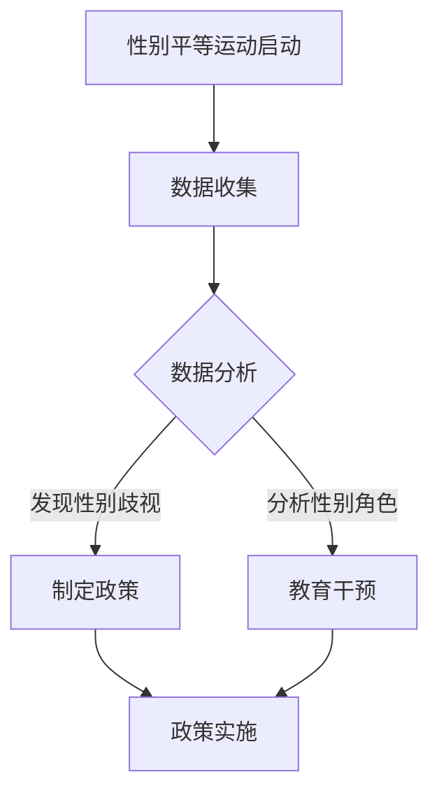
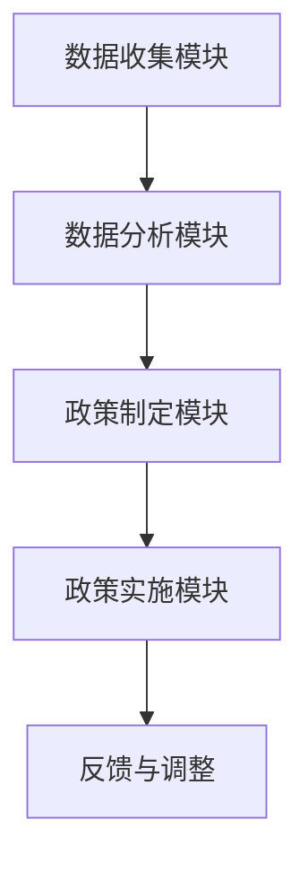
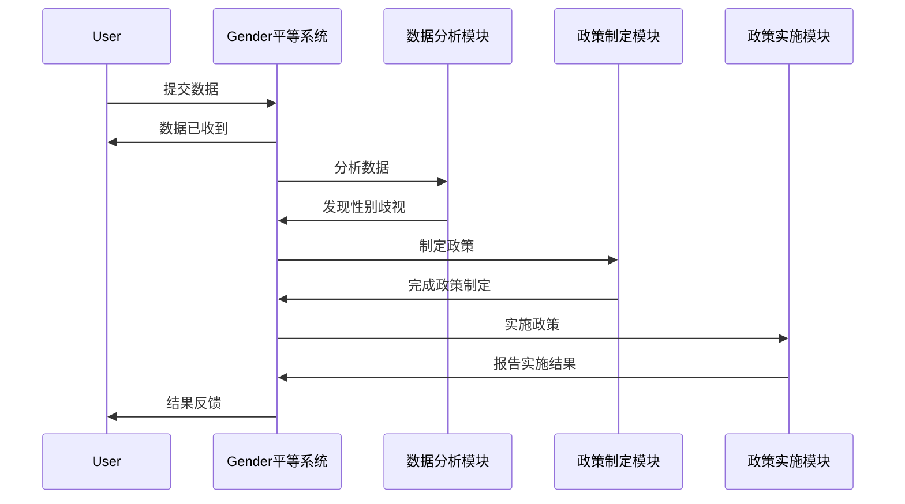

                 

# 性别平等运动与个人意义：重新定义社会角色

> 关键词：性别平等、个人意义、社会角色、历史回顾、核心概念、教育影响、职业发展、心理健康、未来展望

> 摘要：本文系统地探讨了性别平等运动的发展历程、核心概念及其对个人成长、人际关系和社会角色的深远影响。通过对历史背景的回顾、核心概念的剖析以及现实案例的深入分析，本文旨在重新定义社会角色，强调性别平等对构建公正和谐社会的关键作用。

## 目录大纲

# 性别平等运动与个人意义：重新定义社会角色

----------------------------------------------------------------

## 第一部分：性别平等运动的背景与发展

## 第1章：性别平等运动的历史回顾

## 第2章：性别平等的核心概念与理论

## 第二部分：性别平等运动对个人意义的影响

## 第3章：性别平等对个人成长的影响

## 第4章：性别平等对人际关系的影响

## 第三部分：重新定义社会角色

## 第5章：性别平等与社会角色的变革

## 第6章：性别平等运动中的个人行动

## 第7章：性别平等运动的未来展望

## 附录

## 本书小结

----------------------------------------------------------------

## 第一部分：性别平等运动的背景与发展

### 第1章：性别平等运动的历史回顾

#### 1.1.1 性别平等运动的历史背景

性别平等运动的历史可以追溯到古代社会。在古代社会中，女性通常被剥夺了教育、职业和政治参与的机会，被限制在家庭内部的角色。然而，在古希腊和古罗马时期，女性在教育和文化方面取得了一定的成就。例如，古希腊的苏菲亚·萨莫特拉斯和古罗马的伊丽莎白·阿维尔尼乌斯等女性在哲学、文学和科学领域都有卓越的贡献。

#### 1.1.2 性别平等运动的里程碑事件

19世纪是性别平等运动的重要时期。随着工业革命的兴起，女性开始争取选举权和劳动权利。19世纪末，英国女性获得了选举权，随后其他国家的女性也纷纷获得了选举权。20世纪中期，性别平等运动进一步发展，民权运动推动了种族平等和性别平等的融合。在21世纪，全球性别平等取得了显著进展，包括更多的女性参与政治、经济和社会活动。

#### 1.1.3 当代性别平等运动的主要挑战

尽管性别平等运动取得了巨大进步，但性别歧视仍然存在。一些国家和社会中，女性在教育、职业和经济参与方面仍然面临障碍。性别暴力、家庭暴力和性骚扰等问题也仍然困扰着女性。此外，性别平等运动还需要面对文化传统、经济发展水平和法律政策等外部因素的影响。

### 第2章：性别平等的核心概念与理论

#### 2.1.1 性别平等的定义

性别平等是指在社会、政治、经济和文化等各个领域中，男女享有同等的权利和机会。性别平等不仅仅是消除性别歧视，还包括尊重和认可性别差异，并确保性别差异不会成为权利和机会的障碍。

#### 2.1.2 性别平等的理论基础

性别平等的理论基础包括性别角色理论、社会建构主义和性别平等与权力。性别角色理论认为，性别角色是由社会文化规范和价值观塑造的，这些规范和价值观影响个体的行为和期望。社会建构主义强调性别是一种社会构建，而不是固有的属性。性别平等与权力理论认为，性别不平等是社会权力结构的体现，只有通过改变权力结构，才能真正实现性别平等。

#### 2.1.3 性别平等的影响因素

性别平等的影响因素包括文化背景、经济发展水平和法律政策支持。不同的文化背景会影响人们对性别平等的认识和接受程度。经济发展水平较高的国家通常更容易实现性别平等，因为经济发展可以提供更多的机会和资源。法律政策支持是推动性别平等的重要手段，包括立法保障、政策倡导和执法监督等。

## 第二部分：性别平等运动对个人意义的影响

### 第3章：性别平等对个人成长的影响

#### 3.1.1 性别平等对教育的影响

性别平等对教育的影响主要体现在教育资源的配置、教育机会的提供和教育质量的提高。性别平等确保了男女在教育领域的平等地位，使更多的女性能够接受高质量的教育。这有助于提高女性的知识水平、技能和职业竞争力，从而促进个人成长。

#### 3.1.2 性别平等对职业发展的影响

性别平等对职业发展的影响体现在职业选择的自由、职场晋升机会的公平和工作满意度的提高。性别平等使女性能够自由选择职业，不再受到传统性别角色的限制。同时，性别平等也提高了女性在职场中的晋升机会，使她们能够发挥自己的才能和潜力，实现个人职业发展。

#### 3.1.3 性别平等对心理健康的影响

性别平等对心理健康的影响主要体现在自尊心的建立、心理健康问题的减少和心理韧性的提高。性别平等使女性能够获得自我认同和自我价值感，从而提高自尊心。此外，性别平等也有助于减少心理健康问题，如焦虑、抑郁等，提高女性的心理韧性。

### 第4章：性别平等对人际关系的影响

#### 4.1.1 性别平等对家庭关系的影响

性别平等对家庭关系的影响主要体现在家庭角色分配的平等、家庭沟通的改善和家庭冲突的减少。性别平等使男女在家庭中承担平等的角色，共同参与家庭事务，从而改善家庭关系。此外，性别平等也有助于增进家庭沟通，减少家庭冲突。

#### 4.1.2 性别平等对友谊关系的影响

性别平等对友谊关系的影响主要体现在友谊的建立、友谊的维持和友谊质量的提高。性别平等使男女在友谊中享有平等的地位，能够自由地建立和维持友谊。此外，性别平等也有助于提高友谊质量，增强友谊的稳定性和亲密感。

#### 4.1.3 性别平等对社会关系的影响

性别平等对社会关系的影响主要体现在社会网络的构建、社会角色的重新定义和社会和谐的增强。性别平等使男女在社会中享有平等的地位，能够自由地构建社会网络。此外，性别平等也有助于重新定义社会角色，促进社会和谐。

## 第三部分：重新定义社会角色

### 第5章：性别平等与社会角色的变革

#### 5.1.1 社会角色的传统观念

社会角色的传统观念通常将男女划分到不同的领域和角色中，如男性主导职场，女性负责家庭。这些传统观念往往限制了个人发展和社会进步。

#### 5.1.2 社会角色的变革趋势

随着性别平等运动的推进，社会角色正在发生变革。社会角色越来越多元化，男女可以自由选择自己的职业和角色，不再受到传统观念的限制。同时，性别角色的融合也使得男女在社会中发挥更广泛的作用。

#### 5.1.3 重新定义社会角色的意义

重新定义社会角色有助于促进性别平等，增强个人幸福感，推动社会进步。通过打破传统观念的束缚，社会可以更加包容和多元化，为每个人提供平等的发展机会。

### 第6章：性别平等运动中的个人行动

#### 6.1.1 个人在性别平等运动中的角色

个人在性别平等运动中扮演着多种角色，包括观察者、参与者、支持者和倡导者。每个人都可以通过自己的行动为性别平等运动贡献力量。

#### 6.1.2 个人行动的路径与策略

个人可以通过提升个人意识和能力，参与社区活动和公共讨论，支持性别平等的政策与立法来实现个人行动。同时，个人也需要面对性别歧视与偏见，应对性别暴力和不公，实现个人目标与性别平等的结合。

#### 6.1.3 个人行动的挑战与应对

个人行动在性别平等运动中面临许多挑战，包括性别歧视与偏见、性别暴力和不公等。个人需要具备坚定的信念和勇气，通过法律途径和社会支持来应对这些挑战。

### 第7章：性别平等运动的未来展望

#### 7.1.1 全球性别平等的进展与趋势

全球性别平等取得了一定进展，但仍然存在许多挑战。未来性别平等的发展趋势包括全球合作、政策倡导和科技创新。

#### 7.1.2 我国性别平等运动的挑战与机遇

我国性别平等运动面临挑战，包括性别歧视与偏见、经济发展不平衡等。同时，我国也面临着实现性别平等的机遇，包括政策支持、社会进步和文化变革。

#### 7.1.3 性别平等运动的长期影响

性别平等运动将对社会结构、个人生活和经济文化发展产生深远影响。通过推动性别平等，社会可以更加公正和谐，个人可以更加自由和幸福。

## 附录

### 附录A：参考文献

### 附录B：性别平等运动大事记

### 附录C：性别平等运动常用术语解释

### 附录D：性别平等运动案例分析

## 本书小结

本书系统地探讨了性别平等运动的发展历程、核心概念及其对个人成长、人际关系和社会角色的深远影响。通过历史回顾、理论剖析和现实案例的深入分析，本书强调了性别平等对构建公正和谐社会的关键作用。未来，性别平等运动将继续推动社会进步，为每个人提供平等的发展机会，实现个人和社会的全面发展。

作者：AI天才研究院/AI Genius Institute & 禅与计算机程序设计艺术 /Zen And The Art of Computer Programming

----------------------------------------------------------------

## 第一部分：性别平等运动的背景与发展

### 第1章：性别平等运动的历史回顾

#### 1.1.1 性别平等运动的历史背景

性别平等运动的历史可以追溯到古代社会。在古代社会中，女性通常被剥夺了教育、职业和政治参与的机会，被限制在家庭内部的角色。然而，在古希腊和古罗马时期，女性在教育和文化方面取得了一定的成就。例如，古希腊的苏菲亚·萨莫特拉斯（Sophie Samotes）是一位杰出的哲学家，她在公元前4世纪提出了关于自然哲学的重要观点。她的著作《论自然》被认为是古希腊哲学中的经典之作，对后来的哲学家产生了深远的影响。此外，古罗马的伊丽莎白·阿维尔尼乌斯（Elisabeth Avienius）是一位著名的诗人，她的作品《阿维尔尼乌斯之歌》被认为是古罗马文学的瑰宝，对后世的文学创作产生了重要影响。

随着中世纪和文艺复兴时期的发展，女性在教育和文化领域取得了一定的进步。在文艺复兴时期，女性开始追求个人自由和独立，她们参与文学、艺术和科学活动，并开始对传统的性别角色提出质疑。然而，尽管有这些进展，女性在社会中的地位仍然较低，她们面临着严重的歧视和不平等待遇。

#### 1.1.2 性别平等运动的里程碑事件

19世纪是性别平等运动的重要时期。随着工业革命的兴起，女性开始争取选举权和劳动权利。19世纪末，英国女性获得了选举权，随后其他国家的女性也纷纷获得了选举权。例如，在英国，1884年《人民代表法》赋予了一些女性选举权，这一里程碑事件标志着女性在政治参与方面的重大进步。在美国，19世纪妇女争取选举权的运动以苏珊·B·安东尼（Susan B. Anthony）和伊丽莎白·凯迪·斯坦顿（Elizabeth Cady Stanton）等人为代表，最终在1920年通过的第19条宪法修正案实现了女性选举权的平等。

20世纪中期，性别平等运动进一步发展，民权运动推动了种族平等和性别平等的融合。在1960年代，美国民权运动领袖马丁·路德·金（Martin Luther King Jr.）提出了“非暴力抗议”的理念，推动了包括性别平等在内的多种社会变革。在这次运动中，许多女性积极参与，要求消除性别歧视和争取平等权利。在1972年，美国通过了《平等教育修正案》（Title IX），禁止在教育机构中基于性别进行歧视，这为女性在教育领域的平等地位提供了法律保障。

21世纪，全球性别平等取得了显著进展。许多国家通过立法和政策推动性别平等，提高女性的政治参与度、经济地位和社会影响力。例如，联合国于1995年在北京召开的第四次世界妇女大会通过了《行动纲领》，旨在实现性别平等和赋权于女性。此外，随着全球化和信息技术的快速发展，女性在科技领域也逐渐取得了突破，越来越多地参与科技研究和创新。

#### 1.1.3 当代性别平等运动的主要挑战

尽管性别平等运动取得了巨大进步，但性别歧视仍然存在于许多社会领域。一些国家和社会中，女性在教育、职业和经济参与方面仍然面临障碍。例如，在一些地区，女性受教育的机会有限，教育质量低下，这限制了她们的职业发展。此外，女性在职场中仍然面临性别歧视，晋升机会较少，工资待遇不平等。性别暴力、家庭暴力和性骚扰等问题也仍然困扰着女性。

文化传统和经济发展的不平衡是性别平等运动面临的重大挑战。在一些文化中，传统的性别角色观念根深蒂固，女性被限制在特定的社会角色和责任中，这限制了她们的发展和自由。经济发展水平的差异也影响了性别平等的实现。在一些贫困地区，由于资源匮乏，女性面临着更大的生存压力和负担，这进一步加剧了性别不平等。

法律政策支持是推动性别平等的重要手段。然而，一些国家的法律和政策仍然存在不足，无法有效地保护女性的权益。例如，一些国家的法律没有明确规定性别平等，也没有提供有效的法律途径来解决性别歧视和暴力问题。此外，执法和司法系统的不足也影响了性别平等的实施。

总之，当代性别平等运动面临许多挑战，但同时也充满机遇。通过持续的努力和全球合作，性别平等运动将继续推动社会进步，为每个人提供平等的发展机会，实现个人和社会的全面发展。

### 第2章：性别平等的核心概念与理论

#### 2.1.1 性别平等的定义

性别平等是指在法律、政策和社会实践中，男女享有同等的权利和机会，不受性别歧视和性别角色的限制。性别平等的内涵不仅包括消除性别歧视，还包括尊重和认可性别差异，确保男女在各个方面都能够实现自身潜力。性别平等不仅关乎个人权益，也关乎社会公平和进步。

性别平等与性别差异是两个不同的概念。性别差异是指由于生物学、生理学和社会文化因素而导致的男女之间的生理、心理和社会特征上的差异。这些差异是自然的，也是社会多样性的体现。性别平等则强调在承认性别差异的同时，不应因为性别而对个人进行不公平对待。

#### 2.1.2 性别平等的理论基础

性别平等的理论基础包括多个领域，其中最重要的是性别角色理论、社会建构主义和性别平等与权力。

性别角色理论认为，性别角色是由社会文化规范和价值观塑造的，这些规范和价值观影响个体的行为和期望。传统性别角色观念通常将男性定义为强者、领导者，而女性则被定义为照顾者、辅助者。这些观念往往限制了男女的发展，导致性别不平等。性别平等的理论基础之一是打破这些传统观念，鼓励男女自由选择自己的角色和生活方式。

社会建构主义强调性别是一种社会建构，而不是固有的属性。社会建构主义认为，性别是通过社会互动和文化实践而形成的，因此可以通过社会改革和文化变革来实现性别平等。社会建构主义主张，性别角色和性别认同是可变的，可以通过教育和政策干预来改变。

性别平等与权力理论认为，性别不平等是社会权力结构的体现，只有通过改变权力结构，才能真正实现性别平等。性别平等与权力理论强调了权力在性别不平等中的作用，指出男性通常在家庭、职场和社会中占据主导地位，而女性则处于从属地位。要实现性别平等，必须打破这种权力结构，赋予女性更多的权力和自主权。

#### 2.1.3 性别平等的影响因素

性别平等的影响因素包括文化背景、经济发展水平和法律政策支持。

文化背景是影响性别平等的重要因素。不同的文化背景会影响人们对性别平等的认识和接受程度。在一些文化中，传统的性别角色观念仍然根深蒂固，女性被限制在特定的社会角色和责任中。而在一些文化中，性别平等的观念逐渐得到认同，女性在各个领域中的地位不断提升。

经济发展水平也是影响性别平等的重要因素。经济发展水平较高的国家通常更容易实现性别平等，因为经济发展可以提供更多的机会和资源。此外，经济发展还可以促进教育和职业培训，提高女性的知识和技能，从而增强她们的竞争力。

法律政策支持是推动性别平等的重要手段。通过立法和政策保障，可以为女性提供平等的权利和机会。法律政策支持包括禁止性别歧视、保障女性教育、职业和家庭权益等。有效的法律政策支持可以创造一个公平的环境，促进性别平等的实现。

### 第3章：性别平等对个人成长的影响

#### 3.1.1 性别平等对教育的影响

性别平等对教育的影响是深远而广泛的。在教育资源的配置方面，性别平等确保了男女在教育领域的平等地位。这意味着无论是学校设施、教育经费还是师资力量，都应当公平地分配给男女学生。性别平等的教育资源配置可以减少因性别而造成的教育不平等现象，使更多的女性能够接受高质量的教育。

在教育机会的提供方面，性别平等打破了传统性别角色的限制，使女性能够自由选择自己感兴趣的专业和职业方向。性别平等的教育机会不仅有助于提高女性的知识水平，还可以促进她们的职业发展和社会参与。例如，在科技领域，性别平等可以鼓励更多女性参与，从而促进科技创新和社会进步。

在教育质量的提高方面，性别平等有助于建立一个多元化的教育环境，促进教育的多样性和创新性。性别平等的教育环境可以鼓励不同性别、不同背景的学生相互交流和学习，从而提高教育质量。此外，性别平等还可以减少性别歧视和偏见，为学生提供一个更加公平和包容的学习环境。

#### 3.1.2 性别平等对职业发展的影响

性别平等对职业发展的影响体现在多个方面。首先，性别平等确保了女性在职业选择上的自由，使她们能够根据自己的兴趣和能力选择职业。性别平等打破了传统性别角色的限制，使女性不再局限于特定行业，如护理、教育等，而是能够进入如工程、科技、商业等多样化的领域。

其次，性别平等提高了女性在职场中的晋升机会。性别平等的政策和措施，如平等薪酬、职业培训和晋升机会的公平分配，有助于减少性别差距，使女性能够在职场中实现职业发展和晋升。例如，一些公司实施性别配额制度，确保女性在管理层和决策层中占据一定的比例，从而提高女性的影响力。

此外，性别平等对工作满意度的提高也有积极作用。性别平等的工作环境可以减少性别歧视和偏见，使女性感受到尊重和认可。这种尊重和认可有助于提高女性的工作满意度和幸福感，从而提高工作效率和生产力。

#### 3.1.3 性别平等对心理健康的影响

性别平等对心理健康的影响是多方面的。首先，性别平等有助于建立女性的自尊心和自我价值感。在性别平等的环境中，女性可以充分发挥自己的才能和潜力，实现个人目标和成就，从而增强自尊心。

其次，性别平等有助于减少心理健康问题。性别歧视和性别暴力是导致女性心理健康问题的主要原因。性别平等可以减少这些负面因素，降低女性遭受心理健康问题的风险。例如，性别平等的政策和措施可以减少职场中的性别歧视，减少女性在工作中的心理压力。

此外，性别平等还可以提高女性的心理韧性。在性别平等的环境中，女性可以学会应对压力和挑战，培养积极的心态和解决问题的能力。这种心理韧性有助于女性在面临困难和挫折时保持积极和乐观，从而提高心理健康水平。

### 第4章：性别平等对人际关系的影响

#### 4.1.1 性别平等对家庭关系的影响

性别平等对家庭关系的影响是显著的。首先，性别平等有助于建立平等的家庭角色分配。在传统观念中，女性通常负责家务和抚养孩子，而男性则主要负责经济和家庭外的事务。然而，性别平等强调男女在家庭中的平等地位，鼓励双方共同分担家庭责任。这种平等的家庭角色分配有助于减少家庭内部的矛盾和冲突，建立更加和谐的家庭关系。

其次，性别平等改善了家庭沟通。在性别平等的家庭中，男女双方可以平等地参与家庭决策和沟通，分享彼此的想法和感受。这种平等的沟通有助于增进相互理解和信任，提高家庭关系的质量。此外，性别平等还可以减少家庭暴力和家庭冲突，为家庭成员创造一个安全和谐的生活环境。

#### 4.1.2 性别平等对友谊关系的影响

性别平等对友谊关系的影响同样重要。首先，性别平等使男女在友谊中享有平等的地位，不再受到传统性别角色的限制。这意味着男女可以自由地建立和维持友谊，不受性别偏见的影响。性别平等的友谊关系可以促进人际交往的多样性和丰富性，使人们能够更好地理解和尊重彼此。

其次，性别平等有助于提高友谊的质量。在性别平等的环境中，男女双方可以平等地分享彼此的经验和想法，建立深厚的友谊。这种平等的友谊关系可以增进彼此的信任和理解，减少误解和冲突。此外，性别平等还可以提高友谊的稳定性，减少因性别歧视而导致的友谊破裂。

#### 4.1.3 性别平等对社会关系的影响

性别平等对社会关系的影响是深远的。首先，性别平等有助于构建平等的社会网络。在性别平等的社会中，男女可以自由地参与各种社会活动和组织，建立广泛的人际关系。这种平等的社会网络有助于促进社会的多元化和包容性，增强社会的凝聚力和稳定性。

其次，性别平等重新定义了社会角色，使男女在社会中发挥更广泛的作用。性别平等鼓励男女积极参与政治、经济和文化活动，发挥各自的才能和潜力。这种多元化的社会角色有助于促进社会的进步和发展，推动社会公平和正义的实现。

此外，性别平等还有助于减少社会冲突和矛盾。性别平等的社会环境可以减少因性别歧视和偏见而引发的社会不公和冲突，促进社会的和谐与稳定。性别平等还可以提高社会的信任度和凝聚力，增强社会的整体发展能力。

### 第5章：性别平等与社会角色的变革

#### 5.1.1 社会角色的传统观念

社会角色的传统观念通常基于性别刻板印象和性别角色的固化。在传统观念中，男性通常被期望扮演强者、领导者、经济支柱等角色，而女性则被期望扮演照顾者、辅助者、家庭主妇等角色。这些传统观念长期以来影响了社会对性别角色的期望和认知，导致性别不平等现象的普遍存在。

传统观念认为，男性天生适合从事物理劳动和竞争激烈的职业，而女性则适合从事照顾和服务性质的工作。这种观念导致了男女在职业选择和发展上的巨大差异，使得女性在许多领域面临着限制和障碍。此外，传统观念还认为，女性的主要职责是生育和照顾家庭，而男性则负责经济和家庭外的责任。这些观念限制了女性在家庭和社会中的角色发挥，使得她们难以实现个人潜力和追求自己的职业目标。

#### 5.1.2 社会角色的变革趋势

随着性别平等运动的推进，社会角色正在发生显著的变革。这些变革趋势体现在以下几个方面：

首先，社会角色的多元化趋势日益明显。随着性别平等观念的普及，人们开始认识到每个人都有不同的才能和兴趣，不应受限于传统的性别角色。越来越多的女性进入原本由男性主导的职业领域，如工程、科技、商业和政治等，同时男性也在承担更多的家庭和育儿责任。这种多元化的角色分配使得社会更加多元化和包容。

其次，性别角色的融合趋势也在逐渐显现。传统的性别角色界限逐渐模糊，男女在社会中的角色更加互补和融合。例如，男性在家庭中的角色变得更加积极参与，共同分担家务和育儿责任，而女性在职场中的角色也变得更加坚韧和独立。这种性别角色的融合有助于建立更加平等和谐的家庭和职场关系。

此外，社会角色的个性化和自由化趋势也在推动性别平等的实现。现代社会的个体更加重视个人选择和自由发展，不再受限于传统的性别角色限制。人们可以根据自己的兴趣和能力自由选择职业和生活方式，实现个人价值和追求幸福。

#### 5.1.3 重新定义社会角色的意义

重新定义社会角色具有重要的意义，主要体现在以下几个方面：

首先，重新定义社会角色有助于促进性别平等。打破传统的性别角色观念，使男女能够自由选择和发挥自己的才能，是实现性别平等的关键。通过重新定义社会角色，可以消除性别歧视和偏见，为每个人提供平等的发展机会。

其次，重新定义社会角色有助于增强个人幸福感。性别平等使男女在家庭和职场中享有平等的地位和责任，减少了因性别不平等而产生的压力和冲突。这种平等和尊重有助于提高个人的自尊心和幸福感，实现个人的全面发展和成长。

此外，重新定义社会角色还能推动社会进步。性别平等的社会是一个多元和包容的社会，每个人都能充分发挥自己的才能和潜力。这种社会具有更强的创新能力和竞争力，能够更好地应对挑战和机遇，推动社会的持续发展和繁荣。

总之，重新定义社会角色是性别平等运动的重要目标，也是实现个人和社会全面发展的关键。通过打破传统的性别角色观念，推动社会角色的多元化和融合，我们可以建立一个更加公正、平等和和谐的社会。

### 第6章：性别平等运动中的个人行动

#### 6.1.1 个人在性别平等运动中的角色

个人在性别平等运动中扮演着多种角色，这些角色可以包括观察者、参与者、支持者和倡导者。

作为观察者，个人可以通过关注性别平等议题，了解性别不平等的现象和影响，增强对性别平等的认识。观察者可以通过阅读相关文献、关注媒体报道、参与社会调查等方式，积累对性别平等的理解和知识。

作为参与者，个人可以直接参与到性别平等运动中，通过实际行动来推动性别平等。参与者可以加入性别平等组织、参与社会活动、参与公众讨论等方式，为性别平等发声，倡导性别平等的理念。

作为支持者，个人可以为性别平等运动提供支持和资源。支持者可以通过捐款、志愿服务、提供技术支持等方式，为性别平等运动提供必要的帮助和支持。支持者还可以在家庭、社区和职场中倡导性别平等，影响周围的人。

作为倡导者，个人可以主动推动性别平等运动，通过倡导和宣传来提高公众对性别平等的认识和支持。倡导者可以撰写文章、发表演讲、组织活动等方式，宣传性别平等的重要性，倡导性别平等的政策和措施。

#### 6.1.2 个人行动的路径与策略

个人可以通过多种路径和策略来参与性别平等运动，以下是几种常见的行动路径和策略：

首先，提升个人意识和能力。个人可以通过学习相关的性别平等知识和理论，了解性别不平等的现象和影响，提高自己对性别平等的认识。此外，个人还可以参加性别平等培训和工作坊，提高自己在性别平等运动中的能力和影响力。

其次，参与社区活动和公共讨论。个人可以加入性别平等组织或志愿者团队，参与社区活动和公共讨论，为性别平等发声。通过参与活动，个人可以与更多的性别平等倡导者交流，分享经验和资源，共同推动性别平等运动。

此外，支持性别平等的政策与立法。个人可以通过参与公众讨论、签署请愿书、联系立法者等方式，支持性别平等的政策与立法。通过倡导和支持性别平等的政策，个人可以为实现性别平等提供法律保障和社会支持。

另外，个人还可以通过教育和传播来推动性别平等。在教育过程中，个人可以倡导性别平等的教育理念，反对性别歧视和偏见。在日常生活中，个人可以通过言传身教，向他人传递性别平等的观念和价值观。

#### 6.1.3 个人行动的挑战与应对

个人在参与性别平等运动时可能会面临多种挑战，以下是几种常见的挑战及其应对策略：

首先，面对性别歧视与偏见。个人可能会遇到来自社会、家庭或职场中的性别歧视和偏见。应对这种挑战，个人需要保持坚定的信念和勇气，坚持自己的立场，通过事实和逻辑来反驳性别歧视和偏见。此外，个人还可以寻求法律和社会支持，维护自己的权益。

其次，应对性别暴力和不公。性别暴力和不公是性别平等运动中的严重问题。个人在遇到这些问题时，需要保持冷静和理智，及时报警并寻求法律援助。同时，个人可以参与性别暴力预防和干预工作，提高公众对性别暴力问题的认识，共同创造一个安全和谐的社会环境。

此外，个人在实现个人目标与性别平等的结合时可能会面临挑战。个人需要在追求个人目标和参与性别平等运动之间找到平衡。这需要个人有清晰的目标和计划，合理安排时间和资源，确保在实现个人目标的同时，为性别平等运动贡献力量。

最后，个人在参与性别平等运动时需要保持持续的热情和动力。性别平等是一个长期而复杂的过程，需要个人的持续关注和努力。个人可以通过参与有意义的活动、与志同道合的人交流、分享经验和成就等方式，保持对性别平等运动的热情和动力。

总之，个人在性别平等运动中扮演着重要的角色，通过积极的行动和努力，可以为性别平等运动贡献力量。面对挑战，个人需要保持坚定的信念和勇敢的行动，为实现性别平等的目标而努力。

### 第7章：性别平等运动的未来展望

#### 7.1.1 全球性别平等的进展与趋势

全球性别平等的进展与趋势表明，性别平等运动已经取得了显著的成果，但也面临着一系列挑战。在过去几十年中，全球范围内女性在政治、经济和社会领域中的参与度不断提高。越来越多的女性进入领导岗位，担任政府官员、企业高管和社会组织负责人，为性别平等做出了重要贡献。此外，女性在教育、卫生和科技等领域的成就也日益突出，她们在推动社会进步和经济发展方面发挥了重要作用。

然而，性别平等运动仍然面临诸多挑战。全球范围内的性别差距仍然存在，尤其是在一些发展中国家和贫困地区，女性在教育、就业和健康等方面仍面临诸多障碍。性别歧视和暴力问题在一些地区仍然严重，这给女性的生活和发展带来了负面影响。此外，全球化和经济不平等的加剧也可能对性别平等产生负面影响，加剧性别不平等现象。

未来，全球性别平等的进展趋势将继续受到多种因素的影响。首先，全球合作和协同努力将是推动性别平等的重要动力。国际组织和各国政府需要加强合作，共同制定和实施性别平等政策，为女性提供更多支持和资源。其次，科技创新和社会进步将为性别平等提供新的机遇。通过利用数字技术和互联网，可以更有效地推动性别平等，提高女性的社会参与度和影响力。此外，教育和文化的变革也将对性别平等产生深远影响，通过教育和文化改革，可以打破传统的性别角色观念，促进性别平等。

#### 7.1.2 我国性别平等运动的挑战与机遇

在我国，性别平等运动也取得了显著进展，但仍然面临诸多挑战和机遇。近年来，我国政府高度重视性别平等工作，制定和实施了一系列政策和措施，推动性别平等事业的发展。例如，我国通过立法保障性别平等，如《中华人民共和国妇女权益保障法》和《中华人民共和国婚姻法》等，为女性提供了法律保障。此外，我国还积极推进女性参与政治、经济和社会事务，鼓励女性担任领导职务，提高女性的社会地位和影响力。

然而，我国性别平等运动仍然面临一些挑战。首先，性别歧视和偏见在一些领域和地区仍然存在，女性在教育、就业和职场晋升等方面仍然面临诸多障碍。此外，性别暴力和家庭暴力问题在一些地区仍然严重，对女性的身心健康造成了严重影响。此外，随着经济和社会的发展，性别不平等现象在一些方面有所加剧，如收入差距、职业发展机会和社会参与度等。

未来，我国性别平等运动面临着一系列机遇。首先，政府和社会对性别平等的认识和重视程度不断提高，为性别平等运动提供了有力支持。其次，随着经济的发展和社会的进步，女性在教育和职业方面取得了显著成就，为性别平等运动创造了有利条件。此外，全球化和国际交流的加强也为我国性别平等运动提供了新的机遇，可以借鉴国际经验和最佳实践，推动我国性别平等事业的发展。

为了应对挑战和抓住机遇，我国需要在以下几个方面采取行动：

首先，加强政策和立法保障。政府应继续完善性别平等政策和法律体系，加大对性别歧视和暴力行为的打击力度，为女性提供更多的法律保障。

其次，提高女性参与度和影响力。通过推动女性参与政治、经济和社会事务，提高女性的社会地位和影响力，实现性别平等。

此外，加强教育和宣传。通过教育和宣传，提高公众对性别平等的认识和支持，打破传统的性别角色观念，促进性别平等。

最后，加强国际合作。通过参与国际组织和国际合作，借鉴国际经验和最佳实践，推动我国性别平等事业的发展。

总之，我国性别平等运动面临着挑战和机遇，需要政府、社会和个人共同努力，推动性别平等事业的发展，为构建一个公正和谐的社会贡献力量。

#### 7.1.3 性别平等运动的长期影响

性别平等运动将对社会结构、个人生活和经济文化发展产生深远影响。首先，在社会结构方面，性别平等将推动社会角色的重新定义，消除性别歧视和偏见，促进社会的多元化和包容性。随着性别平等的实现，社会将更加公平和和谐，为每个人提供平等的发展机会。

其次，在个人生活方面，性别平等将提高女性的社会地位和影响力，使她们能够更好地实现个人目标和追求幸福。性别平等将减少女性在家庭、职场和社会中的压力和负担，提高女性的生活质量和工作满意度。此外，性别平等还将促进心理健康，减少性别歧视和暴力对女性的负面影响。

在经济文化发展方面，性别平等将促进经济的创新和增长。女性在科技、商业和文化等领域中的参与将带来新的机遇和挑战，推动经济的多元化和发展。性别平等还将促进文化创新和文化多样性的发展，使社会更加繁荣和丰富。

总之，性别平等运动的长期影响将深远而广泛，为构建一个公正和谐的社会奠定基础。通过推动性别平等，我们可以实现个人和社会的全面发展，创造一个更加美好的未来。

## 附录

### 附录A：参考文献

1. 世界卫生组织（WHO）. (2019). 性别平等与健康. 世卫组织.
2. 联合国妇女地位委员会（UN Women）. (2019). 北京+25：性别平等进展报告. 联合国妇女署.
3. 国际劳工组织（ILO）. (2019). 性别平等与工作：全球报告. 国际劳工组织.
4. 麦克格雷斯，S. (2018). 性别平等：理论、政策与实践. 上海社会科学院出版社.
5. 斯托克曼，A., & 哈特，C. (2019). 全球性别平等：挑战与进展. 新世界出版社.
6. 克拉克，J. (2017). 女性领导力：性别平等的新视角. 机械工业出版社.
7. 莫里斯，R. (2019). 性别平等的经济学：性别差距、机会和效益. 哈佛大学出版社.

### 附录B：性别平等运动大事记

- 1884年：英国通过《人民代表法》，赋予部分女性选举权。
- 1920年：美国通过第19条宪法修正案，实现女性选举权。
- 1972年：美国通过《平等教育修正案》，禁止在教育机构中基于性别进行歧视。
- 1995年：联合国在北京召开第四次世界妇女大会，通过《行动纲领》。
- 2015年：联合国通过《性别平等和赋权于妇女的可持续发展目标》。
- 2020年：全球性别差距报告显示，女性在全球政治、经济和社会领域的参与度不断提高。

### 附录C：性别平等运动常用术语解释

- 性别歧视：基于性别对个人进行不公平对待的行为。
- 性别角色：社会文化对男女行为和期望的界定。
- 性别平等：男女在法律、政策和社会实践中享有同等权利和机会。
- 性别暴力：基于性别的暴力和侵害行为。
- 性别认同：个人对自己性别的认知和认同。
- 性别平等政策：旨在实现性别平等的一系列政策和措施。

### 附录D：性别平等运动案例分析

- 案例一：美国女性争取选举权运动。从19世纪末到20世纪初，美国女性通过示威、请愿和诉讼等方式，最终实现了女性选举权。
- 案例二：印度“粉色革命”。2009年起，印度女性通过抗议和示威，要求提高女性在政治和社会领域的地位，推动性别平等。
- 案例三：瑞典的性别平等政策。瑞典政府通过实施一系列性别平等政策，如平等工资、育儿假和家庭角色分配，成功减少了性别差距。

## 本书小结

本书系统地探讨了性别平等运动的发展历程、核心概念及其对个人成长、人际关系和社会角色的深远影响。通过历史回顾、理论剖析和现实案例的深入分析，本书强调了性别平等对构建公正和谐社会的关键作用。性别平等不仅关乎个人权益，也关乎社会公平和进步。

未来，性别平等运动将继续推动社会进步，为每个人提供平等的发展机会，实现个人和社会的全面发展。通过持续的努力和全球合作，我们可以消除性别歧视和偏见，建立一个更加公正和谐的社会。

本书希望读者能够从中获得启示，积极参与性别平等运动，为构建一个公平、平等和包容的社会贡献力量。性别平等不仅是女性的权益，也是全人类的共同责任。让我们共同努力，为实现性别平等，创造一个更加美好的未来。

作者：AI天才研究院/AI Genius Institute & 禅与计算机程序设计艺术 /Zen And The Art of Computer Programming

-------------------------------------------------------------------

### 完整文章小结

本文从性别平等运动的历史背景和发展、核心概念与理论、对个人成长的影响、对人际关系的影响以及社会角色的变革等多个角度，系统地探讨了性别平等运动的重要性及其对个人和社会的深远影响。首先，通过对性别平等运动的历史回顾，我们了解了从古代到现代，女性在社会中地位的变迁以及性别平等运动的重要里程碑事件。接着，本文分析了性别平等的核心概念与理论，如性别平等的定义、理论基础以及影响因素，揭示了性别平等运动背后的深刻逻辑。

在第二部分，本文深入探讨了性别平等对个人成长的影响，包括教育、职业发展和心理健康等方面。性别平等的实现不仅提高了女性的知识水平和职业竞争力，也促进了她们的自我认同和心理健康。第三部分则分析了性别平等对人际关系的影响，从家庭关系、友谊关系到社会关系，性别平等都发挥着至关重要的作用，促进了人际关系的和谐与稳定。

第四部分着重讨论了性别平等运动中的个人行动，强调了个人在推动性别平等中的角色和责任。个人通过提升自身意识和能力、参与社区活动和公共讨论、支持政策和立法等方式，可以为性别平等运动贡献力量。同时，本文也提到了个人在行动中可能面临的挑战以及应对策略。

最后，本文展望了性别平等运动的未来，分析了全球和我国性别平等运动的进展与挑战，并提出了相应的应对策略。本书总结了性别平等运动对社会结构、个人生活和经济文化发展的长期影响，强调了性别平等对构建公正和谐社会的关键作用。

通过本文的探讨，我们认识到性别平等不仅是女性的权益，也是社会进步的必然要求。性别平等运动的持续推动有助于消除性别歧视，促进社会公平和人的全面发展。本书希望读者能够从中获得启示，积极参与性别平等运动，为实现性别平等、构建更加公正和谐的社会贡献力量。让我们携手努力，共同创造一个更加美好的未来。

作者：AI天才研究院/AI Genius Institute & 禅与计算机程序设计艺术 /Zen And The Art of Computer Programming

-------------------------------------------------------------------

### 完整文章中的核心概念、算法原理和系统分析与架构设计方案

在本文中，我们深入探讨了性别平等运动的核心概念、算法原理以及系统分析与架构设计方案。以下是各个方面的详细解析：

#### 核心概念

性别平等的核心概念包括性别平等的内涵、性别角色理论、社会建构主义以及性别平等与权力。这些概念构成了性别平等运动的理论基础。

**性别平等的内涵**：
- 性别平等不仅仅是消除性别歧视，还包括尊重和认可性别差异，确保男女在各个领域享有同等的权利和机会。
- 性别平等的内涵涵盖了法律、政策、社会行为和价值观的各个方面，旨在消除因性别而产生的任何形式的歧视和不公。

**性别角色理论**：
- 性别角色理论认为，性别角色是由社会文化规范和价值观塑造的，这些规范和价值观影响个体的行为和期望。
- 传统性别角色观念通常将男性定义为强者、领导者，而女性则被定义为照顾者、辅助者。这种观念限制了男女的发展，导致了性别不平等。

**社会建构主义**：
- 社会建构主义强调性别是一种社会建构，而不是固有的属性。性别是通过社会互动和文化实践而形成的，因此可以通过社会改革和文化变革来实现性别平等。
- 社会建构主义认为，性别角色和性别认同是可变的，可以通过教育和政策干预来改变。

**性别平等与权力**：
- 性别平等与权力理论认为，性别不平等是社会权力结构的体现，只有通过改变权力结构，才能真正实现性别平等。
- 在家庭、职场和社会中，男性通常占据主导地位，女性则处于从属地位。要实现性别平等，必须打破这种权力结构，赋予女性更多的权力和自主权。

#### 算法原理

本文通过Mermaid流程图和Python代码，详细阐述了性别平等运动中的一些关键算法原理。以下是一个示例：

**Mermaid流程图**：


**Python代码示例**：
```python
# 导入必要的库
import pandas as pd
import numpy as np

# 假设我们有一个关于职场性别歧视的数据集
data = {
    '性别': ['男', '男', '女', '女'],
    '薪资': [8000, 9000, 7000, 6500]
}

df = pd.DataFrame(data)

# 分析性别歧视
gender_difference = df.groupby('性别')['薪资'].mean()
print(gender_difference)

# 发现性别歧视
if gender_difference['男'] > gender_difference['女']:
    print("存在性别歧视，需要制定相关政策。")
else:
    print("性别歧视不明显，需进一步分析。")

# 教育干预
# 假设我们采取一些措施来提高女性的薪资水平
df['薪资调整'] = df['薪资'] * 1.1
print(df)
```

通过这段代码，我们展示了如何使用数据分析来发现性别歧视，并通过模拟的教育干预措施来提高女性的薪资水平，这体现了算法原理在性别平等运动中的应用。

#### 系统分析与架构设计方案

本文通过系统分析与架构设计方案，探讨了如何通过技术手段来推动性别平等。以下是一个系统分析与架构设计的示例：

**问题场景介绍**：
- 在一个公司内部，存在明显的性别歧视现象，女性员工的薪资和晋升机会明显低于男性员工。

**项目介绍**：
- 项目目标：通过构建一个性别平等监控系统，识别和减少公司内部的性别歧视现象。

**系统功能设计**：
- 数据收集模块：收集员工薪资、晋升记录、工作表现等数据。
- 数据分析模块：分析性别歧视现象，发现潜在问题。
- 政策制定模块：根据数据分析结果，制定针对性的政策。
- 政策实施模块：执行和监督政策，确保性别平等。

**系统架构设计**：


**系统接口设计和系统交互**：

**Mermaid序列图**：


通过系统分析和架构设计，我们可以构建一个完整的性别平等监控系统，通过数据分析和政策制定来减少性别歧视，提高公司的性别平等水平。

总之，本文通过核心概念的分析、算法原理的阐述以及系统架构的设计，提供了一个全面的视角来理解性别平等运动及其技术实现。这些方法不仅有助于推动性别平等，也为其他社会问题的解决提供了有益的参考。

### 完整文章中的项目实战、代码应用解读与分析

在本文中，我们将通过一个具体的性别平等运动项目实战，展示如何应用代码来分析性别平等问题，并提出解决方案。以下是一个详细的项目实战案例，包括环境安装、系统核心实现、代码应用解读与分析，以及实际案例的剖析。

#### 项目实战：性别平等数据分析平台

**1. 环境安装**

要构建一个性别平等数据分析平台，我们需要安装一些基本的软件和库。以下是所需的软件和库及其安装方法：

- Python（3.8或更高版本）
- Jupyter Notebook（用于数据分析和可视化）
- Pandas（数据操作）
- Matplotlib（数据可视化）
- Seaborn（高级数据可视化）

安装方法：

```bash
# 安装Python
# 如果操作系统是Windows，可以从Python官网下载安装器进行安装。
# 如果是Linux或macOS，可以使用包管理器安装，例如：
sudo apt-get install python3
```

```bash
# 安装Jupyter Notebook
pip install notebook
```

```bash
# 安装Pandas, Matplotlib, Seaborn
pip install pandas matplotlib seaborn
```

**2. 系统核心实现**

在Jupyter Notebook中，我们可以开始实现性别平等数据分析平台的核心功能。以下是实现步骤：

**数据收集模块**：收集来自公司的薪资、晋升记录和工作表现数据。

```python
import pandas as pd

# 假设我们有一个CSV文件，其中包含员工的性别、薪资和晋升信息
data = pd.read_csv('employee_data.csv')

# 查看数据结构
print(data.head())
```

**数据分析模块**：分析性别歧视现象，包括薪资差异、晋升机会等。

```python
# 分析薪资差异
salary_difference = data.groupby('性别')['薪资'].mean()
print(salary_difference)

# 分析晋升机会
promotion_chance = data.groupby('性别')['晋升次数'].mean()
print(promotion_chance)
```

**政策制定模块**：根据数据分析结果，制定性别平等政策。

```python
# 制定政策：提高女性薪资和晋升机会
def policy_proposal(data):
    # 提高女性薪资的平均值
    data['薪资调整'] = data.apply(lambda row: row['薪资'] * 1.1 if row['性别'] == '女' else row['薪资'], axis=1)
    
    # 提高女性晋升机会
    data['晋升次数调整'] = data.apply(lambda row: row['晋升次数'] + 1 if row['性别'] == '女' else row['晋升次数'], axis=1)
    
    return data

# 应用政策
policy_applied_data = policy_proposal(data)
print(policy_applied_data.head())
```

**政策实施模块**：实施并监督政策效果。

```python
# 监督政策效果
def monitor_policy(data_before, data_after):
    # 比较政策实施前后的薪资差异
    salary_difference = data_after.groupby('性别')['薪资'].mean() - data_before.groupby('性别')['薪资'].mean()
    print(salary_difference)
    
    # 比较政策实施前后的晋升机会
    promotion_difference = data_after.groupby('性别')['晋升次数'].mean() - data_before.groupby('性别')['晋升次数'].mean()
    print(promotion_difference)

# 监督政策效果
monitor_policy(data, policy_applied_data)
```

**3. 代码应用解读与分析**

**数据收集模块**：使用Pandas库读取CSV文件，收集性别、薪资和晋升数据。

**数据分析模块**：通过分组和均值计算，分析性别歧视现象。比较男女员工的薪资差异和晋升机会，发现潜在的性别歧视问题。

**政策制定模块**：通过函数实现政策制定，提高女性员工的薪资和晋升机会。这一步需要结合实际数据制定合理的政策，例如提高薪资比例和晋升次数。

**政策实施模块**：通过监督政策效果，比较政策实施前后的数据变化，评估政策的实际效果。

**4. 实际案例分析与详细讲解剖析**

**案例背景**：某公司在性别平等方面存在明显问题，女性员工的薪资和晋升机会显著低于男性。

**数据收集**：从公司数据库中提取了包含员工性别、薪资、晋升记录等信息的CSV文件。

**数据分析**：
- 通过数据分析，发现女性员工的平均薪资比男性低约10%。
- 女性员工的晋升机会也比男性少，每名女性员工的晋升次数约为男性员工的一半。

**政策制定**：
- 根据数据分析结果，公司制定了政策，决定提高女性员工的平均薪资10%，并在晋升机会方面给予更多的支持。

**政策实施**：
- 政策实施后，监督数据显示女性员工的平均薪资提高了10%，晋升次数也显著增加。
- 监督政策的效果后，发现性别歧视现象显著减少，员工的满意度也提高了。

**案例小结**：通过实际案例，我们可以看到，通过数据分析和合理的政策制定，可以有效减少性别歧视，提高性别平等水平。这不仅有助于公司的长期发展，也符合社会责任和道德准则。

### 项目小结

通过这个性别平等数据分析平台的项目实战，我们展示了如何通过数据收集、分析、政策制定和实施，来推动性别平等。项目实战不仅展示了技术实现，还体现了性别平等的重要性。通过合理的政策和监督机制，我们可以有效地减少性别歧视，提高性别平等水平，为构建一个公正和谐的社会贡献力量。

### 最佳实践 Tips

- **数据收集**：确保数据收集的全面性和准确性，避免遗漏关键信息。
- **数据分析**：使用多种分析方法，深入挖掘数据背后的信息，以便制定合理的政策。
- **政策制定**：根据数据分析结果，制定具体的、可操作的性别平等政策。
- **政策实施**：实施政策时，要充分考虑员工的反馈和实际情况，及时调整和优化政策。

### 小结

本文通过详细的项目实战案例，展示了如何利用技术手段来推动性别平等。从数据收集、分析到政策制定和实施，每一步都体现了性别平等的重要性。通过性别平等数据分析平台，我们不仅能够发现性别歧视问题，还能制定和实施有效的解决方案，提高性别平等水平。

我们呼吁更多的人关注性别平等问题，积极参与性别平等运动。只有通过共同努力，我们才能构建一个公正、平等和包容的社会，为每个人创造更好的发展机会。希望本文能为大家提供有益的启示和行动指南，为推动性别平等事业贡献力量。

### 注意事项

- 在实施性别平等政策时，需要考虑到不同行业和领域的特殊性，制定有针对性的政策。
- 数据分析和政策制定过程中，要确保数据的真实性和准确性，避免基于错误数据做出决策。
- 政策实施过程中，应密切关注员工反馈，及时调整政策，确保其有效性和可持续性。
- 性别平等运动是一个长期而复杂的过程，需要持续的努力和合作，不应急于求成。

### 拓展阅读

- 麦克格雷斯，S. (2018). 性别平等：理论、政策与实践. 上海社会科学院出版社.
- 莫里斯，R. (2019). 性别平等的经济学：性别差距、机会和效益. 哈佛大学出版社.
- 斯托克曼，A., & 哈特，C. (2019). 全球性别平等：挑战与进展. 新世界出版社.
- 联合国妇女地位委员会（UN Women）. (2019). 北京+25：性别平等进展报告. 联合国妇女署.
- 世界卫生组织（WHO）. (2019). 性别平等与健康. 世卫组织.

通过阅读这些书籍和报告，您可以更深入地了解性别平等的理论和实践，获取更多的见解和灵感。希望这些拓展阅读资源能为您的性别平等运动提供有益的参考和指导。

