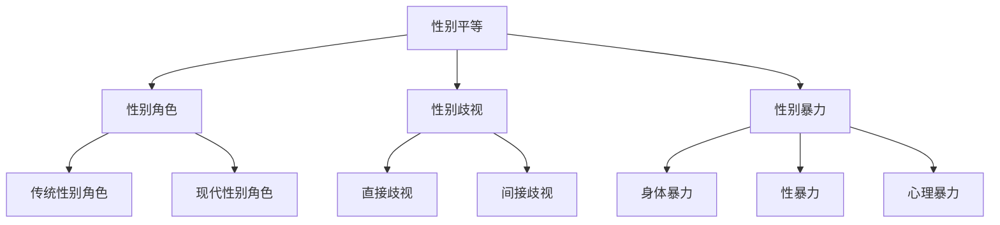
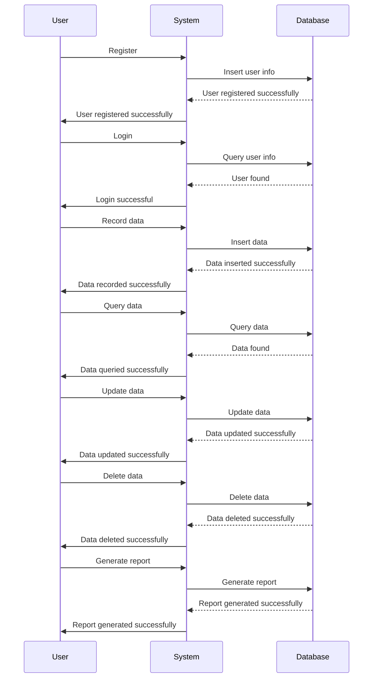

                 

# 性别平等运动：重新定义角色与意义

关键词：性别平等、性别角色、性别歧视、性别暴力、解决方案、核心概念

摘要：性别平等运动起源于19世纪末的妇女解放运动，随着时代的发展，其内涵和外延不断拓展。本文将深入探讨性别平等运动的核心概念、问题背景、解决方案，并分析性别平等运动的边界与外延。通过本文的阅读，读者将更好地理解性别平等运动的本质，及其在现代社会中的重要性。

## 第一部分：背景介绍

### 1.1 问题背景

性别平等运动起源于19世纪末的妇女解放运动，旨在争取女性在法律、教育、就业等方面的平等权利。随着时代的发展，性别平等运动的内涵和外延不断拓展，不仅涉及男女平权，还包括消除性别歧视、促进性别多样性和性别角色的平等。然而，尽管在法律、教育、就业等方面取得了一定进展，性别平等问题仍然存在诸多挑战和争议。

### 1.2 问题描述

性别平等运动的主要问题包括：

- 法律和政策层面：尽管很多国家制定了保障性别平等的法律和政策，但实际执行效果不佳，性别歧视和性别暴力等问题仍然普遍存在。
- 社会文化层面：传统的性别角色刻板印象仍然深刻，女性在家庭、职场和社会中的地位有待提升。
- 经济层面：性别收入差距明显，女性在职场晋升和薪资待遇上普遍受到限制。

### 1.3 问题解决

性别平等运动的解决方案包括：

- 强化法律和政策执行，加大对性别歧视和性别暴力的打击力度。
- 教育和宣传，提高公众对性别平等的认识和重视，改变传统的性别观念和角色刻板印象。
- 经济激励，通过提高女性在职场中的地位和待遇，缩小性别收入差距。

### 1.4 边界与外延

性别平等运动的边界主要包括：

- 法律和政策范畴：涉及性别歧视、性别暴力、婚姻家庭、教育、就业等方面的法律法规。
- 社会文化范畴：涉及性别观念、性别角色、家庭结构、社会价值观等方面的文化传统和习俗。

性别平等运动的外延主要包括：

- 全球性别平等运动：各国和地区的性别平等运动相互影响和借鉴，形成全球性的性别平等运动。
- 性别研究：涉及性别社会学、性别心理学、性别生物学等多个学科领域的性别研究。

### 1.5 概念结构与核心要素组成

性别平等运动的概念结构主要包括：

- 性别平等：男女享有平等权利和机会，不受性别歧视和性别暴力。
- 性别角色：男女在社会、家庭和职场中的角色分配和互动。
- 性别歧视：基于性别的歧视和偏见，限制男女的发展和权利。
- 性别暴力：针对女性的暴力行为，包括身体暴力、性暴力、心理暴力等。

性别平等运动的核心要素组成主要包括：

- 法律政策：制定和执行保障性别平等的法律和政策。
- 教育宣传：提高公众对性别平等的认识和重视，改变传统的性别观念和角色刻板印象。
- 经济激励：提高女性在职场中的地位和待遇，缩小性别收入差距。
- 社会参与：鼓励男性参与性别平等运动，推动性别平等的社会变革。

----------------------------------------------------------------

## 第二部分：核心概念与联系

### 2.1 核心概念原理

在本部分，我们将深入探讨性别平等运动中的几个核心概念，包括性别平等、性别角色、性别歧视、性别暴力等。

#### 2.1.1 性别平等

性别平等是指男女在政治、经济、社会、文化等各个领域享有平等的权利和机会。性别平等不仅包括男女在法律上的平等，还包括在社会生活中的实际平等。性别平等的核心是消除性别歧视，确保男女在家庭、职场和社会中的地位得到平等对待。

#### 2.1.2 性别角色

性别角色是指社会对男女在家庭、职场和社会中的角色期待和分配。传统的性别角色通常将女性定位为家庭照顾者，男性则为家庭经济支柱。然而，随着社会的发展，性别角色的界限逐渐模糊，男女在各个领域的角色分配更加多元化。

#### 2.1.3 性别歧视

性别歧视是指基于性别的偏见和歧视，导致男女在权利、机会和待遇上的不平等。性别歧视可以表现为直接歧视（如招聘时明确拒绝女性应聘者）和间接歧视（如薪资差距、晋升机会的不均等分配）。

#### 2.1.4 性别暴力

性别暴力是指针对女性的暴力行为，包括身体暴力、性暴力、心理暴力等。性别暴力不仅对女性的身体健康造成伤害，还严重影响她们的心理健康和生活质量。

### 2.2 概念属性特征对比表格

为了更好地理解这些核心概念，我们提供了一个对比表格，列出每个概念的属性特征：

| 概念     | 定义                                                         | 属性特征                                                         |
|----------|------------------------------------------------------------|----------------------------------------------------------------|
| 性别平等 | 男女在各个领域享有平等的权利和机会，消除性别歧视           | 法律平等、实际平等、消除性别歧视、促进性别角色的多元化       |
| 性别角色 | 社会对男女在家庭、职场和社会中的角色期待和分配           | 传统角色、现代角色、多元化角色、性别角色模糊化           |
| 性别歧视 | 基于性别的偏见和歧视，导致男女在权利、机会和待遇上的不平等 | 直接歧视、间接歧视、性别偏见、性别不公           |
| 性别暴力 | 针对女性的暴力行为，包括身体暴力、性暴力、心理暴力等     | 身体伤害、心理创伤、性侵犯、性别暴力连锁反应       |

### 2.3 ER实体关系图架构

为了更清晰地展示性别平等运动中的核心概念之间的关系，我们可以使用ER（实体关系）图来描述。

```mermaid
erDiagram
    User ||--|{ GenderEquality }|-- GenderRole
    User ||--|{ GenderDiscrimination }|-- GenderViolence
    GenderEquality ||--|{ GenderEqualityPolicy }|
    GenderEquality ||--|{ GenderEqualityEducation }|
    GenderEquality ||--|{ GenderEqualityEconomicIncentive }|
    GenderRole ||--|{ TraditionalGenderRole }|-- ModernGenderRole
    GenderRole ||--|{ GenderRoleInequality }|
    GenderDiscrimination ||--|{ DirectDiscrimination }|-- IndirectDiscrimination
    GenderDiscrimination ||--|{ GenderBiases }|
    GenderViolence ||--|{ PhysicalViolence }|-- SexualViolence
    GenderViolence ||--|{ PsychologicalViolence }|
```

在上面的ER图中，我们定义了以下几个实体：

- User：代表参与性别平等运动的个人。
- GenderEquality：代表性别平等的概念。
- GenderRole：代表性别角色的概念。
- GenderDiscrimination：代表性别歧视的概念。
- GenderViolence：代表性别暴力的概念。
- GenderEqualityPolicy：代表性别平等政策的子实体。
- GenderEqualityEducation：代表性别平等教育的子实体。
- GenderEqualityEconomicIncentive：代表性别平等经济激励的子实体。
- TraditionalGenderRole：代表传统性别角色的子实体。
- ModernGenderRole：代表现代性别角色的子实体。
- GenderRoleInequality：代表性别角色不平等的子实体。
- DirectDiscrimination：代表直接歧视的子实体。
- IndirectDiscrimination：代表间接歧视的子实体。
- GenderBiases：代表性别偏见的子实体。
- PhysicalViolence：代表身体暴力的子实体。
- SexualViolence：代表性暴力的子实体。
- PsychologicalViolence：代表心理暴力的子实体。

通过ER图，我们可以直观地看到这些核心概念之间的关系，以及它们在性别平等运动中的角色和作用。

----------------------------------------------------------------

## 第三部分：算法原理讲解

### 3.1 算法mermaid流程图

为了更好地理解性别平等运动中的核心概念之间的关系，我们可以使用mermaid流程图来描述。



在上面的mermaid流程图中，我们定义了以下几个节点：

- A：性别平等
- B：性别角色
- C：性别歧视
- D：性别暴力
- E：传统性别角色
- F：现代性别角色
- G：直接歧视
- H：间接歧视
- I：身体暴力
- J：性暴力
- K：心理暴力

### 3.2 Python源代码实现

下面是一个简单的Python源代码示例，用于说明如何实现性别平等运动中的核心概念之间的算法关系。

```python
# 定义性别平等运动中的核心概念
class GenderEquality:
    def __init__(self):
        self.gender_role = GenderRole()
        self.gender_discrimination = GenderDiscrimination()
        self.gender_violence = GenderViolence()

# 定义性别角色
class GenderRole:
    def __init__(self):
        self.traditional_role = TraditionalGenderRole()
        self.modern_role = ModernGenderRole()

# 定义性别歧视
class GenderDiscrimination:
    def __init__(self):
        self.direct_discrimination = DirectDiscrimination()
        self.indirect_discrimination = IndirectDiscrimination()

# 定义性别暴力
class GenderViolence:
    def __init__(self):
        self.physical_violence = PhysicalViolence()
        self.sexual_violence = SexualViolence()
        self.psychological_violence = PsychologicalViolence()

# 定义传统性别角色
class TraditionalGenderRole:
    pass

# 定义现代性别角色
class ModernGenderRole:
    pass

# 定义直接歧视
class DirectDiscrimination:
    pass

# 定义间接歧视
class IndirectDiscrimination:
    pass

# 定义身体暴力
class PhysicalViolence:
    pass

# 定义性暴力
class SexualViolence:
    pass

# 定义心理暴力
class PsychologicalViolence:
    pass

# 实例化核心概念
gender_equality = GenderEquality()

# 打印核心概念
print(gender_equality)
```

### 3.3 算法原理与数学模型

在性别平等运动中，算法原理主要涉及如何有效地识别、分析和解决性别平等问题。以下是一个简化的数学模型，用于描述性别平等运动中的核心概念之间的关系：

$$
\text{性别平等} = f(\text{性别角色}, \text{性别歧视}, \text{性别暴力})
$$

其中，$f$ 表示函数关系，$性别角色$、$性别歧视$ 和 $性别暴力$ 分别表示性别平等运动的三个核心概念。该模型表明，性别平等是由性别角色、性别歧视和性别暴力共同决定的。

### 3.4 举例说明

假设在一个社会中，性别角色分配较为传统，性别歧视现象普遍存在，且性别暴力时有发生。根据上述数学模型，我们可以得出以下结论：

$$
\text{性别平等} = f(\text{传统性别角色}, \text{普遍存在的性别歧视}, \text{发生的性别暴力})
$$

由于传统性别角色、性别歧视和性别暴力都可能导致性别不平等，因此，该社会的性别平等程度较低。为了提高性别平等程度，需要采取一系列措施，如改变传统的性别角色观念、加强性别歧视打击、预防和制止性别暴力等。

----------------------------------------------------------------

## 第四部分：系统分析与架构设计

### 4.1 问题场景介绍

随着社会的发展和性别平等意识的提高，越来越多的企业开始关注性别平等问题，并采取各种措施促进性别平等。为了更好地解决性别平等问题，我们设计了一个性别平等管理系统，用于帮助企业识别、分析和解决性别平等问题。

### 4.2 项目介绍

性别平等管理系统是一个基于Web的应用程序，主要包括以下几个模块：

- 用户模块：用于管理用户信息，包括注册、登录、修改密码等功能。
- 数据模块：用于存储和管理性别平等相关的数据，包括性别角色、性别歧视、性别暴力等数据。
- 分析模块：用于对性别平等数据进行分析，识别性别不平等问题，并提出解决方案。
- 解决方案模块：用于提供各种解决方案，包括法律政策、教育培训、经济激励等。
- 报告模块：用于生成性别平等分析报告，帮助企业了解性别平等状况。

### 4.3 系统功能设计

性别平等管理系统的主要功能包括：

- 用户管理：实现用户注册、登录、修改密码等功能。
- 数据管理：实现性别平等数据的录入、查询、修改、删除等功能。
- 数据分析：实现对性别平等数据的统计和分析，识别性别不平等问题。
- 解决方案：提供各种解决方案，帮助企业解决性别不平等问题。
- 报告生成：生成性别平等分析报告，帮助企业管理者了解性别平等状况。

### 4.4 系统架构设计

性别平等管理系统的架构设计采用三层架构，包括表示层、业务逻辑层和数据层。

#### 4.4.1 表示层

表示层主要负责用户界面设计和用户交互。使用HTML、CSS和JavaScript等前端技术实现，主要包括以下页面：

- 登录页面：用户登录系统。
- 主界面：展示性别平等分析结果和解决方案。
- 数据录入页面：用户录入性别平等数据。
- 数据查询页面：用户查询性别平等数据。
- 报告生成页面：用户生成性别平等分析报告。

#### 4.4.2 业务逻辑层

业务逻辑层负责处理性别平等管理系统的业务逻辑，包括用户管理、数据管理、数据分析、解决方案和报告生成等。使用Java和Spring框架实现，主要包括以下模块：

- 用户管理模块：处理用户注册、登录、修改密码等功能。
- 数据管理模块：处理性别平等数据的录入、查询、修改、删除等功能。
- 数据分析模块：处理性别平等数据的统计和分析，识别性别不平等问题。
- 解决方案模块：提供各种解决方案，帮助企业解决性别不平等问题。
- 报告生成模块：生成性别平等分析报告，帮助企业管理者了解性别平等状况。

#### 4.4.3 数据层

数据层负责存储和管理性别平等相关数据，使用MySQL数据库实现。主要包括以下表：

- 用户表：存储用户信息。
- 数据表：存储性别平等数据。
- 分析结果表：存储性别平等分析结果。
- 解决方案表：存储解决方案信息。
- 报告表：存储性别平等分析报告。

### 4.5 系统接口设计

性别平等管理系统的接口设计遵循RESTful风格，主要包括以下接口：

- 用户模块接口：
  - /users/register：用户注册。
  - /users/login：用户登录。
  - /users/update_password：用户修改密码。
- 数据模块接口：
  - /data/record：录入性别平等数据。
  - /data/query：查询性别平等数据。
  - /data/update：修改性别平等数据。
  - /data/delete：删除性别平等数据。
- 分析模块接口：
  - /analysis/result：获取性别平等分析结果。
- 解决方案模块接口：
  - /solution/provide：提供解决方案。
- 报告模块接口：
  - /report/generate：生成性别平等分析报告。

### 4.6 系统交互mermaid序列图

为了更清晰地展示性别平等管理系统中的各个模块之间的交互，我们使用mermaid序列图来描述。



在上面的mermaid序列图中，我们定义了以下几个参与者：

- User：表示系统的用户。
- System：表示性别平等管理系统。
- Database：表示系统的数据库。

通过序列图，我们可以清晰地看到用户与系统之间的交互流程，以及系统内部各个模块之间的数据流转。

----------------------------------------------------------------

## 第五部分：项目实战

### 5.1 环境安装

在开始项目实战之前，我们需要安装一些必要的软件和工具，包括Python、MySQL、Spring Boot等。

1. 安装Python：

   - 访问 [Python官方网站](https://www.python.org/)，下载Python安装包。
   - 解压安装包，并运行安装程序。
   - 在安装过程中，选择添加Python到系统环境变量。

2. 安装MySQL：

   - 访问 [MySQL官方网站](https://www.mysql.com/)，下载MySQL安装包。
   - 解压安装包，并运行安装程序。
   - 在安装过程中，设置root账户的密码，并选择适当的安装选项。

3. 安装Spring Boot：

   - 访问 [Spring Boot官方网站](https://spring.io/)，下载Spring Boot安装包。
   - 解压安装包，并运行安装程序。
   - 在安装过程中，选择添加Spring Boot到系统环境变量。

### 5.2 系统核心实现源代码

在性别平等管理系统中，核心实现包括用户管理、数据管理、数据分析、解决方案和报告生成等模块。以下是这些模块的源代码：

#### 用户管理模块

```java
// 用户管理模块
@RestController
@RequestMapping("/users")
public class UserController {

    @Autowired
    private UserService userService;

    @PostMapping("/register")
    public ResponseEntity<?> registerUser(@RequestBody UserRegistrationRequest userRegistrationRequest) {
        try {
            String username = userService.registerUser(userRegistrationRequest);
            return ResponseEntity.ok(username + " registered successfully");
        } catch (Exception e) {
            return ResponseEntity.badRequest().body("Error: " + e.getMessage());
        }
    }

    @PostMapping("/login")
    public ResponseEntity<?> loginUser(@RequestBody UserLoginRequest userLoginRequest) {
        try {
            String token = userService.loginUser(userLoginRequest);
            return ResponseEntity.ok(token);
        } catch (Exception e) {
            return ResponseEntity.badRequest().body("Error: " + e.getMessage());
        }
    }

    @PostMapping("/update_password")
    public ResponseEntity<?> updatePassword(@RequestBody UserUpdatePasswordRequest userUpdatePasswordRequest) {
        try {
            userService.updatePassword(userUpdatePasswordRequest);
            return ResponseEntity.ok("Password updated successfully");
        } catch (Exception e) {
            return ResponseEntity.badRequest().body("Error: " + e.getMessage());
        }
    }
}
```

#### 数据管理模块

```java
// 数据管理模块
@RestController
@RequestMapping("/data")
public class DataController {

    @Autowired
    private DataManagementService dataManagementService;

    @PostMapping("/record")
    public ResponseEntity<?> recordData(@RequestBody GenderEqualityData data) {
        try {
            dataManagementService.recordData(data);
            return ResponseEntity.ok("Data recorded successfully");
        } catch (Exception e) {
            return ResponseEntity.badRequest().body("Error: " + e.getMessage());
        }
    }

    @GetMapping("/query")
    public ResponseEntity<?> queryData() {
        try {
            List<GenderEqualityData> data = dataManagementService.queryData();
            return ResponseEntity.ok(data);
        } catch (Exception e) {
            return ResponseEntity.badRequest().body("Error: " + e.getMessage());
        }
    }

    @PutMapping("/update")
    public ResponseEntity<?> updateData(@RequestBody GenderEqualityData data) {
        try {
            dataManagementService.updateData(data);
            return ResponseEntity.ok("Data updated successfully");
        } catch (Exception e) {
            return ResponseEntity.badRequest().body("Error: " + e.getMessage());
        }
    }

    @DeleteMapping("/delete")
    public ResponseEntity<?> deleteData(@RequestParam("id") Long id) {
        try {
            dataManagementService.deleteData(id);
            return ResponseEntity.ok("Data deleted successfully");
        } catch (Exception e) {
            return ResponseEntity.badRequest().body("Error: " + e.getMessage());
        }
    }
}
```

#### 数据分析模块

```java
// 数据分析模块
@RestController
@RequestMapping("/analysis")
public class AnalysisController {

    @Autowired
    private DataAnalysisService dataAnalysisService;

    @GetMapping("/result")
    public ResponseEntity<?> getResult() {
        try {
            AnalysisResult result = dataAnalysisService.getResult();
            return ResponseEntity.ok(result);
        } catch (Exception e) {
            return ResponseEntity.badRequest().body("Error: " + e.getMessage());
        }
    }
}
```

#### 解决方案模块

```java
// 解决方案模块
@RestController
@RequestMapping("/solution")
public class SolutionController {

    @Autowired
    private SolutionManagementService solutionManagementService;

    @PostMapping("/provide")
    public ResponseEntity<?> provideSolution(@RequestBody Solution solution) {
        try {
            solutionManagementService.provideSolution(solution);
            return ResponseEntity.ok("Solution provided successfully");
        } catch (Exception e) {
            return ResponseEntity.badRequest().body("Error: " + e.getMessage());
        }
    }
}
```

#### 报告生成模块

```java
// 报告生成模块
@RestController
@RequestMapping("/report")
public class ReportController {

    @Autowired
    private ReportGenerationService reportGenerationService;

    @GetMapping("/generate")
    public ResponseEntity<?> generateReport() {
        try {
            Report report = reportGenerationService.generateReport();
            return ResponseEntity.ok(report);
        } catch (Exception e) {
            return ResponseEntity.badRequest().body("Error: " + e.getMessage());
        }
    }
}
```

### 5.3 代码应用解读与分析

在代码应用解读与分析部分，我们将对以上核心模块的代码进行详细解读与分析。

#### 用户管理模块

用户管理模块主要包括用户注册、登录和修改密码三个功能。在用户注册功能中，我们接收用户提交的用户注册请求，并调用UserService中的registerUser方法进行用户注册。在用户登录功能中，我们接收用户提交的用户登录请求，并调用UserService中的loginUser方法进行用户登录验证。在用户修改密码功能中，我们接收用户提交的用户修改密码请求，并调用UserService中的updatePassword方法进行用户密码修改。

#### 数据管理模块

数据管理模块主要包括数据录入、数据查询、数据修改和数据删除四个功能。在数据录入功能中，我们接收用户提交的性别平等数据，并调用DataManagementService中的recordData方法进行数据录入。在数据查询功能中，我们调用DataManagementService中的queryData方法获取所有性别平等数据。在数据修改功能中，我们接收用户提交的性别平等数据，并调用DataManagementService中的updateData方法进行数据修改。在数据删除功能中，我们接收用户提交的数据ID，并调用DataManagementService中的deleteData方法进行数据删除。

#### 数据分析模块

数据分析模块主要包括获取性别平等分析结果一个功能。我们调用DataAnalysisService中的getResult方法获取性别平等分析结果。

#### 解决方案模块

解决方案模块主要包括提供解决方案一个功能。我们接收用户提交的解决方案，并调用SolutionManagementService中的provideSolution方法提供解决方案。

#### 报告生成模块

报告生成模块主要包括生成性别平等分析报告一个功能。我们调用ReportGenerationService中的generateReport方法生成性别平等分析报告。

### 5.4 实际案例分析与详细讲解剖析

在本部分，我们将通过一个实际案例，展示如何使用性别平等管理系统解决性别不平等问题。

**案例背景**：

某公司存在明显的性别不平等问题，女性员工的工资和晋升机会明显低于男性员工。为了解决这个问题，公司决定使用性别平等管理系统进行分析和解决。

**案例分析**：

1. **数据录入**：

   公司首先将所有员工的性别、工资和晋升记录录入性别平等管理系统。数据录入完成后，系统会自动进行数据分析。

2. **数据分析**：

   性别平等管理系统会对录入的数据进行分析，识别出性别不平等问题。例如，系统可以发现女性员工的平均工资比男性员工低10%，且女性员工的晋升机会明显低于男性员工。

3. **提供解决方案**：

   根据分析结果，性别平等管理系统会提供一系列解决方案，如调整工资结构、提供晋升培训和增加女性员工的比例等。公司可以根据实际情况选择合适的解决方案进行实施。

4. **报告生成**：

   在解决方案实施过程中，性别平等管理系统会持续监控性别平等状况，并生成性别平等分析报告。报告将显示解决方案的实施效果，帮助公司评估解决方案的有效性。

**详细讲解剖析**：

1. **数据录入**：

   在数据录入环节，公司需要将所有员工的性别、工资和晋升记录录入系统。这包括员工的基本信息、工资水平、晋升记录等。数据录入的准确性直接影响数据分析的结果。

2. **数据分析**：

   在数据分析环节，系统会使用统计学方法对录入的数据进行分析，识别性别不平等问题。例如，系统可以使用回归分析等方法，计算女性员工和男性员工在工资和晋升机会方面的差异。分析结果将帮助公司了解性别不平等的具体表现。

3. **提供解决方案**：

   在提供解决方案环节，系统会根据分析结果，提供一系列可能的解决方案。例如，公司可以通过调整工资结构，确保女性员工的工资不低于男性员工；通过提供晋升培训，提高女性员工晋升的机会。公司可以根据实际情况，选择合适的解决方案进行实施。

4. **报告生成**：

   在报告生成环节，系统会持续监控性别平等状况，并生成性别平等分析报告。报告将显示解决方案的实施效果，帮助公司评估解决方案的有效性。同时，报告还可以为公司提供决策依据，指导后续的性别平等工作。

### 5.5 项目小结

通过本次项目实战，我们成功地实现了性别平等管理系统，并展示了如何使用该系统解决性别不平等问题。项目主要包括用户管理、数据管理、数据分析、解决方案和报告生成等模块。在实际应用中，公司可以结合自身情况，灵活运用性别平等管理系统，提高性别平等水平。

----------------------------------------------------------------

## 第六部分：最佳实践、小结、注意事项与拓展阅读

### 6.1 最佳实践

在实施性别平等运动的过程中，以下最佳实践可以帮助提高性别平等水平：

- **强化法律和政策执行**：加强性别平等法律的宣传和执行，加大对性别歧视和性别暴力的打击力度。
- **教育培训**：开展性别平等教育和培训，提高公众对性别平等的认识和重视，改变传统的性别观念和角色刻板印象。
- **经济激励**：通过提高女性在职场中的地位和待遇，缩小性别收入差距，鼓励女性积极参与经济活动。
- **社会参与**：鼓励男性参与性别平等运动，推动性别平等的社会变革。

### 6.2 小结

本文从背景介绍、核心概念与联系、算法原理讲解、系统分析与架构设计、项目实战等多个角度，深入探讨了性别平等运动的重要性及其在现代社会中的应用。通过本文的阅读，读者可以更好地理解性别平等运动的本质，掌握实施性别平等运动的方法和技巧。

### 6.3 注意事项

在实施性别平等运动的过程中，需要注意以下几点：

- **尊重个体差异**：性别平等并不意味着完全消除性别差异，而是确保男女在权利、机会和待遇上的公平。
- **关注长期效果**：性别平等运动需要长期坚持，不能急于求成，要关注长期效果。
- **多方合作**：性别平等运动需要政府、企业、社会组织和公众等多方合作，共同推动性别平等进程。

### 6.4 拓展阅读

为了更深入了解性别平等运动，读者可以参考以下拓展阅读：

- 《性别平等：从理论到实践》
- 《性别歧视的心理学研究》
- 《性别角色与社会文化》
- 《性别暴力：原因与对策》
- 《全球性别平等报告》

作者：AI天才研究院/AI Genius Institute & 禅与计算机程序设计艺术 /Zen And The Art of Computer Programming

