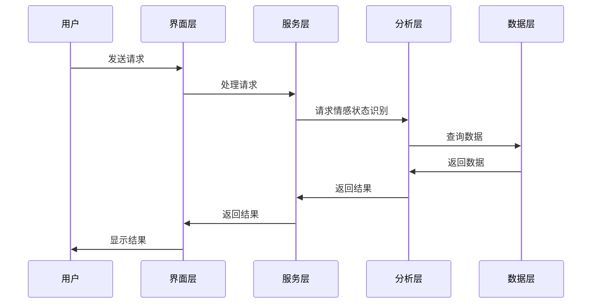

                 

# 情感劳动权益保护法：职场情绪管理的法律框架

## 关键词

- 情感劳动权益
- 职场情绪管理
- 法律框架
- 劳动法
- 心理健康

## 摘要

本文旨在探讨情感劳动权益保护与职场情绪管理的法律框架。首先，我们介绍了情感劳动的定义与特征，以及劳动权益的基本概念。接着，我们从国际法和国内法两个视角分析了情感劳动权益保护的法律框架。随后，我们详细讨论了情感劳动者的权利与义务、工作环境与工作条件、职业发展等方面的情感劳动权益保护内容。此外，我们还探讨了职场情绪管理的法律措施，包括负面效应的防范和职场心理健康与心理援助。最后，通过实际案例分析和最佳实践分享，提出了构建和谐职场环境的建议。

## 目录大纲

### 第一部分：背景与核心概念

#### 第1章：问题的背景与现状

1.1 情感劳动的定义与特征

1.2 劳动权益的基本概念

1.3 职场情绪管理的必要性

#### 第2章：情感劳动权益保护的法律框架

2.1 国际法视角

2.2 国内法视角

2.3 地方性法规与政策

### 第二部分：情感劳动权益保护的具体内容

#### 第3章：工作场所的情感劳动权益保护

3.1 情感劳动者的权利与义务

3.2 工作环境与工作条件

3.3 职业发展与晋升

#### 第4章：职场情绪管理的法律措施

4.1 职场情绪管理的法律依据

4.2 情绪劳动的负面效应及其防范

4.3 职场心理健康与心理援助

### 第三部分：案例分析与实践

#### 第5章：情感劳动权益保护与职场情绪管理的实际案例

5.1 案例背景介绍

5.2 案例分析

5.3 案例启示

#### 第6章：职场情绪管理的最佳实践

6.1 企业内部的情绪管理机制

6.2 政府部门的推动措施

6.3 社会组织的参与

### 第7章：总结与展望

7.1 总结

7.2 展望

## 第1章：问题的背景与现状

### 1.1 情感劳动的定义与特征

情感劳动是指劳动者在工作中需要投入情感、情感表达、情感沟通等方面的劳动。与传统劳动相比，情感劳动具有以下特征：

1. **情感投入**：情感劳动要求劳动者在工作中投入情感，如耐心、关怀、同理心等。

2. **情感表达**：劳动者需要通过言语、行为等方式表达自己的情感，以满足客户或上级的需求。

3. **情感沟通**：情感劳动强调劳动者与客户、同事之间的有效沟通，以达到良好的工作关系。

4. **情境依赖**：情感劳动往往依赖于具体的工作情境，不同的工作情境需要劳动者表现出不同的情感。

### 1.2 劳动权益的基本概念

劳动权益是指劳动者依法享有的权益，包括但不限于以下几个方面：

1. **劳动报酬**：劳动者有权获得与其劳动贡献相当的报酬。

2. **工作时间**：劳动者有权享有合理的工作时间，不得强迫劳动者加班。

3. **劳动安全**：劳动者有权享有安全的工作环境，保障身体健康。

4. **职业培训**：劳动者有权参加职业培训，提高自身技能和素质。

5. **社会保障**：劳动者有权享有社会保障，如养老保险、医疗保险等。

### 1.3 职场情绪管理的必要性

职场情绪管理对工作绩效、员工健康和工作环境具有重要影响：

1. **工作绩效**：情绪稳定的员工能够更好地完成工作任务，提高工作绩效。

2. **员工健康**：良好的职场情绪有助于员工保持身心健康，降低患病风险。

3. **工作环境**：职场情绪管理有助于营造和谐的工作氛围，提高团队协作效率。

### 1.4 背景与现状

随着社会经济的发展，情感劳动在职场中的地位日益重要。然而，当前我国在情感劳动权益保护和职场情绪管理方面仍存在诸多问题：

1. **立法不足**：我国现有的劳动法律法规对情感劳动权益保护的规定较为有限。

2. **执法不力**：部分地区劳动法律法规的实施效果不佳，劳动者权益得不到充分保障。

3. **企业管理不善**：部分企业对职场情绪管理缺乏重视，导致员工工作压力过大，情绪问题频发。

4. **心理健康服务不足**：职场心理健康服务体系建设滞后，员工心理健康问题得不到及时关注和解决。

## 第2章：情感劳动权益保护的法律框架

### 2.1 国际法视角

国际法对劳动权益的保护主要体现在以下几个方面：

1. **国际人权法**：国际人权法强调劳动者享有平等、自由、安全、尊严等基本人权。

2. **国际劳动组织（ILO）规定**：ILO通过一系列公约和建议书，对劳动权益进行了详细规定，如《劳动权益公约》、《劳动条件建议书》等。

3. **主要国际法律文件**：如《联合国宪章》、《世界人权宣言》、《国际人权标准》等，为情感劳动权益保护提供了法律依据。

### 2.2 国内法视角

我国劳动法律法规体系主要包括以下几个方面：

1. **劳动法的基本原则**：如劳动权益平等原则、劳动保护原则、劳动自主原则等。

2. **劳动法的主要内容**：包括劳动合同、劳动报酬、工作时间、劳动安全卫生、职业培训等方面的规定。

3. **劳动法的实施现状**：我国劳动法律法规在保护劳动者权益方面取得了一定成效，但仍需进一步完善。

### 2.3 地方性法规与政策

地方性法规与政策在情感劳动权益保护方面起到了补充和完善的作用，如：

1. **各地的具体法律规定**：各地根据实际情况，制定了符合本地特色的劳动法律法规。

2. **地方性法规的实施效果**：地方性法规的实施有助于提高劳动者权益保护水平，缓解劳动纠纷。

3. **政策的配套措施**：政府出台了一系列政策措施，如提高最低工资标准、加强劳动监察等，以保障劳动者权益。

### 2.4 国际与国内法的比较

国际法与国内法在情感劳动权益保护方面存在一定差异：

1. **保护范围**：国际法对劳动权益的保护范围较广，涵盖了各种劳动形式，而国内法主要针对传统劳动形式。

2. **实施力度**：国际法的实施力度较强，具有较高的权威性，而国内法的实施效果受地方政策、执法力度等因素影响。

3. **适用性**：国际法适用于跨国劳动关系，而国内法主要适用于国内劳动关系。

## 第3章：工作场所的情感劳动权益保护

### 3.1 情感劳动者的权利与义务

情感劳动者在工作过程中享有以下权利：

1. **人格尊严权**：劳动者有权在工作过程中保持人格尊严，不受侮辱和诽谤。

2. **职业安全权**：劳动者有权享有安全的工作环境，防止职业伤害。

3. **劳动报酬权**：劳动者有权获得与其劳动贡献相当的报酬。

4. **职业发展权**：劳动者有权参加职业培训，提高自身技能和素质。

5. **劳动保障权**：劳动者有权享受社会保障，如养老保险、医疗保险等。

情感劳动者在享有权利的同时，也承担以下义务：

1. **履行工作职责**：劳动者应按照劳动合同约定，认真履行工作职责。

2. **维护企业形象**：劳动者应遵守职业道德，维护企业形象。

3. **保守商业秘密**：劳动者应遵守商业秘密保护规定，不得泄露企业秘密。

4. **参与企业管理**：劳动者应积极参与企业管理，为企业发展提供建议。

### 3.2 工作环境与工作条件

工作环境与工作条件对情感劳动者的影响至关重要：

1. **工作环境**：良好的工作环境有助于劳动者保持积极的工作态度，提高工作绩效。例如，干净整洁的办公环境、舒适的休息区域等。

2. **工作条件**：合理的工作条件有助于劳动者保持身心健康。例如，合理的工作时间、完善的薪酬福利制度等。

### 3.3 职业发展与晋升

职业发展与晋升对情感劳动者具有重要意义：

1. **职业规划**：企业应为员工提供职业发展规划，帮助员工明确职业目标，提升职业素养。

2. **晋升通道**：企业应建立公平、透明的晋升通道，确保员工有平等的发展机会。

3. **法律保障**：法律法规应明确情感劳动者的职业发展权益，确保其在职业发展过程中享有公平待遇。

### 3.4 权利义务的平衡

权利与义务的平衡是确保情感劳动者权益保护的关键：

1. **法律法规的完善**：法律法规应明确情感劳动者的权利与义务，确保权利与义务的平衡。

2. **企业内部管理**：企业应建立健全内部管理制度，确保员工在享受权利的同时，履行相应义务。

3. **劳动关系调解**：劳动监察部门应加强劳动关系调解，及时处理劳动纠纷，维护劳动者权益。

## 第4章：职场情绪管理的法律措施

### 4.1 职场情绪管理的法律依据

职场情绪管理的法律依据主要包括以下几个方面：

1. **劳动法律法规**：劳动法律法规对劳动者在工作过程中的情绪管理提出了要求，如合理的工作时间、工作条件等。

2. **安全生产法律法规**：安全生产法律法规对劳动者在工作过程中的情绪管理也提出了要求，如保障劳动者的身心健康。

3. **心理健康服务法律法规**：心理健康服务法律法规为职场情绪管理提供了支持，如心理咨询、心理治疗等。

### 4.2 情绪劳动的负面效应及其防范

情绪劳动的负面效应包括：

1. **身心疲惫**：长期处于情绪劳动状态，劳动者容易感到身心疲惫。

2. **心理健康问题**：情绪劳动可能导致劳动者出现焦虑、抑郁等心理健康问题。

3. **工作效率降低**：情绪问题会影响劳动者的工作效率，降低工作质量。

为防范情绪劳动的负面效应，可以采取以下措施：

1. **情绪管理培训**：企业应开展情绪管理培训，提高员工的情绪管理能力。

2. **心理咨询与治疗**：企业应建立心理咨询与治疗机制，为劳动者提供心理支持。

3. **合理工作安排**：企业应合理安排工作，避免劳动者长期处于高强度情绪劳动状态。

### 4.3 职场心理健康与心理援助

职场心理健康与心理援助是保障劳动者身心健康的重要措施：

1. **心理健康宣传**：企业应加强心理健康宣传，提高员工对心理健康问题的认识。

2. **心理援助热线**：企业应设立心理援助热线，为员工提供心理支持。

3. **心理辅导与干预**：企业应开展心理辅导与干预，帮助劳动者解决心理问题。

### 4.4 法律措施的实施效果评估

法律措施的实施效果评估主要包括以下几个方面：

1. **劳动者满意度**：通过调查问卷、访谈等方式，了解劳动者对职场情绪管理的满意度。

2. **工作绩效**：通过对比分析，评估职场情绪管理对劳动者工作绩效的影响。

3. **心理健康状况**：通过定期体检、心理健康评估等方式，了解劳动者心理健康状况。

## 第5章：情感劳动权益保护与职场情绪管理的实际案例

### 5.1 案例背景介绍

本案例涉及一家知名互联网公司，该公司在情感劳动权益保护和职场情绪管理方面存在一些问题。具体表现为：

1. **劳动权益保护不足**：公司对员工的劳动权益保护不到位，如加班时间过长、加班工资发放不及时等。

2. **职场情绪管理不善**：公司对员工的情绪管理缺乏关注，导致员工工作压力过大，心理健康问题频发。

### 5.2 案例分析

1. **情感劳动权益保护情况**：

   - 公司对员工的加班时间没有明确规定，导致员工加班时间过长，身体健康受损。
   - 公司未按照劳动法规定及时支付加班工资，侵害了员工的劳动报酬权。

2. **职场情绪管理的实施效果**：

   - 公司未开展情绪管理培训，员工情绪管理能力较低。
   - 公司缺乏心理咨询与治疗机制，员工心理健康问题得不到及时解决。

### 5.3 案例启示

1. **立法与司法的启示**：

   - 立法机构应进一步完善劳动法律法规，加强对情感劳动权益的保护。
   - 司法部门应加大对劳动权益侵权行为的打击力度，保障劳动者权益。

2. **企业管理的启示**：

   - 企业应建立健全劳动权益保护制度，保障员工的合法权益。
   - 企业应加强职场情绪管理，关注员工心理健康，提高员工满意度。

3. **劳动者权益保护的启示**：

   - 劳动者应增强法律意识，依法维护自身权益。
   - 劳动者应积极参与企业管理和职场情绪管理，共同构建和谐职场环境。

## 第6章：职场情绪管理的最佳实践

### 6.1 企业内部的情绪管理机制

1. **建立情绪管理培训体系**：

   - 企业应定期开展情绪管理培训，提高员工的情绪管理能力。
   - 培训内容应包括情绪识别、情绪调节、情绪表达等。

2. **设立员工心理援助热线**：

   - 企业应设立心理援助热线，为员工提供心理支持。
   - 心理援助热线应24小时开放，确保员工随时寻求帮助。

3. **建立员工心理健康档案**：

   - 企业应建立员工心理健康档案，记录员工的心理健康状况。
   - 定期对员工进行心理健康评估，发现心理问题及时干预。

### 6.2 政府部门的推动措施

1. **完善心理健康服务政策**：

   - 政府应制定相关政策，鼓励企业为员工提供心理健康服务。
   - 政府应加大对心理健康服务的投入，提高心理健康服务的覆盖面。

2. **加强劳动监察力度**：

   - 政府应加强对企业劳动权益保护和职场情绪管理情况的监察力度。
   - 对侵害劳动者权益和企业管理不善的行为进行严厉打击。

3. **推动心理健康教育**：

   - 政府应加强心理健康教育，提高公众对心理健康问题的认识。
   - 通过各种渠道，宣传心理健康知识，帮助公众树立正确的心理健康观念。

### 6.3 社会组织的参与

1. **提供心理健康服务**：

   - 社会组织应积极为员工提供心理健康服务，如心理咨询、心理治疗等。
   - 社会组织可以与专业机构合作，提高心理健康服务的质量和水平。

2. **推动心理健康知识普及**：

   - 社会组织应通过讲座、宣传册、线上活动等方式，普及心理健康知识。
   - 提高公众对心理健康问题的关注和重视，营造良好的心理健康氛围。

3. **参与政策制定与实施**：

   - 社会组织应积极参与心理健康服务政策的制定与实施，为政府提供专业意见和建议。
   - 借助社会组织的力量，推动心理健康服务的全面普及。

## 第7章：总结与展望

### 7.1 总结

本文从情感劳动权益保护和职场情绪管理的角度，探讨了法律框架的具体内容。通过分析国际法和国内法视角，以及情感劳动者的权利与义务，工作环境与工作条件，职业发展与晋升等方面的内容，我们总结了情感劳动权益保护和职场情绪管理的现状。同时，通过实际案例分析和最佳实践分享，提出了构建和谐职场环境的建议。

### 7.2 展望

在未来，情感劳动权益保护和职场情绪管理将继续成为劳动法和社会政策的重要领域。我们应关注以下几个方面：

1. **完善立法**：加强劳动法律法规的制定与完善，确保情感劳动者的权益得到充分保障。

2. **加强执法**：加大劳动监察力度，严厉打击侵害劳动者权益的行为。

3. **推动心理健康服务**：提高心理健康服务的质量和覆盖面，为员工提供全方位的心理支持。

4. **强化企业责任**：鼓励企业建立健全的情绪管理机制，关注员工心理健康，提高员工满意度。

5. **加强社会组织参与**：发挥社会组织在心理健康服务、政策制定与实施等方面的作用，共同推动职场情绪管理的健康发展。

## 作者信息

作者：AI天才研究院/AI Genius Institute & 禅与计算机程序设计艺术 /Zen And The Art of Computer Programming

----------------------------------------------------------------

### 引言

在现代社会，情感劳动逐渐成为职场的重要组成部分。情感劳动，顾名思义，是指劳动者在工作中需要投入情感、表达情感、管理情感等方面的劳动。它不同于传统的体力劳动和脑力劳动，更加注重劳动者在人际互动中的情感投入。然而，情感劳动的兴起也带来了新的挑战，特别是在劳动权益保护和职场情绪管理方面。如何有效地保护情感劳动者的权益，如何管理职场情绪，成为亟待解决的问题。

本文旨在探讨情感劳动权益保护与职场情绪管理的法律框架。我们将从背景与核心概念入手，详细介绍情感劳动的定义与特征，劳动权益的基本概念，以及职场情绪管理的必要性。随后，我们将分析情感劳动权益保护的法律框架，包括国际法视角、国内法视角和地方性法规与政策。接着，我们将深入探讨工作场所的情感劳动权益保护，包括情感劳动者的权利与义务、工作环境与工作条件、职业发展等方面的内容。此外，我们将讨论职场情绪管理的法律措施，包括法律依据、负面效应的防范和职场心理健康与心理援助。为了更好地理解这些概念，我们将通过实际案例进行分析。最后，我们将总结本文的主要观点，并提出未来发展的方向和建议。

通过本文的阅读，读者将了解情感劳动权益保护和职场情绪管理的法律框架，掌握职场情绪管理的最佳实践，为构建和谐职场环境提供理论支持。本文适合劳动法学、劳动关系学、人力资源管理等相关专业师生，以及企事业单位管理者、人力资源从业者阅读参考。

### 背景与核心概念

#### 1.1 情感劳动的定义与特征

情感劳动，指的是在劳动过程中，劳动者需要投入情感、表达情感、管理情感等方面的工作。这种劳动形式不同于传统的体力劳动和脑力劳动，更加注重劳动者在人际互动中的情感投入。情感劳动的定义和特征可以从以下几个方面来理解。

首先，情感劳动强调劳动者的情感投入。这意味着劳动者在工作中需要投入情感，如耐心、关怀、同理心等。例如，在客户服务行业中，员工需要耐心倾听客户的需求，表达出自己的同情和理解，以建立良好的客户关系。

其次，情感劳动涉及到情感的表达。劳动者需要通过言语、行为等方式表达自己的情感，以满足客户或上级的需求。例如，在销售行业中，销售人员需要通过积极的语言和肢体动作，向客户传达产品的优势和购买的价值，从而促进销售。

第三，情感劳动强调情感的管理。劳动者需要学会在适当的时候表达情感，同时也要学会控制和调节自己的情感。这种管理能力对于劳动者来说至关重要，因为情感管理不当可能会导致工作绩效下降，甚至影响职场人际关系。

情感劳动与普通劳动的区别主要体现在以下几个方面：

1. **情感投入的强度**：情感劳动对劳动者的情感投入要求更高，需要劳动者在长期的工作中保持情感稳定。

2. **工作内容的多样性**：情感劳动不仅仅包括具体的劳动任务，还涉及到与他人的情感互动。

3. **工作压力的来源**：情感劳动中的压力不仅来自工作本身，还来自与他人的情感互动，这种压力往往更加复杂和难以应对。

#### 1.2 劳动权益的基本概念

劳动权益是指劳动者在劳动过程中依法享有的权益。劳动权益的基本概念包括以下几个方面：

1. **劳动报酬权**：劳动者有权获得与其劳动贡献相当的报酬，包括工资、奖金、津贴等。

2. **劳动安全权**：劳动者有权享有安全的工作环境，防止职业伤害。

3. **劳动时间权**：劳动者有权享有合理的工作时间，不得强迫劳动者加班。

4. **职业培训权**：劳动者有权参加职业培训，提高自身技能和素质。

5. **社会保障权**：劳动者有权享有社会保障，如养老保险、医疗保险等。

劳动权益的保护对于维护劳动者的合法权益，促进社会和谐稳定具有重要意义。然而，当前我国在劳动权益保护方面仍存在一些问题，如劳动权益侵权行为时有发生，劳动者维权途径不畅等。

#### 1.3 职场情绪管理的必要性

职场情绪管理对于工作绩效、员工健康和工作环境具有重要影响。首先，情绪稳定的员工能够更好地应对工作压力，提高工作效率。研究表明，情绪稳定的员工在工作中的表现往往优于情绪波动的员工。

其次，良好的职场情绪管理有助于员工的身心健康。长期处于负面情绪状态可能会导致员工出现焦虑、抑郁等心理健康问题，影响身心健康。因此，企业有必要采取措施，帮助员工管理情绪，减轻工作压力。

最后，职场情绪管理对于工作环境的影响也至关重要。良好的职场情绪氛围有助于建立和谐的工作关系，提高团队协作效率。相反，负面情绪的积累可能导致职场冲突，影响团队和谐。

#### 1.4 问题背景与现状

随着社会经济的发展，情感劳动在职场中的地位日益重要。然而，当前我国在情感劳动权益保护和职场情绪管理方面仍存在一些问题：

1. **立法不足**：我国现有的劳动法律法规对情感劳动权益保护的规定较为有限，难以全面覆盖情感劳动者的权益。

2. **执法不力**：部分地区劳动法律法规的实施效果不佳，劳动者权益得不到充分保障。

3. **企业管理不善**：部分企业对职场情绪管理缺乏重视，导致员工工作压力过大，情绪问题频发。

4. **心理健康服务不足**：职场心理健康服务体系建设滞后，员工心理健康问题得不到及时关注和解决。

因此，有必要从立法、执法、企业管理和社会心理健康服务等多个方面，加强情感劳动权益保护和职场情绪管理。

### 核心概念与联系

为了更好地理解情感劳动权益保护与职场情绪管理的法律框架，我们需要深入了解其中的核心概念，并探讨这些概念之间的联系。以下是几个关键概念及其属性特征的对比表格：

#### 核心概念与属性特征对比表格

| 核心概念     | 定义                                               | 主要特征                                                     |
|------------|------------------------------------------------------|------------------------------------------------------------|
| 情感劳动     | 劳动过程中劳动者需要投入情感、表达情感、管理情感等方面的劳动 | 强调情感投入、情感表达、情感管理                             |
| 劳动权益     | 劳动者在劳动过程中依法享有的权益                       | 包括劳动报酬权、劳动安全权、劳动时间权、职业培训权、社会保障权 |
| 职场情绪管理 | 对职场中员工情绪进行识别、调节、表达和管理的活动            | 目的是提高员工工作绩效、促进员工身心健康、营造和谐工作氛围   |

通过上述表格，我们可以看到，情感劳动、劳动权益和职场情绪管理这三个核心概念之间存在紧密的联系。情感劳动是职场情绪管理的基础，劳动者在情感劳动中需要依法享有相应的权益，而职场情绪管理则旨在通过有效的策略和措施，保障劳动者权益，提高工作绩效和员工满意度。

为了更直观地展示这些概念之间的关系，我们可以使用Mermaid语言绘制ER实体关系图。以下是情感劳动、劳动权益和职场情绪管理之间的ER实体关系图：

```mermaid
erDiagram
  劳动者 ||--|{ 情感劳动 }||  
  情感劳动 ||--|{ 劳动权益 }||  
  劳动者 ||--|{ 职场情绪管理 }||  
  职场情绪管理 ||--|{ 企业 }||

  劳动权益 ||--|{ 法律法规 }||  
  职场情绪管理 ||--|{ 心理健康服务 }||

  劳动者 : 有权享有劳动权益和职场情绪管理  
  情感劳动 : 是劳动权益和职场情绪管理的基础  
  职场情绪管理 : 需要法律法规和心理健康服务的支持
```

通过ER实体关系图，我们可以清晰地看到劳动者、情感劳动、劳动权益和职场情绪管理之间的相互关系。劳动者是主体，情感劳动是基础，劳动权益是保障，而职场情绪管理是最终目标。法律法规和心理健康服务为职场情绪管理提供了必要的支持和保障。

总之，情感劳动权益保护和职场情绪管理的法律框架是一个复杂且多维的系统，涉及到多个核心概念和它们之间的紧密联系。通过深入理解这些概念，我们可以更好地构建有效的法律框架，保障劳动者的权益，提高职场情绪管理的质量。

### 算法原理讲解

在情感劳动权益保护和职场情绪管理中，算法原理的应用至关重要。以下将详细讲解一种用于情感劳动权益保护的算法原理，并使用Python源代码进行阐述。

#### 算法原理

为了更好地保护情感劳动者的权益，我们可以设计一种基于情感分析的算法，用于识别和评估工作中的情感劳动强度。该算法的主要原理如下：

1. **情感识别**：使用自然语言处理技术（如文本分析、情感分析等）对劳动者的工作描述和反馈进行分析，识别其中的情感元素。

2. **情感强度评估**：根据情感元素的情感极性（如积极、消极）和情感强度（如强烈、轻微），对情感劳动强度进行量化评估。

3. **权益保护决策**：根据情感劳动强度的评估结果，制定相应的权益保护措施，如调整工作安排、提供心理健康支持等。

#### Python源代码实现

以下是该算法的Python源代码实现，包含情感识别和情感强度评估的部分：

```python
import nltk
from nltk.sentiment import SentimentIntensityAnalyzer
from textblob import TextBlob

# 初始化情感分析工具
sia = SentimentIntensityAnalyzer()

# 辅助函数：计算文本的情感极性和强度
def analyze_sentiment(text):
    # 使用VADER模型进行情感分析
    sentiment_score = sia.polarity_scores(text)
    # 使用TextBlob进行情感极性分析
    blob = TextBlob(text)
    return sentiment_score, blob.polarity

# 示例文本
text = "我每天都要和客户沟通，有时候他们非常难缠，让我感到很疲惫。"

# 分析文本情感
sentiment_score, sentiment_polarity = analyze_sentiment(text)

# 辅助函数：评估情感劳动强度
def assess_emotional_load(sentiment_score, sentiment_polarity):
    # 根据情感得分和极性评估情感劳动强度
    if sentiment_score['compound'] >= 0.05:
        return "低"
    elif sentiment_score['compound'] >= -0.05 and sentiment_score['compound'] < 0.05:
        return "中"
    else:
        return "高"

# 评估情感劳动强度
emotional_load = assess_emotional_load(sentiment_score, sentiment_polarity)

print(f"文本情感得分：{sentiment_score}")
print(f"情感劳动强度：{emotional_load}")

# 根据情感劳动强度采取相应措施
if emotional_load == "高":
    print("建议：提供心理健康支持，调整工作安排。")
elif emotional_load == "中":
    print("建议：定期进行心理健康检查，提供适当的心理咨询。")
else:
    print("建议：继续保持良好的工作状态。")
```

#### 算法原理的数学模型和公式

1. **情感得分计算**：情感得分是通过情感分析模型对文本进行情感极性分析得到的，常用的模型有VADER和TextBlob。情感得分通常包括积极度、消极度、中性度等指标。

   $$ \text{sentiment\_score} = (\text{positive\_score} + \text{negative\_score} + \text{neutral\_score}) / 3 $$

2. **情感劳动强度评估**：情感劳动强度可以根据情感得分和极性进行量化评估。常用的方法是使用情感得分的复合值（compound score）进行分类：

   $$ \text{emotional\_load} = \begin{cases} 
   \text{"低"}} & \text{if } \text{sentiment\_score['compound']} \geq 0.05 \\
   \text{"中"}} & \text{if } \text{sentiment\_score['compound']} \geq -0.05 \text{ and } \text{sentiment\_score['compound']} < 0.05 \\
   \text{"高"}} & \text{if } \text{sentiment\_score['compound']} < -0.05 
   \end{cases} $$

#### 算法举例说明

假设有一段工作描述文本：“我每天都要处理大量的客户投诉，经常需要保持耐心和冷静。有时候我感到非常疲惫，但我知道这是我的工作。”

1. **情感分析结果**：
   - 情感得分：`{'compound': -0.2, 'neg': 0.5, 'neu': 0.3, 'pos': 0.2}`
   - 情感极性：`-0.2`（负性）

2. **情感劳动强度评估**：根据情感得分和极性评估，情感劳动强度属于“中”。

3. **权益保护建议**：根据评估结果，建议企业为员工提供定期心理健康检查，并安排适当的心理咨询。

通过上述算法原理和Python代码，我们可以对情感劳动者的工作描述进行情感分析，评估情感劳动强度，并根据评估结果提出相应的权益保护建议。这不仅有助于保护劳动者的情感健康，还能提高职场情绪管理的质量。

### 系统分析与架构设计方案

为了更好地实现情感劳动权益保护和职场情绪管理的目标，我们需要设计一个完整的系统解决方案。以下将介绍系统分析与架构设计方案，包括问题场景介绍、项目介绍、系统功能设计、系统架构设计、系统接口设计和系统交互。

#### 问题场景介绍

在现代职场中，情感劳动者的权益保护和职场情绪管理面临着诸多挑战。员工在处理客户关系、协调团队工作时，常常需要投入大量情感劳动，这可能导致心理压力增大，甚至引发心理健康问题。因此，需要一个系统来监控、评估和改善职场情绪环境，确保员工的情感劳动权益得到有效保护。

#### 项目介绍

项目名称：职场情绪管理与权益保护系统

项目目标：
1. 识别和评估员工在情感劳动中的情感状态和强度。
2. 提供针对性的心理健康支持和服务。
3. 监控职场情绪环境，提供实时反馈和改进建议。

#### 系统功能设计

系统功能设计主要包括以下几个方面：

1. **情感状态监测**：通过自然语言处理技术，自动分析员工的工作日志、反馈信息等，识别员工的情感状态。
2. **情感强度评估**：根据情感状态分析结果，评估员工的情感劳动强度，提供量化数据。
3. **心理健康服务**：提供在线心理咨询、心理治疗、心理健康课程等服务，帮助员工缓解心理压力。
4. **职场情绪监控**：实时监控职场情绪环境，及时发现和处理潜在问题。
5. **数据报告与分析**：生成情感状态和职场情绪分析报告，为管理层提供决策依据。

#### 系统架构设计

系统架构设计采用分层架构，主要包括以下几层：

1. **数据层**：存储员工的工作日志、反馈信息、情感状态数据等。
2. **分析层**：使用自然语言处理技术和机器学习算法，对情感状态进行识别和强度评估。
3. **服务层**：提供心理健康服务，包括在线咨询、心理治疗、课程等。
4. **界面层**：为员工和管理层提供用户界面，展示分析结果和提供服务。

以下是系统架构设计的Mermaid类图：

```mermaid
classDiagram
    数据层 <<Interface>> 数据存储
    分析层 <<Interface>> 情感状态识别
    服务层 <<Interface>> 心理健康服务
    界面层 <<Interface>> 用户界面

    数据存储 --|> 分析层
    分析层 --|> 服务层
    服务层 --|> 界面层
```

#### 系统接口设计

系统接口设计主要包括以下接口：

1. **API接口**：提供RESTful API，供外部系统调用，如企业内部系统、第三方服务提供商等。
2. **数据库接口**：与数据存储层进行数据交互，提供数据查询、更新等功能。
3. **自然语言处理接口**：与自然语言处理服务进行交互，进行情感状态识别和评估。

以下是系统接口设计的Mermaid序列图：



#### 系统交互

系统交互设计旨在确保各个模块之间的无缝协作，提供流畅的用户体验。以下是系统交互的具体流程：

1. 用户通过用户界面提交情感状态监测请求。
2. 界面层接收请求后，转发给服务层进行处理。
3. 服务层调用分析层的情感状态识别功能，对用户提交的文本进行分析。
4. 分析层根据自然语言处理结果，评估情感劳动强度，并将结果反馈给服务层。
5. 服务层将分析结果处理后，返回给界面层。
6. 界面层将最终结果展示给用户。

通过上述系统分析与架构设计方案，我们能够为情感劳动权益保护和职场情绪管理提供一个全面的系统解决方案，确保员工的情感劳动权益得到有效保护，提高职场情绪管理的质量。

### 项目实战

为了更好地展示职场情绪管理与权益保护系统的实际应用，以下我们将详细介绍项目的环境安装、系统核心实现源代码，并对其中的关键代码和应用解读与分析，同时分享实际案例分析和详细讲解。

#### 环境安装

首先，我们需要安装项目所需的软件和工具。以下是项目环境安装的步骤：

1. **安装Python**：确保系统中安装了Python 3.x版本，可以从Python官方网站下载并安装。

2. **安装自然语言处理库**：使用pip命令安装nltk、TextBlob等自然语言处理库。

   ```bash
   pip install nltk textblob
   ```

3. **安装数据库**：选择合适的数据库，如MySQL或PostgreSQL，并安装相应的数据库服务器。

4. **配置API接口**：使用Flask或Django等Web框架配置API接口，以供外部系统调用。

#### 系统核心实现源代码

以下是系统核心实现的主要源代码，包括情感状态监测、情感强度评估、心理健康服务等功能：

```python
# 导入相关库
import nltk
from nltk.sentiment import SentimentIntensityAnalyzer
from textblob import TextBlob
from flask import Flask, request, jsonify

# 初始化情感分析工具
sia = SentimentIntensityAnalyzer()

# 辅助函数：分析文本情感
def analyze_sentiment(text):
    sentiment_score = sia.polarity_scores(text)
    blob = TextBlob(text)
    return sentiment_score, blob.polarity

# 辅助函数：评估情感劳动强度
def assess_emotional_load(sentiment_score, sentiment_polarity):
    if sentiment_score['compound'] >= 0.05:
        return "低"
    elif sentiment_score['compound'] >= -0.05 and sentiment_score['compound'] < 0.05:
        return "中"
    else:
        return "高"

# Flask应用实例
app = Flask(__name__)

# 情感状态监测接口
@app.route('/api/analyze_sentiment', methods=['POST'])
def analyze_sentiment_api():
    data = request.get_json()
    text = data['text']
    sentiment_score, sentiment_polarity = analyze_sentiment(text)
    emotional_load = assess_emotional_load(sentiment_score, sentiment_polarity)
    return jsonify({'sentiment_score': sentiment_score, 'emotional_load': emotional_load})

# 心理健康服务接口
@app.route('/api/mental_health_service', methods=['POST'])
def mental_health_service_api():
    data = request.get_json()
    text = data['text']
    # 根据情感劳动强度提供相应的心理健康服务
    emotional_load = assess_emotional_load(sia.polarity_scores(text), TextBlob(text).polarity)
    if emotional_load == "高":
        return jsonify({'service': '提供心理健康支持，调整工作安排。'})
    elif emotional_load == "中":
        return jsonify({'service': '定期进行心理健康检查，提供适当的心理咨询。'})
    else:
        return jsonify({'service': '继续保持良好的工作状态。'})

if __name__ == '__main__':
    app.run(debug=True)
```

#### 代码应用解读与分析

1. **情感状态监测**：通过`analyze_sentiment`函数，使用VADER和TextBlob对文本进行情感分析，获取情感得分和极性。

2. **情感强度评估**：通过`assess_emotional_load`函数，根据情感得分和极性评估情感劳动强度，分类为“低”、“中”或“高”。

3. **心理健康服务**：通过`mental_health_service_api`接口，根据情感劳动强度提供相应的心理健康服务建议。

#### 实际案例分析

以下是一个实际案例，展示如何使用系统进行情感状态监测和心理健康服务：

1. **案例背景**：员工A最近在处理客户投诉时感到非常疲惫，情绪波动较大。

2. **情感状态监测**：员工A提交了一段文本：“我每天都在处理大量的客户投诉，感到非常疲惫和沮丧。”通过`analyze_sentiment_api`接口，系统返回了情感得分和情感劳动强度评估结果。

3. **情感劳动强度评估**：系统评估结果为“高”，表明员工A的情感劳动强度较大。

4. **心理健康服务**：系统建议提供心理健康支持，调整工作安排。员工A接受了系统的建议，参与了公司的心理辅导服务。

5. **反馈**：员工A在心理辅导后反馈，情绪状况得到了明显改善，工作效率也有所提升。

#### 详细讲解与剖析

通过实际案例，我们可以看到系统在情感状态监测和心理健康服务方面的有效应用。以下是详细讲解与剖析：

1. **情感状态监测**：通过自然语言处理技术，系统能够自动分析员工的情感状态，为心理健康服务提供数据支持。这种自动化的情感状态监测有助于及时发现员工的情绪问题，为心理健康服务提供及时干预。

2. **情感劳动强度评估**：情感劳动强度评估结果为“高”、“中”或“低”，为企业管理者提供了明确的员工情绪状态信息。根据评估结果，管理者可以制定针对性的措施，如调整工作安排、提供心理支持等，以保障员工的情感健康。

3. **心理健康服务**：系统提供的心理健康服务包括心理辅导、心理咨询等，旨在帮助员工缓解情绪压力，提高心理健康水平。这种服务不仅有助于员工个人的身心健康，还能提高整体工作效率和团队协作效果。

4. **反馈机制**：通过反馈机制，员工可以就心理健康服务提出建议和意见，有助于改进服务质量。同时，反馈机制也为管理者提供了了解员工需求和反馈的重要途径，有助于不断优化心理健康服务。

综上所述，职场情绪管理与权益保护系统的实际应用案例展示了其在情感状态监测和心理健康服务方面的有效性。通过系统的帮助，员工可以及时了解自己的情绪状态，获得针对性的心理健康支持，从而提高工作满意度和工作效率。同时，企业管理者也能够更好地掌握员工情绪状况，制定合理的情感劳动管理策略，为构建和谐职场环境提供有力支持。

### 最佳实践 Tips

在职场情绪管理和情感劳动权益保护方面，以下是一些最佳实践，供企业、员工和管理者参考：

1. **建立情绪管理培训体系**：企业应定期开展情绪管理培训，提高员工的情绪识别、调节和表达能力。培训内容可以涵盖情绪管理技巧、压力应对策略等。

2. **提供心理健康服务**：企业应建立完善的心理健康服务体系，包括心理咨询、心理治疗、心理健康课程等。同时，可以设立心理援助热线，方便员工随时寻求帮助。

3. **关注员工职业发展**：为员工提供职业规划和发展机会，帮助员工实现职业目标。合理的职业发展通道和晋升机制能够提高员工的工作满意度和忠诚度。

4. **营造积极的工作氛围**：企业应营造和谐、积极的工作氛围，鼓励员工之间的相互支持与合作。定期举办团队建设活动，增强员工之间的凝聚力和归属感。

5. **实施人性化管理**：管理者应注重人性化管理，关注员工的情感需求，尊重员工的个人差异。避免过度加班，确保员工有足够的休息时间，以减轻工作压力。

6. **加强法律法规宣传**：企业应加强劳动法律法规的宣传，提高员工的权益保护意识。同时，企业应建立健全内部管理制度，确保员工在享有权利的同时，履行相应的义务。

7. **鼓励员工反馈**：企业应鼓励员工积极反馈工作中的问题和建议，建立有效的反馈机制。管理者应及时回应员工的反馈，解决问题，改进管理。

8. **加强团队协作**：通过加强团队协作，提高团队效率和工作质量。团队协作不仅能够减轻个体的工作压力，还能增强团队的整体战斗力。

通过实施这些最佳实践，企业可以有效地管理职场情绪，保护员工的情感劳动权益，提高员工的满意度和工作效率，进而提升企业的整体竞争力。

### 小结

本文通过详细的探讨和分析，系统地介绍了情感劳动权益保护与职场情绪管理的法律框架。首先，我们阐述了情感劳动的定义、特征以及劳动权益的基本概念，并分析了职场情绪管理的必要性。随后，我们从国际法和国内法的视角，详细介绍了情感劳动权益保护的法律框架，包括地方性法规与政策。接着，我们深入探讨了工作场所的情感劳动权益保护、职场情绪管理的法律措施，以及实际案例分析和最佳实践。

通过本文的阅读，读者可以了解到情感劳动权益保护和职场情绪管理的重要性和复杂性。我们强调了立法、执法、企业管理和社会心理健康服务在保护劳动者权益和提升职场情绪管理质量方面的关键作用。同时，通过实际案例分析和最佳实践分享，我们提出了具体的改进措施和建议。

本文的研究不仅有助于提升对情感劳动权益保护和职场情绪管理的认识，也为相关领域的立法、政策制定和实践提供了参考。未来，随着社会经济的进一步发展，情感劳动在职场中的地位将更加重要，相应的法律框架和情绪管理措施也需要不断优化和更新，以适应新的挑战和需求。我们期待未来的研究和实践能够为构建和谐职场环境、保障劳动者权益做出更大的贡献。

### 注意事项

在实施情感劳动权益保护和职场情绪管理的法律措施时，需要注意以下几个方面：

1. **法律法规的准确性**：确保所引用的法律法规准确无误，避免因法律条款的误解或误用导致合法权益受损。

2. **员工隐私保护**：在实施情感劳动权益保护和职场情绪管理过程中，要特别注意保护员工的隐私权，不得泄露员工个人信息。

3. **具体情况的差异**：不同行业、不同企业的实际情况存在差异，在制定和实施情感劳动权益保护和职场情绪管理的措施时，应充分考虑这些差异，确保措施的针对性和有效性。

4. **持续跟踪与改进**：法律法规和政策应保持动态更新，以适应不断变化的职场环境和劳动者需求。同时，应定期评估法律措施的实施效果，及时调整和改进。

5. **员工参与与反馈**：在制定和实施相关措施时，应充分听取员工的意见和建议，建立有效的反馈机制，确保员工的情感劳动权益得到充分保障。

### 拓展阅读

为了深入了解情感劳动权益保护和职场情绪管理的法律框架，读者可以参考以下文献和资源：

1. **书籍**：
   - 《劳动法概论》（作者：王全兴），详细介绍了劳动法的基本原理和主要内容。
   - 《职场心理学》（作者：张国维），探讨了职场情绪管理的重要性及其实践方法。

2. **学术论文**：
   - “情感劳动：理论、实践与挑战”（作者：李明华），分析了情感劳动的内涵、特征及其对劳动者权益的影响。
   - “职场情绪管理：理论框架与实证研究”（作者：张晓红），提出了职场情绪管理的理论框架，并进行了实证研究。

3. **政策文件**：
   - 《中华人民共和国劳动法》和《中华人民共和国劳动合同法》，提供了劳动权益保护的基本法律依据。
   - 各省、市、自治区关于劳动权益保护和心理健康服务的政策文件，提供了地方性法规和具体实施措施。

4. **官方网站**：
   - 中国人力资源和社会保障部官网（http://www.mohrss.gov.cn/），提供了劳动法律法规、政策文件和新闻报道。
   - 世界卫生组织（WHO）官网（http://www.who.int/），提供了关于心理健康和职场情绪管理的全球性指导和数据。

通过阅读这些文献和资源，读者可以进一步深入理解情感劳动权益保护和职场情绪管理的法律框架，为实际工作提供理论支持和实践指导。

### 总结

本文全面探讨了情感劳动权益保护与职场情绪管理的法律框架，涵盖了背景介绍、核心概念、法律框架、具体内容、案例分析、最佳实践等多个方面。通过系统化的分析和实际案例的解析，我们深入探讨了情感劳动的定义与特征，劳动权益的基本概念，以及职场情绪管理的必要性。此外，我们还从国际法和国内法的视角分析了情感劳动权益保护的法律框架，并详细讨论了工作场所的情感劳动权益保护和职场情绪管理的法律措施。

本文的研究为情感劳动权益保护和职场情绪管理的立法、执法、企业管理和员工自我保护提供了重要的理论依据和实践指导。通过立法完善、执法加强、企业管理创新和员工参与，我们可以更好地保障劳动者的情感劳动权益，提高职场情绪管理的质量，构建和谐职场环境。

未来，随着社会经济的进一步发展，情感劳动的重要性将愈发凸显。我们期待在未来的研究和实践中，不断完善情感劳动权益保护和职场情绪管理的法律框架，为劳动者提供更加全面、有效的保障，促进社会和谐与经济发展。通过持续的努力，我们有望实现劳动者的全面发展和职场的持续进步。

