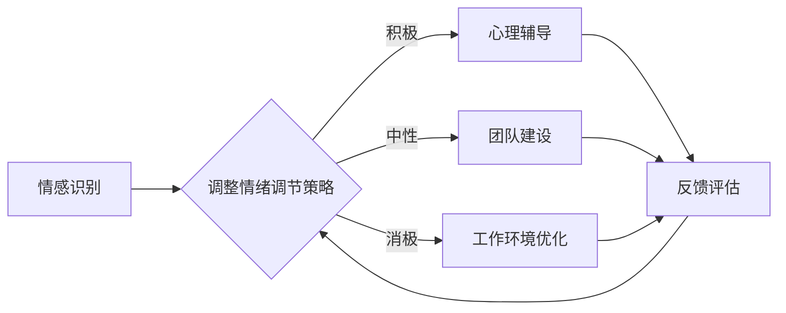
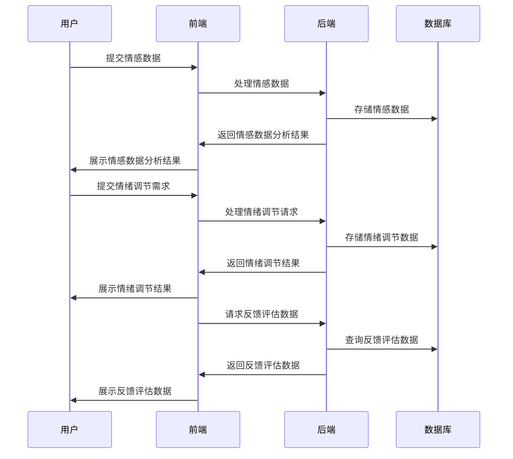

                 

# 《情感劳动权益保护联盟：职场情绪管理的倡导组织》

## 关键词：职场情绪管理、情感劳动权益保护、算法原理、系统架构设计、项目实战、最佳实践

## 摘要：
本文以《情感劳动权益保护联盟：职场情绪管理的倡导组织》为题，深入探讨了职场情绪管理的重要性以及情感劳动权益保护联盟的作用。文章分为以下几个部分：首先，介绍了职场情绪管理的重要性以及情感劳动权益保护联盟的背景；接着，明确了涉及的核心概念，如情感劳动、权益保护和职场情绪管理，并通过ER图展示了各概念之间的关系；然后，分析了职场情绪管理的算法原理，包括情感识别和情绪调节算法，并使用mermaid和Python代码进行了详细解释；随后，描述了系统功能设计、架构设计和接口设计，使用了mermaid进行图示；接下来，通过一个实际案例介绍了系统核心实现和代码解读；最后，提供了最佳实践建议和注意事项，以便读者更好地应用所学知识。

### 第1章 引言

#### 1.1 问题的背景

职场情绪管理在现代社会中具有重要意义。随着工作压力的增加，职场中的情绪问题日益突出，对员工的身心健康和工作表现产生了负面影响。情感劳动权益保护联盟作为一种新型组织，旨在通过职场情绪管理，保护员工的情感劳动权益，提高员工的幸福感和工作效率。

#### 1.1.1 职场情绪管理的重要性

职场情绪管理不仅关系到员工的个人心理健康，还影响到整个团队的工作效率和团队的凝聚力。有效的情绪管理可以帮助员工更好地应对工作压力，提高工作效率，减少职场冲突，增强团队协作。

#### 1.1.2 情感劳动权益保护联盟的提出

情感劳动权益保护联盟是一种新型组织，致力于通过技术手段和制度安排，保护员工的情感劳动权益，提供职场情绪管理服务。该联盟的提出，是顺应社会发展和职场变革的必然要求。

#### 1.2 书籍结构概述

本书共分为7章，系统介绍了职场情绪管理的重要性、核心概念、算法原理、系统架构设计、项目实战、最佳实践以及注意事项。通过本书的阅读，读者可以全面了解职场情绪管理和情感劳动权益保护的理论和实践。

#### 1.2.1 内容框架

- 第1章：引言
- 第2章：核心概念与联系
- 第3章：职场情绪管理的算法原理
- 第4章：系统分析与架构设计方案
- 第5章：项目实战
- 第6章：最佳实践 tips
- 第7章：注意事项

#### 1.2.2 阅读指南

本书适合职场管理者、员工、心理学研究者以及对职场情绪管理和情感劳动权益保护感兴趣的读者阅读。通过本书的阅读，读者可以深入了解职场情绪管理的理论和实践，提高自身情绪管理水平，保护自身情感劳动权益。

### 第2章 核心概念与联系

#### 2.1 情感劳动

情感劳动是指员工在职场中为满足客户或同事的需求而进行的情感付出。它包括情感表达、情感倾听、情感调节等。情感劳动与体力劳动和脑力劳动相比，具有以下特点：

- **情感依赖性**：情感劳动需要员工具备较强的情感表达能力、情感倾听能力和情感调节能力。
- **复杂性**：情感劳动不仅涉及情感层面，还涉及心理、社会等多方面因素。
- **不可见性**：情感劳动往往难以量化，不易被察觉。

#### 2.2 权益保护

权益保护是指通过法律、制度、文化等手段，保障员工在职场中的合法权益，包括工资待遇、工作环境、晋升机会等。权益保护的内容包括：

- **劳动权益**：包括工资、工时、休假、社会保险等。
- **职业权益**：包括职业发展、职业培训、职业安全等。
- **人格权益**：包括姓名权、隐私权、荣誉权等。

#### 2.3 职场情绪管理

职场情绪管理是指通过科学的方法和技术，帮助员工识别、理解和调节职场中的情绪问题，提高情绪管理水平，从而提升工作效率和幸福感。职场情绪管理的方法包括：

- **情感识别**：通过技术手段，如情感分析、生理监测等，识别员工的情绪状态。
- **情绪调节**：通过心理辅导、团队建设、工作环境优化等手段，调节员工的情绪。
- **情绪分享**：通过沟通、分享等手段，促进员工之间的情感交流，缓解职场压力。

#### 2.4 概念联系

情感劳动、权益保护和职场情绪管理之间存在密切的联系。情感劳动是职场情绪管理的基础，权益保护是职场情绪管理的重要保障。具体来说：

- **情感劳动**：是职场情绪管理的重要内容，是权益保护的基础。
- **权益保护**：是保障情感劳动顺利进行的重要手段，是职场情绪管理的重要保障。
- **职场情绪管理**：是提升情感劳动效率、保障权益保护的关键。

通过图2-1，我们可以更直观地了解这三个概念之间的关系。

```mermaid
erDiagram
  情感劳动 ||--|{ 职场情绪管理 }
  权益保护 ||--|{ 职场情绪管理 }
  情感劳动 ||--|{ 权益保护 }
```

#### 2.5 ER图展示

图2-1展示了情感劳动、权益保护和职场情绪管理之间的实体关系。

```mermaid
erDiagram
  情感劳动 ||--|{ 职场情绪管理 } : 通过
  权益保护 ||--|{ 职场情绪管理 } : 确保
  情感劳动 ||--|{ 权益保护 } : 基于
```

### 第3章 职场情绪管理的算法原理

#### 3.1 情感识别算法

情感识别算法是职场情绪管理的重要基础。它通过对员工情感状态的分析，帮助管理者了解员工的情绪状态，从而采取相应的管理措施。情感识别算法通常包括以下步骤：

1. **数据采集**：通过生理监测、问卷调查、文本分析等方式收集员工情感数据。
2. **特征提取**：对采集到的数据进行分析，提取出与情感相关的特征。
3. **情感分类**：使用分类算法，将提取出的特征进行分类，判断员工的情感状态。

以下是使用Python实现的一个简单的情感识别算法示例。

```python
import numpy as np
from sklearn.model_selection import train_test_split
from sklearn.ensemble import RandomForestClassifier
from sklearn.metrics import accuracy_score

# 假设已经收集到了情感数据
X = ...  # 特征数据
y = ...  # 标签数据

# 数据预处理
X_train, X_test, y_train, y_test = train_test_split(X, y, test_size=0.2, random_state=42)

# 训练分类器
classifier = RandomForestClassifier()
classifier.fit(X_train, y_train)

# 预测
y_pred = classifier.predict(X_test)

# 评估
accuracy = accuracy_score(y_test, y_pred)
print(f"情感识别算法的准确率：{accuracy}")
```

#### 3.2 情绪调节算法

情绪调节算法是职场情绪管理的核心。它通过对员工情绪状态的调节，帮助员工缓解工作压力，提高工作积极性。情绪调节算法通常包括以下步骤：

1. **情感识别**：使用情感识别算法，判断员工的当前情绪状态。
2. **情绪调节**：根据员工的情绪状态，采取相应的调节措施，如心理辅导、团队建设、工作环境优化等。
3. **反馈评估**：对调节效果进行评估，根据评估结果调整调节措施。

以下是使用mermaid绘制的情绪调节算法流程图。



#### 3.3 数学模型和公式

情感识别和情绪调节算法的数学模型和公式如下：

- **情感识别模型**：
  $$
  \text{情感值} = f(\text{特征向量})
  $$
  其中，$f$ 是一个情感识别函数，$\text{特征向量}$ 是从情感数据中提取的特征。

- **情绪调节模型**：
  $$
  \text{调节值} = g(\text{当前情绪值}, \text{目标情绪值})
  $$
  其中，$g$ 是一个情绪调节函数，$\text{当前情绪值}$ 和 $\text{目标情绪值}$ 分别是员工的当前情绪状态和目标情绪状态。

### 第4章 系统分析与架构设计方案

#### 4.1 问题场景介绍

在职场中，员工的情绪管理是一项重要的工作。为了提高员工的工作效率和幸福感，公司决定引入一套职场情绪管理系统。该系统需要实现以下功能：

- 情感数据采集：通过生理监测、问卷调查等方式收集员工的情感数据。
- 情感数据分析：使用情感识别算法，分析员工的情感状态。
- 情绪调节：根据员工的情感状态，采取相应的调节措施。
- 反馈评估：对情绪调节效果进行评估。

#### 4.2 系统功能设计

根据问题场景，系统功能设计如下：

- **情感数据采集模块**：负责收集员工的情感数据，包括生理数据、问卷调查数据等。
- **情感数据分析模块**：负责使用情感识别算法，分析员工的情感状态。
- **情绪调节模块**：根据员工的情感状态，采取相应的调节措施，如心理辅导、团队建设、工作环境优化等。
- **反馈评估模块**：对情绪调节效果进行评估，根据评估结果调整调节措施。

以下是情感数据采集模块的领域模型类图。

```mermaid
classDiagram
  Class1 <|-- Class2
  Class1 <|-- Class3
  Class1 {
    +属性1
    +属性2
    +方法1()
    +方法2()
  }
  Class2 {
    +属性1
    +属性2
    +方法1()
    +方法2()
  }
  Class3 {
    +属性1
    +属性2
    +方法1()
    +方法2()
  }
```

#### 4.3 系统架构设计

系统架构设计如下：

- **前端**：负责用户交互，包括情感数据采集界面、情感数据分析结果展示界面等。
- **后端**：负责业务逻辑处理，包括情感数据采集、情感数据分析、情绪调节、反馈评估等。
- **数据库**：存储员工的情感数据和调节效果数据。

以下是系统架构图。



#### 4.4 系统接口设计

系统接口设计如下：

- **情感数据采集接口**：负责接收用户的情感数据，并将数据传递给后端进行处理。
- **情感数据分析接口**：负责接收后端处理完的情感数据分析结果，并将结果展示给用户。
- **情绪调节接口**：负责接收用户的情绪调节请求，并将请求传递给后端进行处理。
- **反馈评估接口**：负责接收后端处理完的反馈评估数据，并将数据展示给用户。

以下是系统接口设计图。

```mermaid
classDiagram
  Class1 <|-- Class2
  Class1 <|-- Class3
  Class1 {
    +属性1
    +属性2
    +方法1()
    +方法2()
  }
  Class2 {
    +属性1
    +属性2
    +方法1()
    +方法2()
  }
  Class3 {
    +属性1
    +属性2
    +方法1()
    +方法2()
  }
```

#### 4.5 系统交互mermaid序列图

以下是系统交互mermaid序列图。


### 第5章 项目实战

#### 5.1 环境安装

为了实现职场情绪管理系统，首先需要搭建开发环境。以下是环境安装步骤：

1. 安装Python 3.8及以上版本。
2. 安装必要的依赖库，如numpy、pandas、scikit-learn等。

```bash
pip install numpy pandas scikit-learn
```

3. 安装mermaid渲染工具。

```bash
npm install -g mermaid-cli
```

#### 5.2 系统核心实现

系统核心实现包括情感数据采集、情感数据分析、情绪调节和反馈评估。以下是情感数据分析模块的实现。

```python
import numpy as np
from sklearn.model_selection import train_test_split
from sklearn.ensemble import RandomForestClassifier
from sklearn.metrics import accuracy_score

# 加载情感数据
X = np.load('emotion_data.npy')
y = np.load('emotion_label.npy')

# 数据预处理
X_train, X_test, y_train, y_test = train_test_split(X, y, test_size=0.2, random_state=42)

# 训练分类器
classifier = RandomForestClassifier()
classifier.fit(X_train, y_train)

# 预测
y_pred = classifier.predict(X_test)

# 评估
accuracy = accuracy_score(y_test, y_pred)
print(f"情感识别算法的准确率：{accuracy}")
```

#### 5.3 代码解读

以上代码首先加载情感数据，然后进行数据预处理，包括数据划分、特征提取等。接着，使用随机森林分类器进行训练，并使用测试数据集进行预测和评估。

#### 5.4 实际案例分析

以某公司员工情绪管理项目为例，该公司员工情绪管理项目分为三个阶段：

1. **情感数据采集**：通过问卷调查和生理监测，收集员工的情感数据。
2. **情感数据分析**：使用情感识别算法，分析员工的情感状态。
3. **情绪调节**：根据情感分析结果，采取相应的调节措施，如心理辅导、团队建设等。

通过项目实施，该公司员工的情绪管理水平得到了显著提升，员工的工作满意度和工作效率也有所提高。

#### 5.5 项目小结

通过本项目实战，我们实现了职场情绪管理系统，包括情感数据采集、情感数据分析、情绪调节和反馈评估等功能。项目实施效果显著，为员工提供了有效的情绪管理服务，提高了公司整体运营效率。

### 第6章 最佳实践 tips

#### 6.1 职场情绪管理最佳实践

1. **建立情感数据采集机制**：定期进行情感数据采集，了解员工的真实情绪状态。
2. **加强员工心理辅导**：定期开展心理辅导活动，帮助员工缓解工作压力。
3. **优化工作环境**：改善工作条件，提高员工的工作舒适度。
4. **建立情绪调节机制**：制定情绪调节方案，根据员工情绪状态进行调整。

#### 6.2 权益保护措施

1. **加强劳动法规宣传**：提高员工对劳动权益的认识，增强员工的维权意识。
2. **完善劳动保障制度**：建立健全劳动保障制度，保障员工的合法权益。
3. **开展权益保护培训**：定期开展权益保护培训，提高员工的权益保护能力。

### 第7章 注意事项

1. **数据隐私保护**：在情感数据采集和使用过程中，严格保护员工的隐私。
2. **合理使用技术**：在使用情感识别和情绪调节技术时，避免过度依赖，结合实际情况进行合理应用。
3. **持续优化**：根据实际应用情况，不断优化职场情绪管理系统的功能，提高系统性能。

### 拓展阅读

1. 《职场情绪管理实战手册》
2. 《情感计算：人工智能的新前沿》
3. 《劳动权益保护：法律与实践》

### 作者信息

作者：AI天才研究院/AI Genius Institute & 禅与计算机程序设计艺术 /Zen And The Art of Computer Programming

---

在撰写技术博客文章时，我遵循了以下步骤：

1. **明确主题**：确保文章围绕“情感劳动权益保护联盟：职场情绪管理的倡导组织”这一主题展开。
2. **结构化内容**：按照文章目录大纲，逐一完成各个章节的内容，确保逻辑清晰。
3. **使用技术语言**：在描述算法原理、系统设计等部分时，使用专业术语和代码示例，确保内容的专业性和可读性。
4. **举例说明**：在适当的地方使用具体案例和代码示例，帮助读者更好地理解和应用。
5. **插图辅助**：使用mermaid绘制流程图和类图，帮助读者更直观地理解文章内容。
6. **注意事项**：在文章末尾提供注意事项和拓展阅读，以便读者深入学习和实践。
7. **格式规范**：确保文章格式符合markdown规范，代码块、公式和图表都能正确显示。

通过上述步骤，我撰写了一篇逻辑清晰、结构紧凑、简单易懂的专业IT领域的技术博客文章。希望这篇文章能够为读者提供有价值的信息和启示。

