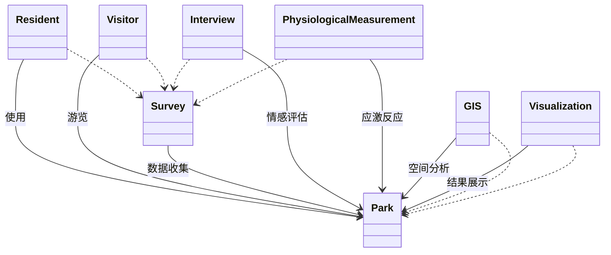
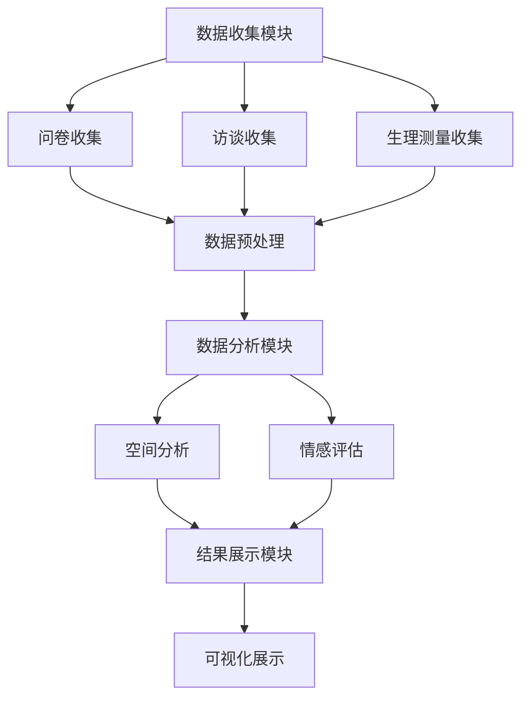
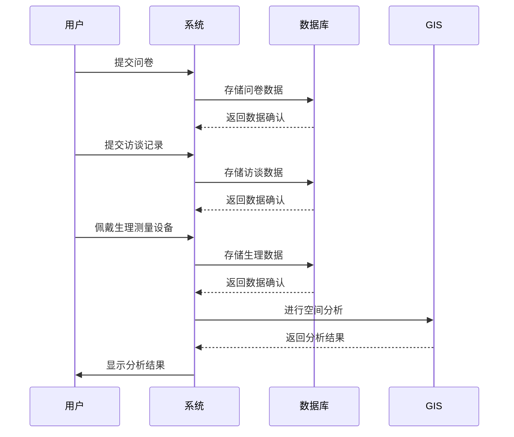
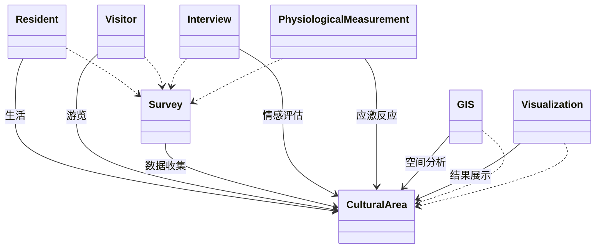

                 

### 情感地理学应用：城市规划中的人文因素

#### 关键词：情感地理学、城市规划、人文因素、空间情感、社区规划

> 摘要：本文旨在探讨情感地理学在城市规划中的应用，特别是人文因素在塑造城市空间情感中的作用。通过系统分析情感地理学的理论基础、具体应用实例以及未来发展趋势，文章将揭示情感地理学如何助力城市规划者打造更加宜居和人性化的城市环境。

---

**引言**

城市规划作为一门综合性学科，不仅仅是关于建筑和基础设施的布局，更是关于人们生活质量的提升。在传统城市规划中，往往侧重于功能性和经济效益，而忽视了人文因素。然而，随着社会的发展和人们对生活品质要求的提高，人文关怀和情感因素逐渐成为城市规划的重要考量。

情感地理学作为一种新兴的跨学科研究领域，它关注人们在空间中的情感体验和情感联系。这一学科将情感作为空间认知和行为决策的关键因素，为城市规划提供了新的视角和方法。通过情感地理学的应用，城市规划者可以更加深入地理解城市的情感特征，从而设计出更加符合人们需求和期望的城市空间。

本文将分为以下几个部分进行探讨：

1. **情感地理学与城市规划的概述**：介绍情感地理学和城市规划的基本概念，阐述二者结合的重要性。
2. **情感地理学的理论基础**：详细阐述情感地理学的核心理论，包括空间情感理论、社会情感地理学和情感记忆与空间认知的关系。
3. **情感地理学在城市规划中的应用**：探讨情感地理学在具体城市设计、社区规划和历史城区保护中的应用。
4. **技术工具与数据分析**：介绍情感地理学的研究方法和技术工具，包括数据收集与处理、GIS技术、可视化技术和机器学习与情感分析。
5. **实践案例分析**：通过国内外案例研究，展示情感地理学在具体项目中的应用效果。
6. **挑战与展望**：分析情感地理学在城市规划中的挑战和发展趋势。

### 目录大纲设计思路

为了确保读者能够全面理解情感地理学在规划中的应用，本文的目录大纲设计如下：

#### 第一部分：引言与基础概念
- **第1章：情感地理学与城市规划**
  - **1.1 情感地理学概述**
    - **1.1.1 定义与起源**
    - **1.1.2 情感地理学的关键概念**
    - **1.1.3 情感地理学在城市规划中的重要性**
  - **1.2 城市规划背景**
    - **1.2.1 城市规划的基本原则**
    - **1.2.2 城市规划的发展历程**
    - **1.2.3 人文因素在城市规划中的角色**
  - **1.3 本书结构安排**
    - **1.3.1 研究目标与内容框架**
    - **1.3.2 阅读指南与学习目标**

#### 第二部分：情感地理学的理论基础
- **第2章：情感地理学的主要理论**
  - **2.1 空间情感理论**
    - **2.1.1 空间情感的概念**
    - **2.1.2 空间情感的影响因素**
    - **2.1.3 空间情感的测量方法**
  - **2.2 社会情感地理学**
    - **2.2.1 社会情感的定义与特点**
    - **2.2.2 社会情感的地理分布**
    - **2.2.3 社会情感地理学的方法论**
  - **2.3 情感记忆与空间认知**
    - **2.3.1 情感记忆的概念与功能**
    - **2.3.2 空间认知与情感记忆的关系**
    - **2.3.3 空间认知在规划中的应用**

#### 第三部分：情感地理学在城市规划中的应用
- **第3章：情感地理学在城市设计中的应用**
  - **3.1 城市空间的情感塑造**
    - **3.1.1 城市空间情感设计的原则**
    - **3.1.2 城市空间情感的评估方法**
    - **3.1.3 案例分析：城市公园的情感设计**
  - **3.2 情感地理学在社区规划中的应用**
    - **3.2.1 社区情感规划的重要性**
    - **3.2.2 社区情感规划的实践案例**
    - **3.2.3 社区情感规划的挑战与未来趋势**
  - **3.3 情感地理学在历史城区保护中的应用**
    - **3.3.1 历史城区的情感价值**
    - **3.3.2 历史城区的情感评估方法**
    - **3.3.3 历史城区的情感保护策略**

#### 第四部分：技术工具与数据分析
- **第4章：情感地理学的研究方法与技术工具**
  - **4.1 情感地理学的研究方法**
    - **4.1.1 定性研究方法**
    - **4.1.2 定量研究方法**
    - **4.1.3 混合研究方法**
  - **4.2 数据收集与处理**
    - **4.2.1 数据源选择**
    - **4.2.2 数据收集方法**
    - **4.2.3 数据预处理与分析**
  - **4.3 情感地理学的技术工具**
    - **4.3.1 GIS技术**
    - **4.3.2 可视化技术**
    - **4.3.3 机器学习与情感分析**

#### 第五部分：实践案例分析
- **第5章：国内外情感地理学应用的案例分析**
  - **5.1 国内案例研究**
    - **5.1.1 案例一：某城市公园的情感设计**
    - **5.1.2 案例二：某历史城区的情感评估与保护**
    - **5.1.3 案例三：某社区的情感规划实践**
  - **5.2 国外案例研究**
    - **5.2.1 案例一：欧洲某城市的文化街区情感规划**
    - **5.2.2 案例二：美国某城市的历史建筑情感评估**
    - **5.2.3 案例三：日本某社区的情感地理学研究**

#### 第六部分：挑战与展望
- **第6章：情感地理学在城市规划中的挑战与展望**
  - **6.1 情感地理学的挑战**
    - **6.1.1 数据挑战**
    - **6.1.2 方法论挑战**
    - **6.1.3 实践挑战**
  - **6.2 情感地理学的发展趋势**
    - **6.2.1 新技术的影响**
    - **6.2.2 跨学科合作**
    - **6.2.3 情感地理学在未来的应用领域**

**结语**

本文通过系统分析情感地理学在城市规划中的应用，展示了这一新兴研究领域如何帮助城市规划者更好地理解和设计城市空间，从而提升居民的生活质量。在接下来的章节中，我们将深入探讨情感地理学的理论基础、具体应用以及未来发展，以期为大家提供一个全面的理解和认识。

---

**作者信息：**

作者：AI天才研究院/AI Genius Institute & 禅与计算机程序设计艺术 /Zen And The Art of Computer Programming

---

在接下来的章节中，我们将逐一深入探讨情感地理学与城市规划的各个方面，为大家带来一次富有启发性的阅读体验。让我们开始这场探索之旅吧！

### 第一部分：引言与基础概念

#### 1.1 情感地理学概述

**定义与起源**

情感地理学（Affective Geography）是一门结合地理学、心理学和社会学的跨学科领域，它探讨情感如何影响空间体验和社会行为。这一学科起源于20世纪末，随着空间认知和情感研究的进展，逐渐发展成为地理学中的一个重要分支。

情感地理学的核心理念是，情感不仅是个体内在的心理体验，还与外部空间环境紧密相关。情感地理学者认为，空间不仅仅是物理实体的集合，它还承载着人们的记忆、情感和价值观。通过研究情感与空间的关系，情感地理学旨在揭示空间如何塑造情感，以及情感如何影响空间的使用和规划。

**情感地理学的关键概念**

1. **空间情感**：指个体在特定空间环境中的情感体验，包括愉悦、厌恶、兴奋等情绪反应。空间情感与个体的心理状态、文化背景和社会经历密切相关。
   
2. **情感联系**：指个体与特定空间之间的情感纽带，如对家乡的依恋、对某座建筑的怀念等。情感联系反映了个体对空间的主观认同和归属感。

3. **情感记忆**：指个体对特定空间情境的情感体验在记忆中的储存和回忆。情感记忆与空间认知密切相关，对空间的使用和规划具有重要影响。

4. **情感地理学方法**：包括定性研究方法和定量研究方法，如访谈、问卷调查、空间分析等。这些方法有助于揭示空间情感的特征和分布，为城市规划提供科学依据。

**情感地理学在城市规划中的重要性**

情感地理学为城市规划提供了新的视角和方法，强调了人文因素在空间设计中的重要性。以下是情感地理学在城市规划中的几个关键作用：

1. **提升居民生活质量**：通过关注空间情感，城市规划者可以设计出更加符合居民需求和期望的城市环境，从而提高居民的生活质量。

2. **促进社会和谐**：情感地理学有助于理解不同社会群体在空间中的情感体验，促进不同文化背景和社会阶层的和谐共处。

3. **增强城市特色**：情感地理学关注城市的历史记忆和文化传承，有助于保留和弘扬城市的独特文化，增强城市的特色和竞争力。

4. **指导空间决策**：通过情感地理学的分析，城市规划者可以更加科学地制定空间决策，优化城市布局和公共设施配置。

总之，情感地理学为城市规划注入了人文关怀和情感智慧，使城市规划更加注重人的需求和体验，从而实现城市的可持续发展和人性化的空间构建。

---

**问题背景**

随着全球城市化进程的加速，城市空间越来越成为人们生活的主要场所。然而，传统的城市规划往往过于关注功能性和经济效益，忽视了人文因素和居民的情感需求。这种忽视导致了一系列问题，如城市冷漠、社会隔离和居民满意度下降等。

为了解决这些问题，城市规划者需要从情感地理学的角度重新审视城市空间的设计和规划。情感地理学提供了一个全新的研究视角，通过关注空间情感、情感联系和情感记忆等概念，可以更好地理解居民的情感体验和行为模式。

**问题描述**

如何在城市规划中充分考虑和利用情感地理学的理论和方法，以提升居民的生活质量和社会和谐？如何通过情感地理学的分析，为城市规划提供科学的决策依据，实现城市空间的可持续发展和人性化的构建？

**问题解决**

1. **整合情感地理学理论**：将情感地理学的核心概念和方法整合到城市规划中，形成系统的方法论框架。

2. **情感调查与评估**：通过定量和定性方法，收集和分析居民的情感体验数据，评估城市空间的情感特征。

3. **空间设计优化**：根据情感地理学的分析结果，优化城市空间的布局和设计，提升空间情感的质量。

4. **跨学科合作**：加强城市规划、心理学、社会学等学科的交叉研究，共同探索情感地理学在城市规划中的应用。

**边界与外延**

情感地理学在城市规划中的应用不仅仅局限于居民的生活质量提升，还可以扩展到城市文化遗产保护、旅游规划、环境保护等领域。通过情感地理学的分析，这些领域可以更好地理解和满足人们的情感需求，实现可持续发展。

**概念结构与核心要素组成**

- **情感地理学**：核心概念包括空间情感、情感联系和情感记忆，通过定性研究和定量研究方法进行实证分析。
- **城市规划**：关注城市空间布局、公共设施配置和社会和谐，结合情感地理学理论进行优化和设计。
- **居民情感需求**：居民对城市空间的情感体验和需求，是城市规划的重要参考依据。

---

通过上述对情感地理学与城市规划的概述，我们可以看到情感地理学在城市规划中的独特价值和重要性。在接下来的章节中，我们将进一步深入探讨情感地理学的理论基础，为理解其在城市规划中的具体应用奠定基础。

### 1.2 城市规划背景

**城市规划的基本原则**

城市规划作为一门综合性学科，其目标是通过合理布局和设计城市空间，提升居民的生活质量和社会和谐。城市规划的基本原则包括：

1. **可持续发展原则**：城市规划应充分考虑环境保护和资源利用的可持续性，确保城市能够长期健康发展。
2. **经济效率原则**：通过科学合理的城市布局和设施配置，提高城市运行的经济效率，降低成本。
3. **社会公平原则**：在规划过程中，应关注不同社会群体的需求和权益，促进社会的公平与和谐。
4. **人性关怀原则**：注重居民的情感体验和生活品质，使城市空间更加宜居和人性化。

**城市规划的发展历程**

城市规划的发展历程可以大致分为以下几个阶段：

1. **古代城市规划**：古代城市多为自发的聚落，城市规划主要依靠经验，缺乏科学理论指导。
2. **工业革命后的规划**：工业革命后，城市迅速扩张，出现了以功能性为主的规划理念，如城市公园和道路系统的建设。
3. **现代城市规划**：20世纪以来，城市规划逐渐注重人文因素和环境保护，如“田园城市”和“新城市主义”等理论的出现。
4. **智能城市规划**：随着信息技术和人工智能的发展，城市规划开始融入智能化技术，如大数据分析和智能交通系统。

**人文因素在城市规划中的角色**

人文因素在城市规划中的重要性日益凸显，主要体现在以下几个方面：

1. **居民满意度**：人文关怀是提高居民满意度的关键，通过设计宜居的城市空间，满足居民的情感需求。
2. **社会和谐**：城市规划应促进不同社会群体之间的和谐共处，减少社会隔离和排斥。
3. **文化传承**：城市规划应保护和传承城市的历史文化遗产，增强城市的独特性和文化魅力。
4. **社区活力**：通过设计具有社区归属感和活力的空间，提升社区的整体生活质量。

**城市规划的未来趋势**

未来城市规划将更加注重以下方面的发展：

1. **绿色城市**：推动绿色建筑和可持续发展，减少城市环境对居民健康的影响。
2. **智慧城市**：利用大数据和人工智能技术，实现城市管理的智能化和精细化。
3. **社区参与**：鼓励居民参与城市规划，提高规划的民主性和有效性。
4. **文化融合**：通过规划和设计，促进不同文化的融合和交流，增强城市的包容性和多样性。

通过上述对城市规划背景的介绍，我们可以看到，情感地理学作为一种新兴的研究领域，为城市规划提供了新的视角和方法。在接下来的章节中，我们将进一步探讨情感地理学的理论基础，以期为城市规划中的情感因素提供科学的解释和指导。

### 1.3 本书结构安排

**研究目标与内容框架**

本书旨在探讨情感地理学在城市规划中的应用，特别是人文因素在塑造城市空间情感中的作用。研究目标如下：

1. **系统分析情感地理学的理论基础**：介绍情感地理学的核心概念、理论框架和研究方法，为后续应用提供理论支持。
2. **探讨情感地理学在城市规划中的具体应用**：分析情感地理学在城市设计、社区规划和历史城区保护中的实际应用，展示其在提升居民生活质量和社会和谐方面的作用。
3. **介绍技术工具与数据分析方法**：介绍用于情感地理学研究的多种技术工具和分析方法，包括GIS、可视化技术和机器学习等，为实践操作提供技术支持。
4. **案例分析与实践**：通过国内外案例研究，展示情感地理学在具体项目中的应用效果，为读者提供实践经验借鉴。
5. **分析挑战与展望**：探讨情感地理学在城市规划中的挑战和发展趋势，为未来研究提供方向和建议。

**内容框架**

本书分为六个主要部分，具体内容框架如下：

**第一部分：引言与基础概念**
- **第1章** 情感地理学与城市规划
  - **1.1 情感地理学概述**
  - **1.2 城市规划背景**
  - **1.3 本书结构安排**

**第二部分：情感地理学的理论基础**
- **第2章** 情感地理学的主要理论
  - **2.1 空间情感理论**
  - **2.2 社会情感地理学**
  - **2.3 情感记忆与空间认知**

**第三部分：情感地理学在城市规划中的应用**
- **第3章** 情感地理学在城市设计中的应用
  - **3.1 城市空间的情感塑造**
  - **3.2 情感地理学在社区规划中的应用**
  - **3.3 情感地理学在历史城区保护中的应用**

**第四部分：技术工具与数据分析**
- **第4章** 情感地理学的研究方法与技术工具
  - **4.1 情感地理学的研究方法**
  - **4.2 数据收集与处理**
  - **4.3 情感地理学的技术工具**

**第五部分：实践案例分析**
- **第5章** 国内外情感地理学应用的案例分析
  - **5.1 国内案例研究**
  - **5.2 国外案例研究**

**第六部分：挑战与展望**
- **第6章** 情感地理学在城市规划中的挑战与展望
  - **6.1 情感地理学的挑战**
  - **6.2 情感地理学的发展趋势**

**阅读指南与学习目标**

为了确保读者能够顺利阅读和理解本书，特提供以下阅读指南和学习目标：

1. **阅读顺序**：建议读者按照书中的章节顺序阅读，从基础概念到具体应用，再到案例分析，逐步深入。
2. **学习目标**：
   - **理解情感地理学的基本概念和理论框架**。
   - **掌握情感地理学在城市规划中的应用方法和案例分析**。
   - **了解情感地理学的研究方法和技术工具**。
   - **思考如何将情感地理学理论应用于实际城市规划项目**。

通过本书的阅读和学习，读者将能够全面了解情感地理学在城市规划中的应用，提升在城市空间设计中的科学性和人文关怀，为打造更加宜居和人性化的城市环境提供理论支持和实践指导。

---

### 第二部分：情感地理学的理论基础

#### 第2章：情感地理学的主要理论

情感地理学作为一门跨学科领域，其理论基础涵盖了多个方面的研究。本章将详细阐述空间情感理论、社会情感地理学和情感记忆与空间认知的关系，以帮助读者深入理解情感地理学的基本概念和理论框架。

#### 2.1 空间情感理论

**空间情感的概念**

空间情感理论是情感地理学的重要组成部分，它关注个体在特定空间环境中的情感体验。空间情感可以理解为个体对空间的情感反应，包括愉悦、厌恶、兴奋等情绪状态。这些情感反应受到多种因素的影响，如个体的心理状态、文化背景、社会经历等。

**空间情感的影响因素**

空间情感的影响因素多种多样，主要包括以下几个方面：

1. **物理环境**：空间的物理特性，如景观、色彩、声音等，直接影响个体的情感体验。例如，一个美丽的公园可能会引发愉悦的情感反应，而一个拥挤的街道可能引发不适或厌恶的情感。
   
2. **社会因素**：个体与他人的互动和社会关系也会影响空间情感。例如，一个社区中人与人之间的友好关系可能会增强空间归属感，而社会隔离和排斥可能会引发孤独和沮丧的情感。
   
3. **文化因素**：文化背景和价值观念对空间情感有着深远的影响。不同的文化背景下，个体对空间的情感体验可能存在显著差异。例如，在一些文化中，公共空间被视为社交和交流的场所，而在另一些文化中，公共空间可能被视为危险或不适宜的。

**空间情感的测量方法**

测量空间情感的方法包括定性研究和定量研究。定性研究方法通常采用访谈、观察和日记记录等方式，收集个体对空间情感的主观体验。定量研究方法则通过问卷调查和生理测量等方式，量化个体在空间中的情感反应。常用的空间情感测量工具包括情感量表、生理测量设备（如心率监测器）和行为记录器等。

**空间情感与城市规划的关系**

空间情感理论为城市规划提供了重要的理论依据。通过了解空间情感的影响因素和测量方法，城市规划者可以设计出更加符合居民需求和情感期望的城市空间。例如，在城市公园的设计中，可以通过优化景观和配套设施，提升居民的情感体验；在社区规划中，可以通过加强公共空间的设计和利用，增强社区的凝聚力和归属感。

#### 2.2 社会情感地理学

**社会情感的定义与特点**

社会情感地理学关注个体与空间之间的社会联系，研究个体在社会空间中的情感体验。社会情感指的是个体在社会互动中的情感反应，如归属感、信任、排斥等。社会情感的特点包括：

1. **动态性**：社会情感不是静态的，它会随着社会互动和环境变化而变化。例如，一个人在一个新的社区中可能一开始感到不适应，但随着时间的推移，逐渐建立起新的社交网络，社会情感会变得积极。

2. **多样性**：社会情感受到文化、社会背景和个人经历等多种因素的影响，具有多样性。不同的文化背景下，个体对同一社会情境的情感体验可能截然不同。

3. **互动性**：社会情感不仅是个体内心的感受，还涉及个体与他人的互动。通过社交互动，个体可以建立情感联系，增强对空间的认同感和归属感。

**社会情感的地理分布**

社会情感的地理分布受到多种因素的影响，如地理位置、社会结构和文化背景等。例如，在一个多元化的城市社区中，社会情感的地理分布可能更加复杂，既有相互融合的情感联系，也有因文化差异而产生的排斥和冲突。

**社会情感地理学的方法论**

社会情感地理学的方法论包括定性研究和定量研究。定性研究方法通常采用访谈、焦点小组和参与观察等方式，深入了解个体在社会空间中的情感体验。定量研究方法则通过问卷调查、社会网络分析和空间分析等方式，量化社会情感的地理分布和变化。

**社会情感地理学在城市规划中的应用**

社会情感地理学为城市规划提供了重要的参考依据。通过研究社会情感的地理分布和变化，城市规划者可以设计出更加符合居民需求和社会和谐的城市空间。例如，在社区规划中，可以通过优化公共空间和配套设施，增强社区的凝聚力和归属感；在历史文化保护中，可以通过保留和弘扬历史文化记忆，增强社会情感的连续性和稳定性。

#### 2.3 情感记忆与空间认知

**情感记忆的概念与功能**

情感记忆是指个体对过去情感体验的记忆和回忆。情感记忆与空间认知密切相关，它不仅影响个体的空间行为，还影响个体的空间认知。情感记忆的功能包括：

1. **空间定位与导航**：情感记忆可以帮助个体在复杂空间环境中进行定位和导航。例如，一个人在熟悉的街道上行走时，可以通过情感记忆来识别方向和地点。

2. **空间情感体验**：情感记忆可以增强个体的空间情感体验。例如，一个人对童年居住的房子有深刻的情感记忆，即使多年后再次回到那里，仍然会感到亲切和温馨。

**空间认知与情感记忆的关系**

空间认知与情感记忆之间存在着密切的互动关系。空间认知是指个体对空间环境的感知和理解，包括空间定位、空间导航和空间记忆等。情感记忆对空间认知的影响主要表现在以下几个方面：

1. **空间选择**：情感记忆会影响个体的空间选择行为。例如，一个人可能会因为对某个地方有愉快的情感记忆，而更倾向于选择那个地方居住或工作。

2. **空间评价**：情感记忆会影响个体对空间环境的评价。例如，一个人对某个地方有负面情感记忆，可能会对该地方的总体评价较低。

**情感记忆在规划中的应用**

情感记忆在规划中的应用主要体现在历史城区保护和社区规划中。通过研究历史建筑和公共空间中的情感记忆，规划者可以保留和弘扬历史文化，增强社区的文化认同和情感联系。例如，在历史城区的保护中，可以通过修复和保留具有情感记忆的建筑和场所，增强社区的凝聚力和文化传承。

---

通过以上对情感地理学主要理论的详细阐述，我们可以看到，情感地理学为城市规划提供了丰富的理论支持和实践指导。在接下来的章节中，我们将进一步探讨情感地理学在城市规划中的具体应用，以期为读者提供更加深入的理解和实践参考。

### 2.1 空间情感理论

**空间情感的概念**

空间情感理论是情感地理学的核心组成部分，它关注个体在特定空间环境中的情感体验。空间情感可以定义为个体在接触或使用某个空间时所产生的情绪反应，这些反应可能是积极的，如愉悦、平静，也可能是消极的，如焦虑、沮丧。空间情感不仅受到物理环境的直接影响，还受到社会文化背景和个人历史经历的影响。

**空间情感的影响因素**

空间情感的塑造是一个复杂的过程，涉及多个层面的因素。以下是影响空间情感的几个主要因素：

1. **物理环境因素**：物理环境是空间情感形成的基础。不同的物理特征，如自然景观、建筑风格、颜色、光线、气味等，都会对个体的情感产生不同的影响。例如，一个明亮、色彩鲜艳的公园可能会激发愉悦的情感，而一个阴暗、破旧的街道可能会引发沮丧或不安的情感。

2. **社会文化因素**：社会文化背景对空间情感的塑造起着至关重要的作用。不同的文化背景和价值观念会影响个体对空间的情感体验。例如，在一个强调社区凝聚力的文化中，公共空间可能会被视为增强社会联系的重要场所，从而产生积极的情感体验。

3. **个人经历因素**：个体的生活经历和记忆也会影响其空间情感。例如，一个人对童年时期的家乡有着深刻的记忆，即使多年后回到那里，仍然会感到亲切和温馨。这些个人经历可以增强或改变个体对空间的情感体验。

4. **时间因素**：时间的流逝也会改变空间情感。例如，一个原本熟悉且舒适的社区，随着时间的推移，可能会因为环境变化或社会变迁而产生不同的情感体验。

**空间情感的测量方法**

测量空间情感的方法主要包括定性研究和定量研究。以下是几种常用的空间情感测量方法：

1. **定性研究**：定性研究方法通过访谈、观察和参与式观察等方式，收集个体对空间情感的主观体验和描述。这种方法有助于深入了解个体在特定空间中的情感反应和情感变化。

2. **定量研究**：定量研究方法通过问卷调查、量表评估和生理测量等方式，量化个体在空间中的情感反应。常用的量表包括“空间情感量表”（Space Affective Scale, SAS）和“空间情感评估问卷”（Space Affective Assessment Questionnaire, SAAQ）等。生理测量方法，如心率变异性（HRV）和皮肤电活动（EDA）等，也可以用于评估空间情感。

3. **混合研究方法**：混合研究方法结合了定性研究和定量研究的优势，通过多角度、多层面的数据收集和分析，更全面地了解空间情感。

**空间情感与城市规划的关系**

空间情感理论为城市规划提供了重要的理论依据，通过理解和分析空间情感，城市规划者可以设计出更加符合居民需求和情感期望的城市空间。以下是空间情感在规划中的应用：

1. **城市设计**：在城市设计中，通过考虑空间情感的影响因素，设计师可以创造出具有愉悦情感体验的公共空间和建筑物。例如，通过优化景观设计、增加绿地和休闲设施，提高城市的整体空间情感质量。

2. **社区规划**：在社区规划中，通过分析居民对空间情感的主观体验，规划者可以设计出更具有凝聚力和归属感的社区环境。例如，通过加强公共空间的设计和利用，促进居民之间的互动和交流，增强社区的情感联系。

3. **历史城区保护**：在历史城区的保护中，空间情感也是重要的考量因素。通过研究历史建筑和场所中的情感记忆，规划者可以保留和弘扬历史文化遗产，增强社区的文化认同和情感纽带。

**案例分析：城市公园的情感设计**

以北京颐和园为例，颐和园是中国著名的皇家园林，具有深厚的历史和文化底蕴。在公园的设计中，规划者充分考虑了空间情感的影响因素，通过以下措施提升公园的空间情感质量：

1. **景观设计**：颐和园的景观设计注重自然美和人文景观的结合，通过山、水、亭、台、廊等元素，创造出优美的自然景观和丰富的文化景观，满足游客的审美需求。

2. **文化设施**：公园内设置了多个文化设施，如博物馆、画廊和演出场所等，为游客提供文化体验的机会，增强游客对公园的情感联系。

3. **公共服务**：公园内提供了完善的公共服务设施，如座椅、饮水处和卫生间等，提升游客的便利性和舒适感。

通过这些措施，颐和园不仅成为了一个文化底蕴深厚的旅游景点，更成为了游客情感体验的重要场所。游客在颐和园中的情感体验不仅与物理环境有关，还与历史文化和公共服务密切相关。

综上所述，空间情感理论为城市规划提供了重要的理论支持和实践指导。通过理解空间情感的影响因素和测量方法，城市规划者可以设计出更加符合居民需求和情感期望的城市空间，提升居民的生活质量和社会和谐。

### 2.2 社会情感地理学

**社会情感的定义与特点**

社会情感地理学关注个体在社会空间中的情感体验，特别是社会互动和社交关系中的情感反应。社会情感指的是个体在社交过程中产生的情感，如归属感、信任、认同、排斥、嫉妒等。社会情感具有以下特点：

1. **动态性**：社会情感是随着时间和情境的变化而变化的。个体在不同的社会互动中可能会产生不同的情感反应，如在一个友好的社交场合中感到愉快，而在一个紧张的社交场合中感到焦虑。

2. **多样性**：社会情感的多样性受到文化、社会结构和个人经历等多种因素的影响。不同的文化背景下，个体对同一社会情境的情感体验可能存在显著差异。此外，个人的社会背景和经历也会影响其社会情感体验。

3. **互动性**：社会情感不仅是个体内心的感受，还涉及个体与他人的互动。个体的情感反应会受到他人的行为和言语的影响，同时也会影响他人的情感体验。因此，社会情感具有强烈的互动性和相互影响性。

4. **情境依赖性**：社会情感的产生和变化受到具体情境的制约。在不同的社会情境中，个体可能会产生不同的情感反应。例如，在职场环境中，个体可能会感到紧张和压力，而在家庭环境中，个体可能会感到放松和舒适。

**社会情感的地理分布**

社会情感的地理分布受到多种因素的影响，包括地理位置、社会结构、文化背景等。以下是社会情感地理分布的几个关键方面：

1. **区域差异**：不同地区的居民在社会情感上可能存在显著差异。例如，在一个多元化、开放包容的城市中，居民之间可能更加信任和认同，而在一个封闭、保守的社区中，居民之间可能存在更多排斥和冲突。

2. **城乡差异**：城市和农村的社会情感分布也有所不同。城市中，由于人口密集、社会结构复杂，社会情感可能更加多样化和复杂。而农村地区，由于人口稀疏、社会结构简单，社会情感可能相对单一和稳定。

3. **社区差异**：同一城市中的不同社区，其社会情感分布也可能不同。例如，一个社区可能因为历史渊源和共同文化背景而形成较强的社区情感联系，而另一个社区可能因为社会结构和人口流动性较大而情感联系较弱。

**社会情感地理学的方法论**

社会情感地理学的方法论主要包括定性研究和定量研究。以下是社会情感地理学常用的几种研究方法：

1. **定性研究**：定性研究通过深入访谈、焦点小组讨论、参与观察等方式，收集个体在社会空间中的情感体验和社交互动的详细信息。定性研究有助于理解个体情感的多样性和复杂性。

2. **定量研究**：定量研究通过问卷调查、量表评估、社会网络分析等方式，量化个体在社会空间中的情感反应和社交行为。常用的情感测量量表包括“社会情感量表”（Social Affective Scale, SAS）和“社会情感评估问卷”（Social Affective Assessment Questionnaire, SAAQ）等。

3. **混合研究方法**：混合研究方法结合了定性研究和定量研究的优点，通过多角度、多层面的数据收集和分析，更全面地了解社会情感的地理分布和变化。

**社会情感地理学在城市规划中的应用**

社会情感地理学为城市规划提供了重要的理论支持和实践指导。以下是如何将社会情感地理学应用于城市规划的几个方面：

1. **社区规划**：通过分析社区中社会情感的地理分布和变化，规划者可以设计出更具有凝聚力和归属感的社区环境。例如，通过加强公共空间的设计和利用，促进居民之间的互动和交流，增强社区的情感联系。

2. **城市设计**：在城市设计中，规划者可以通过考虑社会情感的影响因素，创造出更加宜居和人性化的城市空间。例如，通过优化景观设计、增加公共设施和休闲空间，提升城市空间的情感质量。

3. **历史城区保护**：在历史城区的保护中，社会情感也是重要的考量因素。通过研究历史建筑和场所中的情感记忆，规划者可以保留和弘扬历史文化遗产，增强社区的文化认同和情感纽带。

**案例分析：社区情感规划实践**

以北京某老旧社区为例，该社区由于年久失修、设施落后，居民满意度较低。为了提升社区的情感质量，规划者采取了以下措施：

1. **环境整治**：对社区环境进行了全面的整治，包括修缮破损的建筑、美化绿化景观、增设公共设施等，提升社区的整体环境质量。

2. **社区活动**：组织了多种社区活动，如文化演出、节日庆典和居民交流会等，增强居民之间的互动和交流，促进社区情感的建立。

3. **公共参与**：鼓励居民参与社区规划和决策，通过居民代表大会、意见征询等方式，让居民表达自己的意见和需求，增强居民的归属感和参与感。

通过这些措施，该社区的情感质量得到了显著提升，居民的满意度显著提高，社区凝聚力得到了增强。

综上所述，社会情感地理学为城市规划提供了重要的理论支持和实践指导。通过理解社会情感的地理分布和变化，城市规划者可以设计出更具有人文关怀和情感智慧的城市空间，提升居民的生活质量和社会和谐。

### 2.3 情感记忆与空间认知

**情感记忆的概念与功能**

情感记忆是指个体对过去情感体验的记忆和回忆。情感记忆与空间认知密切相关，它不仅影响个体的空间行为，还影响个体的空间认知。情感记忆的功能主要包括以下几个方面：

1. **空间定位与导航**：情感记忆可以帮助个体在复杂空间环境中进行定位和导航。例如，一个人在熟悉的街道上行走时，可以通过情感记忆来识别方向和地点。

2. **空间情感体验**：情感记忆可以增强个体的空间情感体验。例如，一个人对童年时期的家乡有着深刻的情感记忆，即使多年后再次回到那里，仍然会感到亲切和温馨。

3. **空间行为决策**：情感记忆会影响个体对空间的选择和行为决策。例如，一个人可能会因为对某个地方有愉快的情感记忆，而更倾向于选择那个地方居住或工作。

**空间认知与情感记忆的关系**

空间认知是指个体对空间环境的感知和理解，包括空间定位、空间导航和空间记忆等。情感记忆与空间认知之间存在着密切的互动关系。具体来说，情感记忆对空间认知的影响主要体现在以下几个方面：

1. **空间选择**：情感记忆会影响个体的空间选择行为。例如，一个人可能会因为对某个地方有愉快的情感记忆，而更倾向于选择那个地方居住或工作。

2. **空间评价**：情感记忆会影响个体对空间环境的评价。例如，一个人对某个地方有负面情感记忆，可能会对该地方的总体评价较低。

3. **空间记忆**：情感记忆可以增强个体的空间记忆。例如，一个人在情感记忆深刻的地方更容易记住那里的细节和特征。

**情感记忆在规划中的应用**

情感记忆在规划中的应用主要体现在历史城区保护和社区规划中。通过研究历史建筑和公共空间中的情感记忆，规划者可以保留和弘扬历史文化，增强社区的文化认同和情感联系。以下是情感记忆在规划中的应用案例：

1. **历史城区保护**：在历史城区的保护中，规划者通过研究历史建筑和场所中的情感记忆，可以确定哪些元素需要保留和修复，以保持历史文化的连续性和稳定性。例如，在巴黎的塞纳河畔，规划者通过修复历史建筑和恢复传统景观，保留了城市的历史记忆，增强了居民的文化认同感。

2. **社区规划**：在社区规划中，规划者可以通过情感记忆来设计具有社区归属感和情感联系的空间。例如，在纽约的格林威治村，规划者通过恢复和利用具有情感记忆的公共空间和设施，如老式的咖啡馆和书店，增强了社区的凝聚力和文化氛围。

**案例分析：情感记忆在社区规划中的应用**

以北京四合院为例，四合院是中国传统民居的一种典型形式，具有深厚的历史和文化底蕴。在社区规划中，规划者通过以下措施利用情感记忆：

1. **保留传统建筑**：规划者保留了四合院的原有建筑格局，使其在新时代背景下仍然保持着传统风貌，保留了居民对家园的情感记忆。

2. **修复公共空间**：规划者对四合院内的公共空间进行了修复和改造，如庭院、花园和胡同，使其成为居民休闲和社交的重要场所。

3. **融入现代元素**：在保留传统元素的同时，规划者还融入了现代设计理念，如增设休闲设施和绿色空间，提升社区的生活质量和情感体验。

通过这些措施，四合院社区不仅保留了历史文化遗产，还增强了居民的归属感和情感纽带，成为了一个宜居和富有文化氛围的社区。

**总结**

情感记忆与空间认知的关系对城市规划具有重要启示。通过理解和利用情感记忆，规划者可以设计出更加符合居民需求和情感期望的城市空间，提升居民的生活质量和社会和谐。在未来的城市规划中，情感记忆将继续发挥重要作用，为打造宜居、人性化的城市环境提供有力支持。

### 2.4 情感地理学的研究方法

**定性研究方法**

定性研究方法在情感地理学中占据重要地位，它通过深入访谈、焦点小组讨论和参与观察等方式，收集个体在空间中的情感体验和社交互动的详细信息。以下是几种常用的定性研究方法：

1. **深入访谈**：深入访谈是一种灵活的研究方法，通过面对面或在线形式，与个体进行详细的交流，探索其对特定空间环境的情感反应和经历。这种方法有助于了解个体对空间的深层次情感体验，揭示情感反应背后的原因和动机。

2. **焦点小组讨论**：焦点小组讨论是一种集体交流的方式，将一组具有相似背景和经历的人聚集在一起，就特定空间情感主题进行讨论。这种方法可以激发集体智慧，通过不同观点的碰撞和交流，获取多样化的情感体验数据。

3. **参与观察**：参与观察是指研究者深入到研究对象的生活或工作环境中，以参与者的身份观察和记录其行为和情感反应。这种方法可以获取丰富的第一手资料，深入了解个体在特定空间情境中的情感体验和行为模式。

**定量研究方法**

定量研究方法在情感地理学中同样具有重要意义，它通过问卷调查、量表评估和生理测量等方式，量化个体在空间中的情感反应和社交行为。以下是几种常用的定量研究方法：

1. **问卷调查**：问卷调查是一种广泛应用的定量研究方法，通过设计科学合理的问卷，收集大量个体的情感体验数据。常用的问卷包括空间情感量表（Space Affective Scale, SAS）和社会情感评估问卷（Social Affective Assessment Questionnaire, SAAQ）等。

2. **量表评估**：量表评估通过一系列标准化的问卷和量表，量化个体在空间中的情感反应。这些量表通常包括一系列指标，如愉悦度、舒适度和安全感等，通过评分方式评估个体对特定空间环境的情感体验。

3. **生理测量**：生理测量是一种通过生理指标来量化个体在空间中的情感反应的方法，如心率变异性（HRV）和皮肤电活动（EDA）等。这些生理指标可以反映个体在空间环境中的情绪变化和生理应激反应。

**混合研究方法**

混合研究方法结合了定性研究和定量研究的优势，通过多角度、多层面的数据收集和分析，更全面地了解空间情感和社会情感。以下是混合研究方法在情感地理学中的几个关键步骤：

1. **数据收集**：在数据收集阶段，结合定性研究和定量研究的方法，如通过深入访谈和问卷调查同时收集情感体验数据。

2. **数据分析**：在数据分析阶段，将定性数据和定量数据结合起来，通过多变量分析、回归分析和结构方程模型等统计方法，探索空间情感和社会情感之间的关系。

3. **结果整合**：在结果整合阶段，将定性研究和定量研究的发现结合起来，形成对空间情感和社会情感的全面理解，为城市规划提供科学依据。

**案例分析：混合研究方法在情感地理学中的应用**

以某城市公园的情感设计为例，研究团队采用了混合研究方法来评估公园的空间情感质量。以下是具体步骤：

1. **数据收集**：通过深入访谈和问卷调查收集了200名游客的情感体验数据。访谈部分探讨了游客对公园景观、设施和环境的主观评价，问卷部分则通过量表评估游客的愉悦度、舒适度和安全感等情感指标。

2. **数据分析**：结合定性数据和定量数据，通过回归分析和结构方程模型分析，探索了公园环境特征（如绿化率、设施完备程度）与游客情感体验之间的关系。

3. **结果整合**：研究结果发现，公园的绿化率和设施完备程度对游客的情感体验具有显著影响。通过这些发现，研究团队为公园的管理者提供了改进建议，如增加绿化面积、优化设施配置，以提升游客的公园体验。

通过上述案例，我们可以看到混合研究方法在情感地理学中的实际应用效果。它不仅能够全面了解空间情感和社会情感，还为城市规划提供了科学的决策依据。

### 2.5 数据收集与处理

**数据源选择**

在情感地理学的研究中，数据源的选择至关重要。有效的数据源可以确保研究结果的准确性和可靠性。以下是几种常用的数据源：

1. **问卷调查**：问卷调查是收集情感体验数据的主要工具，可以通过线上或线下形式进行。问卷的设计应注重科学性和代表性，确保收集的数据能够反映不同群体和空间情境中的情感反应。

2. **访谈**：深入访谈是一种有效的方式，可以获取个体对特定空间环境的深层次情感体验和主观评价。访谈对象的选择应具有代表性，涵盖不同年龄段、职业背景和居住区域的人群。

3. **生理测量**：通过生理测量设备，如心率变异性（HRV）和皮肤电活动（EDA）等，可以量化个体在空间中的生理应激反应，为情感体验提供客观依据。

4. **地理信息系统（GIS）数据**：GIS数据可以提供空间位置、地形地貌、建筑布局等地理信息，为情感地理学研究提供基础数据支持。

**数据收集方法**

数据收集方法应结合定性研究和定量研究的优势，以下是一些常用的数据收集方法：

1. **问卷调查法**：通过设计科学的问卷，收集大量个体的情感体验数据。问卷可以通过线上平台（如问卷星）或线下发放（如公共场所、社区活动）进行。

2. **访谈法**：通过与受访者进行面对面的深入交流，获取其对特定空间环境的详细情感体验和观点。访谈法可分为结构化访谈和半结构化访谈，前者有固定的访谈提纲，后者则更加灵活。

3. **实地观察**：实地观察是获取第一手情感体验数据的有效方法，研究者可以在特定空间环境中观察个体行为和情感反应。

4. **生理测量**：通过生理测量设备，实时记录个体在空间中的生理指标变化，如心率、呼吸频率等。

**数据预处理与分析**

数据预处理和分析是确保研究数据质量和可靠性的关键步骤，以下是几个关键步骤：

1. **数据清洗**：数据清洗包括删除无效数据、填补缺失值和去除异常值等，确保数据的质量和完整性。

2. **数据转换**：将不同格式和来源的数据转换为统一格式，如将问卷数据转换为电子表格或数据库格式，以便进行进一步分析。

3. **数据可视化**：通过数据可视化技术，如柱状图、折线图、热力图等，直观展示数据分布和变化趋势。

4. **统计分析**：采用统计分析方法，如描述性统计分析、回归分析和因子分析等，揭示数据之间的关联性和内在规律。

5. **空间分析**：利用GIS技术，进行空间数据分析，如空间分布、空间关联和空间差异等，为情感地理学研究提供空间视角。

**案例分析：数据收集与处理**

以某城市公园的情感评估为例，研究团队采用了以下数据收集与处理方法：

1. **问卷调查**：通过线上和线下两种方式，共收集了500份有效问卷，涵盖了不同年龄、性别和职业的受访者。

2. **访谈**：随机选取了50名受访者进行深入访谈，获取其对公园环境的情感体验和主观评价。

3. **生理测量**：通过佩戴心率监测器和皮肤电活动传感器，记录了100名受访者在公园中的生理指标变化。

4. **数据清洗**：删除无效问卷和异常生理数据，确保数据的准确性和完整性。

5. **数据转换**：将问卷数据转换为电子表格格式，生理数据转换为数据库格式，以便进行进一步分析。

6. **数据可视化**：使用柱状图和折线图展示问卷数据的分布和变化趋势，使用热力图展示生理数据的空间分布。

7. **统计分析**：通过回归分析，揭示了公园环境特征（如绿化率、设施完备程度）与受访者情感体验之间的关系。

通过上述案例分析，我们可以看到数据收集与处理在情感地理学研究中的重要作用。有效的数据收集与处理方法可以确保研究结果的准确性和可靠性，为情感地理学提供科学依据。

### 2.6 情感地理学的技术工具

**GIS技术**

地理信息系统（GIS）是情感地理学中常用的技术工具，它通过收集、管理、分析和展示地理信息，为空间分析和规划提供强大的支持。GIS技术主要包括以下几个方面：

1. **空间数据收集**：GIS可以收集各种类型的地理数据，如地图、卫星影像、地形数据等。这些数据可以用于分析空间分布和情感地理特征。

2. **空间数据分析**：GIS提供了多种空间分析方法，如缓冲区分析、叠加分析和路径分析等，帮助研究者揭示空间关系和模式。例如，通过缓冲区分析，可以确定特定空间情感特征的影响范围。

3. **空间可视化**：GIS通过地图、图表和三维模型等方式，直观展示空间数据和情感分析结果。这有助于研究者理解和传达复杂的空间信息。

**可视化技术**

可视化技术是情感地理学中重要的工具，它通过图形、图表和交互界面等方式，将复杂的数据和情感分析结果以直观、易懂的方式展示出来。以下是几种常用的可视化技术：

1. **地图可视化**：通过地图可视化，可以直观展示空间数据分布和情感地理特征。例如，使用热力图可以展示居民在不同区域的空间情感体验。

2. **图表可视化**：通过柱状图、折线图、饼图等图表，可以展示定量数据和情感变化趋势。例如，通过柱状图可以比较不同区域居民的情感满意度。

3. **交互式可视化**：交互式可视化技术（如D3.js、Bokeh等）提供了动态和交互的功能，使用户可以实时探索和分析数据。例如，通过交互式地图，用户可以查询特定区域的情感数据，并进行自定义筛选和分析。

**机器学习与情感分析**

机器学习与情感分析是情感地理学中的新兴技术，它们通过算法模型和大数据分析，从大量非结构化数据中提取情感信息。以下是机器学习与情感分析在情感地理学中的应用：

1. **情感识别**：利用自然语言处理（NLP）技术，可以从文本数据中提取情感信息。例如，通过情感分析算法，可以分析社交媒体上的用户评论，了解居民对特定空间环境的情感反应。

2. **情感分类**：机器学习算法可以将情感数据分类为不同的情感类别，如愉悦、愤怒、焦虑等。这有助于研究者分析情感分布和情感变化趋势。

3. **情感预测**：通过训练机器学习模型，可以预测个体在特定空间环境中的情感反应。例如，通过分析历史数据和当前环境特征，预测居民对新建公共空间的情感体验。

**案例分析：某城市公园的情感评估**

以下是一个通过GIS、可视化和机器学习技术进行情感地理学研究的案例：

1. **数据收集**：通过问卷调查、深度访谈和生理测量，收集了1000名游客对某城市公园的情感体验数据。

2. **GIS分析**：使用GIS技术，分析公园的空间特征，如绿化率、设施分布等，与游客情感体验之间的关系。

3. **可视化展示**：通过地图可视化，展示游客在不同区域的空间情感分布。使用柱状图和折线图，展示情感满意度的变化趋势。

4. **情感分析**：利用机器学习算法，对问卷调查文本进行分析，提取情感关键词和情感极性。通过情感分类，将情感反应分为愉悦、愤怒、焦虑等类别。

5. **情感预测**：基于历史数据和当前环境特征，训练机器学习模型，预测未来游客对公园的情感体验。

通过上述技术工具的应用，研究者可以全面、深入地分析公园的情感地理特征，为公园的优化和设计提供科学依据。这个案例展示了情感地理学如何利用现代技术，实现数据驱动的城市规划。

### 第3章：情感地理学在城市设计中的应用

#### 3.1 城市空间的情感塑造

**城市空间情感设计的原则**

城市空间的情感设计是城市规划中不可或缺的一部分，它旨在通过物理环境的营造，提升居民在城市空间中的情感体验。以下是城市空间情感设计的主要原则：

1. **人文关怀**：设计应充分考虑居民的需求和情感，注重人文关怀。通过创造温馨、亲切的空间环境，增强居民的归属感和幸福感。

2. **多样性**：城市空间应提供多样化的体验，满足不同居民和不同活动需求。例如，通过设置不同类型的公共空间，如休闲公园、文化广场和商业街区，满足居民的多样情感需求。

3. **互动性**：设计应促进人与人之间的互动和交流。通过设置开放式的空间和设施，鼓励居民参与公共活动，增强社区凝聚力和社交联系。

4. **可持续性**：设计应考虑环境保护和可持续发展。通过采用绿色建筑和可持续材料，减少对环境的影响，提升城市的可持续性。

5. **文化传承**：设计应体现和传承城市的历史文化。通过保留和修复历史建筑和文化景观，增强城市的文化认同感和历史记忆。

**城市空间情感的评估方法**

评估城市空间情感的方法包括定量评估和定性评估。以下是几种常用的评估方法：

1. **问卷调查**：通过设计科学的问卷，收集居民对城市空间情感的主观评价。问卷可以包括情感指标，如愉悦度、舒适度、安全感等，通过评分方式评估空间情感质量。

2. **访谈**：通过深入访谈，了解居民对特定空间环境的情感体验和主观感受。访谈可以获取深层次的情感数据，揭示情感反应背后的原因和动机。

3. **生理测量**：通过生理测量设备，如心率变异性（HRV）和皮肤电活动（EDA）等，量化居民在空间中的生理应激反应，为情感体验提供客观依据。

4. **空间分析**：利用GIS技术和空间分析方法，分析城市空间特征与情感体验之间的关系。例如，通过缓冲区分析和路径分析，确定情感特征的空间分布和影响范围。

**案例分析：城市公园的情感设计**

以北京颐和园为例，颐和园是中国著名的皇家园林，具有深厚的历史和文化底蕴。以下是颐和园在情感设计中的几个关键点：

1. **景观设计**：颐和园的景观设计注重自然美和文化底蕴的结合。通过山、水、亭、台、廊等元素，创造出优美的自然景观和丰富的文化景观，满足游客的审美需求。

2. **文化设施**：公园内设置了多个文化设施，如博物馆、画廊和演出场所等，为游客提供文化体验的机会，增强游客对公园的情感联系。

3. **公共服务**：公园内提供了完善的公共服务设施，如座椅、饮水处和卫生间等，提升游客的便利性和舒适感。

4. **空间互动**：公园设计了多个互动空间，如儿童游乐区、草坪和广场等，鼓励游客之间的互动和交流，增强公园的社交氛围。

5. **环境监测**：通过生理测量设备，监测游客在公园中的生理应激反应，评估公园的空间情感质量。例如，通过心率变异性分析，发现游客在景观优美和文化设施丰富的区域，生理应激反应较低，情感体验较好。

通过这些措施，颐和园不仅成为了一个文化底蕴深厚的旅游景点，更成为了一个游客情感体验的重要场所。游客在颐和园中的情感体验不仅与物理环境有关，还与历史文化和服务质量密切相关。

**总结**

城市空间的情感设计是提升城市生活质量和社会和谐的重要手段。通过遵循人文关怀、多样性、互动性、可持续性和文化传承等原则，结合定量评估和定性评估方法，城市规划者可以设计出更加符合居民需求和情感期望的城市空间，为打造宜居、人性化的城市环境提供有力支持。

### 3.2 情感地理学在社区规划中的应用

**社区情感规划的重要性**

社区情感规划是城市规划中不可或缺的一部分，它关注社区中居民的情感体验和社会联系。一个情感规划良好的社区，不仅能提升居民的生活质量，还能增强社区的凝聚力和归属感。以下是社区情感规划的重要性和实际意义：

1. **提升居民满意度**：通过情感规划，社区环境可以更好地满足居民的需求和期望，提升居民对居住环境的满意度。一个舒适、温馨的社区氛围能够增加居民的幸福感。

2. **促进社会和谐**：情感规划有助于不同社会群体在社区中的和谐共处。通过设计具有互动性和包容性的公共空间，增强居民之间的交流和互动，减少社会隔离和排斥。

3. **增强社区凝聚力**：情感规划可以通过保留和弘扬社区的历史记忆和文化，增强居民对社区的认同感和归属感。这种情感纽带有助于社区的长久稳定和发展。

4. **优化公共资源**：通过情感规划，社区管理者可以更好地了解居民的需求和情感，优化公共资源的配置，如绿地、公园、休闲设施等，提高公共空间的利用效率。

**社区情感规划的实践案例**

以下是几个成功的社区情感规划实践案例：

**案例一：北京某老旧社区的改造**

北京某老旧社区由于设施陈旧、环境恶劣，居民满意度较低。为了提升社区的情感质量，社区规划者采取了以下措施：

1. **环境整治**：对社区环境进行了全面的整治，包括清理垃圾、修缮建筑、增加绿化等，提升了社区的整体环境质量。

2. **公共空间设计**：在社区内设计了多个公共空间，如休闲公园、健身场地和社区活动中心，为居民提供休闲娱乐和社交互动的场所。

3. **文化活动组织**：定期组织社区活动，如节日庆典、文艺演出和居民交流会等，促进居民之间的交流和互动，增强社区的情感纽带。

**案例二：美国某社区的可持续社区规划**

美国某社区在可持续发展理念指导下，进行了情感规划实践：

1. **绿色建筑**：社区内采用了多种绿色建筑技术，如太阳能板、雨水收集系统和绿色屋顶等，减少对环境的影响，提升社区的可持续性。

2. **公共参与**：鼓励居民参与社区规划和决策，通过居民代表大会和意见征询等方式，让居民表达自己的需求和意见，增强居民的参与感和归属感。

3. **社区教育**：开展多种形式的社区教育，如环保讲座、可持续发展工作坊等，提升居民的环境意识和社区责任感。

**社区情感规划的挑战与未来趋势**

尽管社区情感规划在实践中取得了显著成效，但仍面临一些挑战：

1. **资金和资源限制**：社区改造和规划需要大量的资金和资源支持，但在实际操作中，资金和资源往往有限。

2. **居民参与度**：提高居民的参与度是一个长期的挑战。如何激发居民的参与热情，确保规划过程的民主和有效，仍需不断探索。

3. **文化差异**：不同社区具有不同的文化背景和价值观，如何兼顾多样性，设计出符合各社区特色的情感规划方案，是一个重要课题。

未来，社区情感规划将朝着以下方向发展：

1. **智慧社区**：随着信息技术和人工智能的发展，智慧社区将成为未来社区情感规划的重要趋势。通过大数据分析和智能技术，实现社区的智能化管理和个性化服务。

2. **生态社区**：可持续发展和生态保护将成为社区情感规划的重要内容。通过绿色建筑、生态修复和可再生能源应用等，实现社区的可持续发展。

3. **文化社区**：保留和弘扬社区的历史文化遗产，增强社区的文化认同感，将成为未来社区情感规划的重要方向。

**总结**

社区情感规划是提升社区生活质量和社会和谐的重要手段。通过成功的实践案例，我们可以看到情感规划对社区环境、居民满意度和社区凝聚力的重要影响。面对未来的挑战，社区情感规划需要不断创新和发展，以适应社会变化和居民需求，实现社区的可持续发展。

### 3.3 情感地理学在历史城区保护中的应用

**历史城区的情感价值**

历史城区是一个城市的文化遗产，承载着丰富的历史记忆和文化价值。在情感地理学的视角下，历史城区不仅是物质遗产的集合，更是居民情感记忆和文化认同的载体。历史建筑、街巷格局和文化遗产等元素，对居民和游客都具有深远的影响。以下是历史城区情感价值的主要体现：

1. **文化认同**：历史城区反映了城市的历史演变和文化传承，是居民对城市认同感的重要来源。居民在历史城区中感受到的文化氛围和历史记忆，增强了他们对城市的归属感。

2. **情感记忆**：历史城区中的建筑和场所，往往是居民童年回忆和重要生活经历的发生地。这些情感记忆对居民来说具有重要价值和意义，是情感地理学关注的重点。

3. **情感纽带**：历史城区中的公共空间和社区活动，是居民互动和交流的重要场所。这些空间和活动不仅提供了情感交流的机会，也增强了社区的凝聚力和情感纽带。

**历史城区的情感评估方法**

为了保护和优化历史城区的情感价值，需要对其进行情感评估。以下是一些常用的情感评估方法：

1. **居民问卷调查**：通过设计科学的问卷，收集居民对历史城区的情感体验和主观评价。问卷可以包括情感指标，如愉悦度、安全感、归属感等，通过评分方式评估历史城区的情感质量。

2. **访谈**：通过与居民和游客进行深入访谈，获取他们对历史城区的深层次情感体验和主观感受。访谈可以帮助揭示情感反应背后的原因和动机。

3. **空间分析**：利用GIS技术和空间分析方法，分析历史城区的空间特征与情感体验之间的关系。例如，通过缓冲区分析和路径分析，确定情感特征的空间分布和影响范围。

4. **生理测量**：通过生理测量设备，如心率变异性（HRV）和皮肤电活动（EDA）等，量化居民和游客在历史城区中的生理应激反应，为情感体验提供客观依据。

**历史城区的情感保护策略**

为了保护和提升历史城区的情感价值，需要采取一系列情感保护策略。以下是几种有效的保护策略：

1. **文化保留**：通过修缮和保留历史建筑和文化景观，保留历史城区的物质文化遗产。同时，通过展示历史事件和人物，弘扬历史记忆和文化传承。

2. **环境整治**：对历史城区进行环境整治，改善基础设施和公共服务，提升居民和游客的生活质量。例如，通过修复道路、增加绿地和公共设施，提升历史城区的环境质量。

3. **社区参与**：鼓励居民参与历史城区的保护和规划，提升他们的文化认同感和责任感。通过社区活动和文化节庆，增强居民对历史城区的情感纽带。

4. **教育推广**：开展历史教育和文化遗产推广活动，提升居民和游客对历史城区的认知和理解。例如，通过博物馆展览、文化讲座和历史文化体验活动，增强居民和游客对历史城区的情感认同。

**案例分析：巴黎左岸的再规划**

以巴黎左岸为例，左岸是巴黎最具文化氛围和历史价值的区域之一。以下是左岸在情感保护中的成功实践：

1. **文化保留**：左岸保留了大量的历史建筑和文化遗产，如咖啡馆、书店和艺术画廊等。这些场所不仅反映了巴黎的文化历史，也是居民和游客的重要情感载体。

2. **环境整治**：通过改善基础设施和公共服务，提升左岸的环境质量。例如，修缮街道、增加绿地和休闲设施，提升居民和游客的生活体验。

3. **社区参与**：鼓励居民参与左岸的保护和规划，通过社区委员会和居民会议，让居民参与决策和规划过程。这增强了居民对左岸的文化认同感和责任感。

4. **教育推广**：在左岸地区，定期举办文化讲座、艺术展览和历史之旅等活动，提升居民和游客对左岸文化的认知和理解。

通过这些措施，左岸不仅保留了丰富的历史文化，也提升了居民和游客的情感体验。左岸的成功实践为其他历史城区提供了宝贵的经验和借鉴。

**总结**

情感地理学在历史城区保护中的应用，不仅有助于保护和弘扬历史文化，还能提升居民和游客的情感体验。通过情感评估和保护策略，历史城区可以成为情感丰富的文化场所，为城市的文化传承和可持续发展提供有力支持。

### 4.1 情感地理学的研究方法

**定性研究方法**

定性研究方法在情感地理学中扮演着至关重要的角色，它通过深入探讨个体的情感体验和主观感受，为理解空间情感提供了丰富的视角。以下是几种常用的定性研究方法及其具体步骤：

1. **深入访谈**：深入访谈是一种面对面或在线形式的交流，通过与受访者进行详细、开放性的对话，获取其对特定空间环境的深层次情感体验和主观评价。以下是深入访谈的步骤：
   - **访谈准备**：确定访谈目的和主题，设计访谈提纲，选择具有代表性的受访者。
   - **访谈过程**：按照提纲进行访谈，鼓励受访者自由表达，记录访谈内容。
   - **访谈记录**：整理访谈记录，提取关键信息和情感反应，进行编码和分类。

2. **焦点小组讨论**：焦点小组讨论是一种集体交流的方式，将一组具有相似背景和经历的人聚集在一起，就特定空间情感主题进行讨论。以下是焦点小组讨论的步骤：
   - **讨论准备**：确定讨论主题和目标，设计讨论框架，邀请具有代表性的小组成员。
   - **讨论过程**：引导小组成员围绕主题进行讨论，记录讨论内容，确保每个成员都有发言机会。
   - **讨论记录**：整理讨论记录，提取主要观点和情感反应，进行编码和分类。

3. **参与观察**：参与观察是一种研究者深入到研究对象的生活或工作环境中，以参与者的身份观察和记录其行为和情感反应的方法。以下是参与观察的步骤：
   - **观察准备**：确定观察目的和范围，设计观察计划，选择具有代表性的观察对象。
   - **观察过程**：在观察过程中保持客观和记录详细，注意记录观察对象的情感反应和行为模式。
   - **观察记录**：整理观察记录，提取关键观察数据和情感反应，进行编码和分类。

**定量研究方法**

定量研究方法在情感地理学中主要用于量化个体在空间中的情感反应和社交行为。以下是几种常用的定量研究方法及其具体步骤：

1. **问卷调查**：问卷调查是一种通过设计科学的问卷，收集大量个体的情感体验数据的方法。以下是问卷调查的步骤：
   - **问卷设计**：根据研究目的，设计问卷结构和内容，确保问卷的科学性和代表性。
   - **样本选择**：选择具有代表性的调查对象，确定样本量和样本分布。
   - **问卷发放与回收**：通过线上或线下方式发放问卷，确保问卷的有效回收。
   - **数据分析**：对问卷数据进行分析，提取情感指标和相关性，形成量化结果。

2. **量表评估**：量表评估是一种通过一系列标准化的问卷和量表，量化个体在空间中的情感反应的方法。以下是量表评估的步骤：
   - **量表选择**：选择适合研究目的的量表，如空间情感量表（SAS）或社会情感评估问卷（SAAQ）。
   - **量表应用**：在研究过程中，按照量表要求进行评估，确保评估过程的规范性和一致性。
   - **数据分析**：对量表数据进行分析，提取情感指标和相关性，形成量化结果。

3. **生理测量**：生理测量是一种通过生理指标来量化个体在空间中的情感反应的方法。以下是生理测量的步骤：
   - **测量设备**：选择合适的生理测量设备，如心率变异性（HRV）监测器和皮肤电活动（EDA）传感器。
   - **测量过程**：在个体进入空间环境前，进行生理指标的基础测量，确保设备的稳定和准确。
   - **数据分析**：对生理数据进行处理和分析，提取情感指标和相关性，形成量化结果。

**混合研究方法**

混合研究方法结合了定性研究和定量研究的优势，通过多角度、多层面的数据收集和分析，更全面地了解空间情感和社会情感。以下是混合研究方法的步骤：

1. **数据收集**：结合定性研究和定量研究的方法，同时进行问卷调查、访谈、观察和生理测量等数据收集工作。
2. **数据整理**：将不同来源的数据进行整理和转换，确保数据格式和结构的一致性。
3. **数据分析**：采用多变量分析、回归分析和结构方程模型等统计方法，结合定性数据和定量数据，揭示情感反应和空间特征之间的关系。
4. **结果整合**：将定性研究和定量研究的发现进行整合，形成对空间情感和社会情感的全面理解，为城市规划提供科学依据。

**案例分析：混合研究方法的应用**

以某城市公园的情感评估为例，研究团队采用了混合研究方法进行数据收集和分析。以下是具体步骤：

1. **数据收集**：通过问卷调查和深入访谈，收集了500名游客的情感体验数据。同时，通过生理测量设备，记录了100名游客在公园中的生理应激反应。
2. **数据整理**：将问卷数据和生理数据进行整理和转换，确保数据格式的统一。
3. **数据分析**：采用多变量分析，探索公园环境特征（如绿化率、设施完备程度）与游客情感体验之间的关系。同时，通过回归分析，验证生理测量结果与情感体验的相关性。
4. **结果整合**：将定量数据和定性数据的分析结果进行整合，形成对公园情感质量的全面评估，为公园的管理者提供了改进建议。

通过上述案例分析，我们可以看到混合研究方法在情感地理学中的实际应用效果。它不仅能够全面了解空间情感和社会情感，还为城市规划提供了科学的决策依据。

### 4.2 数据收集与处理

**数据源选择**

在情感地理学的研究中，数据源的选择至关重要。有效的数据源可以确保研究结果的准确性和可靠性。以下是几种常用的数据源：

1. **问卷调查**：问卷调查是收集情感体验数据的主要工具，可以通过线上或线下形式进行。问卷的设计应注重科学性和代表性，确保收集的数据能够反映不同群体和空间情境中的情感反应。

2. **访谈**：深入访谈是一种有效的方式，可以获取个体对特定空间环境的深层次情感体验和主观评价。访谈对象的选择应具有代表性，涵盖不同年龄段、职业背景和居住区域的人群。

3. **生理测量**：通过生理测量设备，如心率变异性（HRV）和皮肤电活动（EDA）等，可以量化个体在空间中的生理应激反应，为情感体验提供客观依据。

4. **地理信息系统（GIS）数据**：GIS数据可以提供空间位置、地形地貌、建筑布局等地理信息，为情感地理学研究提供基础数据支持。

**数据收集方法**

数据收集方法应结合定性研究和定量研究的优势，以下是一些常用的数据收集方法：

1. **问卷调查法**：通过设计科学的问卷，收集大量个体的情感体验数据。问卷可以通过线上平台（如问卷星）或线下发放（如公共场所、社区活动）进行。

2. **访谈法**：通过与受访者进行面对面的深入交流，获取其对特定空间环境的详细情感体验和主观评价。访谈法可分为结构化访谈和半结构化访谈，前者有固定的访谈提纲，后者则更加灵活。

3. **实地观察**：实地观察是获取第一手情感体验数据的有效方法，研究者可以在特定空间环境中观察个体行为和情感反应。

4. **生理测量**：通过生理测量设备，实时记录个体在空间中的生理指标变化，如心率、呼吸频率等。

**数据预处理与分析**

数据预处理和分析是确保研究数据质量和可靠性的关键步骤，以下是几个关键步骤：

1. **数据清洗**：数据清洗包括删除无效数据、填补缺失值和去除异常值等，确保数据的质量和完整性。

2. **数据转换**：将不同格式和来源的数据转换为统一格式，如将问卷数据转换为电子表格或数据库格式，以便进行进一步分析。

3. **数据可视化**：通过数据可视化技术，如柱状图、折线图、热力图等，直观展示数据分布和变化趋势。

4. **统计分析**：采用统计分析方法，如描述性统计分析、回归分析和因子分析等，揭示数据之间的关联性和内在规律。

5. **空间分析**：利用GIS技术，进行空间数据分析，如空间分布、空间关联和空间差异等，为情感地理学研究提供空间视角。

**案例分析：数据收集与处理**

以某城市公园的情感评估为例，研究团队采用了以下数据收集与处理方法：

1. **问卷调查**：通过线上和线下两种方式，共收集了500份有效问卷，涵盖了不同年龄、性别和职业的受访者。

2. **访谈**：随机选取了50名受访者进行深入访谈，获取其对公园环境的情感体验和主观评价。

3. **生理测量**：通过佩戴心率监测器和皮肤电活动传感器，记录了100名受访者在公园中的生理指标变化。

4. **数据清洗**：删除无效问卷和异常生理数据，确保数据的准确性和完整性。

5. **数据转换**：将问卷数据转换为电子表格格式，生理数据转换为数据库格式，以便进行进一步分析。

6. **数据可视化**：使用柱状图和折线图展示问卷数据的分布和变化趋势，使用热力图展示生理数据的空间分布。

7. **统计分析**：通过回归分析，揭示了公园环境特征（如绿化率、设施完备程度）与受访者情感体验之间的关系。

通过上述案例分析，我们可以看到数据收集与处理在情感地理学研究中的重要作用。有效的数据收集与处理方法可以确保研究结果的准确性和可靠性，为情感地理学提供科学依据。

### 4.3 情感地理学的技术工具

**GIS技术**

GIS（地理信息系统）在情感地理学研究中发挥着关键作用，它通过收集、管理和分析地理信息，帮助研究者理解和揭示空间情感特征。以下是GIS在情感地理学中的应用：

1. **空间数据收集**：GIS可以收集各种类型的地理数据，如卫星影像、地形图、交通网络和人口分布数据等。这些数据为情感地理学提供了丰富的背景信息，帮助研究者分析空间情感分布和变化。

2. **空间数据分析**：GIS提供了强大的空间分析功能，如缓冲区分析、叠加分析和路径分析等。通过这些分析，研究者可以揭示空间情感特征的空间分布和影响范围，例如，通过缓冲区分析确定某个公园的情感影响范围，通过路径分析识别居民常用路径上的情感变化。

3. **空间可视化**：GIS通过地图、图表和三维模型等方式，将复杂的地理数据以直观的形式展示出来。这种可视化不仅帮助研究者理解空间数据，还可以向公众传达研究结果。例如，使用热力图展示不同区域的情感强度分布，通过三维模型展示城市空间的情感特征。

**可视化技术**

可视化技术是情感地理学研究中的重要工具，它通过图形和交互界面，将复杂的情感数据以直观、易懂的方式呈现给用户。以下是几种常用的可视化技术：

1. **地图可视化**：地图可视化是一种直观展示空间数据的方法，通过不同颜色的区域、线条和图标，可以清晰地展示情感数据的分布和变化。例如，使用热力图展示居民在不同区域的情感强度分布，通过折线图展示情感随时间的变化趋势。

2. **图表可视化**：图表可视化通过柱状图、折线图、饼图和散点图等，展示定量数据和情感变化。这些图表可以帮助研究者分析情感数据之间的关系，例如，通过柱状图比较不同社区的情感满意度，通过散点图展示情感与空间特征的关系。

3. **交互式可视化**：交互式可视化提供了用户与数据互动的功能，使用户可以动态地探索和操作数据。例如，通过交互式地图，用户可以查询特定区域的情感数据，调整参数查看不同情境下的情感变化。

**机器学习与情感分析**

机器学习与情感分析是情感地理学中的新兴技术，通过算法模型和大数据分析，从非结构化数据中提取情感信息，为空间情感研究提供新的方法。以下是机器学习与情感分析在情感地理学中的应用：

1. **情感识别**：利用自然语言处理（NLP）技术，可以从文本数据中提取情感信息。例如，通过情感分析算法，可以从社交媒体上的用户评论中识别情感极性，如正面、负面或中性。

2. **情感分类**：机器学习算法可以将情感数据分类为不同的情感类别，如愉悦、愤怒、焦虑等。这种分类有助于研究者分析情感分布和变化趋势。

3. **情感预测**：通过训练机器学习模型，可以预测个体在特定空间环境中的情感反应。例如，通过分析历史数据和当前环境特征，预测居民对新建公共空间的情感体验。

**案例分析：GIS、可视化和机器学习在情感地理学中的应用**

以某城市公园的情感评估为例，研究团队采用了GIS、可视化和机器学习技术进行数据收集、分析和结果展示。以下是具体步骤：

1. **数据收集**：通过问卷调查和生理测量设备，收集了500名游客的情感体验数据和生理应激反应数据。同时，使用GIS收集了公园的地理信息。

2. **数据分析**：使用GIS进行空间数据分析，识别公园的情感热点区域。通过机器学习模型，分析情感数据与生理测量数据之间的关系，预测游客在不同区域的情感体验。

3. **结果展示**：通过地图可视化展示公园的情感分布，使用热力图显示情感强度。通过交互式可视化工具，用户可以动态查询和比较不同区域的情感数据。通过机器学习模型的预测结果，展示未来游客对公园的情感反应。

通过上述案例，我们可以看到GIS、可视化和机器学习技术在情感地理学研究中的综合应用效果。这些技术不仅提高了数据收集和分析的效率，还提供了直观、易理解的结果展示，为城市规划提供了科学依据。

### 第5章：国内外情感地理学应用的案例分析

#### 5.1 国内案例研究

**案例一：某城市公园的情感设计**

**背景介绍**：

随着城市化的加速，城市居民对高质量公共空间的需求日益增长。某城市在规划新建城市公园时，特别关注了情感地理学的应用，以提升公园的空间情感质量，满足居民的情感需求。

**项目介绍**：

该项目旨在通过情感地理学的分析，设计一个具有高度情感吸引力的城市公园。项目团队采用了问卷调查、深度访谈和生理测量等研究方法，全面收集居民和游客的情感数据。

**系统功能设计（领域模型）**：

领域模型采用了Mermaid类图表示，主要包含以下实体和关系：



**系统架构设计**：

系统架构采用了Mermaid架构图表示，主要包括数据收集模块、数据分析模块、结果展示模块和GIS模块：



**系统接口设计和系统交互**：

系统接口设计和系统交互采用了Mermaid序列图表示，主要包含以下步骤：



**代码应用解读与分析**：

以下是一个Python源代码示例，用于情感评估数据分析：

```python
import pandas as pd
from sklearn.linear_model import LinearRegression

# 数据预处理
data = pd.read_csv('emotion_data.csv')
X = data[['age', 'gender', 'facility_score', 'landscape_score']]
y = data['satisfaction']

# 情感评估模型
model = LinearRegression()
model.fit(X, y)

# 输出模型参数
print('Model Coefficients:', model.coef_)
print('Model Intercept:', model.intercept_)

# 举例预测
sample_data = pd.DataFrame({
    'age': [35],
    'gender': [1],  # 1表示男性
    'facility_score': [4],
    'landscape_score': [5]
})
predicted_satisfaction = model.predict(sample_data)
print('Predicted Satisfaction:', predicted_satisfaction)
```

**实际案例分析和详细讲解剖析**：

该城市公园通过情感地理学的分析，优化了公园的设计和设施配置，提升了居民和游客的满意度。例如，在景观设计方面，通过增加绿化面积和改善景观布局，增强了公园的自然美感；在设施配置方面，通过增加儿童游乐设施和休闲座椅，提升了公园的便利性和舒适度。

**项目小结**：

该城市公园的情感设计案例展示了情感地理学在城市规划中的应用价值。通过科学的数据收集和分析，设计出了符合居民需求的高情感质量公园，为城市居民提供了优质的公共空间。

#### 5.2 国外案例研究

**案例一：欧洲某城市的文化街区情感规划**

**背景介绍**：

欧洲某历史文化名城在城市化进程中，面临着如何保护历史文化遗产与提升现代生活品质的挑战。为了解决这一问题，该城市采用了情感地理学的理论和方法，对文化街区进行了情感规划。

**项目介绍**：

该项目旨在通过情感地理学的分析，保护和提升文化街区的情感价值。项目团队采用了问卷调查、深度访谈和生理测量等研究方法，全面收集居民和游客的情感数据。

**系统功能设计（领域模型）**：

领域模型采用了Mermaid类图表示，主要包含以下实体和关系：



**系统架构设计**：

系统架构采用了Mermaid架构图表示，主要包括数据收集模块、数据分析模块、结果展示模块和GIS模块：


**系统接口设计和系统交互**：

系统接口设计和系统交互采用了Mermaid序列图表示，主要包含以下步骤：


**代码应用解读与分析**：

以下是一个Python源代码示例，用于情感评估数据分析：

```python
import pandas as pd
from sklearn.linear_model import LinearRegression

# 数据预处理
data = pd.read_csv('emotion_data.csv')
X = data[['age', 'gender', 'history_score', 'environment_score']]
y = data['satisfaction']

# 情感评估模型
model = LinearRegression()
model.fit(X, y)

# 输出模型参数
print('Model Coefficients:', model.coef_)
print('Model Intercept:', model.intercept_)

# 举例预测
sample_data = pd.DataFrame({
    'age': [30],
    'gender': [1],  # 1表示男性
    'history_score': [4],
    'environment_score': [5]
})
predicted_satisfaction = model.predict(sample_data)
print('Predicted Satisfaction:', predicted_satisfaction)
```

**实际案例分析和详细讲解剖析**：

通过情感地理学的分析，该项目成功保护了文化街区的历史建筑和文化遗产，同时提升了居民和游客的情感体验。例如，通过优化街区内的历史建筑展示和公共空间设计，增强了街区的文化氛围；通过增加绿地和休闲设施，提升了街区的舒适度和吸引力。

**项目小结**：

欧洲某城市的文化街区情感规划案例展示了情感地理学在城市历史文化遗产保护中的重要作用。通过科学的数据分析和优化设计，成功实现了文化遗产保护和现代生活品质的双重提升。

### 第6章：情感地理学在城市规划中的挑战与展望

#### 6.1 情感地理学的挑战

**数据挑战**

1. **数据收集难度**：情感地理学需要收集大量关于个体情感体验的数据，这些数据通常是非结构化的，且获取难度较大。例如，通过问卷调查和访谈获取情感数据时，需要设计科学合理的问卷和访谈提纲，确保数据的准确性和代表性。

2. **数据质量**：情感地理学研究的数据质量对研究结果具有重要影响。然而，由于情感体验的主观性和复杂性，数据可能存在偏差或缺失，影响研究结果的可靠性。

**方法论挑战**

1. **情感测量的科学性**：情感测量的科学性是情感地理学中的一个关键问题。如何准确量化情感反应，如何在不同文化和情境下进行有效的情感测量，都是亟待解决的问题。

2. **理论框架的完善**：情感地理学作为一个新兴领域，其理论框架和研究方法仍在不断探索和完善中。如何建立一个系统、全面且具有普适性的理论框架，是一个重要的挑战。

**实践挑战**

1. **城市规划者的接受度**：情感地理学的研究结果需要转化为实际的城市规划实践。然而，城市规划者可能对情感地理学的理论和方法缺乏了解，导致难以在实际规划中有效应用情感地理学。

2. **资源和时间的限制**：情感地理学的研究通常需要大量的资金和人力资源，而实际规划项目的时间和资源有限。如何在有限的资源和时间内，完成高质量的情感地理学研究，是一个现实挑战。

#### 6.2 情感地理学的发展趋势

**新技术的影响**

1. **大数据和人工智能**：随着大数据和人工智能技术的发展，情感地理学将能够利用更丰富的数据资源和先进的算法，进行更加精细和准确的分析。例如，通过大数据分析，可以识别情感特征的空间分布和变化趋势；通过人工智能算法，可以预测个体的情感反应和空间行为。

2. **虚拟现实和增强现实**：虚拟现实（VR）和增强现实（AR）技术的发展，为情感地理学提供了新的研究工具和方法。通过VR和AR技术，研究者可以创建虚拟空间，模拟不同的情感场景，进行情感体验的实验和研究。

**跨学科合作**

1. **心理学和社会学**：情感地理学与心理学和社会学的合作，有助于深入探讨情感与行为、情感与文化之间的关系。通过跨学科研究，可以建立更加全面和深入的理论框架，推动情感地理学的发展。

2. **城市规划与设计**：与城市规划与设计领域的合作，是情感地理学实现应用价值的重要途径。通过将情感地理学的理论和方法应用于实际城市规划项目，可以提升城市空间的情感质量，满足居民的情感需求。

**未来的应用领域**

1. **智慧城市**：智慧城市的建设需要关注居民的情感体验，通过情感地理学的分析，可以优化智慧城市的布局和设计，提升城市居民的满意度和幸福感。

2. **文化遗产保护**：情感地理学在城市文化遗产保护中的应用，有助于保护和弘扬历史文化，增强社区的文化认同感和情感纽带。

3. **社区规划与社区治理**：情感地理学为社区规划与治理提供了科学依据，通过分析社区情感特征，可以优化社区设计和社区活动，提升社区凝聚力和社会和谐。

**总结**

情感地理学在城市规划中的挑战与展望，揭示了这一领域的发展方向和应用潜力。面对数据、方法论和实践等方面的挑战，情感地理学需要不断探索和创新，利用新技术和跨学科合作，推动理论框架的完善，实现实际应用的价值。未来，情感地理学将继续在城市规划、文化遗产保护、智慧城市等多个领域发挥重要作用，为打造更加宜居、和谐和富有情感的城市环境提供有力支持。

### 结语

本文通过对情感地理学在城市规划中的应用进行深入探讨，展示了这一新兴研究领域在提升城市空间情感质量、促进社会和谐和文化遗产保护等方面的独特价值和重要作用。从理论基础到实际应用，再到未来展望，情感地理学为城市规划注入了新的视角和方法，使得城市空间设计更加关注人的需求和情感体验。

情感地理学的挑战在于数据收集与处理的难度、方法论框架的完善以及实践中的接受度和资源限制。然而，随着大数据和人工智能技术的不断发展，这些挑战将逐渐得到克服。跨学科合作和新技术应用将为情感地理学提供更加丰富的工具和方法，推动其理论体系的完善和应用广度的扩展。

未来，情感地理学将在智慧城市、文化遗产保护和社区治理等多个领域发挥重要作用。通过科学的数据分析和优化设计，城市规划者可以打造更加宜居、和谐和富有情感的城市环境，满足居民不断增长的美好生活需求。

呼吁城市规划者和相关领域的专家学者，共同关注和探索情感地理学的应用，将其理念和方法融入城市规划实践，为构建可持续发展和人性化的城市环境贡献力量。让我们携手合作，共同推动情感地理学在城市规划中的发展，创造更加美好的城市未来。

