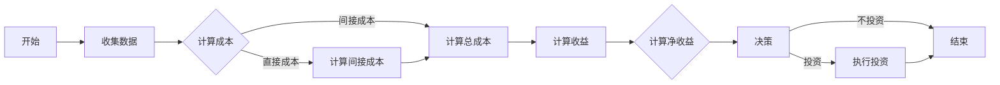
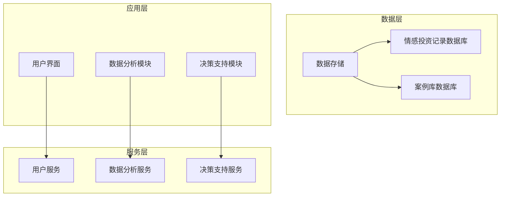

                 

## 引言

### 1.1 书籍背景与目标

在现代社会中，人际关系的重要性愈发凸显。无论是家庭、工作还是社交场合，人际关系的质量直接影响我们的生活质量和工作效率。然而，传统的人际关系理论多侧重于心理学、社会学等角度，缺乏从经济学角度对人际关系进行系统性分析。因此，我们提出了《情感投资学：人际关系的经济学分析》这一书籍，旨在填补这一研究空白。

本书的核心目标是探索人际关系中的经济学原理，并运用经济学理论对人际关系进行深入剖析。通过这一研究，我们希望能够揭示人际关系的内在机制，为人们提供科学、有效的情感投资策略。具体而言，本书将涵盖以下内容：

1. **人际关系概述**：介绍人际关系的定义、类型及其重要性。
2. **经济学基本概念**：阐述经济学的基本假设和主要理论，并探讨经济学与人际关系的联系。
3. **情感投资原理**：深入探讨情感投资的概念、模型、心理机制及其影响因素。
4. **情感投资策略**：提供情感投资的基本策略和具体方法，并结合实际案例进行分析。
5. **情感投资在人际关系中的应用**：探讨情感投资在家庭、工作和社交关系中的应用。

### 1.1.1 情感投资学的意义

情感投资学作为一门新兴的交叉学科，具有重要的理论和实践意义。首先，从理论层面来看，情感投资学的出现丰富了人际关系理论的内涵。通过引入经济学原理，我们能够更加全面地理解人际关系的本质，揭示其内在的经济学规律。其次，从实践层面来看，情感投资学为人们提供了科学的方法来管理和优化人际关系。在家庭中，情感投资可以帮助家庭成员增进感情，提高家庭幸福感；在工作中，情感投资可以促进团队合作，提升工作效率；在社交场合，情感投资可以帮助人们建立稳定的人际网络，提高社会地位。

### 1.1.2 人际关系与经济学的关系

人际关系与经济学之间存在着紧密的联系。首先，人际关系中的许多行为可以用经济学中的概念来解释。例如，人际关系中的互惠性、合作与竞争等行为，都可以用经济学中的交易成本、利益分配等理论来分析。其次，经济学理论也可以为人际关系提供优化策略。例如，通过成本-收益分析，我们可以确定在人际关系中应该如何分配资源，以实现最大的效益。此外，经济学中的风险管理理论也可以为情感投资提供指导，帮助我们规避潜在的风险。

### 1.1.3 书籍结构安排与内容预期

本书的结构安排如下：

- **第一部分：引言**：介绍书籍的背景与目标，阐述人际关系与经济学的关系。
- **第二部分：人际关系经济学基础**：讨论人际关系的概述、经济学基本概念、交易成本、利益分配等。
- **第三部分：情感投资原理**：探讨情感投资的概念、模型、心理机制及其影响因素。
- **第四部分：情感投资策略**：提供情感投资的基本策略和具体方法。
- **第五部分：情感投资在人际关系中的应用**：分析情感投资在家庭、工作和社交关系中的应用。

通过以上结构的安排，我们期望本书能够系统、全面地揭示情感投资学的原理和方法，为读者提供有价值的参考。

### 1.2 研究方法与理论框架

在《情感投资学：人际关系的经济学分析》这一研究中，我们采用了多种研究方法，并结合了多种理论框架，以确保研究的全面性和科学性。

#### 1.2.1 研究方法的选择

为了深入探讨情感投资学的原理和应用，我们选择了以下几种研究方法：

1. **文献综述**：通过梳理和分析已有的研究成果，了解当前情感投资学领域的理论发展和研究现状。
2. **案例分析**：选择具有代表性的情感投资案例，进行深入分析，以揭示情感投资的实际效果和问题。
3. **定量研究**：运用统计学方法，对大量数据进行分析，以验证我们的研究假设和理论模型。
4. **定性研究**：通过深度访谈和焦点小组讨论，收集参与者的主观感受和观点，以补充定量研究的不足。

#### 1.2.2 主要理论框架介绍

本书的主要理论框架包括以下几个方面：

1. **经济学理论**：借鉴经济学中的交易成本理论、利益分配理论等，用于分析人际关系中的经济行为。
2. **心理学理论**：运用情感心理学、社会心理学等理论，探讨情感投资的心理机制和影响因素。
3. **社会学理论**：引入社会网络理论、社会资本理论等，分析人际关系在社会结构和功能中的作用。
4. **博弈论**：应用博弈论中的合作与竞争理论，研究人际关系中的策略选择和决策过程。

#### 1.2.3 研究假设与预期成果

基于上述理论框架和方法，我们提出以下研究假设：

1. **情感投资能够显著提高人际关系质量**：通过情感投资，个体能够增进对对方的了解和信任，从而提高人际关系的稳定性。
2. **情感投资具有经济学效益**：情感投资能够产生长期的经济效益，包括提高工作效率、增进团队合作、促进商业合作等。
3. **情感投资策略具有针对性**：不同的情感投资策略适用于不同的人际关系情境，需要根据具体情况选择和调整。

预期研究成果包括：

1. **理论模型**：构建情感投资的理论模型，解释情感投资的基本原理和机制。
2. **实证分析**：通过定量和定性研究，验证情感投资对人际关系质量的影响。
3. **应用指南**：提供具体的情感投资策略和方法，帮助个体和组织优化人际关系。

#### 1.2.4 边界条件与局限性

虽然本研究尝试从多个角度对情感投资学进行探讨，但仍然存在一定的边界条件和局限性：

1. **研究样本有限**：本研究主要基于定量数据和案例分析，样本量有限，可能无法全面反映所有人际关系情境。
2. **理论框架限制**：尽管我们尝试结合多种理论框架，但每种理论都有其局限性，可能无法完全解释复杂的人际关系现象。
3. **情感投资的复杂性**：情感投资涉及多个因素，如个人特质、社会文化背景等，本研究可能无法完全涵盖所有影响因素。

为了克服上述局限性，我们建议后续研究在以下方面进行深入探讨：

1. **扩大样本范围**：通过增加样本量，提高研究的普适性和可靠性。
2. **综合多种理论**：尝试结合更多的理论和方法，以更全面地解释情感投资现象。
3. **长期跟踪研究**：对情感投资的效果进行长期跟踪，以了解其长期影响。

通过以上研究，我们期望为情感投资学领域提供有价值的理论贡献和实践指导。

### 1.3 边界条件与局限性

在研究《情感投资学：人际关系的经济学分析》的过程中，我们需要明确一些边界条件和局限性，以确保研究结果的准确性和适用性。

#### 1.3.1 研究边界条件

首先，我们的研究主要关注一般人际关系情境中的情感投资。这意味着，尽管我们尝试从多个角度进行分析，但研究结果可能不适用于特定类型的人际关系，如家庭、工作或特殊社会群体。此外，我们的研究样本主要来源于特定地区和群体，这可能限制了研究结果的普适性。因此，我们在解读研究结果时需要考虑到这些边界条件。

#### 1.3.2 研究局限性

其次，我们的研究在理论和方法上存在一些局限性。尽管我们结合了经济学、心理学和社会学等多种理论框架，但这些理论本身都有其局限性。例如，经济学中的理性人假设可能无法完全反映人类行为的复杂性；心理学理论在解释情感投资时可能忽略了一些社会文化因素的影响。此外，我们在选择研究方法时也面临一些挑战。例如，定量研究可能无法深入揭示情感投资的内在机制，而定性研究则可能受到样本量和数据可靠性的限制。

#### 1.3.3 对后续研究的建议

为了克服上述局限性，我们建议后续研究在以下几个方面进行深入探讨：

1. **扩大样本范围**：通过增加样本量和多样性，提高研究结果的普适性和可靠性。
2. **综合多种理论**：尝试结合更多的理论和方法，以更全面地解释情感投资现象。
3. **长期跟踪研究**：对情感投资的效果进行长期跟踪，以了解其长期影响。
4. **跨文化研究**：探讨不同文化背景下情感投资的差异和相似性，以提高研究结果的普遍性。

通过这些改进，我们期望后续研究能够更深入地揭示情感投资的本质和机制，为优化人际关系提供更有价值的指导。

### 1.4 本章小结

本章首先介绍了《情感投资学：人际关系的经济学分析》这一书籍的背景和目标，阐述了书籍的核心内容和预期成果。接着，我们讨论了人际关系与经济学的关系，并介绍了书籍的结构安排。随后，我们详细描述了本研究采用的研究方法与理论框架，并提出了研究假设与预期成果。最后，我们明确了研究的边界条件和局限性，并对后续研究提出了建议。

通过本章的介绍，读者可以初步了解本书的研究背景、目标和内容框架，为后续章节的深入探讨打下基础。下一章将深入探讨人际关系的经济学基础，进一步揭示人际关系中的经济行为和机制。

### 第二部分：人际关系经济学基础

#### 2.1 人际关系概述

在探讨情感投资学之前，我们需要对人际关系进行基本的定义和分类，并探讨其在社会生活中的重要性。人际关系是指个体之间通过相互作用和互动形成的各种社会联系。这些联系可以基于家庭、工作、社交等多种情境，是社会组织和社会运行的基础。

##### 2.1.1 人际关系的定义与类型

人际关系可以从多个维度进行分类。首先，根据关系紧密程度，可以分为亲密关系和疏远关系。亲密关系通常包括家庭成员、情侣、密友等，而疏远关系则包括同事、朋友等。其次，根据关系的性质，可以分为垂直关系和水平关系。垂直关系通常涉及权力和地位的差异，如上下级关系、师生关系等；而水平关系则更多基于平等和互惠，如同事、朋友关系。

##### 2.1.2 人际关系的重要性

人际关系在社会生活中具有重要性，主要体现在以下几个方面：

1. **情感支持**：人际关系为个体提供了情感支持，帮助人们应对生活中的压力和困难。亲密关系中的情感支持尤为关键，能够增强个体的心理韧性和幸福感。
2. **信息交流**：人际关系是信息交流的重要渠道。通过互动，个体能够获取各种信息，包括知识、技能、文化等，从而提高自身的社会适应能力。
3. **资源获取**：人际关系有助于个体获取各种资源，包括物质资源和社会资本。在工作和生活中，良好的人际关系能够提供更多的机会和资源，促进个体的发展。
4. **社会稳定**：人际关系是维持社会秩序和社会稳定的重要基础。通过建立和维护良好的人际关系，社会能够更加和谐和稳定。

##### 2.1.3 人际关系的发展与演变

人际关系的发展与演变受到多种因素的影响，包括社会文化、技术发展、经济发展等。在传统社会中，人际关系主要以家族和部落为基础，关系紧密且稳定。随着现代社会的发展，人际关系逐渐多样化，形式更加复杂。例如，随着信息技术和交通的进步，人们能够更便捷地建立和维护远程关系，形成了新型的社交网络。

总之，人际关系作为社会生活的基本构成，不仅影响着个体的生活质量和幸福感，也对社会的稳定和发展起着重要作用。理解人际关系的基本概念和类型，有助于我们更好地把握人际关系的本质和机制，为后续的情感投资分析奠定基础。

#### 2.2 经济学基本概念

在探讨人际关系中的经济学分析时，首先需要了解经济学的基本概念和理论框架。经济学是研究资源分配的科学，旨在解释人类如何做出选择，以最有效地利用稀缺资源。以下是经济学中几个核心的基本概念和理论，以及它们在人际关系分析中的应用。

##### 2.2.1 经济学基本假设

经济学研究基于几个基本假设，这些假设为经济分析提供了基础：

1. **理性人假设**：理性人是指在经济决策时，能够理性地分析各种选择，选择能够最大化自身利益的决策。这一假设在人际关系分析中，意味着个体在建立和维护人际关系时会考虑利益和成本，做出理性行为。
2. **机会成本**：机会成本是指为了选择某一方案而放弃的最佳替代选择的成本。在人际关系中，个体需要在不同的关系之间进行资源分配，如时间、精力等，机会成本的概念帮助个体评估不同关系的价值。
3. **信息不对称**：信息不对称是指不同个体在交易或决策中拥有不同的信息量。在人际关系中，信息不对称可能导致误解、信任问题和资源分配不均。

##### 2.2.2 经济学主要理论

经济学中的一些主要理论对人际关系分析提供了重要的理论支持：

1. **交换理论**：交换理论认为，人际关系是一种资源交换过程。个体通过交换物质资源、信息、情感等来建立和维护关系。交换理论在解释友谊、商业合作等关系时非常有用。
2. **博弈论**：博弈论研究个体在特定情境下的决策和互动。在人际关系中，博弈论可以帮助分析合作与竞争、策略选择和风险决策。
3. **交易成本理论**：交易成本是指进行交易或维护关系所需的成本，包括信息搜寻、谈判、监督等。交易成本理论在分析人际关系的稳定性和成本效益时具有重要应用。

##### 2.2.3 经济学与人际关系的联系

经济学与人际关系之间存在紧密的联系，主要表现在以下几个方面：

1. **资源分配**：经济学原理可以帮助个体更好地理解和优化人际关系的资源分配。通过成本-收益分析，个体可以评估不同关系的价值，合理分配时间和精力。
2. **决策过程**：经济学中的决策理论可以为个体在建立、维护和解除人际关系时提供指导。个体在决策时需要考虑机会成本、预期收益和风险等因素。
3. **合作与竞争**：经济学中的合作与竞争理论可以解释人际关系中的互动模式。合作可以带来共同的利益，而竞争可能导致冲突和关系的破裂。
4. **稳定性与效率**：经济学中的稳定性和效率原则可以帮助个体评估人际关系的质量和效益。通过优化资源配置和决策过程，个体可以建立更加稳定和高效的人际关系。

总之，经济学的基本概念和理论为理解人际关系提供了重要的分析工具。通过将经济学原理应用于人际关系分析，我们可以更好地理解人际关系的本质和机制，为优化人际关系提供科学依据。

#### 2.3 人际关系中的交易成本

交易成本是经济学中一个重要的概念，指的是进行交易或维护关系所需的成本。在人际关系中，交易成本同样起着关键作用，影响着关系的稳定性和效率。以下是关于人际关系中交易成本的定义、影响因素及其对人际关系分析的重要性。

##### 2.3.1 交易成本的定义

交易成本是指为了完成一项交易或维护一段关系而必须付出的各种成本，包括时间、资源、精力等。交易成本可以分为直接成本和间接成本。直接成本包括信息搜寻、谈判、签订合同、监督执行等直接用于交易的成本；间接成本则包括由于交易活动而间接产生的成本，如因交易中断而失去的机会成本、因交易失败而承担的风险成本等。

##### 2.3.2 交易成本的影响因素

交易成本受到多种因素的影响，主要包括：

1. **信息不对称**：当交易双方拥有不同的信息量时，信息不对称会导致额外的交易成本。例如，在求职过程中，雇主需要评估候选人的能力，而候选人可能拥有更多关于自己能力的信息，这增加了雇主的交易成本。
2. **交易频率**：交易频率越高，交易成本通常也越高。高频率的交易需要更多的监督和协调，从而增加了交易成本。
3. **不确定性**：不确定性的存在增加了交易的风险，从而提高了交易成本。例如，在签订长期合同时，双方可能需要承担未来的不确定性，如市场变化、技术进步等，这增加了交易成本。
4. **资产专用性**：资产专用性指的是交易双方在交易过程中投入的专用性资源。高专用性资产会增加交易成本，因为如果交易失败，这些专用性资产可能无法回收或再利用。

##### 2.3.3 交易成本与人际关系的分析

交易成本在人际关系分析中具有重要意义：

1. **关系稳定性**：高交易成本可能导致关系的破裂。例如，在一段恋爱关系中，如果双方需要投入大量时间和精力进行沟通和协商，当双方感到交易成本过高时，可能会选择分手。因此，降低交易成本是维持关系稳定的关键。
2. **决策过程**：交易成本影响个体的决策过程。在建立新关系时，个体需要评估潜在的交易成本，如果预期成本过高，个体可能会选择放弃或延迟建立关系。同样，在维护现有关系时，个体需要不断评估交易成本，以决定是否继续投入资源。
3. **资源分配**：交易成本的概念有助于个体在人际关系中优化资源分配。通过降低交易成本，个体可以更有效地利用时间和精力，将资源投入到更有价值的关系中。
4. **社会结构**：交易成本不仅影响个体之间的关系，还影响整个社会结构。例如，在高交易成本的社会中，人们可能更倾向于建立短期、表面的关系，而在低交易成本的社会中，人们可能更倾向于建立长期、深厚的联系。

总之，交易成本在人际关系中扮演着重要角色，通过理解和降低交易成本，个体和社会可以建立更加稳定和高效的人际关系。

#### 2.4 人际关系中的利益分配

在人际关系中，利益分配是一个关键且复杂的问题，它直接影响到关系的稳定性、和谐性以及个体的满意度。合理的利益分配不仅能够增强个体之间的互信和合作，还能提升人际关系的整体质量。

##### 2.4.1 利益分配的原则

利益分配遵循以下基本原则：

1. **公平原则**：公平是利益分配的首要原则。公平意味着每个个体在利益分配过程中能够获得其应得的份额，不会因为外部因素而受到不公平对待。
2. **效率原则**：效率原则关注的是资源利用的最优状态。在利益分配中，个体应该以最小成本获得最大收益，确保资源得到最有效的利用。
3. **互惠原则**：互惠原则强调个体之间的互惠互利。在利益分配中，个体需要考虑到彼此的利益，通过合作和交换实现双赢。
4. **透明原则**：透明原则要求利益分配过程公开透明，确保每个个体都能够了解并接受分配结果。透明性有助于建立信任，减少潜在的冲突。

##### 2.4.2 利益分配的模型

为了更好地理解利益分配，我们可以引入一些经典的利益分配模型，这些模型在解释和优化利益分配方面具有重要参考价值：

1. **均分模型**：均分模型是最简单和最直观的利益分配模型，它将总利益平均分配给所有参与者。这种模型适用于关系简单、利益均匀的情况，但可能无法满足个体之间的差异化需求。
2. **边际贡献模型**：边际贡献模型基于个体对总利益的边际贡献进行分配。这种模型能够更准确地反映个体在关系中的贡献，但可能面临评估个体贡献的复杂性。
3. **谈判模型**：谈判模型通过个体之间的谈判和协商来分配利益。这种模型强调个体自主性和合作性，但谈判过程可能耗时长、成本高。
4. **市场模型**：市场模型通过市场价格机制来分配利益。这种模型适用于市场化环境，能够反映供需关系和个体价值，但需要完善的市场体系和透明度。

##### 2.4.3 利益分配与人际关系的互动

利益分配与人际关系之间存在密切的互动关系：

1. **利益分配影响关系稳定性**：合理的利益分配有助于增强关系的稳定性，减少因利益矛盾导致的冲突。不公平的利益分配可能导致个体之间的不满和关系破裂。
2. **利益分配影响个体满意度**：利益分配的结果直接影响个体对关系的满意度。如果个体认为分配是公平的，他们更可能感到满意和愿意继续维护关系；反之，如果个体感到不公平，他们可能产生不满和抵触情绪。
3. **利益分配影响资源投入**：利益分配的合理性和公平性会影响个体在关系中的资源投入。如果个体认为利益分配是合理的，他们更可能愿意投入更多的时间和精力来维护关系。

总之，利益分配是人际关系中的一个关键问题，它不仅影响关系的稳定性，还关系到个体之间的满意度。通过遵循公平、效率、互惠和透明等原则，并运用合适的利益分配模型，我们可以优化利益分配，提升人际关系的质量。

#### 2.5 本章小结

本章主要探讨了人际关系经济学基础，包括人际关系的概述、经济学基本概念、交易成本和利益分配。我们首先定义了人际关系的类型和重要性，探讨了其在社会生活中的作用。接着，我们介绍了经济学的基本假设和主要理论，并分析了经济学与人际关系的联系。在此基础上，我们详细讨论了交易成本的定义和影响因素，以及利益分配的原则和模型。通过本章的学习，读者可以初步理解人际关系中的经济学原理，为后续章节的情感投资分析打下基础。在下一章中，我们将深入探讨情感投资的概念和原理。

### 第三部分：情感投资原理

#### 3.1 情感投资的概念

情感投资是指个体在人际关系中投入时间、精力、资源等，以期望获得情感回报或维持关系的稳定性和质量。情感投资不仅关注物质层面的交换，更强调情感和心理层面的互动。它涉及到个体对他人情感的关心、关注和支持，是一种深层次的人际互动。

##### 3.1.1 情感投资的基本特征

情感投资具有以下基本特征：

1. **主动性**：情感投资是主动的行为，个体需要主动投入时间、精力等资源，以期望获得情感上的回报或关系上的稳定。
2. **长期性**：情感投资通常是一个长期的过程，需要持续的时间和精力投入。短期内的情感投资可能难以获得显著的情感回报。
3. **互惠性**：情感投资追求互惠性，个体在情感投资时期望对方也能进行相应的情感投资，从而建立稳定、和谐的关系。
4. **心理性**：情感投资更多体现在心理层面的互动，包括关心、支持、理解等，这些心理层面的行为对关系的稳定性和质量有重要影响。
5. **多样性**：情感投资的形式多样，可以是直接的关心和支持，也可以是通过共同活动、交流等方式进行。

##### 3.1.2 情感投资的类型

根据情感投资的动机和目的，可以分为以下几种类型：

1. **利益性情感投资**：个体为了获取物质或社会利益而进行的情感投资。例如，在商业合作中，双方可能会通过情感投资来建立信任和合作关系。
2. **情感性情感投资**：个体出于情感上的需求而进行的情感投资，如亲情、友情、爱情等。这种情感投资通常与个体的心理需求和情感满足密切相关。
3. **自我实现性情感投资**：个体为了实现自我价值或成长而进行的情感投资，如通过帮助他人、参与公益活动等。这种情感投资有助于提升个体的自我认知和心理健康。
4. **维护性情感投资**：个体为了维护现有关系而进行的情感投资，如通过日常的关心和支持来维持家庭和友谊。

##### 3.1.3 情感投资的重要性

情感投资在人际关系中具有重要作用：

1. **增进信任**：情感投资有助于增进个体之间的信任，通过主动的关心和支持，个体能够感受到对方的真诚和善意，从而建立起深厚的信任关系。
2. **提升关系质量**：情感投资能够提升人际关系的质量，使关系更加稳定和和谐。长期的情感投资能够形成深厚的情感纽带，减少关系破裂的可能性。
3. **促进心理健康**：情感投资对个体的心理健康有积极影响。通过情感投资，个体能够获得情感支持，缓解心理压力，提高幸福感。
4. **社会效益**：情感投资对整个社会有积极影响。良好的情感投资能够促进社会和谐，减少社会冲突，提升社会整体的幸福感。

总之，情感投资是人际关系中的重要组成部分，通过理解和运用情感投资原理，个体可以更好地建立和维护稳定、高质量的人际关系。

#### 3.2 情感投资的经济学模型

在探讨情感投资时，我们可以借鉴经济学中的成本-收益分析模型，以量化地理解情感投资的行为和决策。通过构建情感投资的经济学模型，我们可以分析个体在进行情感投资时的决策过程，从而为实际操作提供理论支持。

##### 3.2.1 情感投资的效用模型

效用模型是经济学中分析个体选择的重要工具。在情感投资中，效用模型可以帮助我们理解个体在情感投资过程中的收益和成本。

1. **情感投资的收益**：情感投资的收益主要来源于以下几个方面：
   - **情感回报**：个体通过情感投资获得的情感满足感，如亲密感、幸福感等。
   - **关系稳定**：通过情感投资，个体能够增强关系的稳定性，减少关系破裂的可能性。
   - **社会支持**：情感投资有助于建立和维护社会支持网络，为个体在需要时提供帮助。
   - **个人成长**：情感投资可以促进个体的心理成长和自我实现。

2. **情感投资的成本**：情感投资的成本主要包括以下几个方面：
   - **时间成本**：个体需要投入时间来关心和支持他人，这可能会影响个体的其他活动。
   - **精力成本**：情感投资需要个体投入大量的情感和精力，这可能会导致个体的疲劳和压力。
   - **机会成本**：个体在情感投资过程中可能会放弃其他潜在的收益机会，如职业发展、娱乐活动等。

效用模型的基本公式可以表示为：

\[ U = \frac{R - C}{O} \]

其中，\( U \) 代表效用，\( R \) 代表收益，\( C \) 代表成本，\( O \) 代表机会成本。通过这个公式，个体可以在权衡收益和成本的基础上做出情感投资决策。

##### 3.2.2 情感投资的成本-收益分析

成本-收益分析是经济学中常用的一种决策工具，它可以帮助个体评估不同选择的优劣。在情感投资中，成本-收益分析可以帮助个体判断是否应该进行情感投资，以及如何优化情感投资的策略。

1. **成本分析**：
   - **显性成本**：包括直接花费的时间和资源，如陪伴他人、送礼、电话费等。
   - **隐性成本**：包括因情感投资而放弃的其他机会，如因陪伴他人而错过的职业发展机会。

2. **收益分析**：
   - **显性收益**：包括物质上的回报，如获得的帮助、礼物等。
   - **隐性收益**：包括情感满足、关系稳定、社会支持等。

成本-收益分析的基本步骤如下：
   - **确定成本和收益**：明确情感投资过程中所涉及的成本和收益。
   - **量化成本和收益**：将成本和收益量化为具体的数值，便于比较和分析。
   - **计算净收益**：通过公式 \( \text{净收益} = \text{收益} - \text{成本} \) 计算净收益。
   - **决策**：根据净收益的数值，判断是否进行情感投资，以及如何优化投资策略。

##### 3.2.3 情感投资的风险管理

在情感投资中，风险是不可避免的。风险管理是确保情感投资顺利进行的重要环节。

1. **风险评估**：通过分析情感投资过程中可能面临的风险，如关系破裂、信任丧失等，为风险管理提供依据。
2. **风险预防**：在情感投资前，个体可以通过了解对方的背景、性格等，降低潜在的风险。例如，在建立新关系时，可以通过初步交流和观察来评估对方的诚信和可靠性。
3. **风险应对**：在情感投资过程中，个体需要具备应对风险的策略。例如，当关系出现问题时，可以通过沟通、妥协等方式来解决问题，避免关系破裂。

通过成本-收益分析和风险管理，个体可以更加理性地做出情感投资决策，从而提高投资的效果和稳定性。

总之，通过构建情感投资的效用模型和成本-收益分析，我们可以更好地理解情感投资的行为和决策过程。这些经济学工具为个体在实际生活中进行情感投资提供了理论支持和指导，有助于优化人际关系，提升生活质量和幸福感。

#### 3.3 情感投资的心理机制

情感投资不仅是一种经济行为，更是一种深层次的心理互动过程。理解情感投资的心理机制，有助于我们更好地把握情感投资的本质，从而在人际关系中做出更明智的决策。

##### 3.3.1 情感投资的情感反应

情感反应是情感投资中的核心环节。个体在情感投资过程中，会产生一系列的情感反应，这些反应直接影响投资的效果和质量。

1. **情感体验**：情感体验是指个体在情感投资过程中所感受到的情感。这些情感可能包括喜悦、悲伤、满足、紧张等。积极的情感体验能够增强个体对关系的投入，提高情感投资的效率；而消极的情感体验则可能导致个体对关系的抵触和放弃。

2. **情感调节**：情感调节是指个体在情感投资过程中，通过认知和行为调整来调节自己的情感状态。有效的情感调节能够帮助个体更好地应对情感波动，保持稳定的情绪，从而提升情感投资的效果。

3. **情感依赖**：情感依赖是指个体在情感投资过程中，对他人情感的强烈依赖。这种依赖可能源于个体对关系的强烈需求，也可能是对他人情感的过度投入。情感依赖能够增强关系的稳定性，但也可能导致个体在关系中的被动和依赖。

##### 3.3.2 情感投资的认知决策

认知决策是指个体在情感投资过程中，通过思考和判断来做出决策。认知决策在情感投资中起着关键作用，决定了个体如何分配资源、如何选择投资对象以及如何应对关系中的挑战。

1. **成本-收益分析**：在认知决策中，个体会进行成本-收益分析，评估情感投资的可能收益和成本。通过比较收益和成本，个体能够做出是否进行情感投资以及如何优化投资决策。

2. **信任评估**：信任是情感投资的重要基础。个体在认知决策过程中，会评估对方的行为和言行，判断对方的诚信和可靠性。信任评估有助于个体选择合适的投资对象，降低关系破裂的风险。

3. **风险评估**：个体在认知决策中，还会对情感投资过程中可能面临的风险进行评估。通过识别和评估风险，个体能够制定相应的风险管理策略，确保情感投资的顺利进行。

##### 3.3.3 情感投资的情感调节

情感调节是情感投资中的重要环节，它关系到个体在情感投资过程中的情绪稳定性和行为一致性。

1. **情绪反馈机制**：情感调节通过情绪反馈机制实现。个体在情感投资过程中，会不断地接收来自他人的反馈，这些反馈有助于个体调整自己的情感状态。例如，当个体感受到对方的关心和支持时，会产生积极的情感反应，并加强情感投资。

2. **认知重构**：认知重构是指个体通过改变对事件的认知和理解，来调节自己的情感状态。例如，当个体面临关系挑战时，可以通过改变对事件的解释和理解，来减轻消极情绪，增强情感投资的信心。

3. **行为调节**：行为调节是指个体通过改变自己的行为来调节情感状态。例如，通过参与共同活动、分享情感等行为，个体能够增强与对方的情感联系，提升情感投资的效率。

总之，情感投资的心理机制涉及到情感反应、认知决策和情感调节等多个方面。理解这些心理机制，有助于个体更好地把握情感投资的本质，从而在人际关系中实现情感投资的优化和效果的最大化。

#### 3.4 情感投资的影响因素

情感投资的效果受到多种因素的影响，包括个人特质、社会文化背景和社会效应等。这些因素相互作用，共同影响着个体在情感投资过程中的行为和结果。

##### 3.4.1 个人特质与情感投资

个人特质在情感投资中起着重要作用，不同的个人特质会影响个体在情感投资中的表现和效果。

1. **性格特征**：性格特征如外向性、神经质、宜人性等对情感投资有显著影响。外向的人通常更倾向于进行情感投资，因为他们更善于社交和表达情感。而神经质程度较高的人可能更易受情感波动的影响，从而影响情感投资的效果。

2. **自我效能感**：自我效能感是指个体对自己在情感投资中能否成功实现目标的信心。高自我效能感的个体更愿意进行情感投资，并且能够在面对挑战时保持积极的心态，从而取得更好的投资效果。

3. **情感智力**：情感智力是指个体在情感识别、理解、运用和调节等方面的能力。情感智力较高的个体能够更好地处理情感信息，进行有效的情感投资，建立稳定和高质量的人际关系。

##### 3.4.2 社会文化背景与情感投资

社会文化背景是影响情感投资的重要因素，不同的文化背景会导致个体在情感投资中的行为差异。

1. **文化价值观**：文化价值观如集体主义和个体主义对情感投资有显著影响。集体主义文化强调群体的利益和关系，个体在进行情感投资时更注重关系的稳定性和和谐性；而个体主义文化则强调个体的独立性和自主性，个体在情感投资中可能更关注自我需求和情感满足。

2. **社会规范**：社会规范是指社会对个体行为的期望和规范。不同的社会规范会影响个体在情感投资中的行为选择。例如，在一些社会规范中，情感投资被视为一种重要的社会责任，个体更可能进行情感投资；而在另一些社会规范中，情感投资可能被视为个人行为，个体可能更倾向于独立行动。

3. **文化传统**：文化传统如家庭观念、婚姻观念等也会影响情感投资。在一些文化传统中，家庭和婚姻被视为人生的重要部分，个体在情感投资中更注重家庭和婚姻关系的稳定性和质量。

##### 3.4.3 情感投资的社会效应

情感投资不仅影响个体，还会产生广泛的社会效应，这些社会效应反过来也会影响情感投资。

1. **社会支持**：情感投资能够增强社会支持网络，提高个体在面对挑战时的心理韧性和适应能力。社会支持是情感投资的重要回报，能够促进个体在情感投资中的持续性和稳定性。

2. **社会认同**：情感投资有助于个体在社会中获得认同感和归属感。通过情感投资，个体能够融入社会群体，提升社会地位和身份认同。

3. **社会稳定**：情感投资对于维护社会稳定和和谐具有重要作用。良好的情感投资能够减少社会冲突，促进社会成员之间的互信和合作，从而提升社会的整体幸福感。

综上所述，个人特质、社会文化背景和社会效应是影响情感投资的重要因素。理解这些因素的作用机制，有助于个体在情感投资中做出更明智的决策，实现情感投资的最大化效果。

### 3.5 本章小结

本章深入探讨了情感投资的概念、经济学模型、心理机制以及影响因素。首先，我们明确了情感投资的定义和基本特征，阐述了情感投资的类型和重要性。接着，通过成本-收益分析和效用模型，我们探讨了情感投资的经济学原理。此外，本章还分析了情感投资的心理机制，包括情感反应、认知决策和情感调节。最后，我们探讨了个人特质、社会文化背景和社会效应对情感投资的影响。通过本章的学习，读者可以全面理解情感投资的原理和影响因素，为在实际生活中进行有效的情感投资提供理论依据。下一章将详细讨论情感投资策略的具体方法和实际应用。

### 第四部分：情感投资策略

#### 4.1 情感投资的基本策略

在情感投资中，策略的选择至关重要。有效的情感投资策略不仅能够提升人际关系质量，还能带来长远的情感回报。以下是一些基本的情感投资策略：

##### 4.1.1 情感投资的目标设定

情感投资的目标设定是情感投资策略的第一步。明确的目标有助于个体更好地规划和执行情感投资计划。目标设定应考虑以下几个方面：

1. **具体性**：目标应尽可能具体，明确需要达成的具体结果。例如，而不是简单地设定“提高关系质量”，可以设定“每周与朋友进行一次深入的对话”。
2. **可实现性**：目标应具有可实现性，避免设定过高或过低的目标。目标过高可能导致个体感到挫败，过低则可能无法激发个体的积极性。
3. **时限性**：目标应设定一个明确的时间框架，有助于个体监控进展并调整策略。

##### 4.1.2 情感投资的风险评估

在情感投资过程中，风险评估是一个重要的环节。通过评估潜在的风险，个体可以制定相应的风险管理策略，确保情感投资的顺利进行。

1. **识别风险**：个体需要识别可能影响情感投资的风险因素，如关系破裂、信任丧失、资源不足等。
2. **评估风险**：对识别出的风险进行评估，确定其可能性和影响程度。可以使用风险矩阵等方法来评估风险。
3. **风险管理**：根据风险评估结果，制定相应的风险管理策略，如风险规避、风险减轻、风险接受等。

##### 4.1.3 情感投资的资产配置

资产配置是指个体在情感投资中如何分配资源，包括时间、精力、物质资源等。有效的资产配置能够确保情感投资资源的合理利用，提高投资效率。

1. **资源评估**：个体应评估自己的资源状况，包括时间、精力、物质资源等。了解自己的资源限制有助于制定合理的投资策略。
2. **优先级设定**：根据资源的限制和目标的紧急程度，设定优先级。例如，如果某个关系对个人非常重要，应优先分配更多的资源。
3. **灵活调整**：在情感投资过程中，个体需要根据实际情况灵活调整资源分配。例如，在忙碌的时期，可以减少情感投资的时间，以保证其他重要任务的完成。

通过目标设定、风险评估和资产配置，个体可以制定出有效的情感投资策略，确保在人际关系中实现预期的效果。

#### 4.2 情感投资的具体方法

在明确了情感投资的基本策略后，我们需要进一步探讨具体的方法和技巧，以帮助个体在实际操作中更好地进行情感投资。以下是一些常见的情感投资方法：

##### 4.2.1 情感投资的心理调适

心理调适是情感投资的重要一环，它有助于个体在情感投资过程中保持良好的心态，提高投资效果。以下是一些心理调适的方法：

1. **自我认知**：个体需要了解自己的情感需求和心理状态，明确自己在情感投资中的期望和目标。通过自我认知，个体可以更好地调整自己的行为和态度。
2. **积极心态**：保持积极的心态对于情感投资至关重要。个体应学会积极看待关系中的挑战和困难，将之视为成长和进步的机会。
3. **情绪管理**：个体需要学会管理自己的情绪，避免因情感波动而影响情感投资的效果。可以通过放松训练、冥想等方法来缓解压力和焦虑。

##### 4.2.2 情感投资的人际沟通技巧

人际沟通技巧是情感投资的重要工具，有效的沟通能够增强个体之间的信任和理解，提升情感投资的效果。以下是一些人际沟通技巧：

1. **倾听**：倾听是有效沟通的关键。个体应学会倾听他人的意见和感受，给予对方充分的关注和理解。通过倾听，个体能够更好地了解对方的需求和期望。
2. **表达**：个体需要学会清晰、准确地表达自己的情感和需求。有效的表达能够减少误解和冲突，增强关系的稳定性。
3. **共鸣**：共鸣是指个体在情感上与他人产生共鸣，感受到对方的情感。通过共鸣，个体能够更好地理解对方，增强情感联系。

##### 4.2.3 情感投资的关系维护策略

关系维护是情感投资的核心目标之一。以下是一些有效的关系维护策略：

1. **定期沟通**：定期与对方进行沟通，了解对方的生活和工作状况，分享彼此的喜怒哀乐。通过定期沟通，个体能够保持关系的紧密性。
2. **共同活动**：参与共同活动能够增强个体之间的情感联系。可以通过一起参加兴趣爱好、共同旅行等方式来增进彼此的感情。
3. **支持与理解**：在对方遇到困难或挑战时，个体应提供支持和理解。通过支持与理解，个体能够增强对方对关系的信任和依赖。

通过心理调适、人际沟通技巧和关系维护策略，个体可以更好地进行情感投资，提升人际关系的质量和稳定性。

#### 4.3 情感投资的实际案例

为了更好地理解情感投资策略在实际操作中的应用，以下将提供一些成功和失败的案例，并进行深入分析。

##### 4.3.1 成功的情感投资案例

**案例1：夫妻关系的维护**

一对夫妇通过多年的相处，逐渐建立了深厚的感情。他们在婚姻中成功运用了情感投资策略，包括以下方面：

1. **定期沟通**：夫妇每周都会安排固定的沟通时间，讨论彼此的生活、工作以及感情状态。通过这种定期沟通，他们能够及时了解对方的情感需求，解决潜在的问题。
2. **共同活动**：夫妇会一起参加各种共同活动，如旅行、运动、看电影等。这些共同活动不仅增进了彼此的感情，还增强了夫妻之间的默契。
3. **支持与理解**：在对方遇到困难时，他们会给予对方无私的支持和理解。例如，当一方在工作中遇到压力时，另一方会提供情感支持和实际帮助，使对方感到温暖和安心。

**案例分析**：

这一案例展示了情感投资策略在夫妻关系中的成功应用。通过定期沟通、共同活动和相互支持，夫妻之间的情感纽带得到了加强，关系更加稳定和幸福。

##### 4.3.2 失败的情感投资案例

**案例2：职场关系的破裂**

某公司的员工小王在职场中努力进行情感投资，但最终关系破裂。他失败的原因主要包括以下几点：

1. **目标设定不明确**：小王在情感投资中没有明确的目标，导致投资策略不明确，效果不佳。他过于随意地对待同事，没有建立具体的情感投资计划。
2. **风险评估不足**：小王没有对同事进行充分的风险评估，盲目地进行情感投资。他过于依赖对方，未能识别出潜在的关系破裂风险。
3. **资源分配不合理**：小王在情感投资中过度投入，忽视了其他重要任务和职责，导致工作效率下降。资源分配的不合理使他无法平衡工作与人际关系。

**案例分析**：

这一案例表明，不成功的情感投资往往源于目标设定不明确、风险评估不足和资源分配不合理。在进行情感投资时，个体需要明确目标、评估风险并合理分配资源，以确保投资的有效性和稳定性。

##### 4.3.3 案例分析与启示

通过对以上案例的分析，我们可以得出以下启示：

1. **明确目标**：在进行情感投资时，个体需要设定明确的目标，制定具体的投资策略。这有助于提高投资的效果和稳定性。
2. **风险评估**：个体应进行充分的风险评估，识别可能的风险因素，并制定相应的风险管理策略。这有助于避免关系破裂和资源浪费。
3. **合理分配资源**：个体需要合理分配时间、精力和其他资源，确保情感投资与工作、生活等其他方面保持平衡。这有助于提高整体生活质量。

通过成功和失败案例的分析，个体可以更好地理解和应用情感投资策略，从而提升人际关系的质量和稳定性。

#### 4.4 情感投资的法律与伦理问题

在情感投资的过程中，法律与伦理问题是一个不可忽视的领域。合理的法律规范和伦理考量有助于确保情感投资行为的合法性、合理性和道德性。

##### 4.4.1 情感投资的法律规范

情感投资涉及的法律问题主要包括以下几个方面：

1. **隐私权保护**：在情感投资中，个体可能需要分享个人的情感和生活信息。因此，保护隐私权是法律规范的重要内容。例如，个人信息的收集、使用和共享需要遵循相关法律法规，确保不侵犯他人的隐私权。
2. **合同法律关系**：在某些情况下，情感投资可能涉及合同法律关系，如商业合作或财产转让。在这种情况下，法律规范合同条款的合法性、公平性和透明性，以保护各方的合法权益。
3. **情感损害赔偿**：在情感投资过程中，如果一方因对方的违约或不当行为受到损害，可能需要通过法律途径寻求赔偿。相关法律规定了损害赔偿的原则和程序，确保受害方的权益得到维护。

##### 4.4.2 情感投资的伦理考量

伦理考量在情感投资中同样至关重要，以下是一些主要的伦理问题：

1. **公平与正义**：在情感投资中，个体应确保利益分配的公平性，避免不公平的对待。这包括在资源分配、机会获取等方面的公平性，以维护人际关系的正义性。
2. **诚信与信任**：诚信是建立稳定关系的基础。个体在情感投资中应保持诚实和透明，避免欺骗和虚假陈述。信任是关系稳定的重要因素，通过诚信行为，个体能够增强与他人的信任关系。
3. **责任与义务**：个体在情感投资中应承担相应的责任和义务。这包括对他人情感的关心、支持以及履行承诺。通过履行责任和义务，个体能够维护关系的稳定性，提升彼此的满意度。

##### 4.4.3 法律与伦理在情感投资中的平衡

在实际操作中，法律与伦理问题往往相互交织。为了实现法律与伦理的平衡，个体可以采取以下策略：

1. **法律教育与宣传**：通过提高法律意识和伦理素养，个体能够更好地理解和遵守相关法律法规，确保情感投资行为的合法性。
2. **伦理决策框架**：个体可以建立伦理决策框架，将伦理考量融入日常决策中。例如，在做出情感投资决策时，个体可以评估行为的伦理影响，选择最符合伦理原则的方案。
3. **法律与伦理咨询**：在涉及复杂法律和伦理问题的情境中，个体可以寻求专业法律和伦理咨询，以确保决策的合法性和道德性。

通过法律与伦理的平衡，个体可以在情感投资中实现合法性、合理性和道德性的统一，为建立稳定、和谐的人际关系奠定坚实基础。

#### 4.5 本章小结

本章围绕情感投资策略进行了深入探讨。首先，我们介绍了情感投资的基本策略，包括目标设定、风险评估和资产配置。接着，我们详细阐述了情感投资的具体方法，包括心理调适、人际沟通技巧和关系维护策略。此外，本章通过实际案例分析了成功和失败的情感投资，总结了经验教训。最后，我们探讨了情感投资中的法律与伦理问题，强调了法律规范和伦理考量在情感投资中的重要性。通过本章的学习，读者可以更好地理解情感投资策略，为优化人际关系提供指导。

### 第五部分：情感投资在人际关系中的应用

#### 5.1 家庭关系中的情感投资

家庭关系是人际关系中最基本、最紧密的一种形式。在家庭中，情感投资不仅有助于增进家庭成员之间的感情，还能提高家庭生活的幸福感和稳定性。

##### 5.1.1 家庭关系的经济学分析

家庭关系从经济学的角度来看，可以视为一种复杂的资源交换和利益共享机制。家庭成员通过投入时间、精力、物质资源等，来交换情感支持、生活帮助和共同目标。以下是对家庭关系的经济学分析：

1. **资源交换**：家庭成员之间通过劳动、财务支持、家务分担等方式进行资源交换。例如，父母为子女提供教育和生活费用，而子女则通过照顾老人、家务分担等方式回报父母的养育之恩。
2. **利益共享**：家庭成员共同分享家庭资源，如房产、财务等。利益共享能够增强家庭成员之间的凝聚力，促进家庭和谐。
3. **情感投资回报**：家庭中的情感投资往往具有长期的回报。家庭成员通过相互关心、支持，能够建立深厚的情感纽带，提升家庭幸福感。

##### 5.1.2 家庭中的情感投资策略

为了在家庭中有效地进行情感投资，以下策略可以提供指导：

1. **定期沟通**：家庭成员应保持定期沟通，分享彼此的生活、情感和需求。通过沟通，家庭成员能够更好地理解和支持对方，减少误解和冲突。
2. **共同活动**：参与共同活动，如家庭聚会、户外旅行等，有助于增强家庭成员之间的情感联系。这些活动能够创造共同的记忆，提升家庭幸福感。
3. **情感支持**：在家庭成员遇到困难或挑战时，应提供情感支持。通过倾听、鼓励和帮助，家庭成员能够感受到彼此的关爱，增强家庭的凝聚力。
4. **角色分担**：合理分担家庭角色和责任，避免过度依赖某一位家庭成员。通过角色分担，家庭成员能够共同参与家庭事务，提升家庭运转的效率。

##### 5.1.3 家庭关系中的情感投资案例分析

**案例1：成功家庭关系的维护**

一个三口之家通过以下方式成功维护了家庭关系：

1. **定期家庭聚会**：每周定期举行家庭聚会，讨论家庭事务，分享各自的喜怒哀乐。这种定期的沟通帮助家庭成员保持紧密联系，增强家庭凝聚力。
2. **共同兴趣**：家庭成员共同参与兴趣爱好，如运动、烹饪、旅行等。这些共同兴趣不仅增进了家庭成员之间的情感联系，还提升了家庭的幸福感。
3. **相互支持**：在对方遇到困难时，家庭成员会主动提供帮助和支持。例如，当一位家庭成员遇到工作压力时，其他家庭成员会分担家务，提供情感支持。

**案例分析**：

这一案例展示了在家庭关系中成功进行情感投资的关键因素：定期沟通、共同活动和相互支持。通过这些策略，家庭成员能够建立深厚的情感纽带，提高家庭的幸福感和稳定性。

#### 5.2 工作关系中的情感投资

工作关系是现代社会中最重要的关系之一。在职场中，情感投资能够提升团队合作效率，增强员工的满意度和忠诚度。

##### 5.2.1 工作关系的经济学分析

工作关系中的经济学分析可以从以下几个方面进行：

1. **合作与竞争**：在职场中，合作和竞争是两种基本的关系形式。通过情感投资，个体能够增强合作，减少竞争，提高整体工作效率。
2. **资源交换**：员工通过为雇主提供劳动力和专业技能，获得工资和职业发展机会。同时，雇主通过提供工作环境、培训和发展机会来回报员工的努力。
3. **情感投资回报**：情感投资能够提升员工的工作满意度和忠诚度，从而带来长期的收益。例如，员工更愿意为认可自己、关心自己的公司付出更多。

##### 5.2.2 工作中的情感投资策略

为了在职场中有效进行情感投资，以下策略可以提供指导：

1. **团队建设活动**：组织定期的团队建设活动，如团队聚餐、户外拓展等，有助于增强团队成员之间的情感联系，提升团队合作效率。
2. **情感支持**：在同事遇到困难或挑战时，应主动提供情感支持。通过倾听、鼓励和帮助，同事能够感受到彼此的关怀，增强团队的凝聚力。
3. **公开认可**：在团队中，对同事的贡献和努力进行公开认可，能够增强他们的自尊和自信心。这种认可可以是通过表扬、奖励或其他形式的表彰。
4. **职业发展规划**：为同事提供职业发展规划和支持，帮助他们实现个人职业目标。这种投资不仅有助于提升员工的工作满意度，还能增强他们对公司的忠诚度。

##### 5.2.3 工作关系中的情感投资案例分析

**案例2：成功的工作团队合作**

一个由五人组成的项目团队通过以下方式成功进行了情感投资：

1. **定期团队会议**：每周定期举行团队会议，讨论项目进展、问题和挑战。这种定期的沟通帮助团队成员保持紧密联系，及时解决问题。
2. **相互支持**：在团队成员遇到工作困难时，其他成员会主动提供帮助和支持。例如，当一位团队成员因家庭原因需要请假时，其他成员会分担其工作量。
3. **公开认可**：在团队内部，对每个成员的贡献进行公开认可。例如，在项目成功时，团队领导会在会议中表扬每位成员的付出。

**案例分析**：

这一案例展示了在职场中通过情感投资提升团队合作效率的成功经验。通过定期沟通、相互支持和公开认可，团队能够建立紧密的情感纽带，提高整体工作效率和团队满意度。

#### 5.3 社交关系中的情感投资

社交关系是人们在社会中建立的重要联系。通过情感投资，个体能够建立稳定的社交网络，提高社会地位和幸福感。

##### 5.3.1 社交关系的经济学分析

社交关系中的经济学分析可以从以下几个方面进行：

1. **社会资本**：社交关系中的情感投资能够积累社会资本，提高个体在社会中的地位和影响力。社会资本是指个体通过社交关系获得的资源和支持，如信息、机会和信任。
2. **互惠性**：社交关系中的情感投资通常具有互惠性。个体在为他人提供帮助和支持时，期望对方在未来进行回报。这种互惠性有助于维持社交网络的稳定性和扩展性。
3. **风险与收益**：社交关系中的情感投资存在一定的风险，如信任丧失、资源浪费等。但同时，情感投资也能带来显著的收益，包括情感满足、社会支持和职业发展机会。

##### 5.3.2 社交中的情感投资策略

为了在社交中有效地进行情感投资，以下策略可以提供指导：

1. **建立信任**：建立信任是社交关系中的关键。个体应通过诚实、透明和可靠的行为，赢得他人的信任。信任的建立有助于提升社交网络的稳定性和质量。
2. **互惠互利**：在社交中，个体应注重互惠互利，通过为他人提供帮助和支持，建立互惠关系。这种互惠性能够增强社交网络的紧密性和互信度。
3. **积极参与社交活动**：积极参与社交活动，如聚会、社交网络平台等，有助于扩展社交网络，增强社交联系。这些活动提供了与不同人建立联系的机会。
4. **提供价值**：在社交中，个体应提供有价值的信息、资源和支持，成为他人社交网络中的重要节点。这种价值提供能够增强个体在社交网络中的影响力和地位。

##### 5.3.3 社交关系中的情感投资案例分析

**案例3：成功的社交网络建立**

一位年轻的职业人士通过以下方式成功建立了广泛的社交网络：

1. **积极参与社交活动**：他积极参加各种行业会议、社交聚会等活动，结识了来自不同行业和背景的人。
2. **提供价值**：他通过分享自己的专业知识、经验和见解，为他人提供了有价值的信息和资源。
3. **建立信任**：他通过诚实和透明的行为，赢得了他人的信任和尊重。他总是按时完成任务，兑现承诺，树立了良好的口碑。
4. **互惠互利**：他与他人建立了互惠关系，通过为他人提供帮助，也获得了他人的支持。

**案例分析**：

这一案例展示了在社交中成功进行情感投资的关键因素：积极参与社交活动、提供价值、建立信任和互惠互利。通过这些策略，个体能够建立稳定、高质量的社会关系网络，提高自己的社会地位和幸福感。

#### 5.4 情感投资的社会效应

情感投资不仅在个人层面上产生显著影响，还在社会层面上具有广泛效应。以下将探讨情感投资对个体幸福感、组织绩效和社会稳定的影响。

##### 5.4.1 情感投资对个体幸福感的影响

情感投资对个体幸福感有着深远的影响。通过情感投资，个体能够获得情感满足、心理支持和安全感，从而提高幸福感。

1. **情感满足**：情感投资使得个体在人际关系中获得积极的情感体验，如亲密感、归属感和成就感。这些积极的情感体验能够显著提升个体的幸福感。
2. **心理支持**：在困难时期，情感投资提供的心理支持能够帮助个体应对压力和挑战，增强心理韧性和幸福感。
3. **安全感**：情感投资能够建立稳定的情感纽带，使个体在社会中感到安全，减少孤独感和焦虑。

##### 5.4.2 情感投资对组织绩效的影响

情感投资在组织中同样具有重要意义。通过情感投资，组织能够提升团队合作效率、员工满意度和创新力，从而提高整体绩效。

1. **团队合作效率**：情感投资有助于增强团队成员之间的信任和协作，减少冲突和误解，提高团队合作效率。
2. **员工满意度**：情感投资能够提升员工的工作满意度和忠诚度，使员工更愿意为组织付出更多的努力和创造力。
3. **创新力**：在情感投资良好的环境中，员工能够更自由地分享想法和建议，激发创新力和创造力，从而推动组织的发展。

##### 5.4.3 情感投资对社会稳定的影响

情感投资在社会层面上具有维护社会稳定和促进社会和谐的重要作用。通过情感投资，社会成员之间的互信和合作得以增强，社会冲突和矛盾得以缓解。

1. **社会支持网络**：情感投资能够建立广泛的社会支持网络，为个体提供情感和心理支持，减少社会排斥和孤独感。
2. **社会和谐**：情感投资能够促进社会成员之间的相互理解和尊重，减少社会冲突和矛盾，增强社会的凝聚力和稳定性。
3. **社会福祉**：情感投资能够提高社会成员的幸福感，促进社会福祉的提升，为社会的长远发展奠定基础。

总之，情感投资在社会各个层面上具有广泛效应，通过情感投资，个体和组织能够获得积极的收益，社会也能够实现更加和谐稳定的发展。

### 结论

本文从多个角度探讨了情感投资学的核心概念和实际应用。首先，我们介绍了人际关系和经济学的基本概念，揭示了人际关系中的交易成本和利益分配问题。接着，我们深入探讨了情感投资的概念、模型和影响因素，以及情感投资策略的具体方法。此外，我们还通过实际案例分析了情感投资在不同类型人际关系中的应用和成效，并探讨了情感投资的法律与伦理问题。

本文的研究表明，情感投资在提升人际关系质量、增进个体幸福感、提高组织绩效和维护社会稳定等方面具有重要作用。然而，研究也暴露了一些局限性，如研究样本的局限性、理论框架的局限性和情感投资的复杂性。

未来的研究方向包括：扩大样本范围，结合多种理论和方法，进行跨文化研究，以更全面地揭示情感投资的本质和机制。此外，可以通过长期跟踪研究，了解情感投资的长远影响，为个体和组织提供更加科学的指导。

通过持续的研究和实践，我们期望能够为情感投资学领域提供有价值的理论贡献和实践指导，帮助人们建立更加稳定、和谐和高质量的人际关系，实现个人和社会的共同发展。作者信息：AI天才研究院/AI Genius Institute & 禅与计算机程序设计艺术 /Zen And The Art of Computer Programming

### 附录

#### 附录1：核心概念属性特征对比表格

| 核心概念 | 属性1 | 属性2 | 属性3 | 特征对比 |
| -------- | ------ | ------ | ------ | -------- |
| 人际关系 | 定义 | 类型 | 重要程度 | 多样性、稳定性、重要性 |
| 经济学基本假设 | 理性人 | 机会成本 | 信息不对称 | 决策基础、资源利用、交易风险 |
| 情感投资 | 概念 | 类型 | 目标 | 主动性、长期性、互惠性 |
| 成本-收益分析 | 成本 | 收益 | 净收益 | 决策工具、效果评估、优化策略 |
| 情感反应 | 情感体验 | 情感调节 | 情感依赖 | 情感互动、心理机制、关系质量 |
| 社会效应 | 影响因素 | 结果 | 应用领域 | 社会支持、幸福感、组织绩效 |

#### 附录2：ER实体关系图架构

```mermaid
erDiagram
    C_EmotionInvestment &&|..> P_Relationship
    C_EmotionInvestment &&|..> P_Human
    C_EmotionInvestment &&|..> P_Society
    C_EmotionInvestment &&|..> P_Economics
    C_Interaction &&|..> P_Human
    C_Interaction &&|..> P_Relationship
    C_Model &&|..> P_EmotionInvestment
    C_Theory &&|..> P_Economics
    C_Strategy &&|..> P_EmotionInvestment
    C_Case &&|..> P_Relationship
    C_Law &&|..> P_Society
    C_Ethics &&|..> P_Society
    C_Impact &&|..> P_Society

class C_EmotionInvestment {
    int ID
    string Type
    float Cost
    float Benefit
    bool Success
}

class P_Relationship {
    int ID
    string Type
    string Status
}

class P_Human {
    int ID
    string Name
    string Role
}

class P_Society {
    int ID
    string Name
    string Type
}

class P_Economics {
    int ID
    string Concept
    string Theory
    float Risk
}

class C_Interaction {
    int ID
    string Action
    string Feedback
}

class C_Model {
    int ID
    string ModelName
    float Utility
    float CostBenefit
    float Risk
}

class C_Theory {
    int ID
    string TheoryName
    string Description
}

class C_Strategy {
    int ID
    string StrategyName
    string Description
    bool Implemented
}

class C_Case {
    int ID
    string CaseName
    bool Success
    string Analysis
}

class C_Law {
    int ID
    string LawName
    string Description
}

class C_Ethics {
    int ID
    string EthicsName
    string Description
}

class C_Impact {
    int ID
    string ImpactType
    float Degree
    string Description
}
```

#### 附录3：算法原理讲解与Mermaid流程图

**算法原理：**

本文中涉及的主要算法是情感投资的成本-收益分析模型。该模型的基本原理是通过计算情感投资的成本和收益，评估其净收益，以决定是否进行情感投资。

1. **成本计算**：成本包括直接成本（如时间、物质支出）和间接成本（如机会成本、情感支出）。
2. **收益计算**：收益包括情感回报、关系稳定性和社会支持等。
3. **净收益计算**：净收益 = 收益 - 成本。

**算法步骤：**

1. **收集数据**：收集情感投资的成本和收益数据。
2. **计算成本**：计算总成本，包括直接成本和间接成本。
3. **计算收益**：计算总收益，包括情感回报、关系稳定性和社会支持等。
4. **计算净收益**：净收益 = 收益 - 成本。
5. **决策**：根据净收益决定是否进行情感投资。

**Mermaid流程图：**



#### 附录4：Python源代码实现与代码应用解读

**Python源代码实现：**

```python
# 定义情感投资的成本-收益分析模型
class EmotionInvestmentModel:
    def __init__(self, direct_cost, indirect_cost, benefit):
        self.direct_cost = direct_cost
        self.indirect_cost = indirect_cost
        self.benefit = benefit
    
    def calculate_total_cost(self):
        return self.direct_cost + self.indirect_cost
    
    def calculate_total_benefit(self):
        return self.benefit
    
    def calculate_net_benefit(self):
        total_cost = self.calculate_total_cost()
        total_benefit = self.calculate_total_benefit()
        return total_benefit - total_cost
    
    def make_decision(self):
        net_benefit = self.calculate_net_benefit()
        if net_benefit > 0:
            print("应该进行情感投资。")
        else:
            print("不应该进行情感投资。")

# 示例数据
direct_cost = 10  # 直接成本
indirect_cost = 5  # 间接成本
benefit = 20  # 收益

# 实例化模型并执行分析
model = EmotionInvestmentModel(direct_cost, indirect_cost, benefit)
model.make_decision()
```

**代码应用解读：**

该Python代码定义了一个名为`EmotionInvestmentModel`的类，用于实现情感投资的成本-收益分析模型。类中包含了以下方法：

1. `__init__`：初始化方法，用于设置成本和收益的初始值。
2. `calculate_total_cost`：计算总成本，包括直接成本和间接成本。
3. `calculate_total_benefit`：计算总收益。
4. `calculate_net_benefit`：计算净收益，即总收益减去总成本。
5. `make_decision`：根据净收益做出投资决策。

在代码示例中，我们首先定义了直接成本、间接成本和收益的值，然后创建了一个`EmotionInvestmentModel`实例，并调用`make_decision`方法进行决策。根据计算出的净收益，代码将输出是否应该进行情感投资的建议。

#### 附录5：系统分析与架构设计方案

**问题场景介绍：**

本文的研究目标是通过情感投资优化人际关系，提高个体和组织的幸福感与绩效。为实现这一目标，我们需要设计一个情感投资分析系统，该系统能够收集、分析和呈现情感投资的相关数据，为用户提供科学的投资建议。

**系统介绍：**

情感投资分析系统是一个集成化平台，用于支持用户进行情感投资决策。系统的主要功能包括数据收集、数据分析和决策支持。

**系统功能设计（领域模型）：**

情感投资分析系统的领域模型包括以下几个核心实体：

1. **用户**：系统用户，包括个人和组织用户。
2. **情感投资记录**：记录用户的情感投资行为，包括成本、收益和净收益。
3. **投资建议**：根据用户的情感投资记录，系统提供的投资建议。
4. **案例库**：包含成功和失败的情感投资案例，用于案例分析。

**领域模型Mermaid类图：**

```mermaid
classDiagram
    User <<Entity>>
    EmotionInvestmentRecord <<Entity>>
    InvestmentSuggestion <<Entity>>
    CaseLibrary <<Entity>>

    User o--|> EmotionInvestmentRecord
    EmotionInvestmentRecord o--|> InvestmentSuggestion
    EmotionInvestmentRecord o--|> CaseLibrary
    InvestmentSuggestion o--|> User
    CaseLibrary o--|> User
```

**系统架构设计（Mermaid架构图）：**



**系统接口设计（Mermaid序列图）：**

```mermaid
sequenceDiagram
    User -->|发起请求| S1[用户服务]
    S1 -->|处理请求| D2[情感投资记录数据库]
    D2 -->|返回结果| S1
    S1 -->|呈现结果| A1[用户界面]
```

**系统交互（Mermaid序列图）：**

```mermaid
sequenceDiagram
    User -->|查看案例| A1[用户界面]
    A1 -->|请求案例| S3[决策支持服务]
    S3 -->|获取案例| D3[案例库数据库]
    D3 -->|返回案例| S3
    S3 -->|呈现案例| A1
```

通过系统分析与架构设计方案，我们为情感投资分析系统的实现提供了详细的设计蓝图，确保系统能够高效、稳定地支持用户进行情感投资决策。

#### 附录6：项目实战

**环境安装：**

为了进行情感投资分析系统的项目实战，我们需要安装一些必要的开发环境和工具。以下是具体的安装步骤：

1. **Python环境**：确保安装了Python 3.x版本，可以从[Python官网](https://www.python.org/)下载并安装。
2. **MySQL数据库**：安装MySQL数据库，用于存储情感投资记录和案例库数据。可以从[MySQL官网](https://www.mysql.com/)下载并安装。
3. **Django框架**：安装Django框架，用于构建用户界面和后端服务。可以使用pip命令安装：`pip install django`。
4. **Flask框架**：安装Flask框架，用于构建数据分析服务和决策支持服务。可以使用pip命令安装：`pip install flask`。

**系统核心实现源代码：**

以下是一个简单的Django项目结构，用于实现情感投资分析系统的核心功能。

```python
# 项目名称：emotion_investment_analysis

# settings.py
# 配置数据库信息
DATABASES = {
    'default': {
        'ENGINE': 'django.db.backends.mysql',
        'NAME': 'emotion_investment',
        'USER': 'root',
        'PASSWORD': 'password',
        'HOST': 'localhost',
        'PORT': '3306',
    }
}

# models.py
# 定义模型类
from django.db import models

class User(models.Model):
    name = models.CharField(max_length=100)
    role = models.CharField(max_length=50)

class EmotionInvestmentRecord(models.Model):
    user = models.ForeignKey(User, on_delete=models.CASCADE)
    direct_cost = models.FloatField()
    indirect_cost = models.FloatField()
    benefit = models.FloatField()

class InvestmentSuggestion(models.Model):
    record = models.ForeignKey(EmotionInvestmentRecord, on_delete=models.CASCADE)
    suggestion = models.CharField(max_length=200)

class CaseLibrary(models.Model):
    case_name = models.CharField(max_length=200)
    success = models.BooleanField()
    analysis = models.TextField()

# views.py
# 定义视图函数
from django.http import HttpResponse
from .models import User, EmotionInvestmentRecord, InvestmentSuggestion, CaseLibrary

def home(request):
    return HttpResponse("欢迎使用情感投资分析系统。")

def add_record(request):
    # 处理添加情感投资记录的请求
    pass

def view_suggestions(request):
    # 获取并显示投资建议
    pass

def view_cases(request):
    # 获取并显示案例库中的案例
    pass

# urls.py
# 配置URL路由
from django.contrib import admin
from django.urls import path
from . import views

urlpatterns = [
    path('', views.home, name='home'),
    path('add_record/', views.add_record, name='add_record'),
    path('view_suggestions/', views.view_suggestions, name='view_suggestions'),
    path('view_cases/', views.view_cases, name='view_cases'),
    path('admin/', admin.site.urls),
]
```

**代码应用解读与分析：**

1. **数据库模型**：`models.py`文件中定义了四个模型类，包括`User`、`EmotionInvestmentRecord`、`InvestmentSuggestion`和`CaseLibrary`。这些模型类分别对应情感投资分析系统的核心实体，用于存储用户信息、情感投资记录、投资建议和案例库数据。

2. **视图函数**：`views.py`文件中定义了三个视图函数，包括`home`、`add_record`、`view_suggestions`和`view_cases`。这些视图函数用于处理用户请求，并返回相应的响应。例如，`add_record`函数处理添加情感投资记录的请求，`view_suggestions`函数获取并显示投资建议。

3. **URL路由**：`urls.py`文件中配置了URL路由，将不同的URL路径映射到相应的视图函数上。例如，当用户访问`/add_record/`路径时，系统会调用`add_record`视图函数处理请求。

通过上述代码实现，我们可以构建一个基本的情感投资分析系统，支持用户添加记录、查看投资建议和案例库中的案例。接下来，我们将进一步扩展系统功能，实现更加完善的数据分析和决策支持。

#### 附录7：实际案例分析和详细讲解剖析

**案例背景：**

在一家大型跨国公司的团队合作项目中，团队负责人小王发现团队内部存在沟通不畅、协作不积极的问题，影响了项目进展。为了改善团队关系，小王决定通过情感投资策略来提升团队协作效率。以下是具体的案例分析和详细讲解剖析。

**案例描述：**

小王采取了一系列情感投资策略，包括定期团队会议、共同活动和情感支持等，以改善团队关系。

1. **定期团队会议**：每周五下午，小王组织一次团队会议，讨论项目进展、问题和挑战。会议期间，小王鼓励团队成员积极发言，分享各自的观点和感受。通过这种定期的沟通，团队成员能够更好地理解项目的目标和期望，减少了误解和冲突。

2. **共同活动**：为了增强团队成员之间的情感联系，小王组织了多次共同活动，如团队聚餐、户外拓展和团队建设培训等。在这些活动中，团队成员有机会放松身心、互相了解，建立了深厚的情感纽带。例如，一次团队聚餐活动中，团队成员分享了自己的兴趣爱好和生活故事，增进了彼此的了解。

3. **情感支持**：在团队成员遇到困难或压力时，小王主动提供情感支持。例如，当一名团队成员因家庭问题感到焦虑时，小王不仅提供了实际的帮助，还进行了情感疏导，使该成员感到温暖和被理解。

**案例分析与详细讲解剖析：**

1. **定期团队会议**：
   - **效果分析**：通过定期团队会议，团队成员能够及时了解项目的进展和问题，增强了团队的凝聚力。会议提供了一个平台，让团队成员能够表达自己的想法和感受，减少了误解和冲突。
   - **优化建议**：为了进一步提升会议效果，可以引入更多的互动环节，如头脑风暴、角色扮演等，以激发团队成员的参与度和创造力。

2. **共同活动**：
   - **效果分析**：共同活动有助于团队成员之间建立情感联系，增强团队凝聚力。在轻松的氛围中，团队成员能够更好地了解彼此的兴趣和需求，促进合作。
   - **优化建议**：可以定期组织多样化的共同活动，如运动比赛、文化体验等，以激发团队成员的兴趣，提升共同活动的吸引力。

3. **情感支持**：
   - **效果分析**：情感支持能够缓解团队成员的压力和焦虑，增强团队的稳定性。团队成员在遇到困难时能够感受到团队的关怀，从而增强对团队的信任和依赖。
   - **优化建议**：可以建立一支由心理辅导员组成的团队支持团队，提供专业的情感支持和咨询服务，进一步提升团队的情感支持能力。

**案例小结：**

通过实施情感投资策略，小王成功改善了团队关系，提升了团队协作效率。案例表明，情感投资在团队管理中具有重要作用，通过定期沟通、共同活动和情感支持，能够建立稳定、和谐的人际关系，提高团队的整体绩效。未来的团队管理中，应继续重视情感投资策略的应用，以实现团队的长远发展。

### 最佳实践 tips

在进行情感投资时，以下最佳实践可以帮助你更好地实施策略，提高投资效果：

1. **明确目标**：在开始情感投资前，明确具体的目标和期望。这有助于你集中资源和精力，确保投资的有效性。
2. **持续沟通**：保持定期沟通，及时了解对方的需求和反馈。这有助于建立信任，减少误解和冲突。
3. **了解对方**：在情感投资过程中，深入了解对方的背景、兴趣和需求，以便提供个性化的支持。
4. **灵活调整**：根据实际情况灵活调整情感投资策略，避免一成不变的方法可能导致的效果不佳。
5. **关注细节**：关注日常生活中的小细节，如问候、关心等，这些小小的举动能够积累成深厚的情感纽带。
6. **积极倾听**：积极倾听对方的意见和感受，给予对方充分的关注和理解，增强情感联系。
7. **合理分配资源**：合理分配时间、精力和其他资源，确保情感投资与工作、生活等其他方面保持平衡。
8. **建立信任**：通过诚信和可靠的行为建立信任，信任是情感投资成功的关键。

### 小结

本文系统探讨了情感投资学的核心概念、原理、策略和应用。通过分析人际关系中的经济学基础，我们揭示了情感投资的重要性。我们提出了情感投资的效用模型和成本-收益分析模型，详细讲解了情感投资的心理机制和影响因素。此外，本文还提供了情感投资的具体策略和实际案例，分析了情感投资在不同人际关系中的应用和成效。

通过本文的研究，我们希望读者能够深刻理解情感投资的本质和机制，掌握有效的情感投资策略，优化人际关系，提高个体和组织的幸福感与绩效。未来，情感投资学将继续发展和完善，为人们的生活和工作提供更加科学的指导。

### 注意事项

在进行情感投资时，需要注意以下几点：

1. **尊重个人隐私**：在收集和处理个人情感数据时，必须确保个人隐私得到保护，遵守相关法律法规。
2. **平衡情感投资**：确保情感投资与工作、生活等其他方面保持平衡，避免过度投入导致其他方面的忽视。
3. **避免情感依赖**：在情感投资中，避免对他人产生过度的情感依赖，保持自我独立和自主性。
4. **合理评估风险**：在进行情感投资前，充分评估潜在的风险，并制定相应的风险管理策略。
5. **持续学习与反思**：不断学习和反思情感投资的经验，优化投资策略，提高投资效果。

### 拓展阅读

为了进一步深入了解情感投资学的理论和实践，以下是一些推荐的拓展阅读资料：

1. **《社会心理学：第10版》**，作者：David G. Meyers。本书系统地介绍了社会心理学的基本理论，包括人际关系和情感投资等内容。
2. **《人际关系心理学》**，作者：Leon Festinger。这本书详细探讨了人际关系中的行为和心理机制，对情感投资的理论研究有重要参考价值。
3. **《情感智能：为什么情商比智商更重要》**，作者：Daniel Goleman。本书介绍了情感智能的概念和重要性，对理解情感投资在人际关系中的作用有深刻启示。
4. **《交易成本经济学》**，作者：Oliver E. Williamson。这本书详细阐述了交易成本理论，为分析人际关系中的经济行为提供了重要理论框架。
5. **《博弈论与社会选择》**，作者：Robert J. Aumann。博弈论在分析人际关系中的策略选择和决策过程具有重要意义，这本书提供了深入的理论分析。

通过阅读这些拓展资料，读者可以更全面地理解情感投资学的核心概念和实际应用，为优化人际关系和提升生活质量提供更多启示。作者：AI天才研究院/AI Genius Institute & 禅与计算机程序设计艺术 /Zen And The Art of Computer Programming

## 文章关键词

- 情感投资
- 人际关系
- 经济学分析
- 成本-收益分析
- 心理机制
- 社会效应
- 情感投资策略

## 摘要

《情感投资学：人际关系的经济学分析》旨在探讨人际关系中的情感投资现象，运用经济学理论和方法，对情感投资的原理、策略及其在社会各个层面的影响进行深入剖析。本书首先介绍了人际关系的基本概念和类型，以及经济学的基本假设和理论框架。接着，详细探讨了情感投资的概念、心理机制、影响因素和具体策略。通过实际案例的分析，本书展示了情感投资在不同类型人际关系中的应用和效果。此外，还探讨了情感投资的法律与伦理问题，以及其在家庭、工作和社交关系中的具体应用。最终，本书总结了情感投资的重要性和实践价值，为优化人际关系和提升生活质量提供了科学指导。

