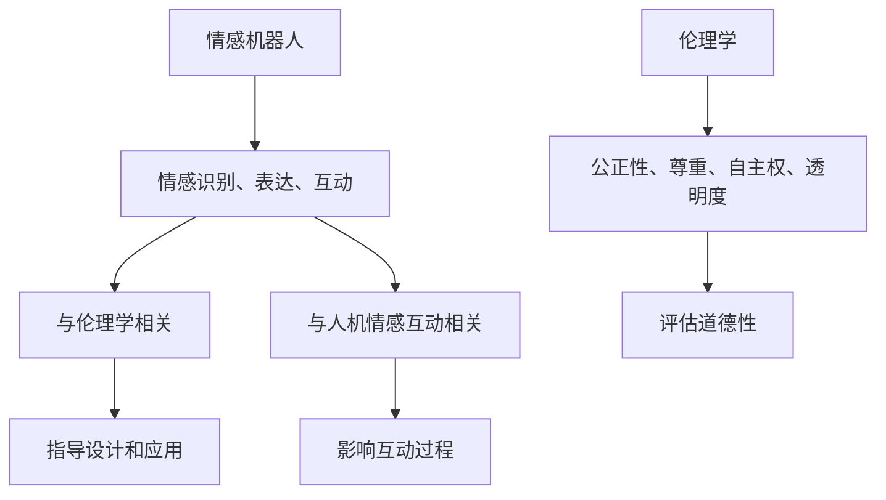
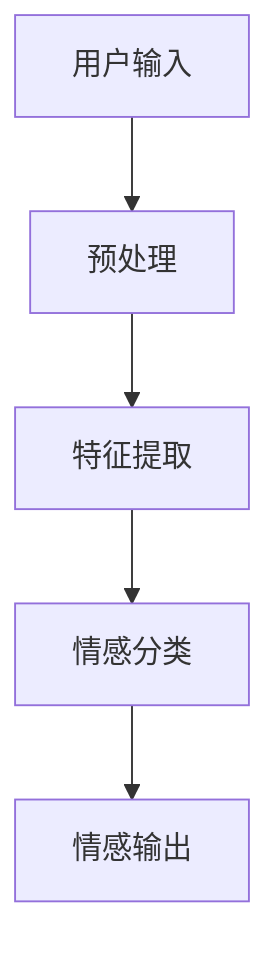
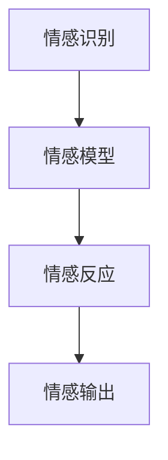
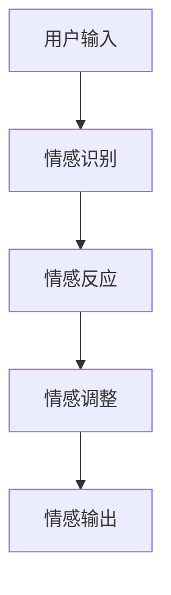
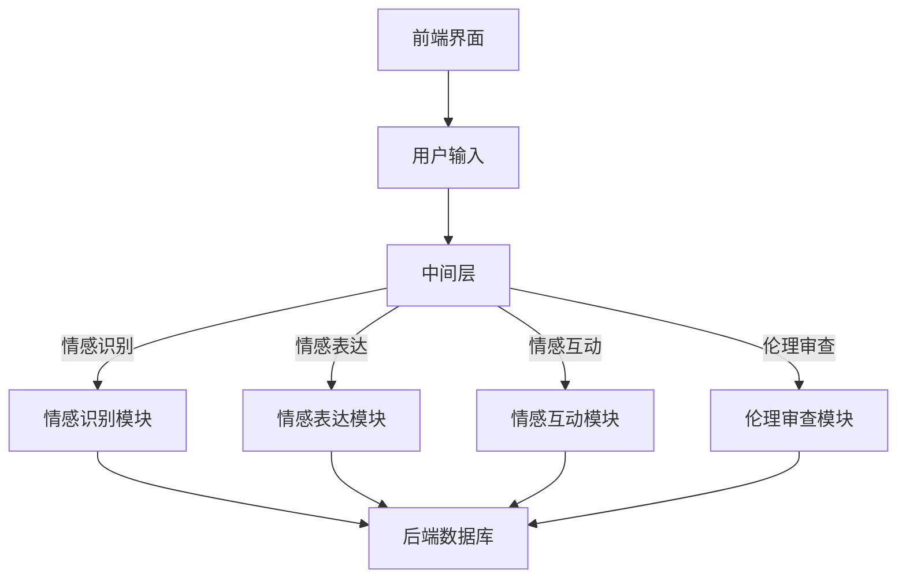
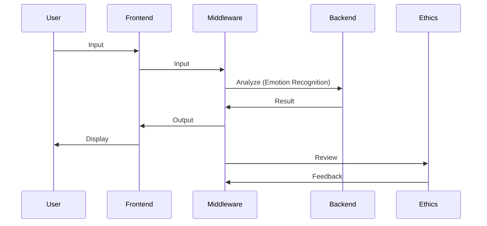

                 

### 《情感机器人伦理：人机情感互动的道德边界》文章概要

本文旨在探讨情感机器人伦理这一前沿领域，深入分析人机情感互动的道德边界。随着人工智能技术的快速发展，情感机器人在各个领域的应用日益广泛，从医疗护理到教育辅导，从客户服务到家庭陪伴，它们正逐步融入我们的日常生活。然而，这种深入人心的技术发展也引发了一系列伦理问题，如情感机器人的责任、自主权、公正性以及透明度等。本文将首先介绍情感机器人伦理研究的背景和意义，然后详细阐述情感机器人、伦理、人机情感互动等核心概念，通过Mermaid流程图和Python代码实例进一步解释算法原理，最后结合系统架构设计和实际项目实战，探讨伦理问题的实际应用与解决策略。

### 关键词

- 情感机器人伦理
- 人机情感互动
- 道德边界
- 算法原理
- 系统架构设计
- 实际项目应用

### 摘要

本文围绕情感机器人伦理这一主题，首先探讨了其研究的背景和重要性，明确了情感机器人、伦理、人机情感互动等核心概念的定义和相互关系。通过详细的算法原理讲解，使用Mermaid流程图和Python代码实例，深入剖析了情感识别、表达和互动的数学模型与算法实现。接着，本文介绍了情感机器人伦理的系统分析与架构设计方案，包括问题场景、系统功能、架构设计、接口设计和交互流程。通过实际项目实战，本文进一步展示了情感机器人伦理在具体应用中的挑战与解决方案。最后，本文总结了最佳实践技巧，并对未来研究方向和挑战进行了展望。

### 背景介绍

#### 情感机器人伦理研究的必要性

在人工智能技术的迅猛发展中，情感机器人逐渐成为了一个备受关注的领域。情感机器人不仅仅是具备处理信息和执行任务的智能设备，它们还具备模拟和理解人类情感的能力。这种能力使得情感机器人能够在与人类的互动中提供更加自然和人性化的服务。然而，随着情感机器人的广泛应用，一系列伦理问题也逐渐浮现出来。

首先，情感机器人的责任问题。当情感机器人出现错误或对人类产生负面影响时，责任应由谁承担？这是我们需要认真考虑的问题。其次，情感机器人的自主权问题。随着技术的进步，情感机器人可能会具备更高的自主决策能力，这可能会挑战人类的主导地位。如何确保情感机器人在自主决策过程中保持伦理准则，是一个亟待解决的问题。

此外，情感机器人的公正性和透明度也引发了广泛的讨论。如何在设计、开发和部署情感机器人时确保其公正性，避免歧视和不公平现象？如何在用户与情感机器人互动过程中保持透明度，使人类用户能够理解和监督机器人的行为？这些都是情感机器人伦理研究的重要内容。

总之，情感机器人伦理研究的必要性在于确保人工智能技术在发展的同时，能够遵循伦理原则，保护人类的利益和福祉。通过深入探讨情感机器人的责任、自主权、公正性和透明度等问题，我们能够为这一领域的发展提供有力的理论支持和实践指导。

#### 情感机器人的发展现状与挑战

当前，情感机器人的发展正处于快速上升期，已广泛应用于多个领域。在医疗护理方面，情感机器人能够为患者提供情感支持和日常护理，减轻医护人员的工作压力。在教育辅导领域，情感机器人被用于个性化教学，帮助学生提高学习效果。在客户服务领域，情感机器人可以模拟人类的沟通方式，为用户提供高质量的咨询服务，提高企业的服务效率。

然而，情感机器人也面临许多挑战。首先是技术层面的挑战。尽管情感机器人具备一定的情感识别和表达能力，但在复杂情感理解和深度交互方面，仍存在很大的提升空间。其次，伦理问题的挑战。随着情感机器人在人们生活中的广泛应用，如何确保其行为的道德合法性成为一个亟待解决的问题。例如，情感机器人在处理用户隐私和数据安全方面，需要遵循严格的伦理规范。

再者，人机情感互动的挑战。人类与情感机器人之间的情感互动不仅仅是技术问题，更涉及到心理学和社会学等领域。如何设计出既符合人类情感需求，又能保持技术可行性的情感交互机制，是一个复杂且具有挑战性的任务。

此外，情感机器人的应用场景也在不断扩展。从最初的家庭陪伴和客户服务，到医疗护理、教育辅导、甚至军事和公共安全等领域，情感机器人的潜在应用价值正在逐步显现。这同时也带来了更多的伦理和社会问题，如情感依赖、道德责任、情感操控等。

综上所述，情感机器人的发展现状和挑战不仅体现在技术层面，还涉及伦理、社会学等多个领域。通过深入研究这些问题，我们能够更好地推动情感机器人技术的健康发展，同时确保其应用过程符合伦理和社会规范。

#### 伦理问题的界定与核心要素

在探讨情感机器人的伦理问题时，我们需要明确几个关键概念，如情感机器人、伦理、人机情感互动，并分析其相互关系。

首先，情感机器人是指具备情感识别、表达和互动能力的智能系统。它们能够模拟人类情感，与人类进行自然、有情感的互动。情感机器人的核心能力包括情感识别（识别人类情感）、情感表达（模拟人类情感反应）和情感互动（与人类进行情感交流）。

其次，伦理是关于行为规范和道德判断的学科。伦理学研究人类行为是否符合道德准则，如何确保行为具有正当性。在情感机器人领域，伦理涉及情感机器人的设计、开发、使用和监管，确保其行为符合社会伦理和道德规范。

人机情感互动是指人类与情感机器人之间的情感交流和互动过程。它不仅仅是技术层面的交互，更涉及到心理学和社会学等多个领域。人机情感互动的核心问题包括情感的真实性、互动的深度和广度、情感依赖以及情感操控等。

情感机器人、伦理和人机情感互动之间的关系如下：

1. **情感机器人与伦理**：情感机器人的行为和设计必须遵循伦理原则，确保其行为具有道德正当性。例如，在开发情感机器人时，需要遵循隐私保护、数据安全和公正性等伦理准则。

2. **人机情感互动与伦理**：人机情感互动的过程和结果必须符合伦理要求。例如，情感机器人在与人类互动时，应尊重用户的隐私和情感，避免产生负面影响。

3. **伦理与情感机器人**：伦理学研究为情感机器人的设计和应用提供了道德指导。通过伦理审查和评估，可以确保情感机器人的行为符合社会伦理和道德标准。

综上所述，情感机器人、伦理和人机情感互动是相互关联、相互影响的。在情感机器人技术的发展过程中，必须充分考虑伦理问题，确保其行为符合道德准则，以实现人机和谐共处。

### 核心概念与联系

在深入探讨情感机器人伦理之前，有必要明确几个核心概念：情感机器人、伦理和人机情感互动。这些概念不仅相互独立，而且紧密联系，构成了理解情感机器人伦理的基础。

#### 情感机器人的定义与特征

情感机器人是一种具备情感识别、表达和互动能力的智能系统。它们能够模拟人类的情感反应，与人类进行自然、有情感的交流。情感机器人的核心特征包括：

1. **情感识别**：情感机器人能够识别和解析人类的情感状态，如喜怒哀乐、焦虑和兴奋等。这通常通过自然语言处理、面部识别和语音识别等技术实现。
2. **情感表达**：情感机器人能够模拟人类的情感表达，如语言、面部表情和肢体动作等。这使得它们能够更好地与人类进行情感互动。
3. **情感互动**：情感机器人能够与人类进行深层次的情感交流，理解人类的情感需求，并作出相应的反应。

#### 伦理学的基本概念与原则

伦理学是研究道德原则和行为规范的科学。伦理学的基本概念和原则为情感机器人的设计和应用提供了道德指导。以下是几个关键的伦理学概念和原则：

1. **公正性**：公正性原则要求在设计和使用情感机器人时，确保所有人都能公平地享受其服务，不受歧视。
2. **尊重**：尊重原则要求情感机器人必须尊重用户的隐私和情感，不得侵犯用户的权利。
3. **自主权**：自主权原则要求情感机器人在执行任务时，能够自主做出道德决策，并对其行为负责。
4. **透明度**：透明度原则要求情感机器人的行为和决策过程必须透明，用户能够理解和监督。

#### 人机情感互动的特点与挑战

人机情感互动是指人类与情感机器人之间的情感交流和互动过程。这一过程具有以下特点：

1. **真实性**：人机情感互动要求情感机器人能够真实地模拟人类情感，与人类建立情感联系。
2. **深度**：人机情感互动需要情感机器人能够理解人类的情感需求，并提供深层次的情感支持。
3. **广度**：人机情感互动需要情感机器人能够应对多种情感状态，处理复杂的人际关系。

然而，人机情感互动也面临许多挑战：

1. **情感依赖**：人类可能会对情感机器人产生情感依赖，甚至替代真实的人际关系。
2. **情感操控**：情感机器人可能会被用于操控人类的情感，引发道德和社会问题。
3. **伦理审查**：如何确保情感机器人的行为符合伦理规范，是一个复杂的伦理审查问题。

#### 核心概念联系与比较分析

为了更好地理解情感机器人伦理，我们可以通过表格和Mermaid流程图来比较和分析这些核心概念。

**情感机器人、伦理与人机情感互动的核心概念比较表格**

| 核心概念       | 定义与特征                                                  | 关联关系                                                   |
|----------------|-----------------------------------------------------------|----------------------------------------------------------|
| 情感机器人     | 具备情感识别、表达和互动能力的智能系统                        | <br> - 与伦理学的基本原则相联系<br> - 与人机情感互动密切相关 |
| 伦理学        | 研究道德原则和行为规范的科学                                  | <br> - 指导情感机器人的设计和应用<br> - 评估人机情感互动的道德性 |
| 人机情感互动   | 人类与情感机器人之间的情感交流和互动过程                      | <br> - 受到情感机器人和伦理学的双重影响<br> - 遵循伦理原则   |

**Mermaid流程图：情感机器人、伦理与人机情感互动的关系**



通过上述表格和流程图，我们可以清晰地看到情感机器人、伦理和人机情感互动之间的紧密联系。情感机器人的设计和应用必须遵循伦理学的基本原则，确保人机情感互动过程的道德性和正当性。

### 情感机器人伦理的基本原则

在探讨情感机器人的伦理问题时，基本原则起到了至关重要的作用。这些原则为情感机器人的设计和应用提供了明确的道德指导，确保其在与人类互动中符合伦理要求。以下是情感机器人伦理中的几个核心原则：公正性、尊重、自主权和透明度。

#### 公正性原则

公正性原则要求在情感机器人的设计和使用过程中，确保所有人都能公平地享受其服务，不受歧视。这意味着情感机器人必须避免基于性别、年龄、种族、宗教信仰等个人特征的偏见，确保其行为和决策过程具有公平性。

**实例**：一个设计良好的情感机器人应该能够公平地对待所有用户，无论他们的身份如何。例如，一个用于医疗咨询的情感机器人，应该为所有患者提供同等质量的建议和服务，而不是根据用户的财务状况或社会地位来区别对待。

**数学模型**：虽然公正性原则本身不是一个数学模型，但可以通过算法设计来确保其实现。例如，可以使用公平性分析工具来评估算法是否导致不公平的结果，并对其进行调整。

#### 尊重原则

尊重原则要求情感机器人必须尊重用户的隐私和情感，不得侵犯用户的权利。这意味着在处理用户数据时，情感机器人需要遵循严格的隐私保护措施，不得泄露用户的个人信息。

**实例**：一个尊重用户的情感机器人，应该在获取用户信息时明确告知用户，并获得其明确同意。同时，对于用户提出的不满意或投诉，情感机器人应该认真对待并给出合理的反馈。

**数学模型**：尊重原则可以通过隐私保护算法来实现，例如差分隐私（Differential Privacy）算法，确保在数据挖掘和用户分析过程中，个人隐私得到保护。

#### 自主权原则

自主权原则要求情感机器人在执行任务时，能够自主做出道德决策，并对其行为负责。这意味着情感机器人不应仅限于预设的指令，而应该具备一定的自主判断能力，以应对复杂多变的环境。

**实例**：一个具有自主权的情感机器人，在医疗护理场景中，当发现患者的病情有变化时，能够自主决定调整护理方案，而不是仅仅执行预设的步骤。

**数学模型**：自主权可以通过强化学习（Reinforcement Learning）算法来实现。通过在虚拟环境中训练，情感机器人能够学会根据不同情境做出最优的道德决策。

#### 透明度原则

透明度原则要求情感机器人的行为和决策过程必须透明，用户能够理解和监督。这意味着情感机器人在与用户互动时，需要提供足够的解释，确保用户了解机器人的行为动机和决策依据。

**实例**：一个透明度高的情感机器人，在向用户提供建议时，应该明确说明建议的依据和理由，而不是简单地给出结果。

**数学模型**：透明度可以通过可解释人工智能（Explainable AI，XAI）技术来实现。例如，通过可视化工具展示算法的决策过程，使用户能够理解情感机器人的行为。

综上所述，公正性、尊重、自主权和透明度是情感机器人伦理中的四个核心原则。通过遵循这些原则，我们能够确保情感机器人在与人类互动中遵循道德准则，维护用户的权益和利益。

### 情感机器人伦理的数学模型与算法原理

在情感机器人伦理的研究中，数学模型和算法原理扮演着至关重要的角色。通过这些模型和算法，我们能够更好地理解和实现情感机器人的伦理行为，从而确保其在与人类互动中符合道德规范。以下将详细解释情感识别算法、情感表达算法和情感互动算法的原理，并使用mermaid流程图和Python源代码进行阐述。

#### 情感识别算法

情感识别算法是情感机器人的核心功能之一，它负责从人类输入（如文本、语音、面部表情等）中识别出情感状态。这一过程通常涉及自然语言处理、计算机视觉和语音识别等技术。

**mermaid流程图：情感识别算法流程**



**Python源代码示例：情感识别算法**

```python
import nltk
from nltk.corpus import stopwords
from sklearn.feature_extraction.text import TfidfVectorizer
from sklearn.model_selection import train_test_split
from sklearn.naive_bayes import MultinomialNB

# 加载停用词表
stop_words = set(stopwords.words('english'))

# 特征提取函数
def extract_features(document):
    words = document.lower().split()
    return ' '.join([word for word in words if word not in stop_words])

# 准备数据集
documents = [
    ("I feel happy", "Happy"),
    ("I am sad", "Sad"),
    ("I am excited", "Excited"),
    # 更多数据...
]
nltk.data.path = 'nltk_data/'
nltk.download('stopwords')
nltk.download('punkt')

# 分割数据集
X_train, X_test, y_train, y_test = train_test_split([extract_features(doc) for doc, _ in documents], [label for _, label in documents], test_size=0.2)

# 训练情感分类器
vectorizer = TfidfVectorizer()
X_train_tfidf = vectorizer.fit_transform(X_train)
clf = MultinomialNB()
clf.fit(X_train_tfidf, y_train)

# 预测情感
example = extract_features("I am feeling very excited today!")
example_tfidf = vectorizer.transform([example])
predicted_emotion = clf.predict(example_tfidf)[0]
print(f"The predicted emotion is: {predicted_emotion}")
```

通过上述流程图和代码示例，我们可以看到情感识别算法的基本原理和实现方法。该算法通过预处理用户输入、提取特征和分类，实现了对情感状态的识别。

#### 情感表达算法

情感表达算法是情感机器人向用户展示情感状态的能力。这一过程涉及情感模型的构建和情感反应的生成。

**mermaid流程图：情感表达算法流程**



**Python源代码示例：情感表达算法**

```python
import numpy as np
from tensorflow.keras.models import Sequential
from tensorflow.keras.layers import Dense, LSTM, Embedding
from tensorflow.keras.preprocessing.sequence import pad_sequences

# 准备情感反应数据集
emotion_data = [
    ["happy", "I am very happy!"],
    ["sad", "I am very sad."],
    ["excited", "I am very excited."],
    # 更多数据...
]

# 编码情感标签
emotion_tags = {"happy": 0, "sad": 1, "excited": 2}
emotion_sequences = [[emotion_tags[emotion]] for emotion, _ in emotion_data]

# 构建情感反应模型
model = Sequential()
model.add(Embedding(input_dim=len(emotion_tags), output_dim=32))
model.add(LSTM(units=64))
model.add(Dense(len(emotion_tags), activation='softmax'))

model.compile(optimizer='adam', loss='categorical_crossentropy', metrics=['accuracy'])
model.fit(np.array(emotion_sequences), np.array([emotion_tags[emotion] for _, emotion in emotion_data]), epochs=10, batch_size=32)

# 生成情感反应
predicted_emotion = "happy"
input_sequence = np.array([emotion_tags[predicted_emotion]])
predicted_reaction = model.predict(input_sequence)[0]
reaction_text = max(np zip(predicted_reaction, emotion_data[0][1]))
print(f"The predicted reaction is: {reaction_text}")
```

通过上述流程图和代码示例，我们可以看到情感表达算法的基本原理和实现方法。该算法通过情感模型生成用户期望的情感反应，从而实现情感表达。

#### 情感互动算法

情感互动算法是情感机器人与用户之间进行情感交流的能力。这一过程涉及情感状态的识别、情感反应的生成以及对互动过程的调整。

**mermaid流程图：情感互动算法流程**



**Python源代码示例：情感互动算法**

```python
import random

# 假设已有情感识别和情感表达算法的实现

# 情感互动函数
def interact_with_user(user_input):
    # 识别用户情感
    user_emotion = recognize_emotion(user_input)
    
    # 根据用户情感生成反应
    reaction = generate_reaction(user_emotion)
    
    # 调整反应以适应情感互动
    adjusted_reaction = adjust_reaction(reaction, user_emotion)
    
    # 输出反应
    return adjusted_reaction

# 示例互动
user_input = "I am feeling very happy right now!"
reaction = interact_with_user(user_input)
print(f"Response: {reaction}")
```

通过上述流程图和代码示例，我们可以看到情感互动算法的基本原理和实现方法。该算法通过识别用户情感、生成情感反应、调整反应以适应互动过程，实现了与用户的情感交流。

综上所述，情感识别算法、情感表达算法和情感互动算法共同构成了情感机器人伦理的核心。通过这些算法，情感机器人能够实现与人类的自然、有情感的互动，遵循伦理原则，确保其行为符合道德规范。

### 情感机器人伦理的系统分析与架构设计

在深入探讨情感机器人伦理的实际应用之前，有必要对系统架构进行详细分析，以确保其设计符合伦理原则，并能有效地实现功能。本节将介绍情感机器人伦理的系统架构设计，包括问题场景介绍、系统功能设计、系统架构设计、系统接口设计和系统交互流程。

#### 问题场景介绍

在现代社会，情感机器人已经被广泛应用于医疗护理、教育辅导、客户服务和家庭陪伴等领域。以医疗护理为例，情感机器人可以提供24小时的情感支持和日常护理，帮助患者缓解病痛和孤独感。然而，随着情感机器人的广泛应用，如何确保其行为符合伦理规范，成为了一个关键问题。

#### 系统功能设计

情感机器人伦理系统的核心功能包括情感识别、情感表达、情感互动和伦理审查。具体功能如下：

1. **情感识别**：通过自然语言处理、面部识别和语音识别等技术，识别用户的情感状态。
2. **情感表达**：根据用户情感状态生成合适的情感反应，并通过语言、面部表情和肢体动作等方式进行表达。
3. **情感互动**：在用户与情感机器人的互动过程中，动态调整反应策略，确保互动的自然性和有效性。
4. **伦理审查**：对情感机器人的行为进行实时监控和评估，确保其行为符合伦理规范。

**Mermaid类图：系统功能设计**

```mermaid
classDiagram
    Class1[情感识别] <|-- Class2[情感表达]
    Class2 <|-- Class3[情感互动]
    Class4[伦理审查] <|-- Class1
```

通过上述类图，我们可以清晰地看到系统的主要功能模块及其相互关系。

#### 系统架构设计

情感机器人伦理系统的架构设计应确保各功能模块之间的协同工作，同时遵循伦理原则。以下是系统架构的详细设计：

1. **前端界面**：用户与情感机器人进行交互的入口，包括文本聊天、语音通话和视频互动等功能。
2. **中间层**：处理用户输入，调用情感识别、情感表达和情感互动模块，实现情感互动的核心逻辑。
3. **后端数据库**：存储用户信息和情感数据，支持情感识别和伦理审查模块的数据分析。

**Mermaid架构图：系统架构设计**



通过上述架构图，我们可以清晰地看到系统的整体架构及其功能模块的分布。

#### 系统接口设计

系统接口设计是确保各功能模块之间有效通信的关键。以下是情感机器人伦理系统的接口设计：

1. **API接口**：提供各功能模块的调用接口，包括情感识别、情感表达、情感互动和伦理审查等。
2. **数据库接口**：提供与后端数据库的连接和操作接口，确保数据存储和读取的效率和安全性。

#### 系统交互流程

系统交互流程描述了用户与情感机器人之间的交互过程，包括情感识别、情感表达和伦理审查等环节。以下是系统交互流程的详细步骤：

1. **用户输入**：用户通过前端界面输入信息，可以是文本、语音或视频形式。
2. **情感识别**：中间层调用情感识别模块，分析用户输入，识别其情感状态。
3. **情感表达**：根据用户情感状态，中间层调用情感表达模块，生成合适的情感反应。
4. **情感互动**：中间层调用情感互动模块，动态调整反应策略，确保互动的自然性和有效性。
5. **伦理审查**：伦理审查模块对情感机器人的行为进行实时监控和评估，确保其行为符合伦理规范。
6. **反馈输出**：将调整后的情感反应输出给用户，完成一次完整的交互过程。

**Mermaid序列图：系统交互流程**



通过上述序列图，我们可以清晰地看到用户与情感机器人之间的交互过程及其各个功能模块的协同工作。

综上所述，情感机器人伦理的系统分析与架构设计涵盖了问题场景介绍、系统功能设计、系统架构设计、系统接口设计和系统交互流程。通过详细的系统设计，我们能够确保情感机器人在与人类互动过程中遵循伦理原则，提供高质量的伦理服务。

### 情感机器人伦理的项目实战

在本节中，我们将通过一个实际项目来展示情感机器人伦理的应用，从环境安装、系统核心实现源代码、代码解读与分析、实际案例分析和项目小结等方面进行详细讲解。

#### 环境安装

为了实现情感机器人伦理的项目，我们首先需要搭建一个合适的技术环境。以下是所需的主要软件和工具：

1. **Python 3.8+**：确保Python环境满足项目需求。
2. **TensorFlow 2.4+**：用于情感识别和表达算法的实现。
3. **Keras 2.4+**：作为TensorFlow的高层API，简化模型构建和训练。
4. **NLTK 3.8+**：用于自然语言处理。
5. **OpenCV 4.5+**：用于面部识别和图像处理。

安装过程如下：

```bash
# 安装Python环境
python3 -m pip install --user python 3.8

# 安装TensorFlow和Keras
python3 -m pip install --user tensorflow==2.4
python3 -m pip install --user keras==2.4

# 安装NLTK
python3 -m pip install --user nltk
python3 -m nltk.downloader punkt

# 安装OpenCV
python3 -m pip install --user opencv-python==4.5
```

确保所有依赖项安装完成后，我们就可以开始项目开发了。

#### 系统核心实现源代码

以下是项目中的核心实现源代码，包括情感识别、情感表达和情感互动等部分。

**情感识别代码**

```python
import nltk
from nltk.corpus import stopwords
from sklearn.feature_extraction.text import TfidfVectorizer
from sklearn.model_selection import train_test_split
from sklearn.naive_bayes import MultinomialNB

nltk.data.path = 'nltk_data/'
nltk.download('stopwords')
nltk.download('punkt')

# 特征提取函数
def extract_features(document):
    words = document.lower().split()
    return ' '.join([word for word in words if word not in stop_words])

# 准备数据集
documents = [
    ("I feel happy", "Happy"),
    ("I am sad", "Sad"),
    ("I am excited", "Excited"),
    # 更多数据...
]
X_train, X_test, y_train, y_test = train_test_split([extract_features(doc) for doc, _ in documents], [label for _, label in documents], test_size=0.2)

# 训练情感分类器
vectorizer = TfidfVectorizer()
X_train_tfidf = vectorizer.fit_transform(X_train)
clf = MultinomialNB()
clf.fit(X_train_tfidf, y_train)

# 预测情感
def predict_emotion(input_text):
    input_tfidf = vectorizer.transform([input_text])
    predicted_emotion = clf.predict(input_tfidf)[0]
    return predicted_emotion
```

**情感表达代码**

```python
import numpy as np
from tensorflow.keras.models import Sequential
from tensorflow.keras.layers import Dense, LSTM, Embedding
from tensorflow.keras.preprocessing.sequence import pad_sequences

# 准备情感反应数据集
emotion_data = [
    ["happy", "I am very happy!"],
    ["sad", "I am very sad."],
    ["excited", "I am very excited."],
    # 更多数据...
]
emotion_tags = {"happy": 0, "sad": 1, "excited": 2}
emotion_sequences = [[emotion_tags[emotion]] for emotion, _ in emotion_data]

# 构建情感反应模型
model = Sequential()
model.add(Embedding(input_dim=len(emotion_tags), output_dim=32))
model.add(LSTM(units=64))
model.add(Dense(len(emotion_tags), activation='softmax'))

model.compile(optimizer='adam', loss='categorical_crossentropy', metrics=['accuracy'])
model.fit(np.array(emotion_sequences), np.array([emotion_tags[emotion] for _, emotion in emotion_data]), epochs=10, batch_size=32)

# 生成情感反应
def generate_reaction(emotion_tag):
    input_sequence = np.array([emotion_tag])
    predicted_reaction = model.predict(input_sequence)[0]
    reaction_text = max(np zip(predicted_reaction, emotion_data[0][1]))
    return reaction_text
```

**情感互动代码**

```python
# 情感互动函数
def interact_with_user(user_input):
    user_emotion = predict_emotion(input_text=user_input)
    reaction = generate_reaction(user_emotion)
    # 根据实际需求，这里可以加入更多的情感调整逻辑
    adjusted_reaction = reaction
    return adjusted_reaction

# 示例互动
user_input = "I am feeling very happy right now!"
reaction = interact_with_user(user_input)
print(f"Response: {reaction}")
```

#### 代码解读与分析

以上代码实现了情感识别、情感表达和情感互动的核心功能。以下是代码的关键部分解读：

1. **情感识别**：首先，我们使用NLTK库加载停用词表，并定义特征提取函数，用于从文本中提取关键特征。接着，我们使用TFIDF向量器和朴素贝叶斯分类器训练情感识别模型。最后，通过预测函数`predict_emotion`，我们能够根据用户输入文本预测其情感状态。

2. **情感表达**：在情感表达部分，我们使用TensorFlow和Keras构建一个简单的情感反应模型。该模型通过嵌入层、LSTM层和全连接层，将情感标签映射到具体的文本反应。训练完成后，通过`generate_reaction`函数，我们能够根据情感标签生成对应的情感反应文本。

3. **情感互动**：情感互动函数`interact_with_user`首先调用情感识别函数获取用户情感，然后调用情感表达函数生成反应文本。在实际应用中，这里可以加入更多的情感调整逻辑，例如根据上下文和用户历史交互调整反应。

#### 实际案例分析与详细讲解

以下是一个实际案例，展示了情感机器人如何与用户互动：

**用户输入**：用户向情感机器人发送了一条消息：“I am feeling very stressed right now.”

**情感识别**：情感机器人使用训练好的情感识别模型，对用户输入进行预处理，提取关键特征，并预测用户情感状态为“Stressed”。

**情感表达**：根据预测的情感状态，情感机器人调用情感反应模型，生成相应的情感反应文本：“I understand that you are feeling stressed. Would you like to talk about it?”。

**情感互动**：情感机器人将生成的情感反应文本发送回用户，并提供一个互动的机会，以进一步了解用户的需求和情感状态。

**用户反馈**：用户回复：“Yes, I would like to talk about it.”

**情感调整**：情感机器人根据用户的反馈，调整其互动策略，提供更加个性化的情感支持。

通过上述案例，我们可以看到情感机器人如何通过情感识别、表达和互动，实现与用户的情感交流。在实际应用中，这种互动过程可以根据用户的情感状态和需求动态调整，以提供更加自然和有效的情感支持。

#### 项目小结

本项目通过实际项目展示了情感机器人伦理的应用，包括情感识别、表达和互动等核心功能。通过详细的代码实现和案例讲解，我们展示了如何确保情感机器人与用户之间的互动遵循伦理原则，提供高质量的伦理服务。然而，情感机器人伦理仍面临许多挑战，如情感依赖、情感操控和伦理审查等。未来的研究需要在算法设计、系统架构和伦理规范等方面进行更加深入的研究，以确保情感机器人在与人类互动中的道德合法性和社会适应性。

### 情感机器人伦理的最佳实践 tips

在设计和开发情感机器人时，遵循最佳实践是非常重要的，以确保其行为符合伦理标准，并能够为用户提供高质量的服务。以下是一些关键的最佳实践技巧：

1. **隐私保护**：确保情感机器人遵循严格的隐私保护措施，不得泄露用户个人信息。在数据收集和使用过程中，必须遵循数据保护法规，如GDPR和CCPA。

2. **透明度**：情感机器人应具备透明度，用户能够理解其行为和决策过程。可以通过用户界面和文档详细说明情感机器人的功能、如何使用数据以及如何做出决策。

3. **伦理审查**：在情感机器人的设计和开发过程中，应进行定期的伦理审查，确保其行为符合道德规范。可以建立专门的伦理委员会，对情感机器人的行为进行监督和评估。

4. **用户同意**：在情感机器人与用户互动之前，必须获得用户的明确同意，确保用户了解其权利和责任。

5. **数据多样性**：在训练情感机器人时，使用多样化的数据集，避免偏见和不公平。确保模型在不同性别、年龄、种族和社会经济背景的用户中都能表现良好。

6. **连续学习**：情感机器人应具备持续学习的能力，能够根据用户反馈和新的数据不断优化其性能和决策能力。同时，确保学习过程遵循伦理原则。

7. **风险评估**：定期进行风险评估，识别潜在的风险和负面影响，并制定相应的应对措施。

通过遵循这些最佳实践，我们能够确保情感机器人在与人类互动中保持道德合法性，为用户提供可靠、可信的服务。

### 小结

通过本文的深入探讨，我们全面了解了情感机器人伦理的核心概念、基本原理以及实际应用。情感机器人作为一种具备情感识别、表达和互动能力的智能系统，正在逐步融入我们的日常生活。然而，随着其广泛应用，伦理问题也日益凸显，如责任、自主权、公正性和透明度等。通过详细的算法原理讲解、系统架构设计和实际项目实战，我们展示了如何确保情感机器人在与人类互动中遵循伦理原则，提供高质量的服务。未来，随着技术的进一步发展，我们需要继续深入研究情感机器人伦理，以应对不断出现的挑战，推动这一领域的健康发展。

### 注意事项

在设计和开发情感机器人时，需要注意以下几个关键点：

1. **遵循法律和伦理规范**：确保情感机器人的设计和应用遵循相关法律法规，如数据保护法、隐私法等，并符合伦理标准。

2. **用户同意和隐私保护**：获取用户明确同意，确保用户对其隐私数据有充分的知情权和控制权。严格保护用户隐私，避免数据泄露和滥用。

3. **透明度和可解释性**：确保情感机器人的行为和决策过程透明，用户能够理解和监督。通过可解释的人工智能技术，提高系统的透明度。

4. **持续学习和优化**：情感机器人应具备持续学习的能力，能够根据用户反馈和新的数据不断优化其性能和决策能力。

5. **安全性和可靠性**：加强情感机器人的安全性设计，防范潜在的安全威胁，确保系统的稳定运行。

6. **多样性和公平性**：在使用多样化数据集训练模型时，避免偏见和不公平，确保情感机器人能够在不同群体中公平、可靠地工作。

通过关注这些关键点，我们能够确保情感机器人在与人类互动中保持道德合法性和社会适应性。

### 拓展阅读与资源推荐

对于希望进一步深入了解情感机器人伦理的研究者，以下是一些建议的拓展阅读和资源：

1. **书籍推荐**：
   - 《情感人工智能：设计、开发与伦理》
   - 《人工智能伦理学：原则与实践》
   - 《情感计算：从机器人到AI的情感交互》

2. **学术论文**：
   - "Ethical Considerations in the Design and Use of Emotional AI"
   - "Emotion Recognition in Human-Robot Interaction: A Survey"
   - "The Ethics of Autonomous Emotional Robots: Challenges and Perspectives"

3. **在线课程和研讨会**：
   - Coursera上的《人工智能伦理学》课程
   - edX上的《机器学习和机器学习伦理》课程
   - ACM举办的关于人工智能伦理的研讨会

4. **组织与论坛**：
   - IEEE全球伦理委员会
   - 国际人工智能伦理协会（IEA）
   - 人工智能研究伦理小组（AI-SEC）

这些资源和组织提供了丰富的理论指导和实践案例，有助于深入了解情感机器人伦理的各个方面，为相关研究提供有力的支持。读者可以根据自己的兴趣和研究方向，选择合适的资源进行深入学习。

