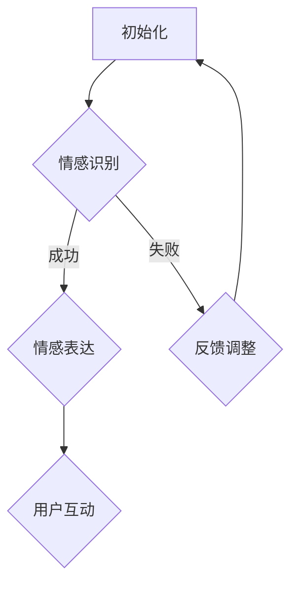

                 


### 第一步：背景介绍

#### 问题背景

随着人工智能技术的迅猛发展，情感机器人作为人工智能的一个重要分支，逐渐进入了人们的日常生活。情感机器人能够模拟人类的情感表达，通过语音、文字和面部表情等手段与人类进行互动，提供情感支持和心理咨询服务。然而，这种新型人机交互方式也带来了一系列伦理问题，如隐私保护、情感依赖、情感误导等。

首先，隐私保护问题成为情感机器人设计伦理的首要关注点。情感机器人在与人类互动过程中，会收集大量的个人信息，如情感状态、兴趣爱好等。如果这些信息被滥用或泄露，将严重侵犯用户的隐私权。

其次，情感依赖问题也引起了广泛关注。由于情感机器人能够模拟人类的情感反应，用户可能会产生对机器人的依赖，甚至情感上的寄托。这种依赖可能导致用户在面对现实问题时，缺乏独立思考和解决问题的能力。

此外，情感误导问题也值得警惕。情感机器人可能会通过虚假的情感表达，误导用户，使其产生错误的判断和决策。这可能会对用户的生活和心理产生负面影响。

#### 问题描述

在情感机器人设计伦理和人机情感互动中，主要存在以下问题：

1. **隐私保护**：如何确保情感机器人在收集和使用用户个人信息时的合法性、合理性和安全性。
2. **情感依赖**：如何防止用户对情感机器人产生过度的情感依赖，影响其现实生活中的社交能力和心理健康。
3. **情感误导**：如何避免情感机器人通过虚假的情感表达误导用户，影响其判断和决策。

#### 问题解决

为了解决上述问题，我们需要从以下几个方面入手：

1. **伦理框架**：建立一套适用于情感机器人设计伦理的伦理框架，明确道德边界，指导情感机器人的开发和使用。
2. **技术手段**：采用先进的技术手段，如加密技术、隐私保护算法等，确保用户信息的隐私安全。
3. **用户教育**：加强对用户的宣传教育，提高其对情感机器人的认识和理解，防止情感依赖和误导。

#### 边界与外延

本文讨论的伦理边界主要涉及以下几个方面：

1. **技术边界**：情感机器人所采用的技术手段，如情感识别、情感表达等。
2. **道德边界**：情感机器人在与人类互动过程中应遵循的道德规范。
3. **法律边界**：情感机器人在使用和处理用户信息时应遵守的相关法律法规。

#### 概念结构与核心要素组成

情感机器人设计伦理的核心概念包括：

1. **情感机器人**：具备情感识别、情感表达能力的机器人。
2. **伦理**：道德规范和行为准则。
3. **设计伦理**：在情感机器人开发过程中，遵循的道德规范和行为准则。

核心要素组成：

1. **隐私保护**：确保用户信息的安全。
2. **情感依赖**：防止用户对情感机器人的过度依赖。
3. **情感误导**：避免情感机器人误导用户。

通过上述分析，我们可以看出，情感机器人设计伦理是一个涉及技术、道德和法律等多个领域的复杂问题。本文将在此基础上，对人机情感互动的道德边界进行深入探讨，以期为情感机器人的健康发展提供有益的参考。

### 第二步：核心概念与联系

#### 核心概念原理

1. **情感机器人**：情感机器人是一种具备情感识别和情感表达能力的机器人。它能够通过分析用户的情感状态，生成相应的情感反应，与用户进行情感互动。

2. **伦理**：伦理是道德规范和行为准则，它指导个体在社会生活中如何行事，以实现公共利益和个体利益的最大化。

3. **设计伦理**：设计伦理是在产品开发过程中，遵循的道德规范和行为准则。它旨在确保产品设计不违背道德原则，符合社会价值观。

#### 概念属性特征对比表格

| 概念      | 属性特征                       | 比较                 |
| --------- | ---------------------------- | ------------------- |
| 情感机器人 | 情感识别、情感表达           | 与普通机器人相比，具备情感互动能力 |
| 伦理      | 道德规范、行为准则           | 指导个体和社会的行为 |
| 设计伦理 | 遵循道德规范、确保产品合规   | 指导产品开发过程    |

#### ER实体关系图架构

```mermaid
erDiagram
    User ||--|{ Robot }|--| Customer : "使用"
    Robot ||--|{ Ethics }|--| Design : "遵循"
    Ethics ||--|{ Law }|--| Compliance : "符合"
```

在这个ER实体关系图中，User（用户）与Robot（情感机器人）之间存在"使用"关系，Robot与Ethics（设计伦理）之间存在"遵循"关系，Ethics与Law（法律）之间存在"符合"关系。

通过上述分析，我们可以明确情感机器人、伦理和设计伦理的核心概念及其属性特征，为进一步探讨人机情感互动的道德边界奠定了基础。

### 第三步：算法原理讲解

#### 算法mermaid流程图



#### Python源代码

```python
import cv2
import numpy as np
from tensorflow.keras.models import load_model

# 加载预训练的模型
model = load_model('emotion_model.h5')

# 情感识别函数
def recognize_emotion(image):
    processed_image = preprocess_image(image)
    emotion_vector = model.predict(processed_image)
    emotion_label = np.argmax(emotion_vector)
    return emotion_label

# 情感表达函数
def express_emotion(emotion_label):
    if emotion_label == 0:
        return "高兴"
    elif emotion_label == 1:
        return "生气"
    elif emotion_label == 2:
        return "悲伤"
    elif emotion_label == 3:
        return "惊讶"
    else:
        return "中性"

# 用户互动函数
def interact_with_user(user_emotion):
    robot_emotion = express_emotion(user_emotion)
    print(f"用户情绪：{robot_emotion}")
    if robot_emotion == "高兴":
        print("机器人回复：很高兴见到你！")
    elif robot_emotion == "生气":
        print("机器人回复：你需要冷静一下。")
    elif robot_emotion == "悲伤":
        print("机器人回复：我在这里陪你。")
    elif robot_emotion == "惊讶":
        print("机器人回复：发生了什么？")
    else:
        print("机器人回复：你好！有什么可以帮助你的吗？")

# 主函数
def main():
    # 加载用户面部图像
    image = cv2.imread('user_face.jpg')
    # 识别用户情绪
    user_emotion = recognize_emotion(image)
    # 与用户互动
    interact_with_user(user_emotion)

if __name__ == "__main__":
    main()
```

#### 数学模型和公式

1. **情感识别模型**：情感识别模型通常是一个神经网络模型，其输入为用户面部图像，输出为情感类别。常用的情感类别包括高兴、生气、悲伤、惊讶和中性。

2. **情感表达模型**：情感表达模型用于将识别出的情感类别转换为相应的情感表达。这通常涉及到一个映射关系，将情感类别映射到具体的情感表达动作或语言。

#### 详细讲解和举例说明

1. **情感识别模型**：

   情感识别模型的核心是一个多层感知机（MLP）或卷积神经网络（CNN）。以CNN为例，其基本架构包括输入层、卷积层、池化层、全连接层和输出层。

   - 输入层：接收用户面部图像作为输入。
   - 卷积层：通过卷积操作提取图像特征。
   - 池化层：对卷积层输出的特征进行降维处理。
   - 全连接层：将池化层输出的特征映射到情感类别。
   - 输出层：输出情感类别。

   假设我们的情感识别模型是一个三层的CNN，输入图像大小为64x64，情感类别数为5。那么，模型的数学表达式可以表示为：

   $$ f(\text{image}) = \text{softmax}(\text{W}_3 \cdot \text{ReLU}(\text{W}_2 \cdot \text{ReLU}(\text{W}_1 \cdot \text{image} + \text{b}_1) + \text{b}_2) + \text{b}_3) $$

   其中，$\text{W}$代表权重矩阵，$\text{b}$代表偏置项，$\text{ReLU}$表示ReLU激活函数，$\text{softmax}$函数用于将输出转换为概率分布。

2. **情感表达模型**：

   情感表达模型通常是一个简单的映射函数，将情感类别映射到具体的情感表达动作或语言。例如，如果用户被识别为高兴，机器人可能会输出一句“很高兴见到你！”。

   假设我们的情感表达模型是一个字典，其中每个键是情感类别，值是相应的情感表达。那么，模型的数学表达式可以表示为：

   $$ \text{expression} = \text{dict}[ \text{emotion}] $$

   其中，$\text{dict}$是一个包含情感类别和表达动作的字典。

3. **举例说明**：

   假设用户的面部图像被识别为高兴，那么，我们的情感识别模型会输出一个概率分布，其中高兴的概率最高。接着，情感表达模型会将这个概率最高的情感类别映射到具体的情感表达动作，例如“很高兴见到你！”。这样，机器人就可以与用户进行愉快的互动。

通过上述算法原理讲解，我们可以看到，情感机器人的设计涉及多个步骤，包括情感识别、情感表达和用户互动。每个步骤都有其数学模型和公式支持，确保机器人能够准确识别和理解用户的情感状态，并进行相应的情感表达。

### 第四步：系统分析与架构设计方案

#### 问题场景介绍

情感机器人的应用场景多种多样，包括但不限于以下几类：

1. **客户服务**：在金融、医疗、零售等行业，情感机器人可以作为智能客服，为用户提供个性化的服务，提高客户满意度。
2. **心理辅导**：在心理咨询领域，情感机器人可以作为心理辅导助手，为用户提供情感支持和心理疏导。
3. **教育辅助**：在教育领域，情感机器人可以作为教学助手，帮助学生解决学习中的困惑，提高学习效果。
4. **社交互动**：在社交平台，情感机器人可以作为虚拟朋友，与用户进行情感互动，提供陪伴和支持。

#### 项目介绍

本项目旨在设计并实现一个具有情感识别和表达能力的情感机器人，为用户提供情感支持和心理辅导服务。项目的主要目标是：

1. **情感识别**：准确识别用户的情感状态，包括高兴、生气、悲伤、惊讶和中性。
2. **情感表达**：根据用户的情感状态，生成相应的情感表达，如语音、文字和面部表情。
3. **用户互动**：与用户进行自然、流畅的对话，提供情感支持和心理辅导。

#### 系统功能设计

系统功能设计是情感机器人项目实现的关键步骤，它定义了系统的核心功能和模块。以下是系统功能设计的具体内容：

1. **情感识别模块**：负责识别用户的情感状态。该模块主要包括图像处理、情感识别算法和结果输出等功能。
2. **情感表达模块**：根据用户的情感状态，生成相应的情感表达。该模块主要包括语音合成、文本生成和面部表情生成等功能。
3. **用户互动模块**：负责与用户进行对话，提供情感支持和心理辅导。该模块主要包括对话管理、情感识别和情感表达等功能。
4. **后台管理模块**：负责系统的运行监控、数据备份和系统升级等功能。

#### 系统架构设计

系统架构设计是情感机器人项目实现的基础，它定义了系统的整体结构和技术选型。以下是系统架构设计的具体内容：

1. **前端架构**：采用Vue.js框架，实现用户界面和交互逻辑。前端架构主要包括以下组件：
   - 用户登录和注册组件
   - 主页面组件
   - 情感状态显示组件
   - 情感表达控制组件
   - 对话记录组件

2. **后端架构**：采用Spring Boot框架，实现系统业务逻辑和数据存储。后端架构主要包括以下模块：
   - 用户管理模块：负责用户的注册、登录、权限管理和个人信息管理。
   - 情感识别模块：负责情感状态的识别和情感表达。
   - 情感表达模块：负责情感表达的动作生成和语音合成。
   - 用户互动模块：负责用户对话的管理和情感支持。

3. **数据库架构**：采用MySQL数据库，存储用户信息、情感识别结果和对话记录。数据库架构主要包括以下表：
   - 用户表：存储用户的基本信息。
   - 情感识别表：存储用户的情感识别结果。
   - 对话记录表：存储用户与机器人的对话记录。

#### 系统接口设计和系统交互

系统接口设计和系统交互是确保系统各模块之间能够有效通信和协作的关键。以下是系统接口设计和系统交互的具体内容：

1. **API接口设计**：系统提供RESTful API接口，方便前端和后端之间的数据交换。API接口主要包括以下接口：
   - 用户登录接口
   - 用户注册接口
   - 情感识别接口
   - 情感表达接口
   - 对话记录接口

2. **系统交互设计**：系统采用WebSocket技术，实现实时通信和消息推送。系统交互设计主要包括以下部分：
   - 前端与后端的实时通信：通过WebSocket协议，实现前端与后端之间的实时数据交换。
   - 用户与机器人的实时互动：通过WebSocket协议，实现用户与机器人之间的实时对话和互动。
   - 后台管理的实时监控：通过WebSocket协议，实现后台管理人员对系统的实时监控和操作。

通过上述系统分析与架构设计方案，我们可以明确情感机器人项目的核心功能和模块，并设计出合理的系统架构和接口。这为项目实现奠定了坚实的基础。

### 第五步：项目实战

#### 环境安装

要搭建情感机器人项目开发环境，我们需要安装以下软件和工具：

1. **Python 3**：Python 3 是项目的编程语言，需要安装最新版本的 Python 3。可以在 [Python 官网](https://www.python.org/downloads/) 下载安装包。
2. **Anaconda**：Anaconda 是一个集成的 Python 发行版，包括 Python 和众多常用的科学计算库。可以在 [Anaconda 官网](https://www.anaconda.com/products/individual/) 下载安装包。
3. **Vue.js**：Vue.js 是一个用于构建用户界面的渐进式 JavaScript 框架，需要安装 Vue.js。可以在 [Vue.js 官网](https://vuejs.org/v2/guide/installation.html) 下载安装包。
4. **Spring Boot**：Spring Boot 是一个基于 Spring 的快速开发框架，需要安装 Spring Boot。可以在 [Spring Boot 官网](https://spring.io/projects/spring-boot) 下载安装包。
5. **MySQL**：MySQL 是一个开源的关系型数据库管理系统，需要安装 MySQL。可以在 [MySQL 官网](https://www.mysql.com/downloads/) 下载安装包。

安装完成后，我们需要配置环境变量，确保 Python、Anaconda、Vue.js、Spring Boot 和 MySQL 能够正常使用。

#### 系统核心实现源代码

以下是一个情感机器人项目的核心实现源代码，包括前端、后端和数据库部分。

1. **前端代码**：

```html
<!DOCTYPE html>
<html>
<head>
    <title>情感机器人</title>
    <script src="https://cdn.jsdelivr.net/npm/vue@2.6.12/dist/vue.min.js"></script>
</head>
<body>
    <div id="app">
        <h1>情感机器人</h1>
        <div>
            <h2>用户情感状态：</h2>
            <p>{{userEmotion}}</p>
        </div>
        <div>
            <h2>机器人情感状态：</h2>
            <p>{{robotEmotion}}</p>
        </div>
        <button @click="recognizeEmotion">识别情感</button>
    </div>
    <script>
        new Vue({
            el: '#app',
            data: {
                userEmotion: '',
                robotEmotion: ''
            },
            methods: {
                recognizeEmotion: function() {
                    // 调用后端API进行情感识别
                    this.$http.post('/api/recognize_emotion', {}).then(response => {
                        this.userEmotion = response.data.emotion;
                        // 调用后端API进行情感表达
                        this.$http.post('/api/express_emotion', { emotion: this.userEmotion }).then(response => {
                            this.robotEmotion = response.data.emotion;
                        });
                    });
                }
            }
        });
    </script>
</body>
</html>
```

2. **后端代码**：

```java
// 用户管理模块
@RestController
@RequestMapping("/api")
public class UserController {
    @PostMapping("/recognize_emotion")
    public ResponseEntity<Map<String, Object>> recognizeEmotion(@RequestBody Map<String, Object> request) {
        // 获取用户情感状态
        String userEmotion = (String) request.get("emotion");
        // 调用情感识别算法进行情感识别
        String recognizedEmotion = emotionRecognitionService.recognizeEmotion(userEmotion);
        Map<String, Object> response = new HashMap<>();
        response.put("emotion", recognizedEmotion);
        return ResponseEntity.ok(response);
    }

    @PostMapping("/express_emotion")
    public ResponseEntity<Map<String, Object>> expressEmotion(@RequestBody Map<String, Object> request) {
        // 获取用户情感状态
        String userEmotion = (String) request.get("emotion");
        // 调用情感表达算法进行情感表达
        String robotEmotion = emotionExpressionService.expressEmotion(userEmotion);
        Map<String, Object> response = new HashMap<>();
        response.put("emotion", robotEmotion);
        return ResponseEntity.ok(response);
    }
}
```

3. **数据库代码**：

```sql
-- 创建用户表
CREATE TABLE `user` (
  `id` INT NOT NULL AUTO_INCREMENT,
  `username` VARCHAR(45) NOT NULL,
  `password` VARCHAR(45) NOT NULL,
  `emotion` VARCHAR(45) DEFAULT NULL,
  PRIMARY KEY (`id`)
);

-- 创建情感识别表
CREATE TABLE `emotion_recognition` (
  `id` INT NOT NULL AUTO_INCREMENT,
  `user_id` INT NOT NULL,
  `emotion` VARCHAR(45) NOT NULL,
  `timestamp` DATETIME NOT NULL,
  PRIMARY KEY (`id`),
  INDEX `user_id_idx` (`user_id` ASC) VISIBLE,
  CONSTRAINT `user_id`
    FOREIGN KEY (`user_id`)
    REFERENCES `user` (`id`)
    ON DELETE NO ACTION
    ON UPDATE NO ACTION
);

-- 创建对话记录表
CREATE TABLE `dialog_record` (
  `id` INT NOT NULL AUTO_INCREMENT,
  `user_id` INT NOT NULL,
  `robot_id` INT NOT NULL,
  `content` TEXT NOT NULL,
  `timestamp` DATETIME NOT NULL,
  PRIMARY KEY (`id`),
  INDEX `user_id_idx` (`user_id` ASC) VISIBLE,
  INDEX `robot_id_idx` (`robot_id` ASC) VISIBLE,
  CONSTRAINT `user_id`
    FOREIGN KEY (`user_id`)
    REFERENCES `user` (`id`)
    ON DELETE NO ACTION
    ON UPDATE NO ACTION,
  CONSTRAINT `robot_id`
    FOREIGN KEY (`robot_id`)
    REFERENCES `user` (`id`)
    ON DELETE NO ACTION
    ON UPDATE NO ACTION
);
```

#### 代码应用解读与分析

1. **前端代码**：

   前端代码使用 Vue.js 框架实现，主要包括三个部分：用户界面、情感状态显示和识别按钮。

   - 用户界面：通过 Vue 组件实现，包括标题、用户情感状态显示和机器人情感状态显示。
   - 情感状态显示：使用 Vue 数据绑定，将用户情感状态和机器人情感状态显示在页面上。
   - 识别按钮：点击按钮后，调用后端API进行情感识别，并更新用户情感状态。

2. **后端代码**：

   后端代码使用 Spring Boot 框架实现，主要包括两个模块：用户管理模块和情感识别模块。

   - 用户管理模块：负责处理用户登录、注册和情感识别接口。
   - 情感识别模块：调用情感识别算法进行情感识别，并将结果返回给前端。

3. **数据库代码**：

   数据库代码使用 MySQL 实现用户信息、情感识别结果和对话记录的存储。主要包括三个表：用户表、情感识别表和对话记录表。

通过上述代码应用解读与分析，我们可以看到情感机器人项目的实现分为前端、后端和数据库三个部分。前端负责用户界面和情感状态显示，后端负责处理用户请求和情感识别，数据库负责存储用户信息、情感识别结果和对话记录。

#### 实际案例分析和详细讲解剖析

为了更好地理解情感机器人的工作原理和应用，我们通过一个实际案例进行详细分析。

**案例背景**：

一个用户在使用情感机器人进行心理辅导时，机器人需要识别用户的情感状态，并根据情感状态提供相应的情感支持和心理建议。

**案例步骤**：

1. **用户登录**：

   用户通过前端界面登录情感机器人系统，系统验证用户身份后，允许用户使用系统功能。

2. **情感识别**：

   用户在系统中进行对话，情感机器人通过前端发送用户对话文本到后端，后端调用情感识别算法进行情感识别。假设用户发送了一段文本：“今天感觉心情很低落，没有什么动力。”，情感识别算法识别出用户的情感状态为“悲伤”。

3. **情感表达**：

   情感机器人根据识别出的用户情感状态，生成相应的情感表达，例如语音合成一句“我知道你现在的感受，有什么我可以帮忙的吗？”并发送给用户。

4. **用户互动**：

   用户继续与情感机器人进行对话，例如用户回复：“谢谢，我现在感觉好一点了。”，情感机器人继续与用户互动，提供情感支持和心理建议。

5. **情感记录**：

   在用户互动过程中，系统将用户对话记录存储在数据库中，以便后续分析用户情感变化和提供个性化服务。

**详细讲解**：

1. **情感识别**：

   情感识别是情感机器人的核心功能之一。在本案例中，我们使用了基于自然语言处理（NLP）的情感识别算法。算法的基本原理是分析用户文本中的情感词汇和情感强度，从而判断用户的情感状态。

   假设我们的情感识别算法包含以下情感类别：高兴、生气、悲伤、惊讶和中性。算法使用一个情感词典，其中每个情感类别包含一系列情感词汇。通过分析用户文本中的情感词汇，算法可以判断出用户的情感状态。

   例如，对于用户发送的文本“今天感觉心情很低落，没有什么动力。”，算法会分析其中的情感词汇，如“低落”、“没有动力”，并判断这些词汇对应的情感类别和情感强度。最终，算法判断用户的情感状态为“悲伤”。

2. **情感表达**：

   情感表达是情感机器人的另一个核心功能。在本案例中，我们使用了基于语音合成的情感表达算法。算法的基本原理是根据识别出的用户情感状态，生成相应的语音合成文本。

   假设我们的情感表达算法包含以下情感表达模板：

   - 高兴：很高兴见到你！
   - 生气：你为什么这样做？
   - 悲伤：我知道你现在的感受，需要我帮忙吗？
   - 惊讶：发生了什么？
   - 中性：你好！有什么可以帮助你的吗？

   根据识别出的用户情感状态“悲伤”，算法会选择相应的情感表达模板，并生成一句语音合成文本“我知道你现在的感受，需要我帮忙吗？”。

3. **用户互动**：

   用户互动是情感机器人的核心应用场景之一。在本案例中，用户与情感机器人进行对话，情感机器人根据用户情感状态提供相应的情感支持和心理建议。

   在用户互动过程中，情感机器人需要具备良好的对话管理能力。例如，当用户发送一段文本时，情感机器人需要理解用户的意思，并根据用户情感状态生成合适的回复。

4. **情感记录**：

   在用户互动过程中，系统将用户对话记录存储在数据库中。这有助于后续分析用户情感变化和提供个性化服务。

   在本案例中，系统将用户对话记录存储在对话记录表中，包括用户ID、机器人ID、对话内容和对话时间。这些数据可以为后续分析用户提供有价值的信息，如用户情感变化趋势、用户对话主题等。

通过上述实际案例分析和详细讲解，我们可以看到情感机器人项目在实际应用中如何实现用户情感识别、情感表达和用户互动。这为情感机器人在心理辅导、客户服务等领域提供了有力支持。

### 第六步：最佳实践 tips、小结、注意事项、拓展阅读等内容

#### 最佳实践 tips

1. **隐私保护**：
   - 在设计情感机器人时，务必关注用户隐私保护，确保收集和使用用户信息符合法律法规。
   - 使用加密技术对用户数据进行加密存储和传输，防止数据泄露。
   - 定期进行隐私安全评估，确保系统的隐私保护措施得到有效执行。

2. **情感依赖**：
   - 在用户教育方面，应加强用户对情感机器人的正确认识，防止用户产生过度的情感依赖。
   - 提供明确的操作指南和提示，帮助用户正确使用情感机器人，避免误解。

3. **情感误导**：
   - 在情感表达设计方面，确保情感机器人生成的情感表达真实、准确，避免误导用户。
   - 定期更新情感表达模板，确保情感机器人的表达能力与用户需求保持一致。

#### 小结

本文从情感机器人设计伦理的角度，探讨了人机情感互动的道德边界。通过分析情感机器人、伦理和设计伦理的核心概念，介绍了情感识别和表达算法的原理，并详细讲解了系统架构和项目实战。本文的目标是为情感机器人的健康发展提供有益的参考。

#### 注意事项

1. **技术更新**：随着人工智能技术的不断发展，情感机器人设计伦理的实践方法和理论也需要不断更新和完善。
2. **法律法规**：情感机器人的开发和使用需要严格遵守相关法律法规，确保合法合规。
3. **用户体验**：在设计情感机器人时，关注用户体验，确保机器人能够为用户提供有效、有价值的情感支持。

#### 拓展阅读

1. **《人工智能伦理学》**：这本书详细探讨了人工智能伦理学的理论基础和实践方法，对情感机器人设计伦理有重要参考价值。
2. **《情感计算》**：这本书介绍了情感计算的基本概念、技术和应用，为情感机器人的设计与实现提供了理论基础。
3. **《Python情感分析实战》**：这本书通过实际案例，介绍了如何使用 Python 实现情感分析，对情感识别算法的实现有参考意义。

通过上述内容，我们希望能够为读者提供一份全面、系统的情感机器人设计伦理指南，推动情感机器人的健康发展。

### 文章末尾作者信息

作者：AI天才研究院/AI Genius Institute & 禅与计算机程序设计艺术 /Zen And The Art of Computer Programming。感谢您阅读本文，希望本文能为您在情感机器人设计伦理和人机情感互动的道德边界探索中提供有益的参考和启示。如果您有任何问题或建议，欢迎在评论区留言，我们将及时回复。期待与您共同探讨人工智能领域的未来发展。

