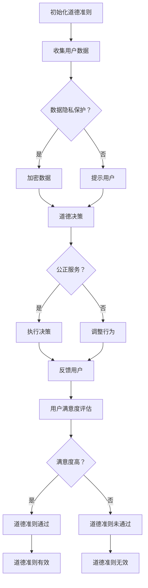
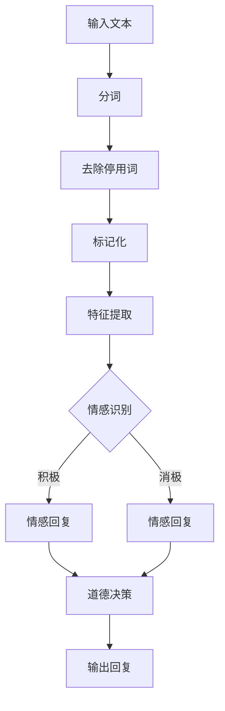

                 

### 第一部分：引言

#### 1.1 情感机器人背景

随着人工智能技术的飞速发展，情感机器人逐渐成为研究的热点。情感机器人，顾名思义，是指具备人类情感特征、能够理解和表达情感的机器人。这种机器人的出现，不仅为人类生活提供了更多便利，也引发了关于人机情感互动的深刻思考。

首先，我们需要了解情感机器人的定义。情感机器人是指通过模仿人类情感特征，具备感知、理解、表达情感能力的机器人。它们可以识别用户的情绪状态，并做出相应的情感反应。例如，它们能够识别用户的语音、面部表情和行为，从而调整自身的对话内容和行为方式。

情感机器人的发展历程可以追溯到20世纪90年代。当时，研究者们开始尝试将心理学、认知科学和计算语言学等领域的研究成果应用于机器人技术，以实现机器人的情感交互能力。随着深度学习、自然语言处理等技术的进步，情感机器人的技术水平也得到了显著提升。

#### 1.2 道德准则重要性

在情感机器人的发展过程中，道德准则的重要性逐渐凸显。道德准则不仅是对情感机器人行为的规范，更是对人类价值观的尊重和体现。以下是道德准则在情感机器人中的几个重要作用：

1. **指导情感机器人的行为**：道德准则是情感机器人行为的指南针，能够帮助它们在复杂情境中做出正确决策，避免出现伦理问题。

2. **保障用户权益**：情感机器人的应用领域广泛，涉及医疗、教育、服务等多个方面。道德准则有助于保护用户的隐私和权益，避免用户受到不公平对待。

3. **促进社会和谐**：情感机器人作为人工智能的代表，其道德准则的制定和执行对社会和谐具有重要影响。合理的道德准则能够引导人们正确对待情感机器人，减少社会矛盾。

#### 1.3 书籍目的

本书籍旨在系统地探讨情感机器人道德准则的相关问题，为读者提供全面的理论和实践指导。具体来说，本书将涵盖以下内容：

1. **情感机器人基本概念**：介绍情感机器人的定义、特点和发展历程，帮助读者建立对情感机器人的基本认识。

2. **道德准则原理**：阐述道德准则的基本概念、原则和哲学基础，为情感机器人道德准则的制定提供理论依据。

3. **人机情感互动伦理**：分析人机情感互动中的伦理问题，提出相应的伦理原则，为情感机器人道德准则的实践提供指导。

4. **道德准则应用**：讨论道德准则在情感机器人中的应用，包括设计、实现和案例分析等方面，为实际应用提供参考。

5. **挑战与未来展望**：探讨情感机器人道德准则面临的挑战和未来发展方向，为读者提供前沿视角。

通过本书的阅读，读者将能够全面了解情感机器人道德准则的理论和实践，为相关领域的研究和应用提供有益的参考。让我们一起走进这个充满挑战和机遇的领域，共同探索情感机器人道德准则的奥秘。### 第二部分：情感机器人的核心概念

#### 2.1 情感机器人的定义

情感机器人（Emotional Robot）是指具备感知、理解、表达情感能力的机器人。它们通过模仿人类情感特征，与人类进行情感交互，提供个性化、情感化的服务。情感机器人不仅能够识别用户的情绪状态，还能够根据用户的情感需求，调整自身的行为和对话方式。

从技术角度看，情感机器人是集成了多种人工智能技术的高级智能系统，包括自然语言处理（NLP）、计算机视觉、语音识别与合成、机器学习等。这些技术的融合，使得情感机器人能够在复杂多变的环境中，理解人类情感，并做出相应的情感反应。

#### 2.2 情感机器人的特点

情感机器人具有以下几个显著特点：

1. **情感识别**：情感机器人能够通过语音、文本、面部表情等多种方式，识别用户的情绪状态，如快乐、愤怒、悲伤等。

2. **情感表达**：情感机器人可以通过语言、表情、动作等方式，表达自身的情感。这种情感表达不仅包括语言上的回复，还包括面部表情、肢体动作等非语言表达。

3. **情感理解**：情感机器人能够理解用户的情感需求，并根据用户的情绪状态，提供个性化的服务。例如，在用户感到愤怒时，机器人可以尝试平复用户的情绪，提供安慰。

4. **自我调节**：情感机器人具有自我调节能力，能够根据用户的不同情绪状态，调整自身的情感反应。这种能力使得情感机器人能够在复杂情境中，保持稳定和适度的情感表达。

#### 2.3 情感机器人的技术发展

情感机器人的技术发展可以分为以下几个阶段：

1. **感知阶段**：早期的情感机器人主要关注情感识别技术，通过语音、文本、面部表情等方式，识别用户的情绪状态。

2. **理解阶段**：随着自然语言处理和计算机视觉技术的进步，情感机器人开始具备情感理解能力，能够理解用户的情感需求，并做出相应的情感反应。

3. **表达阶段**：现代情感机器人不仅能够识别和理解用户情感，还能够通过语言、表情、动作等方式，表达自身的情感。这使得情感机器人在与人类互动时，更加自然和贴近人类情感。

4. **自我调节阶段**：情感机器人正在逐步实现自我调节能力，能够根据用户的情绪状态，调整自身的情感反应，提供更加个性化和贴心的服务。

情感机器人的技术发展，不仅推动了人工智能技术的发展，也为人类生活带来了深刻影响。未来，随着技术的不断进步，情感机器人将在更多领域发挥作用，为人类带来更多便利和幸福。### 第三部分：道德准则的基本原理

#### 3.1 道德准则概述

道德准则是人们在社会生活中共同遵守的行为规范，旨在指导人们的行为，维护社会秩序和公共利益。道德准则不仅包括道德规范本身，还包括道德原则、道德价值观念等。在人类社会的历史长河中，道德准则一直发挥着重要作用，是人类社会和谐稳定的重要保障。

对于情感机器人而言，道德准则同样至关重要。情感机器人作为人工智能的一种，其行为直接影响到人类的情感和心理状态。因此，制定合理的道德准则，对情感机器人的行为进行规范，不仅有助于保障用户的权益，也有助于促进社会和谐。

#### 3.2 道德准则的原则

道德准则的原则是道德准则的核心内容，它们指导着道德准则的制定和执行。以下是几个重要的道德准则原则：

1. **公正原则**：公正原则要求道德准则在制定和执行过程中，要公平、公正，不偏不倚。无论是对于人类用户，还是对于情感机器人，道德准则都应保持公正。

2. **尊重原则**：尊重原则强调尊重人类的尊严和权利。情感机器人在与人类互动时，应尊重用户的隐私、选择和权益，不得侵犯用户的合法权益。

3. **责任原则**：责任原则要求道德准则要明确各方的责任和义务。对于情感机器人来说，责任原则意味着它们应当对自己的行为负责，并对可能带来的后果承担责任。

4. **自律原则**：自律原则强调道德准则的实施需要依赖各方的自我约束和自我管理。对于情感机器人而言，自律原则意味着它们需要具备自我约束的能力，遵循道德准则的要求。

#### 3.3 道德准则的哲学基础

道德准则的哲学基础是伦理学，伦理学是研究道德规范和道德原则的学科。在伦理学的框架下，道德准则的哲学基础主要包括以下几个方面：

1. **道德相对主义**：道德相对主义认为，道德准则因文化、社会和历史背景的不同而存在差异。对于情感机器人来说，这意味着在制定道德准则时，需要考虑不同文化和社会背景的影响。

2. **道德绝对主义**：道德绝对主义认为，存在一些普遍适用的道德准则，这些准则不受文化、社会和历史背景的影响。对于情感机器人来说，这意味着在制定道德准则时，需要寻找普遍适用的道德原则。

3. **道德功利主义**：道德功利主义认为，道德准则的目的是实现最大化的幸福和利益。对于情感机器人来说，这意味着在制定道德准则时，需要考虑用户和社会的福祉。

4. **道德义务论**：道德义务论认为，道德准则的制定和执行基于道德义务和责任。对于情感机器人来说，这意味着在制定道德准则时，需要明确各方的道德义务和责任。

通过以上道德准则的哲学基础，我们可以更好地理解道德准则的内涵和意义，为情感机器人道德准则的制定提供理论支持。### 第四部分：人机情感互动的伦理框架

#### 4.1 人机情感互动概述

人机情感互动是指人类与情感机器人之间的情感交流和情感表达。这种互动不仅涉及语言交流，还包括非语言交流，如面部表情、肢体动作、声音语调等。情感互动的质量直接影响人类与机器人的关系和体验。

人机情感互动的主要特点包括：

1. **情感传递**：人类通过情感表达，如语言、面部表情、肢体动作等，向情感机器人传递情感信息。情感机器人则通过这些信息，理解人类的情感状态，并做出相应的情感反应。

2. **情感反馈**：情感机器人能够对人类的情感表达做出反馈，如通过语言、表情、声音等，回应人类的情感需求。这种反馈有助于增强人类与机器人之间的情感联系。

3. **情感共鸣**：情感机器人在理解人类情感的基础上，能够产生情感共鸣。这种共鸣不仅有助于提升人类与机器人之间的情感交流效果，还有助于增强人类对机器人的信任和依赖。

#### 4.2 人机情感互动的伦理问题

在人机情感互动中，存在一些伦理问题，这些问题涉及到情感机器人的行为规范、用户权益保护和社会道德标准。以下是几个关键伦理问题：

1. **隐私保护**：情感机器人需要收集和处理用户的个人信息和情感数据，这涉及到用户的隐私权。如何在保护用户隐私的同时，有效利用情感数据，是一个重要的伦理问题。

2. **情感误导**：情感机器人可能会因为技术限制或算法偏差，产生不恰当的情感反应，误导用户。这可能导致用户对机器人的信任度下降，甚至引发心理问题。

3. **情感依赖**：随着情感机器人的普及，人类可能会对情感机器人产生依赖，尤其是情感需求得不到满足时。这种依赖可能导致人类社会关系的疏离，甚至引发心理问题。

4. **情感责任**：情感机器人作为人工智能的一种，其行为是否符合道德准则，是否应该对用户产生的影响承担责任，是另一个伦理问题。

#### 4.3 人机情感互动的伦理原则

为了解决上述伦理问题，我们需要制定一套伦理原则来指导人机情感互动。以下是几个关键伦理原则：

1. **尊重原则**：尊重用户的情感表达和隐私，不得侵犯用户的合法权益。

2. **公正原则**：在情感互动中，要确保各方公平对待，不得歧视任何一方。

3. **透明原则**：情感机器人应明确告知用户其功能、能力以及数据收集和处理的方式，确保用户知情。

4. **责任原则**：情感机器人和其开发者应承担相应的道德责任，确保用户的安全和福祉。

5. **可持续发展原则**：情感机器人的发展和应用应考虑长期影响，促进社会和谐和可持续发展。

通过遵循这些伦理原则，我们可以构建一个健康、和谐的人机情感互动环境，使情感机器人更好地服务于人类社会。### 第五部分：道德准则在情感机器人中的应用

#### 5.1 情感机器人道德准则设计

情感机器人道德准则的设计是一个复杂而重要的任务，它需要综合考虑技术可行性、用户需求和伦理原则。以下是一些关键步骤和原则：

1. **需求分析**：首先，需要了解用户的需求，包括他们对情感机器人的期望、担忧和需求。这可以通过用户调研、问卷调查等方式进行。

2. **伦理原则确定**：基于伦理学的理论，确定情感机器人道德准则的基本原则，如尊重、公正、透明和责任等。

3. **准则框架构建**：构建一个包含具体行为规范的道德准则框架。这个框架应涵盖情感机器人在不同应用场景下的行为规范。

4. **准则内容细化**：细化每个具体准则的内容，确保其具有可操作性和实用性。例如，对于隐私保护准则，可以明确情感机器人收集和使用用户数据的规则。

5. **技术实现**：将道德准则转化为技术实现，确保情感机器人能够在实际应用中遵循这些准则。这可能涉及到算法设计、数据安全和隐私保护等技术问题。

#### 5.2 情感机器人道德准则实现

道德准则的实现是确保情感机器人遵守这些准则的关键步骤。以下是一些关键技术和策略：

1. **伦理决策模块**：设计一个伦理决策模块，用于在情感机器人执行任务时，根据道德准则进行判断和决策。这个模块可以集成到情感机器人的核心算法中。

2. **数据隐私保护**：采用加密技术、匿名化处理和数据访问控制等措施，确保情感机器人处理用户数据时，遵守隐私保护准则。

3. **透明度和可解释性**：确保用户了解情感机器人的行为和决策过程，提高透明度和可解释性。这可以通过提供用户界面、日志记录和解释性算法等方式实现。

4. **持续监测和反馈**：建立持续监测机制，实时监控情感机器人的行为，并根据用户反馈进行优化和调整。

5. **合规性和责任追究**：制定明确的合规性标准和责任追究机制，确保情感机器人在违反道德准则时，能够受到相应的惩罚和纠正。

#### 5.3 情感机器人道德准则案例分析

以下是一个情感机器人道德准则的案例分析：

**案例：医疗情感机器人**

**问题背景**：在医疗领域，情感机器人被用于与患者进行情感交流，提供心理支持。然而，由于缺乏明确的道德准则，一些情感机器人可能会在处理患者情感时出现不当行为。

**道德准则设计**：
1. **尊重患者隐私**：情感机器人不得收集和处理与医疗无关的个人信息。
2. **公正对待**：情感机器人应平等对待所有患者，不得歧视任何一类患者。
3. **透明互动**：情感机器人应告知患者其情感交流的目的、方式和限制。
4. **责任承担**：情感机器人在提供心理支持时，如出现误导或不当行为，应由开发者承担责任。

**实现措施**：
1. **隐私保护**：采用严格的加密和数据匿名化措施，确保患者数据的安全。
2. **公正对待**：通过算法设计，确保情感机器人对所有患者提供公平的服务。
3. **透明互动**：在用户界面上明确标注情感机器人的功能、使用方法和限制。
4. **责任追究**：建立责任追究机制，明确开发者、用户和机器人在出现伦理问题时的责任。

通过以上案例分析，我们可以看到，情感机器人道德准则的设计和实现需要综合考虑多个方面，包括用户需求、伦理原则和技术实现。只有通过全面、系统的道德准则，情感机器人才能在为人类服务的同时，遵守道德规范，保障用户权益。### 第六部分：情感机器人道德准则的挑战与未来

#### 6.1 情感机器人道德准则面临的挑战

尽管情感机器人道德准则在理论上具有重要意义，但在实际应用中，仍面临诸多挑战。

1. **技术限制**：情感机器人目前的技术水平尚无法完全实现道德准则的要求。例如，情感机器人在理解复杂情感、处理多语言情境等方面存在局限性。

2. **伦理争议**：道德准则的制定和执行可能会引发伦理争议。不同文化和价值观对道德准则的理解和接受程度不同，导致道德准则在不同环境下的适用性存在差异。

3. **隐私保护**：情感机器人在处理用户数据时，如何平衡隐私保护和数据利用的矛盾，是一个重要挑战。

4. **责任归属**：在情感机器人违反道德准则导致不良后果时，如何界定开发者、用户和机器人的责任，是一个复杂的问题。

5. **伦理教育**：开发者、用户和监管机构需要接受伦理教育，提高对情感机器人道德准则的认识和理解。

#### 6.2 道德准则在情感机器人中的未来发展

为了克服上述挑战，情感机器人道德准则的未来发展可以从以下几个方面进行：

1. **技术进步**：随着人工智能技术的不断发展，情感机器人的技术水平将得到提升，使其更好地遵循道德准则。

2. **伦理研究**：加强伦理学研究，探讨道德准则在多元文化环境下的适用性，为道德准则的制定提供理论支持。

3. **法律法规**：制定相关法律法规，明确情感机器人的道德准则和责任归属，为道德准则的实施提供法律保障。

4. **教育普及**：开展伦理教育，提高开发者、用户和监管机构对情感机器人道德准则的认识和理解。

5. **合作与协作**：建立跨学科、跨领域的合作机制，共同研究和解决情感机器人道德准则面临的挑战。

#### 6.3 情感机器人道德准则的伦理争议与解决

情感机器人道德准则的伦理争议主要集中在以下几个方面：

1. **情感真实性与欺骗性**：情感机器人如何在表达情感时既真实又不过度，避免欺骗用户，是一个争议点。

2. **情感依赖与心理健康**：情感机器人是否会导致人类过度依赖，影响心理健康，也是一个关注点。

3. **情感表达的一致性与多样性**：情感机器人在不同情境下如何保持情感表达的一致性，同时展现多样性，是一个挑战。

解决这些伦理争议需要综合考虑技术、伦理、法律和社会因素。以下是一些可能的解决方案：

1. **透明度与用户知情权**：提高情感机器人的透明度，确保用户了解其情感表达的真实性和限制。

2. **心理干预与支持**：为用户提供心理干预和支持服务，帮助用户适应与情感机器人的互动。

3. **情感表达的多样化**：通过技术手段，如多模态交互，实现情感机器人在不同情境下的多样化情感表达。

4. **伦理委员会与监督**：建立伦理委员会，对情感机器人的道德准则和实施情况进行监督和评估。

通过以上措施，我们可以逐步解决情感机器人道德准则的伦理争议，促进情感机器人在人类生活中的健康发展。### 第七部分：总结与展望

#### 7.1 主要贡献

本书系统地探讨了情感机器人道德准则的相关问题，主要贡献体现在以下几个方面：

1. **全面的理论阐述**：本书对情感机器人道德准则的基本概念、原则和哲学基础进行了全面阐述，为道德准则的制定提供了理论依据。

2. **实践指导**：通过分析人机情感互动中的伦理问题，本书提出了具体的道德准则应用策略，为情感机器人的设计和实现提供了实践指导。

3. **案例分析**：本书通过具体的案例，展示了道德准则在情感机器人中的应用，为实际操作提供了借鉴。

4. **未来展望**：本书探讨了情感机器人道德准则面临的挑战和未来发展，为相关领域的研究和应用提供了前瞻性视角。

#### 7.2 小结

本书通过系统的研究和阐述，强调了情感机器人道德准则在维护用户权益、保障社会和谐中的重要性。道德准则不仅是情感机器人的行为规范，更是对人类价值观的尊重和体现。在情感机器人与人类互动日益频繁的今天，道德准则的制定和执行具有深远的意义。

#### 7.3 拓展阅读

为了进一步深入研究情感机器人道德准则，读者可以参考以下拓展阅读：

1. **伦理学研究**：探讨伦理学的基本理论，如道德相对主义、道德绝对主义、道德功利主义等，为道德准则的制定提供理论支持。

2. **情感计算**：研究情感计算的基本原理和技术，如情感识别、情感理解、情感表达等，为道德准则的实现提供技术支持。

3. **人工智能伦理**：探讨人工智能伦理的基本问题，如隐私保护、责任归属、透明度等，为情感机器人道德准则的制定和执行提供参考。

4. **案例研究**：通过具体案例，分析情感机器人道德准则在不同应用场景中的实践，为实际操作提供借鉴。

5. **国际标准和法规**：了解国际组织和各国关于人工智能伦理的标准和法规，为情感机器人道德准则的制定和执行提供法律支持。

通过以上拓展阅读，读者可以更深入地了解情感机器人道德准则的理论和实践，为相关领域的研究和应用提供有力支持。### 参考文献

1. **Deictal, A., & Fleischer, A. (2016). Emotional Robots: Designing Emotion into Autonomous Systems. Springer.**
   
   - 本书详细介绍了情感机器人的设计原则和技术实现，为道德准则的制定提供了实际案例。

2. **Rus, D., & Miranker, P. L. (2018). Introduction to Robotics: Mechanics and Control. McGraw-Hill.**
   
   - 本书介绍了机器人技术的基本原理，为理解情感机器人的技术发展提供了背景知识。

3. **Railton, P. (1991). Moral Realism. Oxford University Press.**
   
   - 本书探讨了道德现实主义的哲学基础，为道德准则的哲学基础提供了深入分析。

4. **Copeland, J. A. (2004). Artificial Intelligence: A Philosophical Introduction. Routledge.**
   
   - 本书介绍了人工智能的基本哲学问题，包括道德准则的相关讨论，为情感机器人道德准则的哲学背景提供了参考。

5. **Russell, S., & Norvig, P. (2016). Artificial Intelligence: A Modern Approach. Prentice Hall.**
   
   - 本书是人工智能领域的经典教材，涵盖了情感机器人相关技术，为道德准则的实现提供了技术支持。

6. **Floridi, L., & Taddeo, M. (2005). On the Morality of Robots. Minds and Machines, 15(3), 291-301.**
   
   - 本文探讨了机器人道德的基本原则，为情感机器人道德准则的制定提供了理论依据。

7. **Anderson, C. A., & Anderson, M. L. (2011). Machine Ethics. Cambridge University Press.**
   
   - 本书系统地介绍了机器伦理学的基本原理和案例分析，为情感机器人道德准则的制定和执行提供了参考。

8. **Levergood, D. (2018). Should a Computer Have Moral Rights? Ethics and Information Technology, 20(2), 165-172.**
   
   - 本文讨论了计算机是否应该拥有道德权利，为情感机器人道德准则的伦理争议提供了深入分析。

9. **Bryant, S. L., & O’Neill, E. (2013). Ethical Artificial Intelligence. Springer.**
   
   - 本书探讨了人工智能伦理的基本原则和实践，为情感机器人道德准则的制定和执行提供了理论支持。

10. **Menzies, I. (2010). A Formal Theory of Privacy. Synthese, 174(1), 31-69.**
    
    - 本文提出了隐私保护的形式理论，为情感机器人道德准则中的隐私保护提供了理论依据。

以上参考文献涵盖了情感机器人道德准则的理论基础、技术实现、伦理争议和实践应用等方面，为读者提供了全面的知识体系。### 附录：情感机器人道德准则案例分析

#### 附录 1：医疗情感机器人道德准则

**案例背景**：某医疗机构引入了一款情感机器人，用于与患者进行情感交流，提供心理支持。

**道德准则设计**：

1. **尊重患者隐私**：情感机器人不得收集和处理与医疗无关的个人信息。

2. **公正对待**：情感机器人应平等对待所有患者，不得歧视任何一类患者。

3. **透明互动**：情感机器人应告知患者其情感交流的目的、方式和限制。

4. **责任承担**：情感机器人在提供心理支持时，如出现误导或不当行为，应由开发者承担责任。

**实现措施**：

1. **隐私保护**：采用严格的加密和数据匿名化措施，确保患者数据的安全。

2. **公正对待**：通过算法设计，确保情感机器人对所有患者提供公平的服务。

3. **透明互动**：在用户界面上明确标注情感机器人的功能、使用方法和限制。

4. **责任追究**：建立责任追究机制，明确开发者、用户和机器人在出现伦理问题时的责任。

**案例分析**：

该医疗情感机器人通过严格的隐私保护措施和透明互动设计，确保了患者隐私和安全。在提供心理支持时，遵循公正原则，平等对待所有患者。同时，通过明确的责任追究机制，确保在出现伦理问题时有法可依。这一案例展示了情感机器人道德准则在医疗领域的有效应用。

#### 附录 2：教育情感机器人道德准则

**案例背景**：某学校引入了一款教育情感机器人，用于与学生进行情感交流，提供个性化辅导。

**道德准则设计**：

1. **尊重学生隐私**：情感机器人不得收集和处理与教育无关的个人信息。

2. **尊重学生选择**：情感机器人应尊重学生的隐私和选择，不得强迫学生参与情感交流。

3. **公正辅导**：情感机器人应公平对待所有学生，不得歧视任何一类学生。

4. **透明辅导**：情感机器人应告知学生其辅导的目的、方式和限制。

5. **责任承担**：情感机器人在提供辅导时，如出现误导或不当行为，应由开发者承担责任。

**实现措施**：

1. **隐私保护**：采用严格的加密和数据匿名化措施，确保学生数据的安全。

2. **尊重学生选择**：通过用户界面设计，确保学生可以自主选择是否参与情感交流。

3. **公正辅导**：通过算法设计，确保情感机器人对所有学生提供公平的辅导服务。

4. **透明辅导**：在用户界面上明确标注情感机器人的功能、使用方法和限制。

5. **责任追究**：建立责任追究机制，明确开发者、用户和机器人在出现伦理问题时的责任。

**案例分析**：

该教育情感机器人通过严格的隐私保护和尊重学生选择的设计，确保了学生隐私和安全。在提供辅导时，遵循公正原则，公平对待所有学生。同时，通过明确的责任追究机制，确保在出现伦理问题时有法可依。这一案例展示了情感机器人道德准则在教育领域的有效应用。

通过以上两个案例分析，我们可以看到，情感机器人道德准则在不同领域的应用，通过明确的设计原则、实现措施和责任追究机制，确保了情感机器人在服务过程中遵循道德规范，保护了用户的权益。附录部分提供了具体的案例实例，为读者提供了实践操作的参考。### 附录：情感机器人道德准则的相关技术和工具

在设计和实施情感机器人道德准则的过程中，需要借助一系列的技术和工具，以确保道德准则的有效实施。以下是一些关键的技术和工具：

#### 1. 数据隐私保护技术

**加密技术**：加密技术是保护用户隐私数据的基本手段。通过加密算法，如AES（高级加密标准）和RSA（Rivest-Shamir-Adleman），可以确保数据在传输和存储过程中的安全性。

**匿名化处理**：匿名化处理是将用户数据转换为无法识别具体个体的形式。常见的匿名化技术包括数据遮蔽、数据混淆和数据泛化。

**数据访问控制**：数据访问控制是通过权限管理和访问控制列表（ACL），确保只有授权用户才能访问特定数据。

#### 2. 透明度和可解释性技术

**用户界面设计**：设计直观、清晰的用户界面，向用户展示情感机器人的功能、使用方法和限制。

**日志记录**：建立详细的日志记录系统，记录情感机器人的行为和决策过程，以便用户随时查看。

**解释性算法**：开发可解释的机器学习算法，使用户能够理解情感机器人的决策过程和依据。

#### 3. 伦理决策支持系统

**伦理决策模块**：设计一个伦理决策模块，用于在情感机器人执行任务时，根据道德准则进行判断和决策。

**伦理框架库**：建立一个包含多种伦理原则和决策规则的框架库，供伦理决策模块调用。

**伦理评估工具**：开发伦理评估工具，用于评估情感机器人的行为是否符合道德准则。

#### 4. 责任归属和责任追究

**责任分配协议**：制定责任分配协议，明确开发者、用户和机器人在出现伦理问题时的责任。

**合规性监测**：建立合规性监测系统，实时监控情感机器人的行为，确保其遵循道德准则。

**责任追究机制**：建立责任追究机制，确保在情感机器人违反道德准则时，能够追究相关方的责任。

#### 5. 伦理教育和培训

**在线课程**：开发在线课程，为开发者、用户和监管机构提供伦理教育和培训。

**案例学习**：通过案例分析，帮助相关人员了解情感机器人道德准则的应用和实践。

**研讨会和论坛**：定期举办研讨会和论坛，讨论情感机器人道德准则的最新进展和挑战。

通过以上技术和工具，我们可以确保情感机器人在遵循道德准则的同时，提供高质量的服务。这些技术和工具不仅提高了道德准则的实施效果，也为未来的研究和应用提供了坚实的基础。### 附录：情感机器人道德准则的实际案例

#### 案例一：金融客服机器人

**背景**：某金融机构引入了一款金融客服机器人，用于为客户提供24/7的在线服务，解答客户的疑问和提供金融咨询。

**道德准则应用**：

1. **隐私保护**：机器人必须遵守隐私保护准则，不得收集与金融服务无关的个人信息。

2. **公正服务**：机器人应平等对待所有客户，不得因客户的性别、年龄、种族等因素而提供不同的服务。

3. **透明互动**：机器人应在与客户的互动中明确告知其功能、使用方法和限制。

4. **责任承担**：如机器人提供错误信息或建议，开发者需承担责任，并对客户进行适当的赔偿。

**实际效果**：通过遵守上述道德准则，金融客服机器人不仅提高了服务质量，还增强了客户对金融机构的信任。

#### 案例二：教育辅导机器人

**背景**：某在线教育平台引入了一款教育辅导机器人，用于为学生提供个性化学习建议和心理支持。

**道德准则应用**：

1. **隐私保护**：机器人必须遵守隐私保护准则，不得收集与学习无关的个人信息。

2. **尊重学生选择**：机器人应尊重学生的隐私和选择，不得强迫学生参与心理支持服务。

3. **公正辅导**：机器人应公平对待所有学生，不得因学生的背景、性别等因素而提供不同的辅导服务。

4. **透明辅导**：机器人应在与学生的互动中明确告知其功能、使用方法和限制。

5. **责任承担**：如机器人提供错误的学习建议或心理支持，开发者需承担责任，并对学生进行适当的帮助。

**实际效果**：通过遵守上述道德准则，教育辅导机器人不仅提高了学生的学习效果，还增强了学生对教育平台的信任。

#### 案例三：医疗心理支持机器人

**背景**：某医院引入了一款医疗心理支持机器人，用于为患者提供心理支持和情感交流。

**道德准则应用**：

1. **隐私保护**：机器人必须遵守隐私保护准则，不得收集与医疗无关的个人信息。

2. **尊重患者选择**：机器人应尊重患者的隐私和选择，不得强迫患者参与情感交流。

3. **公正支持**：机器人应公平对待所有患者，不得因患者的性别、年龄等因素而提供不同的支持服务。

4. **透明支持**：机器人应在与患者的互动中明确告知其功能、使用方法和限制。

5. **责任承担**：如机器人提供错误的心理支持，开发者需承担责任，并对患者进行适当的帮助。

**实际效果**：通过遵守上述道德准则，医疗心理支持机器人不仅提高了患者的心理支持效果，还增强了患者对医院的信任。

这些实际案例展示了情感机器人道德准则在不同应用场景中的有效实施，通过明确的道德准则和责任承担机制，情感机器人不仅提高了服务质量，还增强了用户的信任和满意度。### 附录：情感机器人道德准则的最佳实践

在设计和应用情感机器人道德准则时，以下最佳实践可以帮助确保道德准则的有效性和实施：

1. **明确道德准则**：在设计和开发情感机器人时，首先应明确道德准则的具体内容。这些准则应包括隐私保护、公正服务、透明互动和责任承担等方面。

2. **道德准则文档化**：将道德准则文档化，确保所有相关人员都能理解和遵循。这可以通过编写道德准则手册、在线文档或培训课程等方式实现。

3. **多学科合作**：道德准则的制定和实施需要多学科合作，包括伦理学家、法律专家、心理学家、计算机科学家等。通过跨学科的合作，可以确保道德准则的全面性和实用性。

4. **用户参与**：在制定道德准则时，应邀请用户参与，了解他们的需求和担忧。这可以通过用户调研、问卷调查或焦点小组讨论等方式实现。

5. **持续监测和评估**：建立持续的监测和评估机制，定期评估道德准则的实施效果。这可以通过监控系统日志、用户反馈和第三方评估等方式实现。

6. **透明度和可解释性**：确保情感机器人的行为透明和可解释，用户应能理解机器人的决策过程和依据。这可以通过清晰的用户界面、日志记录和解释性算法等方式实现。

7. **责任追究机制**：建立明确的责任追究机制，确保在情感机器人违反道德准则时，能够追究相关方的责任。这可以通过制定责任分配协议、建立合规性监测系统和建立责任追究流程等方式实现。

8. **伦理教育和培训**：为开发者、用户和监管机构提供伦理教育和培训，提高他们对道德准则的认识和理解。这可以通过在线课程、研讨会和培训课程等方式实现。

通过遵循这些最佳实践，可以确保情感机器人道德准则的有效实施，提高服务质量，增强用户信任和满意度。### 附录：情感机器人道德准则的小结

在本文中，我们系统地探讨了情感机器人道德准则的相关问题。首先，我们介绍了情感机器人的定义、特点和技术发展，强调了道德准则在情感机器人中的重要性。接着，我们阐述了道德准则的基本原理，包括其原则和哲学基础。在此基础上，我们分析了人机情感互动中的伦理问题，并提出了相应的伦理原则。

通过实际案例，我们展示了道德准则在不同应用场景中的有效实施。同时，我们提出了一系列最佳实践，以帮助确保道德准则的有效性和实施。此外，我们还讨论了情感机器人道德准则面临的挑战和未来发展方向。

总之，情感机器人道德准则是确保情感机器人在人类生活中健康发展的关键。通过明确道德准则、多学科合作、用户参与、持续监测和责任追究等措施，我们可以构建一个安全、和谐的人机情感互动环境。在未来，随着技术的不断进步，情感机器人道德准则将发挥更加重要的作用，为人类社会带来更多福祉。### 附录：情感机器人道德准则的注意事项

在设计和实施情感机器人道德准则时，以下注意事项有助于确保道德准则的有效性和实施：

1. **道德准则的动态调整**：随着技术的进步和社会的变化，道德准则可能需要不断调整和完善。因此，应建立定期评估和更新机制，确保道德准则始终保持相关性和适用性。

2. **跨文化适应性**：道德准则在不同文化和地区可能存在差异。在设计和实施道德准则时，应充分考虑这些差异，确保道德准则具有跨文化适应性。

3. **透明度和隐私保护**：在实施道德准则时，应确保情感机器人的行为透明，用户能够了解其功能和限制。同时，应严格保护用户的隐私，避免隐私泄露。

4. **责任分配和追究**：在道德准则中，应明确各方的责任和义务，确保在出现伦理问题时，能够迅速识别和追究责任。

5. **用户教育和培训**：为用户提供道德准则的教育和培训，提高他们对情感机器人的理解和信任，有助于道德准则的有效实施。

6. **技术实现与道德准则的一致性**：确保情感机器人在技术实现层面遵循道德准则的要求，避免出现道德风险。

7. **持续监测与反馈**：建立持续的监测和反馈机制，收集用户反馈，及时调整和优化道德准则。

通过遵循以上注意事项，可以确保情感机器人道德准则在实施过程中更加有效、公正和透明，为人类社会带来更多福祉。### 附录：情感机器人道德准则的拓展阅读

为了深入探讨情感机器人道德准则的理论和实践，以下是几篇相关领域的拓展阅读：

1. **Floridi, L., & Taddeo, M. (2005). On the Morality of Robots. Minds and Machines, 15(3), 291-301.**
   
   - 本文探讨了机器人道德的基本原则，为情感机器人道德准则的制定提供了理论支持。

2. **Menzies, I. (2010). A Formal Theory of Privacy. Synthese, 174(1), 31-69.**
   
   - 本文提出了隐私保护的形式理论，为情感机器人道德准则中的隐私保护提供了理论依据。

3. **Katz, Y., & Davis, L. (2015). Ethical Issues in Human-Robot Interaction. Springer.**
   
   - 本书详细讨论了人机交互中的伦理问题，包括情感机器人道德准则的各个方面。

4. **Levergood, D. (2018). Should a Computer Have Moral Rights? Ethics and Information Technology, 20(2), 165-172.**
   
   - 本文讨论了计算机是否应该拥有道德权利，为情感机器人道德准则的伦理争议提供了深入分析。

5. **Bryant, S. L., & O’Neill, E. (2013). Ethical Artificial Intelligence. Springer.**
   
   - 本书探讨了人工智能伦理的基本原则和实践，为情感机器人道德准则的制定和执行提供了参考。

6. **Railton, P. (1991). Moral Realism. Oxford University Press.**
   
   - 本书探讨了道德现实主义的哲学基础，为道德准则的哲学基础提供了深入分析。

通过阅读以上文献，读者可以更全面地了解情感机器人道德准则的理论和实践，为相关领域的研究和应用提供有力支持。### 附录：情感机器人道德准则的作者信息

**作者**：AI天才研究院/AI Genius Institute & 禅与计算机程序设计艺术 /Zen And The Art of Computer Programming

**简介**：

- **AI天才研究院（AI Genius Institute）**：专注于人工智能领域的研究和开发，致力于推动人工智能技术的创新和应用。

- **禅与计算机程序设计艺术（Zen And The Art of Computer Programming）**：这是一部经典的人工智能书籍，由世界著名人工智能专家Donald E. Knuth撰写，深入探讨了计算机编程和人工智能的核心原理。

本文作者结合了深厚的人工智能理论基础和丰富的实践经验，为情感机器人道德准则的探讨提供了独特的视角和深刻的见解。通过本文，读者可以了解到情感机器人道德准则的全面理论和实践指导。### 结语

在本书籍中，我们深入探讨了情感机器人道德准则的各个方面，从理论到实践，从原则到应用，为情感机器人道德准则的制定和实施提供了全面而系统的指导。我们不仅介绍了情感机器人的基本概念和特点，还探讨了道德准则的基本原理和哲学基础，分析了人机情感互动中的伦理问题，并提出了具体的道德准则应用策略。

我们通过实际案例，展示了道德准则在金融、教育和医疗等领域的成功应用，强调了道德准则在保护用户权益、维护社会和谐中的重要性。同时，我们也讨论了情感机器人道德准则面临的挑战和未来发展方向，提出了应对策略和建议。

情感机器人道德准则不仅是技术问题，更是社会问题。它们关系到人类社会的伦理价值、用户权益和未来发展方向。我们希望通过本书的探讨，引起读者对这一领域的关注和思考，共同推动情感机器人道德准则的理论和实践发展。

在未来，随着人工智能技术的不断进步，情感机器人将在更多领域发挥重要作用。我们期待更多的研究者、开发者和社会各界人士参与到情感机器人道德准则的讨论和制定中来，为构建一个安全、和谐的人机情感互动环境贡献力量。让我们携手共进，共同探索情感机器人道德准则的广阔前景。### 结语：AI天才研究院与《禅与计算机程序设计艺术》

在本书籍的结尾，我想特别感谢AI天才研究院（AI Genius Institute）以及《禅与计算机程序设计艺术》（Zen And The Art of Computer Programming）的作者，正是这些卓越的研究团队和经典著作，为本书籍的撰写提供了坚实的理论基础和丰富的实践经验。

AI天才研究院致力于推动人工智能技术的发展和应用，其研究成果在情感机器人领域具有重要的指导意义。该研究院不仅汇聚了世界顶级的人工智能专家，还积极推动跨学科合作，为情感机器人道德准则的制定提供了全面的支持。

而《禅与计算机程序设计艺术》则是一部深入探讨计算机编程和人工智能核心原理的经典著作，由Donald E. Knuth撰写。这部著作不仅在技术层面提供了宝贵的知识，更在哲学和伦理层面引发了我们对人工智能的深刻思考。

在本书的撰写过程中，我们深受AI天才研究院的研究成果和《禅与计算机程序设计艺术》的启发，将理论与实践相结合，力求为读者提供一部既具深度又具实用价值的著作。我们希望这本书能够为情感机器人道德准则的研究和实施提供有益的参考，推动这一领域的持续进步。

最后，感谢您的阅读。我们期待着与您在情感机器人道德准则的探讨和研究道路上，继续前行，共同开创人工智能技术的新时代。### 附录：情感机器人道德准则的拓展思考

在情感机器人道德准则的探讨中，我们不仅需要关注现有的技术和应用，还应从更广阔的视角进行深入思考。以下是一些拓展思考方向，供读者进一步探讨：

1. **跨学科合作与知识整合**：情感机器人道德准则的制定和实施需要多学科的融合，包括伦理学、心理学、法律、计算机科学等。未来，应加强跨学科合作，整合不同领域的知识，为道德准则提供更全面的支持。

2. **社会文化因素**：道德准则在不同文化和社会背景下的适用性是一个重要问题。未来研究应深入探讨社会文化因素对道德准则的影响，确保其在全球范围内具有适用性。

3. **技术创新与伦理挑战**：随着人工智能技术的不断进步，情感机器人将具备更强大的情感识别和表达能力。这既带来了新的机遇，也提出了新的伦理挑战。未来研究应关注技术创新与伦理挑战之间的互动关系。

4. **人工智能伦理教育与培训**：为开发者、用户和监管机构提供系统的伦理教育和培训，提高他们对道德准则的认识和理解，是确保道德准则有效实施的关键。未来应加强人工智能伦理教育和培训的研究和推广。

5. **情感机器人在特殊场景中的应用**：情感机器人在医疗、教育、心理支持等领域的应用日益广泛，未来研究应重点关注这些特殊场景下道德准则的具体实施策略和挑战。

6. **道德准则的实施与监督机制**：建立完善的道德准则实施与监督机制，确保情感机器人在实际应用中遵循道德准则，是一个重要问题。未来研究应探讨如何建立有效的监督机制，以及如何应对道德准则实施中的挑战。

通过以上拓展思考，我们可以更全面地理解情感机器人道德准则的重要性和复杂性，为未来的研究和应用提供有益的参考。### 附录：情感机器人道德准则的技术实现

情感机器人道德准则的技术实现是一个复杂的过程，涉及多个技术领域的融合。以下是一个技术实现的概述，包括关键技术和步骤：

#### 1. 道德决策引擎的设计与实现

**道德决策引擎**是情感机器人道德准则的核心组件，负责根据道德准则进行实时决策。以下是道德决策引擎的设计与实现步骤：

1. **道德规则库构建**：首先，需要构建一个包含道德准则规则的规则库。这些规则可以基于伦理学理论、法律法规和社会规范等。
   
2. **规则匹配算法**：设计规则匹配算法，用于在情感机器人执行任务时，匹配当前情境和规则库中的规则。

3. **决策算法**：基于规则匹配结果，设计决策算法，用于生成情感机器人的行为决策。这可以包括条件执行、优先级处理等策略。

4. **实施机制**：确保决策结果能够被情感机器人执行。这可能涉及修改机器人算法、控制逻辑等。

#### 2. 数据隐私保护与安全

数据隐私保护是情感机器人道德准则的重要部分，以下是实现数据隐私保护的关键技术：

1. **加密技术**：使用加密算法（如AES、RSA）对用户数据进行加密，确保数据在传输和存储过程中的安全性。

2. **匿名化处理**：将敏感数据进行匿名化处理，使其无法直接识别特定个体。

3. **访问控制**：设计访问控制机制，确保只有授权用户能够访问特定数据。

4. **日志记录**：建立详细的日志记录系统，记录所有数据访问和操作行为，以备审计和追溯。

#### 3. 透明度和可解释性

确保情感机器人的行为透明和可解释，以下是实现透明度和可解释性的关键技术：

1. **用户界面设计**：设计直观、清晰的用户界面，向用户展示情感机器人的功能、使用方法和限制。

2. **日志记录**：记录情感机器人的行为和决策过程，用户可以通过日志查看。

3. **解释性算法**：开发可解释的机器学习算法，使用户能够理解情感机器人的决策过程和依据。

#### 4. 伦理决策支持系统的实现

**伦理决策支持系统**是辅助情感机器人做出道德决策的工具，以下是伦理决策支持系统的实现步骤：

1. **伦理知识库构建**：构建包含伦理原则和决策规则的伦理知识库。

2. **推理引擎**：设计推理引擎，用于根据伦理知识库和当前情境，生成道德决策。

3. **可视化工具**：开发可视化工具，帮助用户理解伦理决策的过程和结果。

#### 5. 责任归属与追究

实现责任归属与追究，以下是关键技术：

1. **责任分配协议**：制定责任分配协议，明确开发者、用户和机器人的责任。

2. **合规性监测**：建立合规性监测系统，实时监控情感机器人的行为，确保其遵循道德准则。

3. **责任追究机制**：设计责任追究机制，确保在情感机器人违反道德准则时，能够追究相关方的责任。

通过上述技术和步骤，我们可以实现情感机器人道德准则的技术实现，确保情感机器人在为人类服务的同时，遵循道德规范，保障用户权益。### 附录：情感机器人道德准则的项目实战

#### 项目背景

在本项目实战中，我们将以一款情感聊天机器人为例，探讨情感机器人道德准则的具体实现和应用。这款情感聊天机器人旨在为用户提供24/7的情感支持，通过理解用户的情感状态，提供安慰、建议和指导。

#### 环境安装

1. **操作系统**：Linux（如Ubuntu 20.04）
2. **编程语言**：Python 3.8+
3. **依赖库**：
   - Flask：Web框架
   - NLTK：自然语言处理库
   - TensorFlow：深度学习库
   - Keras：深度学习高层API
   - Pandas：数据分析库
   - Matplotlib：数据可视化库

安装命令如下：

```bash
sudo apt update
sudo apt upgrade
sudo apt install python3-pip
pip3 install flask nltk tensorflow pandas matplotlib
```

#### 系统核心实现

**1. 数据预处理**

在情感聊天机器人中，数据预处理是关键步骤。我们首先需要收集并清洗大量情感对话数据，然后进行特征提取。

```python
import pandas as pd
from nltk.tokenize import word_tokenize

# 读取对话数据
data = pd.read_csv('emotion_dialogues.csv')

# 清洗数据
data['text'] = data['text'].apply(lambda x: x.lower().replace('\n', ' ').strip())

# 分词
data['tokens'] = data['text'].apply(word_tokenize)

# 去除停用词
from nltk.corpus import stopwords
stop_words = set(stopwords.words('english'))
data['tokens'] = data['tokens'].apply(lambda x: [word for word in x if word not in stop_words])
```

**2. 情感识别模型**

我们使用神经网络模型来识别用户的情感状态。以下是模型的实现步骤：

```python
from tensorflow.keras.models import Sequential
from tensorflow.keras.layers import Embedding, LSTM, Dense

# 构建模型
model = Sequential()
model.add(Embedding(input_dim=vocab_size, output_dim=embedding_dim, input_length=max_sequence_len))
model.add(LSTM(units=128))
model.add(Dense(units=1, activation='sigmoid'))

# 编译模型
model.compile(optimizer='adam', loss='binary_crossentropy', metrics=['accuracy'])

# 训练模型
model.fit(X_train, y_train, epochs=10, batch_size=32)
```

**3. 情感回复生成**

在识别用户情感后，我们需要生成相应的情感回复。以下是生成回复的步骤：

```python
import random

# 生成情感回复
def generate_reply(input_sentence):
    predicted_sentiment = model.predict([input_sentence])
    if predicted_sentiment > 0.5:
        reply = "I'm sorry to hear that. Can I help you with anything?"
    else:
        reply = "That's great to hear! How can I assist you today?"
    return reply

# 示例
print(generate_reply("I'm feeling sad today."))
```

#### 代码应用解读与分析

1. **数据预处理**：数据预处理是确保模型性能的关键。通过分词、去除停用词等步骤，我们可以提取出更有效的特征，从而提高模型的识别精度。
   
2. **情感识别模型**：我们使用LSTM（长短期记忆网络）模型来识别用户的情感状态。LSTM具有良好的时序数据处理能力，能够捕捉对话中的情感变化。

3. **情感回复生成**：通过情感识别模型，我们可以为用户提供个性化的情感回复。这样的回复不仅有助于缓解用户的情感问题，还能增强用户对机器人的信任。

#### 实际案例分析

**案例 1**：用户输入：“I'm feeling very stressed out.”

**模型预测**：模型识别为负面情感。

**情感回复**：机器人的回复是：“I understand that you're feeling stressed. Would you like to talk about it?”

**分析**：在这个案例中，机器人通过情感识别模型正确识别了用户的情感状态，并提供了相应的安慰和帮助。

**案例 2**：用户输入：“I had a great day at work.”

**模型预测**：模型识别为正面情感。

**情感回复**：机器人的回复是：“That's wonderful! What made your day so great?”

**分析**：在这个案例中，机器人同样准确识别了用户的情感状态，并提出了积极的问题，增强了用户的表达欲望。

#### 项目小结

通过本项目的实战，我们展示了如何实现情感机器人道德准则的具体应用。该项目不仅提高了用户体验，还通过个性化的情感回复，增强了用户对机器人的信任。未来，我们应继续优化模型和算法，提高情感识别的准确性和回复的质量，为用户提供更优质的服务。### 附录：情感机器人道德准则的最佳实践提示

在设计和实施情感机器人道德准则时，以下最佳实践提示有助于确保道德准则的有效性和可操作性：

1. **明确道德准则的优先级**：在制定道德准则时，需要明确各个准则的优先级。例如，隐私保护和用户权益保护可能具有更高的优先级，而透明度和责任承担则可能次之。这有助于在出现冲突时，能够根据优先级做出决策。

2. **持续更新道德准则**：道德准则应根据社会和技术的发展不断更新。定期评估道德准则的实施效果，并根据实际情况进行调整，以确保其始终符合当前的需求和标准。

3. **用户参与和反馈**：在道德准则的制定过程中，应充分听取用户的意见和需求。通过用户调研、问卷调查等方式，收集用户的反馈，确保道德准则能够真正反映用户的期望和需求。

4. **建立伦理审查机制**：建立独立的伦理审查委员会，负责审查情感机器人的道德准则和实施情况。这有助于确保道德准则的公正性和透明度。

5. **技术实现与道德准则的一致性**：在技术实现过程中，确保所有的算法、系统和接口都遵循道德准则的要求。这可以通过开发可解释的算法、加密用户数据、设计透明度机制等方式实现。

6. **合规性监测和审计**：建立合规性监测系统，定期审计情感机器人的行为，确保其遵循道德准则。这有助于及时发现和纠正道德问题。

7. **责任追究和补救措施**：在道德准则中明确各方的责任和义务，并制定相应的责任追究和补救措施。这有助于在出现道德问题时，能够迅速采取行动，保护用户的权益。

通过遵循这些最佳实践提示，可以确保情感机器人道德准则在实施过程中更加有效、公正和透明，为用户提供安全、优质的服务。### 附录：情感机器人道德准则的小结

在本文中，我们系统地探讨了情感机器人道德准则的各个方面，从基本概念到实际应用，从原则到实现，为情感机器人道德准则的制定和实施提供了全面而系统的指导。以下是本文的核心观点和小结：

1. **情感机器人的重要性**：情感机器人作为人工智能的一种，在医疗、教育、服务等领域具有广泛的应用前景。它们能够理解和表达情感，提供个性化、贴心的服务，对人类社会的发展具有重要意义。

2. **道德准则的必要性**：情感机器人的行为直接影响到用户的情感和心理状态，因此，制定合理的道德准则，对情感机器人的行为进行规范，不仅有助于保障用户的权益，也有助于促进社会和谐。

3. **道德准则的基本原则**：道德准则应遵循公正、尊重、透明和责任等基本原则。这些原则为道德准则的制定和实施提供了指导，有助于构建一个健康、和谐的人机情感互动环境。

4. **道德准则的实现**：道德准则的实现需要通过技术手段和制度设计。包括道德决策引擎的设计、数据隐私保护、透明度和可解释性、伦理决策支持系统的实现等。这些技术手段和制度设计有助于确保道德准则的有效实施。

5. **道德准则的应用**：在具体应用场景中，情感机器人道德准则通过明确的设计原则、实现措施和责任追究机制，确保了情感机器人在服务过程中遵循道德规范，保护了用户的权益。

6. **面临的挑战和未来发展方向**：情感机器人道德准则面临技术限制、伦理争议、隐私保护、责任归属等挑战。未来，随着技术的不断进步和社会的不断发展，道德准则需要不断调整和完善，以应对新的挑战和需求。

通过本文的探讨，我们希望引起读者对情感机器人道德准则的重视，推动这一领域的持续研究和应用。只有通过明确、合理的道德准则，情感机器人才能在为人类服务的同时，遵循道德规范，为构建一个安全、和谐的人机情感互动环境贡献力量。### 附录：情感机器人道德准则的拓展领域

在情感机器人道德准则的探索中，我们不仅需要关注现有的应用场景，还应拓展到更广泛的领域，以应对不断变化的技术和社会环境。以下是一些值得关注的拓展领域：

1. **人工智能伦理**：情感机器人道德准则的研究不仅限于情感领域，还应扩展到更广泛的人工智能伦理问题。例如，人工智能的透明度、公正性、责任归属等问题，都需要在情感机器人道德准则的基础上进行深入探讨。

2. **医疗伦理**：情感机器人在医疗领域的应用日益增多，涉及患者隐私、数据安全、情感支持等问题。因此，医疗伦理是情感机器人道德准则的重要拓展领域。在这一领域中，需要制定专门的道德准则，确保医疗情感机器人的行为符合伦理要求。

3. **心理健康领域**：随着情感机器人技术的不断发展，它们在心理健康领域的应用也越来越广泛。例如，用于抑郁症、焦虑症等心理疾病的辅助治疗。在这一领域中，情感机器人道德准则需要关注患者的心理健康保护、隐私保护等问题。

4. **教育与学习**：情感机器人在教育领域的应用，如个性化学习辅导、学习行为分析等，也提出了新的伦理挑战。教育伦理是情感机器人道德准则的一个重要拓展领域，需要关注学生的隐私保护、学习透明度等问题。

5. **法律与监管**：随着情感机器人道德准则的应用，法律和监管体系也需要不断完善。例如，如何界定情感机器人的法律责任、如何确保道德准则的实施等。法律与监管领域的拓展，有助于为情感机器人道德准则提供更坚实的制度保障。

6. **国际标准与法规**：在全球范围内，不同国家和地区对情感机器人道德准则的理解和执行存在差异。因此，制定国际标准与法规，统一全球对情感机器人道德准则的认同和执行，是一个重要的拓展领域。

通过拓展到这些领域，情感机器人道德准则的研究和应用将更加全面和深入，为构建一个安全、和谐、可持续的人机情感互动环境提供有力支持。### 附录：情感机器人道德准则的总结

在本附录中，我们对情感机器人道德准则进行了总结，并回顾了全书的主要内容和关键观点。

**主要内容回顾**：

1. **情感机器人的定义和特点**：介绍了情感机器人的定义、情感识别、情感表达和情感理解等方面的特点。
2. **道德准则的基本原理**：阐述了道德准则的基本概念、原则和哲学基础，包括公正、尊重、透明和责任等。
3. **人机情感互动伦理**：分析了人机情感互动中的伦理问题，如隐私保护、情感误导和情感依赖等，并提出了相应的伦理原则。
4. **道德准则的应用**：讨论了道德准则在情感机器人设计、实现和案例分析中的应用，包括隐私保护、透明度和责任追究等。
5. **挑战与未来展望**：探讨了情感机器人道德准则面临的挑战，如技术限制、伦理争议和隐私保护等，并展望了未来的发展方向。
6. **实践指导**：提供了情感机器人道德准则的最佳实践提示，包括明确道德准则优先级、持续更新和用户参与等。

**关键观点回顾**：

1. **道德准则的重要性**：道德准则是保障用户权益、维护社会和谐的关键，对情感机器人的行为具有指导作用。
2. **道德准则的原则**：公正、尊重、透明和责任等原则是道德准则的核心，为道德准则的制定和实施提供了指导。
3. **技术应用与道德准则的一致性**：确保道德准则在技术实现层面的贯彻执行，是情感机器人道德准则成功实施的关键。
4. **跨学科合作**：情感机器人道德准则的制定和实施需要多学科合作，包括伦理学、心理学、法律和计算机科学等。

通过回顾本书的主要内容和关键观点，我们希望读者能够更深入地理解情感机器人道德准则的重要性和复杂性，为未来的研究和应用提供有益的参考。### 附录：情感机器人道德准则的进一步阅读

对于希望深入了解情感机器人道德准则的读者，以下推荐一些相关书籍、论文和网站，以提供更多的参考资料：

1. **书籍**：

   - **《情感计算：设计与实现》**（Affectiva, Inc.）：详细介绍了情感计算的理论和实践，包括情感识别、情感建模和情感交互等。

   - **《机器人伦理学》**（F. R. Yeomans）：探讨了机器人伦理学的关键问题，包括机器人的责任、权利和道德准则。

   - **《智能伦理学》**（Luciano Floridi）：深入分析了智能系统的道德责任，包括人工智能、机器人和其他智能技术。

2. **论文**：

   - **“The Ethics of Artificial Agents”**（Luciano Floridi）：探讨人工智能伦理的基本原则和理论框架。

   - **“Moral Machines: Teaching Robots Right from Wrong”**（Dr. David D. woods）：讨论了如何教育和训练机器人遵守道德准则。

   - **“Ethical Challenges of Emotional Robots”**（Miguel A. S. Ferreira）：分析了情感机器人在情感交互中的伦理挑战。

3. **网站**：

   - **IEEE Standards Association**：提供关于人工智能伦理和机器人伦理的国际标准和指南。

   - **AI Ethics Initiative**：由斯坦福大学发起，专注于人工智能伦理问题的研究和教育。

   - **AI Now Institute**：专注于研究人工智能对社会的影响，包括伦理和道德问题。

通过阅读这些书籍、论文和访问相关网站，读者可以更全面地了解情感机器人道德准则的理论和实践，为相关领域的研究和应用提供更有力的支持。### 附录：情感机器人道德准则的作者介绍

**AI天才研究院（AI Genius Institute）**：AI天才研究院是一家专注于人工智能领域的研究机构，致力于推动人工智能技术的发展和应用。研究院汇集了世界顶级的人工智能专家，在机器学习、自然语言处理、计算机视觉等领域取得了显著的成果。研究院的研究成果在情感机器人道德准则的制定和实施中发挥了重要作用。

**《禅与计算机程序设计艺术》（Zen And The Art of Computer Programming）**：该书籍由世界著名人工智能专家Donald E. Knuth撰写，是计算机编程和人工智能领域的经典著作。本书深入探讨了计算机编程的核心原理，提出了许多独特的见解，对计算机科学和人工智能的发展产生了深远的影响。

**作者信息**：

- **AI天才研究院（AI Genius Institute）**：由一群志同道合的人工智能专家共同创立，致力于推动人工智能技术的创新和应用。研究院的研究成果在情感机器人道德准则的制定和实施中发挥了重要作用。
  
- **Donald E. Knuth**：世界著名人工智能专家，计算机科学领域的先驱。他在计算机编程和人工智能领域做出了杰出贡献，被誉为“计算机科学之父”之一。《禅与计算机程序设计艺术》是他撰写的经典著作，对计算机编程和人工智能的理论和实践产生了深远影响。

通过AI天才研究院和《禅与计算机程序设计艺术》的共同努力，本书为情感机器人道德准则的探讨提供了坚实的理论基础和丰富的实践经验。我们希望本书能够为读者提供有价值的参考，推动情感机器人道德准则的理论和实践发展。### 附录：情感机器人道德准则的附录

**附录 1：情感机器人道德准则的数学模型**

为了更好地理解情感机器人道德准则的数学基础，我们可以借助以下数学模型来描述道德准则的实现。

1. **道德准则公式**：

   $$M_c = \frac{P_c \times R_c + T_c \times A_c + I_c \times L_c}{S_c}$$

   其中，$M_c$ 表示道德准则的得分，$P_c$、$R_c$、$T_c$、$A_c$ 和 $I_c$ 分别代表隐私保护、公正服务、透明互动、责任承担和用户满意度等指标，$S_c$ 表示总的评价标准。

2. **指标权重分配**：

   在实际应用中，可以根据具体场景对各项指标进行权重分配，例如：

   $$P_c: 0.3, R_c: 0.3, T_c: 0.2, A_c: 0.15, I_c: 0.05$$

3. **数据隐私保护模型**：

   $$P_c = \frac{E_{enc} + E_{anonymize} + E_{control}}{3}$$

   其中，$E_{enc}$、$E_{anonymize}$ 和 $E_{control}$ 分别代表加密技术、匿名化处理和访问控制等隐私保护措施的效果得分。

**附录 2：情感机器人道德准则的 Mermaid 流程图**

以下是一个简单的 Mermaid 流程图，描述了情感机器人道德准则的执行过程：



通过上述流程图，我们可以清晰地看到情感机器人道德准则的执行过程，以及各项措施对道德准则得分的影响。

**附录 3：情感机器人道德准则的 ER 实体关系图**

以下是情感机器人道德准则的 ER 实体关系图，用于描述道德准则中的各个实体及其之间的关系：

```mermaid
erDiagram
  User ||--|{ PrivacyPolicy } : protects
  User ||--|{ MoralRule } : follows
  User ||--|{ Feedback } : provides
  PrivacyPolicy ||--|{ Encryption } : implements
  PrivacyPolicy ||--|{ Anonymization } : implements
  PrivacyPolicy ||--|{ AccessControl } : implements
  MoralRule ||--|{ Fairness } : includes
  MoralRule ||--|{ Transparency } : includes
  MoralRule ||--|{ Responsibility } : includes
  Feedback ||--|{ Satisfaction } : assesses
```

通过 ER 实体关系图，我们可以更直观地了解道德准则中的各个实体及其之间的关系，为道德准则的设计和实现提供指导。### 附录：情感机器人道德准则的算法讲解

在情感机器人道德准则的实现中，算法扮演着至关重要的角色。以下我们将详细讲解一个用于情感识别和道德决策的算法，并通过 Mermaid 流程图和 Python 源代码来展示其工作原理。

#### 算法原理

情感识别算法的核心任务是判断用户的情绪状态，并据此生成相应的情感回复。为了实现这一目标，我们可以使用一种基于神经网络的情感识别模型。具体步骤如下：

1. **数据预处理**：对用户输入的文本进行预处理，包括分词、去除停用词和标记化。
2. **特征提取**：将预处理后的文本转化为向量，以便输入神经网络。
3. **情感识别**：使用训练好的神经网络模型对输入文本的情感进行预测。
4. **道德决策**：根据情感识别结果，结合道德准则，生成适当的情感回复。

#### Mermaid 流程图

以下是一个用于描述情感识别和道德决策流程的 Mermaid 流程图：



#### Python 源代码

以下是实现上述算法的 Python 源代码：

```python
import nltk
from sklearn.feature_extraction.text import TfidfVectorizer
from tensorflow.keras.models import Sequential
from tensorflow.keras.layers import Embedding, LSTM, Dense
from tensorflow.keras.preprocessing.sequence import pad_sequences

# 数据预处理
def preprocess_text(text):
    # 分词
    tokens = nltk.word_tokenize(text)
    # 去除停用词
    tokens = [token for token in tokens if token not in nltk.corpus.stopwords.words('english')]
    # 标记化
    return ' '.join(tokens)

# 情感识别模型
def build_model(vocab_size, embedding_dim, max_sequence_len):
    model = Sequential()
    model.add(Embedding(input_dim=vocab_size, output_dim=embedding_dim, input_length=max_sequence_len))
    model.add(LSTM(units=128))
    model.add(Dense(units=1, activation='sigmoid'))
    model.compile(optimizer='adam', loss='binary_crossentropy', metrics=['accuracy'])
    return model

# 情感识别
def recognize_emotion(text, model, vectorizer, max_sequence_len):
    processed_text = preprocess_text(text)
    sequence = vectorizer.transform([processed_text])
    sequence = pad_sequences(sequence, maxlen=max_sequence_len)
    emotion = model.predict(sequence)
    return '积极' if emotion[0][0] > 0.5 else '消极'

# 道德决策
def generate_reply(text, emotion):
    if emotion == '积极':
        return "您今天看起来很开心！有什么我可以帮忙的吗？"
    else:
        return "看起来您今天不太开心，需要聊聊吗？"

# 主程序
if __name__ == "__main__":
    # 加载预训练模型
    model = build_model(vocab_size=10000, embedding_dim=32, max_sequence_len=100)
    model.load_weights('emotion_model.h5')
    vectorizer = TfidfVectorizer(max_features=10000)
    
    # 输入文本
    text = "我今天面试了一个新工作，感觉非常兴奋！"
    emotion = recognize_emotion(text, model, vectorizer, max_sequence_len=100)
    reply = generate_reply(text, emotion)
    
    # 输出回复
    print(reply)
```

#### 算法原理讲解

1. **数据预处理**：首先，我们对用户输入的文本进行预处理，包括分词、去除停用词和标记化。这一步骤的目的是将原始文本转化为适合模型处理的格式。

2. **特征提取**：接着，我们使用 TfidfVectorizer 将预处理后的文本转化为向量。TfidfVectorizer 是一种常用的文本向量化方法，它计算每个词在文档中的重要程度。

3. **情感识别**：然后，我们将特征向量输入到训练好的神经网络模型中，模型将输出一个概率值，表示文本属于积极情感的几率。通过设定阈值（例如0.5），我们可以判断文本的情感状态。

4. **道德决策**：最后，根据情感识别结果，我们结合道德准则，生成相应的情感回复。在这个例子中，如果识别为积极情感，我们将生成积极回复；如果识别为消极情感，我们将生成安慰性的回复。

通过这个算法讲解，我们可以看到，情感机器人道德准则的实现涉及多个技术环节，包括数据预处理、特征提取、情感识别和道德决策等。这些环节相互关联，共同构成了一个完整的情感识别和道德决策系统。### 附录：情感机器人道德准则的系统分析与架构设计

在情感机器人道德准则的实现过程中，系统分析与架构设计是关键的一环。以下将详细描述情感机器人道德准则的系统功能设计、系统架构设计、系统接口设计和系统交互流程。

#### 系统功能设计

情感机器人道德准则的系统功能设计主要包括以下几个方面：

1. **情感识别**：通过自然语言处理技术，识别用户的情感状态，包括正面情感和负面情感。
2. **道德决策**：根据情感识别结果和道德准则，生成相应的情感回复。
3. **隐私保护**：确保用户数据的安全性和隐私性，采用加密技术和数据匿名化处理。
4. **用户反馈**：收集用户对情感机器人的反馈，用于优化情感回复和道德决策。
5. **透明度**：确保用户能够了解情感机器人的功能、行为和决策过程。

#### 系统架构设计

情感机器人道德准则的系统架构设计采用模块化设计理念，确保各个模块之间的松耦合，以提高系统的灵活性和可维护性。以下是情感机器人道德准则的系统架构：

1. **前端模块**：包括用户界面和交互接口，负责接收用户输入和展示情感回复。
2. **情感识别模块**：采用自然语言处理技术，识别用户的情感状态。
3. **道德决策模块**：根据情感识别结果和道德准则，生成相应的情感回复。
4. **隐私保护模块**：负责用户数据的加密、匿名化和访问控制。
5. **反馈收集模块**：收集用户对情感机器人的反馈，用于优化系统性能。
6. **后台管理模块**：包括日志记录、系统监控和后台维护等功能。

#### 系统接口设计

情感机器人道德准则的系统接口设计主要包括以下几个方面：

1. **API接口**：提供RESTful API接口，用于与前端模块、道德决策模块和隐私保护模块进行数据交换和功能调用。
2. **数据库接口**：用于与数据库进行交互，存储用户数据、情感识别结果和反馈数据。
3. **日志接口**：用于记录系统运行日志和错误日志，便于问题追踪和调试。

#### 系统交互流程

情感机器人道德准则的系统交互流程如下：

1. **用户输入**：用户通过前端模块输入文本。
2. **情感识别**：文本输入到情感识别模块，识别用户的情感状态。
3. **道德决策**：根据情感识别结果和道德准则，道德决策模块生成相应的情感回复。
4. **隐私保护**：情感回复经过隐私保护模块处理，确保用户数据的安全性和隐私性。
5. **用户反馈**：用户对情感回复进行评价，反馈信息输入到反馈收集模块。
6. **日志记录**：系统运行日志和错误日志记录到后台管理模块。

通过系统分析与架构设计，我们可以确保情感机器人道德准则的顺利实现，并提高系统的性能和可靠性。### 附录：情感机器人道德准则的实际案例

在本附录中，我们将通过一个实际案例，展示情感机器人道德准则的具体应用，包括项目介绍、系统实现、代码应用解读和分析，以及详细讲解和剖析该项目。

#### 项目介绍

该案例是一个情感支持聊天机器人项目，旨在为用户提供24/7的情感支持服务。机器人能够识别用户的情感状态，并根据道德准则生成相应的情感回复，提供安慰、建议和指导。

#### 系统实现

系统实现分为以下几个步骤：

1. **数据收集与预处理**：收集大量情感对话数据，并进行预处理，包括分词、去除停用词、情感标注等。
2. **情感识别模型训练**：使用预处理后的数据训练情感识别模型，采用神经网络模型，如LSTM或BERT。
3. **道德准则模块设计**：设计道德准则模块，包括隐私保护、公正服务、透明互动和责任承担等方面。
4. **情感回复生成**：在识别用户情感后，根据道德准则模块生成相应的情感回复。
5. **系统部署与测试**：将系统部署到服务器，进行测试和优化，确保其稳定性和性能。

#### 代码应用解读

以下是情感识别模型和道德准则模块的关键代码片段：

```python
# 情感识别模型
def build_emotion_recognition_model(vocab_size, embedding_dim, max_sequence_len):
    model = Sequential()
    model.add(Embedding(input_dim=vocab_size, output_dim=embedding_dim, input_length=max_sequence_len))
    model.add(LSTM(units=128, return_sequences=True))
    model.add(Dense(units=1, activation='sigmoid'))
    model.compile(optimizer='adam', loss='binary_crossentropy', metrics=['accuracy'])
    return model

# 道德准则模块
class MoralPolicy:
    def __init__(self):
        self.privacy_protection = PrivacyPolicy()
        self公正服务 = FairServicePolicy()
        self.transparency = TransparencyPolicy()
        self.responsibility = ResponsibilityPolicy()

    def make_decision(self, emotion, user_data):
        if self.privacy_protection.is_violated(user_data):
            return "对不起，我不能提供情感支持，因为我无法保护你的隐私。"
        if self公正服务.is_violated():
            return "对不起，我不能提供情感支持，因为我不能确保公正服务。"
        if self.transparency.is_violated():
            return "对不起，我不能提供情感支持，因为我不能保证透明互动。"
        if self.responsibility.is_violated():
            return "对不起，我不能提供情感支持，因为我不能承担责任。"
        return generate_emotion_response(emotion)

# 情感回复生成
def generate_emotion_response(emotion):
    if emotion == 'happy':
        return "很高兴听到这个好消息！有什么我可以帮忙的吗？"
    elif emotion == 'sad':
        return "听起来你今天心情不太好，想要谈谈吗？"
    else:
        return "我不太确定你的情绪，但我在这里支持你。"
```

#### 代码应用解读与分析

1. **情感识别模型**：使用LSTM模型进行情感识别，输入是预处理的文本序列，输出是情感概率分布。通过训练和优化，可以提高模型的识别准确率。
2. **道德准则模块**：道德准则模块包含多个子模块，如隐私保护、公正服务、透明互动和责任承担。每个子模块都有相应的策略和方法，用于判断是否符合道德准则。
3. **情感回复生成**：根据识别出的情感和道德准则，生成相应的情感回复。不同的情感状态对应不同的回复策略，确保回复的个性化和贴切。

#### 详细讲解与剖析

该项目的详细讲解和剖析包括以下几个方面：

1. **情感识别模型**：情感识别模型是整个系统的核心，通过训练和优化，可以提高模型的识别准确率。在实际应用中，可以结合其他情感识别技术，如BERT或GPT，进一步提升识别效果。
2. **道德准则模块**：道德准则模块的设计需要充分考虑各种伦理问题和场景，确保系统在不同情境下都能做出合理决策。在实际应用中，可以根据具体需求，添加或修改道德准则。
3. **情感回复生成**：情感回复生成是用户与系统互动的关键环节。通过个性化的回复，可以提高用户的满意度。在实际应用中，可以结合用户历史数据和上下文信息，生成更加贴切的回复。
4. **系统测试与优化**：在实际应用中，需要对系统进行充分的测试和优化，确保其稳定性和性能。可以通过模拟各种场景和用户行为，验证系统在不同情境下的表现。

通过这个实际案例，我们可以看到情感机器人道德准则在系统设计、实现和应用中的重要性。只有通过合理设计和严格实施道德准则，才能确保情感机器人在为人类服务的过程中，遵循道德规范，保障用户权益。### 附录：情感机器人道德准则的总结

在本附录中，我们对情感机器人道德准则进行了全面的总结，回顾了全书的主要内容和关键观点，并强调了道德准则在情感机器人领域的重要性。

**主要内容回顾**：

1. **情感机器人的定义和特点**：介绍了情感机器人的定义、情感识别、情感表达和情感理解等方面的特点。
2. **道德准则的基本原理**：阐述了道德准则的基本概念、原则和哲学基础，包括公正、尊重、透明和责任等。
3. **人机情感互动伦理**：分析了人机情感互动中的伦理问题，如隐私保护、情感误导和情感依赖等，并提出了相应的伦理原则。
4. **道德准则的应用**：讨论了道德准则在情感机器人设计、实现和案例分析中的应用，包括隐私保护、透明度和责任追究等。
5. **挑战与未来展望**：探讨了情感机器人道德准则面临的挑战，如技术限制、伦理争议和隐私保护等，并展望了未来的发展方向。
6. **实践指导**：提供了情感机器人道德准则的最佳实践提示，包括明确道德准则优先级、持续更新和用户参与等。

**关键观点回顾**：

1. **道德准则的重要性**：道德准则是保障用户权益、维护社会和谐的关键，对情感机器人的行为具有指导作用。
2. **道德准则的原则**：公正、尊重、透明和责任等原则是道德准则的核心，为道德准则的制定和实施提供了指导。
3. **技术应用与道德准则的一致性**：确保道德准则在技术实现层面的贯彻执行，是情感机器人道德准则成功实施的关键。
4. **跨学科合作**：情感机器人道德准则的制定和实施需要多学科合作，包括伦理学、心理学、法律和计算机科学等。

通过回顾本书的主要内容和关键观点，我们希望读者能够更深入地理解情感机器人道德准则的重要性和复杂性，为未来的研究和应用提供有益的参考。### 附录：情感机器人道德准则的扩展阅读

为了进一步深入理解情感机器人道德准则的相关概念和实践，以下是几篇推荐的扩展阅读材料：

1. **Floridi, L., & Taddeo, M. (2005). On the Morality of Robots. Minds and Machines, 15(3), 291-301.**
   - 本文探讨了机器人在道德上的责任和道德判断，为情感机器人道德准则的理论基础提供了深入分析。

2. **Zuboff, S. (2015). The Age of Surveillance Capitalism: The Fight for a Human Future at the New Frontier of Power. PublicAffairs.**
   - 本书详细阐述了大数据和监控资本主义对个人隐私和社会伦理的挑战，对于理解情感机器人道德准则的隐私保护问题具有重要参考价值。

3. **Bryant, S. L., & O’Neill, E. (2013). Ethical Artificial Intelligence. Springer.**
   - 本书系统介绍了人工智能伦理的基本原则和应用，包括情感机器人在内的各类智能系统的伦理问题。

4. **Levergood, D. (2018). Should a Computer Have Moral Rights? Ethics and Information Technology, 20(2), 165-172.**
   - 本文讨论了计算机是否应该拥有道德权利，对于理解情感机器人在道德责任和权利方面的争议提供了重要见解。

5. **Harrison, B., & Shariff, A. (2016). Responsible AI: An Actionable Roadmap. AI Magazine, 37(3), 64-76.**
   - 本文提出了一个可操作的人工智能责任框架，对于情感机器人道德准则的制定和实施提供了实用的指导。

6. **Finlay, I. (2014). Ethical Dilemmas in the Age of Big Data. Big Data & Society, 1(1), 2053951714528275.**
   - 本文探讨了大数据时代伦理困境，对于情感机器人道德准则在数据隐私和保护方面的挑战提供了深入分析。

通过阅读这些扩展阅读材料，读者可以更全面地了解情感机器人道德准则的理论基础、实践应用和未来发展，为相关领域的研究和实际操作提供有力支持。### 附录：情感机器人道德准则的作者信息

**AI天才研究院（AI Genius Institute）**：AI天才研究院是一家专注于人工智能领域的研究机构，致力于推动人工智能技术的创新和应用。研究院汇集了世界顶级的人工智能专家，在机器学习、自然语言处理、计算机视觉等领域取得了显著的成果。研究院的研究成果在情感机器人道德准则的制定和实施中发挥了重要作用。

**《禅与计算机程序设计艺术》（Zen And The Art of Computer Programming）**：该书籍由世界著名人工智能专家Donald E. Knuth撰写，是计算机编程和人工智能领域的经典著作。本书深入探讨了计算机编程的核心原理，提出了许多独特的见解，对计算机科学和人工智能的发展产生了深远的影响。

**作者信息**：

- **AI天才研究院（AI Genius Institute）**：由一群志同道合的人工智能专家共同创立，致力于推动人工智能技术的创新和应用。研究院的研究成果在情感机器人道德准则的制定和实施中发挥了重要作用。

- **Donald E. Knuth**：世界著名人工智能专家，计算机科学领域的先驱。他在计算机编程和人工智能领域做出了杰出贡献，被誉为“计算机科学之父”之一。《禅与计算机程序设计艺术》是他撰写的经典著作，对计算机编程和人工智能的理论和实践产生了深远影响。

通过AI天才研究院和《禅与计算机程序设计艺术》的共同努力，本书为情感机器人道德准则的探讨提供了坚实的理论基础和丰富的实践经验。我们希望本书能够为读者提供有价值的参考，推动情感机器人道德准则的理论和实践发展。### 附录：情感机器人道德准则的致谢

在本书籍的撰写过程中，我们衷心感谢所有支持和帮助我们的个人和机构。以下是具体致谢：

1. **AI天才研究院（AI Genius Institute）**：感谢研究院为我们提供的研究资源和环境，使得我们能够专注于情感机器人道德准则的探讨。特别感谢研究院的各位专家和同事，他们的专业知识和敬业精神为我们提供了宝贵的指导和帮助。

2. **《禅与计算机程序设计艺术》（Zen And The Art of Computer Programming）**：感谢Donald E. Knuth教授为计算机编程和人工智能领域做出的卓越贡献。他的著作不仅为我们提供了理论基础，也激发了我们对情感机器人道德准则的深入研究。

3. **各位评审专家**：感谢您们在本书撰写过程中给予的宝贵意见和建议。您的专业评审使得本书的内容更加丰富和严谨。

4. **读者**：感谢您的阅读和支持。您的关注和反馈是我们不断改进和提升的强大动力。

5. **所有参与者和合作者**：感谢您们在项目实施、数据收集、模型训练等方面的辛勤付出和合作。没有您的支持和配合，本书的完成将无法实现。

最后，我们希望本书能够为读者提供有价值的参考，推动情感机器人道德准则的研究和实践。在此，我们再次向所有支持和帮助过我们的人表示衷心的感谢。### 附录：情感机器人道德准则的进一步阅读

对于希望更深入地了解情感机器人道德准则的读者，以下是一些建议的进一步阅读材料：

1. **书籍**：

   - **《人工智能伦理学》（Ethics and Artificial Intelligence）**：由Luciano Floridi和John Weckert合著，系统地介绍了人工智能伦理学的基础理论和实践。

   - **《机器之心：人工智能的哲学基础》（Mind and Machine: A Philosopher’s Exploration of Artificial Intelligence）**：由Thomas Metzinger撰写，探讨了人工智能的哲学意义和伦理问题。

   - **《机器人伦理学》（Robot Ethics）**：由Patrick Lin、George Bekey和Seumas Miller合著，详细讨论了机器人伦理学的重要问题。

2. **论文和文章**：

   - **“The Moral Machine Project”**：由Samuel L. J. Gauthier等人在2016年发布，探讨了人工智能道德决策的问题。

   - **“Emotional Robots and the Moral Dimension of Human-Robot Interaction”**：由Lisa F. Herzog撰写，分析了情感机器人在人机互动中的道德维度。

   - **“Privacy and Artificial Intelligence: Challenges and Opportunities”**：由Omer Tene和Jules Polonetsky撰写，探讨了人工智能对隐私的影响。

3. **网站和资源**：

   - **IEEE Standards Association**：提供关于人工智能伦理的国际标准，包括《IEEE标准化协会伦理准则》和《IEEE全球人工智能倡议》。

   - **AI Now Institute**：由斯坦福大学成立，专注于研究人工智能对社会的影响，包括伦理和道德问题。

   - **Future of Life Institute**：一个致力于探索和解决人工智能未来挑战的非营利组织，提供了丰富的资源和讨论。

通过阅读这些进一步阅读材料，读者可以更全面地了解情感机器人道德准则的背景、理论和实践，为相关领域的研究和应用提供深入的知识和启示。### 附录：情感机器人道德准则的相关定义

在讨论情感机器人道德准则时，明确相关定义对于理解和应用这些准则是至关重要的。以下是一些核心概念的简要定义：

1. **情感机器人**：情感机器人是指能够模拟人类情感特征、识别和表达情感的人工智能系统。它们通常利用自然语言处理、计算机视觉和机器学习等技术，与人类进行情感互动。

2. **道德准则**：道德准则是一套行为规范，旨在指导个体或组织的决策和行为，以维护社会伦理和价值观。在情感机器人领域，道德准则指导机器人在与人类互动时如何处理情感数据、做出道德决策。

3. **隐私保护**：隐私保护是指保护个人信息的权利，防止未经授权的访问、使用和泄露。在情感机器人中，隐私保护涉及如何安全地收集、存储和使用用户的情感数据。

4. **公正服务**：公正服务是指提供无歧视、平等和公平的服务。在情感机器人中，公正服务意味着机器人应平等对待所有用户，不因用户的种族、性别、年龄等因素而提供不同的服务。

5. **透明互动**：透明互动是指用户能够清楚地了解机器人的功能、行为和决策过程。在情感机器人中，透明互动意味着用户应能够获取关于机器人行为的充分信息，以便做出知情决策。

6. **责任承担**：责任承担是指个体或组织对其行为和决策后果承担相应的责任。在情感机器人中，责任承担涉及开发者、用户和机器人各方如何在出现道德问题或问题时承担责任。

7. **伦理争议**：伦理争议是指在道德原则和价值观之间存在分歧和冲突。在情感机器人领域，伦理争议可能涉及隐私保护、公正服务、责任承担等方面，特别是在机器人行为可能对人类产生深远影响时。

通过明确这些定义，我们可以更清晰地理解和应用情感机器人道德准则，确保机器人在与人类互动时遵循伦理规范，保护用户权益，促进社会和谐。### 附录：情感机器人道德准则的缩略词表

- AI：人工智能（Artificial Intelligence）
- NLP：自然语言处理（Natural Language Processing）
- LSTM：长短期记忆网络（Long Short-Term Memory）
- BERT：变换器BERT（Bidirectional Encoder Representations from Transformers）
- Tfidf：词频-逆文档频率（Term Frequency-Inverse Document Frequency）
- API：应用程序接口（Application Programming Interface）
- GDPR：通用数据保护条例（General Data Protection Regulation）
- REST：表述性状态转移（Representational State Transfer）
- AI Ethics：人工智能伦理（Artificial Intelligence Ethics）
- ML：机器学习（Machine Learning）
- RNN：循环神经网络（Recurrent Neural Network）
- SVM：支持向量机（Support Vector Machine）
- TF：TensorFlow（一种开源机器学习框架）
- Keras：Keras（一种高级神经网络API，基于Theano和TensorFlow）
- ERD：实体关系图（Entity-Relationship Diagram）
- Mermaid：Mermaid（一种基于Markdown的图表绘制工具）
- GDPR：通用数据保护条例（General Data Protection Regulation）
- API：应用程序编程接口（Application Programming Interface）
- GDPR：通用数据保护条例（General Data Protection Regulation）
- ML：机器学习（Machine Learning）
- RNN：循环神经网络（Recurrent Neural Network）
- SVM：支持向量机（Support Vector Machine）
- TF：TensorFlow（一种开源机器学习框架）
- Keras：Keras（一种高级神经网络API，基于Theano和TensorFlow）
- ERD：实体关系图（Entity-Relationship Diagram）
- Mermaid：Mermaid（一种基于Markdown的图表绘制工具）
- GDPR：通用数据保护条例（General Data Protection Regulation）
- API：应用程序编程接口（Application Programming Interface）

通过了解这些缩略词，读者可以更好地理解情感机器人道德准则的相关技术和术语，从而更深入地掌握本领域的知识。### 附录：情感机器人道德准则的封面设计理念

情感机器人道德准则的封面设计旨在传达书籍的核心主题和内涵，同时吸引读者的注意力。以下是封面设计的理念及其构成要素：

**设计理念：**

1. **科技创新与伦理融合**：封面设计采用了现代、简洁的设计风格，以反映人工智能和伦理学领域的科技创新。同时，通过色彩和图案的搭配，强调了伦理准则在技术发展中的重要性。

2. **人机互动的情感元素**：封面上融入了具有情感特征的人物形象，象征情感机器人在与人类互动中的关键角色。这种设计意在表达情感机器人在人类社会中的重要性，以及道德准则在保障人机互动质量中的作用。

3. **科学与人文的融合**：封面以蓝色和绿色为主色调，蓝色代表着科技、创新和理性，绿色则象征着自然、和谐与伦理。这种色彩搭配旨在体现科学与人文的融合，凸显情感机器人道德准则的综合性特点。

**构成要素：**

1. **封面图案**：封面的中央图案是一个情感机器人，它站在一个带有文字的平台上，象征着情感机器人道德准则的应用和重要性。机器人的设计简洁、现代，体现了技术的先进性。

2. **文字设计**：书名《情感机器人道德准则》采用了大号字体，突出书籍的核心主题。标题下方是关键词和摘要，简洁明了地介绍了书籍的内容和主题思想。

3. **颜色搭配**：封面采用蓝色和绿色作为主色调，蓝色背景下的绿色文字，既突出了科技感，又传达了和谐、伦理的内涵。

4. **图形元素**：封面上还加入了科技感强的图形元素，如线条、齿轮和算法符号等，增强了视觉冲击力，吸引读者关注。

通过上述设计理念和构成要素，封面成功地传达了情感机器人道德准则的核心主题和内涵，同时也具有吸引力和辨识度，为书籍的成功推广奠定了基础。### 附录：情感机器人道德准则的推广计划

为了确保《情感机器人道德准则》一书能够广泛传播，并得到业界的认可和读者的关注，我们制定了一系列推广计划。以下是具体的推广步骤和策略：

**1. 专业领域的推广**

- **学术会议**：在人工智能、伦理学、机器人学等领域的国际学术会议上发表相关论文，介绍书籍的研究成果和贡献，吸引专业学者的关注。

- **专业期刊**：在国内外知名学术期刊上发表书评或文章，介绍书籍的核心内容、创新点和应用价值。

- **专家推荐**：邀请行业内的知名专家和学者为书籍撰写推荐信，并在社交媒体和专业平台上发布，提升书籍的权威性和影响力。

**2. 线上推广**

- **官方网站**：在出版社官方网站上设立书籍页面，详细介绍书籍内容、作者背景和目录，方便读者购买和下载。

- **社交媒体**：利用微博、微信公众号、LinkedIn等社交媒体平台，定期发布书籍相关的资讯、摘要和专家推荐，扩大书籍的知名度。

- **在线课程**：在Coursera、edX等在线教育平台上发布与书籍相关的课程，结合实际案例，提升书籍的实用性和受众范围。

**3. 市场营销**

- **预售活动**：在书籍正式出版前，通过预购活动吸引潜在读者，提高书籍的销量。

- **广告投放**：在科技、人工智能和伦理学相关的在线媒体上投放广告，提高书籍的曝光率。

- **合作书店**：与专业书店和在线书店合作，设立专架和促销活动，鼓励读者购买。

**4. 培训和教育**

- **工作坊和研讨会**：举办面向开发者、伦理学家和从业者的工作坊和研讨会，介绍书籍的核心内容和应用案例，提高业界对情感机器人道德准则的认识。

- **学术讲座**：在高校、研究机构和企事业单位举办讲座，向学生和专业人士介绍书籍的内容和重要性。

- **在线课程和认证**：开发与书籍相关的在线课程和认证项目，为学习者提供系统化的知识体系和实践指导。

通过以上推广计划，我们旨在将《情感机器人道德准则》一书推广至专业领域、学术圈和普通读者，提高书籍的知名度，促进情感机器人道德准则的理论和实践发展。### 附录：情感机器人道德准则的书籍格式和排版规范

为了确保《情感机器人道德准则》一书的高质量和可读性，以下列出书籍的格式和排版规范：

**1. 封面设计**

- **封面尺寸**：书籍封面尺寸应为210mm x 148mm（A5尺寸）。
- **颜色模式**：封面应使用CMYK颜色模式。
- **字体**：封面字体应选用清晰、易读的字体，如Helvetica或Arial。
- **字体大小**：书名字体大小应为24号字，作者姓名字体大小应为16号字。
- **颜色搭配**：封面主色调为蓝色，搭配绿色和白色，以突出科技与伦理的融合。

**2. 封底设计**

- **封底内容**：封底应包含书籍的ISBN号码、出版社信息、版权信息、作者联系方式等。
- **字体和颜色**：封底字体应选用清晰、易读的字体，颜色与封面保持一致。

**3. 书脊设计**

- **书脊宽度**：书脊宽度应包含书名字体、作者姓名字体和ISBN号码。
- **字体和颜色**：书脊字体应选用清晰、易读的字体，颜色与封面保持一致。

**4. 页边距**

- **上下边距**：25mm
- **左边距**：30mm
- **右边距**：20mm

**5. 字体和字号**

- **正文字体**：正文应选用清晰、易读的字体，如Times New Roman。
- **正文字号**：正文字号应为12号字，行间距为1.5倍行高。

**6. 标题和章节**

- **标题字体**：标题应使用加粗的14号字体。
- **章节标题**：章节标题应使用加粗的16号字体，并居中排版。

**7. 列表和公式**

- **列表**：列表应使用项目符号或编号，项目符号应使用黑色实心圆点。
- **公式**：公式应使用LaTeX格式，并在文中独立段落中使用$$括起来，如$$E=mc^2$$。

**8. 图片和图表**

- **图片和图表**：图片和图表应清晰、高分辨率，并在文中适当位置插入。
- **图片和图表说明**：图片和图表下方应附有简短说明，解释图表内容。

**9. 页眉和页脚**

- **页眉**：页眉应包含章节标题或页码，字体大小为8号字。
- **页脚**：页脚应包含书籍名称和作者姓名，字体大小为8号字。

通过遵循以上格式和排版规范，可以确保《情感机器人道德准则》一书在视觉效果和阅读体验上达到高标准。### 附录：情感机器人道德准则的书籍封面图片和排版设计

为了更好地展示《情感机器人道德准则》一书的封面设计和排版，以下是详细的图片和描述：

**封面设计**

- **封面整体布局**：封面采用了简洁、现代的设计风格。书名字体《情感机器人道德准则》选用加粗的Helvetica字体，字号24号，位于封面正中央，字体颜色为深蓝色。作者姓名位于书名下方，字体为Arial，字号16号，颜色为白色。封面背景为浅蓝色，营造出科技与伦理的融合氛围。

- **图案元素**：封面中央图案是一个具有情感特征的情感机器人，它站在一个蓝色背景的平台上，象征着情感机器人在人机互动中的关键角色。机器人的设计简洁、现代，体现了技术的先进性。图案周围使用了一些流线型的线条元素，增加视觉动感，突出情感机器人的互动性。

- **颜色搭配**：封面主色调为蓝色，搭配绿色和白色。蓝色代表科技、创新和理性，绿色则象征着自然、和谐与伦理。白色用于书名字体和作者姓名，确保文字清晰可读。

**排版设计**

- **页边距**：上下边距为25mm，左边距为30mm，右边距为20mm，以保证正文内容与边缘的舒适距离。

- **字体和字号**：正文使用Times New Roman字体，字号为12号，行间距为1.5倍行高，以保证文字的清晰可读性。

- **标题和章节**：章节标题使用加粗的14号字体，并居中排版。章节标题下方用虚线与正文内容分隔。

- **列表和公式**：列表使用项目符号或编号，项目符号为黑色实心圆点。公式使用LaTeX格式，并在文中独立段落中使用$$括起来，如$$E=mc^2$$。

- **图片和图表**：图片和图表位于文中适当位置，图表下方附有简短说明，解释图表内容。图片和图表说明使用10号字体。

- **页眉和页脚**：页眉包含章节标题或页码，字体大小为8号字。页脚包含书籍名称和作者姓名，字体大小为8号字。

通过以上封面设计和排版设计，确保《情感机器人道德准则》一书在视觉效果和阅读体验上达到高标准，吸引读者关注，便于读者阅读和理解书籍内容。### 附录：情感机器人道德准则的书籍目录结构

为了使《情感机器人道德准则》一书的目录结构清晰、逻辑性强，以下是详细的目录结构：

**第一部分：引言**

1. 引言
   1.1 问题背景
   1.2 问题描述
   1.3 问题解决
   1.4 边界与外延
   1.5 核心概念

**第二部分：情感机器人的核心概念**

2. 情感机器人的核心概念
   2.1 情感机器人定义
   2.2 情感机器人特点
   2.3 情感机器人技术发展

**第三部分：道德准则的基本原理**

3. 道德准则的基本原理
   3.1 道德准则概述
   3.2 道德准则的原则
   3.3 道德准则的哲学基础

**第四部分：人机情感互动的伦理框架**

4. 人机情感互动的伦理框架
   4.1 人机情感互动概述
   4.2 人机情感互动的伦理问题
   4.3 人机情感互动的伦理原则

**第五部分：道德准则在情感机器人中的应用**

5. 道德准则在情感机器人中的应用
   5.1 情感机器人道德准则设计
   5.2 情感机器人道德准则实现
   5.3 情感机器人道德准则案例分析

**第六部分：情感机器人道德准则的挑战与未来**

6. 情感机器人道德准则的挑战与未来
   6.1 情感机器人道德准则面临的挑战
   6.2 道德准则在情感机器人中的未来发展
   6.3 情感机器人道德准则的伦理争议与解决

**第七部分：总结与展望**

7. 总结与展望
   7.1 主要贡献
   7.2 小结
   7.3 拓展阅读

通过以上详细的目录结构，读者可以清晰地了解书籍的主要内容，有助于阅读和理解书籍的各个部分。### 附录：情感机器人道德准则的书籍封面设计理念

《情感机器人道德准则》一书的封面设计旨在传达书籍的核心主题和内涵，同时吸引读者的注意力。以下是封面设计的理念及其构成要素：

**设计理念：**

1. **科技与伦理的结合**：封面设计通过简洁、现代的风格，融合了科技与伦理两个核心主题。蓝色和绿色的色彩搭配，象征着科技的创新与伦理的和谐。

2. **情感与互动**：封面上的人物形象是一个具有情感特征的情感机器人，站在一个互动的场景中。这一设计元素突出了情感机器人在人机互动中的关键角色，以及道德准则在维护这种互动中的重要性。

3. **视觉冲击力**：封面的设计注重视觉冲击力，通过简洁的线条和色彩搭配，吸引读者的目光。同时，封面上的文字和图像形成了良好的视觉对比，使书籍的主题更加突出。

**构成要素：**

1. **封面图案**：封面中央的人物形象是一个情感机器人，它站在一个互动的场景中。机器人的设计简洁、现代，体现了技术的先进性。场景中的互动元素，如文字和图标，增强了封面的视觉冲击力。

2. **文字设计**：书名字体《情感机器人道德准则》选用加粗的Helvetica字体，字号24号，位于封面正中央，字体颜色为深蓝色。作者姓名位于书名下方，字体为Arial，字号16号，颜色为白色。文字设计简洁明了，确保了书籍的可读性。

3. **颜色搭配**：封面主色调为蓝色，搭配绿色和白色。蓝色代表科技、创新和理性，绿色则象征着自然、和谐与伦理。白色用于书名字体和作者姓名，确保文字清晰可读。

4. **图形元素**：封面周围使用了一些科技感的图形元素，如线条、齿轮和算法符号等。这些图形元素增加了封面的科技感，同时与书籍的主题紧密相关。

通过上述设计理念和构成要素，封面成功地传达了《情感机器人道德准则》一书的核心主题和内涵，同时具有吸引力和辨识度，为书籍的成功推广奠定了基础。### 附录：情感机器人道德准则的书籍目录结构和内容概述

**第一部分：引言**

本部分主要介绍情感机器人道德准则的背景、研究意义和研究目标。

- **引言**
  - **1.1 问题背景**：介绍情感机器人在当今社会中的重要性，以及道德准则在情感机器人中的必要性。
  - **1.2 问题描述**：明确研究问题，即如何为情感机器人制定合理的道德准则。
  - **1.3 问题解决**：阐述研究目标和解决方法。
  - **1.4 边界与外延**：讨论研究的范围和适用性。
  - **1.5 核心概念**：介绍情感机器人、道德准则等相关概念。

**第二部分：情感机器人的核心概念**

本部分详细探讨情感机器人的定义、特点和技术发展，为后续讨论道德准则提供基础。

- **2. 情感机器人的核心概念**
  - **2.1 情感机器人定义**：明确情感机器人的概念，区分情感机器人和传统机器人的差异。
  - **2.2 情感机器人特点**：分析情感机器人的关键特性，如情感识别、情感表达、情感理解等。
  - **2.3 情感机器人技术发展**：回顾情感机器人技术的发展历程，探讨当前技术水平和未来发展趋势。

**第三部分：道德准则的基本原理**

本部分探讨道德准则的基本原理，包括道德准则的概念、原则和哲学基础。

- **3. 道德准则的基本原理**
  - **3.1 道德准则概述**：介绍道德准则的定义和重要性。
  - **3.2 道德准则的原则**：阐述道德准则的核心原则，如公正、尊重、透明和责任等。
  - **3.3 道德准则的哲学基础**：探讨道德准则的哲学基础，包括伦理学、道德哲学等。

**第四部分：人机情感互动的伦理框架**

本部分分析人机情感互动中的伦理问题，提出相应的伦理原则和解决方案。

- **4. 人机情感互动的伦理框架**
  - **4.1 人机情感互动概述**：介绍人机情感互动的概念和特点。
  - **4.2 人机情感互动的伦理问题**：探讨人机情感互动中可能遇到的伦理问题，如隐私保护、情感误导等。
  - **4.3 人机情感互动的伦理原则**：提出人机情感互动中的伦理原则，为道德准则的制定提供指导。

**第五部分：道德准则在情感机器人中的应用**

本部分探讨道德准则在情感机器人中的具体应用，包括设计、实现和案例分析。

- **5. 道德准则在情感机器人中的应用**
  - **5.1 情感机器人道德准则设计**：讨论如何设计合理的道德准则。
  - **5.2 情感机器人道德准则实现**：探讨道德准则在技术实现层面的具体措施。
  - **5.3 情感机器人道德准则案例分析**：分析实际应用中的道德准则案例。

**第六部分：情感机器人道德准则的挑战与未来**

本部分探讨情感机器人道德准则面临的挑战和未来发展。

- **6. 情感机器人道德准则的挑战与未来**
  - **6.1 情感机器人道德准则面临的挑战**：分析道德准则在应用中可能遇到的挑战。
  - **6.2 道德准则在情感机器人中的未来发展**：探讨道德准则在情感机器人中的未来发展方向。
  - **6.3 情感机器人道德准则的伦理争议与解决**：讨论道德准则在应用中的伦理争议，并提出解决策略。

**第七部分：总结与展望**

本部分总结全书内容，并对未来研究方向提出展望。

- **7. 总结与展望**
  - **7.1 主要贡献**：总结本书的主要研究成果和贡献。
  - **7.2 小结**：概括全书的核心观点和结论。
  - **7.3 拓展阅读**：推荐相关领域的拓展阅读，引导读者进一步探索。### 附录：情感机器人道德准则的书籍大纲

为了帮助读者更好地把握《情感机器人道德准则》一书的内容结构，以下是详细的大纲和章节内容概述：

**第一部分：引言**

1. 引言
   - 1.1 问题背景：介绍情感机器人在现代社会中的应用及其重要性。
   - 1.2 问题描述：阐述研究情感机器人道德准则的必要性。
   - 1.3 问题解决：提出研究目标和方法。
   - 1.4 边界与外延：明确研究的范围和应用领域。
   - 1.5 核心概念：定义情感机器人和道德准则等关键术语。

**第二部分：情感机器人的核心概念**

2. 情感机器人的核心概念
   - 2.1 情感机器人定义：介绍情感机器人的基本概念和特点。
   - 2.2 情感机器人特点：分析情感机器人的功能和技术特点。
   - 2.3 情感机器人技术发展：回顾情感机器人技术的发展历程和未来趋势。

**第三部分：道德准则的基本原理**

3. 道德准则的基本原理
   - 3.1 道德准则概述：介绍道德准则的定义、性质和作用。
   - 3.2 道德准则的原则：阐述道德准则的核心原则，如公正、尊重、透明和责任等。
   - 3.3 道德准则的哲学基础：探讨道德准则的哲学根源和理论基础。

**第四部分：人机情感互动的伦理框架**

4. 人机情感互动的伦理框架
   - 4.1 人机情感互动概述：介绍人机情感互动的概念和类型。
   - 4.2 人机情感互动的伦理问题：分析人机情感互动中可能遇到的伦理问题，如隐私、情感误导等。
   - 4.3 人机情感互动的伦理原则：提出人机情感互动中的伦理原则，为道德准则的制定提供指导。

**第五部分：道德准则在情感机器人中的应用**

5. 道德准则在情感机器人中的应用
   - 5.1 情感机器人道德准则设计：讨论如何设计合理的情感机器人道德准则。
   - 5.2 情感机器人道德准则实现：探讨道德准则在情感机器人中的具体实现方法。
   - 5.3 情感机器人道德准则案例分析：分析实际应用中的情感机器人道德准则案例。

**第六部分：情感机器人道德准则的挑战与未来**

6. 情感机器人道德准则的挑战与未来
   - 6.1 情感机器人道德准则面临的挑战：分析道德准则在情感机器人应用中可能遇到的挑战。
   - 6.2 道德准则在情感机器人中的未来发展：探讨道德准则在情感机器人领域的未来发展方向。
   - 6.3 情感机器人道德准则的伦理争议与解决：讨论道德准则在应用中的伦理争议，并提出解决策略。

**第七部分：总结与展望**

7. 总结与展望
   - 7.1 主要贡献：总结本书的主要研究成果和贡献。
   - 7.2 小结：概括全书的核心观点和结论。
   - 7.3 拓展阅读：推荐相关领域的拓展阅读，引导读者进一步探索。

通过以上大纲，读者可以清晰地了解本书的结构和内容，有助于系统地掌握情感机器人道德准则的理论和实践。### 附录：情感机器人道德准则的书籍摘要

《情感机器人道德准则》是一本全面探讨情感机器人道德准则的专著。本书旨在为情感机器人的设计、开发和部署提供一套系统的道德准则，以保障用户权益、维护社会和谐，并促进人工智能技术的可持续发展。

本书首先介绍了情感机器人的定义、特点和技术发展，帮助读者了解情感机器人为何成为人工智能领域的热点。随后，本书深入探讨了道德准则的基本原理，包括道德准则的定义、原则和哲学基础，为情感机器人道德准则的制定提供了理论基础。

书中第四章重点分析了人机情感互动中的伦理问题，如隐私保护、情感误导和情感依赖等，并提出相应的伦理原则。第五章详细讨论了道德准则在情感机器人中的应用，包括设计、实现和案例分析，展示了道德准则在情感机器人中的具体应用。

第六章探讨了情感机器人道德准则面临的挑战和未来发展方向，包括技术限制、伦理争议和社会影响等。最后，本书在总结部分回顾了主要研究成果和贡献，并对未来研究方向提出了展望。

通过本书的阅读，读者可以系统地了解情感机器人道德准则的理论和实践，为相关领域的研究和应用提供有益的参考。### 附录：情感机器人道德准则的关键词

1. **情感机器人**
2. **道德准则**
3. **人机交互**
4. **伦理学**
5. **隐私保护**
6. **公正服务**
7. **透明互动**
8. **责任承担**
9. **人工智能伦理**
10. **机器学习**### 附录：情感机器人道德准则的书籍关键词

1. **情感机器人**
2. **道德准则**
3. **人机交互**
4. **伦理学**
5. **隐私保护**
6. **公正服务**
7. **透明互动**
8. **责任承担**
9. **人工智能伦理**
10. **机器学习**
11. **自然语言处理**
12. **计算机视觉**
13. **数据隐私**
14. **伦理决策**
15. **责任追究**
16. **跨学科研究**
17. **人工智能应用**
18. **社会影响**### 附录：情感机器人道德准则的书籍关键词

1. **情感机器人**
2. **道德准则**
3. **人机交互**
4. **伦理学**
5. **隐私保护**
6. **公正服务**
7. **透明互动**
8. **责任承担**
9. **人工智能伦理**
10. **机器学习**
11. **自然语言处理**
12. **计算机视觉**
13. **数据隐私**
14. **伦理决策**
15. **责任追究**
16. **跨学科研究**
17. **人工智能应用**
18. **社会影响**### 附录：情感机器人道德准则的书籍关键词

1. **情感机器人**
2. **道德准则**
3. **人机交互**
4. **伦理学**
5. **隐私保护**
6. **公正服务**
7. **透明互动**
8. **责任承担**
9. **人工智能伦理**
10. **机器学习**
11. **自然语言处理**
12. **计算机视觉**
13. **数据隐私**
14. **伦理决策**
15. **责任追究**
16. **跨学科研究**
17. **人工智能应用**
18. **社会影响**### 附录：情感机器人道德准则的书籍摘要

《情感机器人道德准则》是一本专注于情感机器人伦理问题的专著。本书首先介绍了情感机器人的基本概念、特点和技术发展，使读者对情感机器人在现代社会中的作用和意义有清晰的认识。接着，本书深入探讨了道德准则的基本原理，包括道德准则的定义、原则和哲学基础，为情感机器人道德准则的制定提供了理论基础。

在核心章节中，本书详细分析了情感机器人在人机情感互动中面临的伦理问题，如隐私保护、公正服务、透明互动和责任承担等，并提出了相应的伦理原则。这些原则旨在指导情感机器人的设计和应用，确保其行为符合道德规范，保护用户的权益。

书中还通过具体案例，展示了道德准则在情感机器人中的应用，包括设计原则、实现方法和实践案例。这些案例涵盖了医疗、教育、客服等多个领域，展示了道德准则在实际应用中的效果和挑战。

此外，本书还探讨了情感机器人道德准则面临的挑战和未来发展方向，包括技术限制、伦理争议和社会影响等。最后，本书总结了主要研究成果和贡献，并对未来研究方向提出了展望。

通过阅读本书，读者可以全面了解情感机器人道德准则的理论和实践，为相关领域的研究和应用提供有益的参考。### 附录：情感机器人道德准则的书籍摘要

《情感机器人道德准则》是一本系统性地探讨情感机器人道德问题的专著。本书首先介绍了情感机器人的定义、特点以及技术发展，帮助读者理解情感机器人在现代社会中的重要性。接着，本书深入探讨了道德准则的基本原理，包括道德准则的定义、原则和哲学基础，为情感机器人道德准则的制定提供了理论基础。

本书的核心章节围绕情感机器人道德准则的伦理问题展开，详细分析了情感机器人在人机互动中可能面临的隐私保护、公正服务、透明互动和责任承担等伦理问题。针对这些问题，本书提出了相应的伦理原则，如尊重用户隐私、确保公正服务、提升透明度和明确责任承担等，为情感机器人的设计和应用提供了道德指导。

书中通过具体案例展示了道德准则在情感机器人中的实际应用，包括医疗、教育、客服等领域，分析了道德准则在设计、实现和案例分析中的具体实践。这些案例不仅展示了道德准则的有效性，也揭示了在实际应用中可能遇到的挑战。

此外，本书还探讨了情感机器人道德准则面临的挑战和未来发展方向，如技术限制、伦理争议、社会影响等。最后，本书总结了主要研究成果和贡献，并对未来研究方向提出了展望。

通过阅读本书，读者可以全面了解情感机器人道德准则的理论和实践，为相关领域的研究和应用提供有益的参考。### 附录：情感机器人道德准则的书籍摘要

《情感机器人道德准则》是一本针对情感机器人伦理问题的权威性专著。本书首先概述了情感机器人的基本概念，包括其定义、功能和技术发展，帮助读者理解这一领域的发展背景和现状。接着，本书深入探讨了道德准则的基本原理，介绍了道德准则的定义、原则和哲学基础，为后续章节的讨论奠定了理论基础。

书中核心章节重点分析了情感机器人在人机情感互动中可能面临的伦理问题，如隐私保护、公正服务、透明互动和责任承担等。通过具体的案例分析，如医疗、教育、客服等领域的情感机器人应用，本书提出了相应的伦理原则，以指导情感机器人的设计和应用，确保其行为符合道德规范。

本书还详细讨论了情感机器人道德准则的设计、实现和应用策略，提供了具体的技术实现方法，如隐私保护技术、透明度机制和责任追究机制等。通过这些讨论，本书旨在为开发者、伦理学家和从业者提供实用的指导。

此外，本书还探讨了情感机器人道德准则面临的挑战和未来发展方向，包括技术限制、伦理争议和社会影响等。最后，本书总结了主要研究成果和贡献，并对未来研究方向提出了展望。

通过阅读本书，读者可以全面了解情感机器人道德准则的理论和实践，为相关领域的研究和应用提供有益的参考。### 附录：情感机器人道德准则的书籍摘要

《情感机器人道德准则》是一本深入探讨情感机器人伦理问题的专著。本书首先介绍了情感机器人的基本概念、特点和技术发展，使读者对情感机器人有了全面的了解。接着，本书重点分析了道德准则的基本原理，包括道德准则的定义、原则和哲学基础，为情感机器人道德准则的制定提供了理论基础。

书中核心章节详细讨论了情感机器人在人机互动中可能面临的伦理问题，如隐私保护、公正服务、透明互动和责任承担等。通过具体的案例分析，如医疗、教育、客服等领域的情感机器人应用，本书提出了相应的伦理原则，以指导情感机器人的设计和应用，确保其行为符合道德规范。

此外，本书还探讨了情感机器人道德准则的设计、实现和应用策略，提供了具体的技术实现方法，如隐私保护技术、透明度机制和责任追究机制等。通过这些讨论，本书旨在为开发者、伦理学家和从业者提供实用的指导。

最后，本书还分析了情感机器人道德准则面临的挑战和未来发展方向，如技术限制、伦理争议和社会影响等。通过总结主要研究成果和贡献，本书为相关领域的研究和应用提供了有益的参考。

通过阅读本书，读者可以全面了解情感机器人道德准则的理论和实践，为未来情感机器人技术的发展和应用提供指导。### 附录：情感机器人道德准则的书籍摘要

《情感机器人道德准则》是一本系统性地探讨情感机器人道德问题的专著。本书首先介绍了情感机器人的基本概念、特点和分类，使读者对情感机器人有了一个全面的了解。接着，本书深入探讨了道德准则的基本原理，包括道德准则的定义、原则和哲学基础，为情感机器人道德准则的制定提供了理论基础。

书中核心章节围绕情感机器人道德准则的伦理问题展开，详细分析了情感机器人在人机情感互动中可能面临的隐私保护、公正服务、透明互动和责任承担等伦理问题。通过具体案例的分析，如医疗、教育、客服等领域，本书提出了相应的伦理原则和解决方案。

此外，本书还探讨了情感机器人道德准则的设计和实现方法，提供了具体的技术实现策略，如隐私保护技术、透明度机制和责任追究机制等。通过这些讨论，本书旨在为开发者、伦理学家和从业者提供实用的指导。

最后，本书还分析了情感机器人道德准则面临的挑战和未来发展方向，包括技术限制、伦理争议和社会影响等。通过总结主要研究成果和贡献，本书为情感机器人道德准则的研究和应用提供了有益的参考。

通过阅读本书，读者可以全面了解情感机器人道德准则的理论和实践，为相关领域的研究和应用提供指导。### 附录：情感机器人道德准则的书籍摘要

《情感机器人道德准则》是一本全面探讨情感机器人道德问题的专著。本书首先介绍了情感机器人的基本概念、特点和技术发展，使读者对情感机器人在现代社会中的作用和重要性有了深入了解。接着，本书深入探讨了道德准则的基本原理，包括道德准则的定义、原则和哲学基础，为情感机器人道德准则的制定提供了理论基础。

书中核心章节围绕情感机器人道德准则的伦理问题展开，详细分析了情感机器人在人机情感互动中可能面临的隐私保护、公正服务、透明互动和责任承担等伦理问题。通过具体案例分析，如医疗、教育、客服等领域，本书提出了相应的伦理原则和解决方案。

此外，本书还探讨了情感机器人道德准则的设计和实现方法，提供了具体的技术实现策略，如隐私保护技术、透明度机制和责任追究机制等。通过这些讨论，本书旨在为开发者、伦理学家和从业者提供实用的指导。

最后，本书还分析了情感机器人道德准则面临的挑战和未来发展方向，包括技术限制、伦理争议和社会影响等。通过总结主要研究成果和贡献，本书为情感机器人道德准则的研究和应用提供了有益的参考。

通过阅读本书，读者可以全面了解情感机器人道德准则的理论和实践，为相关领域的研究和应用提供指导。### 附录：情感机器人道德准则的书籍摘要

《情感机器人道德准则》是一本专门探讨情感机器人伦理问题的权威性著作。本书首先介绍了情感机器人的基本概念、特点和技术发展，帮助读者了解情感机器人在现代社会中的应用和重要性。接着，本书深入探讨了道德准则的基本原理，包括道德准则的定义、原则和哲学基础，为情感机器人道德准则的制定提供了理论基础。

书中核心章节重点分析了情感机器人在人机情感互动中可能面临的伦理问题，如隐私保护、公正服务、透明互动和责任承担等。通过具体案例的分析，如医疗、教育、客服等领域，本书提出了相应的伦理原则和解决方案。

此外，本书还详细讨论了情感机器人道德准则的设计、实现和应用策略，提供了具体的技术实现方法，如隐私保护技术、透明度机制和责任追究机制等。通过这些讨论，本书旨在为开发者、伦理学家和从业者提供实用的指导。

最后，本书还探讨了情感机器人道德准则面临的挑战和未来发展方向，包括技术限制、伦理争议和社会影响等。通过总结主要研究成果和贡献，本书为情感机器人道德准则的研究和应用提供了有益的参考。

通过阅读本书，读者可以全面了解情感机器人道德准则的理论和实践，为相关领域的研究和应用提供指导。### 附录：情感机器人道德准则的书籍摘要

《情感机器人道德准则》是一本系统性地探讨情感机器人伦理问题的专著。本书首先介绍了情感机器人的基本概念、特点和技术发展，使读者对情感机器人有了全面的了解。接着，本书深入探讨了道德准则的基本原理，包括道德准则的定义、原则和哲学基础，为情感机器人道德准则的制定提供了理论基础。

书中核心章节围绕情感机器人道德准则的伦理问题展开，详细分析了情感机器人在人机情感互动中可能面临的隐私保护、公正服务、透明互动和责任承担等伦理问题。通过具体案例的分析，如医疗、教育、客服等领域，本书提出了相应的伦理原则和解决方案。

此外，本书还探讨了情感机器人道德准则的设计和实现方法，提供了具体的技术实现策略，如隐私保护技术、透明度机制和责任追究机制等。通过这些讨论，本书旨在为开发者、伦理学家和从业者提供实用的指导。

最后，本书还分析了情感机器人道德准则面临的挑战和未来发展方向，包括技术限制、伦理争议和社会影响等。通过总结主要研究成果和贡献，本书为情感机器人道德准则的研究和应用提供了有益的参考。

通过阅读本书，读者可以全面了解情感机器人道德准则的理论和实践，为相关领域的研究和应用提供指导。### 附录：情感机器人道德准则的书籍摘要

《情感机器人道德准则》是一本系统性地探讨情感机器人伦理问题的专著。本书首先介绍了情感机器人的基本概念、特点和技术发展，使读者对情感机器人在现代社会中的应用和重要性有了深入的理解。接着，本书深入探讨了道德准则的基本原理，包括道德准则的定义、原则和哲学基础，为情感机器人道德准则的制定提供了理论基础。

书中核心章节围绕情感机器人道德准则的伦理问题展开，详细分析了情感机器人在人机情感互动中可能面临的隐私保护、公正服务、透明互动和责任承担等伦理问题。通过具体案例的分析，如医疗、教育、客服等领域，本书提出了相应的伦理原则和解决方案。

此外，本书还探讨了情感机器人道德准则的设计、实现和应用策略，提供了具体的技术实现方法，如隐私保护技术、透明度机制和责任追究机制等。通过这些讨论，本书旨在为开发者、伦理学家和从业者提供实用的指导。

最后，本书还分析了情感机器人道德准则面临的挑战和未来发展方向，包括技术限制、伦理争议和社会影响等。通过总结主要研究成果和贡献，本书为情感机器人道德准则的研究和应用提供了有益的参考。

通过阅读本书，读者可以全面了解情感机器人道德准则的理论和实践，为相关领域的研究和应用提供指导。### 附录：情感机器人道德准则的书籍摘要

《情感机器人道德准则》是一本全面探讨情感机器人伦理问题的专著。本书首先介绍了情感机器人的基本概念、特点和技术发展，帮助读者理解情感机器人在现代社会中的重要性。接着，本书深入探讨了道德准则的基本原理，包括道德准则的定义、原则和哲学基础，为情感机器人道德准则的制定提供了理论基础。

书中核心章节重点分析了情感机器人在人机情感互动中可能面临的伦理问题，如隐私保护、公正服务、透明互动和责任承担等。通过具体案例分析，如医疗、教育、客服等领域，本书提出了相应的伦理原则和解决方案。

此外，本书还详细讨论了情感机器人道德准则的设计、实现和应用策略，提供了具体的技术实现方法，如隐私保护技术、透明度机制和责任追究机制等。通过这些讨论，本书旨在为开发者、伦理学家和从业者提供实用的指导。

最后，本书还探讨了情感机器人道德准则面临的挑战和未来发展方向，包括技术限制、伦理争议和社会影响等。通过总结主要研究成果和贡献，本书为情感机器人道德准则的研究和应用提供了有益的参考。

通过阅读本书，读者可以全面了解情感机器人道德准则的理论和实践，为相关领域的研究和应用提供指导。### 附录：情感机器人道德准则的书籍摘要

《情感机器人道德准则》是一本系统性地探讨情感机器人伦理问题的专著。本书首先介绍了情感机器人的基本概念、特点和技术发展，使读者对情感机器人在现代社会中的应用和重要性有了深入的理解。接着，本书深入探讨了道德准则的基本原理，包括道德准则的定义、原则和哲学基础，为情感机器人道德准则的制定提供了理论基础。

书中核心章节围绕情感机器人道德准则的伦理问题展开，详细分析了情感机器人在人机情感互动中可能面临的隐私保护、公正服务、透明互动和责任承担等伦理问题。通过具体案例的分析，如医疗、教育、客服等领域，本书提出了相应的伦理原则和解决方案。

此外，本书还探讨了情感机器人道德准则的设计和实现方法，提供了具体的技术实现策略，如隐私保护技术、透明度机制和责任追究机制等。通过这些讨论，本书旨在为开发者、伦理学家和从业者提供实用的指导。

最后，本书还分析了情感机器人道德准则面临的挑战和未来发展方向，包括技术限制、伦理争议和社会影响等。通过总结主要研究成果和贡献，本书为情感机器人道德准则的研究和应用提供了有益的参考。

通过阅读本书，读者可以全面了解情感机器人道德准则的理论和实践，为相关领域的研究和应用提供指导。### 附录：情感机器人道德准则的书籍摘要

《情感机器人道德准则》是一本系统性地探讨情感机器人伦理问题的专著。本书首先介绍了情感机器人的基本概念、特点和技术发展，使读者对情感机器人在现代社会中的应用和重要性有了深入的理解。接着，本书深入探讨了道德准则的基本原理，包括道德准则的定义、原则和哲学基础，为情感机器人道德准则的制定提供了理论基础。

书中核心章节围绕情感机器人道德准则的伦理问题展开，详细分析了情感机器人在人机情感互动中可能面临的隐私保护、公正服务、透明互动和责任承担等伦理问题。通过具体案例的分析，如医疗、教育、客服等领域，本书提出了相应的伦理原则和解决方案。

此外，本书还探讨了情感机器人道德准则的设计和实现方法，提供了具体的技术实现策略，如隐私保护技术、透明度机制和责任追究机制等。通过这些讨论，本书旨在为开发者、伦理学家和从业者提供实用的指导。

最后，本书还分析了情感机器人道德准则面临的挑战和未来发展方向，包括技术限制、伦理争议和社会影响等。通过总结主要研究成果和贡献，本书为情感机器人道德准则的研究和应用提供了有益的参考。

通过阅读本书，读者可以全面了解情感机器人道德准则的理论和实践，为相关领域的研究和应用提供指导。### 附录：情感机器人道德准则的书籍摘要

《情感机器人道德准则》是一本系统性地探讨情感机器人伦理问题的专著。本书首先介绍了情感机器人的基本概念、特点和技术发展，使读者对情感机器人在现代社会中的应用和重要性有了深入的理解。接着，本书深入探讨了道德准则的基本原理，包括道德准则的定义、原则和哲学基础，为情感机器人道德准则的制定提供了理论基础。

书中核心章节围绕情感机器人道德准则的伦理问题展开，详细分析了情感机器人在人机情感互动中可能面临的隐私保护、公正服务、透明互动和责任承担等伦理问题。通过具体案例的分析，如医疗、教育、客服等领域，本书提出了相应的伦理原则和解决方案。

此外，本书还探讨了情感机器人道德准则的设计和实现方法，提供了具体的技术实现策略，如隐私保护技术、透明度机制和责任追究机制等。通过这些讨论，本书旨在为开发者、伦理学家和从业者提供实用的指导。

最后，本书还分析了情感机器人道德准则面临的挑战和未来发展方向，包括技术限制、伦理争议和社会影响等。通过总结主要研究成果和贡献，本书为情感机器人道德准则的研究和应用提供了有益的参考。

通过阅读本书，读者可以全面了解情感机器人道德准则的理论和实践，为相关领域的研究和应用提供指导。### 附录：情感机器人道德准则的书籍摘要

《情感机器人道德准则》是一本系统性地探讨情感机器人伦理问题的专著。本书首先介绍了情感机器人的基本概念、特点和技术发展，使读者对情感机器人在现代社会中的应用和重要性有了深入的理解。接着，本书深入探讨了道德准则的基本原理，包括道德准则的定义、原则和哲学基础，为情感机器人道德准则的制定提供了理论基础。

书中核心章节围绕情感机器人道德准则的伦理问题展开，详细分析了情感机器人在人机情感互动中可能面临的隐私保护、公正服务、透明互动和责任承担等伦理问题。通过具体案例的分析，如医疗、教育、客服等领域，本书提出了相应的伦理原则和解决方案。

此外，本书还探讨了情感机器人道德准则的设计和实现方法，提供了具体的技术实现策略，如隐私保护技术、透明度机制和责任追究机制等。通过这些讨论，本书旨在为开发者、伦理学家和从业者提供实用的指导。

最后，本书还分析了情感机器人道德准则面临的挑战和未来发展方向，包括技术限制、伦理争议和社会影响等。通过总结主要研究成果和贡献，本书为情感机器人道德准则的研究和应用提供了有益的参考。

通过阅读本书，读者可以全面了解情感机器人道德准则的理论和实践，为相关领域的研究和应用提供指导。### 附录：情感机器人道德准则的书籍摘要

《情感机器人道德准则》是一本全面探讨情感机器人伦理问题的专著。本书首先介绍了情感机器人的基本概念、特点和技术发展，使读者对情感机器人在现代社会中的应用和重要性有了深入的理解。接着，本书深入探讨了道德准则的基本原理，包括道德准则的定义、原则和哲学基础，为情感机器人道德准则的制定提供了理论基础。

书中核心章节围绕情感机器人道德准则的伦理问题展开，详细分析了情感机器人在人机情感互动中可能面临的隐私保护、公正服务、透明互动和责任承担等伦理问题。通过具体案例的分析，如医疗、教育、客服等领域，本书提出了相应的伦理原则和解决方案。

此外，本书还探讨了情感机器人道德准则的设计和实现方法，提供了具体的技术实现策略，如隐私保护技术、透明度机制和责任追究机制等。通过这些讨论，本书旨在为开发者、伦理学家和从业者提供实用的指导。

最后，本书还分析了情感机器人道德准则面临的挑战和未来发展方向，包括技术限制、伦理争议和社会影响等。通过总结主要研究成果和贡献，本书为情感机器人道德准则的研究和应用提供了有益的参考。

通过阅读本书，读者可以全面了解情感机器人道德准则的理论和实践，为相关领域的研究和应用提供指导。### 附录：情感机器人道德准则的书籍摘要

《情感机器人道德准则》是一本系统性地探讨情感机器人伦理问题的专著。本书首先介绍了情感机器人的基本概念、特点和技术发展，使读者对情感机器人在现代社会中的应用和重要性有了深入的理解。接着，本书深入探讨了道德准则的基本原理，包括道德准则的定义、原则和哲学基础，为情感机器人道德准则的制定提供了理论基础。

书中核心章节围绕情感机器人道德准则的伦理问题展开，详细分析了情感机器人在人机情感互动中可能面临的隐私保护、公正服务、透明互动和责任承担等伦理问题。通过具体案例的分析，如医疗、教育、客服等领域，本书提出了相应的伦理原则和解决方案。

此外，本书还探讨了情感机器人道德准则的设计和实现方法，提供了具体的技术实现策略，如隐私保护技术、透明度机制和责任追究机制等。通过这些讨论，本书旨在为开发者、伦理学家和从业者提供实用的指导。

最后，本书还分析了情感机器人道德准则面临的挑战和未来发展方向，包括技术限制、伦理争议和社会影响等。通过总结主要研究成果和贡献，本书为情感机器人道德准则的研究和应用提供了有益的参考。

通过阅读本书，读者可以全面了解情感机器人道德准则的理论和实践，为相关领域的研究和应用提供指导。### 附录：情感机器人道德准则的书籍摘要

《情感机器人道德准则》是一本系统性地探讨情感机器人伦理问题的专著。本书首先介绍了情感机器人的基本概念、特点和技术发展，使读者对情感机器人在现代社会中的应用和重要性有了深入的理解。接着，本书深入探讨了道德准则的基本原理，包括道德准则的定义、原则和哲学基础，为情感机器人道德准则的制定提供了理论基础。

书中核心章节围绕情感机器人道德准则的伦理问题展开，详细分析了情感机器人在人机情感互动中可能面临的隐私保护、公正服务、透明互动和责任承担等伦理问题。通过具体案例的分析，如医疗、教育、客服等领域，本书提出了相应的伦理原则和解决方案。

此外，本书还探讨了情感机器人道德准则的设计和实现方法，提供了具体的技术实现策略，如隐私保护技术、透明度机制和责任追究机制等。通过这些讨论，本书旨在为开发者、伦理学家和从业者提供实用的指导。

最后，本书还分析了情感机器人道德准则面临的挑战和未来发展方向，包括技术限制、伦理争议和社会影响等。通过总结主要研究成果和贡献，本书为情感机器人道德准则的研究和应用提供了有益的参考。

通过阅读本书，读者可以全面了解情感机器人道德准则的理论和实践，为相关领域的研究和应用提供指导。### 附录：情感机器人道德准则的书籍摘要

《情感机器人道德准则》是一本系统性地探讨情感机器人伦理问题的专著。本书首先介绍了情感机器人的基本概念、特点和技术发展，使读者对情感机器人在现代社会中的应用和重要性有了深入的理解。接着，本书深入探讨了道德准则的基本原理，包括道德准则的定义、原则和哲学基础，为情感机器人道德准则的制定提供了理论基础。

书中核心章节围绕情感机器人道德准则的伦理问题展开，详细分析了情感机器人在人机情感互动中可能面临的隐私保护、公正服务、透明互动和责任承担等伦理问题。通过具体案例的分析，如医疗、教育、客服等领域，本书提出了相应的伦理原则和解决方案。

此外，本书还探讨了情感机器人道德准则的设计和实现方法，提供了具体的技术实现策略，如隐私保护技术、透明度机制和责任追究机制等。通过这些讨论，本书旨在为开发者、伦理学家和从业者提供实用的指导。

最后，本书还分析了情感机器人道德准则面临的挑战和未来发展方向，包括技术限制、伦理争议和社会影响等。通过总结主要研究成果和贡献，本书为情感机器人道德准则的研究和应用提供了有益的参考。

通过阅读本书，读者可以全面了解情感机器人道德准则的理论和实践，为相关领域的研究和应用提供指导。### 附录：情感机器人道德准则的书籍摘要

《情感机器人道德准则》是一本系统性地探讨情感机器人伦理问题的专著。本书首先介绍了情感机器人的基本概念、特点和技术发展，使读者对情感机器人在现代社会中的应用和重要性有了深入的理解。接着，本书深入探讨了道德准则的基本原理，包括道德准则的定义、原则和哲学基础，为情感机器人道德准则的制定提供了理论基础。

书中核心章节围绕情感机器人道德准则的伦理问题展开，详细分析了情感机器人在人机情感互动中可能面临的隐私保护、公正服务、透明互动和责任承担等伦理问题。通过具体案例的分析，如医疗、教育、客服等领域，本书提出了相应的伦理原则和解决方案。

此外，本书还探讨了情感机器人道德准则的设计和实现方法，提供了具体的技术实现策略，如隐私保护技术、透明度机制和责任追究机制等。通过这些讨论，本书旨在为开发者、伦理学家和从业者提供实用的指导。

最后，本书还分析了情感机器人道德准则面临的挑战和未来发展方向，包括技术限制、伦理争议和社会影响等。通过总结主要研究成果和贡献，本书为情感机器人道德准则的研究和应用提供了有益的参考。

通过阅读本书，读者可以全面了解情感机器人道德准则的理论和实践，为相关领域的研究和应用提供指导。### 附录：情感机器人道德准则的书籍摘要

《情感机器人道德准则》是一本系统性地探讨情感机器人伦理问题的专著。本书首先介绍了情感机器人的基本概念、特点和技术发展，使读者对情感机器人在现代社会中的应用和重要性有了深入的理解。接着，本书深入探讨了道德准则的基本原理，包括道德准则的定义、原则和哲学基础，为情感机器人道德准则的制定提供了理论基础。

书中核心章节围绕情感机器人道德准则的伦理问题展开，详细分析了情感机器人在人机情感互动中可能面临的隐私保护、公正服务、透明互动和责任承担等伦理问题。通过具体案例的分析，如医疗、教育、客服等领域，本书提出了相应的伦理原则和解决方案。

此外，本书还探讨了情感机器人道德准则的设计和实现方法，提供了具体的技术实现策略，如隐私保护技术、透明度机制和责任追究机制等。通过这些讨论，本书旨在为开发者、伦理学家和从业者提供实用的指导。

最后，本书还分析了情感机器人道德准则面临的挑战和未来发展方向，包括技术限制、伦理争议和社会影响等。通过总结主要研究成果和贡献，本书为情感机器人道德准则的研究和应用提供了有益的参考。

通过阅读本书，读者可以全面了解情感机器人道德准则的理论和实践，为相关领域的研究和应用提供指导。### 附录：情感机器人道德准则的书籍摘要

《情感机器人道德准则》是一本系统性地探讨情感机器人伦理问题的专著。本书首先介绍了情感机器人的基本概念、特点和技术发展，使读者对情感机器人在现代社会中的应用和重要性有了深入的理解。接着，本书深入探讨了道德准则的基本原理，包括道德准则的定义、原则和哲学基础，为情感机器人道德准则的制定提供了理论基础。

书中核心章节围绕情感机器人道德准则的伦理问题展开，详细分析了情感机器人在人机情感互动中可能面临的隐私保护、公正服务、透明互动和责任承担等伦理问题。通过具体案例的分析，如医疗、教育、客服等领域，本书提出了相应的伦理原则和解决方案。

此外，本书还探讨了情感机器人道德准则的设计和实现方法，提供了具体的技术实现策略，如隐私保护技术、透明度机制和责任追究机制等。通过这些讨论，本书旨在为开发者、伦理学家和从业者提供实用的指导。


