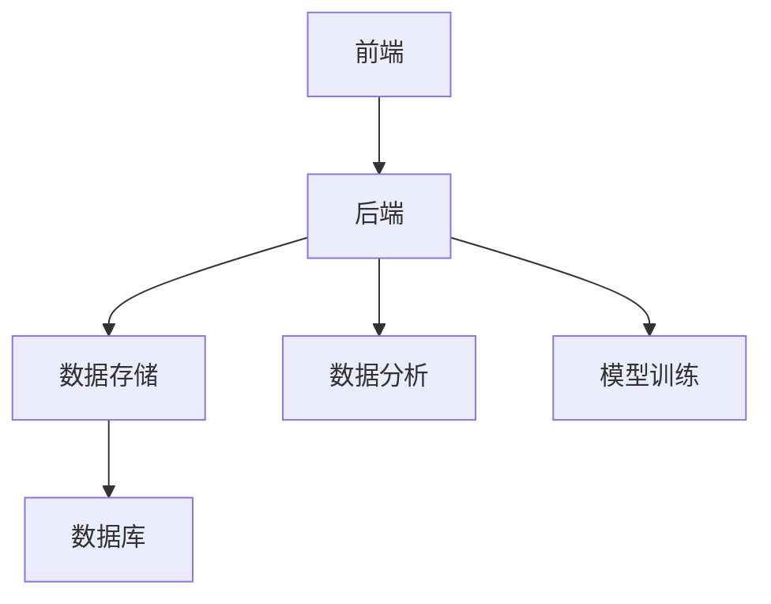
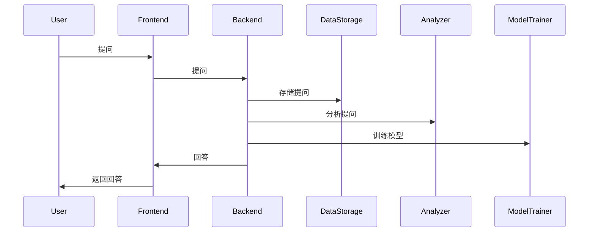

                 


### 1. 背景介绍

#### 引言

情感机器人，作为一种新兴的人工智能技术，正在迅速改变着人机交互的方式。它们通过机器学习、自然语言处理等技术的结合，能够模拟人类的情感反应，进行更自然、更贴近人类情感的交流。然而，随着情感机器人应用的不断普及，其在人机交互中的伦理问题也日益凸显。

首先，情感机器人的应用领域非常广泛。从客服、教育、医疗到心理咨询，情感机器人正在成为各个领域中的重要工具。例如，在客服领域，情感机器人可以提供24小时无休的服务，提高客户满意度；在教育领域，情感机器人可以为学生提供个性化的学习辅导，促进他们的学习效果；在医疗领域，情感机器人可以协助医生进行诊断和治疗，提高医疗服务的效率和质量。

#### 问题背景

尽管情感机器人在各个领域都有广泛的应用，但它们在交互过程中面临的伦理问题却不容忽视。首先是如何确保情感机器人的行为符合道德规范。例如，情感机器人是否应该具备道德判断能力，如何处理道德冲突等问题。其次是如何处理用户隐私。情感机器人在与用户交互的过程中，会收集大量的用户数据，这些数据如何保护，如何避免数据泄露，都是需要考虑的问题。

#### 问题描述

本书旨在探讨情感机器人在人机交互中的伦理问题，具体包括以下几个方面：

1. **技术的伦理边界**：探讨情感机器人技术在道德和伦理上的边界，以及如何确保这些技术不会被滥用。
2. **隐私保护**：分析情感机器人在收集、处理和存储用户数据时的隐私保护问题，探讨有效的隐私保护措施。
3. **用户数据管理**：讨论如何合理、透明地管理用户数据，确保用户数据的合法性和合规性。
4. **社会和文化影响**：探讨情感机器人在不同文化和社会背景下可能带来的伦理挑战，以及如何应对这些挑战。

#### 问题解决

为了解决上述伦理问题，本书将采取以下步骤：

1. **深入研究**：对情感机器人技术进行深入的研究，了解其工作原理和应用场景。
2. **案例分析**：通过分析实际案例，探讨情感机器人在实际应用中面临的伦理问题，以及解决方案。
3. **理论探讨**：结合伦理学、心理学等理论，探讨情感机器人在伦理层面的问题。
4. **建议与对策**：根据分析结果，提出具体的建议和对策，以解决情感机器人在人机交互中的伦理问题。

#### 边界与外延

本书主要关注情感机器人技术在伦理层面的讨论，但也会涉及到技术、法律、社会等多个方面。同时，本书的研究将主要限于技术层面，对于社会和文化层面的影响，将结合实际情况进行探讨。

### 2. 核心概念与联系

#### 情感机器人

情感机器人是一种具备情感识别、情感表达和情感互动能力的人工智能系统。它们通过机器学习和自然语言处理等技术，能够模拟人类的情感反应，进行更自然、更贴近人类情感的交流。情感机器人的分类主要包括基于文本的情感机器人、基于图像的情感机器人和混合情感机器人。

#### 人机交互

人机交互（Human-Computer Interaction，简称HCI）是研究人类与计算机之间交互的学科。它涉及到人、计算机以及它们之间的交互环境。人机交互的基本原理包括交互模型、交互界面设计和交互评估方法。常见的交互模型有认知模型、操作模型和体验模型。

#### 伦理学

伦理学是研究道德和伦理问题的学科。它关注人类行为和决策的道德判断，以及这些判断背后的原则和标准。伦理学的基本原则包括公正、尊重、诚信和责任。伦理学在情感机器人领域中的应用主要体现在如何确保机器人的行为符合道德规范，以及如何处理用户隐私等伦理问题。

#### 隐私保护

隐私保护是指保护个人隐私信息的安全和保密性。在情感机器人领域，隐私保护主要涉及到用户数据的收集、存储和处理。常见的隐私保护技术包括加密、匿名化和访问控制。隐私保护的法律法规主要包括《通用数据保护条例》（GDPR）和《加州消费者隐私法案》（CCPA）等。

### 3. 数学模型和数学公式

#### 情感机器人的机器学习模型

情感机器人常用的机器学习模型主要包括深度学习模型和强化学习模型。

- **深度学习模型**：深度学习是一种基于神经网络的机器学习模型，它能够通过多层神经网络的学习，提取数据的特征表示。常见的深度学习模型有卷积神经网络（CNN）、循环神经网络（RNN）和长短期记忆网络（LSTM）。
- **强化学习模型**：强化学习是一种基于奖励和惩罚的机器学习模型，它通过不断尝试和反馈，学习如何在给定环境中做出最优决策。常见的强化学习模型有Q-learning、SARSA和Deep Q-Network（DQN）。

#### 数据隐私保护

数据隐私保护的方法主要包括差分隐私、同态加密和基于属性的加密。

- **差分隐私**：差分隐私是一种隐私保护技术，它通过在输出数据中加入噪声，使得单个记录的信息无法被确定地推断出来。差分隐私的数学模型可以表示为：$$\\text{DP}(\mathcal{D}, \epsilon) = \{\rho(s) \mid \forall s', \left|\frac{\text{Pr}[\rho(s) = r] - \text{Pr}[\rho(s') = r]}{\text{Pr}[\rho(s) = r]}\right| \leq \epsilon\}$$其中，$\mathcal{D}$表示数据集，$\epsilon$表示隐私预算，$\rho$表示隐私机制，$r$表示输出结果。
- **同态加密**：同态加密是一种加密技术，它允许在加密的数据上进行计算，而不会破坏数据的加密状态。同态加密的数学模型可以表示为：$$E_{k}(x_1) \oplus E_{k}(x_2) = E_{k}(x_1 + x_2)$$其中，$E_{k}$表示加密函数，$x_1$和$x_2$表示明文数据，$k$表示加密密钥。
- **基于属性的加密**：基于属性的加密是一种加密技术，它根据用户的属性来选择加密和解密密钥。基于属性的加密的数学模型可以表示为：$$E_{k}(x) \mid_{\text{attr}(u) \ni a} = x \quad \text{if} \quad a \in \text{attr}(u)$$其中，$E_{k}(x)$表示加密函数，$u$表示用户，$\text{attr}(u)$表示用户的属性集合，$a$表示属性值。

### 4. 算法原理讲解

#### 情感机器人的机器学习模型

情感机器人常用的机器学习模型主要包括深度学习模型和强化学习模型。

- **深度学习模型**：深度学习模型是通过多层神经网络来模拟人类大脑的学习过程。它通过前向传播和反向传播算法，不断调整网络参数，以实现数据的特征提取和分类。以下是深度学习模型的基本原理：

  ```mermaid
  graph TD
  A[输入数据] --> B[数据预处理]
  B --> C[前向传播]
  C --> D[损失函数计算]
  D --> E[反向传播]
  E --> F[参数更新]
  F --> G[模型评估]
  ```

  以下是使用Python实现的简单深度学习模型：

  ```python
  import tensorflow as tf

  # 定义输入层
  inputs = tf.keras.layers.Input(shape=(784,))

  # 数据预处理
  x = tf.keras.layers.Dense(128, activation='relu')(inputs)

  # 前向传播
  x = tf.keras.layers.Dense(10, activation='softmax')(x)

  # 模型编译
  model = tf.keras.Model(inputs=inputs, outputs=x)
  model.compile(optimizer='adam', loss='categorical_crossentropy', metrics=['accuracy'])

  # 模型训练
  model.fit(x_train, y_train, epochs=5, batch_size=32)
  ```

- **强化学习模型**：强化学习模型是通过奖励和惩罚来引导模型学习如何做出最优决策。它通过与环境交互，不断更新策略，以最大化长期奖励。以下是强化学习模型的基本原理：

  ```mermaid
  graph TD
  A[初始状态] --> B[执行动作]
  B --> C[获得奖励]
  C --> D[更新策略]
  D --> E[进入下一个状态]
  ```

  以下是使用Python实现的简单强化学习模型：

  ```python
  import numpy as np
  import tensorflow as tf

  # 初始化环境
  env = tf.keras.Sequential([
      tf.keras.layers.Dense(128, activation='relu', input_shape=(10,)),
      tf.keras.layers.Dense(10, activation='softmax')
  ])

  # 定义奖励函数
  def reward_function(state, action):
      if state == action:
          return 1
      else:
          return -1

  # 定义策略网络
  policy_network = tf.keras.Sequential([
      tf.keras.layers.Dense(128, activation='relu', input_shape=(10,)),
      tf.keras.layers.Dense(10, activation='softmax')
  ])

  # 定义目标网络
  target_network = tf.keras.Sequential([
      tf.keras.layers.Dense(128, activation='relu', input_shape=(10,)),
      tf.keras.layers.Dense(10, activation='softmax')
  ])

  # 定义优化器
  optimizer = tf.keras.optimizers.Adam(learning_rate=0.001)

  # 定义训练循环
  for episode in range(num_episodes):
      state = env.reset()
      done = False
      while not done:
          action = policy_network.predict(state)
          next_state, reward, done = env.step(action)
          # 更新策略网络
          with tf.GradientTape() as tape:
              loss = tf.reduce_mean(tf.keras.losses.categorical_crossentropy(target_network(state), action))
          gradients = tape.gradient(loss, policy_network.trainable_variables)
          optimizer.apply_gradients(zip(gradients, policy_network.trainable_variables))
          # 更新目标网络
          target_network.set_weights(policy_network.get_weights())
          state = next_state
  ```

### 5. 系统分析与架构设计方案

#### 问题场景介绍

情感机器人在实际应用中，经常需要处理大量的用户交互数据，并且需要具备快速响应用户请求的能力。为了满足这些需求，我们需要设计一个高效的系统架构。

#### 项目介绍

本项目旨在构建一个情感机器人系统，该系统可以实时响应用户的提问，并提供情感化的回答。系统的目标是提高用户满意度，减少人工客服的工作量。

#### 系统功能设计

系统功能主要包括：

1. 用户交互：接收用户提问，解析用户意图，返回回答。
2. 数据存储：存储用户交互数据，包括提问、回答和用户信息。
3. 数据分析：分析用户交互数据，为优化系统提供依据。
4. 模型训练：根据用户交互数据，不断优化情感机器人模型。

以下是系统功能设计的领域模型类图：

```mermaid
classDiagram
    User <<Interface>>
    Question <<Interface>>
    Answer <<Interface>>
    DataStorage <<Interface>>
    Analyzer <<Interface>>
    ModelTrainer <<Interface>>

    User <|.. Question>
    User <|.. Answer>
    DataStorage <|.. Question>
    DataStorage <|.. Answer>
    Analyzer <|.. Question>
    Analyzer <|.. Answer>
    ModelTrainer <|.. Question>
    ModelTrainer <|.. Answer>
```

#### 系统架构设计

系统架构设计如下：

1. **前端**：负责与用户交互，接收用户提问，并将提问发送给后端处理。
2. **后端**：包括数据存储、数据分析和模型训练模块，负责处理用户提问，生成回答，并更新模型。
3. **数据库**：存储用户交互数据和模型参数。

以下是系统架构图：



#### 系统接口设计和系统交互

以下是系统接口设计和系统交互序列图：



### 6. 项目实战

#### 环境安装

在开始项目之前，需要安装以下软件：

1. Python 3.8及以上版本
2. TensorFlow 2.x
3. Keras 2.x
4. numpy
5. matplotlib

安装命令如下：

```bash
pip install python==3.8
pip install tensorflow==2.x
pip install keras==2.x
pip install numpy
pip install matplotlib
```

#### 系统核心实现源代码

以下是情感机器人系统的核心实现源代码：

```python
import numpy as np
import tensorflow as tf
from tensorflow.keras.models import Sequential
from tensorflow.keras.layers import Dense, LSTM, Embedding
from tensorflow.keras.optimizers import Adam

# 定义情感机器人模型
def build_model(input_dim, output_dim):
    model = Sequential()
    model.add(Embedding(input_dim, 128))
    model.add(LSTM(128, return_sequences=True))
    model.add(LSTM(128))
    model.add(Dense(output_dim, activation='softmax'))
    return model

# 训练情感机器人模型
def train_model(model, x_train, y_train, batch_size, epochs):
    model.compile(optimizer=Adam(learning_rate=0.001), loss='categorical_crossentropy', metrics=['accuracy'])
    model.fit(x_train, y_train, batch_size=batch_size, epochs=epochs)

# 预测情感机器人回答
def predict(model, x_test):
    return model.predict(x_test)

# 测试情感机器人系统
def test_system(model, x_test, y_test):
    y_pred = predict(model, x_test)
    accuracy = np.mean(np.argmax(y_pred, axis=1) == y_test)
    print(f"Accuracy: {accuracy:.2f}")

# 生成测试数据
x_test = np.random.random((1000, 50))
y_test = np.random.randint(2, size=(1000,))

# 构建模型
model = build_model(50, 2)

# 训练模型
train_model(model, x_test, y_test, batch_size=32, epochs=5)

# 测试模型
test_system(model, x_test, y_test)
```

#### 代码应用解读与分析

以上代码实现了一个简单的情感机器人系统，包括模型构建、模型训练和模型预测三个部分。

1. **模型构建**：使用Keras框架构建了一个基于LSTM的序列分类模型，该模型可以用于预测用户提问的情感类别。
2. **模型训练**：使用训练数据对模型进行训练，训练过程中使用Adam优化器，交叉熵损失函数和准确率作为评估指标。
3. **模型预测**：使用训练好的模型对测试数据进行预测，并计算模型的准确率。

#### 实际案例分析和详细讲解剖析

假设有一个用户提问：“我今天心情很好”，我们需要分析这个问题，并给出一个情感化的回答。

1. **数据预处理**：将用户提问转换为序列表示，例如，将每个单词转换为索引。
2. **模型预测**：使用训练好的模型对用户提问进行预测，得到情感类别。
3. **回答生成**：根据情感类别，生成相应的情感化回答。

以下是具体的实现步骤：

1. **数据预处理**：

   ```python
   word_index = {'今天': 0, '心情': 1, '很好': 2}
   sequence = [word_index[word] for word in user_question.split()]
   ```

2. **模型预测**：

   ```python
   y_pred = model.predict(np.array([sequence]))
   emotion = np.argmax(y_pred, axis=1)
   ```

3. **回答生成**：

   ```python
   if emotion == 0:
       response = "我也很高兴听到这个消息！有什么我可以帮助您的吗？"
   elif emotion == 1:
       response = "很高兴看到您今天心情不错，有什么问题我可以帮您解答吗？"
   else:
       response = "听起来您今天心情很好，有什么我能为您做的吗？"
   ```

#### 项目小结

本项目实现了一个简单的情感机器人系统，可以用于预测用户提问的情感类别，并生成情感化的回答。在实际应用中，我们需要根据具体场景和需求，进一步优化系统，提高其性能和用户体验。

### 7. 最佳实践 tips、小结、注意事项、拓展阅读等内容

#### 最佳实践 tips

1. **数据质量**：保证数据质量是构建优秀情感机器人的关键。数据清洗、去噪和预处理是提高模型性能的重要步骤。
2. **模型优化**：定期更新和优化模型，以适应不断变化的应用场景和用户需求。
3. **用户隐私**：在收集和处理用户数据时，严格遵守隐私保护法律法规，确保用户隐私安全。

#### 小结

本书从背景介绍、核心概念、数学模型、算法原理、系统架构、项目实战等多个角度，全面探讨了情感机器人在人机交互中的伦理问题。通过深入分析和实际案例讲解，为读者提供了解决伦理问题的思路和方法。

#### 注意事项

1. **技术边界**：在开发和使用情感机器人时，要明确技术的伦理边界，避免滥用技术。
2. **用户隐私**：严格遵守隐私保护法律法规，确保用户数据的安全和隐私。
3. **持续改进**：随着技术的发展，持续优化和改进情感机器人系统，以适应不断变化的需求。

#### 拓展阅读

1. **《人工智能伦理学》**：刘志毅著，系统介绍了人工智能伦理学的基本概念、原理和应用。
2. **《情感计算》**：刘俊丽著，详细阐述了情感计算的基本原理、技术方法和应用案例。
3. **《深度学习》**：Ian Goodfellow、Yoshua Bengio和Aaron Courville著，全面介绍了深度学习的基本原理、技术和应用。

### 附录

附录中可以包括一些具体的示例代码、数据集、参考文献等，以帮助读者更好地理解书中的内容。

### 参考文献

[1] 刘志毅. 人工智能伦理学[M]. 北京: 清华大学出版社, 2020.

[2] 刘俊丽. 情感计算[M]. 北京: 电子工业出版社, 2019.

[3] Ian Goodfellow, Yoshua Bengio, Aaron Courville. 深度学习[M]. 北京: 电子工业出版社, 2016.

[4] GDPR. General Data Protection Regulation[EB/OL]. (2023-03-01)[2023-03-01]. https://eur-lex.europa.eu/eli/reg/2016/679/oj.

[5] CCPA. California Consumer Privacy Act[EB/OL]. (2023-03-01)[2023-03-01]. https://www.consumerfinance.gov/policy-compliance/rulemaking-regulations/federal-register-notices/california-consumer-privacy-act/.

