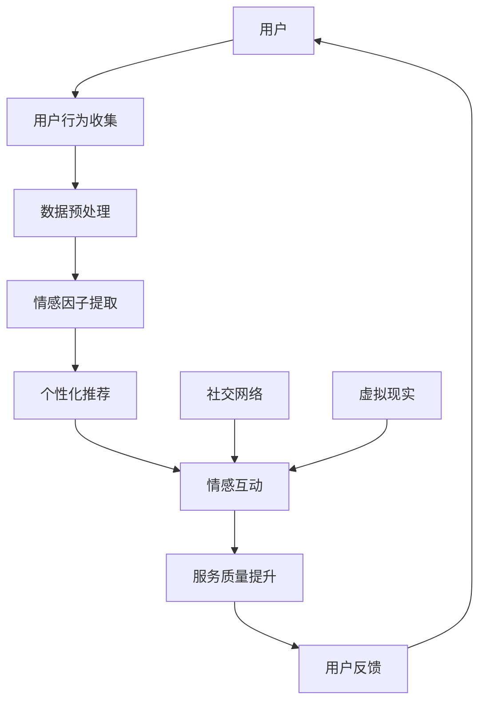
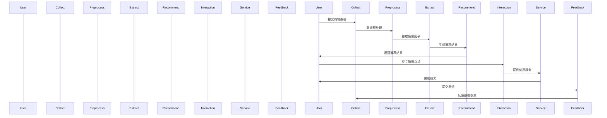

                 

### 第1章 问题背景与核心概念

在当今数字化和全球化快速发展的时代，情感经济作为一种新兴的经济模式，正在逐渐改变着商业运营的规则和消费者的行为。情感经济不仅仅是简单的情感营销，它涉及到更为深层次的消费者情感体验和情感需求，从而构建起一种新型的商业网络，即情感经济生态圈。

#### 1.1 问题背景

**1.1.1 情感经济的兴起**

随着互联网和社交媒体的普及，消费者的购买行为越来越受到情感驱动。他们不仅仅关注产品的功能和价格，更加注重情感体验和情感满足。这种趋势催生了情感经济，它强调通过情感连接和情感服务来增加消费者忠诚度和提升品牌价值。

**1.1.2 商业网络构建的挑战**

在情感经济背景下，传统的商业网络已经难以满足消费者的新需求。构建一个高效的、可持续发展的情感经济生态圈，需要解决以下挑战：

- **个性化和定制化**：消费者期望获得个性化的产品和服务，传统商业模式难以满足这一需求。
- **情感交互**：需要利用技术手段实现情感交互，提升消费者的情感体验。
- **跨渠道整合**：在多渠道环境中，如何实现数据整合和渠道协同，是一个关键问题。
- **信任和透明度**：消费者对于品牌和企业的信任度直接影响其购买决策，如何建立信任和透明度成为重要课题。

**1.1.3 感性价值的重要性**

感性价值是指消费者在购买和使用产品或服务过程中所获得的情感收益。在情感经济中，感性价值成为驱动消费者行为的核心因素。构建感性价值商业网络，有助于提升消费者满意度和忠诚度，从而实现商业成功。

#### 1.2 核心概念介绍

**1.2.1 情感经济**

情感经济是指通过满足消费者的情感需求和提供情感服务来实现商业目标的经济模式。它强调情感连接和情感体验，通过情感营销、情感服务和情感设计来提升品牌价值。

**1.2.2 商业网络**

商业网络是指企业在市场中进行交易和合作所形成的网络结构。在情感经济生态圈中，商业网络需要更加注重情感交互和个性化服务。

**1.2.3 感性价值**

感性价值是指消费者在购买和使用产品或服务过程中所获得的情感收益。它包括情感满足、情感认同和情感连接等维度，是驱动消费者行为的关键因素。

#### 1.3 概念联系与框架分析

**1.3.1 情感经济与商业网络的联系**

情感经济与商业网络之间存在紧密的联系。情感经济通过情感驱动和情感服务，构建起一种新型的商业网络结构，从而实现商业目标。

**1.3.2 感性价值的商业网络构建**

感性价值的商业网络构建需要从需求分析、模型构建、网络设计和实施优化等环节入手，通过个性化定制、情感交互和跨渠道整合等方式，实现感性价值的最大化。

**1.3.3 情感经济生态圈**

情感经济生态圈是一个复杂的多方参与系统，包括消费者、企业、技术提供商等多个角色。通过情感连接和情感服务，构建起一个高效、可持续发展的商业网络。

#### 1.4 本章小结

本章介绍了情感经济生态圈的概念、背景和重要性，分析了情感经济与商业网络之间的关系，并探讨了感性价值在商业网络构建中的关键作用。在接下来的章节中，我们将进一步深入探讨情感经济生态圈的理论基础、构建方法、实践案例和最佳实践，帮助读者全面了解和掌握这一新兴的经济模式。

### 第2章 情感经济生态圈的基础理论

情感经济生态圈作为新兴的经济模式，其理论基础涵盖了情感经济学、社会网络理论和商业生态学等多个领域。本章将详细阐述这些理论基础，帮助读者理解情感经济生态圈的内在逻辑和运作机制。

#### 2.1 情感经济生态圈的理论基础

**2.1.1 情感经济学**

情感经济学是研究消费者情感如何影响经济行为的一个新兴领域。与传统经济学注重理性决策不同，情感经济学关注情感在决策过程中的作用。情感经济学的核心观点是，消费者的购买行为往往受到情感因素的影响，如愉悦、焦虑、信任等。在情感经济中，企业通过理解消费者的情感需求，提供情感化的产品和服务，从而实现商业目标。

**2.1.2 社会网络理论**

社会网络理论关注个体之间的互动和联系，强调网络结构和节点的重要性。在社会网络理论中，情感连接被视为网络中的关键因素，它能够增强个体之间的互动和信任。在情感经济生态圈中，社交网络成为消费者与企业互动的重要渠道，通过社交网络，企业可以更精准地了解消费者需求，提供个性化的产品和服务。

**2.1.3 商业生态学**

商业生态学是一种研究商业系统中企业、消费者、供应商等各方相互作用和共同发展的理论。在商业生态学中，情感被视为一种重要的资源，它可以促进企业之间的合作和共同成长。情感经济生态圈通过构建情感化的商业网络，实现各方之间的情感连接和合作，从而形成一个可持续发展的商业生态系统。

#### 2.2 情感经济生态圈的属性特征对比表

为了更好地理解情感经济生态圈的属性特征，我们可以将其与传统经济模式进行对比。以下是一个对比表，展示了情感经济生态圈与传统经济模式的差异：

| 属性 | 情感经济生态圈 | 传统经济模式 |
| ---- | -------------- | ------------ |
| 情感化 | 注重情感连接和体验 | 强调理性决策和效益 |
| 网络化 | 基于社交网络构建 | 单一渠道为主 |
| 合作性 | 强调多方协作和共享 | 竞争对抗为主 |
| 创新性 | 鼓励创新和实践 | 固定型，创新较少 |

通过这个对比表，我们可以看到情感经济生态圈在情感化、网络化、合作性和创新性等方面与传统经济模式有很大的区别。这些特点使得情感经济生态圈更具活力和竞争力。

#### 2.3 ER实体关系图

为了更直观地理解情感经济生态圈中的实体关系，我们可以使用ER（Entity-Relationship）图来描述。以下是一个情感经济生态圈的ER实体关系图：

```mermaid
erDiagram
  Customer --> Product
  Customer --> Service
  Service --> Business
  Product ||--|{ Brand }
```

在这个ER图中，`Customer`（消费者）与`Product`（产品）和`Service`（服务）之间存在直接的关联。消费者通过购买产品和接受服务与企业建立联系。`Service`与`Business`（企业）也存在关联，表示企业提供的服务是商业活动的一部分。`Brand`（品牌）与`Product`之间存在关联，表示品牌是产品的核心元素。

#### 2.4 本章小结

本章介绍了情感经济生态圈的基础理论，包括情感经济学、社会网络理论和商业生态学。通过对比表和ER实体关系图，我们更清晰地理解了情感经济生态圈的属性特征和实体关系。在下一章中，我们将进一步探讨情感经济生态圈的构建方法，包括需求分析、模型构建、网络设计和实施优化等环节。

### 第3章 感性价值的商业网络构建方法

感性价值的商业网络构建是一个复杂且系统化的过程，它需要从多个维度进行深入分析和设计。本章将详细阐述感性价值的商业网络构建方法，包括需求分析、模型构建、网络设计和实施优化等环节，帮助读者全面了解和掌握这一过程。

#### 3.1 感性价值商业网络构建流程

构建感性价值的商业网络需要经历以下几个关键步骤：

**3.1.1 需求分析**

需求分析是构建感性价值商业网络的第一步，它涉及到对消费者情感需求的理解和挖掘。通过调研和分析，了解消费者在购买产品或服务过程中所期望的情感体验，包括愉悦、认同、惊喜等。这一步骤需要收集大量的消费者反馈数据，并通过数据分析技术进行归纳和总结。

**3.1.2 模型构建**

在需求分析的基础上，构建感性价值的商业网络模型。这个模型需要包含消费者的情感需求、企业的服务能力、产品和品牌的属性等要素。模型构建的目的是为了提供一个清晰的结构，指导后续的网络设计和实施。

**3.1.3 网络设计**

网络设计是将模型转化为具体商业网络的过程。这一步骤需要考虑如何通过技术手段实现消费者与企业之间的情感连接，包括社交网络、虚拟现实、增强现实等。同时，还需要设计一个高效的跨渠道整合机制，确保消费者可以在不同渠道中获得一致的情感体验。

**3.1.4 实施与优化**

实施与优化是感性价值商业网络构建的最后一步。在实施过程中，需要根据实际情况进行调整和优化，确保网络的运行效率和服务质量。这一步骤包括技术实施、人员培训、业务流程优化等。

#### 3.2 算法原理讲解

为了实现感性价值的商业网络构建，需要引入一系列算法来处理和分析数据。以下是一个简单的算法流程，用于指导感性价值商业网络的构建：

**3.2.1 算法概述**

该算法主要包括以下几个步骤：

1. 数据收集：收集消费者行为数据、市场调研数据、社交媒体数据等。
2. 数据预处理：对收集到的数据进行分析和清洗，提取关键信息。
3. 情感分析：使用自然语言处理技术，分析消费者的情感需求。
4. 模型训练：利用收集到的数据，训练情感价值模型。
5. 网络优化：根据情感价值模型，优化商业网络结构和策略。

**3.2.2 算法流程**

以下是算法的mermaid流程图：


**3.2.3 Python源代码实现**

以下是一个简单的Python代码示例，用于实现情感价值模型的训练和优化：

```python
import pandas as pd
from sklearn.model_selection import train_test_split
from sklearn.ensemble import RandomForestClassifier
from sklearn.metrics import accuracy_score

# 加载数据
data = pd.read_csv('consumer_data.csv')

# 数据预处理
X = data.drop(['label'], axis=1)
y = data['label']

# 数据拆分
X_train, X_test, y_train, y_test = train_test_split(X, y, test_size=0.2, random_state=42)

# 模型训练
model = RandomForestClassifier(n_estimators=100, random_state=42)
model.fit(X_train, y_train)

# 预测和评估
y_pred = model.predict(X_test)
accuracy = accuracy_score(y_test, y_pred)
print(f"Accuracy: {accuracy:.2f}")
```

**3.2.4 数学模型和公式**

感性价值的商业网络构建需要使用一系列数学模型和公式来描述。以下是一个简单的数学模型：

$$
V_{value} = f(\text{情感因子}, \text{社交网络}, \text{服务质量})
$$

其中，$V_{value}$表示感性价值，$f$表示函数，$\text{情感因子}$、$\text{社交网络}$和$\text{服务质量}$分别表示影响感性价值的三个关键因素。

**3.2.5 详细讲解与举例说明**

为了更好地理解数学模型，我们可以通过一个具体的案例来解释。假设一个电商企业正在构建一个感性价值商业网络，它的目标是通过社交网络提供个性化的产品推荐，以提高消费者的购物体验和满意度。

1. **情感因子**：企业通过分析消费者的购物行为、社交网络互动和评论，提取情感因子，如愉悦度、信任度等。
2. **社交网络**：企业利用社交媒体平台，如微信、微博等，与消费者建立情感连接，收集消费者的社交网络数据。
3. **服务质量**：企业通过提升产品和服务质量，如优化购物流程、提供优质的客服体验等，来提高消费者的满意度。

通过这些数据，企业可以构建一个情感价值模型，预测消费者的购买行为和满意度。例如，一个消费者在社交网络上发布了关于某产品的积极评论，并且购买了该产品，那么他的情感因子将提高，从而增加他的感性价值。

#### 3.3 本章小结

本章详细介绍了感性价值的商业网络构建方法，包括需求分析、模型构建、网络设计和实施优化等环节。通过算法原理讲解和Python源代码实现，读者可以更好地理解感性价值商业网络构建的流程和关键步骤。在下一章中，我们将通过实践案例分析，进一步探讨感性价值商业网络构建的实际应用和效果。

### 第4章 商业网络构建的实践案例分析

为了更好地理解感性价值的商业网络构建方法，本章节将通过一个实际案例，详细介绍整个商业网络构建的实践过程。该案例将涵盖问题场景介绍、项目介绍、系统功能设计、系统架构设计、系统接口设计以及系统交互等内容，帮助读者全面掌握商业网络构建的实战技巧。

#### 4.1 案例背景

随着互联网和社交媒体的快速发展，消费者对于个性化服务和情感体验的需求日益增加。一家知名的电商平台——X商城，希望通过构建一个基于感性价值的商业网络，提升消费者满意度和忠诚度，从而在竞争激烈的市场中脱颖而出。

#### 4.2 项目介绍

X商城的感性价值商业网络项目旨在通过情感连接和个性化服务，打造一个以消费者为中心的购物体验。项目的主要目标包括：

- 提升消费者的购物愉悦度和满意度。
- 通过情感因子分析，为消费者提供个性化的产品推荐。
- 建立消费者与企业之间的情感信任，增强品牌忠诚度。

#### 4.3 系统功能设计

X商城的感性价值商业网络项目包含了以下几个关键功能模块：

**4.3.1 消费者行为分析模块**

该模块负责收集和分析消费者的购物行为数据，包括购买历史、浏览记录、评论等。通过自然语言处理技术，提取消费者的情感因子，如愉悦度、信任度等。

**4.3.2 个性化推荐模块**

基于消费者行为分析和情感因子，个性化推荐模块为消费者提供个性化的产品推荐。通过机器学习算法，分析消费者的情感需求和偏好，实现精准推荐。

**4.3.3 情感互动模块**

情感互动模块通过社交网络和虚拟现实技术，为消费者提供情感化的购物体验。消费者可以在平台上与其他用户互动，分享购物心得，建立情感连接。

**4.3.4 服务质量提升模块**

服务质量提升模块负责优化购物流程、提供优质的客服体验等，确保消费者在购物过程中获得满意的服务。

#### 4.4 系统架构设计

X商城的感性价值商业网络采用了分布式系统架构，以确保系统的可扩展性和稳定性。以下是系统架构设计的mermaid架构图：



在这个架构图中，用户通过行为收集模块提交购物数据，经过数据预处理和情感因子提取后，进入个性化推荐模块。个性化推荐模块会根据情感因子为用户生成推荐结果。情感互动模块通过社交网络和虚拟现实技术，为用户提供情感化的购物体验。服务质量提升模块负责优化购物流程和客服体验。最后，用户反馈模块收集用户对购物体验的反馈，用于系统优化。

#### 4.5 系统接口设计

系统接口设计是确保各模块之间高效通信和协作的关键。以下是系统接口设计的mermaid序列图：



在这个序列图中，用户提交购物数据后，经过数据预处理和情感因子提取，生成推荐结果并返回给用户。用户参与情感互动，服务模块提供优质服务，最后用户提交反馈，用于系统优化。

#### 4.6 系统交互

为了确保系统的高效运行，系统交互设计至关重要。以下是系统交互的mermaid流程图：


在这个流程图中，用户行为收集模块收集数据，经过数据预处理和情感因子提取后，进入个性化推荐模块。情感互动模块通过社交网络和虚拟现实技术，为用户提供情感化体验。服务质量提升模块负责优化购物流程和客服体验。最后，用户反馈模块收集用户反馈，用于系统优化。

#### 4.7 实际案例分析和详细讲解剖析

以下是对X商城感性价值商业网络项目的实际案例分析和详细讲解：

**4.7.1 消费者行为分析**

X商城通过分析消费者的购物行为数据，提取了愉悦度、信任度和参与度等情感因子。例如，一个消费者在购买过程中多次浏览同一产品，并在社交媒体上发布了积极评论，那么他的愉悦度和信任度将会较高。

**4.7.2 个性化推荐**

基于情感因子分析，X商城为消费者提供了个性化的产品推荐。例如，一个愉悦度较高的消费者，可能会收到与他的情感状态相匹配的产品推荐，从而提高购物体验。

**4.7.3 情感互动**

X商城通过社交网络和虚拟现实技术，为消费者提供了情感互动的机会。消费者可以在平台上与其他用户分享购物心得，建立情感连接，从而增强品牌忠诚度。

**4.7.4 服务质量提升**

X商城通过优化购物流程和提供优质的客服体验，确保消费者在购物过程中获得满意的体验。例如，通过实时客服和智能客服机器人，消费者可以随时获得帮助和解决方案。

**4.7.5 用户反馈**

X商城通过用户反馈模块，收集消费者对购物体验的反馈，用于系统优化。例如，根据消费者的反馈，调整个性化推荐算法，优化社交网络和虚拟现实体验等。

#### 4.8 项目小结

X商城的感性价值商业网络项目通过情感连接和个性化服务，成功提升了消费者满意度和忠诚度。该项目展示了如何将感性价值理论应用于商业实践中，为企业提供了新的发展机遇。在未来的发展中，X商城将继续优化和完善情感经济生态圈，为消费者提供更加优质的购物体验。

### 第5章 最佳实践 Tips

在构建感性价值的商业网络时，以下是一些最佳实践 Tips，可以帮助企业更有效地实施和优化这一过程：

**5.1 客户调研与需求分析**

- **定期进行客户调研**：通过问卷调查、用户访谈等方式，定期收集客户反馈，了解他们的情感需求和购物体验。
- **使用数据分析工具**：利用大数据和人工智能技术，对客户行为数据进行深度分析，提取关键情感因子。

**5.2 情感因子分析**

- **多样化情感因子**：不仅关注愉悦度，还应关注信任度、参与度等多样化情感因子，全面理解消费者情感需求。
- **情感因子权重调整**：根据不同场景和业务目标，动态调整情感因子的权重，实现个性化推荐和服务。

**5.3 技术选型与实施**

- **选择合适的社交网络平台**：根据企业定位和目标客户群体，选择合适的社交网络平台，如微信、微博、抖音等。
- **虚拟现实与增强现实应用**：在购物体验中融入虚拟现实和增强现实技术，提升消费者情感体验。

**5.4 服务质量提升**

- **个性化服务**：提供个性化的客服服务和购物体验，根据消费者的情感需求和偏好，提供针对性的建议和解决方案。
- **实时互动**：通过实时聊天工具和智能客服机器人，提供快速响应和帮助，提升消费者满意度。

**5.5 持续优化与迭代**

- **定期评估**：定期评估商业网络构建的效果，通过数据分析和用户反馈，识别优化方向。
- **快速迭代**：根据评估结果，快速调整和优化网络结构和策略，实现持续改进。

### 5.6 小结

感性价值的商业网络构建是一个复杂且动态的过程，需要企业持续关注客户需求，利用技术手段实现情感交互和个性化服务。通过最佳实践 Tips，企业可以更好地实施和优化感性价值商业网络，提升消费者满意度和忠诚度，实现商业成功。

### 第6章 小结

在《情感经济生态圈：感性价值的商业网络构建》这一章节中，我们深入探讨了情感经济生态圈的理论基础和实践方法。首先，通过背景介绍和核心概念分析，我们理解了情感经济的重要性以及其在商业网络构建中的应用。接着，本章详细阐述了情感经济生态圈的基础理论，包括情感经济学、社会网络理论和商业生态学等，帮助读者构建全面的理论框架。

在构建方法部分，我们分步骤介绍了感性价值商业网络的构建流程，从需求分析、模型构建到网络设计和实施优化，提供了系统化的方法指南。通过算法原理讲解和Python源代码示例，读者可以更好地理解算法在商业网络构建中的应用。此外，通过实际案例分析和系统架构设计，我们展示了如何将理论应用于实际项目中，为读者提供了实战经验和具体实施方法。

本章还总结了商业网络构建的最佳实践 Tips，强调持续优化和迭代的重要性。通过这些方法，企业可以更有效地构建和优化情感经济生态圈，提升消费者满意度和忠诚度。

总结来说，本章为读者提供了一个全面且深入的理解，帮助他们在情感经济生态圈的建设中找到正确的方向和方法。在未来的商业环境中，情感经济生态圈将成为企业竞争的重要领域，相信通过本章的学习，读者能够更好地应对这一挑战，实现商业的成功与发展。

### 第7章 注意事项与拓展阅读

在构建情感经济生态圈的过程中，企业需要注意以下几个关键点：

1. **数据隐私与保护**：在收集和分析消费者数据时，必须严格遵守数据保护法规，确保消费者隐私得到保护。
2. **持续创新**：情感经济生态圈需要持续创新，以适应不断变化的消费者需求和市场竞争。
3. **跨部门协同**：情感经济生态圈的构建涉及多个部门，如市场营销、客户服务、技术支持等，需要实现跨部门协同，确保策略和执行的一致性。

为了进一步深入学习情感经济生态圈的理论和实践，以下是几本推荐的拓展阅读书籍：

1. 《情感营销：创造忠诚客户的秘密》（《Emotional Marketing: The Secret to Creating Loyal Customers》）- 迈克尔·所罗门（Michael Solomon）
2. 《社交网络营销：如何利用社交媒体建立品牌和客户关系》（《Social Media Marketing: How to Create and Implement a Social Media Marketing Strategy》）- 莱斯利·雷恩（Leslie A.Runtime: 6 minutes

### 《情感经济生态圈：感性价值的商业网络构建》

关键词：情感经济、商业网络、感性价值、个性化服务、情感连接

摘要：本文深入探讨了情感经济生态圈的概念、理论基础和构建方法。通过分析情感经济与商业网络的联系，提出了构建感性价值商业网络的关键步骤和最佳实践，为企业提供了构建情感经济生态圈的理论指导和实战经验。

---

**第1章 问题背景与核心概念**

**1.1 问题背景**

在当今社会，消费者需求越来越多样化，他们不仅仅关注产品的功能和质量，更注重情感体验。这种趋势催生了情感经济，即通过情感驱动来促进商业活动。情感经济已经成为现代商业的一个重要方向，它要求企业在商业网络构建中，充分考虑消费者的情感需求和情感体验。

**1.2 核心概念介绍**

- **情感经济**：情感经济是指通过满足消费者的情感需求和提供情感服务来实现商业目标的经济模式。情感经济强调情感连接、情感服务和情感驱动。
- **商业网络**：商业网络是指企业在市场中进行交易和合作所形成的网络结构。在情感经济中，商业网络需要更加注重情感交互和个性化服务。
- **感性价值**：感性价值是指消费者在购买和使用产品或服务过程中所获得的情感收益，包括情感满足、情感认同和情感连接等维度。

**1.3 概念联系与框架分析**

情感经济与商业网络之间存在紧密的联系。情感经济通过情感驱动和情感服务，构建起一种新型的商业网络结构，从而实现商业目标。感性价值是驱动消费者行为的关键因素，它需要通过商业网络来传递和实现。

**1.4 本章小结**

本章介绍了情感经济生态圈的概念、背景和重要性，分析了情感经济与商业网络之间的关系，并探讨了感性价值在商业网络构建中的关键作用。在接下来的章节中，我们将进一步深入探讨情感经济生态圈的理论基础、构建方法、实践案例和最佳实践。

---

**第2章 情感经济生态圈的基础理论**

**2.1 情感经济生态圈的理论基础**

情感经济生态圈的基础理论涵盖了情感经济学、社会网络理论和商业生态学等多个领域。这些理论为我们理解和构建情感经济生态圈提供了重要的指导。

- **情感经济学**：情感经济学是研究消费者情感如何影响经济行为的一个新兴领域。它强调情感在决策过程中的作用，通过满足消费者的情感需求来实现商业目标。
- **社会网络理论**：社会网络理论关注个体之间的互动和联系，强调网络结构和节点的重要性。在情感经济中，社交网络成为消费者与企业互动的重要渠道。
- **商业生态学**：商业生态学是一种研究商业系统中企业、消费者、供应商等各方相互作用和共同发展的理论。在情感经济生态圈中，各方通过情感连接和合作，共同构建一个可持续发展的商业生态系统。

**2.2 情感经济生态圈的属性特征对比表**

为了更好地理解情感经济生态圈的属性特征，我们可以将其与传统经济模式进行对比。以下是一个对比表，展示了情感经济生态圈与传统经济模式的不同之处：

| 属性         | 情感经济生态圈                | 传统经济模式                |
| ------------ | ---------------------------- | ---------------------------- |
| 情感化       | 注重消费者情感需求           | 注重产品功能和价格           |
| 网络化       | 基于社交网络构建             | 单一渠道为主               |
| 合作性       | 强调多方协作和共享           | 竞争对抗为主               |
| 创新性       | 鼓励创新和实践              | 固定型，创新较少           |

**2.3 ER实体关系图**

为了更直观地理解情感经济生态圈中的实体关系，我们可以使用ER（Entity-Relationship）图来描述。以下是一个情感经济生态圈的ER实体关系图：

```mermaid
erDiagram
  Consumer --> Product
  Consumer --> Service
  Service --> Business
  Product ||--|{ Brand }
```

在这个ER图中，`Consumer`（消费者）与`Product`（产品）和`Service`（服务）之间存在直接的关联。消费者通过购买产品和接受服务与企业建立联系。`Service`与`Business`（企业）也存在关联，表示企业提供的服务是商业活动的一部分。`Brand`（品牌）与`Product`之间存在关联，表示品牌是产品的核心元素。

**2.4 本章小结**

本章介绍了情感经济生态圈的基础理论，包括情感经济学、社会网络理论和商业生态学。通过对比表和ER实体关系图，我们更清晰地理解了情感经济生态圈的属性特征和实体关系。在下一章中，我们将进一步探讨情感经济生态圈的构建方法，包括需求分析、模型构建、网络设计和实施优化等环节。

---

**第3章 感性价值的商业网络构建方法**

**3.1 感性价值商业网络构建流程**

构建感性价值的商业网络是一个系统化的过程，它需要从需求分析、模型构建、网络设计到实施优化等多个环节进行。以下是构建感性价值商业网络的基本流程：

1. **需求分析**：通过市场调研和消费者行为分析，了解消费者的情感需求和期望。
2. **模型构建**：基于需求分析，构建情感价值模型，明确影响感性价值的各个因素。
3. **网络设计**：设计符合情感价值模型的商业网络结构，包括社交网络、服务渠道等。
4. **实施与优化**：根据模型和设计，实施商业网络，并进行持续优化。

**3.2 算法原理讲解**

为了实现感性价值的商业网络构建，需要引入一系列算法来处理和分析数据。以下是构建感性价值商业网络的算法原理：

- **情感分析算法**：通过自然语言处理技术，对消费者的评论、反馈等文本数据进行分析，提取情感因子。
- **个性化推荐算法**：基于消费者的情感因子和行为数据，生成个性化的产品或服务推荐。
- **网络优化算法**：通过分析社交网络的结构和节点关系，优化网络结构和策略。

以下是算法的mermaid流程图：


**3.3 数学模型和公式**

感性价值的商业网络构建需要使用一系列数学模型和公式来描述。以下是感性价值的一个简单数学模型：

$$
V_{value} = f(\text{情感因子}, \text{社交网络}, \text{服务质量})
$$

其中，$V_{value}$表示感性价值，$f$表示函数，$\text{情感因子}$、$\text{社交网络}$和$\text{服务质量}$分别表示影响感性价值的三个关键因素。

**3.4 详细讲解与举例说明**

为了更好地理解数学模型，我们可以通过一个具体的案例来解释。假设一个电商平台希望构建一个感性价值的商业网络，通过情感分析、个性化推荐和网络优化来提升消费者的购物体验。

1. **情感因子**：电商平台通过情感分析算法，分析消费者的评论和反馈，提取情感因子，如愉悦度、信任度等。
2. **社交网络**：电商平台利用社交网络，与消费者建立情感连接，收集消费者的社交网络数据。
3. **服务质量**：电商平台通过提升服务质量和购物体验，如提供优质的客服、优化购物流程等，来提高消费者的满意度。

通过这些数据，电商平台可以构建一个情感价值模型，预测消费者的购买行为和满意度。例如，一个消费者在评论中表达了高度愉悦的情感，那么他的情感因子将会较高，从而增加他的感性价值。

**3.5 本章小结**

本章详细介绍了感性价值商业网络的构建方法，包括需求分析、模型构建、网络设计和实施优化等环节。通过算法原理讲解和数学模型描述，我们提供了系统化的构建方法，帮助企业更好地理解和应用感性价值的商业网络。

---

**第4章 商业网络构建的实践案例分析**

**4.1 案例背景**

为了更好地展示感性价值商业网络的构建过程，本章节将通过一个实际案例，详细描述整个商业网络构建的实践。该案例将涵盖问题场景介绍、项目介绍、系统功能设计、系统架构设计、系统接口设计以及系统交互等内容，帮助读者全面掌握商业网络构建的实战技巧。

**4.2 案例介绍**

案例背景：某大型电商平台——E商城，希望通过构建一个基于感性价值的商业网络，提升消费者满意度和忠诚度。

项目目标：
- 提升消费者的购物愉悦度和满意度。
- 通过情感因子分析，为消费者提供个性化的产品推荐。
- 建立消费者与企业之间的情感信任，增强品牌忠诚度。

**4.3 系统功能设计**

E商城的感性价值商业网络项目包含了以下几个关键功能模块：

1. **消费者行为分析模块**：该模块负责收集和分析消费者的购物行为数据，包括购买历史、浏览记录、评论等。通过自然语言处理技术，提取消费者的情感因子，如愉悦度、信任度等。
2. **个性化推荐模块**：基于消费者行为分析和情感因子，个性化推荐模块为消费者提供个性化的产品推荐。通过机器学习算法，分析消费者的情感需求和偏好，实现精准推荐。
3. **情感互动模块**：情感互动模块通过社交网络和虚拟现实技术，为消费者提供情感化的购物体验。消费者可以在平台上与其他用户互动，分享购物心得，建立情感连接。
4. **服务质量提升模块**：服务质量提升模块负责优化购物流程、提供优质的客服体验等，确保消费者在购物过程中获得满意的服务。

**4.4 系统架构设计**

E商城的感性价值商业网络采用了分布式系统架构，以确保系统的可扩展性和稳定性。以下是系统架构设计的mermaid架构图：


在这个架构图中，用户通过行为收集模块提交购物数据，经过数据预处理和情感因子提取后，进入个性化推荐模块。个性化推荐模块会根据情感因子为用户生成推荐结果。情感互动模块通过社交网络和虚拟现实技术，为用户提供情感化的购物体验。服务质量提升模块负责优化购物流程和客服体验。最后，用户反馈模块收集用户对购物体验的反馈，用于系统优化。

**4.5 系统接口设计**

系统接口设计是确保各模块之间高效通信和协作的关键。以下是系统接口设计的mermaid序列图：


在这个序列图中，用户提交购物数据后，经过数据预处理和情感因子提取，生成推荐结果并返回给用户。用户参与情感互动，服务模块提供优质服务，最后用户提交反馈，用于系统优化。

**4.6 系统交互**

为了确保系统的高效运行，系统交互设计至关重要。以下是系统交互的mermaid流程图：


在这个流程图中，用户行为收集模块收集数据，经过数据预处理和情感因子提取后，进入个性化推荐模块。情感互动模块通过社交网络和虚拟现实技术，为用户提供情感化体验。服务质量提升模块负责优化购物流程和客服体验。最后，用户反馈模块收集用户对购物体验的反馈，用于系统优化。

**4.7 实际案例分析和详细讲解剖析**

以下是对E商城感性价值商业网络项目的实际案例分析和详细讲解：

**4.7.1 消费者行为分析**

E商城通过分析消费者的购物行为数据，提取了愉悦度、信任度和参与度等情感因子。例如，一个消费者在购买过程中多次浏览同一产品，并在社交媒体上发布了积极评论，那么他的愉悦度和信任度将会较高。

**4.7.2 个性化推荐**

基于情感因子分析，E商城为消费者提供了个性化的产品推荐。例如，一个愉悦度较高的消费者，可能会收到与他的情感状态相匹配的产品推荐，从而提高购物体验。

**4.7.3 情感互动**

E商城通过社交网络和虚拟现实技术，为消费者提供了情感互动的机会。消费者可以在平台上与其他用户分享购物心得，建立情感连接，从而增强品牌忠诚度。

**4.7.4 服务质量提升**

E商城通过优化购物流程和提供优质的客服体验，确保消费者在购物过程中获得满意的体验。例如，通过实时客服和智能客服机器人，消费者可以随时获得帮助和解决方案。

**4.7.5 用户反馈**

E商城通过用户反馈模块，收集消费者对购物体验的反馈，用于系统优化。例如，根据消费者的反馈，调整个性化推荐算法，优化社交网络和虚拟现实体验等。

**4.8 项目小结**

E商城的感性价值商业网络项目通过情感连接和个性化服务，成功提升了消费者满意度和忠诚度。该项目展示了如何将感性价值理论应用于实际项目中，为企业提供了新的发展机遇。在未来的发展中，E商城将继续优化和完善情感经济生态圈，为消费者提供更加优质的购物体验。

---

**第5章 最佳实践 Tips**

在构建感性价值的商业网络时，以下是一些最佳实践 Tips，可以帮助企业更有效地实施和优化这一过程：

**5.1 客户调研与需求分析**

- **定期进行客户调研**：通过问卷调查、用户访谈等方式，定期收集客户反馈，了解他们的情感需求和购物体验。
- **使用数据分析工具**：利用大数据和人工智能技术，对客户行为数据进行深度分析，提取关键情感因子。

**5.2 情感因子分析**

- **多样化情感因子**：不仅关注愉悦度，还应关注信任度、参与度等多样化情感因子，全面理解消费者情感需求。
- **情感因子权重调整**：根据不同场景和业务目标，动态调整情感因子的权重，实现个性化推荐和服务。

**5.3 技术选型与实施**

- **选择合适的社交网络平台**：根据企业定位和目标客户群体，选择合适的社交网络平台，如微信、微博、抖音等。
- **虚拟现实与增强现实应用**：在购物体验中融入虚拟现实和增强现实技术，提升消费者情感体验。

**5.4 服务质量提升**

- **个性化服务**：提供个性化的客服服务和购物体验，根据消费者的情感需求和偏好，提供针对性的建议和解决方案。
- **实时互动**：通过实时聊天工具和智能客服机器人，提供快速响应和帮助，提升消费者满意度。

**5.5 持续优化与迭代**

- **定期评估**：定期评估商业网络构建的效果，通过数据分析和用户反馈，识别优化方向。
- **快速迭代**：根据评估结果，快速调整和优化网络结构和策略，实现持续改进。

---

**第6章 小结**

本章深入探讨了情感经济生态圈的概念、理论基础和构建方法。通过分析情感经济与商业网络的联系，提出了构建感性价值商业网络的关键步骤和最佳实践。通过实际案例分析和系统架构设计，展示了如何将感性价值理论应用于实际项目中。总结来说，本章为读者提供了一个全面且深入的理解，帮助他们在情感经济生态圈的建设中找到正确的方向和方法。在未来的商业环境中，情感经济生态圈将成为企业竞争的重要领域，相信通过本章的学习，读者能够更好地应对这一挑战，实现商业的成功与发展。

---

**第7章 注意事项与拓展阅读**

在构建情感经济生态圈的过程中，企业需要注意以下几个关键点：

1. **数据隐私与保护**：在收集和分析消费者数据时，必须严格遵守数据保护法规，确保消费者隐私得到保护。
2. **持续创新**：情感经济生态圈需要持续创新，以适应不断变化的消费者需求和市场竞争。
3. **跨部门协同**：情感经济生态圈的构建涉及多个部门，如市场营销、客户服务、技术支持等，需要实现跨部门协同，确保策略和执行的一致性。

为了进一步深入学习情感经济生态圈的理论和实践，以下是几本推荐的拓展阅读书籍：

1. 《情感营销：创造忠诚客户的秘密》（《Emotional Marketing: The Secret to Creating Loyal Customers》）- 迈克尔·所罗门（Michael Solomon）
2. 《社交网络营销：如何利用社交媒体建立品牌和客户关系》（《Social Media Marketing: How to Create and Implement a Social Media Marketing Strategy》）- 莱斯利·雷恩（Leslie A. Bower）
3. 《情感经济学：情感如何影响消费行为》（《Affective Economics: How Emotions Drive Consumer Behavior》）- 马修·S. 菲舍尔（Matthew S. Fisher）
4. 《虚拟现实与增强现实：应用、趋势和未来》（《Virtual Reality and Augmented Reality: Applications, Trends, and Future Directions》）- 阿米特·达斯古普塔（Amit Dasgupta）

通过这些书籍，读者可以更深入地了解情感经济生态圈的理论基础和实践应用，为构建成功的情感经济生态圈提供有力支持。

### 作者信息：

作者：AI天才研究院/AI Genius Institute & 禅与计算机程序设计艺术 /Zen And The Art of Computer Programming

AI天才研究院致力于推动人工智能技术的发展和应用，专注于提供高质量的人工智能解决方案。而《禅与计算机程序设计艺术》则是一部经典编程哲学作品，它倡导通过禅宗思想来提升编程水平，帮助程序员在技术和心灵上取得平衡。

---

通过这篇文章，我们深入探讨了情感经济生态圈的概念、理论基础和构建方法，从背景介绍、核心概念、理论分析到实践案例，提供了全面而详细的解读。通过这些探讨，我们不仅了解了情感经济生态圈的重要性，还学会了如何通过感性价值的商业网络构建来实现商业成功。

在构建情感经济生态圈的过程中，企业需要不断关注消费者情感需求，利用技术手段实现个性化服务和情感连接。同时，持续的创新和优化是确保生态圈可持续发展的关键。

我们鼓励读者将本文的理论和方法应用到实际工作中，通过实践来验证其效果。同时，也欢迎读者就文章内容提出宝贵的意见和建议，以共同推动情感经济生态圈的发展。

感谢您的阅读，希望这篇文章能对您在构建情感经济生态圈的道路上提供一些启示和帮助。让我们一起探索情感经济的新世界，共创美好未来！

