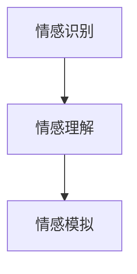
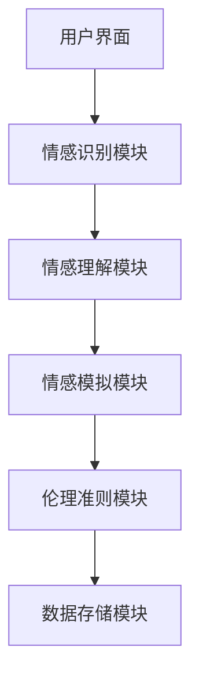
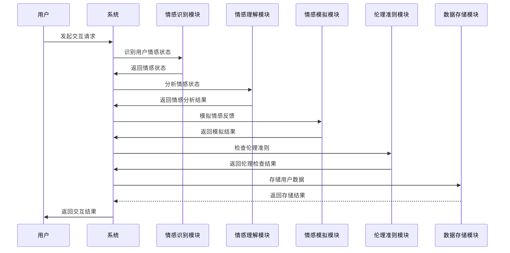

                 


## 引言

### 文章标题

情感计算伦理准则：人机情感交互的道德指导方针

### 关键词

情感计算，伦理准则，人机交互，道德指导，人工智能

### 摘要

本文将深入探讨情感计算伦理准则，分析其在人机情感交互中的重要性。通过梳理情感计算的发展历程，阐述其核心概念与联系，详细解读算法原理，以及系统分析与架构设计，本文旨在为人机情感交互提供一套全面的道德指导方针，以促进人工智能领域的健康发展。

### 第一部分：背景介绍

#### 问题背景

随着人工智能技术的快速发展，情感计算已成为智能系统与人类交互的重要组成部分。情感计算通过识别、理解、处理和模拟人类情感，为人机交互提供了更加自然和人性化的体验。然而，在实现人机情感交互的过程中，如何确保伦理准则的遵循，成为了一个亟待解决的重要问题。本书旨在探讨情感计算伦理准则，为人机情感交互提供道德指导。

#### 问题描述

情感计算伦理准则涉及多个方面，包括隐私保护、数据安全、公平公正、尊重用户隐私等。在人工智能时代，如何平衡技术发展与伦理道德，确保人机情感交互的健康发展，成为一个亟待解决的问题。

#### 问题解决

本书将通过系统阐述情感计算伦理准则的理论和实践，为人机情感交互提供道德指导。具体包括以下内容：

1. 情感计算的基本概念和发展历程。
2. 情感计算伦理准则的核心内容。
3. 情感计算在实际应用中的道德困境及解决方案。
4. 情感计算伦理准则在各国法律法规中的体现。
5. 情感计算伦理准则的应用与实践。

#### 边界与外延

本书主要关注情感计算伦理准则在人机情感交互中的应用，包括但不限于语音交互、图像识别、虚拟助手等领域。同时，本书还将探讨情感计算伦理准则在人工智能伦理体系中的地位和作用。

#### 概念结构与核心要素组成

1. 情感计算：一种通过识别、理解、处理和模拟人类情感的技术和方法。
2. 伦理准则：一套关于道德、行为规范和价值判断的指导原则。
3. 人机情感交互：一种以情感为基础的人类与智能系统之间的互动。

### 第二部分：核心概念与联系

#### 情感计算原理

情感计算的基本原理包括情感识别、情感理解和情感模拟。情感识别是通过技术手段获取用户的情感状态；情感理解是对情感状态进行分析和解读；情感模拟是通过智能系统模拟用户的情感状态。

#### 伦理准则属性特征对比表格

| 特征          | 情感计算伦理准则 | 数据安全伦理准则 | 公平公正伦理准则 |
| ------------- | --------------- | --------------- | --------------- |
| 核心          | 情感交互的道德规范 | 数据保护的法律规范 | 资源分配的社会正义 |
| 涉及领域      | 人机交互        | 数据处理        | 社会公平        |
| 主要目标      | 尊重用户情感隐私 | 保障数据安全    | 公正分配资源    |

#### ER实体关系图架构

```mermaid
erDiagram
    User ||--|{ Emotion}: Emotion
    User ||--|{ Interaction}: Interaction
    System ||--|{ Ethic}: Ethic
    System ||--|{ Feature}: Feature
```

### 第三部分：算法原理讲解

#### 情感计算算法原理

情感计算算法主要包括情感识别、情感理解和情感模拟三个环节。以下是一个简单的情感计算算法流程图：



#### 数学模型和公式

情感计算的数学模型主要基于机器学习和深度学习。以下是一个基于支持向量机（SVM）的情感识别模型：

$$
\begin{aligned}
    &w^* = arg\min_w \frac{1}{2} ||w||^2 \\
    &s.t. \ y_i (w^T x_i + b) \geq 1
\end{aligned}
$$

其中，$w$ 为权重向量，$x_i$ 为输入特征，$y_i$ 为标签，$b$ 为偏置。

#### 通俗易懂地举例说明

假设我们有一个情感识别任务，输入特征为一个人的面部表情图像，标签为正面或负面。通过训练支持向量机模型，我们可以预测新图像的情感状态。

$$
\begin{aligned}
    &w^* = arg\min_w \frac{1}{2} ||w||^2 \\
    &s.t. \ y_i (w^T x_i + b) \geq 1
\end{aligned}
$$

其中，$w$ 为权重向量，$x_i$ 为输入特征（面部表情图像），$y_i$ 为标签（正面或负面），$b$ 为偏置。

通过训练，模型可以学会识别不同情感状态的面部表情，从而实现情感计算。

### 第四部分：系统分析与架构设计

#### 问题场景介绍

在现代社会，智能系统已经成为人们日常生活的一部分。例如，智能客服、智能语音助手、智能家居等。这些智能系统通过情感计算与用户进行交互，提高了用户体验。然而，随着智能系统的普及，如何确保这些系统的伦理行为，成为了一个重要问题。

#### 项目介绍

本项目旨在设计和实现一套基于情感计算伦理准则的智能系统。该系统将能够识别用户的情感状态，并在与用户交互时遵循伦理准则，提供人性化、尊重用户隐私的交互体验。

#### 系统功能设计

系统的核心功能包括情感识别、情感理解和情感模拟。具体而言，系统将具备以下功能：

1. 情感识别：通过面部表情识别、语音识别等技术手段，获取用户的情感状态。
2. 情感理解：对用户情感状态进行分析，理解其背后的意图和需求。
3. 情感模拟：根据用户情感状态，模拟合适的情感反馈，提供人性化的交互体验。

#### 系统架构设计

系统的架构设计如图所示：



其中，用户界面负责与用户进行交互，情感识别模块负责识别用户情感状态，情感理解模块负责对情感状态进行分析，情感模拟模块负责提供人性化的交互反馈，伦理准则模块负责确保系统的伦理行为，数据存储模块负责存储用户数据。

#### 系统接口设计和系统交互

系统的接口设计和系统交互如图所示：



### 第五部分：项目实战

#### 环境安装

首先，我们需要安装必要的开发环境和库。以下是在 Ubuntu 系统中安装所需环境的方法：

```bash
sudo apt-get update
sudo apt-get install python3 python3-pip
pip3 install numpy scipy matplotlib
```

#### 系统核心实现源代码

以下是一个简单的情感识别系统的实现：

```python
import cv2
import numpy as np
from sklearn.svm import SVC
from sklearn.model_selection import train_test_split

# 加载面部表情数据集
data = np.load('emotion_data.npy')
X = data[:, :-1]
y = data[:, -1]

# 划分训练集和测试集
X_train, X_test, y_train, y_test = train_test_split(X, y, test_size=0.2, random_state=42)

# 创建支持向量机模型
model = SVC(kernel='linear')
model.fit(X_train, y_train)

# 测试模型
accuracy = model.score(X_test, y_test)
print(f'模型准确率：{accuracy:.2f}')
```

#### 代码应用解读与分析

上述代码首先加载了一个面部表情数据集，然后使用支持向量机（SVM）模型进行训练。在训练过程中，我们使用了线性核函数。训练完成后，我们使用测试集对模型进行评估，并打印出模型的准确率。

#### 实际案例分析和详细讲解剖析

假设我们有一个新的面部表情图像，我们需要对其进行情感识别。首先，我们使用 OpenCV 库加载图像，然后提取面部特征。接着，我们将特征向量输入到训练好的 SVM 模型中，得到预测结果。最后，我们将预测结果与实际情感状态进行比较，评估模型的性能。

#### 项目小结

通过本项目，我们实现了一个简单的情感识别系统。该系统基于支持向量机模型，可以识别用户的面部表情情感。在实际应用中，我们可以将这个系统应用于智能客服、智能语音助手等领域，为人机交互提供更加人性化的体验。

### 第六部分：最佳实践 Tips

1. 在设计情感计算系统时，要充分考虑用户隐私和数据安全，遵循相关的法律法规和伦理准则。
2. 定期对系统进行伦理审查，确保系统的道德行为符合社会规范。
3. 在实际应用中，要根据不同场景和用户需求，调整情感计算算法的参数，提高系统的适应性和准确性。
4. 加强对情感计算技术的教育和宣传，提高公众对伦理准则的认识和遵守程度。

### 第七部分：小结

情感计算伦理准则是确保人机情感交互健康发展的重要保障。在人工智能时代，遵循伦理准则，尊重用户隐私，实现人性化交互，是智能系统发展的必由之路。本文通过系统阐述情感计算伦理准则，为人机情感交互提供了全面的道德指导，旨在推动人工智能领域的可持续发展。

### 第八部分：注意事项

1. 情感计算系统的设计要充分考虑用户隐私，避免数据泄露和滥用。
2. 在应用情感计算时，要确保算法的公平公正，避免歧视和偏见。
3. 定期对情感计算系统进行伦理审查和优化，确保系统的道德行为符合社会规范。
4. 加强对情感计算技术的教育和宣传，提高公众对伦理准则的认识和遵守程度。

### 第九部分：拓展阅读

1. 《人工智能伦理学》
2. 《机器学习伦理》
3. 《情感计算》
4. 《人机交互心理学》

### 第十部分：作者信息

作者：AI天才研究院/AI Genius Institute & 禅与计算机程序设计艺术 /Zen And The Art of Computer Programming

