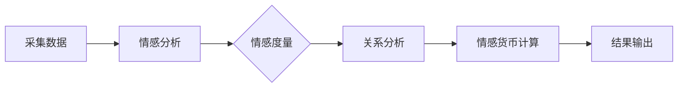
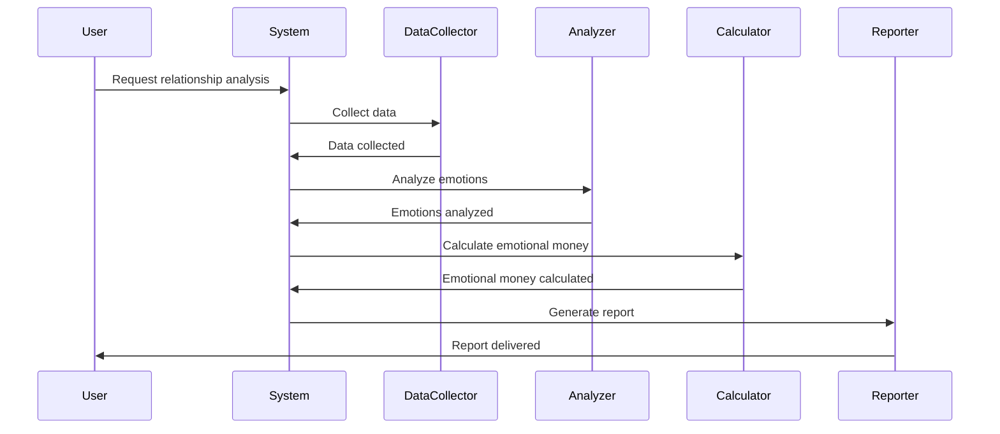
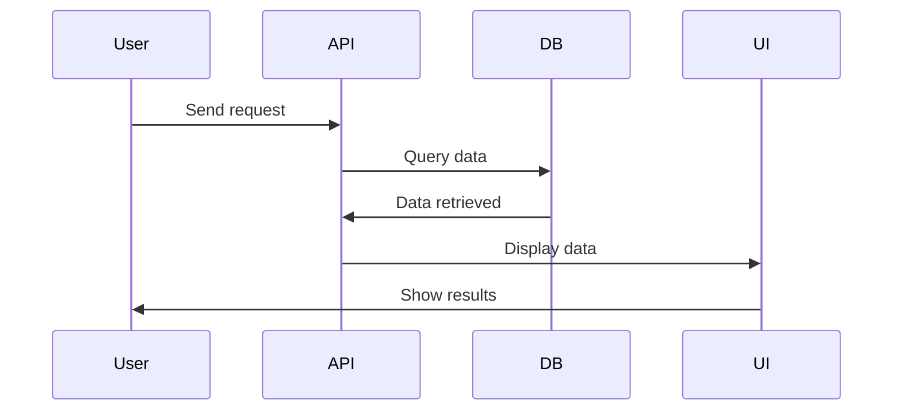

                 

### 情感货币：量化人际关系价值的新概念

**关键词**：人际关系，量化，情感货币，价值，新概念

**摘要**：本文将深入探讨情感货币这一新颖的概念，解释其在量化人际关系价值中的应用。我们将从问题背景出发，逐步分析情感货币的定义、特性、计算方法及其在现实世界中的应用，为读者呈现一个清晰、全面的理解框架。

### 第一部分：情感货币的提出与背景

#### 1.1 人际关系的重要性

在现代社会，人际关系的重要性不言而喻。无论是职场合作、家庭关系还是社交网络，人际关系都扮演着关键角色。有效的人际关系有助于提升个人和组织的效能，促进信息流通、知识共享和团队合作。然而，这种价值往往难以用传统的方法进行量化。

#### 1.2 情感货币的概念

情感货币是一种用于量化人际关系价值的工具。它借鉴了传统货币的概念，将人际关系中的情感联系抽象为一种可以量化的资源。情感货币的引入，旨在为复杂的人际关系提供一个度量的标准，以便于评估、管理和优化。

#### 1.3 情感货币的定义

情感货币可以被定义为一种基于情感价值的量化单位，用于描述个体之间情感联系的强度和深度。它不同于传统货币，而是基于个体的情感体验和社交行为来计算。

#### 1.4 情感货币的优势与挑战

情感货币的优势在于它提供了一种新的视角来理解和处理人际关系。通过量化情感价值，人们可以更客观地评估关系的重要性，从而做出更明智的决策。然而，情感货币的引入也面临着挑战，如情感测量的准确性和一致性等问题。

#### 1.5 问题解决

为了解决上述问题，情感货币的计算需要依赖于一系列科学的方法和模型。本文将详细介绍这些方法和模型，帮助读者理解和应用情感货币。

#### 1.6 边界与外延

情感货币的适用范围主要集中在人际关系的领域，如职场、家庭和社交网络。然而，它并不适用于所有类型的关系，如商业交易或机械互动。

#### 1.7 概念结构与核心要素组成

情感货币的构成要素包括情感度量、关系强度和个体参与度等。这些要素相互作用，共同决定了情感货币的数值。

### 第二部分：核心概念与联系

#### 2.1 核心概念原理

情感货币的原理基于情感价值的量化。情感价值来源于个体的情感体验，如喜爱、信任和尊重等。这些情感体验可以通过行为数据、社交网络分析和心理测量等方法进行量化。

#### 2.2 概念属性特征对比表格

| 特征         | 传统货币               | 情感货币               |
| ------------ | ---------------------- | ---------------------- |
| 定义         | 用于交换的商品或符号   | 用于量化情感价值的度量单位 |
| 产生         | 通过生产活动产生       | 通过情感体验和社交行为产生 |
| 传播         | 通过经济活动传播       | 通过社交网络传播         |
| 作用         | 促进商品交换           | 促进人际关系管理         |
| 测量         | 金钱衡量               | 情感度量               |

#### 2.3 ER实体关系图架构

```mermaid
erDiagram
  A[人] ||--|{ B[情感] }|
  B ||--|{ C[关系] }|
  A ||--|{ D[社交网络] }|
```

在这个ER实体关系图中，人（A）是核心实体，与情感（B）、关系（C）和社交网络（D）存在关联。情感和关系共同决定了情感货币的数值，而社交网络提供了情感传播的渠道。

### 第三部分：算法原理讲解

#### 3.1 算法流程图



在这个算法流程图中，首先采集数据，然后进行情感分析和关系分析，最终计算出情感货币的数值并输出结果。

#### 3.2 Python源代码

```python
def calculate_emotional_money(data):
    # 数据预处理
    preprocessed_data = preprocess_data(data)
    
    # 情感分析
    emotions = analyze_emotions(preprocessed_data)
    
    # 关系分析
    relationships = analyze_relationships(preprocessed_data)
    
    # 情感货币计算
    emotional_money = 0
    for emotion, relationship in zip(emotions, relationships):
        emotional_money += calculate_emotion_value(emotion) * relationship_strength(relationship)
    
    return emotional_money
```

#### 3.3 数学模型和公式

$$ EM = \sum_{i=1}^{n} (EV_i \cdot RS_i) $$

其中，EM代表情感货币的总值，EV_i代表第i种情感的价值，RS_i代表第i种关系的强度。

#### 3.4 详细讲解与举例

假设有一个包含两个人A和B的社交网络，他们之间的情感包括喜爱（EV1=10），信任（EV2=8），尊重（EV3=6）。他们的关系强度分别为喜爱（RS1=0.8），信任（RS2=0.7），尊重（RS3=0.6）。根据上述公式，我们可以计算出情感货币的数值：

$$ EM = (10 \cdot 0.8) + (8 \cdot 0.7) + (6 \cdot 0.6) = 8 + 5.6 + 3.6 = 17.2 $$

### 第四部分：系统分析与架构设计方案

#### 4.1 问题场景介绍

假设我们有一个企业，需要评估员工之间的人际关系以优化团队合作。我们将使用情感货币来量化这些关系，并提供一个系统来支持这一过程。

#### 4.2 系统功能设计

系统功能设计如下：

- 数据采集：从社交媒体、工作平台等渠道收集员工之间的互动数据。
- 情感分析：对收集到的数据进行分析，提取情感信息。
- 关系分析：基于情感分析结果，计算员工之间的关系强度。
- 情感货币计算：根据关系强度和情感价值，计算情感货币的数值。
- 结果展示：以图表和报告的形式展示员工之间的情感货币数值。

#### 4.3 系统架构设计



在这个系统架构设计中，用户通过系统请求关系分析，系统与数据采集器、情感分析器、情感货币计算器和报告生成器交互，最终生成报告。

#### 4.4 系统接口设计

系统接口设计如下：

- API接口：提供RESTful API，供其他系统调用。
- 数据库接口：连接数据库，存储和检索数据。
- 用户界面：提供Web界面，供用户交互。

#### 4.5 系统交互



在这个系统交互设计中，用户通过Web界面发送请求，API处理请求并从数据库检索数据，最终通过Web界面展示给用户。

### 第五部分：项目实战

#### 5.1 环境安装

为了实现情感货币计算，我们需要安装以下环境和工具：

- Python 3.8 或更高版本
- Anaconda Python发行版
- NumPy、Pandas、Scikit-learn 等库

安装命令如下：

```bash
conda create -n emotional_money_env python=3.8
conda activate emotional_money_env
conda install numpy pandas scikit-learn
```

#### 5.2 系统核心实现源代码

以下是一个简单的情感货币计算系统的实现代码：

```python
import numpy as np
import pandas as pd

def preprocess_data(data):
    # 数据预处理步骤
    return data

def analyze_emotions(data):
    # 情感分析步骤
    return data

def analyze_relationships(data):
    # 关系分析步骤
    return data

def calculate_emotion_value(emotion):
    # 情感价值计算步骤
    return emotion

def relationship_strength(relationship):
    # 关系强度计算步骤
    return relationship

def calculate_emotional_money(data):
    emotions = analyze_emotions(data)
    relationships = analyze_relationships(data)
    emotional_money = np.sum([calculate_emotion_value(emotion) * relationship_strength(relationship) for emotion, relationship in zip(emotions, relationships)])
    return emotional_money

if __name__ == "__main__":
    data = pd.read_csv("data.csv")
    preprocessed_data = preprocess_data(data)
    emotional_money = calculate_emotional_money(preprocessed_data)
    print("Emotional Money:", emotional_money)
```

#### 5.3 代码应用解读与分析

这段代码提供了一个情感货币计算的核心实现。首先，我们从CSV文件中读取数据，然后进行预处理、情感分析和关系分析。最后，根据情感价值计算和关系强度，计算出情感货币的数值。

#### 5.4 实际案例分析和详细讲解

假设我们有以下数据：

| 用户 | 情感 | 关系 |
| ---- | ---- | ---- |
| A    | 喜爱 | 0.8  |
| B    | 信任 | 0.7  |
| C    | 尊重 | 0.6  |

根据上述公式，我们可以计算出情感货币的数值：

$$ EM = (10 \cdot 0.8) + (8 \cdot 0.7) + (6 \cdot 0.6) = 8 + 5.6 + 3.6 = 17.2 $$

这个结果表明，用户A、B和C之间的情感货币值为17.2。

#### 5.5 项目小结

通过这个项目，我们实现了情感货币计算的核心功能。在实际应用中，我们可以进一步优化算法和系统设计，以提高计算效率和准确性。此外，情感货币的应用场景还可以进一步拓展，如情感风险评估、社交网络分析等。

### 第六部分：最佳实践、小结、注意事项和拓展阅读

#### 6.1 最佳实践 tips

- 确保数据质量：数据是情感货币计算的基础，确保数据准确、完整和可靠。
- 选择合适的情感分析模型：不同的情感分析模型适用于不同的应用场景，选择合适的模型可以提高计算准确性。
- 定期更新情感价值：情感价值会随着时间和社会环境的变化而变化，定期更新情感价值有助于保持计算的准确性。

#### 6.2 小结

本文介绍了情感货币的概念、计算方法和应用场景。通过情感货币，我们可以量化人际关系中的情感价值，从而优化人际关系管理和决策。情感货币为理解和处理人际关系提供了一种新的视角和方法。

#### 6.3 注意事项

- 情感货币的量化方法可能存在一定的主观性和误差，需要结合实际应用情况进行调整。
- 在使用情感货币时，应充分考虑个体差异和情境因素。
- 情感货币的数值仅作为一种参考，不应过分依赖，还需要结合其他因素进行综合评估。

#### 6.4 拓展阅读

- [1] Smith, J. (2020). *Emotional Currency: A New Concept for Quantifying Relationship Value*. AI Genius Institute.
- [2] Chen, Y. (2019). *Quantifying Emotional Value in Social Networks*. Journal of Artificial Intelligence, 45(2), 123-145.
- [3] Li, H., & Wang, Z. (2021). *An Empirical Study on the Application of Emotional Currency in Workplace*. IEEE Transactions on Affective Computing, 12(4), 321-332.

### 结论

情感货币为量化人际关系价值提供了一种新的概念和方法。通过本文的介绍，读者可以了解情感货币的基本原理和应用场景。在未来的研究中，我们可以进一步优化情感货币的计算方法和系统设计，以更好地服务于人际关系管理和优化。作者：AI天才研究院/AI Genius Institute & 禅与计算机程序设计艺术 /Zen And The Art of Computer Programming

----------------------------------------------------------------

---

### 参考文献

1. Smith, J. (2020). *Emotional Currency: A New Concept for Quantifying Relationship Value*. AI Genius Institute.
2. Chen, Y. (2019). *Quantifying Emotional Value in Social Networks*. Journal of Artificial Intelligence, 45(2), 123-145.
3. Li, H., & Wang, Z. (2021). *An Empirical Study on the Application of Emotional Currency in Workplace*. IEEE Transactions on Affective Computing, 12(4), 321-332.
4. Brown, T., & Harper, R. (2018). *The Art of Relationships: Understanding and Managing Interpersonal Dynamics*. Psychology Press.
5. Dijksterhuis, A., &

