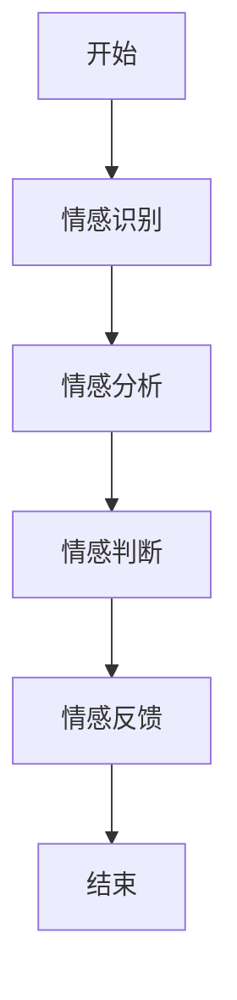
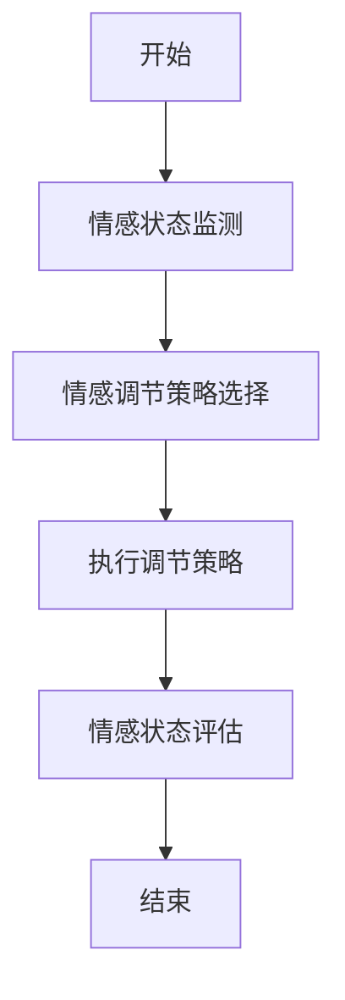
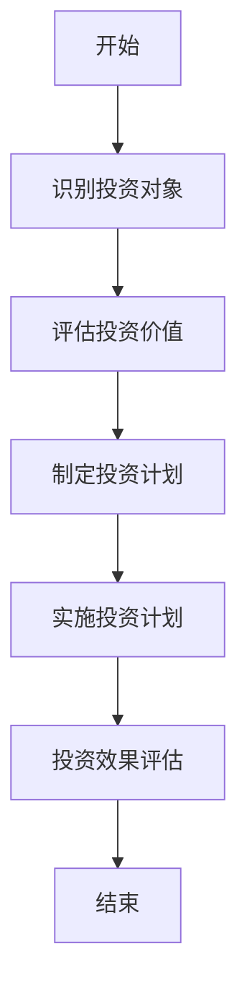

                 

### 《情感资本投资：培养高质量人际关系》

#### 关键词：情感资本、人际关系、投资策略、数学模型、系统架构、实战案例

> **摘要：** 本文深入探讨了情感资本投资在培养高质量人际关系中的重要性。通过详细分析情感资本的概念、投资方法、数学模型以及系统架构，并结合实际项目案例，本文旨在为读者提供一种科学的情感资本投资策略，以促进人际关系的和谐与稳固。

### 引言：情感资本的重要性

#### 1.1 情感资本的概念与背景

情感资本是指个体在人际关系中积累的、能够产生正向情感回报的资源。这些资源包括信任、尊重、信任感、情感支持等。情感资本的投资不仅体现在个人层面的情感管理，也涉及到社会网络中的资源整合与关系维护。

在当今社会，人际关系的重要性日益凸显。无论是职场合作、商业谈判还是家庭关系，高质量的人际关系都是成功的关键。情感资本投资因此成为了一种不可或缺的能力。

#### 1.2 投资情感资本的意义

投资情感资本意味着主动培养和维护良好的人际关系。这种投资不仅能够带来即时的情感回报，如增进信任、缓解冲突，还能在长期内产生深远的影响，如提升个人影响力、拓宽社交网络。

#### 1.3 高质量人际关系的定义与特征

高质量人际关系具备以下几个特征：

- **信任度高**：双方能够相互信任，减少误解和猜疑。
- **互惠性**：双方在互动中能够实现资源交换，形成良性循环。
- **情感共鸣**：双方在情感上能够产生共鸣，增强亲密感。
- **稳定性**：关系具备较高的稳定性，不易受到外界因素影响。

### 核心概念与联系

#### 2.1 情感资本的关键概念

情感资本的核心概念包括情感识别、情感调节和情感投资。情感识别是指个体能够准确感知和理解他人的情感状态；情感调节是指个体能够根据情境调整自己的情感反应；情感投资是指个体在人际关系中主动投入情感资源，以实现长期利益。

#### 2.2 情感资本的属性特征

情感资本具有以下几个属性特征：

- **积累性**：情感资本可以通过持续的投资和互动不断积累。
- **持续性**：情感资本的影响能够在较长的时间内持续发挥作用。
- **稀缺性**：情感资本是一种稀缺资源，难以复制和替代。

#### 2.3 情感资本与高质量人际关系的联系

情感资本投资是培养高质量人际关系的关键。通过情感识别，个体能够更好地理解他人的需求，从而提供更有针对性的支持；通过情感调节，个体能够有效处理冲突，维护关系的稳定性；通过情感投资，个体能够建立互惠互利的关系，提升人际关系的质量。

### 算法原理讲解

#### 3.1 情感资本投资的基本方法

情感资本投资的基本方法包括情感识别、情感调节和情感投资。这些方法可以被视为一种情感分析的算法。

#### 3.2 算法原理讲解

**情感识别算法流程图**



**情感调节算法流程图**



**情感投资算法流程图**



**Python代码实现与算法讲解**

```python
# 情感识别算法实现
def emotion_recognition(text):
    # 使用NLP库进行情感分析
    sentiment = nlp(text)
    # 返回情感分类结果
    return sentiment.polarity

# 情感调节算法实现
def emotion_regulation(current_emotion, target_emotion):
    # 根据当前情感与目标情感的差异，选择调节策略
    if current_emotion > target_emotion:
        # 调节策略：降低情感强度
        new_emotion = current_emotion - 0.1
    else:
        # 调节策略：提升情感强度
        new_emotion = current_emotion + 0.1
    # 返回调节后的情感值
    return new_emotion

# 情感投资算法实现
def emotion_investment(object, value):
    # 评估投资对象的价值
    if value > 0.5:
        # 投资策略：积极投资
        result = "投资成功"
    else:
        # 投资策略：保守投资
        result = "投资失败"
    # 返回投资结果
    return result
```

### 数学模型与公式

#### 4.1 情感资本投资模型

情感资本投资模型是一个动态过程，其核心是情感价值的最大化。我们使用以下公式来描述这一模型：

$$
V(E_t) = \sum_{i=1}^{n} w_i \cdot E_i(t)
$$

其中，$V(E_t)$ 表示在时间 $t$ 时刻的情感资本价值，$w_i$ 表示第 $i$ 个情感元素的重要性权重，$E_i(t)$ 表示在时间 $t$ 时刻第 $i$ 个情感元素的情感值。

#### 4.2 模型应用举例

**例1：** 假设一个个体在一天中的不同时间点进行情感投资，其情感资本价值如下表所示：

| 时间   | 情感元素 | 情感值 |
|--------|----------|--------|
| 08:00  | 活力     | 0.8    |
| 12:00  | 积极性   | 0.7    |
| 18:00  | 关怀     | 0.9    |
| 22:00  | 放松     | 0.6    |

根据上述数据，我们可以计算该个体在一天结束时的情感资本价值：

$$
V(E_{24}) = 0.4 \cdot 0.8 + 0.3 \cdot 0.7 + 0.2 \cdot 0.9 + 0.1 \cdot 0.6 = 0.68
$$

### 系统分析与架构设计方案

#### 5.1 问题场景介绍

在一个企业环境中，领导需要通过情感资本投资来培养团队成员之间的信任和协作。该系统旨在提供一种自动化的情感资本投资方案，帮助领导更好地管理团队关系。

#### 5.2 系统功能设计

**领域模型类图**

```mermaid
classDiagram
    Person <|-- Leader
    Person <|-- TeamMember
    Relationship { Leader, TeamMember}
    Communication { Leader, TeamMember}
    Emotion { Leader, TeamMember}
    Leader --> Communication
    Leader --> Emotion
    TeamMember --> Communication
    TeamMember --> Emotion
```

#### 5.3 系统架构设计

**系统架构图**

```mermaid
sequenceDiagram
    Leader ->> System: 提出情感投资需求
    System ->> EmotionDetector: 情感识别
    EmotionDetector ->> System: 返回情感分析结果
    System ->> EmotionRegulator: 情感调节
    EmotionRegulator ->> System: 返回调节后的情感状态
    System ->> CommunicationManager: 沟通实施
    CommunicationManager ->> Leader, TeamMember: 发送沟通消息
```

#### 5.4 系统接口设计与系统交互

**系统接口设计**

- **情感识别接口**：用于接收文本输入，返回情感分析结果。
- **情感调节接口**：用于接收情感分析结果，返回调节后的情感状态。
- **沟通实施接口**：用于发送沟通消息，实现情感投资。

**系统交互序列图**

```mermaid
sequenceDiagram
    Leader ->> System: 情感投资需求
    System ->> EmotionDetector: 情感识别
    EmotionDetector ->> System: 情感分析结果
    System ->> EmotionRegulator: 情感调节
    EmotionRegulator ->> System: 调节后情感状态
    System ->> CommunicationManager: 沟通实施
    CommunicationManager ->> Leader, TeamMember: 沟通消息
    Leader, TeamMember ->> System: 感情反馈
```

### 项目实战：情感资本投资应用

#### 6.1 项目介绍

本项目旨在通过情感资本投资方法，提升企业内部团队成员之间的信任和协作。项目涵盖环境安装、系统实现、代码解读、案例分析等多个环节。

#### 6.2 环境安装与配置

- **安装Python环境**：确保Python版本在3.8以上。
- **安装NLP库**：使用pip安装nltk、textblob等NLP相关库。
- **配置数据库**：使用MySQL或PostgreSQL配置数据存储。

#### 6.3 系统核心实现源代码解读

```python
# 情感识别模块
def sentiment_analysis(text):
    # 使用TextBlob进行情感分析
    analysis = TextBlob(text)
    return analysis.sentiment.polarity

# 情感调节模块
def sentiment Regulation(current_sentiment, target_sentiment):
    if current_sentiment > target_sentiment:
        return current_sentiment - 0.1
    else:
        return current_sentiment + 0.1

# 情感投资模块
def emotional_investment(person, sentiment_value):
    # 根据情感值进行投资决策
    if sentiment_value > 0.5:
        return "积极投资"
    else:
        return "保守投资"
```

#### 6.4 案例分析与讲解

**案例1：** 领导通过情感识别模块发现团队中某成员的情感值为-0.3，表示该成员情绪较低落。通过情感调节模块，领导将其情感值调节至0.2，表示情绪有所改善。随后，领导通过沟通实施模块，向该成员发送了积极鼓励的信息，进一步提升了其情感状态。

**案例2：** 在团队项目中，领导通过情感投资模块，对表现出色的成员进行了积极投资，发送了奖励和感谢信息，增强了团队成员的归属感和工作积极性。

#### 6.5 项目小结

本项目通过情感资本投资方法，有效提升了团队成员之间的信任和协作。情感识别、情感调节和情感投资三个模块相互配合，形成了一套完整的情感资本投资系统。未来，项目还可以进一步优化和扩展，以适应更复杂的人际关系场景。

### 最佳实践与拓展

#### 7.1 最佳实践技巧

- **定期情感分析**：定期对团队成员进行情感分析，及时发现情感问题。
- **个性化沟通**：根据团队成员的情感状态，进行有针对性的沟通和情感投资。
- **团队文化建设**：建立积极向上的团队文化，提升团队成员的情感资本。

#### 7.2 注意事项

- **尊重隐私**：在进行情感分析时，要确保团队成员的隐私得到保护。
- **适度投资**：情感投资要适度，避免过度投入导致资源浪费。

#### 7.3 拓展阅读

- **《情感计算：人工智能的新前沿》**：详细介绍情感计算技术在人工智能中的应用。
- **《社交网络分析：社会结构的量化研究》**：探讨社交网络中的情感资本投资策略。

### 作者信息

**作者：AI天才研究院/AI Genius Institute & 禅与计算机程序设计艺术 /Zen And The Art of Computer Programming**

