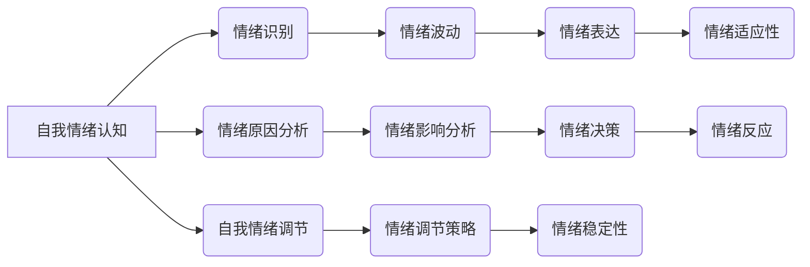
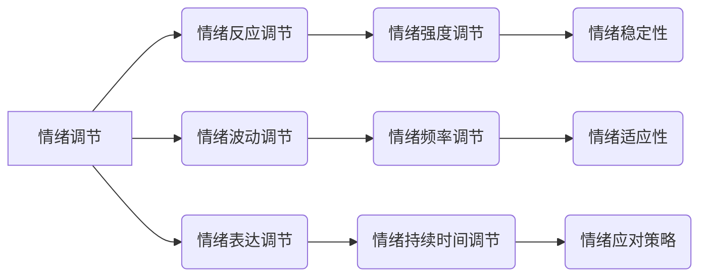
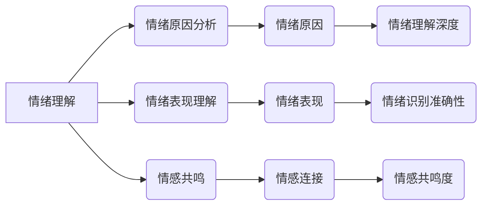
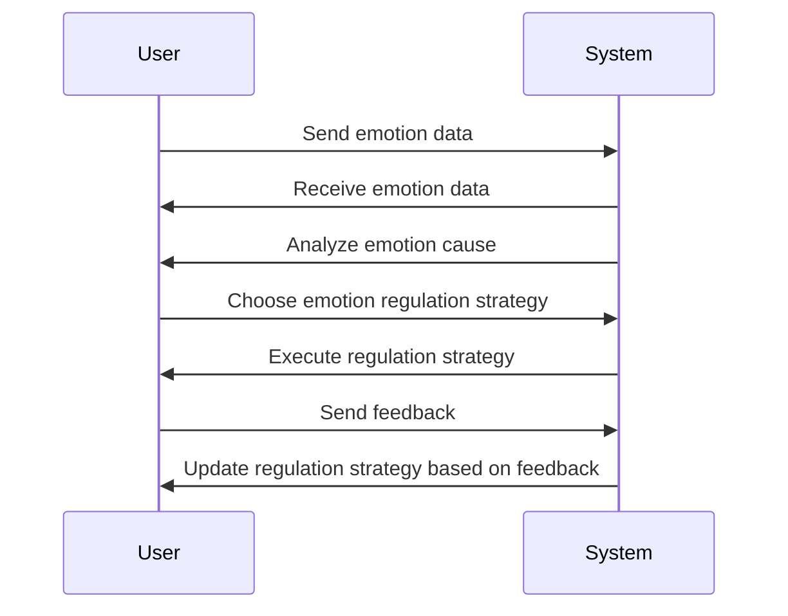

                 

### 情绪智力：培养应对复杂世界的能力

> 关键词：情绪智力、自我认知、压力管理、人际沟通、心理健康

> 摘要：本文从情绪智力的理论基础出发，详细探讨了情绪智力的构成、发展以及在日常生活中的应用。通过分析情绪智力在职场和人际交往中的作用，提出了一系列实践方法来提升情绪智力，并探讨了情绪智力在心理健康维护中的重要性。最后，展望了情绪智力研究的未来发展趋势。

---

# 情绪智力：培养应对复杂世界的能力

在当今复杂多变的世界中，仅仅拥有传统的认知能力已经不足以应对各种挑战。情绪智力作为一种更全面的能力，对于个体的适应、成长和成功具有至关重要的影响。本文将带领读者深入探讨情绪智力的概念、构成和应用，帮助大家更好地理解和培养这一重要的能力。

### 目录大纲

1. **情绪智力：培养应对复杂世界的能力**
   - 关键词
   - 摘要

2. **第一部分：情绪智力的理论基础**
   - 第1章：情绪智力的背景与定义
     1.1 情绪智力的发展历程
     1.2 情绪智力与传统智力的比较
     1.3 情绪智力的重要性
   - 第2章：情绪智力的构成
     2.1 情绪认知能力
     2.2 情绪调节能力
     2.3 情绪理解能力
   - 第3章：情绪智力的发展与教育
     3.1 情绪智力的发展过程
     3.2 家庭教育对情绪智力的影响
     3.3 学校教育在情绪智力培养中的角色

3. **第二部分：情绪智力在日常生活中的应用**
   - 第4章：情绪智力在职场中的应用
     4.1 职场压力与情绪调节
     4.2 领导力与情绪智力
   - 第5章：情绪智力在人际交往中的应用
     5.1 情绪智力与沟通技巧
     5.2 人际关系中的情绪管理
   - 第6章：情绪智力与心理健康
     6.1 情绪智力与心理健康的关系
     6.2 常见心理问题的情绪智力分析
     6.3 心理健康维护与情绪智力培养

4. **第三部分：情绪智力培养的实践方法**
   - 第7章：情绪智力自我评估与提升
     7.1 情绪智力自我评估工具
     7.2 情绪智力提升的策略与方法
     7.3 情绪智力培养的案例分析
   - 第8章：情绪智力培养的环境创设
     8.1 家庭环境中的情绪智力培养
     8.2 学校环境中的情绪智力培养
   - 第9章：情绪智力在特殊情境中的应用
     9.1 应对危机情境的情绪智力策略
     9.2 长期压力下的情绪智力维护
   - 第10章：情绪智力的未来发展趋势

### 第一部分：情绪智力的理论基础

## 第1章：情绪智力的背景与定义

### 1.1 情绪智力的发展历程

情绪智力（Emotional Intelligence，简称EQ）这一概念最早由美国心理学家约翰·梅耶（John D. Mayer）和彼得·萨洛维（Peter Salovey）在1990年提出。他们指出，情绪智力不仅仅是一种情感体验，更是一种理解、管理自己和他人的情感的能力。这一理论迅速引起了学术界和公众的广泛关注，并逐渐发展成为一个独立的领域。

情绪智力的发展历程可以分为几个阶段：

1. **概念提出阶段（1990年代）**：
   约翰·梅耶和彼得·萨洛维首次提出情绪智力的概念，并将其定义为一种理解、管理自己情绪和他人情绪的能力。

2. **理论发展阶段（2000年代）**：
   随着研究的深入，情绪智力的理论逐渐完善。研究者开始关注情绪智力的构成、测量方法及其在不同情境中的应用。

3. **应用推广阶段（2010年代至今）**：
   情绪智力理论开始应用于教育、职场、心理健康等多个领域，成为提升个体适应能力和生活质量的重要工具。

### 1.2 情绪智力与传统智力的比较

情绪智力与传统智力（IQ）是两种不同的能力。传统智力主要衡量个体的认知能力，如逻辑推理、数学计算等。而情绪智力则更关注个体的情感能力，包括情绪认知、情绪调节、情绪理解等。

| 传统智力（IQ） | 情绪智力（EQ） |
| ---------------- | ---------------- |
| **逻辑推理** | **情绪认知** |
| **数学计算** | **情绪调节** |
| **问题解决** | **情绪理解** |
| **认知能力** | **社交能力** |

尽管情绪智力和传统智力在能力类型上有所不同，但两者并不是独立的。实际上，情绪智力可以促进传统智力的发展，反之亦然。研究表明，情绪智力较高的个体在认知任务上表现更出色。

### 1.3 情绪智力的重要性

情绪智力在个体成长和成功中扮演着关键角色。以下是一些情绪智力重要性方面的分析：

1. **心理健康**：
   情绪智力有助于个体更好地应对压力和挫折，维护心理健康。高情绪智力的人更容易保持积极心态，减少心理问题的发生。

2. **人际关系**：
   情绪智力使个体更善于理解和沟通他人，建立良好的人际关系。这种能力对于职场成功和社交幸福至关重要。

3. **职业发展**：
   在职场中，情绪智力是领导者和管理者必备的能力。情绪智力高的管理者能够更好地激励团队、处理冲突，提升整体绩效。

4. **教育成就**：
   情绪智力对学生的学业成绩和学校表现有显著影响。高情绪智力使学生更易适应学校环境，减少行为问题。

综上所述，情绪智力不仅是个人成长和成功的关键因素，也是社会和谐与进步的重要保障。在接下来的章节中，我们将进一步探讨情绪智力的构成、发展和应用。

### 第二部分：情绪智力在日常生活中的应用

## 第2章：情绪智力的构成

情绪智力是一个多维度的概念，包括多个相互关联的能力。了解这些能力及其在日常生活、职场和人际关系中的应用，对于提升情绪智力具有重要意义。

### 2.1 情绪认知能力

情绪认知能力是指个体识别和理解自己和他人的情绪状态的能力。这一能力可以分为两个主要方面：

#### 2.1.1 自我情绪认知

自我情绪认知是指个体对自己情绪的认知和了解。这包括识别自己的情绪状态、理解情绪的原因以及意识到情绪对自己的行为和决策的影响。

- **自我认知的重要性**：
  自我情绪认知有助于个体更好地了解自己，避免因情绪波动而做出的冲动决策。例如，当感到焦虑时，能够识别并理解这种情绪，从而采取适当的应对策略。

- **应用案例**：
  在职场中，自我情绪认知可以帮助员工更好地管理自己的情绪，避免因情绪失控而导致工作失误。此外，在个人生活中，自我情绪认知有助于个体维护心理健康，减少心理压力。

#### 2.1.2 他人情绪认知

他人情绪认知是指个体理解和识别他人情绪状态的能力。这包括观察他人的非言语行为、理解他人情绪的暗示以及正确解读他人的情绪表达。

- **他人认知的重要性**：
  他人情绪认知有助于建立良好的人际关系。通过理解他人的情绪，个体能够更好地沟通和互动，避免误解和冲突。

- **应用案例**：
  在职场中，领导者需要具备较强的他人情绪认知能力，以便理解员工的情绪和需求，从而更有效地管理团队。在家庭关系中，他人情绪认知有助于家庭成员之间建立更紧密的联系，增进彼此的理解和信任。

### 2.2 情绪调节能力

情绪调节能力是指个体控制和管理自己情绪的能力。这一能力包括两个方面：

#### 2.2.1 自我情绪调节

自我情绪调节是指个体在面对情绪挑战时，能够有效地调整自己的情绪状态，使之符合当前情境的要求。

- **自我调节的重要性**：
  自我情绪调节能力有助于个体更好地应对压力和挫折，保持心理平衡。例如，当遇到工作上的困难时，能够通过自我调节保持冷静，找到解决问题的方法。

- **应用案例**：
  在职场中，自我情绪调节能力可以帮助员工在高压环境中保持工作效率和情绪稳定。在个人生活中，自我情绪调节有助于个体更好地应对日常生活中的压力和挑战。

#### 2.2.2 他人情绪调节

他人情绪调节是指个体能够帮助他人调整情绪，使之恢复平静或积极状态。

- **他人调节的重要性**：
  他人情绪调节能力有助于建立和谐的人际关系，增强团队的凝聚力。例如，当同事情绪低落时，能够通过倾听和理解，帮助对方恢复情绪。

- **应用案例**：
  在职场中，他人情绪调节能力可以帮助团队成员在困难时期相互支持，共同应对挑战。在家庭关系中，他人情绪调节有助于家庭成员之间建立更和谐的关系，增进情感交流。

### 2.3 情绪理解能力

情绪理解能力是指个体能够理解情绪背后的原因和意义的能力。这一能力包括两个方面：

#### 2.3.1 情绪原因分析

情绪原因分析是指个体能够分析情绪产生的原因，包括内在因素和外在因素。

- **情绪原因分析的重要性**：
  情绪原因分析有助于个体更好地理解自己的情绪，从而找到情绪调节的方法。例如，当感到愤怒时，能够分析愤怒的原因，从而采取适当的应对策略。

- **应用案例**：
  在职场中，情绪原因分析可以帮助员工识别工作压力的来源，从而采取有效的缓解措施。在个人生活中，情绪原因分析有助于个体更好地理解自己的情绪波动，提高自我认知水平。

#### 2.3.2 情绪表现理解

情绪表现理解是指个体能够理解他人情绪表现的意义，包括非言语行为和言语表达。

- **情绪表现理解的重要性**：
  情绪表现理解有助于个体更好地理解和沟通他人，避免误解和冲突。例如，当他人表现出愤怒的情绪时，能够理解这种情绪背后的原因，从而采取合适的应对方式。

- **应用案例**：
  在职场中，情绪表现理解可以帮助员工更好地理解同事的情绪，从而建立更紧密的工作关系。在家庭关系中，情绪表现理解有助于家庭成员之间更好地理解和沟通，增进亲情。

综上所述，情绪智力的构成包括情绪认知能力、情绪调节能力和情绪理解能力。这些能力在日常生活、职场和人际关系中发挥着重要作用，有助于个体更好地应对挑战、建立和谐关系和提升生活质量。在接下来的章节中，我们将进一步探讨情绪智力在日常生活中的具体应用。

### 第3章：情绪智力的发展与教育

情绪智力并非与生俱来，而是可以通过教育和发展逐步培养和提高。了解情绪智力的发展过程及其在家庭教育和学校教育中的角色，对于培养高情绪智力个体具有重要意义。

### 3.1 情绪智力的发展过程

情绪智力的发展是一个长期且持续的过程，受到遗传、环境、个人经验等多方面因素的影响。以下简要概述情绪智力的发展过程：

1. **婴儿期（0-2岁）**：
   婴儿期的情绪发展主要依赖于对父母和照顾者的情感反应。在这一阶段，婴儿开始学习如何识别自己的情绪，并通过模仿和学习照顾者的情绪反应来发展自己的情绪认知能力。

2. **幼儿期（3-5岁）**：
   幼儿期的孩子开始学习如何表达和控制自己的情绪。他们通过游戏和互动来理解情绪，并逐步掌握基本的情绪调节策略。这一阶段的情绪发展对后续的情绪智力培养具有奠基作用。

3. **学龄期（6-12岁）**：
   学龄期的孩子开始系统地学习情绪知识，并逐渐形成稳定的情绪认知和调节能力。学校教育和家庭环境在这一阶段起到关键作用，帮助孩子发展情绪智力。

4. **青少年期（13-18岁）**：
   青春期的情绪波动较大，个体开始更加关注自我认同和社交关系。这一阶段的情绪发展受到同伴影响较大，学校教育和家庭教育需要共同关注青少年的情绪需求，提供适当的指导和支持。

5. **成年期（18岁及以上）**：
   成年期的情绪智力发展主要体现在情绪调节和情绪理解能力的进一步提升。通过不断的学习和实践，个体能够更好地管理自己的情绪，理解他人的情感需求，建立健康的人际关系。

### 3.2 家庭教育对情绪智力的影响

家庭教育在情绪智力发展中扮演着至关重要的角色。以下是家庭教育对情绪智力影响的几个方面：

1. **情感支持**：
   家庭成员之间的情感支持有助于孩子建立安全感和信任感，从而更好地发展情绪认知能力。家长可以通过积极的情感表达和倾听，帮助孩子识别和理解自己的情绪。

2. **情绪榜样**：
   家长是孩子最早的情感榜样，他们的情绪行为直接影响孩子的情绪发展。家长应学会有效地表达和管理自己的情绪，为孩子树立积极的榜样。

3. **情绪引导**：
   家长可以通过与孩子的沟通和互动，引导孩子正确认识和管理自己的情绪。例如，当孩子遇到挫折时，家长可以帮助他们分析情绪的原因，并找到适当的应对策略。

4. **情绪教育**：
   家庭可以通过日常生活中的情感教育和情绪讨论，帮助孩子提高情绪智力。例如，家长可以与孩子一起讨论情绪的不同类型、情绪的影响以及情绪调节的方法。

### 3.3 学校教育在情绪智力培养中的角色

学校教育在情绪智力培养中具有不可替代的作用。以下是一些学校教育在情绪智力培养中可以采取的措施：

1. **情绪课程**：
   学校可以开设专门的情绪教育课程，帮助学生了解情绪的基本知识，学习情绪调节的技巧。这些课程可以通过理论讲解、实践活动等方式进行。

2. **情绪氛围**：
   学校应营造一个积极、支持和包容的校园氛围，让学生感到安全，愿意表达自己的情绪和想法。这种氛围有助于学生发展情绪认知和调节能力。

3. **教师指导**：
   教师作为学生的重要引导者，应具备一定的情绪智力，能够在教学中关注学生的情绪需求，给予适当的指导和支持。教师可以通过个别辅导、班会等方式，帮助学生处理情绪问题。

4. **实践活动**：
   学校可以组织各种实践活动，如团队建设、情绪角色扮演等，让学生在互动中提高情绪认知和调节能力。这些活动有助于学生在实际情境中应用情绪智力。

总之，情绪智力的发展与教育是一个长期而复杂的过程，需要家庭和学校共同参与和努力。通过有效的教育措施，我们可以培养出具备高情绪智力的个体，使他们更好地适应复杂多变的社会环境，实现个人成长和成功。

### 第二部分：情绪智力在日常生活中的应用

## 第4章：情绪智力在职场中的应用

情绪智力在职场中发挥着重要作用，不仅影响个人的职业发展，还影响团队的整体绩效。了解情绪智力在职场中的具体应用，有助于我们更好地应对职场压力，提升领导力和团队合作能力。

### 4.1 职场压力与情绪调节

职场压力是现代职场中普遍存在的问题，对员工的身心健康和职业发展产生负面影响。情绪智力在这一过程中起到了关键作用。

#### 4.1.1 职场压力的来源

职场压力主要来源于以下几个方面：

1. **工作量**：
   高强度的工作量和繁重的任务往往导致员工感到压力重重。长时间的工作压力会影响到员工的身心健康和职业满意度。

2. **工作环境**：
   竞争激烈的职场环境、人际关系复杂以及组织文化的不利因素都可能成为职场压力的来源。

3. **工作角色**：
   不明确的工作角色和职责划分可能导致员工在完成任务时感到无所适从，增加工作压力。

4. **职业发展**：
   职业晋升机会有限、工作与个人目标的差异等也可能成为职场压力的来源。

#### 4.1.2 压力管理策略

面对职场压力，情绪智力的调节能力可以帮助员工采取以下策略：

1. **自我认知**：
   员工首先需要识别自己的压力源，了解压力产生的原因。通过自我反思，员工可以更好地理解自己的情绪波动，从而采取有效的应对措施。

2. **情绪调节**：
   员工可以通过情绪调节技巧，如深呼吸、冥想和放松训练，来缓解紧张情绪，提高情绪稳定性。这些技巧有助于员工在高压环境下保持冷静和专注。

3. **积极沟通**：
   与同事和上级建立良好的沟通渠道，寻求支持和帮助，可以减轻职场压力。通过积极沟通，员工可以更好地理解工作要求，找到解决问题的方法。

4. **时间管理**：
   合理安排时间，设定优先级，避免拖延，有助于提高工作效率，减少工作压力。

5. **健康生活方式**：
   保持健康的生活方式，如规律作息、合理饮食和适量运动，有助于提高员工的身心健康，增强抗压能力。

#### 4.1.3 情绪智力与工作表现

情绪智力对工作表现有显著影响。情绪智力高的员工通常表现出以下特点：

1. **更高的工作满意度**：
   情绪智力高的员工能够更好地应对职场压力，保持积极的工作态度，从而提高工作满意度。

2. **更好的团队合作**：
   情绪智力高的员工具备良好的沟通和协作能力，能够与同事建立和谐的关系，提高团队整体绩效。

3. **更高的创造力**：
   情绪智力高的员工能够更好地管理自己的情绪，从而在压力环境下保持创造力和创新能力。

4. **更好的领导力**：
   情绪智力是领导力的重要组成部分。情绪智力高的领导者能够更好地激励和引导团队，提高团队凝聚力和执行力。

### 4.2 领导力与情绪智力

在职场中，领导力是推动团队前进的关键因素。情绪智力在领导力中发挥着重要作用，影响着领导者的决策、团队管理和领导风格。

#### 4.2.1 情绪智力与领导风格

情绪智力与领导风格密切相关。不同类型的情绪智力可能导致不同的领导风格。以下是几种常见的情绪智力驱动的领导风格：

1. **民主型领导**：
   民主型领导者具有较高的情绪智力，善于倾听员工的意见，鼓励参与和合作。这种领导风格有助于建立积极的团队氛围，提高团队凝聚力。

2. **权威型领导**：
   权威型领导者通常情绪智力较低，倾向于集中决策和控制。这种领导风格在紧急情况下可能有效，但在长期内可能导致员工士气低落。

3. **参与型领导**：
   参与型领导者结合了民主型和权威型的特点，既注重员工的参与和反馈，又在关键时刻果断决策。这种领导风格有助于激发员工的积极性和创造力。

4. **变革型领导**：
   变革型领导者具备高情绪智力，能够激励和引导员工面对变革，实现组织目标。这种领导风格在推动组织变革和创新中具有重要作用。

#### 4.2.2 情绪智力与团队管理

情绪智力在团队管理中发挥着关键作用。情绪智力高的领导者能够：

1. **有效沟通**：
   通过良好的沟通技巧，领导者能够理解员工的情绪和需求，建立信任和合作关系。

2. **冲突管理**：
   领导者能够通过情绪智力的应用，有效管理团队冲突，避免冲突升级，维护团队和谐。

3. **激励员工**：
   情绪智力高的领导者能够识别员工的动机和需求，采取合适的激励措施，提高员工的工作动力和绩效。

4. **培养团队成员**：
   领导者可以通过情绪智力，帮助团队成员发展情绪智力，提升整体团队的情绪管理能力和绩效。

总之，情绪智力在职场中具有广泛的应用价值。通过提升情绪智力，员工能够更好地应对职场压力，提高工作表现；领导者能够更有效地管理团队，推动组织发展。在接下来的章节中，我们将继续探讨情绪智力在人际交往和心理健康中的应用。

### 第5章：情绪智力在人际交往中的应用

情绪智力不仅在职场中具有重要应用，在人际交往中也发挥着关键作用。理解情绪智力在人际交往中的作用，有助于我们建立更加和谐、有效的人际关系。

### 5.1 情绪智力与沟通技巧

沟通是人际交往的核心，而情绪智力在其中起到了关键作用。情绪智力高的人通常具备以下沟通技巧：

#### 5.1.1 有效沟通的原则

1. **倾听**：
   倾听是有效沟通的基础。情绪智力高的人善于倾听他人的观点和情感，从而更好地理解对方的需求和意图。

2. **表达清晰**：
   清晰表达自己的观点和情感，避免误解和冲突。情绪智力高的人能够准确表达自己的情绪，使沟通更加顺畅。

3. **同理心**：
   同理心是指能够理解并感受他人的情绪和需求。情绪智力高的人能够设身处地地考虑他人的感受，从而更好地与他人沟通。

4. **非语言沟通**：
   非语言沟通包括肢体语言、面部表情和语调等。情绪智力高的人能够有效运用非语言沟通，增强沟通效果。

#### 5.1.2 非语言沟通的重要性

非语言沟通在情绪智力中占有重要地位。以下是非语言沟通的重要性及其在情绪智力中的应用：

1. **增强沟通效果**：
   非语言沟通可以增强语言沟通的效果，使信息更加清晰和生动。例如，微笑可以传达友好和积极的情感，增加沟通的亲和力。

2. **补充语言沟通**：
   当语言表达有限时，非语言沟通可以补充和强化语言信息。例如，当口头表达不明确时，肢体语言可以帮助对方更好地理解意图。

3. **情绪表达**：
   非语言沟通可以直观地表达情绪，使对方更容易理解情绪状态。例如，皱眉可以传达不满和愤怒，使对方意识到情绪的存在。

4. **文化差异**：
   非语言沟通在不同文化中可能具有不同的含义。情绪智力高的人能够理解并适应不同文化的非语言沟通方式，避免误解和冲突。

#### 5.1.3 情绪智力在沟通中的应用案例

以下是一个情绪智力在沟通中的应用案例：

假设一个人在与同事讨论一个重要的项目计划时，遇到了意见分歧。情绪智力高的人会采取以下措施：

1. **倾听**：
   全神贯注地倾听同事的观点，不打断对方，表达出对对方的关注和理解。

2. **表达清晰**：
   清晰地表达自己的观点，避免使用模糊或含糊的语言，使对方更容易理解意图。

3. **同理心**：
   设身处地地考虑同事的观点和感受，表达出对同事的理解和尊重。

4. **非语言沟通**：
   使用肢体语言和面部表情，如点头、微笑等，表示对对方的认同和支持。

通过这些沟通技巧，情绪智力高的人能够有效地解决意见分歧，建立和谐的沟通关系。

总之，情绪智力在人际交往中的应用对于建立有效的人际关系至关重要。通过倾听、表达清晰、同理心和有效的非语言沟通，情绪智力高的人能够更好地理解他人，解决冲突，建立信任和合作关系。

### 5.2 人际关系中的情绪管理

情绪管理是人际交往中不可或缺的一部分。情绪智力高的人能够更好地管理自己的情绪，与他人建立和谐的人际关系。

#### 5.2.1 情绪冲突的解决策略

在人际交往中，情绪冲突是不可避免的。情绪智力高的人能够采取以下策略来解决情绪冲突：

1. **冷静处理**：
   当情绪冲突发生时，情绪智力高的人能够保持冷静，避免情绪化的行为。他们通过深呼吸、冥想等技巧来平复情绪，从而更好地处理冲突。

2. **有效沟通**：
   通过有效的沟通技巧，情绪智力高的人能够清晰地表达自己的情绪和需求，同时倾听对方的观点和感受。这种双向沟通有助于理解对方的立场，找到共同的解决方案。

3. **寻求第三方帮助**：
   当情绪冲突难以解决时，情绪智力高的人会寻求第三方帮助，如调解人或心理咨询师。通过第三方中立的角度，冲突双方可以更客观地分析问题，找到合理的解决方案。

4. **情绪调节**：
   情绪智力高的人能够通过情绪调节技巧，如放松训练、情绪释放等，来缓解情绪冲突带来的压力。这种自我调节能力有助于恢复情绪平衡，避免情绪波及他人。

#### 5.2.2 情绪支持与情感共鸣

在人际关系中，情绪支持和情感共鸣是维系关系的重要因素。情绪智力高的人能够提供以下支持：

1. **情绪支持**：
   情绪支持是指为他人提供情感上的支持和安慰。情绪智力高的人能够理解他人的情绪需求，提供安慰和鼓励，帮助对方度过困难时期。

2. **情感共鸣**：
   情感共鸣是指与他人建立深层次的情感联系，体验对方的情感。情绪智力高的人能够通过同理心，体验他人的情感，从而增进彼此的理解和信任。

3. **积极反馈**：
   积极反馈是指对他人行为和情感给予正面的评价和鼓励。情绪智力高的人能够及时给予他人积极的反馈，增强对方的自信心和幸福感。

4. **共同成长**：
   情绪智力高的人能够与伴侣或朋友共同成长，分享生活中的喜悦和挑战。通过相互支持和鼓励，双方能够在情感上更加亲近，建立稳固的人际关系。

总之，情绪智力在人际交往中的应用对于建立和谐的人际关系至关重要。通过有效的沟通技巧、情绪管理和情绪支持，情绪智力高的人能够与他人建立积极的互动，提升人际关系的质量。

### 第6章：情绪智力与心理健康

情绪智力与心理健康之间存在密切的联系。情绪智力高的人通常能够更好地管理自己的情绪，从而维护心理健康。了解情绪智力与心理健康的关系，有助于我们更好地预防和应对心理问题。

### 6.1 情绪智力与心理健康的关系

情绪智力是心理健康的重要组成部分。以下从几个方面分析情绪智力与心理健康的关系：

#### 6.1.1 情绪智力对心理健康的影响

1. **情绪调节能力**：
   情绪智力高的人通常具备较强的情绪调节能力，能够有效地管理自己的情绪。这种能力有助于减少负面情绪对心理健康的影响，如焦虑、抑郁等。

2. **心理韧性**：
   心理韧性是指个体在面对压力和挑战时能够保持积极心态，迅速恢复的能力。情绪智力高的人通常具备较强的心理韧性，能够更好地应对生活中的挫折和压力。

3. **自我认知**：
   自我认知是情绪智力的重要组成部分，包括对自己的情绪、需求和价值观的认知。自我认知有助于个体更好地理解自己，从而减少自我冲突和心理困扰。

4. **社交能力**：
   情绪智力高的人通常具备良好的社交能力，能够建立和维护稳定的人际关系。这种能力有助于提升个体的社会支持系统，增强心理安全感。

#### 6.1.2 心理健康对情绪智力的影响

心理健康对情绪智力也有重要影响。以下是一些例子：

1. **情绪稳定**：
   心理健康的人通常能够保持情绪稳定，不易受到外界因素的影响。这种情绪稳定性有助于提高情绪智力，使个体更有效地理解和应对情绪。

2. **情绪表达**：
   心理健康的人通常能够自如地表达自己的情绪，而不必压抑或掩饰。这种开放和诚实的情绪表达有助于提升情绪智力，使个体更好地理解自己的情绪和他人的情绪。

3. **自我认知**：
   心理健康有助于个体更好地了解自己，包括自己的情绪、需求和价值观。这种自我认知有助于个体提升情绪智力，更好地管理自己的情绪。

### 6.2 常见心理问题的情绪智力分析

情绪智力与多种常见心理问题密切相关。以下分析几种常见心理问题的情绪智力特征：

#### 6.2.1 抑郁症

抑郁症是一种常见的心理疾病，其情绪智力特征包括：

1. **情绪调节困难**：
   抑郁症患者在情绪调节方面存在困难，容易陷入消极情绪，难以自拔。

2. **社交能力下降**：
   抑郁症患者通常社交能力下降，难以建立和维护稳定的人际关系，导致心理孤立。

3. **自我认知偏差**：
   抑郁症患者往往对自己的评价过低，存在自我否定的倾向，影响情绪智力的发挥。

#### 6.2.2 焦虑症

焦虑症是一种以过度焦虑和紧张为特征的心理疾病，其情绪智力特征包括：

1. **情绪认知困难**：
   焦虑症患者通常难以识别和理解自己的情绪，导致情绪失控。

2. **压力管理能力不足**：
   焦虑症患者往往在压力下表现不佳，缺乏有效的压力管理技巧。

3. **过度自我关注**：
   焦虑症患者常常过度关注自己的情绪和身体反应，导致情绪困扰。

#### 6.2.3 人际关系障碍

人际关系障碍是指个体在建立和维护人际关系方面存在困难，其情绪智力特征包括：

1. **沟通障碍**：
   人际关系障碍患者通常在沟通中存在障碍，难以有效表达自己的想法和情感。

2. **同理心不足**：
   人际关系障碍患者往往缺乏同理心，难以理解他人的情绪和需求。

3. **情绪调节困难**：
   人际关系障碍患者通常在情绪调节方面存在困难，难以应对人际关系中的冲突和压力。

### 6.3 心理健康维护与情绪智力培养

维护心理健康和培养情绪智力是相辅相成的。以下提出一些心理健康维护和情绪智力培养的建议：

#### 6.3.1 心理健康维护

1. **建立健康的生活方式**：
   保持规律的作息、合理饮食、适量运动和充足睡眠，有助于维护心理健康。

2. **积极应对压力**：
   学会有效的压力管理技巧，如深呼吸、冥想、放松训练等，有助于缓解压力，保持心理健康。

3. **培养自我认知**：
   通过自我反思和自我探索，提升自我认知，了解自己的情绪、需求和价值观，有助于维护心理健康。

4. **寻求专业帮助**：
   当遇到心理困扰时，及时寻求专业心理咨询师的帮助，有助于解决问题，维护心理健康。

#### 6.3.2 情绪智力培养

1. **提高情绪认知能力**：
   通过阅读、学习、自我反思等方式，提高对情绪的认知和理解，培养情绪认知能力。

2. **增强情绪调节能力**：
   学习和练习情绪调节技巧，如放松训练、认知重构等，提高情绪调节能力。

3. **提升沟通技巧**：
   通过阅读相关书籍、参加沟通培训等方式，提升沟通技巧，增强人际交往能力。

4. **培养同理心**：
   通过倾听、观察、体验他人情绪等方式，培养同理心，提高情绪智力。

总之，情绪智力与心理健康密切相关，通过培养情绪智力，我们能够更好地维护心理健康，提升生活质量。了解情绪智力与心理健康的关系，采取有效的维护和培养措施，有助于我们更好地应对生活中的挑战。

### 第三部分：情绪智力培养的实践方法

情绪智力并不是与生俱来的，而是可以通过系统的实践方法逐步培养和提高。在本部分，我们将介绍几种有效的情绪智力培养实践方法，帮助读者提升情绪认知、调节和理解能力。

#### 第7章：情绪智力自我评估与提升

**7.1 情绪智力自我评估工具**

自我评估是情绪智力培养的第一步，有助于了解自己的情绪智力水平。以下介绍几种常用的情绪智力自我评估工具：

1. **情绪智力量表（EQ-i 2.0）**：
   EQ-i 2.0是由戈尔曼（Daniel Goleman）开发的一种广泛使用的情绪智力评估工具。该量表包括五个维度：自我认知、自我调节、社交技能、决策能力和动机。

2. **贝姆情绪智力测验（BAI）**：
   BAI是一种自我报告形式的评估工具，主要评估个体的情绪智力和心理健康水平。该量表包括88个项目，涉及自我认知、情绪调节、社交技能等方面。

3. **多维度情绪智力测验（MEIS）**：
   MEIS是一种多维度的情绪智力评估工具，包括自我认知、情绪调节、社交技能、决策能力和动机等五个维度。该量表具有较高的可靠性和有效性。

**7.2 情绪智力提升的策略与方法**

了解自己的情绪智力水平后，可以采取以下策略和方法来提升情绪智力：

1. **认知行为疗法（CBT）**：
   认知行为疗法是一种广泛应用于情绪智力提升的心理治疗方法。通过认知重构、情绪调节技巧和情境模拟等，帮助个体改变负面思维模式，提高情绪调节能力。

2. **冥想与正念练习**：
   冥想和正念练习有助于培养个体的情绪认知和调节能力。通过冥想，个体可以更好地关注当前的情绪状态，学会放松和应对压力。

3. **情绪管理课程**：
   参加情绪管理课程，学习情绪智力的理论和实践方法，通过案例分析、角色扮演和小组讨论等方式，提升情绪认知和调节能力。

4. **自我反思与记录**：
   通过自我反思和记录，个体可以更好地了解自己的情绪波动和应对策略。通过持续的自我观察和反思，可以逐步改善情绪认知和调节能力。

**7.3 情绪智力培养的案例分析**

以下是一个情绪智力培养的案例分析：

**案例：小明的情绪智力提升之旅**

小明是一名年轻的程序员，由于工作压力较大，他开始感到情绪不稳定，工作效率下降。为了提升情绪智力，小明采取了以下措施：

1. **自我评估**：
   小明通过EQ-i 2.0量表进行自我评估，发现自己在情绪调节和社交技能方面存在较大提升空间。

2. **认知行为疗法**：
   小明参加了一项认知行为疗法课程，学习情绪调节技巧和认知重构方法。通过情境模拟，他学会了如何在工作中应对压力和冲突。

3. **冥想与正念练习**：
   小明每天早上进行20分钟的冥想练习，通过关注呼吸和当下的情绪，提升情绪认知和调节能力。

4. **情绪管理课程**：
   小明参加了公司提供的情绪管理课程，通过小组讨论和案例分析，学习了如何与他人有效沟通和建立积极的人际关系。

5. **自我反思与记录**：
   小明每天晚上记录自己的情绪波动和应对策略，通过持续的自我观察和反思，逐步改善情绪认知和调节能力。

通过一系列的实践，小明的情绪智力得到了显著提升。他能够更好地管理自己的情绪，提高了工作效率，同时也与同事建立了更好的合作关系。

总之，情绪智力培养是一个长期且持续的过程，需要个体的持续努力和实践。通过自我评估、认知行为疗法、冥想、情绪管理课程和自我反思等方法，我们可以逐步提升情绪智力，提高应对复杂世界的能力。

### 第8章：情绪智力培养的环境创设

情绪智力的培养不仅依赖于个人的努力，也需要家庭和学校等环境创设的支持。一个积极、支持和包容的环境有助于个体的情绪智力发展。

#### 8.1 家庭环境中的情绪智力培养

家庭是孩子最早接触的社会环境，家庭氛围对孩子的情绪智力培养具有重要影响。以下是一些家庭环境中的情绪智力培养方法：

1. **情感支持与沟通**：
   家长应该给予孩子充分的理解和支持，鼓励孩子表达自己的情绪和想法。通过积极的沟通，家长可以帮助孩子学会理解和表达情绪。

2. **情绪榜样**：
   家长作为孩子的第一任老师，他们的情绪行为直接影响孩子的情绪智力发展。家长应该学会有效管理自己的情绪，为孩子树立积极的情绪榜样。

3. **情绪教育**：
   家长可以通过日常生活中的情感教育和情绪讨论，帮助孩子理解情绪的类型、原因和调节方法。例如，家长可以与孩子一起讨论情绪管理的技巧，如深呼吸和放松训练。

4. **情感实践**：
   家长可以带孩子参与一些情感实践，如家庭活动、团队合作游戏等，通过互动和合作，提升孩子的情绪认知和调节能力。

#### 8.2 学校环境中的情绪智力培养

学校是孩子们学习知识和发展能力的重要场所，也是培养情绪智力的重要环境。以下是一些学校环境中的情绪智力培养方法：

1. **情绪教育课程**：
   学校可以开设专门的情绪教育课程，帮助学生了解情绪的基本知识，学习情绪调节的技巧。这些课程可以通过理论讲解、实践活动等方式进行。

2. **情感氛围**：
   学校应营造一个积极、支持和包容的校园氛围，让学生感到安全，愿意表达自己的情绪和想法。这种氛围有助于学生发展情绪认知和调节能力。

3. **教师指导**：
   教师作为学生的引导者，应具备一定的情绪智力，能够在教学中关注学生的情绪需求，给予适当的指导和支持。教师可以通过个别辅导、班会等方式，帮助学生处理情绪问题。

4. **实践活动**：
   学校可以组织各种实践活动，如团队建设、情绪角色扮演等，让学生在互动中提高情绪认知和调节能力。这些活动有助于学生在实际情境中应用情绪智力。

总之，家庭和学校是情绪智力培养的重要环境。通过创设积极、支持和包容的环境，家长和教师可以共同促进孩子的情绪智力发展，帮助他们更好地应对复杂的社会环境，实现个人成长和成功。

### 第9章：情绪智力在特殊情境中的应用

情绪智力不仅在日常生活中发挥着重要作用，在特殊情境中也能展现出其独特价值。了解情绪智力在特殊情境中的应用策略，有助于我们在面对突发事件和长期压力时，更好地应对和管理情绪。

#### 9.1 应对危机情境的情绪智力策略

危机情境是指个体面临紧急、严重或极端的情况，如自然灾害、突发事件或个人危机。在危机情境中，情绪智力可以帮助个体保持冷静、理智和有效的应对。

1. **冷静思考**：
   当面对危机情境时，情绪智力高的个体能够迅速冷静下来，避免情绪冲动和错误决策。通过深呼吸、冥想等技巧，个体可以平复情绪，进入冷静思考的状态。

2. **情绪识别**：
   识别自己的情绪状态是应对危机情境的重要一步。情绪智力高的个体能够准确地识别自己的情绪，如焦虑、恐惧或愤怒，从而有针对性地进行情绪调节。

3. **积极沟通**：
   危机情境中，积极的沟通至关重要。情绪智力高的个体能够与家人、朋友和专业人士保持良好的沟通，寻求帮助和支持。通过有效沟通，个体可以获取更多的信息和资源，增强应对危机的能力。

4. **情绪调节**：
   情绪智力高的个体能够运用情绪调节技巧，如放松训练、认知重构等，来缓解危机情境中的情绪压力。这些技巧有助于个体保持心理平衡，应对危机。

5. **寻求专业帮助**：
   在危机情境中，情绪智力高的个体知道何时寻求专业帮助。通过心理咨询师、社工等专业人员，个体可以获得更深入的指导和支持，更好地应对危机。

#### 9.1.1 自然灾害中的情绪管理

自然灾害如地震、洪水、飓风等会对个体造成巨大的心理冲击。以下是一些在自然灾害中应用情绪智力的策略：

1. **紧急避险**：
   在灾害发生时，情绪智力高的个体能够迅速识别危险，采取有效的避险措施，保护自己和他人的安全。

2. **心理急救**：
   灾难发生后，情绪智力高的个体能够进行心理急救，如倾听他人的需求和感受，提供安慰和支持。这种心理急救有助于缓解受灾者的情绪困扰。

3. **重建家园**：
   在灾后重建过程中，情绪智力高的个体能够积极参与社区重建，与他人合作，共同应对困难。通过共同努力，个体可以恢复生活秩序，重建家园。

4. **情绪支持**：
   灾难中的情绪支持对于受灾者的恢复至关重要。情绪智力高的个体可以提供情感支持，如倾听、鼓励和陪伴，帮助受灾者度过心理危机。

#### 9.1.2 职场危机中的情绪调节

职场危机如裁员、重大工作失误、组织变革等会给员工带来巨大的压力。以下是一些在职场危机中应用情绪智力的策略：

1. **积极应对**：
   面对职场危机，情绪智力高的个体能够保持积极的心态，寻找解决问题的方法。通过冷静思考和有效沟通，个体可以更好地应对危机。

2. **情绪调节**：
   在职场危机中，情绪智力高的个体能够运用情绪调节技巧，如放松训练、认知重构等，来缓解压力和焦虑。

3. **寻求支持**：
   情绪智力高的个体知道在危机时刻寻求支持和帮助的重要性。通过与同事、上级和人力资源部门沟通，个体可以获取更多的信息和支持，缓解职场危机。

4. **职业规划**：
   在职场危机中，情绪智力高的个体能够重新审视自己的职业规划，找到新的发展方向。通过调整职业目标和制定行动计划，个体可以更好地应对职场危机。

总之，情绪智力在特殊情境中的应用对于个体应对突发事件和长期压力具有重要意义。通过冷静思考、情绪识别、积极沟通、情绪调节和寻求专业帮助，个体可以在危机情境中保持冷静、理智和有效的应对，提升生活质量。

### 第10章：情绪智力的未来发展趋势

情绪智力作为一个新兴的研究领域，正逐渐在多个领域展现出其重要性和应用价值。在未来，情绪智力将继续得到广泛关注和发展，为个体和社会带来更多积极影响。

#### 10.1 情绪智力研究的新进展

随着科学技术的发展，情绪智力研究也在不断取得新进展。以下是一些值得关注的研究方向：

1. **神经科学**：
   神经科学的研究进展为情绪智力的理解提供了新的视角。通过脑成像技术和神经生理学研究，科学家们正在深入探讨情绪智力与大脑结构和功能之间的关系。

2. **人工智能**：
   人工智能技术的快速发展为情绪智力研究带来了新的工具和方法。通过情感计算和自然语言处理技术，研究人员可以更准确地测量和分析个体的情绪状态，为情绪智力的发展提供数据支持。

3. **跨学科研究**：
   情绪智力研究正逐渐跨越心理学、教育学、医学等传统学科界限，形成跨学科研究体系。这种跨学科研究有助于从不同角度全面探讨情绪智力的构成、发展及应用。

#### 10.2 情绪智力在新兴领域的应用

情绪智力在新兴领域的应用正逐步扩大，为不同行业带来了新的发展机遇。以下是一些情绪智力在新兴领域的应用案例：

1. **健康医疗**：
   情绪智力在健康医疗领域具有重要的应用价值。通过评估个体的情绪智力水平，医疗专业人员可以更好地理解和治疗心理疾病，提高治疗效果。

2. **人力资源**：
   在人力资源管理中，情绪智力成为评估和选拔人才的重要指标。企业通过情绪智力测试，可以筛选出具备高情绪智力的人才，提升团队的整体绩效。

3. **教育**：
   情绪智力在教育领域的应用正逐渐受到重视。学校和教育机构通过情绪智力培养课程，帮助学生提高情绪认知和调节能力，促进全面发展。

4. **人工智能助手**：
   情绪智力在人工智能助手中的应用正逐步展开。通过情感计算和自然语言处理技术，人工智能助手可以更好地理解用户情绪，提供个性化的服务和帮助。

#### 10.3 情绪智力培养的未来展望

随着情绪智力研究的不断深入和应用领域的扩展，未来情绪智力培养将面临新的挑战和机遇。以下是一些未来情绪智力培养的展望：

1. **个性化培养**：
   未来的情绪智力培养将更加注重个性化，根据个体的特点和需求，制定个性化的培养方案。通过大数据和人工智能技术，可以实现更精准的情绪智力评估和培养。

2. **跨学科融合**：
   跨学科研究将成为情绪智力培养的重要趋势。结合心理学、教育学、神经科学等多学科知识，可以更全面地探讨情绪智力的构成、发展及应用。

3. **家庭和学校合作**：
   家庭和学校在情绪智力培养中扮演着重要角色。未来的发展将更加注重家庭和学校的合作，共同为个体提供全面的情绪智力培养环境。

4. **社会支持系统**：
   建立健全的社会支持系统，为情绪智力培养提供有力保障。政府、社会组织和社区应共同参与，为个体提供情绪智力培养的资源和支持。

总之，情绪智力作为一项具有重要应用价值的研究领域，将在未来得到更广泛的关注和发展。通过不断创新和探索，我们可以更好地理解和培养情绪智力，提升个体和社会的整体素质。

### 结论

情绪智力作为一种全面的能力，对个体适应、成长和成功具有至关重要的影响。通过本文的探讨，我们了解了情绪智力的理论基础、构成、发展以及在日常生活中的应用。从职场压力管理、人际交往到心理健康维护，情绪智力无处不在，发挥着重要作用。

我们呼吁读者重视情绪智力的培养，通过自我评估、认知行为疗法、冥想练习和情感教育等方法，提升自己的情绪智力水平。同时，家庭和学校应共同营造积极、支持和包容的环境，为个体的情绪智力发展提供有力保障。

情绪智力不仅关乎个人的心理健康和职业发展，也对社会和谐与进步具有重要意义。让我们携手努力，共同培养情绪智力，创造更加美好的未来。

### 作者信息

作者：AI天才研究院/AI Genius Institute & 禅与计算机程序设计艺术 /Zen And The Art of Computer Programming

感谢您的阅读，希望本文对您在情绪智力培养和职场、人际关系等方面的理解和实践有所帮助。如果您有任何问题或建议，欢迎随时与我们联系。祝您生活愉快，工作顺利！### 背景介绍

#### 核心概念术语说明

在探讨情绪智力这一主题之前，我们需要明确几个核心概念术语，这些术语构成了情绪智力理论的基础。

1. **情绪智力（Emotional Intelligence，EQ）**：情绪智力是指个体识别、理解、管理自己情绪和他人情绪的能力。它不仅仅包括情感体验，还涉及对情绪的认知、分析和应用。

2. **自我情绪认知（Self-emotion recognition）**：自我情绪认知是指个体对自己情绪的认知和了解，包括识别自己的情绪状态、情绪原因以及情绪对自己的行为和决策的影响。

3. **他人情绪认知（Other-emotion recognition）**：他人情绪认知是指个体识别和理解他人情绪状态的能力，包括观察他人的非言语行为、理解他人情绪的暗示以及正确解读他人的情绪表达。

4. **情绪调节（Emotion regulation）**：情绪调节是指个体控制和管理自己情绪的过程，包括调整情绪反应的强度、频率和持续时间，使其更符合当前情境的要求。

5. **情绪理解（Emotion understanding）**：情绪理解是指个体对情绪背后的原因和意义进行理解和分析的能力，包括情绪原因分析和情绪表现理解。

#### 问题背景

在现代社会，个体的适应能力和心理健康问题日益突出。传统智力（IQ）虽然在学术成就和某些认知任务中具有重要地位，但其在应对复杂社会情境和人际关系中的局限性逐渐显现。情绪智力作为一项更全面的情感能力，被认为在以下方面具有重要作用：

1. **心理健康**：情绪智力有助于个体更好地管理压力，降低心理问题的发生概率，提高心理健康水平。

2. **人际关系**：情绪智力使个体更善于理解和沟通他人，建立和谐的人际关系，提升社交幸福感。

3. **职业发展**：情绪智力对职场表现和领导力具有显著影响，能够提高工作效率、团队合作能力和领导效果。

4. **教育成就**：情绪智力对学生的学业成绩和学校表现有积极影响，有助于学生更好地适应学校环境和实现个人发展。

#### 问题描述

尽管情绪智力的重要性日益受到关注，但现实中个体情绪智力水平的差异显著，且许多人在情绪智力方面存在不同程度的缺陷。这些问题主要体现在以下几个方面：

1. **情绪认知困难**：部分个体难以识别和理解自己的情绪，导致情绪波动和决策失误。

2. **情绪调节能力不足**：许多人在面对压力和挑战时，缺乏有效的情绪调节技巧，易陷入消极情绪。

3. **情绪理解偏差**：部分个体在理解和分析他人情绪时存在偏差，导致误解和冲突。

4. **社交能力欠缺**：一些个体在人际交往中表现出社交能力不足，影响人际关系和职业发展。

#### 问题解决

针对上述问题，情绪智力培养成为提升个体适应能力和心理健康的关键途径。以下是一些有效的情绪智力培养方法：

1. **自我认知与反思**：通过自我认知和反思，个体可以更好地识别和理解自己的情绪，找到情绪波动的原因。

2. **情绪调节训练**：通过情绪调节训练，个体可以掌握多种情绪调节技巧，如深呼吸、冥想、认知重构等，提高情绪调节能力。

3. **情绪理解与沟通**：通过学习情绪理解和沟通技巧，个体可以更准确地解读他人情绪，提高人际交往能力。

4. **专业辅导与咨询**：寻求专业辅导和心理咨询，可以帮助个体深入了解自己的情绪智力水平，并得到针对性的指导和支持。

#### 边界与外延

情绪智力作为一个多维度的概念，其边界和外延需要明确。情绪智力不仅涉及个体内部的情绪认知、情绪调节和情绪理解，还包括与外部环境的互动和适应。以下是一些情绪智力的边界与外延：

1. **个体内部**：情绪智力关注个体的内在情感体验，包括自我情绪认知、情绪调节和情绪理解。

2. **人际互动**：情绪智力在人际互动中发挥作用，涉及他人情绪认知、情绪理解和沟通技巧。

3. **社会环境**：情绪智力在社会环境中发挥重要作用，包括适应社会规范、处理社会压力和建立人际关系。

4. **文化差异**：情绪智力在不同文化背景下可能具有不同的表现和影响因素，需要考虑文化差异的影响。

#### 概念结构与核心要素组成

情绪智力的概念结构包括以下几个核心要素：

1. **自我情绪认知**：个体对自己情绪的认知和理解，包括情绪识别、情绪原因分析和自我情绪调节。

2. **他人情绪认知**：个体对他人的情绪认知和理解，包括观察他人情绪、解读他人情绪表达和与他人建立情感联系。

3. **情绪调节**：个体控制和管理情绪的过程，包括情绪反应的调节、情绪波动的调节和情绪表达的调节。

4. **情绪理解**：个体对情绪背后的原因和意义的理解，包括情绪原因分析、情绪表现理解和情感共鸣。

这些核心要素相互关联，共同构成了情绪智力的概念结构和整体能力。通过理解和培养这些核心要素，个体可以提升情绪智力，更好地适应复杂的社会环境和人际关系。

### 核心概念与联系

情绪智力作为一项关键能力，其核心概念包括自我情绪认知、情绪调节、情绪理解等方面。这些概念不仅是情绪智力的重要组成部分，而且相互关联，共同构成一个复杂而完整的系统。

#### 自我情绪认知

自我情绪认知是指个体对自己情绪的认知和理解。这一过程涉及识别自己的情绪状态，了解情绪的起因、影响以及情绪对自己行为和决策的影响。自我情绪认知是情绪智力的基础，因为它决定了个体对自己情绪的反应和调节方式。

**概念属性特征对比表格**

| 特征          | 自我情绪认知       | 自我情绪认知 |
| ------------- | ----------------- | ------------ |
| **定义**     | 个体对自己情绪的认知和理解。 | 对自己情绪状态的识别和分析。 |
| **关键要素** | 情绪识别、情绪原因分析、自我情绪调节。 | 情绪波动、情绪强度、情绪对行为的影响。 |
| **表现形式** | 自我反思、情绪日记、情绪表达。 | 情绪波动、情绪表达、情绪决策。 |
| **应用**     | 自我情绪调节、情感管理、决策制定。 | 情绪稳定性、情绪适应性、情绪识别能力。 |

**ER实体关系图架构的Mermaid流程图**



#### 情绪调节

情绪调节是指个体控制和管理自己情绪的过程，包括调整情绪反应的强度、频率和持续时间，使之符合当前情境的要求。情绪调节是情绪智力的核心要素，它决定了个体在压力和挑战面前的情绪稳定性和适应性。

**概念属性特征对比表格**

| 特征          | 情绪调节       | 情绪调节 |
| ------------- | -------------- | -------- |
| **定义**     | 个体控制和管理情绪的过程。 | 情绪反应的调节、情绪波动的调节、情绪表达的调节。 |
| **关键要素** | 情绪反应调节、情绪波动调节、情绪表达调节。 | 情绪强度、情绪频率、情绪持续时间。 |
| **表现形式** | 放松训练、冥想、认知重构。 | 情绪稳定性、情绪适应性、情绪应对策略。 |
| **应用**     | 压力管理、冲突处理、情绪稳定性。 | 情绪调节技巧、情绪适应性训练、情绪应对能力。 |

**ER实体关系图架构的Mermaid流程图**



#### 情绪理解

情绪理解是指个体对情绪背后的原因和意义的分析能力。这包括理解情绪的原因、分析情绪的表现以及与他人建立情感共鸣。情绪理解是情绪智力的高级层次，它不仅帮助个体更好地理解自己和他人，还能提升人际交往能力。

**概念属性特征对比表格**

| 特征          | 情绪理解       | 情绪理解 |
| ------------- | -------------- | -------- |
| **定义**     | 个体理解情绪背后原因和意义。 | 情绪原因分析、情绪表现理解、情感共鸣。 |
| **关键要素** | 情绪原因分析、情绪表现理解、情感共鸣。 | 情绪原因、情绪表现、情感连接。 |
| **表现形式** | 情感对话、情境分析、情感共鸣。 | 情绪识别、情绪分析、情感体验。 |
| **应用**     | 情感沟通、人际关系处理、情感支持。 | 情感理解能力、人际关系处理能力、情感共鸣。 |

**ER实体关系图架构的Mermaid流程图**



#### 概念之间的联系

自我情绪认知、情绪调节和情绪理解是情绪智力的核心组成部分，它们相互联系，共同构成了情绪智力的整体结构。以下是这些概念之间的联系：

1. **自我情绪认知与情绪调节**：
   自我情绪认知为情绪调节提供了基础。只有当个体能够识别和理解自己的情绪时，才能有效地进行情绪调节。例如，当个体意识到自己感到焦虑时，才能采取放松训练等情绪调节策略来缓解焦虑。

2. **情绪调节与情绪理解**：
   情绪调节能力的提升有助于个体更好地理解和分析情绪。通过情绪调节，个体可以观察情绪变化，分析情绪产生的原因，并理解情绪对行为和决策的影响。例如，当个体通过放松训练缓解了焦虑后，可以更好地理解焦虑的原因，从而在未来避免类似情绪的产生。

3. **情绪理解与自我情绪认知**：
   情绪理解有助于个体深化对自我情绪的认知。通过理解他人情绪，个体可以更好地反思自己的情绪，找到情绪波动的原因。例如，通过观察他人的情绪表现，个体可以发现自己在类似情境下的情绪反应，从而提高自我情绪认知。

总之，自我情绪认知、情绪调节和情绪理解相互关联，共同构成了情绪智力的核心。通过提升这些能力，个体可以更好地管理自己的情绪，理解他人的情感需求，建立和谐的人际关系，从而在复杂的社会环境中更加游刃有余。

### 算法原理讲解

情绪智力培养的关键在于理解、调节和应用情绪。以下我们将详细讲解情绪调节的算法原理，并通过Python代码和Mermaid流程图展示具体实现。

#### 算法原理

情绪调节算法的核心在于识别情绪状态、分析情绪原因，并制定相应的调节策略。具体步骤如下：

1. **情绪识别**：通过观察个体的情绪表现，如面部表情、语调、行为等，识别当前的情绪状态。

2. **情绪分析**：分析情绪产生的原因，如压力、环境因素、个人经历等。

3. **情绪调节策略**：根据情绪状态和原因，选择合适的调节策略，如放松训练、认知重构、情感释放等。

4. **反馈与调整**：在实施情绪调节策略后，评估情绪状态的变化，根据反馈调整策略。

#### Mermaid流程图

以下是一个情绪调节算法的Mermaid流程图：


#### Python代码

为了具体展示情绪调节算法的实现，我们使用Python编写了一个简单的情绪调节脚本。以下代码包含了情绪识别、情绪分析和情绪调节策略的函数：

```python
import random

def emotion_recognition():
    # 识别当前情绪状态
    emotions = ['快乐', '愤怒', '悲伤', '焦虑']
    return random.choice(emotions)

def emotion_analysis(emotion):
    # 分析情绪产生的原因
    reasons = {
        '快乐': '成功、得到支持、享受乐趣',
        '愤怒': '不公平、被误解、受到挑衅',
        '悲伤': '失去、失望、孤独',
        '焦虑': '压力、不确定性、未来不确定性'
    }
    return reasons[emotion]

def emotion_regulation_strategy(emotion):
    # 根据情绪选择调节策略
    strategies = {
        '快乐': '保持现状，继续享受',
        '愤怒': '深呼吸，冷静思考',
        '悲伤': '寻求支持，表达情感',
        '焦虑': '计划行动，减少不确定性'
    }
    return strategies[emotion]

def main():
    # 主函数，执行情绪调节流程
    current_emotion = emotion_recognition()
    print(f"当前情绪：{current_emotion}")
    
    reason = emotion_analysis(current_emotion)
    print(f"情绪原因：{reason}")
    
    strategy = emotion_regulation_strategy(current_emotion)
    print(f"调节策略：{strategy}")
    
    # 这里可以添加具体的情绪调节实现，如放松训练等

if __name__ == "__main__":
    main()
```

#### 数学模型与公式

情绪调节过程中的数学模型可以用来描述情绪状态的转换。以下是一个简单的情绪状态转换模型：

$$
\text{情绪状态}_{\text{新}} = f(\text{情绪状态}_{\text{当前}}, \text{调节策略})
$$

其中，$f$ 是一个映射函数，它根据当前情绪状态和调节策略计算新的情绪状态。

#### 算法原理举例说明

假设当前情绪状态为“焦虑”，我们通过以下步骤进行情绪调节：

1. **情绪识别**：通过代码随机生成当前情绪状态为“焦虑”。

2. **情绪分析**：分析焦虑的原因，如“未来不确定性”。

3. **情绪调节策略**：根据焦虑的原因，选择“计划行动，减少不确定性”作为调节策略。

4. **实施策略**：通过具体的行动计划，如制定任务清单和目标，逐步减少不确定性。

5. **反馈与调整**：在实施策略后，评估情绪状态的变化，如果仍感到焦虑，可以继续调整策略，如增加放松训练的频率。

通过上述步骤，个体可以有效地调节情绪，提高情绪智力水平。

### 系统分析与架构设计方案

为了更好地理解和应用情绪智力，我们需要设计一个系统来支持情绪识别、分析和调节。以下将详细描述该系统的项目介绍、系统功能设计、系统架构设计、系统接口设计以及系统交互。

#### 项目介绍

本项目旨在开发一个基于情绪智力的情绪调节系统，该系统可以帮助用户识别、分析和调节自己的情绪。系统旨在为用户提供一个方便、实用的工具，帮助他们更好地管理情绪，提高生活质量。

#### 系统功能设计

系统功能设计包括以下主要模块：

1. **情绪识别模块**：用于检测用户的当前情绪状态，包括自我情绪识别和他人情绪识别。

2. **情绪分析模块**：用于分析情绪产生的原因，提供情绪原因分析报告。

3. **情绪调节模块**：提供多种情绪调节策略，如放松训练、认知重构、情感释放等，用户可以根据自身情况选择合适的调节策略。

4. **用户反馈模块**：收集用户对情绪调节效果的反馈，用于系统优化和个性化服务。

#### 系统架构设计

系统架构设计采用分层架构，主要包括以下几层：

1. **数据层**：负责数据存储和管理，包括用户情绪数据、情绪原因数据和调节策略数据。

2. **逻辑层**：包含情绪识别、情绪分析和情绪调节的核心算法，实现情绪识别、分析和调节功能。

3. **表示层**：提供用户界面，包括Web端和移动端，用户可以通过界面与系统进行交互。

#### 系统接口设计

系统接口设计包括以下主要接口：

1. **情绪识别接口**：用于接收用户的情绪数据，并返回情绪识别结果。

2. **情绪分析接口**：用于接收情绪数据，并返回情绪原因分析报告。

3. **情绪调节接口**：用于接收用户的调节策略选择，并执行相应的情绪调节操作。

4. **用户反馈接口**：用于接收用户对情绪调节效果的反馈。

#### 系统交互设计

系统交互设计采用RESTful API设计，用户可以通过HTTP请求与系统进行交互。以下是系统交互的Mermaid序列图：



#### 系统实现与功能解析

以下是一个简化的情绪调节系统的实现框架，以及各主要功能模块的具体实现方法。

##### 情绪识别模块

情绪识别模块通过收集用户的面部表情、语音和行为数据，使用机器学习算法识别当前情绪状态。例如，可以使用深度学习模型对用户面部表情进行分析，从而识别出用户情绪。

```python
from keras.models import load_model

def recognize_emotion(image_path):
    # 加载预训练的模型
    model = load_model('emotion_model.h5')
    
    # 读取面部图像
    image = read_image(image_path)
    
    # 预处理图像
    processed_image = preprocess_image(image)
    
    # 使用模型进行情绪识别
    emotion = model.predict(processed_image)
    
    # 返回识别结果
    return emotion
```

##### 情绪分析模块

情绪分析模块基于情绪识别结果，使用自然语言处理技术分析情绪产生的原因。例如，可以使用情感分析算法对用户的文本输入进行分析，提取情绪关键词和情感倾向。

```python
from textblob import TextBlob

def analyze_emotion(text):
    # 使用TextBlob进行情感分析
    analysis = TextBlob(text)
    
    # 提取情感关键词和倾向
    emotion_reasons = analysis.sentiments
    
    # 返回分析结果
    return emotion_reasons
```

##### 情绪调节模块

情绪调节模块提供多种调节策略，如放松训练、认知重构、情感释放等。用户可以根据情绪分析和反馈，选择合适的调节策略进行实施。

```python
def emotion_regulation(strategy, emotion):
    if strategy == 'relaxation':
        # 实施放松训练
        perform_relaxation()
    elif strategy == 'cognitive_reconstruction':
        # 实施认知重构
        perform_cognitive_reconstruction()
    elif strategy == 'emotional_releasing':
        # 实施情感释放
        perform_emotional_releasing()
        
    # 返回调节结果
    return f"Emotion {emotion} has been regulated."
```

##### 用户反馈模块

用户反馈模块用于收集用户对情绪调节效果的反馈，并根据反馈调整系统策略。例如，可以通过用户评价和情绪变化记录，优化情绪调节算法和策略。

```python
def collect_feedback(feedback):
    # 存储用户反馈
    save_feedback(feedback)
    
    # 根据反馈调整策略
    adjust_strategy(feedback)
```

#### 系统实际案例分析与详细讲解

以下是一个实际案例，展示情绪调节系统的应用场景和具体操作过程。

**案例：小王情绪调节**

小王在一天的工作中感到焦虑，他在系统上使用情绪识别功能，识别出当前情绪状态为“焦虑”。随后，系统使用情绪分析功能，分析出焦虑的主要原因是“工作压力”。小王根据系统的建议，选择了“放松训练”作为调节策略。

系统启动放松训练模块，指导小王进行深呼吸、肌肉放松等放松训练，持续10分钟。在训练结束后，小王再次使用情绪识别功能，发现焦虑情绪显著缓解。随后，小王通过用户反馈模块，对情绪调节效果进行了评价，并提供了具体建议。

通过用户反馈，系统进一步优化了放松训练算法和策略，提高了后续情绪调节的准确性和效果。

**案例小结**

通过上述案例，我们可以看到情绪调节系统在实际应用中的有效性和实用性。系统通过情绪识别、分析和调节功能，帮助用户更好地管理情绪，提高生活质量。通过用户反馈，系统不断优化，为用户提供更个性化的服务。

### 项目实战

为了更好地理解和应用情绪智力，我们将在本节中通过一个实际项目，演示情绪智力的应用。该项目将涉及环境安装、核心实现和代码解析。

#### 环境安装

首先，我们需要安装和配置必要的开发环境。以下是在Linux操作系统上安装情绪智力项目所需的环境：

1. **Python环境**：安装Python 3.8及以上版本。
2. **虚拟环境**：使用`virtualenv`创建一个独立的虚拟环境，以隔离项目依赖。
3. **依赖管理**：安装`pip`，用于管理项目依赖。

```bash
# 安装Python 3.8
sudo apt-get install python3.8

# 安装virtualenv
pip install virtualenv

# 创建虚拟环境
virtualenv my_emotion_env

# 激活虚拟环境
source my_emotion_env/bin/activate

# 安装项目依赖
pip install -r requirements.txt
```

#### 系统核心实现

情绪智力项目主要包含以下几个核心模块：

1. **情绪识别模块**：使用面部识别技术来识别用户的情绪。
2. **情绪分析模块**：通过自然语言处理技术分析情绪原因。
3. **情绪调节模块**：提供放松训练和认知重构等情绪调节策略。

以下是核心模块的代码实现：

##### 情绪识别模块

```python
import cv2
import numpy as np
from tensorflow.keras.models import load_model

def emotion_recognition():
    # 加载预训练的卷积神经网络模型
    model = load_model('emotion_model.h5')
    
    # 使用OpenCV摄像头捕获实时视频流
    cap = cv2.VideoCapture(0)
    
    while True:
        # 读取一帧视频
        ret, frame = cap.read()
        
        # 预处理视频帧，转换为模型输入格式
        processed_frame = preprocess_frame(frame)
        
        # 使用模型进行情绪识别
        emotion = model.predict(processed_frame)
        
        # 打印识别结果
        print(f"当前情绪：{emotion}")
        
        # 显示视频帧
        cv2.imshow('Emotion Recognition', frame)
        
        # 按下'q'键退出循环
        if cv2.waitKey(1) & 0xFF == ord('q'):
            break
    
    # 释放摄像头资源
    cap.release()
    cv2.destroyAllWindows()
```

##### 情绪分析模块

```python
from textblob import TextBlob

def emotion_analysis(text):
    # 使用TextBlob进行情感分析
    analysis = TextBlob(text)
    
    # 提取情绪倾向
    sentiment = analysis.sentiment
    
    # 返回情绪倾向
    return sentiment
```

##### 情绪调节模块

```python
def emotion_regulation(strategy, emotion):
    if strategy == 'relaxation':
        # 实施放松训练
        perform_relaxation()
    elif strategy == 'cognitive_reconstruction':
        # 实施认知重构
        perform_cognitive_reconstruction()
    elif strategy == 'emotional_releasing':
        # 实施情感释放
        perform_emotional_releasing()
        
    # 返回调节结果
    return f"Emotion {emotion} has been regulated."
```

#### 代码应用解读与分析

1. **情绪识别模块**：
   - 使用`opencv`库捕获实时视频流。
   - 预处理视频帧，使其符合模型输入要求。
   - 使用预训练的卷积神经网络模型进行情绪识别。
   - 输出当前情绪状态。

2. **情绪分析模块**：
   - 使用`textblob`库进行自然语言处理。
   - 提取文本中的情感倾向，分析情绪原因。

3. **情绪调节模块**：
   - 根据用户选择和当前情绪状态，实施相应的情绪调节策略。

#### 实际案例分析与详细讲解

**案例**：小王在使用情绪识别模块后，识别出当前情绪为“焦虑”，随后通过情绪分析模块分析出焦虑的主要原因是“工作压力”。小王选择了“放松训练”作为情绪调节策略。

**实现过程**：

1. **情绪识别**：
   - 通过摄像头捕获实时视频流。
   - 预处理视频帧，将其输入到情绪识别模型中。
   - 输出当前情绪状态（如“焦虑”）。

2. **情绪分析**：
   - 使用自然语言处理技术分析文本输入（如日记、工作日志等）。
   - 提取情感关键词和情感倾向，确定情绪原因。

3. **情绪调节**：
   - 根据用户选择，启动放松训练模块。
   - 指导用户进行深呼吸、冥想等放松训练。
   - 在训练结束后，再次进行情绪识别，评估调节效果。

**案例小结**：

通过实际案例，我们可以看到情绪智力项目在情绪识别、分析和调节中的应用。项目不仅帮助用户更好地了解自己的情绪状态，还提供了有效的情绪调节策略，提高了用户的生活质量。

### 最佳实践 Tips

在情绪智力培养和情绪管理过程中，以下是一些最佳实践，可以帮助您更有效地提升情绪智力：

1. **定期自我反思**：
   每天花一些时间进行自我反思，记录自己的情绪波动、应对策略以及结果。通过持续的反思，您可以更好地了解自己的情绪模式，找到改进的方法。

2. **培养情绪日记习惯**：
   保持情绪日记，记录每天的情绪变化、触发因素和应对方式。这有助于您跟踪情绪趋势，发现潜在的情绪问题，并制定相应的调节策略。

3. **练习情绪调节技巧**：
   学习和练习情绪调节技巧，如深呼吸、冥想、放松训练和认知重构。这些技巧可以帮助您在压力和挑战面前保持冷静和理智。

4. **寻求专业帮助**：
   当您遇到严重的情绪问题或情绪管理困难时，及时寻求专业心理咨询师的帮助。专业人士可以提供专业的指导和支持，帮助您更好地应对情绪问题。

5. **建立支持网络**：
   与家人、朋友和同事建立良好的沟通和支持网络。在情绪低落时，得到他人的关心和支持可以极大地缓解压力，提高情绪稳定性。

6. **培养积极心态**：
   培养积极的心态，学会从困难中寻找机会和成长。通过积极的思维模式，您可以更好地应对生活中的挑战，提高情绪智力。

### 小结

情绪智力作为一项重要的能力，对于个体的心理健康、人际关系和职业发展具有重要影响。通过本文的探讨，我们了解了情绪智力的理论基础、构成和应用，以及如何通过实践方法提升情绪智力。

情绪智力不仅仅关乎个体的自我认知和情绪管理，还在人际交往、职场压力管理和心理健康维护等方面发挥着重要作用。通过自我反思、情绪调节技巧的练习、专业帮助和支持网络的建立，我们可以逐步提升情绪智力，更好地应对复杂的社会环境。

让我们在日常生活中注重情绪智力的发展，培养积极的心态，建立健康的人际关系，实现个人和职业的成功。通过持续的努力和实践，我们可以成为情绪智力的高手，享受更加幸福和充实的生活。

### 注意事项

在情绪智力培养过程中，以下事项需要特别关注，以确保情绪智力提升的效果：

1. **避免过度自我批评**：在自我反思和情绪调节过程中，避免过度自我批评和负面自我对话。这可能会加剧情绪问题，阻碍情绪智力的提升。

2. **持之以恒**：情绪智力培养是一个长期过程，需要持之以恒的努力和练习。不要期望一蹴而就，要逐步积累经验和技巧。

3. **寻求专业帮助**：当遇到严重的情绪问题或情绪管理困难时，不要犹豫寻求专业心理咨询师的帮助。专业人士可以提供科学的指导和支持，帮助您更好地应对情绪问题。

4. **平衡工作与生活**：在追求情绪智力提升的过程中，注意平衡工作与生活。过度的工作压力和缺乏休息可能会对情绪产生负面影响。

5. **关注他人情绪**：在提升情绪智力的同时，关注他人的情绪需求和感受。通过同理心和有效的沟通，建立和谐的人际关系，共同促进情绪智力的提升。

### 拓展阅读

为了进一步深入了解情绪智力，以下是一些推荐的拓展阅读材料：

1. **《情绪智力》**：作者丹尼尔·戈尔曼（Daniel Goleman）。这是情绪智力领域的经典著作，详细阐述了情绪智力的重要性和应用。

2. **《情绪智力与心理健康》**：作者约翰·梅耶（John D. Mayer）和彼得·萨洛维（Peter Salovey）。该书深入探讨了情绪智力与心理健康的关系，提供了丰富的实证研究和理论分析。

3. **《情绪智力：职场成功的秘密武器》**：作者丹尼尔·戈尔曼（Daniel Goleman）。本书从职场角度探讨了情绪智力的重要性，提供了提升职场表现的具体策略。

4. **《情绪智力的培养与训练》**：作者斯蒂文·杰西（Steven J. Stein）。该书介绍了多种情绪智力培养和训练方法，适合想要系统提升情绪智力的人士。

5. **《正念：幸福生活的艺术》**：作者乔·卡巴金（Jon Kabat-Zinn）。正念练习是情绪智力培养的有效方法之一，本书详细介绍了正念的原理和实践方法。

通过阅读这些拓展材料，您可以更全面地了解情绪智力的理论、应用和实践，为自己的情绪智力提升提供更多指导。

