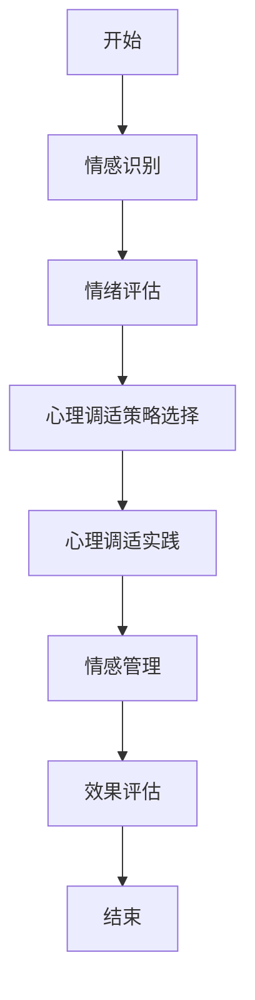

                 

# 情绪管理的艺术：净化内心的实践方法

> 关键词：情绪管理、心理调适、情感、压力管理、自我认知

> 摘要：本文将探讨情绪管理的艺术，通过深入分析情绪管理的核心概念、理论基础和实践方法，帮助读者掌握净化内心、提升情绪稳定性的技巧。我们将通过一步一步的思考方式，结合实际案例，为读者提供一套系统的情绪管理实践指南。

---

## 引言与背景

### 1.1 问题背景

在当今快节奏、高压力的社会环境中，情绪问题已成为普遍存在的现象。焦虑、抑郁、愤怒等负面情绪不仅影响个人的心理健康，还会对工作、人际关系产生负面影响。根据世界卫生组织（WHO）的数据，情绪障碍已经成为全球第二大疾病负担，对人类健康构成严重威胁。

### 1.2 问题描述

情绪管理是指通过一系列方法和技巧，合理调节和控制自己的情绪，使其在合适的范围内波动，避免情绪失控。情绪管理问题主要表现在以下几个方面：

- **情绪识别困难**：很多人无法准确识别自己的情绪，导致情绪调节困难。
- **情绪表达不当**：不恰当的情绪表达可能导致人际关系紧张和冲突。
- **情绪调节能力弱**：面对压力和挑战时，缺乏有效的情绪调节策略。

### 1.3 问题解决

《情绪管理的艺术：净化内心的实践方法》旨在提供一套系统的情绪管理方法，帮助读者提高情绪识别、表达和调节能力。本书的核心方法包括自我认知、心理调适、情感管理等，通过实践这些方法，读者可以逐步实现情绪的净化和内心的平静。

### 1.4 边界与外延

情绪管理不仅涉及情感、压力管理，还包括心理调适、自我认知等方面。它不仅关注个体情绪的调节，也关注情绪对整体生活质量的影响。因此，情绪管理是一个多维度的、综合性的过程。

### 1.5 概念结构与核心要素组成

情绪管理包括以下几个核心概念和要素：

- **情感**：情感是情绪的基础，包括喜悦、愤怒、悲伤等基本情绪。
- **情绪**：情绪是情感的动态表现，包括情绪的产生、变化和调节。
- **自我认知**：自我认知是情绪管理的前提，包括对自己的了解和认识。
- **心理调适**：心理调适是通过方法和技术调节情绪，使其保持在合理范围内。
- **情感管理**：情感管理是情绪管理的延伸，包括情感识别、表达和调控。

## 核心概念与联系

### 2.1 情绪管理

情绪管理是指通过一系列方法和技巧，合理调节和控制自己的情绪，使其在合适的范围内波动，避免情绪失控。情绪管理的目的是提高个体的情绪稳定性和生活质量。

### 2.2 情感与情绪

情感和情绪是密切相关的概念，情感是情绪的基础，而情绪是情感的具体表现。情感包括基本情感（如喜悦、愤怒、悲伤）和复杂情感（如爱、厌恶、恐惧）。

### 2.3 心理调适

心理调适是指通过方法和技术调节情绪，使其保持在合理范围内。心理调适的方法包括认知重构、情绪释放、放松训练等。

### 2.4 核心概念属性特征对比表格

| 概念   | 定义                                                         | 属性特征                                                         | 关联 |
| ------ | ------------------------------------------------------------ | ------------------------------------------------------------ | ---- |
| 情感   | 基础情绪和复杂情感的总称                                     | 情感具有稳定性、多样性、复杂性的特点                           | √    |
| 情绪   | 情感的动态表现                                               | 情绪具有即时性、多样性、可控性的特点                           | √    |
| 自我认知 | 对自己的了解和认识                                             | 自我认知具有个体性、发展性、稳定性的特点                       | √    |
| 心理调适 | 通过方法和技术调节情绪，使其保持在合理范围内                   | 心理调适具有针对性、灵活性、实用性的特点                       | √    |
| 情感管理 | 情感的识别、表达和调控                                       | 情感管理具有系统性、综合性、有效性的特点                       | √    |

### 2.5 ER实体关系图架构

```mermaid
erDiagram
  情感 &&&> 情绪
  情绪 &&&> 心理调适
  情绪 &&&> 情感管理
  自我认知 &&&> 情绪管理
```

## 算法原理讲解

### 3.1 算法Mermaid流程图



### 3.2 Python源代码

```python
def emotion_management():
    emotion = recognize_emotion()
    assessment = evaluate_emotion(emotion)
    if assessment > threshold:
        strategy = select_adjustment_strategy()
        adjustment = practice_adjustment(strategy)
        management = perform_emotion_management(adjustment)
    else:
        management = continue_normal_activities()
    evaluate_management_efficacy(management)
```

### 3.3 数学模型和公式

情绪管理的数学模型可以表示为：

$$
E = f(C, P, M)
$$

其中，$E$代表情绪状态，$C$代表情感评估，$P$代表心理调适策略，$M$代表情感管理效果。

### 3.4 详细讲解与举例说明

情绪管理的过程可以分为以下几个步骤：

1. **情感识别**：首先，通过情感识别技术，如问卷、面谈、情绪分析等，了解个体的情感状态。
2. **情绪评估**：对识别出的情感进行评估，判断其是否处于正常范围。如果评估结果显示情感状态超出正常范围，则进入下一步。
3. **心理调适策略选择**：根据评估结果，选择合适的心

