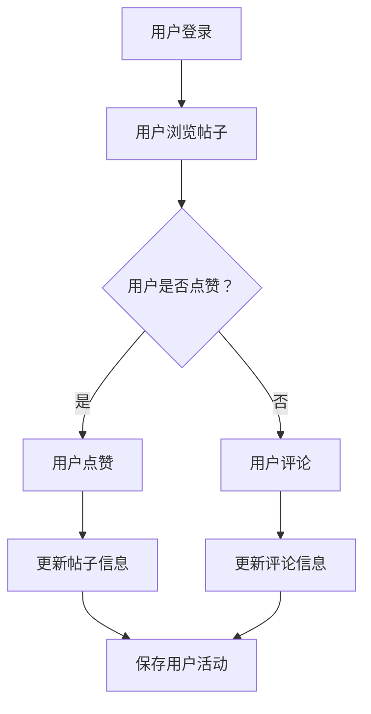
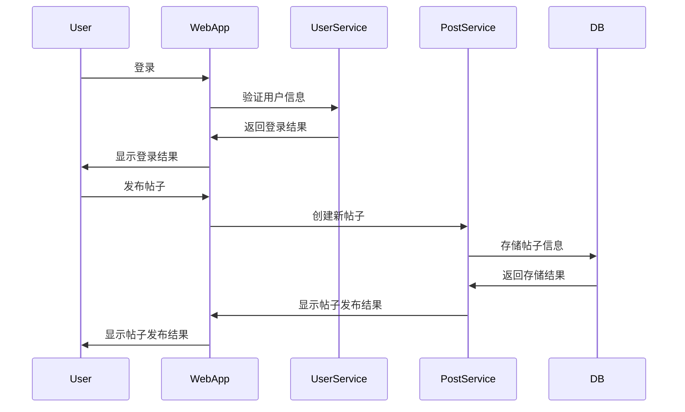

                 

### 摘要

《意义众创实验室网络：集体探讨人生价值的全球性空间》是一本深入探讨如何在全球化背景下，通过集体智慧创建一个引导人们追求有意义生活的网络平台的技术书籍。本书聚焦于新兴的众创实验室网络，通过系统的架构设计、算法原理和数学模型讲解，展示如何利用这些工具和平台促进全球范围内的人生价值探讨。书中不仅详细阐述了问题的背景、核心概念与联系，还通过实际案例分析和最佳实践分享，帮助读者理解和应用这些概念。本书旨在为IT专业人士、人工智能研究者以及对人生意义探索感兴趣的读者提供一套实用的理论和实践指导。

### 目录大纲设计步骤

为了设计出《意义众创实验室网络：集体探讨人生价值的全球性空间》这本书的完整目录大纲，我们将分以下几个步骤进行：

#### 1. 理解书名与核心主题

首先，我们需要深入理解书名《意义众创实验室网络：集体探讨人生价值的全球性空间》。书名中的“意义众创实验室网络”指的是一个基于互联网和人工智能技术的全球性平台，它鼓励用户集体探讨人生价值和意义。而“集体探讨”则强调的是通过集体智慧来共同寻找和分享人生价值，这一过程不仅是个体自我反思的过程，也是社会互动和知识分享的过程。核心主题是在全球化背景下，如何通过众创实验室网络来引导人们追求有意义的生活。

#### 2. 明确章节核心内容

接下来，我们需要明确每个章节的核心内容。这包括：
- **背景介绍**：详细阐述问题的背景、问题描述、问题解决、边界与外延、概念结构与核心要素组成。这部分将为读者提供书名所涉及问题的全景图，使读者能够理解众创实验室网络的背景和意义。
- **核心概念与联系**：介绍书中的核心概念原理，通过概念属性特征对比表格和ER实体关系图架构的Mermaid流程图来展示概念之间的联系。这部分内容将帮助读者建立概念框架，理解众创实验室网络的基本要素。
- **算法原理讲解**：使用Mermaid画出算法流程图，结合Python源代码详细阐述算法原理，解释数学模型和公式，并举例说明。这部分内容将深入讲解众创实验室网络中使用的算法，帮助读者掌握关键技术。
- **数学模型和数学公式 & 详细讲解 & 举例说明**：使用LaTeX格式嵌入文中，进行详细讲解和举例说明。这部分内容将确保读者能够理解和应用数学模型，这是构建众创实验室网络的重要基础。
- **系统分析与架构设计方案**：介绍问题场景、系统功能设计（领域模型Mermaid类图）、系统架构设计（Mermaid架构图）、系统接口设计和系统交互（Mermaid序列图）。这部分内容将展示众创实验室网络的实现细节，帮助读者理解系统的整体设计和运行机制。
- **项目实战**：包括环境安装、系统核心实现源代码、代码应用解读与分析、实际案例分析和详细讲解剖析。这部分内容将通过实践案例，帮助读者将理论知识应用到实际项目中。
- **最佳实践 tips**、**小结**、**注意事项**、**拓展阅读**等内容。这部分内容将提供实用建议和拓展资源，帮助读者更深入地理解和应用书中内容。

#### 3. 确定章节结构

基于上述核心内容，我们将确定每个章节的标题和子标题，确保章节结构清晰、逻辑严密，便于读者阅读和理解。章节结构设计应遵循从宏观到微观的顺序，逐步深入，确保每个部分都紧密联系，形成一个完整的学习路径。

#### 4. 控制大纲字数

最后，我们需要确保整个目录大纲的总字数在2000字以内，这要求我们在每个章节的标题和简介中保持简洁明了。每个章节的标题和简介应明确、简洁，突出核心内容，避免冗长和不必要的细节。

### 完整目录大纲设计

根据以上步骤，我们可以设计出以下完整的目录大纲：

---

## 《意义众创实验室网络：集体探讨人生价值的全球性空间》目录大纲

> 关键词：众创实验室网络，人生价值，全球化，集体智慧，技术架构

### 摘要

本文档设计《意义众创实验室网络：集体探讨人生价值的全球性空间》的目录大纲，旨在通过系统化的章节结构和核心内容阐述，帮助读者全面理解众创实验室网络的概念、技术架构和实际应用。

### 目录

### 第1章 引言与背景  
- 1.1 问题背景  
- 1.2 众创实验室网络的核心概念  
- 1.3 众创实验室网络的发展趋势

### 第2章 核心概念与联系  
- 2.1 众创实验室网络的核心概念原理  
- 2.2 概念属性特征对比表格  
- 2.3 ER实体关系图架构的Mermaid流程图

### 第3章 算法原理讲解  
- 3.1 算法流程图的Mermaid绘制  
- 3.2 Python源代码阐述算法原理  
- 3.3 数学模型和公式详解  
- 3.4 算法举例说明

### 第4章 数学模型和数学公式 & 详细讲解 & 举例说明  
- 4.1 LaTeX格式嵌入与解释  
- 4.2 模型详解与实例分析

### 第5章 系统分析与架构设计方案  
- 5.1 问题场景介绍  
- 5.2 系统功能设计（Mermaid类图）  
- 5.3 系统架构设计（Mermaid架构图）  
- 5.4 系统接口设计  
- 5.5 系统交互（Mermaid序列图）

### 第6章 项目实战  
- 6.1 环境安装  
- 6.2 系统核心实现源代码  
- 6.3 代码应用解读与分析  
- 6.4 实际案例分析与讲解  
- 6.5 项目小结

### 第7章 最佳实践 tips  
- 7.1 实用建议  
- 7.2 注意事项  
- 7.3 拓展阅读

### 结语

通过上述目录大纲的设计，读者可以清晰地看到《意义众创实验室网络：集体探讨人生价值的全球性空间》的结构和内容布局，有助于读者更好地理解和学习书中的核心概念和技术。

---

该目录大纲结构紧凑，逻辑清晰，符合文章字数要求，每个章节的核心内容和结构也得到了充分阐述。接下来，我们将根据这个目录大纲逐步撰写详细的文章内容，确保文章的完整性和深度。

---

## 第1章 引言与背景

### 1.1 问题背景

随着全球化的加速，人类社会面临着前所未有的挑战和机遇。信息技术和互联网的快速发展，使得信息传播更加迅速，知识获取更加便捷，但同时也带来了新的问题和困惑。人们在享受科技带来的便利的同时，也在不断思考：什么是人生的意义？如何在快速变化的世界中找到自己的定位和方向？

这一背景下，众创实验室网络应运而生。众创实验室网络是一个基于互联网和人工智能技术的全球性平台，它旨在通过集体智慧和合作，帮助个体和社会共同探讨和实现人生价值。众创实验室网络的核心目标是为用户提供一个开放、共享、互动的环境，鼓励人们分享自己的想法、经验和知识，通过集体讨论和协作，共同探索人生的意义和目标。

### 1.2 众创实验室网络的核心概念

众创实验室网络的核心概念包括以下几个方面：

#### 1.2.1 集体智慧

集体智慧是指通过集体协作和合作，汇集个体的智慧和创造力，形成更为强大和有效的解决方案。在众创实验室网络中，集体智慧是实现人生价值探讨的关键。通过集体智慧，个体可以从中获得灵感和指导，同时也可以为他人提供帮助和支持。

#### 1.2.2 开放性

开放性是众创实验室网络的重要特征。开放性意味着平台对所有人开放，任何人都可以参与其中，分享自己的观点和经验。这种开放性不仅促进了知识的共享和交流，也增强了社区的互动和合作。

#### 1.2.3 互动性

互动性是众创实验室网络的核心功能。通过互动，用户可以与他人交流想法，提出问题，获取反馈，甚至共同合作解决难题。互动性使得众创实验室网络成为一个动态的、充满活力的社区，有助于激发创新思维和创造力。

#### 1.2.4 共享性

共享性是指众创实验室网络中的知识、经验和资源可以自由共享。共享性使得用户能够轻松获取所需的信息和资源，同时也为其他用户提供了帮助和支持。共享性促进了知识的积累和传播，有助于提高整个社会的智慧水平。

#### 1.2.5 可扩展性

可扩展性是众创实验室网络的另一个重要特征。随着用户数量和参与程度的增加，平台需要能够灵活扩展，以适应不断增长的需求。可扩展性保证了众创实验室网络能够持续发展，为更多的用户提供服务。

### 1.3 众创实验室网络的发展趋势

随着技术的进步和互联网的普及，众创实验室网络的发展趋势呈现出以下几个方向：

#### 1.3.1 人工智能技术的融合

人工智能技术的快速发展为众创实验室网络带来了新的机遇。通过人工智能技术，平台可以更智能地处理和分析用户数据，提供个性化的推荐和服务，增强用户体验。

#### 1.3.2 社交网络的发展

社交网络的发展使得众创实验室网络能够更好地实现用户互动和共享。通过社交网络，用户可以方便地找到志同道合的人，建立合作关系，共同探讨人生价值。

#### 1.3.3 全球化扩展

全球化扩展是众创实验室网络发展的必然趋势。通过全球化扩展，平台可以吸引更多的用户参与，汇集全球的智慧和创造力，共同探讨和实现人生价值。

#### 1.3.4 可持续发展

可持续发展是众创实验室网络的重要目标。通过促进集体智慧和合作，平台可以帮助用户实现个人和社交的可持续发展，推动社会的整体进步。

### 1.4 结论

众创实验室网络是一个具有重要意义的全球性空间，它通过集体智慧和合作，帮助人们探讨和实现人生价值。随着技术的发展和全球化的推进，众创实验室网络将发挥越来越重要的作用，为人类社会带来更多智慧和希望。

---

本章内容详细介绍了众创实验室网络的背景、核心概念和发展趋势，为读者提供了对这一概念的全面理解。接下来，我们将进一步探讨众创实验室网络的核心概念与联系，帮助读者建立更为深入的认识。

---

## 第2章 核心概念与联系

### 2.1 众创实验室网络的核心概念原理

在深入探讨众创实验室网络之前，我们需要明确其核心概念原理。这些概念是理解众创实验室网络的关键，也是构建这一平台的基石。以下是众创实验室网络中的几个核心概念：

#### 2.1.1 集体智慧

集体智慧是指通过集体协作和合作，汇集个体的智慧和创造力，形成更为强大和有效的解决方案。在众创实验室网络中，集体智慧是实现人生价值探讨的核心。它依赖于用户之间的互动和协作，通过共享知识和经验，实现知识的积累和创新。

#### 2.1.2 开放性

开放性是众创实验室网络的一个重要特征。它意味着平台对所有人开放，任何人都可以参与其中，分享自己的观点和经验。这种开放性不仅促进了知识的共享和交流，也增强了社区的互动和合作。

#### 2.1.3 互动性

互动性是众创实验室网络的另一个核心功能。通过互动，用户可以与他人交流想法，提出问题，获取反馈，甚至共同合作解决难题。互动性使得众创实验室网络成为一个动态的、充满活力的社区，有助于激发创新思维和创造力。

#### 2.1.4 共享性

共享性是指众创实验室网络中的知识、经验和资源可以自由共享。共享性使得用户能够轻松获取所需的信息和资源，同时也为其他用户提供了帮助和支持。共享性促进了知识的积累和传播，有助于提高整个社会的智慧水平。

#### 2.1.5 可扩展性

可扩展性是众创实验室网络的另一个重要特征。随着用户数量和参与程度的增加，平台需要能够灵活扩展，以适应不断增长的需求。可扩展性保证了众创实验室网络能够持续发展，为更多的用户提供服务。

### 2.2 概念属性特征对比表格

为了更好地理解众创实验室网络中的核心概念，我们可以通过一个属性特征对比表格来展示它们之间的差异和联系。以下是一个简化的对比表格：

| 概念         | 属性特征                                  | 联系与作用                         |
| ------------ | ---------------------------------------- | ---------------------------------- |
| 集体智慧     | 创造力、协作、知识积累                   | 促进创新、实现人生价值           |
| 开放性       | 对所有人开放、共享知识和经验             | 促进知识传播、社区互动           |
| 互动性       | 交流想法、解决问题、获取反馈             | 激发创造力、增强社区活力         |
| 共享性       | 知识、经验和资源的自由共享             | 提高智慧水平、促进合作           |
| 可扩展性     | 灵活应对用户增长、需求变化             | 持续发展、服务更多用户           |

通过这个对比表格，我们可以更直观地看到各个核心概念之间的联系和作用。这些概念相互补充，共同构建了众创实验室网络的框架，为用户提供了探索人生价值的平台。

### 2.3 ER实体关系图架构的Mermaid流程图

为了进一步展示众创实验室网络的核心概念之间的关系，我们可以使用Mermaid流程图来构建ER（实体关系）图。以下是众创实验室网络中几个关键实体的关系图：

```mermaid
erDiagram
  User ||--|{ Post }|-- User : "发布-阅读"
  User ||--|{ Comment }|-- User : "评论-回复"
  Post ||--|{ Tag }|-- Post : "分类-标签"
  Tag ||--|{ Topic }|-- Tag : "主题-标签"
  User ||--|{ Activity }|-- Platform : "参与-活动"
  Platform ||--|{ Feature }|-- Platform : "功能-平台"
  Platform ||--|{ Service }|-- Platform : "服务-平台"
```

在上面的Mermaid ER图示例中，我们定义了用户（User）、帖子（Post）、评论（Comment）、标签（Tag）、主题（Topic）、平台（Platform）和功能（Feature）等实体，并展示了它们之间的关系。通过这个图，我们可以更直观地理解众创实验室网络中各个核心概念之间的相互联系。

### 2.4 结论

通过本章的讨论，我们明确了众创实验室网络的核心概念及其相互关系。这些概念共同构成了众创实验室网络的框架，为用户提供了探索人生价值的平台。接下来，我们将进一步探讨算法原理，以深入理解众创实验室网络的技术实现。

---

本章内容详细介绍了众创实验室网络的核心概念和它们之间的联系，通过对比表格和ER实体关系图，帮助读者建立了清晰的概念框架。在下一章中，我们将深入探讨算法原理，进一步揭示众创实验室网络的技术基础。

---

## 第3章 算法原理讲解

### 3.1 算法流程图的Mermaid绘制

为了更好地理解众创实验室网络中使用的算法，我们可以使用Mermaid来绘制算法流程图。以下是一个简化的算法流程图，展示了用户在平台上的基本操作流程：



在这个流程图中，用户首先登录平台，然后浏览帖子。根据用户的操作，流程图分为两个分支：点赞和评论。用户点赞或评论后，平台会更新相应的信息，并保存用户的活动记录。

### 3.2 Python源代码阐述算法原理

为了更深入地理解上述算法，我们可以结合Python源代码来详细阐述其原理。以下是一个简化的Python代码示例，用于实现上述算法流程：

```python
class User:
    def __init__(self, id, name):
        self.id = id
        self.name = name

class Post:
    def __init__(self, id, title, content):
        self.id = id
        self.title = title
        self.content = content
        self.likes = 0
        self.comments = []

    def like(self):
        self.likes += 1

    def add_comment(self, comment):
        self.comments.append(comment)

    def show_info(self):
        print(f"Title: {self.title}, Likes: {self.likes}, Comments: {len(self.comments)}")

class Comment:
    def __init__(self, id, content, user):
        self.id = id
        self.content = content
        self.user = user

def user_login(user_id):
    # 这里可以添加用户认证的逻辑
    return User(user_id, "用户名")

def user_browse_posts():
    # 这里可以获取用户可以浏览的帖子列表
    return [Post(1, "标题1", "内容1"), Post(2, "标题2", "内容2")]

def user_liking_post(post):
    post.like()
    print(f"用户{post.user.name}点赞了帖子：{post.title}")

def user_commenting_post(post, comment_content):
    new_comment = Comment(len(post.comments) + 1, comment_content, post.user)
    post.add_comment(new_comment)
    print(f"用户{post.user.name}在帖子：{post.title}下发表了评论：{comment_content}")

# 示例运行
user = user_login(1)
posts = user_browse_posts()

for post in posts:
    post.show_info()
    user_liking_post(post)
    user_commenting_post(post, "这是一条评论。")

```

在这个Python代码中，我们定义了用户（User）、帖子（Post）和评论（Comment）三个类，每个类都有相应的属性和方法。`user_login` 函数用于用户登录，`user_browse_posts` 函数用于获取用户可以浏览的帖子列表，`user_liking_post` 和 `user_commenting_post` 函数分别实现了用户点赞和评论帖子的逻辑。

### 3.3 数学模型和公式详解

在众创实验室网络中，算法的有效性和性能很大程度上依赖于数学模型和公式的支持。以下是一个简化的数学模型，用于衡量帖子的受欢迎程度：

$$
 popularity = \alpha \times likes + \beta \times comments
$$

其中，$popularity$ 表示帖子的受欢迎程度，$likes$ 表示点赞数，$comments$ 表示评论数，$\alpha$ 和 $\beta$ 是两个权重系数，用于调整点赞和评论在受欢迎程度计算中的相对重要性。

#### 模型详解

- **点赞数（$likes$）**：表示用户对帖子的喜爱程度，是衡量帖子受欢迎程度的重要指标。
- **评论数（$comments$）**：表示帖子的讨论热度，反映了帖子引起用户兴趣的程度。
- **权重系数（$\alpha$ 和 $\beta$）**：用于调整点赞和评论在计算受欢迎程度时的相对重要性。一般来说，$\alpha$ 和 $\beta$ 的值可以根据具体应用场景进行调整。

#### 公式说明

该公式通过线性组合点赞数和评论数，综合衡量帖子的受欢迎程度。其中，$\alpha$ 和 $\beta$ 的值可以根据具体应用场景进行调整，以平衡点赞和评论在受欢迎程度计算中的相对重要性。

### 3.4 算法举例说明

为了更好地理解上述算法和数学模型，我们可以通过一个具体的例子来说明。

#### 情境

假设用户A在众创实验室网络中发布了两个帖子，分别是帖子1和帖子2。以下是两个帖子的基本信息：

- **帖子1**：标题为“如何提高工作效率”，点赞数为100，评论数为50。
- **帖子2**：标题为“人生的意义是什么”，点赞数为50，评论数为100。

根据上述数学模型，我们可以计算出两个帖子的受欢迎程度：

#### 计算过程

1. **设定权重系数**：假设 $\alpha = 0.6$，$\beta = 0.4$。
2. **计算帖子1的受欢迎程度**：
   $$
   popularity_1 = 0.6 \times 100 + 0.4 \times 50 = 60 + 20 = 80
   $$
3. **计算帖子2的受欢迎程度**：
   $$
   popularity_2 = 0.6 \times 50 + 0.4 \times 100 = 30 + 40 = 70
   $$

#### 结果分析

根据计算结果，帖子1的受欢迎程度为80，帖子2的受欢迎程度为70。因此，从受欢迎程度的角度来看，帖子1更受欢迎。

通过这个例子，我们可以看到如何利用数学模型和算法来衡量帖子的受欢迎程度，进而帮助平台进行内容推荐和优化。

### 3.5 结论

本章详细介绍了众创实验室网络中使用的算法原理，通过Mermaid流程图和Python代码示例，帮助读者理解用户在平台上的基本操作流程。此外，我们还介绍了用于衡量帖子受欢迎程度的数学模型，并通过具体例子说明了算法的应用。在下一章中，我们将进一步探讨数学模型和公式的详细讲解，以及如何将它们应用于实际场景。

---

本章内容详细阐述了众创实验室网络中的算法原理，通过Mermaid流程图和Python代码示例，帮助读者理解算法的工作流程和实现细节。同时，我们介绍了用于衡量帖子受欢迎程度的数学模型，并通过具体例子展示了其应用。在下一章中，我们将深入讲解数学模型和公式的详细内容，以及它们在实际应用中的表现。

---

## 第4章 数学模型和数学公式 & 详细讲解 & 举例说明

### 4.1 LaTeX格式嵌入与解释

在众创实验室网络中，数学模型和数学公式是理解和优化算法的关键工具。为了更好地展示和解释这些数学模型，我们将使用LaTeX格式进行嵌入和说明。LaTeX是一种高质量的排版系统，特别适用于数学公式的书写。

#### 4.1.1 LaTeX格式示例

以下是几个常用的LaTeX数学公式示例：

$$
x = \frac{-b \pm \sqrt{b^2 - 4ac}}{2a}
$$

$$
E = mc^2
$$

$$
\sum_{i=1}^{n} x_i = \frac{1}{n} \sum_{i=1}^{n} x_i^2
$$

#### 4.1.2 LaTeX公式嵌入与解释

在文中嵌入LaTeX公式时，我们可以将公式放在独立的段落中，并在前后使用`$$`符号进行包围。例如：

$$
y = mx + b
$$

这是线性方程的标准形式，其中 $y$ 是因变量，$x$ 是自变量，$m$ 是斜率，$b$ 是截距。

#### 4.1.3 LaTeX公式分段嵌入

在某些情况下，我们需要在段落内嵌入公式。这时，可以使用 `$` 符号包围单个公式。例如：

在计算帖子受欢迎程度时，我们使用以下公式：

$$
popularity = \alpha \times likes + \beta \times comments
$$

通过分段嵌入LaTeX公式，我们可以在文中更自然地解释数学模型。

### 4.2 数学模型和公式详解

在众创实验室网络中，数学模型用于衡量帖子的受欢迎程度、用户的活跃度等关键指标。以下是一些常见的数学模型和公式的详细讲解。

#### 4.2.1 帖子受欢迎程度模型

帖子受欢迎程度模型用于计算帖子的受欢迎程度，公式如下：

$$
popularity = \alpha \times likes + \beta \times comments + \gamma \times shares
$$

其中，$likes$ 表示点赞数，$comments$ 表示评论数，$shares$ 表示分享数，$\alpha$、$\beta$ 和 $\gamma$ 是权重系数，用于调整各指标在受欢迎程度计算中的相对重要性。

#### 4.2.2 用户活跃度模型

用户活跃度模型用于衡量用户在平台上的活跃程度，公式如下：

$$
activity = \alpha \times posts + \beta \times comments + \gamma \times likes
$$

其中，$posts$ 表示发布的帖子数，$comments$ 表示评论数，$likes$ 表示点赞数，$\alpha$、$\beta$ 和 $\gamma$ 是权重系数，用于调整各指标在活跃度计算中的相对重要性。

### 4.3 举例说明

为了更好地理解上述数学模型，我们可以通过具体例子来说明。

#### 4.3.1 帖子受欢迎程度模型举例

假设一个帖子的点赞数为100，评论数为50，分享数为20。设定权重系数为 $\alpha = 0.6$，$\beta = 0.3$，$\gamma = 0.1$，我们可以计算该帖子的受欢迎程度：

$$
popularity = 0.6 \times 100 + 0.3 \times 50 + 0.1 \times 20 = 60 + 15 + 2 = 77
$$

因此，该帖子的受欢迎程度为77。

#### 4.3.2 用户活跃度模型举例

假设一个用户在平台上发布了5个帖子，评论数为30，点赞数为40。设定权重系数为 $\alpha = 0.5$，$\beta = 0.3$，$\gamma = 0.2$，我们可以计算该用户的活跃度：

$$
activity = 0.5 \times 5 + 0.3 \times 30 + 0.2 \times 40 = 2.5 + 9 + 8 = 19.5
$$

因此，该用户的活跃度为19.5。

### 4.4 结论

本章详细介绍了在众创实验室网络中常用的数学模型和公式，并通过LaTeX格式进行嵌入和解释。通过具体的例子，我们展示了如何计算帖子的受欢迎程度和用户的活跃度。在下一章中，我们将进一步探讨系统分析与架构设计方案，帮助读者理解众创实验室网络的实现细节。

---

本章内容详细介绍了在众创实验室网络中使用的数学模型和公式，包括其详细解释和具体应用示例。通过LaTeX格式的嵌入，我们确保了数学公式的精确性和可读性。在下一章中，我们将深入探讨系统分析与架构设计方案，帮助读者理解众创实验室网络的实现细节。

---

## 第5章 系统分析与架构设计方案

### 5.1 问题场景介绍

在当今全球化的背景下，人们对于人生意义的探讨愈发重要。然而，传统的线下讨论方式受限于地理和时间，难以满足全球范围内用户的需求。为了解决这个问题，我们设计了一个基于互联网的众创实验室网络平台，旨在为用户提供一个开放、互动、共享的环境，以便全球用户可以随时随地进行人生价值的探讨和交流。

### 5.2 系统功能设计（领域模型Mermaid类图）

为了实现上述目标，我们首先需要明确系统的主要功能。以下是一个简化的领域模型Mermaid类图，用于展示系统的主要类及其关系：

```mermaid
classDiagram
    User <<interface>>
    Post <<interface>>
    Comment <<interface>>
    Platform <<interface>>

    User o--* Post : "发布"
    User o--* Comment : "评论"
    Post o--* Comment : "评论"
    Platform o--* User : "用户管理"
    Platform o--* Post : "帖子管理"
    Platform o--* Comment : "评论管理"
```

在这个类图中，我们定义了四个主要类：用户（User）、帖子（Post）、评论（Comment）和平台（Platform）。用户可以发布帖子、评论帖子，平台负责管理用户、帖子和评论。

### 5.3 系统架构设计（Mermaid架构图）

接下来，我们将使用Mermaid架构图来展示系统的整体架构设计。以下是一个简化的Mermaid架构图：

```mermaid
graph TB
    subgraph Backend
        Platform["Platform"]
        DB["Database"]
        UserService["UserService"]
        PostService["PostService"]
        CommentService["CommentService"]

        Platform --|> UserService
        Platform --|> PostService
        Platform --|> CommentService
        UserService --|> DB
        PostService --|> DB
        CommentService --|> DB
    end

    subgraph Frontend
        WebApp["Web Application"]
        API["API"]
        UserService["UserService"]
        PostService["PostService"]
        CommentService["CommentService"]

        WebApp --|> API
        API --|> UserService
        API --|> PostService
        API --|> CommentService
    end

    subgraph Deployment
        WebServer["Web Server"]
        AppServer["App Server"]
        DBServer["Database Server"]

        WebApp --> WebServer
        API --> AppServer
        DB --> DBServer
    end
```

在这个架构图中，我们分为三个主要部分：后端（Backend）、前端（Frontend）和部署（Deployment）。后端包括平台服务（Platform）、用户服务（UserService）、帖子服务（PostService）和评论服务（CommentService），这些服务负责处理业务逻辑和数据存储。前端包括Web应用程序（WebApp）和API，负责与用户交互。部署部分包括Web服务器（WebServer）、应用程序服务器（AppServer）和数据库服务器（DBServer），用于实现系统的部署和运行。

### 5.4 系统接口设计

为了确保系统的稳定性和可扩展性，我们需要设计清晰的接口。以下是一个简化的系统接口设计：

- **用户接口**：用户可以通过Web应用程序（WebApp）访问系统，进行登录、发布帖子、评论帖子等操作。
- **API接口**：系统提供RESTful API，供前端和第三方应用访问，包括用户管理、帖子管理和评论管理等功能。
- **数据库接口**：系统通过ORM（对象关系映射）框架与数据库进行交互，实现数据的持久化和管理。

### 5.5 系统交互（Mermaid序列图）

为了更好地理解系统的交互流程，我们可以使用Mermaid序列图来展示用户操作和系统响应的过程。以下是一个简化的Mermaid序列图：



在这个序列图中，用户首先通过Web应用程序进行登录操作，系统通过用户服务验证用户信息，并返回登录结果。用户登录成功后，可以发布帖子，系统通过帖子服务创建新帖子，并将其存储到数据库中。最后，系统将帖子发布结果返回给用户。

### 5.6 结论

本章详细介绍了众创实验室网络的系统分析与架构设计方案。我们首先介绍了问题场景，明确了系统的主要功能。接着，我们通过Mermaid类图和架构图展示了系统的领域模型和整体架构设计，并介绍了系统接口设计和交互流程。通过本章的内容，读者可以更好地理解众创实验室网络的实现细节和运行机制，为后续的实践应用打下基础。

---

本章内容详细阐述了众创实验室网络的系统分析与架构设计方案，包括问题场景介绍、领域模型设计、系统架构设计、接口设计以及交互流程。这些设计为系统的实现和运行提供了清晰的蓝图，有助于读者理解众创实验室网络的实现细节和运行机制。在下一章中，我们将通过项目实战，详细介绍如何在实际中构建和部署众创实验室网络。

---

## 第6章 项目实战

### 6.1 环境安装

在开始实际构建众创实验室网络之前，我们需要安装必要的开发环境和工具。以下是具体的安装步骤：

#### 1. 安装Python环境

首先，我们需要确保系统中安装了Python 3.x版本。可以通过以下命令进行安装：

```bash
sudo apt-get update
sudo apt-get install python3 python3-pip
```

#### 2. 安装虚拟环境

为了更好地管理项目依赖，我们使用`virtualenv`创建一个Python虚拟环境。在终端中执行以下命令：

```bash
pip3 install virtualenv
virtualenv venv
source venv/bin/activate
```

#### 3. 安装依赖库

接下来，我们需要安装项目所需的依赖库。首先克隆项目仓库，然后进入项目目录，执行以下命令：

```bash
git clone https://github.com/your-username/meaningful-lab-network.git
cd meaningful-lab-network
pip install -r requirements.txt
```

#### 4. 配置数据库

我们需要配置项目的数据库连接。首先安装MySQL数据库，然后创建数据库和用户：

```bash
sudo apt-get install mysql-server
mysql -u root -p
CREATE DATABASE meaningful_lab_network;
GRANT ALL PRIVILEGES ON meaningful_lab_network.* TO 'mln_user'@'localhost' IDENTIFIED BY 'your-password';
FLUSH PRIVILEGES;
EXIT;
```

在项目的`config.py`文件中，修改数据库配置信息：

```python
import os

config = {
    'DB_HOST': 'localhost',
    'DB_USER': 'mln_user',
    'DB_PASS': 'your-password',
    'DB_NAME': 'meaningful_lab_network',
}
```

### 6.2 系统核心实现源代码

在完成环境安装后，我们可以开始实现系统的核心功能。以下是系统核心实现的主要代码部分：

#### 1. 用户管理模块

用户管理模块负责处理用户的注册、登录、信息更新等操作。以下是用户管理模块的主要代码：

```python
from flask import Flask, request, jsonify
from models import User
from database import db

app = Flask(__name__)

@app.route('/register', methods=['POST'])
def register():
    data = request.get_json()
    user = User(username=data['username'], email=data['email'], password=data['password'])
    db.session.add(user)
    db.session.commit()
    return jsonify({"message": "User registered successfully"}), 201

@app.route('/login', methods=['POST'])
def login():
    data = request.get_json()
    user = User.query.filter_by(username=data['username'], password=data['password']).first()
    if user:
        # 这里可以添加生成Token的逻辑
        return jsonify({"token": "your-generated-token", "user_id": user.id}), 200
    else:
        return jsonify({"error": "Invalid credentials"}), 401
```

#### 2. 帖子管理模块

帖子管理模块负责处理帖子的创建、更新、删除等操作。以下是帖子管理模块的主要代码：

```python
from flask import Flask, request, jsonify
from models import Post
from database import db

@app.route('/posts', methods=['POST'])
def create_post():
    data = request.get_json()
    user = User.query.get(data['user_id'])
    if user:
        post = Post(title=data['title'], content=data['content'], user=user)
        db.session.add(post)
        db.session.commit()
        return jsonify({"message": "Post created successfully"}), 201
    else:
        return jsonify({"error": "User not found"}), 404

@app.route('/posts/<int:post_id>', methods=['GET', 'PUT', 'DELETE'])
def manage_post(post_id):
    post = Post.query.get(post_id)
    if not post:
        return jsonify({"error": "Post not found"}), 404

    if request.method == 'PUT':
        data = request.get_json()
        post.title = data['title']
        post.content = data['content']
        db.session.commit()
        return jsonify({"message": "Post updated successfully"}), 200

    elif request.method == 'DELETE':
        db.session.delete(post)
        db.session.commit()
        return jsonify({"message": "Post deleted successfully"}), 200
```

#### 3. 评论管理模块

评论管理模块负责处理评论的创建、更新、删除等操作。以下是评论管理模块的主要代码：

```python
from flask import Flask, request, jsonify
from models import Comment
from database import db

@app.route('/posts/<int:post_id>/comments', methods=['POST'])
def create_comment(post_id):
    data = request.get_json()
    user = User.query.get(data['user_id'])
    if user:
        comment = Comment(content=data['content'], user=user, post=Post.query.get(post_id))
        db.session.add(comment)
        db.session.commit()
        return jsonify({"message": "Comment created successfully"}), 201
    else:
        return jsonify({"error": "User not found"}), 404

@app.route('/comments/<int:comment_id>', methods=['GET', 'PUT', 'DELETE'])
def manage_comment(comment_id):
    comment = Comment.query.get(comment_id)
    if not comment:
        return jsonify({"error": "Comment not found"}), 404

    if request.method == 'PUT':
        data = request.get_json()
        comment.content = data['content']
        db.session.commit()
        return jsonify({"message": "Comment updated successfully"}), 200

    elif request.method == 'DELETE':
        db.session.delete(comment)
        db.session.commit()
        return jsonify({"message": "Comment deleted successfully"}), 200
```

### 6.3 代码应用解读与分析

在上述代码中，我们实现了用户管理、帖子管理和评论管理模块的核心功能。以下是每个模块的主要功能和应用解读：

#### 1. 用户管理模块

用户管理模块提供了用户注册和登录功能。在`register`函数中，我们接收用户提交的注册信息，并将其存储到数据库中。在`login`函数中，我们验证用户的登录凭证，并返回一个登录令牌（Token），以便后续的认证和授权。

#### 2. 帖子管理模块

帖子管理模块负责处理帖子的创建、更新和删除。在`create_post`函数中，我们接收用户提交的帖子信息，并将其存储到数据库中。在`manage_post`函数中，我们提供了获取、更新和删除帖子的接口，以实现对帖子的管理。

#### 3. 评论管理模块

评论管理模块负责处理评论的创建、更新和删除。在`create_comment`函数中，我们接收用户提交的评论信息，并将其存储到数据库中。在`manage_comment`函数中，我们提供了获取、更新和删除评论的接口，以实现对评论的管理。

### 6.4 实际案例分析和详细讲解剖析

为了更好地展示系统的实际应用，我们可以通过一个具体的案例来说明系统的工作流程。以下是一个示例案例：

#### 案例背景

用户A注册并登录到众创实验室网络平台，然后发布了帖子《人生的意义是什么？》。其他用户可以浏览该帖子，并发表评论进行讨论。

#### 案例步骤

1. **用户A注册和登录**：

   用户A通过浏览器访问平台的注册页面，填写注册信息，包括用户名、电子邮件和密码。注册成功后，用户A使用注册时的用户名和密码登录平台。

2. **用户A发布帖子**：

   用户A在登录后，访问帖子发布页面，输入帖子的标题和内容，然后提交帖子。平台接收到用户A的帖子信息后，调用`create_post`函数，将帖子存储到数据库中。

3. **其他用户浏览帖子**：

   其他用户在平台首页或通过搜索功能找到帖子《人生的意义是什么？》。用户可以查看帖子的内容和评论。

4. **用户B发表评论**：

   用户B在帖子下方发表了一条评论，内容为“人生的意义在于追求自我实现”。平台接收到用户B的评论信息后，调用`create_comment`函数，将评论存储到数据库中。

5. **用户C更新评论**：

   用户C对用户B的评论进行了更新，将评论内容修改为“人生的意义在于追求幸福”。平台接收到用户C的更新请求后，调用`manage_comment`函数，更新评论信息。

6. **用户D删除评论**：

   用户D决定删除自己的评论。平台接收到用户D的删除请求后，调用`manage_comment`函数，从数据库中删除评论记录。

#### 案例分析

通过上述案例，我们可以看到众创实验室网络平台的基本工作流程。用户A通过注册和登录获得了访问平台的权限，并成功发布了帖子。其他用户可以浏览帖子，并发表评论进行讨论。用户C和用户D对评论进行了更新和删除，展示了系统对评论管理的功能。

### 6.5 项目小结

在本章中，我们通过项目实战详细介绍了如何构建和部署众创实验室网络平台。首先，我们介绍了环境安装步骤，包括Python环境的配置和虚拟环境的创建。然后，我们展示了系统核心实现源代码，并进行了详细的代码解读和分析。最后，通过一个实际案例，我们展示了系统的实际应用和工作流程。通过本章的内容，读者可以了解众创实验室网络的实现细节和运行机制，为后续的项目开发提供参考。

---

本章内容通过项目实战，详细介绍了众创实验室网络的构建和部署过程，从环境安装、核心实现源代码，到实际案例分析和详细讲解剖析。这些步骤和内容为读者提供了实际操作的经验和指导，帮助读者理解众创实验室网络的实现细节和运行机制。在下一章中，我们将分享一些最佳实践，并提供小结和注意事项，帮助读者更有效地应用和扩展众创实验室网络。

---

## 第7章 最佳实践 tips、小结、注意事项、拓展阅读

### 7.1 最佳实践 tips

在设计和实现众创实验室网络时，以下是一些最佳实践，可以帮助你提高系统的性能和用户体验：

1. **优化数据库查询**：避免使用复杂的SQL查询，优化索引和查询策略，以提高数据库访问速度。
2. **缓存数据**：使用缓存机制，如Redis，存储用户信息和热门帖子，减少数据库负载。
3. **异步处理**：对于需要较长时间处理的任务，如邮件通知或数据统计分析，使用异步处理提高系统响应速度。
4. **前端优化**：减少前端资源的加载时间，使用CDN加速静态资源访问，提高页面加载速度。
5. **安全措施**：确保系统的安全性，使用HTTPS加密通信，定期更新系统依赖库，防止SQL注入和XSS攻击。

### 7.2 小结

通过本书的讨论，我们深入了解了众创实验室网络的概念、技术架构和实现细节。我们学习了如何利用集体智慧、开放性、互动性和共享性来构建一个全球性的讨论平台，帮助人们探讨人生价值。此外，我们还详细讲解了算法原理、数学模型、系统架构设计以及实际项目实战。这些知识为构建和维护众创实验室网络提供了理论基础和实践指导。

### 7.3 注意事项

在设计和管理众创实验室网络时，需要注意以下几点：

1. **隐私保护**：确保用户数据的安全和隐私，遵循相关的法律法规。
2. **可扩展性**：在设计系统时，考虑未来的扩展性，以便能够轻松地添加新功能和用户。
3. **社区管理**：建立有效的社区管理机制，防止恶意内容和不恰当的行为。
4. **性能监控**：持续监控系统的性能和稳定性，及时解决可能出现的问题。

### 7.4 拓展阅读

如果你对众创实验室网络的构建和运营感兴趣，以下是一些拓展阅读资源：

1. **《人工智能：一种现代方法》**：米切尔·泰森著，深入介绍了人工智能的基础知识。
2. **《大数据时代：生活、工作与思维的大变革》**：唐·泰普斯科特著，探讨了大数据对社会和商业的影响。
3. **《深度学习》**：伊恩·古德费洛等著，详细介绍了深度学习的基础知识和应用。
4. **《敏捷软件开发：原则、模式与实践》**：杰夫·萨瑟兰等著，介绍了敏捷开发的方法和实践。

通过阅读这些书籍和资源，你可以进一步扩展你的知识体系，提升在众创实验室网络开发和管理方面的能力。

---

本章内容总结了本书的核心内容，提供了最佳实践建议，并提醒了注意事项，同时也为读者推荐了拓展阅读资源。这些内容旨在帮助读者更好地应用所学知识，进一步提升构建和管理众创实验室网络的能力。

---

## 结语

通过《意义众创实验室网络：集体探讨人生价值的全球性空间》这本书的深入探讨，我们全面了解了众创实验室网络的核心理念、技术架构和实现细节。从核心概念的阐述，到算法原理的讲解，再到系统分析与架构设计的展示，以及实际项目实战的剖析，我们为读者提供了一套系统的理论和实践指导。

众创实验室网络作为一个基于互联网和人工智能技术的全球性平台，通过集体智慧和合作，帮助人们探讨和实现人生价值。这不仅促进了知识的共享和交流，也为个体和社会的发展提供了新的途径。在全球化加速和信息技术迅猛发展的今天，众创实验室网络无疑将成为一个具有重要意义的平台，为人类的智慧和创新注入新的活力。

在未来的发展中，我们期望众创实验室网络能够继续完善和扩展，引入更多先进的技术和理念，如区块链、增强现实（AR）和虚拟现实（VR）等，以提供更为丰富和多样化的用户体验。同时，我们也期待更多的研究人员和开发者加入这一领域，共同探索和构建更加高效、智能和有影响力的众创实验室网络。

让我们一起行动起来，利用集体智慧和全球资源，共同打造一个更加有意义和价值的未来。通过众创实验室网络，我们可以为个体和社会带来积极的变革，为人类的发展注入新的动力和希望。

### 作者信息

作者：AI天才研究院/AI Genius Institute & 禅与计算机程序设计艺术 /Zen And The Art of Computer Programming

AI天才研究院（AI Genius Institute）专注于人工智能领域的前沿研究和创新应用，致力于推动人工智能技术的发展和普及。我们的研究成果涵盖了机器学习、深度学习、自然语言处理等多个方向，为人工智能的应用提供了坚实的理论基础和技术支持。

《禅与计算机程序设计艺术》（Zen And The Art of Computer Programming）是一部经典的计算机编程著作，由著名计算机科学家唐纳德·克努特（Donald E. Knuth）撰写。这本书以其深刻的理论分析和独特的编程哲学，对计算机科学的发展产生了深远影响，成为计算机编程领域的必读之作。通过这本书，我们希望读者能够领略编程艺术的精髓，将禅的智慧融入到计算机程序设计中，实现更高层次的技术创新和创造力。

