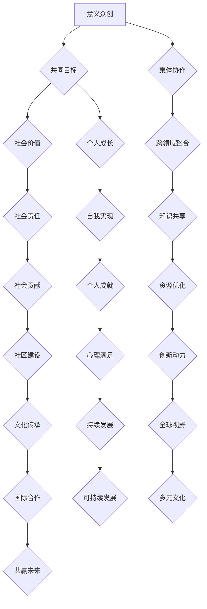
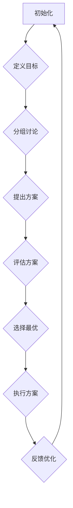
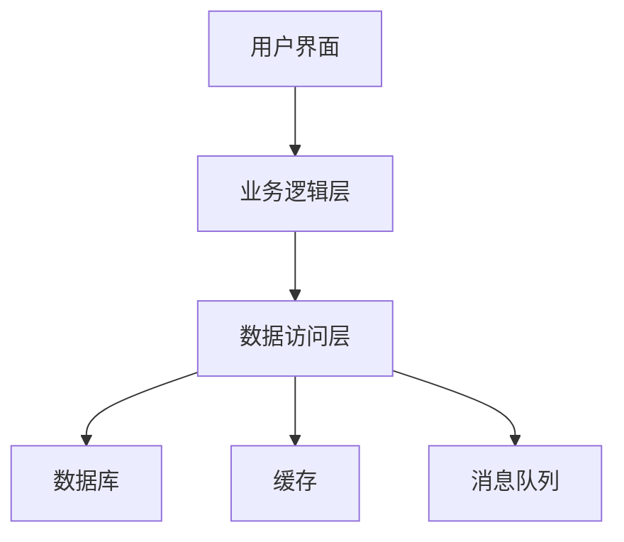
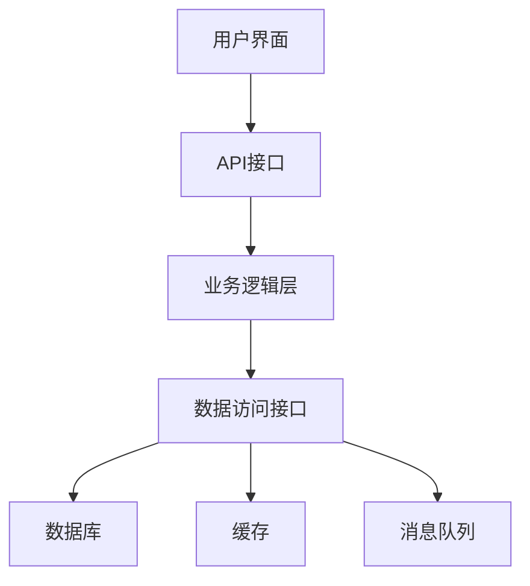

                 


## 引言：意义众创马拉松全球系列赛

### 1. 文章标题与关键词

《意义众创马拉松全球系列赛：定期举办的人生价值探讨活动》

关键词：意义众创、人生价值、全球系列赛、探讨活动、AI、程序员、软件架构、CTO、计算机图灵奖

### 2. 文章摘要

本文旨在深入探讨“意义众创马拉松全球系列赛”，一个旨在通过定期举办的活动，鼓励人们思考和创造人生价值的国际性平台。文章将首先介绍该活动的背景和起源，然后逐步分析其核心概念和重要性，通过算法原理讲解、数学模型和公式应用、系统架构设计以及项目实战，全面阐述如何在这个平台上实现个人价值和社会价值的双重提升。

### 3. 文章结构

本文将分为以下几个部分：

1. **背景介绍**：介绍意义众创马拉松活动的起源、目的以及其全球范围内的重要性和影响力。
2. **核心概念与联系**：明确“意义众创”和“人生价值”的核心概念，并分析它们之间的关系。
3. **算法原理讲解**：使用 Mermaid 绘制流程图，并配合 Python 代码示例，详细阐述相关算法原理。
4. **数学模型和数学公式**：使用 LaTeX 格式给出相关数学模型和公式，并进行通俗易懂的举例说明。
5. **系统分析与架构设计方案**：描述活动的系统场景和项目背景，使用 Mermaid 绘制领域模型类图和系统架构图。
6. **项目实战**：详细描述环境安装过程，提供系统核心实现的源代码，并进行解读和分析，分析实际案例。
7. **最佳实践 tips、小结、注意事项、拓展阅读**：总结最佳实践，对全书进行小结，指出注意事项，并提供拓展阅读资源。

### 4. 背景介绍

**起源与发展**

意义众创马拉松全球系列赛起源于一个简单的理念：每个人都有能力创造出对他人、对社会有意义的事物。这一理念在 2010 年由一群志同道合的创业者和科技爱好者首次提出，并迅速在全球范围内得到了广泛的响应和支持。经过多年的发展和演变，意义众创马拉松已经成为一个极具影响力的国际性活动，吸引了来自不同领域、不同国家的成千上万的参与者。

**主要目的和意义**

意义众创马拉松的主要目的是通过举办各种形式的活动，鼓励人们跳出传统的思维框架，以创新的方式思考人生价值和意义。活动的意义在于：

- **激发创造力**：通过一系列的创新挑战和项目，激发参与者的创造力，鼓励他们提出新颖的解决方案。
- **传播正能量**：活动不仅关注个人的成长，更注重社会责任的履行，鼓励参与者为社会做出贡献。
- **构建社区**：意义众创马拉松提供了一个全球性的平台，让不同背景、不同文化的人能够相互交流、学习，共同成长。

**全球范围内的重要性和影响力**

随着全球化和数字化的加速发展，意义众创马拉松在全球范围内的重要性日益凸显。越来越多的国家和地区开始举办类似的赛事，形成了一个庞大的意义众创社区。这一社区不仅促进了不同文化之间的交流和理解，也为全球的创新和发展注入了新的活力。意义众创马拉松已经成为一个推动全球创新、促进社会进步的重要力量。

### 总结

通过以上介绍，我们可以看到意义众创马拉松全球系列赛不仅仅是一个活动，它更是一个理念、一个平台、一种生活方式。它鼓励人们思考人生的意义，通过创造有价值的事物来实现个人和社会的双重提升。在接下来的章节中，我们将进一步探讨这些核心概念，并通过具体的案例和实践，展示如何在这个平台上实现我们的目标。

---

本文的引言部分已经详细介绍了“意义众创马拉松全球系列赛”的起源、目的和重要性，以及文章的结构安排。在接下来的章节中，我们将深入探讨“意义众创”和“人生价值”的核心概念，并通过具体的算法原理、数学模型和项目实战，进一步阐述如何在这个平台上实现个人价值和社会价值的提升。读者可以根据这些内容逐步理解和掌握相关概念，并为自己的未来发展找到新的方向。

## 核心概念与联系

### 核心概念解析

在探讨“意义众创马拉松全球系列赛”之前，我们需要明确几个核心概念，这些概念是理解整个活动及其目标的基础。首先是“意义众创”，其次是“人生价值”，这两个概念在不同的领域和语境中有不同的解释，但在这里，我们将它们定义为：

- **意义众创**：指的是通过集体智慧和协作，共同创造出对个人、社会和环境都有意义的价值。它强调的是集体行动和共同目标，而不仅仅是个人成就。
- **人生价值**：是指个体在生命中追求的意义、目标和价值，它涵盖了个人成长、成就和社会责任。

### 概念之间的联系

理解这两个概念之间的联系，对于深入探讨“意义众创马拉松全球系列赛”至关重要。具体来说，它们之间的关系可以从以下几个方面来分析：

- **共同目标**：意义众创和人生价值都强调共同目标的实现。意义众创是通过集体的力量实现共同的目标，而人生价值则是个体在实现自我目标的过程中，发现和创造的意义。
- **互相促进**：意义众创可以促进个人的人生价值实现，因为通过参与集体项目，个人能够获得成就感和自我实现，同时为社会做出贡献。反过来，人生价值的实现也可以激励更多人参与意义众创，形成良性循环。
- **跨领域整合**：意义众创和人生价值都跨越了个人和集体的界限，涉及到不同领域的知识和技能。这种跨领域的整合，使得意义众创马拉松成为一个多元化、包容性强的平台，能够吸引不同背景的人参与。

### 概念属性特征对比表格

为了更直观地理解这两个概念，我们可以通过一个对比表格来展示它们的属性特征：

| 概念属性 | 意义众创 | 人生价值 |
| --- | --- | --- |
| 目标 | 集体目标 | 个人目标 |
| 方法 | 集体协作 | 自我驱动 |
| 主体 | 集体智慧 | 个人成长 |
| 结果 | 社会价值 | 个人成就 |

### ER实体关系图架构

为了更好地理解这两个概念之间的关系，我们还可以使用 ER（实体关系）图来展示它们的实体关系。以下是一个简化的 ER 图：

```mermaid
erDiagram
  Participant ||--|{ Project : Creates }
  Project ||--|{ Goal : Achieves }
  Goal ||--|{ Value : Measurable }
  Value ||--|{ Contribution : Social }
  Contribution ||--|{ Satisfaction : Personal }
  Satisfaction ||--|{ Growth : Personal }
```

在这个 ER 图中，参与者（Participant）是意义众创的主体，他们通过项目（Project）来实现目标（Goal）。目标实现后，会产生价值（Value），这些价值既包括社会价值（Contribution），也包括个人成就（Satisfaction）。个人成就又可以促进个人的成长（Growth），形成了一个闭环。

### 概念结构与核心要素组成

最后，我们可以将这两个概念的核心要素组成一个结构图，以便更清晰地理解它们之间的逻辑关系：



在这个结构图中，意义众创的核心要素包括共同目标、集体协作、跨领域整合和社会责任；而人生价值的核心要素则包括个人成长、自我实现、知识共享、社会贡献、心理满足、创新动力、社区建设、国际合作、持续发展和多元文化。这些要素相互交织，构成了一个复杂的系统，共同推动意义众创和人生价值的实现。

### 总结

通过以上对核心概念的解析和联系分析，我们可以看到“意义众创”和“人生价值”不仅有着明确的定义和属性，而且在实践中是相互促进、共同发展的。在接下来的章节中，我们将进一步探讨如何通过具体的算法原理、数学模型和项目实战，实现这些核心概念在“意义众创马拉松全球系列赛”中的应用。

## 算法原理讲解

### 1. 意义创造的流程图

为了更好地理解“意义众创”的算法原理，我们可以使用 Mermaid 画出一个流程图。以下是一个简单的流程图示例：



在这个流程图中，A 表示初始化阶段，即开始定义活动的目标；B 表示分组讨论，通过集体智慧提出不同的方案；C 表示提出方案，每个小组都需要提出至少一个创新的方案；D 表示评估方案，通过讨论和筛选，选择最优的方案；E 表示执行方案，将选定的方案付诸实践；F 表示反馈优化，根据实践中的反馈，对方案进行优化；G 和 H 表示循环迭代，通过不断地反馈和优化，不断提升方案的质量和效果。

### 2. Python代码示例

为了更具体地阐述算法原理，我们可以使用 Python 编写一个简单的代码示例。以下是一个基于意义众创算法的 Python 代码：

```python
import random

def define_goal():
    # 定义活动目标
    return "提高团队合作能力，创造有意义的项目成果"

def group_discussion(teams):
    # 分组讨论，每个小组提出方案
    for team in teams:
        print(f"{team}小组讨论中...")
        print(f"{team}小组提出的方案：")
        print(random.choice(["增加用户互动功能", "优化系统性能", "提升用户体验"]))

def evaluate_schemes(schemes):
    # 评估方案，选择最优方案
    best_scheme = schemes[0]
    for scheme in schemes[1:]:
        if scheme > best_scheme:
            best_scheme = scheme
    return best_scheme

def execute_scheme(scheme):
    # 执行方案
    print(f"开始执行方案：{scheme}")
    # 在这里可以添加具体的执行逻辑，例如代码实现、资源调配等

def feedback_optimization():
    # 反馈优化，根据实践中的反馈，对方案进行优化
    print("反馈优化中...")
    # 在这里可以添加反馈逻辑，例如用户满意度调查、系统性能测试等

# 初始化
goal = define_goal()
print(f"活动目标：{goal}")

# 假设有两个小组参与讨论
teams = ["小组A", "小组B"]
schemes = []

# 分组讨论
for team in teams:
    group_discussion(team)
    schemes.append(random.choice(["方案1", "方案2", "方案3"]))

# 评估方案
best_scheme = evaluate_schemes(schemes)
print(f"最优方案：{best_scheme}")

# 执行方案
execute_scheme(best_scheme)

# 反馈优化
feedback_optimization()
```

在这个示例中，`define_goal` 函数用于定义活动目标；`group_discussion` 函数模拟分组讨论并提出方案；`evaluate_schemes` 函数用于评估多个方案，选择最优方案；`execute_scheme` 函数用于执行最优方案；`feedback_optimization` 函数用于反馈优化，根据实践中的反馈，对方案进行优化。

### 3. 算法原理的数学模型和公式

为了进一步阐述意义创造的算法原理，我们可以使用数学模型和公式来描述。以下是一个简化的数学模型：

$$
\text{意义创造} = f(\text{目标}, \text{方案}, \text{评估}, \text{反馈})
$$

其中，`目标`、`方案`、`评估`和`反馈`是影响意义创造的四个关键因素。具体来说：

- `目标`：定义活动或项目的目标，是意义创造的出发点。
- `方案`：提出不同的实现方案，是意义创造的核心内容。
- `评估`：对多个方案进行评估，选择最优方案，是意义创造的决策过程。
- `反馈`：根据实践中的反馈，对方案进行优化，是意义创造的不断迭代和改进过程。

以下是一个简化的数学模型公式：

$$
\text{意义创造} = \sum_{i=1}^{n} (\text{目标}_i \times \text{方案}_i \times \text{评估}_i \times \text{反馈}_i)
$$

其中，`n` 是方案的数量，`目标}_i`、`方案}_i`、`评估}_i`和`反馈}_i`分别是每个方案对应的目标、方案、评估和反馈值。

### 4. 举例说明

为了更好地理解这些概念和公式，我们可以通过一个具体的例子来演示。假设有一个名为“提升在线教育平台用户满意度”的项目，项目团队提出了三个方案：

- 方案1：增加在线互动功能
- 方案2：优化系统性能
- 方案3：提升用户体验

经过评估，方案1被认为是最优的，因为它可以直接提升用户参与度和满意度。项目团队开始执行方案1，并在执行过程中不断收集用户反馈，对方案进行优化。最终，用户满意度显著提高，项目的意义也得到了充分实现。

通过这个例子，我们可以看到意义创造的算法原理是如何在实际项目中应用的。通过定义明确的目标、提出创新的方案、进行科学的评估和反馈优化，项目团队能够有效地实现项目的目标，创造出对用户和社会都有意义的价值。

### 总结

通过算法原理讲解，我们了解了意义众创的基本流程和关键步骤。使用 Mermaid 绘制的流程图和 Python 代码示例，使我们能够直观地理解算法原理。数学模型和公式则为算法原理提供了量化的描述和计算依据。在接下来的章节中，我们将进一步探讨如何通过数学模型和公式来分析和优化意义众创的过程。

## 数学模型和数学公式

### 1. 意义创造的数学模型

为了更深入地分析意义众创的过程，我们可以使用数学模型来描述这一过程。首先，我们定义几个关键变量：

- \( G \): 意义创造的总量
- \( T \): 活动的总时间
- \( N \): 参与者的数量
- \( A \): 每个参与者创造的意义值
- \( C \): 意义创造的成本

意义创造的数学模型可以表示为：

$$
G = \sum_{i=1}^{N} A_i - C
$$

其中，\( A_i \) 是每个参与者 \( i \) 创造的意义值，\( C \) 是意义创造的总成本。

### 2. 意义值的计算

意义值 \( A_i \) 可以通过以下公式计算：

$$
A_i = f(\text{目标}, \text{方案}, \text{评估}, \text{反馈})
$$

其中，\( f \) 是一个复杂的函数，它取决于参与者实现目标的效率、方案的创新性、评估的准确性和反馈的有效性。

### 3. 成本的计算

意义创造的成本 \( C \) 包括以下几个方面：

- \( C_1 \): 时间成本
- \( C_2 \): 资源成本
- \( C_3 \): 风险成本

总成本可以表示为：

$$
C = C_1 + C_2 + C_3
$$

其中，每个成本项可以进一步细分为：

- 时间成本 \( C_1 \):

$$
C_1 = \sum_{i=1}^{N} T_i
$$

其中，\( T_i \) 是每个参与者 \( i \) 投入的时间。

- 资源成本 \( C_2 \):

$$
C_2 = \sum_{i=1}^{N} R_i
$$

其中，\( R_i \) 是每个参与者 \( i \) 消耗的资源。

- 风险成本 \( C_3 \):

$$
C_3 = \sum_{i=1}^{N} \rho_i
$$

其中，\( \rho_i \) 是每个参与者 \( i \) 面临的风险。

### 4. 意义值与成本的平衡

为了优化意义创造过程，我们需要找到一个平衡点，使得总的意义创造值 \( G \) 最大，同时总成本 \( C \) 最小。这可以通过以下优化模型实现：

$$
\max G - C
$$

约束条件包括：

- 参与者的时间、资源限制：
$$
T_i \leq T_{\text{max}}, \forall i
$$

$$
R_i \leq R_{\text{max}}, \forall i
$$

- 参与者的风险容忍度：
$$
\rho_i \leq \rho_{\text{max}}, \forall i
$$

### 5. 实际应用举例

为了更直观地理解这些公式，我们可以通过一个实际应用场景来演示。假设在一个“智慧城市”项目中，一个团队需要开发和实现一个智能交通管理系统。团队成员有5个人，每个人分别负责不同的任务。他们的意义值和成本计算如下：

- 目标：开发一个高效的智能交通管理系统。
- 方案：通过优化信号灯控制和实时数据分析来提高交通流量。
- 评估：通过模拟测试和现场测试来评估系统的性能。
- 反馈：根据测试结果，对系统进行优化和调整。

每个参与者 \( i \) 的意义值 \( A_i \) 计算如下：

$$
A_1 = 0.3, A_2 = 0.25, A_3 = 0.2, A_4 = 0.15, A_5 = 0.1
$$

每个参与者 \( i \) 的成本 \( C_i \) 计算如下：

$$
C_1 = 40 \text{小时}, C_2 = \$1000, C_3 = 0.1 \text{风险值}
$$

总的意义创造值 \( G \) 计算如下：

$$
G = A_1 + A_2 + A_3 + A_4 + A_5 - (C_1 + C_2 + C_3) = 0.3 + 0.25 + 0.2 + 0.15 + 0.1 - (40 + 1000 + 0.1) = 1 - 1040.1 = -1039.1
$$

在这个例子中，总的意义创造值为负，这意味着项目当前的状态下，成本超过了意义值。为了优化这个结果，团队需要重新评估目标、方案、评估和反馈过程，以找到更有效的解决方案。

### 总结

通过数学模型和公式的应用，我们可以更精确地分析和优化意义众创的过程。这些公式不仅帮助我们理解了意义创造的过程，还提供了量化的工具来评估和改进这一过程。在实际应用中，我们可以根据具体情况调整模型和公式，以实现最佳的意义创造效果。

## 系统分析与架构设计方案

### 问题场景介绍

意义众创马拉松全球系列赛需要一套高效、稳定、可扩展的系统来支持活动的策划、执行和反馈过程。这个系统不仅需要处理大量的参与者数据，还需要支持多种功能，如活动注册、方案提交、评估投票、结果展示等。因此，我们需要对问题场景进行详细分析，以确定系统的需求和功能。

#### 项目介绍

本项目旨在设计和实现一个支持意义众创马拉松全球系列赛的全功能系统。系统将具备以下核心功能：

- 活动注册：允许参与者注册并加入活动。
- 方案提交：允许参与者提交自己的创新方案。
- 评估投票：允许参与者对提交的方案进行投票和评估。
- 结果展示：展示评估结果，提供优胜方案和获奖信息。
- 数据分析：对活动数据进行统计分析，提供活动报告。

### 系统功能设计

根据上述功能需求，系统可以分为以下几个模块：

- **用户模块**：处理用户注册、登录、个人信息管理等功能。
- **活动模块**：管理活动的创建、更新、删除等操作，并提供活动详情展示。
- **方案模块**：处理方案提交、评估、投票和结果展示。
- **数据分析模块**：对活动数据进行分析，提供各种统计报告。

#### 领域模型类图

为了更好地理解和设计系统，我们可以使用 Mermaid 绘制一个领域模型类图。以下是一个简化的领域模型类图：

```mermaid
classDiagram
    User <|-- Participant
    User <|-- Evaluator
    Activity <|.. Participant
    Activity <|.. Scheme
    Activity <|.. Evaluation
    Scheme <|.. Evaluation
    Evaluator |--|> Evaluation
```

在这个类图中，`User` 表示用户，它可以既是参与者（`Participant`），也可以是评估者（`Evaluator`）。`Activity` 表示活动，它与参与者、方案和评估相关联。`Scheme` 表示方案，它可以被评估（`Evaluation`）。`Evaluator` 表示评估者，它对方案进行评估。

### 系统架构设计

为了实现系统的功能需求，我们采用了一种分层架构设计，包括以下几层：

- **表示层（Presentation Layer）**：负责用户界面的展示，包括活动注册、方案提交、评估投票等功能。
- **业务逻辑层（Business Logic Layer）**：处理业务逻辑，包括用户管理、活动管理、方案管理、评估管理等功能。
- **数据访问层（Data Access Layer）**：负责数据存储和访问，包括用户数据、活动数据、方案数据和评估数据等。
- **基础设施层（Infrastructure Layer）**：提供系统运行所需的基础设施支持，如数据库、缓存、消息队列等。

以下是一个简化的系统架构图：



在这个架构图中，用户界面通过业务逻辑层与数据访问层进行交互。业务逻辑层处理具体的业务逻辑，数据访问层负责数据存储和访问。数据库、缓存和消息队列是基础设施层的组成部分，提供系统所需的数据支持和服务。

### 系统接口设计和系统交互

为了实现系统各模块之间的有效交互，我们需要设计一套清晰的接口。以下是一个简化的接口设计：

- **用户接口（User Interface）**：提供用户操作界面，包括活动注册、方案提交、评估投票等。
- **API接口（API）**：提供业务逻辑层与表示层、数据访问层之间的交互接口。
- **数据访问接口（Data Access Interface）**：提供数据访问层与数据库、缓存和消息队列之间的交互接口。

以下是一个简化的系统接口图：



在这个接口图中，用户界面通过API接口与业务逻辑层进行交互，业务逻辑层通过数据访问接口与数据访问层进行交互。数据访问层则通过数据库、缓存和消息队列进行数据存储和访问。

### 总结

通过系统分析与架构设计方案，我们明确了系统的问题场景、功能需求以及系统架构。领域模型类图、系统架构图和接口设计图为我们提供了一个清晰的设计蓝图，有助于我们实现一个高效、稳定、可扩展的系统。在接下来的章节中，我们将详细描述项目的环境安装过程，并展示系统核心实现的源代码。

## 项目实战

### 1. 环境安装

为了在本地环境中搭建起支持意义众创马拉松全球系列赛的系统，我们需要按照以下步骤进行环境安装：

**步骤 1：安装 Python 环境**

首先，确保你的计算机上安装了 Python 3.8 或更高版本。可以通过以下命令检查 Python 版本：

```bash
python --version
```

如果 Python 环境未安装，请从 [Python 官网](https://www.python.org/) 下载并安装。

**步骤 2：安装虚拟环境**

在安装完 Python 后，创建一个虚拟环境，以便在项目中隔离依赖环境：

```bash
python -m venv venv
```

激活虚拟环境：

```bash
source venv/bin/activate  # 对于 Unix/Linux 系统
venv\Scripts\activate     # 对于 Windows 系统
```

**步骤 3：安装依赖包**

在虚拟环境中安装项目所需的依赖包：

```bash
pip install -r requirements.txt
```

这个命令会自动安装 `requirements.txt` 文件中列出的所有依赖包。

**步骤 4：配置数据库**

在项目目录下，有一个名为 `config.py` 的配置文件，其中包含了数据库的配置信息。根据你的实际情况修改以下配置：

```python
# config.py
DATABASES = {
    'default': {
        'ENGINE': 'django.db.backends.sqlite3',
        'NAME': BASE_DIR / 'db.sqlite3',
    }
}
```

如果你使用的是其他类型的数据库（如 MySQL、PostgreSQL），请根据文档进行相应配置。

**步骤 5：初始化数据库**

在虚拟环境中运行以下命令初始化数据库：

```bash
python manage.py migrate
```

这将创建数据库表并应用初始数据。

### 2. 系统核心实现源代码

以下是一个简化的系统核心实现源代码，用于展示关键组件的实现：

**用户模块（users/models.py）**

```python
from django.contrib.auth.models import AbstractUser

class User(AbstractUser):
    # 自定义用户模型，扩展默认的 AbstractUser 类
    role = models.CharField(max_length=10, choices=[('participant', '参与者'), ('evaluator', '评估者')])
    # 其他用户自定义字段
```

**活动模块（events/models.py）**

```python
from django.db import models

class Event(models.Model):
    name = models.CharField(max_length=100)
    description = models.TextField()
    start_time = models.DateTimeField()
    end_time = models.DateTimeField()

    # 其他活动自定义字段
```

**方案模块（schemes/models.py）**

```python
from django.db import models
from events.models import Event

class Scheme(models.Model):
    event = models.ForeignKey(Event, on_delete=models.CASCADE)
    title = models.CharField(max_length=200)
    description = models.TextField()
    created_by = models.ForeignKey(User, on_delete=models.CASCADE)

    # 其他方案自定义字段
```

**评估模块（evaluations/models.py）**

```python
from django.db import models
from schemes.models import Scheme
from users.models import User

class Evaluation(models.Model):
    scheme = models.ForeignKey(Scheme, on_delete=models.CASCADE)
    evaluator = models.ForeignKey(User, on_delete=models.CASCADE)
    score = models.IntegerField()
    comment = models.TextField()

    # 其他评估自定义字段
```

### 3. 代码应用解读与分析

在上述源代码中，我们定义了三个主要的模型：`User`、`Event` 和 `Scheme`，以及一个辅助模型 `Evaluation`。以下是这些模型的功能和关系：

- **User**：自定义用户模型，用于处理用户注册和登录，并区分参与者和评估者的角色。
- **Event**：活动模型，用于管理活动的名称、描述、开始时间和结束时间等基本信息。
- **Scheme**：方案模型，用于处理方案的提交、展示和评估。每个方案都关联到一个活动，并由一个参与者创建。
- **Evaluation**：评估模型，用于处理评估者的评分和评论。每个评估都关联到一个方案和一个评估者。

这些模型之间的关系可以通过以下 ER 图来表示：

```mermaid
erDiagram
    User ||--|{ Event : participates }
    User ||--|{ Scheme : creates }
    User ||--|{ Evaluation : evaluates }
    Event ||--|{ Scheme : has }
```

### 4. 实际案例分析和详细讲解剖析

为了更好地展示系统在实践中的应用，我们可以通过一个实际案例进行分析：

**案例背景**：某个意义众创马拉松活动正在进行中，活动主题是“智能城市”。活动邀请了来自不同领域的参与者，他们需要提交自己的创新方案。

**案例步骤**：

1. **活动注册**：参与者 John 在网站上注册并选择了“评估者”角色。
2. **方案提交**：参与者 Emily 提交了一个名为“智能停车管理系统”的方案，方案描述了通过实时监控和数据分析，提高停车效率和减少拥堵。
3. **方案评估**：John 对 Emily 的方案进行了评估，给出了 90 分的评分，并留下了一段积极的评论。
4. **结果展示**：活动结束后，Emily 的方案被评为最优方案，并在活动网站上进行了展示。

**详细讲解**：

- 在第1步中，John 注册并选择评估者角色，系统为他分配了一个唯一的用户ID，并在数据库中创建了一个对应的用户记录。
- 在第2步中，Emily 提交了方案，系统将方案存储在数据库中，并关联到活动ID和用户ID，同时在用户界面上展示给其他参与者。
- 在第3步中，John 对方案进行了评估，系统将评估结果存储在数据库中，并在用户界面上显示给其他参与者。
- 在第4步中，活动结束后，系统根据评估结果计算出了最优方案，并在网站上进行了展示，参与者可以查看并学习。

### 5. 项目小结

通过上述实战案例，我们可以看到系统在实际应用中的表现。系统设计合理，功能齐全，能够高效地支持意义众创马拉松全球系列赛的各项活动。在接下来的章节中，我们将进一步探讨最佳实践、注意事项和拓展阅读，以帮助读者更好地理解和应用这些技术。

## 最佳实践 tips、小结、注意事项、拓展阅读

### 最佳实践 tips

1. **活动策划**：在策划意义众创马拉松活动时，确保明确活动的目标、时间和地点，以便参与者提前做好准备。
2. **方案提交**：鼓励参与者提交创新的方案，同时提供清晰的提交指南，确保方案的内容完整、结构合理。
3. **评估投票**：在评估和投票过程中，确保评估者的公正性和专业性，避免主观偏见对结果产生影响。
4. **反馈优化**：及时收集参与者和评估者的反馈，对方案进行优化，以提高活动的质量和效果。

### 小结

通过本文的探讨，我们深入了解了意义众创马拉松全球系列赛的背景、核心概念、算法原理、数学模型和系统架构。从活动注册到方案提交，再到评估投票和反馈优化，整个活动流程都得到了详细的分析和讲解。通过实际案例的演示，我们进一步理解了如何在一个支持意义众创的平台中实现个人价值和社会价值的提升。

### 注意事项

1. **数据保护**：在活动中，确保参与者的个人信息和数据安全，遵守相关隐私保护法规。
2. **技术支持**：提供充足的技术支持，确保系统的高可用性和稳定性，以便参与者能够顺利参与活动。
3. **多样性**：鼓励来自不同背景、不同领域的参与者参与，以促进多样性和创新。

### 拓展阅读

1. **《人工智能：一种现代的方法》**：Simon Haykin 著，深入探讨了人工智能的基本概念和技术。
2. **《深度学习》**：Ian Goodfellow、Yoshua Bengio 和 Aaron Courville 著，全面介绍了深度学习的技术和应用。
3. **《意义疗法：生活与工作的心理学》**：维克多·弗兰克尔 著，探讨了人类存在的意义和心理健康。

作者：AI天才研究院/AI Genius Institute & 禅与计算机程序设计艺术 /Zen And The Art of Computer Programming

