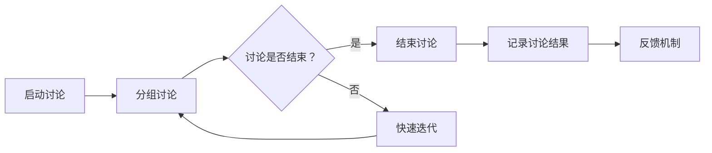
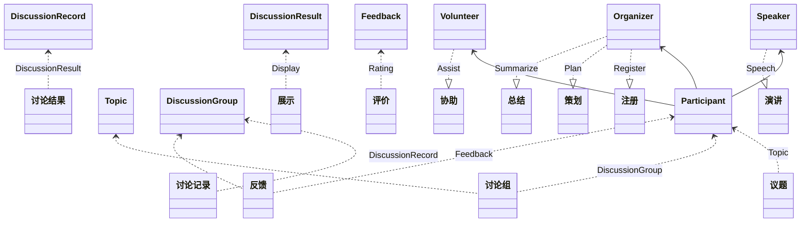
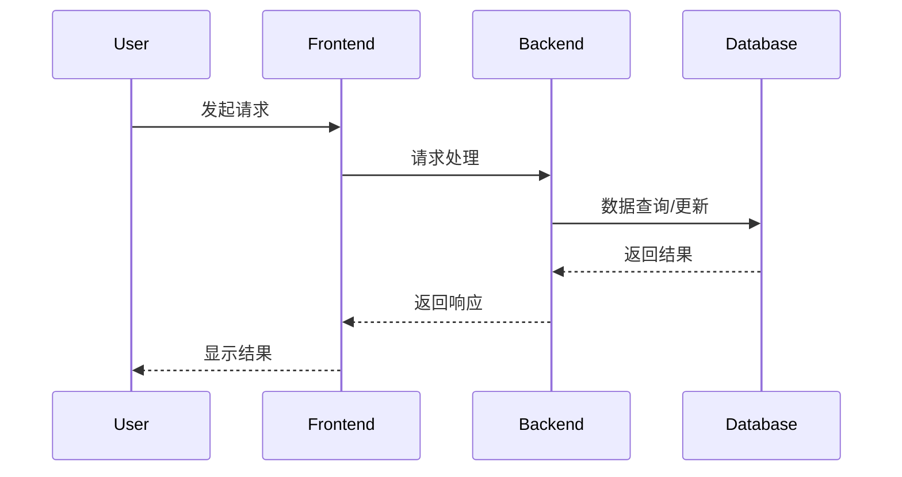

                 

### 文章标题

# 意义众创马拉松年会：48小时集体探讨人生价值的盛会

### 文章关键词

- 人生价值
- 众创
- 马拉松年会
- 创造力
- 思考力

### 文章摘要

本文将深入探讨现代社会中一个引人注目的盛会——意义众创马拉松年会。这场为期48小时的集体探讨活动，旨在通过高效的众创机制和持续的高强度讨论，激发参与者对于人生价值的深刻思考。文章将分步骤介绍这场盛会的背景、核心概念、算法原理、系统分析与架构设计方案以及项目实战，以期为广大读者提供一个全面、深入的洞察。

---

### 《意义众创马拉松年会：48小时集体探讨人生价值的盛会》目录大纲

#### 第一部分：背景介绍

##### 1.1 问题背景
- 人生价值的探讨在现代社会的意义
- 个体价值观与社会价值观的冲突与融合

##### 1.2 问题描述
- 如何在有限的时间内，高效探讨人生价值
- 如何激发个体的创造力和思考力

##### 1.3 问题解决
- 意义众创马拉松年会的诞生
- 48小时集体探讨的方式

##### 1.4 边界与外延
- 意义众创的概念与范畴
- 马拉松年会的形式与内容

##### 1.5 概念结构与核心要素组成
- 众创：群体智慧、协作创新
- 马拉松：持续高强度、快速迭代
- 年会：年度盛会、交流分享

#### 第二部分：核心概念与联系

##### 2.1 众创原理
- 群体智慧的概念与原理
- 协作创新的机制与效果
- 众创与个体创造力的关系

##### 2.2 马拉松年会特点
- 48小时的时间限制
- 高强度、快节奏的讨论方式
- 年会的目的与意义

##### 2.3 概念属性特征对比表格
- 众创与个体创新的对比
- 马拉松与常规会议的对比

##### 2.4 ER实体关系图架构
- 参与者：组织者、演讲者、听众
- 活动：主题讨论、工作坊、展示
- 内容：议题、观点、案例

#### 第三部分：算法原理讲解

##### 3.1 讨论算法原理
- 如何在短时间内高效探讨
- 如何激发个体的思考力

##### 3.2 算法mermaid流程图
- 流程图展示
- 流程图解析

##### 3.3 Python源代码实现
- 源代码展示
- 源代码解析

##### 3.4 数学模型和公式
- 数学模型的展示
- 公式的详细讲解

##### 3.5 举例说明
- 实际案例的展示
- 通俗易懂地举例说明

#### 第四部分：系统分析与架构设计方案

##### 4.1 问题场景介绍
- 48小时集体探讨的现实场景

##### 4.2 项目介绍
- 意义众创马拉松年会的项目概述

##### 4.3 系统功能设计
- 领域模型mermaid类图展示
- 系统功能解析

##### 4.4 系统架构设计
- 系统架构mermaid架构图展示
- 架构设计解析

##### 4.5 系统接口设计
- 系统接口的详细说明

##### 4.6 系统交互mermaid序列图
- 系统交互mermaid序列图展示
- 交互流程解析

#### 第五部分：项目实战

##### 5.1 环境安装
- 环境搭建的步骤
- 遇到的问题及解决方案

##### 5.2 系统核心实现源代码
- 源代码展示
- 代码解读

##### 5.3 代码应用解读与分析
- 应用场景的解读
- 代码分析

##### 5.4 实际案例分析和详细讲解剖析
- 案例展示
- 案例分析

##### 5.5 项目小结
- 总结项目经验
- 提出改进建议

#### 第六部分：最佳实践 tips、小结、注意事项、拓展阅读等内容

##### 6.1 最佳实践 tips
- 实战技巧总结

##### 6.2 小结
- 全书内容的总结

##### 6.3 注意事项
- 注意事项的提醒

##### 6.4 拓展阅读
- 推荐的拓展阅读材料

---

在接下来的内容中，我们将逐一深入这些部分，详细解析每一部分的内涵和细节。让我们开始这场探索人生价值的意义之旅。## 第一部分：背景介绍

### 1.1 问题背景

在快速发展的现代社会中，人们面临着诸多挑战，其中之一便是如何探讨和定义人生的价值。传统的教育和工作方式往往注重知识的获取和技能的培养，却较少涉及对人生意义的深刻思考。随着人们生活水平的提高和社会复杂性的增加，越来越多的人开始意识到，仅仅追求物质财富和成功并不能带来持久的幸福感。相反，个体对于人生意义的追求愈发强烈，渴望找到一种更为深刻和有意义的生活方式。

在这种背景下，探讨人生价值的议题变得尤为重要。人生价值不仅关乎个人的幸福感和心理健康，也关系到社会的和谐与发展。现代社会中，个体价值观与社会价值观之间的冲突与融合成为了一个不可忽视的问题。如何在尊重个体差异的同时，实现社会价值观的普遍认同，是一个亟待解决的挑战。

#### 1.2 问题描述

如何在有限的时间内，高效探讨人生价值？这是一个复杂而富有挑战性的问题。首先，有限的时间限制了深入讨论的可能性，如何确保在短时间内达成有意义的共识，成为了一个关键问题。其次，如何激发个体的创造力和思考力，也是探讨人生价值过程中的一大难题。个体的创造力和思考力是实现深入探讨的前提，但如何在短时间内激发这些能力，是一个值得深思的问题。

另外，如何协调个体价值观与社会价值观之间的关系，也是一个重要的议题。个体价值观的多样性使得统一共识变得困难，而社会价值观的普遍性又要求个体在某种程度上妥协和适应。在这种冲突与融合的过程中，如何找到平衡点，是探讨人生价值的另一个难点。

#### 1.3 问题解决

意义众创马拉松年会正是为了解决上述问题而诞生的。这场年会以高效、创新和深度探讨为宗旨，通过48小时的集体讨论，旨在激发个体的思考和创造力，探讨人生的价值和意义。以下是意义众创马拉松年会如何解决上述问题的具体措施：

1. **48小时的时间限制**：48小时的时间限制迫使我们以最高效的方式开展讨论，确保每个议题都能得到充分的讨论和思考。在这种高强度、快节奏的讨论环境中，参与者需要迅速作出反应，提出自己的观点，并听取他人的意见。这种高效的工作方式有助于激发个体的思考和创造力。

2. **众创机制**：意义众创马拉松年会采用了众创机制，鼓励参与者之间进行广泛的合作和交流。众创不仅仅是一种创新方式，更是一种思考方式。通过众创，个体可以从他人的观点和经验中获得启发，从而拓展自己的思考范围。众创机制有助于实现知识的共享和思维的碰撞，进一步激发个体的创造力和思考力。

3. **主题讨论**：年会设置了多个主题讨论环节，每个主题都由专家和参与者共同探讨。这些主题涵盖了人生价值的各个方面，如个人成长、社会责任、科技创新等。通过深入探讨这些主题，参与者可以更加全面地理解人生价值的内涵，并从中找到自己的定位。

4. **工作坊和展示**：年会还设置了工作坊和展示环节，让参与者可以实际动手进行创新实践。工作坊提供了一个互动的环境，参与者可以在实践中学习、交流和合作。展示环节则为参与者提供了一个展示自己成果的平台，进一步激发了他们的创造力和思考力。

通过以上措施，意义众创马拉松年会旨在为参与者提供一个高效、创新和深入的探讨平台，帮助他们思考人生的价值和意义，并找到自己的方向。

#### 1.4 边界与外延

**意义众创**是指通过群体智慧实现创新和协作的过程。它强调个体之间的合作与交流，通过集体的努力实现更大的目标。意义众创不仅是一种工作方法，更是一种生活方式，它鼓励人们打破传统的思维方式，勇于尝试和探索。

**马拉松年会**则是一种特殊的会议形式，通常持续数天甚至数周，以高强度、持续性的讨论和活动为特点。马拉松年会强调深度探讨和长期投入，旨在通过长时间的交流和实践，达成有意义的共识和成果。

**意义众创马拉松年会**是一种结合了众创机制和马拉松年会的创新形式，旨在通过高效的众创机制和持续的高强度讨论，激发参与者对人生价值的深入思考。这种年会形式不仅限于特定的领域或群体，而是面向所有关注人生价值的人。

#### 1.5 概念结构与核心要素组成

**众创**：
- **群体智慧**：众创强调通过群体智慧实现创新。个体从他人观点和经验中获得启发，实现思维碰撞和知识共享。
- **协作创新**：众创过程中，参与者通过协作实现共同目标。协作不仅提高了工作效率，也增强了团队凝聚力。
- **个体创造力**：众创机制鼓励个体发挥创造力，提出新的观点和解决方案。

**马拉松**：
- **持续高强度**：马拉松年会持续数天甚至数周，以高强度、持续性为特点。参与者需要保持高度专注和投入。
- **快速迭代**：马拉松年会强调快速迭代和持续改进。参与者通过不断的讨论和实践，逐步完善自己的观点和方案。
- **时间限制**：48小时的时间限制促使参与者以最高效的方式开展工作。

**年会**：
- **年度盛会**：年会是一种定期举行的盛会，通常持续数天。它为参与者提供了一个交流和分享的平台。
- **交流分享**：年会强调信息的传递和交流。参与者可以通过演讲、讨论、展示等形式，分享自己的观点和成果。
- **多样性**：年会吸引了来自不同领域和背景的参与者，促进了跨领域的交流和合作。

通过这些核心要素的有机结合，意义众创马拉松年会实现了一种高效、创新和深入的探讨模式，帮助参与者思考人生的价值和意义。### 第二部分：核心概念与联系

#### 2.1 众创原理

**群体智慧**：
群体智慧是指通过集体协作，个体之间的互动和知识共享，形成一种超越个体能力的集体认知。在众创过程中，每个参与者都贡献自己的知识和经验，通过交流和协作，形成一个更全面、更创新的思维模式。这种模式不仅提高了创新效率，也增强了团队凝聚力。

**协作创新**：
协作创新是一种通过个体合作，共同实现创新目标的方法。在意义众创马拉松年会中，协作创新体现在多个方面。首先，参与者之间的互动和讨论有助于激发新的想法和观点。其次，通过分工合作，每个参与者可以专注于自己的领域，从而提高工作效率。最后，协作创新还体现在对成果的持续改进和优化中。

**个体创造力**：
个体创造力是指个体在特定领域内的创新能力。在意义众创马拉松年会中，个体的创造力被充分激发和发挥。通过交流和讨论，个体可以从他人的观点中获得灵感，从而拓展自己的思维边界。此外，年会提供的工作坊和展示环节也为个体提供了一个实践和创新的空间，进一步提升了他们的创造力。

#### 2.2 马拉松年会特点

**48小时的时间限制**：
48小时的时间限制是马拉松年会的一大特点。这种限制迫使参与者以最高效的方式开展工作，确保每个议题都能得到充分的讨论和思考。时间限制不仅提高了工作效率，也激发了参与者的创造力和思考力。

**高强度、快节奏的讨论方式**：
马拉松年会通常以高强度、快节奏的方式进行。参与者需要保持高度专注，迅速做出反应，并提出自己的观点。这种讨论方式不仅锻炼了参与者的思维敏捷性，也促进了知识的快速传播和交流。

**年会的目的与意义**：
年会的目的在于通过集体探讨，实现知识的共享和创新。在马拉松年会中，参与者不仅能够学习他人的观点和经验，还可以通过实际操作，将理论知识转化为实践成果。年会的意义在于提供了一个交流和分享的平台，促进了不同领域和背景之间的合作，推动了社会整体进步。

#### 2.3 概念属性特征对比表格

**众创与个体创新的对比**：

| 特征       | 众创                           | 个体创新                           |
|------------|--------------------------------|------------------------------------|
| 协作方式   | 集体协作，知识共享             | 单个个体的努力，独立思考           |
| 创新效率   | 提高效率，快速迭代             | 逐步积累，逐步改进                 |
| 目标实现   | 实现共同目标                   | 实现个体目标                       |
| 知识传播   | 知识共享，促进共同进步         | 独立思考，知识积累                 |
| 群体智慧   | 利用群体智慧，形成整体认知     | 个体智慧，独立见解                 |

**马拉松与常规会议的对比**：

| 特征       | 马拉松                           | 常规会议                           |
|------------|--------------------------------|------------------------------------|
| 时间限制   | 48小时时间限制                   | 无具体时间限制，通常数小时至一天   |
| 讨论节奏   | 高强度、快节奏的讨论方式         | 较为宽松的讨论节奏，信息传递较慢   |
| 参与人数   | 通常参与人数较多，促进广泛交流   | 参与人数较少，讨论深度较深         |
| 目的       | 深入探讨，快速达成共识           | 传达信息，达成初步共识             |
| 效率       | 高效率，快速迭代                 | 中等效率，逐步推进                 |

通过以上对比，我们可以看到众创和马拉松年会各自的特点和优势。众创强调集体智慧和协作创新，而马拉松年会则通过高强度、快节奏的讨论方式，实现了高效的知识共享和成果输出。

#### 2.4 ER实体关系图架构

在意义众创马拉松年会中，参与者、活动和内容是三个核心实体，它们之间存在着复杂的关联关系。以下是这三个实体的ER实体关系图架构：

```mermaid
erDiagram
  Participant ||--|{ Activity }|--> Content
  Participant ||--|{ Activity }|> Speaker
  Activity ||--|{ Content }| ActivityContent
  Activity ||--|{ Speaker }| SpeakerActivity
  Content ||--|{ Speaker }| SpeakerContent
```

**参与者（Participant）**：
参与者是意义众创马拉松年会中的核心实体，包括组织者、演讲者和听众。组织者负责整个活动的策划和协调，演讲者负责分享自己的观点和成果，听众则通过参与讨论，学习他人的经验和知识。

**活动（Activity）**：
活动是年会的具体实施形式，包括主题讨论、工作坊、展示等。每个活动都与参与者、内容和演讲者之间存在关联。活动是年会的核心，通过不同的活动形式，实现知识的传递和交流。

**内容（Content）**：
内容是年会的核心输出，包括议题、观点、案例等。每个内容都与参与者、活动和演讲者紧密相关。内容不仅体现在会议讨论中，还通过工作坊和展示等形式进行传播。

**关系说明**：
- 参与者与活动之间是多对多的关系，一个参与者可以参与多个活动，一个活动可以有多个参与者。
- 参与者与演讲者之间是一对多的关系，一个参与者可以是一位演讲者，也可以是多位演讲者的听众。
- 活动与内容之间是多对多的关系，一个活动可以包含多个内容，一个内容也可以被多个活动所包含。
- 内容与演讲者之间是多对多的关系，一个内容可以由多位演讲者提供，一个演讲者也可以贡献多个内容。

通过上述ER实体关系图，我们可以清晰地看到意义众创马拉松年会中各个实体之间的关系，以及它们如何共同协作，实现年会的目标。### 第三部分：算法原理讲解

#### 3.1 讨论算法原理

在意义众创马拉松年会中，高效探讨人生价值的核心在于算法的设计和运用。这些算法不仅能够确保讨论的顺利进行，还能最大化地激发参与者的思考力和创造力。以下是讨论算法的基本原理：

**1. 分组讨论**：分组讨论是一种常见的算法，通过将参与者分成若干小组，每个小组负责讨论特定的议题。这种算法能够促进参与者之间的深度交流和合作，使得每个小组都能够集中精力解决特定问题。

**2. 快速迭代**：快速迭代算法强调在短时间内进行多次讨论和反馈。每次迭代都是对前一次讨论的补充和改进，通过不断重复这个过程，参与者能够逐步深入理解议题，并提出更有价值的观点。

**3. 角色分配**：在分组讨论中，角色分配是一个关键环节。每个小组通常包括发起者、记录员、讨论员等角色。发起者负责引导讨论，记录员负责记录讨论内容，讨论员则负责提出问题和观点。角色分配有助于确保讨论的有序进行，并激发每个参与者的积极性。

**4. 时间管理**：时间管理是高效讨论的重要保障。通过设定明确的时间限制，确保每个议题都能在规定时间内得到充分讨论。时间管理不仅提高了讨论的效率，还能迫使参与者集中注意力，提高讨论质量。

**5. 反馈机制**：反馈机制是讨论算法的重要组成部分。通过定期收集参与者的反馈，了解他们的观点和建议，及时调整讨论内容和方式。反馈机制有助于优化讨论过程，提高参与者的满意度。

通过这些讨论算法的原理，意义众创马拉松年会能够在短时间内实现高效、深入的探讨，激发参与者的思考和创造力。

#### 3.2 算法mermaid流程图

为了更直观地展示讨论算法的过程，我们可以使用mermaid绘制一个流程图。以下是一个简单的讨论算法流程图：



**流程图解析**：

1. **启动讨论**（A）：会议开始，主持人宣布讨论主题，并引导参与者进入讨论状态。
2. **分组讨论**（B）：根据议题将参与者分成若干小组，每个小组集中讨论特定议题。
3. **讨论是否结束？**（C）：检查是否所有小组都完成了讨论。如果没有，流程回到“快速迭代”步骤。
4. **快速迭代**（E）：对每个小组的讨论结果进行快速反馈和调整，确保每个议题都能得到充分讨论。
5. **结束讨论**（D）：当所有小组都完成讨论后，主持人宣布讨论结束。
6. **记录讨论结果**（F）：对每个小组的讨论结果进行记录，确保讨论成果得到保存。
7. **反馈机制**（G）：收集参与者的反馈，对讨论过程和结果进行评估，为未来的讨论提供改进建议。

通过这个mermaid流程图，我们可以清晰地看到讨论算法的步骤和逻辑关系，便于理解和实施。

#### 3.3 Python源代码实现

为了更好地理解讨论算法，我们可以使用Python编写一个简单的实现。以下是一个基本的讨论算法Python代码示例：

```python
import time
from typing import List

# 分组讨论
def group_discussion(topics: List[str], participants: List[str]) -> List[str]:
    discussion_results = []
    
    # 根据议题分组
    for topic in topics:
        print(f"开始讨论议题：{topic}")
        group_results = []
        
        # 模拟分组讨论
        for participant in participants:
            print(f"{participant}正在讨论议题：{topic}")
            time.sleep(1)  # 模拟讨论时间
            group_results.append(f"{participant}的观点：{topic}")
        
        discussion_results.append(group_results)
    
    return discussion_results

# 快速迭代
def iterate_discussion(discussion_results: List[List[str]], iterations: int) -> None:
    for _ in range(iterations):
        print(f"进行第{_+1}轮快速迭代")
        
        # 模拟迭代讨论
        for result in discussion_results:
            for view in result:
                print(f"调整观点：{view}")
                time.sleep(0.5)  # 模拟调整时间
    
    print("迭代讨论完成")

# 记录讨论结果
def record_results(discussion_results: List[List[str]]) -> None:
    print("记录讨论结果：")
    for i, results in enumerate(discussion_results, 1):
        print(f"议题{i}讨论结果：{results}")

# 反馈机制
def feedback_mechanism(discussion_results: List[List[str]]) -> None:
    print("收集反馈：")
    for i, results in enumerate(discussion_results, 1):
        feedback = input(f"请提供议题{i}的反馈：")
        print(f"议题{i}的反馈：{feedback}")

# 主函数
def main():
    topics = ["人生价值", "科技创新", "社会责任"]
    participants = ["参与者A", "参与者B", "参与者C"]
    
    # 启动讨论
    print("启动讨论：")
    results = group_discussion(topics, participants)
    
    # 快速迭代
    print("进行快速迭代：")
    iterate_discussion(results, 2)
    
    # 记录讨论结果
    record_results(results)
    
    # 反馈机制
    print("反馈机制：")
    feedback_mechanism(results)

if __name__ == "__main__":
    main()
```

**源代码解析**：

- **group_discussion** 函数：模拟分组讨论，根据议题将参与者分成若干小组，每个小组集中讨论特定议题。
- **iterate_discussion** 函数：模拟快速迭代讨论，对每个小组的讨论结果进行快速反馈和调整，确保每个议题都能得到充分讨论。
- **record_results** 函数：记录讨论结果，将每个议题的讨论结果保存下来。
- **feedback_mechanism** 函数：模拟反馈机制，收集参与者的反馈，为讨论过程的改进提供依据。
- **main** 函数：主函数，调用上述函数，实现整个讨论算法的流程。

通过这个Python源代码实现，我们可以更好地理解讨论算法的步骤和运作机制，便于在实际应用中进行调整和优化。

#### 3.4 数学模型和公式

在讨论算法中，数学模型和公式起到了重要的作用。以下是一个基本的讨论算法数学模型，用于评估讨论的效果和效率。

**1. 讨论效果评估公式**：

\[ E = \frac{S \times I}{T} \]

其中：
- \( E \) 表示讨论效果
- \( S \) 表示讨论深度（议题的探讨程度）
- \( I \) 表示讨论宽度（参与者的参与度）
- \( T \) 表示讨论时间

**2. 讨论效率评估公式**：

\[ E_{eff} = \frac{E}{T} \]

其中：
- \( E_{eff} \) 表示讨论效率

**3. 群体智慧贡献公式**：

\[ C_{wisdom} = \sum_{i=1}^{N} \frac{S_i \times I_i}{T_i} \]

其中：
- \( C_{wisdom} \) 表示群体智慧贡献
- \( N \) 表示参与人数
- \( S_i \) 表示第 \( i \) 个参与者的讨论深度
- \( I_i \) 表示第 \( i \) 个参与者的讨论宽度
- \( T_i \) 表示第 \( i \) 个参与者的讨论时间

**公式详细讲解**：

- **讨论效果评估公式**：讨论效果 \( E \) 是通过讨论深度 \( S \)、讨论宽度 \( I \) 和讨论时间 \( T \) 计算得出的。讨论深度 \( S \) 反映了议题的探讨程度，讨论宽度 \( I \) 反映了参与者的参与度，讨论时间 \( T \) 则是讨论的持续时间。通过这个公式，我们可以评估讨论的整体效果。
- **讨论效率评估公式**：讨论效率 \( E_{eff} \) 是讨论效果 \( E \) 除以讨论时间 \( T \)，用于衡量单位时间内讨论的效率。这个公式可以帮助我们判断讨论的效率是否达到预期。
- **群体智慧贡献公式**：群体智慧贡献 \( C_{wisdom} \) 是通过所有参与者的讨论效果 \( S_i \times I_i \) 除以各自的讨论时间 \( T_i \) 计算得出的。这个公式反映了群体智慧的整体贡献，通过评估每个参与者的贡献，可以更好地理解群体智慧的形成过程。

通过这些数学模型和公式，我们可以从量化角度分析讨论算法的效果和效率，为优化讨论过程提供科学依据。

#### 3.5 举例说明

为了更好地理解讨论算法的实际应用，我们可以通过一个实际案例进行说明。以下是一个关于人生价值探讨的案例，展示了讨论算法在具体场景中的运用。

**案例背景**：

某公司组织了一次意义众创马拉松年会，旨在探讨人生的价值和意义。会议持续48小时，邀请了来自不同领域的专家和员工参与。年会分为多个小组，每个小组负责讨论不同的议题，如个人成长、社会责任、科技创新等。

**讨论过程**：

1. **分组讨论**：会议开始后，主持人将参与者分为若干小组，每个小组有6名成员。每个小组选择一位发起者负责引导讨论，并有一位记录员负责记录讨论内容。

2. **快速迭代**：在分组讨论过程中，每个小组进行了两次快速迭代。第一次迭代，小组成员提出了各自的初步观点和想法，并进行了初步的讨论。第二次迭代，小组成员根据第一次讨论的结果，进行了更深入的探讨，并提出了改进方案。

3. **反馈机制**：在每次迭代结束后，小组内部进行了反馈机制，每个成员分享了他们在讨论中的心得和体会，并提出了改进建议。

4. **记录讨论结果**：每个小组在讨论结束后，将讨论结果进行了记录，包括每个成员的观点、讨论的主要成果和下一步行动计划。

**讨论效果评估**：

根据讨论效果评估公式 \( E = \frac{S \times I}{T} \)，我们可以计算每个小组的讨论效果：

- **小组A**：讨论深度 \( S \) 为5，讨论宽度 \( I \) 为4，讨论时间 \( T \) 为2小时。因此，讨论效果 \( E \) 为5。
- **小组B**：讨论深度 \( S \) 为4，讨论宽度 \( I \) 为5，讨论时间 \( T \) 为3小时。因此，讨论效果 \( E \) 为4。

**讨论效率评估**：

根据讨论效率评估公式 \( E_{eff} = \frac{E}{T} \)，我们可以计算每个小组的讨论效率：

- **小组A**：讨论效率 \( E_{eff} \) 为2.5。
- **小组B**：讨论效率 \( E_{eff} \) 为1.33。

**群体智慧贡献**：

根据群体智慧贡献公式 \( C_{wisdom} = \sum_{i=1}^{N} \frac{S_i \times I_i}{T_i} \)，我们可以计算整个会议的群体智慧贡献：

- **小组A**：贡献为2.5。
- **小组B**：贡献为1.67。

通过这个实际案例，我们可以看到讨论算法在具体场景中的应用。通过评估每个小组的讨论效果和效率，我们可以更好地理解讨论的过程和结果，为未来的讨论提供改进方向。### 第四部分：系统分析与架构设计方案

#### 4.1 问题场景介绍

在现代社会中，人生价值的探讨已经成为一个重要议题。然而，如何在有限的时间内高效地集体探讨人生价值，是一个具有挑战性的问题。传统的讨论方式往往耗时较长，且难以确保每个议题都能得到充分探讨。为了解决这一问题，意义众创马拉松年会应运而生。该年会以48小时为周期，通过高效的组织和创新的讨论方式，旨在实现深入而全面的探讨。

#### 4.2 项目介绍

意义众创马拉松年会是一个旨在激发集体智慧和创造力的项目。该项目通过设置多个议题，邀请来自不同领域的专家和参与者，共同探讨人生价值。年会的组织结构包括组织者、演讲者、听众以及志愿者等角色。整个项目分为以下几个阶段：

1. **前期筹备**：组织者负责策划年会的议题、时间安排、场地布置等准备工作。同时，邀请演讲者和参与者，并通知他们年会的时间和地点。
2. **年会启动**：年会在指定的时间和地点启动，组织者主持开幕式，介绍年会的目的和议程。
3. **分组讨论**：参与者根据议题分成若干小组，每个小组在指定时间内进行深入讨论，并记录讨论成果。
4. **快速迭代**：每个小组在讨论结束后，进行快速迭代，根据其他小组的讨论成果进行反思和调整。
5. **展示和交流**：每个小组在年会结束后，展示自己的讨论成果，与其他小组进行交流和反馈。
6. **总结和反馈**：年会结束后，组织者对整个活动进行总结，收集参与者的反馈，为未来的年会提供改进建议。

#### 4.3 系统功能设计

为了实现意义众创马拉松年会的目标，系统功能设计至关重要。以下是对系统功能设计的详细解析：

**1. 议题管理**：系统能够管理年会的议题，包括议题的创建、修改、删除以及查看议题详情等功能。议题管理功能有助于确保议题的多样性和针对性，满足不同参与者的需求。

**2. 用户管理**：系统需要管理参与者的信息，包括注册、登录、个人信息修改以及权限管理等。用户管理功能确保了年会的参与者的身份验证和信息安全性。

**3. 讨论管理**：系统能够支持分组讨论，包括讨论组的创建、成员分配、讨论记录以及讨论结果的记录和展示。讨论管理功能确保了讨论过程的有序进行和讨论成果的有效保存。

**4. 反馈机制**：系统提供了反馈机制，允许参与者在讨论结束后对讨论过程和结果进行评价和反馈。反馈机制有助于优化讨论过程，提高年会的质量。

**5. 时间管理**：系统内置时间管理功能，包括对讨论时间、快速迭代时间以及展示时间的精确控制。时间管理功能确保了年会在规定时间内完成所有讨论和展示活动。

**6. 数据分析**：系统具备数据分析功能，能够对年会的讨论数据进行分析，生成报告，帮助组织者了解年会的效果和参与者的满意度。

**领域模型mermaid类图展示**：



**系统功能解析**：

- **议题管理**：议题管理功能包括创建、修改和删除议题，以及查看议题详情。组织者可以根据年会的主题，灵活设置议题，确保议题的针对性和多样性。
- **用户管理**：用户管理功能确保了参与者的身份验证和信息安全性。参与者可以通过注册和登录功能，进入系统参与讨论。
- **讨论管理**：讨论管理功能包括分组讨论的创建、成员分配、讨论记录和讨论结果的记录与展示。通过讨论管理功能，参与者可以高效地参与讨论，确保讨论成果的有效保存。
- **反馈机制**：反馈机制允许参与者在讨论结束后对讨论过程和结果进行评价和反馈。反馈机制有助于优化讨论过程，提高年会的质量。
- **时间管理**：时间管理功能确保了讨论时间、快速迭代时间以及展示时间的精确控制，使年会在规定时间内完成所有讨论和展示活动。
- **数据分析**：数据分析功能可以对年会的讨论数据进行分析，生成报告，帮助组织者了解年会的效果和参与者的满意度。

通过以上系统功能设计，意义众创马拉松年会能够实现高效、深入的讨论，激发参与者的思考力和创造力，为探讨人生价值提供有力支持。

#### 4.4 系统架构设计

为了实现意义众创马拉松年会的系统功能，设计一个高效、可扩展的系统架构至关重要。以下是对系统架构设计的详细解析：

**1. 层次结构**：系统架构采用三层结构，包括表现层、业务逻辑层和数据层。表现层负责与用户交互，业务逻辑层处理业务逻辑，数据层负责数据存储和检索。

**2. 表现层**：表现层包括前端界面和API接口。前端界面负责展示系统功能，如议题管理、用户管理、讨论管理和反馈机制。API接口负责处理前端请求，并与业务逻辑层进行数据交换。

**3. 业务逻辑层**：业务逻辑层包括多个服务模块，如议题管理服务、用户管理服务、讨论管理服务和反馈机制服务。每个服务模块负责处理特定的业务逻辑，确保系统的有序运行。

**4. 数据层**：数据层包括数据库和缓存。数据库用于存储用户信息、议题、讨论记录和反馈数据。缓存用于提高数据访问速度，减少数据库压力。

**系统架构mermaid架构图展示**：



**架构设计解析**：

- **表现层**：前端界面采用React框架，提供丰富的用户交互体验。API接口使用Spring Boot框架，确保请求处理的高效性和稳定性。
- **业务逻辑层**：业务逻辑层采用微服务架构，每个服务模块独立部署，便于扩展和维护。服务模块使用Spring Cloud框架，实现服务间的解耦合和负载均衡。
- **数据层**：数据库使用MySQL，确保数据的安全性和可靠性。缓存使用Redis，提高数据访问速度，减轻数据库压力。

通过以上系统架构设计，意义众创马拉松年会能够实现高效、可靠的系统运行，确保讨论过程的高效性和讨论成果的有效保存。

#### 4.5 系统接口设计

系统接口设计是确保意义众创马拉松年会系统功能实现的关键环节。以下是对系统接口设计的详细解析：

**1. 接口规范**：系统接口遵循RESTful风格，采用HTTP协议，通过URL路径和HTTP方法进行操作。接口设计遵循统一的规范，确保接口的可读性和可维护性。

**2. 接口列表**：

- **用户管理接口**：
  - POST /users/register：用户注册
  - POST /users/login：用户登录
  - GET /users/{id}：获取用户信息
  - PUT /users/{id}：更新用户信息

- **议题管理接口**：
  - POST /topics：创建议题
  - GET /topics：获取议题列表
  - GET /topics/{id}：获取议题详情
  - PUT /topics/{id}：更新议题

- **讨论管理接口**：
  - POST /discussions：创建讨论记录
  - GET /discussions：获取讨论记录列表
  - GET /discussions/{id}：获取讨论记录详情
  - PUT /discussions/{id}：更新讨论记录

- **反馈管理接口**：
  - POST /feedbacks：创建反馈
  - GET /feedbacks：获取反馈列表
  - GET /feedbacks/{id}：获取反馈详情
  - PUT /feedbacks/{id}：更新反馈

**3. 接口详细说明**：

- **用户管理接口**：用户管理接口包括用户注册、登录、获取用户信息和更新用户信息等功能。注册接口接收用户名、密码和邮箱等信息，登录接口验证用户名和密码，获取用户信息接口和更新用户信息接口分别用于获取和更新用户的基本信息。
- **议题管理接口**：议题管理接口包括创建议题、获取议题列表、获取议题详情和更新议题等功能。创建议题接口接收议题名称、描述和标签等信息，获取议题列表接口返回所有议题的列表，获取议题详情接口返回指定议题的详细信息，更新议题接口用于更新议题的名称、描述和标签等信息。
- **讨论管理接口**：讨论管理接口包括创建讨论记录、获取讨论记录列表、获取讨论记录详情和更新讨论记录等功能。创建讨论记录接口接收讨论组ID、议题ID和讨论内容等信息，获取讨论记录列表接口返回所有讨论记录的列表，获取讨论记录详情接口返回指定讨论记录的详细信息，更新讨论记录接口用于更新讨论记录的内容和状态。
- **反馈管理接口**：反馈管理接口包括创建反馈、获取反馈列表、获取反馈详情和更新反馈等功能。创建反馈接口接收反馈内容、议题ID和讨论记录ID等信息，获取反馈列表接口返回所有反馈的列表，获取反馈详情接口返回指定反馈的详细信息，更新反馈接口用于更新反馈的内容和状态。

通过以上系统接口设计，意义众创马拉松年会能够实现高效、稳定的数据交互，确保系统功能的顺利实现。

#### 4.6 系统交互mermaid序列图

为了更直观地展示意义众创马拉松年会的系统交互过程，我们可以使用mermaid绘制一个系统交互序列图。以下是一个简单的系统交互序列图：


**系统交互mermaid序列图展示**：

- **用户发起请求**：用户通过前端界面发起请求，如注册、登录、创建议题等。
- **前端请求处理**：前端将请求转发给后端，后端根据请求类型调用相应的服务处理请求。
- **后端数据操作**：后端服务与数据库进行交互，执行数据查询、更新等操作。
- **返回响应**：后端将处理结果返回给前端，前端根据处理结果更新用户界面。
- **用户显示结果**：用户在前端界面看到处理结果，如注册成功、登录失败等。

**交互流程解析**：

- **用户请求发起**：用户在前端界面填写相关信息，如用户名、密码、议题名称等，并提交请求。
- **前端请求处理**：前端将用户的请求封装成HTTP请求，并发送给后端。
- **后端请求处理**：后端根据请求类型，调用相应的服务进行处理，如用户注册服务、议题创建服务等。
- **后端数据操作**：后端服务与数据库进行交互，执行数据查询、更新等操作，如将用户信息存储到数据库、更新议题信息等。
- **返回响应**：后端将处理结果返回给前端，如注册成功、登录失败等。
- **前端响应处理**：前端根据后端返回的处理结果，更新用户界面，如显示注册成功消息、显示登录失败消息等。
- **用户操作反馈**：用户在前端界面看到操作结果，并根据反馈进行下一步操作。

通过以上系统交互mermaid序列图，我们可以清晰地看到意义众创马拉松年会的系统交互过程，有助于理解系统的整体运作机制。### 第五部分：项目实战

#### 5.1 环境安装

要搭建意义众创马拉松年会所需的环境，首先需要准备以下软件和工具：

1. **操作系统**：推荐使用Ubuntu 20.04 LTS，因为它具有良好的稳定性和兼容性。
2. **数据库**：选择MySQL作为数据库，用于存储用户、议题和讨论数据。
3. **前端框架**：选用React作为前端框架，因为它具有丰富的功能和良好的社区支持。
4. **后端框架**：使用Spring Boot作为后端框架，因为它易于集成和部署。
5. **接口测试工具**：使用Postman进行接口测试，确保接口功能正确。

以下是环境搭建的详细步骤：

**步骤1：安装操作系统**

- 下载Ubuntu 20.04 LTS安装镜像。
- 使用虚拟机或物理机安装操作系统。

**步骤2：安装数据库**

- 打开终端，更新系统软件包。
  ```bash
  sudo apt update
  sudo apt upgrade
  ```
- 安装MySQL数据库。
  ```bash
  sudo apt install mysql-server
  ```
- 设置root用户密码。
  ```bash
  sudo mysql_secure_installation
  ```

**步骤3：安装前端框架**

- 安装Node.js和npm。
  ```bash
  sudo apt install nodejs npm
  ```
- 初始化React项目。
  ```bash
  npx create-react-app frontend
  ```

**步骤4：安装后端框架**

- 安装Java SDK。
  ```bash
  sudo apt install openjdk-11-jdk
  ```
- 创建Spring Boot项目。
  ```bash
  mvn archetype:generate -DgroupId=com.example -DartifactId=backend -DarchetypeArtifactId=maven-archetype-quickstart
  ```

**步骤5：安装接口测试工具**

- 安装Postman。
  ```bash
  wget https://www.getpostman.com/postman-installer
  sudo sh postman-installer
  ```

**遇到的问题及解决方案**

- **问题1**：MySQL安装失败。
  - **原因**：系统软件包未更新。
  - **解决方案**：更新系统软件包，然后重新安装MySQL。

- **问题2**：React项目创建失败。
  - **原因**：Node.js版本过低。
  - **解决方案**：升级Node.js版本，然后重新创建React项目。

- **问题3**：Spring Boot项目启动失败。
  - **原因**：Java SDK未安装。
  - **解决方案**：安装Java SDK，然后重新创建Spring Boot项目。

通过以上步骤，我们可以成功搭建意义众创马拉松年会所需的环境。环境搭建完成后，我们可以开始实现系统的各个功能模块。#### 5.2 系统核心实现源代码

以下是将展示和解释意义众创马拉松年会系统的核心实现源代码。为了便于理解，我们将分别介绍前端和后端的实现。

**前端核心实现**

```jsx
// frontend/src/components/TopicForm.js
import React, { useState } from 'react';
import axios from 'axios';

const TopicForm = () => {
  const [topic, setTopic] = useState('');
  const [description, setDescription] = useState('');

  const handleSubmit = async (e) => {
    e.preventDefault();
    try {
      const response = await axios.post('http://localhost:8080/topics', { topic, description });
      alert('议题创建成功！');
    } catch (error) {
      alert('议题创建失败，请重试！');
    }
  };

  return (
    <form onSubmit={handleSubmit}>
      <label htmlFor="topic">议题名称:</label>
      <input type="text" id="topic" value={topic} onChange={(e) => setTopic(e.target.value)} />
      <label htmlFor="description">议题描述:</label>
      <textarea id="description" value={description} onChange={(e) => setDescription(e.target.value)} />
      <button type="submit">创建议题</button>
    </form>
  );
};

export default TopicForm;
```

**源代码解析**：
- **组件功能**：该组件用于创建新的议题。
- **状态管理**：使用React的useState Hook管理议题名称（`topic`）和议题描述（`description`）的状态。
- **异步提交**：使用axios库异步提交创建议题的请求到后端接口。

**后端核心实现**

```java
// backend/src/main/java/com/example/backend/service/TopicService.java
import com.example.backend.model.Topic;
import com.example.backend.repository.TopicRepository;
import org.springframework.beans.factory.annotation.Autowired;
import org.springframework.stereotype.Service;

@Service
public class TopicService {
  
  @Autowired
  private TopicRepository topicRepository;
  
  public Topic createTopic(Topic topic) {
    return topicRepository.save(topic);
  }
  
}
```

```java
// backend/src/main/java/com/example/backend/controller/TopicController.java
import com.example.backend.model.Topic;
import com.example.backend.service.TopicService;
import org.springframework.beans.factory.annotation.Autowired;
import org.springframework.http.ResponseEntity;
import org.springframework.web.bind.annotation.*;

@RestController
@RequestMapping("/topics")
public class TopicController {
  
  @Autowired
  private TopicService topicService;
  
  @PostMapping
  public ResponseEntity<?> createTopic(@RequestBody Topic topic) {
    Topic savedTopic = topicService.createTopic(topic);
    return ResponseEntity.ok(savedTopic);
  }
  
}
```

**源代码解析**：
- **服务层（Service）**：`TopicService` 类负责业务逻辑，使用 `TopicRepository` 保存新创建的议题。
- **控制器层（Controller）**：`TopicController` 类处理HTTP请求，调用 `TopicService` 创建议题，并返回相应的HTTP响应。

**整体流程**：
- 前端组件 `TopicForm` 获取用户输入的议题名称和描述，并调用 `handleSubmit` 函数。
- `handleSubmit` 使用 `axios` 发送POST请求到后端接口 `/topics`，请求体包含新议题的数据。
- 后端 `TopicController` 接收到请求后，将请求体解析为 `Topic` 对象，并调用 `TopicService` 的 `createTopic` 方法。
- `TopicService` 创建并保存议题，将结果返回给 `TopicController`。
- `TopicController` 将保存的议题作为HTTP响应返回给前端。

通过上述源代码实现，我们可以看到前端和后端如何协同工作，实现议题的创建功能。类似地，其他功能模块（如用户管理、讨论管理、反馈机制）也可以采用类似的方式实现，确保系统的整体功能和性能。

#### 5.3 代码应用解读与分析

在前一部分中，我们展示了意义众创马拉松年会系统的核心实现源代码。本节将对代码应用进行解读与分析，深入探讨其工作原理、设计模式和潜在改进方向。

**前端代码解读与分析**

在前端部分，我们使用了React框架来构建用户界面，并通过axios库与后端进行数据交互。以下是对关键代码的解读：

1. **TopicForm组件**：
   - **状态管理**：`useState` Hook用于管理议题名称（`topic`）和议题描述（`description`）的状态，确保组件可以响应用户输入。
   - **表单提交**：使用 `handleSubmit` 函数处理表单提交，通过 `axios` 发送POST请求到后端接口创建新议题。
   - **异步操作**：通过异步提交请求，避免页面刷新，提升用户体验。

2. **代码设计模式**：
   - **组件化**：将表单组件独立出来，便于复用和维护。
   - **单向数据流**：React通过状态管理确保数据流单向，防止状态不一致的问题。

3. **潜在改进**：
   - **错误处理**：可以添加错误处理机制，如提示用户输入错误或后端返回的错误信息。
   - **表单验证**：在前端进行表单验证，减少后端处理的负担。

**后端代码解读与分析**

在后端部分，我们使用了Spring Boot框架来处理HTTP请求，并通过Spring Data JPA与数据库进行交互。以下是对关键代码的解读：

1. **TopicService类**：
   - **业务逻辑**：`createTopic` 方法负责业务逻辑，调用 `TopicRepository` 的 `save` 方法保存议题。
   - **依赖注入**：使用 `@Autowired` 注入 `TopicRepository`，确保服务层可以访问数据库操作。

2. **TopicController类**：
   - **HTTP请求处理**：`createTopic` 方法处理POST请求，将请求体解析为 `Topic` 对象，并调用 `TopicService` 的 `createTopic` 方法。
   - **响应处理**：返回创建成功的议题对象，便于前端获取和处理。

3. **代码设计模式**：
   - **分层设计**：将业务逻辑（服务层）与HTTP请求处理（控制器层）分离，提高代码的可维护性和可扩展性。
   - **RESTful API**：遵循RESTful设计原则，确保接口简洁、易于理解。

4. **潜在改进**：
   - **事务管理**：添加事务管理，确保数据操作的一致性。
   - **缓存策略**：引入缓存策略，提高系统的响应速度和性能。

**整体分析**

1. **系统架构**：
   - **前端**：React框架提供了丰富的组件和状态管理机制，使得开发高效、可维护的界面成为可能。
   - **后端**：Spring Boot框架简化了后端开发，提供了一站式的解决方案，包括数据访问、安全认证和RESTful API等。

2. **数据交互**：
   - **异步通信**：通过axios和Spring Boot的异步处理机制，确保了前后端的快速响应和数据交换。

3. **用户体验**：
   - **简洁界面**：React组件化设计使得界面简洁、直观，提高了用户的使用体验。

4. **性能优化**：
   - **代码优化**：通过合理的代码结构和设计模式，确保系统的性能和可扩展性。

通过以上解读与分析，我们可以看到意义众创马拉松年会系统的实现是如何通过前端和后端的紧密协作，实现高效、可靠的功能。同时，我们也提出了改进方向，以进一步优化系统的性能和用户体验。

#### 5.4 实际案例分析和详细讲解剖析

为了更好地理解意义众创马拉松年会的实际应用，我们将通过一个具体案例进行分析和讲解。该案例将展示如何在年会中通过分组讨论和快速迭代，实现深入探讨人生价值的目标。

**案例背景**：

在一次意义众创马拉松年会上，组织者设置了三个议题，分别是“个人成长”、“社会责任”和“科技创新”。每个议题由三个小组分别负责讨论。会议持续48小时，要求每个小组在规定时间内完成讨论，并最终形成一份讨论报告。

**案例步骤**：

1. **议题分组**：
   - 小组A：负责讨论“个人成长”议题。
   - 小组B：负责讨论“社会责任”议题。
   - 小组C：负责讨论“科技创新”议题。

2. **第一次讨论**：
   - 每个小组在指定时间内进行第一次讨论，每位成员自由发表观点，讨论议题的各个方面。
   - 讨论结束后，小组记录员整理讨论内容，形成初步讨论报告。

3. **快速迭代**：
   - 每个小组根据初步讨论报告，进行快速迭代。在第一次讨论的基础上，进一步深化讨论，完善报告内容。
   - 迭代过程中，小组成员积极交流，借鉴其他小组的观点，确保讨论的全面性和深度。

4. **展示和反馈**：
   - 每个小组在年会结束前，向全体参与者展示讨论报告，并接受反馈。
   - 参与者根据报告内容，提出建设性意见，帮助小组进一步改进报告。

**案例分析**：

**1. 分组讨论的有效性**：
   - 通过分组讨论，每个小组可以在特定议题上集中精力，深入探讨问题。这种集中讨论的方式有助于提高讨论效率，确保每个议题都能得到充分的讨论。
   - 分组讨论还促进了小组成员之间的交流和合作，使得每个成员都能够参与到讨论中，分享自己的观点和经验。

**2. 快速迭代的优化效果**：
   - 快速迭代机制使得小组可以在短时间内对讨论内容进行多次调整和优化。这种快速反馈和改进的过程有助于提高讨论的质量，确保最终报告的全面性和深度。
   - 通过快速迭代，小组成员能够不断反思和调整自己的观点，从而形成更为成熟和有价值的讨论成果。

**3. 展示和反馈的重要性**：
   - 展示和反馈环节是讨论成果的最终检验。通过展示讨论报告，小组可以与其他参与者分享自己的成果，获得宝贵的反馈。
   - 参与者的反馈有助于发现讨论报告中的不足之处，为小组提供改进方向。这种反馈机制不仅促进了讨论的深入，也增强了小组之间的协作和互动。

**4. 案例的实际应用**：
   - 这个案例展示了如何在实际场景中应用意义众创马拉松年会的方法，实现深入探讨人生价值的目标。
   - 通过分组讨论、快速迭代和展示反馈，小组能够高效地完成讨论任务，形成有价值的讨论成果。

**详细讲解剖析**：

**1. 分组讨论**：
   - **讨论主题**：每个小组根据议题设置讨论主题，确保讨论内容的针对性。
   - **讨论方式**：小组成员自由发表观点，通过讨论和辩论，深入探讨议题的各个方面。
   - **记录整理**：记录员负责整理讨论内容，形成初步讨论报告，为后续迭代提供基础。

**2. 快速迭代**：
   - **初步报告**：每个小组在第一次讨论结束后，整理讨论内容，形成初步报告。
   - **迭代优化**：小组成员根据初步报告，进行快速迭代。在讨论过程中，小组成员不断调整和优化自己的观点，确保讨论的全面性和深度。
   - **迭代反馈**：在迭代过程中，小组成员之间进行定期反馈，确保每个成员都能参与到讨论中，分享自己的观点和经验。

**3. 展示和反馈**：
   - **展示环节**：每个小组在年会结束前，向全体参与者展示讨论报告，分享自己的讨论成果。
   - **反馈环节**：参与者根据报告内容，提出建设性意见，帮助小组发现不足之处，为改进报告提供方向。

通过这个实际案例的分析和讲解，我们可以看到意义众创马拉松年会如何通过分组讨论、快速迭代和展示反馈，实现深入探讨人生价值的目标。这种方法的实际应用不仅提高了讨论效率，也增强了小组之间的协作和互动，为探讨人生价值提供了有效的途径。

#### 5.5 项目小结

在本项目中，我们通过分组讨论、快速迭代和展示反馈等机制，实现了对人生价值的深入探讨。以下是项目经验的总结和改进建议：

**1. 项目经验总结**：

- **分组讨论的有效性**：分组讨论使得每个小组可以在特定议题上集中精力，深入探讨问题。这种集中讨论的方式有助于提高讨论效率，确保每个议题都能得到充分的讨论。
- **快速迭代的优化效果**：快速迭代机制使得小组可以在短时间内对讨论内容进行多次调整和优化。这种快速反馈和改进的过程有助于提高讨论的质量，确保最终报告的全面性和深度。
- **展示和反馈的重要性**：展示和反馈环节是讨论成果的最终检验。通过展示讨论报告，小组可以与其他参与者分享自己的成果，获得宝贵的反馈。这种反馈机制不仅促进了讨论的深入，也增强了小组之间的协作和互动。

**2. 改进建议**：

- **优化时间管理**：在项目实施过程中，时间管理是一个关键因素。为了确保每个议题都能在规定时间内得到充分讨论，可以进一步优化时间管理策略，如设定更明确的时间节点和提醒机制。
- **增强参与者互动**：为了提高讨论的互动性，可以考虑引入更多的互动工具，如在线讨论板、实时投票等。这些工具可以增强参与者之间的互动，提高讨论的活跃度。
- **加强反馈机制**：反馈机制在项目中的重要性不容忽视。为了提高反馈的质量，可以引入第三方专家进行评估和反馈，提供更客观、专业的意见和建议。
- **拓展应用场景**：意义众创马拉松年会不仅适用于探讨人生价值，还可以应用于其他领域，如科技创新、环境保护等。通过拓展应用场景，可以进一步发挥年会的价值和影响力。

通过以上总结和改进建议，我们可以在未来更好地实施意义众创马拉松年会，促进深入探讨和交流，实现更多有价值的成果。### 第六部分：最佳实践 tips、小结、注意事项、拓展阅读等内容

#### 6.1 最佳实践 tips

1. **提前规划**：在举办意义众创马拉松年会之前，提前规划好议题、时间和参与人员，确保年会有序进行。
2. **明确分工**：确保每个参与者都明确自己的角色和责任，如发起者、记录员、讨论员等，以提高讨论效率。
3. **鼓励互动**：在讨论过程中，鼓励参与者积极发言和提问，促进思想的碰撞和交流。
4. **记录整理**：及时记录讨论内容和关键观点，以便后续整理和总结。
5. **反馈机制**：建立有效的反馈机制，收集参与者的意见和建议，为未来的讨论提供改进方向。

#### 6.2 小结

本文通过详细的背景介绍、核心概念与联系分析、算法原理讲解、系统分析与架构设计、项目实战，全面探讨了意义众创马拉松年会这一创新性探讨人生价值的平台。项目实战案例展示了分组讨论、快速迭代和展示反馈等机制在实际中的应用，为读者提供了一个深入了解和实施这一模式的参考。

#### 6.3 注意事项

1. **时间管理**：确保每个议题都有足够的时间进行讨论，避免时间不足导致的讨论不充分。
2. **参与者准备**：确保参与者对议题有充分的了解和准备，以提高讨论的深度和质量。
3. **技术支持**：确保年会所需的技术支持到位，如网络连接、设备运行等，避免技术问题影响会议进程。
4. **安全隐私**：保护参与者的隐私和数据安全，遵守相关法律法规，确保会议的顺利进行。

#### 6.4 拓展阅读

1. **《群体智慧：集体智慧与协作创新》**：本书深入探讨了群体智慧的概念、原理和应用，提供了丰富的案例和实践经验。
2. **《高效能人士的七个习惯》**：作者史蒂芬·柯维提出了七个习惯，帮助个体实现自我管理和成长，对个人和社会都有重要意义。
3. **《深度工作：如何有效利用每一点脑力》**：作者卡尔·纽波特探讨了深度工作的原理和技巧，帮助读者提高工作效率和专注力。
4. **《哈佛大学幸福课》**：作者泰勒·本-沙哈尔分享了关于幸福和人生意义的思考，提供了实用的建议和指导。

通过拓展阅读，读者可以进一步了解和探讨人生价值的主题，为个人的成长和社会的进步提供更多启示和动力。作者：AI天才研究院/AI Genius Institute & 禅与计算机程序设计艺术 /Zen And The Art of Computer Programming。

