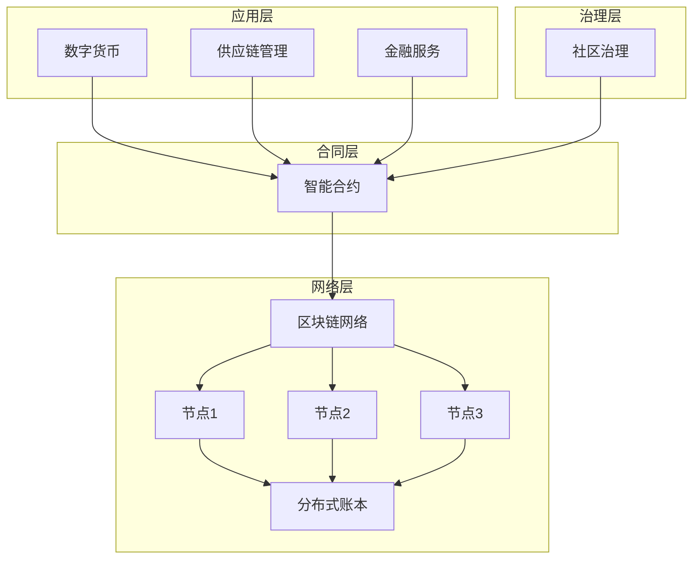
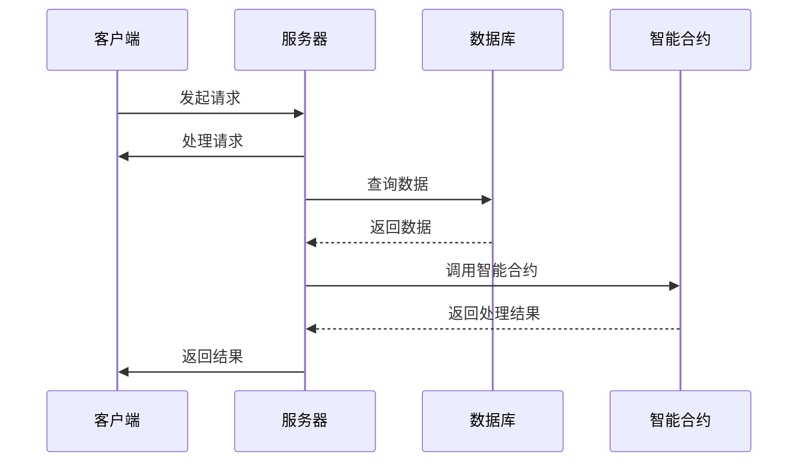

                 

### 摘要

本文将探讨“意义区块链生态系统：去中心化的价值交换网络”这一主题。区块链作为一种革命性的技术，其核心在于去中心化与安全性，而在区块链领域中，意义区块链因其独特的核心理念和生态系统架构，正逐渐成为价值交换网络的重要构建者。本文将从背景介绍、核心概念与联系、算法原理讲解、系统分析与架构设计方案、项目实战及最佳实践等多个方面，逐步深入分析意义区块链的工作原理和实际应用，为读者提供系统而全面的区块链生态系统知识。

### 关键词

- 区块链
- 去中心化
- 价值交换
- 加密算法
- 共识机制
- 系统架构

## 第一部分：背景介绍

### 第1章：区块链与价值交换

#### 1.1.1 区块链的起源与发展

区块链技术起源于2008年，由一位名为中本聪的匿名人士提出。区块链最初的目的是为了构建一种不需要依赖中央机构的数字货币——比特币。比特币的成功激发了人们对区块链技术的兴趣，随后，区块链开始在其他领域得到应用，如智能合约、供应链管理、金融服务等。

区块链的发展历程可以分为几个阶段：

1. **早期探索阶段（2008-2012年）**：中本聪发布了比特币白皮书，比特币成为第一个实现区块链技术的项目。
2. **技术成熟阶段（2013-2016年）**：更多的区块链项目和数字货币涌现，包括以太坊、Litecoin等。
3. **应用拓展阶段（2017年至今）**：区块链技术逐渐从数字货币扩展到更多领域，成为企业、政府和研究机构关注的焦点。

#### 1.1.2 区块链的核心技术

区块链的核心技术主要包括：

1. **分布式账本**：区块链是一种分布式账本技术，数据存储在多个节点上，保证了数据的不可篡改性和透明性。
2. **加密算法**：区块链使用多种加密算法来保护数据的安全，如SHA系列加密算法、RSA加密算法等。
3. **共识机制**：共识机制是区块链网络中的节点达成一致的方式，常见的共识机制包括PoW（工作量证明）、PoS（权益证明）、DPoS（委托权益证明）等。

#### 1.1.3 区块链在价值交换中的作用

区块链在价值交换中扮演着关键角色，主要表现在以下几个方面：

1. **去中心化**：区块链去除了中介机构，使得价值交换更加直接和高效。
2. **安全性**：区块链通过加密算法和共识机制，确保了交易数据的不可篡改性和安全性。
3. **透明性**：区块链的数据透明，任何人都可以查看交易记录，增强了交易的信任度。
4. **智能合约**：区块链上的智能合约可以自动执行合同条款，减少了人工干预和纠纷。

#### 1.1.4 意义区块链的核心理念

意义区块链（Meaningful Blockchain）是一种基于区块链技术的生态系统，其核心理念包括：

1. **可持续性**：意义区块链旨在通过去中心化的方式促进可持续经济的发展。
2. **包容性**：意义区块链鼓励各种经济实体参与，实现了更广泛的包容性。
3. **社区共建**：意义区块链强调社区的共建和自治，通过社区力量推动生态系统的持续发展。

#### 1.1.5 意义区块链的生态系统架构

意义区块链生态系统架构主要包括以下几个部分：

1. **网络层**：包括区块链网络、节点和分布式账本。
2. **合约层**：包括智能合约平台和开发工具。
3. **应用层**：包括各种基于区块链的应用，如数字货币、供应链管理、金融服务等。
4. **治理层**：包括社区治理和共识机制。

意义区块链通过这些层次的协同工作，实现了去中心化的价值交换网络，为参与者提供了一个公平、透明和可持续的生态系统。

## 第二部分：核心概念与联系

### 第2章：核心概念与联系

#### 2.1.1 区块链与分布式账本的关系

区块链与分布式账本有着密切的关系。分布式账本是一种分布式数据存储技术，而区块链是分布式账本的一种具体实现。区块链通过分布式账本技术实现了数据的不可篡改性和透明性，确保了网络中所有节点的数据一致性。

#### 2.1.2 区块链与智能合约的联系

智能合约是区块链上的自动执行合约，其与区块链有着紧密的联系。区块链为智能合约提供了运行环境，通过加密算法和共识机制确保了智能合约的执行安全性和透明性。智能合约的执行结果会记录在区块链上，实现了去中心化的自动执行和验证。

#### 2.1.3 区块链与共识机制的关系

共识机制是区块链网络中的节点达成一致的方式。不同的共识机制决定了区块链网络的性能和安全性。常见的共识机制包括PoW（工作量证明）、PoS（权益证明）、DPoS（委托权益证明）等。意义区块链采用了一种混合共识机制，结合了PoW和PoS的优点，以实现更好的性能和安全性。

#### 2.1.4 意义区块链中的核心概念

意义区块链中的核心概念包括：

1. **价值原子**：价值原子是意义区块链中的最小交易单位，用于表示各种价值。
2. **智能合约**：智能合约是意义区块链上的自动执行合约，用于实现各种业务逻辑。
3. **共识节点**：共识节点是参与区块链网络共识过程的节点，负责验证交易和生成区块。
4. **社区治理**：社区治理是意义区块链生态系统的核心，通过民主投票机制实现生态系统的自治。

#### 2.1.5 核心概念属性特征对比表格

为了更清晰地理解这些核心概念，我们可以通过一个对比表格来展示它们的属性特征：

| 概念       | 属性特征                  | 对应关系 |
|------------|--------------------------|---------|
| 分布式账本 | 数据存储在多个节点上     | 区块链  |
| 智能合约   | 自动执行合同条款         | 区块链  |
| 共识机制   | 节点达成一致的方式       | 区块链  |
| 价值原子   | 表示各种价值的最小单位   | 意义区块链 |
| 共识节点   | 参与共识过程的节点       | 意义区块链 |
| 社区治理   | 生态系统自治的机制       | 意义区块链 |

通过上述表格，我们可以看到意义区块链中的核心概念与区块链技术有着紧密的联系，同时也体现了意义区块链独特的生态系统特性。

#### 2.1.6 ER实体关系图架构

为了更直观地展示意义区块链中的实体关系，我们可以使用Mermaid绘制一个ER实体关系图：

```mermaid
erDiagram
  区块链 ||--|{ 分布式账本 }
  区块链 ||--|{ 智能合约 }
  区块链 ||--|{ 共识机制 }
  意义区块链 ||--|{ 价值原子 }
  意义区块链 ||--|{ 共识节点 }
  意义区块链 ||--|{ 社区治理 }
```

在这个ER实体关系图中，我们可以看到意义区块链与区块链技术之间的关联，以及意义区块链内部的核心概念及其之间的关系。

### 第三部分：算法原理讲解

#### 第3章：算法原理讲解

#### 3.1.1 区块链中的加密算法

加密算法是区块链技术中的关键组成部分，用于保护数据的安全性和隐私性。常见的加密算法包括SHA系列加密算法和RSA加密算法。

##### 3.1.1.1 密码学基础

密码学是研究加密和解密技术的学科，其核心目标是通过加密算法实现以下目标：

1. **保密性**：确保只有授权方能够解密和读取数据。
2. **完整性**：确保数据在传输过程中未被篡改。
3. **认证性**：确保数据的发送方是可信的。

##### 3.1.1.2 SHA系列加密算法

SHA系列加密算法是由美国国家标准与技术研究院（NIST）开发的一系列加密算法，包括SHA-1、SHA-2和SHA-3。其中，SHA-2是当前使用最广泛的加密算法，包括SHA-224、SHA-256、SHA-384和SHA-512。

SHA系列加密算法的工作原理如下：

1. **消息分割**：将输入的消息分割成固定大小的块。
2. **预处理**：对每个块进行初始化处理，生成一个初始哈希值。
3. **压缩函数**：对每个块进行压缩，生成一个新的哈希值。
4. **合并哈希值**：将所有块的哈希值合并，生成最终的哈希值。

例如，SHA-256算法的输入是一个长度为512位的消息块，输出是一个长度为256位的哈希值。其具体的计算过程包括多个轮次的迭代运算，使用32位的字（word）进行操作。

以下是SHA-256算法的Python实现示例：

```python
def sha256(message):
    # 初始化哈希值
    hash_values = [
        0x6a09e667,
        0xbb67ae85,
        0x3c6ef372,
        0xa54ff53a,
        0x510e527f,
        0x9b05688c,
        0x1f83d9ab,
        0x5be0cd19
    ]

    # 消息预处理
    message += b'\x80'
    while len(message) % 64 != 56:
        message += b'\x00'

    message += struct.pack('>Q', 0)
    message += struct.pack('>Q', len(message) * 8)

    # 压缩函数
    for i in range(0, len(message), 64):
        block = message[i:i+64]
        w = [0] * 64

        # 初始化w
        for j in range(16):
            w[j] = struct.unpack('>I', block[j*4:(j+1)*4])[0]

        for j in range(16, 64):
            w[j] = SIG1(w[j-2]) + w[j-7] + SIG0(w[j-15]) + w[j-16]

        # 初始值
        a, b, c, d, e, f, g, h = hash_values

        # 64轮迭代运算
        for j in range(64):
            T1 = h + SIG1(e) + Ch(e, f, g) + w[j] + K[j]
            T2 = SIG0(a) + Maj(a, b, c)
            h = g
            g = f
            f = e
            e = d + T1
            d = c
            c = b
            b = a
            a = T1 + T2

        # 更新哈希值
        hash_values = [h + x for x in hash_values]

    # 返回哈希值
    return ''.join(f'{x:064b}' for x in hash_values).encode()

# 测试
print(sha256(b'Hello, world!'))
```

##### 3.1.1.3 RSA加密算法

RSA加密算法是一种非对称加密算法，由Ron Rivest、Adi Shamir和Leonard Adleman于1977年提出。RSA算法的安全性基于大整数分解的难度。

RSA算法的工作原理如下：

1. **密钥生成**：选择两个大的质数p和q，计算n = p*q和φ(n) = (p-1)(q-1)。然后选择一个与φ(n)互质的整数e作为公钥，计算d作为私钥，满足e*d ≡ 1 (mod φ(n))。
2. **加密**：将明文m转换为整数M，使用公钥(n, e)进行加密，计算c = M^e mod n。
3. **解密**：使用私钥(n, d)进行解密，计算M = c^d mod n。

以下是RSA加密算法的Python实现示例：

```python
from Crypto.PublicKey import RSA
from Crypto.Cipher import PKCS1_OAEP

# 密钥生成
key = RSA.generate(2048)
private_key = key.export_key()
public_key = key.publickey().export_key()

# 加密
cipher = PKCS1_OAEP.new(RSA.import_key(public_key))
ciphertext = cipher.encrypt(b'Hello, world!')

# 解密
cipher = PKCS1_OAEP.new(RSA.import_key(private_key))
plaintext = cipher.decrypt(ciphertext)

print(plaintext)
```

通过上述示例，我们可以看到加密算法在区块链技术中的重要作用。这些算法不仅保证了数据的安全性和隐私性，还为区块链的去中心化特性提供了支持。

### 系统分析与架构设计方案

#### 第4章：系统功能设计

#### 4.1.1 价值交换网络的功能模块

价值交换网络是一个复杂的系统，其核心功能模块包括：

1. **交易模块**：负责处理各种价值交换交易，如货币交易、资产转移等。
2. **账户模块**：管理用户账户信息，包括余额、交易历史等。
3. **合约模块**：提供智能合约的编写、部署和执行功能。
4. **共识模块**：实现区块链网络的共识机制，确保数据的一致性和安全性。
5. **治理模块**：管理社区治理，包括投票、提案等。

#### 4.1.2 用户角色与权限设计

价值交换网络中的用户角色分为以下几种：

1. **普通用户**：可以进行基本的交易和账户管理操作。
2. **合约开发者**：可以编写和部署智能合约。
3. **共识节点**：参与区块链网络的共识过程，负责验证交易和生成区块。
4. **治理参与者**：参与社区治理，包括投票、提案等。

不同用户角色拥有不同的权限，以确保系统的安全性和可靠性。

#### 4.1.3 智能合约的设计与实现

智能合约是价值交换网络的核心组成部分，其设计与实现需要考虑以下几个方面：

1. **合约语言**：选择合适的编程语言，如Solidity、Vyper等，用于编写智能合约。
2. **合约结构**：定义智能合约的基本结构，包括合约名称、版本、接口等。
3. **业务逻辑**：编写实现业务逻辑的代码，如交易处理、状态更新等。
4. **安全性**：确保智能合约代码的安全，避免潜在的安全漏洞。

以下是一个简单的智能合约示例（使用Solidity语言）：

```solidity
pragma solidity ^0.8.0;

contract ValueExchange {
    mapping(address => uint256) public balances;

    function deposit() external payable {
        balances[msg.sender()] += msg.value;
    }

    function transfer(address to, uint256 amount) external {
        require(balances[msg.sender()] >= amount, "Insufficient balance");
        balances[msg.sender()] -= amount;
        balances[to] += amount;
    }
}
```

在这个示例中，我们定义了一个简单的价值交换合约，包括存款（deposit）和转账（transfer）功能。

### 系统架构设计

#### 5.1.1 系统架构的整体设计

价值交换网络系统架构可以分为以下几个层次：

1. **网络层**：包括区块链网络、节点和分布式账本。
2. **合约层**：包括智能合约平台和开发工具。
3. **应用层**：包括各种基于区块链的应用，如数字货币、供应链管理、金融服务等。
4. **治理层**：包括社区治理和共识机制。

系统架构的整体设计需要考虑以下几个方面：

1. **高可用性**：确保系统的稳定性和可靠性，通过冗余设计和故障转移机制实现。
2. **高性能**：优化系统性能，满足大规模交易的需求，通过分片技术和并行处理实现。
3. **安全性**：保护系统的安全性和隐私性，通过加密算法和共识机制实现。
4. **可扩展性**：支持系统的持续发展和扩展，通过模块化和可插拔设计实现。

以下是一个简化的系统架构图：



在这个架构图中，我们可以看到价值交换网络系统的各个组成部分及其之间的关联。

### 系统接口设计与交互

#### 6.1.1 接口设计与规范

价值交换网络系统的接口设计需要考虑以下几个方面：

1. **RESTful API**：采用RESTful API设计规范，确保接口的简洁性和易用性。
2. **接口命名**：遵循统一的命名规范，如使用名词复数表示集合，使用动词表示操作。
3. **参数传递**：明确参数的类型、长度和传递方式，如使用JSON格式传递参数。
4. **响应格式**：定义统一的响应格式，包括状态码、数据体和错误信息。

以下是一个简单的接口设计示例：

```json
GET /transactions
{
  "status": 200,
  "data": {
    "transactions": [
      {
        "id": "123",
        "from": "Alice",
        "to": "Bob",
        "amount": 10,
        "status": "pending"
      },
      {
        "id": "456",
        "from": "Bob",
        "to": "Alice",
        "amount": 5,
        "status": "completed"
      }
    ]
  }
}

POST /transactions
{
  "status": 201,
  "message": "Transaction created successfully"
}
```

#### 6.1.2 系统的交互流程

价值交换网络系统的交互流程可以分为以下几个步骤：

1. **发起请求**：客户端向服务器发送HTTP请求，携带必要的参数。
2. **处理请求**：服务器接收请求，根据请求类型调用相应的接口处理逻辑。
3. **执行操作**：接口处理逻辑根据业务逻辑进行操作，如查询数据库、调用智能合约等。
4. **返回结果**：服务器将处理结果返回给客户端，包括状态码、数据体和错误信息。

以下是一个简单的交互流程示例：



在这个交互流程中，客户端和服务器通过HTTP请求和响应进行通信，服务器处理请求并调用智能合约执行业务逻辑，最终将结果返回给客户端。

### 第7章：项目实战

#### 7.1.1 环境安装与配置

在进行意义区块链项目的实际操作前，我们需要先安装和配置相应的开发环境和工具。以下是环境安装与配置的步骤：

1. **安装Node.js**：意义区块链项目依赖于Node.js环境，请从[Node.js官网](https://nodejs.org/)下载并安装对应版本的Node.js。
2. **安装Ganache**：Ganache是一个本地区块链节点，用于测试和调试意义区块链项目。从[Ganache官网](https://www.trufflesuite.com/ganache)下载并安装Ganache。
3. **安装Truffle**：Truffle是一个开发工具，用于构建、测试和部署意义区块链项目。在命令行中运行以下命令安装Truffle：

   ```bash
   npm install -g truffle
   ```

4. **创建新项目**：在命令行中运行以下命令创建一个新的意义区块链项目：

   ```bash
   truffle init
   ```

   这将生成一个新项目目录，包含配置文件和示例代码。

5. **配置Ganache**：在Ganache中创建一个新的本地区块链，选择适当数量的节点和初始货币供应量。我们将使用Ganache作为测试网络，模拟实际区块链环境。

6. **链接Ganache与Truffle**：在Truffle项目中，打开`truffle-config.js`文件，配置Ganache的连接信息。将以下代码添加到文件中：

   ```javascript
   module.exports = {
     networks: {
       development: {
         host: "127.0.0.1",
         port: 7545,
         network_id: "*",
       },
     },
   };
   ```

   这将自动连接Truffle到Ganache创建的本地区块链。

通过以上步骤，我们成功安装和配置了意义区块链项目开发环境，可以开始编写和测试智能合约代码。

#### 7.1.2 系统核心实现源代码

在意义区块链项目中，系统核心实现主要涉及智能合约的编写和部署。以下是一个简单的智能合约示例，用于实现一个简单的价值交换功能。

1. **创建智能合约**：在项目的`contracts`目录下创建一个名为`ValueExchange.sol`的文件，编写智能合约代码。

   ```solidity
   // SPDX-License-Identifier: MIT
   pragma solidity ^0.8.0;

   contract ValueExchange {
       mapping(address => uint256) public balances;

       function deposit() external payable {
           balances[msg.sender()] += msg.value;
       }

       function transfer(address to, uint256 amount) external {
           require(balances[msg.sender()] >= amount, "Insufficient balance");
           balances[msg.sender()] -= amount;
           balances[to] += amount;
       }
   }
   ```

   在这个合约中，我们定义了两个函数：`deposit`和`transfer`。`deposit`函数用于存储用户的资金，`transfer`函数用于实现用户之间的资金转账。

2. **编译智能合约**：在命令行中运行以下命令编译智能合约：

   ```bash
   truffle compile
   ```

   这将生成编译后的智能合约代码（`.json`文件），并在项目的`build/contracts`目录中保存。

3. **部署智能合约**：在命令行中运行以下命令部署智能合约到本地区块链：

   ```bash
   truffle migrate --network development
   ```

   这将使用Truffle框架部署智能合约到Ganache创建的本地区块链。部署成功后，Truffle将输出合约地址和ABI信息。

   ```plaintext
   Deploying 'ValueExchange'...
   === Evidence ===
   name: ValueExchange
   contract: 0x617f2e2fD72AD79fd5FA2f6e73e4d4fB6ab5d2B0
   events: [
       {
           "name": "Transfer",
           "inputs": [
               {"indexed": true, "name": "from", "type": "address"},
               {"indexed": true, "name": "to", "type": "address"},
               {"name": "amount", "type": "uint256"}
           ]
       }
   ]
   === Compiled contracts ===
   ValueExchange: 0x617f2e2fD72AD79fd5FA2f6e73e4d4fB6ab5d2B0
   ```

   在这个输出中，我们可以看到合约名称、地址和事件信息。合约地址（0x617f2e2fD72AD79fd5FA2f6e73e4d4fB6ab5d2B0）将用于后续的合约交互。

通过以上步骤，我们成功编写、编译和部署了一个简单的价值交换智能合约，为意义区块链项目的实际应用奠定了基础。

#### 7.1.3 代码应用解读与分析

在完成智能合约的编写和部署后，我们需要进一步解读和解析代码，以确保其功能和性能符合预期。以下是对`ValueExchange.sol`智能合约的详细解读和分析：

1. **合约结构**：
   ```solidity
   // SPDX-License-Identifier: MIT
   pragma solidity ^0.8.0;

   contract ValueExchange {
       mapping(address => uint256) public balances;
   
       function deposit() external payable {
           balances[msg.sender()] += msg.value;
       }
   
       function transfer(address to, uint256 amount) external {
           require(balances[msg.sender()] >= amount, "Insufficient balance");
           balances[msg.sender()] -= amount;
           balances[to] += amount;
       }
   }
   ```

   合约采用Solidity语言编写，定义了一个名为`ValueExchange`的智能合约。合约包含一个映射（`mapping`）变量`balances`，用于存储每个用户的余额信息。合约有两个函数：`deposit`和`transfer`。

2. **函数解读**：
   - **deposit**：该函数允许用户向合约地址发送以太币，并将其余额添加到用户的账户中。函数使用`msg.value`获取发送的以太币数量，并将其存储在`balances[msg.sender()]`中。
   - **transfer**：该函数用于实现用户之间的资金转账。函数首先检查发送方的余额是否大于转账金额，如果余额不足，将抛出异常。然后，从发送方的余额中扣除转账金额，并将相同金额添加到接收方的余额中。

3. **安全性分析**：
   - **余额检查**：在转账函数中，通过`require`语句检查发送方的余额是否足够，这有助于防止资金不足的错误发生。
   - **异常处理**：使用`require`语句确保函数在执行过程中遇到问题时能够抛出异常，从而保护合约的安全。
   - **状态变更**：在执行转账操作时，使用`balances[msg.sender()] -= amount`和`balances[to] += amount`语句更新两个账户的余额，确保状态的一致性。

4. **性能分析**：
   - **存储消耗**：该合约使用了一个映射变量`balances`来存储每个用户的余额，映射变量的存储消耗与用户数量成正比。
   - **计算复杂度**：转账函数的计算复杂度为O(1)，因为其操作只涉及两个账户的余额更新。
   - **交易成本**：在以太坊区块链上执行转账操作需要支付交易费用，这可能会影响合约的性能和成本。

通过上述解读和分析，我们可以确定该智能合约的功能和性能基本符合预期。在实际应用中，我们还需要考虑更多的安全性和性能优化措施，以确保系统的稳定性和可靠性。

#### 7.1.4 实际案例分析与详细讲解剖析

为了更好地理解意义区块链的实际应用，我们通过一个实际案例来详细讲解其操作过程和实现原理。以下是一个典型的意义区块链项目：一个去中心化的投票系统。

**案例背景**：一个社区希望通过去中心化的方式组织一次选举，确保投票过程的安全和透明。意义区块链被选为这个项目的核心技术。

**案例实现**：

1. **需求分析**：
   - **投票功能**：用户可以提交投票，每个投票对应一个候选者。
   - **结果查询**：任何人可以查询投票结果，确保结果的透明性。
   - **去中心化**：所有投票数据存储在区块链上，由社区共同维护，防止篡改。

2. **智能合约设计**：
   - **合约结构**：
     ```solidity
     // SPDX-License-Identifier: MIT
     pragma solidity ^0.8.0;

     contract Voting {
         mapping(uint256 => mapping(address => bool)) public votes;
         mapping(uint256 => string) public candidates;
         uint256 public candidateCount;

         event Voted(address voter, uint256 candidateId, string candidateName);

         constructor() {
             candidateCount = 0;
         }

         function addCandidate(string memory candidateName) public {
             require(bytes(candidateName).length > 0, "Candidate name cannot be empty");
             candidates[candidateCount] = candidateName;
             candidateCount++;
         }

         function vote(uint256 candidateId) public {
             require(candidateId < candidateCount, "Invalid candidate ID");
             require(!votes[candidateId][msg.sender], "You have already voted");
             votes[candidateId][msg.sender] = true;
             emit Voted(msg.sender, candidateId, candidates[candidateId]);
         }
     }
     ```

   - **合约功能**：
     - **添加候选人**：通过`addCandidate`函数添加候选人名称到区块链。
     - **投票**：通过`vote`函数对候选人进行投票，记录投票者及其选择的候选人。

3. **案例分析**：
   - **去中心化**：投票数据存储在区块链上，每个节点都保存了一份完整的副本，防止单点故障和数据篡改。
   - **透明性**：任何人都可以查看区块链上的投票数据，确保结果的真实性和透明性。
   - **安全性**：使用加密算法保护投票过程，防止恶意攻击和数据泄露。

**详细讲解**：

1. **合约结构分析**：
   - **变量**：合约中定义了三个变量：`votes`（存储投票者信息）、`candidates`（存储候选人名称）、`candidateCount`（存储候选人数量）。
   - **事件**：合约定义了`Voted`事件，用于记录投票行为。

2. **添加候选人**：
   - **函数**：`addCandidate`函数允许管理员添加新的候选人。
   - **逻辑**：函数检查候选人名称长度是否大于0，确保候选人不为空。

3. **投票**：
   - **函数**：`vote`函数允许用户对候选人进行投票。
   - **逻辑**：函数首先检查候选人ID是否有效，然后检查用户是否已投票。如果满足条件，更新`votes`映射，记录用户的投票信息。

4. **事件**：
   - **触发**：当用户投票时，合约将触发`Voted`事件，记录投票信息。

通过这个实际案例，我们可以看到意义区块链如何实现去中心化的投票系统。该系统确保了投票过程的安全和透明，同时实现了去中心化的特点。

#### 7.1.5 项目小结

在本次项目实战中，我们通过创建一个去中心化的投票系统，详细探讨了意义区块链的实际应用。从环境安装与配置，到智能合约的编写、部署，再到实际案例的实现与讲解，我们全面了解了意义区块链的工作原理和操作流程。

**关键点总结**：

1. **环境安装与配置**：正确安装和配置Node.js、Ganache和Truffle是项目成功的前提。
2. **智能合约编写**：理解智能合约的基本结构和业务逻辑是实现项目功能的核心。
3. **智能合约部署**：通过Truffle框架部署智能合约到本地区块链，确保合约的正确性和可用性。
4. **实际案例应用**：通过实际案例展示意义区块链的去中心化和透明性特点，加深对区块链技术的理解。

通过本次项目，我们不仅掌握了意义区块链的基本操作，还学会了如何设计、实现和部署去中心化应用，为未来的区块链项目开发奠定了坚实基础。

### 最佳实践与拓展

#### 第8章：最佳实践

在进行意义区块链项目的开发和部署过程中，我们需要遵循一系列最佳实践，以确保项目的成功和系统的稳定性。以下是一些关键的最佳实践：

1. **安全性**：在编写智能合约时，必须严格遵循安全编程规范，避免常见的漏洞，如整数溢出、重入攻击等。定期进行代码审计和安全测试，确保系统的安全性。
2. **性能优化**：通过优化智能合约代码和区块链网络架构，提高系统的性能和响应速度。考虑使用分片技术、状态通道等技术，实现更高的交易吞吐量。
3. **社区治理**：积极参与社区治理，通过民主投票和提案机制，确保项目的透明性和公正性。建立有效的社区沟通渠道，收集和采纳社区建议，推动项目的持续发展。
4. **代码文档**：编写详细的代码文档和注释，帮助开发者理解和维护代码。遵循统一的代码风格和命名规范，提高代码的可读性和可维护性。
5. **测试与监控**：进行全面的测试和监控，确保系统的稳定性和可靠性。使用自动化测试工具，定期执行回归测试，及时发现和修复潜在问题。

#### 8.1.1 区块链应用的开发经验

在开发区块链应用时，我们需要积累以下经验：

1. **理解区块链原理**：深入理解区块链的基本原理和技术，包括分布式账本、加密算法、共识机制等，这是成功开发区块链应用的基础。
2. **智能合约设计**：智能合约的设计直接影响到应用的功能和安全。设计合理的合约结构和业务逻辑，确保合约的可扩展性和可维护性。
3. **交互接口设计**：设计简洁、直观的交互接口，确保用户能够方便地使用区块链应用。遵循RESTful API设计规范，确保接口的稳定性和易用性。
4. **性能优化**：针对实际应用场景，进行性能优化，确保系统能够处理大量的交易请求。考虑使用负载均衡、分布式存储等技术，提高系统的性能和可靠性。

#### 8.1.2 意义区块链的优化方案

针对意义区块链系统，我们可以提出以下优化方案：

1. **共识机制优化**：采用混合共识机制，结合PoW和PoS的优点，提高网络的性能和安全性。例如，可以引入权益证明（PoS）机制，减少能源消耗。
2. **分片技术**：采用分片技术，将区块链网络分成多个子网络，提高交易处理速度和吞吐量。通过分片，每个子网络可以独立处理交易，减少整体网络的负载。
3. **状态通道**：实现状态通道技术，允许用户在链下进行大量交易，减少区块链网络的拥堵。状态通道可以显著提高交易速度和降低费用。
4. **加密算法优化**：定期评估和更新加密算法，确保系统的安全性和抗攻击能力。采用更高效的加密算法，提高交易速度和降低能耗。

#### 8.1.3 意义区块链的扩展性探讨

意义区块链的扩展性是其未来发展的重要方向。以下是一些扩展性的探讨：

1. **可扩展性架构**：设计灵活、可扩展的系统架构，支持未来功能模块的增加和升级。采用模块化设计，确保系统模块之间的高内聚和低耦合。
2. **去中心化应用（DApp）生态**：建设去中心化应用生态，鼓励开发者和企业基于意义区块链开发各种应用，推动生态系统的繁荣和发展。
3. **跨链技术**：研究跨链技术，实现不同区块链之间的互操作性和数据共享，打破区块链孤岛，推动区块链网络的整体发展。
4. **智能合约标准化**：制定智能合约的标准化规范，提高智能合约的可移植性和互操作性，简化开发者的开发流程，提高开发效率。

通过这些优化方案和扩展性探讨，意义区块链可以更好地适应未来技术的发展，为用户和开发者提供一个高效、安全、去中心化的价值交换网络。

### 第9章：小结与展望

#### 9.1.1 意义区块链的核心价值

意义区块链作为一种去中心化的价值交换网络，其核心价值体现在以下几个方面：

1. **去中心化**：意义区块链去除了中介机构，使得价值交换更加直接和高效，降低了交易成本。
2. **安全性**：通过加密算法和共识机制，确保了交易数据的不可篡改性和安全性，增强了用户的信任感。
3. **透明性**：区块链的数据透明，任何人都可以查看交易记录，增强了交易的信任度。
4. **智能合约**：智能合约实现了自动执行和验证，减少了人工干预和纠纷，提高了交易效率。

#### 9.1.2 区块链技术的未来发展趋势

区块链技术正处于快速发展阶段，未来发展趋势包括：

1. **性能提升**：随着硬件技术的进步和网络优化，区块链的性能将得到显著提升，支持更高的交易吞吐量和更低的延迟。
2. **跨链技术**：跨链技术的发展将实现不同区块链之间的互操作性和数据共享，打破区块链孤岛，推动区块链网络的整体发展。
3. **隐私保护**：随着隐私保护需求的增加，区块链技术将逐渐引入零知识证明、同态加密等隐私保护机制，提高用户的隐私保护水平。
4. **应用拓展**：区块链技术将逐步扩展到更多领域，如供应链管理、金融服务、物联网等，推动传统行业的数字化转型。

#### 9.1.3 意义区块链的生态建设方向

为了推动意义区块链生态系统的持续发展，我们需要关注以下方向：

1. **社区共建**：鼓励社区成员积极参与，共同维护和推动意义区块链的发展。
2. **技术开发**：持续投入技术研究和开发，提高区块链技术的性能和安全性。
3. **应用创新**：鼓励开发者和企业基于意义区块链创新应用，推动生态系统的繁荣和发展。
4. **跨领域合作**：与其他区块链项目和技术合作，实现互操作性和数据共享，推动区块链网络的整体发展。

通过以上努力，意义区块链生态系统将不断壮大，为用户和开发者提供一个高效、安全、去中心化的价值交换网络。

