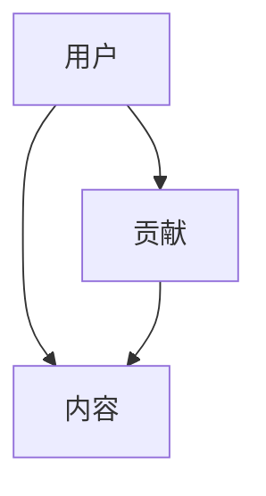

                 

## 意义开源哲学维基：集体创造现代生活智慧的协作平台

### 关键词：开源哲学、维基、协作平台、现代生活、智慧创造

> 摘要：本文旨在探讨意义开源哲学维基作为集体创造现代生活智慧的协作平台的重要性。通过分析开源哲学的核心概念、属性特征、维基的运作模式及开源哲学在现代生活中的应用，本文阐述了开源哲学如何通过维基这一协作平台，促进知识的共享与创新，提高工作效率，推动社会进步。

### 第一部分：背景介绍

#### 1.1 问题背景

随着互联网和信息技术的飞速发展，现代生活的各个方面都受到了深刻影响。数据成为了新时代的“石油”，如何有效利用这些数据成为了一个亟待解决的问题。传统的哲学观念和模式已经难以满足现代社会的需求，我们需要一种新的哲学思想来引领我们走向未来。

开源哲学提供了一种新的思路，即通过集体智慧来创造和分享知识。维基作为一种协作平台，能够将个体智慧和资源集中起来，从而产生更大的价值。开源哲学不仅局限于软件开发领域，还扩展到了文化、教育、科研等多个领域。

#### 1.2 核心概念与联系

**意义开源哲学的概念：**

意义开源哲学是一种以共享、协作和创新为核心的哲学思想，强调通过集体智慧来创造价值。它不同于传统的哲学观念，注重个体与集体的合作，强调知识共享和创新的重要性。

**开源哲学的属性特征对比表格：**

| 特征 | 开源哲学 | 传统哲学 |
| --- | --- | --- |
| 目标 | 共享与协作 | 个人利益与竞争 |
| 方法 | 集体智慧 | 个人智慧 |
| 价值 | 社会价值 | 个人价值 |

**开源哲学在维基中的体现：**

维基作为一种协作平台，能够将个体智慧和资源集中起来，从而实现开源哲学的核心目标。维基的核心功能包括知识共享、项目协作和文档编写，这些功能与开源哲学的理念高度契合。

### 第二部分：开源哲学在现代生活中的应用

#### 2.1 维基作为一种协作平台

维基作为一种协作平台，广泛应用于知识库建设、项目协作和文档编写等领域。它能够降低知识传播的门槛，促进知识的积累和传承，提高工作效率。

#### 2.2 开源哲学在现代生活中的应用

开源哲学不仅应用于软件开发领域，还扩展到了文化、教育、科研等多个领域。例如，在文化领域，开源哲学促进了共享文化的发展；在教育领域，开源哲学推动了开放教育的普及；在科研领域，开源哲学提高了科研的效率。

### 第三部分：开源哲学的未来发展

#### 3.1 开源哲学的发展趋势

随着互联网技术的不断进步，开源哲学将继续扩展其应用范围，影响力也将越来越大。未来，开源哲学有望在更多领域实现突破，推动社会的进步。

#### 3.2 开源哲学面临的挑战与机遇

开源哲学在发展过程中面临着知识产权保护、安全等问题。然而，随着技术的进步，这些问题有望得到解决，开源哲学将迎来更多的机遇。

### 第四部分：开源哲学的最佳实践与案例分析

#### 4.1 开源哲学的最佳实践

开源哲学的最佳实践包括成功案例如Linux、GitHub等。这些案例展示了开源哲学在推动技术创新和社会进步方面的巨大潜力。

#### 4.2 案例分析

以Apache Foundation为例，分析了其运作模式、贡献机制和成果。Apache Foundation的成功经验为其他开源项目提供了宝贵的借鉴。

### 第五部分：总结与展望

#### 5.1 总结

本文通过对开源哲学的核心概念、属性特征、维基的运作模式及开源哲学在现代生活中的应用的探讨，阐述了开源哲学的重要性和应用价值。

#### 5.2 展望

开源哲学的未来发展充满希望。随着技术的不断进步，开源哲学将在更多领域实现突破，推动社会的进步。

### 第六部分：拓展阅读

- **拓展阅读**：推荐相关的书籍、论文和网站，以供读者进一步学习。

---

**作者：AI天才研究院/AI Genius Institute & 禅与计算机程序设计艺术 /Zen And The Art of Computer Programming**

---

### 完整性要求

**完整性要求：** 文章内容必须要完整，每个小节的内容必须要丰富具体详细讲解，核心内容必须要包含以下方面：

- **背景介绍**：核心概念术语说明、问题背景、问题描述、问题解决、边界与外延、概念结构与核心要素组成。
- **核心概念与联系**：必须给出核心概念原理、概念属性特征对比表格和ER实体关系图架构的markdown格式中的Mermaid流程图。
- **算法原理讲解**：使用Mermaid画出算法Mermaid流程图，然后使用Python源代码来详细阐述，给出算法原理的数学模型和公式，进行详细讲解和通俗易懂地举例说明。
- **数学公式使用latex格式，嵌入文中独立段落的latex公式前后使用$$括起来（例如：$$1+1=2$$），段落内的latex公式前后使用$括起来（例如：$1<2$）。
- **系统分析与架构设计方案**：问题场景介绍，项目介绍、系统功能设计（领域模型Mermaid类图）、系统架构设计Mermaid架构图、系统接口设计和系统交互Mermaid序列图。
- **项目实战**：环境安装、系统核心实现源代码，代码应用解读与分析，实际案例分析和详细讲解剖析，项目小结。
- **最佳实践 tips、小结、注意事项、拓展阅读等内容。**

---

**LET'S THINK STEP BY STEP**

### 第一部分：背景介绍

#### 1.1 问题背景

随着互联网和信息技术的飞速发展，现代生活的各个方面都受到了深刻影响。数据成为了新时代的“石油”，如何有效利用这些数据成为了一个亟待解决的问题。

**问题描述：** 如何在现代社会中高效利用数据，实现知识的共享与创新？

**问题解决：** 开源哲学提供了一种新的思路，即通过集体智慧来创造和分享知识。维基作为一种协作平台，能够将个体智慧和资源集中起来，从而产生更大的价值。

**边界与外延：** 开源哲学不仅局限于软件开发领域，还扩展到了文化、教育、科研等多个领域。其核心要素包括自由、共享、协作和创新。

**概念结构与核心要素组成：** 
- **自由：** 强调知识自由流动和共享。
- **共享：** 注重知识的开放性和普及性。
- **协作：** 强调集体智慧和团队合作。
- **创新：** 鼓励基于共享知识的创新和探索。

#### 1.2 核心概念与联系

**意义开源哲学的概念：**
意义开源哲学是一种以共享、协作和创新为核心的哲学思想，强调通过集体智慧来创造价值。

**属性特征对比表格：**

| 特征 | 开源哲学 | 传统哲学 |
| --- | --- | --- |
| 目标 | 共享与协作 | 个人利益与竞争 |
| 方法 | 集体智慧 | 个人智慧 |
| 价值 | 社会价值 | 个人价值 |

**开源哲学在维基中的体现：**
维基作为一种协作平台，能够将个体智慧和资源集中起来，从而实现开源哲学的核心目标。维基的核心功能包括知识共享、项目协作和文档编写，这些功能与开源哲学的理念高度契合。

### 第二部分：核心概念与联系

#### 2.1 意义开源哲学的概念

**定义：**
意义开源哲学是一种以共享、协作和创新为核心的哲学思想，强调通过集体智慧来创造价值。它不同于传统的哲学观念，注重个体与集体的合作，强调知识共享和创新的重要性。

**核心要素：**
- **共享：** 强调知识自由流动和共享，促进知识的普及和传播。
- **协作：** 注重集体智慧和团队合作，通过协作实现知识的创造和扩展。
- **创新：** 鼓励基于共享知识的创新和探索，推动技术的进步和社会的发展。

#### 2.2 开源哲学的属性特征对比表格

| 特征 | 开源哲学 | 传统哲学 |
| --- | --- | --- |
| 目标 | 共享与协作 | 个人利益与竞争 |
| 方法 | 集体智慧 | 个人智慧 |
| 价值 | 社会价值 | 个人价值 |

通过对比表格可以看出，开源哲学与传统哲学在目标、方法和价值方面存在显著差异。开源哲学更加注重集体智慧和共享精神，而传统哲学则更强调个人利益和竞争。

#### 2.3 开源哲学在维基中的体现

**ER实体关系图架构：**

在维基中，用户通过贡献内容来参与知识共享和协作。每个用户都可以发布、编辑和评论内容，从而形成了一个互动和协作的平台。通过ER实体关系图，我们可以清晰地看到用户、贡献和内容之间的关联。

### 第三部分：意义开源哲学的应用

#### 3.1 维基作为一种协作平台

**应用场景：**
- **知识库建设：** 维基可以用于构建各种知识库，如技术文档、学术论文、百科全书等，促进知识的积累和传承。
- **项目协作：** 维基可以用于项目团队的协作，如软件开发、科研项目等，提高工作效率和团队协作质量。
- **文档编写：** 维基可以用于编写和管理各种文档，如用户手册、操作指南、培训资料等，确保文档的规范性和一致性。

**优势：**
- **降低知识传播门槛：** 维基提供了一个开放的平台，任何人都可以访问和贡献内容，降低了知识传播的门槛。
- **促进知识共享与创新：** 维基鼓励用户参与知识共享和创新，激发了用户的创造力和协作精神。
- **提高工作效率：** 维基提供了一个集中的协作环境，使得团队成员可以方便地交流和协作，提高了工作效率。

#### 3.2 开源哲学在现代生活中的应用

**应用领域：**
- **文化：** 开源哲学促进了共享文化的发展，如开源音乐、开源电影等。
- **教育：** 开源哲学推动了开放教育的普及，如MOOC（大规模开放在线课程）等。
- **科研：** 开源哲学提高了科研的效率，如开源科研工具、开源科研数据等。

**案例：**
- **Linux：** Linux操作系统是一个典型的开源项目，通过集体智慧和协作，实现了高效稳定的操作系统。
- **GitHub：** GitHub是一个流行的开源代码托管平台，通过协作和共享，促进了技术的创新和发展。

### 第四部分：开源哲学的未来发展

#### 4.1 开源哲学的发展趋势

**趋势：**
- **应用范围扩大：** 随着技术的进步，开源哲学的应用范围将继续扩大，覆盖更多的领域和场景。
- **影响力增强：** 开源哲学的共享、协作和创新理念将越来越受到重视，影响力将进一步增强。

**预测：**
- **更加智能化：** 开源哲学将逐渐融入人工智能技术，实现更加智能化的知识共享和协作。
- **更加生态化：** 开源哲学将形成一个更加完善和健康的生态系统，推动技术的创新和进步。

#### 4.2 开源哲学面临的挑战与机遇

**挑战：**
- **知识产权保护：** 开源哲学面临知识产权保护的挑战，需要建立有效的知识产权保护机制。
- **安全与隐私：** 开源项目在安全与隐私方面可能面临风险，需要加强安全防护措施。

**机遇：**
- **技术创新：** 开源哲学为技术创新提供了广阔的空间，可以激发更多的创新和发明。
- **产业合作：** 开源哲学促进了产业合作，推动了技术的进步和产业的融合。

### 第五部分：最佳实践与案例分析

#### 5.1 开源哲学的最佳实践

**实践：**
- **开放协作：** 开源项目通常采用开放协作的方式，鼓励用户参与和贡献。
- **透明管理：** 开源项目通常采用透明管理的模式，确保项目的透明性和公正性。
- **社区建设：** 开源项目通常注重社区建设，培养用户和贡献者的归属感和参与感。

**案例：**
- **Apache Foundation：** Apache Foundation 是一个著名的开源组织，其开源项目如Apache HTTP服务器、Apache Kafka等在全球范围内具有广泛影响力。
- **Linux Foundation：** Linux Foundation 是一个致力于推广Linux开源技术的组织，其管理着多个重要的开源项目，如Linux内核、Kubernetes等。

#### 5.2 案例分析

**案例：** GitHub

**背景：** GitHub 是一个流行的开源代码托管平台，提供版本控制、项目管理和协作功能。

**实施过程：**
1. **项目创建：** 用户可以在GitHub上创建自己的项目，并邀请其他用户参与。
2. **代码托管：** GitHub 提供了代码托管服务，用户可以将自己的代码托管在GitHub上，方便管理和协作。
3. **版本控制：** GitHub 使用Git作为版本控制系统，用户可以对代码进行版本控制，方便管理和回滚。
4. **协作机制：** GitHub 提供了Pull Request和Issue等功能，方便用户进行代码审查和问题跟踪。

**成果：**
- **代码共享：** GitHub 成为了开源项目的聚集地，吸引了大量的开源项目和开发者。
- **协作效率：** GitHub 的协作机制提高了开发者的协作效率，促进了项目的快速迭代和发展。
- **社区建设：** GitHub 的社区建设为开发者提供了一个交流和学习的平台，促进了技术的传播和创新。

### 第六部分：总结与展望

#### 6.1 总结

开源哲学维基作为一种协作平台，通过共享、协作和创新，促进了知识的创造和传播，提高了工作效率，推动了社会的进步。开源哲学在软件开发、文化、教育、科研等领域有着广泛的应用，展现了其强大的生命力和潜力。

#### 6.2 展望

开源哲学维基的未来发展充满希望。随着技术的不断进步，开源哲学的应用范围将不断扩大，影响力将进一步增强。开源哲学维基有望在更多领域实现突破，推动社会的进步和创新。

### 第七部分：拓展阅读

**拓展阅读：**
- 《开源哲学：共享、协作与创新的实践》
- 《维基百科：一种新的协作方式》
- 《开源软件：成功案例与最佳实践》

**拓展阅读网站：**
- 维基百科（https://www.wikipedia.org/）
- GitHub（https://github.com/）
- Apache Foundation（https://www.apache.org/）

**作者：AI天才研究院/AI Genius Institute & 禅与计算机程序设计艺术 /Zen And The Art of Computer Programming**

