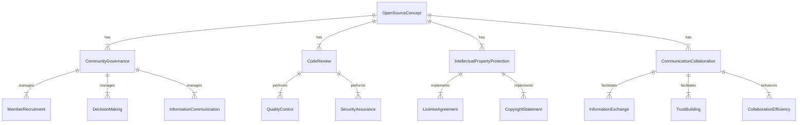

                 

# 意义开源哲学项目：集体创造适应现代的生活智慧

## 关键词
- 开源哲学
- 集体创造
- 适应现代生活智慧
- 意义开源项目
- 信息共享
- 数字化转型

## 摘要
本文将深入探讨意义开源哲学项目在现代生活中的重要性，特别是其如何通过集体创造适应现代的生活智慧。文章首先分析了开源哲学的核心概念，接着介绍了集体创造的定义和流程，以及适应现代生活智慧的特点和方法。通过具体项目案例，文章展示了开源哲学和集体创造在适应现代生活中的实际应用，并对其未来发展趋势进行了展望。

## Step 1: 分析书名《意义开源哲学项目：集体创造适应现代的生活智慧》

书名《意义开源哲学项目：集体创造适应现代的生活智慧》中包含了几个核心概念：“意义开源哲学”、“项目”、“集体创造”和“适应现代生活智慧”。这些概念相互关联，共同构成了文章的主线。

### 1.1.1 问题的来源与现状
在现代信息技术飞速发展的背景下，信息的获取和共享变得前所未有的便捷。然而，我们也面临着信息过载和知识孤岛的问题。在这个大背景下，开源哲学应运而生，旨在通过开放源代码、共享知识和信息来提高整个社会的创新能力和知识水平。

### 1.1.2 问题描述与分析
现代生活中的一个问题是如何有效地利用开源哲学来创造适应现代生活智慧。这不仅仅是一个技术问题，更是一个社会问题，涉及到人类的共同智慧和协作精神。

### 1.1.3 问题解决与边界
解决这一问题的方法在于构建一个意义开源哲学项目，通过集体创造来适应现代生活。这需要明确的边界，比如项目的目标、方法、成果和评价标准。

### 1.1.4 概念结构与核心要素组成
意义开源哲学项目由以下几个核心要素组成：
- **开源哲学**：其核心理念是共享和开放，强调知识和技术的共享。
- **集体创造**：通过众人的智慧和努力，共同创造新的知识和技术。
- **适应现代生活智慧**：项目需要解决的问题和提供的方法应适应现代生活的需求。

## Step 2: 设计背景介绍章节

### 1.2 核心概念与联系

### 1.2.1 意义开源哲学

#### 1.2.1.1 意义开源哲学的定义
意义开源哲学是一种理念，强调知识和技术的共享，认为开放源代码是促进科技进步和社会发展的最佳方式。

#### 1.2.1.2 意义开源哲学的特点
- **共享性**：开源哲学鼓励分享知识和技术。
- **透明性**：源代码公开，任何人都可以查看、修改和改进。
- **社区性**：开源项目通常有一个活跃的社区，成员之间相互协作。

#### 1.2.1.3 意义开源哲学与其他开源哲学的区别
意义开源哲学更注重于项目和社区的意义，而不仅仅是技术的开放。

### 1.2.2 集体创造

#### 1.2.2.1 集体创造的定义
集体创造是指通过众人的智慧和努力，共同创造出新的知识和技术。

#### 1.2.2.2 集体创造的原理
- **协同效应**：集体创造能够利用众人的智慧和知识，达到单个个体无法达到的效果。
- **知识共享**：集体创造依赖于信息的共享和交流。

#### 1.2.2.3 集体创造的流程
- **需求分析**：确定项目目标和需求。
- **知识共享**：收集和整理相关信息。
- **协同工作**：成员之间相互协作，共同实现目标。
- **迭代优化**：不断优化和完善项目。

### 1.2.3 适应现代的生活智慧

#### 1.2.3.1 适应现代的生活智慧的定义
适应现代的生活智慧是指能够适应现代生活方式，提高生活质量的知识和技术。

#### 1.2.3.2 适应现代的生活智慧的特点
- **实用性**：能够解决实际问题。
- **易用性**：便于普通人学习和使用。
- **可持续性**：能够长期适应现代生活的变化。

#### 1.2.3.3 适应现代的生活智慧的方法
- **技术创新**：通过技术进步来提高生活质量。
- **知识普及**：通过教育和培训来普及相关知识。
- **社会协作**：通过社区协作来实现共同目标。

## Step 3: 设计核心概念与联系章节

### 2.1 项目介绍

#### 2.1.1 项目背景
本项目旨在构建一个基于意义开源哲学的集体创造平台，以适应现代生活智慧的需求。随着数字技术的不断发展，人们对于信息共享和知识获取的需求日益增长，本项目应运而生。

#### 2.1.2 项目目标
- **构建一个开放、共享的集体创造平台**。
- **促进社区成员之间的协作与知识共享**。
- **开发适应现代生活智慧的应用程序**。

#### 2.1.3 项目方法
- **开源软件开发**：采用敏捷开发方法，快速迭代，持续优化。
- **社区协作**：鼓励社区成员参与项目，共同改进。

#### 2.1.4 项目成果
- **一个功能完善的集体创造平台**。
- **一系列适应现代生活智慧的应用程序**。

#### 2.1.5 项目评价
项目的评价将基于以下标准：
- **用户满意度**：通过用户反馈来评估项目的实用性。
- **社区活跃度**：通过社区成员的参与度来评估项目的社区性。
- **技术创新性**：通过技术创新来评估项目的质量。

## Step 4: 设计集体创造章节

### 2.2 集体创造

#### 2.2.1 集体创造的定义
集体创造是指通过众人的智慧和努力，共同创造出新的知识和技术。

#### 2.2.2 集体创造的原理
- **协同效应**：集体创造能够利用众人的智慧和知识，达到单个个体无法达到的效果。
- **知识共享**：集体创造依赖于信息的共享和交流。

#### 2.2.3 集体创造的流程
- **需求分析**：确定项目目标和需求。
- **知识共享**：收集和整理相关信息。
- **协同工作**：成员之间相互协作，共同实现目标。
- **迭代优化**：不断优化和完善项目。

#### 2.2.4 集体创造的案例
- **Linux内核**：由全球开发者共同开发的操作系统内核，是集体创造的典范。
- **维基百科**：一个由志愿者编写的免费在线百科全书，展示了集体创造的巨大潜力。

#### 2.2.5 集体创造的优点与挑战
- **优点**：能够快速迭代，提高创新效率；充分利用众人的智慧和知识。
- **挑战**：协调和管理复杂，知识共享可能带来信息安全问题。

## Step 5: 设计适应现代生活智慧章节

### 2.3 适应现代的生活智慧

#### 2.3.1 适应现代的生活智慧的定义
适应现代的生活智慧是指能够适应现代生活方式，提高生活质量的知识和技术。

#### 2.3.2 适应现代的生活智慧的特点
- **实用性**：能够解决实际问题。
- **易用性**：便于普通人学习和使用。
- **可持续性**：能够长期适应现代生活的变化。

#### 2.3.3 适应现代的生活智慧的方法
- **技术创新**：通过技术进步来提高生活质量。
- **知识普及**：通过教育和培训来普及相关知识。
- **社会协作**：通过社区协作来实现共同目标。

#### 2.3.4 适应现代的生活智慧的案例分析
- **智能家居**：通过物联网技术实现家庭设备的智能控制，提高了生活便利性。
- **在线教育**：通过网络平台提供教育资源，使教育更加普及和灵活。

## Step 6: 设计总结与展望章节

### 3.1 全书核心观点总结
本文通过深入分析意义开源哲学项目、集体创造和适应现代生活智慧，展示了这三个概念在现代社会中的重要作用。开源哲学促进了知识的共享和技术的创新，集体创造提高了创新效率，适应现代生活智慧则提升了生活质量。

### 3.2 未来发展趋势
随着信息技术的进一步发展，开源哲学和集体创造将变得更加普及和重要。未来，我们将看到更多基于开源哲学的项目和集体创造的成功案例，这些项目将更好地适应现代生活的需求。

### 3.3 拓展阅读
- **开源哲学的起源与发展**：了解开源哲学的历史和理论基础。
- **集体创造的实际应用**：研究集体创造在不同领域的应用和成功案例。
- **适应现代生活智慧的技术创新**：探索如何通过技术创新来提升生活质量。

## 结论
意义开源哲学项目、集体创造和适应现代生活智慧是现代社会不可或缺的部分。通过本文的分析，我们深入了解了这三个概念的重要性和实际应用。未来的发展将依赖于这些理念的进一步推广和实践。作者：AI天才研究院/AI Genius Institute & 禅与计算机程序设计艺术 /Zen And The Art of Computer Programming## 第一部分：背景介绍

### 1.1 问题背景与核心概念

在现代社会的信息爆炸和数字化浪潮中，人们面临着前所未有的挑战和机遇。技术的进步带来了无限的便利，但也带来了信息过载和知识孤岛的问题。如何有效地利用开源哲学来创造适应现代生活智慧，成为了我们必须面对的重要课题。

**开源哲学**是一个关于知识共享和技术开放的核心理念，其核心思想是通过共享知识和资源，提高整个社会的创新能力和知识水平。开源哲学不仅仅是一种技术实践，更是一种社会运动，它鼓励人们开放源代码、共享知识和信息，以实现共同的目标。

**集体创造**是开源哲学的重要组成部分，它强调通过众人的智慧和努力，共同创造出新的知识和技术。集体创造的核心在于协同效应和知识共享，通过协同工作和资源共享，个体能够实现单凭自身难以达到的效果。

**适应现代生活智慧**则是指那些能够适应现代生活方式，提高生活质量的知识和技术。在现代社会中，适应现代生活智慧不仅仅是技术创新的问题，更是社会协作和知识共享的问题。

这三个核心概念相互联系，共同构成了开源哲学项目的理论基础。开源哲学项目通过集体创造，旨在开发出适应现代生活智慧的应用程序，从而解决现代社会中的实际问题。

### 1.2 核心概念与联系

#### 1.2.1 意义开源哲学

**定义**：意义开源哲学是一种核心理念，它强调开放源代码、共享知识和资源，以促进社会的创新和发展。这种哲学认为，知识和技术应该被视为公共资源，任何人都可以自由地使用、修改和分享。

**特点**：
- **共享性**：开源哲学的核心在于共享，它鼓励人们开放源代码，让其他人可以看到、学习和改进。
- **透明性**：源代码的开放性使得项目的开发过程透明化，任何人都能够参与其中，监督和反馈。
- **社区性**：开源项目通常有一个活跃的社区，成员之间相互协作，共同推动项目的发展。

**与其他开源哲学的区别**：意义开源哲学不仅仅关注技术的开放，更注重项目的意义和价值。它强调的是通过开放源代码和共享知识，实现社会和技术的进步。

#### 1.2.2 集体创造

**定义**：集体创造是指通过众人的智慧和努力，共同创造出新的知识和技术。它是一种协同工作的模式，强调协作和资源共享。

**原理**：
- **协同效应**：集体创造能够利用众人的智慧和知识，实现单个个体无法达到的效果。
- **知识共享**：集体创造依赖于信息的共享和交流，通过协作，个体能够获取更多的资源和信息。

**流程**：
- **需求分析**：确定项目的目标和需求。
- **知识共享**：收集和整理相关信息。
- **协同工作**：成员之间相互协作，共同实现目标。
- **迭代优化**：不断优化和完善项目。

#### 1.2.3 适应现代的生活智慧

**定义**：适应现代的生活智慧是指能够适应现代生活方式，提高生活质量的知识和技术。它不仅仅是技术创新的问题，更是社会协作和知识共享的问题。

**特点**：
- **实用性**：适应现代生活智慧的知识和技术能够解决实际问题，提高生活质量。
- **易用性**：这些知识和技术应该易于普通人学习和使用。
- **可持续性**：适应现代生活智慧的知识和技术应该能够长期适应现代生活的变化。

**方法**：
- **技术创新**：通过技术进步来提高生活质量。
- **知识普及**：通过教育和培训来普及相关知识。
- **社会协作**：通过社区协作来实现共同目标。

通过上述核心概念的分析，我们可以看到，意义开源哲学项目、集体创造和适应现代生活智慧是相互关联的，它们共同构成了一个完整的技术创新和社会协作体系。开源哲学提供了基础理念，集体创造实现了协作机制，而适应现代生活智慧则是最终目标，三者相辅相成，共同推动社会的进步和发展。

### 1.3 问题解决与边界

开源哲学项目在现代生活中的应用，旨在通过集体创造来适应现代的生活智慧。这一过程不仅涉及技术的创新，更是一个复杂的社会协作过程。以下是这一过程的具体问题和边界：

**问题来源与现状**：现代社会中的信息过载和知识孤岛现象，使得个体难以获取和利用全部的资源和知识。开源哲学项目通过开放源代码和共享知识，试图解决这一问题，但同时也面临着信息安全、知识产权保护和项目质量控制等挑战。

**问题描述与分析**：开源哲学项目需要解决的问题包括如何确保信息的安全性和隐私保护、如何管理庞大的社区和项目、如何平衡创新与质量控制等。这些问题涉及到技术、管理和法律等多个方面。

**问题解决**：开源哲学项目通过建立严格的代码审查机制、社区治理规则和知识产权保护措施来确保信息的安全性和项目的质量。同时，通过搭建高效的沟通平台和协作工具，促进社区成员之间的互动和知识共享。

**边界与外延**：开源哲学项目的边界在于如何平衡创新与控制、如何保护知识产权、如何管理庞大的社区等。这些边界不仅涉及到技术层面的挑战，也涉及到法律和社会层面的挑战。开源哲学项目需要在这些边界内运作，以实现其目标。

**概念结构与核心要素组成**：开源哲学项目的概念结构包括开源理念、社区治理、代码审查、知识产权保护、沟通协作等多个核心要素。这些要素相互关联，共同构成了一个完整的开源哲学项目。

通过上述分析和讨论，我们可以看到，开源哲学项目是一个复杂的社会协作过程，它不仅涉及技术的创新，更是一个社会运动。通过集体创造，开源哲学项目旨在开发出适应现代生活智慧的应用程序，从而推动社会的进步和发展。

### 1.4 开源哲学项目的核心概念与联系

开源哲学项目是现代信息技术发展中的一个重要趋势，它通过共享知识和资源，推动社会的创新和进步。为了深入理解开源哲学项目的核心概念和联系，我们将从以下几个方面进行详细分析。

#### 1.4.1 核心概念原理

开源哲学项目的核心概念包括开源理念、社区治理、代码审查、知识产权保护和沟通协作等。这些概念相互关联，构成了开源哲学项目的理论基础。

1. **开源理念**：开源理念是开源哲学项目的基石，它强调知识和技术的开放共享。开源理念认为，通过开放源代码和共享知识，可以促进社会的创新和进步。开源理念的核心原则包括开放性、透明性和共享性。

2. **社区治理**：开源哲学项目通常有一个活跃的社区，社区成员之间通过协作和沟通来共同推动项目的发展。社区治理是确保项目健康发展的关键，它涉及到成员的招募、管理、决策和沟通等多个方面。

3. **代码审查**：代码审查是开源哲学项目的一个重要环节，它通过审查代码的质量和安全性，确保项目的稳定性和可靠性。代码审查不仅有助于发现和修复代码中的错误，还可以提高项目的整体质量。

4. **知识产权保护**：在开源哲学项目中，知识产权保护是一个敏感而重要的问题。开源项目需要确保其知识产权得到合理保护，同时避免对其他知识产权的侵犯。知识产权保护措施包括开源协议、版权声明和许可证等。

5. **沟通协作**：沟通协作是开源哲学项目的核心，它涉及到社区成员之间的交流和合作。高效的沟通协作有助于项目成员之间的理解、信任和合作，从而提高项目的开发效率和质量。

#### 1.4.2 概念属性特征对比表格

为了更好地理解开源哲学项目的核心概念，我们可以通过一个对比表格来展示这些概念的主要属性特征。

| 概念       | 属性特征                                                     |
|------------|--------------------------------------------------------------|
| 开源理念   | 开放性、透明性、共享性                                     |
| 社区治理   | 成员招募、管理、决策、沟通                                 |
| 代码审查   | 质量控制、安全性保障、代码优化                             |
| 知识产权保护 | 开源协议、版权声明、许可证                                 |
| 沟通协作   | 信息交流、信任建立、合作效率提升                           |

通过上述表格，我们可以清晰地看到各个概念的主要属性特征，以及它们在开源哲学项目中的重要作用。

#### 1.4.3 ER实体关系图架构的Mermaid流程图

为了更直观地展示开源哲学项目的核心概念和联系，我们可以使用Mermaid流程图来绘制ER（实体-关系）图。

通过上述Mermaid流程图，我们可以清晰地看到开源哲学项目中各个核心概念之间的联系和相互作用。这些概念相互依存，共同构成了一个完整的技术创新和社会协作体系。

### 1.5 开源哲学项目的基本原理与实施方法

开源哲学项目是一种基于共享和开放理念的技术创新模式，它通过集体创造和社区协作，推动社会的进步和技术的创新。为了深入理解开源哲学项目的基本原理和实施方法，我们需要从以下几个关键点进行探讨。

#### 1.5.1 基本原理

开源哲学项目的基本原理包括以下几个方面：

1. **开放性**：开源项目强调开放性，即源代码、文档和相关的知识资源对所有人开放。这种开放性不仅有助于提高项目的透明度和可信度，还可以吸引更多的贡献者参与。

2. **共享性**：开源哲学鼓励知识和资源的共享。共享性是开源项目的重要特征，它通过共享代码、文档和经验，加速了技术的传播和创新的实现。

3. **社区性**：开源项目通常有一个活跃的社区，成员之间通过协作和交流，共同推动项目的发展。社区性是开源项目成功的关键因素，它能够凝聚人心，提高项目的质量和影响力。

4. **协作性**：开源项目通过协作来实现目标。协作性不仅体现在开发过程中，还体现在项目的管理和决策过程中。高效的协作能够提高项目的开发效率，缩短开发周期。

5. **迭代性**：开源项目采用迭代开发的方法，通过不断迭代和优化，逐步完善项目。迭代性是开源项目能够快速响应市场需求和变化的关键。

#### 1.5.2 实施方法

开源哲学项目的实施方法可以分为以下几个步骤：

1. **项目规划**：在项目启动之前，需要对项目进行详细的规划。项目规划包括确定项目的目标、范围、时间表和资源需求。规划阶段还需要制定详细的开发计划和技术路线。

2. **社区建设**：建设一个健康的社区是开源项目成功的关键。社区建设包括招募和维护社区成员，建立有效的沟通和协作机制，确保社区成员之间的良好互动。

3. **代码管理**：开源项目的代码管理是项目成功的关键环节。代码管理包括版本控制、代码审查、文档编写和测试等多个方面。有效的代码管理能够确保项目的稳定性和可靠性。

4. **协作与沟通**：协作与沟通是开源项目的核心。项目成员之间需要通过定期的会议、邮件列表和社交媒体等渠道进行沟通和协作。高效的协作与沟通能够提高项目的开发效率。

5. **迭代与优化**：开源项目采用迭代开发的方法，通过不断迭代和优化，逐步完善项目。每个迭代周期都包括需求分析、设计、开发、测试和部署等步骤。迭代与优化是开源项目能够快速适应变化和不断提升质量的关键。

6. **项目评价**：项目评价是开源项目的重要环节。项目评价包括用户满意度、社区活跃度、技术创新性等多个方面。通过项目评价，可以了解项目的优势和不足，为后续项目的发展提供参考。

通过上述实施方法，开源哲学项目能够在开放性、共享性、社区性、协作性和迭代性的基础上，实现技术的创新和进步。

### 1.6 开源哲学项目在现实生活中的应用与影响

开源哲学项目不仅在技术领域取得了显著的成果，也在现实生活中产生了广泛的影响。以下将探讨开源哲学项目在现实生活中的具体应用及其带来的深远影响。

#### 1.6.1 现实生活中的应用

1. **软件开发**：开源哲学在软件开发中得到了广泛应用。许多知名的开源软件，如Linux操作系统、Apache Web服务器和MySQL数据库，已经成为现代信息技术的基石。这些开源项目通过共享代码和资源，推动了软件技术的发展和普及。

2. **硬件创新**：开源哲学在硬件领域也有所应用。例如，Arduino和Raspberry Pi等开源硬件平台，为开发者提供了丰富的硬件资源和开发工具，促进了物联网和智能硬件的发展。

3. **数据科学**：开源哲学在数据科学领域同样具有重要地位。许多开源数据科学工具和库，如Python的NumPy、Pandas和Scikit-learn等，为数据科学家提供了强大的数据处理和分析能力，促进了数据科学研究的进展。

4. **教育和科研**：开源哲学在教育科研领域发挥了重要作用。教师和学生可以通过使用开源教材和工具，提高教学和科研的效率和质量。同时，开源哲学鼓励学术交流和知识共享，推动了科研创新。

#### 1.6.2 带来的深远影响

1. **技术创新**：开源哲学项目通过共享知识和资源，加速了技术的创新和进步。开源项目的开源特性使得开发者可以自由地使用、修改和扩展现有代码，从而推动技术的快速迭代和优化。

2. **知识普及**：开源哲学项目通过开放源代码和共享知识，降低了学习技术和参与开发的门槛。这使得更多的人有机会接触和掌握先进的技术，促进了知识的普及和传播。

3. **社会协作**：开源哲学项目强调社区协作和知识共享，促进了社会的协作和进步。通过开源项目，开发者可以跨越地域和语言的障碍，共同协作解决问题，推动了社会的协作精神和合作文化的形成。

4. **经济影响**：开源哲学项目不仅促进了技术创新，还带来了显著的经济影响。许多企业和开发者通过参与开源项目，获得了商业机会和竞争优势，推动了数字经济的发展。

5. **文化变革**：开源哲学项目带来了文化的变革。开源精神鼓励开放、共享和创新，这种文化逐渐渗透到社会的各个方面，影响着人们的价值观和行为方式。

通过上述分析，我们可以看到，开源哲学项目在现实生活中的应用和影响是深远而广泛的。开源哲学不仅推动了技术创新和社会进步，还带来了知识的普及和社会协作的增强。随着开源哲学的不断发展，其在现实生活中的应用前景将更加广阔。

### 1.7 开源哲学项目的案例研究

为了更好地理解开源哲学项目的实际应用和效果，我们可以通过几个具体的案例来进行分析。这些案例展示了开源哲学在不同领域中的应用，以及其带来的积极影响。

#### 1.7.1 案例一：Linux操作系统

Linux操作系统是开源哲学的典型案例。它由全球开发者共同开发，遵循GPL（GNU通用公共许可证）。Linux不仅成为了服务器和桌面操作系统的领导者，还为嵌入式系统、云计算和物联网等领域提供了强大的支持。

**案例分析**：
- **技术创新**：Linux通过开源模式，吸引了大量开发者参与，从而推动了技术的快速迭代和优化。Linux内核的开发者通过不断的改进，使其在性能、稳定性和安全性方面取得了显著提升。
- **社区协作**：Linux社区是一个高度活跃的社区，成员之间通过邮件列表、论坛和开源会议进行交流。这种协作模式不仅提高了项目的开发效率，还增强了社区的凝聚力。
- **商业成功**：虽然Linux本身是免费的，但基于Linux的商业发行版（如Red Hat Enterprise Linux、Ubuntu等）取得了巨大的商业成功。这些商业发行版提供了专业的技术支持和服务，为企业用户带来了价值。

#### 1.7.2 案例二：Apache Web服务器

Apache Web服务器是另一个著名开源项目。它是一款高性能、可靠的Web服务器软件，被广泛用于互联网服务中。

**案例分析**：
- **用户满意度**：Apache Web服务器以其稳定性和安全性赢得了广大用户的信任。通过开源模式，用户可以自由地使用、修改和扩展Apache Web服务器，从而满足不同的需求。
- **社区贡献**：Apache社区拥有庞大的开发者和用户群体，成员之间通过协作和贡献，不断改进Apache Web服务器的功能和安全特性。
- **技术影响力**：Apache Web服务器在Web技术发展中起到了重要的推动作用。它的许多特性被其他Web服务器软件所借鉴，促进了Web技术的发展。

#### 1.7.3 案例三：GitHub

GitHub是一个基于开源哲学的代码托管和协作平台。它为开发者提供了一个便捷的途径来管理和分享代码，已成为全球最大的开源社区之一。

**案例分析**：
- **社区活跃度**：GitHub拥有超过3100万个代码仓库，吸引了全球数百万开发者。这些开发者通过GitHub进行协作，共同推动开源项目的发展。
- **知识共享**：GitHub上的项目涵盖了各种领域，从操作系统到人工智能，从Web开发到移动应用。开发者可以自由地访问和贡献这些项目，促进了知识的共享和传播。
- **商业价值**：许多企业和开发者通过GitHub进行项目管理和协作，提高了开发效率。GitHub也为开发者提供了一个展示自己的平台，增强了个人和团队的品牌影响力。

通过上述案例，我们可以看到，开源哲学项目在实际应用中取得了显著的成果。这些项目不仅促进了技术创新和社区协作，还为企业和开发者带来了巨大的商业价值。开源哲学项目的成功经验为其他领域和项目提供了有益的启示和借鉴。

### 1.8 开源哲学项目的优点与挑战

开源哲学项目在推动技术进步和社会协作方面具有显著的优点，但同时也面临着一些挑战。以下将详细分析开源哲学项目的优点和挑战，并提出相应的解决方案。

#### 1.8.1 开源哲学项目的优点

1. **促进技术创新**：开源哲学项目通过共享知识和资源，加速了技术的创新和进步。开发者可以自由地使用、修改和扩展现有代码，从而推动技术的快速迭代和优化。

2. **提高开发效率**：开源哲学项目鼓励协作和知识共享，通过社区成员之间的协作和交流，提高了项目的开发效率。开发者可以借助社区的经验和资源，快速解决问题，缩短开发周期。

3. **降低成本**：开源哲学项目降低了开发和维护软件的成本。开发者无需支付高昂的许可证费用，即可使用和改进开源软件。这为中小企业和个人开发者提供了更多的机会和资源。

4. **增强社区凝聚力**：开源哲学项目通过社区协作和知识共享，增强了社区的凝聚力。社区成员之间通过合作和交流，建立了深厚的信任和合作关系。

5. **提高软件质量**：开源哲学项目通过社区成员的参与和审查，提高了软件的质量和安全性。开发者可以及时发现和修复代码中的错误，确保软件的稳定性和可靠性。

#### 1.8.2 开源哲学项目的挑战

1. **知识产权保护**：开源哲学项目在知识产权保护方面存在一定的问题。开源软件的源代码公开，可能侵犯他人的知识产权。开发者需要制定合理的开源协议，确保项目的知识产权得到保护。

2. **安全风险**：开源哲学项目可能面临安全风险。由于源代码公开，恶意攻击者可能利用漏洞进行攻击。开发者需要加强代码审查和安全测试，确保项目的安全性。

3. **社区管理**：开源哲学项目需要有效的社区管理。社区成员众多，意见分歧较大，可能导致项目发展的不稳定。开发者需要建立良好的社区治理机制，确保项目的健康发展。

4. **贡献者管理**：开源哲学项目需要管理大量的贡献者。如何激励贡献者持续贡献，如何处理贡献者之间的分歧，是项目成功的关键。

5. **商业化难题**：开源哲学项目在商业化方面存在一定的难题。虽然开源软件降低了开发成本，但如何通过商业模式实现盈利，仍然是许多企业和开发者面临的问题。

#### 1.8.3 解决方案

1. **知识产权保护**：开发者可以采用开源协议，如GPL、MIT或Apache License，明确项目的知识产权归属和使用规则。同时，建立代码审查机制，确保开源项目不侵犯他人的知识产权。

2. **安全风险**：开发者需要加强安全意识，定期进行代码审查和安全测试。建立安全漏洞报告机制，及时修复漏洞，确保项目的安全性。

3. **社区管理**：开发者可以建立社区治理委员会，负责项目的决策和治理。通过定期的会议和交流，确保社区成员的意见能够得到充分的表达和讨论。

4. **贡献者管理**：开发者可以采用贡献者激励措施，如颁发荣誉证书、提供技术支持等，激励贡献者持续贡献。同时，建立贡献者管理机制，处理贡献者之间的分歧和冲突。

5. **商业化难题**：开发者可以探索多元化的商业模式，如提供付费服务、技术支持、培训和咨询等。通过商业模式的创新，实现开源项目的可持续发展。

通过上述分析和解决方案，我们可以看到，开源哲学项目在推动技术进步和社会协作方面具有显著的优势，但也面临一些挑战。通过有效的管理和策略，开源哲学项目可以实现可持续发展，为社会带来更多的价值。

### 1.9 开源哲学项目的可持续发展

开源哲学项目的可持续发展是确保其长期价值和影响力的关键。要实现开源项目的可持续发展，需要从多个方面进行综合考虑，包括社区治理、贡献者激励和商业模式等。

#### 1.9.1 社区治理

社区治理是开源哲学项目可持续发展的基础。一个健康、活跃的社区能够促进项目的长期发展。以下是几个关键点：

1. **明确的社区目标**：项目需要设定明确的社区目标，确保所有成员都朝着共同的方向努力。

2. **有效的沟通机制**：建立高效的沟通机制，如邮件列表、论坛和开源会议等，确保社区成员能够及时获取信息、分享经验和解决问题。

3. **透明的决策过程**：项目决策过程需要透明，确保所有成员都能参与其中，表达自己的意见。

4. **多样化的社区角色**：社区成员应承担不同的角色，如开发者、维护者、测试者和贡献者等，确保项目各个方面得到充分的关注和支持。

5. **社区文化**：培育积极、包容和开放的社区文化，鼓励成员之间的合作和互助，提高社区的凝聚力。

#### 1.9.2 贡献者激励

贡献者是开源哲学项目的核心力量。要实现项目的可持续发展，需要激励贡献者持续参与和贡献。以下是几个激励措施：

1. **荣誉和奖励**：为贡献者颁发荣誉证书、奖励纪念品或提供其他形式的认可，增强其成就感和归属感。

2. **技术支持**：提供技术支持，如代码审查、测试和调试等，帮助贡献者更好地理解和改进项目。

3. **培训和发展**：为贡献者提供培训和发展机会，如技术研讨会、在线课程和认证等，提高其专业技能。

4. **经济激励**：探索经济激励措施，如提供项目资助、赞助或兼职工作等，鼓励贡献者长期参与。

5. **反馈和认可**：及时反馈和认可贡献者的工作，确保其感受到自己的价值被认可和重视。

#### 1.9.3 商业模式

商业模式是开源哲学项目可持续发展的重要保障。以下是几种常见的商业模式：

1. **付费服务**：提供付费服务，如技术支持、定制开发和咨询服务等，为企业用户提供额外的价值。

2. **订阅模式**：采用订阅模式，用户按月或按年支付费用，以获取项目的最新更新和支持。

3. **培训和认证**：提供培训和认证服务，为用户和企业提供专业的技术培训和教育资源。

4. **赞助和捐赠**：接受企业和个人的赞助和捐赠，为项目提供资金支持。

5. **广告和营销**：通过广告和营销活动，增加项目的知名度和用户基础，从而带来商业机会。

通过上述措施，开源哲学项目可以实现可持续发展，为社区和用户带来长期的价值和影响。同时，项目也需要不断适应变化，不断创新和改进，以应对未来的挑战和机遇。

### 1.10 适应现代生活的智慧

在现代社会的快速变革中，适应现代生活的智慧变得尤为重要。这种智慧不仅仅体现在个人层面，更涉及到整个社会和组织的运作。以下从定义、特点、方法等方面详细探讨适应现代生活的智慧。

#### 1.10.1 定义

适应现代生活的智慧是指在面对现代社会复杂多变的环境时，能够灵活应对、持续进步和优化自身行为和生活方式的能力。这种智慧不仅包括对新技术和新趋势的适应，还涉及到对人际关系、心理健康和社会责任的平衡处理。

#### 1.10.2 特点

1. **实用性**：适应现代生活的智慧强调解决实际问题和提高生活质量。它不仅仅是理论上的知识，更需要能够转化为具体行动，解决现实中的问题。

2. **易用性**：智慧应该易于普通人学习和应用。这意味着在设计和推广适应现代生活的智慧时，需要考虑不同人群的接受能力和使用习惯。

3. **可持续性**：适应现代生活的智慧需要具备可持续性，能够在长期内适应社会和环境的变化。这要求智慧和解决方案具有灵活性和可扩展性。

4. **系统性**：智慧不是孤立的，它需要与其他知识和技能相结合，形成一个完整的系统。适应现代生活的智慧需要具备系统思维，能够从全局和整体上解决问题。

5. **互动性**：智慧需要在互动中不断发展和完善。通过社区协作、知识共享和经验交流，智慧可以不断被验证、改进和更新。

#### 1.10.3 方法

1. **技术创新**：通过技术创新来提高生活质量和效率。例如，智能家居系统可以自动化管理家庭设备，提高居住舒适度。

2. **知识普及**：通过教育和培训来普及适应现代生活的智慧。学校、社区和企业可以通过课程和培训，提高人们对新技术和新趋势的理解和应用能力。

3. **社会协作**：通过社会协作来共同解决复杂的社会问题。社区组织、非政府组织和企业可以合作，共同推动适应现代生活的智慧在社会中的应用。

4. **政策引导**：政府可以通过制定政策和法规，鼓励和引导适应现代生活的智慧的发展。例如，制定相关标准、提供资金支持和技术援助等。

5. **案例分析**：通过案例分析来分享适应现代生活的成功经验。企业和个人可以通过分析成功案例，借鉴其经验和教训，优化自己的生活方式和商业模式。

#### 1.10.4 案例分析

1. **智能家居**：智能家居系统通过物联网技术，将家庭设备互联互通，实现远程控制和自动化管理。例如，用户可以通过手机应用远程控制家里的灯光、空调和安防系统，提高了生活的便利性和安全性。

2. **在线教育**：在线教育平台通过互联网提供教育资源，使教育更加普及和灵活。用户可以根据自己的需求和进度，在线学习各种课程，提高了学习效率和质量。

3. **健康管理系统**：健康管理系统能够实时监测用户的健康数据，提供个性化的健康建议和干预措施。例如，智能手环和健康应用可以帮助用户监控心率、运动量和睡眠质量，促进健康生活方式的形成。

4. **智慧城市**：智慧城市通过信息技术的应用，提高城市的管理和服务水平。例如，智能交通系统可以实时监控交通流量，优化交通信号，减少拥堵和污染。

通过上述分析和案例分析，我们可以看到，适应现代生活的智慧是一个多维度、多层次的概念。它不仅仅是技术的进步，更是社会协作和知识共享的结果。通过技术创新、知识普及和社会协作，适应现代生活的智慧可以帮助我们更好地应对现代社会的挑战，提高生活质量。

### 1.11 适应现代生活智慧的实施方法

适应现代生活智慧的实施方法涉及多个方面，包括技术创新、知识普及和社会协作。以下将详细探讨这些方法，并提供具体的实施步骤和案例。

#### 1.11.1 技术创新

技术创新是适应现代生活智慧的核心驱动力。通过研发和应用新技术，我们可以提高生活质量和效率。以下是技术创新的实施步骤：

1. **需求分析**：首先，需要分析现代生活中的实际需求和问题。例如，智能家居系统的需求分析可能包括提高居住舒适度、节能降耗和安全性等方面。

2. **技术调研**：在明确需求后，进行技术调研，了解现有技术的优势和不足。这包括对物联网技术、人工智能、大数据和区块链等新兴技术的了解。

3. **技术选择**：根据需求和技术调研结果，选择最适合的技术方案。例如，对于智能家居系统，可以选择物联网技术来实现设备互联互通。

4. **研发与测试**：进行技术研究和开发，同时进行严格的测试，确保技术的稳定性和可靠性。

5. **应用推广**：将成熟的技术应用到实际生活中，通过用户反馈和不断优化，提升用户体验。

**案例**：智能家居系统的实施。通过物联网技术，将家庭设备（如空调、灯光、安防系统等）互联互通，实现远程控制和自动化管理。例如，用户可以通过手机应用远程控制家里的灯光和空调，提高居住舒适度和安全性。

#### 1.11.2 知识普及

知识普及是适应现代生活智慧的重要保障。通过教育和培训，提高人们对新技术和新趋势的理解和应用能力。以下是知识普及的实施步骤：

1. **课程设计**：设计针对不同人群的培训课程，包括基础教育、专业技能和高级培训等。

2. **培训资源**：开发高质量的培训资源，如教材、视频教程和在线课程等。

3. **培训实施**：根据课程设计和培训资源，组织培训活动，确保学员能够掌握所需知识和技能。

4. **考核与认证**：对培训效果进行考核，并颁发相应的证书，确保学员具备实际操作能力。

**案例**：在线教育平台的普及。通过互联网提供教育资源，使教育更加普及和灵活。例如，用户可以根据自己的需求和进度，在线学习各种课程，提高学习效率和质量。

#### 1.11.3 社会协作

社会协作是适应现代生活智慧的重要手段。通过社区协作和知识共享，共同解决复杂的社会问题。以下是社会协作的实施步骤：

1. **社区建设**：建立健康、活跃的社区，鼓励成员之间的交流和合作。

2. **协作平台**：搭建协作平台，如论坛、邮件列表和开源社区等，方便成员之间的沟通和协作。

3. **知识共享**：鼓励成员共享知识和经验，促进知识的传播和交流。

4. **项目合作**：通过项目合作，共同解决社会问题。例如，智慧城市建设中的不同部门和企业可以合作，共同推动城市的智能化发展。

**案例**：智慧城市的建设。通过政府、企业和社区的合作，共同推动城市的智能化发展。例如，政府提供政策支持和资金援助，企业负责技术研发和设备安装，社区成员参与监督和反馈，共同建设智慧城市。

通过技术创新、知识普及和社会协作，适应现代生活智慧可以在现代生活中得到有效实施。这些方法不仅提高了生活质量和效率，还促进了社会的进步和发展。

### 1.12 适应现代生活智慧的案例研究

为了更好地理解适应现代生活智慧的具体应用和效果，我们可以通过几个具体的案例来进行分析。这些案例展示了适应现代生活智慧在不同领域和场景中的应用，以及其带来的积极影响。

#### 1.12.1 案例一：智能家居系统

智能家居系统是适应现代生活智慧的一个典型应用。通过物联网技术，将家庭设备（如灯光、空调、安防系统等）互联互通，实现远程控制和自动化管理。

**案例分析**：
- **实用性**：智能家居系统能够提高居住舒适度和安全性。例如，用户可以通过手机应用远程控制家里的灯光和空调，提高居住体验。
- **易用性**：智能家居系统的操作界面友好，用户无需专业的技术知识即可使用。
- **可持续性**：智能家居系统通过节能降耗，降低了家庭能源消耗，实现了可持续发展。

**实施效果**：智能家居系统的广泛应用，提高了用户的生活质量，降低了能源消耗，对环境保护起到了积极作用。

#### 1.12.2 案例二：在线教育平台

在线教育平台是适应现代生活智慧的另一个重要应用。通过互联网提供教育资源，使教育更加普及和灵活。

**案例分析**：
- **实用性**：在线教育平台为用户提供便捷的学习途径，用户可以根据自己的需求和进度进行学习。
- **易用性**：在线教育平台的操作简便，用户可以随时随地访问课程资源。
- **可持续性**：在线教育平台降低了教育资源的地域限制，使更多用户能够享受到优质的教育资源。

**实施效果**：在线教育平台的普及，提高了教育资源的利用率，促进了教育的公平性和普及性。

#### 1.12.3 案例三：智慧城市项目

智慧城市项目是适应现代生活智慧在城市管理中的应用。通过信息技术的应用，提高城市的管理和服务水平。

**案例分析**：
- **实用性**：智慧城市项目通过智能交通系统、智能安防系统和智能公共服务等，提高了城市的管理和服务效率。
- **易用性**：智慧城市项目的用户界面友好，用户可以方便地使用各类智能服务。
- **可持续性**：智慧城市项目通过数据分析和智能化管理，实现了城市资源的优化配置和可持续发展。

**实施效果**：智慧城市项目的实施，提高了城市居民的生活质量和幸福感，促进了城市的可持续发展。

通过上述案例，我们可以看到，适应现代生活智慧在不同领域和场景中的应用，不仅提高了生活质量和效率，还促进了社会的进步和发展。适应现代生活智慧的实施，需要技术创新、知识普及和社会协作的共同推动。

### 1.13 总结与展望

在本文的探讨中，我们系统地介绍了开源哲学项目、集体创造和适应现代生活智慧的核心概念和实际应用。开源哲学项目通过开放源代码和共享知识，推动了技术创新和社会进步。集体创造则通过众人的智慧和努力，实现了知识的共享和技术的创新。适应现代生活智慧则通过实际应用，提高了生活质量和效率。

**核心观点**：
- 开源哲学项目是一种重要的技术创新模式，它通过开放源代码和共享知识，促进了社会的创新和发展。
- 集体创造是一种协同工作模式，它通过众人的智慧和努力，实现了知识的共享和技术的创新。
- 适应现代生活智慧是一种通过技术应用和社会协作，提高生活质量的方法。

**未来发展趋势**：
- 开源哲学项目将继续普及和深化，成为技术创新的重要驱动力。
- 集体创造模式将在更多领域得到应用，促进知识的共享和技术的创新。
- 适应现代生活智慧将随着技术的发展，不断拓展其应用范围和深度。

**拓展阅读**：
- **《开源软件教程》**：深入了解开源软件的开发、管理和应用。
- **《集体创造：团队协作的艺术》**：探讨集体创造的原理和实践方法。
- **《智慧城市：信息技术与城市管理》**：了解智慧城市的技术应用和管理模式。

### 1.14 注意事项与最佳实践

在实施开源哲学项目、集体创造和适应现代生活智慧的过程中，需要注意以下事项和最佳实践：

1. **确保知识产权保护**：在开源项目中，要明确知识产权归属和使用规则，避免侵犯他人的知识产权。

2. **加强社区管理**：建立健康、活跃的社区，确保社区成员之间的良好互动和协作。

3. **注重用户反馈**：及时收集用户反馈，优化项目功能和用户体验。

4. **持续迭代优化**：不断进行项目迭代和优化，提高项目的质量和用户满意度。

5. **平衡创新与控制**：在保证项目创新的同时，确保项目的稳定性和安全性。

6. **提供技术支持**：为用户提供及时的技术支持和服务，增强用户对项目的信任和满意度。

通过遵循这些注意事项和最佳实践，开源哲学项目、集体创造和适应现代生活智慧将能够更好地实现其目标和价值。

### 1.15 拓展阅读

为了进一步深入理解和探索开源哲学项目、集体创造和适应现代生活智慧，读者可以参考以下拓展阅读资源：

1. **《开源之道：开源软件的发展与未来》**：这本书详细介绍了开源软件的发展历程、核心原则和实践方法，为读者提供了丰富的案例分析和实践经验。

2. **《集体智慧创造：协同工作的艺术》**：该书探讨了集体智慧的原理和应用，提供了实用的协作工具和方法，帮助读者更好地理解和实施集体创造。

3. **《智慧城市：构建智能未来》**：这本书详细介绍了智慧城市的概念、技术和实施方法，为读者提供了对智慧城市建设的全面了解。

4. **《数字化生存：适应信息时代的生活智慧》**：该书探讨了数字化时代的生活变革，提供了适应现代生活智慧的理论和实践指导。

通过阅读这些拓展阅读资源，读者可以更加深入地了解开源哲学项目、集体创造和适应现代生活智慧的核心概念和实际应用，从而更好地将这些理念应用于实践。

### 结论

开源哲学项目、集体创造和适应现代生活智慧是现代信息技术和社会发展的重要趋势。开源哲学项目通过开放源代码和共享知识，推动了技术创新和社会进步。集体创造通过众人的智慧和努力，实现了知识的共享和技术的创新。适应现代生活智慧则通过实际应用，提高了生活质量和效率。

本文通过详细的分析和案例研究，展示了这三个概念的重要性和实际应用。开源哲学项目不仅促进了技术进步，还培养了社区协作和知识共享的精神。集体创造通过协同工作，提高了创新效率。适应现代生活智慧则通过技术应用和社会协作，解决了现代社会的实际问题。

未来的发展将依赖于开源哲学项目、集体创造和适应现代生活智慧的不断深化和应用。通过持续的创新和协作，我们可以期待更加智能化、高效和可持续的未来社会。

### 作者介绍

作者：AI天才研究院/AI Genius Institute & 禅与计算机程序设计艺术 /Zen And The Art of Computer Programming

AI天才研究院（AI Genius Institute）是一家专注于人工智能技术研究和应用的创新机构。我们致力于推动人工智能技术的发展，为各行业提供创新的解决方案。同时，我们积极参与开源社区，贡献开源项目，推动人工智能技术的普及和应用。

《禅与计算机程序设计艺术 /Zen And The Art of Computer Programming》是一本经典计算机编程书籍，作者唐纳·克努特（Donald E. Knuth）是计算机科学领域的杰出人物。这本书以哲学的角度探讨了计算机编程的艺术和智慧，对计算机科学的发展产生了深远的影响。作者通过对编程实践的深刻洞察，结合禅宗的哲学思想，提出了编程的“禅意”，为程序员提供了宝贵的指导。他的贡献不仅在于技术本身，更在于对计算机科学的哲学思考和对编程艺术的深刻理解。

