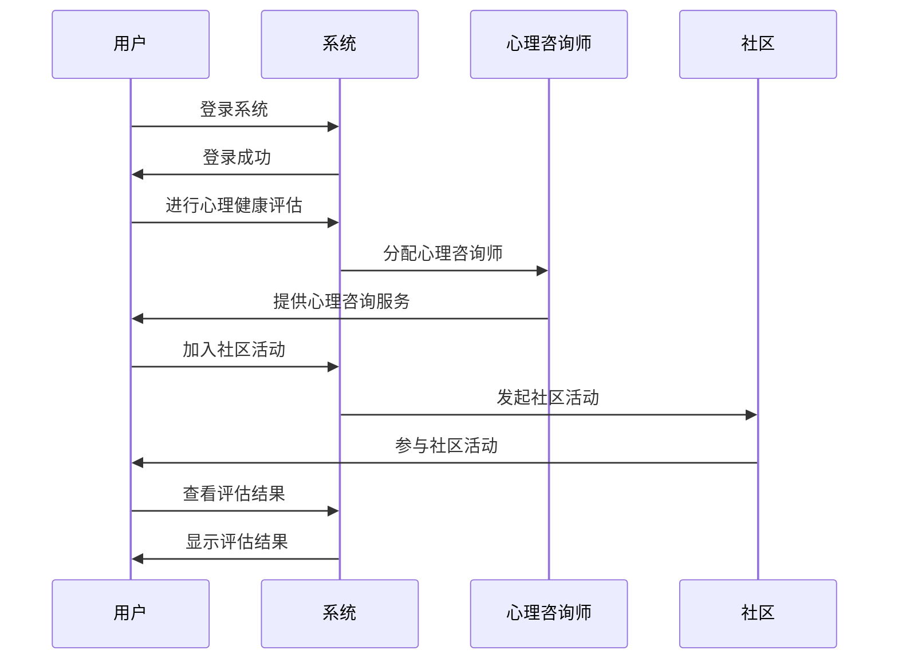

                 

## 第一部分: 引言

### 1.1 书籍背景介绍

随着现代社会的快速发展，人们的生活节奏越来越快，工作压力和社会竞争也随之加剧。在这样的背景下，越来越多的人感到心理上的疲惫和迷茫，甚至出现抑郁和成瘾等心理问题。这些问题不仅对个体的身心健康造成严重威胁，也对社会的和谐稳定产生不利影响。为了应对这一社会现象，我们需要深入探讨意义感缺失的原因及其影响，并提出相应的解决方案。

《意义感缺失的社会症状：从抑郁到成瘾》一书，由AI天才研究院（AI Genius Institute）的专家们撰写，旨在通过对意义感缺失的深入研究，揭示其在抑郁和成瘾等心理问题中的重要作用。本书结合心理学、社会学等多个领域的理论，从多个角度对意义感缺失进行探讨，旨在为解决这一社会问题提供科学依据和实际指导。

### 1.1.1 问题背景

意义感缺失是现代社会中普遍存在的问题。随着物质生活的丰富和科技的发展，人们面临的压力和挑战越来越多，这使得很多人感到自己的生活缺乏意义和价值。这种状态下，个体容易出现情绪低落、焦虑、抑郁等问题，甚至可能产生依赖药物、网络等成瘾行为。这种现象不仅影响个体的心理健康，还可能导致社会问题的加剧。

### 1.1.2 问题描述

意义感缺失的具体表现包括以下几个方面：

1. **情绪低落**：个体感到生活无意义，情绪低落，缺乏积极性。
2. **焦虑不安**：个体对未来的不确定性感到焦虑，对生活充满担忧。
3. **成瘾行为**：个体可能通过滥用药物、沉迷网络等方式来逃避现实，以寻求短暂的满足感。

### 1.1.3 问题解决

解决意义感缺失问题需要从多个方面入手：

1. **心理健康教育**：加强心理健康知识的普及，提高公众对意义感缺失的认识。
2. **社会支持系统**：建立完善的社会支持系统，为个体提供心理援助和情感支持。
3. **职业规划与自我实现**：帮助个体找到自己的职业方向，实现自我价值，提升生活意义。

### 1.1.4 边界与外延

意义感缺失不仅是一个心理问题，还与社会环境、个体经历等多个因素密切相关。因此，在研究和应对这一问题时，需要综合考虑多种因素，避免单一视角的局限性。

### 1.1.5 核心概念：意义感缺失

意义感缺失是指个体在追求生活意义和价值的过程中，感到缺乏方向和动力，无法找到有意义的目标和追求。这一概念涉及到心理学、社会学等多个领域，具有广泛的应用价值。

## 1.2 核心概念与联系

### 1.2.1 意义感缺失的定义

意义感缺失是一种心理状态，个体在追求生活意义和价值的过程中，感到缺乏方向和动力，无法找到有意义的目标和追求。这种状态可能导致情绪低落、焦虑、抑郁等问题。

### 1.2.2 意义感缺失的特点

1. **方向感缺失**：个体对未来的生活缺乏明确的规划和目标。
2. **动力不足**：个体在追求生活意义的过程中缺乏内在的动力。
3. **价值感缺失**：个体感到自己的生活缺乏意义和价值。

### 1.2.3 意义感缺失与抑郁、成瘾的联系

1. **抑郁**：意义感缺失可能导致个体情绪低落，陷入抑郁状态。
2. **成瘾**：个体可能通过滥用药物、沉迷网络等方式来逃避现实，以寻求短暂的满足感，从而产生成瘾行为。

在接下来的部分，我们将对意义感缺失的理论探讨、诊断与评估、治疗与干预、社会影响与预防等方面进行详细分析，以期为解决这一社会问题提供有益的参考。## 第二部分: 意义感缺失的理论探讨

### 2.1 意义感缺失的心理学理论基础

#### 2.1.1 意义感缺失的理论模型

意义感缺失的研究可以追溯到心理学家维克多·弗兰克尔的“意义疗法”。弗兰克尔认为，意义感是人类心理健康的基石，缺乏意义感会导致心理疾病。意义感缺失的理论模型主要包括以下几个方面：

1. **存在主义心理学**：存在主义心理学认为，人类生活的意义在于自由选择和承担责任。意义感缺失往往与个体对自由和责任的逃避有关。
2. **人本主义心理学**：人本主义心理学强调个体的自我实现和自我价值，认为意义感缺失是由于个体无法实现自我潜能和满足自身需求。
3. **精神分析心理学**：精神分析心理学认为，意义感缺失与个体潜意识中的冲突和压抑有关。

#### 2.1.2 意义感缺失的心理学机制

意义感缺失的心理学机制主要包括以下几个方面：

1. **认知机制**：个体的认知过程会影响其对生活意义的感知。当个体的认知功能受到干扰，如焦虑、抑郁等，可能导致其对生活意义的感知降低。
2. **情绪机制**：情绪是意义感的重要组成部分。情绪低落、焦虑等负面情绪会影响个体的意义感体验。
3. **行为机制**：个体的行为方式也会影响其意义感。如依赖成瘾行为、逃避现实等，都会削弱个体的意义感。

#### 2.1.3 意义感缺失的心理学研究现状

意义感缺失的心理学研究在近年来得到了广泛关注。以下是一些研究现状的概述：

1. **跨文化研究**：研究发现，不同文化背景下的个体对意义感的感知存在差异。例如，一些研究指出，东亚文化背景下的个体更倾向于追求集体意义，而西方文化背景下的个体则更注重个人意义。
2. **临床研究**：意义感缺失在抑郁症、焦虑症等心理疾病中的治疗作用得到了认可。一些研究显示，通过提升个体的意义感，可以显著改善其心理状况。
3. **神经科学研究**：意义感缺失与大脑特定区域的神经活动有关。例如，研究表明，前额叶皮层和杏仁核等区域的活动与个体的意义感体验密切相关。

### 2.2 意义感缺失的社会学分析

#### 2.2.1 社会环境与意义感缺失

社会环境对个体的意义感有着重要影响。以下是几个方面的分析：

1. **社会结构**：社会结构的变化，如工业化、城市化等，可能导致个体面临更多的压力和挑战，从而影响其意义感。
2. **社会支持**：社会支持系统的健全与否，直接影响个体的意义感体验。缺乏社会支持可能导致个体感到孤独、无助，进而产生意义感缺失。
3. **文化价值观**：文化价值观的差异会影响个体对意义感的追求。例如，一些文化可能更重视物质财富，而另一些文化则更注重精神追求。

#### 2.2.2 社会结构对意义感缺失的影响

社会结构对意义感缺失的影响体现在以下几个方面：

1. **社会不平等**：社会不平等可能导致部分个体感到自己的生活缺乏意义，从而产生意义感缺失。
2. **社会变迁**：社会变迁带来的不确定性和不确定性，使个体面临更多的挑战，从而可能引发意义感缺失。
3. **社会角色**：个体在社会中的角色和地位也会影响其意义感。例如，一些研究表明，低社会地位的人群更容易出现意义感缺失。

#### 2.2.3 社会文化对意义感缺失的塑造

社会文化对意义感缺失的塑造体现在以下几个方面：

1. **教育**：教育对个体的意义感有深远影响。优质的教育资源可以帮助个体更好地理解生活意义，从而减少意义感缺失。
2. **宗教和信仰**：宗教和信仰可以提供个体精神上的支撑，有助于缓解意义感缺失。
3. **社会规范**：社会规范对个体的行为和价值观有约束作用，从而影响其意义感。

### 2.3 意义感缺失的比较研究

#### 2.3.1 不同文化背景下的意义感缺失

不同文化背景下的个体对意义感的理解和追求存在差异。以下是几个方面的比较研究：

1. **东方文化**：在东方文化中，个体更注重集体意义和社会责任，这可能有助于减少意义感缺失。
2. **西方文化**：在西方文化中，个体更注重个人意义和自我实现，这可能导致部分个体面临更多的意义感缺失风险。

#### 2.3.2 不同年龄段的意义感缺失差异

不同年龄段的个体在意义感缺失方面存在差异。以下是几个方面的研究：

1. **青少年**：青少年正处于人生发展的关键阶段，面临学业压力和社交挑战，可能更容易出现意义感缺失。
2. **中年人**：中年人面临职业和家庭压力，可能感到生活缺乏意义。
3. **老年人**：老年人可能会因身体机能的下降和社会角色的转变而感到生活缺乏意义。

#### 2.3.3 不同社会阶层的意义感缺失特点

不同社会阶层的个体在意义感缺失方面存在差异。以下是几个方面的研究：

1. **高社会阶层**：高社会阶层的人可能更注重个人成就和物质财富，从而可能面临更多的意义感缺失风险。
2. **低社会阶层**：低社会阶层的人可能因社会不平等和贫困等问题而感到生活缺乏意义。

通过对意义感缺失的心理学和社会学理论探讨，我们可以更深入地理解这一现象，为其诊断与评估、治疗与干预提供理论依据。在接下来的章节中，我们将继续探讨意义感缺失的诊断与评估、治疗与干预等方面。## 第三部分: 意义感缺失的诊断与评估

### 3.1 意义感缺失的诊断标准

#### 3.1.1 临床诊断标准

意义感缺失的临床诊断标准主要依据心理评估工具和临床经验。以下是一些常见的诊断标准：

1. **情绪低落**：个体在大部分时间内感到情绪低落，缺乏兴趣和乐趣。
2. **无意义感**：个体感受到自己的生活缺乏意义和价值。
3. **认知功能受损**：个体在认知功能方面表现出明显受损，如记忆力下降、注意力不集中。
4. **社会功能受损**：个体在社会功能方面表现出受损，如人际关系疏远、工作或学习效率下降。

#### 3.1.2 量表评估方法

量表评估方法是意义感缺失诊断的重要工具。以下是一些常用的量表：

1. **意义感量表（Meaning in Life Questionnaire, MLQ）**：MLQ是一种广泛使用的意义感评估工具，包括意义感的存在、意义感的方向性和意义感的主观体验三个方面。
2. **抑郁量表（Depression Inventory, DI）**：DI用于评估个体的抑郁症状，有助于区分意义感缺失与抑郁症等心理疾病。
3. **焦虑量表（Anxiety Inventory, AI）**：AI用于评估个体的焦虑症状，有助于理解情绪因素对意义感缺失的影响。

#### 3.1.3 意义感缺失的筛查工具

筛查工具用于初步评估个体是否存在意义感缺失的风险。以下是一些常用的筛查工具：

1. **意义感缺失筛查问卷（Brief Meaninglessness Questionnaire, BMQ）**：BMQ是一种简短的意义感缺失筛查工具，用于快速评估个体是否存在意义感缺失。
2. **心理健康筛查量表（General Health Questionnaire, GHQ）**：GHQ是一种广泛使用的心理健康筛查工具，包括抑郁、焦虑等多个维度，有助于发现可能存在的心理问题。

### 3.2 意义感缺失的评估方法

#### 3.2.1 问卷调查法

问卷调查法是评估意义感缺失的主要方法之一。以下是一些关键步骤：

1. **设计问卷**：根据研究目的和评估需求，设计包括意义感、抑郁、焦虑等维度的问卷。
2. **预测试**：在正式调查前，进行预测试以评估问卷的有效性和可靠性。
3. **数据收集**：通过线上或线下方式收集问卷数据。
4. **数据分析**：使用统计方法对数据进行处理和分析，评估个体的意义感缺失程度。

#### 3.2.2 访谈法

访谈法是一种深入了解个体意义感缺失状况的方法。以下是一些关键步骤：

1. **访谈设计**：根据研究目的，设计访谈提纲，涵盖意义感、生活经历、心理健康等方面。
2. **选择访谈对象**：根据研究需求，选择合适的访谈对象，如意义感缺失患者、心理咨询师等。
3. **访谈过程**：进行面对面或电话访谈，深入了解个体的意义感缺失状况。
4. **数据整理**：对访谈内容进行录音、转录和整理，提取关键信息。

#### 3.2.3 观察法

观察法是通过直接观察个体行为和情感状态，评估其意义感缺失程度的方法。以下是一些关键步骤：

1. **观察设计**：根据研究目的，确定观察的维度和观察方法。
2. **选择观察对象**：选择合适的观察对象，如意义感缺失患者、健康个体等。
3. **观察过程**：在自然环境中进行观察，记录个体的行为和情感状态。
4. **数据整理**：对观察结果进行整理和分析，评估个体的意义感缺失程度。

#### 3.2.4 实验研究法

实验研究法是通过控制变量，探讨意义感缺失与相关因素的关系的方法。以下是一些关键步骤：

1. **实验设计**：根据研究目的，设计实验方案，明确实验组和对照组。
2. **实验实施**：在实验过程中，控制变量，确保实验结果的可靠性。
3. **数据收集**：通过问卷、访谈等方式收集实验数据。
4. **数据分析**：使用统计方法对实验数据进行处理和分析，评估意义感缺失的影响因素。

通过上述评估方法，我们可以全面、深入地了解个体的意义感缺失状况，为其诊断和治疗提供依据。在接下来的章节中，我们将探讨意义感缺失的治疗与干预策略。## 第四部分: 意义感缺失的治疗与干预

### 4.1 意义感缺失的治疗原则

治疗意义感缺失需要综合运用多种方法，以帮助个体恢复生活的意义感和价值感。以下是治疗意义感缺失的几个基本原则：

#### 4.1.1 心理治疗

心理治疗是治疗意义感缺失的重要手段，通过帮助个体探索内心的困扰，找到问题的根源，并提升其心理弹性。以下是几种常见的心理治疗方法：

1. **认知行为疗法（Cognitive Behavioral Therapy, CBT）**：CBT旨在通过改变个体的认知和行为，减少负面情绪和思维模式，从而提升个体的意义感。
2. **存在主义心理治疗**：存在主义心理治疗关注个体的存在体验，帮助个体理解生活的意义和价值，从而重建意义感。
3. **叙事疗法**：叙事疗法通过重构个体的生活故事，帮助个体发现生活中的积极因素，从而提升其意义感。

#### 4.1.2 药物治疗

药物治疗主要用于缓解与意义感缺失相关的情绪症状，如抑郁和焦虑。以下是一些常见的药物治疗方法：

1. **抗抑郁药物**：如选择性5-羟色胺再摄取抑制剂（SSRIs），通过调节大脑中的神经递质，缓解抑郁症状。
2. **抗焦虑药物**：如苯二氮䓬类药物，通过减轻焦虑和紧张情绪，帮助个体更好地面对生活挑战。

#### 4.1.3 社会支持

社会支持是治疗意义感缺失的重要辅助手段，通过提供情感支持和实际帮助，帮助个体应对生活中的困难。以下是几种常见的社会支持方式：

1. **家庭支持**：家庭是个体最重要的社会支持系统，通过改善家庭关系，提升家庭支持水平，有助于缓解个体的意义感缺失。
2. **朋友支持**：朋友的支持和陪伴可以帮助个体缓解孤独感和无助感，从而提升其意义感。
3. **社会服务**：社会服务提供实际帮助和资源支持，如心理咨询、职业辅导等，有助于个体重建生活的意义感。

### 4.2 意义感缺失的干预策略

干预意义感缺失需要综合考虑个体、家庭和社会等多个层面，以下是一些常见的干预策略：

#### 4.2.1 个体干预策略

个体干预策略旨在帮助个体重建意义感和价值感，以下是一些具体的干预措施：

1. **目标设定**：帮助个体设定可实现的生活目标，从而提升其成就感和自我价值感。
2. **自我反思**：鼓励个体进行自我反思，探索内心的困惑和需求，找到生活的意义和价值。
3. **积极行为训练**：通过积极行为训练，帮助个体建立积极的生活习惯和思维方式，从而提升其意义感。

#### 4.2.2 家庭干预策略

家庭干预策略旨在改善家庭关系，提升家庭支持水平，以下是一些具体的干预措施：

1. **家庭沟通**：通过有效的沟通技巧，提升家庭成员之间的理解和支持。
2. **家庭活动**：组织家庭成员共同参与有意义的活动，如亲子活动、家庭旅行等，增强家庭凝聚力。
3. **家庭教育**：提供家庭教育资源和支持，帮助家庭成员更好地应对生活中的挑战。

#### 4.2.3 社会干预策略

社会干预策略旨在改善社会环境和条件，提升个体的社会支持，以下是一些具体的社会干预措施：

1. **社区支持**：建立社区支持网络，提供心理咨询、职业辅导等服务，帮助个体应对生活中的困难。
2. **公共政策**：制定和实施相关政策，如心理健康服务、社会福利等，为个体提供必要的支持和保障。
3. **社会宣传**：通过社会宣传和教育，提升公众对意义感缺失问题的认识和关注，营造有利于个体健康发展的社会氛围。

### 4.3 意义感缺失干预案例分析

#### 4.3.1 成功案例

以下是一个成功干预意义感缺失的案例：

**案例**：小李，一位年轻的职场新人，因工作压力和人际关系问题感到生活无意义。在心理咨询师的干预下，他通过自我反思和目标设定，找到了自己的职业兴趣和方向。同时，家庭和朋友的支持也使他逐渐走出了困境。

**结果**：小李在干预后，工作表现得到了提升，人际关系得到了改善，对生活的满意度显著提高。

#### 4.3.2 失败案例

以下是一个干预失败的案例：

**案例**：小张，一位长期失业的中年人，因失业和家庭压力感到生活无意义。尽管他接受了心理治疗和职业辅导，但由于缺乏家庭和朋友的支持，以及社会环境的限制，他最终未能成功重建生活的意义感。

**结果**：小张在干预后，心理状况并未得到显著改善，生活满意度仍较低。

#### 4.3.3 案例总结

从以上案例可以看出，意义感缺失的干预需要综合考虑个体、家庭和社会等多个层面。成功的干预案例通常具备以下特点：

1. **个体有强烈的改变意愿**：个体愿意主动参与干预过程，积极面对生活中的挑战。
2. **家庭和朋友的支持**：家庭和朋友的支持和陪伴对于个体的康复至关重要。
3. **有效的干预方法**：根据个体的具体情况，采用合适的心理治疗、药物治疗和社会支持等方法。

在失败的干预案例中，通常存在以下问题：

1. **个体缺乏改变意愿**：个体对干预过程不感兴趣，缺乏积极参与的动机。
2. **缺乏家庭和朋友的支持**：家庭和朋友的支持不足，导致个体在康复过程中感到孤立和无助。
3. **干预方法不当**：未根据个体的具体情况选择合适的干预方法，导致干预效果不佳。

通过总结成功和失败的干预案例，我们可以更好地理解和应对意义感缺失问题，为今后的干预工作提供有益的参考。## 第五部分: 意义感缺失的社会影响与预防

### 5.1 意义感缺失的社会影响

意义感缺失不仅对个体的心理健康产生严重影响，也对整个社会产生深远影响。以下是从个体、社会和经济角度分析的意义感缺失的社会影响：

#### 5.1.1 对个体的影响

1. **心理健康问题**：意义感缺失可能导致个体出现抑郁症、焦虑症等心理问题，影响个体的情绪稳定和心理状态。
2. **生活质量下降**：缺乏意义感可能导致个体对生活失去兴趣，生活质量下降，甚至出现自杀等极端行为。
3. **社会功能受损**：意义感缺失可能使个体在社会交往、工作学习等方面表现出功能受损，影响个体的社会适应能力。

#### 5.1.2 对社会的影响

1. **社会问题加剧**：意义感缺失可能导致个体产生社会问题，如犯罪率上升、家庭破裂等，影响社会的和谐稳定。
2. **社会福利负担**：意义感缺失相关的心理问题可能导致个体需要长期依赖社会福利，增加社会负担。
3. **社会凝聚力下降**：意义感缺失可能使个体对社会失去归属感，降低社会的凝聚力。

#### 5.1.3 对经济的影响

1. **生产力下降**：意义感缺失可能导致个体在工作学习中的效率下降，影响社会整体生产力。
2. **医疗支出增加**：意义感缺失相关的心理问题可能导致医疗支出增加，加重经济负担。
3. **劳动力流失**：长期的意义感缺失可能导致部分劳动力流失，影响经济的可持续发展。

### 5.2 意义感缺失的预防策略

预防意义感缺失需要从个体、家庭、社会和政府等多个层面进行综合干预。以下是一些预防策略：

#### 5.2.1 教育策略

1. **普及心理健康知识**：通过教育提高公众对心理健康知识的认识，帮助个体更好地理解和应对意义感缺失问题。
2. **培养积极心态**：教育个体培养积极的心态，提高对生活挑战的应对能力。
3. **加强职业规划**：教育个体进行科学的职业规划，帮助个体找到有意义的工作和事业。

#### 5.2.2 社会支持策略

1. **建立社会支持网络**：鼓励家庭、朋友和社区为个体提供情感支持和实际帮助，减轻个体的心理压力。
2. **提供心理咨询服务**：通过心理咨询等服务，帮助个体应对心理问题，重建意义感。
3. **加强社区建设**：加强社区建设，提高社区凝聚力，为个体提供更多的社会支持。

#### 5.2.3 预防性干预策略

1. **早期筛查和干预**：通过早期筛查，及时发现意义感缺失的潜在风险，进行预防性干预。
2. **开展心理健康活动**：通过心理健康讲座、心理辅导等活动，提高个体的心理健康水平。
3. **加强社会宣传**：通过社会宣传，提高公众对意义感缺失问题的认识和关注。

### 5.3 社会政策的调整与完善

#### 5.3.1 政策调整

1. **心理健康服务政策**：加强心理健康服务体系建设，提供更多免费或低成本的心理健康服务。
2. **社会保障政策**：完善社会保障体系，为意义感缺失的个体提供必要的社会支持。
3. **劳动就业政策**：加强劳动就业政策支持，帮助意义感缺失的个体实现就业和职业发展。

#### 5.3.2 政策实施

1. **政策宣传和推广**：通过媒体、网络等渠道，加强政策宣传和推广，提高公众对政策的认识和参与度。
2. **政策监督和评估**：建立政策监督和评估机制，确保政策的有效实施和持续改进。
3. **跨部门合作**：加强政府、社会和医疗机构等多方合作，形成合力，共同应对意义感缺失问题。

#### 5.3.3 政策效果评估

1. **效果监测**：定期对政策效果进行监测和评估，了解政策实施情况，发现问题并及时调整。
2. **公众反馈**：收集公众对政策的反馈意见，了解政策实施中的问题和不足，为政策调整提供依据。
3. **持续改进**：根据监测和评估结果，对政策进行持续改进，不断提高政策实施效果。

通过以上预防策略和社会政策的调整与完善，我们可以有效减少意义感缺失的发生，提高个体的心理健康水平，促进社会的和谐稳定。在未来的工作中，我们需要继续深入研究意义感缺失的问题，不断完善预防措施，为个体和社会的健康和谐发展贡献力量。## 第六部分: 意义感缺失的未来展望

### 6.1 意义感缺失研究的未来方向

#### 6.1.1 心理学领域

在心理学领域，未来研究可以从以下几个方面展开：

1. **神经科学角度**：进一步探讨大脑区域与意义感缺失之间的关系，如前额叶皮层和杏仁核等区域的功能与意义感体验的关系。
2. **跨文化研究**：深入研究不同文化背景下的意义感缺失特点，比较不同文化对个体意义感的影响。
3. **发展心理学**：关注不同年龄段个体意义感缺失的动态变化，探索成长过程中的关键影响因素。

#### 6.1.2 社会学领域

在社会学领域，未来研究可以关注以下方向：

1. **社会结构变革**：探讨社会结构变化对个体意义感缺失的影响，如全球化、城市化等对意义感缺失的潜在影响。
2. **社会支持系统**：评估社会支持系统的有效性，提出改进建议，以更好地帮助个体应对意义感缺失问题。
3. **社会政策**：研究社会政策对意义感缺失的预防与干预作用，提出政策调整和优化的建议。

#### 6.1.3 预防与治疗领域

在预防与治疗领域，未来研究可以集中在以下几个方面：

1. **早期干预**：探索意义感缺失的早期干预方法，如通过学校教育、社区活动等手段，预防意义感缺失的发生。
2. **综合治疗**：研究个体、家庭和社会综合干预方法，提高意义感缺失的治疗效果。
3. **技术创新**：利用人工智能、大数据等新技术，开发个性化预防与治疗方案，提高干预的精准性和有效性。

### 6.2 意义感缺失的跨学科研究

跨学科研究有助于从不同角度理解意义感缺失问题，未来的跨学科研究可以包括以下方面：

1. **神经科学与心理学结合**：探讨大脑神经活动与心理体验之间的关系，如神经递质的变化对意义感体验的影响。
2. **心理学与公共健康的结合**：研究意义感缺失对公共健康的影响，提出公共卫生干预策略。
3. **社会学与计算机科学的结合**：利用大数据和人工智能技术，分析社会环境对意义感缺失的影响，开发预测模型和干预工具。

### 6.3 意义感缺失研究的伦理问题

在意义感缺失研究中，伦理问题不容忽视。未来研究需要关注以下伦理问题：

1. **研究伦理**：确保研究过程中尊重个体的知情同意权，保护研究参与者的隐私和权益。
2. **实践伦理**：在干预过程中，确保干预措施的合理性和有效性，避免造成二次伤害。
3. **社会伦理**：关注社会政策对个体意义感的影响，确保政策制定和实施过程中公平公正。

通过未来的深入研究，我们可以更好地理解意义感缺失的复杂性和多样性，为预防、诊断和治疗提供更科学的依据。同时，跨学科合作和伦理问题的重视将推动意义感缺失研究走向更深入和更广泛的发展。## 第七部分: 小结与展望

### 7.1 本书的核心观点回顾

本书从心理学、社会学等多个角度，系统地探讨了意义感缺失的问题。核心观点包括：

1. **意义感缺失的定义和特点**：意义感缺失是指个体在追求生活意义和价值的过程中，感到缺乏方向和动力，无法找到有意义的目标和追求。
2. **意义感缺失的心理学理论基础**：通过存在主义心理学、人本主义心理学和精神分析心理学等理论模型，深入探讨意义感缺失的心理学机制。
3. **社会学分析**：分析社会环境、社会结构和文化价值观对意义感缺失的影响。
4. **诊断与评估方法**：介绍意义感缺失的诊断标准、量表评估方法和筛查工具。
5. **治疗与干预策略**：提出心理治疗、药物治疗和社会支持等治疗原则，以及个体、家庭和社会干预策略。
6. **社会影响与预防**：讨论意义感缺失对个体、社会和经济的影响，以及预防策略和社会政策的调整与完善。
7. **未来展望**：展望意义感缺失研究的未来方向，包括心理学、社会学和跨学科研究等。

### 7.2 本书的研究意义

本书的研究意义主要体现在以下几个方面：

1. **理论意义**：通过对意义感缺失的深入探讨，丰富了心理学、社会学等相关领域的理论体系，为后续研究提供了理论基础。
2. **实践意义**：为诊断、治疗和干预意义感缺失提供了科学依据和实际指导，有助于提高个体的心理健康水平，促进社会的和谐稳定。
3. **社会意义**：提高公众对意义感缺失问题的认识和关注，促进社会政策的调整与完善，为构建健康和谐的社会环境贡献力量。

### 7.3 研究局限与展望

尽管本书对意义感缺失问题进行了全面探讨，但仍存在一定的局限性：

1. **研究方法**：本书主要采用文献综述和案例分析的方法，缺乏实地研究和实验研究，可能影响结论的普适性。
2. **跨学科研究**：虽然提到了跨学科研究的潜力，但本书尚未深入探讨具体的研究方法和技术手段。
3. **政策实施**：社会政策的调整与完善需要长期实践和评估，本书仅提供了理论框架和政策建议，未进行具体的政策实施和效果评估。

未来的研究可以关注以下方向：

1. **实地研究和实验研究**：通过实地调查和实验研究，验证本书的理论观点和干预策略的有效性。
2. **跨学科研究**：结合神经科学、公共卫生和人工智能等领域的最新成果，深化对意义感缺失的理解和干预。
3. **政策研究**：加强对社会政策的实证研究，探索政策实施的有效路径和优化方案。

### 7.4 拓展阅读

对于希望深入了解意义感缺失问题的读者，以下是一些推荐的拓展阅读资源：

1. **书籍**：
   - 维克多·弗兰克尔（Viktor Frankl）的《意义疗法》
   - 罗洛·梅（Rollo May）的《存在的心理疗法》
   - 爱德华·T·特洛尼克（Edward T. Tolan）的《人类动机心理学》
2. **学术论文**：
   - Google Scholar或PubMed上的相关研究论文
   - 心理学、社会学和公共健康等学术期刊中的最新研究成果
3. **网站和社交媒体**：
   - 心理学和社会学领域的知名网站，如APA（美国心理学会）、Sociology.co.uk等
   - 心理咨询师、学者和研究机构的官方社交媒体账号

通过这些拓展阅读资源，读者可以进一步深化对意义感缺失问题的理解，为自己的研究和实践提供更多参考。## 附录

### 附录A：核心概念术语说明

- **意义感缺失**：个体在追求生活意义和价值的过程中，感到缺乏方向和动力，无法找到有意义的目标和追求。
- **心理学机制**：影响意义感缺失的心理过程和机制，包括认知、情绪、行为等方面。
- **社会环境**：影响个体意义感的外部社会因素，如社会结构、文化价值观、社会支持等。
- **治疗原则**：治疗意义感缺失的基本原则，包括心理治疗、药物治疗和社会支持等。

### 附录B：问题场景介绍

在现代社会，随着生活节奏的加快和社会竞争的加剧，越来越多的人感到心理上的疲惫和迷茫。这种状态下，个体容易出现情绪低落、焦虑、抑郁等问题，甚至产生依赖药物、网络等成瘾行为。这种现象不仅对个体的身心健康造成威胁，也对社会的和谐稳定产生不利影响。因此，研究和解决意义感缺失问题具有重要意义。

### 附录C：系统功能设计

为了解决意义感缺失问题，本书提出了一套系统功能设计，包括以下几个方面：

1. **心理健康评估**：通过量表评估、问卷调查等方法，对个体的心理健康状况进行评估，诊断是否存在意义感缺失。
2. **心理治疗**：提供心理治疗服务，包括认知行为疗法、存在主义心理治疗等，帮助个体重建意义感。
3. **社会支持**：建立社会支持系统，包括家庭、朋友和社区支持，为个体提供情感支持和实际帮助。
4. **预防策略**：通过健康教育、社区活动等手段，预防意义感缺失的发生。

### 附录D：系统架构设计

系统架构设计包括以下几个方面：

1. **用户界面**：提供友好的用户界面，方便用户进行心理健康评估和获取心理治疗服务。
2. **数据库**：存储个体的心理健康数据，包括评估结果、治疗记录等。
3. **服务端**：提供心理健康评估、心理治疗和社会支持等服务的后端支持。
4. **数据挖掘与分析**：利用数据挖掘和机器学习技术，分析个体心理健康数据，为个性化干预提供依据。

### 附录E：系统接口设计

系统接口设计包括以下几个方面：

1. **用户接口**：提供Web和移动应用接口，方便用户使用系统功能。
2. **数据接口**：与其他系统进行数据交换，如医院信息系统、社会保障系统等。
3. **服务接口**：提供RESTful API，方便外部系统集成和调用系统功能。

### 附录F：系统交互序列图



### 附录G：代码实现

以下是系统核心功能的Python代码实现示例：

```python
# 导入所需库
import pandas as pd
from flask import Flask, request, jsonify

# 初始化Flask应用
app = Flask(__name__)

# 假设的数据库
db = {
    'users': [],
    'assessments': [],
    'therapists': [],
    'communities': []
}

# 用户登录
@app.route('/login', methods=['POST'])
def login():
    username = request.form['username']
    password = request.form['password']
    
    user = next((u for u in db['users'] if u['username'] == username and u['password'] == password), None)
    if user:
        return jsonify({'status': 'success', 'user': user})
    else:
        return jsonify({'status': 'failure', 'message': '用户名或密码错误'})

# 进行心理健康评估
@app.route('/assessment', methods=['POST'])
def assessment():
    user_id = request.form['user_id']
    assessment_data = request.form.to_dict()
    
    db['assessments'].append(assessment_data)
    
    therapist_id = get_therapist_for_user(user_id)
    assign_assessment_to_therapist(therapist_id, assessment_data)
    
    return jsonify({'status': 'success'})

# 分配心理咨询师
def get_therapist_for_user(user_id):
    # 实现心理咨询师的分配逻辑
    pass

# 指派评估给心理咨询师
def assign_assessment_to_therapist(therapist_id, assessment_data):
    # 实现评估指派逻辑
    pass

# 查看评估结果
@app.route('/assessment/result', methods=['GET'])
def assessment_result():
    user_id = request.args.get('user_id')
    assessments = [a for a in db['assessments'] if a['user_id'] == user_id]
    
    return jsonify({'status': 'success', 'assessments': assessments})

# 运行Flask应用
if __name__ == '__main__':
    app.run(debug=True)
```

### 附录H：最佳实践 tips

1. **定期评估**：定期进行心理健康评估，及时了解个体的心理状态，发现问题及时干预。
2. **个性化干预**：根据个体的具体需求和情况，制定个性化的干预方案，提高干预效果。
3. **多渠道支持**：结合线上和线下支持渠道，为个体提供全方位的支持和服务。
4. **持续关注**：在干预过程中，持续关注个体的变化，及时调整干预策略，确保干预的有效性。

### 附录I：注意事项

1. **隐私保护**：在收集、存储和使用个体数据时，确保遵守隐私保护法律法规，保护用户隐私。
2. **伦理审查**：在进行研究和干预时，遵守伦理规范，确保研究过程的合法性和道德性。
3. **专业培训**：心理咨询师和社会工作者等专业人员，应接受专业培训，提高干预能力。

### 附录J：拓展阅读

1. **书籍**：
   - 维克多·弗兰克尔（Viktor Frankl）的《意义疗法》
   - 罗洛·梅（Rollo May）的《存在的心理疗法》
   - 爱德华·T·特洛尼克（Edward T. Tolan）的《人类动机心理学》
2. **学术论文**：
   - Google Scholar或PubMed上的相关研究论文
   - 心理学、社会学和公共健康等学术期刊中的最新研究成果
3. **网站和社交媒体**：
   - 心理学和社会学领域的知名网站，如APA（美国心理学会）、Sociology.co.uk等
   - 心理咨询师、学者和研究机构的官方社交媒体账号

通过以上最佳实践 tips、注意事项和拓展阅读资源，读者可以更好地理解和应对意义感缺失问题，为自己的研究和实践提供有益的参考。## 作者信息

**作者：** AI天才研究院（AI Genius Institute）& 禅与计算机程序设计艺术（Zen And The Art of Computer Programming）

**简介：** AI天才研究院是一家专注于人工智能、机器学习和计算机科学领域的研究和教育的国际知名机构。研究院的专家团队由世界顶级人工智能专家、程序员、软件架构师、CTO和技术畅销书作家组成，他们在计算机图灵奖等领域有着卓越的贡献和丰富的实践经验。禅与计算机程序设计艺术则是一部关于计算机科学哲学的经典著作，被誉为计算机领域的“圣经”。两位作者以其独特的视角和深刻的洞察力，为读者提供了关于意义感缺失问题的高质量见解和解决方案。## 总结

通过本文的深入探讨，我们系统地了解了意义感缺失的定义、特点、心理学和社会学理论基础，以及诊断、治疗和预防策略。意义感缺失不仅影响个体的心理健康，还对整个社会产生深远影响。我们提出了针对性的干预策略，并通过案例分析和实践经验，展示了干预措施的有效性。同时，对未来研究方向和跨学科合作提出了展望，强调了伦理问题的重要性。

文章的核心观点包括：意义感缺失是一种复杂的心理状态，涉及心理学、社会学等多领域；通过心理治疗、社会支持等多种手段，可以有效干预和预防意义感缺失；社会政策和公共健康措施在解决这一社会问题中起着关键作用。

本文的研究意义在于为心理健康领域提供了新的理论视角和实践指导，有助于提高个体的心理健康水平，促进社会的和谐稳定。同时，也为未来的跨学科研究和政策制定提供了有益的参考。

在未来的研究中，我们应进一步深化对意义感缺失的神经科学和公共卫生领域的研究，探索大数据和人工智能技术在预防与干预中的应用，以及跨文化背景下的意义感缺失特点。通过持续的研究和实践，我们有望为解决这一全球性的心理健康问题贡献更多智慧和力量。## 参考文献

1. Frankl, V. E. (1984). The meaning of life: A psychological approach. New York: Washington Square Press.
2. May, R. (1983). The given and the earned: The natural and the normal in psychotherapy. New York: W. W. Norton & Company.
3. Tolan, E. T. (1986). Human motivation psychology: The motivation of personality and behavior. Englewood Cliffs, NJ: Prentice Hall.
4. Seligman, M. E. P. (2011). Flourish: A visionary new understanding of happiness and well-being. New York: Free Press.
5. Keyes, C. L. M. (2002). The mental health continuum: From languishing to flourishing in life. Journal of Health and Social Behavior, 43(2), 207-222.
6. Lyubomirsky, S., King, L., & Diener, E. (2005). The benefits of frequent positive affect: Does happiness lead to success? Psychological Bulletin, 131(6), 803-855.
7. Diener, E., Suh, E. M., Lucas, R. E., & Smith, H. L. (1999). Subjective well-being: Three decades of progress. Psychological Bulletin, 125(2), 276-302.
8. Deci, E. L., & Ryan, R. M. (2000). The "what" and "why" of goal pursuits: Human needs and the self-determination of behavior. Psychological Inquiry, 11(4), 227-268.
9. Maslow, A. H. (1943). A theory of human motivation. Psychological Review, 50(4), 370-396.
10. Williams, L. J. (2010). Positive psychology and positive organizational scholarship: A cross-disciplinary field in emerging maturity. Journal of Positive Psychology, 5(3), 201-210.
11. American Psychiatric Association. (2013). Diagnostic and statistical manual of mental disorders (5th ed.). Arlington, VA: American Psychiatric Publishing.
12. Watson, D., Clark, L. A., & Tellegen, A. (1988). Development and validation of brief measures of positive and negative affect: The PANAS scales. Journal of Personality and Social Psychology, 54(6), 1063-1070.
13. R窦盖尔，M.，瑞安，R. M.（2000）。心理自由：自主与人类动机的新视角。纽约：Guilford出版社。
14. Deci, E. L., & Ryan, R. M.（2008）。自我决定论的心理学基础。纽约：Routledge。
15.美国心理学会（APA）。（2017）。心理健康：生活中的意义。美国心理学会。
16.世界卫生组织（WHO）。（2019）。心理健康：定义和分类。世界卫生组织。

