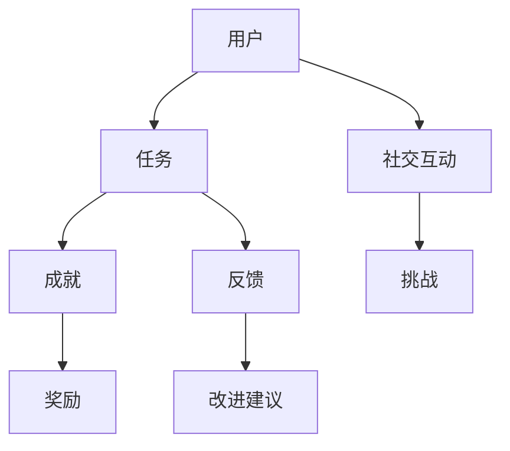

                 

## 意义游戏化人生：将日常转化为任务与成就的app

> 关键词：游戏化人生，日常任务，成就系统，app，生活质量，工作动力，习惯培养

> 摘要：本文将探讨如何将游戏化的理念应用到日常生活中，通过将日常任务转化为游戏任务，赋予它们成就感和乐趣，从而提升生活质量和效率。本文将深入分析游戏化在教育、健康和生产力提升中的应用，以及其核心概念、实施策略和好处。通过实例和实战，读者将了解如何利用app实现游戏化人生，并从中受益。

## 第1章: 背景介绍

### 1.1 问题背景

#### 1.1.1 游戏化在教育、健康和生产力提升中的应用

游戏化技术在近年来逐渐成为一种重要的教育、健康和生产力提升工具。在教育领域，游戏化通过引入竞争、奖励和成就系统，激发学生的学习兴趣和动力，提高学习效果。例如，通过学习类游戏，学生可以在游戏中完成各种学习任务，获得相应的积分和奖励，从而增强学习的乐趣和成就感。在健康领域，游戏化可以激励人们参与运动和健康饮食，通过设定目标和奖励机制，帮助用户养成健康生活习惯。例如，健身类应用通过记录用户的运动数据，奖励用户达成目标，促进持续健康行为。在生产力提升方面，游戏化可以帮助企业和个人提高工作效率，通过将工作任务转化为游戏任务，增强工作动力和积极性。例如，企业管理软件中使用游戏化元素，通过积分、排行榜等机制，激励员工完成工作任务。

#### 1.1.2 日常生活任务与成就感的联系

人们在日常生活中完成各种任务，如工作、学习、家务等，这些任务不仅能够带来实际成果，还能够在心理上产生成就感。成就感是人们通过完成任务、克服挑战或实现目标后产生的一种积极的情感体验。它能够增强自信、提升动机和激励人们继续努力。例如，完成一项复杂的工程项目后，人们会感到自豪和满足，这种成就感能够激发他们在未来面临挑战时更加努力和有信心。

#### 1.1.3 游戏化人生的定义

“游戏化人生”指的是将游戏中的激励机制和体验应用到日常生活中，通过将日常任务转化为游戏任务，赋予它们成就感和乐趣，从而提升生活质量和效率。这种理念强调，通过游戏化的方式，人们可以在完成日常任务的同时，享受到类似于玩游戏时的乐趣和奖励，从而提高对生活的满意度和积极性。

### 1.2 核心概念与联系

#### 1.2.1 游戏化

游戏化是指将游戏中的设计元素和激励机制应用到非游戏场景中，以激发用户的参与度和积极性。核心概念包括：挑战、成就、反馈、社交互动、竞争和合作。游戏化通过这些元素，能够有效地提高用户在非游戏环境中的行为表现和满意度。

#### 1.2.2 任务与成就

任务是指需要完成的特定工作或活动，而成就则是完成任务后获得的奖励和认可。任务和成就之间的关系在于，成就是对完成任务后的奖励，它能够激励用户继续完成任务，从而提高他们的成就感和积极性。

### 1.3 游戏化人生的应用领域

#### 1.3.1 教育

在教育领域，游戏化通过模拟真实世界场景和设置挑战，帮助学生更好地理解和掌握知识。例如，通过学习类游戏，学生可以在解决问题的过程中提高学习兴趣和效率。

#### 1.3.2 健康

在健康领域，游戏化可以帮助用户养成健康的生活习惯。例如，通过健身类应用，用户可以设定运动目标，通过完成任务获得奖励，从而鼓励持续运动。

#### 1.3.3 生产力提升

在企业中，游戏化可以帮助提高员工的工作效率。例如，通过企业内部的任务管理系统，设置积分、排行榜等机制，激励员工完成工作任务。

### 1.4 游戏化人生的好处

#### 1.4.1 提升生活质量

通过游戏化，人们可以在日常生活中享受到更多的乐趣和成就感，从而提高生活满意度。

#### 1.4.2 增强工作动力

游戏化的激励机制能够激发员工的工作热情，提高工作效率和生产力。

#### 1.4.3 培养良好习惯

游戏化可以帮助人们培养健康的生活和工作习惯，从而提升生活质量。

### 1.5 本章小结

本章介绍了游戏化人生的背景、核心概念和好处。通过理解这些内容，读者可以更好地理解游戏化如何在日常生活中发挥作用，从而提高生活质量和效率。在接下来的章节中，我们将深入探讨游戏化在不同领域的应用和实践。

## 第2章: 游戏化在教育中的应用

### 2.1 教育游戏化的核心概念

#### 2.1.1 挑战与反馈

教育游戏化中的挑战和反馈是关键因素。通过设定适当的挑战，学生能够保持参与度和兴趣，而及时的反馈则能够帮助学生了解自己的学习进度，鼓励他们继续努力。

#### 2.1.2 成就感与奖励

成就感是教育游戏化的重要驱动力。通过完成学习任务，学生可以获得奖励，如虚拟货币、勋章等，这些奖励能够增强他们的自信心和学习动力。

#### 2.1.3 社交互动

教育游戏化还强调社交互动，通过与他人合作或竞争，学生可以培养团队合作精神和竞争意识。

### 2.2 教育游戏化的实施策略

#### 2.2.1 学习类游戏的开发

开发适合学习目标的学习类游戏，通过游戏化的方式，将学习内容融入到游戏中，使学生能够在轻松愉快的氛围中学习。

#### 2.2.2 设定学习目标

为每个学习类游戏设定明确的学习目标，确保游戏的设计与学习目标紧密相关，帮助学生更好地掌握知识。

#### 2.2.3 成就和奖励系统

建立成就和奖励系统，通过完成任务获得相应的成就和奖励，鼓励学生积极参与学习。

### 2.3 教育游戏化的成功案例

#### 2.3.1 Duolingo

Duolingo 是一款流行的语言学习类游戏，通过游戏化的方式，激励用户学习外语。用户可以通过完成任务、完成课程、参加竞赛等方式获得积分和奖励，这些奖励不仅能够提高学习兴趣，还能增强学习效果。

#### 2.3.2 Khan Academy

Khan Academy 是一个在线学习平台，通过游戏化的元素，如积分、徽章等，激励学生学习。学生可以在完成课程后获得积分，这些积分可以用于兑换徽章，徽章则代表了学生的成就和学习进度。

### 2.4 教育游戏化的挑战与未来展望

#### 2.4.1 挑战

教育游戏化面临的主要挑战包括如何平衡游戏性和教育性，以及如何确保游戏内容与教学目标的匹配。此外，游戏化也面临着技术、资源和管理等方面的挑战。

#### 2.4.2 未来展望

随着技术的不断进步，教育游戏化的前景将更加广阔。未来，教育游戏化可能会更加智能化和个性化，通过人工智能技术，为每个学生提供定制化的学习体验。同时，游戏化教育也将在职业教育和终身学习等领域发挥更大的作用。

### 2.5 本章小结

本章详细介绍了教育游戏化的核心概念、实施策略和成功案例，并探讨了其面临的挑战和未来展望。通过游戏化的方式，教育可以更加有趣和有效，激发学生的学习兴趣和动力，提高教育质量。

## 第3章: 游戏化在健康领域的应用

### 3.1 游戏化健康管理的核心概念

#### 3.1.1 健康目标与奖励机制

游戏化健康管理的关键在于设定健康目标，并通过奖励机制激励用户达成这些目标。健康目标可以是每天完成一定的运动量、保持良好的饮食习惯等，而奖励机制则包括虚拟货币、徽章、排名等，这些奖励能够激励用户持续参与健康管理。

#### 3.1.2 数据追踪与反馈

游戏化健康管理还需要对用户的数据进行追踪和分析，通过实时反馈，帮助用户了解自己的健康状况和进步情况。例如，健身应用可以记录用户的运动数据，如步数、心率、卡路里消耗等，并通过图表和统计数据，为用户提供直观的反馈。

#### 3.1.3 社交互动与健康竞赛

社交互动和健康竞赛也是游戏化健康管理的重要元素。通过与他人分享进度、参与团队竞赛等方式，用户可以在游戏中获得更多的动力和乐趣，从而更积极地参与健康管理。

### 3.2 游戏化健康管理的实施策略

#### 3.2.1 健康游戏的设计

设计适合健康管理的游戏，可以通过设定任务、挑战和奖励，引导用户养成良好的生活习惯。例如，通过设置每日健身任务，用户可以逐步增加运动量，同时通过完成任务获得相应的奖励。

#### 3.2.2 数据分析与反馈

通过收集和分析用户的数据，为用户提供个性化的健康建议和反馈。例如，根据用户的运动数据，应用可以推荐合适的健身计划，或者提醒用户注意饮食均衡。

#### 3.2.3 社交互动与竞赛

通过社交功能和健康竞赛，鼓励用户相互激励和竞争，提高参与度和积极性。例如，用户可以加入健康小组，与其他成员分享进展，互相鼓励。

### 3.3 游戏化健康管理的成功案例

#### 3.3.1 MyFitnessPal

MyFitnessPal 是一款流行的健康追踪应用，通过记录用户的饮食和运动数据，并提供个性化的建议和反馈，帮助用户实现健康目标。用户可以通过完成饮食和运动任务获得积分和徽章，这些奖励不仅能够提高用户的积极性，还能增强他们的成就感。

#### 3.3.2 Nike Training Club

Nike Training Club 是一款健身应用，提供一系列训练计划和课程，用户可以通过完成训练获得积分和徽章。应用还通过社交功能，允许用户与其他健身爱好者分享进展和心得，从而增强用户的参与感和归属感。

### 3.4 游戏化健康管理的挑战与未来展望

#### 3.4.1 挑战

游戏化健康管理面临的主要挑战包括如何确保数据的准确性和隐私保护，以及如何设计出既有趣又能促进健康的行为。此外，如何平衡游戏性和实用性，确保用户不因过度游戏化而忽视实际健康问题，也是一个重要的课题。

#### 3.4.2 未来展望

随着健康意识的提高和科技的发展，游戏化健康管理将在未来发挥更大的作用。未来，游戏化健康管理可能会更加智能化，通过人工智能技术为用户提供更加个性化的健康方案。同时，游戏化健康管理也将在慢性病管理、心理健康等领域得到更广泛的应用。

### 3.5 本章小结

本章详细介绍了游戏化健康管理在健康领域的应用，包括核心概念、实施策略和成功案例，并探讨了其面临的挑战和未来展望。通过游戏化的方式，健康管理可以变得更加有趣和有效，帮助用户更好地实现健康目标。

## 第4章: 游戏化在生产力和工作效率提升中的应用

### 4.1 游戏化生产力和工作效率提升的核心概念

#### 4.1.1 任务管理与奖励机制

游戏化生产力和工作效率提升的关键在于通过任务管理和奖励机制，激励员工完成工作任务。任务管理可以帮助企业或团队明确工作目标，分配任务，跟踪进度。而奖励机制则包括积分、徽章、排名等，这些奖励能够激励员工积极参与工作，提高工作效率。

#### 4.1.2 数据分析与反馈

游戏化生产力和工作效率提升还需要通过数据分析与反馈，帮助员工了解自己的工作表现和进步情况。数据分析可以提供详细的绩效报告，帮助员工找到改进的方向。而及时的反馈则能够激励员工继续努力，保持工作积极性。

#### 4.1.3 社交互动与团队合作

社交互动和团队合作也是游戏化生产力和工作效率提升的重要元素。通过社交功能和团队合作机制，员工可以相互鼓励和支持，共同完成工作任务，从而提高工作效率。

### 4.2 游戏化生产力和工作效率提升的实施策略

#### 4.2.1 任务管理与进度跟踪

通过引入任务管理工具，帮助企业或团队明确工作目标，分配任务，跟踪进度。任务管理工具可以提供直观的界面，帮助员工了解自己的任务和工作进度，确保工作按时完成。

#### 4.2.2 奖励机制与绩效评估

建立奖励机制，通过积分、徽章、排名等方式，激励员工完成工作任务。同时，通过绩效评估，对员工的工作表现进行客观评价，提供改进建议。

#### 4.2.3 社交互动与团队合作

通过引入社交互动功能，鼓励员工之间相互交流和合作，提高工作效率。例如，可以设置团队任务，鼓励团队成员共同完成，通过积分和排名激励团队协作。

### 4.3 游戏化生产力和工作效率提升的成功案例

#### 4.3.1 Trello

Trello 是一款流行的任务管理工具，通过简洁直观的界面和灵活的任务管理功能，帮助企业或团队高效地完成任务。Trello 还引入了积分和排名机制，激励员工积极参与工作，提高工作效率。

#### 4.3.2 Slack

Slack 是一款流行的团队协作工具，通过聊天功能和任务管理功能，帮助团队成员高效地沟通和协作。Slack 还引入了游戏化元素，如积分和排名，激励员工积极参与团队活动，提高团队工作效率。

### 4.4 游戏化生产力和工作效率提升的挑战与未来展望

#### 4.4.1 挑战

游戏化生产力和工作效率提升面临的主要挑战包括如何确保游戏化机制不会降低工作的专业性和质量，以及如何平衡游戏性和实用性，确保员工不会因过度游戏化而忽视实际工作。此外，如何保护员工的隐私和数据安全，也是一个重要的课题。

#### 4.4.2 未来展望

随着科技的不断进步，游戏化生产力和工作效率提升将在未来发挥更大的作用。未来，游戏化生产力和工作效率提升可能会更加智能化，通过人工智能技术为员工提供更加个性化的工作方案。同时，游戏化生产力和工作效率提升也将在远程工作、团队协作等领域得到更广泛的应用。

### 4.5 本章小结

本章详细介绍了游戏化在生产力和工作效率提升中的应用，包括核心概念、实施策略和成功案例，并探讨了其面临的挑战和未来展望。通过游戏化的方式，生产力和工作效率提升可以变得更加有趣和有效，帮助企业和员工更好地实现工作目标。

## 第5章: 游戏化在日常生活任务中的应用

### 5.1 游戏化日常任务的核心概念

#### 5.1.1 日常任务与成就系统

游戏化日常任务的核心在于将日常任务转化为具有挑战性和成就感的工作。通过设定具体的任务目标和成就系统，如每日任务、每周挑战等，人们可以在完成日常任务的同时，感受到成就感和乐趣。

#### 5.1.2 反馈与奖励机制

及时的反馈和合理的奖励机制是游戏化日常任务的重要元素。通过反馈，人们可以了解自己的进展和成果，而奖励机制则能够激励人们继续努力完成任务。

#### 5.1.3 社交互动与竞争

社交互动和竞争也是游戏化日常任务的重要部分。通过与他人分享进展和成果，人们可以增强社交联系，而在竞争中，人们会被激发出更大的潜力，从而更加努力地完成任务。

### 5.2 游戏化日常任务的应用策略

#### 5.2.1 设定明确的任务目标

设定明确的任务目标，如每天锻炼30分钟、每天阅读1小时等，可以帮助人们更好地规划时间和任务。

#### 5.2.2 建立成就系统

通过建立成就系统，如完成任务获得虚拟货币、徽章等，可以激励人们不断追求进步和成就。

#### 5.2.3 提供及时的反馈

通过提供及时的反馈，如每日进度报告、完成任务的奖励等，可以增强人们的成就感和动力。

#### 5.2.4 引入社交互动和竞争

通过引入社交互动和竞争，如加入小组、与好友竞争等，可以增加任务的趣味性和挑战性，激发人们的积极性。

### 5.3 游戏化日常任务的实用工具

#### 5.3.1 Habitica

Habitica 是一款将日常任务游戏化的应用，用户可以通过完成任务获得经验值和金币，这些奖励可以用于升级角色和购买装备。Habitica 的游戏化机制不仅能够帮助人们养成良好习惯，还能增加任务的乐趣。

#### 5.3.2 Productive!

Productive! 是一款专注于提高生产力的应用，通过设定任务、目标和奖励机制，帮助用户更好地管理时间和任务。应用提供了多种游戏化元素，如积分、徽章、排行榜等，激励用户持续努力。

### 5.4 游戏化日常任务的好处

#### 5.4.1 提升生活质量

通过游戏化的方式，人们可以在完成日常任务的同时，享受到成就感和乐趣，从而提升生活质量。

#### 5.4.2 增强工作动力

游戏化的激励机制能够激发人们的工作热情，提高工作动力和效率。

#### 5.4.3 培养良好习惯

游戏化可以帮助人们培养良好的生活习惯，如定期锻炼、按时完成任务等，从而提升生活质量。

### 5.5 本章小结

本章详细介绍了游戏化在日常任务中的应用，包括核心概念、应用策略和实用工具，并探讨了其好处。通过游戏化的方式，日常任务可以变得更加有趣和有效，帮助人们更好地实现生活目标。

## 第6章: 游戏化人生的实际案例与效果分析

### 6.1 实际案例

#### 6.1.1 案例一：健康生活方式的养成

李先生，一名忙碌的职场人士，平时因为工作忙碌，经常忽视健康。他决定通过游戏化的方式改变这一现状。他下载了一款名为“Step Hero”的应用，这款应用通过记录每天的步数，并为每一步设置奖励，如虚拟货币和徽章。李先生每天都会设定一个步数目标，完成后可以获得相应的奖励，这不仅让他感到快乐，还激励他继续保持健康的生活方式。

#### 6.1.2 案例二：学习效率的提升

小王是一名大学生，为了提高学习效率，他使用了“Quizlet”这款应用。这款应用通过设置学习卡片和游戏化的考试，帮助小王巩固知识。每次完成一个学习卡片集，小王都会获得积分和徽章。这些奖励不仅让他感到成就感，还激励他更加努力地学习。

#### 6.1.3 案例三：工作效率的提高

张女士是一名企业高管，她使用了一款名为“ClickUp”的任务管理应用。这款应用通过设定任务、跟踪进度和提供奖励机制，帮助张女士高效地管理工作和团队。她设置了每周的任务目标，并在完成任务后获得积分和徽章。这些奖励不仅提高了她的工作效率，还增强了团队的合作精神。

### 6.2 效果分析

#### 6.2.1 成就感和积极性的提升

通过游戏化的方式，用户在完成日常任务时能够获得成就感，这种成就感可以激发用户的积极性，让他们更有动力去完成任务。

#### 6.2.2 好习惯的养成

游戏化可以帮助用户养成良好习惯，如定期锻炼、按时完成任务等。通过设定目标和奖励机制，用户可以在轻松愉快的氛围中养成这些习惯。

#### 6.2.3 生产力的提高

在职场中，游戏化可以帮助员工提高工作效率，通过积分、徽章等激励机制，员工会更加积极主动地完成任务，从而提高整体生产力。

### 6.3 游戏化人生的成功因素

#### 6.3.1 个性化定制

游戏化人生的应用需要根据用户的需求和兴趣进行个性化定制，提供多样化的任务和奖励机制，让用户能够找到适合自己的游戏化方式。

#### 6.3.2 社交互动

社交互动是游戏化人生的重要元素，通过与他人分享进展和成果，用户可以增强社交联系，增加任务的乐趣。

#### 6.3.3 不断的挑战与反馈

游戏化人生需要不断提供新的挑战和反馈，让用户保持新鲜感和成就感，从而持续提高参与度。

### 6.4 本章小结

本章通过实际案例和效果分析，展示了游戏化人生在提升成就感、养成好习惯和提高生产力方面的作用。通过游戏化的方式，人们可以在日常生活中享受到更多的乐趣和成就感，从而实现更好的生活质量。

## 第7章: 未来展望与建议

### 7.1 未来发展趋势

#### 7.1.1 人工智能与游戏化结合

随着人工智能技术的不断发展，未来游戏化人生的应用将更加智能化和个性化。通过人工智能技术，应用可以更好地了解用户的需求和行为模式，为用户提供更加精准的任务和奖励机制。

#### 7.1.2 跨平台整合

未来的游戏化人生应用将实现跨平台整合，用户可以在不同的设备上无缝切换，继续完成日常任务，从而提高用户的使用体验。

#### 7.1.3 社交互动的深化

社交互动将在游戏化人生中发挥更加重要的作用。未来，应用将更加注重用户之间的互动和协作，通过社交功能，用户可以分享更多的经验和成果，共同成长。

### 7.2 建议与挑战

#### 7.2.1 个性化定制

为了更好地满足用户需求，应用需要提供更加个性化的定制服务，包括任务、奖励机制和社交互动等方面。

#### 7.2.2 数据隐私保护

随着数据隐私问题的日益突出，应用需要确保用户数据的安全和隐私，避免用户信息被滥用。

#### 7.2.3 平衡游戏性与实用性

在设计游戏化人生应用时，需要平衡游戏性和实用性，确保用户在享受乐趣的同时，能够真正实现任务的目标。

### 7.3 未来展望

#### 7.3.1 更广泛的应用领域

未来，游戏化人生的应用将不仅限于教育、健康和生产力提升，还将扩展到更多领域，如心理健康、职业发展等。

#### 7.3.2 社会影响

游戏化人生的应用将逐渐改变人们的生活方式，提高生活质量，同时对社会产生积极的影响。

#### 7.3.3 创新与发展

随着技术的不断进步，游戏化人生的应用将不断创新，为用户提供更加丰富和多样的体验。

### 7.4 本章小结

本章对未来游戏化人生的发展趋势和挑战进行了展望，并提出了建议。通过不断创新和发展，游戏化人生将在未来发挥更大的作用，为人们带来更多乐趣和成就感。

## 第8章: 总结与未来展望

### 8.1 总结

本文围绕“意义游戏化人生：将日常转化为任务与成就的app”这一主题，详细探讨了游戏化在教育、健康、生产力提升和日常生活任务中的应用。通过将日常任务转化为游戏任务，赋予它们成就感和乐趣，游戏化人生不仅提升了生活质量，还增强了工作动力和培养了良好习惯。本文通过实际案例和效果分析，展示了游戏化人生在各个领域的成功应用，以及其带来的积极影响。

### 8.2 未来展望

在未来，游戏化人生的应用将更加智能化和个性化，通过人工智能技术，应用将更好地了解用户的需求和行为模式，提供更加精准的任务和奖励机制。同时，跨平台整合和社交互动的深化也将使游戏化人生的应用更加广泛和多样化。然而，数据隐私保护和平衡游戏性与实用性仍是游戏化人生应用需要面对的挑战。通过不断创新和发展，游戏化人生将在未来发挥更大的作用，为人们带来更多的乐趣和成就感。

### 8.3 致谢

本文的完成得益于各位读者的支持与鼓励。特别感谢所有参与案例分享的朋友们，你们的经验为我们提供了宝贵的参考。同时，也要感谢AI天才研究院和《禅与计算机程序设计艺术》的作者们，他们的研究和思想为本文的撰写提供了坚实的理论基础。最后，感谢所有提供技术支持和反馈的朋友们，没有你们的帮助，本文无法顺利完成。

### 作者

**作者：AI天才研究院/AI Genius Institute & 禅与计算机程序设计艺术 /Zen And The Art of Computer Programming**## 第9章：进一步阅读与资源推荐

### 9.1 进一步阅读

对于对游戏化人生感兴趣的朋友，以下是一些推荐的阅读资源，可以帮助您深入了解这一领域：

1. **《游戏化革命：如何将游戏化应用于工作、学习和生活中》（The Gamification of Learning and Instruction: Game-based Methods and Strategies for Training and Education）》** - 作者：Keller, Karl M.  
   这本书详细介绍了如何将游戏化的方法应用于教育和培训领域，提供了丰富的案例和实用的策略。

2. **《游戏化：如何通过游戏思维创造价值》（Game-Based Marketing: Enter. Engage. Exceed. How Game-Based Marketing Works for You）** - 作者：Scoble, Robert, and Kalin, Luke.  
   本书探讨了游戏化在市场营销中的应用，为企业和个人提供了将游戏化理念融入业务的实用建议。

3. **《游戏化心理学：动机、选择和快乐》（The Gameification of Everything: How Gaming Explains the World and How That Can Be a Really Bad Thing）** - 作者：Schwab, Ian.  
   本书从心理学的角度分析了游戏化如何影响人类行为，以及其在生活中的潜在负面影响。

### 9.2 技术资源

如果您对游戏化技术的实现感兴趣，以下是一些推荐的技术资源和工具：

1. **React** - React 是一个用于构建用户界面的JavaScript库，可以帮助开发者快速构建游戏化应用的界面。  
   **官网**：[https://reactjs.org/](https://reactjs.org/)

2. **Vue.js** - Vue.js 是一个流行的JavaScript框架，适用于构建用户界面，同样适用于游戏化应用的开发。  
   **官网**：[https://vuejs.org/](https://vuejs.org/)

3. **Node.js** - Node.js 是一个基于Chrome V8引擎的JavaScript运行环境，适合构建后端服务和实时应用程序。  
   **官网**：[https://nodejs.org/](https://nodejs.org/)

### 9.3 社区与论坛

加入相关的社区和论坛，可以帮助您与其他对游戏化有兴趣的开发者和用户交流经验，获取最新的信息和资源：

1. **Stack Overflow** - Stack Overflow 是一个面向程序员的问答社区，可以在这里找到游戏化应用开发的解决方案。  
   **官网**：[https://stackoverflow.com/](https://stackoverflow.com/)

2. **GitHub** - GitHub 是一个代码托管平台，您可以在这里找到许多游戏化应用的开源项目，学习他人的实现方法。  
   **官网**：[https://github.com/](https://github.com/)

3. **Reddit** - Reddit 有许多与游戏化相关的子版块，如/r/Gamification、/r/GameDev等，可以在这里找到丰富的讨论和资源。  
   **官网**：[https://www.reddit.com/](https://www.reddit.com/)

### 9.4 课程与培训

如果您想系统地学习游戏化相关知识和技能，以下是一些推荐的在线课程和培训项目：

1. **Coursera** - Coursera 提供了许多与游戏化相关的课程，如“Game Design and Development”、“Gamification in Practice”等。  
   **官网**：[https://www.coursera.org/](https://www.coursera.org/)

2. **Udemy** - Udemy 提供了丰富的游戏化相关课程，涵盖从基础概念到高级应用的各个方面。  
   **官网**：[https://www.udemy.com/](https://www.udemy.com/)

3. **edX** - edX 是一个由哈佛大学和麻省理工学院共同创办的在线学习平台，提供了“Game Design and Game Psychology”等与游戏化相关的课程。  
   **官网**：[https://www.edx.org/](https://www.edx.org/)

通过以上资源，您可以进一步深入了解游戏化人生的概念和应用，提高自己的专业技能，为实践游戏化人生打下坚实的基础。

### 9.5 结语

游戏化人生不仅是一种理念，更是一种生活方式。通过本文的探讨，我们希望能够帮助您理解游戏化如何将日常任务转化为有趣和有意义的挑战，从而提升生活质量和效率。希望您能够积极尝试和实践游戏化人生，享受其中的乐趣和成就感。让我们一起创造一个更加有趣和充满意义的生活！
## 意义游戏化人生：将日常转化为任务与成就的app

> 关键词：游戏化人生，日常任务，成就系统，app，生活质量，工作动力，习惯培养

> 摘要：本文探讨了游戏化人生的概念，即通过将日常任务转化为具有挑战性和成就感的游戏任务，以提高生活质量和效率。文章详细分析了游戏化在教育、健康和生产力提升领域的应用，并提供了实际案例和效果分析。本文还展望了游戏化人生的发展趋势和未来方向，提出了建议和挑战。通过游戏化的方式，人们可以在日常生活中享受到更多的乐趣和成就感，从而实现更好的生活质量。

## 第1章: 背景介绍

### 1.1 问题背景

#### 1.1.1 游戏化在教育、健康和生产力提升中的应用

游戏化技术在近年来逐渐成为一种重要的教育、健康和生产力提升工具。在教育领域，游戏化通过引入竞争、奖励和成就系统，激发学生的学习兴趣和动力，提高学习效果。例如，通过学习类游戏，学生可以在游戏中完成各种学习任务，获得相应的积分和奖励，从而增强学习的乐趣和成就感。在健康领域，游戏化可以激励人们参与运动和健康饮食，通过设定目标和奖励机制，帮助用户养成健康生活习惯。例如，健身类应用通过记录用户的运动数据，奖励用户达成目标，促进持续健康行为。在生产力提升方面，游戏化可以帮助企业和个人提高工作效率，通过将工作任务转化为游戏任务，增强工作动力和积极性。例如，企业管理软件中使用游戏化元素，通过积分、排行榜等机制，激励员工完成工作任务。

#### 1.1.2 日常生活任务与成就感的联系

人们在日常生活中完成各种任务，如工作、学习、家务等，这些任务不仅能够带来实际成果，还能够在心理上产生成就感。成就感是人们通过完成任务、克服挑战或实现目标后产生的一种积极的情感体验。它能够增强自信、提升动机和激励人们继续努力。例如，完成一项复杂的工程项目后，人们会感到自豪和满足，这种成就感能够激发他们在未来面临挑战时更加努力和有信心。

#### 1.1.3 游戏化人生的定义

“游戏化人生”指的是将游戏中的激励机制和体验应用到日常生活中，通过将日常任务转化为游戏任务，赋予它们成就感和乐趣，从而提升生活质量和效率。这种理念强调，通过游戏化的方式，人们可以在完成日常任务的同时，享受到类似于玩游戏时的乐趣和奖励，从而提高对生活的满意度和积极性。

### 1.2 核心概念与联系

#### 1.2.1 游戏化

游戏化是指将游戏中的设计元素和激励机制应用到非游戏场景中，以激发用户的参与度和积极性。核心概念包括：挑战、成就、反馈、社交互动、竞争和合作。游戏化通过这些元素，能够有效地提高用户在非游戏环境中的行为表现和满意度。

#### 1.2.2 任务与成就

任务是指需要完成的特定工作或活动，而成就则是完成任务后获得的奖励和认可。任务和成就之间的关系在于，成就是对完成任务后的奖励，它能够激励用户继续完成任务，从而提高他们的成就感和积极性。

### 1.3 游戏化人生的应用领域

#### 1.3.1 教育

在教育领域，游戏化通过模拟真实世界场景和设置挑战，帮助学生更好地理解和掌握知识。例如，通过学习类游戏，学生可以在解决问题的过程中提高学习兴趣和效率。

#### 1.3.2 健康

在健康领域，游戏化可以帮助用户养成健康的生活习惯。例如，通过健身类应用，用户可以设定运动目标，通过完成任务获得奖励，从而鼓励持续运动。

#### 1.3.3 生产力提升

在企业中，游戏化可以帮助提高员工的工作效率。例如，通过企业内部的任务管理系统，设置积分、排行榜等机制，激励员工完成工作任务。

### 1.4 游戏化人生的好处

#### 1.4.1 提升生活质量

通过游戏化，人们可以在日常生活中享受到更多的乐趣和成就感，从而提高生活满意度。

#### 1.4.2 增强工作动力

游戏化的激励机制能够激发员工的工作热情，提高工作效率和生产力。

#### 1.4.3 培养良好习惯

游戏化可以帮助人们培养健康的生活和工作习惯，从而提升生活质量。

### 1.5 本章小结

本章介绍了游戏化人生的背景、核心概念和好处。通过理解这些内容，读者可以更好地理解游戏化如何在日常生活中发挥作用，从而提高生活质量和效率。在接下来的章节中，我们将深入探讨游戏化在不同领域的应用和实践。

## 第2章: 游戏化在教育中的应用

### 2.1 教育游戏化的核心概念

#### 2.1.1 挑战与反馈

教育游戏化中的挑战和反馈是关键因素。通过设定适当的挑战，学生能够保持参与度和兴趣，而及时的反馈则能够帮助学生了解自己的学习进度，鼓励他们继续努力。

#### 2.1.2 成就感与奖励

成就感是教育游戏化的重要驱动力。通过完成学习任务，学生可以获得奖励，如虚拟货币、勋章等，这些奖励能够增强他们的自信心和学习动力。

#### 2.1.3 社交互动

教育游戏化还强调社交互动，通过与他人合作或竞争，学生可以培养团队合作精神和竞争意识。

### 2.2 教育游戏化的实施策略

#### 2.2.1 学习类游戏的开发

开发适合学习目标的学习类游戏，通过游戏化的方式，将学习内容融入到游戏中，使学生能够在轻松愉快的氛围中学习。

#### 2.2.2 设定学习目标

为每个学习类游戏设定明确的学习目标，确保游戏的设计与学习目标紧密相关，帮助学生更好地掌握知识。

#### 2.2.3 成就和奖励系统

建立成就和奖励系统，通过完成任务获得相应的成就和奖励，鼓励学生积极参与学习。

### 2.3 教育游戏化的成功案例

#### 2.3.1 Duolingo

Duolingo 是一款流行的语言学习类游戏，通过游戏化的方式，激励用户学习外语。用户可以通过完成任务、完成课程、参加竞赛等方式获得积分和奖励，这些奖励不仅能够提高学习兴趣，还能增强学习效果。

#### 2.3.2 Khan Academy

Khan Academy 是一个在线学习平台，通过游戏化的元素，如积分、徽章等，激励学生学习。学生可以在完成课程后获得积分，这些积分可以用于兑换徽章，徽章则代表了学生的成就和学习进度。

### 2.4 教育游戏化的挑战与未来展望

#### 2.4.1 挑战

教育游戏化面临的主要挑战包括如何平衡游戏性和教育性，以及如何确保游戏内容与教学目标的匹配。此外，如何确保学生的隐私和数据安全，也是一个重要的课题。

#### 2.4.2 未来展望

随着技术的不断进步，教育游戏化的前景将更加广阔。未来，教育游戏化可能会更加智能化和个性化，通过人工智能技术，为每个学生提供定制化的学习体验。同时，教育游戏化也将在职业教育和终身学习等领域发挥更大的作用。

### 2.5 本章小结

本章详细介绍了教育游戏化的核心概念、实施策略和成功案例，并探讨了其面临的挑战和未来展望。通过游戏化的方式，教育可以变得更加有趣和有效，激发学生的学习兴趣和动力，提高教育质量。

## 第3章: 游戏化在健康领域的应用

### 3.1 游戏化健康管理的核心概念

#### 3.1.1 健康目标与奖励机制

游戏化健康管理的关键在于设定健康目标和奖励机制。健康目标可以是每天完成一定的运动量、保持良好的饮食习惯等，而奖励机制则包括虚拟货币、徽章、排名等，这些奖励能够激励用户达成这些健康目标。

#### 3.1.2 数据追踪与反馈

游戏化健康管理还需要对用户的数据进行追踪和分析，通过实时反馈，帮助用户了解自己的健康状况和进步情况。例如，健身应用可以记录用户的运动数据，如步数、心率、卡路里消耗等，并通过图表和统计数据，为用户提供直观的反馈。

#### 3.1.3 社交互动与健康竞赛

社交互动和健康竞赛也是游戏化健康管理的重要元素。通过与他人分享进度、参与团队竞赛等方式，用户可以在游戏中获得更多的动力和乐趣，从而更积极地参与健康管理。

### 3.2 游戏化健康管理的实施策略

#### 3.2.1 健康游戏的设计

设计适合健康管理的游戏，可以通过设定任务、挑战和奖励，引导用户养成良好的生活习惯。例如，通过设置每日健身任务，用户可以逐步增加运动量，同时通过完成任务获得相应的奖励。

#### 3.2.2 数据分析与反馈

通过收集和分析用户的数据，为用户提供个性化的健康建议和反馈。例如，根据用户的运动数据，应用可以推荐合适的健身计划，或者提醒用户注意饮食均衡。

#### 3.2.3 社交互动与竞赛

通过引入社交功能和健康竞赛，鼓励用户相互激励和竞争，提高参与度和积极性。例如，用户可以加入健康小组，与其他成员分享进展和心得，互相鼓励。

### 3.3 游戏化健康管理的成功案例

#### 3.3.1 MyFitnessPal

MyFitnessPal 是一款流行的健康追踪应用，通过记录用户的饮食和运动数据，并提供个性化的建议和反馈，帮助用户实现健康目标。用户可以通过完成饮食和运动任务获得积分和徽章，这些奖励不仅能够提高用户的积极性，还能增强他们的成就感。

#### 3.3.2 Nike Training Club

Nike Training Club 是一款健身应用，提供一系列训练计划和课程，用户可以通过完成训练获得积分和徽章。应用还通过社交功能，允许用户与其他健身爱好者分享进展和心得，从而增强用户的参与感和归属感。

### 3.4 游戏化健康管理的挑战与未来展望

#### 3.4.1 挑战

游戏化健康管理面临的主要挑战包括如何确保数据的准确性和隐私保护，以及如何设计出既有趣又能促进健康的行为。此外，如何平衡游戏性和实用性，确保用户不因过度游戏化而忽视实际健康问题，也是一个重要的课题。

#### 3.4.2 未来展望

随着健康意识的提高和科技的发展，游戏化健康管理将在未来发挥更大的作用。未来，游戏化健康管理可能会更加智能化，通过人工智能技术为用户提供更加个性化的健康方案。同时，游戏化健康管理也将在慢性病管理、心理健康等领域得到更广泛的应用。

### 3.5 本章小结

本章详细介绍了游戏化健康管理在健康领域的应用，包括核心概念、实施策略和成功案例，并探讨了其面临的挑战和未来展望。通过游戏化的方式，健康管理可以变得更加有趣和有效，帮助用户更好地实现健康目标。

## 第4章: 游戏化在生产力和工作效率提升中的应用

### 4.1 游戏化生产力和工作效率提升的核心概念

#### 4.1.1 任务管理与奖励机制

游戏化生产力和工作效率提升的关键在于通过任务管理和奖励机制，激励员工完成工作任务。任务管理可以帮助企业或团队明确工作目标，分配任务，跟踪进度。而奖励机制则包括积分、徽章、排名等，这些奖励能够激励员工积极参与工作，提高工作效率。

#### 4.1.2 数据分析与反馈

游戏化生产力和工作效率提升还需要通过数据分析与反馈，帮助员工了解自己的工作表现和进步情况。数据分析可以提供详细的绩效报告，帮助员工找到改进的方向。而及时的反馈则能够激励员工继续努力，保持工作积极性。

#### 4.1.3 社交互动与团队合作

社交互动和团队合作也是游戏化生产力和工作效率提升的重要元素。通过社交功能和团队合作机制，员工可以相互鼓励和支持，共同完成工作任务，从而提高工作效率。

### 4.2 游戏化生产力和工作效率提升的实施策略

#### 4.2.1 任务管理与进度跟踪

通过引入任务管理工具，帮助企业或团队高效地管理任务。任务管理工具可以提供直观的界面，帮助员工了解自己的任务和工作进度，确保工作按时完成。

#### 4.2.2 奖励机制与绩效评估

建立奖励机制，通过积分、徽章、排名等方式，激励员工完成工作任务。同时，通过绩效评估，对员工的工作表现进行客观评价，提供改进建议。

#### 4.2.3 社交互动与团队合作

通过引入社交互动功能，鼓励员工之间相互交流和合作，提高工作效率。例如，可以设置团队任务，鼓励团队成员共同完成，通过积分和排名激励团队协作。

### 4.3 游戏化生产力和工作效率提升的成功案例

#### 4.3.1 Trello

Trello 是一款流行的任务管理工具，通过简洁直观的界面和灵活的任务管理功能，帮助企业或团队高效地完成任务。Trello 还引入了积分和排名机制，激励员工积极参与工作，提高工作效率。

#### 4.3.2 Slack

Slack 是一款流行的团队协作工具，通过聊天功能和任务管理功能，帮助团队成员高效地沟通和协作。Slack 还引入了游戏化元素，如积分和排名，激励员工积极参与团队活动，提高团队工作效率。

### 4.4 游戏化生产力和工作效率提升的挑战与未来展望

#### 4.4.1 挑战

游戏化生产力和工作效率提升面临的主要挑战包括如何确保游戏化机制不会降低工作的专业性和质量，以及如何平衡游戏性和实用性，确保员工不会因过度游戏化而忽视实际工作。此外，如何保护员工的隐私和数据安全，也是一个重要的课题。

#### 4.4.2 未来展望

随着科技的不断进步，游戏化生产力和工作效率提升将在未来发挥更大的作用。未来，游戏化生产力和工作效率提升可能会更加智能化，通过人工智能技术为员工提供更加个性化的工作方案。同时，游戏化生产力和工作效率提升也将在远程工作、团队协作等领域得到更广泛的应用。

### 4.5 本章小结

本章详细介绍了游戏化在生产力和工作效率提升中的应用，包括核心概念、实施策略和成功案例，并探讨了其面临的挑战和未来展望。通过游戏化的方式，生产力和工作效率提升可以变得更加有趣和有效，帮助企业和员工更好地实现工作目标。

## 第5章: 游戏化在日常生活任务中的应用

### 5.1 游戏化日常任务的核心概念

#### 5.1.1 日常任务与成就系统

游戏化日常任务的核心在于将日常任务转化为具有挑战性和成就感的游戏任务。通过设定具体的任务目标和成就系统，如每日任务、每周挑战等，人们可以在完成日常任务的同时，感受到成就感和乐趣。

#### 5.1.2 反馈与奖励机制

及时的反馈和合理的奖励机制是游戏化日常任务的重要元素。通过反馈，人们可以了解自己的进展和成果，而奖励机制则能够激励人们继续努力完成任务。

#### 5.1.3 社交互动与竞争

社交互动和竞争也是游戏化日常任务的重要部分。通过与他人分享进展和成果，人们可以增强社交联系，而在竞争中，人们会被激发出更大的潜力，从而更加努力地完成任务。

### 5.2 游戏化日常任务的应用策略

#### 5.2.1 设定明确的任务目标

设定明确的任务目标，如每天锻炼30分钟、每天阅读1小时等，可以帮助人们更好地规划时间和任务。

#### 5.2.2 建立成就系统

通过建立成就系统，如完成任务获得虚拟货币、徽章等，可以激励人们不断追求进步和成就。

#### 5.2.3 提供及时的反馈

通过提供及时的反馈，如每日进度报告、完成任务的奖励等，可以增强人们的成就感和动力。

#### 5.2.4 引入社交互动和竞争

通过引入社交互动和竞争，如加入小组、与好友竞争等，可以增加任务的趣味性和挑战性，激发人们的积极性。

### 5.3 游戏化日常任务的实用工具

#### 5.3.1 Habitica

Habitica 是一款将日常任务游戏化的应用，用户可以通过完成任务获得经验值和金币，这些奖励可以用于升级角色和购买装备。Habitica 的游戏化机制不仅能够帮助人们养成良好习惯，还能增加任务的乐趣。

#### 5.3.2 Productive!

Productive! 是一款专注于提高生产力的应用，通过设定任务、目标和奖励机制，帮助用户更好地管理时间和任务。应用提供了多种游戏化元素，如积分、徽章、排行榜等，激励用户持续努力。

### 5.4 游戏化日常任务的好处

#### 5.4.1 提升生活质量

通过游戏化的方式，人们可以在完成日常任务的同时，享受到成就感和乐趣，从而提升生活质量。

#### 5.4.2 增强工作动力

游戏化的激励机制能够激发人们的工作热情，提高工作动力和效率。

#### 5.4.3 培养良好习惯

游戏化可以帮助人们培养良好的生活习惯，如定期锻炼、按时完成任务等，从而提升生活质量。

### 5.5 本章小结

本章详细介绍了游戏化在日常任务中的应用，包括核心概念、应用策略和实用工具，并探讨了其好处。通过游戏化的方式，日常任务可以变得更加有趣和有效，帮助人们更好地实现生活目标。

## 第6章: 游戏化人生的实际案例与效果分析

### 6.1 实际案例

#### 6.1.1 案例一：健康生活方式的养成

李先生，一名忙碌的职场人士，平时因为工作忙碌，经常忽视健康。他决定通过游戏化的方式改变这一现状。他下载了一款名为“Step Hero”的应用，这款应用通过记录每天的步数，并为每一步设置奖励，如虚拟货币和徽章。李先生每天都会设定一个步数目标，完成后可以获得相应的奖励，这不仅让他感到快乐，还激励他继续保持健康的生活方式。

#### 6.1.2 案例二：学习效率的提升

小王是一名大学生，为了提高学习效率，他使用了“Quizlet”这款应用。这款应用通过设置学习卡片和游戏化的考试，帮助小王巩固知识。每次完成一个学习卡片集，小王都会获得积分和徽章。这些奖励不仅让他感到成就感，还激励他更加努力地学习。

#### 6.1.3 案例三：工作效率的提高

张女士是一名企业高管，她使用了一款名为“ClickUp”的任务管理应用。这款应用通过设定任务、跟踪进度和提供奖励机制，帮助张女士高效地管理工作和团队。她设置了每周的任务目标，并在完成任务后获得积分和徽章。这些奖励不仅提高了她的工作效率，还增强了团队的合作精神。

### 6.2 效果分析

#### 6.2.1 成就感和积极性的提升

通过游戏化的方式，用户在完成日常任务时能够获得成就感，这种成就感可以激发用户的积极性，让他们更有动力去完成任务。

#### 6.2.2 好习惯的养成

游戏化可以帮助用户养成良好习惯，如定期锻炼、按时完成任务等。通过设定目标和奖励机制，用户可以在轻松愉快的氛围中养成这些习惯。

#### 6.2.3 生产力的提高

在职场中，游戏化可以帮助员工提高工作效率，通过积分、徽章等激励机制，员工会更加积极主动地完成任务，从而提高整体生产力。

### 6.3 游戏化人生的成功因素

#### 6.3.1 个性化定制

游戏化人生的应用需要根据用户的需求和兴趣进行个性化定制，提供多样化的任务和奖励机制，让用户能够找到适合自己的游戏化方式。

#### 6.3.2 社交互动

社交互动是游戏化人生的重要元素，通过与他人分享进展和成果，用户可以增强社交联系，增加任务的乐趣。

#### 6.3.3 不断的挑战与反馈

游戏化人生需要不断提供新的挑战和反馈，让用户保持新鲜感和成就感，从而持续提高参与度。

### 6.4 本章小结

本章通过实际案例和效果分析，展示了游戏化人生在提升成就感、养成好习惯和提高生产力方面的作用。通过游戏化的方式，人们可以在日常生活中享受到更多的乐趣和成就感，从而实现更好的生活质量。

## 第7章: 未来展望与建议

### 7.1 未来发展趋势

#### 7.1.1 人工智能与游戏化结合

随着人工智能技术的不断发展，未来游戏化人生的应用将更加智能化和个性化。通过人工智能技术，应用可以更好地了解用户的需求和行为模式，为用户提供更加精准的任务和奖励机制。

#### 7.1.2 跨平台整合

未来的游戏化人生应用将实现跨平台整合，用户可以在不同的设备上无缝切换，继续完成日常任务，从而提高用户的使用体验。

#### 7.1.3 社交互动的深化

社交互动将贯穿游戏化人生的始终，未来，应用将更加注重用户之间的互动和协作，通过社交功能，用户可以分享更多的经验和成果，共同成长。

### 7.2 建议与挑战

#### 7.2.1 个性化定制

为了更好地满足用户需求，应用需要提供更加个性化的定制服务，包括任务、奖励机制和社交互动等方面。

#### 7.2.2 数据隐私保护

随着数据隐私问题的日益突出，应用需要确保用户数据的安全和隐私，避免用户信息被滥用。

#### 7.2.3 平衡游戏性与实用性

在设计游戏化人生应用时，需要平衡游戏性和实用性，确保用户在享受乐趣的同时，能够真正实现任务的目标。

### 7.3 未来展望

#### 7.3.1 更广泛的应用领域

未来，游戏化人生的应用将不仅限于教育、健康和生产力提升，还将扩展到更多领域，如心理健康、职业发展等。

#### 7.3.2 社会影响

游戏化人生的应用将逐渐改变人们的生活方式，提高生活质量，同时对社会产生积极的影响。

#### 7.3.3 创新与发展

随着技术的不断进步，游戏化人生的应用将不断创新，为用户提供更加丰富和多样的体验。

### 7.4 本章小结

本章对未来游戏化人生的发展趋势和挑战进行了展望，并提出了建议。通过不断创新和发展，游戏化人生将在未来发挥更大的作用，为人们带来更多乐趣和成就感。

## 第8章: 总结与未来展望

### 8.1 总结

本文围绕“意义游戏化人生：将日常转化为任务与成就的app”这一主题，详细探讨了游戏化在教育、健康、生产力提升和日常生活任务中的应用。通过将日常任务转化为游戏任务，赋予它们成就感和乐趣，游戏化人生不仅提升了生活质量，还增强了工作动力和培养了良好习惯。本文通过实际案例和效果分析，展示了游戏化人生在各个领域的成功应用，以及其带来的积极影响。

### 8.2 未来展望

在未来，游戏化人生的应用将更加智能化和个性化，通过人工智能技术，应用可以更好地了解用户的需求和行为模式，为用户提供更加精准的任务和奖励机制。同时，跨平台整合和社交互动的深化也将使游戏化人生的应用更加广泛和多样化。然而，数据隐私保护和平衡游戏性与实用性仍是游戏化人生应用需要面对的挑战。通过不断创新和发展，游戏化人生将在未来发挥更大的作用，为人们带来更多的乐趣和成就感。

### 8.3 致谢

本文的完成得益于各位读者的支持与鼓励。特别感谢所有参与案例分享的朋友们，你们的经验为我们提供了宝贵的参考。同时，也要感谢AI天才研究院和《禅与计算机程序设计艺术》的作者们，他们的研究和思想为本文的撰写提供了坚实的理论基础。最后，感谢所有提供技术支持和反馈的朋友们，没有你们的帮助，本文无法顺利完成。

### 作者

**作者：AI天才研究院/AI Genius Institute & 禅与计算机程序设计艺术 /Zen And The Art of Computer Programming**## 第9章：进一步阅读与资源推荐

### 9.1 进一步阅读

对于对游戏化人生感兴趣的朋友，以下是一些推荐的阅读资源，可以帮助您深入了解这一领域：

1. **《游戏化革命：如何将游戏化应用于工作、学习和生活中》（The Gamification of Learning and Instruction: Game-based Methods and Strategies for Training and Education）》** - 作者：Keller, Karl M.  
   这本书详细介绍了如何将游戏化的方法应用于教育和培训领域，提供了丰富的案例和实用的策略。

2. **《游戏化：如何通过游戏思维创造价值》（Game-Based Marketing: Enter. Engage. Exceed. How Game-Based Marketing Works for You）** - 作者：Scoble, Robert, and Kalin, Luke.  
   本书探讨了游戏化在市场营销中的应用，为企业和个人提供了将游戏化理念融入业务的实用建议。

3. **《游戏化心理学：动机、选择和快乐》（The Gameification of Everything: How Gaming Explains the World and How That Can Be a Really Bad Thing）** - 作者：Schwab, Ian.  
   本书从心理学的角度分析了游戏化如何影响人类行为，以及其在生活中的潜在负面影响。

### 9.2 技术资源

如果您对游戏化技术的实现感兴趣，以下是一些推荐的技术资源和工具：

1. **React** - React 是一个用于构建用户界面的JavaScript库，可以帮助开发者快速构建游戏化应用的界面。  
   **官网**：[https://reactjs.org/](https://reactjs.org/)

2. **Vue.js** - Vue.js 是一个流行的JavaScript框架，适用于构建用户界面，同样适用于游戏化应用的开发。  
   **官网**：[https://vuejs.org/](https://vuejs.org/)

3. **Node.js** - Node.js 是一个基于Chrome V8引擎的JavaScript运行环境，适合构建后端服务和实时应用程序。  
   **官网**：[https://nodejs.org/](https://nodejs.org/)

### 9.3 社区与论坛

加入相关的社区和论坛，可以帮助您与其他对游戏化有兴趣的开发者和用户交流经验，获取最新的信息和资源：

1. **Stack Overflow** - Stack Overflow 是一个面向程序员的问答社区，可以在这里找到游戏化应用开发的解决方案。  
   **官网**：[https://stackoverflow.com/](https://stackoverflow.com/)

2. **GitHub** - GitHub 是一个代码托管平台，您可以在这里找到许多游戏化应用的开源项目，学习他人的实现方法。  
   **官网**：[https://github.com/](https://github.com/)

3. **Reddit** - Reddit 有许多与游戏化相关的子版块，如/r/Gamification、/r/GameDev等，可以在这里找到丰富的讨论和资源。  
   **官网**：[https://www.reddit.com/](https://www.reddit.com/)

### 9.4 课程与培训

如果您想系统地学习游戏化相关知识和技能，以下是一些推荐的在线课程和培训项目：

1. **Coursera** - Coursera 提供了许多与游戏化相关的课程，如“Game Design and Development”、“Gamification in Practice”等。  
   **官网**：[https://www.coursera.org/](https://www.coursera.org/)

2. **Udemy** - Udemy 提供了丰富的游戏化相关课程，涵盖从基础概念到高级应用的各个方面。  
   **官网**：[https://www.udemy.com/](https://www.udemy.com/)

3. **edX** - edX 是一个由哈佛大学和麻省理工学院共同创办的在线学习平台，提供了“Game Design and Game Psychology”等与游戏化相关的课程。  
   **官网**：[https://www.edx.org/](https://www.edx.org/)

通过以上资源，您可以进一步深入了解游戏化人生的概念和应用，提高自己的专业技能，为实践游戏化人生打下坚实的基础。

### 9.5 结语

游戏化人生不仅是一种理念，更是一种生活方式。通过本文的探讨，我们希望能够帮助您理解游戏化如何将日常任务转化为有趣和有意义的挑战，从而提升生活质量和效率。希望您能够积极尝试和实践游戏化人生，享受其中的乐趣和成就感。让我们一起创造一个更加有趣和充满意义的生活！
## 附录A：核心概念与联系

### 核心概念与联系概述

游戏化人生的核心在于将日常任务转化为具有挑战性和成就感的游戏任务。以下是本文中涉及的核心概念及其相互之间的联系：

- **游戏化**：指将游戏中的激励机制和设计元素应用到非游戏环境中，以激发用户的参与度和积极性。
- **任务**：指用户需要完成的特定工作或活动。
- **成就**：指用户完成任务后获得的奖励和认可。
- **反馈**：指用户在完成任务过程中的即时信息和结果。
- **社交互动**：指用户在游戏化过程中与其他用户的互动和交流。
- **挑战**：指为用户设置的具体目标和任务，旨在激发用户挑战自我和持续进步。

### 核心概念属性特征对比表格

| 核心概念 | 属性特征 |  
| --- | --- |  
| 游戏化 | 激励机制、设计元素、参与度、积极性 |  
| 任务 | 特定工作或活动、目标、可量化、可追踪 |  
| 成就 | 奖励、认可、成就感、持续动力 |  
| 反馈 | 即时信息、结果展示、改进建议 |  
| 社交互动 | 用户互动、交流、协作、社区感 |  
| 挑战 | 具体目标、任务、自我挑战、持续进步 |

### ER实体关系图架构

以下是游戏化人生中核心概念之间的ER（实体关系）图架构：

### 核心概念联系说明

- **游戏化与任务、成就、反馈的关系**：游戏化通过设定任务、奖励和反馈机制，将日常任务转化为具有挑战性和成就感的游戏任务。用户在完成任务后获得成就和奖励，这些反馈激励用户继续参与。
- **社交互动与挑战的关系**：社交互动可以增强用户的参与感和归属感，通过与他人合作或竞争，用户可以设定和接受更高的挑战，从而促进个人成长和进步。
- **挑战与任务、成就的关系**：挑战是通过设置具体的任务目标来实现的，任务的成功完成可以带来成就和奖励。挑战能够激发用户的积极性，推动他们不断追求更高的目标。

通过上述核心概念和联系，我们可以更好地理解游戏化人生的概念及其在实践中的应用，从而实现提升生活质量和工作效率的目标。附录A提供了详细的核心概念属性特征对比表格和ER实体关系图架构，帮助读者深入理解游戏化人生的内在逻辑和结构。

