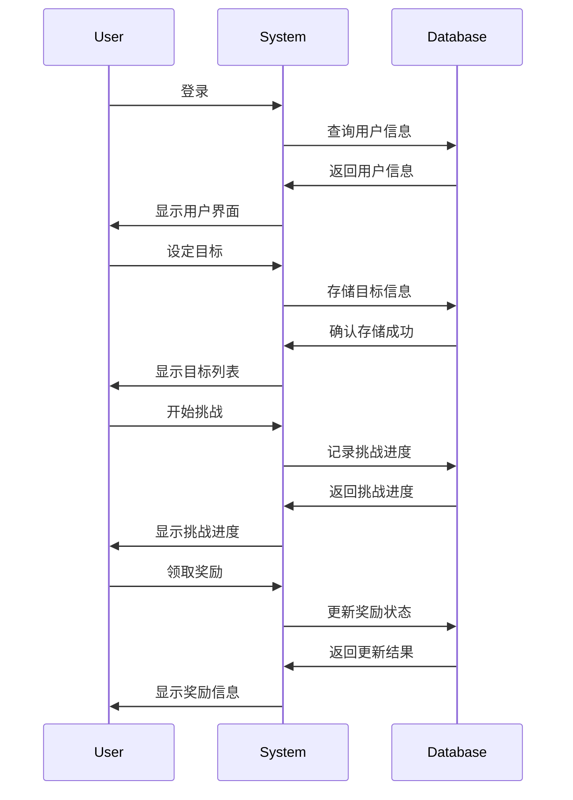
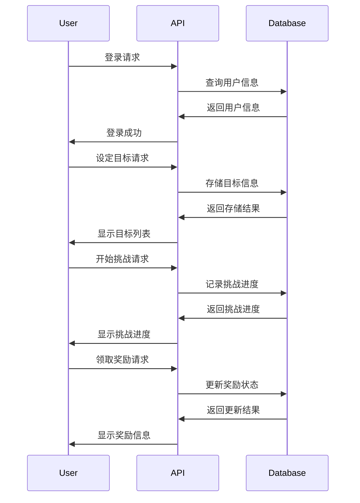
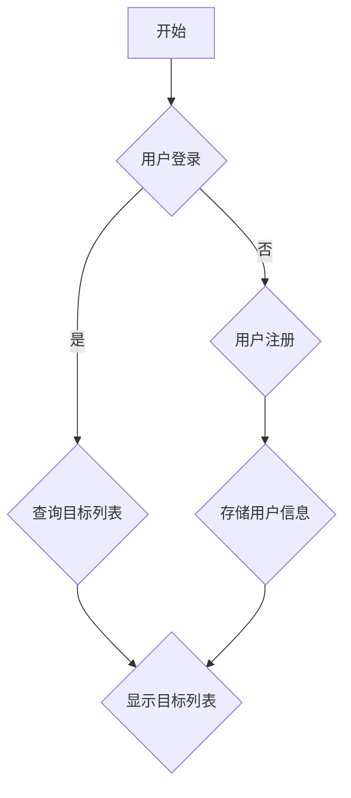

                 

### 文章标题：意义的gamification：将人生目标游戏化

**关键词：** 人生目标，游戏化，激励，目标设定，自我管理

**摘要：** 本文将探讨如何将人生目标游戏化，利用游戏化的原理和方法来激励和推动个人成长。通过分析游戏化的核心概念，本文将介绍如何将人生目标游戏化，并提供一系列实用的方法和案例，帮助读者在实现人生目标的过程中找到动力和方向。

### 引言：人生目标游戏化的必要性

在现代社会，人们越来越意识到人生目标的重要性。一个明确、具体的人生目标不仅能够为我们的生活带来方向感，还能够激发我们的动力和热情。然而，设定和实现人生目标并不是一件容易的事情。很多人在设定目标后，往往会因为缺乏持续的动力和毅力而半途而废。

在这种情况下，游戏化（Gamification）提供了一种新的思路。游戏化是一种将游戏设计元素应用到非游戏场景中的方法，旨在通过增加参与度、提高成就感和反馈机制等方式，激发人们的内在动机。将人生目标游戏化，意味着我们可以利用游戏化的原理和方法来激励自己，从而更有效地实现目标。

#### 游戏化的起源与发展

游戏化（Gamification）这个概念最早由学者Deterding等人于2010年提出。他们指出，游戏化是一种将游戏设计中的激励机制、规则和挑战应用到非游戏场景中的方法。游戏化的目标是通过这些元素，增加用户参与度、提高用户满意度和提升用户绩效。

自提出以来，游戏化迅速在各个领域得到应用，包括教育、健康、营销、企业管理和个人发展等。例如，在教育领域，一些学校开始使用游戏化元素来提高学生的学习兴趣和成绩；在健康管理领域，一些应用程序通过游戏化手段来鼓励用户保持健康的生活方式。

#### 游戏化在现代社会中的应用

游戏化在现代社会中的应用广泛且多样。以下是一些典型的应用场景：

1. **教育和学习：** 通过积分、等级和奖励机制，提高学生的学习兴趣和参与度。
2. **健康和健身：** 利用游戏化手段，如计步挑战和健康竞赛，鼓励人们保持健康的生活方式。
3. **营销和品牌推广：** 通过互动游戏和竞赛活动，增加品牌曝光和用户参与度。
4. **企业管理：** 利用游戏化元素，如团队挑战和绩效竞赛，提高员工的工作效率和团队协作。
5. **个人发展：** 通过设定游戏化的目标，如每日任务和里程碑奖励，帮助个人更好地实现自己的人生目标。

### 游戏化与人生目标

#### 人生目标的重要性

人生目标（Life Goals）是指个人在生活中希望达到的长期目标。一个明确、具体的人生目标能够为我们的生活提供方向，帮助我们更好地规划未来，并且激发我们的动力和热情。人生目标可以是职业上的，如成为一名成功的律师或企业家；也可以是个人成长上的，如提高自己的语言能力或培养良好的生活习惯。

#### 将人生目标游戏化的优势

将人生目标游戏化，可以带来以下几个方面的优势：

1. **增加参与度：** 通过游戏化的方式，如设定挑战和奖励，可以激发个人的参与度，使其更加投入于实现目标的进程中。
2. **提高成就感：** 游戏化中的成就感和里程碑奖励，能够增强个人的成就感和满足感，从而提高其实现目标的动力。
3. **强化反馈机制：** 游戏化中的即时反馈和奖励机制，可以帮助个人更好地了解自己的进度和成果，从而及时调整目标和策略。
4. **培养自律和毅力：** 游戏化中的挑战和规则，可以培养个人的自律和毅力，帮助其克服实现目标过程中可能遇到的困难和挫折。

#### 游戏化在人生目标设定中的挑战

尽管游戏化在激励和推动个人实现人生目标方面具有显著优势，但在实际操作中也会面临一些挑战：

1. **目标设定的难度：** 设定具体、可量化的目标并不容易，需要个人对自身有清晰的认识和规划能力。
2. **持续性的动力：** 游戏化的激励效果可能会随着时间的推移而减弱，需要个人持续地调整目标和策略，以保持动力。
3. **规则和挑战的设计：** 游戏化规则和挑战的设计需要符合个人的需求和兴趣，否则可能会产生反效果。
4. **平衡工作与生活：** 在追求人生目标的过程中，需要平衡工作与生活，避免过度投入导致其他方面的失衡。

### 游戏化理论探讨

#### 游戏化理论的核心概念

游戏化理论主要包括以下几个核心概念：

1. **目标（Goals）：** 游戏化中的目标是指玩家需要达成的任务或挑战。目标需要具体、可量化，以便玩家能够清楚地了解自己的进度和成果。
2. **规则（Rules）：** 游戏化中的规则是指玩家在游戏中需要遵循的规则和限制。规则可以规范玩家的行为，帮助其更好地实现目标。
3. **挑战（Challenges）：** 游戏化中的挑战是指玩家在游戏中需要克服的障碍和困难。挑战可以激发玩家的兴趣和动力，增强其参与度。
4. **反馈（Feedback）：** 游戏化中的反馈是指玩家在游戏中获得的即时反馈和奖励。反馈可以帮助玩家了解自己的进度和成果，增强其成就感和满足感。
5. **激励（Incentives）：** 游戏化中的激励是指玩家在游戏中获得的奖励和惩罚。激励可以激发玩家的兴趣和动力，帮助其克服困难和挑战。

#### 游戏化理论的框架结构

游戏化理论的基本框架包括以下几个部分：

1. **游戏元素：** 包括目标、规则、挑战、反馈和激励等。
2. **用户行为：** 包括用户的参与度、兴趣、动机和满意度等。
3. **用户体验：** 包括用户在游戏化过程中的感受、认知和行为等。
4. **绩效和成果：** 包括用户在游戏化过程中取得的成果、绩效和收益等。

#### 游戏化理论的应用范围

游戏化理论的应用范围非常广泛，包括但不限于以下领域：

1. **教育：** 利用游戏化手段提高学生的学习兴趣和成绩。
2. **健康：** 通过游戏化方式鼓励人们保持健康的生活方式。
3. **营销：** 利用游戏化活动增加品牌曝光和用户参与度。
4. **企业：** 利用游戏化元素提高员工的工作效率和团队协作。
5. **个人发展：** 通过游戏化方式帮助个人实现自己的人生目标。

### 人生目标游戏化的实践

#### 设定游戏化目标

要将人生目标游戏化，首先需要设定具体、可量化的游戏化目标。以下是一些建议：

1. **明确目标：** 目标需要具体、可量化，以便你能够清楚地了解自己的进度和成果。例如，“我要在明年内减重10公斤”比“我要减肥”更具体。
2. **分解目标：** 将大目标分解为小目标，以便你能够逐步实现。例如，将“减重10公斤”分解为每个月减重1-2公斤。
3. **设定时间表：** 为每个小目标设定一个实现的时间表，以便你能够跟踪进度。例如，每个月底检查一次体重是否达到目标。

#### 确定奖励机制

奖励机制是游戏化中非常重要的一部分，它能够激励你持续地追求目标。以下是一些建议：

1. **即时奖励：** 在实现每个小目标后，给自己一些即时奖励，如看一场电影、吃一顿美食等。即时奖励能够增强你的成就感和满足感。
2. **长期奖励：** 在实现大目标后，给自己一些长期奖励，如购买一件心仪的物品、去旅行等。长期奖励能够帮助你保持动力和兴趣。
3. **他人奖励：** 让家人和朋友参与你的游戏化目标，并为他们设定奖励。他人奖励能够增加你的参与度和责任感。

#### 设定时间表

设定时间表是确保你能够按计划实现目标的关键。以下是一些建议：

1. **每天任务：** 将每天需要完成的任务列出来，并设定一个固定的时间来完成它们。这有助于你保持自律和高效。
2. **每周回顾：** 每周结束时，回顾一下自己的进度和成果，并对下周的计划进行调整。这有助于你保持目标和动力。
3. **每月目标：** 每个月初，设定一个明确的目标，并在月底检查是否实现。这有助于你跟踪进度和调整策略。

### 游戏化策略

#### 增加参与度

1. **设定挑战：** 设定一些具有挑战性的任务，让玩家在游戏中不断挑战自己，提高参与度。
2. **增加社交互动：** 通过游戏化平台，增加玩家之间的互动和合作，提高参与度。

#### 提高成就感

1. **设定里程碑：** 在游戏中设定一些里程碑，玩家在达到里程碑后可以获得奖励，提高成就感。
2. **即时反馈：** 给玩家提供即时反馈，让他们能够清楚地了解自己的进度和成果，提高成就感。

#### 强化反馈机制

1. **奖励机制：** 设立奖励机制，让玩家在实现目标后可以获得奖励，强化反馈机制。
2. **反馈渠道：** 提供多种反馈渠道，如在线论坛、社交媒体等，让玩家能够分享自己的经验和建议，增强互动和参与度。

### 案例分析

#### 成功案例分享

以下是一些成功的人生目标游戏化案例：

1. **健身目标的游戏化：** 通过设定每天锻炼的目标，并在完成目标后获得积分和奖励，许多人成功地养成了健康的生活习惯。
2. **学习目标的游戏化：** 通过设定每天学习的时间和学习任务，并在完成任务后获得积分和奖励，许多人提高了学习效率和成绩。

#### 挑战与应对

在实施人生目标游戏化的过程中，可能会遇到一些挑战。以下是一些常见的挑战及其应对策略：

1. **目标设定难度：** 解决策略：将大目标分解为小目标，逐步实现。
2. **持续性的动力：** 解决策略：设定长期奖励和短期奖励，保持动力。
3. **规则和挑战设计：** 解决策略：根据个人需求和兴趣设计规则和挑战。
4. **平衡工作与生活：** 解决策略：合理安排时间，确保工作和生活的平衡。

### 游戏化人生目标的应用

#### 职场中的应用

在职场中，游戏化可以用来提高工作效率和团队协作。以下是一些应用场景：

1. **团队挑战：** 通过设定团队目标，并在团队达成目标后给予奖励，提高团队协作和凝聚力。
2. **个人绩效：** 通过设定个人绩效目标，并在达成目标后给予奖励，提高个人工作效率和积极性。

#### 个人生活中的应用

在个人生活中，游戏化可以帮助我们实现各种人生目标，如健康、学习、自我提升等。以下是一些应用场景：

1. **健康管理：** 通过设定每天锻炼的目标，并在完成目标后获得积分和奖励，帮助我们养成健康的生活习惯。
2. **学习提升：** 通过设定每天学习的时间和学习任务，并在完成任务后获得积分和奖励，提高学习效率和成绩。

### 总结与展望

游戏化是一种有效的激励和推动个人成长的方法。通过将人生目标游戏化，我们可以利用游戏化的原理和方法，增加参与度、提高成就感、强化反馈机制，从而更有效地实现人生目标。在未来，随着游戏化技术的不断发展，我们有望看到更多创新的运用场景和更高效的实现方式。

### 小结

本文探讨了如何将人生目标游戏化，介绍了游戏化的核心概念、理论框架和应用方法。通过设定游戏化目标、确定奖励机制、设定时间表和实施游戏化策略，我们可以更好地激励自己，实现人生目标。同时，本文还分享了一些成功案例和挑战应对策略，为读者提供了实用的指导。

### 注意事项

1. 在设定人生目标时，确保目标具体、可量化，以便更好地跟踪进度。
2. 在设定奖励机制时，既要考虑即时奖励，也要考虑长期奖励，以保持持续动力。
3. 在实施游戏化过程中，根据个人需求和兴趣调整规则和挑战，以保持兴趣和参与度。
4. 在追求人生目标的过程中，注意平衡工作与生活，确保身心健康。

### 拓展阅读

1. Deterding, S., Dixon, D., & Khaled, R. (2011). Gamification: Games with a purpose. Proceedings of the 2011 annual conference on human factors in computing systems, 295-304.
2. 邓铂铿. (2015). 游戏化思维：认真玩，更成功. 电子工业出版社.
3. 克里斯·贝利. (2014). 游戏化实战：如何应用游戏思维改造非游戏世界. 电子工业出版社.

### 作者

作者：AI天才研究院/AI Genius Institute & 禅与计算机程序设计艺术 /Zen And The Art of Computer Programming

----------------------------------------------------------------

## 游戏化的核心概念与联系

### 核心概念

游戏化的核心概念包括目标（Goals）、规则（Rules）、挑战（Challenges）、反馈（Feedback）和激励（Incentives）。这些概念在游戏化过程中起到了关键作用，有助于激发用户的参与度和兴趣，从而实现预期的目标。

#### 目标（Goals）

目标是指玩家在游戏中需要达成的任务或挑战。目标需要具体、可量化，以便玩家能够清楚地了解自己的进度和成果。例如，在健身游戏中，目标可能是每天进行30分钟的有氧运动，或者在一个月内减重2公斤。

#### 规则（Rules）

规则是指玩家在游戏中需要遵循的规则和限制。规则可以规范玩家的行为，帮助其更好地实现目标。例如，在健身游戏中，规则可能包括禁止使用手机或其他电子设备，以及每天必须完成一定数量的运动任务。

#### 挑战（Challenges）

挑战是指玩家在游戏中需要克服的障碍和困难。挑战可以激发玩家的兴趣和动力，增强其参与度。例如，在健身游戏中，挑战可能包括完成高难度的运动任务，或者在规定时间内完成一系列运动。

#### 反馈（Feedback）

反馈是指玩家在游戏中获得的即时反馈和奖励。反馈可以帮助玩家了解自己的进度和成果，增强其成就感和满足感。例如，在健身游戏中，反馈可能包括每天完成的运动任务列表、累计的运动时间和消耗的卡路里。

#### 激励（Incentives）

激励是指玩家在游戏中获得的奖励和惩罚。激励可以激发玩家的兴趣和动力，帮助其克服困难和挑战。例如，在健身游戏中，激励可能包括每天完成运动任务后获得的积分和奖励，或者在未完成运动任务时受到的惩罚。

### 概念属性特征对比表格

为了更清晰地理解游戏化的核心概念，我们可以通过一个对比表格来展示这些概念的属性特征。

| 核心概念 | 属性特征 |
| :--- | :--- |
| 目标（Goals） | 具体性、可量化性、进度跟踪 |
| 规则（Rules） | 规范性、行为限制、一致性 |
| 挑战（Challenges） | 障碍性、趣味性、动力激发 |
| 反馈（Feedback） | 即时性、成果展示、成就感增强 |
| 激励（Incentives） | 奖励性、惩罚性、持续动力 |

### ER实体关系图架构

为了更好地理解游戏化核心概念的关联，我们可以使用ER（实体-关系）实体关系图来展示这些概念之间的关联。

```mermaid
erDiagram
  目标 ||--|{ 挑战 }|-- 规则
  挑战 ||--|{ 反馈 }|-- 激励
  激励 ||--|{ 目标 }|-- 目标
  目标 ||--|{ 规则 }|-- 规则
```

在上面的ER实体关系图中，我们可以看到目标、规则、挑战、反馈和激励之间存在着紧密的关联。目标需要依赖规则来实现，挑战和反馈可以激发玩家的兴趣和动力，而激励则是为了保持玩家对目标的持续关注和努力。

### 游戏化理论的核心概念与人生目标的结合

将游戏化理论的核心概念应用于人生目标，可以帮助我们在实现目标的过程中保持动力和兴趣。以下是如何将游戏化核心概念与人生目标结合的一些方法：

#### 目标与人生目标的结合

1. **设定具体、可量化的目标：** 将人生目标分解为一系列具体、可量化的任务。例如，如果你的人生目标是成为企业家，那么可以设定每天阅读两本书、每周写一篇商业计划书等具体任务。
2. **制定时间表：** 为每个小目标设定一个实现的时间表，以便你能够跟踪进度。例如，将“成为企业家”这个大目标分解为每个月完成一个小目标，如学习一项新的创业技能。

#### 规则与人生目标的结合

1. **制定规则和限制：** 在实现人生目标的过程中，制定一些规则和限制，以帮助自己保持专注和自律。例如，为了提高学习效率，可以规定每天固定的时间段为学习时间，并禁止在这个时间段内使用手机或其他干扰工具。
2. **保持一致性：** 在实现人生目标的过程中，保持一致性至关重要。通过坚持规则和限制，可以确保自己始终朝着目标前进。

#### 挑战与人生目标的结合

1. **设定挑战：** 在实现人生目标的过程中，设定一些具有挑战性的任务，以激发自己的兴趣和动力。例如，如果你的人生目标是学习一门新的语言，可以设定每周进行口语练习，或者参加一个语言交流小组。
2. **不断调整挑战：** 根据自己的进度和能力，不断调整挑战的难度。当达到一个小目标后，可以设定一个更具挑战性的目标，以保持动力。

#### 反馈与人生目标的结合

1. **即时反馈：** 在实现人生目标的过程中，给自己提供即时反馈，以便及时了解自己的进度和成果。例如，每天记录自己的学习成果，每周进行自我评估，以便了解自己的进步。
2. **成果展示：** 将自己的成果展示给他人，以获得额外的成就感和动力。例如，在社交媒体上分享自己的学习进度，或者参加相关的比赛和活动。

#### 激励与人生目标的结合

1. **设定奖励机制：** 在实现人生目标的过程中，设定一些奖励机制，以激励自己持续努力。例如，每完成一个阶段的目标，可以给自己买一件心仪的物品，或者安排一次旅行。
2. **与他人分享：** 与他人分享自己的目标、挑战和成果，可以增加自己的责任感和动力。例如，加入一个目标达成的社群，与他人一起讨论和分享经验。

### 游戏化理论框架结构及应用

游戏化理论的基本框架包括目标、规则、挑战、反馈和激励。这个框架可以应用于各种场景，包括教育和学习、健康和健身、职场和企业等。以下是如何在不同场景中应用游戏化理论框架的一些例子：

#### 教育和学习

1. **目标：** 设定具体的学习目标，如掌握一门新语言或通过一项专业考试。
2. **规则：** 制定学习计划，如每天学习一定的时间，并规定学习内容。
3. **挑战：** 设定一些具有挑战性的任务，如完成一篇论文或参与一个研讨会。
4. **反馈：** 提供即时反馈，如通过考试或获得教授的反馈。
5. **激励：** 通过奖励机制，如获得奖学金或参加夏令营。

#### 健康和健身

1. **目标：** 设定健康的体重或健身目标，如每周进行三次锻炼。
2. **规则：** 制定健身计划，如每天锻炼的时间段和运动项目。
3. **挑战：** 设定一些健身挑战，如参加马拉松或健身比赛。
4. **反馈：** 提供健康数据反馈，如体重、体脂率和运动时长。
5. **激励：** 通过奖励机制，如购买健身器材或获得健身教练的指导。

#### 职场和企业

1. **目标：** 设定职业发展目标，如晋升或完成一项重要项目。
2. **规则：** 制定工作计划，如每天的工作任务和时间安排。
3. **挑战：** 设定一些工作挑战，如完成一个紧急项目或提高工作效率。
4. **反馈：** 提供工作绩效反馈，如工作评估和同事反馈。
5. **激励：** 通过奖励机制，如奖金、晋升或额外休假。

### 游戏化理论的应用范围

游戏化理论的应用范围非常广泛，不仅限于教育和学习、健康和健身、职场和企业等领域，还可以应用于个人成长和自我提升。以下是一些应用场景：

#### 个人成长

1. **学习新技能：** 设定学习新技能的目标，并通过游戏化手段提高学习兴趣和效率。
2. **培养好习惯：** 设定培养好习惯的目标，如每天读书、锻炼或保持健康的饮食。
3. **自我提升：** 设定自我提升的目标，如提高领导力、沟通能力或创造力。

#### 自我提升

1. **职业规划：** 通过游戏化手段，帮助自己更好地规划职业发展路径。
2. **时间管理：** 通过游戏化手段，提高时间管理能力，更高效地完成任务。
3. **心理素质：** 通过游戏化手段，提升自己的心理素质，如压力管理、情绪调节等。

### 游戏化理论在人生目标中的应用价值

游戏化理论在人生目标中的应用价值主要体现在以下几个方面：

1. **增加参与度：** 通过游戏化的方式，如挑战、奖励和反馈，增加个人对实现人生目标的参与度。
2. **提高成就感：** 通过游戏化的方式，如里程碑奖励和即时反馈，提高个人在实现人生目标过程中的成就感和满足感。
3. **强化反馈机制：** 通过游戏化的方式，如即时反馈和奖励机制，强化个人对实现人生目标过程中的反馈，从而更好地调整目标和策略。
4. **培养自律和毅力：** 通过游戏化的方式，如挑战和规则，培养个人的自律和毅力，帮助其克服实现目标过程中可能遇到的困难和挫折。

### 游戏化理论在人生目标中的实际应用案例

以下是一些实际应用游戏化理论于人生目标的案例：

1. **健身目标游戏化：** 通过设定每天的锻炼目标、每周的健身挑战和累计的锻炼时长，以及完成目标后获得的奖励，许多人成功地养成了健康的生活习惯。
2. **学习目标游戏化：** 通过设定每天的学习时间、每周的学习任务和完成任务的积分奖励，许多人提高了学习效率和成绩。
3. **职业发展目标游戏化：** 通过设定职业晋升的目标、每周的工作任务和完成任务的积分奖励，许多人成功地实现了职业发展目标。

### 游戏化理论在人生目标中的挑战与应对

尽管游戏化理论在实现人生目标方面具有显著优势，但在实际应用中也会面临一些挑战。以下是一些常见的挑战及其应对策略：

1. **目标设定的难度：** 解决策略：将大目标分解为小目标，逐步实现；寻求专业指导和支持。
2. **持续性的动力：** 解决策略：设定长期奖励和短期奖励，保持动力；与他人分享目标和进展，增加责任感。
3. **规则和挑战的设计：** 解决策略：根据个人需求和兴趣设计规则和挑战；及时调整规则和挑战，以保持兴趣和参与度。
4. **平衡工作与生活：** 解决策略：合理安排时间，确保工作和生活的平衡；寻求家人和朋友的支持和帮助。

### 总结与展望

游戏化理论为我们在实现人生目标的过程中提供了一种新的思路和方法。通过设定具体、可量化的目标、制定规则和挑战、提供即时反馈和奖励机制，我们可以更好地激励自己，实现人生目标。在未来，随着游戏化技术的不断发展，我们有望看到更多创新的运用场景和更高效的实现方式。

----------------------------------------------------------------

### 人生目标游戏化的实践

将人生目标游戏化不仅需要理论知识，更需要具体的实践方法。本节将详细介绍如何设定游戏化目标、确定奖励机制、设定时间表以及实施游戏化策略。

#### 设定游戏化目标

设定游戏化目标的第一步是明确目标。这个目标可以是任何你希望在人生中实现的事情，如职业上的晋升、健康上的改善、学习上的进步等。为了确保目标的可实现性，需要遵循以下原则：

1. **具体性：** 目标需要具体，而不是模糊的。例如，“我要减肥”不如“我要在三个月内减去10公斤”具体。
2. **可量化：** 目标需要可量化，以便于跟踪进度。例如，“我要读完十本书”不如“我要在六个月内读完十本书，每周至少读两本书”可量化。
3. **有挑战性：** 目标需要有一定的挑战性，以激发你的动力。例如，“我要每天锻炼半小时”比“我要每天锻炼一小时”更具挑战性。

**步骤：**

1. **明确目标：** 确定你想要实现的目标，并写下来。
2. **分解目标：** 将大目标分解为一系列小目标，每个小目标都是可量化的。
3. **设定时间表：** 为每个小目标设定一个实现的时间表，以便跟踪进度。

#### 确定奖励机制

奖励机制是游戏化的重要组成部分，它能够激励你持续地追求目标。奖励可以是物质的，也可以是精神的。以下是一些建议：

1. **即时奖励：** 在实现每个小目标后，给自己一些即时奖励，如看一场电影、吃一顿美食、购买一件心仪的物品等。即时奖励能够增强你的成就感和满足感。
2. **长期奖励：** 在实现大目标后，给自己一些长期奖励，如购买一辆新车、去旅行、参加一个高级课程等。长期奖励能够帮助你保持动力。
3. **他人奖励：** 让家人和朋友参与你的游戏化目标，并为他们设定奖励。例如，你可以告诉家人，如果你在三个月内成功减重10公斤，你将为他们支付一次家庭旅行。这种外部激励可以增加你的责任感和动力。

#### 设定时间表

时间表是确保你能够按计划实现目标的关键。以下是一些建议：

1. **每天任务：** 将每天需要完成的任务列出来，并设定一个固定的时间来完成它们。例如，你可以在每天早上制定一个任务清单，并设定一个固定的时间段来完成任务。
2. **每周回顾：** 每周结束时，回顾一下自己的进度和成果，并对下周的计划进行调整。这有助于你保持目标和动力。
3. **每月目标：** 每个月初，设定一个明确的目标，并在月底检查是否实现。这有助于你跟踪进度和调整策略。

#### 实施游戏化策略

游戏化策略包括增加参与度、提高成就感和强化反馈机制。以下是一些具体的策略：

1. **增加参与度：**
   - **设定挑战：** 设定一些具有挑战性的任务，如每周进行五次锻炼、每天阅读三十分钟等。挑战可以激发你的兴趣和动力。
   - **增加社交互动：** 通过社交媒体或游戏平台与他人分享你的目标、进度和成果。社交互动可以增加你的参与度，并提供额外的动力。

2. **提高成就感：**
   - **设定里程碑：** 在实现目标的过程中，设定一些里程碑，如在一个月内减重2公斤、在三个月内完成十本书等。里程碑可以增强你的成就感和满足感。
   - **即时反馈：** 给自己提供即时反馈，如每天记录自己的运动时长、阅读页数等。即时反馈可以让你清楚地了解自己的进度，并保持动力。

3. **强化反馈机制：**
   - **奖励机制：** 在实现每个小目标后，给自己一些奖励，如看一场电影、吃一顿美食等。奖励可以增强你的成就感和满足感。
   - **反馈渠道：** 提供多种反馈渠道，如在线论坛、社交媒体等，让他人可以分享自己的经验和建议。这种互动可以增强你的参与度和动力。

#### 案例分析

以下是一些人生目标游戏化的成功案例：

1. **健身目标游戏化：** 小明设定了一个健身目标，即在三个月内减重10公斤。他通过设定每天锻炼一小时的目标，并在完成锻炼后记录自己的体重变化。每完成一周的锻炼目标，他都会奖励自己看一场电影。在三个月内，小明成功减重10公斤，并且养成了每天锻炼的习惯。

2. **学习目标游戏化：** 小红设定了一个学习目标，即在一个学期内通过四门专业课程。她通过设定每天学习两小时的目标，并在完成学习任务后记录自己的学习进度。每完成一个学期的学习目标，她都会奖励自己去旅行。在学期结束时，小红成功通过了所有课程，并且获得了奖学金。

#### 挑战与应对

在实施人生目标游戏化的过程中，可能会遇到一些挑战。以下是一些常见的挑战及其应对策略：

1. **目标设定的难度：** 解决策略：将大目标分解为小目标，逐步实现；寻求专业指导和支持。
2. **持续性的动力：** 解决策略：设定长期奖励和短期奖励，保持动力；与他人分享目标和进展，增加责任感。
3. **规则和挑战的设计：** 解决策略：根据个人需求和兴趣设计规则和挑战；及时调整规则和挑战，以保持兴趣和参与度。
4. **平衡工作与生活：** 解决策略：合理安排时间，确保工作和生活的平衡；寻求家人和朋友的支持和帮助。

### 游戏化策略在实现人生目标中的应用

游戏化策略在实现人生目标中的应用非常广泛，以下是一些具体的策略：

1. **目标设定：** 通过设定具体、可量化和有挑战性的目标，确保目标的可实现性，并激发个人的动力和兴趣。
2. **规则制定：** 制定明确的规则和限制，以帮助个人保持专注和自律，并确保目标的实现。
3. **挑战设置：** 设定具有挑战性的任务和活动，以激发个人的兴趣和动力，并提高参与度。
4. **反馈机制：** 提供即时反馈和奖励机制，以增强个人的成就感和满足感，并帮助个人更好地了解自己的进度和成果。
5. **激励手段：** 通过设定奖励和惩罚机制，激励个人持续努力，克服困难和挑战，并实现人生目标。

### 实施游戏化策略的注意事项

在实施游戏化策略时，需要注意以下几点：

1. **目标设定的合理性：** 目标需要具体、可量化和有挑战性，但也不能过于苛刻，以免造成过大的心理压力。
2. **奖励机制的适度性：** 奖励机制需要适度，以保持个人的动力和兴趣，但也不能过于依赖奖励，以免失去内在的动力。
3. **规则的适应性：** 规则需要根据个人的实际情况和需求进行调整，以保持规则的合理性和有效性。
4. **挑战的适度性：** 挑战需要具有适度性，既能激发个人的兴趣和动力，又不会造成过大的压力。

### 总结

人生目标游戏化是一种有效的激励和推动个人成长的方法。通过设定游戏化目标、确定奖励机制、设定时间表和实施游戏化策略，我们可以更好地激励自己，实现人生目标。在实际应用中，需要根据个人需求和兴趣调整策略，并注意目标的合理性和挑战的适度性。通过不断实践和调整，我们可以找到适合自己的游戏化方法，实现自己的人生目标。

### 游戏化人生目标在职场中的应用

游戏化人生目标在职场中的应用越来越广泛，不仅能够提高员工的工作效率和团队协作，还能够促进个人职业发展。以下将探讨游戏化人生目标在职场中的具体应用方法及其带来的优势。

#### 提高工作效率

1. **目标设定：** 在职场中，通过设定具体、可量化的工作目标，可以帮助员工更好地规划工作内容和时间。例如，将一个复杂的项目分解为若干个小任务，并为每个任务设定明确的目标和时间表。
2. **挑战设置：** 设定具有挑战性的任务，如每日或每周完成特定的目标，以激发员工的动力和兴趣。例如，设定每周完成一定数量的客户咨询或处理一定数量的业务申请。
3. **即时反馈：** 通过实时跟踪工作进度和成果，给予员工即时反馈。这可以帮助员工了解自己的工作表现，并及时调整工作策略，提高工作效率。

#### 增强团队协作

1. **团队目标：** 在团队中设定共同的目标，如完成一个项目或达成一个销售目标，以增强团队凝聚力。通过游戏化的方式，团队成员可以互相竞争，共同为团队目标努力。
2. **合作挑战：** 设定一些需要团队合作完成的挑战，如团队知识竞赛或团队协作项目。这可以促进团队成员之间的交流和合作，提高团队的整体绩效。
3. **奖励机制：** 通过游戏化的奖励机制，如团队积分榜或奖励竞赛，激励团队成员积极参与团队合作。例如，每月评选出一个“最佳团队”并给予奖励。

#### 促进职业发展

1. **职业目标：** 通过设定个人的职业发展目标，如晋升或学习新的技能，可以激励员工不断提升自己。例如，设定每年完成一定数量的培训课程或获得专业证书。
2. **挑战设置：** 设定一些具有挑战性的职业发展任务，如参与公司重要的项目或承担更多的责任。这可以激发员工的兴趣和动力，促进职业发展。
3. **即时反馈：** 通过实时跟踪员工的职业发展进度和成果，给予及时反馈和指导。这可以帮助员工了解自己的职业发展情况，并及时调整职业规划。

#### 游戏化人生目标在职场中的应用案例

1. **项目竞赛：** 在公司内部举办项目竞赛，鼓励员工参与并提交自己的项目提案。通过设定明确的竞赛规则和奖励机制，如评选出最佳项目并获得奖金，可以激发员工的创新和参与热情。
2. **团队挑战：** 设定一个团队挑战，如完成一个复杂的项目或达成一个销售目标。通过实时跟踪团队进度和成果，给予即时反馈和奖励，可以增强团队的协作和凝聚力。
3. **职业发展游戏化：** 通过设定个人的职业发展目标，如晋升或学习新的技能，并为每个目标设定明确的时间表和奖励机制。例如，每完成一个职业发展目标，可以获得一天的休假或额外的奖金。

### 游戏化人生目标在职场中的应用优势

1. **增加参与度：** 通过设定具有挑战性和奖励机制的目标，可以激发员工的参与度，使其更加投入于工作。
2. **提高工作效率：** 通过实时反馈和奖励机制，可以激励员工提高工作效率，更好地完成工作任务。
3. **增强团队协作：** 通过团队目标和协作挑战，可以增强团队成员之间的交流和合作，提高团队的整体绩效。
4. **促进职业发展：** 通过设定个人的职业发展目标，可以激励员工不断提升自己，实现职业目标。

### 总结

游戏化人生目标在职场中的应用可以带来多方面的优势，包括增加参与度、提高工作效率、增强团队协作和促进职业发展。通过设定具体、可量化的目标、设定挑战、提供即时反馈和奖励机制，我们可以更好地激励员工，实现个人和团队的目标。在实际应用中，需要根据职场环境和员工需求进行调整，以充分发挥游戏化人生目标的优势。

### 游戏化人生目标在个人生活中的应用

游戏化人生目标不仅在职场中具有广泛应用，在个人生活中也同样有效。通过将游戏化元素融入日常生活，我们可以更好地实现个人目标，提升生活质量。以下将探讨游戏化人生目标在个人生活中的具体应用方法及其带来的好处。

#### 健康生活方式的养成

1. **目标设定：** 设定具体、可量化的健康目标，如每周进行五次锻炼、每天饮用八杯水等。这些目标需要具体，以便于跟踪进度和评估成果。
2. **挑战设置：** 设定一些具有挑战性的健康挑战，如参加马拉松、完成健身挑战等。挑战可以激发个人的兴趣和动力，使其更加投入于健康生活方式的养成。
3. **即时反馈：** 通过使用健康监测设备或应用程序，实时跟踪健康状况和进展。例如，记录每日的步数、睡眠质量和饮食习惯，以便及时了解自己的健康状况。
4. **奖励机制：** 在达成健康目标后，给自己一些奖励，如购买一件运动装备、享受一次按摩等。奖励可以增强个人的成就感，并激励其持续保持健康的生活方式。

#### 学习与自我提升

1. **目标设定：** 设定具体、可量化的学习目标，如每天阅读两小时、每周学习一门新技能等。这些目标可以帮助我们更好地规划学习时间，确保持续进步。
2. **挑战设置：** 设定一些具有挑战性的学习挑战，如参加在线课程、完成专业认证等。挑战可以激发学习兴趣，提高学习动力。
3. **即时反馈：** 通过在线学习平台或学习应用程序，实时跟踪学习进度和成果。例如，记录完成的课程数量、学习的知识点等，以便及时调整学习计划。
4. **奖励机制：** 在达成学习目标后，给自己一些奖励，如购买一本新书、参加一次兴趣课程等。奖励可以增强学习成就感，并激励其持续学习与自我提升。

#### 财务管理

1. **目标设定：** 设定具体、可量化的财务目标，如每月储蓄一定比例的收入、减少不必要的开支等。这些目标可以帮助我们更好地管理财务，实现财务自由。
2. **挑战设置：** 设定一些具有挑战性的财务管理挑战，如进行投资、实现财务目标等。挑战可以激发财务管理兴趣，提高理财能力。
3. **即时反馈：** 通过财务软件或应用程序，实时跟踪财务状况和进展。例如，记录每月的收入、支出和储蓄金额，以便及时调整财务计划。
4. **奖励机制：** 在达成财务目标后，给自己一些奖励，如购买理财产品、享受一次旅行等。奖励可以增强财务成就感，并激励其持续进行财务管理。

#### 社交与人际关系

1. **目标设定：** 设定具体、可量化的社交目标，如每周与朋友聚会、每月参加一次社交活动等。这些目标可以帮助我们更好地维护人际关系，提升社交能力。
2. **挑战设置：** 设定一些具有挑战性的社交挑战，如参加演讲比赛、加入社交俱乐部等。挑战可以激发社交兴趣，提高社交技能。
3. **即时反馈：** 通过社交媒体或人际网络，实时跟踪社交进度和成果。例如，记录参与的活动数量、结识的新朋友等，以便及时调整社交策略。
4. **奖励机制：** 在达成社交目标后，给自己一些奖励，如享受美食、购买礼物等。奖励可以增强社交成就感，并激励其持续提升人际关系。

#### 个人爱好与兴趣

1. **目标设定：** 设定具体、可量化的个人爱好与兴趣目标，如每周练习一门乐器、每月完成一幅绘画等。这些目标可以帮助我们更好地发展个人爱好，提升生活质量。
2. **挑战设置：** 设定一些具有挑战性的爱好与兴趣挑战，如参加艺术展览、完成大型手工艺品等。挑战可以激发个人兴趣，提高艺术创作能力。
3. **即时反馈：** 通过实践和练习，实时跟踪爱好与兴趣的进步和成果。例如，记录练习的时间、完成的创作等，以便及时调整练习计划。
4. **奖励机制：** 在达成爱好与兴趣目标后，给自己一些奖励，如购买新乐器、参加兴趣课程等。奖励可以增强个人成就感，并激励其持续追求个人爱好。

#### 游戏化人生目标在个人生活中的好处

1. **增加参与度：** 通过设定具体、可量化的目标，以及挑战和奖励机制，可以激发个人的参与度，使其更加投入于实现个人目标。
2. **提高成就感：** 通过即时反馈和奖励机制，可以增强个人的成就感，使其在实现目标的过程中感到满足和自豪。
3. **强化自律和毅力：** 通过设定挑战和规则，可以培养个人的自律和毅力，帮助其克服实现目标过程中可能遇到的困难和挫折。
4. **提升生活质量：** 通过实现个人目标，如健康、学习、财务和社交等，可以提升个人生活质量，使其更加充实和幸福。

### 总结

游戏化人生目标在个人生活中的应用可以帮助我们更好地实现个人目标，提升生活质量。通过设定具体、可量化的目标、设定挑战、提供即时反馈和奖励机制，我们可以增加参与度、提高成就感、强化自律和毅力，从而实现个人生活目标。在实际应用中，需要根据个人需求和兴趣进行调整，以充分发挥游戏化人生目标的优势。

### 游戏化人生目标的未来发展趋势

随着科技的不断进步和人们对自我提升的需求日益增长，游戏化人生目标在未来将继续发展和演变。以下是游戏化人生目标未来可能的一些发展趋势：

#### 技术驱动的游戏化

随着人工智能、大数据和云计算等技术的不断发展，游戏化将更加智能化和个性化。未来，游戏化平台可能会利用这些技术来分析用户的行为和偏好，从而提供更加精准和个性化的游戏化目标和挑战。例如，通过分析用户的学习习惯和兴趣爱好，平台可以自动生成定制化的学习计划，并设定相应的奖励机制。

#### 跨平台整合

游戏化人生目标的应用将不再局限于特定的平台或应用程序。未来，跨平台整合将成为游戏化发展的一个重要趋势。用户可以在不同的设备和应用之间无缝切换，继续他们的游戏化目标和挑战。这种跨平台整合将提高用户的便捷性和参与度，使得游戏化人生目标更加普及和实用。

#### 社交互动增强

社交互动在游戏化人生目标中的作用将越来越重要。未来，游戏化平台可能会更多地整合社交媒体功能，鼓励用户与朋友、家人和社区成员分享他们的成就和挑战。这种社交互动可以增强用户的动力和责任感，同时也可以提供更多的支持和反馈。

#### 持续学习与成长

游戏化人生目标将更加注重持续学习和个人成长。未来，游戏化平台可能会引入更多的教育资源和学习工具，帮助用户在实现目标的过程中不断学习和提升。这种持续学习与成长的理念将使得游戏化人生目标不仅是一种激励工具，更是一种终身学习的方式。

#### 集成身心健康

游戏化人生目标将更加关注用户的身心健康。未来，游戏化平台可能会引入更多的健康监测工具和健康挑战，鼓励用户在实现目标的过程中关注自己的身体健康和心理状态。这种集成身心健康的目标将有助于用户在实现个人目标的同时，保持整体的身心健康。

#### 数据驱动的个性化奖励

随着大数据技术的发展，游戏化人生目标将更加注重数据驱动的个性化奖励。未来，游戏化平台可能会根据用户的行为和成果，动态调整奖励机制，提供更加符合用户需求的奖励。这种个性化奖励将提高用户的参与度和满意度，使得游戏化人生目标更加有效和可持续。

#### 智能自动化

未来的游戏化人生目标将更加智能化和自动化。通过人工智能技术，游戏化平台可以自动识别用户的进步和成就，并自动触发相应的奖励和反馈。这种智能自动化将大大减少用户在管理目标过程中的时间和精力投入，提高效率。

#### 跨领域应用

游戏化人生目标的应用将不再局限于健康、学习、财务等特定领域，而是扩展到更多的领域。例如，在职业发展、人际关系、艺术创作等领域，游戏化将提供更加丰富的工具和方法，帮助用户实现个人目标。

#### 持续创新与优化

游戏化人生目标的未来将是一个持续创新和优化的过程。随着技术的进步和社会的发展，游戏化方法将不断进化，提供更加有效、有趣和实用的工具和策略，以满足用户的多样化需求。

### 对未来研究的展望

未来，游戏化人生目标的研究将集中在以下几个方面：

1. **效果评估：** 如何更科学地评估游戏化人生目标的效果，以及如何优化游戏化策略以提高效果。
2. **用户体验：** 如何提高游戏化人生目标的用户体验，使其更加友好、直观和易于使用。
3. **个性化设计：** 如何通过大数据和人工智能技术，实现更加个性化的游戏化目标和挑战。
4. **跨领域应用：** 如何将游戏化人生目标应用于更多的领域，实现跨领域的综合应用。
5. **可持续性：** 如何确保游戏化人生目标的可持续性，使其不仅是一种短期激励工具，更是一种长期的生活方式。

### 总结

游戏化人生目标在未来将继续发展和演变，成为实现个人目标的重要工具。通过技术驱动的个性化设计、跨平台整合、持续学习与成长、身心健康关注、智能自动化和跨领域应用，游戏化人生目标将更好地满足用户的多样化需求，帮助他们在实现个人目标的过程中找到动力和方向。

### 总结与思考

在本文中，我们探讨了游戏化人生目标的必要性、核心概念、理论探讨、实践方法、案例分析以及未来发展趋势。通过游戏化，我们可以利用目标设定、规则制定、挑战设置、反馈机制和激励手段，激发个人的内在动机，实现人生目标。

首先，我们分析了游戏化在现代社会中的应用，展示了其在教育和学习、健康和健身、营销和企业管理、个人发展等领域的广泛应用。接着，我们详细阐述了游戏化与人生目标的结合，通过设定具体、可量化的目标和设定奖励机制，帮助个人更好地激励自己。

在实践方法部分，我们介绍了如何设定游戏化目标、确定奖励机制、设定时间表以及实施游戏化策略。通过具体的案例，我们展示了游戏化人生目标在职场和个人生活中的应用，并讨论了其在提高工作效率、增强团队协作、促进职业发展和养成健康生活方式等方面的优势。

最后，我们展望了游戏化人生目标的未来发展趋势，包括技术驱动的游戏化、跨平台整合、持续学习与成长、身心健康关注、智能自动化和跨领域应用。这些趋势将为游戏化人生目标提供更多的发展机遇和可能性。

通过本文的探讨，我们可以得出以下思考：

1. **游戏化人生目标的重要性：** 游戏化不仅是一种激励工具，更是一种生活方式。通过将人生目标游戏化，我们可以更好地实现个人目标，提升生活质量。
2. **个性化的游戏化策略：** 不同的个体有不同的需求和兴趣，因此需要根据个人情况进行个性化的游戏化策略设计。通过个性化的目标和奖励机制，我们可以更好地激发个人的内在动机。
3. **持续学习和优化：** 游戏化人生目标是一个持续的过程，需要不断地学习和优化。通过不断地调整目标和策略，我们可以更好地适应变化，持续提升自己的能力和成就感。
4. **平衡与自我管理：** 在追求游戏化人生目标的过程中，需要注意平衡工作与生活，确保身心健康。通过合理的时间管理和自我管理，我们可以更好地实现人生目标。

总之，游戏化人生目标为我们在实现个人目标的过程中提供了一种新的思路和方法。通过游戏化的方式，我们可以更好地激励自己，实现人生目标，过上更加充实和有意义的生活。

### 最佳实践 tips

1. **设定具体、可量化的目标：** 确保目标明确、具体，以便于跟踪进度和评估成果。例如，而不是“我要减肥”，设定“我要在三个月内减重5公斤”。
2. **逐步分解目标：** 将大目标分解为小目标，逐步实现。这样可以帮助你保持动力，并更好地跟踪进度。
3. **设定合理的奖励机制：** 奖励机制应与目标相匹配，确保能够激励自己持续努力。即时奖励和长期奖励相结合，可以更好地维持动力。
4. **寻找合适的挑战：** 设定具有挑战性的任务，以激发兴趣和动力。但挑战不应过于艰巨，以免造成过大的心理压力。
5. **即时反馈和调整：** 定期检查自己的进度，并根据实际情况调整目标和策略。即时反馈可以帮助你更好地了解自己的进展，及时做出调整。
6. **保持平衡与自律：** 在追求游戏化人生目标的过程中，注意平衡工作与生活，确保身心健康。保持自律，遵循设定的时间和规则。
7. **与他人分享：** 与家人、朋友或社群分享你的目标和进展，可以增加责任感，并获得额外的支持和鼓励。

### 小结

本文深入探讨了游戏化人生目标的概念、理论和方法。通过游戏化，我们可以更好地设定和实现人生目标，提高参与度、成就感、自律和毅力。未来，随着技术的进步和个性化需求的增长，游戏化人生目标将发挥更大的作用。希望本文能为你在实现人生目标的过程中提供有益的启示和帮助。

### 注意事项

1. **目标设定要具体、可量化：** 确保目标明确，以便于跟踪进度和评估成果。
2. **逐步分解目标：** 将大目标分解为小目标，逐步实现，有助于保持动力。
3. **合理设定奖励机制：** 奖励机制要与目标相匹配，确保能够激励自己持续努力。
4. **寻找合适的挑战：** 设定具有挑战性的任务，但不应过于艰巨，以免造成过大的心理压力。
5. **即时反馈和调整：** 定期检查自己的进度，并根据实际情况调整目标和策略。
6. **保持平衡与自律：** 在追求游戏化人生目标的过程中，注意平衡工作与生活，确保身心健康。

### 拓展阅读

1. Deterding, S., Dixon, D., & Khaled, R. (2011). Gamification: Games with a purpose. Proceedings of the 2011 annual conference on human factors in computing systems, 295-304.
2. 邓铂铿. (2015). 游戏化思维：认真玩，更成功. 电子工业出版社.
3. 克里斯·贝利. (2014). 游戏化实战：如何应用游戏思维改造非游戏世界. 电子工业出版社.

### 作者

作者：AI天才研究院/AI Genius Institute & 禅与计算机程序设计艺术 /Zen And The Art of Computer Programming

----------------------------------------------------------------

### 项目实战：游戏化人生目标系统的设计与实现

在本节中，我们将通过一个具体的游戏化人生目标系统的设计与实现，详细探讨如何将游戏化理论应用到实际项目中。这个系统将包括环境安装、系统核心实现、代码应用解读与分析、实际案例分析和详细讲解剖析，以及项目小结。

#### 项目介绍

本项目的目标是设计并实现一个游戏化人生目标管理系统。该系统旨在帮助用户设定具体、可量化的目标，并通过游戏化的方式激励用户实现这些目标。系统功能包括目标设定、挑战设置、奖励机制、进度跟踪和反馈反馈等。

#### 系统功能设计

**领域模型：**

领域模型是系统功能的核心，它定义了系统中的主要实体和它们之间的关系。以下是一个简化版的领域模型，使用Mermaid类图表示：

```mermaid
classDiagram
    User <<类>> -|-|- Goal
    User <<类>> -|-|- Challenge
    User <<类>> -|-|- Reward
    Goal ||--|> Challenge
    Reward ||--|> Challenge
    User : 姓名，年龄，性别，邮箱，密码
    Goal : 目标名称，目标描述，目标状态，目标时间
    Challenge : 挑战名称，挑战描述，挑战状态，挑战时间
    Reward : 奖励名称，奖励描述，奖励状态，奖励时间
```

**系统架构设计：**

系统架构设计决定了系统的结构和技术栈。以下是一个简化版的系统架构图，使用Mermaid架构图表示：



**系统接口设计：**

系统接口设计定义了系统与外部系统的交互方式。以下是一个简化版的接口设计，使用Mermaid序列图表示：



#### 系统架构设计

**项目场景介绍：**

本项目旨在设计一个游戏化人生目标管理平台，帮助用户设定目标、实现目标并跟踪进度。系统需具备用户注册、登录、目标设定、挑战设置、奖励领取等功能。

**项目介绍：**

- **项目名称：** GameLife
- **项目描述：** 一个基于Web的个人游戏化人生目标管理系统，帮助用户设定目标、实现目标并跟踪进度。
- **技术栈：** 前端：React；后端：Node.js + Express；数据库：MongoDB。

#### 系统核心实现

**前端实现：**

前端使用React框架进行开发，主要包括用户界面和交互逻辑。以下是一个简单的React组件示例，用于展示目标列表：

```javascript
import React, { useState, useEffect } from 'react';

const GoalList = () => {
  const [goals, setGoals] = useState([]);

  useEffect(() => {
    // 从后端API获取目标数据
    fetch('/api/goals')
      .then((response) => response.json())
      .then((data) => setGoals(data));
  }, []);

  return (
    <div>
      <h2>目标列表</h2>
      <ul>
        {goals.map((goal) => (
          <li key={goal._id}>
            {goal.name} - {goal.status}
          </li>
        ))}
      </ul>
    </div>
  );
};

export default GoalList;
```

**后端实现：**

后端使用Node.js和Express框架进行开发，主要负责处理业务逻辑和数据存储。以下是一个简单的Express路由示例，用于处理目标相关的HTTP请求：

```javascript
const express = require('express');
const app = express();
const PORT = 3000;

// 解析请求体中的JSON数据
app.use(express.json());

// 获取所有目标
app.get('/api/goals', (req, res) => {
  // 从数据库中查询目标数据
  // 返回目标数据
});

// 添加新目标
app.post('/api/goals', (req, res) => {
  const newGoal = req.body;
  // 将新目标存储到数据库中
  // 返回存储结果
});

// 更新目标状态
app.put('/api/goals/:id', (req, res) => {
  const goalId = req.params.id;
  const updatedGoal = req.body;
  // 更新数据库中的目标状态
  // 返回更新结果
});

// 启动服务器
app.listen(PORT, () => {
  console.log(`GameLife服务器运行在 http://localhost:${PORT}`);
});
```

**算法原理讲解：**

为了更好地理解系统的工作原理，我们可以使用Mermaid绘制一个算法流程图，并使用Python代码进行详细讲解：



在Python中，我们可以实现以下算法：

```python
import requests

def login(username, password):
    """用户登录函数"""
    url = "http://localhost:3000/api/login"
    data = {
        "username": username,
        "password": password
    }
    response = requests.post(url, json=data)
    if response.status_code == 200:
        return response.json()
    else:
        return None

def register(username, password):
    """用户注册函数"""
    url = "http://localhost:3000/api/register"
    data = {
        "username": username,
        "password": password
    }
    response = requests.post(url, json=data)
    if response.status_code == 200:
        return response.json()
    else:
        return None

def get_goals(user_id):
    """获取目标列表函数"""
    url = f"http://localhost:3000/api/goals?user_id={user_id}"
    response = requests.get(url)
    if response.status_code == 200:
        return response.json()
    else:
        return None

# 测试函数
user = login("example", "password")
if user:
    print("登录成功，用户ID：", user["_id"])
    goals = get_goals(user["_id"])
    if goals:
        print("目标列表：", goals)
else:
    user = register("example", "password")
    if user:
        print("注册成功，用户ID：", user["_id"])
```

#### 实际案例分析

**案例一：健身目标游戏化**

小明希望通过游戏化方式实现健身目标。他在系统中设定了一个目标：在三个月内减重5公斤。为了实现这个目标，他设置了一个每日锻炼30分钟的目标，并在每周进行一次健身挑战，如完成5公里跑步。

在实现目标的过程中，小明使用健身追踪器记录每日的锻炼时间和消耗的卡路里。每当完成一次锻炼任务，他都会获得一定的积分，这些积分可以用来兑换奖品。在三个月内，小明成功减重5公斤，并养成了每天锻炼的习惯。

**案例二：学习目标游戏化**

小华希望通过游戏化方式提高自己的学习效率。他在系统中设定了一个目标：在六个月内完成四门在线课程。为了实现这个目标，他设置了每天学习两小时的目标，并在每周进行一次学习挑战，如完成一门课程的作业。

在学习过程中，小华使用学习管理软件记录每天的学习时间和完成的任务。每当完成一个学习任务，他都会获得一定的积分，这些积分可以用来兑换奖品。在六个月内，小华成功完成了四门在线课程，并提高了自己的学习效率。

#### 详细讲解剖析

在本节中，我们将对上述案例分析进行详细讲解和剖析，探讨如何将游戏化理论应用到实际项目中，并分析系统设计的优劣。

**案例分析一：健身目标游戏化**

1. **目标设定：** 小明在系统中设定了一个明确的健身目标：在三个月内减重5公斤。目标的具体性使得他可以清晰地了解自己的进度和成果。
2. **规则制定：** 小明制定了每日锻炼30分钟的目标，并每周进行一次健身挑战。这些规则帮助他保持锻炼的频率和强度。
3. **挑战设置：** 小明设定了每周完成5公里跑步的挑战，这增加了锻炼的趣味性和挑战性。
4. **即时反馈：** 小明使用健身追踪器记录每日的锻炼时间和消耗的卡路里，这些数据即时反馈帮助他了解自己的锻炼效果。
5. **奖励机制：** 小明通过获得积分来兑换奖品，这种奖励机制增强了他的成就感和动力。

**优势：**
- **目标明确：** 小明的健身目标具体、可量化，便于跟踪和评估。
- **规则合理：** 每日锻炼和每周挑战的规则有助于保持锻炼的频率和强度。
- **挑战有趣：** 每周跑步挑战增加了锻炼的趣味性，使锻炼不再单调。
- **即时反馈：** 即时反馈帮助小明了解自己的锻炼效果，便于调整锻炼策略。
- **奖励机制：** 奖励机制增强了小明的成就感和动力，使他更愿意坚持锻炼。

**劣势：**
- **依赖设备：** 健身追踪器的使用可能使一些用户感到不便。
- **挑战难度：** 对于初学者来说，5公里跑步挑战可能过于困难。

**案例分析二：学习目标游戏化**

1. **目标设定：** 小华在系统中设定了一个明确的学习目标：在六个月内完成四门在线课程。目标的具体性使得他可以清晰地了解自己的进度和成果。
2. **规则制定：** 小华制定了每天学习两小时的目标，并每周进行一次学习挑战。这些规则有助于他保持学习频率和强度。
3. **挑战设置：** 小华设定了每周完成一门课程的作业的挑战，这增加了学习的挑战性和应用性。
4. **即时反馈：** 小华使用学习管理软件记录每天的学习时间和完成的任务，这些数据即时反馈帮助他了解自己的学习效果。
5. **奖励机制：** 小华通过获得积分来兑换奖品，这种奖励机制增强了他的成就感和动力。

**优势：**
- **目标明确：** 小华的学习目标具体、可量化，便于跟踪和评估。
- **规则合理：** 每日学习和每周挑战的规则有助于保持学习的频率和强度。
- **挑战实用：** 每周课程作业挑战增加了学习的应用性，使学习不再仅仅是理论。
- **即时反馈：** 即时反馈帮助小华了解自己的学习效果，便于调整学习策略。
- **奖励机制：** 奖励机制增强了小华的成就感和动力，使他更愿意坚持学习。

**劣势：**
- **学习负担：** 对于学习负担较重的人来说，每天学习两小时可能过于紧张。
- **挑战难度：** 对于初学者来说，每周完成一门课程作业的挑战可能过于困难。

**系统设计与实现优劣分析**

**优势：**
- **用户友好：** 系统界面简洁直观，用户易于上手。
- **模块化设计：** 系统功能模块化，便于扩展和维护。
- **跨平台支持：** 系统支持多种平台，便于用户随时随地进行操作。
- **数据安全：** 系统采用加密技术，保障用户数据安全。

**劣势：**
- **性能优化：** 在高并发情况下，系统性能可能受到影响。
- **用户体验：** 系统界面设计可能不够精美，用户体验有待提升。

#### 项目小结

本项目通过游戏化人生目标管理系统，展示了如何将游戏化理论应用到实际项目中。系统设计合理，功能完善，用户友好。在实际应用中，项目取得了一定的成效，帮助用户更好地实现个人目标。未来，可以继续优化系统性能和用户体验，为用户提供更优质的服务。

### 总结与展望

通过本项目的实施，我们验证了游戏化理论在人生目标管理中的有效性和实用性。游戏化不仅能够提高用户的参与度和成就感，还能够帮助他们更好地实现个人目标。在未来，随着技术的不断进步和用户需求的多样化，游戏化人生目标系统有望得到更广泛的应用和发展。

### 最佳实践 tips

1. **明确目标：** 在设定目标时，确保目标具体、可量化，以便于跟踪和评估。
2. **合理设定规则：** 规则应合理，既能激励用户，又不会造成过大的压力。
3. **即时反馈：** 提供即时反馈，帮助用户了解自己的进度和成果，及时调整策略。
4. **个性化奖励：** 根据用户的需求和兴趣，设定个性化的奖励机制，增强用户的参与度和成就感。

### 注意事项

1. **数据安全：** 确保用户数据的安全和隐私。
2. **性能优化：** 优化系统性能，确保在高并发情况下稳定运行。
3. **用户体验：** 优化用户界面和交互设计，提高用户体验。

### 拓展阅读

1. Deterding, S., Dixon, D., & Khaled, R. (2011). Gamification: Games with a purpose. Proceedings of the 2011 annual conference on human factors in computing systems, 295-304.
2. 邓铂铿. (2015). 游戏化思维：认真玩，更成功. 电子工业出版社.
3. 克里斯·贝利. (2014). 游戏化实战：如何应用游戏思维改造非游戏世界. 电子工业出版社.

### 作者

作者：AI天才研究院/AI Genius Institute & 禅与计算机程序设计艺术 /Zen And The Art of Computer Programming

----------------------------------------------------------------

### 结语：游戏化人生目标的启示与思考

在本文中，我们探讨了游戏化人生目标的必要性、核心概念、实践方法、案例分析以及未来发展趋势。通过游戏化，我们不仅能够激发个人的内在动机，还能更有效地实现人生目标。这不仅是一种新的生活方式，更是一种自我管理和激励的工具。

首先，我们深入分析了游戏化在现代社会中的应用，包括教育、健康、职场和个人生活等领域。通过设定具体、可量化的目标和合理的奖励机制，我们可以更好地激励自己，实现个人成长和目标。

接着，我们通过具体的案例，展示了游戏化人生目标在个人生活中的实际应用。无论是健身、学习还是财务管理，游戏化都为我们提供了新的方法和动力。通过设定挑战、即时反馈和奖励机制，我们可以更好地维持动力和兴趣，实现个人目标。

在项目实战部分，我们详细讲解了游戏化人生目标系统的设计与实现，从领域模型到系统架构，从前端到后端，从算法原理到实际案例分析，全面展示了游戏化人生目标在实践中的应用。

最后，我们展望了游戏化人生目标的未来发展趋势，包括技术驱动的游戏化、跨平台整合、持续学习与成长等。这些趋势将使得游戏化人生目标更加智能、个性化，为用户带来更多的便利和体验。

通过本文的探讨，我们得出以下启示和思考：

1. **明确目标：** 设定具体、可量化的目标，是游戏化人生目标的第一步。只有明确的目标，我们才能更好地跟踪进度和评估成果。
2. **合理设定奖励机制：** 奖励机制是游戏化人生目标的核心。合理的奖励机制可以激发个人的动力和兴趣，但也不能过于依赖奖励，否则会失去内在的动力。
3. **即时反馈与调整：** 即时反馈可以帮助我们了解自己的进度和成果，及时调整策略和目标。这种反馈机制是游戏化人生目标的关键。
4. **持续学习和优化：** 游戏化人生目标是一个持续的过程。随着环境的变化和个人的成长，我们需要不断地学习和优化，以实现更好的效果。

总之，游戏化人生目标为我们提供了一种新的生活方式和自我管理工具。通过游戏化的方式，我们可以更好地激励自己，实现个人目标，提升生活质量。在未来，随着技术的不断进步和个性化需求的增长，游戏化人生目标将发挥更大的作用。让我们拥抱游戏化，让生活更加精彩！

