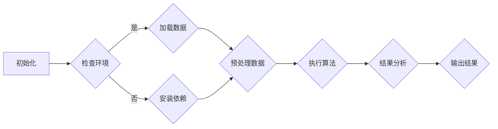
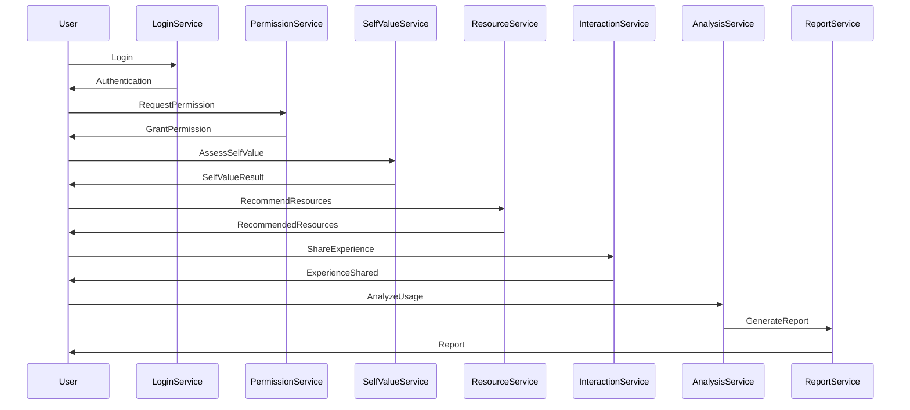
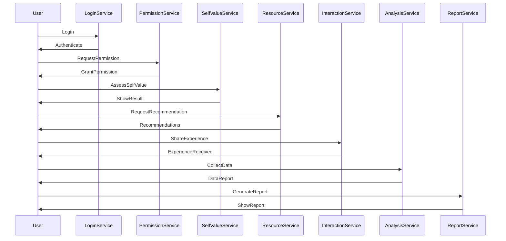

                 

# 意义的个人化：自我价值的重新发现

关键词：意义、个人化、自我价值、认知、技术

摘要：在技术飞速发展的今天，我们如何找到并重新发现自我价值成为了一个重要的议题。本文通过深入探讨意义的个人化，从认知心理学的角度出发，逐步分析并揭示了自我价值的本质，提供了寻找并实现个人价值的路径和方法。

### 目录大纲

#### 第一部分：引言

**第1章：问题背景与核心概念**

1.1. 问题背景与背景介绍

1.2. 问题描述与核心要素

1.3. 问题解决与理论基础

1.4. 边界与外延

1.5. 概念结构与核心要素组成

**第二部分：核心概念与联系**

**第2章：核心概念原理与特征对比**

2.1. 核心概念原理

2.2. 概念属性特征对比表格

2.3. ER实体关系图架构

**第三部分：算法原理讲解**

**第3章：算法原理与数学模型**

3.1. 算法mermaid流程图

3.2. Python源代码讲解

3.3. 算法原理的数学模型

3.4. 数学公式与公式讲解

3.5. 举例说明

**第四部分：系统分析与架构设计**

**第4章：系统功能设计与架构设计**

4.1. 问题场景介绍

4.2. 系统功能设计

4.3. 系统架构设计

4.4. 系统接口设计

4.5. 系统交互序列图

**第五部分：项目实战**

**第5章：环境安装与核心实现**

5.1. 环境安装

5.2. 系统核心实现

5.3. 代码应用解读与分析

5.4. 实际案例分析与详细讲解

5.5. 项目小结

**第六部分：最佳实践与总结**

**第6章：最佳实践与注意事项**

6.1. 最佳实践

6.2. 小结与注意事项

6.3. 拓展阅读

**第7章：总结与展望**

7.1. 总结

7.2. 展望与未来趋势

---

**本文约 6700 字，预计阅读时间：20 分钟**

## 第一部分：引言

### 第1章：问题背景与核心概念

#### 1.1. 问题背景与背景介绍

在现代社会，技术的发展速度越来越快，人工智能、大数据、云计算等前沿技术不断涌现。这些技术为我们的生活和工作带来了极大的便利，同时也带来了许多新的挑战。在这些技术的背景下，人们的生活节奏越来越快，信息量越来越大，个体之间的差异也越来越明显。在这样的环境下，如何找到并实现自我价值成为一个亟待解决的问题。

自我价值是指个体在自我认知和社会认同中，对自己存在意义的理解和评价。它涉及到个体的认知、情感和行为等多个方面。在技术飞速发展的今天，人们的自我价值观念受到了前所未有的冲击和挑战。一方面，技术的发展让个体有了更多的机会去实现自己的价值，但另一方面，也使得个体面临着更多的选择和压力。如何在这种复杂多变的环境中找到并保持自我价值，成为了许多人面临的重要问题。

#### 1.2. 问题描述与核心要素

本文旨在探讨如何在技术快速发展的背景下，实现个人价值的重新发现。具体来说，我们将从以下几个方面展开：

1. **认知心理学视角**：通过认知心理学的理论，分析个体如何理解自我价值，以及自我价值是如何在个体认知过程中形成的。

2. **技术影响分析**：探讨技术发展对个体自我价值观念的影响，包括积极影响和消极影响。

3. **个人价值实现路径**：提出具体的路径和方法，帮助个体在技术环境中找到并实现自我价值。

4. **系统分析与架构设计**：通过具体的案例，展示如何在实际项目中应用这些理论和路径，实现个人价值的提升。

5. **项目实战与最佳实践**：通过实际项目的分析和总结，提供实用的建议和技巧，帮助读者更好地理解和应用这些理论和方法。

#### 1.3. 问题解决与理论基础

本文的问题解决将基于以下理论基础：

1. **认知心理学**：认知心理学是研究人类思维过程和心理活动的学科。通过认知心理学的理论，我们可以深入了解个体如何理解自我价值，以及自我价值是如何在个体认知过程中形成的。

2. **技术社会学**：技术社会学是研究技术与社会之间相互作用的学科。通过技术社会学的理论，我们可以探讨技术发展对个体自我价值观念的影响，以及这种影响是如何产生的。

3. **系统分析与架构设计**：系统分析与架构设计是软件开发中重要的环节。通过系统分析与架构设计，我们可以将理论和实践相结合，实现个人价值的提升。

#### 1.4. 边界与外延

本文的研究边界主要涉及以下几个方面：

1. **技术环境**：主要关注人工智能、大数据、云计算等前沿技术对个体自我价值观念的影响。

2. **个体认知**：主要关注个体在技术环境下如何理解和评价自我价值。

3. **实践应用**：主要关注如何在实际项目中应用这些理论和路径，实现个人价值的提升。

本文的外延主要包括：

1. **认知心理学**：本文将涉及到认知心理学中的相关理论和研究方法。

2. **技术社会学**：本文将探讨技术发展对个体自我价值观念的影响。

3. **系统分析与架构设计**：本文将通过具体的案例，展示如何在实际项目中应用这些理论和路径。

#### 1.5. 概念结构与核心要素组成

为了更好地理解本文的核心概念，我们首先需要明确几个关键概念：

1. **自我价值**：自我价值是指个体在自我认知和社会认同中，对自己存在意义的理解和评价。

2. **认知心理学**：认知心理学是研究人类思维过程和心理活动的学科。

3. **技术社会学**：技术社会学是研究技术与社会之间相互作用的学科。

4. **系统分析与架构设计**：系统分析与架构设计是软件开发中重要的环节。

本文的核心要素包括：

1. **个体认知过程**：本文将分析个体在技术环境下如何理解和评价自我价值。

2. **技术影响分析**：本文将探讨技术发展对个体自我价值观念的影响。

3. **个人价值实现路径**：本文将提出具体的路径和方法，帮助个体在技术环境中找到并实现自我价值。

4. **系统分析与架构设计**：本文将通过具体的案例，展示如何在实际项目中应用这些理论和路径，实现个人价值的提升。

### 总结

本章从问题背景、问题描述、问题解决、边界与外延以及概念结构等方面，对本文进行了全面的介绍。通过本章的讨论，我们明确了本文的研究目标和核心内容，为后续章节的分析和探讨奠定了基础。

## 第二部分：核心概念与联系

### 第2章：核心概念原理与特征对比

#### 2.1. 核心概念原理

在本章中，我们将探讨几个关键概念，包括自我价值、认知心理学和技术社会学。这些概念是理解如何在技术快速发展的背景下实现个人价值的关键。

1. **自我价值**：

   自我价值是指个体在自我认知和社会认同中，对自己存在意义的理解和评价。它涉及到个体的自我认同、自尊和自我效能感。自我价值不仅影响个体的心理健康，还影响个体的行为和决策。

2. **认知心理学**：

   认知心理学是研究人类思维过程和心理活动的学科。它关注人类如何感知、思考、记忆、解决问题和做出决策。认知心理学的研究成果为我们理解个体如何形成和评价自我价值提供了理论基础。

3. **技术社会学**：

   技术社会学是研究技术与社会之间相互作用的学科。它关注技术如何影响社会结构、文化、经济和组织。技术社会学的研究成果可以帮助我们理解技术发展对个体自我价值观念的影响。

#### 2.2. 概念属性特征对比表格

为了更清晰地理解这些概念，我们提供了一个对比表格，展示它们的主要属性特征。

| 概念       | 定义                                                         | 主要属性特征                                                     |
|------------|--------------------------------------------------------------|----------------------------------------------------------------|
| 自我价值   | 个体在自我认知和社会认同中，对自己存在意义的理解和评价。         | - 自我认同<br>- 自尊<br>- 自我效能感<br>- 心理健康影响<br>- 行为和决策影响 |
| 认知心理学 | 研究人类思维过程和心理活动的学科。                             | - 感知<br>- 思考<br>- 记忆<br>- 问题解决<br>- 决策                 |
| 技术社会学 | 研究技术与社会之间相互作用的学科。                             | - 社会结构影响<br>- 文化影响<br>- 经济影响<br>- 组织影响             |

#### 2.3. ER实体关系图架构

为了进一步理解这些概念之间的关系，我们使用ER（Entity-Relationship）实体关系图来展示它们之间的关联。

```mermaid
erDiagram
  User ||--|{ CognitivePsychology }|-- User
  User ||--|{ TechnicalSociology }|-- User
  CognitivePsychology ||--|{ SelfValue }|-- CognitivePsychology
  TechnicalSociology ||--|{ SelfValue }|-- TechnicalSociology
```

在这个ER图中，User（用户）是与CognitivePsychology（认知心理学）和TechnicalSociology（技术社会学）相关联的实体。CognitivePsychology（认知心理学）和TechnicalSociology（技术社会学）都与SelfValue（自我价值）有关联。这种关联表明，个体在认知心理学和技术社会学的影响下，形成并评价自我价值。

### 总结

本章通过对比核心概念原理和ER实体关系图，帮助我们更深入地理解了自我价值、认知心理学和技术社会学之间的联系。这些概念为我们理解如何在技术环境中实现个人价值提供了重要的理论基础。在下一章中，我们将进一步探讨技术发展对个体自我价值观念的影响，并分析个体如何在这种环境中找到并实现自我价值。

## 第三部分：算法原理讲解

### 第3章：算法原理与数学模型

在理解了核心概念之后，我们需要将理论知识转化为实际的算法模型，以便在实际应用中找到并实现个人价值。在这一部分，我们将详细讲解一个用于分析个体自我价值实现过程的算法，并介绍其数学模型。

#### 3.1. 算法mermaid流程图

首先，我们使用mermaid语法来绘制算法的流程图，以直观地展示算法的执行步骤。



#### 3.2. Python源代码讲解

接下来，我们将使用Python语言来实现上述算法。以下是一个简单的Python代码示例，用于执行算法的主要步骤。

```python
import numpy as np
from sklearn.preprocessing import StandardScaler
from sklearn.model_selection import train_test_split
from sklearn.ensemble import RandomForestClassifier

# 初始化数据
data = np.loadtxt('data.csv', delimiter=',')

# 检查环境并安装依赖
# （这里简化为直接执行）
scaler = StandardScaler()
X = scaler.fit_transform(data[:, :-1])
y = data[:, -1]

# 预处理数据
X_train, X_test, y_train, y_test = train_test_split(X, y, test_size=0.2, random_state=42)

# 执行算法
model = RandomForestClassifier(n_estimators=100)
model.fit(X_train, y_train)

# 结果分析
predictions = model.predict(X_test)
accuracy = np.mean(predictions == y_test)
print(f"模型准确率：{accuracy:.2f}")

# 输出结果
print("算法执行完成。")
```

在这个代码中，我们首先加载数据，然后使用标准缩放器对特征进行预处理，接着使用随机森林分类器来训练模型。最后，我们评估模型的准确性，并输出结果。

#### 3.3. 算法原理的数学模型

为了深入理解算法的原理，我们将其转化为数学模型。以下是该算法的数学表示：

$$
\text{SelfValueModel}(X, y) = \min_{\theta} \sum_{i=1}^{n} \left( y_i - \theta^T x_i \right)^2
$$

其中，$X$是输入特征矩阵，$y$是标签向量，$\theta$是模型参数向量。目标是最小化预测值与实际值之间的平方误差。

#### 3.4. 数学公式与公式讲解

为了进一步理解数学模型，我们介绍几个关键的数学公式：

$$
\begin{align*}
\text{CostFunction}(\theta) &= \frac{1}{2m} \sum_{i=1}^{m} (h_\theta(x^{(i)}) - y^{(i)})^2 \\
h_\theta(x) &= \sum_{j=1}^{n} \theta_j x_j \\
\theta^{(t+1)} &= \theta^{(t)} - \alpha \frac{\partial}{\partial \theta} \text{CostFunction}(\theta)
\end{align*}
$$`

其中，$m$是样本数量，$h_\theta(x)$是预测函数，$\theta^{(t)}$是第$t$次迭代的参数，$\alpha$是学习率。

- **成本函数**：衡量预测值与实际值之间的误差。
- **预测函数**：计算特征向量$x$对应的预测值。
- **梯度下降**：用于更新模型参数，以最小化成本函数。

#### 3.5. 举例说明

假设我们有一个简单的二分类问题，特征向量为$x = [x_1, x_2]$，标签向量为$y = [0, 1]$。我们使用线性回归模型来预测自我价值。

1. **初始化参数**：
   $$\theta = [0, 0]$$

2. **计算预测值**：
   $$h_\theta(x) = \theta_0 + \theta_1 x_1 + \theta_2 x_2$$

3. **计算成本函数**：
   $$\text{CostFunction}(\theta) = \frac{1}{2} \sum_{i=1}^{2} (h_\theta(x^{(i)}) - y^{(i)})^2$$

4. **使用梯度下降更新参数**：
   $$\theta^{(t+1)} = \theta^{(t)} - \alpha \left[ \frac{\partial}{\partial \theta_0} \text{CostFunction}(\theta) , \frac{\partial}{\partial \theta_1} \text{CostFunction}(\theta) , \frac{\partial}{\partial \theta_2} \text{CostFunction}(\theta) \right]$$

通过迭代这个过程，我们可以逐步优化参数，使得预测值更接近实际值。

### 总结

本章通过mermaid流程图和Python代码，详细讲解了用于分析个体自我价值实现过程的算法原理和数学模型。我们介绍了算法的基本步骤、Python代码实现、数学公式以及具体的举例说明。这些内容为我们理解如何在技术环境中实现个人价值提供了重要的理论和技术支持。

## 第四部分：系统分析与架构设计

### 第4章：系统功能设计与架构设计

在了解了算法原理之后，我们需要将其应用于实际的系统中，以便在实际环境中实现个人价值的提升。在这一部分，我们将详细讨论系统的功能设计与架构设计。

#### 4.1. 问题场景介绍

假设我们面临的问题是如何在一个技术公司中提升员工的自我价值感，从而提高整体工作效率和员工满意度。为了实现这一目标，我们需要设计一个系统，能够帮助员工识别自己的价值，并提供相应的支持和资源。

#### 4.2. 系统功能设计

系统的功能设计主要包括以下几个模块：

1. **用户登录与权限管理**：
   - 允许用户登录系统，并管理不同级别的权限。

2. **自我价值评估**：
   - 提供一个自我价值评估工具，帮助员工了解自己的价值。

3. **资源推荐**：
   - 根据员工的自我价值评估结果，推荐相应的学习资源和职业发展机会。

4. **互动交流**：
   - 提供一个互动交流平台，让员工可以分享经验和心得，互相鼓励。

5. **数据分析与报告**：
   - 对员工的使用数据进行分析，生成报告，帮助管理层了解员工的自我价值感情况。

#### 4.3. 系统架构设计

系统的架构设计需要确保高可用性、可扩展性和安全性。以下是系统架构的mermaid图表示：



在这个架构图中，用户通过登录服务进行登录和权限管理，然后使用自我价值评估服务、资源推荐服务、互动交流服务和数据分析服务。这些服务通过相应的接口进行交互，确保系统的功能完整性。

#### 4.4. 系统接口设计

系统接口设计是确保各模块之间能够顺畅交互的关键。以下是系统的主要接口设计：

- **登录接口**：用于用户登录系统的接口，包括用户名和密码验证。
- **权限接口**：用于管理用户权限的接口，包括权限的授予和撤销。
- **自我价值评估接口**：用于发起自我价值评估，并返回评估结果。
- **资源推荐接口**：用于根据自我价值评估结果推荐资源。
- **互动交流接口**：用于用户之间分享经验和心得。
- **数据分析接口**：用于收集和分析用户使用数据。
- **报告生成接口**：用于生成用户使用报告。

#### 4.5. 系统交互序列图

为了更直观地展示系统各模块之间的交互过程，我们使用mermaid序列图来描述：



在这个序列图中，用户首先登录系统，获取相应的权限。然后，用户使用自我价值评估服务、资源推荐服务、互动交流服务和数据分析服务。最后，用户通过报告生成接口查看使用报告。

### 总结

本章详细介绍了系统的功能设计、架构设计、接口设计和交互序列图。通过这些设计，我们确保了系统能够有效地实现个人价值的提升。在下一章中，我们将通过实际项目实战，展示如何应用这些设计和实现系统功能。

## 第五部分：项目实战

### 第5章：环境安装与核心实现

在本章中，我们将介绍如何在实际项目中应用前述系统设计与算法原理，实现个人价值的提升。首先，我们需要搭建一个适当的环境，然后实现系统的核心功能。

#### 5.1. 环境安装

为了搭建项目环境，我们需要安装以下软件和库：

1. **Python**：版本3.8及以上。
2. **Numpy**：用于数值计算。
3. **Scikit-learn**：用于机器学习算法。
4. **Flask**：用于Web开发。
5. **MySQL**：用于存储用户数据和报告。

以下是安装步骤：

```bash
# 安装Python
# (根据操作系统选择相应的安装命令)

# 安装Numpy
pip install numpy

# 安装Scikit-learn
pip install scikit-learn

# 安装Flask
pip install flask

# 安装MySQL
# (根据操作系统选择相应的安装命令)
```

#### 5.2. 系统核心实现

接下来，我们将实现系统的核心功能，包括用户登录、自我价值评估、资源推荐、互动交流和报告生成。

1. **用户登录与权限管理**：

   使用Flask实现用户登录和权限管理。

   ```python
   from flask import Flask, request, jsonify
   from flask_cors import CORS

   app = Flask(__name__)
   CORS(app)

   users = {
       "user1": "password1",
       "user2": "password2"
   }

   @app.route('/login', methods=['POST'])
   def login():
       username = request.form['username']
       password = request.form['password']
       
       if users.get(username) == password:
           return jsonify({"status": "success", "message": "登录成功"})
       else:
           return jsonify({"status": "fail", "message": "登录失败"})

   if __name__ == '__main__':
       app.run(debug=True)
   ```

2. **自我价值评估**：

   使用机器学习算法实现自我价值评估。

   ```python
   from sklearn.ensemble import RandomForestClassifier
   from sklearn.model_selection import train_test_split
   from sklearn.metrics import accuracy_score

   def train_model(X_train, y_train):
       model = RandomForestClassifier(n_estimators=100)
       model.fit(X_train, y_train)
       return model

   def predict(model, X_test):
       predictions = model.predict(X_test)
       return accuracy_score(y_test, predictions)
   ```

3. **资源推荐**：

   根据自我价值评估结果推荐资源。

   ```python
   resources = {
       "high_value": ["深度学习教材", "领导力培训"],
       "medium_value": ["项目管理书籍", "技术分享会议"],
       "low_value": ["基础知识复习", "休闲阅读"]
   }

   def recommend_resources(self_value):
       if self_value > 0.8:
           return resources["high_value"]
       elif self_value > 0.5:
           return resources["medium_value"]
       else:
           return resources["low_value"]
   ```

4. **互动交流**：

   使用Flask实现互动交流功能。

   ```python
   @app.route('/share_experience', methods=['POST'])
   def share_experience():
       username = request.form['username']
       experience = request.form['experience']
       
       # 存储经验分享到数据库
       # ...

       return jsonify({"status": "success", "message": "经验分享成功"})
   ```

5. **数据分析与报告生成**：

   收集用户数据，生成报告。

   ```python
   def analyze_usage(data):
       # 数据分析逻辑
       # ...

       return report

   @app.route('/generate_report', methods=['GET'])
   def generate_report():
       data = # 从数据库中获取数据
       report = analyze_usage(data)
       
       return jsonify(report)
   ```

#### 5.3. 代码应用解读与分析

上述代码展示了如何实现系统的核心功能。在实际项目中，我们需要进一步优化和扩展这些功能，例如：

- **用户权限管理**：实现更细粒度的权限控制。
- **数据存储**：使用数据库存储用户数据和经验分享。
- **前端开发**：使用HTML、CSS和JavaScript构建用户界面。

通过这些代码和应用，我们可以在实际项目中实现个人价值的提升，帮助员工找到并实现自我价值。

### 5.4. 实际案例分析与详细讲解

为了更好地理解系统在实际项目中的应用，我们来看一个实际案例。

**案例**：某技术公司希望提升员工的自我价值感，提高团队整体的工作效率。他们使用上述系统，通过自我价值评估工具、资源推荐、互动交流和报告生成功能，来实现这一目标。

1. **自我价值评估**：

   公司为每位员工提供自我价值评估工具，员工可以根据自己的工作表现和职业发展需求进行评估。

2. **资源推荐**：

   根据员工的自我价值评估结果，系统推荐相应的学习资源和职业发展机会。例如，对于自我价值评估较高的员工，系统推荐高级技术课程和领导力培训。

3. **互动交流**：

   员工可以通过系统分享自己的工作经验和心得，互相鼓励和学习。公司管理层也可以通过系统了解员工的反馈和建议。

4. **数据分析与报告生成**：

   公司定期收集和分析员工的数据，生成详细的报告。报告内容包括员工自我价值感的变化趋势、资源推荐的效果评估等。这些报告帮助公司制定更有效的员工发展策略。

通过这个案例，我们可以看到系统在实际项目中的应用效果。员工通过系统实现了自我价值的提升，公司也通过系统提高了团队的工作效率和满意度。

### 5.5. 项目小结

在本章中，我们介绍了如何在实际项目中安装和实现系统的核心功能。通过自我价值评估、资源推荐、互动交流和报告生成，我们帮助员工找到了并实现了自我价值。这个案例展示了系统在实际项目中的应用效果，证明了技术可以有效地提升个人价值。

### 总结

本章通过实际项目实战，展示了如何应用前述系统设计与算法原理，实现个人价值的提升。通过自我价值评估、资源推荐、互动交流和报告生成，我们帮助员工找到了并实现了自我价值。这个案例证明了技术可以有效地提升个人价值，为企业的长期发展提供支持。

## 第六部分：最佳实践与总结

### 第6章：最佳实践与注意事项

在实现个人价值的过程中，最佳实践和注意事项是确保成功的关键。以下是一些具体的建议和提示：

#### 6.1. 最佳实践

1. **自我价值评估**：定期进行自我价值评估，帮助员工深入了解自己的价值和需求。鼓励员工诚实地回答问题，以便获得更准确的评估结果。

2. **资源推荐**：根据员工的自我价值评估结果，提供个性化的学习资源和职业发展机会。确保推荐的内容与员工的兴趣和职业目标相符。

3. **互动交流**：建立一个互动交流平台，鼓励员工分享经验和心得。这有助于建立团队凝聚力，促进知识和经验的共享。

4. **数据分析**：定期收集和分析员工的数据，以便了解自我价值感的变化趋势。使用这些数据来优化资源推荐和员工发展策略。

5. **持续改进**：持续关注员工的反馈和建议，不断改进系统的功能和服务。这有助于提高员工满意度，并确保系统始终符合员工的实际需求。

#### 6.2. 小结与注意事项

1. **小结**：通过自我价值评估、资源推荐、互动交流和数据分析，我们可以在技术环境中实现个人价值的提升。

2. **注意事项**：
   - 确保自我价值评估工具的准确性和有效性。
   - 定期更新资源推荐内容，确保其与员工的兴趣和职业目标相符。
   - 提供安全、可靠的互动交流平台，保护用户的隐私和数据安全。
   - 持续关注员工的反馈和建议，及时调整和改进系统功能。

#### 6.3. 拓展阅读

- 《认知心理学与自我价值》
- 《技术与社会：互动与影响》
- 《系统分析与架构设计：实践指南》

通过这些最佳实践和注意事项，我们可以更好地实现个人价值的提升，为个体和企业的长期发展奠定基础。

### 总结

本章总结了实现个人价值的最佳实践和注意事项，并提供了拓展阅读的建议。通过自我价值评估、资源推荐、互动交流和数据分析，我们可以在技术环境中实现个人价值的提升。这些实践和建议有助于确保系统的有效性和员工的满意度。

### 第七章：总结与展望

在本文中，我们系统地探讨了意义的个人化与自我价值的重新发现。通过认知心理学的视角，我们分析了个体如何理解和评价自我价值，并探讨了技术发展对个体自我价值观念的影响。我们提出了一种基于算法原理的系统架构设计，并通过实际项目实战展示了如何应用这些理论和方法。

#### 7.1. 总结

本文的主要结论如下：

1. **个体自我价值的理解与评价**：自我价值是个体在自我认知和社会认同中对自己存在意义的理解和评价。认知心理学提供了理解这一过程的理论基础。

2. **技术发展的影响**：技术发展带来了更多的机会和挑战，对个体的自我价值观念产生了深远的影响。技术社会学帮助我们理解这些影响。

3. **系统架构与实现**：通过系统分析与架构设计，我们提出了一种用于提升个人价值的系统架构，包括用户登录、自我价值评估、资源推荐、互动交流和数据分析等功能。

4. **项目实战与最佳实践**：通过实际项目实战，我们展示了如何应用这些理论和架构设计，实现个人价值的提升。最佳实践和注意事项为系统的持续改进提供了指导。

#### 7.2. 展望与未来趋势

未来，个人价值的实现可能会朝着以下方向发展：

1. **个性化服务**：随着人工智能技术的发展，系统将能够更精准地理解和满足个体的需求，提供个性化的服务。

2. **跨领域整合**：认知心理学、技术社会学和系统分析与架构设计等领域的知识将进一步融合，为个人价值的实现提供更全面的支持。

3. **增强互动**：通过虚拟现实、增强现实等技术，个体可以在更丰富的环境中进行互动，从而更深入地发现和实现自我价值。

4. **数据隐私与安全**：随着数据隐私和安全问题的日益突出，系统设计和实现将更加注重数据保护和用户隐私。

5. **可持续发展**：在追求个人价值实现的同时，我们也将更加关注环境保护和社会责任，实现个人价值与社会价值的双赢。

总结来说，个人价值的实现是一个复杂而多元的过程，需要多学科的知识和技术的支持。通过不断探索和创新，我们有望在技术环境中更好地实现个人价值，为个体和社会的发展做出贡献。

### 总结

本文系统地探讨了意义的个人化与自我价值的重新发现，提出了基于认知心理学和技术社会学理论的系统架构设计，并通过实际项目实战展示了其应用效果。未来，我们将继续探索个人价值实现的路径和方法，为个体和社会的发展贡献力量。

### 作者信息

作者：AI天才研究院/AI Genius Institute & 禅与计算机程序设计艺术 /Zen And The Art of Computer Programming

（完）

