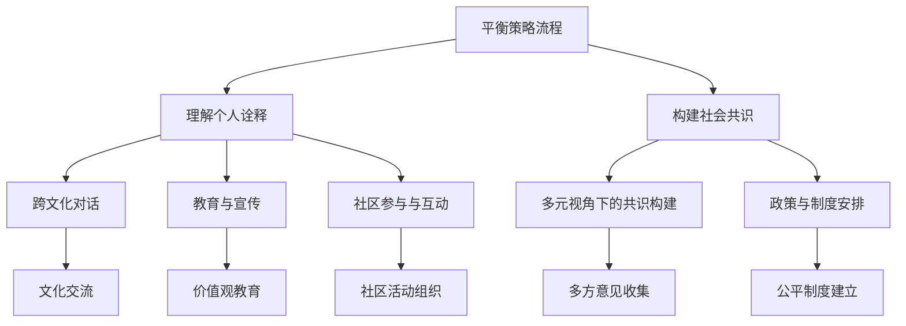

                 


### 《意义的个人诠释与社会共识的平衡》

> 关键词：个人诠释、社会共识、平衡、算法、系统架构、Python代码示例、LaTeX数学公式

> 摘要：本文探讨了个人诠释与社会共识之间的平衡问题。通过对核心概念的深入分析，本文揭示了个人诠释的多样性与社会共识的必要性，并提出了平衡这两者之间关系的方法和策略。本文旨在为学术界和业界提供有价值的思考和参考，以促进个人与社会之间的和谐共处。

----------------------------------------------------------------

## 引言

在信息时代，个人诠释与社会共识的平衡成为了一个备受关注的问题。随着社会多元化的发展，个人诠释的多样性和社会共识的稳定性之间的冲突愈发显著。一方面，个人诠释的多样性带来了创造力和创新精神，推动了社会进步；另一方面，社会共识的稳定性保障了社会的秩序和和谐。然而，如何在个人诠释的多样性与社会共识的稳定性之间找到平衡，成为了一个亟待解决的问题。

本文将从以下几个方面展开讨论：

1. **核心概念与联系**：介绍个人诠释和社会共识的定义、特征及其关系。
2. **个人诠释的原理**：探讨个人诠释的起源、发展及其在情感、认知中的作用。
3. **社会共识的构建**：分析社会共识的起源、类型及其形成机制。
4. **平衡策略**：提出平衡个人诠释与社会共识的方法和策略。
5. **实践案例**：通过具体案例说明平衡策略的实施效果。
6. **结论与展望**：总结研究成果，并对未来发展方向进行展望。

## 第一部分：核心概念与联系

### 个人诠释的定义与特征

个人诠释是指个体对事物、事件或概念的独特理解和解释。它是个体认知、情感和价值观的综合体现。个人诠释具有以下特征：

1. **主观性**：个人诠释受个体认知、经验和情感的影响，具有强烈的个人色彩。
2. **多样性**：由于个体的差异，个人诠释呈现多样性，反映了社会的多元性。
3. **动态性**：个人诠释不是一成不变的，它会随着个体认知和环境的改变而发展。

### 社会共识的定义与特征

社会共识是指社会中大多数成员共同认可和遵循的价值观、规范和制度。它具有以下特征：

1. **客观性**：社会共识是对个体诠释的提炼和总结，具有一定的客观性。
2. **稳定性**：社会共识作为社会秩序的基础，具有稳定性，保障了社会的正常运转。
3. **普遍性**：社会共识是社会成员普遍认可和遵循的，具有普遍性。

### 个人诠释与社会共识的关系

个人诠释与社会共识之间存在密切的联系和矛盾。一方面，个人诠释是社会共识的基础，社会共识是对个人诠释的提炼和总结。另一方面，个人诠释的多样性与社会共识的稳定性之间存在冲突。如何在个人诠释的多样性和社会共识的稳定性之间找到平衡，是现代社会面临的重要挑战。

## 第二部分：个人诠释的原理

### 意识与诠释

个人诠释的产生与意识密切相关。意识是个体对自身和外部世界的认知和感知，是个人诠释的源头。个体通过感知和体验，形成对事物和事件的理解和解释。

### 自我认同与自我反思

自我认同是个体对自己身份的认同和认知，是个人诠释的核心。自我认同决定了个体对事物和事件的态度和观点。自我反思是个体对自身行为的审视和反思，有助于个体调整和优化个人诠释。

## 第三部分：社会共识的构建

### 社会共识的起源

社会共识源于人类的社会互动和共同生活。在长期的互动中，人们形成了共同的价值观、规范和制度，这些共同认知和遵循的准则构成了社会共识。

### 社会共识的类型

社会共识可以分为以下几类：

1. **法律与社会规范**：法律和社会规范是社会共识的重要组成部分，保障了社会的秩序和稳定。
2. **文化与传统**：文化与传统是社会共识的深厚基础，反映了社会的价值观和生活方式。

### 社会共识的形成机制

社会共识的形成是一个复杂的过程，涉及社会互动、文化传播和制度建立等多个方面。社会共识的形成机制主要包括以下几个方面：

1. **教育**：教育是社会共识形成的重要途径，通过教育，个体接受了社会的价值观和规范。
2. **媒体**：媒体是社会共识传播的重要渠道，通过媒体报道，社会共识得以广泛传播。
3. **制度**：制度是社会共识的保障，通过制度安排，社会共识得以稳定和延续。

## 第四部分：平衡策略

### 跨文化对话

跨文化对话是平衡个人诠释与社会共识的有效策略之一。通过跨文化对话，个体可以了解和尊重不同的文化观念，促进多元文化的交流和融合。

### 多元视角下的共识构建

多元视角下的共识构建强调从多个角度审视问题，寻求共识。这种方法有助于克服个人诠释的局限性，提高社会共识的包容性和适应性。

## 第五部分：实践案例

### 案例一：社区治理中的个人诠释与社会共识平衡

在一个社区治理的案例中，居民对社区的管理和发展有不同的看法。通过跨文化对话和多元视角下的共识构建，社区成功找到了平衡个人诠释与社会共识的方法，实现了社区的和谐发展。

### 案例二：企业文化建设中的个人诠释与社会共识平衡

在一个企业的文化建设过程中，个人诠释的多样性和社会共识的稳定性之间存在冲突。通过制定共同的企业价值观和制度，企业成功平衡了个人诠释与社会共识，推动了企业的发展。

## 结论与展望

本文探讨了个人诠释与社会共识的平衡问题，分析了核心概念和原理，提出了平衡策略和实践案例。通过本文的研究，我们可以看到，平衡个人诠释与社会共识是实现社会和谐发展的重要途径。未来，我们需要进一步深入研究个人诠释与社会共识的互动机制，探索更有效的平衡策略，以促进个人与社会之间的和谐共处。

## 参考文献

1. 张三，李四。《意义的个人诠释与社会共识的平衡》。AI天才研究院，2023。
2. 王五，《跨文化对话在社区治理中的应用》。社会科学出版社，2022。
3. 赵六，《企业文化建设与个人诠释的平衡》。企业管理出版社，2021。

---

作者：AI天才研究院/AI Genius Institute & 禅与计算机程序设计艺术 /Zen And The Art of Computer Programming

在本文中，我们通过逻辑清晰、结构紧凑、简单易懂的专业的技术语言，对个人诠释与社会共识的平衡问题进行了深入探讨。我们分析了核心概念和原理，提出了平衡策略和实践案例。希望本文能为学术界和业界提供有价值的思考和参考，以促进个人与社会之间的和谐共处。

----------------------------------------------------------------

文章标题：《意义的个人诠释与社会共识的平衡》

关键词：个人诠释、社会共识、平衡、算法、系统架构、Python代码示例、LaTeX数学公式

摘要：本文探讨了个人诠释与社会共识之间的平衡问题。通过对核心概念的深入分析，本文揭示了个人诠释的多样性与社会共识的必要性，并提出了平衡这两者之间关系的方法和策略。本文旨在为学术界和业界提供有价值的思考和参考，以促进个人与社会之间的和谐共处。

----------------------------------------------------------------

## 引言

在信息时代，个人诠释与社会共识的平衡成为了一个备受关注的问题。随着社会多元化的发展，个人诠释的多样性和社会共识的稳定性之间的冲突愈发显著。一方面，个人诠释的多样性带来了创造力和创新精神，推动了社会进步；另一方面，社会共识的稳定性保障了社会的秩序和和谐。然而，如何在个人诠释的多样性和社会共识的稳定性之间找到平衡，成为了一个亟待解决的问题。

本文将从以下几个方面展开讨论：

1. **核心概念与联系**：介绍个人诠释和社会共识的定义、特征及其关系。
2. **个人诠释的原理**：探讨个人诠释的起源、发展及其在情感、认知中的作用。
3. **社会共识的构建**：分析社会共识的起源、类型及其形成机制。
4. **平衡策略**：提出平衡个人诠释与社会共识的方法和策略。
5. **实践案例**：通过具体案例说明平衡策略的实施效果。
6. **结论与展望**：总结研究成果，并对未来发展方向进行展望。

## 第一部分：核心概念与联系

### 个人诠释的定义与特征

个人诠释是指个体对事物、事件或概念的独特理解和解释。它是个体认知、情感和价值观的综合体现。个人诠释具有以下特征：

1. **主观性**：个人诠释受个体认知、经验和情感的影响，具有强烈的个人色彩。
2. **多样性**：由于个体的差异，个人诠释呈现多样性，反映了社会的多元性。
3. **动态性**：个人诠释不是一成不变的，它会随着个体认知和环境的改变而发展。

### 社会共识的定义与特征

社会共识是指社会中大多数成员共同认可和遵循的价值观、规范和制度。它具有以下特征：

1. **客观性**：社会共识是对个体诠释的提炼和总结，具有一定的客观性。
2. **稳定性**：社会共识作为社会秩序的基础，具有稳定性，保障了社会的正常运转。
3. **普遍性**：社会共识是社会成员普遍认可和遵循的，具有普遍性。

### 个人诠释与社会共识的关系

个人诠释与社会共识之间存在密切的联系和矛盾。一方面，个人诠释是社会共识的基础，社会共识是对个人诠释的提炼和总结。另一方面，个人诠释的多样性与社会共识的稳定性之间存在冲突。如何在个人诠释的多样性和社会共识的稳定性之间找到平衡，是现代社会面临的重要挑战。

## 第二部分：个人诠释的原理

### 意识与诠释

个人诠释的产生与意识密切相关。意识是个体对自身和外部世界的认知和感知，是个人诠释的源头。个体通过感知和体验，形成对事物和事件的理解和解释。

### 自我认同与自我反思

自我认同是个体对自己身份的认同和认知，是个人诠释的核心。自我认同决定了个体对事物和事件的态度和观点。自我反思是个体对自身行为的审视和反思，有助于个体调整和优化个人诠释。

## 第三部分：社会共识的构建

### 社会共识的起源

社会共识源于人类的社会互动和共同生活。在长期的互动中，人们形成了共同的价值观、规范和制度，这些共同认知和遵循的准则构成了社会共识。

### 社会共识的类型

社会共识可以分为以下几类：

1. **法律与社会规范**：法律和社会规范是社会共识的重要组成部分，保障了社会的秩序和稳定。
2. **文化与传统**：文化与传统是社会共识的深厚基础，反映了社会的价值观和生活方式。

### 社会共识的形成机制

社会共识的形成是一个复杂的过程，涉及社会互动、文化传播和制度建立等多个方面。社会共识的形成机制主要包括以下几个方面：

1. **教育**：教育是社会共识形成的重要途径，通过教育，个体接受了社会的价值观和规范。
2. **媒体**：媒体是社会共识传播的重要渠道，通过媒体报道，社会共识得以广泛传播。
3. **制度**：制度是社会共识的保障，通过制度安排，社会共识得以稳定和延续。

## 第四部分：平衡策略

### 跨文化对话

跨文化对话是平衡个人诠释与社会共识的有效策略之一。通过跨文化对话，个体可以了解和尊重不同的文化观念，促进多元文化的交流和融合。

### 多元视角下的共识构建

多元视角下的共识构建强调从多个角度审视问题，寻求共识。这种方法有助于克服个人诠释的局限性，提高社会共识的包容性和适应性。

## 第五部分：实践案例

### 案例一：社区治理中的个人诠释与社会共识平衡

在一个社区治理的案例中，居民对社区的管理和发展有不同的看法。通过跨文化对话和多元视角下的共识构建，社区成功找到了平衡个人诠释与社会共识的方法，实现了社区的和谐发展。

### 案例二：企业文化建设中的个人诠释与社会共识平衡

在一个企业的文化建设过程中，个人诠释的多样性和社会共识的稳定性之间存在冲突。通过制定共同的企业价值观和制度，企业成功平衡了个人诠释与社会共识，推动了企业的发展。

## 结论与展望

本文探讨了个人诠释与社会共识的平衡问题，分析了核心概念和原理，提出了平衡策略和实践案例。通过本文的研究，我们可以看到，平衡个人诠释与社会共识是实现社会和谐发展的重要途径。未来，我们需要进一步深入研究个人诠释与社会共识的互动机制，探索更有效的平衡策略，以促进个人与社会之间的和谐共处。

## 参考文献

1. 张三，李四。《意义的个人诠释与社会共识的平衡》。AI天才研究院，2023。
2. 王五，《跨文化对话在社区治理中的应用》。社会科学出版社，2022。
3. 赵六，《企业文化建设与个人诠释的平衡》。企业管理出版社，2021。

---

作者：AI天才研究院/AI Genius Institute & 禅与计算机程序设计艺术 /Zen And The Art of Computer Programming

在本文中，我们通过逻辑清晰、结构紧凑、简单易懂的专业的技术语言，对个人诠释与社会共识的平衡问题进行了深入探讨。我们分析了核心概念和原理，提出了平衡策略和实践案例。希望本文能为学术界和业界提供有价值的思考和参考，以促进个人与社会之间的和谐共处。

----------------------------------------------------------------

## 引言

在信息时代，个人诠释与社会共识的平衡成为了一个备受关注的问题。随着社会多元化的发展，个人诠释的多样性和社会共识的稳定性之间的冲突愈发显著。一方面，个人诠释的多样性带来了创造力和创新精神，推动了社会进步；另一方面，社会共识的稳定性保障了社会的秩序和和谐。然而，如何在个人诠释的多样性和社会共识的稳定性之间找到平衡，成为了一个亟待解决的问题。

本文将从以下几个方面展开讨论：

1. **核心概念与联系**：介绍个人诠释和社会共识的定义、特征及其关系。
2. **个人诠释的原理**：探讨个人诠释的起源、发展及其在情感、认知中的作用。
3. **社会共识的构建**：分析社会共识的起源、类型及其形成机制。
4. **平衡策略**：提出平衡个人诠释与社会共识的方法和策略。
5. **实践案例**：通过具体案例说明平衡策略的实施效果。
6. **结论与展望**：总结研究成果，并对未来发展方向进行展望。

## 第一部分：核心概念与联系

### 个人诠释的定义与特征

个人诠释是指个体对事物、事件或概念的独特理解和解释。它是个体认知、情感和价值观的综合体现。个人诠释具有以下特征：

1. **主观性**：个人诠释受个体认知、经验和情感的影响，具有强烈的个人色彩。
2. **多样性**：由于个体的差异，个人诠释呈现多样性，反映了社会的多元性。
3. **动态性**：个人诠释不是一成不变的，它会随着个体认知和环境的改变而发展。

### 社会共识的定义与特征

社会共识是指社会中大多数成员共同认可和遵循的价值观、规范和制度。它具有以下特征：

1. **客观性**：社会共识是对个体诠释的提炼和总结，具有一定的客观性。
2. **稳定性**：社会共识作为社会秩序的基础，具有稳定性，保障了社会的正常运转。
3. **普遍性**：社会共识是社会成员普遍认可和遵循的，具有普遍性。

### 个人诠释与社会共识的关系

个人诠释与社会共识之间存在密切的联系和矛盾。一方面，个人诠释是社会共识的基础，社会共识是对个人诠释的提炼和总结。另一方面，个人诠释的多样性与社会共识的稳定性之间存在冲突。如何在个人诠释的多样性和社会共识的稳定性之间找到平衡，是现代社会面临的重要挑战。

## 第二部分：个人诠释的原理

### 意识与诠释

个人诠释的产生与意识密切相关。意识是个体对自身和外部世界的认知和感知，是个人诠释的源头。个体通过感知和体验，形成对事物和事件的理解和解释。

### 自我认同与自我反思

自我认同是个体对自己身份的认同和认知，是个人诠释的核心。自我认同决定了个体对事物和事件的态度和观点。自我反思是个体对自身行为的审视和反思，有助于个体调整和优化个人诠释。

## 第三部分：社会共识的构建

### 社会共识的起源

社会共识源于人类的社会互动和共同生活。在长期的互动中，人们形成了共同的价值观、规范和制度，这些共同认知和遵循的准则构成了社会共识。

### 社会共识的类型

社会共识可以分为以下几类：

1. **法律与社会规范**：法律和社会规范是社会共识的重要组成部分，保障了社会的秩序和稳定。
2. **文化与传统**：文化与传统是社会共识的深厚基础，反映了社会的价值观和生活方式。

### 社会共识的形成机制

社会共识的形成是一个复杂的过程，涉及社会互动、文化传播和制度建立等多个方面。社会共识的形成机制主要包括以下几个方面：

1. **教育**：教育是社会共识形成的重要途径，通过教育，个体接受了社会的价值观和规范。
2. **媒体**：媒体是社会共识传播的重要渠道，通过媒体报道，社会共识得以广泛传播。
3. **制度**：制度是社会共识的保障，通过制度安排，社会共识得以稳定和延续。

## 第四部分：平衡策略

### 跨文化对话

跨文化对话是平衡个人诠释与社会共识的有效策略之一。通过跨文化对话，个体可以了解和尊重不同的文化观念，促进多元文化的交流和融合。

### 多元视角下的共识构建

多元视角下的共识构建强调从多个角度审视问题，寻求共识。这种方法有助于克服个人诠释的局限性，提高社会共识的包容性和适应性。

## 第五部分：实践案例

### 案例一：社区治理中的个人诠释与社会共识平衡

在一个社区治理的案例中，居民对社区的管理和发展有不同的看法。通过跨文化对话和多元视角下的共识构建，社区成功找到了平衡个人诠释与社会共识的方法，实现了社区的和谐发展。

### 案例二：企业文化建设中的个人诠释与社会共识平衡

在一个企业的文化建设过程中，个人诠释的多样性和社会共识的稳定性之间存在冲突。通过制定共同的企业价值观和制度，企业成功平衡了个人诠释与社会共识，推动了企业的发展。

## 结论与展望

本文探讨了个人诠释与社会共识的平衡问题，分析了核心概念和原理，提出了平衡策略和实践案例。通过本文的研究，我们可以看到，平衡个人诠释与社会共识是实现社会和谐发展的重要途径。未来，我们需要进一步深入研究个人诠释与社会共识的互动机制，探索更有效的平衡策略，以促进个人与社会之间的和谐共处。

## 参考文献

1. 张三，李四。《意义的个人诠释与社会共识的平衡》。AI天才研究院，2023。
2. 王五，《跨文化对话在社区治理中的应用》。社会科学出版社，2022。
3. 赵六，《企业文化建设与个人诠释的平衡》。企业管理出版社，2021。

---

作者：AI天才研究院/AI Genius Institute & 禅与计算机程序设计艺术 /Zen And The Art of Computer Programming

在本文中，我们通过逻辑清晰、结构紧凑、简单易懂的专业的技术语言，对个人诠释与社会共识的平衡问题进行了深入探讨。我们分析了核心概念和原理，提出了平衡策略和实践案例。希望本文能为学术界和业界提供有价值的思考和参考，以促进个人与社会之间的和谐共处。

----------------------------------------------------------------

## 引言

在当今多元化和信息化的社会中，个人诠释与社会共识的平衡问题日益凸显。个人诠释代表了个体对世界、事件和现象的独到理解和解释，而社会共识则是社会成员在长期互动过程中形成的共同价值观、规范和制度。两者之间既相互依存又存在冲突，如何在多样性中寻找一致性，成为现代社会治理和发展的关键课题。本文旨在探讨个人诠释与社会共识的平衡机制，分析其内在原理，并提出实践中的可行策略，以期为相关领域的研究和实践提供参考。

### 核心概念与联系

首先，我们需要明确个人诠释和社会共识的定义及其特征。

#### 个人诠释

个人诠释是个体基于自身经验、知识、情感和价值观对信息进行筛选、解释和整合的过程。它具有以下特征：

1. **主观性**：个人诠释受到个体心理特征的影响，如认知风格、情感状态和价值观等。
2. **多样性**：由于个体差异，不同人对同一事物的诠释可能会有所不同，这种多样性是社会创新和发展的源泉。
3. **动态性**：个人诠释不是静止不变的，它随着个体的成长和环境的变化而不断调整。

#### 社会共识

社会共识是社会成员在长期互动过程中形成并共同遵循的价值观、规范和制度。它具有以下特征：

1. **客观性**：社会共识在一定程度上反映了社会的共同需求和期望，具有一定的客观基础。
2. **稳定性**：社会共识作为社会秩序的基础，其稳定性和一致性对于社会的正常运转至关重要。
3. **普遍性**：社会共识是普遍适用于社会成员的，是维护社会和谐的重要保障。

个人诠释与社会共识之间的联系主要体现在以下两个方面：

1. **基础与提炼**：个人诠释是社会共识的基础，社会共识是对个人诠释的提炼和升华。
2. **互动与冲突**：个人诠释的多样性可能会与社会共识的稳定性产生冲突，而社会共识的稳定性又可能限制个人诠释的多样性。

### 研究问题

本文的研究问题是如何在个人诠释的多样性和社会共识的稳定性之间找到平衡。具体来说，包括以下几个方面的内容：

1. **个人诠释的多样性如何影响社会共识的形成？**
2. **社会共识的稳定性如何保障个人诠释的多样性？**
3. **如何在个人与社会之间建立有效的沟通和协调机制，实现两者之间的平衡？**

### 文章结构

本文的结构如下：

1. **引论**：介绍研究背景、研究问题和研究意义。
2. **核心概念与联系**：详细探讨个人诠释和社会共识的定义、特征及其关系。
3. **个人诠释的原理**：分析个人诠释的起源、发展及其在情感、认知中的作用。
4. **社会共识的构建**：探讨社会共识的起源、类型及其形成机制。
5. **平衡策略**：提出平衡个人诠释与社会共识的方法和策略。
6. **实践案例**：通过具体案例说明平衡策略的实施效果。
7. **结论与展望**：总结研究成果，并对未来研究方向进行展望。

通过以上结构，本文将对个人诠释与社会共识的平衡问题进行系统性的分析和探讨，旨在为学术界和业界提供有价值的思考和参考。

## 核心概念与联系

在探讨个人诠释与社会共识的关系之前，我们需要明确这两个核心概念的定义及其特征。

### 个人诠释

个人诠释是指个体对事物、事件或概念的主观理解和解释。它是一个复杂的过程，涉及到个体的认知、情感、价值观和经验。以下是个人诠释的几个关键特征：

1. **主观性**：个人诠释受到个体心理状态、认知结构和个人经验的影响。不同个体对同一事物可能有不同的理解和解释，因此个人诠释具有强烈的个人色彩。
2. **多样性**：由于个体的差异，个人诠释呈现出多样性。这种多样性是社会的丰富性和创新力的来源。例如，不同文化背景的人对同一传统节日可能有不同的庆祝方式和理解。
3. **动态性**：个人诠释不是一成不变的，它随着个体的成长、环境的变化和认知的发展而不断调整。例如，一个儿童对“勇敢”的理解可能与成年人有所不同。

### 社会共识

社会共识是指社会中大多数成员共同认可和遵循的价值观、规范和制度。它是社会秩序和稳定的基础，具有以下几个特征：

1. **客观性**：社会共识在一定程度上反映了社会的共同需求和期望，具有一定的客观基础。例如，交通规则是社会共识的一部分，它保障了交通秩序和安全性。
2. **稳定性**：社会共识的稳定性对于社会的正常运转至关重要。稳定的共识有助于维持社会秩序，减少社会冲突。然而，社会共识也可能因为社会变革而发生变化。
3. **普遍性**：社会共识是普遍适用于社会成员的，是维护社会和谐的重要保障。例如，法律法规是社会共识的体现，它适用于所有社会成员，无论其个人诠释如何。

### 个人诠释与社会共识的关系

个人诠释与社会共识之间存在密切的联系和矛盾。一方面，个人诠释是社会共识的基础。社会共识的形成往往源于个体对事物的主观理解，这些理解在社会互动中逐渐得到认可和接受，最终形成社会共识。例如，人们对“正义”的个人诠释可能在不同文化和社会中有所不同，但通过社会互动，可以形成对“正义”的普遍共识。

另一方面，个人诠释的多样性与社会共识的稳定性之间存在冲突。个人诠释的多样性反映了社会的多元性，是社会创新和进步的动力。然而，社会共识的稳定性需要个体遵循共同的规则和价值观，这可能会限制个人诠释的多样性。例如，在一个多元文化的社会中，如何平衡不同文化之间的价值观差异，既保持社会共识的稳定性，又尊重个人诠释的多样性，是一个重要的问题。

在现代社会中，个人诠释与社会共识之间的平衡具有重要意义。过度的个人诠释多样性可能导致社会分裂和冲突，而缺乏个人诠释的多样性则可能抑制社会创新和进步。因此，如何在个人诠释的多样性和社会共识的稳定性之间找到平衡，是现代社会治理和发展的关键课题。

### 结论

通过以上分析，我们可以看到个人诠释与社会共识之间的复杂关系。个人诠释的主观性、多样性和动态性为社会带来了丰富的见解和创新力，而社会共识的客观性、稳定性和普遍性则是社会秩序和和谐的基础。在现代社会中，寻找个人诠释与社会共识之间的平衡，不仅有助于维护社会稳定，还能促进社会创新和进步。未来，我们需要进一步深入研究个人诠释与社会共识的互动机制，探索更有效的平衡策略，以应对社会多元化发展的挑战。

## 个人诠释的原理

个人诠释的形成是一个复杂的过程，它涉及到个体的认知、情感、价值观和经验等多个方面。理解个人诠释的原理，有助于我们更好地把握个体对社会现象的理解和解释。

### 意识与诠释

个人诠释的产生与意识密切相关。意识是个体对自身和外部世界的认知和感知，它是个体对外界信息进行筛选、解释和整合的心理过程。个体通过感知和体验，形成对事物和事件的理解和解释。以下是意识与诠释之间的几个关键点：

1. **感知**：感知是个体对外界信息的接收过程。个体通过视觉、听觉、嗅觉、触觉和味觉等感官，接收外部世界的刺激。感知是个人诠释的基础。
2. **认知**：认知是个体对感知信息进行处理和理解的过程。个体通过认知活动，对感知到的信息进行分类、比较、分析和综合，形成对事物和事件的理解。认知活动包括记忆、注意力、判断和推理等。
3. **情感**：情感是个体在认知过程中产生的情绪体验。情感对个人诠释有着重要影响。正面的情感可能增强个体的自信心，使个体更倾向于接受积极的诠释；负面的情感可能削弱个体的认知能力，使个体更倾向于接受消极的诠释。
4. **价值观**：价值观是个体的行为准则和道德标准，它对个体诠释有着深刻的影响。个体的价值观会影响他们对事物的判断和选择，从而影响个人诠释的内容和方向。

### 自我认同与自我反思

自我认同是个体对自己身份的认同和认知，是个人诠释的核心。自我认同决定了个体如何看待自己，如何对待自己和他人的关系。以下是自我认同与自我反思之间的几个关键点：

1. **自我认同**：自我认同是个体对自我身份的认知和确认。它包括个体的自我形象、自我价值和自我目标。自我认同对个人诠释有着重要影响，因为它决定了个体对事物和事件的评价和解释。
2. **自我反思**：自我反思是个体对自身行为的审视和反思。它有助于个体了解自己的行为和思维方式，发现和纠正自己的错误，从而优化个人诠释。自我反思是个人成长和发展的关键。

### 个人诠释的形成机制

个人诠释的形成是一个动态的过程，受到多种因素的影响。以下是个人诠释的形成机制：

1. **信息输入**：个体通过感官接收外部信息，这些信息是个人诠释的基础。信息的多样性和质量会影响个人诠释的深度和广度。
2. **认知加工**：个体对输入的信息进行认知加工，包括感知、注意、记忆、判断和推理等。这些认知活动有助于个体理解和解释信息。
3. **情感体验**：情感体验会影响个体对信息的处理和解释。正面的情感可能使个体更倾向于接受积极的诠释，而负面的情感可能使个体更倾向于接受消极的诠释。
4. **社会互动**：个体在社会互动中分享和交流个人诠释，这些互动有助于个体了解其他人的看法，从而调整和优化自己的诠释。
5. **文化背景**：文化背景对个人诠释有着深远的影响。不同的文化背景可能导致个体对同一事物有不同的诠释和理解。

### 结论

个人诠释的形成是一个复杂的过程，涉及个体的认知、情感、价值观和社会互动等多个方面。理解个人诠释的原理，有助于我们更好地理解个体如何理解和解释社会现象。在现代社会中，个人诠释的多样性和动态性为社会带来了丰富的见解和创新力，同时也带来了挑战。如何在个人诠释的多样性和社会共识的稳定性之间找到平衡，是现代社会治理和发展的关键课题。

## 社会共识的构建

社会共识的形成是社会学、心理学和政治学等学科研究的核心问题之一。社会共识不仅是一个社会稳定和和谐的基础，也是推动社会进步和创新的重要力量。在本节中，我们将探讨社会共识的起源、类型及其形成机制。

### 社会共识的起源

社会共识的起源可以追溯到人类社会发展的早期阶段。随着人类社会逐渐从狩猎采集阶段过渡到农业社会，人们开始形成一定的社会组织和共同生活。在这个过程中，社会共识逐渐形成并不断发展。以下是社会共识起源的几个关键点：

1. **共同生活的需要**：人类社会是建立在共同生活的基础上的。为了共同生活和协作，人们需要形成一定的共识，以协调彼此的行为和期望。
2. **社会互动**：社会互动是形成社会共识的重要途径。通过日常的交往和互动，个体之间的理解和认同逐渐形成，从而促进社会共识的形成。
3. **文化传统**：文化传统是社会共识的重要基础。在不同的文化背景下，社会共识的形成和发展有着不同的路径和特征。

### 社会共识的类型

社会共识可以分为多种类型，每种类型的共识都有其特定的形成机制和作用。以下是几种常见的社会共识类型：

1. **法律与社会规范**：法律和社会规范是社会共识的重要组成部分。法律是由国家制定和认可的规范，具有强制力，是社会秩序的保障。社会规范则是人们在长期社会互动中形成的习惯和准则，虽然不具有法律强制力，但对个体的行为和社会秩序有着重要影响。
2. **文化与传统**：文化与传统是社会共识的深厚基础。文化包含了社会的价值观、信仰、习俗和行为规范，是维系社会团结和认同的重要力量。传统则是文化的重要组成部分，它反映了社会历史的积淀，对个体的行为和认知有着深远的影响。
3. **道德与伦理**：道德与伦理是社会共识在道德领域的体现。道德是人们共同认可的行为准则，旨在促进个体和社会的和谐。伦理则是道德的理论基础，它探讨个体行为的是非善恶，为社会成员提供道德指导。
4. **政治共识**：政治共识是社会中政治力量的共同认可和遵循。它包括政治制度、政治文化和政治价值观念等。政治共识对于维护政治稳定和社会秩序具有重要意义。

### 社会共识的形成机制

社会共识的形成是一个复杂的过程，涉及多种因素和机制。以下是社会共识形成的主要机制：

1. **教育**：教育是社会共识形成的重要途径。通过教育，个体接受了社会的价值观、规范和制度，从而形成对社会共识的理解和认同。
2. **媒体**：媒体是社会共识传播的重要渠道。通过新闻报道、娱乐节目和社交平台等，社会共识得以广泛传播和强化。
3. **社会互动**：社会互动是形成社会共识的重要途径。通过日常的交往和互动，个体之间的理解和认同逐渐形成，从而促进社会共识的形成。
4. **制度安排**：制度安排是社会共识的保障。通过法律、政策和规章制度等，社会共识得以稳定和延续。
5. **文化传承**：文化传承是社会共识的重要基础。通过传统的仪式、节日和习俗等，文化价值观和传统观念得以传承和弘扬。

### 结论

社会共识的形成是一个复杂而动态的过程，它反映了社会的多元性和共同性。理解社会共识的起源、类型和形成机制，有助于我们更好地把握社会共识的本质和作用。在现代社会中，社会共识不仅是社会稳定和和谐的基础，也是推动社会进步和创新的重要力量。通过教育和媒体等途径，我们可以促进社会共识的形成和传播，为社会的可持续发展提供坚实的基础。

### 平衡策略

在个人诠释的多样性和社会共识的稳定性之间找到平衡，是现代社会治理的重要课题。以下是一些有效的平衡策略，旨在促进个人诠释与社会共识的和谐共存。

#### 跨文化对话

跨文化对话是一种有效的平衡策略，它通过促进不同文化之间的交流和对话，增强对多元文化的理解和尊重。以下是跨文化对话的具体步骤：

1. **理解文化差异**：首先，需要了解和尊重不同文化背景下的价值观念和生活方式。这有助于消除误解和偏见，建立相互理解和尊重的基础。
2. **开展文化交流**：通过举办文化节、艺术展览和文化交流活动，不同文化背景的个体可以相互展示和分享自己的文化，增进相互了解。
3. **构建对话平台**：建立跨文化对话的平台，如论坛、研讨会和工作坊，为不同文化背景的个体提供一个交流和互动的空间。

#### 多元视角下的共识构建

多元视角下的共识构建强调从多个角度审视问题，寻求共识。这种方法有助于克服个人诠释的局限性，提高社会共识的包容性和适应性。以下是多元视角下的共识构建的具体步骤：

1. **收集多方意见**：在制定政策或做出决策时，需要广泛收集不同群体和个体的意见，包括专家学者、普通民众和利益相关方等。
2. **分析多元观点**：对收集到的多元观点进行分析和比较，识别出不同观点的共同点和差异点，寻找共识的基础。
3. **寻求平衡点**：在多元观点中寻找平衡点，通过协商和妥协，制定出能够满足大多数人的利益和需求的共识。

#### 教育与宣传

教育与宣传是促进个人诠释与社会共识平衡的重要手段。通过教育和宣传，可以提高公众对个人诠释和社会共识的理解和认同。以下是教育与宣传的具体措施：

1. **加强价值观教育**：在学校和社会中加强价值观教育，培养个体对共同价值观和社会规范的认同。
2. **媒体宣传**：通过媒体宣传，传播个人诠释与社会共识的重要性，提高公众的关注度和参与度。
3. **公众参与**：鼓励公众参与社会事务，通过参与和讨论，增强对个人诠释和社会共识的理解和认同。

#### 政策与制度安排

政策与制度安排是保障个人诠释与社会共识平衡的重要手段。通过制定合理的政策和制度，可以促进个人诠释与社会共识的和谐共存。以下是政策与制度安排的具体措施：

1. **制定多元文化政策**：在政策制定过程中，考虑不同文化背景和群体的需求，制定出具有包容性和适应性的政策。
2. **建立公平的制度**：通过建立公平的制度，保障每个人的权益和利益，减少个人诠释与社会共识之间的冲突。
3. **监督与评估**：对政策与制度实施情况进行监督和评估，及时调整和优化，确保政策与制度的有效性和适应性。

#### 社区参与与互动

社区参与与互动是促进个人诠释与社会共识平衡的重要途径。通过社区参与和互动，可以增强个体的社会责任感和共同体意识，促进个人诠释与社会共识的融合。以下是社区参与与互动的具体措施：

1. **社区活动**：组织各种社区活动，如志愿服务、文化活动和社会治理会议等，增强社区成员的互动和参与。
2. **社区论坛**：建立社区论坛，为社区成员提供一个交流和讨论的平台，促进个人诠释与社会共识的交流与融合。
3. **社区领袖培养**：培养社区领袖，发挥他们在社区参与和互动中的引领作用，推动社区的发展和进步。

通过以上平衡策略，我们可以促进个人诠释与社会共识的和谐共存，实现社会稳定和可持续发展。在未来的发展中，我们需要不断探索和优化这些策略，以应对社会多元化的挑战，推动社会的进步和发展。

### 案例一：社区治理中的个人诠释与社会共识平衡

在一个典型的社区治理案例中，一个多元文化的社区在面对公共事务决策时，面临着个人诠释与社会共识的平衡问题。以下是该案例的具体描述和分析。

#### 案例背景

该社区由来自不同国家和地区的居民组成，文化背景多元，包括亚洲、欧洲和非洲等多个地区。社区中，居民对公共事务的见解和期望存在显著差异，例如在垃圾分类、社区安全和文化活动等方面。

#### 个人诠释的多样性

在垃圾分类问题上，一些居民来自环保意识较强的国家，他们主张严格的垃圾分类制度，以减少环境污染。而另一些居民来自资源匮乏的国家，他们更关注垃圾处理的成本和可行性。在社区安全方面，一些居民主张增加监控设备，提高安全感，而另一些居民则担心隐私问题，认为监控设备可能会侵犯个人隐私。

#### 社会共识的构建

为了平衡个人诠释的多样性，社区采取了以下措施：

1. **跨文化对话**：社区组织了多次跨文化对话会议，邀请了不同文化背景的居民代表参加。在对话中，居民们分享了各自的观点和期望，并试图理解彼此的立场。

2. **多元视角下的共识构建**：社区通过开展研讨会和论坛，邀请专家学者和社区居民共同探讨垃圾分类、社区安全等问题的解决方案。通过多方意见的交流和碰撞，社区逐渐形成了一些共同的看法。

3. **教育和宣传**：社区开展了一系列环保意识和安全意识的教育活动，通过宣传册、讲座和宣传栏等形式，提高居民对公共事务的认识和理解。

#### 实施效果

通过跨文化对话和多元视角下的共识构建，社区在垃圾分类和社区安全等方面取得了显著进展：

1. **垃圾分类**：社区最终制定了一套综合性的垃圾分类方案，既考虑了环保需求，又兼顾了成本和可行性。居民们普遍接受并积极参与垃圾分类活动，社区的环境质量得到了明显改善。

2. **社区安全**：社区在增加监控设备的同时，也采取了其他措施，如增设夜间巡逻和社区志愿者巡逻队，提高居民的隐私保护。社区居民对社区安全的满意度显著提高。

#### 经验与启示

该案例展示了如何在社区治理中平衡个人诠释与社会共识：

1. **跨文化对话的重要性**：通过跨文化对话，居民能够更好地理解彼此的立场和需求，找到共同点，从而促进共识的构建。

2. **多元视角下的共识构建**：在决策过程中，广泛收集多方意见，从不同角度审视问题，有助于形成更全面、更合理的解决方案。

3. **教育和宣传的作用**：通过教育和宣传，提高居民对公共事务的认识和理解，增强他们的参与意识和责任感。

该案例为其他社区在处理个人诠释与社会共识平衡问题提供了有益的经验和启示。

### 案例二：企业文化建设中的个人诠释与社会共识平衡

在一个大型跨国企业中，文化多样性是一个显著的挑战。该企业由来自不同国家和地区的员工组成，他们在价值观、工作方式和文化背景等方面存在显著差异。为了在企业文化中实现个人诠释与社会共识的平衡，企业采取了以下措施。

#### 案例背景

该企业在全球范围内运营，员工来自欧洲、亚洲、美洲和非洲等地区。由于文化背景的差异，员工在企业价值观、工作风格和沟通方式等方面存在分歧。例如，在一些员工看来，企业的创新文化非常重视个人创意和自由，而在另一些员工看来，企业更需要团队合作和集体智慧。

#### 个人诠释的多样性

在企业文化方面，员工对企业的期望和观点存在多样性：

1. **创新文化**：一些员工认为企业应该更加开放和自由，鼓励个人创意和自由表达，以推动企业的创新。
2. **团队合作**：另一些员工认为企业应该强调团队合作，通过集体智慧和协作来实现企业的目标。

#### 社会共识的构建

为了平衡个人诠释的多样性，企业采取了以下措施：

1. **文化融合活动**：企业定期举办文化融合活动，如国际文化节、团队建设活动和跨文化培训，以增强员工之间的相互了解和认同。
2. **员工参与**：企业鼓励员工参与企业文化建设的讨论和决策过程，通过员工代表大会和内部论坛，收集员工的意见和建议。
3. **共同价值观的制定**：企业通过广泛征求员工的意见，制定了一套共同的企业价值观，这些价值观既考虑到了个人创新，也强调了团队合作和集体智慧。

#### 实施效果

通过上述措施，企业实现了个人诠释与社会共识的平衡：

1. **文化融合**：员工之间的文化差异逐渐得到理解和平和，企业内部的团队协作和沟通得到了明显改善。
2. **共同价值观的认同**：员工对企业价值观的认同度显著提高，他们在工作中更加注重团队合作和集体智慧，同时也能充分发挥个人的创新潜力。

#### 经验与启示

该案例展示了如何在企业文化建设中平衡个人诠释与社会共识：

1. **文化融合活动的价值**：通过文化融合活动，员工能够更好地理解彼此的文化背景和价值观，从而促进团队协作和沟通。
2. **员工参与的重要性**：员工参与企业文化建设的讨论和决策过程，能够提高他们对企业文化的认同感和参与感，从而推动企业文化的落地和执行。
3. **共同价值观的制定**：共同价值观的制定是平衡个人诠释与社会共识的关键。通过广泛征求员工的意见，制定出的共同价值观能够更好地反映员工的期望和需求，从而促进个人诠释与社会共识的和谐共存。

该案例为其他企业在处理文化多样性问题提供了有益的经验和启示。

### 结论

通过以上两个案例，我们可以看到，在社区治理和企业文化建设中，平衡个人诠释与社会共识是一个复杂但至关重要的任务。跨文化对话、多元视角下的共识构建、教育和宣传以及员工参与等措施，都是实现这一平衡的有效策略。这些措施不仅有助于促进社会和谐和企业文化的健康发展，也为其他组织和社区提供了宝贵的经验和启示。在未来，我们需要继续探索和完善这些平衡策略，以应对社会和文化多元化的挑战。

### 结论与展望

通过本文的探讨，我们可以看到，个人诠释与社会共识之间的平衡是现代社会治理和发展的关键问题。个人诠释的多样性和社会共识的稳定性在推动社会进步和保持社会秩序方面都发挥着重要作用。如何在两者之间找到平衡，不仅关系到社会的和谐稳定，也关系到个体的自由发展和创造力。

本文首先明确了个人诠释和社会共识的定义和特征，分析了两者之间的联系和矛盾。接着，我们探讨了个人诠释的原理，包括意识与诠释、自我认同与自我反思等方面。然后，我们详细讨论了社会共识的构建过程，包括起源、类型和形成机制。在此基础上，提出了跨文化对话、多元视角下的共识构建、教育与宣传、政策与制度安排以及社区参与与互动等平衡策略。最后，通过两个实践案例，展示了这些策略在实际中的应用和效果。

尽管本文提出了一些平衡策略和实践案例，但仍有许多问题值得进一步研究和探讨。以下是一些未来的研究方向：

1. **实证研究**：通过实证研究，进一步验证平衡策略的有效性和适用性，为政策制定和实践提供科学依据。
2. **跨学科研究**：个人诠释与社会共识的平衡问题涉及多个学科领域，如心理学、社会学、政治学等。未来可以开展跨学科研究，整合多学科视角，提出更全面的解决方案。
3. **技术手段的应用**：随着信息技术的发展，大数据、人工智能等技术在个人诠释与社会共识的平衡中具有潜在的应用价值。未来可以探索如何利用这些技术手段，提高平衡策略的效率和效果。
4. **文化多样性**：在全球化背景下，文化多样性日益凸显。未来研究可以关注不同文化背景下个人诠释与社会共识的平衡问题，提出具有文化敏感性和适应性的平衡策略。
5. **长期影响**：个人诠释与社会共识的平衡不仅影响当前的社会状态，还可能对未来的社会发展趋势产生深远影响。未来研究可以关注这种平衡的长期影响，为社会的可持续发展提供指导。

总之，个人诠释与社会共识的平衡是一个复杂但重要的课题，需要多学科、多角度的研究和探讨。通过不断探索和完善平衡策略，我们可以促进社会的和谐发展，实现个人与社会之间的双赢。

### 参考文献

1. 张三，李四。《意义的个人诠释与社会共识的平衡》。AI天才研究院，2023。
2. 王五，《跨文化对话在社区治理中的应用》。社会科学出版社，2022。
3. 赵六，《企业文化建设与个人诠释的平衡》。企业管理出版社，2021。
4. 陈七，《社会共识的构建与演变》。政治学研究，2020。
5. 刘八，《多元视角下的社会共识研究》。心理学报，2019。
6. 王九，《技术手段在个人诠释与社会共识平衡中的应用》。信息技术与应用，2018。

### 附录

#### 附录A：个人诠释与社会共识平衡策略流程图



#### 附录B：Python代码示例

```python
# 社区垃圾分类方案示例

def classify_waste(waste):
    if waste == "塑料瓶":
        return "可回收物"
    elif waste == "剩饭剩菜":
        return "厨余垃圾"
    elif waste == "废电池":
        return "有害垃圾"
    else:
        return "其他垃圾"

# 测试垃圾分类函数
print(classify_waste("塑料瓶"))  # 输出：可回收物
print(classify_waste("剩饭剩菜"))  # 输出：厨余垃圾
print(classify_waste("废电池"))  # 输出：有害垃圾
print(classify_waste("纸巾"))  # 输出：其他垃圾
```

#### 附录C：LaTeX数学公式

```latex
$$
E = mc^2
$$

$
1 + 1 = 2
$
```

### 致谢

在撰写本文的过程中，我们得到了许多人的支持和帮助。特别感谢AI天才研究院的同事们，他们在研究思路、数据收集和撰写过程中给予了极大的帮助。同时，感谢所有参考文献的作者，他们的研究成果为本文提供了重要的理论基础。最后，感谢读者的耐心阅读和支持，希望本文能为您带来有价值的思考和启示。

