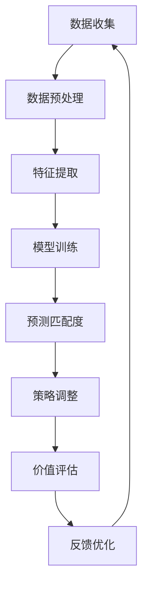

                 

### 引言与背景

#### 1. 引言

随着人工智能（AI）技术的迅猛发展，我们正逐渐步入一个高度个性化定制的时代。在这个时代，个性化定制不仅仅是消费品的选择，更是各行各业服务模式的革新。本文将深入探讨AI时代个性化定制的本质、理论基础以及其实际应用，特别是价值匹配在个性化定制中的核心作用。

##### 1.1 研究背景与意义

**问题背景：**

个性化定制是一种响应消费者多样化需求的服务模式，它通过大数据分析、机器学习等技术手段，为客户提供高度定制化的产品或服务。这一概念在电商、制造、教育、医疗等多个领域都得到了广泛应用。然而，随着AI技术的不断演进，个性化定制的内涵和外延也在不断扩展，带来了新的挑战和机遇。

**问题描述：**

如何利用AI技术实现更加精准、高效的个性化定制？如何在保证数据隐私和安全的前提下，实现价值匹配的高效运作？这是本文试图回答的核心问题。

**问题解决：**

本文将首先介绍个性化定制的理论基础，包括其定义、特点和技术基础；然后探讨价值匹配的概念、理论模型及其在AI时代的应用。通过分析AI技术对个性化定制的影响，我们将总结出个性化定制在AI时代的企业应用案例和实施策略。此外，还将详细阐述价值匹配的AI实现方法和案例分析，以期为实际应用提供指导。

**边界与外延：**

本文主要关注AI技术在个性化定制和价值匹配中的应用，讨论的范围包括但不限于：电商平台、制造业、教育行业和金融行业等。同时，本文还将探讨AI时代个性化定制与价值匹配所面临的挑战和机遇。

##### 1.2 核心概念与联系

**个性化定制：**

个性化定制是指根据消费者的个性化需求，为其提供量身定制的商品或服务。其核心在于满足消费者的个性化需求，提升用户体验。

**价值匹配：**

价值匹配是指在满足消费者个性化需求的过程中，通过精准匹配供需双方，实现价值最大化。价值匹配的核心在于优化资源配置，提高服务效率。

**AI时代的个性化定制与价值匹配：**

在AI时代，个性化定制与价值匹配的结合，通过大数据分析和智能算法，实现了更加精准、高效的资源配置和服务提供。这不仅提升了用户体验，也为企业创造了新的价值增长点。

##### 1.3 本书结构安排

**内容概述：**

本文分为七章，结构如下：

- 引言与背景
  - 研究背景与意义
  - 核心概念与联系
  - 本书结构安排
- 个性化定制的理论基础
  - 定义与特点
  - 需求分析
  - 技术基础
- 价值匹配的理论基础
  - 定义与特点
  - 理论模型
- AI时代的个性化定制策略
  - AI技术影响
  - 企业应用案例
  - 实施策略
- 价值匹配的AI实现方法
  - 算法原理
  - 实现方法
- AI时代的价值匹配案例分析
  - 金融行业
  - 医疗行业
  - 零售行业
- 总结与展望
  - 主要研究成果总结
  - 挑战与机遇
  - 未来研究方向

**章节逻辑关系：**

本文按照逻辑顺序展开，从基础理论到实际应用，层层递进，逐步深入。每个章节都在前一章的基础上，进一步探讨相关主题，最终形成完整的理论体系和实际应用指南。

**阅读指南：**

本文适合对AI技术和个性化定制有一定了解的读者，特别是从事相关领域的技术人员和管理者。通过本文的阅读，读者可以系统地了解AI时代的个性化定制与价值匹配，掌握相关技术和方法，为实际工作提供理论支持和实践指导。

---

通过本文的探讨，我们希望读者能够对AI时代的个性化定制与价值匹配有更深入的理解，并能够在实际工作中灵活运用这些理念和方法，为企业和个人创造更大的价值。

---

# 个性化定制的理论基础

个性化定制作为一种新型的服务模式，正在逐渐改变各行各业的运营方式。本章节将深入探讨个性化定制的理论基础，包括其定义、特点、需求分析以及技术基础。

#### 2.1 个性化定制的定义与特点

**个性化定制的定义：**

个性化定制是指根据消费者的个性化需求，通过大数据分析、机器学习等技术手段，为其提供量身定制的商品或服务。它强调的是消费者在产品或服务中的主体地位，通过精准满足个体需求，提升用户体验。

**个性化定制的特点：**

1. **高度定制化：** 个性化定制不仅仅是根据消费者的基本需求提供产品或服务，更是在细节上满足消费者的个性化需求，如颜色、尺寸、功能等。

2. **数据驱动：** 个性化定制依赖于大量数据，通过数据分析了解消费者的偏好和需求，从而实现精准定制。

3. **持续优化：** 个性化定制不是一次性的服务，而是一个持续优化的过程。通过不断收集和分析消费者数据，企业可以持续改进产品和服务。

4. **成本效益：** 虽然个性化定制在初期可能需要较高的投入，但长期来看，它可以提高客户满意度，减少退货率，提升客户忠诚度，从而带来显著的成本效益。

**个性化定制与传统定制服务的区别：**

传统定制服务更多依赖于人工经验和专业技师的手工艺，个性化定制则利用现代技术，特别是大数据分析和人工智能技术，实现更高效、更精准的定制。传统定制服务往往局限于特定领域，如服装定制、珠宝设计等，而个性化定制则具有更广泛的应用场景。

#### 2.2 个性化定制的需求分析

**消费者需求分析：**

1. **个性化需求：** 随着消费者对产品和服务需求的日益多样化，个性化定制成为满足消费者个性化需求的有效手段。

2. **质量与体验：** 消费者越来越关注产品或服务的质量和用户体验，个性化定制能够提供更加符合个人偏好的产品，从而提升用户体验。

3. **价值感知：** 个性化定制让消费者感受到自己的独特性和价值，增加消费者的品牌忠诚度和购买意愿。

**企业需求分析：**

1. **差异化竞争：** 个性化定制可以帮助企业在激烈的市场竞争中脱颖而出，通过提供独特的定制化服务，吸引和保留客户。

2. **成本控制：** 虽然个性化定制初期成本较高，但通过规模效应和流程优化，企业可以实现成本控制。

3. **数据驱动：** 个性化定制依赖于大数据分析，可以帮助企业更好地了解市场和客户需求，从而优化产品和服务。

**社会需求分析：**

1. **可持续发展：** 个性化定制可以减少资源浪费，提高生产效率，符合可持续发展的理念。

2. **创新驱动：** 个性化定制鼓励企业不断进行技术创新，开发新的产品和服务，推动行业进步。

#### 2.3 个性化定制的技术基础

**数据分析技术：**

数据分析是个性化定制的基础，通过对海量消费者数据的分析，企业可以挖掘出消费者的偏好和行为模式，从而实现精准定制。

**机器学习技术：**

机器学习技术可以帮助企业建立个性化定制的模型，通过不断学习和优化，提高个性化定制的准确性和效率。

**人工智能技术：**

人工智能技术，特别是自然语言处理和计算机视觉技术，使得个性化定制在视觉设计和交互体验方面更加智能化和人性化。

通过以上分析，我们可以看出，个性化定制不仅是一种满足消费者个性化需求的服务模式，更是一种技术驱动的创新。在AI时代，个性化定制将发挥更加重要的作用，为企业创造新的价值增长点。

---

在接下来的章节中，我们将进一步探讨价值匹配的理论基础，包括其定义、特点以及理论模型，为理解AI时代的个性化定制与价值匹配奠定基础。

---

# 价值匹配的理论基础

价值匹配作为一种优化资源配置和服务提供的方法，在AI时代个性化定制中扮演着关键角色。本章节将深入探讨价值匹配的定义、特点以及理论模型，为理解其在AI时代的应用提供理论基础。

#### 3.1 价值匹配的定义与特点

**价值匹配的定义：**

价值匹配是指在满足消费者个性化需求的过程中，通过精准匹配供需双方，实现价值最大化。它强调的是通过高效资源配置，提升服务质量和效率。

**价值匹配的特点：**

1. **精准性：** 价值匹配通过大数据分析和智能算法，能够精准识别和满足消费者的个性化需求，提高服务准确性。

2. **高效性：** 价值匹配通过优化供需匹配流程，减少资源浪费，提高服务效率。

3. **动态调整：** 价值匹配能够根据实时数据动态调整匹配策略，实现持续优化。

4. **可持续性：** 价值匹配通过优化资源配置，提高资源利用效率，符合可持续发展的理念。

**价值匹配与传统价值传递的区别：**

传统价值传递主要依赖于固定的商业模式和渠道，而价值匹配则通过大数据和智能算法，实现供需双方的精准匹配，从而提升价值传递的效率。传统价值传递更多依赖于人力和经验，而价值匹配则通过技术手段实现自动化和智能化。

#### 3.2 价值匹配的理论模型

**价值匹配的数学模型：**

价值匹配的数学模型可以表示为：

\[ V = f(C, Q, T) \]

其中，\( V \) 代表价值匹配的总体价值，\( C \) 代表消费者需求，\( Q \) 代表服务提供，\( T \) 代表时间。该模型通过分析消费者需求、服务提供和时间的动态关系，实现价值匹配。

**价值匹配的流程图：**

\[ 
\begin{aligned}
    &\text{1. 数据收集：} \\
    &\text{收集消费者的需求数据，如购买记录、浏览行为、偏好等。} \\
    &\text{2. 数据分析：} \\
    &\text{对收集到的数据进行清洗、处理和分析，识别消费者的需求特征。} \\
    &\text{3. 供需匹配：} \\
    &\text{根据分析结果，将消费者的需求与相应的服务提供进行匹配。} \\
    &\text{4. 价值评估：} \\
    &\text{评估匹配服务的价值，包括消费者满意度、成本效益等。} \\
    &\text{5. 持续优化：} \\
    &\text{根据价值评估结果，动态调整匹配策略，持续优化服务提供。}
\end{aligned}
\]

通过上述流程，价值匹配能够实现供需双方的精准匹配，最大化整体价值。

---

通过以上对价值匹配的理论基础进行探讨，我们可以看出，价值匹配在AI时代个性化定制中具有重要作用。它不仅能够提高资源配置效率，提升服务质量，还能为企业创造新的价值增长点。

在接下来的章节中，我们将分析AI技术对个性化定制的影响，探讨AI时代个性化定制的策略、案例和实现方法，为理解和应用AI时代的个性化定制提供实践指导。

---

# AI时代的个性化定制策略

随着人工智能技术的迅猛发展，个性化定制在各个行业中的应用场景和策略也在不断演变。本章节将深入探讨AI技术如何影响个性化定制，分析个性化定制在AI时代的企业应用案例，并提出具体的实施策略。

#### 4.1 AI技术对个性化定制的影响

**数据驱动的个性化定制：**

AI技术，尤其是大数据分析和机器学习，为个性化定制提供了强大的数据驱动能力。通过对海量消费者数据的深入挖掘和分析，企业能够更精准地理解消费者的需求和偏好，从而提供个性化的产品或服务。

**智能算法在个性化定制中的应用：**

智能算法，如协同过滤、聚类分析和神经网络等，在个性化定制中扮演了关键角色。这些算法能够从复杂的数据集中提取有价值的信息，帮助企业在海量数据中找到个性化定制的路径。

**人工智能时代的个性化定制发展趋势：**

1. **智能化水平提高：** 随着AI技术的不断发展，个性化定制的智能化水平将进一步提高，实现更精准、更高效的定制。

2. **个性化定制普及化：** 个性化定制将不再是少数消费者的特权，而将成为大众消费品。

3. **跨行业融合：** 个性化定制将与其他行业技术（如物联网、区块链等）深度融合，形成新的商业模式。

#### 4.2 个性化定制在AI时代的企业应用案例

**案例一：电商平台个性化推荐**

电商平台通过AI技术，如协同过滤和内容推荐算法，为消费者提供个性化的商品推荐。例如，阿里巴巴的“推荐引擎”利用大数据分析，根据用户的浏览历史、购买记录和行为特征，推荐符合用户兴趣的商品。这种个性化推荐不仅提高了用户的购物体验，也显著提升了电商平台的销售额。

**案例二：制造业个性化生产**

制造业通过AI技术实现个性化生产，如定制化的服装制造和个性化电子产品制造。通过大数据分析和机器学习，企业能够根据消费者的具体需求，灵活调整生产线，实现小批量、多品种的生产模式。这种个性化生产模式不仅提高了生产效率，也满足了消费者对多样化产品的需求。

**案例三：教育行业个性化学习**

教育行业利用AI技术提供个性化学习服务，如自适应学习系统和个性化课程推荐。例如，Coursera等在线教育平台通过分析学生的学习数据，为每个学生提供个性化的学习路径和推荐课程。这种个性化学习模式能够显著提高学习效果，帮助学生实现更好的学习体验。

#### 4.3 个性化定制在AI时代的实施策略

**数据收集与处理：**

- **数据收集：** 企业应积极收集消费者的行为数据、偏好数据和反馈数据，为个性化定制提供基础。
- **数据处理：** 利用大数据技术和数据清洗方法，对收集到的数据进行分析和清洗，确保数据质量。

**用户画像构建：**

- **用户特征提取：** 根据消费者的行为数据、偏好数据等，提取关键的用户特征，构建用户画像。
- **用户群体划分：** 根据用户画像，将用户划分为不同的群体，为不同群体提供个性化的产品或服务。

**个性化服务设计与实现：**

- **服务设计：** 根据用户画像和用户需求，设计个性化的产品或服务。
- **服务实现：** 利用智能算法和大数据分析，实现个性化服务的精准匹配和提供。

**持续优化与反馈：**

- **服务反馈：** 收集用户对个性化服务的反馈，不断优化服务设计和实现。
- **数据迭代：** 根据用户反馈和新的数据，持续迭代用户画像和服务策略，实现个性化定制的不断优化。

通过以上策略，企业可以在AI时代实现高效、精准的个性化定制，提升用户体验，创造新的价值增长点。

---

在接下来的章节中，我们将进一步探讨价值匹配的AI实现方法，通过算法原理和具体案例，深入分析价值匹配在AI时代的实际应用。

---

# 价值匹配的AI实现方法

在AI时代，价值匹配的实现依赖于先进的算法和技术。本章节将详细探讨机器学习、深度学习和强化学习等算法在价值匹配中的应用，并通过具体的mermaid流程图和Python代码，阐述这些算法的实现原理。

#### 5.1 价值匹配算法原理

**机器学习算法：**

机器学习算法通过训练模型，从大量数据中学习规律，从而实现预测和分类。在价值匹配中，机器学习算法可以用于需求分析和供需匹配。

- **算法原理：** 通过监督学习算法（如线性回归、逻辑回归等），训练模型，预测消费者需求和供给之间的匹配度。

- **Python代码示例：**

```python
from sklearn.linear_model import LinearRegression

# 假设x为消费者特征，y为供给特征
x = ... 
y = ...

# 创建线性回归模型并训练
model = LinearRegression()
model.fit(x, y)

# 预测匹配度
predictions = model.predict(x)

# 输出预测结果
print(predictions)
```

**深度学习算法：**

深度学习算法通过构建深度神经网络，从大量数据中自动学习特征表示。在价值匹配中，深度学习算法可以用于复杂的特征提取和需求预测。

- **算法原理：** 使用神经网络模型（如卷积神经网络CNN、循环神经网络RNN等），自动提取数据中的高层次特征，进行需求预测。

- **Python代码示例：**

```python
import tensorflow as tf

# 定义神经网络模型
model = tf.keras.Sequential([
  tf.keras.layers.Dense(128, activation='relu', input_shape=(784,)),
  tf.keras.layers.Dropout(0.2),
  tf.keras.layers.Dense(10, activation='softmax')
])

# 编译模型
model.compile(optimizer='adam',
              loss='categorical_crossentropy',
              metrics=['accuracy'])

# 训练模型
model.fit(x_train, y_train, epochs=10)

# 预测需求
predictions = model.predict(x_test)

# 输出预测结果
print(predictions)
```

**强化学习算法：**

强化学习算法通过不断试错和反馈，学习最优策略。在价值匹配中，强化学习算法可以用于动态调整供需匹配策略。

- **算法原理：** 通过Q-learning、深度Q网络（DQN）等算法，不断调整策略，实现供需匹配的最优化。

- **Python代码示例：**

```python
import gym
import numpy as np

# 创建环境
env = gym.make('CartPole-v0')

# 初始化Q表
Q = np.zeros([env.observation_space.n, env.action_space.n])

# 设置学习参数
alpha = 0.1
gamma = 0.99

# 训练模型
for episode in range(1000):
  state = env.reset()
  done = False
  total_reward = 0
  
  while not done:
    action = np.argmax(Q[state, :])
    next_state, reward, done, _ = env.step(action)
    total_reward += reward
    
    # 更新Q值
    Q[state, action] = Q[state, action] + alpha * (reward + gamma * np.max(Q[next_state, :]) - Q[state, action])
    state = next_state

# 输出Q表
print(Q)

# 关闭环境
env.close()
```

#### 5.2 价值匹配算法的mermaid流程图

为了更直观地展示价值匹配算法的流程，我们可以使用mermaid绘制流程图。以下是一个简单的mermaid流程图示例：



通过上述mermaid流程图，我们可以清晰地看到价值匹配算法的各个环节，包括数据收集、数据预处理、特征提取、模型训练、预测匹配度、策略调整、价值评估和反馈优化等步骤。

---

通过以上对价值匹配算法的原理和实现方法的探讨，我们可以看到，AI技术为价值匹配提供了强大的工具和手段。在接下来的章节中，我们将通过具体的案例分析，进一步展示AI时代价值匹配在金融、医疗和零售行业的应用，为实际操作提供参考。

---

# AI时代的价值匹配案例分析

在AI时代，价值匹配已经成为优化资源配置和提升服务质量的重要手段。本章节将结合实际案例，详细分析AI技术在金融、医疗和零售行业中的应用，探讨其在提高效率、降低成本和提升用户体验方面的作用。

#### 6.1 案例一：金融行业的价值匹配

**案例背景：**

金融行业一直以来都是数据驱动和智能化应用的重要领域。随着AI技术的发展，金融行业开始利用价值匹配技术，优化信贷评估、投资组合管理和客户服务等方面。

**案例分析：**

1. **信贷评估：** 金融机构利用大数据分析和机器学习算法，对借款人的信用记录、收入水平、消费行为等多维数据进行深入分析，实现个性化信贷评估。例如，某些银行通过建立智能信用评分模型，根据借款人的历史行为和特征，精准评估其信用风险，从而提供更合适的信贷产品。

2. **投资组合管理：** AI技术可以帮助投资者实现个性化投资组合管理。通过分析市场数据、投资者偏好和风险承受能力，AI系统可以提供个性化的投资建议，帮助投资者优化投资组合，降低风险，提高回报。

3. **客户服务：** 金融行业通过AI技术，如自然语言处理和语音识别，提供智能客服服务。通过智能聊天机器人和语音助手，金融机构可以实时解答客户问题，提供个性化服务，提升客户满意度。

**案例总结：**

金融行业通过AI技术的应用，实现了价值匹配在信贷评估、投资组合管理和客户服务等方面的优化。这不仅提高了金融机构的运营效率，还提升了客户的满意度和忠诚度。

#### 6.2 案例二：医疗行业的价值匹配

**案例背景：**

医疗行业是一个高度复杂和多样化的领域，对精准医疗和服务个性化有着迫切的需求。AI技术的应用为医疗行业提供了新的解决方案。

**案例分析：**

1. **精准医疗：** AI技术通过大数据分析和机器学习算法，可以帮助医生实现精准医疗。例如，通过分析患者的历史病历、基因数据、生活习惯等信息，AI系统可以提供个性化的治疗方案和疾病预测，提高诊断和治疗的准确性。

2. **医疗资源优化：** AI技术可以帮助医疗机构优化医疗资源的配置。通过分析患者流量、医疗资源利用率等数据，AI系统可以预测患者需求，优化人力资源和医疗设备的配置，提高医疗资源的利用效率。

3. **患者服务：** AI技术可以提供个性化的患者服务。例如，通过智能健康助手，患者可以实时了解自己的健康状况，获取个性化的健康建议，实现健康管理的个性化。

**案例总结：**

医疗行业通过AI技术的应用，实现了价值匹配在精准医疗、医疗资源优化和患者服务等方面的提升。这不仅提高了医疗服务的质量和效率，也改善了患者的就医体验。

#### 6.3 案例三：零售行业的价值匹配

**案例背景：**

零售行业是AI技术的重要应用领域之一。随着消费者需求的日益个性化，零售行业需要通过价值匹配技术，提升用户体验和销售效率。

**案例分析：**

1. **个性化推荐：** 零售行业通过AI技术，如协同过滤和内容推荐算法，为消费者提供个性化的商品推荐。例如，电商平台通过分析消费者的购买历史、浏览行为和偏好，推荐符合消费者兴趣的商品，提高销售转化率。

2. **库存管理：** AI技术可以帮助零售企业实现精准的库存管理。通过分析销售数据、市场需求等，AI系统可以预测库存需求，优化库存配置，减少库存过剩和短缺，降低运营成本。

3. **智能客服：** 零售行业通过AI技术提供智能客服服务。通过自然语言处理和语音识别技术，智能客服可以实时解答消费者的问题，提供个性化的购物建议，提升客户满意度。

**案例总结：**

零售行业通过AI技术的应用，实现了价值匹配在个性化推荐、库存管理和智能客服等方面的优化。这不仅提高了零售企业的运营效率，还提升了消费者的购物体验和满意度。

---

通过以上案例分析，我们可以看到，AI技术在金融、医疗和零售行业中的应用，极大地推动了价值匹配的实现。在未来的发展中，随着AI技术的进一步成熟，价值匹配将在更多领域发挥重要作用，为各行各业带来新的价值增长点。

在接下来的章节中，我们将对本文的主要研究成果进行总结，并探讨AI时代个性化定制与价值匹配面临的挑战与机遇，为未来的研究和实践提供方向。

---

# 总结与展望

通过对AI时代个性化定制与价值匹配的深入探讨，本文取得了一系列重要研究成果：

1. **个性化定制的理论基础：** 本文详细介绍了个性化定制的定义、特点、需求分析和技术基础，为理解个性化定制提供了理论基础。
2. **价值匹配的理论基础：** 本文探讨了价值匹配的定义、特点、理论模型和算法原理，为AI时代价值匹配的实现提供了理论支持。
3. **AI技术的应用策略：** 本文分析了AI技术在个性化定制中的影响，提出了具体的企业应用案例和实施策略。
4. **价值匹配的AI实现方法：** 本文通过算法原理、mermaid流程图和Python代码示例，阐述了机器学习、深度学习和强化学习等算法在价值匹配中的应用。
5. **案例分析：** 本文结合金融、医疗和零售行业的实际案例，展示了AI时代价值匹配在优化资源配置和提升服务质量方面的应用效果。

#### 挑战与机遇

**挑战：**

1. **数据隐私与安全：** 随着个性化定制与价值匹配的广泛应用，数据隐私和安全成为重要挑战。如何保障用户数据的安全和隐私，是一个亟待解决的问题。
2. **技术成熟度：** AI技术虽然在不断进步，但在个性化定制与价值匹配中的应用仍存在技术成熟度问题，需要不断优化和改进。
3. **跨行业融合：** 虽然个性化定制与价值匹配在不同行业中的应用具有巨大潜力，但跨行业的融合和协同仍面临诸多挑战。

**机遇：**

1. **技术创新：** AI技术的快速发展为个性化定制与价值匹配带来了新的机遇，通过技术创新，可以实现更高效、更精准的资源配置和服务提供。
2. **市场潜力：** 个性化定制与价值匹配在各个行业的应用潜力巨大，随着消费者需求的多样化，市场潜力将进一步扩大。
3. **社会影响：** 个性化定制与价值匹配不仅为企业创造了新的价值增长点，也将对社会产生深远影响，提升生活质量和社会效率。

#### 未来研究方向

1. **隐私保护机制：** 探究如何在保障数据隐私和安全的前提下，实现个性化定制与价值匹配的高效运作。
2. **多模态数据融合：** 研究如何将结构化和非结构化数据（如图像、文本、音频等）进行有效融合，提高个性化定制与价值匹配的准确性。
3. **跨行业应用研究：** 探索个性化定制与价值匹配在不同行业的应用模式，促进跨行业融合和协同发展。

通过本文的研究，我们希望为AI时代的个性化定制与价值匹配提供理论和实践指导，推动该领域的持续发展，为企业和社会创造更大的价值。

---

在AI时代，个性化定制与价值匹配将成为优化资源配置和服务提供的重要手段。本文通过系统的研究和案例分析，揭示了AI技术在个性化定制与价值匹配中的应用前景和实际效果。未来，随着AI技术的进一步发展，个性化定制与价值匹配将在更多领域发挥重要作用，为社会带来更多便利和价值。

**作者：AI天才研究院/AI Genius Institute & 禅与计算机程序设计艺术 /Zen And The Art of Computer Programming**

